# Capítulo 1: Encadeamento de Prompts - Conteúdo Complementar Avançado

## Analogias do Mundo Real: Prompt Chaining como Arquitetura de Software

### 1. Programação Modular e o Princípio da Responsabilidade Única (SRP)

O encadeamento de prompts segue diretamente o **Princípio da Responsabilidade Única** da programação orientada a objetos. Cada prompt em uma cadeia deve ter uma única razão para mudar - uma única responsabilidade bem definida.

**Analogia com Funções de Software:**
```python
# ❌ Função monolítica (equivalente a prompt único)
def processar_relatorio_completo(texto):
    # Extrai dados, analisa tendências, gera email, valida resultados
    # Múltiplas responsabilidades = alta complexidade
    pass

# ✅ Funções modulares (equivalente a prompt chaining)
def extrair_dados(texto): pass
def analisar_tendencias(dados): pass  
def gerar_email(tendencias): pass
def validar_resultado(email): pass
```

**Aplicação em Prompt Chaining:**
- **Prompt 1 (Extrator)**: Responsabilidade única de extrair dados estruturados
- **Prompt 2 (Analista)**: Responsabilidade única de identificar padrões
- **Prompt 3 (Gerador)**: Responsabilidade única de criar conteúdo
- **Prompt 4 (Validador)**: Responsabilidade única de verificar qualidade

### 2. Pipelines de CI/CD: Fluxo de Dados e Controle de Qualidade

O encadeamento de prompts é análogo aos pipelines de CI/CD, onde cada estágio processa a saída do anterior e adiciona valor incremental.

**Pipeline de CI/CD Tradicional:**
```
Código → Build → Test → Deploy → Monitor
```

**Pipeline de Prompt Chaining:**
```
Input → Extract → Analyze → Generate → Validate → Output
```

### Diagrama: Comparação de Pipelines

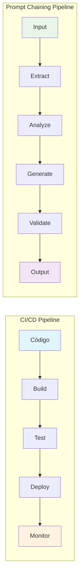

**Controle de Qualidade em Cada Estágio:**
- **Build Stage**: Validação de sintaxe e estrutura
- **Test Stage**: Verificação de lógica e completude
- **Deploy Stage**: Aplicação de regras de negócio
- **Monitor Stage**: Feedback e correção de erros

## Gerenciamento Avançado de Estado e Memória em Agentes

### Arquitetura de Estado Distribuído

Agentes sofisticados requerem gerenciamento de estado que vai além do simples encadeamento linear. Implementamos um sistema de memória distribuída:

### Diagrama: Arquitetura de Memória Distribuída

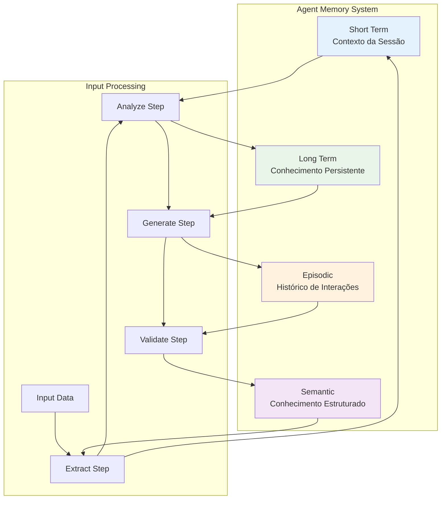

```python
class AgentMemory:
    def __init__(self):
        self.short_term = {}  # Contexto da sessão atual
        self.long_term = {}   # Conhecimento persistente
        self.episodic = []    # Histórico de interações
        self.semantic = {}    # Conhecimento estruturado
    
    def update_state(self, step_output, step_type):
        # Atualiza diferentes tipos de memória baseado no tipo de passo
        if step_type == "extraction":
            self.semantic["entities"] = step_output
        elif step_type == "analysis":
            self.short_term["insights"] = step_output
        elif step_type == "generation":
            self.episodic.append(step_output)
```

### Exemplo Prático: Agente de Refatoração de Código

```python
class CodeRefactoringAgent:
    def __init__(self):
        self.memory = AgentMemory()
        self.error_history = []
        self.patterns_learned = {}
    
    def refactor_chain(self, code_input):
        # Passo 1: Análise inicial
        analysis = self.analyze_code(code_input)
        self.memory.update_state(analysis, "analysis")
        
        # Passo 2: Identificação de problemas
        issues = self.identify_issues(analysis)
        self.memory.update_state(issues, "issues")
        
        # Passo 3: Refatoração
        refactored = self.refactor_code(code_input, issues)
        
        # Passo 4: Validação e correção iterativa
        while not self.validate_code(refactored):
            errors = self.get_validation_errors(refactored)
            self.error_history.append(errors)
            refactored = self.correct_errors(refactored, errors)
            # Aprende padrões de erro para futuras iterações
            self.learn_error_patterns(errors)
        
        return refactored
```

## Conditional Prompting e Self-Correction

### Sistema de Ramificação Condicional

Implementamos um sistema onde prompts subsequentes são determinados dinamicamente baseado na saída de prompts anteriores:

### Diagrama: Fluxo Condicional de Prompts

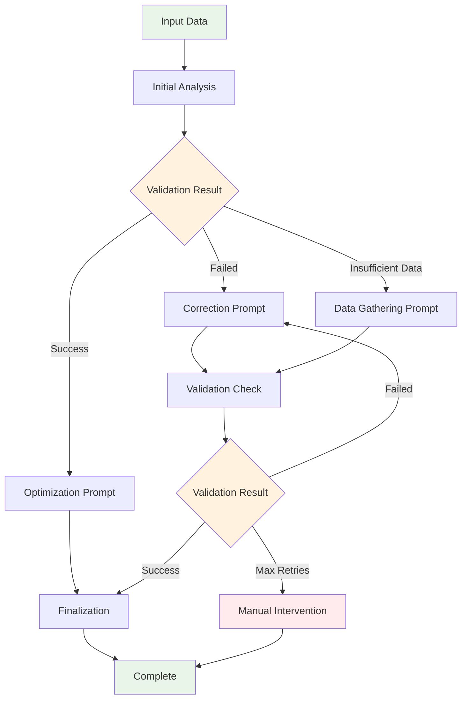

```python
class ConditionalPromptChain:
    def __init__(self):
        self.decision_tree = {
            "validation_failed": "correction_prompt",
            "validation_passed": "optimization_prompt",
            "insufficient_data": "data_gathering_prompt",
            "complete": "finalization_prompt"
        }
    
    def execute_chain(self, input_data):
        current_step = "initial_analysis"
        context = {"input": input_data}
        
        while current_step != "complete":
            # Executa prompt baseado no estado atual
            result = self.execute_prompt(current_step, context)
            
            # Determina próximo passo baseado no resultado
            next_step = self.determine_next_step(result, current_step)
            
            # Atualiza contexto para próximo passo
            context.update({current_step: result})
            current_step = next_step
            
        return context["finalization"]
```

### Exemplo: Sistema de Análise de Documentos com Auto-correção

```python
def document_analysis_chain(document):
    # Passo 1: Extração inicial
    extracted_data = extract_entities(document)
    
    # Passo 2: Validação condicional
    if validate_completeness(extracted_data):
        # Caminho de sucesso
        analysis = analyze_entities(extracted_data)
        return generate_report(analysis)
    else:
        # Caminho de correção
        missing_fields = identify_missing_fields(extracted_data)
        enhanced_extraction = re_extract_with_focus(document, missing_fields)
        
        # Validação recursiva
        if validate_completeness(enhanced_extraction):
            analysis = analyze_entities(enhanced_extraction)
            return generate_report(analysis)
        else:
            # Fallback para processamento manual
            return request_human_intervention(enhanced_extraction)
```

## Frameworks Avançados: LangGraph e Arquiteturas de Grafo

### Implementação com LangGraph para Fluxos Complexos

LangGraph permite criar grafos de execução onde prompts podem ter dependências complexas e loops condicionais:

### Diagrama: Grafo de Execução LangGraph

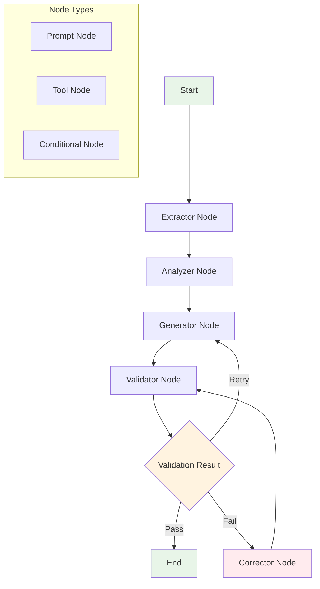

```python
from langgraph.graph import StateGraph, END
from typing import TypedDict, List

class AgentState(TypedDict):
    input_text: str
    extracted_data: dict
    analysis_results: dict
    generated_content: str
    validation_status: str
    error_count: int

def create_advanced_chain():
    workflow = StateGraph(AgentState)
    
    # Adiciona nós (prompts)
    workflow.add_node("extractor", extract_data_node)
    workflow.add_node("analyzer", analyze_data_node)
    workflow.add_node("generator", generate_content_node)
    workflow.add_node("validator", validate_content_node)
    workflow.add_node("corrector", correct_errors_node)
    
    # Define fluxo condicional
    workflow.add_conditional_edges(
        "validator",
        should_continue,
        {
            "continue": "generator",
            "correct": "corrector", 
            "end": END
        }
    )
    
    # Define fluxo principal
    workflow.add_edge("extractor", "analyzer")
    workflow.add_edge("analyzer", "generator")
    workflow.add_edge("generator", "validator")
    workflow.add_edge("corrector", "validator")
    
    return workflow.compile()

def should_continue(state: AgentState) -> str:
    if state["validation_status"] == "passed":
        return "end"
    elif state["error_count"] < 3:
        return "correct"
    else:
        return "continue"
```

### Sistema de Retry Inteligente com Backoff Exponencial

### Diagrama: Estratégias de Retry

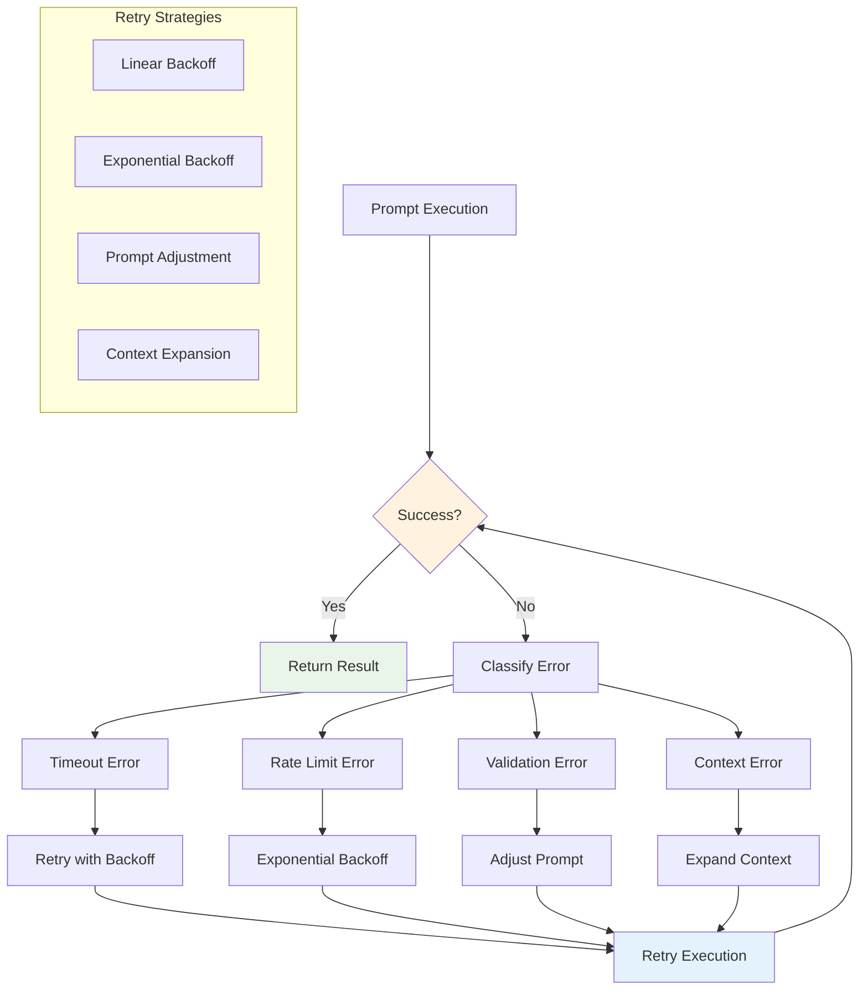

```python
import asyncio
from typing import Optional

class IntelligentRetryChain:
    def __init__(self, max_retries=3, base_delay=1.0):
        self.max_retries = max_retries
        self.base_delay = base_delay
        self.retry_strategies = {
            "timeout": self.retry_with_backoff,
            "rate_limit": self.retry_with_exponential_backoff,
            "validation_error": self.retry_with_prompt_adjustment,
            "context_error": self.retry_with_context_expansion
        }
    
    async def execute_with_retry(self, prompt_func, *args, **kwargs):
        last_error = None
        
        for attempt in range(self.max_retries + 1):
            try:
                result = await prompt_func(*args, **kwargs)
                if self.validate_result(result):
                    return result
                else:
                    raise ValidationError("Result validation failed")
                    
            except Exception as e:
                last_error = e
                error_type = self.classify_error(e)
                
                if attempt < self.max_retries:
                    strategy = self.retry_strategies.get(error_type, self.default_retry)
                    await strategy(attempt, e)
                else:
                    break
        
        raise MaxRetriesExceeded(f"Failed after {self.max_retries} retries: {last_error}")
    
    async def retry_with_prompt_adjustment(self, attempt, error):
        # Ajusta o prompt baseado no erro específico
        adjusted_prompt = self.adjust_prompt_for_error(error)
        await asyncio.sleep(self.base_delay * (2 ** attempt))
        return adjusted_prompt
```

## Otimização de Performance e Caching Inteligente

### Sistema de Cache Hierárquico para Prompts

### Diagrama: Arquitetura de Cache

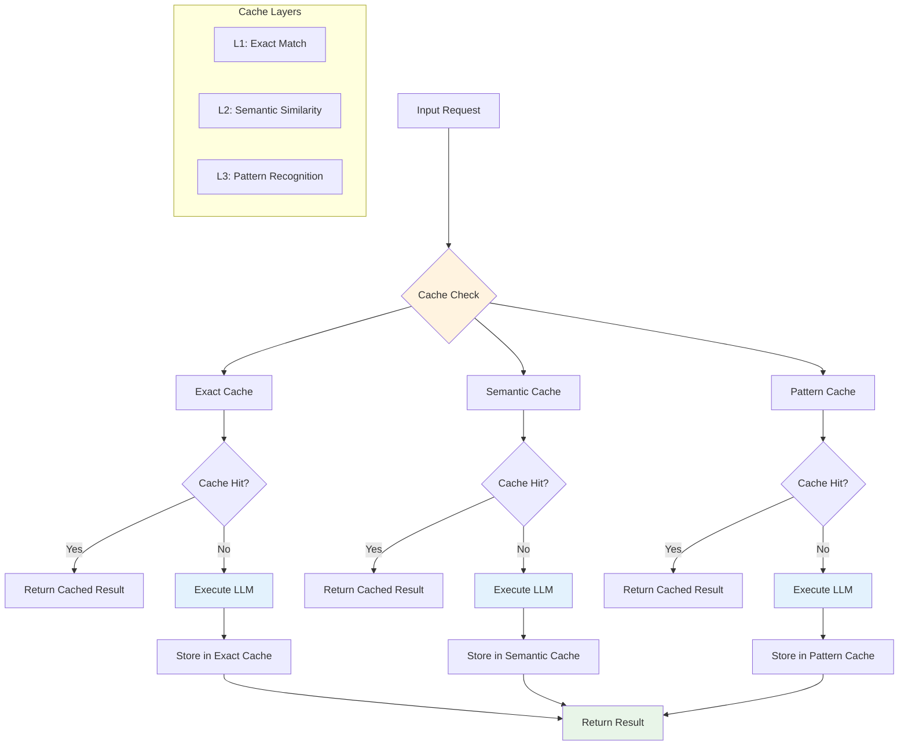

```python
from functools import lru_cache
import hashlib
import json

class PromptCache:
    def __init__(self):
        self.semantic_cache = {}  # Cache baseado em similaridade semântica
        self.exact_cache = {}     # Cache exato para inputs idênticos
        self.pattern_cache = {}   # Cache para padrões reconhecidos
    
    def get_cache_key(self, prompt, context):
        # Gera chave baseada em hash do prompt + contexto
        content = json.dumps({"prompt": prompt, "context": context}, sort_keys=True)
        return hashlib.md5(content.encode()).hexdigest()
    
    def get_cached_result(self, prompt, context):
        cache_key = self.get_cache_key(prompt, context)
        
        # Tenta cache exato primeiro
        if cache_key in self.exact_cache:
            return self.exact_cache[cache_key]
        
        # Tenta cache semântico
        semantic_key = self.find_semantic_match(prompt, context)
        if semantic_key:
            return self.semantic_cache[semantic_key]
        
        return None
    
    def cache_result(self, prompt, context, result):
        cache_key = self.get_cache_key(prompt, context)
        self.exact_cache[cache_key] = result
        
        # Adiciona ao cache semântico se relevante
        if self.is_cacheable_pattern(prompt, context):
            self.semantic_cache[cache_key] = result
```

### Processamento Paralelo de Cadeias Independentes

### Diagrama: Processamento Paralelo

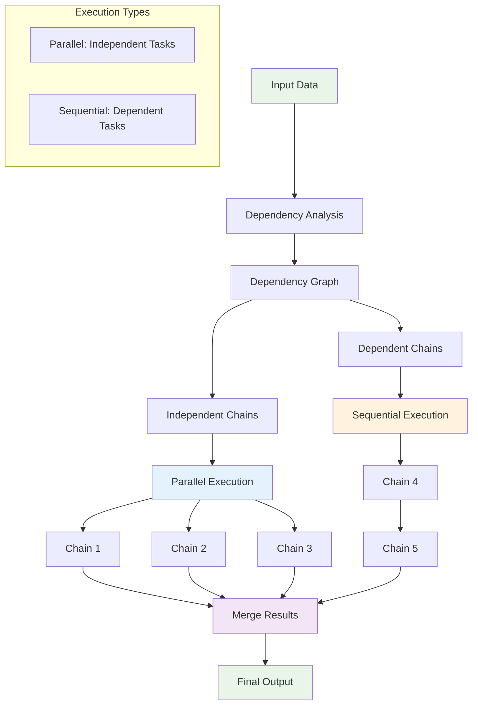

```python
import asyncio
from concurrent.futures import ThreadPoolExecutor

class ParallelPromptProcessor:
    def __init__(self, max_workers=5):
        self.executor = ThreadPoolExecutor(max_workers=max_workers)
    
    async def process_parallel_chains(self, input_data):
        # Identifica cadeias independentes
        independent_chains = self.identify_independent_chains(input_data)
        
        # Executa cadeias em paralelo
        tasks = []
        for chain in independent_chains:
            task = asyncio.create_task(self.execute_chain_async(chain))
            tasks.append(task)
        
        # Aguarda todas as cadeias completarem
        results = await asyncio.gather(*tasks, return_exceptions=True)
        
        # Combina resultados
        return self.merge_parallel_results(results)
    
    def identify_independent_chains(self, data):
        # Análise de dependências para identificar cadeias que podem rodar em paralelo
        dependency_graph = self.build_dependency_graph(data)
        independent_sets = self.find_independent_sets(dependency_graph)
        return independent_sets
```

## Monitoramento e Observabilidade Avançada

### Sistema de Métricas e Logging Estruturado

### Diagrama: Sistema de Monitoramento

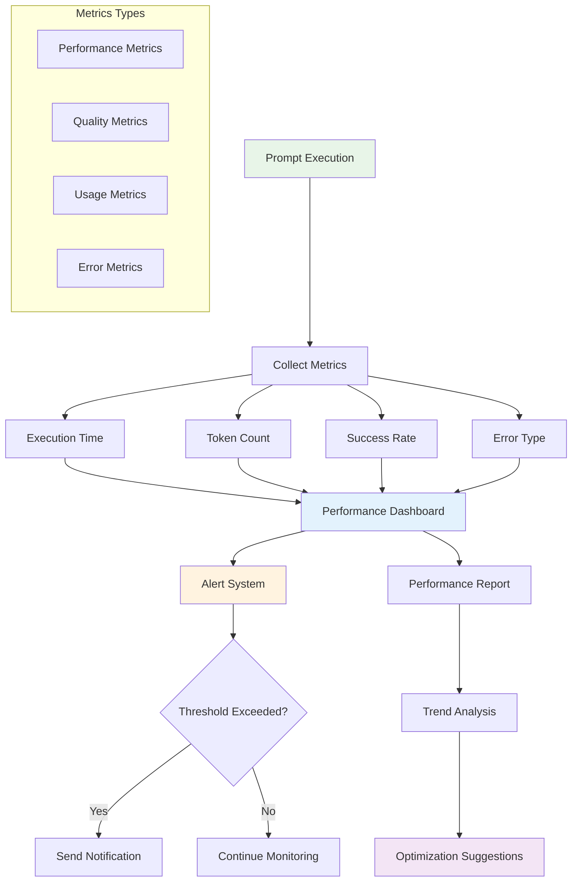

```python
import logging
import time
from dataclasses import dataclass
from typing import Dict, Any

@dataclass
class PromptMetrics:
    prompt_id: str
    execution_time: float
    token_count: int
    success: bool
    error_type: str = None
    retry_count: int = 0
    cache_hit: bool = False

class PromptMonitor:
    def __init__(self):
        self.metrics = []
        self.logger = logging.getLogger("prompt_chain")
        self.setup_structured_logging()
    
    def setup_structured_logging(self):
        handler = logging.StreamHandler()
        formatter = logging.Formatter(
            '%(asctime)s - %(name)s - %(levelname)s - %(message)s'
        )
        handler.setFormatter(formatter)
        self.logger.addHandler(handler)
    
    def log_prompt_execution(self, prompt_id: str, start_time: float, 
                           end_time: float, result: Any, error: Exception = None):
        execution_time = end_time - start_time
        metrics = PromptMetrics(
            prompt_id=prompt_id,
            execution_time=execution_time,
            token_count=self.count_tokens(result),
            success=error is None,
            error_type=type(error).__name__ if error else None
        )
        
        self.metrics.append(metrics)
        
        # Log estruturado
        self.logger.info(
            f"Prompt execution completed",
            extra={
                "prompt_id": prompt_id,
                "execution_time": execution_time,
                "success": metrics.success,
                "error_type": metrics.error_type
            }
        )
    
    def generate_performance_report(self):
        total_executions = len(self.metrics)
        successful_executions = sum(1 for m in self.metrics if m.success)
        avg_execution_time = sum(m.execution_time for m in self.metrics) / total_executions
        
        return {
            "total_executions": total_executions,
            "success_rate": successful_executions / total_executions,
            "average_execution_time": avg_execution_time,
            "error_breakdown": self.get_error_breakdown(),
            "performance_trends": self.analyze_performance_trends()
        }
```

## Casos de Uso Avançados e Padrões de Design

### 1. Sistema de Análise de Sentimentos Multi-Camada

### Diagrama: Pipeline de Análise de Sentimentos

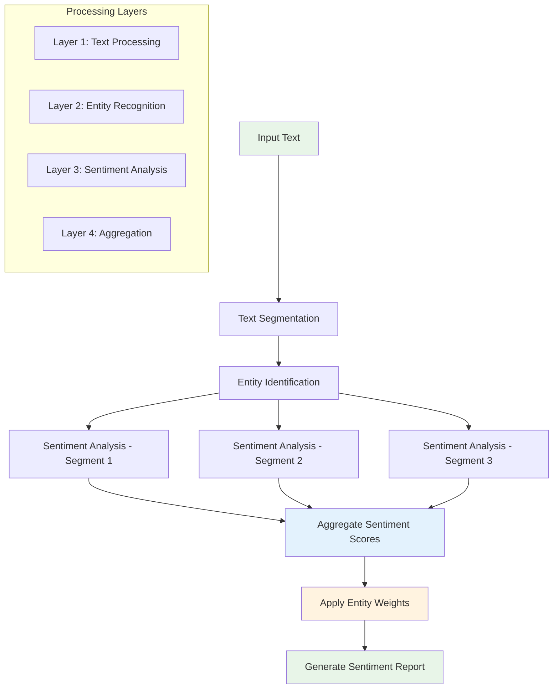

```python
class SentimentAnalysisChain:
    def __init__(self):
        self.chain = self.build_sentiment_chain()
    
    def build_sentiment_chain(self):
        return [
            self.extract_text_segments,      # Segmenta texto em partes
            self.identify_entities,          # Identifica entidades mencionadas
            self.analyze_sentiment_per_segment,  # Análise por segmento
            self.aggregate_sentiment_scores,     # Agregação ponderada
            self.generate_sentiment_report       # Relatório final
        ]
    
    def extract_text_segments(self, text):
        # Divide texto em segmentos lógicos (parágrafos, frases)
        return {"segments": self.split_into_segments(text)}
    
    def identify_entities(self, context):
        # Identifica entidades e seus contextos
        return {
            "segments": context["segments"],
            "entities": self.extract_entities(context["segments"])
        }
    
    def analyze_sentiment_per_segment(self, context):
        # Análise de sentimento para cada segmento
        sentiment_scores = []
        for segment in context["segments"]:
            score = self.analyze_single_segment(segment)
            sentiment_scores.append(score)
        
        return {
            "segments": context["segments"],
            "entities": context["entities"],
            "sentiment_scores": sentiment_scores
        }
```

### 2. Sistema de Geração de Código com Validação Automática

### Diagrama: Pipeline de Geração de Código

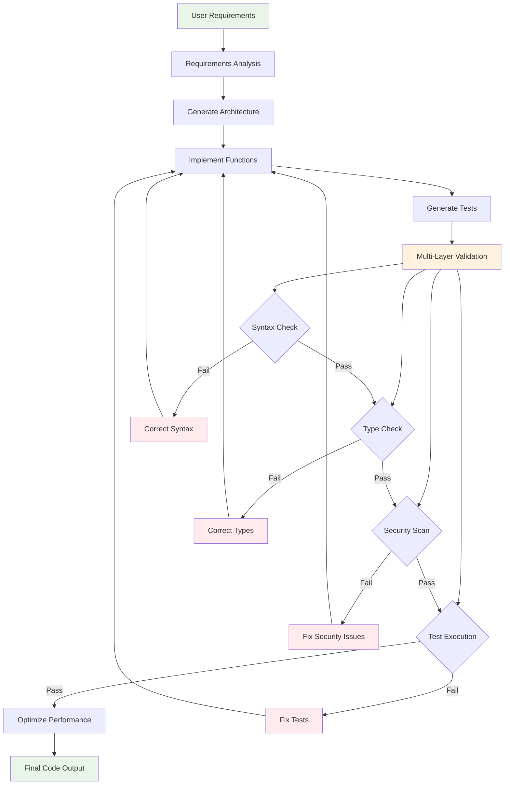

```python
class CodeGenerationChain:
    def __init__(self):
        self.chain = self.build_code_generation_chain()
    
    def build_code_generation_chain(self):
        return [
            self.analyze_requirements,       # Análise de requisitos
            self.generate_architecture,      # Geração de arquitetura
            self.implement_functions,        # Implementação de funções
            self.generate_tests,             # Geração de testes
            self.validate_code,              # Validação de código
            self.optimize_performance        # Otimização
        ]
    
    def analyze_requirements(self, user_input):
        # Analisa requisitos e gera especificação técnica
        return {
            "requirements": self.parse_requirements(user_input),
            "technical_spec": self.generate_technical_spec(user_input)
        }
    
    def validate_code(self, context):
        # Validação multi-camada
        validation_results = {
            "syntax_check": self.check_syntax(context["code"]),
            "type_check": self.check_types(context["code"]),
            "test_execution": self.run_tests(context["tests"]),
            "security_scan": self.security_scan(context["code"])
        }
        
        if not all(validation_results.values()):
            # Retorna para correção
            return self.correct_validation_errors(context, validation_results)
        
        return context
```

## Conclusão: Evolução para Sistemas Agênticos Sofisticados

O encadeamento de prompts representa apenas o primeiro passo na jornada para sistemas de IA verdadeiramente agênticos. As técnicas avançadas apresentadas aqui - gerenciamento de estado distribuído, ramificação condicional, retry inteligente, e monitoramento abrangente - formam a base para agentes que podem:

1. **Aprender e Adaptar**: Sistemas que melhoram continuamente baseado em feedback
2. **Recuperar de Falhas**: Mecanismos robustos de auto-correção e recuperação
3. **Escalar Eficientemente**: Processamento paralelo e caching inteligente
4. **Manter Contexto**: Memória persistente e gerenciamento de estado sofisticado
5. **Monitorar Performance**: Observabilidade completa para otimização contínua

Estes padrões avançados transformam o encadeamento de prompts de uma técnica simples de "dividir e conquistar" em uma arquitetura robusta para sistemas de IA de produção, capazes de lidar com complexidade real e requisitos empresariais rigorosos.

A evolução natural destas técnicas leva ao desenvolvimento de agentes verdadeiramente autônomos que podem planejar, executar, monitorar e adaptar seus comportamentos de forma independente, representando o futuro da interação humano-IA em ambientes complexos e dinâmicos.

### Diagrama: Evolução para Sistemas Agênticos Autônomos

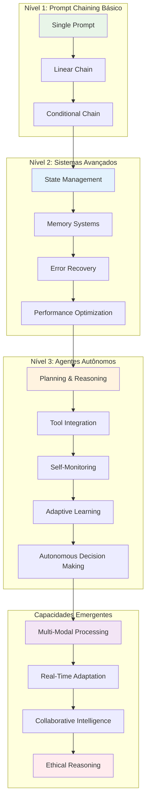
