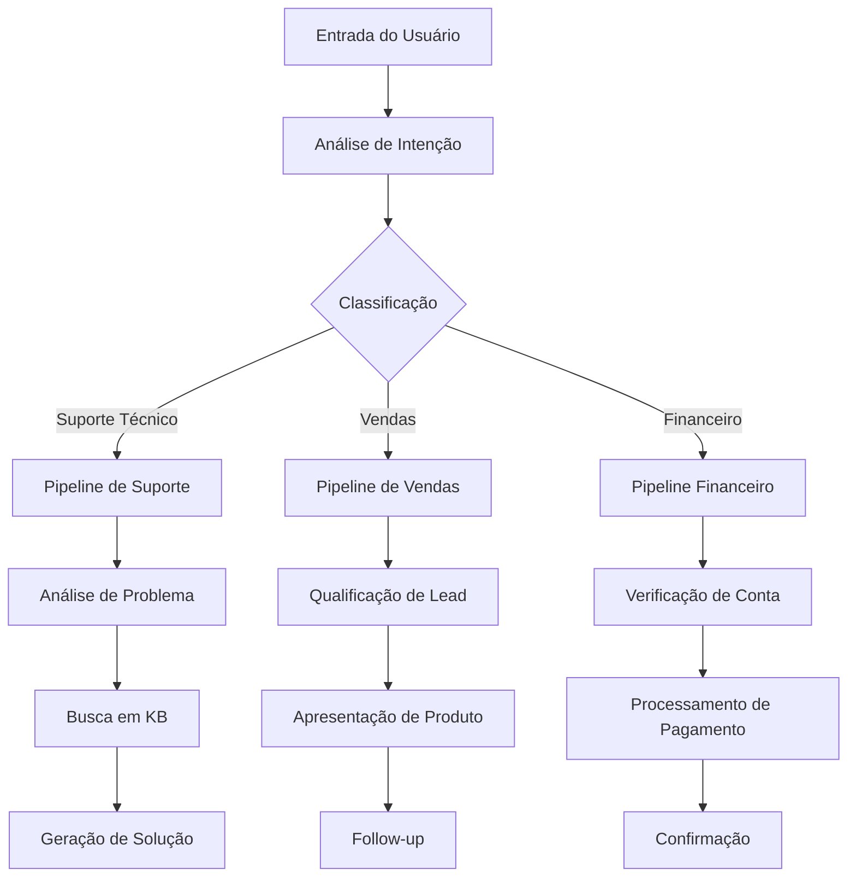
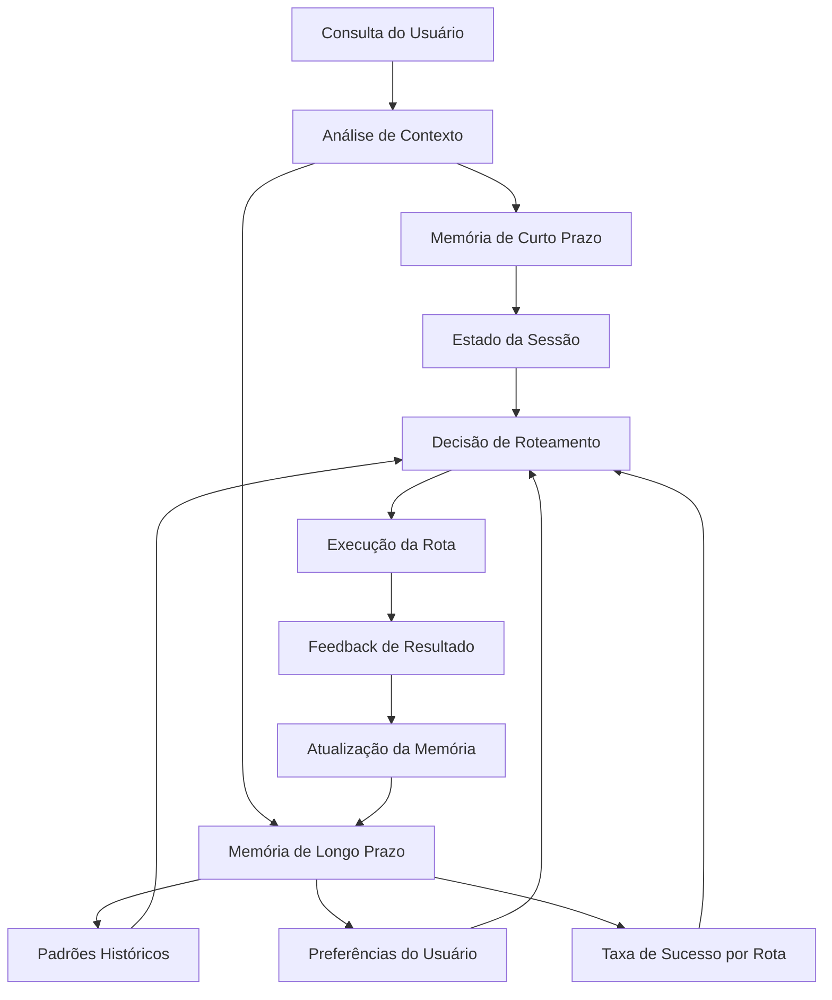
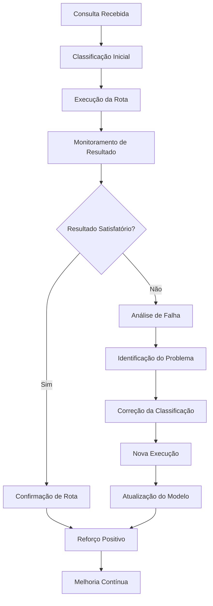
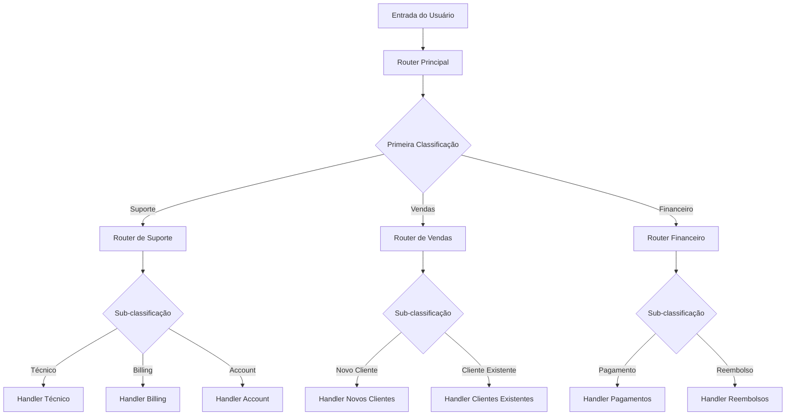
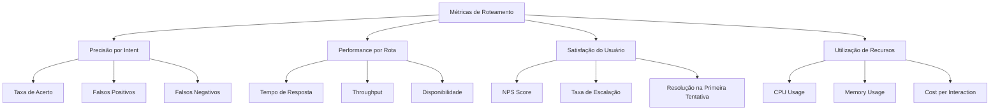

# Capítulo 2: Roteamento - Conteúdo Complementar Avançado

## Analogias do Mundo Real: Roteamento como Arquitetura de Software

### 1. Roteamento como Programação Modular (SRP)

O roteamento em agentes de IA segue o mesmo princípio fundamental da **Programação Modular** e do **Princípio da Responsabilidade Única (SRP)**. Cada prompt em uma cadeia de roteamento pode ser visto como uma função com uma responsabilidade única e bem definida.

```typescript
// Analogia: Função com responsabilidade única
class QueryRouter {
  // Responsabilidade única: classificar intenção
  classifyIntent(query: string): Intent {
    return this.intentClassifier.analyze(query);
  }
  
  // Responsabilidade única: rotear para handler específico
  routeToHandler(intent: Intent): Handler {
    return this.handlerRegistry.get(intent.type);
  }
}
```

**Analogia com Microserviços**: Assim como um sistema de microserviços usa um API Gateway para rotear requisições para serviços específicos baseado na URL e headers, um agente de IA usa roteamento para direcionar consultas para sub-agentes especializados baseado na intenção detectada.

### 2. Roteamento como Pipeline de CI/CD

O fluxo de roteamento é análogo a um **pipeline de CI/CD** onde a saída de uma etapa se torna a entrada para a próxima, criando um fluxo de trabalho automatizado e encadeado.



**Analogia com Build Pipeline**: Cada etapa do pipeline tem uma responsabilidade específica (compilação → testes → deploy), assim como cada rota no agente tem uma função especializada (classificação → processamento → resposta).

## Aprofundamento: Estado e Memória em Agentes de IA

### 1. Gerenciamento de Estado Persistente

O roteamento não é apenas sobre direcionar fluxo, mas sobre **manter contexto e estado** ao longo de uma sessão de interação. Um agente sofisticado deve "lembrar" das decisões anteriores e usar esse histórico para tomar decisões mais inteligentes.

```typescript
interface AgentState {
  sessionId: string;
  userContext: UserProfile;
  conversationHistory: Message[];
  routingDecisions: RoutingDecision[];
  currentContext: Context;
}

class ContextAwareRouter {
  private state: AgentState;
  
  route(query: string): Route {
    // Usa histórico para melhorar decisão
    const context = this.buildContext(query);
    const intent = this.classifyWithContext(query, context);
    
    // Atualiza estado com decisão
    this.updateState(intent, context);
    
    return this.selectRoute(intent);
  }
  
  private buildContext(query: string): Context {
    return {
      previousIntents: this.state.routingDecisions.slice(-3),
      userPreferences: this.state.userContext.preferences,
      conversationFlow: this.analyzeFlow(),
      timeContext: this.getTimeContext()
    };
  }
}
```

### 2. Memória de Longo Prazo para Roteamento

Um agente avançado deve manter uma **memória de longo prazo** sobre padrões de roteamento bem-sucedidos e falhas, permitindo aprendizado contínuo.



## Otimização Prática: Conditional Prompting e Self-Correction

### 1. Conditional Prompting Avançado

O **Conditional Prompting** permite que o agente adapte sua estratégia de roteamento baseado em condições específicas, criando um sistema mais inteligente e eficiente.

```typescript
class ConditionalRouter {
  route(query: string, context: Context): Route {
    // Condição 1: Urgência baseada em palavras-chave
    if (this.isUrgent(query)) {
      return this.routeToEmergencyHandler(query);
    }
    
    // Condição 2: Complexidade baseada em análise semântica
    const complexity = this.analyzeComplexity(query);
    if (complexity > 0.8) {
      return this.routeToExpertHandler(query);
    }
    
    // Condição 3: Histórico do usuário
    if (this.hasHistoryOfEscalation(context.userId)) {
      return this.routeToSeniorHandler(query);
    }
    
    // Roteamento padrão
    return this.routeToStandardHandler(query);
  }
  
  private isUrgent(query: string): boolean {
    const urgentKeywords = ['urgente', 'emergência', 'crítico', 'asap'];
    return urgentKeywords.some(keyword => 
      query.toLowerCase().includes(keyword)
    );
  }
}
```

### 2. Self-Correction com Feedback Loop

O sistema de **autocorreção** permite que o agente aprenda com seus erros e melhore continuamente suas decisões de roteamento.



```typescript
class SelfCorrectingRouter {
  private feedbackHistory: FeedbackEntry[] = [];
  
  async routeWithCorrection(query: string): Promise<RouteResult> {
    let attempt = 1;
    let maxAttempts = 3;
    
    while (attempt <= maxAttempts) {
      const route = this.classifyAndRoute(query);
      const result = await this.executeRoute(route);
      
      // Avalia qualidade do resultado
      const quality = await this.evaluateResult(result, query);
      
      if (quality.score > 0.8) {
        // Sucesso - registra feedback positivo
        this.recordFeedback(query, route, quality, true);
        return result;
      } else {
        // Falha - tenta correção
        this.recordFeedback(query, route, quality, false);
        query = await this.generateCorrectedQuery(query, result);
        attempt++;
      }
    }
    
    // Escalação após múltiplas tentativas
    return this.escalateToHuman(query);
  }
}
```

## Frameworks Avançados: Implementação Prática

### 1. LangGraph: Roteamento com Estado Complexo

LangGraph é particularmente poderoso para roteamento complexo devido à sua arquitetura baseada em grafos de estado.

```python
from langgraph.graph import StateGraph, END
from typing import TypedDict, List
from langchain_core.messages import BaseMessage

class RouterState(TypedDict):
    messages: List[BaseMessage]
    user_intent: str
    confidence: float
    routing_history: List[str]
    context: dict

def create_advanced_router():
    workflow = StateGraph(RouterState)
    
    # Nó de classificação de intenção
    workflow.add_node("classify_intent", classify_user_intent)
    
    # Nós de roteamento condicional
    workflow.add_node("route_support", handle_support_query)
    workflow.add_node("route_sales", handle_sales_query)
    workflow.add_node("route_technical", handle_technical_query)
    workflow.add_node("route_escalation", handle_escalation)
    
    # Nó de validação e correção
    workflow.add_node("validate_response", validate_and_correct)
    
    # Definir fluxo condicional
    workflow.add_conditional_edges(
        "classify_intent",
        route_based_on_intent,
        {
            "support": "route_support",
            "sales": "route_sales", 
            "technical": "route_technical",
            "escalation": "route_escalation"
        }
    )
    
    # Adicionar validação após cada rota
    for route in ["route_support", "route_sales", "route_technical"]:
        workflow.add_edge(route, "validate_response")
    
    workflow.add_edge("validate_response", END)
    workflow.add_edge("route_escalation", END)
    
    return workflow.compile()

def route_based_on_intent(state: RouterState) -> str:
    intent = state["user_intent"]
    confidence = state["confidence"]
    
    # Lógica de roteamento com fallback
    if confidence < 0.7:
        return "escalation"
    
    return intent
```

### 2. Google ADK: Roteamento com Ferramentas Especializadas

O Google ADK implementa roteamento através de ferramentas especializadas com seleção automática.

```python
from google.adk import Agent, Tool, Capability
from typing import Dict, Any

class AdvancedCustomerServiceAgent(Agent):
    def __init__(self):
        super().__init__()
        self.setup_routing_tools()
    
    def setup_routing_tools(self):
        # Ferramenta para suporte técnico
        tech_support_tool = Tool(
            name="technical_support",
            description="Handle technical support queries",
            capability=Capability.TECHNICAL_SUPPORT,
            handler=self.handle_technical_support
        )
        
        # Ferramenta para vendas
        sales_tool = Tool(
            name="sales_inquiry", 
            description="Handle sales and product inquiries",
            capability=Capability.SALES,
            handler=self.handle_sales_inquiry
        )
        
        # Ferramenta para escalação
        escalation_tool = Tool(
            name="escalation",
            description="Escalate complex issues to human agents",
            capability=Capability.ESCALATION,
            handler=self.handle_escalation
        )
        
        self.add_tools([tech_support_tool, sales_tool, escalation_tool])
    
    async def handle_technical_support(self, query: str, context: Dict[str, Any]) -> str:
        # Implementação específica para suporte técnico
        problem_analysis = await self.analyze_technical_problem(query)
        solution = await self.search_knowledge_base(problem_analysis)
        return self.format_technical_response(solution)
    
    async def handle_sales_inquiry(self, query: str, context: Dict[str, Any]) -> str:
        # Implementação específica para vendas
        lead_qualification = await self.qualify_lead(query, context)
        product_recommendation = await self.recommend_products(lead_qualification)
        return self.format_sales_response(product_recommendation)
```

## Arquitetura de Roteamento em Produção

### 1. Padrão de Roteamento Hierárquico

Para sistemas complexos, implemente um **roteamento hierárquico** que permite múltiplos níveis de decisão.



### 2. Roteamento com Load Balancing

Para sistemas de alta disponibilidade, implemente **roteamento com balanceamento de carga**.

```typescript
class LoadBalancedRouter {
  private handlers: Map<string, HandlerPool> = new Map();
  
  route(query: string, intent: string): Handler {
    const pool = this.handlers.get(intent);
    if (!pool) {
      throw new Error(`No handlers available for intent: ${intent}`);
    }
    
    // Seleciona handler baseado em carga e disponibilidade
    return pool.selectHandler({
      currentLoad: pool.getCurrentLoad(),
      responseTime: pool.getAverageResponseTime(),
      errorRate: pool.getErrorRate(),
      queryComplexity: this.analyzeComplexity(query)
    });
  }
}

class HandlerPool {
  private handlers: Handler[] = [];
  private metrics: HandlerMetrics[] = [];
  
  selectHandler(criteria: SelectionCriteria): Handler {
    // Algoritmo de seleção baseado em múltiplos critérios
    const scoredHandlers = this.handlers.map(handler => ({
      handler,
      score: this.calculateScore(handler, criteria)
    }));
    
    return scoredHandlers
      .sort((a, b) => b.score - a.score)[0]
      .handler;
  }
  
  private calculateScore(handler: Handler, criteria: SelectionCriteria): number {
    const loadScore = 1 - (handler.currentLoad / 100);
    const responseScore = 1 - (handler.avgResponseTime / 5000);
    const errorScore = 1 - handler.errorRate;
    const complexityScore = this.matchComplexity(handler, criteria.queryComplexity);
    
    return (loadScore * 0.3) + (responseScore * 0.3) + 
           (errorScore * 0.2) + (complexityScore * 0.2);
  }
}
```

## Métricas e Monitoramento de Roteamento

### 1. KPIs Essenciais para Roteamento

```typescript
interface RoutingMetrics {
  // Precisão do roteamento
  accuracy: number;
  precision: number;
  recall: number;
  
  // Performance
  averageResponseTime: number;
  throughput: number;
  
  // Qualidade
  userSatisfaction: number;
  escalationRate: number;
  firstContactResolution: number;
  
  // Eficiência
  costPerInteraction: number;
  resourceUtilization: number;
}

class RoutingMonitor {
  private metrics: RoutingMetrics;
  
  trackRoutingDecision(intent: string, route: string, result: RouteResult): void {
    // Atualiza métricas em tempo real
    this.updateAccuracy(intent, route, result.success);
    this.updatePerformance(result.responseTime);
    this.updateQuality(result.userSatisfaction);
  }
  
  generateReport(): RoutingReport {
    return {
      overallAccuracy: this.calculateOverallAccuracy(),
      topPerformingRoutes: this.getTopPerformingRoutes(),
      problematicRoutes: this.getProblematicRoutes(),
      recommendations: this.generateRecommendations()
    };
  }
}
```

### 2. Dashboard de Monitoramento



## Casos de Uso Avançados

### 1. Roteamento Multi-Modal

Para sistemas que processam múltiplos tipos de entrada (texto, imagem, áudio).

```typescript
class MultiModalRouter {
  route(input: MultiModalInput): Route {
    const modality = this.detectModality(input);
    
    switch (modality) {
      case 'text':
        return this.routeTextInput(input.text);
      case 'image':
        return this.routeImageInput(input.image);
      case 'audio':
        return this.routeAudioInput(input.audio);
      case 'mixed':
        return this.routeMixedInput(input);
      default:
        return this.routeToGeneralHandler(input);
    }
  }
  
  private routeMixedInput(input: MultiModalInput): Route {
    // Combina análise de múltiplas modalidades
    const textIntent = this.analyzeText(input.text);
    const imageIntent = this.analyzeImage(input.image);
    const audioIntent = this.analyzeAudio(input.audio);
    
    // Roteamento baseado em consenso ou hierarquia
    return this.resolveConflictingIntents([textIntent, imageIntent, audioIntent]);
  }
}
```

### 2. Roteamento Contextual com Machine Learning

```python
from sklearn.ensemble import RandomForestClassifier
from sklearn.feature_extraction.text import TfidfVectorizer
import numpy as np

class MLBasedRouter:
    def __init__(self):
        self.vectorizer = TfidfVectorizer(max_features=1000)
        self.classifier = RandomForestClassifier(n_estimators=100)
        self.is_trained = False
    
    def train(self, training_data: List[Tuple[str, str]]):
        """Treina o modelo com dados históricos"""
        texts, intents = zip(*training_data)
        
        # Vetorização dos textos
        X = self.vectorizer.fit_transform(texts)
        y = np.array(intents)
        
        # Treinamento do classificador
        self.classifier.fit(X, y)
        self.is_trained = True
    
    def route(self, query: str) -> str:
        """Roteia consulta baseado no modelo treinado"""
        if not self.is_trained:
            return self.fallback_route(query)
        
        # Vetorização da consulta
        X_query = self.vectorizer.transform([query])
        
        # Predição da intenção
        intent = self.classifier.predict(X_query)[0]
        confidence = self.classifier.predict_proba(X_query).max()
        
        # Retorna rota baseada na intenção e confiança
        if confidence > 0.8:
            return self.get_route_for_intent(intent)
        else:
            return self.route_to_human_agent(query)
```

## Conclusão Avançada

O roteamento em agentes de IA representa uma evolução natural da programação modular e arquitetura de sistemas. Assim como um sistema de microserviços bem arquitetado usa um API Gateway inteligente para rotear requisições, um agente de IA sofisticado usa roteamento para direcionar consultas para sub-agentes especializados.

A implementação de roteamento com **estado persistente**, **memória de longo prazo** e **autocorreção** transforma um sistema estático em um agente verdadeiramente adaptativo que aprende e melhora continuamente. O uso de frameworks como LangGraph e Google ADK, combinado com técnicas de machine learning e monitoramento avançado, permite criar sistemas de roteamento robustos e escaláveis.

O futuro do roteamento em IA está na **interseção entre programação tradicional e inteligência artificial**, onde princípios sólidos de engenharia de software se combinam com capacidades adaptativas de aprendizado, resultando em sistemas que não apenas roteiam eficientemente, mas evoluem e se otimizam ao longo do tempo.

## Referências Avançadas

1. **LangGraph Documentation**: [https://langchain-ai.github.io/langgraph/](https://langchain-ai.github.io/langgraph/)
2. **Google ADK Documentation**: [https://google.github.io/adk-docs/](https://google.github.io/adk-docs/)
3. **Patterns of Enterprise Application Architecture** - Martin Fowler
4. **Microservices Patterns** - Chris Richardson
5. **Building Machine Learning Pipelines** - Hannes Hapke & Catherine Nelson
6. **Designing Data-Intensive Applications** - Martin Kleppmann
