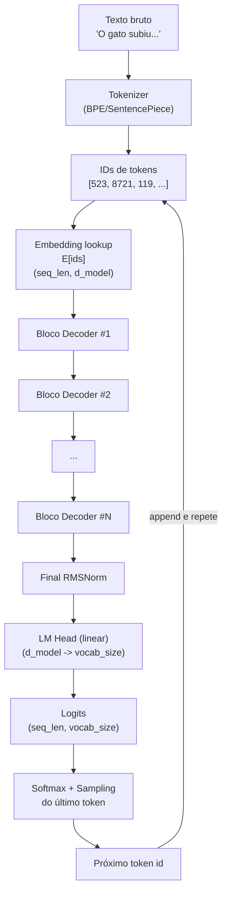
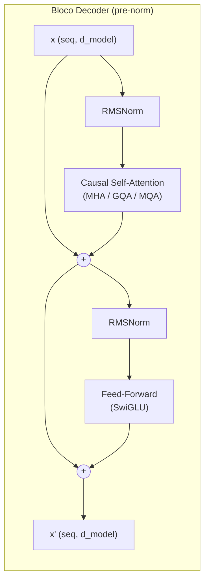
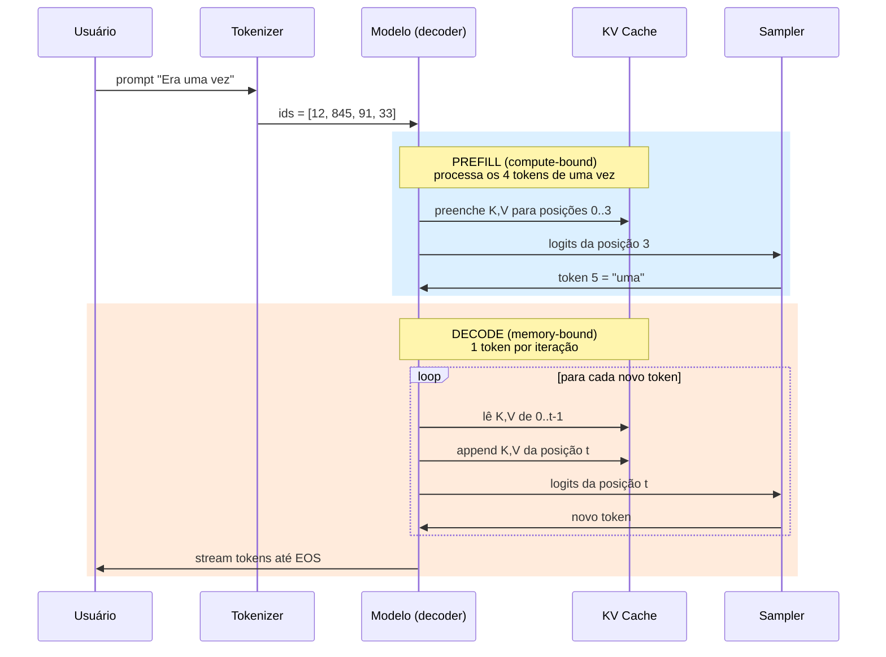

# Post 01 — Arquitetura Transformer e LLMs decoder-only: fundamentos

> Série: **LLM Deep Dive** — do tijolo ao prédio.
> Pré-requisitos: nenhum. Você só precisa estar disposto a pensar em vetores, matrizes e probabilidade discreta.
> Próximo post: **Post 02 — Atenção em profundidade: MHA, MQA, GQA, MLA e FlashAttention.**

---

## TL;DR (para quem quer o resumo executivo)

- Um **LLM moderno** (Llama 3/4, Qwen 3/3.5, Mistral, Gemma 3/4, GPT-4o/5) é, em sua essência, uma **pilha de blocos Transformer decoder-only** treinada para prever o próximo token.
- A entrada de texto vira **tokens** (pedaços de palavras) via um **tokenizer** (geralmente BPE byte-level ou SentencePiece-Unigram). Tokens viram **embeddings** (vetores densos) e ganham um **sinal de posição** (RoPE, na maioria dos modelos atuais).
- Cada **bloco decoder** aplica **self-attention causal** (cada token só "olha para trás") seguida de uma **feed-forward network (FFN)**, com **normalização** (RMSNorm) e **conexões residuais**. A norma vai **antes** das sub-camadas (pre-norm), o que estabiliza o treino de redes profundas.
- A geração é **autoregressiva** e tem duas fases muito diferentes: **prefill** (compute-bound, processa o prompt todo de uma vez) e **decode** (memory-bandwidth-bound, gera um token por vez).
- O modelo emite **logits** sobre o vocabulário; uma estratégia de **sampling** (greedy, temperatura, top-k, top-p, beam) escolhe o próximo token.
- **Decoder-only venceu** porque escala melhor, é mais simples de treinar, e mostrou que um único objetivo — prever o próximo token — basta para induzir compreensão, raciocínio e geração de qualidade.

Este post é o **alicerce**. Os próximos vão dissecar atenção, KV cache, quantização, contexto longo, RAG, agentes, etc.

---

## 1. Por que decoder-only venceu

### 1.1 Os três sabores do Transformer

O paper original *Attention Is All You Need* (Vaswani et al., 2017) propôs uma arquitetura **encoder–decoder** para tradução automática. Logo depois, a comunidade percebeu que dava para usar só um lado, e surgiram três famílias:

| Família | Exemplo clássico | Atenção típica | Caso de uso para o qual nasceu | Como gera saída |
|---|---|---|---|---|
| **Encoder-only** | BERT, RoBERTa, DeBERTa | bidirecional (vê passado e futuro) | classificação, NER, embeddings semânticos | precisa de "cabeça" externa (classificador) |
| **Encoder–Decoder** | T5, BART, mT5, Flan-T5 | encoder bidirecional + decoder causal + cross-attention | tradução, sumarização, seq2seq estruturado | autoregressivo no decoder, condicionado ao encoder |
| **Decoder-only** | GPT-2/3/4/5, Llama 2/3/4, Qwen 3, Mistral, Gemma 3/4, Claude, DeepSeek | causal (cada token vê só o passado) | modelagem de linguagem genérica, chat, geração | autoregressivo puro |

A **GPT-1** (OpenAI, 2018) já apostava em decoder-only. A **GPT-2** (2019) e principalmente a **GPT-3** (2020) mostraram que escalar essa arquitetura simples produzia capacidades emergentes (few-shot learning, raciocínio rudimentar, code-completion) sem precisar de fine-tuning supervisionado caro. A partir daí, a indústria convergiu.

### 1.2 Por que decoder-only ganhou na prática

São quatro razões pragmáticas:

1. **Um único objetivo, dados ilimitados.** Decoder-only treina com **next-token prediction** (cross-entropy) sobre texto bruto da web. Não precisa de pares input/output rotulados. Encoder-decoders (T5/BART) precisam de tarefas formatadas (`"translate English to German: ..."`), o que limita a escala dos dados ou exige pré-treino com objetivos sintéticos (denoising span corruption do T5).
2. **Simplicidade arquitetural.** Sem cross-attention, sem encoder separado, sem dois conjuntos de pesos. Menos partes móveis = menos bugs, mais fácil paralelizar, mais fácil escalar para 70B, 405B, 1T parâmetros.
3. **In-context learning.** A natureza autoregressiva e o contexto longo permitem **few-shot prompting**: você dá exemplos no prompt e o modelo "aprende" no momento da inferência. Encoder-only não gera; encoder-decoder gera, mas é menos natural para essa flexibilidade conversacional.
4. **Inferência uniforme.** Toda saída é "próximo token". Mesma loop de decode para chat, código, JSON, SQL, raciocínio. Stack de inferência (vLLM, TensorRT-LLM, SGLang) otimiza um único padrão.

> **Analogia.** Um encoder-only é um **leitor de provas**: lê o texto inteiro, vai e volta, dá um veredito. Um encoder-decoder é um **tradutor profissional**: lê tudo num idioma, depois reconstrói no outro. Um decoder-only é um **escritor que pensa em voz alta**: ele escreve uma palavra por vez, sempre olhando para o que já escreveu, e só pode planejar olhando para trás. Essa última figura, repetida bilhões de vezes em paralelo durante o treino, virou a melhor "máquina universal de texto" que temos.

### 1.3 Os encoder-decoders ainda existem?

Sim — sobrevivem em **tradução automática** (Marian, NLLB), em algumas arquiteturas de **fala** (Whisper é encoder-decoder), em **diffusion text-to-image** com cross-attention para o prompt, e em sistemas que precisam de **representação fixa do input**. Mas para LLMs de propósito geral em 2025/2026, decoder-only é o padrão absoluto.

> Fato 2026: **Llama 4**, **Qwen 3.5**, **Gemma 4**, **Mistral Large**, **DeepSeek V3** — todas decoder-only. As variantes MoE (Mixture-of-Experts) que apareceram nessas famílias trocam a FFN densa por roteamento esparso, mas o esqueleto continua decoder-only.

---

## 2. Tokens e tokenizers

### 2.1 O problema: como um modelo "lê" texto?

Redes neurais não consomem strings; consomem **vetores de números**. Precisamos de uma função:

```
texto (string) ──[tokenizer]──> sequência de inteiros (ids) ──[embedding]──> sequência de vetores
```

A pergunta é: **qual o granularidade dos pedaços (tokens)?**

- **Caracteres**: vocabulário pequeno, sequências longas (custo computacional alto), perde semântica de palavra.
- **Palavras inteiras**: vocabulário gigante (línguas têm milhões de formas), problema de OOV (out-of-vocabulary) — qualquer palavra nova vira `<UNK>`.
- **Subpalavras**: meio-termo. Palavras frequentes ficam inteiras (`"the"`, `"computador"`), palavras raras viram pedaços (`"hipotálamo"` → `["hi", "pot", "ála", "mo"]`). É o padrão atual.

> **Analogia.** Tokenizar é **fatiar uma frase em pedaços que o modelo conhece**. Pense num cozinheiro de sushi: peixes comuns (atum, salmão) saem em fatias inteiras conhecidas; um peixe exótico nunca visto ele corta em pedacinhos genéricos (subpalavras) que sabe manipular. O cardápio (vocabulário) tem tamanho fixo; o que varia é como a frase é cortada para caber nele.

### 2.2 Os algoritmos vigentes

#### 2.2.1 BPE (Byte Pair Encoding)

Vem da compressão de dados (Gage, 1994); foi adaptado para NLP por Sennrich et al. (2016). Procedimento simplificado:

1. Comece com vocabulário = todos os bytes (ou caracteres) presentes no corpus.
2. Conte os pares de tokens adjacentes mais frequentes.
3. Funda o par mais comum num novo token, adicione ao vocabulário.
4. Repita até atingir o tamanho de vocabulário desejado (ex: 50k, 128k, 200k).

Resultado: tokens frequentes (afixos, palavras curtas, tags HTML) ficam **únicos**; raros são compostos por pedaços menores.

**Byte-level BPE** (GPT-2, GPT-3, GPT-4, tiktoken): trabalha sobre **bytes UTF-8**, não caracteres. Vantagem: cobre **qualquer string Unicode** sem `<UNK>`. Um emoji ou caractere chinês vira 2-4 tokens-byte se for raro, mas nada quebra.

#### 2.2.2 SentencePiece (Google, 2018)

Não é um algoritmo, é uma **biblioteca** que implementa BPE e Unigram, com a particularidade de **não exigir pré-tokenização** (não precisa separar por espaços antes). Trata `" "` (espaço) como caractere normal — daí o famoso `▁` (U+2581) que marca início de palavra. Usado por T5, mBART, **Llama 1/2/3**, PaLM, Gemma.

**Unigram LM** (Kudo, 2018): em vez de fundir pares, começa com vocabulário gigante e remove tokens iterativamente, mantendo os que maximizam a likelihood do corpus. Produz tokenizações alternativas com probabilidades — útil para *subword regularization*.

#### 2.2.3 tiktoken (OpenAI)

Implementação ultra-rápida (Rust) de byte-level BPE, com encoders nomeados:

| Encoder | Modelos | Vocab |
|---|---|---|
| `r50k_base` / `gpt2` | GPT-2, GPT-3 davinci | 50.257 |
| `cl100k_base` | GPT-3.5-turbo, GPT-4, text-embedding-3 | 100.256 |
| `o200k_base` | GPT-4o, GPT-4o-mini, GPT-5 family | ~200.019 |

A evolução foi sempre **vocabulário maior** → **menos tokens por texto** → **mais texto na mesma janela** + **inferência mais barata por palavra**.

### 2.3 Comparativo rápido (2025/2026)

| Modelo | Tokenizer | Algoritmo | Vocabulário | Observações |
|---|---|---|---|---|
| GPT-2 | tiktoken | byte BPE | 50.257 | base histórica |
| GPT-3.5 / GPT-4 | tiktoken `cl100k_base` | byte BPE | 100.256 | melhor em código |
| GPT-4o / GPT-5 | tiktoken `o200k_base` | byte BPE | ~200.019 | forte multilíngue |
| Llama 2 | SentencePiece | BPE | 32.000 | foco inglês |
| Llama 3 / 3.1 | tiktoken-style | BPE byte-level | 128.256 | salto de 4× vs Llama 2 |
| Llama 4 | BPE byte-level | BPE | 128k–256k (variantes) | multimodal nativa |
| Qwen 2/3 | BPE byte-level (`tiktoken`-compatível) | BPE | ~152.000 | forte em chinês/multilíngue |
| Mistral | SentencePiece | BPE | 32.000 (v0.x) → 131.072 (Tekken) | "Tekken" tokenizer adotado nas versões recentes |
| Gemma 2 | SentencePiece | BPE | 256.000 | herança PaLM, multilíngue |
| Gemma 3/4 | SentencePiece | BPE | 256.000 | mantém vocab gigante |
| Claude 3.5 | proprietário (byte BPE-like) | BPE | ~100k+ | não público |

> **Por que importa o vocabulário?** Vocabulário maior = cada token codifica mais texto → menos passos no decode → inferência mais rápida e janela de contexto efetiva maior. Em compensação, a matriz de embeddings cresce (`vocab_size × d_model`), aumentando memória e custo da camada final (logits).

### 2.4 Exemplo prático de tokenização

Considere a frase em PT-BR:

```
"Inteligência artificial generativa transformou tudo."
```

Em **tiktoken `cl100k_base`** (GPT-4) ela vira aproximadamente 13–15 tokens, com cortes como:

```
["Int", "elig", "ência", " artificial", " gener", "ativa", " trans", "form", "ou", " tudo", "."]
```

Em **Llama 3** (vocab 128k, melhor em PT-BR) cai para algo como 8–10 tokens:

```
["Inteligência", " artificial", " generativa", " transform", "ou", " tudo", "."]
```

Já em **Llama 2** (vocab 32k, ruim em português), pode chegar a 18–22 tokens, picotando muito.

> **Implicação prática.** Se você cobra por token (API), o **mesmo texto custa diferente** em modelos diferentes. E se o modelo é mau em sua língua, ele "queima" mais tokens com prefixos/sufixos, gastando contexto e dinheiro.

### 2.5 Casos curiosos e armadilhas

- **Glitch tokens**: tokens que aparecem no vocabulário mas quase nunca apareceram no treino (ex.: `" SolidGoldMagikarp"` em GPT-2). Provocam comportamento estranho. Existem em todos os modelos — é uma assinatura involuntária do dataset.
- **Espaços importam**: `"Olá"` e `" Olá"` (com espaço inicial) são tokens **diferentes**. `"hello"` vs `" hello"` idem. Por isso, prompts mal montados às vezes degradam saída.
- **Bytes inválidos**: tokenizers byte-level lidam com qualquer entrada, mas tokens podem partir caracteres multibyte (UTF-8) ao meio durante o decode — daí streaming exige buffer (ex.: SSE com tokens parciais).
- **Tokenizer ≠ modelo**: trocar tokenizer **invalida o modelo**. Pré-treino e tokenizer são casados.

---

## 3. Embeddings: token + posicional

### 3.1 Token embeddings — o "mapa de significados"

Após a tokenização, temos uma sequência de inteiros, ex.: `[5012, 287, 19834, 11, 845]`. Cada id é um índice numa **matriz de embeddings**:

```
E ∈ R^(vocab_size × d_model)
```

Para cada token id `t`, pegamos a linha `E[t]` — um vetor denso de dimensão `d_model` (ex.: 4096 em Llama 3 8B, 8192 em Llama 3 70B, 16384 em modelos enormes).

> **Analogia.** Embeddings são **coordenadas num mapa de significados**. Tokens com sentidos parecidos ficam perto; tokens muito diferentes ficam longe. Não é um mapa 2D que dá para imaginar — são 4096 dimensões. Mas a intuição vale: "rei" - "homem" + "mulher" ≈ "rainha" funciona porque a aritmética vetorial captura analogias semânticas.

A matriz `E` é **aprendida** durante o pré-treino, junto com o resto do modelo. Em muitos LLMs (GPT-2, Llama), a mesma matriz é **compartilhada** com a camada final de logits (*tied embeddings*) — economiza parâmetros e estabiliza o treino.

### 3.2 Positional embeddings — "onde estou na frase?"

A self-attention é **permutation-invariant**: trocar a ordem dos tokens não muda nada se não dermos sinal de posição. Mas posição importa demais ("João bateu Maria" ≠ "Maria bateu João"). Soluções, em ordem histórica:

#### 3.2.1 Sinusoidal (Vaswani 2017)
Vetores fixos com senos e cossenos de frequências diferentes. Somados ao token embedding. Vantagem: extrapola para sequências mais longas que as vistas no treino. Limitação: pouco expressivo.

#### 3.2.2 Learned positional embeddings (GPT-2, BERT)
Uma matriz `P ∈ R^(max_seq × d_model)` aprendida. Limite duro: não funciona além de `max_seq`.

#### 3.2.3 RoPE — Rotary Position Embedding (Su et al., 2021)
**Padrão atual** em Llama, Qwen, Mistral, Gemma, DeepSeek, Phi. Em vez de **somar** a posição, **rotaciona** os vetores Q (query) e K (key) dentro da atenção, em pares de dimensões, com ângulos proporcionais à posição. Magia matemática: o produto interno `Q·K` passa a depender só da **diferença relativa** de posições. Isso casa naturalmente com a estrutura da atenção e tem ótima extrapolação (com truques como NTK-aware scaling, YaRN, posição escala).

#### 3.2.4 ALiBi (Press et al., 2022)
Adiciona um viés linear na matriz de atenção proporcional à distância entre tokens. Simples, sem parâmetros novos, extrapola bem. Usado em MPT, BLOOM, Falcon. Hoje, RoPE domina, mas ALiBi sobrevive em alguns nichos.

> **Analogia.** Positional encoding é o **número da página em cada palavra de um livro**. Sinusoidal é uma régua absoluta. Learned é "decorar a posição". RoPE é como **etiquetar cada palavra com um relógio de fase**: a "rotação" de fase entre duas palavras é a distância entre elas.

### 3.3 Mini-exemplo de fluxo

Para um prompt `"Olá, mundo"` tokenizado em `[12345, 678, 91011]` (3 tokens), com `d_model=4096`:

```
ids        = [12345, 678, 91011]                    # shape (3,)
tok_emb    = E[ids]                                 # shape (3, 4096)
# RoPE não soma, modifica Q e K dentro da atenção. Conceitualmente:
x_layer0   = tok_emb                                # entrada do bloco 0
```

A entrada do primeiro bloco decoder é uma matriz `(seq_len, d_model)`. Em batch: `(batch, seq_len, d_model)`.

---

## 4. O bloco decoder em detalhe

### 4.1 Vista de cima

Um LLM moderno é simplesmente uma **pilha de N blocos idênticos** (N=32 em Llama 3 8B, 80 em Llama 3 70B, ~120 em modelos de fronteira), seguida por uma normalização final e uma camada linear (LM head) que produz **logits** sobre o vocabulário.



### 4.2 Anatomia de um bloco

Cada bloco tem **duas sub-camadas**: self-attention causal e FFN. Cada sub-camada é envolvida por uma **conexão residual** e precedida por uma **normalização** (pre-norm, padrão moderno).



Vamos destrinchar cada peça.

### 4.3 Self-attention causal (a essência)

> **Atenção em profundidade vem no Post 02.** Aqui ficamos no nível conceitual.

**O que faz**: para cada token na posição `i`, calcula uma representação que é uma **média ponderada** das representações dos tokens nas posições `0..i` (apenas **passado**, daí "causal"). Os pesos são calculados dinamicamente via produto interno entre **queries** (Q) e **keys** (K), e os valores misturados são **values** (V).

Equação canônica (escala única, single-head):

```
Attention(Q, K, V) = softmax( Q Kᵀ / √d_k  +  M ) · V
```

Onde `M` é a **máscara causal**: matriz triangular com `-inf` acima da diagonal, garantindo que o token na posição `i` não veja `j > i`.

**Multi-head**: em vez de uma atenção, faz **h cabeças** em paralelo (ex.: 32 cabeças em Llama 3 8B), cada uma com sua própria projeção Q/K/V de dimensão `d_model/h`. As saídas são concatenadas e projetadas de volta para `d_model`. Cabeças diferentes "olham" para padrões diferentes (uma pode rastrear sintaxe, outra correferência, outra repetição lexical).

> **Analogia.** Atenção é uma **busca em biblioteca interna**: o token atual emite uma consulta (Q); cada token anterior tem uma "ficha de catálogo" (K) e um "conteúdo" (V). O modelo compara a consulta com as fichas (produto Q·K), escolhe pesos (softmax) e mistura os conteúdos correspondentes. Multi-head é ter **várias bibliotecas especializadas** sendo consultadas ao mesmo tempo (sintaxe, semântica, dependências longas).

**Variantes modernas** (cobertas no Post 02):
- **MHA** (Multi-Head Attention): clássica.
- **MQA** (Multi-Query): todas as cabeças compartilham K e V (economia de KV cache).
- **GQA** (Grouped-Query): meio-termo, grupos de cabeças compartilham K/V (Llama 2 70B+, Llama 3, Qwen 2/3, Mistral).
- **MLA** (Multi-head Latent Attention): compressão latente do KV (DeepSeek V2/V3).

### 4.4 Feed-Forward Network (FFN)

Depois da atenção mistura informação **entre tokens**, o FFN processa cada token **independentemente**, expandindo dimensionalmente para "pensar":

Versão clássica (GPT-2/3):
```
FFN(x) = W₂ · GELU(W₁ · x + b₁) + b₂
```
com `W₁ ∈ R^(d_model × d_ff)`, normalmente `d_ff = 4 · d_model`.

Versão moderna **SwiGLU** (PaLM, Llama, Mistral, Gemma):
```
FFN(x) = W₃ · ( SiLU(W₁ · x) ⊙ (W₂ · x) )
```
Três matrizes em vez de duas, mas `d_ff` é reduzido (~2.66 × d_model) para manter o total de parâmetros. O *gating* multiplicativo (`⊙` é produto Hadamard) melhora qualidade significativamente — virou padrão.

> **Analogia.** Se a atenção é a **conversa entre tokens** ("o que vocês estão dizendo, vizinhos?"), o FFN é a **reflexão individual** ("dado tudo que ouvi, o que isso significa para mim?"). É onde a maior parte dos parâmetros do modelo mora — em Llama 3 8B, mais de 60% do total.

### 4.5 Normalização: LayerNorm vs RMSNorm

**LayerNorm** (Ba et al., 2016) normaliza cada vetor subtraindo média e dividindo pelo desvio-padrão, com ganho e viés aprendidos:
```
LN(x) = γ ⊙ (x − μ) / σ + β
```

**RMSNorm** (Zhang & Sennrich, 2019) **omite a média e o viés**, normalizando só pela raiz da média dos quadrados:
```
RMSNorm(x) = γ ⊙ x / RMS(x),   RMS(x) = √( mean(xᵢ²) + ε )
```

**Por que virou padrão?** ~20% mais rápida (menos ops, menos parâmetros, melhor para GPU), com qualidade equivalente ou melhor. Llama, Mistral, Gemma, Qwen, DeepSeek, Phi — todas usam RMSNorm.

### 4.6 Pre-norm vs post-norm

**Post-norm** (Transformer original 2017):
```
x_out = LayerNorm( x + Sublayer(x) )
```
A norma é aplicada **depois** da soma residual. Funciona bem em redes rasas, mas dificulta o treino de redes muito profundas (gradientes instáveis, exige learning rate warmup cuidadoso).

**Pre-norm** (GPT-2 em diante):
```
x_out = x + Sublayer( LayerNorm(x) )
```
A norma é aplicada **antes** da sub-camada; o residual flui **limpo** por cima. Resultado: gradientes propagam por um "highway" sem normalização, permitindo treinar **dezenas a centenas de camadas** com estabilidade.

> **Analogia.** Pre-norm é como ter uma **rodovia expressa de gradientes** que atravessa o prédio inteiro sem semáforos (residuais não-normalizados), enquanto cada andar (sub-camada) faz seu trabalho normalizando localmente sua **entrada**. Post-norm coloca semáforo a cada andar — funciona em prédio baixo, congestiona em arranha-céu.

**Tendências 2025/2026**: Gemma 3 e OLMo 2 reintroduziram variações híbridas (post-norm com QK-norm extra, ou "double-norm") buscando ainda mais estabilidade em modelos grandes. Pre-norm ainda é o padrão dominante, mas a discussão está aberta.

### 4.7 Conexões residuais

Cada sub-camada é envolvida em `x + Sub(x)`. Sem isso, redes profundas não treinariam (problema do gradiente vanishing). Com residual, cada bloco aprende uma **delta** sobre a representação de entrada — daí a metáfora de "refinamento progressivo": camada 1 cuida de morfologia, camada 5 de sintaxe, camada 20 de semântica, camada 60 de raciocínio (a divisão exata é fluida, mas estudos de probing mostram tendências).

### 4.8 LM Head e logits

Após o último bloco e a normalização final, temos `(seq_len, d_model)`. A **LM head** é uma projeção linear:
```
logits = x · Eᵀ        (se tied embeddings)
logits = x · Wₗₘ       (se separado)
```
Resultado: `(seq_len, vocab_size)`. Para gerar o próximo token, olhamos só **a última posição** (no decode). No treino, olhamos **todas** (porque queremos prever cada posição a partir das anteriores — é o objetivo de next-token prediction).

---

## 5. Geração autoregressiva: prefill vs decode

### 5.1 O loop conceitual

```python
ids = tokenizer.encode(prompt)
for step in range(max_new_tokens):
    logits = model(ids)               # forward pass
    next_token = sample(logits[-1])   # estratégia de sampling
    ids.append(next_token)
    if next_token == EOS: break
text = tokenizer.decode(ids)
```

Simples — mas a implementação de produção é radicalmente diferente entre **prefill** e **decode**, porque os perfis computacionais são opostos.

### 5.2 Prefill: processar o prompt

Quando você manda um prompt de 2.000 tokens, o modelo processa **todos os 2.000 de uma vez**, em **um único forward pass paralelo**. As GPUs adoram isso: muitas multiplicações de matriz grandes, uso intenso de Tensor Cores, alta utilização de FLOPS.

**Característica**: **compute-bound**. Limitado pela capacidade de cálculo. O modelo cabe na memória da GPU; o gargalo é fazer as contas rápido.

Saída do prefill: um **KV cache** preenchido (as matrizes K e V de cada camada para cada uma das 2.000 posições) e o **primeiro token gerado** (a partir do logit da última posição do prompt).

### 5.3 Decode: gerar token a token

A partir do segundo token, o modelo entra no **loop de decode**: para cada novo token, faz um forward pass com **apenas 1 token de entrada** (o último gerado), reutilizando o KV cache para todas as posições anteriores.

**Característica**: **memory-bandwidth-bound**. Para cada token, é preciso **ler todos os pesos do modelo da VRAM**. Em Llama 3 70B (FP16), são ~140 GB lidos por token. Com bandwidth de ~3 TB/s (H100), o teto é ~21 tokens/s para um único usuário — independente de quão rápida seja a GPU em FLOPS.

> **Analogia.** Prefill é uma **fábrica processando um lote enorme de peças em paralelo**: máquinas a 100% (compute-bound). Decode é um **chef cozinhando um prato por vez**: cada novo prato exige ir até a despensa, pegar **todos os ingredientes** (pesos), usar uma pitadinha, e voltar. O gargalo é o **trajeto até a despensa**, não a velocidade da faca.

### 5.4 Diagrama de sequência



### 5.5 Implicações práticas

- **Latência inicial (TTFT — Time To First Token)** depende do prefill (≈ tamanho do prompt × custo por token).
- **Throughput durante geração (TPS — Tokens Per Second)** depende do decode (≈ bandwidth de memória ÷ tamanho do modelo).
- **KV cache cresce linearmente** com a sequência. Para Llama 3 70B, ~2.5 MB por token por usuário (com GQA). Em 100k tokens × 100 usuários simultâneos → ~25 GB só de KV cache.
- **Batching** ajuda muito o decode: agrupar usuários paga a leitura dos pesos uma vez para vários decodes simultâneos. É a base de motores como **vLLM** e **continuous batching**.
- **Quantização** (FP8, INT4) reduz o tamanho dos pesos → mais TPS no decode (vamos cobrir nos posts 04-06).

> **Não vamos detalhar KV cache aqui** — é tema do Post 03. Saiba apenas que ele existe, é fundamental para velocidade, e cresce com o contexto.

---

## 6. Sampling: como escolher o próximo token

O modelo emite `logits ∈ R^vocab_size`. Aplicamos `softmax` (com escala) e obtemos probabilidades. Como escolher?

### 6.1 Greedy (argmax)

```
next = argmax(logits)
```
Sempre o mais provável. Determinístico. Funciona para tarefas com resposta única e curta (classificação, código onde só uma resposta é correta), mas em geração longa **degenera em loops**: "the cat the cat the cat...". Faltam diversidade e capacidade de escapar de mínimos locais.

### 6.2 Temperatura

Antes do softmax, divide os logits por `T`:
```
p = softmax(logits / T)
```
- `T → 0`: vira greedy (distribuição vira one-hot).
- `T = 1`: distribuição "natural" do modelo.
- `T > 1`: achata, aumenta diversidade (e alucinação).
- `T < 1`: afia, mais conservador.

> **Analogia.** Temperatura é a **agitação molecular** da distribuição. Baixa = cristal ordenado (sempre a mesma escolha). Alta = gás caótico (qualquer coisa pode sair). Os valores `0.6–1.0` são o "líquido bom" para chat.

### 6.3 Top-k

Mantém só os `k` tokens mais prováveis, zera o resto, renormaliza, amostra.

- `k=1` ≡ greedy.
- `k=40` é clássico (GPT-2 sampling).
- Defeito: `k` fixo é cego ao formato da distribuição. Em pontos de baixa entropia (ex.: `"def fibonacci("` → `"n"` quase certo), até `k=40` inclui ruído. Em alta entropia (início de um parágrafo criativo), `k=40` pode ser pouco.

### 6.4 Top-p (nucleus sampling)

Mantém o **menor conjunto** de tokens cuja soma de probabilidade seja ≥ `p` (ex.: 0.9). Adapta-se à entropia local: poucos tokens em pontos óbvios, muitos em pontos abertos. **Padrão de fato em LLMs hoje**.

### 6.5 Combinando

A receita típica em produção é **temperatura + top-p**, opcionalmente com **top-k** como teto:

```python
sampler = {
    "temperature": 0.7,
    "top_p": 0.9,
    "top_k": 50,            # safety cap
    "repetition_penalty": 1.1,  # opcional, penaliza tokens já usados
    "frequency_penalty": 0.0,
    "presence_penalty": 0.0,
}
```

Configurações populares de provedores (2025/2026):
- vLLM padrão: `temperature=0.8, top_p=0.95`.
- OpenAI API padrão: `temperature=1.0, top_p=1.0` (sem corte) — você ajusta.
- Llama.cpp: `temp=0.8, top_k=40, top_p=0.95`.

### 6.6 Beam search

Mantém `b` (beam width) hipóteses parciais por passo, expandindo cada uma e podando para as `b` melhores. Maximiza probabilidade conjunta da sequência.

- Bom para tarefas com **resposta correta única e estruturada**: tradução automática, geração de código com testes, transcrição.
- Ruim para texto criativo: tende a produzir texto **plano e repetitivo** (todas as melhores hipóteses se parecem).
- Caro: `b×` o custo de decode.
- Pouco usado em LLMs de chat modernos. Sobrevive em tradução (Marian, NLLB) e em alguns *constrained decoding*.

### 6.7 Outros (resumo)

- **Min-p** (Nguyen et al., 2024): variante adaptativa que define um piso relativo ao token mais provável; ganhando popularidade.
- **Typical sampling**: amostra tokens cuja probabilidade está perto da entropia esperada.
- **Mirostat**: controla a "perplexidade percebida" da saída ao longo do tempo.
- **Speculative decoding** (Leviathan 2023, Medusa, EAGLE): um modelo pequeno propõe vários tokens, o grande verifica em paralelo. **Acelera decode** sem mudar a distribuição. Isso é tema do Post 03.

### 6.8 Tabela: quando usar o quê

| Estratégia | Quando usar | Quando evitar | Determinístico? |
|---|---|---|---|
| **Greedy (T=0)** | classificação, extração estruturada (JSON), código com saída única, debugging | chat criativo, brainstorming | sim |
| **Temperatura baixa (0.2–0.4)** | resumos factuais, Q&A, instruções precisas | poesia, ideação | quase |
| **Temperatura média (0.6–0.8) + top-p 0.9** | chat geral, assistentes, escrita técnica | tarefas que exigem precisão extrema | não |
| **Temperatura alta (1.0–1.3) + top-p 0.95** | brainstorming, ficção, geração de variações | código, fatos | não |
| **Top-k puro** | legado / debug | produção moderna (top-p é melhor) | não |
| **Top-p (nucleus)** | padrão moderno, combine com temperatura | quando precisa de determinismo total | não |
| **Beam search (b=4–8)** | tradução, sumarização extrativa, ASR | chat, geração longa | sim (modulo ties) |
| **Min-p (0.05–0.1)** | quer adaptar dinamicamente sem ajustar top-p | se já tem top-p calibrado | não |
| **Speculative decoding** | quer 2–3× speedup no decode | quando o modelo "draft" não está disponível | não muda distribuição |

> **Regra prática.** Para produtos em produção: comece com `temperature=0.7, top_p=0.9` em chat aberto, e `temperature=0` em chamadas estruturadas (function-calling, JSON, classificação). Ajuste com base em A/B test.

---

## 7. Conclusão e ponte para o próximo post

### 7.1 O que vimos

1. **Decoder-only venceu** porque escala melhor com dados não-rotulados, é arquiteturalmente simples, suporta in-context learning e tem inferência uniforme.
2. **Tokens** são pedaços de bytes/caracteres produzidos por **BPE byte-level** (tiktoken, modelos OpenAI, Llama 3+) ou **SentencePiece-BPE** (Llama 1/2, Gemma, T5). Vocabulários cresceram de 32k para 128k–256k, especialmente para multilíngue.
3. **Embeddings** são vetores densos (`d_model` 4k–16k) que representam tokens; **posição** é codificada via **RoPE** na maioria dos modelos atuais.
4. O **bloco decoder** é uma combinação canônica: **RMSNorm → atenção causal multi-head → residual → RMSNorm → SwiGLU FFN → residual**. Empilhado dezenas a centenas de vezes, em **pre-norm**.
5. **Geração autoregressiva** tem duas fases distintas: **prefill** (compute-bound, processa o prompt em paralelo, preenche KV cache) e **decode** (memory-bandwidth-bound, gera 1 token por iteração).
6. **Sampling** controla criatividade vs precisão: greedy é determinístico mas degenera; **temperatura + top-p** é o padrão moderno; beam é nicho.

### 7.2 O que ficou para depois (mapa da série)

- **Post 02 — Atenção em profundidade**: MHA, MQA, GQA, MLA, FlashAttention, complexidade O(n²), por que isso importa para contexto longo.
- **Post 03 — KV cache, paged attention, prefix cache, speculative decoding**: como vLLM, SGLang e TensorRT-LLM extraem throughput de verdade.
- **Posts 04–06 — Quantização**: FP16/BF16, FP8, INT8, INT4, GPTQ, AWQ, GGUF, calibração, perda de qualidade vs ganho de speed.
- **Post 07 — Contexto longo**: RoPE scaling (NTK, YaRN, Position Interpolation), sliding window, ring attention, e por que 1M+ tokens é difícil.
- **Posts seguintes**: fine-tuning (LoRA/QLoRA), RLHF/DPO, RAG, agentes, multimodalidade, evaluation.

### 7.3 Ponte

Você agora tem o **mapa do prédio**. Sabe onde fica a porta (tokenizer), o elevador (embeddings), os andares (blocos), o telhado (LM head), e como o prédio gera texto (prefill + decode + sampling). Mas o **coração** do Transformer é a **atenção**, e ela tem subido em sofisticação a cada geração de modelo: de MHA (2017) para MQA (2019), GQA (2023), MLA (2024), FlashAttention (2022/2023/2024 — três versões), e por aí vai.

> **No próximo post, mergulhamos em ATENÇÃO: MHA, MQA, GQA, MLA e FlashAttention.**

---

## Referências

### Papers fundacionais

- Vaswani, A. et al. (2017). **Attention Is All You Need**. NeurIPS. [arXiv:1706.03762](https://arxiv.org/abs/1706.03762)
- Radford, A. et al. (2018). **Improving Language Understanding by Generative Pre-Training** (GPT-1). [OpenAI](https://cdn.openai.com/research-covers/language-unsupervised/language_understanding_paper.pdf)
- Radford, A. et al. (2019). **Language Models are Unsupervised Multitask Learners** (GPT-2). [OpenAI](https://cdn.openai.com/better-language-models/language_models_are_unsupervised_multitask_learners.pdf)
- Brown, T. et al. (2020). **Language Models are Few-Shot Learners** (GPT-3). [arXiv:2005.14165](https://arxiv.org/abs/2005.14165)
- Devlin, J. et al. (2018). **BERT: Pre-training of Deep Bidirectional Transformers for Language Understanding**. [arXiv:1810.04805](https://arxiv.org/abs/1810.04805)
- Raffel, C. et al. (2019). **Exploring the Limits of Transfer Learning with a Unified Text-to-Text Transformer** (T5). [arXiv:1910.10683](https://arxiv.org/abs/1910.10683)

### Famílias modernas

- Touvron, H. et al. (2023). **LLaMA: Open and Efficient Foundation Language Models**. [arXiv:2302.13971](https://arxiv.org/abs/2302.13971)
- Touvron, H. et al. (2023). **Llama 2: Open Foundation and Fine-Tuned Chat Models**. [arXiv:2307.09288](https://arxiv.org/abs/2307.09288)
- Meta AI (2024). **The Llama 3 Herd of Models**. [arXiv:2407.21783](https://arxiv.org/abs/2407.21783)
- Meta AI (2025). **Llama 4 Technical Notes** (Scout / Maverick MoE).
- Qwen Team (2024–2025). **Qwen2 / Qwen2.5 / Qwen3 Technical Reports**. [Qwen GitHub](https://github.com/QwenLM)
- Mistral AI (2023). **Mistral 7B**. [arXiv:2310.06825](https://arxiv.org/abs/2310.06825)
- Google DeepMind (2024–2026). **Gemma 2 / Gemma 3 / Gemma 4 Technical Reports**.
- DeepSeek-AI (2024). **DeepSeek-V2: A Strong, Economical, and Efficient Mixture-of-Experts Language Model** (introduz MLA). [arXiv:2405.04434](https://arxiv.org/abs/2405.04434)

### Tokenizers

- Sennrich, R. et al. (2016). **Neural Machine Translation of Rare Words with Subword Units** (BPE). [arXiv:1508.07909](https://arxiv.org/abs/1508.07909)
- Kudo, T. & Richardson, J. (2018). **SentencePiece: A simple and language independent subword tokenizer**. [arXiv:1808.06226](https://arxiv.org/abs/1808.06226)
- OpenAI. **tiktoken** — encoders BPE byte-level. [GitHub](https://github.com/openai/tiktoken)

### Normalização e arquitetura

- Ba, J. et al. (2016). **Layer Normalization**. [arXiv:1607.06450](https://arxiv.org/abs/1607.06450)
- Zhang, B. & Sennrich, R. (2019). **Root Mean Square Layer Normalization** (RMSNorm). [arXiv:1910.07467](https://arxiv.org/abs/1910.07467)
- Xiong, R. et al. (2020). **On Layer Normalization in the Transformer Architecture** (pre-norm vs post-norm). [arXiv:2002.04745](https://arxiv.org/abs/2002.04745)
- Shazeer, N. (2020). **GLU Variants Improve Transformer** (SwiGLU). [arXiv:2002.05202](https://arxiv.org/abs/2002.05202)
- Su, J. et al. (2021). **RoFormer: Enhanced Transformer with Rotary Position Embedding** (RoPE). [arXiv:2104.09864](https://arxiv.org/abs/2104.09864)
- Press, O. et al. (2022). **Train Short, Test Long: Attention with Linear Biases Enables Input Length Extrapolation** (ALiBi). [arXiv:2108.12409](https://arxiv.org/abs/2108.12409)

### Sampling e inferência

- Holtzman, A. et al. (2019). **The Curious Case of Neural Text Degeneration** (top-p / nucleus sampling). [arXiv:1904.09751](https://arxiv.org/abs/1904.09751)
- Leviathan, Y. et al. (2023). **Fast Inference from Transformers via Speculative Decoding**. [arXiv:2211.17192](https://arxiv.org/abs/2211.17192)
- Kwon, W. et al. (2023). **Efficient Memory Management for Large Language Model Serving with PagedAttention** (vLLM). [arXiv:2309.06180](https://arxiv.org/abs/2309.06180)

### Material didático recomendado

- Jay Alammar — **The Illustrated Transformer**. [jalammar.github.io/illustrated-transformer](https://jalammar.github.io/illustrated-transformer/)
- Jay Alammar — **The Illustrated GPT-2**. [jalammar.github.io/illustrated-gpt2](https://jalammar.github.io/illustrated-gpt2/)
- 3Blue1Brown — série **Neural Networks → Transformers / Attention** (vídeos no YouTube).
- Andrej Karpathy — **Let's build GPT: from scratch, in code, spelled out**. [YouTube](https://www.youtube.com/watch?v=kCc8FmEb1nY)
- Andrej Karpathy — **nanoGPT**. [GitHub](https://github.com/karpathy/nanoGPT)
- Hugging Face — **Transformers documentation**. [huggingface.co/docs/transformers](https://huggingface.co/docs/transformers)
- Hugging Face — **NLP Course (chapters on tokenizers, models, generation)**. [huggingface.co/learn/nlp-course](https://huggingface.co/learn/nlp-course)
- Sebastian Raschka — **Build a Large Language Model (From Scratch)** (livro, 2024).

---

> **Próximo post da série:** *Atenção em profundidade — MHA, MQA, GQA, MLA e FlashAttention.*
