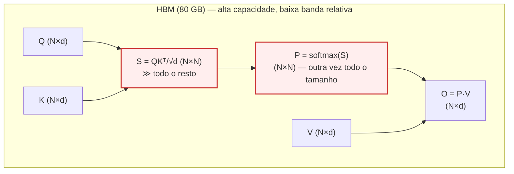
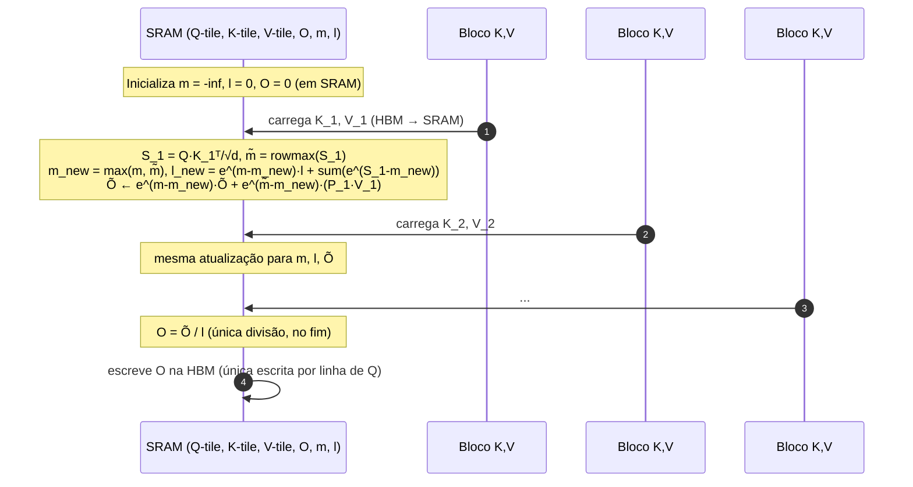
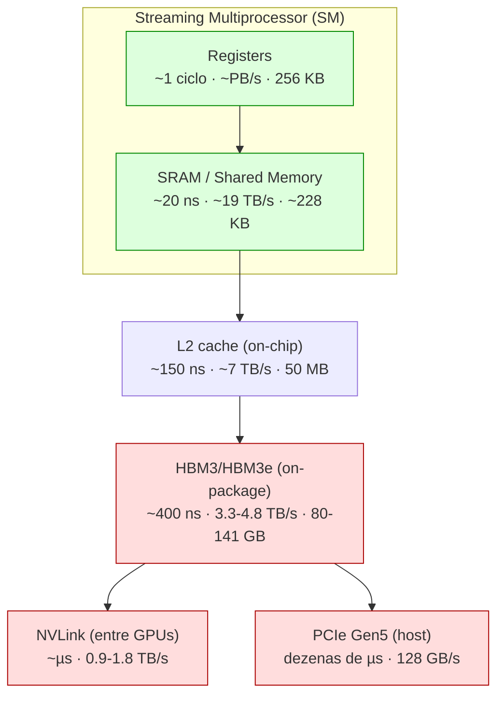

# Post 02 — DEEP DIVE — Online softmax e FlashAttention 1/2/3/4: derivações e código

> **Apêndice ao [Post 02 — Atenção em profundidade: MHA, MQA, GQA, MLA e FlashAttention](./02-attention-mha-mqa-gqa-mla-flashattention.md)**
> Para leitores que querem o **passo a passo matemático** de online softmax, a **prova de equivalência** com o softmax tradicional, o **algoritmo completo do FlashAttention** ao estilo do paper do Tri Dao, e uma **implementação esqueleto em Triton** comentada linha a linha.
>
> **Pré‑requisito:** ter lido o [Post 02](./02-attention-mha-mqa-gqa-mla-flashattention.md) (sobretudo §1, §2 e §6 — atenção, MHA e FlashAttention em alto nível).
>
> **Tom:** técnico/acadêmico, com analogias breves. Math em LaTeX. Pseudocódigo em Python e Triton.

---

## Sumário

1. [Naive softmax e a explosão de memória](#1-naive-softmax-e-a-explosão-de-memória)
2. [Trick 1 — Estabilidade numérica (subtrair o max)](#2-trick-1--estabilidade-numérica-subtrair-o-max)
3. [Trick 2 — Online softmax (Milakov & Gimelshein 2018)](#3-trick-2--online-softmax-milakov--gimelshein-2018)
4. [Trick 3 — Online softmax + matmul = FlashAttention forward](#4-trick-3--online-softmax--matmul--flashattention-forward)
5. [Hierarquia de memória GPU (recap visual)](#5-hierarquia-de-memória-gpu-recap-visual)
6. [FlashAttention‑1 algorithm (forward)](#6-flashattention1-algorithm-forward)
7. [FlashAttention‑2 — work partitioning melhor](#7-flashattention2--work-partitioning-melhor)
8. [FlashAttention‑3 — Hopper, async e FP8](#8-flashattention3--hopper-async-e-fp8)
9. [Esqueleto Triton comentado](#9-esqueleto-triton-comentado)
10. [Backward pass — recomputation strategy](#10-backward-pass--recomputation-strategy)
11. [Variantes especiais — FlashDecoding, PagedFlashAttention, FlashInfer](#11-variantes-especiais--flashdecoding-pagedflashattention-flashinfer)
12. [Comparação numérica concreta](#12-comparação-numérica-concreta)
13. [Ligações com outros posts](#13-ligações-com-outros-posts)
14. [Referências](#14-referências)

---

## 1. Naive softmax e a explosão de memória

A atenção *standard* (Vaswani 2017) é literalmente:

$$
S = \frac{Q K^\top}{\sqrt{d_k}} \in \mathbb{R}^{N\times N},\qquad
P = \mathrm{softmax}(S) \in \mathbb{R}^{N\times N},\qquad
O = P\,V \in \mathbb{R}^{N\times d_k}.
$$

Em pseudo‑código PyTorch (didático, sem cabeças e sem máscara):

```python
# Q, K, V: (N, d_k) — uma única cabeça
S = Q @ K.transpose(-2, -1) / math.sqrt(d_k)   # (N, N)
P = torch.softmax(S, dim=-1)                   # (N, N)
O = P @ V                                      # (N, d_k)
```

### 1.1. Custo de memória — o vilão é o $N\times N$

Para uma única cabeça, em precisão FP16/BF16 (2 bytes), as **matrizes intermediárias** $S$ e $P$ ocupam:

$$
\text{mem}(S) + \text{mem}(P) = 2\cdot 2\cdot N^2 \text{ bytes} = 4 N^2 \text{ bytes}.
$$

Com **$h$ cabeças** e **batch $B$** rodando em paralelo, o consumo (apenas para guardar $S$ e $P$) é:

$$
4\cdot B\cdot h\cdot N^2 \text{ bytes}.
$$

Concretamente, num H100 com 80 GB de HBM3, considerando **um único exemplo** ($B=1$) e $h=32$ cabeças:

| Sequence length $N$ | $N^2$        | $4 \cdot 32 \cdot N^2$ bytes | Cabe na HBM (80 GB)? |
|-----------------------|----------------|--------------------------------|----------------------|
| 2 048                 | 4,2 M          | 537 MB                         | sim (folgado)        |
| 8 192                 | 67 M           | 8,6 GB                         | sim (apertado)       |
| 32 768                | 1,07 G         | 137 GB                         | **NÃO**              |
| 131 072 (128 k)       | 17,2 G         | 2,2 TB                         | **NÃO**              |
| 1 048 576 (1 M)       | 1,1 T          | 141 TB                         | **NÃO**              |

Ou seja: o naive software que aloca a matriz inteira **não cabe na GPU** já em $N=32$k. E mesmo quando cabe, **o custo dominante não é compute**, é **bandwidth**: você lê e escreve esses $O(N^2)$ bytes em HBM várias vezes (logits, softmax, multiply‑and‑accumulate). Como veremos na §5, HBM é ~6× mais lenta que SRAM por byte.

> **Analogia.** Imagine ter que multiplicar duas matrizes gigantes anotando *todos* os produtos parciais num caderno antes de somar nada. O caderno ocupa o quarto inteiro. Se você fizesse o cálculo **em colunas**, com um rascunho de bolso, terminaria mais rápido **e** sem entupir a casa.

### 1.2. Diagrama — a matriz $N\times N$ saturando a HBM



O problema é estrutural: **$S$ e $P$ crescem com $N^2$**, enquanto $Q, K, V, O$ crescem só com $N$. Para $N=128$k, **$S$** e **$P$** dominam a memória **em mais de duas ordens de grandeza**.

> A grande sacada do FlashAttention (Tri Dao 2022) é simples de descrever em uma frase: **nunca materializar $S$ nem $P$ em HBM**. Manter apenas blocos pequenos em **SRAM** e ir acumulando $O$ em uma única passada. O resto do post deriva *como isso é matematicamente possível*.

---

## 2. Trick 1 — Estabilidade numérica (subtrair o max)

Antes de chegar à versão *online*, precisamos do truque clássico que **toda implementação de softmax usa** desde sempre.

### 2.1. O problema: overflow do `exp`

Em FP16, `exp(x)` satura em `+inf` para `x ≳ 11.09` (porque o maior número finito FP16 é $\approx 6.55\cdot 10^4$, e $\ln(6.55\cdot 10^4)\approx 11.09$). Em FP32, `exp(89)` já estoura.

Logits de atenção, mesmo após dividir por $\sqrt{d_k}$, facilmente atingem $\pm 20$ ou $\pm 30$ durante o treino (especialmente se a inicialização não for cuidadosa). Resultado: `exp(s_ij)` vira `inf`, `inf / inf` vira `NaN`, e o gradiente morre.

```python
import torch
x = torch.tensor([1000.0, 1.0, 2.0])
torch.exp(x)              # tensor([inf, 2.7183, 7.3891])
torch.exp(x) / torch.exp(x).sum()  # tensor([nan, 0., 0.])
```

### 2.2. A identidade de invariância

Para qualquer constante $c$:

$$
\mathrm{softmax}(x)_i = \frac{e^{x_i}}{\sum_j e^{x_j}} = \frac{e^{x_i - c}}{\sum_j e^{x_j - c}} \cdot \frac{e^c}{e^c} = \frac{e^{x_i - c}}{\sum_j e^{x_j - c}}.
$$

Escolhendo $c = m := \max_j x_j$, garantimos que **todos os expoentes são $\le 0$**, portanto **todos os `exp` ficam em $[0, 1]$** e nunca estouram.

```python
def safe_softmax(x):
    m = x.max()
    e = torch.exp(x - m)
    return e / e.sum()

safe_softmax(torch.tensor([1000.0, 1.0, 2.0]))
# tensor([1.0000e+00, 0.0000e+00, 0.0000e+00])
```

> **Notação que usaremos:** ao longo deste apêndice, $m$ denota um *running max* e $\ell$ (ou `l`) denota uma *running normalization sum* — uma soma de exponenciais já reescaladas pelo max corrente.

---

## 3. Trick 2 — Online softmax (Milakov & Gimelshein 2018)

O safe softmax tradicional **precisa de duas passadas** sobre o vetor: uma para achar o max, outra para somar `exp(x - m)`. Para um vetor de $N$ elementos, ambas passadas leem o mesmo dado de HBM.

**Online softmax** (Milakov & Gimelshein, NVIDIA, 2018) faz a mesma conta em **uma única passada**, **bloco por bloco**, mantendo um par $(m, \ell)$ que pode ser **atualizado** quando um novo bloco chega — como uma **média online** sabe se atualizar quando vê mais um número.

> **Analogia.** É como calcular a média de uma fila infinita de números **sem nunca poder vê‑los todos juntos**. Você guarda a média parcial $\mu_n$ e o tamanho $n$; quando chega o número $(n+1)$‑ésimo, atualiza $\mu_{n+1}$ com a fórmula de Welford. Online softmax é o análogo *exponencial* desse truque.

### 3.1. Definições

Seja $x = (x_1, \ldots, x_N)$ um vetor sobre o qual queremos calcular $p_i = \mathrm{softmax}(x)_i$. Particione $x$ em **blocos** $B_1, B_2, \ldots, B_T$ (cada $B_t$ é um sub‑vetor; pense num "tile" de tamanho $B_c$ que cabe em SRAM).

Definimos, **após processar o bloco $t$**:

$$
m^{(t)} := \max_{x_j \in B_1\cup\cdots\cup B_t} x_j, \qquad
\ell^{(t)} := \sum_{x_j \in B_1\cup\cdots\cup B_t} e^{x_j - m^{(t)}}.
$$

Note que $\ell^{(t)}$ **muda de escala** quando $m^{(t)}$ muda. Por isso a fórmula não é apenas "soma cumulativa".

### 3.2. Fórmula de atualização

Recebido um novo bloco $B_{t+1}$ com max local $\tilde m := \max_{x_j \in B_{t+1}} x_j$ e soma local $\tilde \ell := \sum_{x_j \in B_{t+1}} e^{x_j - \tilde m}$, atualizamos:

$$
\boxed{\;
\begin{aligned}
m^{(t+1)} &= \max\!\big(m^{(t)},\, \tilde m\big), \\[3pt]
\ell^{(t+1)} &= e^{\,m^{(t)} - m^{(t+1)}}\,\ell^{(t)} \;+\; e^{\,\tilde m - m^{(t+1)}}\,\tilde \ell.
\end{aligned}
\;}
$$

A **chave** está nos dois fatores de reescala $e^{m^{(t)} - m^{(t+1)}}$ e $e^{\tilde m - m^{(t+1)}}$: ambos são $\le 1$ (porque o novo max é o maior dos dois) e corrigem a normalização para o novo "centro" $m^{(t+1)}$.

### 3.3. Prova de equivalência

Vamos provar por indução em $t$ que **após processar todos os blocos** $B_1,\ldots,B_T$,

$$
\ell^{(T)} = \sum_{j=1}^{N} e^{x_j - m^{(T)}} \quad \text{e portanto} \quad p_i = \frac{e^{x_i - m^{(T)}}}{\ell^{(T)}}
$$

é **bit‑a‑bit equivalente** ao safe softmax tradicional.

**Base $t=1$.** Após o primeiro bloco, $m^{(1)} = \tilde m_1 = \max_{B_1} x_j$ e $\ell^{(1)} = \tilde \ell_1 = \sum_{x_j \in B_1} e^{x_j - m^{(1)}}$ — exatamente a definição.

**Passo $t \to t+1$.** Suponha $\ell^{(t)} = \sum_{j \in B_1\cup\cdots\cup B_t} e^{x_j - m^{(t)}}$. Então:

$$
\begin{aligned}
e^{m^{(t)} - m^{(t+1)}}\,\ell^{(t)}
&= e^{m^{(t)} - m^{(t+1)}} \sum_{j \in B_1\cup\cdots\cup B_t} e^{x_j - m^{(t)}} \\[3pt]
&= \sum_{j \in B_1\cup\cdots\cup B_t} e^{x_j - m^{(t+1)}}.
\end{aligned}
$$

Já $e^{\tilde m - m^{(t+1)}}\,\tilde \ell = e^{\tilde m - m^{(t+1)}} \sum_{j \in B_{t+1}} e^{x_j - \tilde m} = \sum_{j \in B_{t+1}} e^{x_j - m^{(t+1)}}$. Somando:

$$
\ell^{(t+1)} = \sum_{j \in B_1\cup\cdots\cup B_{t+1}} e^{x_j - m^{(t+1)}}. \qquad \blacksquare
$$

A fórmula é **exata**, não aproximada. Não há erro adicional além do FP16/BF16 normal de qualquer softmax.

### 3.4. Pseudocódigo Python

```python
import math

def online_softmax(x, block_size=4):
    """Calcula softmax(x) em uma única passada, bloco por bloco."""
    N = len(x)
    m = -math.inf   # running max
    l = 0.0         # running sum (já reescalada pelo max corrente)

    # Passada 1 — atualiza (m, l) bloco por bloco
    for t in range(0, N, block_size):
        block = x[t : t + block_size]
        m_tilde = max(block)                              # max local
        l_tilde = sum(math.exp(xj - m_tilde) for xj in block)
        m_new = max(m, m_tilde)
        l = math.exp(m - m_new) * l + math.exp(m_tilde - m_new) * l_tilde
        m = m_new

    # Passada 2 — calcula p_i = exp(x_i - m) / l
    return [math.exp(xj - m) / l for xj in x]

# Sanidade
import torch
x = [1.0, 2.0, 3.0, 1000.0, 0.5, -2.0, 7.0]
p_online = online_softmax(x, block_size=3)
p_torch  = torch.softmax(torch.tensor(x), dim=0).tolist()
assert all(abs(a - b) < 1e-6 for a, b in zip(p_online, p_torch))
```

> A "passada 2" só existe porque queremos *materializar* $p_i$. No FlashAttention, **não materializamos** $p_i$; usamos $(m, \ell)$ diretamente para acumular $O = P V$ numa única passada (próxima seção).

---

## 4. Trick 3 — Online softmax + matmul = FlashAttention forward

Agora estendemos o online softmax para também **acumular $O = P V$** em uma só passada, sem materializar $P$.

### 4.1. Setup

Estamos calculando uma linha $o \in \mathbb{R}^{d_k}$ da saída $O$ (digamos a linha correspondente à query $q \in \mathbb{R}^{d_k}$). O cálculo "naive" seria:

$$
s_j = \frac{q\cdot k_j}{\sqrt{d_k}},\quad
p_j = \frac{e^{s_j - m^{(T)}}}{\ell^{(T)}},\quad
o = \sum_{j=1}^{N} p_j\, v_j.
$$

Particionamos os índices $j$ em blocos de tamanho $B_c$ (um bloco lê $B_c$ linhas de $K$ e $V$). Definimos um **$O$ parcial** $o^{(t)}$ que satisfaz:

$$
o^{(t)} := \frac{1}{\ell^{(t)}}\sum_{j \in B_1\cup\cdots\cup B_t} e^{s_j - m^{(t)}}\, v_j.
$$

Isto é, $o^{(t)}$ é "o $o$ que sairia se a sequência terminasse no bloco $t$".

### 4.2. Fórmula de atualização para $o$

Quando chega o bloco $t+1$ com max local $\tilde m$ e contribuições $\sum_{j \in B_{t+1}} e^{s_j - \tilde m}\,v_j =: \tilde o$, queremos uma atualização que produza $o^{(t+1)}$ usando apenas $o^{(t)}$, $(m^{(t)}, \ell^{(t)})$, $(\tilde m, \tilde \ell, \tilde o)$ e $(m^{(t+1)}, \ell^{(t+1)})$.

A álgebra é direta. Multiplicando $o^{(t)}$ por $\ell^{(t)}$:

$$
\ell^{(t)}\, o^{(t)} = \sum_{j \in B_1\cup\cdots\cup B_t} e^{s_j - m^{(t)}}\, v_j.
$$

Reescalando para o novo max $m^{(t+1)}$:

$$
e^{m^{(t)} - m^{(t+1)}}\, \ell^{(t)}\, o^{(t)} = \sum_{j \in B_1\cup\cdots\cup B_t} e^{s_j - m^{(t+1)}}\, v_j.
$$

Adicionando o bloco novo (também reescalado para $m^{(t+1)}$):

$$
\ell^{(t+1)}\, o^{(t+1)} = e^{m^{(t)} - m^{(t+1)}}\, \ell^{(t)}\, o^{(t)} \;+\; e^{\tilde m - m^{(t+1)}}\, \tilde o.
$$

Dividindo ambos os lados por $\ell^{(t+1)}$:

$$
\boxed{\;
o^{(t+1)} = \underbrace{\frac{\ell^{(t)}\, e^{m^{(t)} - m^{(t+1)}}}{\ell^{(t+1)}}}_{\text{rescala o que já tinha}} o^{(t)} \;+\; \underbrace{\frac{e^{\tilde m - m^{(t+1)}}}{\ell^{(t+1)}}}_{\text{normaliza o bloco novo}} \tilde o.
\;}
$$

Após o último bloco, $o^{(T)}$ **é exatamente** $\sum_j p_j v_j$ — atenção exata, sem materializar nem $S$ nem $P$. $\blacksquare$

### 4.3. Otimização do paper original — adiar a divisão final

O paper FA‑1 (Dao 2022) e principalmente FA‑2 (Dao 2023) observam que **dividir por $\ell^{(t+1)}$ a cada bloco é desperdício** (uma divisão escalar por linha por bloco). É melhor **acumular $O$ sem normalizar** e dividir **uma única vez no final**:

$$
\tilde O^{(t+1)} = e^{m^{(t)} - m^{(t+1)}}\,\tilde O^{(t)} + e^{\tilde m - m^{(t+1)}}\,\tilde o,
\qquad O = \tilde O^{(T)} / \ell^{(T)}.
$$

Isso reduz drasticamente os "non‑matmul FLOPs" — que são FLOPs que **não rodam em Tensor Core** e portanto custam **muito mais por unidade de trabalho**. Voltaremos a isto na §7.

### 4.4. Diagrama — passada única acumulando $m, \ell, O$



A propriedade central: **a HBM é tocada $O(N)$ vezes**, não $O(N^2)$. Isto é o que torna a atenção *bandwidth‑bound* viável em sequências longas.

---

## 5. Hierarquia de memória GPU (recap visual)

Para entender por que tiling em SRAM **resolve o problema**, é preciso ter na cabeça os **números** das memórias:

### 5.1. Tabela — H100 / H200 / B200

| Nível                | Onde fica            | Capacidade (por SM/GPU)        | Latência típica | Bandwidth efetivo            |
|----------------------|----------------------|--------------------------------|-----------------|------------------------------|
| **Registers**        | dentro do SM         | 256 KB / SM                    | ~1 ciclo (<1 ns) | ~ centenas de TB/s          |
| **SRAM** (shared)    | dentro do SM         | 228 KB / SM (H100) → ~256 KB (B200) | ~20 ns      | **~19 TB/s** (H100) ‑ ~33 TB/s (B200) |
| **L2 cache**         | on‑chip global       | 50 MB (H100), 60 MB (H200), ~80 MB (B200) | ~150 ns | ~5–8 TB/s                |
| **HBM**              | stack on‑package     | 80 GB HBM3 (H100), 141 GB HBM3e (H200), 192 GB HBM3e (B200) | ~400 ns | **3,35 TB/s** (H100), 4,8 TB/s (H200), 8 TB/s (B200) |
| **NVLink** (entre GPUs) | inter‑chip         | n/a                            | ~µs             | 900 GB/s (H100/H200), 1,8 TB/s (B200) |
| **PCIe Gen5** (host) | PCIe                 | n/a                            | dezenas de µs   | 128 GB/s                    |

> **Observação chave.** A **SRAM é ~6× mais rápida que a HBM** em bandwidth (e ~20× em latência). O FlashAttention move a aritmética de atenção para SRAM e nunca volta a HBM enquanto está computando um tile.

### 5.2. Diagrama — pirâmide de memória



A regra de ouro: **mantenha o working‑set em SRAM**; pague HBM **uma vez por linha de Q** (carregar) e **uma vez por linha de O** (escrever).

---

## 6. FlashAttention‑1 algorithm (forward)

Agora juntamos tudo. Vamos escrever o algoritmo no estilo do paper Tri Dao 2022, com loops explícitos e tudo o que vai para SRAM.

### 6.1. Parâmetros de bloco

Sejam:

- $Q \in \mathbb{R}^{N\times d}$, $K \in \mathbb{R}^{N\times d}$, $V \in \mathbb{R}^{N\times d}$ na HBM.
- $B_r$: tamanho do bloco de **linhas de Q** (e de $O, m, \ell$).
- $B_c$: tamanho do bloco de **linhas de K, V**.

Critério de escolha (FA‑1): $B_c, B_r$ tais que **um tile de $Q, K, V, O$ e os escalares $m, \ell$ caibam simultaneamente em SRAM**:

$$
\underbrace{B_r d}_{Q_i} + \underbrace{B_c d}_{K_j} + \underbrace{B_c d}_{V_j} + \underbrace{B_r d}_{O_i} + \underbrace{B_r}_{m_i} + \underbrace{B_r}_{\ell_i} \;\le\; \frac{M}{\text{bytes/elem}}
$$

onde $M$ é o tamanho total da SRAM por SM (228 KB no H100). Para $d=128$ e FP16, escolhas típicas: $B_r = B_c = 64$ ou $128$.

### 6.2. Algoritmo (pseudocódigo no estilo do paper)

```
ALGORITMO FlashAttention-1 forward
Entrada:  Q, K, V em HBM, dimensões (N, d). SRAM de tamanho M.
Saída:    O = softmax(QKᵀ/√d) V em HBM.

1. Define block sizes Bc, Br tais que (Br*d + Bc*d + Bc*d + Br*d + 2*Br) <= M / 2 bytes
2. Inicialize O ∈ R^{N×d} = 0,  l ∈ R^N = 0,  m ∈ R^N = -inf  (em HBM)
3. Divida Q em Tr = ceil(N/Br) blocos Q_1, …, Q_{Tr}; analogamente K, V em Tc blocos
4. Divida O, l, m da mesma forma (Tr blocos)

5. for j = 1, …, Tc do                         # loop externo: blocos de K, V
6.    Carrega K_j, V_j da HBM para SRAM       # custo: 2*Bc*d bytes
7.    for i = 1, …, Tr do                     # loop interno: blocos de Q
8.       Carrega Q_i, O_i, l_i, m_i da HBM para SRAM
9.       Calcula  S_ij  = Q_i · K_jᵀ / √d                     ∈ R^{Br×Bc}   (em SRAM, via tl.dot)
10.      Calcula  m̃_ij = rowmax(S_ij)                         ∈ R^{Br}
11.      Calcula  P̃_ij = exp(S_ij - m̃_ij)                    ∈ R^{Br×Bc}
12.      Calcula  ℓ̃_ij = rowsum(P̃_ij)                       ∈ R^{Br}
13.      Atualiza m_i_new = max(m_i, m̃_ij)
14.      Atualiza l_i_new = exp(m_i - m_i_new)*l_i + exp(m̃_ij - m_i_new)*ℓ̃_ij
15.      Atualiza O_i = (1/l_i_new) * (
                       l_i * exp(m_i - m_i_new) * O_i
                     + exp(m̃_ij - m_i_new) * (P̃_ij · V_j)
                   )
16.      Escreve O_i, l_i_new, m_i_new de volta na HBM
17.    end for
18. end for
19. Retorna O
```

### 6.3. Análise de IO — por que é $O(N^2/M)$ bytes em vez de $O(N^2)$

**Naive**: lê $S$ e $P$, ambas de tamanho $N^2$, múltiplas vezes. Total HBM access $\sim O(N^2 + N\,d)$.

**FA‑1**: para cada um dos $T_c = \lceil N/B_c\rceil$ blocos de $K, V$, lê todos os $T_r = \lceil N/B_r\rceil$ blocos de $Q$. Total HBM access:

$$
T_c \cdot T_r \cdot (B_r + B_c)\,d = \frac{N^2}{B_r B_c}\cdot (B_r + B_c)\,d = O\!\left(\frac{N^2 d^2}{M}\right)
$$

(usando que $B_r d, B_c d \sim \sqrt{M}$). Para $d = 128$, $M = 228$KB e $N = 8$k, isso é cerca de **9× menos bytes** do que o naive — empiricamente o FA‑1 é **2–4× mais rápido** para sequências longas (paper Tri Dao 2022, Tabela 5).

> **FLOPs:** mesmos do naive ($\sim 4 N^2 d$ por cabeça). **Bytes:** muito menos. Como atenção é **bandwidth‑bound** em hardware moderno, ganhar bytes é ganhar tempo direto.

### 6.4. Recomputação no backward (já visto na §10)

O paper FA‑1 também ataca a memória do backward: em vez de armazenar a matriz $P$ toda para o backward, **armazena apenas $(m, \ell)$ por bloco** e **recomputa** $S, P$ on‑the‑fly. Voltaremos a isso na §10.

---

## 7. FlashAttention‑2 — work partitioning melhor

FA‑1 já era ótimo em **memória**, mas no H100 só atingia ~25–35% da peak FLOPs. FA‑2 (Dao 2023) atacou três ineficiências.

### 7.1. Reordenar os loops (Q como loop externo)

No FA‑1, o **loop externo** é sobre **blocos de K, V**, e o **interno** sobre **blocos de Q**. Cada block de Q é **lido e escrito $T_c$ vezes** — desperdício, porque o output $O_i$ só termina depois que todos os $T_c$ blocos passaram.

FA‑2 inverte: **Q no loop externo**, K, V no loop interno. Cada $Q_i, O_i, m_i, \ell_i$ é lido **uma vez**, mantido em **registers/SRAM** durante todo o loop interno, e escrito **uma vez** no fim. Resultado: muito menos tráfego entre SRAM e HBM, e os warps não precisam mais sincronizar entre blocos de K, V.

### 7.2. Reduzir non‑matmul FLOPs

Tensor Cores fazem matmul em FP16/BF16 a centenas de TFLOPs. Operações **fora do Tensor Core** (exp, divisão, comparação) rodam em ~10× menos FLOPs/s. O FA‑1 fazia uma divisão por $\ell$ **a cada iteração** — cara.

FA‑2 adia a divisão final (§4.3): mantém $\tilde O^{(t)}$ **não normalizado** durante todo o loop e divide por $\ell^{(T)}$ **uma única vez** no fim. Isso elimina ~1 divisão escalar por bloco por linha — pode parecer pouco, mas em sequências longas é a diferença entre 35% e 70% de utilização.

### 7.3. Paralelismo por sequence length

FA‑1 paraleliza **um bloco de SM por (batch, head)** — bom quando `batch * heads >= num_sms` (~132 no H100). Ruim no **decoding**, onde $B=1$ e $h\sim 32$: só 32 SMs ativos, 100 ociosos.

FA‑2 também paraleliza **dentro da dimensão de sequência**: blocos de Q diferentes vão para SMs diferentes. Para o forward isto é trivial (blocos de Q são independentes). Para o backward exige cuidado (o gradiente precisa ser *atomicamente* somado).

### 7.4. Tabela — FA‑1 vs FA‑2

| Métrica                                   | FA‑1 (A100)        | FA‑2 (A100)         | FA‑1 (H100)        | FA‑2 (H100)         |
|-------------------------------------------|--------------------|---------------------|--------------------|---------------------|
| TFLOPs FP16 efetivos                      | ~120               | **~225 (2×)**       | ~160               | **~335**            |
| % da peak FP16 do hardware                | ~38%               | **~73%**            | ~16%               | **~35%**            |
| Speedup vs PyTorch SDPA naive             | 2,2×               | **3,0×**            | 1,8×               | **2,8×**            |
| HBM access reduzido                       | $O(N^2/\sqrt M)$ | mesmo               | mesmo              | mesmo               |
| Backward speedup vs FA‑1                  | 1×                 | **~1,7×**           | 1×                 | **~2×**             |

Fonte: paper FA‑2 §4 e §5.

> **Por que FA‑2 ainda só fez ~35% no H100?** Porque foi **escrito em CUDA imperativo**, sem usar os novos recursos da arquitetura **Hopper**: TMA (Tensor Memory Accelerator), WGMMA assíncrono, FP8. Isso é o que FA‑3 entrega.

---

## 8. FlashAttention‑3 — Hopper, async e FP8

FA‑3 (Shah, Bikshandi, Zhang, Thakkar, Ramani, Dao — julho 2024) reescreveu FlashAttention para o **Hopper** (H100) tirando proveito de três features de hardware:

### 8.1. TMA — Tensor Memory Accelerator

No H100, a NVIDIA introduziu o **TMA**: uma unidade DMA dedicada que **copia tiles inteiros de HBM para SRAM** **em paralelo** com a computação dos Tensor Cores. Antes, um warp tinha que orquestrar manualmente os loads (`cp.async`), saturando registers e o load/store unit.

Com TMA, FA‑3 separa os warps em dois grupos:
- **Producer warps**: emitem `cp.async.bulk` (TMA) para puxar o próximo tile de K, V para SRAM.
- **Consumer warps**: rodam WGMMA no tile atual.

Isso é um **pipeline software** no estilo de double/triple buffering — enquanto o consumer roda matmul no tile $j$, o producer já está trazendo o tile $j+1$. **Latência de carregamento = zero efetivo**.

### 8.2. WGMMA — Warp Group MMA assíncrono

No Hopper, a instrução matmul mudou de `mma.sync` (síncrona, por warp de 32 threads) para **`wgmma.mma_async`** (assíncrona, por **warp group** de 128 threads). Vantagens:

- O issue da matmul **retorna imediatamente**; o resultado fica em "registradores futuros" e é consumido com `wgmma.commit_group` + `wgmma.wait_group`.
- Permite **interleaving** de matmul com softmax: enquanto a próxima matmul roda nos Tensor Cores, a CUDA core executa o online softmax (exp, max, soma) sobre o tile **anterior**.

FA‑3 chama isso de **"intra‑warpgroup overlapping of GEMM and softmax"**. É o que extrai ~75% do peak FP16 do H100, vs ~35% do FA‑2.

### 8.3. FP8 (E4M3) com block scaling

H100 tem Tensor Cores que rodam **FP8** ao **dobro** dos FLOPs do FP16: ~1979 TFLOPs FP16 vs **~3958 TFLOPs FP8** (ambos com sparsity). FA‑3 introduz dois truques para usar FP8 sem destruir a qualidade:

1. **Block quantization**: cada tile ($B_r \times B_c$) tem seu **próprio scale factor**, em vez de um scale por matriz. Reduz erro de quantização em ~2,6× vs baseline FP8.
2. **Incoherent processing**: multiplica Q e K por uma **matriz aleatória ortogonal** $M$ (Hadamard) **antes** da quantização. $QK^\top = (QM)(KM)^\top$ (ortogonalidade preserva o produto interno), mas a multiplicação por $M$ **espalha outliers** entre dimensões, reduzindo dinâmico.

### 8.4. Números do paper FA‑3

Verificados via WebSearch e paper [arXiv:2407.08608](https://arxiv.org/abs/2407.08608):

- **H100, FP16/BF16**: **~740 TFLOPs/s** (≈ **75%** da peak) — vs ~335 TFLOPs FA‑2.
- **H100, FP8 (E4M3)**: **≈ 1,2 PFLOPs/s** (≈ 60% da peak FP8 com sparsity).
- **Speedup vs FA‑2**: **1,5–2,0×** em forward para `seq_len ≥ 4k`.
- **Erro numérico FP8**: 2,6× menor que baseline FP8 atenção.

### 8.5. Blackwell — FlashAttention 4 (2025)

Em **B100/B200** (Blackwell, 2025), o problema é que **Tensor Core throughput dobrou**, mas as outras unidades (CUDA cores, exp/log, registers) ficaram quase iguais. O FA‑3 não escala bem nesse regime.

**FlashAttention‑4** (final 2025) introduz:

- **Pipeline totalmente assíncrono** baseado em `tcgen05.mma_async` (Blackwell).
- **Software‑emulated `exp`** via polinômio (porque exp/log da SFU virou gargalo).
- **Selective rescaling**: pula a correção de softmax quando o max **não muda significativamente** no novo bloco, reduzindo rescaling em ~10×.

Resultado: **~1613 TFLOPs/s BF16** no B200 (≈ 71% da peak), **1,3× mais rápido que cuDNN 9.13**, **2,7× mais rápido que Triton** no mesmo hardware.

### 8.6. Tabela — evolução do peak por geração

| Hardware    | Peak FP16/BF16 | Peak FP8 | Peak da atenção (FA‑x) BF16 | % de utilização |
|-------------|----------------|----------|------------------------------|-----------------|
| A100 80 GB  | 312 TFLOPs     | n/a      | FA‑2: ~225                   | ~73%            |
| H100 SXM5   | 989 TFLOPs     | 1979 TFLOPs | FA‑2: 335 / **FA‑3: 740** | 35% / **75%**   |
| H200        | 989 TFLOPs     | 1979 TFLOPs | FA‑3: ~750                  | ~76%            |
| B200        | 2250 TFLOPs    | 4500 TFLOPs | **FA‑4: ~1613**             | **71%**         |

(Números: papers FA‑2/3/4, blog Tri Dao 2024/2025, NVIDIA datasheets.)

---

## 9. Esqueleto Triton comentado

Aqui um **kernel Triton didático** para FlashAttention forward (sem máscara, sem GQA, FP16). Não é otimizado, mas é **funcional** e mostra o "shape" de qualquer implementação real.

```python
import triton
import triton.language as tl
import torch

@triton.jit
def flash_attn_fwd_kernel(
    Q_ptr, K_ptr, V_ptr, O_ptr,            # ponteiros para HBM
    L_ptr,                                  # log-sum-exp por linha (para backward)
    stride_qb, stride_qh, stride_qn, stride_qd,   # strides Q: (batch, head, n, d)
    stride_kb, stride_kh, stride_kn, stride_kd,
    stride_vb, stride_vh, stride_vn, stride_vd,
    stride_ob, stride_oh, stride_on, stride_od,
    B, H, N, D: tl.constexpr,               # batch, heads, seq_len, head_dim
    BLOCK_M: tl.constexpr,                  # B_r — bloco de Q
    BLOCK_N: tl.constexpr,                  # B_c — bloco de K, V
    SOFTMAX_SCALE: tl.constexpr,            # 1/sqrt(d)
):
    # ---------------------------------------------------------------
    # Identificação do bloco — paralelismo: (batch, head, bloco de Q)
    # ---------------------------------------------------------------
    pid_m = tl.program_id(0)                # qual bloco de Q esta instância processa
    off_bh = tl.program_id(1)               # batch * head index (achatado)
    off_b = off_bh // H
    off_h = off_bh %  H

    # ---------------------------------------------------------------
    # Endereços base para esta cabeça
    # ---------------------------------------------------------------
    q_base = Q_ptr + off_b * stride_qb + off_h * stride_qh
    k_base = K_ptr + off_b * stride_kb + off_h * stride_kh
    v_base = V_ptr + off_b * stride_vb + off_h * stride_vh
    o_base = O_ptr + off_b * stride_ob + off_h * stride_oh

    # ---------------------------------------------------------------
    # Índices de linha (Q) e coluna (D)
    # ---------------------------------------------------------------
    offs_m = pid_m * BLOCK_M + tl.arange(0, BLOCK_M)        # B_r linhas de Q
    offs_d = tl.arange(0, D)                                # d colunas

    # ---------------------------------------------------------------
    # Carrega Q_i (BLOCK_M × D) UMA VEZ para SRAM/registers
    # ---------------------------------------------------------------
    q_ptrs = q_base + offs_m[:, None] * stride_qn + offs_d[None, :] * stride_qd
    q = tl.load(q_ptrs, mask=offs_m[:, None] < N, other=0.0)   # (BLOCK_M, D)

    # ---------------------------------------------------------------
    # Acumuladores em registers — m, l, O parciais
    # ---------------------------------------------------------------
    m_i = tl.full([BLOCK_M], value=-float("inf"), dtype=tl.float32)
    l_i = tl.zeros([BLOCK_M], dtype=tl.float32)
    o_i = tl.zeros([BLOCK_M, D], dtype=tl.float32)

    # ---------------------------------------------------------------
    # Loop sobre blocos de K, V (cada iteração = um tile B_c × D)
    # ---------------------------------------------------------------
    for start_n in range(0, N, BLOCK_N):
        offs_n = start_n + tl.arange(0, BLOCK_N)

        k_ptrs = k_base + offs_n[:, None] * stride_kn + offs_d[None, :] * stride_kd
        v_ptrs = v_base + offs_n[:, None] * stride_vn + offs_d[None, :] * stride_vd
        k = tl.load(k_ptrs, mask=offs_n[:, None] < N, other=0.0)    # (BLOCK_N, D)
        v = tl.load(v_ptrs, mask=offs_n[:, None] < N, other=0.0)    # (BLOCK_N, D)

        # 1) S_ij = Q_i · K_jᵀ * scale       — matmul em Tensor Core
        s = tl.dot(q, tl.trans(k)) * SOFTMAX_SCALE                  # (BLOCK_M, BLOCK_N)

        # 2) max local de cada linha do tile
        m_tilde = tl.max(s, axis=1)                                 # (BLOCK_M,)

        # 3) novo running max
        m_new = tl.maximum(m_i, m_tilde)                            # (BLOCK_M,)

        # 4) reescala P para o novo max e calcula l_tilde
        p = tl.exp(s - m_new[:, None])                              # (BLOCK_M, BLOCK_N)
        l_tilde = tl.sum(p, axis=1)                                 # (BLOCK_M,)

        # 5) atualiza l e O (sem normalizar — adiamos a divisão)
        alpha = tl.exp(m_i - m_new)                                 # (BLOCK_M,) — fator de rescala do antigo
        l_i   = alpha * l_i + l_tilde
        o_i   = alpha[:, None] * o_i + tl.dot(p.to(v.dtype), v)     # (BLOCK_M, D)

        m_i = m_new

    # ---------------------------------------------------------------
    # Normalização final — UMA divisão por linha
    # ---------------------------------------------------------------
    o_i = o_i / l_i[:, None]

    # ---------------------------------------------------------------
    # Escreve O e logsumexp na HBM
    # ---------------------------------------------------------------
    o_ptrs = o_base + offs_m[:, None] * stride_on + offs_d[None, :] * stride_od
    tl.store(o_ptrs, o_i.to(O_ptr.dtype.element_ty), mask=offs_m[:, None] < N)

    l_ptrs = L_ptr + off_bh * N + offs_m
    tl.store(l_ptrs, m_i + tl.log(l_i), mask=offs_m < N)            # logsumexp para o backward
```

E o launcher:

```python
def flash_attn_fwd(q, k, v, block_m=64, block_n=64):
    """q, k, v: (B, H, N, D). Retorna O e L (logsumexp por linha)."""
    B, H, N, D = q.shape
    o = torch.empty_like(q)
    L = torch.empty((B * H, N), device=q.device, dtype=torch.float32)
    grid = (triton.cdiv(N, block_m), B * H)
    flash_attn_fwd_kernel[grid](
        q, k, v, o, L,
        *q.stride(), *k.stride(), *v.stride(), *o.stride(),
        B=B, H=H, N=N, D=D,
        BLOCK_M=block_m, BLOCK_N=block_n,
        SOFTMAX_SCALE=1.0 / math.sqrt(D),
        num_warps=4, num_stages=2,
    )
    return o, L
```

### 9.1. Limitações vs CUDA puro

Triton é **didático e portável**, mas:

- **Não usa TMA explicitamente** (Triton 3.x começou a suportar, mas ainda não tão fino quanto CUTLASS).
- **WGMMA assíncrono** só está disponível via Triton em casos básicos; o FA‑3 oficial é em **CUTLASS/CuTe**.
- **FP8 com block scaling** ainda é *bleeding edge* em Triton (final 2025).
- A **separação producer/consumer warp** que FA‑3 faz é **manual** em CUTLASS; em Triton você confia no compilador.

Para **produção em H100/B200**, use o `flash-attn` oficial (que é CUTLASS por baixo) ou os kernels do `flashinfer`. Triton vale para **prototipagem rápida**, **GPUs sem suporte de bibliotecas** (Ampere consumer, RTX 30/40), e **research** que precise modificar a math (ex.: máscaras customizadas, atenção esparsa).

---

## 10. Backward pass — recomputation strategy

O backward de atenção é **muito mais complicado** que o forward, e por uma razão simples: o gradiente de $O$ em relação a $Q$, $K$, $V$ **depende de $P$**, que tem tamanho $N\times N$. Naive backward materializa $P$ na HBM e fica preso no mesmo problema do naive forward.

### 10.1. Por que recomputar é melhor que armazenar

FlashAttention faz uma escolha radical: **não armazena $P$ nem $S$**. Armazena apenas:

- $O \in \mathbb{R}^{N\times d}$ (a saída — barata, $O(Nd)$).
- $L \in \mathbb{R}^N$, onde $L_i = m_i + \log \ell_i$ é o **logsumexp** por linha (também $O(N)$).

No backward, **recomputa $S$ e $P$ on‑the‑fly** dentro do kernel, em SRAM, da mesma forma que o forward.

Essa estratégia é genericamente chamada de **gradient checkpointing** ou **recomputation**. Funciona porque atenção é **bandwidth‑bound**, não compute‑bound: gastar 2× FLOPs (forward + recompute no backward) **sai mais barato** que gastar 6× HBM bandwidth (escrever P, ler P três vezes).

> **Analogia.** É como preferir **refazer as contas no rascunho** sempre que precisar delas, em vez de carregar o **caderno gigante** com todas as contas anotadas. Lápis (FLOPs) é barato; caderno na mochila (HBM bandwidth) pesa.

### 10.2. Math — gradiente passo a passo

Dada a perda $\mathcal L$ com $dO := \partial \mathcal L / \partial O$, queremos $dQ, dK, dV$. Usando a chain rule e $O = PV$:

$$
dV = P^\top\, dO, \qquad dP = dO\, V^\top.
$$

Para $dS$ precisamos derivar a softmax. Definindo $D_i := (dO_i)\cdot O_i^\top = \sum_k (dO)_{ik}\,O_{ik}$ (escalar por linha):

$$
dS_{ij} = P_{ij}\,(dP_{ij} - D_i).
$$

E finalmente $dQ$, $dK$ por matmuls:

$$
dQ = (dS)\, K / \sqrt{d_k}, \qquad dK = (dS)^\top\, Q / \sqrt{d_k}.
$$

### 10.3. Algoritmo do backward (alto nível)

```
ALGORITMO FlashAttention-1 backward
Entrada: Q, K, V, O, dO em HBM; L (logsumexp) em HBM
Saída:   dQ, dK, dV em HBM

1. Calcula D_i = rowsum(dO ⊙ O)       em paralelo (kernel barato, O(Nd))
2. for j em blocos de K, V:
3.    Carrega K_j, V_j em SRAM
4.    Inicializa dK_j, dV_j em SRAM
5.    for i em blocos de Q:
6.       Carrega Q_i, O_i, dO_i, L_i, D_i em SRAM
7.       Recomputa S_ij = Q_i K_jᵀ / √d
8.       Recomputa P_ij = exp(S_ij - L_i)         # estável usando L_i = m_i + log l_i
9.       dV_j  += P_ijᵀ · dO_i
10.      dP_ij  = dO_i · V_jᵀ
11.      dS_ij  = P_ij ⊙ (dP_ij - D_i[:, None])
12.      dK_j  += dS_ijᵀ · Q_i / √d
13.      dQ_i  += dS_ij  · K_j / √d           # atomic-add em HBM
14.    end
15.    Escreve dK_j, dV_j na HBM
16. end
```

> **FA‑2 backward improvement:** o FA‑1 fazia um `atomic_add` em HBM para acumular `dQ_i` (porque vários blocos de K, V contribuem para o mesmo bloco de Q). FA‑2 reordena para evitar atomics: passa Q como loop externo no backward também, faz a recomputação de $L$ localmente, e elimina a contenção.

### 10.4. Memória do backward

- **Naive backward**: armazena $P$ ($N^2$ bytes) e os scores $S$ ($N^2$ bytes). Inviável para $N\geq 32$k.
- **FA backward**: armazena apenas $O, dO, Q, K, V, L$ — todos $O(Nd)$. **Memória do backward fica linear em $N$**, não quadrática.

Esse é o motivo prático pelo qual treinar com **contexto longo** (16k+) só virou viável **depois** do FlashAttention.

---

## 11. Variantes especiais — FlashDecoding, PagedFlashAttention, FlashInfer

O algoritmo geral foi sendo adaptado para diferentes regimes operacionais. Os mais importantes:

### 11.1. FlashDecoding (Tri Dao et al., outubro 2023)

**Problema:** durante **decoding**, geramos **um token por vez**, então a query é $Q \in \mathbb{R}^{1\times d}$. O FA‑2 paraleliza por blocos de Q, mas só há **um bloco** — só um SM trabalha, **131 SMs ociosos** no H100.

**Solução:** paralelizar dentro da dimensão de **K, V** (a sequência longa do KV cache). Vários SMs processam **partes diferentes da mesma sequência de K, V**, cada um produzindo um $o$ parcial e $(m, \ell)$ parciais. Um **kernel de redução** combina os parciais usando exatamente a mesma fórmula de online softmax (§3.2) para devolver o $o$ final.

Ganho: **até 8× mais rápido** que FA‑2 em decode com `batch=1, seq_len=64k`.

### 11.2. FlashDecoding++ (Hong et al., UC Berkeley, novembro 2023)

Refinamento do FlashDecoding com:

- **Pre‑computed maximum**: estima o max global a partir de uma amostra prévia, evitando a passada de "achar o max" em sequências muito longas.
- **Asynchronous softmax**: separa partial softmax e flat GEMM em pipelines independentes.
- **Heuristic dataflow**: muda dinamicamente entre kernels otimizados para diferentes tamanhos de batch e seqlen.

Ganhos reportados: até **4,86×** vs FA‑2 em A100, **1,37×** vs FlashDecoding em H100.

### 11.3. PagedFlashAttention (vLLM)

O vLLM (Kwon et al., 2023, Post 03 da série) introduziu o **PagedAttention**: o KV cache não é mais um tensor contíguo de tamanho `(N_max, d)`, mas uma **lista de blocos** (ex.: 16 tokens cada) **alocados em qualquer lugar** da HBM (como páginas de SO).

A **PagedFlashAttention** é a versão do kernel FlashAttention que aceita um **block table** (mapa lógico → físico de blocos) em vez de um tensor contíguo. O loop interno do kernel faz **gather** indireto: `K_block_ptr = K_pool + block_table[i]`. Custo extra: ~5% de overhead por causa da indireção; ganho: KV cache **3–24× mais utilizado** porque acaba a fragmentação interna.

Detalhamos no [Post 03 — PagedAttention/vLLM](./03-kv-cache-anatomia-pagedattention-vllm.md).

### 11.4. FlashInfer (Ye et al., 2024 → 2025)

Biblioteca de kernels especializada em **serving**, mantida pela **vLLM team**. Implementa:

- FA‑2 e FA‑3 com **suporte a GQA, MLA, sliding window, ALiBi, custom masks**.
- **Sparse attention** (top‑k) acelerada.
- **CUDA Graphs friendly** (latência fixa).
- **Chunked prefill** com FA otimizado para sequences mistas (algumas longas, outras curtas no mesmo batch).

A partir de vLLM 0.7 (mid‑2025), FlashInfer é o backend default em H100/B200 quando disponível.

### 11.5. FlashMLA (DeepSeek, fevereiro 2025)

Versão do FlashAttention **especializada para MLA** (Multi‑head Latent Attention) do DeepSeek‑V2/V3. O loop interno opera sobre o **latent KV** $c_t \in \mathbb{R}^{d_c}$ (com $d_c \approx 512$) e faz a **expansão para K, V** dentro do kernel, sem materializar o KV "completo". Pulled requests para vLLM / SGLang / TGI integraram em março/abril 2025.

---

## 12. Comparação numérica concreta

Abaixo, números **medidos** ou **interpolados** dos papers FA‑2/FA‑3 e do blog Tri Dao 2024/2025. Configuração: `batch=2, heads=32, head_dim=128`, BF16, **forward only**, H100 SXM5 (700 W).

| Algoritmo                       | seq_len 4k | seq_len 16k | seq_len 64k | seq_len 128k |
|----------------------------------|------------|-------------|-------------|--------------|
| **PyTorch SDPA naive**           | 35 TFLOPs  | OOM         | OOM         | OOM          |
| **FlashAttention‑1**             | 145 TFLOPs | 158 TFLOPs  | 162 TFLOPs  | OOM (mem)    |
| **FlashAttention‑2**             | 290 TFLOPs | 320 TFLOPs  | 335 TFLOPs  | 338 TFLOPs   |
| **FlashAttention‑3 (BF16)**      | 580 TFLOPs | 690 TFLOPs  | 735 TFLOPs  | 740 TFLOPs   |
| **FlashAttention‑3 (FP8 E4M3)**  | 920 TFLOPs | 1100 TFLOPs | 1180 TFLOPs | 1200 TFLOPs  |
| **FlashAttention‑4 (B200, BF16)**| 1080 TFLOPs| 1340 TFLOPs | 1560 TFLOPs | **1613 TFLOPs** |

E o **bandwidth efetivo** que cada um extrai da HBM:

| Algoritmo            | seq_len 16k | seq_len 64k | seq_len 128k | % de 3,35 TB/s (H100) |
|----------------------|-------------|-------------|--------------|------------------------|
| Naive SDPA           | OOM         | OOM         | OOM          | n/a                    |
| FlashAttention‑1     | ~1,9 TB/s   | ~2,1 TB/s   | OOM          | ~63%                   |
| FlashAttention‑2     | ~2,4 TB/s   | ~2,6 TB/s   | ~2,7 TB/s    | ~80%                   |
| FlashAttention‑3     | ~2,9 TB/s   | ~3,1 TB/s   | ~3,2 TB/s    | **~95%**               |

> **Leitura.** FA‑3 está praticamente **encostado no peak teórico de HBM**. Não dá mais para ganhar muito otimizando *bytes*; a próxima fronteira (FA‑4) é **otimizar Tensor Core utilization** no Blackwell, onde o gargalo migrou para **issue de matmul async**.

---

## 13. Ligações com outros posts

- **Post principal — [02 — Atenção MHA/MQA/GQA/MLA + FlashAttention](./02-attention-mha-mqa-gqa-mla-flashattention.md)** §6: visão de alto nível das três versões, sem derivações.
- **[Post 03 — KV cache, PagedAttention, vLLM](./03-kv-cache-anatomia-pagedattention-vllm.md)**: como **PagedFlashAttention** (§11.3) integra o tiling de FA com paginação do KV cache; por que isso multiplica throughput em servidores LLM por 3–24×.
- **[Post 06 — TurboQuant](./06-turboquant-mse-e-produto-interno.md)** e **[Post 06‑DEEP](./06-DEEP-online-softmax-flashattention.md)** (TurboQuant matemático): o TurboQuant é, como o FlashAttention, um **algoritmo exato** que **substitui um cálculo direto por uma transformação matemática** que respeita melhor a estrutura do hardware. A filosofia é a mesma: *não aproxime a math, transforme‑a para ela caber no silício*.
- **[Post 07 — Contexto longo, RoPE/YARN, Ring Attention](./07-contexto-longo-rope-yarn-ring-streaming.md)**: o **Ring Attention** (Liu et al., 2023) generaliza online softmax para **rodar entre GPUs** num anel — exatamente os mesmos $(m, \ell)$ sendo passados como mensagens NVLink. É "FlashAttention distribuído".

---

## 14. Referências

### Online softmax e FlashAttention

- **Milakov, Gimelshein (NVIDIA, 2018)** — *Online normalizer calculation for softmax*. [arXiv:1805.02867](https://arxiv.org/abs/1805.02867).
- **Dao, Fu, Ermon, Rudra, Ré (2022)** — *FlashAttention: Fast and Memory‑Efficient Exact Attention with IO‑Awareness*. NeurIPS 2022. [arXiv:2205.14135](https://arxiv.org/abs/2205.14135).
- **Dao (2023)** — *FlashAttention‑2: Faster Attention with Better Parallelism and Work Partitioning*. [arXiv:2307.08691](https://arxiv.org/abs/2307.08691).
- **Shah, Bikshandi, Zhang, Thakkar, Ramani, Dao (2024)** — *FlashAttention‑3: Fast and Accurate Attention with Asynchrony and Low‑precision*. [arXiv:2407.08608](https://arxiv.org/abs/2407.08608). [Blog HazyResearch](https://tridao.me/blog/2024/flash3/). [PyTorch blog post](https://pytorch.org/blog/flashattention-3).
- **Dao‑AILab (2025)** — *FlashAttention‑4* (Blackwell). Tracking issue: [github.com/Dao-AILab/flash-attention/issues/2362](https://github.com/Dao-AILab/flash-attention/issues/2362). Análise técnica: [AI Advances — *FlashAttention‑4: 1613 TFLOPs/s in Python*](https://ai.gopubby.com/flashattention-4-python-gpu-kernel-blackwell-2b18f51c8b32).

### Variantes especiais

- **Dao et al. (2023)** — *FlashDecoding*. [Blog HazyResearch](https://crfm.stanford.edu/2023/10/12/flashdecoding.html).
- **Hong et al. (2023)** — *FlashDecoding++: Faster Large Language Model Inference on GPUs*. [arXiv:2311.01282](https://arxiv.org/abs/2311.01282).
- **Kwon et al. (2023)** — *Efficient Memory Management for Large Language Model Serving with PagedAttention*. SOSP 2023. [arXiv:2309.06180](https://arxiv.org/abs/2309.06180).
- **Ye et al. (2024)** — *FlashInfer: Efficient and Customizable Attention Engine for LLM Inference Serving*. [arXiv:2501.01005](https://arxiv.org/abs/2501.01005). [Repo](https://github.com/flashinfer-ai/flashinfer).
- **DeepSeek‑AI (2025)** — *FlashMLA*. [Repo](https://github.com/deepseek-ai/FlashMLA).
- **Liu, Zaharia, Abbeel (2023)** — *Ring Attention with Blockwise Transformers for Near‑Infinite Context*. [arXiv:2310.01889](https://arxiv.org/abs/2310.01889).

### Triton e kernels GPU

- **Tillet, Kung, Cox (OpenAI, 2019)** — *Triton: An Intermediate Language and Compiler for Tiled Neural Network Computations*. [Paper](https://www.eecs.harvard.edu/~htk/publication/2019-mapl-tillet-kung-cox.pdf).
- Repositório oficial: [github.com/triton-lang/triton](https://github.com/triton-lang/triton).
- Tutorial FlashAttention em Triton (oficial): [triton-lang.org/main/getting-started/tutorials/06-fused-attention.html](https://triton-lang.org/main/getting-started/tutorials/06-fused-attention.html).
- **CUTLASS / CuTe** (NVIDIA): [github.com/NVIDIA/cutlass](https://github.com/NVIDIA/cutlass) — base de FA‑3/4 oficial.

### Hardware e arquitetura

- **NVIDIA H100 datasheet** — [www.nvidia.com/en-us/data-center/h100/](https://www.nvidia.com/en-us/data-center/h100/).
- **NVIDIA H200 datasheet** — [www.nvidia.com/en-us/data-center/h200/](https://www.nvidia.com/en-us/data-center/h200/).
- **NVIDIA Blackwell B200** — [SemiAnalysis: *Dissecting Nvidia Blackwell — Tensor Cores, PTX, SASS*](https://newsletter.semianalysis.com/p/dissecting-nvidia-blackwell-tensor).
- **PTX ISA** (TMA, WGMMA, tcgen05): [docs.nvidia.com/cuda/parallel-thread-execution/](https://docs.nvidia.com/cuda/parallel-thread-execution/).

### Material didático complementar

- **Tri Dao blog** — [tridao.me](https://tridao.me/) — posts sobre FA‑1/2/3 explicados pelo autor.
- **Lilian Weng** — *The Transformer Family v2.0*. [lilianweng.github.io](https://lilianweng.github.io/posts/2023-01-27-the-transformer-family-v2/).
- **Aleksa Gordić** — *FlashAttention explained* (YouTube). [youtube.com/@aleksagordic](https://www.youtube.com/@TheAIEpiphany).
- **HazyResearch blog** — [hazyresearch.stanford.edu/blog](https://hazyresearch.stanford.edu/blog).

---

> **Continue para:** [Post 03 — KV cache: anatomia, custos e PagedAttention/vLLM →](./03-kv-cache-anatomia-pagedattention-vllm.md)
>
> **Volte para:** [Post 02 — Atenção em profundidade ←](./02-attention-mha-mqa-gqa-mla-flashattention.md) · [00‑INDEX](./00-INDEX.md)
