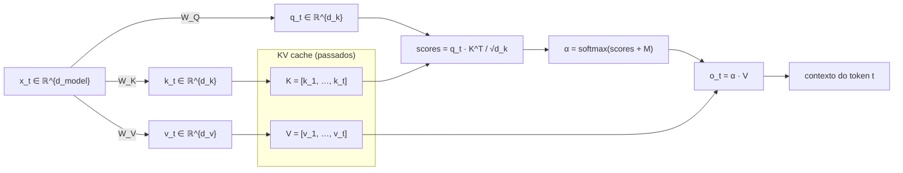
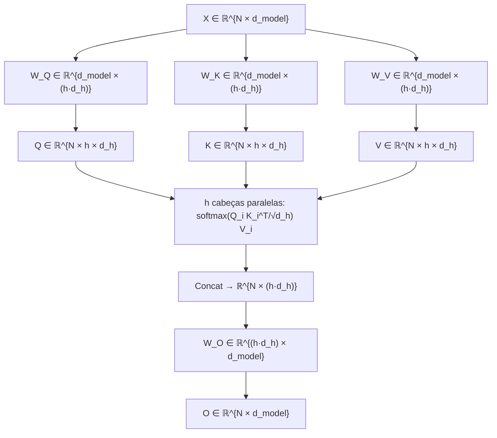
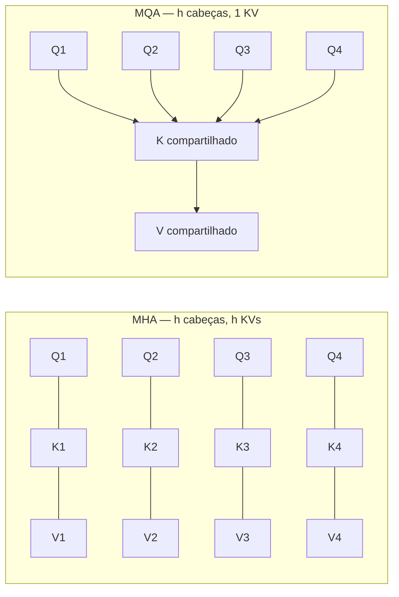
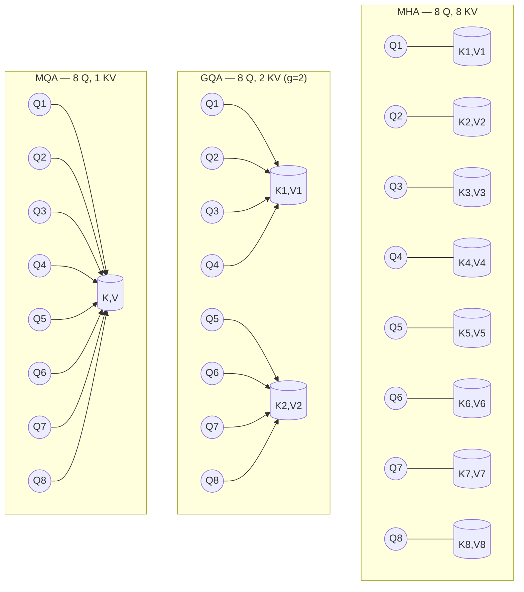
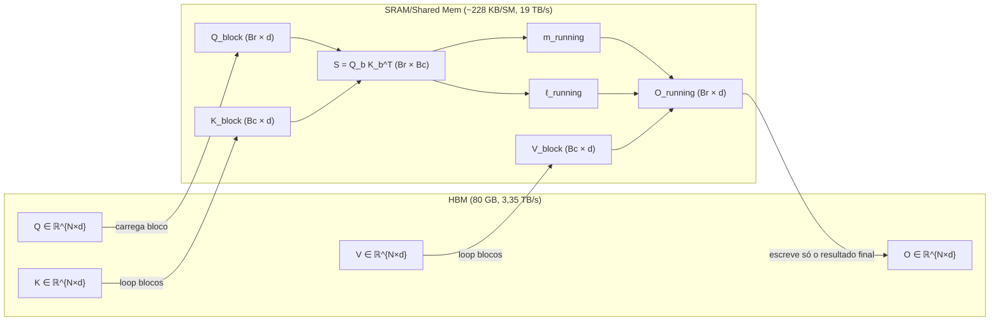
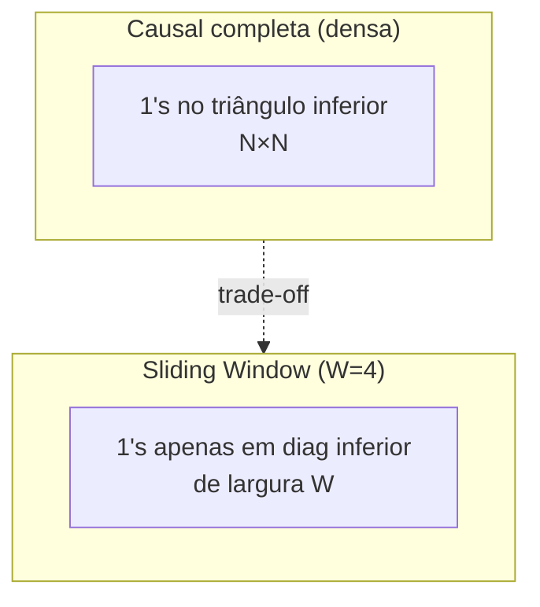

# Post 02 — Atenção em profundidade: MHA, MQA, GQA, MLA e FlashAttention

> **Série:** *LLMs em Profundidade — Da Atenção ao TurboQuant e Além*  
> **Pré-requisito:** [Post 01 — Arquitetura Transformer & LLMs decoder-only](./01-arquitetura-transformer-decoder-llm.md)  
> **Próximo:** [Post 03 — KV cache: anatomia, custos e PagedAttention/vLLM](./03-kv-cache-anatomia-pagedattention-vllm.md)  
> **Índice:** [00-INDEX](./00-INDEX.md)

---

## TL;DR

A **atenção** é o coração do Transformer e, ao mesmo tempo, o seu maior gargalo prático. Neste post:

- Recapitulamos a fórmula $\text{Attn}(Q,K,V) = \text{softmax}\!\left(\dfrac{QK^\top}{\sqrt{d_k}} + M\right)V$, com **máscara causal** $M$, passo a passo.
- Mostramos por que **Multi-Head Attention (MHA)** virou padrão e por que ela impõe um **custo $O(N^2 \cdot d)$** em compute e um KV cache linear em **número de cabeças**.
- Apresentamos as três grandes famílias de **redução de KV**: **MQA** (Shazeer, 2019), **GQA** (Ainslie et al., 2023) e **MLA** (DeepSeek‑V2/V3, 2024–2025), com tabelas comparativas.
- Detalhamos **FlashAttention 1/2/3** (Tri Dao et al., 2022 → 2024): atenção *exata* mas **IO‑aware**, tiling em **SRAM** vs **HBM**, *recomputation*, e uso de Tensor Cores assíncronos do **Hopper (H100)** + **FP8** no FA‑3.
- Comparamos **Sliding Window Attention (Mistral)**, **Longformer** e **BigBird** como variantes esparsas para contexto longo.
- Fechamos com uma **tabela síntese** unindo *parâmetros KV*, *qualidade*, *throughput* e *quem usa o quê na prática*.

> Não cobrimos aqui **quantização de KV** (Posts 05/06), **PagedAttention/vLLM em detalhe** (Post 03) nem **tokenização/embeddings** (Post 01).

---

## 1. Recapitulando: o que é atenção (em uma página)

No [Post 01](./01-arquitetura-transformer-decoder-llm.md) vimos que uma LLM **decoder-only** processa uma sequência de tokens **autoregressivamente**: para gerar o próximo token, ela olha para todos os tokens anteriores. O bloco que faz esse "olhar para o passado" é a **self-attention causal**.

Cada token $x_t \in \mathbb{R}^{d_{\text{model}}}$ é projetado em três vetores:

$$
q_t = x_t W_Q,\quad k_t = x_t W_K,\quad v_t = x_t W_V,\qquad W_Q, W_K, W_V \in \mathbb{R}^{d_{\text{model}} \times d_k}
$$

Empilhando os vetores ao longo da sequência, obtemos as matrizes $Q, K, V \in \mathbb{R}^{N \times d_k}$, onde $N$ é o comprimento atual. A atenção é então:

$$
\boxed{\;\text{Attn}(Q,K,V) = \text{softmax}\!\left(\dfrac{QK^\top}{\sqrt{d_k}} + M\right) V \;}
$$

com a **máscara causal** $M_{ij} = -\infty$ se $j > i$ e $0$ caso contrário (impede que o token $i$ "veja o futuro").

> **Analogia.** O token consulta um arquivo de memórias passadas. A *query* $q_t$ é a **pergunta** ("o que importa para mim agora?"). Cada *key* $k_j$ é uma **etiqueta** dizendo "eu falo sobre isso". O produto interno $q_t \cdot k_j$ mede o **encaixe pergunta‑etiqueta**. O softmax transforma esses encaixes numa **distribuição de pesos**, e o resultado é uma **mistura ponderada dos valores** $v_j$ — uma versão refinada do conteúdo passado, focada no que é relevante agora.

### 1.1. Diagrama do fluxo (1 cabeça, 1 token)



A figura é a "**fórmula desenhada**". Note o papel central do **KV cache**: durante a geração, **não recomputamos K e V dos tokens passados** — eles ficam em memória. Esse cache é o vilão silencioso da inferência de LLMs (Post 03).

### 1.2. Por que normalizar por $\sqrt{d_k}$?

Se $q$ e $k$ têm coordenadas i.i.d. com variância 1, então $q \cdot k$ tem **variância $d_k$**. Sem normalização, com $d_k = 128$, os logits do softmax explodiriam para magnitudes $\sim \sqrt{128} \approx 11$, saturando o softmax (uma única posição dominaria). Dividir por $\sqrt{d_k}$ traz os logits de volta a uma escala $O(1)$, preservando **gradientes** estáveis.

---

## 2. Multi-Head Attention (MHA): por que múltiplas cabeças

Vaswani et al. (2017) observaram: **uma única cabeça** força todos os "tipos de atenção" (sintática, semântica, posicional, co‑referência) a competir pelo mesmo subespaço de $d_k$ dimensões. **Multi‑Head Attention** divide o trabalho:

$$
\text{MHA}(X) = \big[\,\text{head}_1; \dots; \text{head}_h\,\big]\,W_O
$$

$$
\text{head}_i = \text{Attn}(X W_Q^{(i)},\; X W_K^{(i)},\; X W_V^{(i)}),\qquad W_*^{(i)} \in \mathbb{R}^{d_{\text{model}} \times d_h},\; d_h = \tfrac{d_{\text{model}}}{h}
$$

Cada uma das $h$ cabeças trabalha num **subespaço** próprio $\mathbb{R}^{d_h}$; depois concatenamos e projetamos de volta com $W_O \in \mathbb{R}^{d_{\text{model}} \times d_{\text{model}}}$.

> **Analogia.** Várias cabeças = **vários especialistas olhando a mesma frase com lentes diferentes**. Um cuida de relações sujeito‑verbo, outro de pronomes, outro de tom emocional, outro de palavras-chave técnicas. No fim, juntamos os pareceres num único parecer combinado.

### 2.1. Configurações típicas em LLMs

| Modelo | $d_{\text{model}}$ | $h$ (cabeças Q) | $h_{kv}$ (cabeças KV) | $d_h$ | Tipo |
|---|---:|---:|---:|---:|---|
| GPT‑2 small | 768 | 12 | 12 | 64 | MHA |
| GPT‑3 175B | 12 288 | 96 | 96 | 128 | MHA |
| Llama 1 7B | 4 096 | 32 | 32 | 128 | MHA |
| Llama 2 7B | 4 096 | 32 | 32 | 128 | MHA |
| Llama 2 70B | 8 192 | 64 | 8 | 128 | **GQA (8 grupos)** |
| Llama 3 8B | 4 096 | 32 | 8 | 128 | **GQA (8 grupos)** |
| Llama 3 70B | 8 192 | 64 | 8 | 128 | **GQA (8 grupos)** |
| Mistral 7B | 4 096 | 32 | 8 | 128 | **GQA + SWA** |
| Qwen2.5 7B | 3 584 | 28 | 4 | 128 | **GQA (4 grupos)** |
| DeepSeek‑V3 | 7 168 | 128 | — | 128 | **MLA** |
| PaLM 2 | — | — | 1 | — | **MQA** |

A migração **MHA → GQA → MLA** entre 2022 e 2025 não é cosmética: é direta consequência de quem **paga a conta** da memória durante a inferência.

### 2.2. Onde cada projeção mora



---

## 3. O custo quadrático e a explosão do KV cache

### 3.1. Compute: $O(N^2 \cdot d)$

Com sequência de comprimento $N$, $QK^\top \in \mathbb{R}^{N \times N}$ custa **$N^2 \cdot d_k$** multiplicações por cabeça; multiplicar pelos valores $V$ custa outras **$N^2 \cdot d_v$**. Total por cabeça: $O(N^2 \cdot d_h)$. Somando sobre $h$ cabeças e $L$ camadas:

$$
\text{FLOPs}_{\text{atenção}} \approx 4 \cdot L \cdot N^2 \cdot d_{\text{model}}
$$

Compare com o custo das **MLPs feed‑forward** (lineares em $N$): para $N$ "pequeno" (até alguns milhares), MLPs dominam; a partir de **$N \sim 8\text{–}16\,\text{k}$ tokens**, a atenção começa a dominar — e para $N = 128\,\text{k}$ ela é o **fator dominante** absoluto.

### 3.2. Memória de scores: a outra face do quadrático

A matriz $QK^\top$ **inteira** ocupa $N^2$ floats *por cabeça por camada*. Em FP16, com $N = 32\,768$, são $32\,768^2 \cdot 2 = 2\,\text{GB}$ **por cabeça por camada**. Para um Llama 70B (8 cabeças KV × 80 camadas), seriam **1,28 TB** — obviamente impossível materializar. É exatamente esse o problema que o **FlashAttention** resolve sem mudar a matemática (Seção 7).

### 3.3. KV cache: tamanho exato

Durante a geração autoregressiva, **K e V de todos os tokens passados** ficam em HBM. Para um modelo MHA com:

- $L$ camadas
- $h_{kv}$ cabeças KV
- $d_h$ dimensão por cabeça
- batch size $B$
- comprimento $N$
- precisão de $p$ bytes (2 para FP16/BF16, 1 para FP8/INT8)

$$
\boxed{\;\text{KVcache}_{\text{bytes}} = 2 \cdot B \cdot N \cdot L \cdot h_{kv} \cdot d_h \cdot p\;}
$$

O fator **2** é por causa de **K e V**. Vamos calcular alguns casos concretos (FP16, batch=1, $N = 32\,768$):

| Modelo | $L$ | $h_{kv}$ | $d_h$ | KV cache @ 32k |
|---|---:|---:|---:|---:|
| Llama 2 7B (MHA) | 32 | 32 | 128 | **17,2 GB** |
| Llama 3 8B (GQA, 8 KV) | 32 | 8 | 128 | **4,29 GB** |
| Llama 2 70B (GQA, 8 KV) | 80 | 8 | 128 | **10,7 GB** |
| Llama 3 70B (GQA, 8 KV) | 80 | 8 | 128 | **10,7 GB** |
| Llama 2 70B "se fosse MHA" | 80 | 64 | 128 | **85,9 GB** |
| Mistral 7B (GQA + SWA 4096) | 32 | 8 | 128 | **0,53 GB** (cap. 4k) |
| DeepSeek‑V3 (MLA) | 61 | — | 576† | **~1,2 GB** (latente) |

†MLA não armazena K e V; armazena um vetor latente $c_t^{KV}$ de dimensão tipicamente **512** mais um pequeno componente RoPE de **64**, totalizando **576**. Ver Seção 6 e tabela na §6.4.

> **Por que isso importa.** Numa H100 com 80 GB, servir um Llama 2 70B MHA com contexto de 32k caberia *só o cache* — sobraria **zero** para os pesos. Por isso **MHA puro morreu** acima de ~10B parâmetros desde 2023.

### 3.4. Tabela: como o cache cresce

| Variante | KV cache por token |
|---|---|
| MHA | $2 \cdot L \cdot h \cdot d_h \cdot p$ |
| MQA | $2 \cdot L \cdot 1 \cdot d_h \cdot p$ |
| GQA ($g$ grupos) | $2 \cdot L \cdot g \cdot d_h \cdot p$ |
| MLA | $L \cdot (d_c + d_h^{\text{rope}}) \cdot p$ |

(MLA usa **um único vetor latente** por token por camada, sem fator 2 explícito; veja §6.)

---

## 4. MQA — Multi‑Query Attention (Shazeer, 2019)

### 4.1. A ideia em uma frase

> **Mantemos $h$ cabeças de Query, mas usamos uma única cabeça de Key e uma única cabeça de Value, compartilhadas por todas elas.**

Em vez de $h$ projeções $W_K^{(i)}, W_V^{(i)}$, temos **uma só** $W_K, W_V$. O resultado:

$$
\text{head}_i = \text{Attn}(X W_Q^{(i)},\; X W_K,\; X W_V)
$$

O cache de KV passa de **$h$ cópias** para **1 cópia** — redução de **$h$×** (em Llama 2 7B, isso seria 32× menos KV cache).

### 4.2. Por que isso acelera tanto a inferência

O paper original [*Fast Transformer Decoding: One Write‑Head is All You Need*](https://arxiv.org/abs/1911.02150) (Shazeer, Google, 2019) argumenta um ponto sutil: durante o **decoding incremental** (gerar 1 token por vez), o gargalo **não é compute** — é **largura de banda** entre HBM e SRAM. Cada novo passo precisa **reler todo o KV cache** de HBM. Reduzir o cache **$h$×** reduz **$h$×** o tráfego HBM e, consequentemente, o tempo por token.

> **Analogia.** Imagine 32 especialistas (cabeças). Em MHA, cada um tem seu **próprio caderno de anotações** completo do que foi dito — você precisa carregar 32 cadernos em cima da mesa toda vez que algo novo acontece. Em MQA, todos compartilham **um único caderno mestre** — basta um caderno na mesa.

### 4.3. O preço: degradação de qualidade

Shazeer já notava: MQA **degrada um pouco** a qualidade vs MHA, em algumas tarefas mais que em outras. Em modelos pequenos (~1B), a diferença é pequena; em modelos grandes ou tarefas complexas, ela aparece. Por isso o MQA puro foi adotado por **PaLM, Falcon** mas pulado por Llama. A solução veio com o GQA.

### 4.4. Diagrama MHA vs MQA



---

## 5. GQA — Grouped‑Query Attention (Ainslie et al., 2023)

### 5.1. Definição

GQA é um **interpolador** entre MHA e MQA. Em vez de escolher entre **$h$ cabeças KV** (MHA) ou **1 cabeça KV** (MQA), escolhemos um número intermediário **$g$** de **grupos**, com $1 \leq g \leq h$:

$$
\text{head}_i = \text{Attn}(X W_Q^{(i)},\; X W_K^{(\lceil i \cdot g/h \rceil)},\; X W_V^{(\lceil i \cdot g/h \rceil)})
$$

Cada **grupo** de $h/g$ cabeças de Query compartilha o mesmo par (K, V). Casos limites:

- $g = h$: MHA (cada cabeça com seu próprio KV).
- $g = 1$: MQA (todas as cabeças compartilham o mesmo KV).
- $g = 8$ com $h = 64$: cada par KV serve 8 cabeças (Llama 2/3 70B).

### 5.2. O paper: *uptraining* a partir de checkpoints MHA

Ainslie et al. ([arXiv:2305.13245](https://arxiv.org/abs/2305.13245), EMNLP 2023) mostraram **dois resultados práticos**:

1. **Uptraining recipe**: transformar um modelo MHA já treinado em MQA/GQA com **apenas 5%** do compute original de pré‑treino. O truque é fazer **mean pooling** das matrizes K, V por grupo e treinar mais um pouco.
2. **GQA com $g$ intermediário** atinge **qualidade ≈ MHA** com **velocidade ≈ MQA**. O sweet spot é tipicamente $g \in \{4, 8\}$.

> **Analogia.** GQA = **vários especialistas que compartilham o mesmo arquivo de notas dentro de uma equipe**. Em vez de 32 cadernos individuais (MHA), ou 1 caderno mestre para todos (MQA), temos 8 equipes de 4 especialistas, cada equipe com seu próprio caderno compartilhado. Equilíbrio entre **qualidade** (cada equipe pode se especializar) e **memória** (8× menos cadernos que MHA).

### 5.3. Por que GQA virou padrão

Desde 2023, **praticamente todo modelo aberto sério usa GQA**:

- **Llama 2** (versões grandes) — primeiro modelo *flagship* com GQA
- **Llama 3** (todas as versões) — $h_{kv} = 8$
- **Llama 4** (Scout/Maverick) — mantém GQA com layouts agressivos
- **Mistral 7B** e família **Mixtral** — GQA $h_{kv} = 8$
- **Qwen2.5** — GQA $h_{kv} = 4$ ou $8$ dependendo do tamanho
- **Gemma 2** — GQA
- **Yi**, **Falcon 180B**, **Phi‑3** — GQA

A "fórmula vencedora" da geração 2024–2025 é:

> **GQA com $h_{kv} \in \{4, 8\}$ + RoPE + SwiGLU + RMSNorm + (FlashAttention no kernel) + (PagedAttention no servidor).**

### 5.4. Diagrama MHA × MQA × GQA (visão de cabeças × KVs)



### 5.5. Tabela síntese MHA × MQA × GQA × MLA

| Variante | KV heads | KV cache (relativo) | Qualidade (vs MHA) | Throughput decoding | Modelos |
|---|---|---|---|---|---|
| **MHA** | $h$ | **1×** (baseline) | 1.000 | baseline | GPT‑2/3, Llama 1, Llama 2 7B/13B |
| **MQA** | 1 | **1/h** | ~−1 a −2% perplexidade | até **~h×** mais rápido | PaLM, Falcon 7B, Gemini Nano |
| **GQA** (g=8 c/ h=64) | 8 | **1/8** | ~equivalente a MHA | ~6–8× mais rápido | Llama 2/3/4 70B, Mistral 7B, Qwen2.5, Gemma 2 |
| **MLA** | latente $d_c$ | **~1/14 a 1/20** vs MHA | ≥ MHA (DeepSeek reporta superior) | até **5,76×** vs MHA (DeepSeek‑V2) | DeepSeek‑V2, V3, R1 |

> **Importante:** "throughput" aqui é durante o **decoding** (geração token a token), em **regime memory‑bound** — não no *prefill* (codificação do prompt), que é compute‑bound.

---

## 6. MLA — Multi‑head Latent Attention (DeepSeek)

Apresentada em **DeepSeek‑V2** ([arXiv:2405.04434](https://arxiv.org/abs/2405.04434), maio 2024) e refinada em **DeepSeek‑V3** ([arXiv:2412.19437](https://arxiv.org/abs/2412.19437), dez 2024) e **DeepSeek‑R1**, a **Multi‑head Latent Attention (MLA)** é uma reinvenção mais radical: em vez de **dividir** as cabeças KV (como GQA), ela **comprime** o KV num vetor latente de baixa dimensão antes de cachear.

### 6.1. Ideia central: low‑rank joint compression

Para cada token $t$, em vez de armazenar $k_t^{(i)}, v_t^{(i)}$ **para cada cabeça $i$**, MLA armazena **um único vetor latente**:

$$
c_t^{KV} = X_t W_{DKV} \in \mathbb{R}^{d_c}
$$

com $d_c \ll h \cdot d_h$ (tipicamente $d_c = 512$ com $h \cdot d_h \approx 16\,384$ — uma compressão de **~32×**). Aqui $W_{DKV}$ é uma **matriz de down‑projection** (espírito **LoRA**).

Quando precisamos das chaves e valores de cada cabeça, **reconstruímos sob demanda** com **up‑projections**:

$$
k_t^{(i)} = c_t^{KV} W_{UK}^{(i)},\qquad v_t^{(i)} = c_t^{KV} W_{UV}^{(i)}
$$

> **Analogia.** O KV cache deixa de ser uma **biblioteca de livros completos** (um por cabeça por token) e passa a ser um **resumo compacto** (um vetor latente por token); cada vez que uma cabeça pergunta algo, o resumo é "expandido" no estilo da cabeça.

### 6.2. O problema do RoPE e a "decoupled position"

**RoPE** (Rotary Position Embedding) é incompatível com a forma direta acima: RoPE rotaciona $q$ e $k$ em função da posição, e a rotação **não comuta** com a up‑projection genérica $W_{UK}^{(i)}$. Solução do DeepSeek: **dividir** $k$ em duas partes:

- Uma **parte sem RoPE** vinda da reconstrução latente: $k_t^{(i),\,C} = c_t^{KV} W_{UK}^{(i)}$
- Uma **parte com RoPE** dedicada: $k_t^{R} = \text{RoPE}(X_t W_{KR}) \in \mathbb{R}^{d_h^R}$, **compartilhada entre todas as cabeças**

Concatenamos: $k_t^{(i)} = [\,k_t^{(i),C};\, k_t^{R}\,]$. O cache armazena **apenas** $c_t^{KV}$ (de dimensão $d_c$) e $k_t^{R}$ (de dimensão $d_h^R$, tipicamente 64), totalizando algo como **576** dimensões por token por camada — vs **~16 000** de MHA puro com 128 cabeças.

Para **queries**, um truque análogo: também há compressão latente $c_t^Q = X_t W_{DQ}$ (não para economia de cache — queries não são cacheadas — mas para reduzir parâmetros do modelo).

### 6.3. Diagrama MLA

```mermaid
flowchart LR
  X["x_t ∈ ℝ^{d_model}"]
  X --> Down["W_DKV (down‑proj)"]
  Down --> C["c_t^KV ∈ ℝ^{d_c}\n(d_c ≈ 512)"]
  X --> RopePath["W_KR + RoPE"]
  RopePath --> KR["k_t^R ∈ ℝ^{d_h^R}\n(d_h^R ≈ 64)"]
  C --> Cache[(KV cache: armazena só [c_t^KV; k_t^R])]
  KR --> Cache
  Cache --> Up["Up‑projections W_UK^(i), W_UV^(i)"]
  Up --> Heads["Reconstroem K^(i), V^(i) por cabeça"]
  Heads --> Attn["softmax(Q^(i) [K^(i),C; K^R]^T / √d_h) V^(i)"]
  Attn --> Out["o_t"]
```

### 6.4. Números do DeepSeek

Da tabela do paper *DeepSeek‑V2*:

| Variante | KV cache por token (elementos) | Throughput máximo (relativo a MHA) |
|---|---:|---:|
| MHA | $2 \cdot h \cdot d_h$ (≈ 16 384 para V2) | 1,00× |
| GQA (8 grupos) | $2 \cdot 8 \cdot d_h$ (≈ 2 048) | ~3× |
| MQA | $2 \cdot d_h$ (≈ 256) | ~5,5× |
| **MLA** | $d_c + d_h^R$ (= 512 + 64 = **576**) | **5,76×** |

Note o **sutil**: MLA usa **mais elementos por token que MQA puro** (576 vs 256), mas atinge throughput **maior** porque a **qualidade** é preservada (próxima de MHA), permitindo manter modelos grandes com batch maior — e na prática, com **kernels especializados** (`FLASHMLA`, `FLASHINFER_MLA`, `CUTLASS_MLA` no vLLM), o tráfego efetivo de HBM é equivalente.

> **DeepSeek‑V3** (671B parâmetros totais, 37B ativos via MoE) reporta **93,3%** de redução de KV cache vs MHA padrão equivalente, com **qualidade superior** em vários benchmarks. **DeepSeek‑R1** herda a mesma arquitetura MLA.

### 6.5. Suporte em frameworks de inferência

O **vLLM** (a partir da versão 0.6.x e consolidado em 0.7+) tem **backends MLA dedicados** (não compartilha código com FlashAttention padrão por causa do RoPE desacoplado e da reconstrução por cabeça):

- **Ampere/Hopper (H100, A100, RTX 30/40):** `FLASH_ATTN_MLA`, `FLASHMLA`, `FLASHINFER_MLA`, `TRITON_MLA`, `FLASHMLA_SPARSE`
- **Blackwell (B200, RTX 50):** `FLASHINFER_MLA`, `CUTLASS_MLA`, `FLASH_ATTN_MLA`, `FLASHMLA`, `TRITON_MLA`, `FLASHINFER_MLA_SPARSE`, `FLASHMLA_SPARSE`

O backend é selecionado automaticamente ou via `--attention-backend` (variável `VLLM_ATTENTION_BACKEND`).

---

## 7. FlashAttention 1, 2, 3 — atenção exata, mas mais rápida

> **Insight central:** o gargalo de atenção não é o **número de FLOPs**; é o **tráfego de memória** entre HBM (memória global) e SRAM (cache on‑chip).

### 7.1. O contexto: hierarquia de memória de uma GPU

Numa GPU moderna (A100, H100), há três níveis principais:

| Nível | Capacidade | Largura de banda | Latência |
|---|---|---|---|
| **HBM3** (global) | 80 GB (H100) | ~3,35 TB/s | ~400 ns |
| **L2 cache** | ~50 MB | ~5 TB/s | ~150 ns |
| **SRAM (shared mem)** | **~228 KB / SM** (H100) | ~19 TB/s (per‑SM agregado) | ~10 ns |
| **Tensor Core registers** | ~256 KB / SM | — | ~1 ns |

A SRAM é **~6× mais rápida** que HBM, mas é **minúscula**. A atenção padrão materializa $QK^\top$ (uma matriz $N \times N$) e a passa duas vezes por HBM (escrita e leitura). É aí que dói.

### 7.2. FlashAttention 1 (Dao, 2022)

Paper: [arXiv:2205.14135](https://arxiv.org/abs/2205.14135), NeurIPS 2022. Autores: **Tri Dao**, Daniel Fu, Stefano Ermon, Atri Rudra, Christopher Ré.

**Três técnicas**:

1. **Tiling**: dividir Q, K, V em **blocos** que cabem em SRAM. Computar a atenção **bloco a bloco** sem nunca materializar a matriz $N \times N$ completa em HBM.
2. **Online softmax** (estilo Milakov–Gimelshein): manter "**running max**" e "**running sum**" para combinar blocos sem precisar do softmax global de antemão. Matematicamente:
   $$
   m_{\text{novo}} = \max(m_{\text{velho}}, m_{\text{bloco}}),\quad
   \ell_{\text{novo}} = e^{m_{\text{velho}} - m_{\text{novo}}} \ell_{\text{velho}} + e^{m_{\text{bloco}} - m_{\text{novo}}} \ell_{\text{bloco}}
   $$
   onde $m$ é o máximo dos logits e $\ell$ é a soma normalizada. Garante estabilidade numérica.
3. **Recomputation no backward**: em vez de salvar a matriz $N \times N$ inteira para o gradiente, recomputamos os scores em SRAM. **Mais FLOPs, menos HBM, menos tempo total.**

**Resultados do paper original:**

- **15%** de speedup end‑to‑end no BERT‑large (seq=512)
- **3×** speedup em GPT‑2 (seq=1k)
- **2,4×** speedup em Long Range Arena (seq=1k–4k)
- Permitiu **Path‑X** (16k tokens) e **Path‑256** (64k tokens) acima do acaso pela primeira vez

> **Analogia central.** Atenção padrão = "ir até o **arquivo no porão** (HBM) buscar uma pasta inteira de $N \times N$ papéis, calcular tudo no chão e mandar de volta". FlashAttention = "**trabalhar com a mesa pequena perto de você** (SRAM) processando uma gaveta por vez, mantendo um caderninho com o máximo e a soma corrente, e nunca depositando a pasta gigante no porão". O trabalho é o mesmo (matematicamente exato!), mas você pisa muito menos no porão.

### 7.3. Diagrama: tiling em SRAM vs HBM



A matriz $N \times N$ **nunca existe em HBM**. Existe apenas o bloco $B_r \times B_c$ corrente, que cabe na SRAM.

### 7.4. FlashAttention 2 (Dao, 2023)

Paper: [arXiv:2307.08691](https://arxiv.org/abs/2307.08691).

FA‑1 atingia ~25–40% do *peak* FLOPs de uma A100. FA‑2 chegou a **~70%**. As mudanças:

- **Reordenação dos loops**: mover o loop externo para **Q** (em vez de K), o que reduz comunicação entre warps e melhora paralelismo.
- **Menos operações não‑matmul**: a A100 tem Tensor Cores absurdamente rápidos para matmul; cada operação extra (divisões, exponenciais) custa caro relativamente. FA‑2 reduz exponenciais no softmax incremental.
- **Paralelismo extra na dimensão da sequência** (não só batch e cabeças), crucial para casos com **batch pequeno e seq longa** (típico de LLMs em produção).
- Suporte a **head‑dim 256** (FA‑1 limitava a 128).

Resultados: ~**2× sobre FA‑1** em A100 e **~1,7× sobre FA‑1** em H100.

### 7.5. FlashAttention 3 (Shah, Bikshandi, Zhang, Thakkar, Ramani, Dao, 2024)

Paper: [arXiv:2407.08608](https://arxiv.org/abs/2407.08608) (julho 2024). [Blog do Tri Dao](https://tridao.me/blog/2024/flash3/).

FA‑2 só atingia **~35%** do peak da H100 — porque foi desenhada para a A100 (Ampere) e **não explora as features novas do Hopper**:

1. **Tensor Cores assíncronos** (`wgmma`) — operações de matmul que rodam *em paralelo* com outras instruções.
2. **TMA (Tensor Memory Accelerator)** — DMA dedicado para mover tiles entre HBM e SRAM, liberando warps para computação.
3. **FP8** (Tensor Cores que entregam ~2× FLOPs do FP16).

FA‑3 introduz:

- **Warp‑specialization**: alguns warps fazem **TMA loads**, outros **wgmma matmuls**, outros **softmax** — em **pipeline assíncrono**. É como uma linha de produção: enquanto um operário descarrega o caminhão (TMA), outro já está montando a peça anterior (matmul) e outro embalando (softmax).
- **Interleaving de matmul e softmax** dentro do bloco, escondendo a latência do softmax atrás do matmul seguinte.
- **Block quantization e incoherent processing** para FP8 — usando rotações pseudo‑aleatórias para "espalhar" outliers (técnica próxima do que veremos em quantização: Posts 04–06).

**Resultados** (na H100 80GB SXM5):

- **FP16**: 1,5–2,0× sobre FA‑2 → ~**740 TFLOPs/s** (~75% do peak FP16)
- **FP8**: chega a **~1,2 PFLOPs/s** com **2,6× menor erro numérico** que FP8 atenção naive

### 7.6. Tabela comparativa: FA1 / FA2 / FA3

| Versão | Ano | Hardware alvo | % peak alcançado | Speedup vs anterior | Principais técnicas |
|---|---|---|---|---|---|
| **FA‑1** | 2022 | V100, A100 | ~25–40% (A100) | ~3× sobre atenção naive | Tiling + online softmax + recomputation |
| **FA‑2** | 2023 | A100 (Ampere) | ~70% (A100) | ~2× sobre FA‑1 | Reordenação de loops, menos non‑matmul, paralelismo seq |
| **FA‑3** | 2024 | H100 (Hopper) | ~75% FP16, ~1,2 PFLOPs/s FP8 | 1,5–2× sobre FA‑2 | Warp‑specialization, TMA, FP8, block quant + incoherent processing |

> **FA‑3 ainda é beta** para FP8 em produção (alguns modelos sofrem com a quantização). Em FP16/BF16 está estável e é o default em vLLM ≥ 0.6 para H100.

### 7.7. O que muda na prática para você

- Em treinamento, FlashAttention é o **default de fato** em PyTorch (`torch.nn.functional.scaled_dot_product_attention` chama FA quando possível) e em todos os frameworks modernos.
- Em inferência, vLLM, TensorRT‑LLM, llama.cpp (via cublas/CUDA), MLX (Apple) e Ollama têm seu próprio kernel inspirado em FlashAttention.
- **A matemática é idêntica à atenção padrão.** Não há aproximação. Você não "perde qualidade".
- O que muda é **memória pico** (cai de $O(N^2)$ para $O(N)$) e **velocidade** (2–10× dependendo de $N$).

---

## 8. Sliding Window e Sparse Attention

Atenção padrão é **densa**: cada token olha para todos os anteriores. Para contextos muito longos (>32k tokens), mesmo FlashAttention sofre — afinal, o custo computacional ainda é $O(N^2)$, só a memória que ficou $O(N)$.

A solução conceitual: **fazer cada token olhar apenas para um subconjunto** dos passados.

### 8.1. Sliding Window Attention (SWA)

Cada token $i$ olha apenas para os **últimos $W$ tokens** ($i-W, \dots, i$):

$$
\text{mask}(i, j) = \begin{cases} 0 & \text{se } i - W \leq j \leq i \\ -\infty & \text{caso contrário} \end{cases}
$$

Custo cai de $O(N^2)$ para $O(N \cdot W)$.

**Insight não‑óbvio (Mistral):** mesmo com janela fixa, a informação **propaga através das camadas**. Se cada camada tem janela $W$, e há $L$ camadas, o **campo receptivo efetivo** do último token é aproximadamente $W \cdot L$. Para Mistral 7B ($W = 4096$, $L = 32$), isso dá um campo receptivo teórico de **~131 072 tokens** — embora qualquer informação muito distante chegue "diluída" através de ~32 camadas de mistura.

#### 8.1.1. Quem usa

- **Mistral 7B / Mistral Small / Mixtral 8x7B**: $W = 4096$, combinada com **GQA**. Paper: [arXiv:2310.06825](https://arxiv.org/abs/2310.06825).
- **Longformer** (Beltagy et al., 2020): combinação de SWA + atenção global em tokens especiais (`[CLS]`, *task tokens*). [arXiv:2004.05150](https://arxiv.org/abs/2004.05150).
- **Mistral Large 2 / Mistral 7B v0.2**: removeram SWA e voltaram para atenção densa porque o ganho prático de qualidade superou o custo (com FA + GQA, o quadrático ficou aceitável até 32k).

#### 8.1.2. Diagrama da máscara SWA



### 8.2. Longformer: SWA + dilated window + global attention

Longformer mistura três padrões na mesma camada:

1. **Sliding window** local (largura $W$).
2. **Dilated sliding window**: como SWA, mas com "buracos" de tamanho $d$, expandindo o campo receptivo sem aumentar custo. Cabeças diferentes podem usar dilations diferentes (alguns vêem fino, outros vêem grosso).
3. **Global attention** em tokens pré‑selecionados (ex.: `[CLS]`, ou as posições da pergunta em QA): esses tokens olham para **todos** os outros e **todos os outros olham para eles**.

Resultado: complexidade **$O(N)$** (linear) em vez de $O(N^2)$, mantendo capacidade de longo alcance.

### 8.3. BigBird: sparse com garantias teóricas

Paper: [arXiv:2007.14062](https://arxiv.org/abs/2007.14062), Zaheer et al., 2020 (Google). Combina:

1. **Atenção global** em $g$ tokens fixos (estilo `[CLS]`).
2. **Atenção local** (sliding window).
3. **Atenção random**: cada token também olha para um conjunto **aleatório** de $r$ outros tokens.

A combinação `global + local + random` é provada **universal approximator** de funções de sequência e **Turing‑complete** — propriedades que SWA puro não tem. Permite contextos **8× mais longos** mantendo desempenho.

### 8.4. Tabela: dense × SWA × sparse

| Padrão | Custo (compute) | Custo (KV cache durante gen) | Casos típicos |
|---|---|---|---|
| **Full causal (dense)** | $O(N^2 \cdot d)$ | $O(N \cdot L \cdot h_{kv} \cdot d_h)$ | Default; ótimo até ~32k com FA |
| **Sliding window (W)** | $O(N \cdot W \cdot d)$ | $O(W \cdot L \cdot h_{kv} \cdot d_h)$ (cap. fixo!) | Mistral 7B, contexto >100k barato |
| **Longformer (W + global)** | $O(N \cdot (W + g) \cdot d)$ | $O((W + g) \cdot L \cdot h_{kv} \cdot d_h)$ | Documentos longos NLP, QA |
| **BigBird (W + g + r)** | $O(N \cdot (W + g + r) \cdot d)$ | $O((W + g + r) \cdot L \cdot h_{kv} \cdot d_h)$ | Genomas, documentos extremamente longos |

> **Nota sobre o cache em SWA:** como cada token só olha para os últimos $W$, o cache pode ser **circular** — descartamos K, V mais antigos que $W$. Isso é o que limita o cache do Mistral em ~0,5 GB no exemplo da §3.3.

### 8.5. Sparse na era 2024+: Mamba, RWKV, Sliding + Recurrent

Vale dizer: a vibração 2024–2025 é que **arquiteturas recorrentes/state‑space** (Mamba, RWKV, Hyena) prometem custo **linear sem nem precisar de janela**. Mas isso é assunto do [Post 07](./07-contexto-longo-rope-yarn-ring-streaming.md).

Outras técnicas pertinentes que veremos lá:

- **StreamingLLM** (Xiao et al., 2024): combina *attention sinks* (primeiros 4 tokens, sempre globais) + sliding window. Permite contexto **infinito** com cache fixo.
- **Ring Attention** (Liu et al., 2023): paraleliza a atenção entre GPUs num "anel", permitindo treinar contextos de **milhões** de tokens.

---

## 9. Tabela síntese final

> Tabela mestre para consultar de relance. Inclui **parâmetros do modelo**, **KV cache**, **qualidade**, **throughput** e **quem adota** cada variante.

| Variante | Cabeças KV | KV cache por token (FP16) | % vs MHA | Δ qualidade vs MHA | Throughput decoding | Adotantes principais |
|---|---|---|---|---|---|---|
| **MHA** | $h$ | $2 \cdot h \cdot d_h \cdot 2$ bytes | **100%** | 0 (baseline) | 1× | GPT‑2/3, Llama 1, Llama 2 7B/13B, Falcon 7B (parcial) |
| **MQA** | 1 | $2 \cdot d_h \cdot 2$ bytes | **$\frac{1}{h}$** ≈ 1,6%–3% | −1 a −2% perplexidade | até **~h×** | PaLM, PaLM 2, Falcon 7B, Gemini Nano |
| **GQA $g=4$** | 4 | $2 \cdot 4 \cdot d_h \cdot 2$ bytes | **$\frac{4}{h}$** | ~equivalente | ~6–8× | Qwen2.5, Phi‑3 |
| **GQA $g=8$** | 8 | $2 \cdot 8 \cdot d_h \cdot 2$ bytes | **$\frac{8}{h}$** | ~equivalente | ~4–8× | Llama 2/3/4 70B, Mistral 7B, Mixtral, Gemma 2, Yi |
| **MLA** | latente $d_c + d_h^R$ | $(d_c + d_h^R) \cdot 2$ bytes ≈ **1 152 B** | **~6,7%** vs MHA Llama70B equivalente | ≥ MHA (DeepSeek reporta superior) | até **5,76×** | DeepSeek‑V2, V3, R1 |
| **MHA + SWA(W)** | $h$ (cap. W) | $2 \cdot h \cdot d_h \cdot 2 \cdot W$ (capped) | depende | mínimo | depende | Mistral 7B v0.1, Longformer |
| **GQA + SWA(W)** | $g$ (cap. W) | $2 \cdot g \cdot d_h \cdot 2 \cdot W$ | mínimo | mínimo | depende | Mistral 7B v0.1 ($g=8, W=4096$) |

E a comparação operacional **kernel/framework**:

| Kernel | MHA | MQA | GQA | MLA | SWA | FP16 | BF16 | FP8 | Hardware |
|---|---|---|---|---|---|---|---|---|---|
| FlashAttention 2 | ✓ | ✓ | ✓ | ✗ | ✓ | ✓ | ✓ | ✗ | A100, H100 (não otimizado), RTX 30/40 |
| FlashAttention 3 | ✓ | ✓ | ✓ | ✗ | ✓ | ✓ | ✓ | **✓** | H100 (otimizado), Blackwell |
| FlashInfer | ✓ | ✓ | ✓ | **✓** (`FLASHINFER_MLA`) | ✓ | ✓ | ✓ | ✓ | A100, H100, Blackwell |
| FlashMLA (DeepSeek) | ✗ | ✗ | ✗ | **✓** | ✗ | ✓ | ✓ | ✓ | H100, Blackwell |
| xFormers | ✓ | ✓ | ✓ | ✗ | ✓ | ✓ | ✓ | parcial | A100, H100 |
| Triton (vLLM `TRITON_ATTN`) | ✓ | ✓ | ✓ | ✓ (`TRITON_MLA`) | ✓ | ✓ | ✓ | parcial | qualquer GPU NVIDIA |
| llama.cpp (`ggml`) | ✓ | ✓ | ✓ | ✓ (V3) | ✓ | ✓ | ✓ | ✓ (Q8/Q4) | CPU, CUDA, Metal, Vulkan |
| MLX (Apple) | ✓ | ✓ | ✓ | parcial | ✓ | ✓ | ✓ | ✓ | Apple Silicon |

E suporte em **engines de servir**:

| Engine | MHA | MQA | GQA | MLA | SWA | FlashAttn | PagedAttn |
|---|---|---|---|---|---|---|---|
| **vLLM** ≥ 0.7 | ✓ | ✓ | ✓ | ✓ (8 backends) | ✓ | FA2/FA3 | ✓ |
| **TGI** (HuggingFace) | ✓ | ✓ | ✓ | ✓ (V3 a partir de 2.4) | ✓ | FA2 | ✓ |
| **TensorRT‑LLM** | ✓ | ✓ | ✓ | ✓ (DeepSeek plugin) | ✓ | proprietário | ✓ |
| **SGLang** | ✓ | ✓ | ✓ | ✓ | ✓ | FA2/FA3 | ✓ (RadixAttention) |
| **llama.cpp / Ollama / LM Studio** | ✓ | ✓ | ✓ | ✓ (V3) | ✓ | nativo | n/a |

---

## 10. Conclusão e ponte para o Post 03

Atenção parece simples — **uma fórmula em uma linha**: $\text{softmax}(QK^\top/\sqrt{d_k})V$. Mas tudo o que torna LLMs **viáveis em produção** está nas escolhas em torno dela:

1. **MHA → GQA → MLA**: a evolução de **como dividir** ou **como comprimir** as projeções K e V para que o cache não consuma toda a memória da GPU.
2. **FlashAttention 1 → 2 → 3**: a evolução de **como executar** a atenção exata, respeitando a hierarquia HBM/SRAM, e tirando proveito de hardware novo (Hopper, Blackwell, FP8).
3. **Sliding Window e Sparse**: técnicas para fazer cada token olhar apenas para um subconjunto, viabilizando contextos de centenas de milhares ou milhões de tokens.

Há um padrão importante: **as três frentes são ortogonais e se combinam**. Llama 3 70B usa **GQA + FlashAttention 2/3 + (no servidor) PagedAttention**. DeepSeek‑V3 usa **MLA + FlashMLA + (no servidor) PagedAttention**. Mistral 7B v0.1 usou **GQA + SWA + FlashAttention 2 + PagedAttention**.

O elo perdido é o **KV cache** — sua **anatomia exata**, sua fragmentação na memória, e como o **vLLM** revolucionou inferência em 2023 ao tratá‑lo com a mesma engenhosidade que **sistemas operacionais** tratam memória virtual.

> **Próximo post:** [03 — KV cache: anatomia, custos e PagedAttention/vLLM](./03-kv-cache-anatomia-pagedattention-vllm.md). Vamos dissecar o KV cache: fórmula de tamanho, layout em memória, fragmentação interna/externa, e como o **PagedAttention** (Kwon et al., 2023) trouxe paginação de SO para a memória de GPU, multiplicando por **3–24×** o throughput de servidores LLM.

---

## Referências

### Papers fundamentais

- **Vaswani et al. (2017)** — *Attention Is All You Need*. NeurIPS 2017. [arXiv:1706.03762](https://arxiv.org/abs/1706.03762).
- **Shazeer (2019)** — *Fast Transformer Decoding: One Write-Head is All You Need*. [arXiv:1911.02150](https://arxiv.org/abs/1911.02150). (MQA)
- **Ainslie et al. (2023)** — *GQA: Training Generalized Multi‑Query Transformer Models from Multi‑Head Checkpoints*. EMNLP 2023. [arXiv:2305.13245](https://arxiv.org/abs/2305.13245).
- **DeepSeek‑AI (2024)** — *DeepSeek‑V2: A Strong, Economical, and Efficient Mixture‑of‑Experts Language Model*. [arXiv:2405.04434](https://arxiv.org/abs/2405.04434). (MLA)
- **DeepSeek‑AI (2024)** — *DeepSeek‑V3 Technical Report*. [arXiv:2412.19437](https://arxiv.org/abs/2412.19437).

### FlashAttention

- **Dao, Fu, Ermon, Rudra, Ré (2022)** — *FlashAttention: Fast and Memory‑Efficient Exact Attention with IO‑Awareness*. NeurIPS 2022. [arXiv:2205.14135](https://arxiv.org/abs/2205.14135).
- **Dao (2023)** — *FlashAttention‑2: Faster Attention with Better Parallelism and Work Partitioning*. [arXiv:2307.08691](https://arxiv.org/abs/2307.08691).
- **Shah, Bikshandi, Zhang, Thakkar, Ramani, Dao (2024)** — *FlashAttention‑3: Fast and Accurate Attention with Asynchrony and Low‑precision*. [arXiv:2407.08608](https://arxiv.org/abs/2407.08608). [Blog](https://tridao.me/blog/2024/flash3/).
- Repositório: [github.com/Dao-AILab/flash-attention](https://github.com/Dao-AILab/flash-attention).

### Sliding window e sparse

- **Beltagy, Peters, Cohan (2020)** — *Longformer: The Long‑Document Transformer*. [arXiv:2004.05150](https://arxiv.org/abs/2004.05150).
- **Zaheer et al. (2020)** — *Big Bird: Transformers for Longer Sequences*. NeurIPS 2020. [arXiv:2007.14062](https://arxiv.org/abs/2007.14062).
- **Jiang et al. (Mistral, 2023)** — *Mistral 7B*. [arXiv:2310.06825](https://arxiv.org/abs/2310.06825).

### Modelos e blogs canônicos (verificação dos números desta nota)

- **Llama 3 herd of models** (Meta, 2024) — [arXiv:2407.21783](https://arxiv.org/abs/2407.21783).
- **Llama 4** — [Blog Meta AI](https://ai.meta.com/blog/llama-4-multimodal-intelligence/).
- **Qwen 2.5** — [arXiv:2412.15115](https://arxiv.org/abs/2412.15115).
- **DeepSeek‑R1** — [arXiv:2501.12948](https://arxiv.org/abs/2501.12948).
- **vLLM** docs: [Attention Backends](https://docs.vllm.ai/en/latest/design/attention_backends/), [PagedAttention](https://docs.vllm.ai/en/latest/dev/kernel/paged_attention.html).
- **TGI** docs: [huggingface.co/docs/text‑generation‑inference](https://huggingface.co/docs/text-generation-inference).
- **FlashInfer**: [github.com/flashinfer-ai/flashinfer](https://github.com/flashinfer-ai/flashinfer).
- **FlashMLA** (DeepSeek): [github.com/deepseek-ai/FlashMLA](https://github.com/deepseek-ai/FlashMLA).

### Material didático complementar

- **Lilian Weng** — *The Transformer Family Version 2.0* — [lilianweng.github.io](https://lilianweng.github.io/posts/2023-01-27-the-transformer-family-v2/).
- **Sebastian Raschka** — *Understanding GQA, MQA & MLA* — [magazine.sebastianraschka.com](https://magazine.sebastianraschka.com/).
- **machinelearningplus** — *MHA vs GQA vs MQA: Attention & KV Cache Guide* — [machinelearningplus.com](https://machinelearningplus.com/gen-ai/mha-gqa-mqa-kv-cache/).
- **Tri Dao blog** — [tridao.me](https://tridao.me/).

---

> **Continue para:** [Post 03 — KV cache: anatomia, custos e PagedAttention/vLLM →](./03-kv-cache-anatomia-pagedattention-vllm.md)
