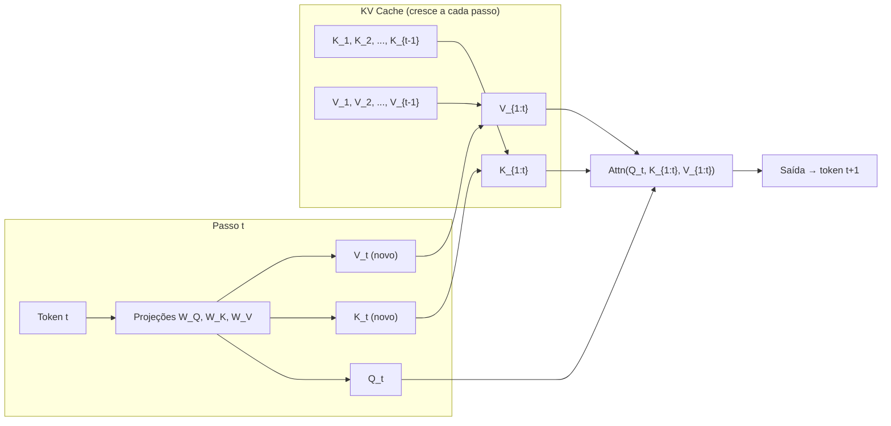
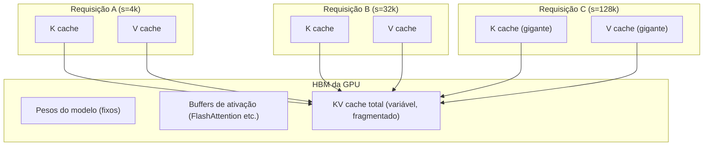
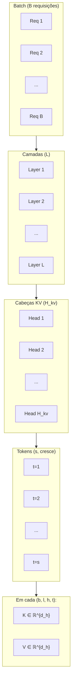
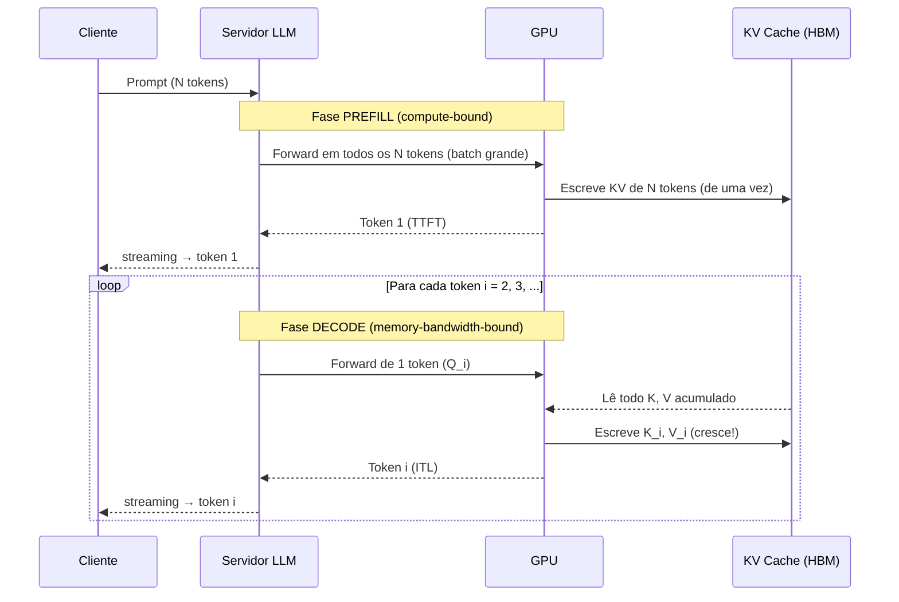
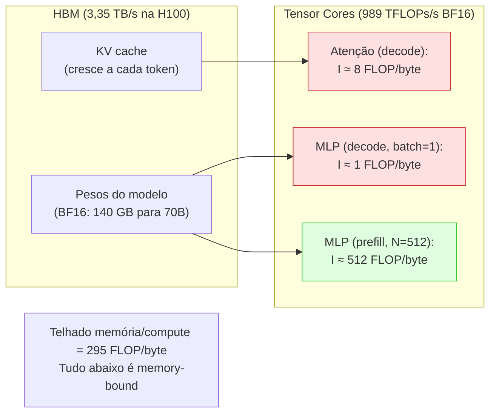
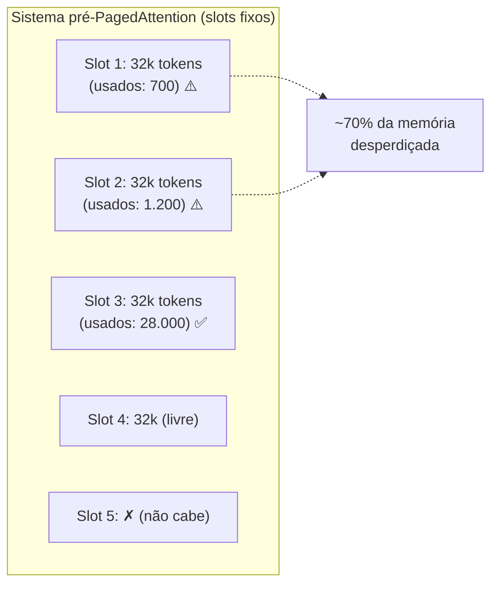
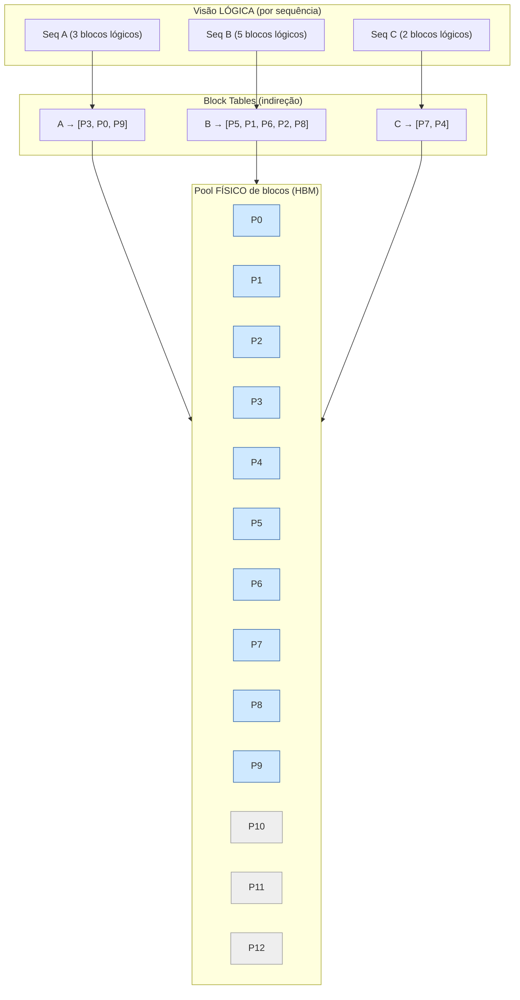
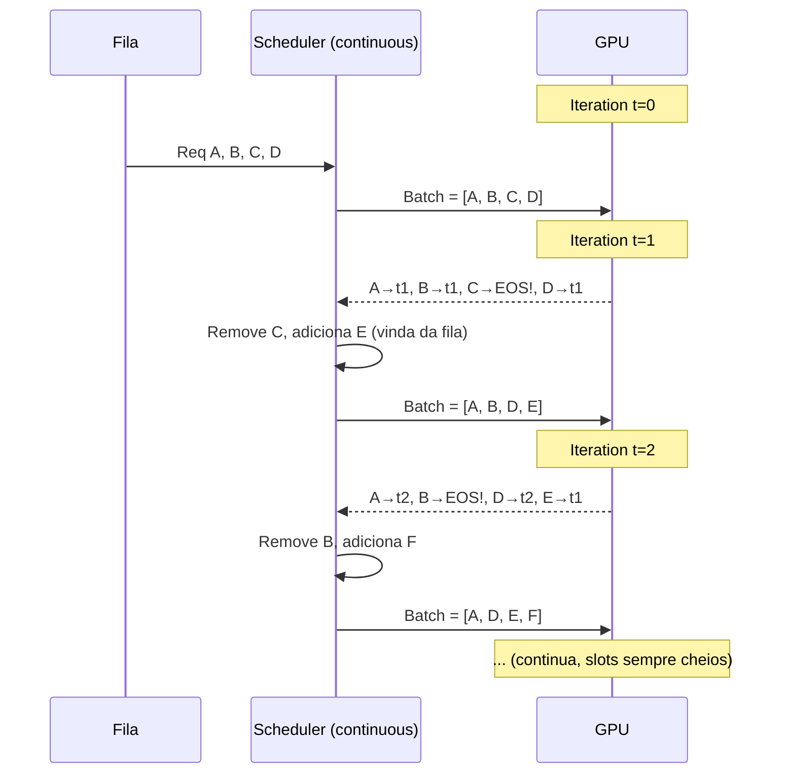
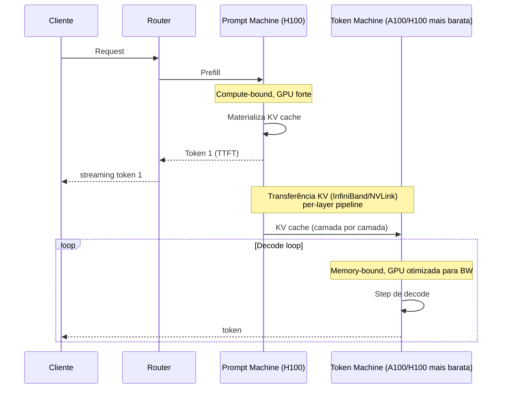

# Post 03 — KV Cache: anatomia completa, custos, fragmentação e PagedAttention/vLLM

> **Série:** LLMs em Profundidade — Da Atenção ao TurboQuant e Além
> **Pré-requisitos:** Post 01 (Arquitetura Transformer & decoder-only) e Post 02 (Atenção, MHA/MQA/GQA/MLA, FlashAttention).
> **Próximo:** Post 04 — Quantização de **pesos** (GPTQ, AWQ, GGUF, NF4, bitsandbytes).

---

## TL;DR

Toda LLM moderna que serve chat, RAG, agentes ou geração de código carrega, durante a inferência, uma estrutura de dados que **cresce a cada token gerado**: o **KV cache**. Ele guarda os tensores **K** (Key) e **V** (Value) de cada camada de atenção, para cada cabeça KV, para cada token já processado. Sem ele, cada nova palavra exigiria refazer a atenção sobre o prompt inteiro — geração se tornaria $O(n^2)$ por token e $O(n^3)$ ao longo da resposta.

Mas o KV cache **não é grátis**:

- O tamanho cresce **linearmente** com o comprimento da sequência, **multiplicativamente** com o número de camadas, cabeças KV e head_dim, e proporcionalmente ao **tamanho do batch**.
- Em **Llama 3 70B** com **GQA (8 KV heads)**, **head_dim 128**, **80 camadas**, **FP16**, são **$2 \times 80 \times 8 \times 128 \times 2 = 327\,680$** bytes por token — **320 KB/token**. Para um contexto de **128k tokens**, **40 GB** apenas de cache, **por requisição**.
- A fase de **prefill** (processar o prompt) é tipicamente **compute-bound**; a fase de **decode** (gerar token a token) é quase sempre **memory-bandwidth-bound**, dominada pela leitura de pesos e do KV cache da HBM.
- O batching dinâmico (requisições chegando e saindo) sofria de **fragmentação interna** (sobra dentro do "slot" reservado) e **externa** (lacunas entre alocações), desperdiçando até **60–80%** da memória nos sistemas pré-vLLM.
- **PagedAttention** (Kwon et al., **vLLM**, SOSP 2023) ataca essas duas fragmentações **importando o conceito de paginação** dos sistemas operacionais: o KV cache é dividido em **blocos físicos** de tamanho fixo (tipicamente 16 tokens), referenciados por **tabelas de blocos lógicos** por sequência. Resultado: **2–4× throughput** vs FasterTransformer/Orca, com a mesma latência.
- **Continuous batching** (Orca, OSDI 2022) e **prefix caching** (vLLM APC, SGLang RadixAttention, Anthropic/OpenAI) compõem a tríade que define a inferência moderna.
- O futuro próximo é **disaggregated prefill/decode** (**Splitwise** da Microsoft, **DistServe**, **Sarathi-Serve**), que **separa as duas fases em GPUs diferentes** para casar cada uma com o hardware ideal.

> Comprimir o **conteúdo** dos blocos KV (quantização do cache) é o tema do **Post 05**. Aqui ficamos no nível da **gestão de memória** (alocação, fragmentação, reuso, sharing).

---

## 1. Recap: por que o KV cache existe

### 1.1. A atenção causal vista pela ótica da geração

Em um decoder-only Transformer, a saída do bloco de atenção para o token na posição $t$ é, em sua forma mais simples (uma cabeça):

$$
\text{Attn}(Q_t, K_{1:t}, V_{1:t}) = \text{softmax}\!\left(\frac{Q_t K_{1:t}^\top}{\sqrt{d_k}}\right) V_{1:t}.
$$

Três observações cruciais:

1. **$Q_t$** depende **apenas do token atual** $t$: cada novo token recém-amostrado gera um novo vetor $Q$.
2. **$K_{1:t}$** e **$V_{1:t}$** são as projeções *Key* e *Value* de **todos os tokens anteriores** mais o atual.
3. A matriz **$K$** e o tensor **$V$** dos tokens $1, 2, \ldots, t-1$ **não mudam** quando geramos o token $t+1$ — eles **dependem apenas dos pesos do modelo e da sequência já fixada**.

Sem cache, ao gerar o token $t+1$, seria preciso:

1. Reaplicar **todas as projeções lineares** $W_K, W_V, W_Q$ sobre **todos os $t$ tokens** já produzidos;
2. Recomputar o produto $Q K^\top$ inteiro;
3. Refazer o softmax e o produto por $V$.

Isso transforma a geração de uma sequência de **$N$** tokens num esforço **$O(N^3)$** ao longo de toda a decodificação. Para $N = 1000$, seriam **um bilhão** de operações apenas no padrão da atenção, multiplicadas pelas constantes do modelo. Inviável.

### 1.2. A solução óbvia: lembrar K e V

O **KV cache** materializa a observação 3: armazenamos, **em memória da GPU**, todos os $K_i$ e $V_i$ já calculados. A cada novo passo:

1. Computamos apenas os **novos** $K_t$ e $V_t$ do token atual;
2. Adicionamos ao cache;
3. Computamos o $Q_t$ e o produto $Q_t K_{1:t}^\top$ — agora **vetor × matriz**, não matriz × matriz.

Custo por token na fase **decode**: **$O(N \cdot d)$** em FLOPs, **$O(N \cdot d)$** em leituras da memória. A geração inteira passa de $O(N^3)$ para **$O(N^2)$** — um ganho assintótico, mas também um ganho de constantes enormes, porque o compilador de atenção (FlashAttention etc.) opera sobre uma multiplicação **vetor × matriz** muito mais barata.

### 1.3. Analogia: o caderno de anotações da palestrante

Imagine uma palestrante que vai improvisando um discurso de uma hora, sem roteiro. Para cada nova frase, ela precisa **recordar tudo o que já disse** — não apenas para coerência, mas porque cada nova ideia "consulta" temas anteriores.

- **Sem KV cache:** ela teria que **reler mentalmente o discurso inteiro** antes de cada palavra. Quanto mais o discurso cresce, mais lento fica cada novo trecho — geração quadrática.
- **Com KV cache:** ela mantém ao lado um **caderno aberto**. Cada vez que termina uma frase, anota duas linhas: "**ideia-chave** (K)" e "**conteúdo associado** (V)". Para gerar a próxima palavra, basta **olhar de relance** o caderno e a palavra atual — extrai os pesos de relevância, mistura, segue.
- O **caderno cresce a cada frase** e ocupa cada vez mais espaço da mesa. Em algum momento, **a mesa fica pequena**: este é o problema do KV cache em produção.



O KV cache é, portanto, **memória de estado da geração**. Tudo o que o modelo "lembra" do prompt e dos tokens já gerados está ali — não mais nos *embeddings* de entrada. Por isso "**resetar a conversa**" em uma API significa, na prática, **descartar o KV cache** daquela sessão.

### 1.4. O que o KV cache **não** é

Para evitar confusões frequentes:

- O KV cache **não armazena os pesos** do modelo ($W_Q, W_K, W_V$). Pesos são fixos; o cache é estado por requisição.
- Ele **não armazena os logits** nem as ativações intermediárias do MLP (essas são descartadas após cada camada).
- Ele **não armazena o token amostrado** (esse é só um inteiro; o que importa para a próxima iteração é o vetor $K$ e $V$ que aquele token gerou em cada camada).
- Ele **não está no disco**: vive em **HBM** da GPU (ou eventualmente em **CPU memory** para *offloading* / *swap*).
- Em modelos com **GQA** ou **MQA**, ele é menor que em **MHA puro** porque várias query heads compartilham o mesmo par K/V. Em **MLA** (DeepSeek), é radicalmente menor: armazena uma representação **latente** comprimida.

---

## 2. A fórmula do tamanho do KV cache

### 2.1. Derivação passo a passo

Para um Transformer decoder com:

- **$L$** camadas (`num_hidden_layers`);
- **$H_{kv}$** cabeças KV (`num_key_value_heads`);
- **$d_h$** dimensão de cada cabeça (`head_dim`);
- **$s$** comprimento da sequência atual (em tokens);
- **$B$** tamanho do batch (número de requisições simultâneas);
- **$b$** bytes por elemento (FP16 = 2, FP8 = 1, INT4 = 0.5).

Cada camada armazena, **por token**, dois tensores: **K** e **V**. Cada um tem forma $[H_{kv}, d_h]$. Logo:

- **Bytes por token, por camada:** $2 \cdot H_{kv} \cdot d_h \cdot b$
- **Bytes por token, total:** $2 \cdot L \cdot H_{kv} \cdot d_h \cdot b$
- **Bytes por sequência:** $2 \cdot L \cdot H_{kv} \cdot d_h \cdot s \cdot b$
- **Bytes por batch:** $2 \cdot L \cdot H_{kv} \cdot d_h \cdot s \cdot B \cdot b$

A fórmula canônica é:

$$
\boxed{\,\text{KV bytes} \;=\; 2 \,\cdot\, L \,\cdot\, H_{kv} \,\cdot\, d_h \,\cdot\, s \,\cdot\, B \,\cdot\, b\,}
$$

O fator **2** vem da soma de $K$ **e** $V$ (ambos têm a mesma forma).

### 2.2. Variantes de atenção e o impacto na fórmula

A escolha da **arquitetura de atenção** muda $H_{kv}$ — e, em MLA, muda a interpretação inteira da fórmula:

| Variante | $H_{kv}$ | Observação | KV/token vs MHA |
|---|---|---|---|
| **MHA** (Multi-Head Attention) | $H_q$ (todas) | Cada query head tem seu próprio K/V | **1×** (referência) |
| **MQA** (Multi-Query Attention) | **1** | Todas as queries dividem 1 par K/V | **$1/H_q$** |
| **GQA-$g$** (Grouped-Query) | $H_q / g$ | $g$ queries por grupo K/V (Llama 3: $g{=}8$) | **$g/H_q$** |
| **MLA** (Multi-Head Latent Attention, DeepSeek) | — | Cache armazena **latente comprimido** $[d_{lora}]$ + parte rotativa | **$\sim 1/57$** vs MHA equivalente |

O Post 02 explora essas variantes em detalhe; aqui usamos os números prontos.

> **Detalhe importante:** modelos com **bias** nas projeções K/V (raros, ex.: alguns Qwen) ou com **head_dim diferente para K e Q** (ex.: DeepSeek MLA, com `qk_rope_head_dim` separado) precisam de ajuste fino na fórmula. Trataremos o caso MLA explicitamente abaixo.

### 2.3. Cálculo concreto: Llama 3 70B em FP16

Parâmetros do `Llama-3-70B` (Hugging Face `config.json`):

- `num_hidden_layers = 80`
- `num_attention_heads = 64`
- `num_key_value_heads = 8` (GQA com $g = 8$)
- `head_dim = 128`
- `hidden_size = 8192` (= 64 × 128)
- dtype default: BF16 (= 2 bytes)

**Bytes por token:**

$$
2 \times 80 \times 8 \times 128 \times 2 = 327\,680\ \text{bytes} \approx 320\ \text{KB/token}.
$$

Vamos checar o que isso significa em escalas reais:

- **1 token:** 320 KB
- **1.000 tokens:** 320 MB
- **4.096 tokens (contexto típico):** $\approx 1{,}28$ GB **por requisição**
- **32.768 tokens (32k):** $\approx 10{,}24$ GB
- **131.072 tokens (128k):** $\approx 40{,}96$ GB
- **131k × batch=4:** $\approx 164$ GB — **mais que duas H100 80 GB inteiras só de cache**.

Comparativo: o próprio **modelo de pesos** de Llama 3 70B em BF16 ocupa $\approx 140$ GB. Ou seja, com batch=4 a 128k, o **cache supera os pesos**. É essa a razão pela qual **LLMs longos não escalam linearmente em batch**.

### 2.4. Cálculo concreto: Llama 3 8B

`Llama-3-8B`:

- `num_hidden_layers = 32`
- `num_attention_heads = 32`
- `num_key_value_heads = 8` (GQA $g = 4$)
- `head_dim = 128`

**Bytes por token:**

$$
2 \times 32 \times 8 \times 128 \times 2 = 131\,072\ \text{bytes} = 128\ \text{KB/token}.
$$

- **4k tokens:** 512 MB/req
- **32k tokens:** 4 GB/req
- **128k tokens:** 16 GB/req

O **modelo** (BF16) ocupa $\approx 16$ GB. Em 128k, **uma única requisição** já iguala o tamanho do modelo. Em uma A100 80 GB que carregue o 8B, sobram $\approx 64$ GB para todo o resto — KV de várias requisições, ativações, buffers FlashAttention, alinhamento, fragmentação.

### 2.5. Cálculo concreto: DeepSeek-V3 com MLA ($\approx 671$B param.)

A MLA armazena, por camada e por token, **um vetor latente $c_{KV}$ de dimensão $d_{lora}^{KV}$** e uma **componente rotativa de chave $k_R$ de dimensão `qk_rope_head_dim`**. Os parâmetros de DeepSeek-V3:

- `num_hidden_layers = 61`
- `kv_lora_rank = 512` ($d_{lora}^{KV}$)
- `qk_rope_head_dim = 64`
- `num_attention_heads = 128`
- `qk_nope_head_dim = 128`, `v_head_dim = 128`

**Bytes por token, por camada (MLA, FP16):**

$$
(d_{lora}^{KV} + d_{rope}) \cdot b = (512 + 64) \times 2 = 1\,152\ \text{bytes}.
$$

**Bytes por token, total:**

$$
1\,152 \times 61 = 70\,272\ \text{bytes} \approx 68{,}6\ \text{KB/token}.
$$

**Para 128k tokens:** $\approx 8{,}57$ GB. Para um modelo de **671 B** parâmetros — e pesos que, em FP8, ocupam $\approx 700$ GB — **8.57 GB de cache** é absurdamente barato.

A "aritmética alternativa" (o que seria com MHA equivalente: 128 cabeças, head_dim 128):

$$
2 \times 61 \times 128 \times 128 \times 2 = 4\,000\,768\ \text{bytes} \approx 3{,}81\ \text{MB/token}.
$$

Isto é, MLA **comprime cerca de 57×** o KV cache vs MHA equivalente ($\frac{3{,}81 \cdot 1024}{68{,}6} \approx 57$). É a razão técnica que permite o DeepSeek-V3 servir **128k de contexto em larga escala**.

### 2.6. Outros modelos populares

| Modelo | $L$ | $H_{kv}$ | $d_h$ | KV por token (FP16) |
|---|---|---|---|---|
| **Llama 3 8B** | 32 | 8 | 128 | 128 KB |
| **Llama 3 70B** | 80 | 8 | 128 | 320 KB |
| **Llama 3.1 405B** | 126 | 8 | 128 | 504 KB |
| **Mistral 7B v0.3** | 32 | 8 | 128 | 128 KB |
| **Mixtral 8×7B** | 32 | 8 | 128 | 128 KB |
| **Qwen 2.5 7B** | 28 | 4 | 128 | 56 KB |
| **Qwen 2.5 14B** | 48 | 8 | 128 | 192 KB |
| **Qwen 2.5 72B** | 80 | 8 | 128 | 320 KB |
| **DeepSeek-V3 (MLA)** | 61 | — | (512+64) lat. | **68,6 KB** |
| **GPT-3 175B (MHA, hipotético)** | 96 | 96 | 128 | 4,72 MB |

Note como **GPT-3** (era pré-GQA, MHA puro) tinha KV cache **proibitivo** para contextos longos — uma das razões da popularização do GQA em 2023–2024.

---

## 3. Quanto custa? Tabela comparativa por modelo

A tabela abaixo cruza **KV cache** por **tamanho de contexto** comum, em **FP16**, para **uma única requisição** (batch=1). Use como referência prática para dimensionar inferência.

| Modelo | KV/token | 4k tokens | 32k tokens | 128k tokens |
|---|---|---|---|---|
| **Llama 3 8B (GQA-4)** | 128 KB | **512 MB** | **4,0 GB** | **16,0 GB** |
| **Llama 3 70B (GQA-8)** | 320 KB | **1,28 GB** | **10,24 GB** | **40,96 GB** |
| **Llama 3.1 405B (GQA-8)** | 504 KB | **2,02 GB** | **16,1 GB** | **64,5 GB** |
| **Mistral 7B v0.3 (GQA-4)** | 128 KB | 512 MB | 4,0 GB | 16,0 GB |
| **Mixtral 8×7B** | 128 KB | 512 MB | 4,0 GB | 16,0 GB |
| **Qwen 2.5 7B (GQA-7)** | 56 KB | 224 MB | 1,75 GB | 7,0 GB |
| **Qwen 2.5 14B (GQA-5)** | 192 KB | 768 MB | 6,0 GB | 24,0 GB |
| **Qwen 2.5 72B (GQA-8)** | 320 KB | 1,28 GB | 10,24 GB | 40,96 GB |
| **Qwen 3 30B-A3B (MoE, GQA-4)** | ≈ 192 KB | ≈ 768 MB | ≈ 6,0 GB | ≈ 24 GB |
| **DeepSeek-V3 (MLA)** | **68,6 KB** | **274 MB** | **2,14 GB** | **8,57 GB** |

**Leitura principal:** para servir **muitas requisições simultâneas em contexto longo**, MLA e GQA agressivo (Qwen 2.5 7B com 4 KV heads, por ex.) são quase mandatórios. Sem essas, o cache estoura a HBM antes de qualquer batch razoável.



### 3.1. Anatomia visual: camadas × cabeças × tokens

A estrutura interna do KV cache, vista como um tensor 5D:

$$
\text{KV} \in \mathbb{R}^{B \times L \times 2 \times H_{kv} \times s \times d_h},
$$

onde o eixo "2" carrega K e V. O *layout* de memória varia por framework (HF Transformers: `[batch, kv_head, seq, head_dim]` por camada; FlashAttention quer `[batch, seq, kv_head, head_dim]` para coalescência; vLLM impõe um layout próprio orientado a páginas — veja §7).



Cada **célula folha** desse tensor é um par de vetores de tamanho $d_h$ (128, normalmente). É a multiplicação dos quatro eixos exteriores por essa célula que gera os números absurdos da tabela acima.

---

## 4. Prefill vs decode: dois mundos diferentes na mesma GPU

A geração com LLM tem **duas fases** com perfis computacionais radicalmente distintos. Entender essa diferença é pré-requisito para entender PagedAttention, continuous batching, chunked prefill, disaggregation — basicamente tudo neste post.

### 4.1. Prefill (a ingestão do prompt)

Quando uma requisição chega com um prompt de $N$ tokens, o sistema precisa:

1. Embeddar os $N$ tokens em $N$ vetores;
2. Passar pelo modelo **camada por camada**, computando atenção entre **todos os pares** $(Q_i, K_j)$ com $j \le i$ (causal);
3. **Materializar** o KV cache para todos os $N$ tokens (uma vez só);
4. Produzir o **primeiro token** da resposta.

Como tudo é feito de uma vez, o prefill é uma **multiplicação matriz × matriz** "grossa" — alta intensidade aritmética. **GPUs adoram** isso. O prefill é tipicamente **compute-bound**.

**Analogia:** prefill é **ler um livro grosso de uma vez**. Você abre, escaneia tudo, **anota o caderno** (KV cache) com as ideias-chave e os conteúdos importantes. Demorado em valor absoluto, mas **eficiente por unidade de tempo** — você está usando todos os seus olhos e dedos.

### 4.2. Decode (a geração token a token)

A partir do segundo token, o sistema entra em **decode**: uma iteração por token gerado. Cada iteração:

1. Pega o **último token amostrado** (1 token!);
2. Computa um vetor $Q_t$, um $K_t$ e um $V_t$;
3. Faz atenção entre $Q_t$ (1 vetor) e **todo o KV cache** ($s$ vetores);
4. Passa pelo MLP;
5. Amostra o próximo token.

Aqui mora a tragédia da inferência: **as multiplicações matriz × matriz viram vetor × matriz**. A intensidade aritmética **despenca**: para cada peso lido da memória, você faz **uma única operação útil** (produto-acúmulo escalar). Isso é o **pesadelo do roofline**: a GPU passa 80–95% do tempo **esperando dados chegarem** da HBM.

**Analogia:** decode é **escrever uma palavra por vez consultando o caderno**. Para cada nova palavra, você abre o caderno, lê **todas as anotações já feitas** e a palavra atual, decide a próxima, escreve, anota duas linhas novas. Você está com a caneta na mão **75% do tempo só virando páginas**, e só **5% do tempo escrevendo**.



### 4.3. Métricas de SLO: TTFT e ITL/TPOT

A indústria mede inferência em duas métricas básicas:

- **TTFT** (*Time To First Token*): tempo entre a chegada do request e a saída do **primeiro** token. Dominado pelo **prefill** + tempo de fila.
- **ITL** (*Inter-Token Latency*) ou **TPOT** (*Time Per Output Token*): tempo médio entre tokens consecutivos. Dominado pelo **decode**.

Otimizações típicas:

| Fase | Ataque típico |
|---|---|
| **Prefill** | Batching de prompts (preenche o tensor grande), **chunked prefill** (Sarathi), tensor parallelism, FlashAttention |
| **Decode** | **Continuous batching** (preencher slots vazios), **PagedAttention** (mais requests no batch sem fragmentação), **speculative decoding**, **quantização de pesos**, **MQA/GQA/MLA** (menos KV a ler) |

### 4.4. Tabela: prefill vs decode em uma vista única

| Aspecto | **Prefill** | **Decode** |
|---|---|---|
| Tokens processados por iteração | **N** (prompt todo) | **1** |
| Padrão de matriz | Matriz × matriz (alta) | Vetor × matriz (baixa) |
| Intensidade aritmética (FLOPs/byte) | **Alta** (dezenas a centenas) | **Baixa** ($\approx 1$–10) |
| Bottleneck dominante | **Compute** (TFLOPs) | **Memória** (HBM bandwidth) |
| Custo do KV cache | Cria o cache (write) | Lê o cache (read), cresce 1 token |
| Métrica de SLO | **TTFT** | **ITL/TPOT** |
| Escala com batch | **Bem** (mais GPU saturada) | **Razoável** (lê pesos 1 vez para o batch inteiro) |
| Escala com contexto | **Ruim** ($O(N^2)$ sem flashattn, $O(N \cdot d)$ com) | **Linear** em $s$ acumulado |
| Otimizações canônicas | Chunked prefill, FlashAttention, TP | Continuous batching, PagedAttention, spec. decoding, KV quant |
| Quem domina os ciclos quando o sistema está saudável | **Tensor cores** | **HBM controllers** |
| Frameworks com suporte ideal | TensorRT-LLM, vLLM | vLLM, TGI, SGLang |

### 4.5. Por que isso vale ouro

Esse contraste de fases é **a observação fundamental** que abriu a porta para todo o stack moderno:

- **Continuous batching** existe porque, no decode, **incluir mais requests no batch é quase grátis** em compute (a leitura dos pesos é compartilhada).
- **PagedAttention** existe porque, no decode, **fragmentação de KV** é o que limita o tamanho do batch, e mais batch = mais throughput.
- **Speculative decoding** existe porque o decode é tão *memory-bound* que sobra compute para "checar várias hipóteses" sem aumentar latência.
- **Chunked prefill** existe porque misturar pedaços de prefill com decode em um único *step* esconde a latência do TTFT atrás do throughput do decode.
- **Disaggregation** existe porque **se prefill e decode são tão diferentes**, faz sentido **rodá-los em GPUs diferentes** e até **com SKUs distintos**.

---

## 5. Roofline e bandwidth-bound: o desenho do gargalo

### 5.1. Roofline em 30 segundos

O **modelo roofline** (Williams, Waterman, Patterson, 2009) é uma forma gráfica simples de identificar gargalos. Plote no eixo $x$ a **intensidade aritmética** (FLOPs/byte) e no eixo $y$ o **desempenho** (FLOPs/s). Há dois "telhados":

- **Telhado de compute:** $P_{\max}$ — os TFLOPs/s de pico da GPU (ex.: H100 SXM = 989 TFLOPs/s em BF16).
- **Telhado de memória:** $B \cdot I$ — onde $B$ é a banda de HBM (ex.: H100 = 3,35 TB/s) e $I$ é a intensidade aritmética.

A curva real fica abaixo desses dois telhados. Se sua intensidade está **à esquerda** do ponto de cruzamento ($P_{\max} / B$), você é **memory-bound**. À direita, **compute-bound**.

Para H100: $\frac{989 \text{ TFLOPs/s}}{3{,}35 \text{ TB/s}} \approx 295$ FLOPs/byte. Tudo abaixo de **$\approx 300$ FLOPs/byte é memory-bound**.

### 5.2. Intensidade aritmética da atenção em decode

Considere um único passo de decode em uma camada de atenção GQA com batch $B$ e contexto acumulado $s$:

- **Bytes lidos do KV cache** por camada: $2 \cdot H_{kv} \cdot d_h \cdot s \cdot B \cdot b$
- **FLOPs da atenção** por camada (vetor × matriz): $\sim 4 \cdot H_q \cdot d_h \cdot s \cdot B$ (incluindo softmax + V)

Intensidade aritmética da atenção:

$$
I_{\text{attn}} \approx \frac{4 \cdot H_q \cdot d_h \cdot s \cdot B}{2 \cdot H_{kv} \cdot d_h \cdot s \cdot B \cdot b} = \frac{2 H_q}{H_{kv} \cdot b}.
$$

Para Llama 3 70B ($H_q = 64, H_{kv} = 8$, FP16 $b = 2$):

$$
I_{\text{attn}} \approx \frac{2 \times 64}{8 \times 2} = 8 \text{ FLOPs/byte}.
$$

**Bem abaixo dos 295** do telhado da H100. Logo, atenção em decode é **fortemente memory-bound**. E note algo lindo: a intensidade **não depende de $s$** — toda vez que dobra $s$, dobram os bytes lidos **e** os FLOPs proporcionalmente. O que ajuda é **aumentar $B$** (continuous batching!) ou usar **MQA** ($H_{kv} = 1$ leva a $I = 64$ FLOPs/byte — ainda memory-bound, mas 8× melhor).

### 5.3. Intensidade aritmética da parte MLP em decode

Para a parte MLP (matriz × vetor), com pesos de $M$ bytes:

$$
I_{\text{mlp,decode}} \approx \frac{2 \cdot d_{model}^2 \cdot B}{d_{model}^2 \cdot b} = \frac{2 B}{b}.
$$

Para batch=1 em FP16: $I = 1$ FLOP/byte. Catastroficamente memory-bound. Para batch=128, $I = 128$. Ainda longe dos 295 da H100, mas **já 128× melhor** — aqui mora a razão pela qual **agrupar requisições** é o caminho.

### 5.4. Implicações de design

1. **Quantização de pesos** (Post 04) ataca diretamente o decode: ao reduzir $b$ (de 2 bytes FP16 para 0.5 bytes INT4), reduz proporcionalmente os bytes lidos, dobrando ou quadruplicando a intensidade aritmética e aproximando do telhado de compute.

2. **Quantização de KV cache** (Post 05) ataca o lado de memória: reduz os bytes lidos do KV durante a atenção, e — talvez mais importante — **permite mais requests no batch**, aumentando $B$ e portanto a intensidade aritmética efetiva via roofline batch.

3. **Speculative decoding** transforma N passos sequenciais de decode em 1 passo "verificador" com N tokens em paralelo — efetivamente **transforma decode em mini-prefill**, jogando-o de volta para a região compute-bound.

4. **MLA** (DeepSeek) muda o numerador e denominador da fórmula da atenção; o cache latente reduz drasticamente os bytes, e o "cache" passa a representar parcialmente $W_K^{up}, W_V^{up}$ absorvidos via fusão. Resultado: atenção mais barata e cache mais barato.



---

## 6. Fragmentação e o problema do batching dinâmico

### 6.1. O ingênuo: pré-alocar o pior caso

A primeira geração de servidores LLM (HuggingFace `generate()`, FasterTransformer pré-vLLM, primeiras versões do Triton) fazia algo conceitualmente simples e operacionalmente **desastroso**:

1. Quando o request chega, **pré-aloca** memória para o **`max_seq_len`** total (digamos, 32k tokens), mesmo que o prompt tenha 200 tokens e a resposta vá ter 500.
2. Esse bloco contíguo de memória vira o "slot" daquela request.
3. Outras requests vão para **slots paralelos**, cada um do tamanho `max_seq_len`.

O problema fica evidente:

- **Fragmentação interna:** Se a resposta tem 700 tokens, 31.300 slots ficam **vazios e bloqueados** dentro do bloco. Memória paga, não usada.
- **Fragmentação externa:** Quando uma request termina e libera seu slot, outra request só pode usar aquele slot inteiro se couber lá. Slots de tamanho fixo "perdem o jogo de Tetris".
- **Limite de batch:** Como cada slot é gigante, cabem poucos slots na HBM. O batch fica pequeno → throughput cai.

O paper do vLLM mediu isto e encontrou **só 20–40% da memória sendo usada** para tokens reais; o resto era fragmentação interna+externa+reservada.

### 6.2. Variantes intermediárias

Algumas tentativas pré-vLLM:

- **Trim ao final:** alocar `max_seq_len` mas reaproveitar a parte não usada após o término — só reduz fragmentação externa.
- **Reservar por estimativa:** chutar o tamanho da resposta. Quase sempre erra por ordens de grandeza.
- **Realocação dinâmica:** crescer o buffer com `realloc` — exige cópias caras na GPU e *stalls*.

Nada resolveu até alguém olhar para um problema **muito antigo** com o olhar certo.



### 6.3. A inspiração: paginação de sistemas operacionais

Sistemas operacionais resolveram **exatamente o mesmo problema** nos anos 60–70. A memória virtual:

- Divide a RAM em **páginas físicas** de tamanho fixo (4 KB, classicamente);
- Cada processo tem uma **tabela de páginas** mapeando endereços lógicos contíguos para páginas físicas que **podem estar espalhadas pela RAM**;
- Fragmentação **externa** vira zero (toda página tem o mesmo tamanho);
- Fragmentação **interna** vira no máximo "uma página por processo" (a última, possivelmente parcial).

A correspondência com KV cache é uma luva:

- O "processo" é uma **sequência** (request).
- A "memória" é o **KV cache**.
- O "endereço lógico" é a **posição do token** na sequência.
- A "página" é um **bloco de KV** com tamanho fixo (digamos, 16 tokens).

E daí nasce o **PagedAttention**.

---

## 7. PagedAttention: como o vLLM resolveu

### 7.1. A ideia em duas frases

> **Divida o KV cache em blocos físicos de tamanho fixo (ex.: 16 tokens). Cada sequência tem uma tabela de blocos lógicos (block table) que mapeia posições lógicas → blocos físicos, permitindo que K/V de uma mesma sequência fiquem espalhados pela HBM. O kernel de atenção foi reescrito para entender essas tabelas.**

Resultado: fragmentação externa **zero**, fragmentação interna **no máximo (block_size − 1) tokens por sequência** (a última página), batch dinâmico real, **sharing** de blocos entre sequências (para prefix caching), **CoW** em copy-paste (para beam search e parallel sampling). Tudo isso **sem deslocar dados** quando uma sequência cresce: basta alocar o próximo bloco físico livre e atualizar uma entrada da tabela.

### 7.2. Anatomia de um bloco PagedAttention

Um **bloco físico** armazena, **para uma camada e uma cabeça KV**:

$$
\text{block} \in \mathbb{R}^{\text{block\_size} \times d_h} \quad \text{para } K, \text{e mais um para } V.
$$

Tamanho típico de bloco: **16 tokens**. Para Llama 3 70B (FP16, $d_h = 128$):

- Bytes por bloco K: $16 \times 128 \times 2 = 4\,096$ bytes.
- Bytes por bloco V: idem.
- **Por camada e por cabeça KV: 8 KB**.
- Para todas as 80 camadas e 8 KV heads: $8 \text{ KB} \times 80 \times 8 = 5\,120 \text{ KB} = 5$ MB **por bloco lógico de 16 tokens**.

Que confere com o cálculo: 320 KB/token × 16 tokens = 5.120 KB. ✅

### 7.3. A tabela de blocos (block table)

Cada **sequência** mantém uma estrutura de tamanho $\lceil s / \text{block\_size} \rceil$:

```
seq_id = 42:
  logical block 0 → physical block 7   [tokens 0..15]
  logical block 1 → physical block 19  [tokens 16..31]
  logical block 2 → physical block 4   [tokens 32..47]
  ...
  logical block (last) → physical block 121  [tokens (s−r)..(s−1), parcial]
```

Os blocos físicos vivem em **um pool global** alocado uma única vez (no warm-up do servidor). Quando uma sequência precisa de mais um bloco, o **block manager** retira do pool o próximo bloco livre. Quando uma sequência termina ou é evicted, seus blocos voltam ao pool.

### 7.4. O kernel: atenção com indireção

O grande trabalho de engenharia do vLLM foi reescrever o kernel CUDA da atenção para **seguir indireções**. Em vez de carregar K/V de um intervalo contíguo de memória, o kernel:

1. Recebe a **block_table** da sequência;
2. Para cada bloco lógico, **consulta** o índice físico;
3. Carrega K e V daquele bloco físico (que pode estar em qualquer offset da HBM);
4. Realiza a atenção como FlashAttention faria.

Isso adiciona **uma camada de indireção** (overhead de cerca de 2–4% em microbenchmarks) que é **mais que pago** pelo aumento do batch viável.

### 7.5. Diagrama: lógico vs físico



A genialidade aqui é dupla: (1) **arrays lógicos contíguos** se mapeiam para **posições físicas espalhadas**, eliminando fragmentação externa; (2) os **blocos podem ser compartilhados** — a mesma página física $P_3$ pode aparecer na block table de **duas sequências diferentes**, porque é o **prefixo comum**. Esse mecanismo é a base do **prefix caching** (§8.2).

### 7.6. Ganhos reportados

O paper SOSP 2023:

- **2–4× throughput** vs FasterTransformer e Orca, mantida a latência.
- **Memória de KV** efetivamente usada: **96%+** (vs ~40% antes).
- Ganhos **mais pronunciados** em: sequências longas, modelos grandes, decodificações complexas (beam search, parallel sampling).

E o vLLM virou o de-facto standard de inferência open-source. SGLang, TGI e TensorRT-LLM **incorporaram a ideia** (com nomes próprios: "block-based KV", "paged KV cache"), confirmando o caráter quase universal do design.

### 7.7. Copy-on-Write para beam search e parallel sampling

Beam search e amostragem paralela ($n>1$) precisam manter **várias hipóteses** que partem do mesmo prefixo. Com slots fixos, isso significava **duplicar** todo o KV. PagedAttention permite **CoW**:

1. As várias hipóteses começam **apontando para os mesmos blocos físicos** (RefCount > 1).
2. Quando uma hipótese diverge e quer **escrever** num bloco compartilhado, o bloco é **clonado** (copia para um novo bloco físico) e a tabela é atualizada.
3. Apenas os **blocos divergentes** consomem memória extra.

Para beam=4, isso reduz pela metade ou mais o consumo de KV nas etapas iniciais — onde o prefixo ainda é majoritariamente comum.

### 7.8. Swap (offload) e preempção

O block manager do vLLM também sabe **trocar** blocos entre HBM e RAM da CPU (swap) e **evictar** sequências que ainda não terminaram quando a memória aperta (depois recompondo o estado a partir do prompt original — *recompute* — ou da CPU). Isso é fundamental para servir requisições "de cauda longa" (muito longas) sem matar requisições curtas.

---

## 8. Continuous batching e prefix caching

### 8.1. Continuous batching (Orca)

**Orca** (Yu et al., OSDI 2022) precedeu o vLLM e introduziu o conceito de **iteration-level scheduling** — também chamado de **continuous batching** ou **dynamic batching** quando aplicado à decode.

**O problema (static batching):** servidores tradicionais ML formam um batch, **rodam até o fim**, depois pegam o próximo batch. Em LLMs, isso é catastrófico: dentro do batch, **uma resposta pode ter 50 tokens, outra 5.000**. As 49 requisições "rápidas" ficam **bloqueadas** esperando a 50ª terminar — depois disso o slot fica livre.

**A solução (continuous batching):**

1. O scheduler opera **a cada iteração** (cada step de decode), não a cada request.
2. Quando uma request termina (gera EOS ou atinge `max_tokens`), seu slot é **imediatamente liberado**.
3. Uma nova request da fila **entra naquele slot** na **próxima iteração**.
4. Cada iteração roda um **forward pass** com o batch corrente, que muda dinamicamente.



**Selective batching:** Orca também observou que **operações sem dependência da posição** (Linear, GeLU, LayerNorm) podem ser batched sem problemas — suas formas são uniformes. Já a **atenção** é **per-request** (cada request tem seu $s$ próprio), e era processada **sequencialmente**. Hoje, com **paged attention + variable-length kernels** (FlashAttention 2 com `cu_seqlens`), a atenção também é batched eficientemente.

**Ganho reportado:** **36,9× throughput** no GPT-3 175B vs FasterTransformer, mantida a latência.

### 8.2. Prefix caching: reaproveitando KV entre requests

Em workloads modernos, **prompts compartilham prefixos** com altíssima frequência:

- **System prompts** comuns ("Você é um assistente útil…") repetidos em milhares de requests.
- **Few-shot examples** repetidos em pipelines de extração ou classificação.
- **Multi-turn chat:** as primeiras 4 mensagens da conversa não mudam ao gerar a 5ª.
- **RAG:** as instruções e os documentos retrieve podem se repetir entre queries.
- **Tree-of-thought / self-consistency:** múltiplas decodificações partem do mesmo prefixo.

**Insight central:** se duas requests compartilham **$p$ tokens de prefixo**, o KV cache desses $p$ tokens é **idêntico** (assumindo prompts idênticos byte-a-byte). Então, **podemos calcular uma vez e reutilizar**.

#### 8.2.1. APC (Automatic Prefix Caching) no vLLM

Configuração:

```python
LLM(model="meta-llama/Llama-3-8B-Instruct", enable_prefix_caching=True)
```

**Como funciona internamente:**

1. Cada bloco físico recebe um **hash** baseado no conteúdo do bloco + hash do bloco anterior (encadeamento). Se dois prefixos produzem o mesmo hash, **os blocos são idênticos**.
2. O block manager mantém um **dicionário** `hash → block_id`.
3. Quando um novo prompt chega, antes de calcular qualquer K/V, o sistema **olha bloco a bloco** se o hash já existe.
4. Para cada match, o bloco existente é **reutilizado** (RefCount++).
5. O prefill **pula** os tokens cacheados e processa apenas o que **realmente é novo**.

Resultado típico em workloads bem alinhados: **80–95% redução do prefill** em chat multi-turno e RAG, **80–90% redução de TTFT** quando o prefixo é grande.

**Eviction:** LRU. Blocos menos referenciados saem primeiro. Pode ser configurado para diferentes políticas conforme versão do vLLM.

#### 8.2.2. RadixAttention (SGLang)

SGLang (Zheng et al., 2024) generaliza a ideia em uma estrutura mais sofisticada: uma **radix tree** (árvore patricia) cujas arestas são rotuladas por **sequências de tokens** e cujos nós apontam para **blocos KV**. Isso permite:

- **Compartilhamento por subprefixo arbitrário** (não apenas blocos contíguos).
- **Cache-aware scheduling**: o scheduler escolhe a próxima request **olhando a árvore** e dando prioridade a quem **cacha** mais.
- **Fork** para tree-of-thought e parallel sampling, com ramos compartilhando o caule.

Resultado reportado: até **5× throughput** vs vLLM em workloads com muito sharing (chat, agents, ToT).

#### 8.2.3. Provider-side caching

Anthropic e OpenAI expõem caching de prefixo como **feature de API** (com cobrança diferenciada para tokens cached). Internamente é a mesma ideia; do ponto de vista do usuário, basta:

- **Anthropic:** marcar partes do prompt com `cache_control: {"type": "ephemeral"}`.
- **OpenAI:** prefix caching automático para prompts maiores que ~1024 tokens (sem ação do usuário).
- **Google Gemini:** *context caching* explícito via SDK, com TTL configurável.

A economia é real: tokens cached costumam custar **10–25%** do preço normal.

### 8.3. Chunked prefill: misturando as fases

Quando um request chega com prompt **muito longo** (digamos, 50k tokens), o prefill pode levar **vários segundos** — e durante esses segundos, **o decode dos outros requests do batch fica parado** (a GPU está saturada com o tensor enorme do prefill).

**Sarathi-Serve** (Agrawal et al., OSDI 2024) propõe **chunked prefill**:

1. Divida o prefill em **chunks** de tamanho fixo (ex.: 512 tokens).
2. A cada step do scheduler, monte um batch que **mistura**:
   - Tokens de **decode** dos requests em geração;
   - **Um chunk** de prefill de algum request novo.
3. O batch resultante tem uma forma irregular (alguns requests com 1 token, outro com 512), mas os kernels *variable-length* (FlashAttention 2/3) lidam bem.

**Ganhos:**

- **Decode latency** cai (prefill grande não bloqueia mais);
- **GPU utilization** sobe (compute do chunk de prefill compensa o memory-bound do decode);
- **Mistral 7B:** 2,6× capacidade vs vLLM;
- **Falcon 180B:** até 5,6× ganho com pipeline parallelism.

Hoje vLLM, TGI, TensorRT-LLM e SGLang implementam variantes de chunked prefill (com nomes próprios). É praticamente um requisito mínimo para serving sério em 2025/2026.

---

## 9. Disaggregated prefill/decode: o futuro próximo

### 9.1. A motivação

Se prefill e decode têm perfis tão diferentes (compute-bound vs memory-bound), **por que rodá-los na mesma GPU?**

- Prefill quer **muitos TFLOPs**: H100, MI300X, B200.
- Decode quer **muita HBM bandwidth e capacidade**: pode ser uma A100 80 GB, ou GPUs mais baratas.
- Misturar os dois cria **interferência**: chunked prefill ajuda, mas não elimina.

### 9.2. Splitwise (Microsoft, ISCA 2024)

**Splitwise** materializa essa ideia: separa **prompt-machine** (faz só prefill) de **token-machine** (faz só decode). Quando o prefill termina, o **KV cache** é **transferido** entre máquinas via **InfiniBand** (NVLink se na mesma node), camada por camada, usando MSCCL++.



**Ganhos:**

- **1,4× throughput** com **20% menos custo**;
- **2,35× throughput** sob mesmo orçamento de custo e energia;
- **Hardware mix**: prompt em H100, token em A100 (mais barata e suficiente).

### 9.3. DistServe (Berkeley/UIUC, OSDI 2024)

DistServe formaliza a ideia em torno de **goodput** (requests/s que respeitam SLOs de TTFT *e* TPOT). Mostra que, sob SLOs apertados, **não há configuração colocada** que alcance a goodput de uma configuração disaggregada — porque o trade-off TTFT vs TPOT se torna fundamental.

DistServe também propõe **placement automático** das instâncias de prefill e decode com base em SLOs declarados.

### 9.4. Sarathi-Serve (Microsoft Research India, OSDI 2024)

Sarathi-Serve (já mencionado em §8.3) é a abordagem **antagônica**: em vez de **separar** prefill e decode em máquinas diferentes, **mistura** ambos na **mesma GPU** via chunked prefill, com scheduler **stall-free** (não pausa decodes para incluir novos prefills).

Ambos os caminhos existem em produção. A regra prática:

- **TTFT muito apertado, TPOT relaxado:** **agregada** (Sarathi-Serve).
- **TPOT muito apertado, TTFT relaxado:** **disaggregada** (Splitwise/DistServe).
- **Ambos apertados:** abordagens híbridas (TaiChi 2024, p. ex.) que misturam GPUs especializadas com colocação inteligente.

### 9.5. Implementações em produção

- **vLLM:** suporte experimental a Splitwise via `--sep-prompt-token` (PR #2809). Mais maduro: integração com **NIXL** / KV transfer engine.
- **TensorRT-LLM:** suporte a **disagg serving** com transferência KV via NCCL/UCX em release 0.20+.
- **SGLang:** suporte experimental via plugins.
- **Hugging Face TGI:** continuous batching maduro; disaggregation ainda em desenvolvimento.

---

## 10. Comparação de frameworks

### 10.1. Tabela: vLLM vs TGI vs SGLang vs TensorRT-LLM

| Recurso | **vLLM** | **TGI** (Hugging Face) | **SGLang** | **TensorRT-LLM** (NVIDIA) |
|---|---|---|---|---|
| **PagedAttention / paged KV** | ✅ Original (block_size 16 padrão) | ✅ (chamada "paged KV") | ✅ (com RadixAttention sobre) | ✅ (Pools, Blocks, BlockManager) |
| **Continuous batching** | ✅ | ✅ | ✅ | ✅ (in-flight batching, IFB) |
| **Chunked prefill** | ✅ | ✅ | ✅ | ✅ (incl. para MLA Blackwell) |
| **Prefix caching automático** | ✅ APC (`enable_prefix_caching=True`) | ✅ | ✅ RadixAttention (mais expressivo) | ✅ KV cache reuse |
| **Quantização de pesos** | INT8, INT4 (AWQ, GPTQ), FP8, INT4-fp8 marlin | bitsandbytes, GPTQ, AWQ, EETQ, fp8 | AWQ, GPTQ, FP8 | INT4 AWQ, FP8, INT8 SQ |
| **Quantização de KV** | FP8 (CUDA/ROCm), INT8 (parcial), KV cache scales | FP8 KV | FP8, INT8 | FP8 KV (Hopper, Blackwell), INT8 |
| **Tensor parallelism** | ✅ | ✅ | ✅ | ✅ (mais avançado, com pipeline) |
| **Pipeline parallelism** | ✅ | ✅ (limitado) | ✅ | ✅ |
| **Speculative decoding** | ✅ (medusa, EAGLE, draft model) | ✅ (assistant model) | ✅ (EAGLE, lookahead) | ✅ (Medusa, draft, ReDrafter) |
| **MLA (DeepSeek)** | ✅ (otimizado) | ✅ | ✅ (otimizado) | ✅ (incl. Blackwell) |
| **Disaggregated prefill/decode** | Experimental (PR #2809, NIXL) | Em desenvolvimento | Experimental | ✅ (release 0.20+) |
| **Frontend/orquestração** | OpenAI-compatible API, server | OpenAI-compatible, custom | DSL própria + OpenAI compat. | API + Triton Inference Server |
| **Hardware** | NVIDIA, AMD ROCm, Intel Gaudi, TPU (parcial), CPU | NVIDIA, AMD, Inferentia | NVIDIA, AMD | **NVIDIA only** |
| **Open source** | ✅ Apache 2.0 | ✅ Apache 2.0 (com restrições comerciais para algumas versões) | ✅ Apache 2.0 | ✅ Apache 2.0 (com binários NVIDIA) |
| **Maturidade** | ⭐⭐⭐⭐⭐ standard de facto | ⭐⭐⭐⭐ (HF integration) | ⭐⭐⭐⭐ (alta para chat/agent) | ⭐⭐⭐⭐⭐ (perf NVIDIA) |
| **Sweet spot** | Geral (open-source padrão) | Pipelines HF, fácil deploy | Multi-call, agents, structured gen | Performance máxima em NVIDIA |

### 10.2. Notas sobre cada framework

**vLLM** (UC Berkeley, depois fork comercial Anyscale):
- Berço da PagedAttention. O kernel de atenção (`csrc/attention/attention_kernels.cu`) é um exemplo canônico.
- A v1 da engine (lançada em 2024 e maturada em 2025/2026) reescreveu o scheduler para reduzir overhead Python e suportar mais hardware.
- API OpenAI-compatible torna deploy quase trivial (`vllm serve meta-llama/Llama-3-8B-Instruct`).
- Comunidade enorme; cada paper novo de inferência sai com PR para vLLM em dias.

**TGI** (Hugging Face, Text Generation Inference):
- Forte integração com o Hub. Quantizações suportadas com facilidade.
- Continuous batching maduro desde 2023.
- Excelente para deploy "PaaS" e prototipagem rápida.
- Performance um pouco abaixo de vLLM/TensorRT-LLM em workloads agressivos, mas com overhead de operação muito menor.

**SGLang** (LMSYS Org / Berkeley):
- Combina **runtime** (paged + RadixAttention) com uma **DSL** Python para "programar" interações multi-call (ex.: agents que chamam o modelo várias vezes com prefixos comuns).
- Sweet spot inigualável para **chat multi-turno**, **agents**, **structured output**, **JSON schema constrained decoding**.
- Comunidade crescendo rápido; muitas integrações com **xgrammar** (constrained decoding eficiente).

**TensorRT-LLM** (NVIDIA):
- O caminho de **performance máxima** em NVIDIA. Compila o modelo em engines `.plan` específicos por GPU.
- Suporta **todas** as features: in-flight batching, paged KV, chunked prefill, FP8/FP4 (Blackwell), Medusa/EAGLE.
- Trade-off: **build pesado**, **menor flexibilidade** em runtime, vendor lock-in.
- A documentação é a referência oficial para entender o que dá para extrair de uma H100/B200.

### 10.3. Como escolher

| Cenário | Escolha sugerida |
|---|---|
| Projeto novo, equipe pequena, deploy rápido | **vLLM** ou **TGI** |
| Agents, chat multi-turno, RAG complexo | **SGLang** |
| Throughput máximo em frota NVIDIA dedicada | **TensorRT-LLM** |
| Hardware misto (AMD, Intel, TPU) | **vLLM** |
| Pipeline com Hugging Face Hub + finetune | **TGI** |
| Pesquisa de inferência (debugar, modificar kernels) | **vLLM** (Python+CUDA, mais hackeável) |

---

## 11. Pegadinhas, anti-padrões e dicas operacionais

### 11.1. "Por que meu vLLM trava com OOM?"

A causa quase sempre é **estimativa errada de KV** vs `gpu_memory_utilization`. O vLLM, no warm-up, faz um **profiling**:

1. Carrega o modelo;
2. Roda um forward com `max_seq_len`;
3. Mede a memória usada por ativações;
4. Reserva o que sobra (modulado por `gpu_memory_utilization`, padrão 0.9) para **blocos de KV**.

Se você passa um `max_model_len` enorme (128k) num modelo grande (Llama 3 70B) numa GPU pequena (A100 40GB), simplesmente **não cabe** o cache mínimo para 1 request. Saída: reduza `max_model_len`, suba `gpu_memory_utilization`, ou ative quantização.

### 11.2. "Meu prefix caching não funciona"

Verificações:

- **Prompts realmente idênticos byte-a-byte?** Espaço a mais, capitalização, BOM Unicode arruínam o hash.
- **`enable_prefix_caching=True`** está realmente ativo? Em alguns modos (ex.: speculative com certos drafters) há restrições.
- **Random seeds, sampling temperature** afetam apenas a saída, não o prefill — então não interferem no cache.
- **Eviction**: cache LRU pode ter despejado seu prefixo se a memória estourou.

### 11.3. "Chunked prefill afeta a qualidade?"

**Não.** A matemática é exatamente a mesma — você apenas processa o prompt em pedaços menores. A única diferença observável é em **latência por chunk** (TTFT pode aumentar levemente em prompts pequenos).

### 11.4. "Por que `block_size` padrão é 16?"

Trade-off:

- **Menor**: menos fragmentação interna, mais entradas na block table, mais overhead de indireção, atenção menos eficiente (kernel paga overhead por bloco).
- **Maior**: mais fragmentação interna, menos overhead de indireção, kernels mais eficientes.

Empiricamente, **16** maximiza throughput para a maioria dos workloads. Em alguns casos (sequências muito longas, muito uniformes), **32 ou 64** podem ser melhores.

### 11.5. "PagedAttention é a única forma?"

Não. Há outras abordagens:

- **vAttention** (paper 2024, MSR India + Georgia Tech): usa **CUDA virtual memory** (a abstração de paginação **da própria GPU**, exposta via CUDA driver API) para conseguir o mesmo efeito **sem indireção em software**. Resultado: kernels de atenção ficam **inalterados** (FlashAttention vanilla funciona), com performance comparável e código de aplicação mais simples. Ainda em adoção — exige drivers/GPUs mais recentes.

### 11.6. "FlashAttention vs PagedAttention: posso usar ambos?"

**Sim, na prática usa-se os dois ao mesmo tempo:**

- **FlashAttention** é uma forma de calcular **a atenção em si** sem materializar a matriz $QK^\top$, usando *online softmax* e *tiling*.
- **PagedAttention** é uma forma de **gerenciar a memória do KV cache** com indireção em blocos.

vLLM implementa PagedAttention sobre kernels FlashAttention (ou FlashInfer, ou os próprios), aproveitando o melhor dos dois: layout em blocos (paged) + cálculo eficiente sem materialização (flash).

### 11.7. "Preciso me preocupar com KV cache em CPUs?"

Sim, no caminho de **offloading** (CPU swap quando HBM enche) e em deploy CPU-only (llama.cpp). Em llama.cpp, cada `slot` tem um KV cache contíguo (sem paging), e o engine usa quantização FP16/Q8/Q4 do KV para reduzir RAM e largura de banda DDR. Os custos absolutos seguem a mesma fórmula da §2.

### 11.8. "Qual a relação com `n_ctx` / `max_position_embeddings`?"

O `n_ctx` (ou `max_position_embeddings`) é o **limite arquitetônico** do modelo (definido pelo treino, RoPE, YaRN — vide Post 07). Já `max_model_len` no vLLM/TGI é o **limite operacional** que **você** escolhe. O KV cache pode crescer até `max_model_len` por request — **e este número multiplica todos os custos** da §3.

---

## 12. Aritmética complementar: alguns cenários práticos

### 12.1. Cabe Llama 3 70B em 1×H100 80 GB?

- Pesos BF16: $\approx 140$ GB. ❌ **Não cabe** em uma H100 80 GB.
- Pesos FP8: $\approx 70$ GB. ✅ Cabe, sobra $\approx 10$ GB.
- KV em 4k tokens: 1,28 GB/req. → caberiam ~7 requests na sobra. Throughput baixíssimo.
- Conclusão: para Llama 3 70B sério, **2× H100** com tensor parallelism, ou **1× B200/MI300X** (192 GB). Ou modelo quantizado em INT4 ($\approx 35$ GB) com bastante folga para KV.

### 12.2. Quantos batch concorrentes em Llama 3 8B BF16, contexto 8k, 1×A100 80GB?

- Pesos BF16: 16 GB.
- KV por request a 8k: 128 KB × 8192 = 1,0 GB.
- Sobra para KV: $\approx 80 \times 0{,}9 - 16 = 56$ GB (com `gpu_memory_utilization=0.9`).
- Capacidade teórica: $\lfloor 56 / 1{,}0 \rfloor = 56$ requests simultâneas em 8k.
- Na prática: 30–45 (ativações, fragmentação residual em blocos parciais, scheduling overhead).

### 12.3. DeepSeek-V3 a 128k em 8×H100 80GB

- Pesos FP8: $\approx 700$ GB → cabe em 8× H100 com TP=8 (87,5 GB por GPU).
- KV/req em 128k: 8,57 GB total → $\approx$ 1,07 GB por GPU com TP=8.
- Sobra por GPU: $\approx 80 \times 0{,}9 - 87{,}5$ → **negativo**. Precisaríamos de **mais GPUs** (16, 32) ou esperar Blackwell B200.
- Em prática, DeepSeek-V3 a 128k pede **16+ H100** ou **8× B200**.

### 12.4. Custo mensal estimado: API com prefix caching vs sem

Considere um chatbot com:

- 1.000.000 requests/mês.
- Prompt médio: 4.000 tokens (sendo 3.500 fixos como system+context).
- Resposta média: 500 tokens.
- Modelo Anthropic Claude Sonnet (preço hipotético: \$3/MTok input, \$15/MTok output, cached input \$0,30/MTok).

**Sem caching:**
- Input: $4{.}000 \times 1{.}000{.}000 = 4 \times 10^9$ tokens → 4.000 MTok × \$3 = **\$12.000**.
- Output: $500 \times 10^6$ tokens → 500 MTok × \$15 = **\$7.500**.
- **Total: \$19.500/mês.**

**Com prefix caching** (3.500 tokens fixos cached):
- Input cached: $3{.}500 \times 10^6$ → 3.500 MTok × \$0,30 = **\$1.050**.
- Input fresh: $500 \times 10^6$ → 500 MTok × \$3 = **\$1.500**.
- Output: **\$7.500**.
- **Total: \$10.050/mês.** Economia de **48%**.

(Os números exatos variam por provider e modelo; o padrão de economia se mantém.)

---

## 13. Conexão com a série: o que vem nos próximos posts

Este post estabeleceu o **terreno** sobre o qual todas as otimizações de inferência operam: o **KV cache**, com sua matemática, sua geometria de memória e seu ecossistema de mitigação (paging, batching, caching, disaggregation). Agora as próximas peças se encaixam:

- **Post 04 — Quantização de pesos:** Atacar o **denominador** da intensidade aritmética. Se transformamos 140 GB de pesos BF16 em 35 GB INT4, o decode passa a **ler 4× menos** — o roofline se desloca, mais batch cabe, mais throughput sai.
- **Post 05 — Quantização do KV:** Atacar o cache em si. KIVI, KVQuant, CacheGen exploram o fato de que **K e V toleram pouca precisão** se você for esperto com **outliers**, **per-channel/per-token quantization** e **agrupamento**. Entrarão **fundo** no que **aqui** mencionamos só de leve.
- **Post 06 — TurboQuant em profundidade:** O método específico que a série está aprofundando, com **rotação aleatória + JL** para preservar produto interno **sem viés** — aplicado tanto a busca vetorial quanto ao próprio KV.
- **Post 07 — Contexto longo:** RoPE, YaRN, Streaming/Ring Attention, Mamba. Tudo isso assumindo o **stack** que descrevemos aqui.
- **Post 08 — Além da quantização:** Sparsity, speculative decoding, MoE, distillation — outras alavancas, todas dialogando com prefill/decode e KV.

> **Ponte para o Post 04:** No próximo post, vamos comprimir os **PESOS** do modelo: GPTQ, AWQ, GGUF, NF4 e bitsandbytes. Vamos ver por que **INT4** virou padrão em deploy local, como o **Marlin kernel** acelerou tudo em A100/H100, e como cada formato compromete entre **precisão**, **velocidade** e **suporte de hardware**. A quantização do KV — que é radicalmente diferente da quantização de pesos por causa da natureza **dinâmica** e da presença de **outliers** — fica para o Post 05.

---

## 14. Conclusão

O **KV cache** é o protagonista silencioso da inferência de LLM. Sem ele, a geração seria assintoticamente impossível; com ele, a inferência é uma **dança constante entre cálculo e memória** — uma dança em que a memória **quase sempre vence**, definindo o pior gargalo.

A jornada desde o caderno conceitual de §1.4 até o pool de blocos do PagedAttention em §7 mostra como **um problema teórico simples** (memorizar K e V) gera **uma cadeia inteira de engenharia** quando confrontado com a realidade: dezenas de gigabytes, fragmentação, batching dinâmico, multi-tenancy, SLOs apertados, hardware caro.

O importante para fixar:

1. **A fórmula do tamanho** é dura e não tem como fugir: $2 \cdot L \cdot H_{kv} \cdot d_h \cdot s \cdot B \cdot b$. Toda otimização ataca um desses termos.
2. **Prefill e decode são duas máquinas dentro de uma**. Tratar como uma só é desperdiçar GPU.
3. **PagedAttention** importou a paginação do SO para a GPU e **virou o padrão** em 18 meses.
4. **Continuous batching + prefix caching** transformaram o serving de LLM de "um stream por GPU" para "centenas de streams por GPU".
5. **Disaggregation** é o próximo passo natural: prefill numa GPU forte, decode numa GPU com muita banda, KV transferido pelo backplane. Splitwise/DistServe estão materializando isso em produção.
6. Quem entende KV cache **profundamente** entende **80% das decisões de arquitetura** dos frameworks modernos.

A **boa notícia**: nenhum desses conceitos é mágico. São aplicações de princípios de **sistemas operacionais**, **arquitetura de computadores** e **teoria de filas** ao novo *workload* da década. Quem já conhece paginação, escalonamento de processos e o roofline model, está **70% do caminho** para entender o stack de inferência LLM atual.

A **má notícia**: nada disso é o fim. À medida que modelos crescem (MoE de trilhões de parâmetros), contextos explodem (1M, 10M tokens), e workloads se tornam mais agente-pesados (multi-call, multi-turno), a pressão sobre o KV cache só aumenta. O Post 05 começará a atacar o **conteúdo** do cache; o Post 06 mostrará uma das técnicas de ponta para fazê-lo **com garantias matemáticas**.

---

## 15. Referências

### Papers fundamentais

- **vLLM / PagedAttention.** Kwon, W., Li, Z., Zhuang, S., Sheng, Y., Zheng, L., Yu, C. H., Gonzalez, J. E., Zhang, H., & Stoica, I. (2023). *Efficient Memory Management for Large Language Model Serving with PagedAttention*. SOSP 2023. arXiv:2309.06180. <https://arxiv.org/abs/2309.06180>
- **Orca.** Yu, G.-I., Jeong, J. S., Kim, G.-W., Kim, S., & Chun, B.-G. (2022). *Orca: A Distributed Serving System for Transformer-Based Generative Models*. OSDI 2022. <https://www.usenix.org/conference/osdi22/presentation/yu>
- **Sarathi.** Agrawal, A., Panwar, A., Mohan, J., Kwatra, N., Gulavani, B. S., & Ramjee, R. (2023). *Sarathi: Efficient LLM Inference by Piggybacking Decodes with Chunked Prefills*. arXiv:2308.16369.
- **Sarathi-Serve.** Agrawal, A. et al. (2024). *Taming Throughput-Latency Tradeoff in LLM Inference with Sarathi-Serve*. OSDI 2024. <https://www.usenix.org/system/files/osdi24-agrawal.pdf>
- **Splitwise.** Patel, P., Choukse, E., Zhang, C., Shah, A., Goiri, Í., Maleki, S., & Bianchini, R. (2024). *Splitwise: Efficient Generative LLM Inference Using Phase Splitting*. ISCA 2024. <https://www.microsoft.com/en-us/research/publication/splitwise-efficient-generative-llm-inference-using-phase-splitting/>
- **DistServe.** Zhong, Y., Liu, S., Chen, J., Hu, J., Zhu, Y., Liu, X., Jin, X., & Zhang, H. (2024). *DistServe: Disaggregating Prefill and Decoding for Goodput-optimized Large Language Model Serving*. OSDI 2024.
- **SGLang / RadixAttention.** Zheng, L., Yin, L., Xie, Z. et al. (2024). *Efficient Programming and Execution of LLM Programs with SGLang*. <https://lmsys.org/blog/2024-01-17-sglang/>
- **vAttention.** Prabhu, R. et al. (2024). *vAttention: Dynamic Memory Management for Serving LLMs without PagedAttention*. arXiv:2405.04437.
- **TaiChi.** (2024). *Unifying PD aggregation and disaggregation for LLM inference*. arXiv:2508.01989.

### Atenção e KV em modelos específicos

- **GQA.** Ainslie, J. et al. (2023). *GQA: Training Generalized Multi-Query Transformer Models from Multi-Head Checkpoints*. arXiv:2305.13245.
- **MQA.** Shazeer, N. (2019). *Fast Transformer Decoding: One Write-Head is All You Need*. arXiv:1911.02150.
- **MLA / DeepSeek-V2/V3.** DeepSeek-AI (2024–2025). *DeepSeek-V2/V3 Technical Report*. arXiv:2405.04434, arXiv:2412.19437.
- **FlashAttention 1/2/3.** Dao, T. et al. (2022, 2023, 2024). arXiv:2205.14135, arXiv:2307.08691, arXiv:2407.08608.
- **Llama 3.** Grattafiori, A. et al. (2024). *The Llama 3 Herd of Models*. arXiv:2407.21783.
- **Qwen 2.5 / Qwen 3.** Qwen Team (2024–2025). Technical reports.

### Roofline e perfil de inferência

- **Roofline original.** Williams, S., Waterman, A., & Patterson, D. (2009). *Roofline: An Insightful Visual Performance Model for Multicore Architectures*. CACM.
- **LLM Inference Unveiled.** Yuan, Z. et al. (2024). *LLM Inference Unveiled: Survey and Roofline Model Insights*. arXiv:2402.16363.
- **Scaling Book (JAX).** Google DeepMind. *How to Scale Your Model — Applied Inference*. <https://jax-ml.github.io/scaling-book/applied-inference>

### Documentação oficial

- **vLLM docs.** <https://docs.vllm.ai/>
- **vLLM Automatic Prefix Caching.** <https://docs.vllm.ai/en/latest/examples/offline_inference/automatic_prefix_caching.html>
- **Hugging Face TGI docs.** <https://huggingface.co/docs/text-generation-inference>
- **NVIDIA TensorRT-LLM.** <https://nvidia.github.io/TensorRT-LLM/> ; KV cache management: <https://nvidia.github.io/TensorRT-LLM/0.20.0/advanced/kv-cache-management.html> ; chunked prefill: <https://developer.nvidia.com/blog/streamlining-ai-inference-performance-and-deployment-with-nvidia-tensorrt-llm-chunked-prefill/>
- **SGLang docs.** <https://docs.sglang.ai/>
- **Anthropic prompt caching.** <https://docs.anthropic.com/claude/docs/prompt-caching>
- **OpenAI prompt caching.** <https://platform.openai.com/docs/guides/prompt-caching>
- **Google Gemini context caching.** <https://ai.google.dev/gemini-api/docs/caching>

### Blogs e notas operacionais canônicas

- **vLLM blog (oficial).** <https://blog.vllm.ai/>
- **Insu Jang — Continuous batching and PagedAttention.** <https://insujang.github.io/2024-01-07/llm-inference-continuous-batching-and-pagedattention/>
- **EngineersOfAI — Continuous Batching.** <https://engineersofai.com/docs/llms/llm-inference/Continuous-Batching>
- **APXML — Llama 3 70B specs & GPU VRAM.** <https://apxml.com/models/llama-3-70b>
- **Anyscale blog — Continuous batching benchmarks.** <https://www.anyscale.com/blog/continuous-batching-llm-inference>
- **MachineLearningPlus — MHA vs GQA vs MQA.** <https://machinelearningplus.com/gen-ai/mha-gqa-mqa-kv-cache/>

### Repositórios de referência

- **vLLM:** <https://github.com/vllm-project/vllm>
- **TGI:** <https://github.com/huggingface/text-generation-inference>
- **SGLang:** <https://github.com/sgl-project/sglang>
- **TensorRT-LLM:** <https://github.com/NVIDIA/TensorRT-LLM>
- **FlashAttention:** <https://github.com/Dao-AILab/flash-attention>
- **FlashInfer:** <https://github.com/flashinfer-ai/flashinfer>

---

*Próximo post da série: **04 — Quantização de pesos: GPTQ, AWQ, GGUF, NF4 e bitsandbytes**. Lá vamos comprimir os 140 GB de pesos BF16 do Llama 3 70B em 35 GB INT4, entender por que isso acelera o decode quase linearmente, comparar formatos (GGUF para llama.cpp, AWQ/GPTQ para vLLM, EXL2 para exllamav2), e ver como o **Marlin kernel** virou o estado da arte em INT4 misto-precisão em A100/H100. Lá você verá por que tantas otimizações deste post 03 só fazem sentido quando combinadas com quantização de pesos.*
