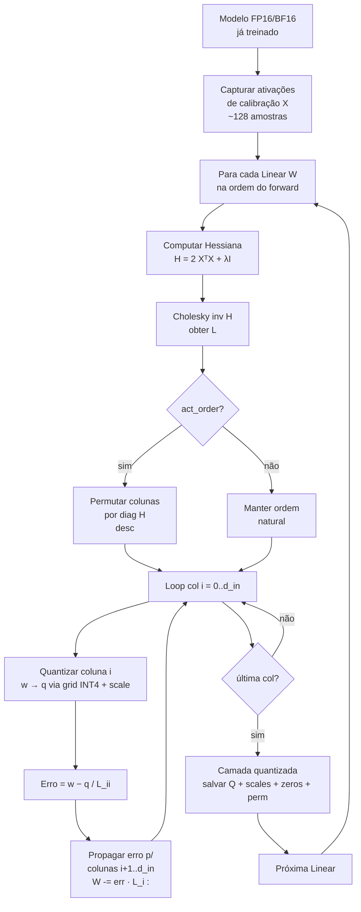
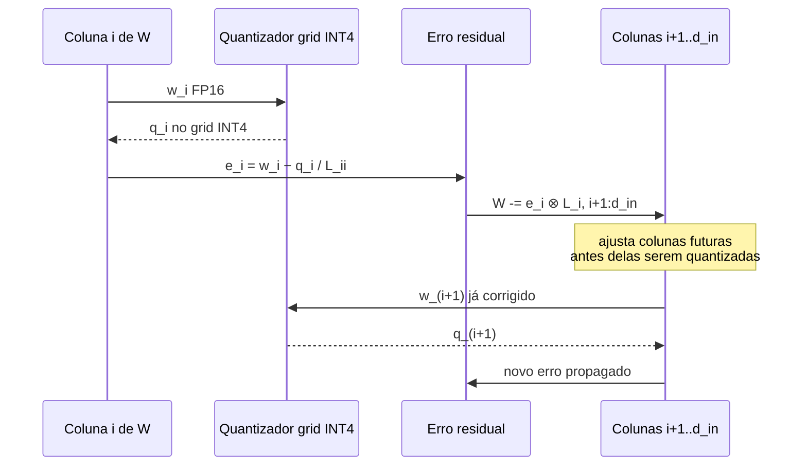
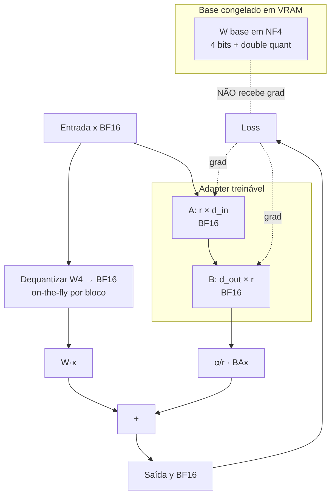
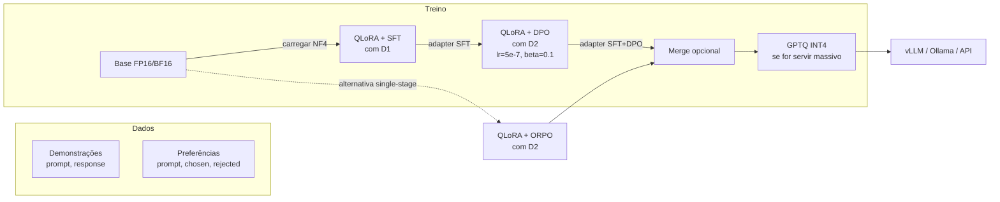
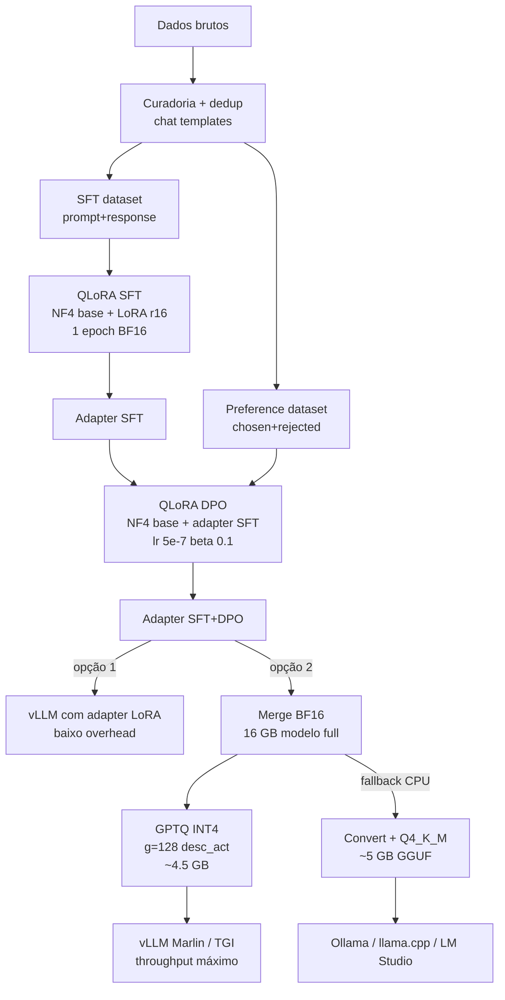

# DEEP 04 — GPTQ passo a passo (com matemática) e QLoRA hands-on (com código)

> **Apêndice ao Post 04** da série *LLMs em Profundidade*.
> **Pré-requisito obrigatório:** ler antes o [Post 04 — Quantização de pesos: GPTQ, AWQ, GGUF, bitsandbytes](./04-quantizacao-pesos-gptq-awq-gguf-bitsandbytes.md). Este apêndice assume que você já entendeu *o que* é INT4/NF4, *o que* é calibração, *o que* é group_size e *quem* é a Hessiana — aqui vamos abrir cada uma dessas coisas até o pseudocódigo e até o `pip install`.
>
> **Escopo:** dois grandes blocos.
>
> - **Parte A — GPTQ algoritmo passo a passo**, com a matemática do *Optimal Brain Damage / Surgeon* até o algoritmo Cholesky-based moderno, group quantization, act-order, comparação com RTN e troubleshooting.
> - **Parte B — QLoRA hands-on**, com código Python real (transformers + peft + bitsandbytes + TRL), receita completa de fine-tuning, target modules, hyperparams, memória esperada, pós-treino (merge / serve / quantize) e troubleshooting.
>
> Tom: **tutorial técnico**. Você sai daqui sabendo dizer *por que* GPTQ não é "round-to-nearest melhorzinho" e sabendo *rodar* um QLoRA do zero numa RTX 4090.

---

## TL;DR

- **GPTQ** é a aplicação direta de uma teoria de 1989/1993 (Optimal Brain Damage / Surgeon) reformulada para *quantização* em vez de *poda*: minimizar o erro de **saída da camada** (`||XW - X·Ŵ||²`) usando informação de **segunda ordem** (Hessiana `H = 2 XᵀX`) e **propagando o erro** de cada coluna quantizada para as colunas restantes. O algoritmo Cholesky-based torna isso O(d³) em vez de NP-hard.
- **Group quantization** (g=128 padrão) particiona cada linha em blocos com seu próprio (scale, zero), trocando ~3% de overhead por queda relevante de PPL. **Act-order** quantiza primeiro as colunas mais "sensíveis" (maior diagonal de H), ganhando qualidade mas pagando latência runtime — a menos que você use kernels modernos (Marlin, Machete) que reordenam offline.
- **QLoRA** = pesos base congelados em **NF4** (4-bit por bloco de 64, com *double quantization* dos próprios scales) + **LoRA** (matrizes B·A de rank baixo treinadas em BF16) + **paged optimizer** (estados do AdamW em memória paginada CPU↔GPU). Resultado: fine-tuning de 7B–13B numa única GPU de 24 GB, e de 70B em 1×A100 80GB.
- A receita prática que funciona em 2025/2026 é: `BitsAndBytesConfig(load_in_4bit=True, bnb_4bit_quant_type="nf4", bnb_4bit_compute_dtype=torch.bfloat16, bnb_4bit_use_double_quant=True)` + `LoraConfig(r=16, lora_alpha=32, target_modules="all-linear")` + `SFTTrainer` (TRL) + `paged_adamw_8bit`.
- "Loss = NaN" em QLoRA quase sempre é `compute_dtype=float16` em vez de `bfloat16`. "Resultado piora ao fazer merge" é o NF4 sendo destruído ao desquantizar para FP16 — sirva o adapter separado via PEFT/vLLM, ou requantize com GPTQ depois do merge.

A analogia mestre: **GPTQ é o engenheiro de som mixando coluna por coluna, ouvindo o que cada peso "errado" empurra para o resto da mistura. QLoRA é gravar um disco onde a banda toca em vinil de 4 trilhas (NF4 congelado) mas o produtor escreve por cima uma trilha de overdub em alta resolução (LoRA BF16) que pode ser destacada e remixada depois.**

---

# PARTE A — GPTQ ALGORITMO PASSO A PASSO

## A.1 Background: Optimal Brain Damage e Optimal Brain Surgeon

GPTQ não nasceu do nada em 2022. Ele é a tradução, para o problema de **quantizar** pesos de LLMs, de uma ideia de **podar** pesos de redes neurais que tem 33 anos.

### A.1.1 Optimal Brain Damage (LeCun, Denker, Solla — 1989)

Em *Optimal Brain Damage* (NeurIPS 1989), Yann LeCun perguntou: **dado um modelo treinado, qual peso eu posso zerar perdendo o mínimo de qualidade?**

A função de perda \(L\) é uma superfície no espaço dos pesos. Estamos num mínimo local após o treino, então o **gradiente** \(g = \nabla_w L\) é (aproximadamente) zero. Expandindo \(L\) em torno de \(w^*\) com Taylor de segunda ordem:

$$
L(w^* + \Delta w) \approx L(w^*) + g^T \Delta w + \tfrac{1}{2} \Delta w^T H \Delta w
$$

Como \(g \approx 0\) num mínimo, sobra:

$$
\Delta L \approx \tfrac{1}{2} \Delta w^T H \Delta w
$$

A pergunta "qual peso eu zero?" vira: **escolha \(\Delta w\) (com a restrição de zerar o peso \(i\)) que minimiza a forma quadrática acima**. OBD aproxima `H` por sua diagonal (computacionalmente barato, mas perde correlações entre pesos).

### A.1.2 Optimal Brain Surgeon (Hassibi & Stork, 1993)

Em 1993, Babak Hassibi e David Stork publicaram *Second order derivatives for network pruning: Optimal Brain Surgeon* (NeurIPS 1992/93). A contribuição: usar a **Hessiana cheia** (não só a diagonal) e, ao zerar o peso \(w_i\), **ajustar todos os outros pesos** para compensar.

A solução fechada: o ajuste ótimo \(\Delta w\) ao zerar \(w_i\) é

$$
\Delta w = -\frac{w_i}{[H^{-1}]_{ii}} \cdot H^{-1}_{:, i}
$$

e o aumento esperado de loss é

$$
\Delta L_i = \frac{w_i^2}{2 [H^{-1}]_{ii}}
$$

Isso é o "saliency score" do OBS: quanto **menor** \([H^{-1}]_{ii}\) (mais "rígida" aquela direção da Hessiana), **maior** o custo de mexer no peso \(i\). Inversamente, pesos em direções "moles" são candidatos baratos a serem podados.

OBS nunca foi escalável para redes modernas (calcular `H` cheia em GPT-3 é absurdo), mas plantou as duas sementes que reaparecem em GPTQ:

1. **Use informação de segunda ordem** quando estiver num mínimo.
2. **Compense** os pesos que ficam ao mexer nos que saem.

### A.1.3 OBQ — Optimal Brain Quantization

Em 2022, Frantar e Alistarh propuseram *Optimal Brain Compression* (OBQ), generalizando OBS de **pruning** (mexer = zerar) para **quantização** (mexer = arredondar para o grid). A receita conceitual:

- Escolha um peso \(w_i\) para quantizar.
- Compute o erro \(\delta_i = w_i - q(w_i)\) onde \(q(\cdot)\) é a função de quantização (round-to-nearest no grid INT4, por exemplo).
- Aplique o ajuste OBS: redistribua esse erro pelos pesos restantes via \(H^{-1}\).
- Repita para o próximo peso.

OBQ funciona, mas escalar para LLMs de bilhões de parâmetros ainda era proibitivo: para cada **linha** de \(W\) (camada Linear `d_out × d_in`), precisaria refazer parte do cálculo. **GPTQ é a versão Cholesky-based, escalável, do OBQ.**

---

## A.2 Formulação GPTQ (Frantar et al., 2022)

O paper *GPTQ: Accurate Post-Training Quantization for Generative Pre-trained Transformers* (arXiv:2210.17323) parte da observação central:

> Para uma camada Linear `Y = X W` (com `X ∈ ℝ^{n × d_in}`, `W ∈ ℝ^{d_in × d_out}`), o erro de **saída** ao trocar `W` por `Ŵ` é
> $$\| XW - X\hat W \|_F^2$$
> e essa é a função objetivo que queremos minimizar **camada por camada**, não a perda end-to-end.

### A.2.1 Por que minimizar erro de saída por camada (e não loss global)

Razões pragmáticas:

- A perda global precisa de **labels**, **forward completo**, **backprop** — quantização é PTQ, não treino.
- Fazendo localmente (uma camada por vez), você só precisa de algumas centenas de **ativações de calibração** \(X\) por camada, capturadas com hooks no forward de exemplos quaisquer (WikiText, C4, dataset interno).
- A composição das aproximações por camada **funciona surpreendentemente bem** na prática: PPL final fica dentro de 0.1–0.3 do FP16 em INT4.

### A.2.2 A Hessiana é compartilhada entre todas as linhas

Aqui acontece o truque numérico-chave. A função objetivo `||XW - XŴ||²` decompõe-se **linha por linha** de `W` (cada linha é um neurônio de saída independente):

$$
\| X W - X \hat W \|_F^2 = \sum_{j=1}^{d_\text{out}} \| X w_{:,j} - X \hat w_{:,j} \|_2^2
$$

Para **cada coluna** (linha de saída) \(w_{:,j}\), o problema é

$$
\min_{\hat w} \| X w - X \hat w \|_2^2
$$

cuja Hessiana com respeito a \(\hat w\) é

$$
H = \frac{\partial^2}{\partial \hat w^2} \| X w - X \hat w \|_2^2 = 2 X^T X \in \mathbb{R}^{d_\text{in} \times d_\text{in}}
$$

**Crucial**: \(H\) **não depende** de \(j\). É a mesma matriz `2·XᵀX` para todas as `d_out` linhas da camada! Isso significa que você calcula `H` **uma vez** por camada, inverte (com Cholesky) **uma vez**, e reutiliza a inversa para quantizar todas as `d_out` linhas em paralelo.

### A.2.3 Por que o problema é NP-hard

Quantizar uniformemente em INT4 significa restringir cada peso a um conjunto discreto de 16 valores (ou 16·n_grupos valores, com group quantization). Achar a configuração ótima de bits para minimizar o erro quadrático é um **problema combinatório**: \(16^{d_\text{in}}\) configurações por linha. Para `d_in = 4096`, isso é \(16^{4096}\) — claramente impraticável.

GPTQ aproxima fazendo **decisões gulosas, ordem fixa, com compensação de erro**. Não é o ótimo combinatório, mas é provadamente bom (e empiricamente excelente).

### A.2.4 Quantos exemplos de calibração?

Uma das descobertas surpreendentes do paper: **128 exemplos** de calibração (sequências curtas, ~512 tokens) já são suficientes para um modelo de 175B. A intuição: \(H = 2 X^T X\) é uma matriz `d_in × d_in`. Para que ela tenha posto cheio e seja bem-condicionada, basta \(n \gg d_\text{in}\) tokens (não exemplos): 128 exemplos × 512 tokens = 65 536 amostras de ativação por camada, mais que suficiente para `d_in = 4096`.

> Recomendação prática 2025/2026: 128–512 exemplos de **WikiText-2 train** ou **C4 en**, sequências de 2048 tokens, é o "default" que ainda produz os melhores números nos benchmarks comparativos.

---

## A.3 Cholesky-based GPTQ — o algoritmo final

A inovação engenheirística do paper: percorrer as colunas de \(W\) em **ordem fixa** (1, 2, …, d_in), e a cada coluna quantizada, **propagar o erro** apenas para as colunas **ainda não processadas** — usando a **fatoração de Cholesky** de \(H^{-1}\) para ler eficientemente o "vetor de propagação".

### A.3.1 Pseudocódigo Python comentado

```python
import torch

def gptq_quantize_layer(
    W: torch.Tensor,            # peso da camada Linear, shape (d_out, d_in) em FP16
    X: torch.Tensor,            # ativações de calibração, shape (n_samples, d_in)
    bits: int = 4,
    group_size: int = 128,
    damping: float = 0.01,      # estabilidade numérica
    act_order: bool = True,
):
    d_out, d_in = W.shape

    H = 2.0 * (X.t() @ X) / X.shape[0]                       # (d_in, d_in)
    diag_mean = torch.mean(torch.diag(H))
    H += damping * diag_mean * torch.eye(d_in, device=H.device)

    if act_order:
        perm = torch.argsort(torch.diag(H), descending=True)  # maior diag primeiro
        W = W[:, perm]
        H = H[perm][:, perm]
        invperm = torch.argsort(perm)

    L = torch.linalg.cholesky(torch.linalg.inv(H), upper=True)

    Q = torch.zeros_like(W)
    for g_start in range(0, d_in, group_size):
        g_end = min(g_start + group_size, d_in)

        scales, zeros = compute_scale_zero(W[:, g_start:g_end], bits)

        for i in range(g_start, g_end):
            w   = W[:, i]                                     # (d_out,)
            d   = L[i, i]                                     # diag de Cholesky de H^-1

            q   = quantize_round(w, scales, zeros, bits)      # (d_out,) no grid INT_b
            Q[:, i] = q

            err = (w - q) / d                                 # (d_out,)
            W[:, i+1:g_end] -= err.unsqueeze(1) * L[i, i+1:g_end].unsqueeze(0)

        if g_end < d_in:
            W[:, g_end:] -= ((W[:, g_start:g_end] - Q[:, g_start:g_end])
                             @ L[g_start:g_end, g_end:])

    if act_order:
        Q = Q[:, invperm]

    return Q, scales, zeros, perm if act_order else None
```

> *Observação:* o pseudocódigo acima é didático. As implementações reais (AutoGPTQ, GPTQModel) tratam *batched matmul*, *float16/bfloat16 storage*, simetrias e padding de group_size. O essencial — o **loop coluna-a-coluna com propagação de erro via Cholesky** — está fielmente representado.

### A.3.2 O que cada linha está fazendo

1. **`H = 2 XᵀX / n`**: a Hessiana da função `||X(w-ŵ)||²`. O `/n` é normalização para ficar numericamente estável independente do número de exemplos.
2. **`H += damping * diag_mean * I`**: adicionar uma fração da diagonal média à diagonal. Sem isso, `H` é frequentemente **singular** (algumas direções de entrada nunca são ativadas em ReLUs/GELUs) e `inv(H)` explode.
3. **Permutação act-order**: reordena as colunas de `W` (e linhas/colunas de `H`) para que as **mais sensíveis** (maior diagonal de `H`) sejam quantizadas **primeiro**. Veja A.5.
4. **Cholesky de `H⁻¹`**: forma fatorada que dá acesso O(1) ao vetor `H⁻¹[i, i:]` necessário em cada passo.
5. **Loop por grupo**: a cada `group_size` colunas, recomputa `(scale, zero)` para o bloco — esse é o "group quantization" do GPTQ.
6. **Erro `(w - q) / d`**: a magnitude do erro de quantização da coluna `i`, normalizada pela "rigidez" daquela direção.
7. **`W[:, i+1:] -= err · L[i, i+1:]`**: **redistribui** esse erro pelas colunas que ainda serão processadas, ajustando-as em FP16/BF16 antes de quantizá-las.
8. **Inverter a permutação**: ao final, devolver `Q` na ordem original das colunas (o inference engine, se for ingênuo, espera ordem natural; kernels modernos guardam `perm` e aplicam direto).

### A.3.3 Diagrama: pipeline geral GPTQ



### A.3.4 Diagrama de sequência: propagação de erro



A intuição: **se eu errei para cima ao quantizar a coluna `i`, eu posso "abaixar" um pouquinho as colunas `i+1`, `i+2`, … de modo que o produto `X · Ŵ` continue próximo de `X · W`**. A magnitude exata desse "abaixar" é dada pela linha `i` da Cholesky de `H⁻¹`, que codifica como as direções de entrada se correlacionam.

### A.3.5 Por que damping (`+ λI`) é necessário

A Hessiana `H = 2 XᵀX` em LLMs reais é frequentemente:

- **Singular ou quase-singular** — algumas direções no espaço de entrada nunca aparecem com energia suficiente nas ativações de calibração. Pense em neurônios mortos pós-ReLU, ou em embeddings que codificam tokens raros.
- **Mal-condicionada** — a razão entre maior e menor autovalor pode chegar a 10⁸ ou 10¹⁰ em camadas profundas. Inverter ou fatorar Cholesky em precisão FP32 já fica instável; em FP16 é catástrofe garantida.

A correção é Tikhonov-style: adiciona-se `λ·diag_mean·I` à `H`. Valores típicos:

| `damping` | Quando usar | Efeito |
|---|---|---|
| `0.01` | Default. Funciona em 95% dos modelos. | Mínima perturbação. |
| `0.05`–`0.1` | Modelo grande, sinais de instabilidade (NaN, PPL ruim). | Estabiliza, custa um pouco de qualidade. |
| `0.001` | Modelo pequeno (≤1B), queremos máxima qualidade. | Risco de NaN se `H` for ruim. |

A regra de bolso: **se você ver NaN durante GPTQ, dobre o damping antes de qualquer outra coisa.**

---

## A.4 Group quantization em GPTQ

### A.4.1 O que é group_size

Sem `group_size`, cada **linha** de `W` (cada neurônio de saída) compartilha **um único `(scale, zero)`** entre todas as `d_in` entradas. Isso é "per-channel" quantization. O problema: dentro de uma linha de 4096 entradas, a magnitude pode variar 100× ou 1000×, então o `scale` é dominado pelo outlier e a maioria dos pesos vira "0 ou 1".

Com `group_size = g`, particionamos cada linha em blocos contíguos de `g` entradas, e cada bloco tem **seu próprio (scale, zero)**. Isso multiplica o overhead de metadata por `d_in / g`, mas dá uma fidelidade enormemente melhor.

### A.4.2 Tabela: trade-off bits efetivos vs perplexity

Para Llama 2 7B em INT4 (números do paper original GPTQ + benchmarks reproduzidos):

| `group_size` | Bits efetivos por peso | Tamanho relativo | PPL WikiText-2 |
|---|---|---|---|
| `-1` (per-channel) | 4.005 | 1.000× | 7.32 |
| `1024` | 4.020 | 1.004× | 5.95 |
| `256` | 4.080 | 1.018× | 5.74 |
| `128` | 4.160 | 1.038× | 5.69 |
| `64` | 4.320 | 1.078× | 5.65 |
| `32` | 4.640 | 1.158× | 5.62 |
| FP16 referência | 16 | 4.000× | 5.47 |

Leitura: **g=128 é o sweet spot universal**. De 128 para 64 você gasta +4% de memória para ganhar 0.04 de PPL — raramente vale. De 256 para 128 você gasta +2% para ganhar 0.05 — vale muito.

### A.4.3 Por que blocos contíguos (e não aleatórios)

Em tese, `(scale, zero)` por **cluster** de magnitudes parecidas seria ainda melhor. Mas:

- A indireção (qual cluster cada peso pertence?) requer um mapa de tamanho `d_in · log2(n_clusters)` bits — destrói o ganho.
- Kernels GPU eficientes (Marlin, Machete, ExLlamaV2) **assumem blocos contíguos** para coalescir leituras de DRAM.
- Empiricamente, dentro de uma camada Linear, pesos contíguos têm magnitudes correlacionadas (efeito da inicialização e do treino).

EXL2 e formatos i-quant do GGUF tentam quebrar essa regra com mixed-precision por bloco — pagam complexidade extra de inferência, ganham qualidade.

---

## A.5 Act-order (`desc_act`)

### A.5.1 O que é

Por padrão, GPTQ percorre as colunas de `W` na ordem 0, 1, …, `d_in - 1`. **Act-order** muda a ordem para `argsort(diag(H), descending=True)`: quantize **primeiro** as colunas mais "sensíveis", depois as menos.

### A.5.2 Por que ajuda

A diagonal `H_ii = 2·||X[:, i]||²` mede a **energia** que aquela direção de entrada injeta na saída. Direções com mais energia → erros de quantização ali são mais visíveis na saída. Estratégia: quantize-as quando **ainda** há graus de liberdade nas outras colunas para compensar o erro. Quantizar uma coluna sensível por último deixa o erro sem absorvedouro.

Empiricamente, act-order vale **0.1–0.3 de PPL** em INT4 — significativo.

### A.5.3 O custo: permutação no inference

Sem act-order, cada coluna `i` de `Ŵ` é multiplicada pelo elemento `i` da entrada. Com act-order, você permuta as colunas e precisa **desfazer a permutação na hora de multiplicar**, ou multiplicar pela entrada permutada e depois desfazer. Em kernels ingênuos isso vira `gather`/`scatter` extra, custando 5–15% de latência.

### A.5.4 Salvação: kernels Marlin e Machete

A partir de 2024, kernels específicos para GPTQ INT4 começaram a **absorver a permutação** offline durante o load do modelo: a matriz `Ŵ` é reorganizada em DRAM na ordem que o tensor core consome, e o `perm` vira informação implícita do layout. Custo runtime → **zero**.

Recomendação 2025/2026:

| Backend | Suporte act-order com kernel rápido |
|---|---|
| vLLM (GPTQ Marlin) | ✅ sim, sem penalidade |
| ExLlamaV2 | ✅ sim |
| Hugging Face `transformers` direto | ⚠️ leve penalidade |
| llama.cpp (não usa GPTQ formato puro) | n/a |

Conclusão: **ative act-order**. Em 2026 raramente compensa desativar.

---

## A.6 GPTQ vs RTN (round-to-nearest)

RTN é o baseline trivial: para cada peso, escolha o ponto do grid INT4 mais próximo, sem propagação de erro, sem Hessiana, sem nada. Quanto GPTQ realmente ganha?

### A.6.1 Tabela comparativa (Llama 2 7B INT4, WikiText-2 PPL)

| Método | g=128 | g=64 | per-channel |
|---|---|---|---|
| FP16 referência | 5.47 | 5.47 | 5.47 |
| RTN | 6.29 | 5.96 | 8.15 |
| GPTQ | 5.69 | 5.65 | 7.32 |
| AWQ | 5.61 | 5.58 | 6.93 |
| GPTQ + act-order | 5.62 | 5.59 | — |

Leitura:

- **RTN per-channel é ruim** (8.15 vs 5.47): outliers destroem o `scale`.
- **RTN g=128 já é decente** (6.29) — group quantization sozinha resolve metade do problema.
- **GPTQ g=128 ≈ RTN g=64** em qualidade, com metade do overhead de scales.
- **AWQ levemente melhor** que GPTQ (escala por canal de ativação antes de quantizar).
- **act-order** dá os últimos centésimos.

### A.6.2 Quando RTN basta

- **Modelos pequenos (≤1B)** em INT8: a margem de erro é tão pequena que GPTQ raramente ajuda > 0.05 PPL.
- **Quantização para experimentos rápidos**: RTN é literal um `round()` por tensor — leva segundos, não horas.
- **Hardware sem suporte a kernel GPTQ**: se você vai rodar via `bitsandbytes` 8-bit em CPU, o overhead de GPTQ não compensa.

Para INT4 em LLMs ≥7B servindo produção, a resposta é sempre **GPTQ ou AWQ**, nunca RTN puro.

---

## A.7 Implementações práticas

### A.7.1 Comparativo de bibliotecas (2025/2026)

| Biblioteca | Status | Pontos fortes | Limitações |
|---|---|---|---|
| **AutoGPTQ** | Maintenance mode | Histórico, muitos checkpoints HF | Updates raros, sem suporte a modelos novos |
| **GPTQModel** | ✅ Ativo (fork) | Llama 3/4, Mixtral, Qwen2.5, Marlin kernel, MoE | API ainda mudando |
| **vLLM (gptq_marlin)** | ✅ Inferência | Kernel mais rápido, FP8 mix | Não quantiza, só carrega |
| **llama.cpp Q4_K_M** | ✅ Padrão CPU/Mac | Mixed precision por bloco, GGUF universal | **Não é GPTQ** — heurística diferente |
| **HQQ** | ✅ Alternativa | Sem calibração, super rápido | Qualidade um pouco abaixo de GPTQ INT4 |

### A.7.2 Comando real GPTQModel

```bash
pip install gptqmodel transformers datasets torch

gptqmodel quantize \
  --model meta-llama/Meta-Llama-3-8B-Instruct \
  --output llama3-8b-gptq-int4 \
  --bits 4 \
  --group-size 128 \
  --desc-act true \
  --damping 0.01 \
  --calibration wikitext-2-raw-v1 \
  --calibration-samples 256 \
  --calibration-seq-len 2048 \
  --device cuda:0
```

Em Python (mais flexível):

```python
from gptqmodel import GPTQModel, QuantizeConfig
from datasets import load_dataset

quant_config = QuantizeConfig(
    bits=4,
    group_size=128,
    desc_act=True,
    damp_percent=0.01,
    sym=True,                  # quant simétrico, sem zero-point
)

model = GPTQModel.load("meta-llama/Meta-Llama-3-8B-Instruct", quant_config)

calib = load_dataset("wikitext", "wikitext-2-raw-v1", split="train")
calib = [c["text"] for c in calib if len(c["text"]) > 200][:256]

model.quantize(calib, batch_size=2)
model.save("llama3-8b-gptq-int4")
```

Tempo esperado em 1×RTX 4090: ~12–25 min para 8B INT4 g=128.

### A.7.3 Notas sobre llama.cpp Q4_K_M

`Q4_K_M` (do GGUF) é frequentemente confundido com GPTQ — mas **não é**. É uma heurística k-quants que:

- Particiona em superblocos de 256 + sub-blocos de 16/32.
- Para cada superbloco, escolhe **2 escalas FP16** e **1 zero FP16**, depois ajusta sub-blocos com 4–6 bits adicionais.
- **Não usa Hessiana**, não propaga erro.

Por que funciona tão bem na prática? Mixed precision por bloco + escalas de escalas (parecido com double quantization de NF4). Resultado: PPL Q4_K_M de Llama 3 8B fica em ~5.74, próximo de GPTQ g=128. Mas **não roda em GPU eficientemente fora de llama.cpp** — o formato é otimizado para CPU.

---

## A.8 Análise de erros e troubleshooting GPTQ

| Sintoma | Diagnóstico provável | Ação |
|---|---|---|
| `RuntimeError: NaN in Hessian` durante quant | `H` mal-condicionada, damping baixo | `damping=0.05` ou `0.1` |
| PPL pós-quant explode (>10× FP16) | Calibração não-representativa | Trocar dataset (use C4 en, ou amostras do seu domínio); aumentar `calibration_samples` para 512 |
| `OOM` durante GPTQ em 70B | `H` tem `d_in × d_in` em FP32 | Processar camada-por-camada com `cpu_offload`, usar GPTQModel `--lazy`; ou rodar em GPU 80GB |
| Modelo lento na inferência (vs RTN) | act-order com kernel ingênuo | Trocar backend para vLLM Marlin / ExLlamaV2; ou desabilitar `desc_act` |
| Alguns layers ficam "broken" (saída esquisita) | Layer com poucos exemplos de calibração ativando-o | Aumentar diversidade do calib set; em MoE, garantir que cada expert vê amostras |
| Zero-point estourando faixa | Distribuição muito assimétrica | Usar `sym=False` (quant assimétrico); ou pre-shift dos pesos |
| Resultado pior que AWQ no seu caso | Camadas FFN com outliers de ativação | Tentar AWQ (escala canal-a-canal de ativação) ou SmoothQuant primeiro |

---

# PARTE B — QLORA HANDS-ON COMPLETO

## B.1 O que é QLoRA — recap rápido

**QLoRA** (Dettmers et al., *QLoRA: Efficient Finetuning of Quantized LLMs*, NeurIPS 2023, arXiv:2305.14314) é a combinação de três ideias para viabilizar **fine-tuning** de LLMs grandes em **uma única GPU de consumidor**:

1. **NF4 (4-bit NormalFloat) com double quantization** para os pesos base, congelados.
2. **LoRA adapters** (Hu et al., 2021, arXiv:2106.09685) em cima das matrizes Q/K/V/O e FFN, treinados em BF16.
3. **Paged optimizer** (`paged_adamw_8bit`) para que estados do AdamW caibam em memória paginada CPU↔GPU.

Resultado: **Llama 2 70B fine-tune em 1×A100 80GB**, ou **Llama 3 8B fine-tune em 1×RTX 4090 24GB**.

A arquitetura conceitual:



Os gradientes só fluem para **A e B**. `W4` é tratado como constante; sua dequantização para BF16 é feita on-the-fly, bloco por bloco, dentro do kernel CUDA do bitsandbytes.

---

## B.2 NF4 em detalhe

### B.2.1 Por que "Normal Float 4-bit"

Pesos de redes neurais treinadas seguem aproximadamente uma distribuição **normal centrada em zero**. INT4 uniforme (16 níveis equidistantes) **desperdiça resolução** nas caudas (onde quase não há massa) e tem **resolução escassa** no centro (onde está a massa).

A ideia do NF4: escolher os 16 níveis nos **quantis** de uma `Normal(0, 1)` truncada em [-1, 1], depois escalar por bloco para [-1, 1]. Isso garante que cada nível tem **a mesma probabilidade** de receber um peso (~6.25%) — ou seja, cada bit usado contribui o mesmo número de bits de informação. Em jargão de teoria da informação: NF4 é **information-theoretically optimal** para entradas Normal.

### B.2.2 Os 16 níveis NF4

Aproximadamente:

```
[-1.0000, -0.6962, -0.5251, -0.3949, -0.2844, -0.1848, -0.0911, -0.0000,
  0.0796,  0.1609,  0.2461,  0.3379,  0.4407,  0.5626,  0.7230,  1.0000]
```

Note: o nível `-0.0000` (e o `-0.0000` é distinto de `0.0796` no outro lado) garante que o **zero exato** é representável — propriedade desejável (pesos próximos de zero permanecem zero, sem deslocamento).

### B.2.3 Block-wise quantization

Cada **bloco de 64 elementos** (consecutivos no tensor flatten-row-major) tem **seu próprio scale** \(s\) (FP32 originalmente). Um peso \(w\) é codificado como:

$$
\text{nf4\_index} = \arg\min_k | w / s - \text{level}_k |
$$

E reconstruído como `s · level_k`.

### B.2.4 Double Quantization

Os scales `s` são FP32 e há um deles a cada 64 pesos. Para Llama 2 70B (~70·10⁹ params), isso é `70e9 / 64 ≈ 1.1e9` scales × 4 bytes = **4.4 GB só de scales**. Caro.

Solução (DQ): **quantizar os próprios scales** em FP8 (8 bits), agrupados em blocos de 256 scales, com **um meta-scale FP32 por meta-bloco**.

Custo overhead final:

- Pesos: 4 bits.
- Scales (FP8): 8 / 64 = 0.125 bit/peso.
- Meta-scales (FP32): 32 / (64 · 256) = 0.002 bit/peso.

Total: **~4.13 bits/peso**. Comparado com 4.5 bits/peso sem DQ → economia de ~8% real.

### B.2.5 Tabela: NF4 vs INT4 vs FP4

| Formato | Bits | Distribuição assumida | Zero exato | Block size típico | Uso |
|---|---|---|---|---|---|
| INT4 simétrico | 4 | Uniforme | Sim | 32–128 (group) | GPTQ, AWQ |
| INT4 assimétrico | 4 + zero-point | Uniforme | Sim | 32–128 | GPTQ, AWQ |
| **NF4** | 4 | Normal(0,1) | Sim | 64 (DQ) | QLoRA |
| FP4 (E2M1) | 4 | Logarítmica | Não exato | Varia | Inferência H100/B200 (MXFP4/NVFP4) |
| FP4 (E1M2) | 4 | Logarítmica densa no centro | Sim | Varia | Experimentos |

**Quando usar NF4**: para **fine-tuning** (QLoRA). Pesos base são treinados, distribuição razoavelmente Normal — NF4 é o ótimo informacional.

**Quando usar INT4**: para **inferência pura** com GPTQ/AWQ — kernels mais maduros, suporte universal de hardware.

---

## B.3 LoRA recap

### B.3.1 A fórmula

Para uma camada Linear `y = Wx` com `W ∈ ℝ^(d_out × d_in)`, LoRA adiciona uma correção de **baixo rank**:

$$
y = W x + \frac{\alpha}{r} B A x, \quad A \in \mathbb{R}^{r \times d_\text{in}}, \ B \in \mathbb{R}^{d_\text{out} \times r}
$$

Onde:

- `r` = **rank** do adapter. Tipicamente 4, 8, 16, 32, 64.
- `α` = **scaling factor**. Tipicamente `α = 2r` (mantém a razão `α/r = 2` constante).
- `A` é inicializada com **distribuição aleatória pequena** (Kaiming).
- `B` é inicializada com **zeros** — assim, no início do treino, `BA = 0` e o adapter é "transparente".

### B.3.2 Por que funciona

A hipótese subjacente (do paper LoRA): o **delta de pesos** que um fine-tune precisa fazer tem **rank intrínseco baixo**. Empiricamente verdade para tasks como instrução, alinhamento, especialização de domínio.

Em números: para uma Linear `4096 × 4096` (`d_out · d_in = 16.78M` params), um adapter `r=16` tem `r·(d_in + d_out) = 131K` params — **0.78%** dos params originais. Treina-se 1% e ganha-se ~95% da qualidade de full fine-tune.

### B.3.3 Adapter merge

Após o treino, pode-se "fundir" o adapter no peso base:

$$
W_\text{merged} = W + \frac{\alpha}{r} B A
$$

`W_merged` tem o mesmo shape de `W`, e o modelo passa a ter o comportamento ajustado **sem overhead de inferência**.

**Pegadinha QLoRA**: se `W` está em NF4, o merge requer dequantizar para BF16, somar `BA`, e... aí o que faz com o resultado? Se você re-quantizar para NF4, a precisão do adapter (que era BF16) é destruída. Por isso, em QLoRA, frequentemente se mantém **adapter separado** no inference (PEFT, vLLM com `--enable-lora`).

---

## B.4 Receita completa de fine-tuning QLoRA

### B.4.1 Setup do ambiente

```bash
python -m venv .venv
source .venv/bin/activate

pip install --upgrade pip wheel
pip install "torch>=2.4" "transformers>=4.44" "accelerate>=0.34" \
            "peft>=0.13" "bitsandbytes>=0.44" "trl>=0.11" \
            "datasets>=3.0" "evaluate" "scipy"

python -c "import torch; print(torch.cuda.is_available(), torch.cuda.get_device_name(0))"
python -c "import bitsandbytes as bnb; print(bnb.__version__)"
```

> Em 2025/2026, `bitsandbytes` ≥ 0.44 já tem suporte a Hopper/Ada com NF4 + DQ via Triton fallback em GPUs sem CUDA-12 nativa. Em Ampere (RTX 3090) e Ada (RTX 4090), o caminho rápido CUDA está estável.

### B.4.2 Script Python completo

```python
import os
import torch
from datasets import load_dataset
from transformers import (
    AutoModelForCausalLM,
    AutoTokenizer,
    BitsAndBytesConfig,
    TrainingArguments,
)
from peft import LoraConfig, prepare_model_for_kbit_training, get_peft_model
from trl import SFTTrainer, SFTConfig

MODEL_ID = "meta-llama/Meta-Llama-3-8B-Instruct"
OUT_DIR  = "./llama3-8b-qlora-out"
MAX_LEN  = 2048

bnb_config = BitsAndBytesConfig(
    load_in_4bit=True,
    bnb_4bit_quant_type="nf4",
    bnb_4bit_use_double_quant=True,
    bnb_4bit_compute_dtype=torch.bfloat16,
)

tokenizer = AutoTokenizer.from_pretrained(MODEL_ID, use_fast=True)
if tokenizer.pad_token is None:
    tokenizer.pad_token = tokenizer.eos_token
tokenizer.padding_side = "right"

model = AutoModelForCausalLM.from_pretrained(
    MODEL_ID,
    quantization_config=bnb_config,
    device_map="auto",
    attn_implementation="flash_attention_2",
    torch_dtype=torch.bfloat16,
)
model.config.use_cache = False
model.config.pretraining_tp = 1

model = prepare_model_for_kbit_training(model, use_gradient_checkpointing=True)

lora_config = LoraConfig(
    r=16,
    lora_alpha=32,
    lora_dropout=0.05,
    bias="none",
    task_type="CAUSAL_LM",
    target_modules=[
        "q_proj", "k_proj", "v_proj", "o_proj",
        "gate_proj", "up_proj", "down_proj",
    ],
)
model = get_peft_model(model, lora_config)
model.print_trainable_parameters()

ds = load_dataset("yahma/alpaca-cleaned", split="train").shuffle(seed=42).select(range(20000))

def format_alpaca(example):
    if example.get("input"):
        prompt = (
            f"### Instruction:\n{example['instruction']}\n\n"
            f"### Input:\n{example['input']}\n\n"
            f"### Response:\n{example['output']}"
        )
    else:
        prompt = (
            f"### Instruction:\n{example['instruction']}\n\n"
            f"### Response:\n{example['output']}"
        )
    return {"text": prompt + tokenizer.eos_token}

ds = ds.map(format_alpaca, remove_columns=ds.column_names)

sft_cfg = SFTConfig(
    output_dir=OUT_DIR,
    num_train_epochs=1,
    per_device_train_batch_size=2,
    gradient_accumulation_steps=8,
    gradient_checkpointing=True,
    optim="paged_adamw_8bit",
    learning_rate=2e-4,
    lr_scheduler_type="cosine",
    warmup_ratio=0.03,
    weight_decay=0.0,
    logging_steps=10,
    save_strategy="epoch",
    bf16=True,
    fp16=False,
    max_grad_norm=0.3,
    max_seq_length=MAX_LEN,
    packing=True,
    dataset_text_field="text",
    report_to="none",
)

trainer = SFTTrainer(
    model=model,
    train_dataset=ds,
    args=sft_cfg,
    tokenizer=tokenizer,
)

trainer.train()
trainer.save_model(OUT_DIR)
tokenizer.save_pretrained(OUT_DIR)
print(f"Adapter salvo em {OUT_DIR}")
```

### B.4.3 Comando de treino e estimativas de tempo

```bash
accelerate launch --num_processes=1 train_qlora.py
```

Estimativas para Llama 3 8B, 20k exemplos Alpaca, 1 epoch, `max_seq_length=2048`:

| GPU | VRAM | Tempo aprox. | tokens/s | Observações |
|---|---|---|---|---|
| RTX 3090 | 24 GB | ~9 h | 750 | sem FA2; usar `attn_implementation="sdpa"` |
| RTX 4090 | 24 GB | ~5 h | 1 350 | FA2 ok; sweet spot custo/benefício |
| A100 40 GB | 40 GB | ~2 h 40 min | 2 600 | dá para batch 4 + accum 4 |
| A100 80 GB | 80 GB | ~2 h | 3 300 | seq 4096 viável |
| H100 80 GB | 80 GB | ~1 h 10 min | 5 800 | FA3, BF16 tensor cores plenos |

> Multiplique por ~3.5–4× se for 70B. Em A100 80 GB, 70B QLoRA 1 epoch Alpaca ≈ 8h.

---

## B.5 Hyperparams típicos

### B.5.1 Tabela de partida

| Hyperparam | Receita HF docs | Receita Sebastian Raschka | Quando aumentar | Quando diminuir |
|---|---|---|---|---|
| `r` (rank) | 8–16 | 16–32 | Task difícil, dados ricos | Tarefa simples, pouco dado (overfit) |
| `lora_alpha` | `2 · r` | `2 · r` ou `r` | Quer adapter mais "presente" | Loss instável |
| `lora_dropout` | 0.05 | 0.0–0.1 | Overfitting | Modelo grande já regulariza |
| `learning_rate` | 2e-4 | 2e-4 a 3e-4 | Loss não cai | NaN ou loss osc. |
| `per_device_batch_size` | 2 | 4 | Mais VRAM disponível | OOM |
| `gradient_accumulation` | 4–8 | 4 | Quer batch efetivo maior | Throughput ruim |
| `num_epochs` | 1–3 | 1–2 | Dataset pequeno (<5k) | Dataset grande (>50k) |
| `weight_decay` | 0.0 | 0.0–0.01 | Sinais de overfit | LoRA já regulariza naturalmente |
| `warmup_ratio` | 0.03 | 0.03 | Modelo grande | — |
| `max_grad_norm` | 0.3–1.0 | 0.3 | Loss explode | — |

### B.5.2 Receita "instrução simples" vs "domínio especializado"

**Instrução simples (chat geral, 5–20k exemplos)**:
- `r=8`, `alpha=16`, `lr=2e-4`, 1 epoch, target = atenção apenas (q/k/v/o).

**Domínio especializado (código jurídico, médico, código nativo, 50k+ exemplos)**:
- `r=32` ou `r=64`, `alpha=32` ou `64`, `lr=1e-4`, 2–3 epochs, target = atenção + FFN.

**Formato/estilo (DPO depois de SFT)**:
- Manter `r` do SFT, `lr=5e-7` (DPO precisa LR muito menor!), `beta=0.1`, 1 epoch.

---

## B.6 Target modules — quais escolher

A escolha das matrizes Linear que recebem adapter LoRA é tão importante quanto `r`.

### B.6.1 Tabela: target_modules vs % treinável vs qualidade

Para Llama 3 8B (~8.03B params), `r=16`:

| `target_modules` | # Linear treináveis | Params LoRA | % do total | Qualidade típica (escala 1–10) |
|---|---|---|---|---|
| `q_proj, v_proj` (paper LoRA original) | 64 (32 layers × 2) | ~6.6 M | 0.082% | 7.0 |
| `q_proj, k_proj, v_proj, o_proj` | 128 | ~13.6 M | 0.169% | 7.8 |
| + `gate_proj, up_proj, down_proj` (atenção + FFN) | 224 | ~41.9 M | 0.522% | **8.7** |
| `"all-linear"` em PEFT (inclui `lm_head`!) | 225 | ~566 M | 7.05% | 8.8 (mas custa 13× mais memória) |
| Apenas FFN (`gate, up, down`) | 96 | ~28.3 M | 0.353% | 7.5 |

**Recomendação 2025/2026**: para QLoRA, sempre **atenção completa + FFN**. O custo de memória é desprezível, a qualidade salta visivelmente.

```python
target_modules = [
    "q_proj", "k_proj", "v_proj", "o_proj",
    "gate_proj", "up_proj", "down_proj",
]
```

Ou, equivalentemente em PEFT >= 0.10:

```python
target_modules = "all-linear"
```

(que pega **todas** as Linear, **excluindo** `lm_head` por padrão — exceto se você setar `modules_to_save=["lm_head"]`).

### B.6.2 Quando incluir `lm_head` e `embed_tokens`

- **Incluir `lm_head`**: quando você está adicionando **vocabulário novo** (tokens especiais, idiomas raros). Caso contrário, pular: é o módulo mais pesado e dá pouco ganho em chat genérico.
- **Incluir `embed_tokens`**: idem, só se mexeu em vocab.
- Usar `modules_to_save=["lm_head"]` para treinar `lm_head` **integralmente** (não como LoRA), o que faz sentido para vocab novo.

---

## B.7 Memória esperada — cálculo concreto

Vamos somar VRAM para Llama 3 8B em QLoRA, batch=2, seq=2048, gradient checkpointing, paged AdamW 8-bit:

### B.7.1 Componentes

| Componente | Cálculo | VRAM aprox. |
|---|---|---|
| Pesos base NF4 + DQ | 8.03B × 4.13 bits / 8 | **4.15 GB** |
| Buffers/embeddings em BF16 (lm_head, norms) | ~250M × 2 bytes | 0.50 GB |
| LoRA params (r=16, all-linear) | ~42M × 2 bytes (BF16) | 0.08 GB |
| LoRA gradientes | mesmo tamanho dos params | 0.08 GB |
| Optimizer state AdamW 8-bit (paged) | 2 × 42M × 1 byte (paged) | 0.08 GB efetivo |
| Activations (com gradient checkpointing) | ~`2 × seq × hidden × n_layers / sqrt(n_layers)` em BF16 | 4–6 GB |
| KV cache durante forward | `2 × seq × hidden × layers × 2 bytes` (sem cache durante treino, é 0) | 0 |
| Workspace cuBLAS / FA2 | reservado por `transformers` | 1–2 GB |
| Paged dequant buffers (NF4 → BF16 on-the-fly) | bloco por bloco | ~1 GB |

**Total**: ~12–16 GB → **cabe confortavelmente em RTX 4090 (24 GB)**, com margem para subir batch para 4 ou seq_len para 4096.

### B.7.2 Comparativo: full fine-tune × LoRA × QLoRA

Para Llama 3 8B (params em FP16):

| Estratégia | Pesos | Optimizer (AdamW) | Activations | LoRA | **Total VRAM** | GPU mínima |
|---|---|---|---|---|---|---|
| Full fine-tune BF16 | 16 GB | 64 GB | 12–16 GB | — | **~96 GB** | 8×A100 80GB ZeRO-3 |
| LoRA BF16 | 16 GB | 0.5 GB | 12 GB | 0.1 GB | **~30 GB** | 1×A100 40GB |
| **QLoRA NF4** | 4 GB | 0.1 GB (paged) | 5 GB | 0.1 GB | **~14 GB** | **1×RTX 4090 24 GB** |

Salto QLoRA: **~7×** menos VRAM que LoRA, **~28×** menos que full FT.

### B.7.3 Tabela: Hardware sizing QLoRA

| GPU | VRAM | Llama 3 8B QLoRA (max seq, batch) | Llama 70B QLoRA |
|---|---|---|---|
| RTX 3060 12GB | 12 | seq 1024, batch 1 | ❌ |
| RTX 4070 Ti 16GB | 16 | seq 2048, batch 1 | ❌ |
| RTX 3090 / 4090 | 24 | seq 2048, batch 2 ou seq 4096, batch 1 | ❌ (cabe inferência, não treino) |
| A100 40GB | 40 | seq 4096, batch 4 | seq 1024, batch 1 (apertado) |
| A100 80GB | 80 | seq 8192, batch 4 | seq 2048, batch 2 |
| H100 80GB | 80 | seq 8192, batch 8 (FA3) | seq 4096, batch 2 |
| H200 141GB | 141 | seq 16k, batch 8 | seq 4096, batch 4 |

---

## B.8 Pós-treino — merge, serve, requantize

### B.8.1 Salvar adapter

```python
trainer.save_model("./adapter-out")
```

Gera `adapter_model.safetensors` (~80 MB para `r=16`) + `adapter_config.json`. **Não inclui pesos base** — só o delta LoRA. Esse é o artefato versionável.

### B.8.2 Carregar adapter na inferência

```python
from peft import PeftModel
from transformers import AutoModelForCausalLM, AutoTokenizer, BitsAndBytesConfig

bnb_cfg = BitsAndBytesConfig(load_in_4bit=True, bnb_4bit_quant_type="nf4",
                             bnb_4bit_compute_dtype=torch.bfloat16,
                             bnb_4bit_use_double_quant=True)

base = AutoModelForCausalLM.from_pretrained(
    "meta-llama/Meta-Llama-3-8B-Instruct",
    quantization_config=bnb_cfg, device_map="auto"
)
model = PeftModel.from_pretrained(base, "./adapter-out")
model.eval()
```

### B.8.3 Merge (opcional)

```python
merged = model.merge_and_unload()
merged.save_pretrained("./llama3-8b-merged-bf16", safe_serialization=True)
```

⚠️ **Pegadinha**: `merge_and_unload()` no QLoRA **dequantiza** os pesos base de NF4 para BF16, soma `BA`, e salva em BF16. Você acaba com um modelo de **16 GB**, não 4 GB. Se quiser INT4 final:

```bash
gptqmodel quantize --model ./llama3-8b-merged-bf16 \
                   --output ./llama3-8b-merged-gptq-int4 \
                   --bits 4 --group-size 128 --desc-act true \
                   --calibration wikitext-2-raw-v1
```

### B.8.4 Servir com adapter separado (sem merge)

**vLLM** suporta múltiplos adapters LoRA simultâneos:

```bash
vllm serve meta-llama/Meta-Llama-3-8B-Instruct \
  --enable-lora \
  --lora-modules meu-adapter=./adapter-out \
  --max-loras 4 --max-lora-rank 16 \
  --quantization bitsandbytes --load-format bitsandbytes
```

E na request:

```bash
curl http://localhost:8000/v1/completions -d '{
  "model": "meu-adapter",
  "prompt": "Explique Hessiana em uma frase.",
  "max_tokens": 50
}'
```

Vantagem: **um modelo base, N adapters**, troca instantânea por request. Ideal para multi-tenant.

### B.8.5 Converter para GGUF (Llama.cpp / Ollama)

```bash
python llama.cpp/convert_hf_to_gguf.py ./llama3-8b-merged-bf16 \
       --outfile llama3-8b-merged.gguf --outtype bf16

./llama.cpp/build/bin/llama-quantize llama3-8b-merged.gguf \
       llama3-8b-merged-Q4_K_M.gguf Q4_K_M
```

Resultado: arquivo de ~5 GB rodável em CPU/Apple Silicon via Ollama, LM Studio, llama.cpp.

---

## B.9 Troubleshooting QLoRA

| Sintoma | Causa típica | Correção |
|---|---|---|
| `loss = nan` desde o passo 1 | `compute_dtype=float16` em GPU sem suporte completo a FP16 ops | **Use `bnb_4bit_compute_dtype=torch.bfloat16`**. Único fix em 90% dos casos. |
| `loss = nan` após algumas steps | LR alto demais, ou `max_grad_norm` ausente | Setar `max_grad_norm=0.3`, baixar `lr` para `1e-4` |
| Loss não desce (fica plana em ~1.5–2.0) | `lr` baixo demais, ou rank insuficiente | Subir `lr` para `3e-4`, ou `r` para 32 |
| `OOM` mesmo com gradient checkpointing | Seq muito longa, batch muito alto, ou Flash Attention desabilitada | `max_seq_length=1024`, `batch=1`, `attn_implementation="flash_attention_2"` |
| `OOM` ao iniciar (antes do passo 1) | Pesos base não cabem nem em NF4 | Usar `device_map="auto"` com `offload_folder` para CPU; ou GPU maior |
| Adapter overfita rápido (~val_loss sobe após 1 epoch) | Dataset pequeno, dropout 0 | `lora_dropout=0.1`, **menos epochs**, mais dados |
| Resultado piora após `merge_and_unload` | Ao desquantizar NF4 → BF16 e re-quantizar para usar de novo | Sirva adapter **separado** via PEFT/vLLM. Se precisar mergear, requantize com GPTQ depois. |
| `Triton kernel error` em RTX 3060/3070 | Versão antiga de bitsandbytes | `pip install -U bitsandbytes`; conferir `bnb.__version__ >= 0.44` |
| `Tokenizer not found` ao carregar adapter | Salvou só o adapter, não o tokenizer | Sempre `tokenizer.save_pretrained(out)` no fim do treino |
| Geração sai repetitiva ou trava | `model.config.use_cache = False` foi setado para treino e não foi restaurado | `model.config.use_cache = True` antes de inferir |
| `flash_attention_2` falha no load | Não instalado ou GPU sem suporte (Volta, T4) | `pip install flash-attn --no-build-isolation`; em GPU velha use `"sdpa"` |
| Prompts longos cortados | `max_seq_length` no SFTConfig | Aumentar; checar VRAM |

---

## B.10 SFT → DPO → ORPO: a progressão moderna

Em 2025/2026 o pipeline padrão de pós-treino é:

1. **SFT (Supervised Fine-Tuning)** — modelo aprende **formato** e **conteúdo** com `(prompt, response)`. Loss = cross-entropy. É o que fizemos acima.
2. **DPO (Direct Preference Optimization)** — modelo aprende **preferências** com `(prompt, chosen, rejected)`. Implícito reward model. Substitui RLHF/PPO em 95% dos casos.
3. **ORPO (Odds Ratio Preference Optimization)** — single-stage: faz SFT e alinhamento **simultaneamente** com `(prompt, chosen, rejected)`. Mais barato que SFT+DPO.

### B.10.1 Pipeline completo



### B.10.2 Snippet DPO (TRL)

```python
from trl import DPOTrainer, DPOConfig

dpo_cfg = DPOConfig(
    output_dir="./dpo-out",
    learning_rate=5e-7,
    per_device_train_batch_size=2,
    gradient_accumulation_steps=4,
    num_train_epochs=1,
    bf16=True,
    optim="paged_adamw_8bit",
    beta=0.1,
)

dpo_trainer = DPOTrainer(
    model=model,                  # peft model do SFT
    ref_model=None,               # com PEFT, ref_model é o base sem adapter
    args=dpo_cfg,
    train_dataset=preference_ds,  # cols: prompt, chosen, rejected
    tokenizer=tokenizer,
)
dpo_trainer.train()
```

### B.10.3 ORPO em uma linha conceitual

```python
from trl import ORPOTrainer, ORPOConfig

orpo_cfg = ORPOConfig(
    output_dir="./orpo-out",
    learning_rate=8e-6,
    beta=0.1,
    bf16=True,
    optim="paged_adamw_8bit",
)
ORPOTrainer(model, args=orpo_cfg, train_dataset=preference_ds, tokenizer=tokenizer).train()
```

ORPO faz `loss = NLL(chosen) + λ · log(σ(odds_ratio(chosen/rejected)))`, capturando ambos sinais sem precisar de SFT separado.

---

## B.11 Pipeline completo: dados → SFT → DPO → merge → quantize → serve



---

## B.12 Tabelas comparativas finais

### B.12.1 GPTQ vs RTN vs AWQ (consolidado)

| Critério | RTN | GPTQ | AWQ |
|---|---|---|---|
| Calibração | Não | 128–512 amostras | 128 amostras |
| Tempo quant 8B INT4 | <1 min | 12–25 min | 8–15 min |
| Hessiana | — | Sim | Estatística de ativação (não Hessiana) |
| Group quant padrão | g=128 | g=128 | g=128 |
| Act-order | n/a | Opcional (recomendado) | n/a (escala já endereça) |
| PPL Llama 2 7B INT4 g=128 | 6.29 | 5.69 | 5.61 |
| Suporte vLLM | ✅ via Marlin | ✅ Marlin/Machete | ✅ AWQ kernel |
| Quando preferir | Modelos pequenos, INT8 | Default seguro, ecosistema HF | LLMs com outliers fortes |

### B.12.2 QLoRA vs LoRA vs Full FT

| Aspecto | Full FT | LoRA | **QLoRA** |
|---|---|---|---|
| Pesos base | BF16 treináveis | BF16 congelados | **NF4 congelados** |
| Adapter | — | BF16 BA | BF16 BA |
| VRAM 8B | ~96 GB | ~30 GB | **~14 GB** |
| GPU mínima 8B | 8×A100 ZeRO-3 | 1×A100 40 | **1×RTX 4090** |
| Velocidade (tok/s, RTX 4090) | n/a | 1 800 | 1 350 |
| Qualidade pós-treino | 10/10 | 9.5/10 | 9.0–9.3/10 |
| Custo cloud para 1 epoch Alpaca | $$$ | $$ | **$** |
| Multi-task (vários adapters) | ❌ | ✅ | ✅ |

### B.12.3 Target modules — sumário rápido

| Setup | % Trainable | Quando |
|---|---|---|
| `q,v` | 0.08% | Tarefa muito simples, ~5k exemplos |
| `q,k,v,o` | 0.17% | Default conservador |
| **`q,k,v,o,gate,up,down`** | **0.52%** | **Default 2025/2026 (recomendado)** |
| `all-linear` | 7% | Vocab novo + tarefa difícil |

### B.12.4 Hardware sizing QLoRA (resumo)

| GPU | 7–8B treino | 13B treino | 34B treino | 70B treino |
|---|---|---|---|---|
| RTX 3060 12GB | apertado (seq 1024) | ❌ | ❌ | ❌ |
| RTX 4070 Ti 16GB | ✅ seq 2048 | apertado | ❌ | ❌ |
| RTX 4090 24GB | ✅ seq 4096 | ✅ seq 2048 | apertado | ❌ |
| A100 40GB | ✅ batch 4 | ✅ seq 4096 | ✅ seq 2048 | ❌ |
| A100/H100 80GB | ✅ batch 8 seq 8k | ✅ seq 8k | ✅ seq 4k | ✅ seq 2k |
| H200 141GB | ✅ qualquer | ✅ qualquer | ✅ seq 8k | ✅ seq 4k batch 4 |

---

## B.13 Dicas práticas finais (off-track wisdom)

- **Sempre use BF16 compute_dtype.** Float16 + NF4 = NaN garantido em treinos mais longos. Bfloat16 tem range dinâmico igual ao FP32, só perde precisão — perfeito para gradientes.
- **`packing=True`** no SFTTrainer empilha múltiplos exemplos por sequência até atingir `max_seq_length`. Acelera treino em 2–4× para datasets de instrução com prompts curtos. Cuidado: muda o regime de atenção (cross-talk entre exemplos), mas TRL atual injeta máscaras corretas.
- **`gradient_checkpointing=True`** salva ~50% de memória de activations à custa de ~25% de velocidade. Sempre ligue em QLoRA.
- **`paged_adamw_8bit`** vs `adamw_8bit`: paged usa memória virtual CPU↔GPU para estados do optimizer. Em 1 GPU, sempre use paged. Em multi-GPU com ZeRO, pode atrapalhar — teste.
- **Salve checkpoints frequentes** (`save_strategy="steps", save_steps=200`). QLoRA convergindo às vezes dá um "salto" de loss para pior nas últimas steps; ter o adapter intermediário salva o dia.
- **Avalie em poucos exemplos a cada N steps** (`eval_strategy="steps"`, `eval_steps=200`) — mas use `compute_metrics` simples (loss em 100 amostras held-out), não BLEU/ROUGE caros.
- **Logs limpos**: `report_to="wandb"` ou `report_to="tensorboard"` para acompanhar. Inspecionar `loss` e `learning_rate` ao vivo identifica 80% dos bugs antes do fim.
- **Reproduza com `seed`**: `set_seed(42)` no início. QLoRA tem variância pequena (~0.2 PPL) entre runs, mas debugging precisa de determinismo.

---

## B.14 Checklist "QLoRA pronto para produção"

- [ ] `bnb_4bit_compute_dtype=torch.bfloat16` (não float16)
- [ ] `bnb_4bit_use_double_quant=True`
- [ ] `prepare_model_for_kbit_training(model, use_gradient_checkpointing=True)` chamado
- [ ] `target_modules` cobre atenção + FFN
- [ ] `r=16` e `lora_alpha=32` (default sólido)
- [ ] `optim="paged_adamw_8bit"`
- [ ] `max_grad_norm=0.3`
- [ ] `attn_implementation="flash_attention_2"` se a GPU suporta
- [ ] `model.config.use_cache = False` durante treino
- [ ] `tokenizer.pad_token` setado
- [ ] `tokenizer.padding_side = "right"` (importante para modelos Llama)
- [ ] Validação holdout pequena monitorando loss
- [ ] Adapter salvo separado (versão imutável); modelo merged é artefato derivado
- [ ] Para servir massivo: GPTQ INT4 sobre o merged
- [ ] Para servir multi-tenant: vLLM `--enable-lora` com adapters

---

## B.15 Referências

### Artigos fundamentais

- **OBD** — Yann LeCun, John Denker, Sara Solla. *Optimal Brain Damage*. NeurIPS 1989. [PDF do paper original](http://yann.lecun.com/exdb/publis/pdf/lecun-90b.pdf).
- **OBS** — Babak Hassibi, David Stork. *Second order derivatives for network pruning: Optimal Brain Surgeon*. NeurIPS 1992 (publicado 1993).
- **OBQ / GPTQ** — Elias Frantar, Saleh Ashkboos, Torsten Hoefler, Dan Alistarh. *GPTQ: Accurate Post-Training Quantization for Generative Pre-trained Transformers*. ICLR 2023. [arXiv:2210.17323](https://arxiv.org/abs/2210.17323).
- **AWQ** — Ji Lin et al. *AWQ: Activation-aware Weight Quantization for LLM Compression and Acceleration*. MLSys 2024. [arXiv:2306.00978](https://arxiv.org/abs/2306.00978).
- **LoRA** — Edward Hu et al. *LoRA: Low-Rank Adaptation of Large Language Models*. ICLR 2022. [arXiv:2106.09685](https://arxiv.org/abs/2106.09685).
- **QLoRA** — Tim Dettmers, Artidoro Pagnoni, Ari Holtzman, Luke Zettlemoyer. *QLoRA: Efficient Finetuning of Quantized LLMs*. NeurIPS 2023. [arXiv:2305.14314](https://arxiv.org/abs/2305.14314).
- **DPO** — Rafael Rafailov et al. *Direct Preference Optimization: Your Language Model is Secretly a Reward Model*. NeurIPS 2023. [arXiv:2305.18290](https://arxiv.org/abs/2305.18290).
- **ORPO** — Jiwoo Hong, Noah Lee, James Thorne. *ORPO: Monolithic Preference Optimization without Reference Model*. EMNLP 2024. [arXiv:2403.07691](https://arxiv.org/abs/2403.07691).

### Repositórios e bibliotecas

- **bitsandbytes** — implementação NF4 + paged optimizers + 8-bit Adam. [github.com/bitsandbytes-foundation/bitsandbytes](https://github.com/bitsandbytes-foundation/bitsandbytes).
- **PEFT (HuggingFace)** — LoRA, QLoRA, AdaLoRA, Prefix tuning. [github.com/huggingface/peft](https://github.com/huggingface/peft) | [docs](https://huggingface.co/docs/peft).
- **TRL (HuggingFace)** — `SFTTrainer`, `DPOTrainer`, `ORPOTrainer`, `KTOTrainer`. [github.com/huggingface/trl](https://github.com/huggingface/trl) | [docs](https://huggingface.co/docs/trl).
- **AutoGPTQ** (legado) — [github.com/AutoGPTQ/AutoGPTQ](https://github.com/AutoGPTQ/AutoGPTQ).
- **GPTQModel** (fork ativo) — [github.com/ModelCloud/GPTQModel](https://github.com/ModelCloud/GPTQModel).
- **vLLM** — serving com Marlin (GPTQ INT4), AWQ, FP8, multi-LoRA. [github.com/vllm-project/vllm](https://github.com/vllm-project/vllm).
- **Marlin kernel** — INT4 mixed-precision kernel para GPTQ. [github.com/IST-DASLab/marlin](https://github.com/IST-DASLab/marlin).

### Material didático recomendado

- Sebastian Raschka — *Practical Tips for Finetuning LLMs Using LoRA*. [magazine.sebastianraschka.com/p/practical-tips-for-finetuning-llms](https://magazine.sebastianraschka.com/p/practical-tips-for-finetuning-llms).
- Sebastian Raschka — *LoRA from scratch implementation*. Mesmo blog.
- HuggingFace — *PEFT QLoRA tutorial*. [huggingface.co/docs/peft/main/en/developer_guides/quantization](https://huggingface.co/docs/peft/main/en/developer_guides/quantization).
- HuggingFace — *bitsandbytes Integration*. [huggingface.co/docs/transformers/main/en/quantization/bitsandbytes](https://huggingface.co/docs/transformers/main/en/quantization/bitsandbytes).
- Tim Dettmers — *Making LLMs lighter with AutoGPTQ and transformers*. [huggingface.co/blog/gptq-integration](https://huggingface.co/blog/gptq-integration).

---

## Voltando ao Post 04

Você agora tem em mãos:

- O **algoritmo GPTQ** explicado com a matemática de OBS, o pseudocódigo Cholesky, o trade-off de group quantization e act-order, e o roteiro de troubleshooting.
- A **receita QLoRA** completa, do `pip install` ao `merge_and_unload`, com hyperparams calibrados, target modules recomendados, cálculo de memória e checklist de produção.

Volte para o [Post 04 principal](./04-quantizacao-pesos-gptq-awq-gguf-bitsandbytes.md) para reposicionar essas técnicas no panorama maior (AWQ, SmoothQuant, GGUF, EXL2, NVFP4/MXFP4, QuaRot/SpinQuant), ou siga para o [Post 05 — Quantização de KV cache](./05-quantizacao-kv-cache-kivi-kvquant-cachegen.md).

> **Próximo apêndice sugerido:** *DEEP 06 — TurboQuant rigoroso com provas* (já existe como o post 06 inteiro).
