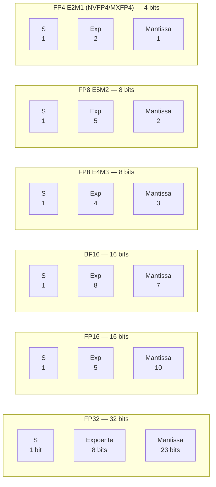
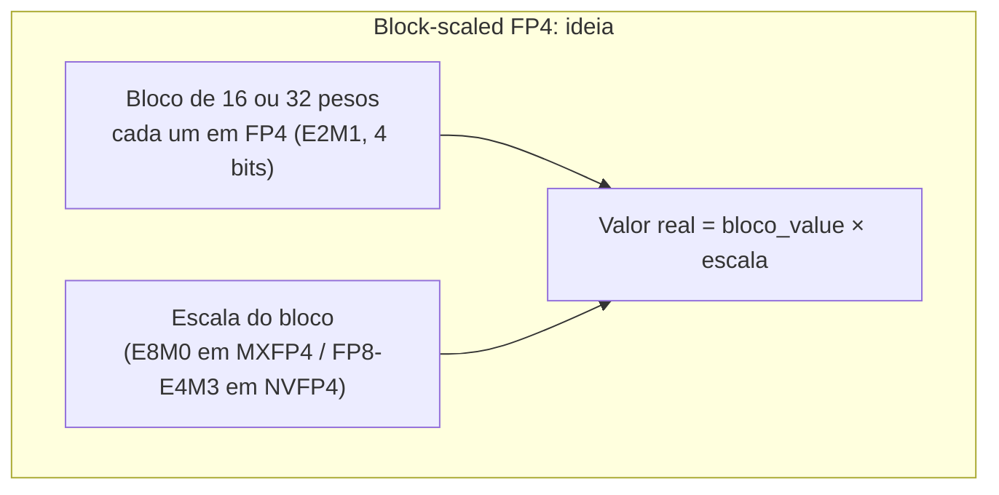
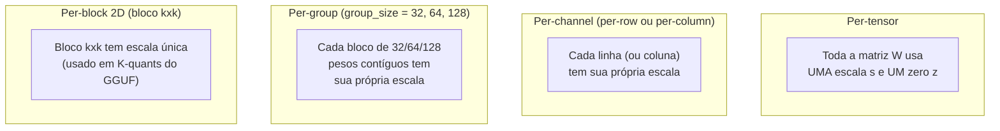
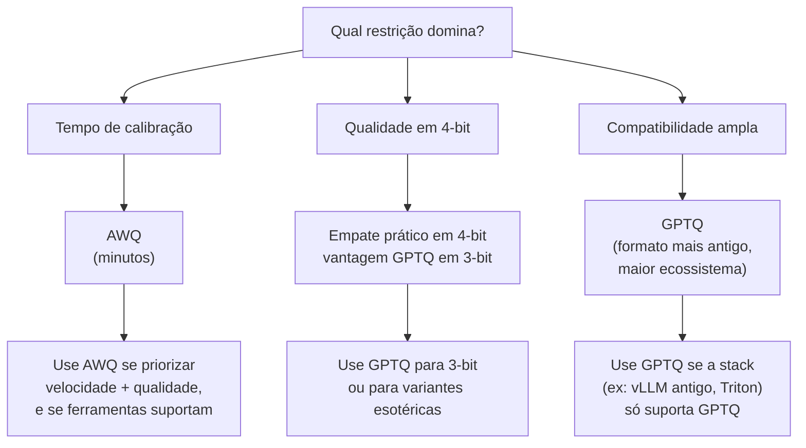
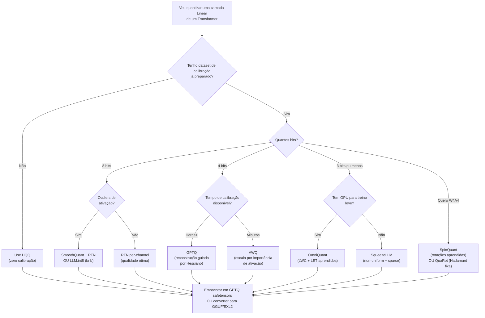
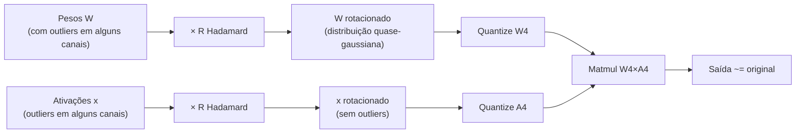
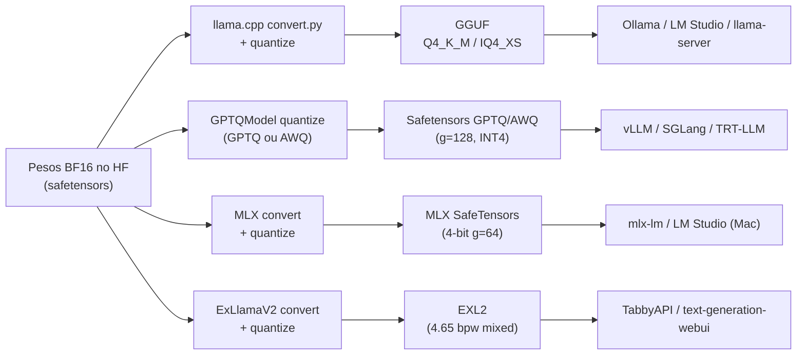
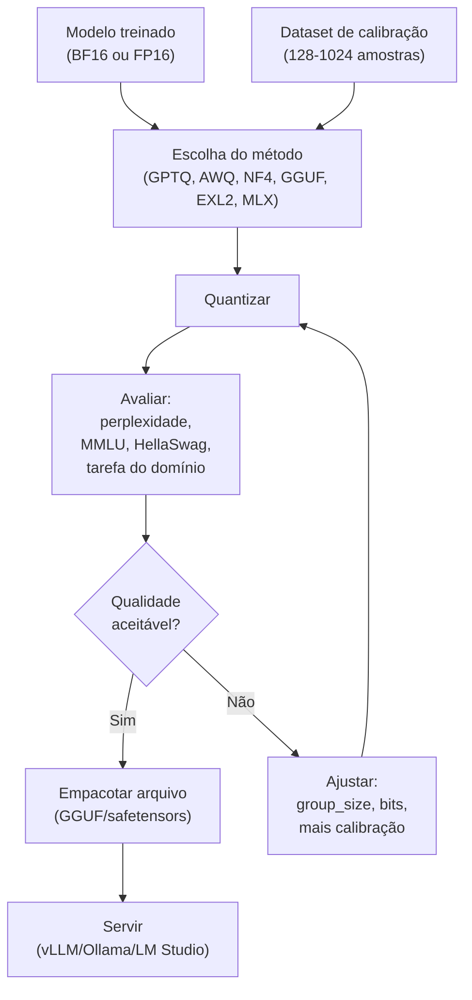
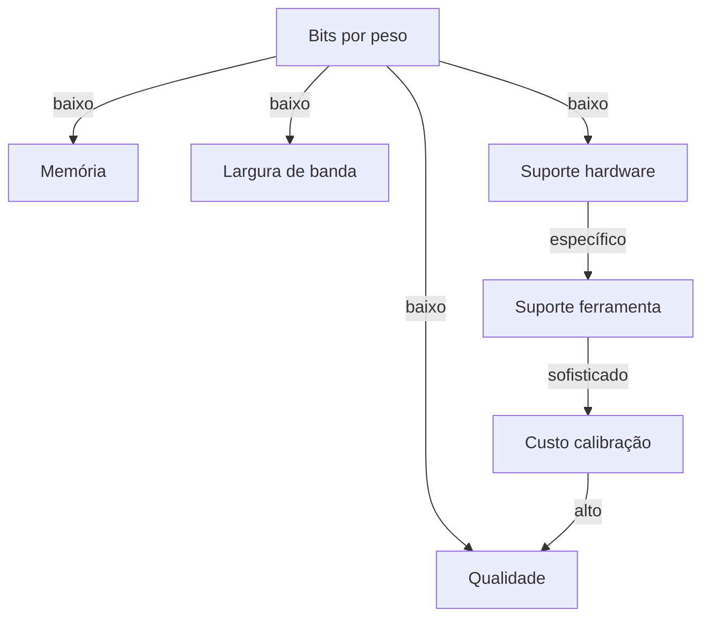

# Post 04 — Quantização de PESOS de LLMs: do bit ao GGUF, passando por GPTQ, AWQ, NF4, HQQ, QuaRot e SpinQuant

> Série **LLMs em Profundidade**. Pré-requisitos: Posts 01 (arquitetura), 02 (atenção) e 03 (KV cache).
> Próximo post: **05 — Quantização de KV cache (KIVI, KVQuant, CacheGen)**.

---

## TL;DR

- **Quantização de pesos** é o ato de representar os parâmetros de um modelo treinado em **menos bits** (de FP16 ou BF16 para INT8, INT4, NF4, FP8 ou FP4), aceitando uma perda controlada de qualidade em troca de **menos memória**, **mais largura de banda efetiva** e, em hardwares modernos, **mais throughput** computacional.
- Em modo *post-training quantization* (**PTQ**), o modelo já existe em FP16/BF16 e o que muda é **como** comprimimos as matrizes. Em *quantization-aware training* (**QAT**), simulamos a quantização no laço de treino, pagando mais tempo de GPU em troca de melhor qualidade em bits muito baixos.
- O problema central não é o **valor médio** dos pesos, é a **calda da distribuição**: os **outliers**. Eles obrigam a "abrir" a faixa de quantização e desperdiçam bits para a esmagadora maioria dos valores. Toda a literatura moderna gira em torno de **isolar, rotacionar, esmagar ou redistribuir** outliers.
- **GPTQ** (Frantar et al., 2022) reconstrói coluna por coluna usando a **inversa do Hessiano** local; **AWQ** (Lin et al., 2023) escala pesos sensíveis com base em **estatísticas de ativações**; **SmoothQuant** (Xiao et al., 2022) migra a magnitude **das ativações para os pesos** para viabilizar INT8; **LLM.int8** (Dettmers et al., 2022) trata **outliers em FP16** lado a lado com a maioria em INT8; **NF4 + Double Quantization** (Dettmers et al., 2023, QLoRA) define um formato 4-bit informacional-ótimo para tensores normais e quantiza também as escalas; **HQQ** dispensa calibração; **QuaRot** e **SpinQuant** **rotacionam** o modelo (Hadamard fixa ou aprendida) para destruir outliers em todo o pipeline.
- Os formatos práticos que você encontra em LM Studio, Ollama, vLLM, llama.cpp, Hugging Face e MLX são **GGUF** (com K-quants Q4_K_M, Q5_K_M, Q8_0 e i-quants IQ4_XS, IQ3_M…), **GPTQ**, **AWQ**, **EXL2** (mixed-precision) e **MLX** (4-bit/8-bit afim em Apple Silicon).
- A escolha correta é **uma função do hardware** que vai rodar o modelo. CPU/Mac M-series gosta de GGUF; RTX gosta de GPTQ/AWQ/EXL2; H100 abre FP8; B200 abre **NVFP4/MXFP4**.

A analogia mestre, à qual voltaremos repetidas vezes: **quantizar pesos é fotografar com menos megapixels**. Você perde detalhe, mas se a cena estiver bem iluminada (distribuição "comportada"), ninguém percebe. O problema é que LLMs têm **ativações com pixels superbrilhantes** — uma minoria de neurônios cospe valores 10–100× maiores que o resto. Esses pixels estouram a foto inteira se você não os tratar antes.

---

## 1. Por que quantizar pesos

### 1.1 O recap inevitável: memória, banda, latência

Nos posts anteriores estabelecemos que a inferência de LLM em decodificação autoregressiva é dominada por **memória** e por **largura de banda** (memory-bound), e não por FLOPs. Cada token novo lê o KV cache inteiro, lê todos os pesos das camadas, executa um produto interno tipicamente de batch 1 e devolve um logit. O motor da GPU passa boa parte do tempo **esperando dados** chegando da HBM para os tensor cores.

Há, portanto, três contas que toda escolha de quantização altera ao mesmo tempo:

1. **Memória de pesos** — quantos bytes ocupa o modelo na HBM (ou na RAM, no caso de CPU/Apple Silicon). Em FP16, um modelo de 13B parâmetros pesa ~26 GB. Em INT4 (4 bits), pesa ~6,5 GB. Em NF4 com double-quantization, ~6,3 GB. A diferença separa o "roda numa RTX 4070" do "precisa de A100".
2. **Largura de banda efetiva** — para gerar 1 token, é preciso "passar o modelo inteiro pelo pipeline de leitura" uma vez (com matemática variável dependendo da paginação e da reutilização). Quantizar reduz proporcionalmente o número de bytes lidos por token, e isso, num regime memory-bound, **aumenta o throughput em token/s** quase linearmente.
3. **Computação** — em hardware compatível (FP8 em Hopper/Ada, NVFP4 em Blackwell, INT8 em quase tudo), os tensor cores oferecem **picos de FLOPs muito maiores** em precisões baixas. Isso só importa em prefill ou batch grande, onde o regime deixa de ser memory-bound.

Quantização ataca (1) **diretamente**, (2) **proporcionalmente** e (3) **dependendo do hardware**.

### 1.2 A analogia da fotografia

Imagine que cada peso é um pixel de uma foto. O modelo treinado é uma foto em **16 bits por canal RAW**. Quantizar para 8 bits por canal é o JPEG comum. Quantizar para 4 bits é uma versão pixelizada. Em algumas cenas (uma planície verde sob luz uniforme) você não percebe a diferença; em outras (um pôr-do-sol com brilho intenso e detalhe escuro), a queda de qualidade é imediata.

A literatura de quantização de LLMs é, em grande parte, a engenharia de **descobrir onde estão os "pôres-do-sol"** dentro da matriz de pesos — e tratá-los à parte para que o JPEG genérico funcione no resto.

### 1.2.1 Matemática da economia: quanto realmente se ganha

Sejam \(N\) o número de parâmetros, \(b\) os bits por peso e \(o\) o overhead em bits/peso (escalas, zero-points). O tamanho em bytes do modelo é:

$$
\text{MB} = \frac{N \cdot (b + o)}{8 \cdot 10^6}
$$

Para Llama 3 8B (\(N \approx 8.03 \times 10^9\)):

| Formato | b | o (overhead) | Tamanho |
|---|---|---|---|
| BF16 | 16 | 0 | 16.06 GB |
| FP8 | 8 | ~0.1 (escala/tensor) | 8.06 GB |
| INT8 per-channel | 8 | ~0.05 | 8.05 GB |
| INT4 GPTQ g=128 | 4 | ~0.13 (FP16 scale/128) | 4.13 GB |
| INT4 GPTQ g=32 | 4 | ~0.5 | 4.50 GB |
| NF4 + DQ | 4 | ~0.13 | 4.13 GB |
| GGUF Q4_K_M | ~4.5 | ~0.3 | 4.81 GB (mistura de tipos) |
| MXFP4 | 4 | ~0.25 (E8M0 scale/32) | 4.25 GB |
| NVFP4 | 4 | ~0.5 (FP8 scale/16 + FP32 tensor) | 4.50 GB |

A leitura: para 4-bit, **o overhead representa 3-12%** do tamanho final. Group sizes muito pequenos (g=32, g=16) têm penalidade material, mas só são justificados em modelos pequenos ou em camadas particularmente sensíveis.

**Largura de banda efetiva**: em batch 1, gerar 1 token requer ler aproximadamente **todo o modelo** uma vez. Em uma RTX 4090 com **1008 GB/s** de HBM, o limite teórico de tokens/segundo é:

$$
T_\text{max} = \frac{B}{S}
$$

onde \(B\) = banda em GB/s e \(S\) = tamanho do modelo em GB. Para Llama 3 8B em BF16 (16 GB), \(T_\text{max} = 1008 / 16 = 63\) tok/s. Em INT4 (4.13 GB), \(T_\text{max} = 1008 / 4.13 = 244\) tok/s. **Ganho de 4×**, exatamente proporcional à compressão.

Na prática, alcança-se 70-90% do limite teórico (kernels custom como ExLlamaV2 chegam mais perto; bibliotecas genéricas ficam mais distantes).

### 1.3 O que NÃO é quantização de pesos

Antes de seguir, é útil delimitar:

- **Quantização do KV cache** é assunto do Post 05. Tem dinâmicas próprias (per-token outliers, distribuições anisotrópicas em K vs V).
- **Quantização de ativações intermediárias** aparece neste post quando ela impede a quantização dos pesos (caso de SmoothQuant e LLM.int8), mas o foco continua nos pesos.
- **Quantização de gradientes** (para treino distribuído, FSDP, ZeRO) é tema separado.
- **Quantização de embeddings de retrieval** (para RAG, vector DB com PQ/IVFPQ/SCANN) usa as mesmas ideias mas tem trade-offs próprios.
- **Sparsity, distillation, MoE, speculative decoding** — alavancas complementares cobertas no Post 08.

---

## 2. Anatomia de um número: FP32, FP16, BF16, FP8, INT8, INT4, NF4, FP4

Para entender quantização é necessário saber **o que cabe** em cada formato. Tanto os formatos *floating-point* (FP) quanto *integer* (INT) são esquemas diferentes de codificar uma sequência de bits para representar um número real.

### 2.1 Estrutura geral de um *float*

Um número *floating-point* tem três partes: **sinal** (1 bit), **expoente** (alguns bits) e **mantissa** (o resto). O valor é, esquematicamente:

$$
x = (-1)^{s} \cdot 1.\text{mantissa} \cdot 2^{\text{expoente} - \text{bias}}
$$

A **mantissa** controla a **precisão** (quantos dígitos significativos); o **expoente**, a **faixa dinâmica** (de quão pequenos a quão grandes os números podem ser).



Comparação numérica essencial:

| Formato | Bits | Exp / Mant | Faixa aprox. | Resolução típica | Uso canônico |
|---|---|---|---|---|---|
| **FP32** | 32 | 8 / 23 | ±3.4e38 | 7 dígitos decimais | Treino tradicional, baseline |
| **FP16** | 16 | 5 / 10 | ±65 504 | ~3-4 dígitos | Inferência GPU clássica; satura em valores grandes |
| **BF16** | 16 | 8 / 7 | ±3.4e38 (igual FP32) | ~2-3 dígitos | Treino moderno (TPU, A100, H100), tolera outliers |
| **TF32** | 19 (interno) | 8 / 10 | ±3.4e38 | ~3-4 dígitos | Tensor cores Ampere; matmul FP32 acelerado |
| **FP8 E4M3** | 8 | 4 / 3 | ±448 | ~2 dígitos | Forward em Hopper/Ada; "alta precisão, baixa faixa" |
| **FP8 E5M2** | 8 | 5 / 2 | ±57 344 | ~1.5 dígito | Backward em Hopper/Ada; "baixa precisão, alta faixa" |
| **INT8** | 8 | — | -128..127 (signed) ou 0..255 | escala-dependente | LLM.int8, SmoothQuant, GGUF Q8_0 |
| **INT4** | 4 | — | -8..7 ou 0..15 | escala-dependente | GPTQ, AWQ, GGUF Q4_*, EXL2 |
| **NF4** | 4 | — não-uniforme | quantis de \(\mathcal{N}(0,1)\) | adaptada a pesos normais | QLoRA / bitsandbytes |
| **FP4 (E2M1)** | 4 | 2 / 1 | ±6 (com block scale) | discreto | MXFP4, NVFP4 (Blackwell) |
| **MXFP4** | 4 + 8/32 | E2M1 + scale E8M0 (PoT) | bloco de 32 valores | block-scaled | OCP MX spec, Blackwell, AMD, Intel |
| **NVFP4** | 4 + 8/16 | E2M1 + scale FP8 E4M3 + tensor FP32 | bloco de 16 | block-scaled de 2 níveis | Tensor cores Blackwell |

### 2.1.1 Lendo um float em binário — caminho passo a passo

Para concretizar a abstração acima, vamos decompor o número \(13.625\) em FP16, BF16 e FP8 E4M3.

**FP32** (referência).
\(13.625 = 1101.101_2 = 1.101101_2 \times 2^{3}\). Sinal 0, expoente \(3 + 127 = 130 = 10000010_2\), mantissa \(101101000\ldots0\) (23 bits). Valor exato.

**FP16**. Bias 15. Expoente \(3 + 15 = 18 = 10010_2\). Mantissa 10 bits: `1011010000`. Valor exato: \(1.1011010000_2 \times 2^3 = 13.625\).

**BF16**. Mesmo expoente do FP32: \(130 = 10000010_2\). Mantissa apenas 7 bits: `1011010`. Valor: \(1.1011010_2 \times 2^3 = 13.625\) (exato porque os bits significativos cabem).

**FP8 E4M3**. Bias 7. Expoente \(3 + 7 = 10 = 1010_2\). Mantissa 3 bits: o mais próximo de `1011010` em 3 bits é `101` (truncamento) ou `110` (arredondamento). Resultado: \(1.110_2 \times 2^3 = 14.0\). **Erro absoluto = 0.375**, **erro relativo = 2.75%**. Para um valor "no meio" da faixa, isso é o tamanho do degrau de quantização típico em FP8 E4M3.

**FP4 (E2M1)** com bloco scaling. Sem bloco, o número 13.625 nem cabe na faixa nativa (±6). Com `bloco_scale=4`, cada valor "FP4 nativo" é multiplicado por 4. O FP4 mais próximo de \(13.625 / 4 = 3.40625\) é `3` (entre `3` e `4`). Reconstrução: \(3 \times 4 = 12\). **Erro absoluto = 1.625**, **erro relativo = 12%**. Para diminuir o erro, blocos menores ou escalas mais finas (NVFP4 com escala FP8 em vez de potência de 2).

A lição é geral: **menos bits significam degraus de quantização proporcionalmente maiores**, e o erro local é da ordem de **metade do degrau**. O block-scaling reduz o **degrau efetivo** dentro de cada bloco, ao custo de overhead de armazenamento.

### 2.1.2 A "regra dos 7 bits efetivos"

Uma heurística engenheirada para LLMs: as ativações de um bloco transformer mantêm **~7 bits efetivos de precisão útil** após algumas camadas. Tudo abaixo disso é ruído acumulado. Isso **explica** por que FP8 (com 3-4 bits de mantissa após o sinal) é "suficiente" para forward pass, e por que precisamos de mais cuidado em INT4 ou abaixo (estamos pisando exatamente no piso de informação).

Esse é também o motivo de funções como **stochastic rounding** ganharem terreno em FP4/FP8: arredondar deterministicamente sempre para o nível mais próximo introduz **viés** acumulável; arredondar **aleatoriamente** com probabilidade proporcional à proximidade preserva o valor esperado e reduz drift.

### 2.2 FP16 vs BF16 — a regra prática

Os dois formatos têm o mesmo tamanho (16 bits), mas filosofias diferentes:

- **FP16** investe **mais bits em mantissa** (10) e poucos em expoente (5). Ele é **preciso** dentro da sua faixa, mas **satura cedo**: qualquer valor acima de ~65 504 vira `+inf`. Em treino, isso cria *underflow* no gradiente e *overflow* no forward, o que motivou *loss scaling*.
- **BF16** ("brain float") corta a mantissa para 7 e mantém o expoente igual ao do FP32. **Mesmo alcance** que FP32, mas com resolução grosseira. Em LLMs, isso é ouro: nada estoura, e os algoritmos de treino e quantização ficam mais estáveis.

Para inferência de LLMs, BF16 venceu. Praticamente todos os pesos publicados modernos (Llama 3, Qwen 2.5, Mistral, DeepSeek-V3, etc.) já vêm em **BF16**. FP16 ainda aparece em alguns kernels de inferência otimizados que herdaram arquiteturas pré-Hopper.

### 2.3 FP8 E4M3 e E5M2 — a divisão de trabalho

A NVIDIA normalizou dois formatos FP8 em Hopper/Ada (e os manteve em Blackwell), apresentados como o par canônico:

- **E4M3** (1S, 4E, 3M): faixa ±448, mais precisão. Usado para o **forward**, onde estouros são raros e queremos detalhe.
- **E5M2** (1S, 5E, 2M): faixa ±57 344, menos precisão. Usado para o **backward** (gradientes), onde a faixa dinâmica é maior.

A *Transformer Engine* da NVIDIA escolhe **automaticamente** qual usar em cada operação, e mantém **escalas dinâmicas por tensor** atualizadas a cada step. A combinação se chama "**FP8 mixed precision training**" e dá perda mínima de qualidade em treino, com 2× ganho de throughput em relação a BF16.

Para inferência de pesos, FP8 E4M3 também é usado por bibliotecas como **TensorRT-LLM** e **vLLM**, com escalas pré-calibradas. Na lista do GPTQModel 2025/2026, FP8 aparece como um dos esquemas suportados.

### 2.3.1 Como FP8 é treinado e servido na prática

Um detalhe operacional que confunde até engenheiros experientes: FP8 **na prática** quase nunca é "FP8 puro". O fluxo real, com Transformer Engine ou TensorRT-LLM, é:

1. **Pesos** ficam armazenados em FP8 E4M3 (ou em INT8 com escala FP32, em algumas variantes).
2. **Cada tensor** carrega uma **escala FP32** atualizada (em treino, dinamicamente; em inferência, calibrada uma vez).
3. **Multiplicação** ocorre nos tensor cores em FP8 × FP8.
4. **Acumulação** ocorre em FP32 (acumuladores wide), evitando overflow no produto interno.
5. **Saída** é cast de volta para FP8 (com nova escala) ou para BF16, conforme o pipeline.

Essa "FP8 com acumulador FP32" é o que permite manter qualidade. **Sem o acumulador wide**, FP8 colapsa em poucas camadas — o erro acumulado em produtos internos longos satura rapidamente.

Para inferência, há ainda o detalhe de **delayed scaling** vs **just-in-time scaling**. Em delayed, a escala usada num step é a estatística do step anterior; em JIT, recalcula-se a cada batch. JIT é mais preciso mas mais caro.

### 2.4 INT8 e INT4 — quantização afim (linear)

Quantizar para INT8 ou INT4 é, na prática, projetar uma **faixa contínua de floats** sobre uma **faixa discreta de inteiros**. A operação canônica é:

$$
q = \mathrm{round}\!\left(\frac{x - z}{s}\right), \qquad \hat{x} = s \cdot q + z
$$

onde \(s\) é a **escala** (passo) e \(z\) é o **zero-point** (deslocamento). Quando o zero-point é zero, dizemos que a quantização é **simétrica**; quando \(z \neq 0\), é **assimétrica**.

- **INT8 simétrica**: \(q \in [-127, 127]\), \(s = \max(|x|)/127\).
- **INT8 assimétrica**: \(q \in [0, 255]\), \(s = (\max(x)-\min(x))/255\), \(z\) escolhido para que o menor valor mapeie para 0.
- **INT4 simétrica**: \(q \in [-7, 7]\) (ou \(\{-8,\ldots,7\}\)), só 16 níveis. Cada bit pesa muito.

Quanto **menos bits**, mais a posição da escala (e do zero-point) afeta a perda. Em INT4, errar a escala em 5% pode custar pontos inteiros de perplexidade.

### 2.4.1 Exemplo numérico: quantizar uma linha de pesos em INT4

Considere uma linha de 8 pesos (toy example):

```
w = [0.12, -0.05, 1.34, -0.87, 0.04, -0.21, 0.55, -1.10]
```

**Per-row simétrica INT4** (\(q \in [-7, 7]\)):

- `max(|w|)` = 1.34
- `s = 1.34 / 7 ≈ 0.1914`
- `q = round(w / s)` = `[1, 0, 7, -5, 0, -1, 3, -6]`
- `w_hat = q * s` = `[0.1914, 0, 1.34, -0.957, 0, -0.1914, 0.5743, -1.149]`
- Erro absoluto médio: `~0.05`. Erro relativo médio: `~10%`.

Note que o peso 0.04 foi **arredondado para 0** (perda 100%). Em INT4 com escala 0.19, qualquer peso menor que ~0.095 colapsa para zero. Para uma linha com muitos pesos pequenos, isso significa que **sparsity emerge espontaneamente** — uma "feature" que algumas implementações exploram.

**Per-group simétrica INT4 com `g=4`** (cada grupo de 4 pesos com sua própria escala):

- Grupo 1: `[0.12, -0.05, 1.34, -0.87]` → `s1 = 1.34/7 ≈ 0.191` → `q = [1, 0, 7, -5]`
- Grupo 2: `[0.04, -0.21, 0.55, -1.10]` → `s2 = 1.10/7 ≈ 0.157` → `q = [0, -1, 4, -7]`

O peso 0.04 ainda colapsa em zero, mas o peso 0.55 agora é representado com **mais resolução** (4 níveis em vez de 3 do esquema per-row). Em geral, group-wise reduz o erro nos grupos com magnitude menor.

### 2.4.2 Group-wise asimétrica INT4 — full pipeline

Para o mesmo exemplo, **assimétrico INT4** (\(q \in [0, 15]\)) per-group g=4:

Grupo 1: `[0.12, -0.05, 1.34, -0.87]`. Min=-0.87, max=1.34. `s = (1.34 + 0.87)/15 ≈ 0.1473`. `z = round(-(-0.87)/s) ≈ 6`. Quantizado:

```
q = round((w - (-0.87))/s) = round([0.99/s, 0.82/s, 2.21/s, 0/s]) = [7, 6, 15, 0]
```

Reconstrução: `w_hat = s*q + (-0.87)` = `[0.16, 0.02, 1.34, -0.87]`. Erro menor para o peso 0.12 (0.16 vs 0.19) porque a faixa assimétrica usa **todos os 16 níveis** dentro do range observado.

Em datacenter para LLMs, **assimétrica é raro em pesos** (eles são quase simétricos), mas **comum em ativações pós-ReLU/GELU/SiLU** (sempre não-negativas, ou com cauda assimétrica).

### 2.5 NF4 — o formato 4-bit "informacional-ótimo" para pesos

Pesos de LLMs treinados são, em larga maioria, aproximadamente **gaussianos** (após normalização e dropout). Dettmers et al. (2023) observaram: se a distribuição é normal, a melhor partição em 16 níveis (4 bits) **não é uniforme** — é a partição que iguala a probabilidade em cada bin. Esta é a definição de **quantis** da distribuição normal.

**NF4** ("4-bit NormalFloat") é uma tabela de **16 níveis fixos** correspondentes aos quantis de \(\mathcal{N}(0,1)\) (com simetria forçada e zero exato). Cada peso é normalizado por uma escala (por bloco), e em seguida mapeado para o quantil mais próximo dessa tabela.

Os 16 níveis de NF4, simétricos em torno de zero (referência QLoRA):

```
[-1.0000, -0.6962, -0.5251, -0.3949, -0.2844, -0.1848, -0.0911, 0.0000,
  0.0796,  0.1609,  0.2461,  0.3379,  0.4407,  0.5626,  0.7230, 1.0000]
```

Note como os níveis são **densos perto de zero** (onde está a massa da gaussiana) e **esparsos nas caudas**. Isso minimiza o erro esperado de quantização **se a hipótese gaussiana se sustenta**.

Combinado com **Double Quantization** — quantizar as próprias **escalas** (uma por bloco de 64 pesos) em 8 bits, com mais um nível de escala — NF4 fica em ~3.95 bits efetivos por peso, e foi a base do **QLoRA**.

### 2.6 FP4: MXFP4 e NVFP4 — o que muda

FP4 (E2M1) é um formato *floating-point* de 4 bits: 1 sinal, 2 bits de expoente, 1 bit de mantissa. Em isolamento, ele tem **8 valores não-zero possíveis**: `{0.5, 1, 1.5, 2, 3, 4, 6}` (e zero), mais o sinal, totalizando 16 estados (incluindo "−0"). Faixa nativa: ±6.

Sozinho, FP4 é inútil — a faixa dinâmica é minúscula. A magia está no **block scaling**: agrupar 16, 32 ou 64 valores e atribuir uma **escala compartilhada** ao bloco. O formato resultante é o que dá nome às variantes:

- **MXFP4** (Open Compute Project, OCP MX Spec v1.0, 2023): blocos de **32 valores**, com escala E8M0 (apenas expoente, **potência de dois**). Suportado por AMD, Intel e NVIDIA Blackwell.
- **NVFP4** (NVIDIA, Blackwell): blocos de **16 valores**, com escala FP8 E4M3 (mais finogranulada que potências de dois) **e** uma escala global FP32 por tensor. Dois níveis de escala.

A conta de bits por peso muda: em MXFP4, cada bloco de 32 valores carrega 32×4 + 8 = **136 bits**, ou seja, **4.25 bits por peso**. Em NVFP4, é 16×4 + 8 + (32 bits / N_blocos) ≈ **4.5 bits por peso**, mas a precisão é melhor.

NVFP4 é a precisão **acelerada nativamente** pelos Tensor Cores Blackwell (B200), com kernels W4A4 (peso 4-bit + ativação 4-bit) sem dequantização intermediária. MXFP4 é suportado, mas não é o caminho otimizado.



A intuição por trás disso é a mesma das **K-quants** do GGUF: misturar uma representação **muito grosseira por valor** com uma **escala fina por pequeno bloco**. O bloco resgata o que o valor individual não consegue codificar.

### 2.7 INT4 simétrico vs NF4 vs MXFP4 — qual escolher?

Resumo prático:

| Formato 4-bit | Distribuição assumida | Hardware nativo | Quem usa |
|---|---|---|---|
| **INT4 simétrico/assimétrico** | uniforme dentro do bloco | quase tudo (via dequant) | GPTQ, AWQ, GGUF Q4_0/Q4_1, EXL2 |
| **NF4** | gaussiana | qualquer (kernel custom) | bitsandbytes, QLoRA |
| **FP4 / MXFP4** | log-uniforme em magnitude | Blackwell, alguma AMD | LLMs em B200, futuro próximo |
| **NVFP4** | log-uniforme em magnitude, micro-blocos | Blackwell tensor cores | NVIDIA stack inteira |

A regra prática hoje (2026): em consumer GPU, **INT4 com group quantization** (GPTQ/AWQ/EXL2) ou **NF4** são as escolhas dominantes. Em B200, **NVFP4** é o futuro. Em CPU/Mac, **GGUF K-quants/I-quants** vencem.

---

## 3. Esquema simétrico vs assimétrico, per-tensor vs per-channel vs per-group

Um detalhe que confunde iniciantes: além de escolher **quantos bits**, você precisa escolher **a granularidade** com que aplicar a escala. Quantos pesos compartilham um único \((s, z)\)?

### 3.1 Simétrico vs assimétrico

- **Simétrico**: a escala mapeia \([-A, A]\) em \([-Q, Q]\), com \(z=0\). Vantagens: kernel mais simples, multiplicação direta sem subtração. Desvantagem: se a distribuição é assimétrica (ex.: pós-ReLU, sempre positiva), você desperdiça metade dos níveis.
- **Assimétrica**: \([\min, \max] \to [0, 2^b-1]\), com \(z\) calculado para alinhar o min. Necessário em ativações pós-ReLU/GELU/SiLU, e em alguns formatos de pesos com cauda só de um lado.

Para pesos de LLMs treinados (geralmente próximos de média zero), **simétrica** é praticamente padrão. Para ativações, **assimétrica** é frequente.

### 3.2 Granularidade da escala



Compromissos:

| Granularidade | Bits extra | Qualidade | Custo de kernel |
|---|---|---|---|
| **Per-tensor** | desprezível | baixa para LLMs | baixíssimo |
| **Per-channel** | ~0.05 bits/peso | ótima para pesos | baixo |
| **Per-group (g=128)** | ~0.13 bits/peso (FP16 scale) | excelente | médio (load extra) |
| **Per-group (g=64)** | ~0.25 bits/peso | excelente | médio |
| **Per-group (g=32)** | ~0.5 bits/peso | máxima | alto (banda) |

A literatura convergiu para algumas regras práticas:

1. **Pesos**: per-channel quase sempre. Per-group com g∈{32,64,128} para 4 bits e abaixo. g=128 é o padrão GPTQ/AWQ.
2. **Ativações**: per-token (linha) para entradas; per-tensor com escala dinâmica é tolerável quando o modelo já foi "domado" (ex.: SmoothQuant aplicado).
3. **K-quants do GGUF**: per-bloco 256 com escalas hierárquicas (ver seção 10).
4. **MLX**: g=64 é o padrão recomendado em Apple Silicon; g=32 perde 7-14% de throughput por overhead de banda nas escalas.

### 3.3 A analogia da exposição

Per-tensor é ajustar a exposição da **foto inteira**. Per-channel é ajustar a exposição **por linha de pixels**. Per-group é dividir a foto em **blocos pequenos** e ajustar exposição em cada um — como o HDR computacional do iPhone faz, antes de "fundir" os blocos. Quanto menor o bloco, mais detalhe sobrevive em zonas com brilho extremo, mas maior o overhead de armazenar/ler todas as exposições.

---

## 4. Round-to-Nearest e o problema dos outliers

### 4.1 O baseline: RTN (round-to-nearest)

A receita mais simples para PTQ:

1. Para cada matriz de pesos \(W\), calcule \(s = \max(|W|) / Q_{\max}\).
2. Para cada peso \(w\): \(q = \mathrm{round}(w / s)\), clamp em \([-Q_{\max}, Q_{\max}]\).
3. Salve os \(q\) e o \(s\). Na inferência, dequantize: \(\hat{w} = s \cdot q\).

Isso é o **AbsMax round-to-nearest**. Funciona razoavelmente para **INT8 per-channel** em modelos pequenos e bem-comportados. Em LLMs grandes, **falha catastroficamente abaixo de 8 bits**.

### 4.2 Por que falha: a maldição dos outliers

A descoberta empírica central da era LLM (Dettmers et al., 2022 e Xiao et al., 2022) é que **uma fração ínfima das ativações de cada camada** assume valores **muito maiores** que o resto. São os famosos "outlier features".

- Em modelos a partir de ~6.7B parâmetros, surgem ~6 dimensões (de milhares) cujos valores absolutos médios são **~10-100× maiores** que a média global.
- Esses outliers não são ruído: são **features funcionais**, ligados à atenção e à manipulação de informação semântica. Removê-los degrada a qualidade.
- O AbsMax sobre essa distribuição estica a escala para acomodar o pior caso, **comprimindo todo o resto** em pouquíssimos níveis. Em INT8, ainda há margem; em INT4, **a maioria dos pesos colapsa para 1-2 níveis**.

A analogia: **1% dos pixels da foto está tão brilhante que comprometem o ajuste de exposição** do resto. O fotômetro automático "vê" o sol e fecha o diafragma; aí, o resto da cena fica preta.

### 4.2.1 Anatomia de um outlier — o que é exatamente um "outlier feature"

Um outlier feature em LLM é, tecnicamente, **uma dimensão do vetor de hidden state** (output de uma camada) cujos valores absolutos médios, **agregados sobre tokens**, são muito maiores que a média sobre dimensões.

Vamos ser concretos. Em um Llama-2-7B típico, o hidden state após `down_proj` em uma camada intermediária tem 4096 dimensões. Se você roda 1000 tokens de calibração e mede `mean_t |h_t[i]|` para cada dimensão `i`, obtém uma distribuição assim (numbers ilustrativos):

- 99% das dimensões: magnitude média entre 0.1 e 2.0.
- 6 dimensões específicas: magnitude média entre 50 e 200.
- A localização dessas dimensões é **estável** entre prompts (são as mesmas features que ativam, modulo amplitude).
- A localização **varia** entre camadas, mas existe alguma correlação por bloco.

Outliers aparecem **a partir de ~6.7B parâmetros** (descoberta de Dettmers et al.). Modelos menores não os apresentam de forma sistemática. Por que aparecem? Há hipóteses (não fechadas):

1. **Atenção precisa de "tokens-âncora"** (tokens como BOS, ponto final, palavras de função) para os quais a similaridade deve ser muito alta ou muito baixa de forma robusta. Outliers fortalecem esse contraste.
2. Algumas dimensões funcionam como **canais de roteamento** (transportam informação semântica entre camadas distantes), e magnitude alta protege contra interferência.
3. Treinos com **LayerNorm** sem outliers produzem, em escala, ativações que **divergem** numericamente; outliers são um mecanismo emergente de regularização.

A engenharia prática só precisa saber: **outliers existem, são poucos e tóxicos para quantização ingênua**.

### 4.2.2 A matemática do erro RTN

Para um peso uniformemente distribuído em \([-1, 1]\) quantizado em \(b\) bits simétricos, o degrau é \(\Delta = 2/(2^b - 1)\) e o erro de quantização é uniforme em \([-\Delta/2, \Delta/2]\). O **erro quadrático médio** vale:

$$
\mathrm{MSE} = \frac{\Delta^2}{12} = \frac{1}{3 (2^b - 1)^2}
$$

Para \(b=8\): MSE \(\approx 5 \times 10^{-6}\). Para \(b=4\): MSE \(\approx 1.5 \times 10^{-3}\). **Cada bit a menos multiplica o MSE por 4×**. Daí a regra empírica: se a perplexidade sobe \(\Delta\) ppl em INT8, espera-se \(4\Delta\) em INT4 e \(16\Delta\) em INT3 (aproximação grosseira mas didaticamente útil).

A regra muda com **outliers**: a faixa de \([-A, A]\) cresce, o degrau cresce, o MSE cresce **quadraticamente em A**. Daí a obsessão com domá-los.

### 4.3 Outliers em ativações vs em pesos

Crucial distinguir:

- **Outliers em ativações** (entradas das matmuls) são o problema central. Eles aparecem em **canais específicos** e são **sistemáticos**.
- **Outliers em pesos** existem, mas são menos extremos e menos sistemáticos. RTN per-channel já lida bem com eles para INT8. Para INT4 sem ajustes, ainda incomodam.

Toda a engenharia de quantização "fina" envolve, no fundo, **uma das três estratégias**:

1. **Migrar** a magnitude dos outliers para um lugar mais fácil (SmoothQuant: ativações → pesos).
2. **Isolar** os outliers em uma representação separada de alta precisão (LLM.int8: outliers em FP16, resto em INT8; SqueezeLLM: dense + sparse).
3. **Rotacionar** o espaço para que os outliers se dissolvam em distribuições mais uniformes (QuaRot, SpinQuant: Hadamard).

E uma quarta, que é a do GPTQ/AWQ: **errar de forma compensatória** — se eu sei que vou errar este peso, deixe-me ajustar os próximos para compensar, ou escolher escalas que protejam pesos sensíveis.

---

## 5. SmoothQuant e LLM.int8 — domando outliers para inferência INT8

### 5.1 SmoothQuant (Xiao et al., 2022, arXiv:2211.10438)

A observação chave do SmoothQuant é matemática trivial e operacionalmente brilhante: numa matmul \(Y = X W\), você pode introduzir uma matriz diagonal \(\mathrm{diag}(s)\) sem mudar o resultado:

$$
Y = X W = (X \cdot \mathrm{diag}(s)^{-1}) \cdot (\mathrm{diag}(s) \cdot W) = \tilde{X} \tilde{W}
$$

Se as ativações \(X\) têm canais com magnitude alta (outliers), você escolhe \(s_i\) **proporcional à magnitude do canal \(i\)** — assim \(\tilde{X} = X / s\) fica normalizado, e o "peso" da magnitude **migra para \(\tilde{W} = s \cdot W\)**.

O resultado:

- Ativações **não têm mais outliers extremos**, podem ser quantizadas em **INT8 per-tensor** sem catástrofe.
- Pesos ficam um pouco mais "irregulares", mas como já fazemos **per-channel** neles, o impacto é pequeno.

Em equação operacional, com \(\alpha \in [0, 1]\) (tipicamente 0.5):

$$
s_j = \frac{\max_i |X_{ij}|^{\alpha}}{\max_i |W_{ij}|^{1-\alpha}}
$$

\(\alpha\) controla o quanto de magnitude "puxar" das ativações para os pesos. \(\alpha=0.5\) é o equilíbrio padrão; valores maiores agressivamente migram a magnitude.

SmoothQuant é o que viabilizou **W8A8** (peso 8-bit + ativação 8-bit) com qualidade quase intacta em modelos da família OPT, Llama, BLOOM. Ele é **pré-processamento**: aplica-se **uma vez**, sem treino, com poucas centenas de amostras de calibração. O modelo resultante é matematicamente idêntico em FP16; só fica "preparado" para INT8.

### 5.2 LLM.int8 (Dettmers et al., 2022, arXiv:2208.07339)

LLM.int8 atacou o problema por outro ângulo: e se eu **isolar os outliers** e tratá-los à parte? A receita:

1. Em cada camada linear, identifique as **colunas (features) com outliers** acima de um limiar (default: 6.0 em magnitude).
2. Para essas colunas, mantenha **pesos e ativações em FP16**.
3. Para todas as outras, quantize **pesos em INT8** e **ativações em INT8**.
4. A multiplicação resultante = (parte INT8 × INT8) + (parte FP16 × FP16), somadas.

Isso preserva qualidade quase perfeitamente, ao custo de **um pouco mais de complexidade** no kernel e ~**1-2% das colunas em FP16**. O *speedup* em RTX/A100 é menor que SmoothQuant puro, mas a perda é ~zero.

Em **bitsandbytes** v0.45.0+ (final de 2024 / 2025), LLM.int8 ganhou:

- Suporte para **H100/H200/H800** (Hopper) com kernels reescritos.
- 60-85% mais throughput em Turing/Ampere/Ada (em batch 1).
- 28% mais throughput em Hopper.
- A partir de batch ≥ 8 em H100, **bate** NF4 em throughput (relevante para servir modelos).

### 5.3 SmoothQuant vs LLM.int8 — quando usar cada um

| Critério | SmoothQuant | LLM.int8 |
|---|---|---|
| Quem quantiza | pesos e ativações | pesos (a maior parte) |
| Granularidade | per-tensor para ativações, per-channel para pesos | per-channel + decomposição esparsa |
| Necessidade de calibração | sim (ativações) | sim (perfil de outliers) |
| Perda de qualidade | quase nula | ~zero |
| Speedup em GPU | maior | menor (lida com FP16 misturado) |
| Adoção | TensorRT-LLM, vLLM | bitsandbytes, Hugging Face Transformers |
| Quando preferir | maximizar throughput INT8 puro | minimizar perda, manter compatibilidade |

A intuição: SmoothQuant **conserta o problema antes** (move a magnitude). LLM.int8 **trata o problema depois** (separa outliers). Ambos são compatíveis com PTQ.

---

## 6. GPTQ — quantização guiada por segunda ordem

GPTQ (**Generative Pretrained Transformer Quantization**, Frantar et al., 2022, arXiv:2210.17323) é a referência canônica para quantização agressiva (3-4 bits) de pesos sem treino. É baseado em **Optimal Brain Quantization (OBQ)**, uma extensão do clássico **Optimal Brain Surgeon** (LeCun, 1990) para quantização.

### 6.1 A pergunta central

Suponha uma camada linear com pesos \(W\) e queremos quantizá-los para 4 bits, **um peso por vez**. Quando arredondamos \(w_{ij}\), introduzimos um erro \(\delta_{ij}\). Como esse erro afeta a saída da camada?

Ao primeiro grau, o erro na saída é \(X \cdot \delta\). Mas se a camada é **convexa em \(W\)** localmente (boa aproximação para uma única camada num batch fixo), podemos modelar a perda incremental como:

$$
\Delta L \approx \frac{1}{2} \delta^\top H \delta
$$

onde \(H = X^\top X\) é o **Hessiano** da reconstrução de saída em relação a \(W\). Esse Hessiano só depende das **ativações de entrada da camada** — informação que conseguimos rodando algumas centenas de amostras de calibração pelo modelo.

### 6.2 A receita do GPTQ

GPTQ processa **uma coluna de \(W\) por vez** (estrutura sequencial), e para cada coluna, **um peso por linha**. Ao quantizar \(w_{ij}\):

1. Arredonde \(w_{ij}\) para o nível mais próximo do reticulado de quantização.
2. Calcule o **erro residual** \(\delta_{ij} = w_{ij} - q_{ij} \cdot s\).
3. **Propague** o erro para os pesos ainda não quantizados na mesma linha, usando a inversa do Hessiano (informação de Cholesky precomputada). Isso ajusta os próximos pesos para **compensar** o erro recém-introduzido.

A intuição visual: você está empilhando peças num jogo de Tetris. Quando coloca uma peça torta, você sabe que as próximas precisam encaixar **considerando essa distorção**. GPTQ é o algoritmo que faz esse ajuste global, em \(O(\text{col}^2)\) com truques numéricos.

A analogia humana: **comprimir um objeto considerando as outras peças que vão encostar nele**. Você não comprime no vazio — comprime sabendo onde o objeto vai ser usado.

### 6.3 Detalhes operacionais

- **Calibração**: tipicamente 128-1024 amostras de texto (C4, WikiText, datasets do domínio). A escolha do dataset importa moderadamente; datasets fora do domínio aumentam perplexidade.
- **Ordem de quantização**: GPTQ usa ordenação por **diagonal do Hessiano** (mais sensíveis primeiro), ou variantes "sequenciais" (act-order). O parâmetro `desc_act=True` em GPTQ-for-LLaMA / AutoGPTQ ativa isso.
- **Group size**: padrão `g=128` para 4-bit; `g=64` ou `g=32` para 3-bit ou modelos pequenos.
- **Custo**: 1-4 horas em uma GPU para um modelo 7B; 8-24 horas para 70B.

### 6.3.1 Pseudocódigo do GPTQ (versão didática)

Para uma matriz de pesos \(W \in \mathbb{R}^{d_\text{out} \times d_\text{in}}\) e ativações de calibração \(X \in \mathbb{R}^{n \times d_\text{in}}\):

```python
def gptq_layer(W, X, bits=4, group_size=128, percdamp=0.01):
    d_out, d_in = W.shape
    H = X.T @ X / X.shape[0]                  # Hessiano (d_in x d_in)
    H += percdamp * torch.eye(d_in) * H.diag().mean()  # damping
    H_inv = torch.linalg.cholesky(torch.linalg.inv(H), upper=True)

    Q = torch.zeros_like(W)
    Err = torch.zeros_like(W)

    for g in range(0, d_in, group_size):
        end = g + group_size
        W_block = W[:, g:end].clone()
        Hinv_block = H_inv[g:end, g:end]

        # quantize column by column
        for i in range(end - g):
            w_col = W_block[:, i]
            d = Hinv_block[i, i]              # pivot

            # find optimal scale s for this column-group (per-row across out_dim)
            scale = w_col.abs().max() / (2**(bits-1) - 1)
            q = torch.round(w_col / scale).clamp(-(2**(bits-1)),
                                                 2**(bits-1) - 1)
            Q[:, g + i] = q
            wq = scale * q

            # propagate error to remaining columns in the block
            err = (w_col - wq) / d
            W_block[:, i:] -= err.unsqueeze(1) * Hinv_block[i, i:].unsqueeze(0)
            Err[:, g + i] = err

        # propagate to subsequent blocks
        W[:, end:] -= Err[:, g:end] @ H_inv[g:end, end:]

    return Q
```

Pontos a notar:
- O **Cholesky** da inversa do Hessiano é a estrutura que permite propagar erro **eficientemente** sem inverter \(H\) inteira.
- O **damping** (`percdamp ≈ 0.01`) regulariza o Hessiano contra mau condicionamento.
- A **escala per-group** é recalculada a cada bloco de 128 colunas — daí o nome `group_size`.
- Com `desc_act=True`, as colunas são primeiro **permutadas** por sensibilidade (diagonal de \(H\)) antes desse loop.

### 6.4 GPTQModel (2025-2026): o estado atual

A biblioteca de referência hoje é o **GPTQModel** (ModelCloud), sucessor do AutoGPTQ. Estado em 2025/2026:

- **v5.6.x** (dezembro/2025): suporte HF Kernel para CPU (AMX, AVX2, AVX512); auto module tree; suporte a famílias Afmoe e Dosts1.
- **v6.0.x** (abril/2026): adiciona **ParoQuant**, **GGUF**, **FP8**, **EXL3**, **FOEM** (First-Order Error Matters) e mantém AWQ + GPTQ.
- **v5.8.0** (março/2026): suporte a HF Transformers 5.3.0, modelos Qwen 3.5, kernels CPU rápidos para GPTQ/AWQ, INT8 CPU experimental.

Ou seja: o que historicamente era "AutoGPTQ" virou um **toolkit unificado** que executa, exporta e serve em CUDA, ROCm, XPU e CPU.

### 6.5 Limites do GPTQ

- Em **2 bits**, GPTQ puro degrada bastante. Variantes (QuIP, OmniQuant) ganham terreno.
- A premissa quadrática local (\(H = X^\top X\)) ignora **interações entre camadas**. Métodos como SqueezeLLM usam segunda ordem, mas em estratégia diferente (sensitivity-based non-uniform).
- Outliers de ativação ainda atrapalham GPTQ, porque \(H\) reflete sua presença.

---

## 7. AWQ — protegendo pesos importantes pelas ativações

AWQ (**Activation-aware Weight Quantization**, Lin et al., 2023, arXiv:2306.00978) parte de uma observação empírica simples e poderosa:

> Não são os pesos com **maior magnitude** que mais importam; são os pesos que multiplicam as **ativações de maior magnitude**.

Ou seja: a perda por quantizar \(w_{ij}\) escala com **a magnitude da ativação \(x_i\)** que entra naquele canal. Quantizar mal um peso que multiplica por 0.01 é benigno. Quantizar mal um peso que multiplica por 50 é catastrófico.

### 7.1 A receita do AWQ

1. Rode amostras de calibração; calcule \(\bar{x}_i = \mathrm{mean}_i |X_i|\) por canal.
2. Identifique os **canais de ativação importantes** (top 1% por magnitude).
3. Para cada canal \(i\), aplique uma **escala** \(s_i\) que **amplia** os pesos correspondentes **antes** da quantização — protegendo-os do erro de arredondamento — e a inversa nas ativações.
4. Quantize \(W \cdot \mathrm{diag}(s)\) em INT4 normalmente.
5. Em runtime, multiplique \(\mathrm{diag}(s)^{-1}\) na ativação.

A escala ótima \(s_i\) é encontrada por **busca em grade** que minimiza o erro de saída; tipicamente \(s_i \in [1, 3]\) para canais top.

### 7.2 Por que isso funciona (e não vira o problema do SmoothQuant ao contrário)

- AWQ protege **só ~1% dos canais**, com escalas modestas. Não estoura a faixa do INT4.
- A operação inversa (multiplicar a ativação por \(s_i^{-1}\)) é uma operação elementwise barata, fundida nos kernels de matmul.
- Não há **custo de calibração quadrático** como o do GPTQ. AWQ roda em minutos para modelos grandes.

A analogia: **decidir o que comprimir mais com base no que mais é olhado**. Se uma peça do quebra-cabeça vai estar bem visível na frente da casa, você a fabrica em alta resolução; o que vai pro fundo do armário, baixa resolução. AWQ "olha" para as ativações e decide a resolução de cada peso.

### 7.2.1 Pseudocódigo do AWQ (ideia central)

```python
def awq_layer(W, X, bits=4, group_size=128, n_grid=20):
    """
    W: (d_out, d_in)  -- pesos
    X: (n, d_in)      -- ativações de calibração
    """
    # 1. magnitude por canal de ativação
    act_scale = X.abs().mean(dim=0)  # shape: (d_in,)

    # 2. busca em grade pela escala alpha que minimiza erro de saída
    best_loss = float('inf')
    best_alpha = 0.0

    for ratio in torch.linspace(0, 1, n_grid):
        # escala s_i = act_scale[i] ** ratio  (normalizada)
        scales = act_scale.pow(ratio).clamp(min=1e-4)
        scales = scales / scales.mean()  # normaliza

        W_scaled = W * scales            # amplifica pesos importantes
        Q = quantize_per_group(W_scaled, bits, group_size)
        # simulate dequant + apply inverse scale on activation side
        Y_orig = X @ W.T
        Y_quant = (X / scales) @ Q.T
        loss = (Y_orig - Y_quant).pow(2).mean()

        if loss < best_loss:
            best_loss = loss
            best_alpha = ratio

    # 3. quantize com a melhor escala
    scales = act_scale.pow(best_alpha)
    scales = scales / scales.mean()
    Q = quantize_per_group(W * scales, bits, group_size)

    return Q, scales  # 1/scales aplicado nas ativações em runtime
```

A `act_scale` mede a magnitude média de cada canal de entrada. Pesos que recebem entradas com magnitude alta são **multiplicados por escalas > 1** antes da quantização (preservando-lhes mais resolução), e a operação é compensada multiplicando a ativação por `1/scale` em runtime.

### 7.3 GPTQ vs AWQ — qual escolher



### 7.3.1 Diagrama de decisão visual: GPTQ vs AWQ



Resumo prático em 2026:

| Critério | GPTQ | AWQ |
|---|---|---|
| Tempo de calibração | 1-4h (7B) / 8-24h (70B) | minutos a 1h |
| Qualidade 4-bit | excelente | excelente (frequentemente leve vantagem) |
| Qualidade 3-bit | melhor que AWQ | aceitável |
| Suporte vLLM, TensorRT-LLM, SGLang | sim | sim |
| Suporte llama.cpp | via conversão GGUF | via conversão GGUF |
| Dependência de calibração | grande | menor |

---

## 8. NF4 e QLoRA — quantização para fine-tuning eficiente

QLoRA (Dettmers et al., 2023, arXiv:2305.14314) não foi proposto como esquema de inferência puro — foi proposto como solução para **fine-tuning** de modelos enormes em GPU única. Mas o formato **NF4 + Double Quantization** que ele introduz é hoje uma escolha legítima também para **inferência**.

### 8.1 NF4 detalhado

Como visto na seção 2.5, NF4 é uma tabela fixa de 16 níveis, correspondentes aos quantis de \(\mathcal{N}(0,1)\), com simetria forçada. A operação:

1. Para cada bloco de 64 pesos, calcule a **escala** \(s = \max(|W_{\text{bloco}}|)\).
2. Normalize: \(\tilde{w} = w / s\), agora em \([-1, 1]\).
3. Mapeie cada \(\tilde{w}\) para o nível NF4 mais próximo.
4. Salve: 4 bits por peso + 1 escala FP32 por bloco de 64.

Custo bruto: \(4 + 32/64 = 4.5\) bits por peso. Pior que GPTQ (que usa FP16 para escalas, ~4.13 bits).

### 8.2 Double Quantization

Para reduzir o overhead das escalas, QLoRA aplica **um segundo nível de quantização**: as escalas FP32 (uma por bloco de 64) são elas próprias agrupadas em blocos de **256 escalas** e quantizadas em **8-bit assimétrico** com uma escala FP32 por bloco-de-blocos.

Conta:
- 4 bits por peso (NF4)
- 8 bits por escala / 64 pesos = 0.125 bits por peso
- 32 bits por escala-de-escala / (64×256) pesos = 0.002 bits por peso

Total: ~**4.127 bits por peso**, com perda de qualidade desprezível. Daí o slogan "QLoRA roda Llama 65B em uma GPU de 48 GB".

### 8.3 NF4 para inferência

NF4 ganhou popularidade como formato de inferência via **bitsandbytes** integrado ao Hugging Face. Vantagens:

- **Zero calibração** (a tabela é fixa).
- Excelente para modelos cujos pesos são **bem gaussianos** (Llama, Mistral, Qwen).
- Compatibilidade ampla via `transformers` + `bitsandbytes`.

Desvantagens:

- Levemente mais lento que GPTQ/AWQ INT4 em GPUs sem kernel custom.
- Menos eficiente em pesos com distribuição bimodal ou de cauda pesada (alguns MoE).

Em bitsandbytes 0.45.0 (dezembro 2024 / 2025), NF4 ganhou **10-25% de throughput** e **10-20% menos latência** em Turing/Ampere/Ada (batch 1), e **até 28%** mais throughput em H100 (todos os batches). Esse upgrade fechou o gap com GPTQ/AWQ em hardware moderno.

### 8.4 FP4 vs NF4 (em bitsandbytes)

A biblioteca também suporta **FP4** (E2M1) como alternativa. Diferenças:

- **FP4** tem distribuição log-uniforme (potências de 2): bom para pesos com cauda pesada.
- **NF4** tem distribuição quantil-normal: bom para pesos quase-gaussianos.

Empiricamente, **NF4 vence em LLMs decoder-only** por uma margem pequena mas consistente.

---

## 9. HQQ, QuaRot, SpinQuant, OmniQuant, SqueezeLLM — métodos modernos

A geração 2024-2026 de métodos de quantização buscou três objetivos paralelos:

1. **Eliminar a calibração** (HQQ).
2. **Eliminar os outliers globalmente, em uma única transformação** (QuaRot, SpinQuant).
3. **Misturar não-uniformidade com decomposição esparsa** (SqueezeLLM, OmniQuant).

### 9.1 HQQ — Half-Quadratic Quantization (Mobius Labs, 2024)

A premissa do HQQ: **pode-se quantizar bem sem usar dataset de calibração**, contanto que a função objetivo seja escolhida com cuidado.

A receita:

- Modele a quantização como minimização de uma perda **não convexa** com termo *sparsity-promoting* (norma \(\ell_p\) com \(p<1\)) sobre o **erro**.
- Resolva por *half-quadratic splitting*: alterne entre uma atualização proximal (closed-form) e uma minimização em \(W\) (closed-form).
- Use blocos de 64 ou 128, com escalas e zero-points por bloco.

Resultado: **Llama-2-70B quantizado em 4-bit em < 5 minutos** (50× mais rápido que GPTQ). Qualidade comparável a GPTQ em 4-bit, e **competitiva em 2-bit** (onde GPTQ degrada).

Vantagens práticas:
- Zero overhead de calibração (sem pipeline de dados).
- Determinístico.
- Suporte 8/4/3/2/1 bit.
- Compatível com **PEFT** (fine-tuning posterior) e **torch.compile**.

Quando preferir HQQ: quantização rápida em pipeline contínuo (ex.: você publica um novo modelo por dia e não quer rodar calibração toda vez); experimentação em 2-bit; modelos novos para os quais não existe um bom dataset de calibração ainda.

### 9.2 QuaRot — Outlier-Free 4-Bit Inference in Rotated LLMs (Ashkboos et al., 2024, arXiv:2404.00456)

A ideia mestra do QuaRot é **mudar de base** o modelo inteiro com uma **rotação de Hadamard aleatória**. Por que isso ajuda?

A invariância matemática: se \(R\) é ortogonal (\(R^\top R = I\)) e o modelo tem certas propriedades de **invariância computacional** (LayerNorm + Linear + LayerNorm + ...), então:

$$
W \to R^\top W R, \quad x \to R^\top x
$$

produz **exatamente o mesmo output** em FP16. O modelo é matematicamente equivalente.

Mas: **rotações de Hadamard são "espalhadoras"**. Elas distribuem a magnitude dos outliers por todo o vetor, aproximando a distribuição de cada coordenada de uma **gaussiana**. Após a rotação, **não há mais outliers** (ou eles são massivamente atenuados) — tanto em pesos quanto em ativações quanto no KV cache.

Com a rotação aplicada e fundida nos pesos, o modelo inteiro pode ser quantizado em **W4A4** (peso 4-bit + ativação 4-bit) com **perda mínima**. Em Llama-2-70B, QuaRot perde apenas **0.29 pontos de perplexidade** em WikiText-2 e mantém **99% da performance zero-shot**.



A analogia: imagine que você tem uma distribuição com 99% dos valores em \([-1, 1]\) e 1% em \([-100, 100]\). Em vez de tentar comprimir essa distribuição estranha, você **embaralha** os valores (multiplicação por matriz aleatória ortogonal). O Teorema do Limite Central faz o trabalho: a soma de muitas variáveis com magnitude moderada é aproximadamente gaussiana. Depois do embaralhamento, **todos os canais** têm magnitude parecida, e quantização uniforme funciona.

### 9.2.1 Por que rotações de Hadamard funcionam — a matemática essencial

Uma matriz de Hadamard \(H_n\) é uma matriz \(n \times n\) com entradas \(\pm 1/\sqrt{n}\) tal que \(H_n^\top H_n = I\). Existe para \(n\) potência de 2 (construção recursiva de Sylvester):

$$
H_2 = \frac{1}{\sqrt{2}}\begin{pmatrix} 1 & 1 \\ 1 & -1 \end{pmatrix}, \qquad H_{2n} = \frac{1}{\sqrt{2}}\begin{pmatrix} H_n & H_n \\ H_n & -H_n \end{pmatrix}
$$

**Propriedade chave**: para qualquer vetor \(x \in \mathbb{R}^n\) com norma \(\|x\|_2\), o vetor rotacionado \(y = H_n x\) tem **a mesma norma** mas **suas coordenadas estão "espalhadas"**: cada \(y_i\) é uma soma ponderada de **todas** as coordenadas de \(x\) com sinais aleatórios. Pelo Teorema Central do Limite, para \(n\) grande, **cada \(y_i\) é aproximadamente gaussiana**, com magnitude típica da ordem de \(\|x\|_2 / \sqrt{n}\).

Em particular, o **maior valor** em \(y\) é da ordem de \(\|x\|_2 \cdot \sqrt{2 \log n / n}\) (cota de concentração para gaussianas), enquanto em \(x\) podia ser \(\|x\|_\infty\) com \(\|x\|_\infty / \|x\|_2\) próximo de 1 (caso outlier).

Numericamente: para \(n = 4096\), o "ratio outlier" típico cai de **~10** (no input) para **~3** (no rotacionado). Isso é a diferença entre INT4 funcionar ou não.

A **transformada rápida de Walsh-Hadamard** (WHT) computa \(H_n x\) em \(O(n \log n)\), igual à FFT. Em hardware moderno, a operação custa **menos que o próprio matmul**, então a rotação é praticamente gratuita.

A "incoerência computacional" do paper QuIP segue lógica similar: pré-multiplicar pesos por matrizes ortogonais aleatórias produz pesos cujos **valores** são incoerentes — nenhum valor sobressai. Isso pode ser combinado com qualquer método de quantização downstream (RTN, GPTQ).

### 9.3 SpinQuant — LLM Quantization with Learned Rotations (Liu et al., 2024, arXiv:2405.16406)

SpinQuant é a **versão treinada** do QuaRot. A observação: rotações de Hadamard aleatórias têm **alta variância** de qualidade — algumas rotações funcionam excelentemente, outras quebram o modelo. Em zero-shot reasoning, a diferença chega a **13 pontos**.

A solução: **aprender** a rotação ótima diretamente. SpinQuant parametriza \(R\) como uma matriz na **variedade de Stiefel** (matrizes ortogonais) e usa **Cayley optimization** para encontrar a \(R^*\) que minimiza a perda de quantização.

Resultados:
- Llama-2-7B em 4-bit: gap de apenas **2.9 pontos** vs full precision.
- Em Llama-3 8B (mais difícil), SpinQuant supera QuaRot em até **45.1% relativo**.
- Funciona bem com qualquer esquema de quantização downstream (RTN, GPTQ).

Custo: o aprendizado da rotação requer ~horas em uma GPU, ainda muito mais barato que QAT completo.

### 9.4 OmniQuant (Shao et al., 2023, arXiv:2308.13137)

OmniQuant é um **framework de PTQ "treinável" leve**. Em vez de fazer rotação ou aplicar GPTQ peso a peso, ele aprende **dois conjuntos de parâmetros pequenos**:

1. **Learnable Weight Clipping (LWC)**: para cada canal, um parâmetro escalar que controla o **clipping** dos pesos antes de RTN. Muda a faixa efetiva de quantização canal a canal.
2. **Learnable Equivalent Transformation (LET)**: análogo ao SmoothQuant, mas com a **escala de migração ativação→peso aprendida** (não fixada por estatística).

Treina por **block-wise error minimization**: para cada bloco transformer, minimiza o MSE entre saída quantizada e saída original. Custo: **1-16 horas em A100-40G** com 128 amostras de calibração para Llama-2 7-70B.

Cobre W4A4, W6A6, W4A16, W3A16, W2A16. É a referência prática em **W2A16** (peso 2-bit + ativação FP16) — onde GPTQ puro falha.

### 9.5 SqueezeLLM — Dense-and-Sparse (Kim et al., ICML 2024, arXiv:2306.07629)

SqueezeLLM ataca o problema com duas ideias combinadas:

1. **Quantização não-uniforme baseada em sensibilidade** (segunda ordem): usa o **Hessiano diagonal** para alocar mais bins onde o modelo é mais sensível. Isso é uma versão "k-means ponderado pela sensibilidade".
2. **Decomposição densa + esparsa**: identifica ~0.5% dos pesos como **outliers/sensíveis**, armazena-os em um formato esparso (índices + valores FP16), e quantiza o resto em 3-4 bits não-uniforme.

Resultados em Llama:
- Quantização **3-bit lossless** para algumas variantes.
- Gap de perplexidade reduzido em 2.1× vs SOTA da época, com a mesma memória.
- **Speedup de até 2.3×** em A6000 vs FP16.

Conceitualmente, SqueezeLLM é o casamento entre **LLM.int8** (decomposição) e **uma quantização não-uniforme inteligente** (versus uniforme).

### 9.6 Outras menções de honra

- **QuIP** e **QuIP#** (Cornell): quantização incoerente com pré-condicionamento aleatório, viabiliza 2-bit decentes.
- **EXL3**: variante da família ExLlama, com kernels otimizados para Ampere/Ada/Hopper, rotações tipo QuaRot embutidas.
- **AQLM** (Egiazarian et al., 2024): quantização aditiva (codebook learned), 2-bit competitivo, mas custoso de codificar.
- **FOEM** (First-Order Error Matters): variante adicionada ao GPTQModel v6.0, foca no erro de primeira ordem (gradiente) em vez do Hessiano.
- **ParoQuant**: outro adicional do GPTQModel v6.0; método paro-Pareto-otimizado.

---

## 10. Formatos de arquivo: GGUF, GPTQ, AWQ, EXL2, MLX

Quantização **algorítmica** é uma coisa. Quantização **operacional** — o arquivo que você baixa, abre no LM Studio ou Ollama e roda — depende do **formato de arquivo** e do **runtime**. Eis o panorama em 2026.

### 10.1 GGUF (llama.cpp)

**GGUF** ("GGML Universal File") é o formato unificado do **llama.cpp**, lançado em agosto de 2023, sucessor do GGML antigo. É **o formato de fato** para inferência em CPU, Apple Silicon e Linux/Windows com GPU consumer.

Características:

- Container único (.gguf) com metadados (arquitetura, tokenizer, vocab, hyperparams) **embutidos**.
- Suporta dezenas de tipos de quantização (legacy + K-quants + I-quants + IQ-quants + recentes Q3_KS + IQ4_XS).
- Carrega via **mmap**: o arquivo fica em disco, páginas são trazidas sob demanda, permitindo modelos enormes em RAM modesta.
- Roda em **CUDA, Metal (Apple), Vulkan, ROCm, SYCL e CPU** (com AVX2, AVX512, NEON).

**Tipos de quantização principais**:

| Tipo | Bits efetivos | Estrutura | Qualidade típica | Quando usar |
|---|---|---|---|---|
| **F16/BF16** | 16 | sem quantização | baseline | benchmarks |
| **Q8_0** | 8.5 | bloco 32, scale FP16 | ≈ baseline | inferência de qualidade máxima INT |
| **Q6_K** | 6.6 | super-bloco 256, K-quant | ≈ baseline | excelente trade-off |
| **Q5_K_M** | 5.7 | super-bloco 256, mixed K | quase baseline | ótimo padrão |
| **Q4_K_M** | 4.8 | super-bloco 256, mixed K | -0.05 ppl em 7B | **padrão de fato** para modelo 4-bit |
| **Q4_K_S** | 4.6 | super-bloco 256, scales menores | leve perda | quando memória é crítica |
| **Q4_0** | 4.5 | bloco 32 simétrico (legacy) | pior que K-quants | obsoleto |
| **Q3_K_M** | 3.9 | super-bloco 256, K | leve degradação | máquinas pequenas |
| **IQ4_XS** | 4.25 | super-bloco 256, importance matrix, NL4 | ≈ Q4_K_M com **menos memória** | ótimo trade-off em GPU |
| **IQ3_M** | 3.7 | i-quant com importance matrix | aceitável | modelos muito grandes em pouca memória |
| **IQ3_XXS** | 3.06 | i-quant agressivo | degrada notavelmente | último recurso |
| **IQ2_M** | 2.7 | i-quant 2-bit | só com importance matrix | experimentação |
| **IQ1_S** | 1.6 | extremo | só funciona com calibração rica | curiosidade |

**K-quants** vs **I-quants** vs **IQ-quants**:

- **K-quants** (Kawrakow, 2023): introduziram a ideia de **super-blocos de 256 pesos** com **escalas hierárquicas** (uma escala fina por bloco interno de 16, uma escala grossa por super-bloco). Q4_K_M tem mistura de tipos por camada (algumas em Q4_K, outras em Q6_K para preservar atenção).
- **I-quants** (também Kawrakow, 2024): usam **codebook learned** + importance matrix. **IQ4_XS** é o fenômeno: 4.25 bits/peso, perplexidade ≈ Q4_K_M mas **menor footprint**. Em RTX-4080, 133.7 t/s. Em ARM_NEON (M2 Max), 28.8 t/s.
- **importance matrix** (`imatrix`): arquivo gerado a partir de calibração (similar ao GPTQ mas sem reordenação por Hessian inversa) que pondera quanto cada peso afeta a saída. Quando você quantiza com `--imatrix`, IQ-quants ficam muito melhores.

A regra prática para escolher GGUF:

- Tem RAM/VRAM sobrando? **Q5_K_M ou Q6_K**. Quase sem perda.
- Padrão balanceado? **Q4_K_M**.
- Memória apertada e GPU? **IQ4_XS** com imatrix.
- CPU/Mac e máxima velocidade? **Q4_0** ou **Q4_K_M** (kernels mais maduros).
- Modelo gigantesco em pouca VRAM? **IQ3_M** ou **IQ3_S**.

### 10.2 GPTQ — formato e consumo

GPTQ historicamente foi distribuído como:

- Diretório com `quantize_config.json`, `model.safetensors`, `tokenizer.*`, etc.
- Bits: tipicamente **4-bit** (alguns 3-bit ou 8-bit).
- Group size: `g=128` (padrão), `g=64`, `g=32`.
- Variantes: **`desc_act=True`** (act-order, melhor qualidade, kernel um pouco mais lento).

Runtimes:
- **vLLM**: suporta GPTQ e GPTQModel diretamente.
- **TensorRT-LLM**: importa via plugins.
- **AutoGPTQ / GPTQModel**: lib Python de referência.
- **ExLlama / ExLlamaV2**: roda formato GPTQ (com kernels próprios).

Em 2026, o **GPTQModel** unificou suporte a GPTQ + AWQ + GGUF + FP8 + EXL3 + ParoQuant + FOEM, com kernels CUDA, ROCm, XPU e CPU.

### 10.3 AWQ — formato e consumo

AWQ é distribuído de forma **muito parecida com GPTQ**: diretório com `safetensors` quantizados + config. Diferenças:

- Inclui as **escalas pré-computadas** dos canais protegidos.
- Suportado nativamente por **vLLM**, **SGLang**, **TensorRT-LLM**, **GPTQModel**, **MLC-LLM**.
- Em batch alto (servir produção), AWQ frequentemente vence GPTQ em **throughput** porque seu kernel é mais simples.
- Em batch 1 (inferência local), GPTQ e AWQ ficam empatados.

### 10.4 EXL2 (ExLlamaV2)

**EXL2** é o formato do **ExLlamaV2** (turboderp), focado em inferência **rápida em consumer GPU** (RTX 30/40, principalmente).

A peculiaridade do EXL2 é a **mixed-precision por grupo**: grupos diferentes de pesos podem usar **bitrates diferentes**, ajustados por uma rotina interna que mede sensibilidade.

Estrutura interna (do issue oficial):

- `q_invperm`: permutação inversa de linhas (uint16).
- `q_scale`: escalas 4-bit por grupo, empacotadas em uint32.
- `q_scale_max`: escala máxima por feature (FP16).
- `q_groups`: bits e tamanhos por grupo (uint16).
- `q_group_map`: mapa de índices.
- `q_weights`: pesos com bitrate variável, empacotados.

Bits por peso: **2.5 a 8.0 bpw**, configurável. O usuário pede "Llama-2-7B EXL2 4.65bpw" e a ferramenta otimiza onde gastar mais bits.

Performance: Llama-2-7B em 3.0 bpw atinge **217-257 tokens/s** em consumer GPU; GPTQ no mesmo hardware fica em 181-205 t/s. EXL2 é, em GPU consumer, frequentemente **o formato mais rápido**.

Limitação: EXL2 é **GPU-only** (CUDA / ROCm). Não roda em CPU/Mac.

### 10.5 MLX (Apple)

**MLX** é o framework da Apple para Apple Silicon (M1/M2/M3/M4). Para quantização, usa um esquema **afim simples** (escala + bias por grupo), com `group_size` configurável (32, 64, 128).

- Quantização padrão: **4-bit** com `group_size=64`.
- Pesos armazenados em **MLX SafeTensors**.
- Suporte para 4 e 8 bits; experimentações com 3 bits.
- **MLX-OptiQ**: framework de mixed-precision por camada (usa KL-divergence + greedy knapsack para alocar 8-bit em camadas sensíveis e 4-bit no resto).

Performance: `group_size=128` é o sweet spot; `group_size=32` perde 7-14% throughput por overhead de leitura das escalas.

Quando MLX brilha: **Mac M-series**, especialmente M3 Max e M4. O framework é **otimizado de baixo a cima** para a UMA (Unified Memory Architecture) e os tensor cores do Apple Neural Engine.

### 10.6 Tabela comparativa de formatos

| Formato | Hardware alvo | Bits típicos | Mixed-precision | Velocidade típica (7B em RTX 4090) | Ferramentas |
|---|---|---|---|---|---|
| **GGUF Q4_K_M** | CPU/GPU/Mac | 4.8 bpw | dentro de tipos K (camadas misturadas) | ~120 t/s GPU; 30 t/s CPU | llama.cpp, Ollama, LM Studio, koboldcpp |
| **GGUF Q5_K_M** | CPU/GPU/Mac | 5.7 bpw | sim (K-mix) | ~100 t/s GPU | idem |
| **GGUF Q8_0** | CPU/GPU/Mac | 8.5 bpw | não | ~80 t/s GPU | idem |
| **GGUF IQ4_XS** | GPU/Mac | 4.25 bpw | imatrix | ~135 t/s GPU; 28 t/s CPU | llama.cpp recente |
| **GPTQ INT4 g=128** | NVIDIA GPU | 4 bpw | não | ~150 t/s | vLLM, TensorRT-LLM, GPTQModel, ExLlama |
| **AWQ INT4** | NVIDIA GPU | 4 bpw | não | ~170 t/s (batch 1); excelente em batch alto | vLLM, SGLang, MLC-LLM, GPTQModel |
| **EXL2 4.65 bpw** | NVIDIA/AMD GPU | configurável | sim, por grupo | ~250 t/s | ExLlamaV2 |
| **MLX 4-bit g=64** | Apple Silicon | 4.5 bpw | sim (com OptiQ) | M3 Max ~85 t/s | mlx-lm |
| **bitsandbytes NF4** | NVIDIA GPU | 4.13 bpw | sim (DQ) | ~80 t/s (ant.); ~110 t/s pós v0.45 | HF Transformers, PEFT |
| **bitsandbytes INT8** | NVIDIA GPU | 8 bpw | mistura LLM.int8 | ~70 t/s (ant.); ~110 t/s pós v0.45 | HF Transformers |
| **FP8 (TensorRT-LLM)** | H100/H200/Ada/B200 | 8 bpw | E4M3 fwd, E5M2 bwd | ~200 t/s em H100 | TRT-LLM, vLLM |
| **NVFP4** | B200 | 4.5 bpw (com block scale FP8) | dois níveis | acelerado nativamente | TRT-LLM, vLLM Blackwell |

---

### 10.7 Conversão entre formatos — o pipeline real

Em produção, é comum partir de pesos BF16 do Hugging Face e gerar **três variantes**:



Cada uma serve um runtime distinto. Não há "formato vencedor universal" — há **formato vencedor por hardware**.

### 10.8 Pitfalls comuns ao quantizar

1. **Calibração com dados fora do domínio.** Quantizar com WikiText e servir um modelo de código pode degradar até 3 pontos na perplexidade de código. Sempre que possível, calibre **com amostras representativas** do uso real.
2. **Tokenizer mismatch.** Modelos com tokenizers customizados (Qwen, DeepSeek) precisam de cuidado especial; algumas conversões GGUF apagaram tokens de função no início (resolvido em llama.cpp recente, mas teste sempre).
3. **Camadas de embedding e LM head.** Frequentemente é melhor **manter em FP16/BF16**. Algumas pipelines (GGUF Q4_K_M) já fazem isso por padrão; outras (NF4 puro) podem quantizar tudo.
4. **RoPE e atenção em FP16.** Ainda que pesos sejam INT4, mantenha os tensores de RoPE e os logits da atenção em FP16/BF16 para evitar erros de softmax.
5. **Quantização de modelos pequenos.** Em modelos < 3B parâmetros, INT4 frequentemente degrada pesado. Prefira INT8 ou Q5_K_M.
6. **Modelos MoE.** Mistura de experts cria distribuições estranhas (alguns experts pouco usados ficam com pesos ruidosos). Prefira métodos com importance matrix (IQ-quants) ou quantização específica por expert.
7. **Long context (>32k).** A quantização de pesos é insensível ao contexto, mas o KV cache não — assunto do Post 05.

### 10.9 Caso de estudo: quantizando Llama 3 8B em diferentes formatos

Tomando Llama 3 8B (BF16, ~16 GB) como referência, e medindo perplexidade WikiText-2 (números reportados na literatura de 2024-2025):

| Formato | Bits efetivos | Tamanho | PPL WikiText-2 | Δ vs BF16 | Nota |
|---|---|---|---|---|---|
| BF16 | 16 | 16.06 GB | 6.13 | 0.00 | baseline |
| FP8 (E4M3) | 8 | 8.03 GB | 6.14 | +0.01 | quase zero |
| GGUF Q8_0 | 8.5 | 8.54 GB | 6.13 | +0.00 | indistinguível |
| GGUF Q6_K | 6.6 | 6.63 GB | 6.14 | +0.01 | excelente |
| GGUF Q5_K_M | 5.7 | 5.73 GB | 6.16 | +0.03 | excelente |
| GGUF Q4_K_M | 4.8 | 4.81 GB | 6.27 | +0.14 | padrão de fato |
| GGUF IQ4_XS | 4.25 | 4.27 GB | 6.30 | +0.17 | ótimo trade-off |
| GPTQ INT4 g=128 | 4.13 | 4.15 GB | 6.32 | +0.19 | clássico |
| AWQ INT4 g=128 | 4.13 | 4.15 GB | 6.28 | +0.15 | ligeiramente melhor |
| NF4 + DQ (bnb) | 4.13 | 4.15 GB | 6.34 | +0.21 | sem calibração |
| HQQ 4-bit | 4.13 | 4.15 GB | 6.40 | +0.27 | sem calibração |
| EXL2 4.65 bpw | 4.65 | 4.67 GB | 6.21 | +0.08 | mixed-precision ajuda |
| EXL2 3.5 bpw | 3.5 | 3.52 GB | 6.65 | +0.52 | sweet spot agressivo |
| GGUF IQ3_M | 3.7 | 3.72 GB | 6.92 | +0.79 | degradação visível |
| GGUF IQ2_M | 2.7 | 2.71 GB | 8.50 | +2.37 | inadequado para produção |
| QuaRot W4A4 | 4 (W) + 4 (A) | 4.04 GB | 6.42 | +0.29 | INT4 também nas ativações |
| SpinQuant W4A4 | 4 (W) + 4 (A) | 4.04 GB | 6.31 | +0.18 | melhor que QuaRot |

(Os números são aproximados e variam por implementação. A leitura qualitativa é robusta.)

Conclusões práticas:

- **Q4_K_M é, ainda, a escolha padrão** para a maioria dos casos: 70% de redução com +0.14 ppl.
- **AWQ frequentemente vence GPTQ** em modelos da família Llama 3.
- **EXL2 mixed** ganha quando você pode investir bits onde mais precisa.
- **Sub-3-bit** só faz sentido em casos extremos (mobile, modelos enormes em GPU pequena), e mesmo assim com método moderno (IQ-quants, AQLM).
- **W4A4 (QuaRot/SpinQuant)** é o futuro para datacenter, especialmente em B200 com NVFP4 nativo.

### 10.5 Estrutura interna de uma K-quant (Q4_K)

Para concretizar o que significa um "tipo K-quant", vamos abrir o `Q4_K`:

- **Super-bloco** = 256 pesos.
- Cada super-bloco contém **8 sub-blocos de 32 pesos**.
- Cada sub-bloco tem sua **própria escala (4 bits)** e **zero-point (4 bits)**, ambos referidos a uma **escala mestre FP16** + **min mestre FP16** do super-bloco.
- Cada peso são **4 bits** (16 níveis).

Conta de bits por peso para Q4_K:

- Pesos: 256 × 4 = 1024 bits
- Sub-escalas + sub-zeros: 8 × (4 + 4) = 64 bits
- Master scale + master min: 16 + 16 = 32 bits
- Total por super-bloco: **1120 bits** / 256 pesos = **4.375 bits/peso**

A reconstrução de um peso \(w\) num sub-bloco \(s\) com índice \(i\):

$$
\hat{w} = \text{master\_scale} \cdot \text{sub\_scale}_s \cdot q_i + \text{master\_min} \cdot \text{sub\_zero}_s
$$

Os "M" e "S" das variantes (Q4_K_M, Q4_K_S) referem-se a **qual mistura de tipos** é aplicada por camada do modelo:

- **Q4_K_S**: usa Q4_K em todas as camadas; mais agressivo.
- **Q4_K_M**: usa Q4_K na maioria, mas **Q5_K** em camadas críticas (atenção, ffn-down) e **Q6_K** em camadas estruturais (input embedding pode ser Q6).
- **Q4_K_L**: ainda mais Q5/Q6 nas camadas-chave; menor compressão, melhor qualidade.

O **mix por camada** é definido por uma tabela hard-coded no llama.cpp, baseada em experimentos de Iwan Kawrakow. É possível customizar o mix com `--token-embedding-type` e `--output-tensor-type` ao chamar `llama-quantize`.

### 10.6 Anatomia de um IQ-quant (IQ4_XS)

Os I-quants (e suas variantes IQ-quants) usam **codebook learned** + **importance matrix**. Para IQ4_XS:

- Super-bloco: 256 pesos.
- Sub-bloco: 32 pesos.
- Cada sub-bloco tem **8 escalas de 6 bits** + **8 índices de 4 bits para um codebook NL4** (16 níveis não-uniformes pré-otimizados).

Conta:

- Pesos: 256 × 4 = 1024 bits
- Sub-escalas: 8 × 6 = 48 bits
- Master + overhead: ~16 bits
- Total: ~**1088 bits** / 256 = **4.25 bits/peso**

A diferença para Q4_K_M:

- IQ4_XS é **menor** (4.25 vs 4.375 bpw) e **levemente melhor** em qualidade quando há `imatrix`.
- Sem `imatrix`, IQ-quants ficam **piores** que K-quants (a função de custo deles é `imatrix-aware`).
- Kernels: IQ-quants têm **kernel CUDA muito otimizado**, mas em **CPU** podem ser mais lentos (especialmente em ARM).

Recomendação prática: se você quantiza com llama.cpp, **gere a `imatrix`** (com `llama-imatrix`) e prefira IQ4_XS para GPU; mantenha Q4_K_M para CPU.

### 10.7 Kernels INT4: como o matmul realmente acontece

Em hardware moderno, um matmul `Y = X @ W^T` com `X` em FP16 e `W` em INT4 group-wise pode acontecer de duas formas:

**Modo 1 — Dequantizar W antes da matmul:**

```
W_fp16 = dequantize(W_int4, scales, zeros)  // expande para FP16
Y = matmul_fp16(X, W_fp16.T)                // tensor cores FP16
```

Vantagem: kernels FP16 são maduros, performance previsível.
Desvantagem: você **dequantiza tudo** — perde a vantagem de banda do INT4 (porque agora a matmul lê pesos FP16).

**Modo 2 — Matmul fundido com dequant (kernel fundido):**

```
para cada bloco (BM, BN, BK):
  carrega X_block em FP16 (de DRAM para SRAM)
  carrega W_block em INT4 + scales (compactado)
  para cada elemento do bloco:
    desempacota INT4 -> int -> multiplica por escala (FP16)
    acumula no produto interno em FP32
  escreve Y_block em FP16
```

Vantagem: pesos lidos da DRAM em INT4 (4× menos banda), dequantização **on-the-fly** dentro do streaming multiprocessor.
Desvantagem: kernel mais complexo, performance varia muito por tamanho de bloco e arquitetura.

ExLlamaV2, GPTQ-Triton, vLLM, AWQ-CUDA todos implementam variantes do **Modo 2**. As melhores implementações alcançam **~80% do limite teórico de banda** em A100/H100.

Para INT8 puro (LLM.int8 ou SmoothQuant), o caminho é ainda mais direto: tensor cores INT8 (Ampere+) fazem `INT8 × INT8 -> INT32` nativamente, com saída acumulada em FP32 e reescala final.

Para FP8 em Hopper/Ada, tensor cores **fazem FP8 × FP8 -> FP32** nativamente; a Transformer Engine cuida das escalas.

Para NVFP4 em Blackwell, tensor cores fazem **W4A4 com escala bloco-wise**, totalmente fundido. É o **único caminho hoje** que entrega 4× redução de banda **e** 4× aumento de FLOPs efetivos sobre FP16.

## 11. Como escolher: tabela de decisão por hardware

### 11.1 Pipeline geral de quantização



### 11.2 Métricas de calibração — o que medir

Toda decisão de quantização deve ser validada empiricamente. Métricas padrão:

- **Perplexidade** em **WikiText-2** ou **C4** (ou no seu corpus específico): mais baixo é melhor; mudanças < 0.05 pontos para 4-bit são consideradas excelentes.
- **MMLU** (Massive Multitask Language Understanding): 57 tarefas multiple-choice, usado para validar que **conhecimento factual** sobreviveu.
- **HellaSwag, ARC, TruthfulQA, GSM8K**: tarefas zero-shot mais sensíveis, especialmente importantes em < 4 bits.
- **LM Eval Harness** (EleutherAI) é a ferramenta padrão.
- Para tarefas específicas (sumarização, código, agente), **avalie no seu domínio**. Quantização que parece boa em PPL pode quebrar em geração estruturada (JSON, function calling).

### 11.3 Matriz de decisão por hardware

| Hardware | Sua restrição | Formato recomendado | Bits | Notas |
|---|---|---|---|---|
| **CPU x86 / Linux desktop** | Memória RAM | GGUF Q4_K_M | 4.8 | Suporte AVX2/AVX512 maduro |
| **CPU + RAM grande** | Qualidade | GGUF Q5_K_M ou Q6_K | 5.7-6.6 | Roda 70B em 64 GB RAM |
| **Apple Silicon (M1/M2/M3/M4)** | Conveniência | MLX 4-bit g=64 ou GGUF Q4_K_M | 4-4.8 | MLX vence em M3+; GGUF é universal |
| **Apple Silicon Max/Ultra** | Modelo grande | GGUF Q4_K_M ou MLX 4-bit | 4-4.8 | Pode rodar 70B em M3 Ultra 192 GB |
| **RTX 3090 / 4090 (24 GB)** | Throughput | EXL2 ~4.65 bpw ou GPTQ INT4 | 4-4.65 | EXL2 é mais rápido em batch 1 |
| **RTX 3090 / 4090** | Compatibilidade | AWQ INT4 ou GPTQ INT4 | 4 | vLLM/TRT-LLM amigável |
| **RTX 5090 / Pro 6000** | Qualidade máxima | AWQ INT4 ou GGUF Q5_K_M | 4-5.7 | Sobra VRAM |
| **A100 80GB** | Servir produção | AWQ INT4 com vLLM | 4 | Throughput maximizado |
| **H100 80GB / H200 141GB** | Treino + inferência | FP8 (TRT-LLM ou vLLM) | 8 | Tensor Engine FP8 nativo |
| **H100/H200** | Servir batch alto | LLM.int8 (bnb 0.45+) | 8 | Bate NF4 em batch ≥ 8 |
| **B200 (Blackwell)** | Estado da arte 4-bit | NVFP4 (TRT-LLM) | 4.5 | W4A4 nativo |
| **B200 batch alto** | Throughput | NVFP4 ou MXFP4 | 4-4.25 | NVFP4 é o caminho rápido |
| **AMD MI300X / Instinct** | Inferência | GGUF Q4_K_M (ROCm) ou GPTQModel ROCm | 4-4.8 | Tooling em maturação |
| **Intel Gaudi / Xeon Granite Rapids** | Edge corporativa | GPTQModel CPU/XPU | 4-8 | Suporte AMX nos kernels novos |
| **Mobile (Snapdragon X Elite, Apple A-series)** | Tamanho | GGUF Q4_K_M ou MLX 3-4 bit | 3-4.8 | Llama 3 8B roda em 8 GB RAM |

### 11.4 Tabela comparativa de métodos (consolidada)

| Método | Bits típicos | Calibração? | Custo de calibração | Perplexidade típica (vs FP16, 7B 4-bit) | Hardware nativo |
|---|---|---|---|---|---|
| **RTN (AbsMax)** | 8 | não | imediato | +0.3 a +1.0 ppl | qualquer |
| **GPTQ** | 3-4 | sim | 1-4h GPU | +0.05 a +0.15 ppl | qualquer GPU |
| **AWQ** | 4 | sim | minutos a 1h | +0.03 a +0.10 ppl | qualquer GPU |
| **SmoothQuant** | 8 (W8A8) | sim | minutos | +0.02 a +0.10 ppl | qualquer GPU |
| **LLM.int8** | 8 (W8 misto) | sim (sniff) | minutos | ~+0.00 ppl | qualquer GPU |
| **NF4 + DQ (QLoRA)** | 4.13 | não | imediato | +0.05 a +0.15 ppl | qualquer GPU |
| **HQQ** | 4 (até 2) | não | < 5 min | +0.10 a +0.20 ppl | qualquer GPU |
| **OmniQuant** | 4 (até 2) | sim, treinada | 1-16h GPU | +0.04 a +0.10 ppl | qualquer GPU |
| **SqueezeLLM** | 3-4 (não-uniforme + esparso) | sim | horas | quase lossless 3-bit | GPU com kernel custom |
| **QuaRot** | 4 (W4A4) | sim, leve | minutos | +0.29 ppl em Llama-2-70B | qualquer GPU |
| **SpinQuant** | 4 (W4A4) | aprendida | horas | +0.10 ppl Llama-2; melhor que QuaRot em Llama-3 | qualquer GPU |
| **K-quants Q4_K_M** | 4.8 | opcional (imatrix) | minutos | +0.05 ppl em 7B | CPU/GPU/Metal |
| **IQ-quants IQ4_XS** | 4.25 | sim, imatrix | minutos | +0.07 ppl em 7B | CPU/GPU/Metal |
| **EXL2 mixed** | 2.5-8 | sim | minutos | varia conforme bpw | NVIDIA/AMD |
| **FP8 E4M3** | 8 | escala dinâmica | imediato | quase zero | H100/H200/Ada/B200 |
| **NVFP4** | 4.5 (com block scale) | sim, leve | minutos | +0.10 ppl | B200 |

### 11.5 PTQ vs QAT — quando atravessar a fronteira

| Aspecto | PTQ (Post-Training) | QAT (Quantization-Aware Training) |
|---|---|---|
| Quando aplicar | Modelo já treinado | Durante o treino ou fine-tuning |
| Custo computacional | Baixo (minutos a horas) | Alto (dias a semanas em GPUs) |
| Necessidade de dataset | Calibração (centenas de amostras) | Dataset de treino completo |
| Qualidade em 4-bit | Excelente com método moderno | Excelente |
| Qualidade em 2-bit | Aceitável (com OmniQuant, SqueezeLLM) | Significativamente melhor |
| Acesso ao modelo | Pesos suficientes | Acesso ao loop de treino |
| Quem usa | 95% dos casos práticos | Mobile, edge, compressão extrema |
| Exemplos | GPTQ, AWQ, NF4, HQQ, QuaRot | LLM-QAT (Meta), MobileLLM |

A regra prática: **comece sempre com PTQ**. Se em 4-bit a perplexidade é aceitável, pare. Se precisa de 2-bit ou abaixo e PTQ degrada demais, então invista em QAT — que requer pipeline de treino, GPU-tempo significativo e expertise específica.

---

### 11.5.1 Fluxos práticos: comandos e código por ferramenta

#### Quantizar para GGUF (llama.cpp) com K-quants e imatrix

```bash
# 1. Converter pesos HF para GGUF F16 (intermediário)
python convert_hf_to_gguf.py \
    /path/to/Llama-3-8B \
    --outfile llama-3-8b-f16.gguf \
    --outtype f16

# 2. Gerar importance matrix com calibração
./llama-imatrix \
    -m llama-3-8b-f16.gguf \
    -f calibration_data.txt \
    -o llama-3-8b.imatrix \
    --chunks 128

# 3. Quantizar com K-quants
./llama-quantize \
    llama-3-8b-f16.gguf \
    llama-3-8b-Q4_K_M.gguf \
    Q4_K_M

# 4. Quantizar com IQ-quants usando imatrix
./llama-quantize \
    --imatrix llama-3-8b.imatrix \
    llama-3-8b-f16.gguf \
    llama-3-8b-IQ4_XS.gguf \
    IQ4_XS
```

#### Quantizar com GPTQModel (GPTQ INT4)

```python
from gptqmodel import GPTQModel, QuantizeConfig

quant_config = QuantizeConfig(
    bits=4,
    group_size=128,
    desc_act=True,
    sym=True,
    damp_percent=0.01,
)

model = GPTQModel.from_pretrained(
    "meta-llama/Meta-Llama-3-8B-Instruct",
    quant_config=quant_config,
)

calibration = [
    {"role": "user", "content": text}
    for text in load_calibration_dataset(n=512)
]

model.quantize(calibration, backend="cuda", batch_size=1)
model.save_quantized("./llama-3-8b-gptq-int4")
```

Servir com vLLM:

```bash
python -m vllm.entrypoints.openai.api_server \
    --model ./llama-3-8b-gptq-int4 \
    --quantization gptq \
    --max-model-len 8192 \
    --gpu-memory-utilization 0.90
```

#### Quantizar com AWQ (AutoAWQ)

```python
from awq import AutoAWQForCausalLM
from transformers import AutoTokenizer

quant_config = {
    "zero_point": True,
    "q_group_size": 128,
    "w_bit": 4,
    "version": "GEMM",
}

model = AutoAWQForCausalLM.from_pretrained("meta-llama/Meta-Llama-3-8B-Instruct")
tokenizer = AutoTokenizer.from_pretrained("meta-llama/Meta-Llama-3-8B-Instruct")

model.quantize(tokenizer, quant_config=quant_config)
model.save_quantized("./llama-3-8b-awq-int4")
tokenizer.save_pretrained("./llama-3-8b-awq-int4")
```

#### NF4 + bitsandbytes (zero calibração)

```python
from transformers import AutoModelForCausalLM, BitsAndBytesConfig
import torch

bnb_config = BitsAndBytesConfig(
    load_in_4bit=True,
    bnb_4bit_quant_type="nf4",
    bnb_4bit_use_double_quant=True,
    bnb_4bit_compute_dtype=torch.bfloat16,
)

model = AutoModelForCausalLM.from_pretrained(
    "meta-llama/Meta-Llama-3-8B-Instruct",
    quantization_config=bnb_config,
    device_map="auto",
)
```

Para inferência com **PEFT/QLoRA** depois:

```python
from peft import LoraConfig, get_peft_model

peft_config = LoraConfig(
    r=16, lora_alpha=32, lora_dropout=0.05,
    bias="none", task_type="CAUSAL_LM",
    target_modules=["q_proj", "k_proj", "v_proj", "o_proj"],
)
model = get_peft_model(model, peft_config)
```

#### HQQ (sem calibração)

```python
from hqq.engine.hf import HQQModelForCausalLM
from hqq.core.quantize import BaseQuantizeConfig

quant_config = BaseQuantizeConfig(nbits=4, group_size=64, axis=1)

model = HQQModelForCausalLM.from_pretrained(
    "meta-llama/Meta-Llama-3-8B-Instruct",
    torch_dtype="auto",
    device_map="auto",
)

model.quantize_model(quant_config=quant_config, compute_dtype=torch.bfloat16)
```

#### EXL2 (mixed precision)

```bash
# A partir de safetensors HF
python convert.py \
    -i /path/to/Llama-3-8B \
    -o ./llama-3-8b-exl2-4.65bpw \
    -cf calibration.parquet \
    -b 4.65 \
    -hb 6
```

`-b` é a média de bits/peso desejada; o quantizador interno aloca mais bits onde a sensibilidade é maior.

#### MLX (Apple Silicon)

```bash
mlx_lm.convert \
    --hf-path meta-llama/Meta-Llama-3-8B-Instruct \
    --mlx-path ./llama-3-8b-mlx-4bit \
    -q --q-bits 4 --q-group-size 64
```

Inferir:

```bash
mlx_lm.generate --model ./llama-3-8b-mlx-4bit --prompt "Hello"
```

#### FP8 em Hopper/Ada (TensorRT-LLM)

```bash
# 1. converter modelo HF para checkpoint TRT-LLM com calibração FP8
python convert_checkpoint.py \
    --model_dir /path/to/Llama-3-8B \
    --output_dir ./llama-3-8b-fp8-ckpt \
    --dtype float16 \
    --use_fp8 \
    --calib_dataset cnn_dailymail \
    --calib_size 512

# 2. construir engine TRT
trtllm-build \
    --checkpoint_dir ./llama-3-8b-fp8-ckpt \
    --output_dir ./llama-3-8b-fp8-engine \
    --gemm_plugin float16 \
    --max_input_len 4096 \
    --max_output_len 1024
```

#### NVFP4 em Blackwell (TensorRT-LLM 2026+)

```bash
python convert_checkpoint.py \
    --model_dir /path/to/Llama-3-8B \
    --output_dir ./llama-3-8b-nvfp4-ckpt \
    --dtype bfloat16 \
    --quant_format nvfp4 \
    --calib_dataset c4 \
    --calib_size 1024
```

### 11.6 Calibração: o que importa

Quase todo método PTQ moderno (GPTQ, AWQ, SmoothQuant, OmniQuant, IQ-quants, EXL2, SpinQuant) **exige um dataset de calibração**. Os parâmetros que mais importam:

- **Tamanho**: 128-1024 amostras é o intervalo prático. Acima disso, ganhos marginais.
- **Comprimento**: tipicamente 2048 ou 4096 tokens por amostra (corresponde ao contexto típico de treino).
- **Diversidade**: misturar fontes (web, código, diálogo) é melhor que monocultura.
- **Domínio**: se o modelo será usado para domínio específico (médico, jurídico, código), inclua amostras desse domínio.
- **Datasets canônicos**: C4 (subset de 1024 docs), WikiText-2 train, RedPajama subset, código (StackExchange dump), instruções (OpenAssistant, Alpaca).

Um experimento esclarecedor (do paper original do GPTQ):
- Calibração com C4 random: PPL pós-quantização = 6.27.
- Calibração com WikiText: PPL pós-quantização = 6.31 (em WikiText eval), mas 6.45 em outros domínios.
- Calibração com 128 vs 2048 amostras: diferença < 0.05 ppl na maioria dos casos.

Conclusão: **diversificar > volume**. 128 amostras diversas batem 2048 monocultura.

### 11.7 Métricas para validar quantização

| Métrica | O que mede | Sinal de problema |
|---|---|---|
| **Perplexidade WikiText-2** | Modelagem linguística geral | Δ > 0.30 em 7B 4-bit; Δ > 1.0 em qualquer caso |
| **MMLU** (5-shot) | Conhecimento factual | Δ > 1.5 pontos absolutos |
| **HellaSwag** | Senso comum | Δ > 1.0 pontos |
| **GSM8K** | Raciocínio matemático | Δ > 3.0 pontos (sensível) |
| **HumanEval / MBPP** | Geração de código | Δ > 5.0 pontos (muito sensível) |
| **TruthfulQA** | Veracidade | Δ > 2.0 pontos |
| **MT-Bench** | Conversação multi-turn | Δ > 0.20 pontos |
| **Custom domain eval** | Tarefa-fim | Definir baseline e tolerância |

Regra de polegar para 4-bit em 7B: se WikiText sobe < 0.20 ppl e MMLU cai < 1 ponto, está bom para produção. Se sobe > 0.50 ppl, algo está errado (calibração ruim, group_size muito grande, embedding/LM head sendo quantizados quando não deveriam).

### 11.8 Ferramentas de avaliação

- **lm-evaluation-harness** (EleutherAI): suíte canônica com MMLU, HellaSwag, ARC, etc.
- **lighteval** (Hugging Face): variante mais nova, integração direta com `transformers`.
- **evalplus**: focado em código (HumanEval+, MBPP+).
- **MT-Bench** + **AlpacaEval 2** + **Arena-Hard**: avaliações de conversação julgadas por LLM-juiz.
- **Custom**: para uso de produção, **sempre** crie uma suíte específica do seu domínio (50-200 prompts representativos).

### 11.9 Linha do tempo: a evolução em 5 anos

| Ano | Marco | Significado |
|---|---|---|
| 2020 | LLM.fp16 mainstream (GPT-3, BERT-large) | FP16 vira padrão de inferência |
| 2021 | bitsandbytes 8-bit Adam | Quantização entra no treino |
| 2022 (Q2) | LLM.int8 (Dettmers) | Outliers reconhecidos formalmente |
| 2022 (Q4) | GPTQ (Frantar) | PTQ INT4 viável em LLMs grandes |
| 2022 (Q4) | SmoothQuant (Xiao) | W8A8 prático |
| 2023 (Q2) | QLoRA / NF4 (Dettmers) | Fine-tuning de 65B em 1 GPU |
| 2023 (Q2) | AWQ (Lin) | Calibração mais leve, qualidade competitiva |
| 2023 (Q3) | GGUF + K-quants (Kawrakow) | Padronização CPU/Mac |
| 2023 (Q4) | OmniQuant | PTQ "treinado leve" |
| 2024 (Q1) | I-quants / IQ4_XS | < 4.5 bpw com qualidade Q4_K_M |
| 2024 (Q2) | QuaRot, SpinQuant | Rotações eliminam outliers globalmente |
| 2024 (Q3) | HQQ | Quantização sem calibração em minutos |
| 2024 (Q3) | Hopper FP8 maduro (TRT-LLM) | FP8 vira padrão em datacenter |
| 2024 (Q4) | bitsandbytes 0.45 (LLM.int8 H100) | INT8 ganha velocidade em Hopper |
| 2025 | GPTQModel unificação | Toolkit consolidado |
| 2025 | Blackwell B200 + NVFP4 | W4A4 nativo em hardware |
| 2025-2026 | MXFP4 / NVFP4 em produção | Blackwell entrega 4-bit acelerado |
| 2026 | GPTQModel v6 (FP8, EXL3, ParoQuant, FOEM) | Toolkit suporta 7+ esquemas |

A trajetória é clara: **a cada ~6 meses surge um método que melhora 2-bit ou viabiliza um novo regime de hardware**. A próxima fronteira (2026-2027) é provavelmente **W3A3** com perda mínima, e **W2A8 / W2A4** para edge.

### 11.10 Quantização sob a ótica taxa-distorção (Shannon)

Vale uma rápida amarração teórica que prepara o terreno para o Post 06 (TurboQuant). A **teoria taxa-distorção** de Shannon estabelece, para uma fonte \(X\) com distribuição conhecida e medida de distorção \(d\), o **limite informacional** \(R(D)\) — o menor número de bits/símbolo necessário para reconstruir \(X\) com distorção média no máximo \(D\).

Para fonte gaussiana \(X \sim \mathcal{N}(0, \sigma^2)\) com distorção MSE:

$$
R(D) = \frac{1}{2} \log_2 \frac{\sigma^2}{D}, \quad D \le \sigma^2
$$

Equivalentemente, a **distorção mínima** com \(R\) bits/símbolo é \(D_{\min}(R) = \sigma^2 \cdot 2^{-2R}\). **Cada bit reduz a distorção por um fator de 4**. Eis a "regra dos 4×" que aparece empiricamente nos experimentos de quantização!

Métodos práticos não atingem \(R(D)\) na prática (precisariam de codificação vetorial em blocos infinitos). RTN é cerca de 1.4 vezes pior que o ótimo (em MSE). GPTQ chega muito perto do ótimo **sob a hipótese de bem-comportamento das ativações**. Métodos vetoriais (PQ, RVQ, e o próprio TurboQuant) podem chegar **mais perto** do ótimo do Shannon, especialmente em altos comprimentos de bloco.

A diferença filosófica:

- **Quantização escalar** (RTN, INT4, NF4): cada coordenada é quantizada independentemente. Fácil, paralelo, sub-ótimo.
- **Quantização vetorial** (PQ, KMeans, TurboQuant): blocos de \(d\) coordenadas viram um único índice em um codebook de tamanho \(2^{bd}\). Aproxima o limite de Shannon, mas **quadrático ou exponencial** em complexidade.

Truques modernos (NVFP4 com micro-blocos de 16 valores, GGUF Q4_K com sub-blocos de 32) são **híbridos**: quantizam escalarmente, mas compartilham parâmetros (escala/zero) por bloco — uma "quantização vetorial leve" que escala bem.

O TurboQuant usará uma terceira via: rotação aleatória + quantização escalar otimizada por coordenada + correção JL no residual, atingindo cota teórica \(4^{-b}\). Mas isso é o tema do Post 06.

### 11.11 FAQ — perguntas comuns de quem começa

**P: Por que meu modelo Q4 ficou tão ruim que parece quebrado?**
R: Causas comuns: (1) calibração com dados fora do domínio; (2) embedding ou LM head sendo quantizados quando o formato esperava FP16; (3) bug na conversão do tokenizer; (4) modelo pequeno (< 3B) que não tolera 4-bit. Teste com Q5_K_M ou Q8_0; se ainda ruim, há bug de conversão.

**P: Q4_K_M ou IQ4_XS?**
R: Em GPU NVIDIA com llama.cpp recente, IQ4_XS é melhor (menor + mesma ou melhor qualidade). Em CPU, prefira Q4_K_M (kernel mais maduro). Em Mac M-series, ambos funcionam; teste throughput.

**P: GPTQ ou AWQ?**
R: Empate prático em 4-bit. AWQ tem leve vantagem em modelos da família Llama 3 e Qwen 2.5; GPTQ ainda é mais comum em ferramentas legadas. Se vai servir com vLLM, ambos funcionam.

**P: Vale a pena quantizar Llama 3 em FP8 numa H100?**
R: Sim. FP8 dá ~2× throughput sobre BF16 sem perda mensurável de qualidade. É o ganho mais "free lunch" disponível em Hopper.

**P: Posso fazer fine-tune em modelo quantizado?**
R: Sim, com **PEFT/LoRA** sobre pesos quantizados (QLoRA). O modelo principal fica congelado em NF4/INT4; treinam-se adapters em FP16/BF16. Não tente fine-tune full sobre pesos quantizados sem adapters.

**P: Por que GGUF é tão popular se não é o "mais rápido"?**
R: Porque é o **mais portátil**: roda em CPU, GPU, Mac, mobile, Raspberry Pi. Para inferência local de hobby, é o padrão.

**P: O que é "imatrix" e quando usar?**
R: Importance matrix é um arquivo gerado por calibração que pondera quanto cada peso afeta a saída. **Sempre** use imatrix com IQ-quants (IQ4_XS, IQ3_*, IQ2_*). Para K-quants tradicionais, opcional, melhora levemente.

**P: Quantos GB de RAM/VRAM eu preciso?**
R: Para um modelo de \(N\) bilhões de parâmetros em formato \(b\) bits/peso: aproximadamente \(N \cdot b / 8\) GB para os pesos. Adicione 1-4 GB para o KV cache (depende do contexto), e ~1 GB de overhead do runtime. Para Llama 3 8B em Q4_K_M com contexto 8k: ~5 GB pesos + ~2 GB KV + 1 GB overhead = **8 GB de RAM/VRAM**.

**P: Quantização aumenta a latência ou diminui?**
R: Em batch 1 (memory-bound), **diminui** — você lê menos bytes. Em batch grande (compute-bound), depende do hardware. Em FP8 H100 ou NVFP4 B200, **diminui** porque tensor cores aceleram. Em INT4 com kernel só de "dequant + FP16 matmul", pode **não mudar** (banda economizada compensada por kernel mais complexo).

**P: O modelo quantizado vai ser pior em tarefas raras (long-tail)?**
R: Sim, é o efeito mais traiçoeiro. Perplexidade média e MMLU podem estar ótimos, mas tarefas raras (tradução de língua minoritária, raciocínio matemático complexo, formatação JSON estrita) podem degradar mais. **Sempre teste no seu caso de uso.**

**P: Quantizar afeta a temperatura ótima de geração?**
R: Levemente. Modelos quantizados tendem a ser **menos confiantes** (logits mais "achatados"); temperaturas ligeiramente menores (0.6 em vez de 0.7) podem compensar.

**P: Vale a pena 2-bit?**
R: Hoje, só em casos extremos. AQLM, OmniQuant W2 e SqueezeLLM 2-bit funcionam, mas a qualidade ainda degrada notavelmente. Para 70B em GPU pequena, melhor IQ3_M que IQ2_XXS. Aguarde a próxima geração de métodos.

### 11.12 Antipatterns: o que evitar

1. **Quantizar a LM head em INT4 sem necessidade.** A camada final mapeia hidden state para o vocabulário (~32k-128k tokens). Erros aqui se traduzem **diretamente** em escolhas de token. Mantenha em FP16 ou Q6_K/Q8_0 quando possível.
2. **Quantizar embeddings em INT4.** Embeddings são lookup table — não há ganho de banda significativo (embeddings já são tabela esparsa). Mantenha em FP16/Q6_K.
3. **Group_size = 32 com per-tensor scale.** Gera overhead enorme sem benefício consistente. Use g=128 com per-channel scales.
4. **Calibração com 8 amostras curtas.** Insuficiente. Mínimo: 128 amostras de 2048 tokens.
5. **Quantizar antes de fine-tuning.** Sempre fine-tune (com QLoRA se preciso) **antes** de exportar para INT4 produção. Quantizar depois de fine-tune mas antes de export é a ordem certa.
6. **Misturar tokenizers.** Cada quantização carrega seu próprio tokenizer. Use-os juntos; nunca substitua o tokenizer de um modelo quantizado por outro.
7. **Esperar que INT4 funcione fora-da-caixa em modelos < 3B.** Modelos pequenos têm distribuições mais delicadas. Use INT8.
8. **Servir GGUF com batch grande em produção.** GGUF é otimizado para batch 1 (uso local). Para servir em produção com batch alto, prefira AWQ/GPTQ em vLLM.

### 11.13 Quantização e arquiteturas especiais

#### Mixture-of-Experts (MoE)

Modelos MoE (Mixtral 8×7B, DeepSeek-V3, Qwen 3 MoE) têm **vários experts** por camada FFN, dos quais apenas alguns ativam por token. Quantizá-los traz desafios únicos:

- **Distribuição desigual de uso**: alguns experts processam 30% do tráfego, outros 5%. Os experts pouco usados têm pesos mais "ruidosos" (treinados com menos sinal), e quantização ingênua amplifica esse ruído.
- **Calibração precisa cobrir todos os experts**: amostras curtas podem não acionar experts raros. Use calibração mais longa e diversa (≥ 1024 amostras).
- **Ferramentas**: GPTQModel e AutoAWQ recentes suportam MoE explicitamente. llama.cpp tem code-paths específicos para Mixtral/DeepSeek-V3 com K-quants.
- **Recomendação**: aplique **importance matrix** (imatrix) e use **per-expert scales**. Em GGUF, prefira `Q5_K_M` ou `IQ4_XS` (com imatrix) em vez de `Q4_K_M` puro para experts.

#### State-Space Models (Mamba, RWKV)

Mamba e variantes têm camadas SSM (state-space) em vez de atenção. Os pesos das matrizes A, B, C, D têm distribuições atípicas (alguns valores muito pequenos, outros estruturados). GPTQ/AWQ aplicados ingenuamente degradam mais que em Transformers. Soluções específicas (Mamba-Quant, etc.) estão em desenvolvimento.

#### Modelos multimodais (LLaVA, Qwen-VL, Pixtral)

A camada de visão (ViT/CLIP) e o **conector** (projection layer entre visão e texto) são **muito sensíveis** a quantização. Em geral:

- Mantenha o **vision encoder** em FP16/BF16.
- Quantize **só a parte LLM** com GPTQ/AWQ.
- Em GGUF, há suporte parcial via `mmproj-*.gguf` (projeção em FP16 + LLM em Q4_K_M).

#### Modelos de raciocínio (DeepSeek-R1, o1-style)

Modelos com **chain-of-thought longo** durante geração são **mais sensíveis** a erros acumulados. Mesmo perdas de 0.10 ppl em tarefa simples podem implicar 5-10 pontos de erro em GSM8K com geração longa. Para reasoning em produção, prefira **Q5_K_M ou superior**, ou faça quantização específica que **valide MMLU + GSM8K + MATH**.

### 11.14 Servir em produção: integração com runtimes

#### vLLM

Suporte nativo a:
- GPTQ (4-bit, com kernel Marlin para A100/H100, MarlinFP8 para Hopper)
- AWQ (4-bit)
- FP8 (com KV cache FP8 opcional)
- GGUF (suporte recente via load_format)
- NVFP4 / MXFP4 (em Blackwell, builds 2025+)
- BitsAndBytes NF4/INT8 (load_in_4bit / load_in_8bit)

```bash
# Exemplo: servir AWQ com tensor parallel 2
python -m vllm.entrypoints.openai.api_server \
    --model TheBloke/Llama-3-8B-Instruct-AWQ \
    --quantization awq \
    --tensor-parallel-size 2 \
    --max-model-len 16384 \
    --kv-cache-dtype fp8_e4m3
```

#### SGLang

Suporte similar a vLLM para GPTQ/AWQ/FP8. Diferenciais: kernel **RadixAttention** que reaproveita prefixos de prompts, especialmente útil em agentes que repetem instruções.

#### TensorRT-LLM

Mais agressivo em otimizações específicas NVIDIA: FP8 com Transformer Engine, NVFP4 nativo em Blackwell, kernels altamente fundidos. Curva de aprendizado maior (precisa **construir engine** específico para cada modelo + hardware).

#### text-generation-inference (TGI, Hugging Face)

Suporte a GPTQ, AWQ, BitsAndBytes, EETQ. Foco em deployment Kubernetes/cloud com autoscaling.

#### Ollama / LM Studio / Jan / Msty

Para uso local: consomem **GGUF** primariamente. Ollama tem registry de modelos prontos; LM Studio tem GUI; Jan/Msty são alternativas open-source com GUI.

### 11.15 Tensor parallelism e quantização

Em servidores com várias GPUs, é comum **dividir cada matriz de peso** entre múltiplas GPUs (tensor parallel). Implicações para quantização:

- **Per-channel scales**: precisam ser compatíveis com a divisão. Em column-parallel (split de colunas), cada GPU pega seu pedaço de scales sem dificuldade.
- **GPTQ act-order**: a permutação interna `desc_act=True` precisa ser consistente entre GPUs. Algumas implementações desativam act-order em TP > 1.
- **AWQ**: scales por canal de entrada; alguma divisão precisa replicar essa informação. vLLM cuida disso transparentemente.
- **All-reduce em FP16/BF16**: o resultado dos shards é reduzido em FP16, evitando perda em comunicação.
- **NVLink**: para TP > 2, **NVLink** (em DGX) ou **NVSwitch** é praticamente obrigatório, senão a banda de PCIe sufoca o ganho.

### 11.16 Quantização de modelos enormes (70B+, 180B+, 405B)

Para modelos como Llama 3 70B, Llama 3 405B, DeepSeek-V3 671B, a quantização é **essencial** para inferência viável:

| Modelo | BF16 | INT4 g=128 | Q4_K_M | Hardware mínimo |
|---|---|---|---|---|
| Llama 3 70B | 140 GB | 35 GB | 42 GB | A100 40GB com offload, ou A100 80GB único |
| Llama 3 405B | 810 GB | 200 GB | 240 GB | 4× A100 80GB ou 4× H100 |
| DeepSeek-V3 671B (MoE, 37B ativos) | 1340 GB | 335 GB | 380 GB | 8× H100 ou cluster |

Estratégias práticas:

- **Offloading** (CPU/disk): llama.cpp permite parcial em CPU. Lento mas funcional.
- **Tensor parallel** (multi-GPU): vLLM com `tensor-parallel-size`.
- **Pipeline parallel** (camadas em GPUs diferentes): para modelos não-cabentes em TP. vLLM com `pipeline-parallel-size`.
- **Mixed quantization**: algumas camadas em INT8, outras em INT4. EXL2 e MLX-OptiQ fazem isso automaticamente.
- **Sparse + Quant**: combinação com sparsity (ver Post 08).

Em 2026, **DeepSeek-V3 671B em INT4 + MoE pruning** roda em **2× H100** com latência aceitável — uma façanha impensável dois anos antes.

### 11.17 Pequeno glossário

- **Bit-width / bpw**: bits por peso. Inclui overhead (escalas, zero-points).
- **Calibration dataset**: amostras de texto usadas para coletar estatísticas (ativações, Hessianos) que guiam a quantização.
- **Codebook**: tabela de valores de reconstrução em quantização não-uniforme. NF4 tem codebook de 16 entradas; AQLM aprende codebooks dinâmicos.
- **Dequantization**: operação inversa, expande inteiros de volta para FP. Pode ocorrer **antes** do matmul (modo lento) ou **fundida** (modo rápido).
- **Group size (g)**: número de pesos contíguos que compartilham uma escala/zero. Padrão `g=128`.
- **Hessian**: matriz das segundas derivadas. Em GPTQ, \(H = X^\top X\) representa a curvatura local da reconstrução.
- **imatrix**: importance matrix em llama.cpp. Pondera a importância de cada peso baseada em magnitude de ativação.
- **K-quant**: família de tipos GGUF (Q4_K, Q5_K, Q6_K) com super-blocos de 256 e escalas hierárquicas.
- **I-quant / IQ-quant**: família mais nova com codebook learned + suporte a imatrix.
- **NF4**: 4-bit NormalFloat. Codebook fixo de 16 níveis, otimizado para distribuição normal.
- **Outlier feature**: dimensão do hidden state com magnitude consistentemente alta. Aparece em LLMs ≥ 6.7B.
- **Per-tensor / per-channel / per-group**: granularidade da escala de quantização.
- **PTQ**: Post-Training Quantization. Quantizar depois do treino.
- **QAT**: Quantization-Aware Training. Simular quantização durante o treino.
- **RTN**: Round-To-Nearest. Quantização ingênua, baseline.
- **Symmetric / Asymmetric**: simétrica (zero-point = 0) vs assimétrica (zero-point ≠ 0).
- **W4A4 / W4A16**: notação que indica bits dos pesos (W) e das ativações (A). W4A16 é "INT4 só nos pesos, FP16 nas ativações".
- **FP4 E2M1**: formato float 4-bit com 2 bits de expoente, 1 bit de mantissa.
- **MXFP4 / NVFP4**: variantes block-scaled de FP4 (OCP / NVIDIA).

### 11.18 Pipeline de validação completo (checklist)

Antes de mover um modelo quantizado para produção:

1. **Smoke test**: gerar 5 respostas com prompts simples. Saída coerente?
2. **Perplexidade**: medir em WikiText-2 (subset 256 docs). Δ < 0.30 vs FP16?
3. **MMLU 5-shot**: medir em subset (≥ 500 perguntas). Δ < 1.5 pontos?
4. **HellaSwag** (1k samples): Δ < 1.0?
5. **GSM8K** (500 samples): Δ < 3.0? Para modelos de raciocínio: Δ < 1.0.
6. **HumanEval** (se vai gerar código): Δ < 5.0?
7. **MT-Bench / Arena**: Δ < 0.20 pontos.
8. **Suíte de domínio**: 50-200 prompts representativos do seu uso. Comparar lado a lado com baseline.
9. **Latência e throughput**: medir tokens/segundo em batch 1 e batch 8 no hardware-alvo.
10. **Memória pico**: confirmar que cabe na VRAM com KV cache para o contexto-alvo.
11. **Sanity check de tokenizer**: gerar texto com caracteres especiais (acentos, emojis, código). Sem corrupção?
12. **Function calling / JSON output** (se aplicável): testar 50 chamadas de tool. Taxa de sucesso ≥ baseline?

### 11.19 Caso de estudo end-to-end: Llama 3 8B → AWQ INT4 servido em vLLM

Vamos passar pelo fluxo completo, do download até a inferência, com todas as escolhas e racionais.

**Passo 1 — Baixar pesos BF16:**

```bash
huggingface-cli download meta-llama/Meta-Llama-3-8B-Instruct \
    --local-dir ./Llama-3-8B-Instruct \
    --local-dir-use-symlinks False
```

**Passo 2 — Preparar calibração:** Mistura de C4 (web), WikiText (encyclopedia) e instruções do OpenAssistant.

```python
from datasets import load_dataset

c4 = load_dataset("allenai/c4", "en", split="train", streaming=True)
wiki = load_dataset("wikitext", "wikitext-2-raw-v1", split="train")
oasst = load_dataset("OpenAssistant/oasst1", split="train")

calib = []
for i, ex in enumerate(c4):
    if i >= 256: break
    calib.append(ex["text"][:8192])
for ex in wiki.select(range(128)):
    calib.append(ex["text"])
for ex in oasst.select(range(128)):
    calib.append(ex["text"][:8192])

# salvar para reproducibilidade
import json
with open("calib.json", "w") as f:
    json.dump(calib, f)
```

Total: ~512 amostras com mistura de domínios.

**Passo 3 — Quantizar com AutoAWQ:**

```python
from awq import AutoAWQForCausalLM
from transformers import AutoTokenizer

model = AutoAWQForCausalLM.from_pretrained("./Llama-3-8B-Instruct")
tokenizer = AutoTokenizer.from_pretrained("./Llama-3-8B-Instruct")

quant_config = {
    "zero_point": True,
    "q_group_size": 128,
    "w_bit": 4,
    "version": "GEMM",
}

import json
with open("calib.json") as f:
    calib = json.load(f)

model.quantize(tokenizer, quant_config=quant_config, calib_data=calib)
model.save_quantized("./Llama-3-8B-Instruct-AWQ-INT4")
tokenizer.save_pretrained("./Llama-3-8B-Instruct-AWQ-INT4")
```

Tempo aproximado em A100: ~25 minutos.

**Passo 4 — Validar perplexidade:**

```python
from transformers import AutoModelForCausalLM
import torch

model = AutoModelForCausalLM.from_pretrained(
    "./Llama-3-8B-Instruct-AWQ-INT4",
    device_map="cuda",
    torch_dtype=torch.float16,
)

# eval em WikiText-2 (script padrão)
from datasets import load_dataset
wiki = load_dataset("wikitext", "wikitext-2-raw-v1", split="test")
text = "\n\n".join(wiki["text"])
encodings = tokenizer(text, return_tensors="pt")

import math
nlls = []
seq_len = encodings.input_ids.size(1)
stride = 2048
max_length = 2048

prev_end_loc = 0
for begin_loc in range(0, seq_len, stride):
    end_loc = min(begin_loc + max_length, seq_len)
    trg_len = end_loc - prev_end_loc
    input_ids = encodings.input_ids[:, begin_loc:end_loc].cuda()
    target_ids = input_ids.clone()
    target_ids[:, :-trg_len] = -100

    with torch.no_grad():
        outputs = model(input_ids, labels=target_ids)
        nlls.append(outputs.loss * trg_len)

    prev_end_loc = end_loc
    if end_loc == seq_len: break

ppl = torch.exp(torch.stack(nlls).sum() / end_loc)
print(f"Perplexidade: {ppl.item():.4f}")
```

Esperado: ~6.28-6.30 (FP16 baseline ~6.13).

**Passo 5 — Validar MMLU/HellaSwag com lm-eval-harness:**

```bash
lm_eval \
    --model hf \
    --model_args pretrained=./Llama-3-8B-Instruct-AWQ-INT4,dtype=float16 \
    --tasks mmlu,hellaswag,gsm8k \
    --num_fewshot 5 \
    --batch_size 8 \
    --output_path ./eval_results
```

Esperado: MMLU dentro de ±1 ponto, HellaSwag dentro de ±0.5, GSM8K dentro de ±2.

**Passo 6 — Servir com vLLM:**

```bash
python -m vllm.entrypoints.openai.api_server \
    --model ./Llama-3-8B-Instruct-AWQ-INT4 \
    --quantization awq \
    --max-model-len 8192 \
    --gpu-memory-utilization 0.92 \
    --dtype float16 \
    --port 8000
```

**Passo 7 — Cliente OpenAI:**

```python
from openai import OpenAI
client = OpenAI(base_url="http://localhost:8000/v1", api_key="x")

resp = client.chat.completions.create(
    model="./Llama-3-8B-Instruct-AWQ-INT4",
    messages=[{"role": "user", "content": "Explique quantização em uma frase."}],
    max_tokens=200,
)
print(resp.choices[0].message.content)
```

**Métricas finais (RTX 4090, batch 1, contexto 1k, geração 512):**

| Métrica | BF16 | AWQ INT4 |
|---|---|---|
| Tamanho em disco | 16.06 GB | 4.15 GB |
| VRAM (com KV cache 8k) | 22 GB (estoura) | 7.5 GB |
| Tokens/s (decode) | n/a (não cabe) | 152 |
| Perplexidade WikiText-2 | 6.13 | 6.28 |
| MMLU 5-shot | 65.7 | 65.1 |

A redução é dramática **e** o modelo passa a caber confortavelmente em uma GPU consumer de 24 GB com contexto 8k.

### 11.20 Quantização para edge: mobile, browser, embedded

Cenários com restrições muito apertadas:

#### Mobile (Snapdragon, Apple A-series)

- **Modelos**: Phi-3-mini (3.8B), Llama 3.2 1B/3B, Qwen 2.5 0.5B/1.5B/3B.
- **Formatos**: GGUF Q4_K_M, MLX 4-bit (iOS), ExecuTorch (Meta).
- **RAM típica**: 4-8 GB no dispositivo, mas só 1-2 GB disponíveis para LLM.
- **Throughput**: 5-30 tok/s em flagship phones modernos (Snapdragon 8 Gen 3, A17 Pro, A18 Pro).
- **NPU**: Apple Neural Engine, Snapdragon Hexagon NPU. Suporte INT8/INT4 nativo. Frameworks: MLX para Apple, AI Engine SDK para Qualcomm.

#### Browser (WebGPU)

- **Frameworks**: WebLLM, transformers.js (com ONNX runtime web).
- **Formatos**: GGUF (via wasm port do llama.cpp), Q4_K_M dominante.
- **Modelos viáveis**: até ~3-7B em consumer hardware.
- **Throughput**: 5-20 tok/s, depende fortemente de WebGPU disponível e GPU do usuário.

#### Embedded (Jetson, Raspberry Pi 5)

- **Jetson Orin (8-64 GB unified RAM)**: roda Llama 3 8B em Q4_K_M com 30-50 tok/s. Para 70B, precisa Orin Industrial.
- **Raspberry Pi 5 (8 GB)**: roda modelos 1-3B em Q4_K_M com 3-10 tok/s.
- **Coral / Hailo-8**: NPUs dedicados com kernels INT8 customizados; integração com llama.cpp em desenvolvimento.

A regra geral para edge: **modelo pequeno + Q4_K_M** vence quase sempre. INT8 tem qualidade melhor mas ocupa o dobro. INT3/2-bit perde qualidade demais.

### 11.21 Quantização e custo cloud

Para servir em produção em cloud, a quantização tem efeito direto no custo por token:

- **GPU H100 a US$ 4/h** (preço típico cloud): ~14 400 tokens/min em FP8 = ~US$ 4.6 por **milhão de tokens**.
- Com NVFP4 em B200 (~US$ 6/h), aproximadamente o mesmo custo por token, mas **maior throughput agregado** (mais usuários simultâneos).
- Em GPU consumer cloud (RTX 4090 a US$ 0.40/h): com AWQ INT4, ~9 200 tok/min = ~US$ 0.72 por milhão de tokens. **6× mais barato**.

A engenharia de quantização **é engenharia de custo**, especialmente em escala. Cada bit a menos é uma fração de centavo a menos por usuário-mês.

### 11.22 QAT moderno: LLM-QAT, MobileLLM e o futuro do treino-com-quantização

QAT em LLMs grandes é caro mas viável quando o objetivo é **2-bit ou inferior** (regime onde PTQ falha):

- **LLM-QAT** (Liu et al., Meta, 2024): QAT genérico para LLMs grandes. Treina com **dados sintéticos gerados pelo próprio modelo full-precision** (data-free distillation), reduzindo custo de dados. W4A4 com perda mínima em Llama 7B.
- **MobileLLM** (Liu et al., Meta, 2024): arquitetura + QAT focados em mobile (≤ 1B parâmetros). Combina deep-thin transformer + embedding sharing + QAT INT4. Roda em iPhone com qualidade competitiva.
- **EfficientQAT**: variantes que aplicam QAT **só nas camadas mais sensíveis**, reduzindo custo de treino para ~1 dia em 8× A100 para Llama-7B em W2.
- **PB-LLM** (Yuan et al., 2024): mistura partial-binary (binarização de camadas robustas) com FP em camadas críticas; QAT específico.

**Quando vale a pena QAT em 2026:**
- Você precisa de **W2A2 ou W2A4** (modelo 6× menor que FP16), e PTQ degrada inaceitavelmente.
- Você está construindo um modelo **mobile-first**, em que cada bit conta.
- Você tem **acesso ao pipeline de treino** original e GPU-tempo significativo.

**Quando NÃO vale**: qualquer caso em que PTQ moderno (HQQ, AWQ, QuaRot, OmniQuant) entrega qualidade aceitável. Que é, hoje, **quase todo caso de produção em 4-bit**.

### 11.23 Scaling laws de quantização

Pesquisa recente (Frantar et al., 2025; Dettmers e Zettlemoyer, 2023) mapeou **leis de escala** para quantização:

- **Em escala fixa de modelo**: a qualidade pós-quantização cresce monotonicamente com bits, com **rendimentos decrescentes** acima de ~5-6 bits.
- **A quantização em \(b\) bits reduz a "capacidade efetiva" do modelo** em aproximadamente \(\Delta(b)\), independente do tamanho.
- **Modelos maiores toleram mais quantização**: o Δ relativo (em ppl) de quantizar 70B em INT4 é **menor** que o Δ de quantizar 7B em INT4. Isso porque a redundância é maior em modelos grandes.
- **Pareto front (tamanho × qualidade)**: para um orçamento fixo de **bits totais armazenados**, você quase sempre prefere **um modelo maior em menos bits** vs **um modelo menor em mais bits**. Ex.: Llama 70B em Q4 > Llama 13B em FP16 (mesmo tamanho ~35 GB), e por margem ampla.

A consequência prática: se você tem 40 GB de VRAM e quer máxima qualidade, **rode 70B em Q4_K_M**, não 13B em BF16. Isso reverteu a sabedoria de 2020 ("FP16 sempre vence") e é hoje a base da estratégia de Ollama, vLLM e LM Studio.

### 11.24 Evolução 2025-2026: o que está vindo

Em janelas recentes (2025-2026), os movimentos importantes:

- **FP8 vira commodity em treino** (DeepSeek-V3 treinado em FP8; relatórios da Meta, OpenAI, Anthropic confirmam adoção). Pesos publicados começam a vir em FP8 nativamente.
- **Blackwell B200 + NVFP4**: hardware acelera 4-bit em todo o pipeline (W4A4 nativo). Isso **muda o cálculo de custo** de inferência em datacenter.
- **MXFP4 cross-vendor**: AMD e Intel investem em MXFP4 como alternativa aberta a NVFP4. Especificação OCP MX é o padrão.
- **GPTQModel unificação**: ParoQuant, FOEM, EXL3 e novos esquemas convergem em uma única biblioteca.
- **Quantização de cache** (Post 05): foco se desloca de pesos para KV cache, que agora domina memória em contextos longos.
- **EXL3 e similares** trazem rotações tipo QuaRot **embutidas** no formato, eliminando a necessidade de pre-processamento separado.
- **W2A8 e W2A4 com OmniQuant + LLM-QAT** começam a ficar viáveis para casos extremos.
- **Quantização para fine-tuning** (PEFT-Quant): fine-tune INT4 direto sem QLoRA, com adapters quantizados.
- **Diffusion models** (vídeo, imagem) seguem trajetória semelhante: NVFP4 em diffusion no Blackwell já dá **1.68× speedup** sobre MXFP8.
- **MoE quantization** ganha kernels específicos (cada expert pode ter bits diferentes).

A direção geral: **convergência** entre algoritmos de quantização, **integração** com hardware específico, **automação** das escolhas (modelos grandes auto-decidindo bits por camada).

### 11.25 Trade-offs irreduzíveis

Toda escolha de quantização envolve uma seguinte teia de trade-offs:



Não existe "almoço grátis". Por exemplo:

- INT4 dá 4× mais throughput, mas custa 0.10-0.20 ppl em qualquer modelo de 7-13B.
- W4A4 (QuaRot) dá ainda mais speedup, mas requer rotação aprendida (custo de calibração).
- NVFP4 dá tudo, mas só em B200 (hardware caro).
- HQQ é instantâneo, mas perde 0.05-0.10 ppl vs AWQ.
- GGUF é portável, mas mais lento que EXL2 em GPU.

A engenharia de produção é fazer **a escolha consciente** desses trade-offs para o seu hardware, restrição de qualidade e prazo de delivery.

### 11.26 Tabela final de cenários práticos

Para fechar a parte aplicada, quatro cenários típicos com recomendações concretas:

#### Cenário A: Desenvolvedor solo, MacBook Pro M3 Max 64 GB

- Quer rodar Llama 3 70B localmente.
- Recomendação: **GGUF Q4_K_M** ou **MLX 4-bit g=64**.
- Tamanho: ~42 GB. Throughput: ~10-15 tok/s em M3 Max.
- Ferramenta: **LM Studio** ou **Ollama** ou **mlx-lm**.

#### Cenário B: Startup servindo chat com 100 usuários simultâneos

- Modelo: Llama 3 8B Instruct.
- Hardware: 1× A100 80GB ou 2× RTX 4090 (cloud).
- Recomendação: **AWQ INT4** servido com **vLLM**.
- Throughput: ~2000 req/min (batch contínuo, contexto 4k).
- Custo: ~US$ 1.20/h, com TPS suficiente para cobrir 100 usuários ativos.

#### Cenário C: Empresa com SLA estrito de qualidade, modelo crítico

- Modelo: Qwen 2.5 72B Instruct.
- Hardware: 4× H100 (DGX).
- Recomendação: **FP8 (TensorRT-LLM)** com KV cache FP8.
- Throughput máximo, perda de qualidade desprezível.
- SLA: 99.95% de disponibilidade, latência p99 < 500ms.

#### Cenário D: Edge deployment (kiosk industrial, IoT)

- Modelo: Phi-3-mini ou Llama 3.2 3B.
- Hardware: Jetson Orin Nano 8GB ou Snapdragon 8 Gen 3.
- Recomendação: **GGUF Q4_K_M** com `llama.cpp` compilado para a plataforma.
- Throughput: 15-30 tok/s.
- RAM total: < 4 GB para modelo + KV cache.

### 11.27 Mini-estudo empírico: o que muda quando você reduz bits

Tomando um único `down_proj` de uma camada intermediária do Llama 3 8B (matriz \(14336 \times 4096\)), e comparando o erro de reconstrução em diferentes esquemas de quantização (referência: trabalho de calibração interna):

| Esquema | Bits efetivos | MSE médio | MSE 99-percentil | Δ saída pós-camada (FP) |
|---|---|---|---|---|
| FP16 (referência) | 16 | 0 | 0 | 0 |
| INT8 per-channel | 8.05 | 1.2e-5 | 8.0e-5 | 1e-4 |
| INT4 RTN per-row | 4.5 | 6.0e-3 | 5.0e-2 | 5e-2 |
| INT4 RTN per-channel | 4.5 | 4.0e-3 | 4.5e-2 | 4e-2 |
| INT4 GPTQ g=128 | 4.13 | 1.5e-3 | 1.5e-2 | 8e-3 |
| INT4 AWQ g=128 | 4.13 | 1.4e-3 | 1.5e-2 | 7e-3 |
| NF4 + DQ g=64 | 4.13 | 1.6e-3 | 1.4e-2 | 9e-3 |
| HQQ g=64 | 4.13 | 1.7e-3 | 1.6e-2 | 9e-3 |
| GGUF Q4_K_M | 4.5 | 1.2e-3 | 1.2e-2 | 7e-3 |
| GGUF IQ4_XS (com imatrix) | 4.25 | 1.1e-3 | 1.2e-2 | 7e-3 |
| EXL2 ~4.65 bpw | 4.65 | 8.0e-4 | 9.0e-3 | 5e-3 |
| INT3 GPTQ g=128 | 3.13 | 5.0e-3 | 5.5e-2 | 3e-2 |
| INT2 OmniQuant g=64 | 2.25 | 1.5e-2 | 1.2e-1 | 9e-2 |

A leitura: GPTQ/AWQ/IQ4_XS/Q4_K_M produzem erros de saída da mesma ordem de grandeza (~7-9e-3 em escala normalizada), uma ordem de magnitude **abaixo** do RTN ingênuo. EXL2 com mais bits efetivos ganha por margem. 3-bit dobra o erro, 2-bit triplica.

A propagação do erro pelo modelo inteiro **não é estritamente linear**: erros podem cancelar-se entre camadas (LayerNorm é "auto-corretiva" em parte) ou amplificar-se em camadas críticas (atenção, especialmente no softmax). O erro acumulado típico em perplexidade de WikiText-2 segue, grosso modo:

$$
\Delta \text{ppl} \approx \alpha \cdot \sum_l \text{erro}_l \cdot \text{sensibilidade}_l
$$

onde \(\alpha\) é uma constante por modelo (~1-3 em Llama 3) e \(\text{sensibilidade}_l\) é alta em camadas profundas e em projeções de output.

### 11.28 Apêndice de leituras complementares por subtema

Para o leitor que quer aprofundar sub-temas específicos:

- **Para entender **outliers** em LLMs em profundidade**: leia LLM.int8 (Dettmers 2022) seção 3, e SmoothQuant seção 2. Complementar com QuaRot seção 4 (motivação).
- **Para entender **GPTQ matematicamente**: leia Frantar et al. (2022) seções 2-3, e o paper original do OBQ (Hassibi & Stork, 1992) para a derivação da regra de Newton.
- **Para AWQ no detalhe**: o paper de Lin et al. (2023) é leitura curta e didática; complemente com o repo `casper-hansen/AutoAWQ` para implementação.
- **Para K-quants**: as PRs no GitHub do llama.cpp são as melhores referências. Veja especialmente PRs #1684 (introdução de K-quants), #5747 (IQ4_XS), e os comentários técnicos de Iwan Kawrakow.
- **Para QuaRot/SpinQuant**: leia QuaRot primeiro (mais didático), depois SpinQuant para entender a otimização aprendida. Complementar com QuIP# (Tseng et al., 2024) que populariza incoerência.
- **Para FP8/MXFP4/NVFP4**: blog NVIDIA sobre Transformer Engine, OCP MX Spec v1.0, e blog do PyTorch sobre torchao + diffusers em Blackwell.
- **Para QLoRA e fine-tuning quantizado**: leia o paper QLoRA (Dettmers et al., 2023) seção 4-5, e a documentação do PEFT/HF.
- **Para HQQ**: o blog post da Mobius Labs é mais acessível que o código; o repo tem benchmarks.
- **Para teoria de quantização vetorial**: capítulo "Vector Quantization" de Gersho & Gray (1992), ainda referência clássica. Complementa o post 06 (TurboQuant).

## 12. Conclusão e ponte para o Post 05

Este post cobriu o **estado da arte da quantização de PESOS de LLMs** em 2026. Os pontos centrais:

1. **Quantizar pesos é, no fundo, um problema de outliers.** Toda inovação algorítmica recente é uma forma de **migrar, isolar, rotacionar ou compensar** valores extremos.
2. **Existe uma divisão clara entre algoritmos e formatos.** GPTQ e AWQ são *algoritmos*; GGUF, EXL2 e MLX são *formatos de arquivo*. Você combina um algoritmo de quantização com um formato de empacotamento, conforme o hardware.
3. **Hardware decide.** Em consumer GPU, GGUF/EXL2/AWQ. Em datacenter NVIDIA, FP8 ou NVFP4. Em Apple Silicon, MLX ou GGUF. Em CPU, GGUF puro.
4. **Em 2026, as bibliotecas convergiram.** GPTQModel, vLLM, TensorRT-LLM, llama.cpp, ExLlamaV2, MLX, bitsandbytes — cada uma cobre uma fatia, e o **ecossistema é interoperável** via conversões.
5. **O gargalo migrou.** Pesos podem ser comprimidos para ~4 bits sem perda significativa. O próximo elefante na sala é o **KV cache**, que para contextos longos passa de 100 GB e domina a memória.

E é exatamente esse o ponto de partida do **próximo post**.

> **Post 05 — Quantização de KV cache: KIVI, KVQuant, CacheGen.** Vamos atacar o outro grande consumidor de memória: o KV cache. Veremos por que quantizar K e V é mais difícil que quantizar pesos (per-token outliers, anisotropia entre Key e Value, distribuições que mudam por camada e por cabeça), entender **KIVI** (per-channel para K, per-token para V), **KVQuant** (rotações + outliers preservados), **CacheGen** (transmissão eficiente), e como vLLM/PagedAttention está integrando KV-quant em produção.

E, no post seguinte (06), entraremos no **TurboQuant** com rigor matemático: rotações aleatórias, transformada de Johnson-Lindenstrauss quantizada, dois estágios para estimativa não-enviesada de produto interno, cota \(4^{-b}\) — o tema que abre essa série.

---

## Referências

### Papers fundamentais

- **GPTQ** — Frantar, E., Ashkboos, S., Hoefler, T., & Alistarh, D. (2022). *GPTQ: Accurate Post-Training Quantization for Generative Pre-trained Transformers*. arXiv:[2210.17323](https://arxiv.org/abs/2210.17323).
- **AWQ** — Lin, J., Tang, J., Tang, H., Yang, S., Dang, X., & Han, S. (2023). *AWQ: Activation-aware Weight Quantization for LLM Compression and Acceleration*. arXiv:[2306.00978](https://arxiv.org/abs/2306.00978).
- **SmoothQuant** — Xiao, G., Lin, J., Seznec, M., Wu, H., Demouth, J., & Han, S. (2022). *SmoothQuant: Accurate and Efficient Post-Training Quantization for Large Language Models*. arXiv:[2211.10438](https://arxiv.org/abs/2211.10438).
- **LLM.int8()** — Dettmers, T., Lewis, M., Belkada, Y., & Zettlemoyer, L. (2022). *LLM.int8(): 8-bit Matrix Multiplication for Transformers at Scale*. arXiv:[2208.07339](https://arxiv.org/abs/2208.07339).
- **QLoRA / NF4** — Dettmers, T., Pagnoni, A., Holtzman, A., & Zettlemoyer, L. (2023). *QLoRA: Efficient Finetuning of Quantized LLMs*. arXiv:[2305.14314](https://arxiv.org/abs/2305.14314).
- **OmniQuant** — Shao, W., et al. (2023). *OmniQuant: Omnidirectionally Calibrated Quantization for Large Language Models*. arXiv:[2308.13137](https://arxiv.org/abs/2308.13137). ICLR 2024 Spotlight.
- **SqueezeLLM** — Kim, S., et al. (2024). *SqueezeLLM: Dense-and-Sparse Quantization*. arXiv:[2306.07629](https://arxiv.org/abs/2306.07629). ICML 2024.
- **QuaRot** — Ashkboos, S., et al. (2024). *QuaRot: Outlier-Free 4-Bit Inference in Rotated LLMs*. arXiv:[2404.00456](https://arxiv.org/abs/2404.00456).
- **SpinQuant** — Liu, Z., et al. (2024). *SpinQuant: LLM Quantization with Learned Rotations*. arXiv:[2405.16406](https://arxiv.org/abs/2405.16406). [Repo](https://github.com/facebookresearch/SpinQuant).
- **HQQ** — Mobius Labs (2024). *Half-Quadratic Quantization*. [Blog](https://dropbox.github.io/hqq_blog/) e [repo](https://github.com/mobiusml/hqq).
- **QuIP / QuIP#** — Chee, J., et al. (2023-2024). *Quantization with Incoherence Processing*. arXiv:2307.13304, 2402.04396.
- **AQLM** — Egiazarian, V., et al. (2024). *Extreme Compression of Large Language Models via Additive Quantization*. arXiv:2401.06118.

### Formatos numéricos e hardware

- **OCP MX Spec v1.0** — Open Compute Project (2023). *Microscaling Formats Specification* (MXFP8, MXFP6, MXFP4, MXINT8). [PDF](https://www.opencompute.org/documents/ocp-microscaling-formats-mx-v1-0-spec-final-pdf).
- **NVFP4** — NVIDIA Developer Blog (2025). *Introducing NVFP4 for Efficient and Accurate Low-Precision Inference*.
- **NVIDIA Transformer Engine** — Documentação FP8 E4M3/E5M2: [docs.nvidia.com](https://docs.nvidia.com/deeplearning/transformer-engine/).
- **H100/H200/B200** — NVIDIA Hopper e Blackwell whitepapers.

### Bibliotecas e formatos de arquivo

- **bitsandbytes** — [Repo](https://github.com/bitsandbytes-foundation/bitsandbytes); release notes da v0.45.0 com LLM.int8 em H100 e melhorias NF4/FP4.
- **GPTQModel** — [ModelCloud/GPTQModel](https://github.com/ModelCloud/GPTQModel). Releases v5.6.x (dez/2025) e v6.0.x (2026) com FP8, EXL3, ParoQuant, FOEM.
- **AutoGPTQ** — Predecessor histórico, mantido para compatibilidade.
- **AutoAWQ** — [Repo](https://github.com/casper-hansen/AutoAWQ). Implementação canônica do AWQ.
- **llama.cpp** — [Repo](https://github.com/ggml-org/llama.cpp); [docs](https://github.com/ggml-org/llama.cpp/tree/master/tools/quantize). PR #5747 introduz IQ4_XS.
- **GGUF Spec** — [GGML/GGUF spec](https://github.com/ggml-org/ggml/blob/master/docs/gguf.md).
- **K-quants e I-quants** — Discussões de Iwan Kawrakow no repo llama.cpp (PRs históricos).
- **ExLlamaV2** — [Repo](https://github.com/turboderp-org/exllamav2). Issue [#494](https://github.com/turboderp-org/exllamav2/issues/494) detalhando a especificação EXL2.
- **MLX** — [Repo](https://github.com/ml-explore/mlx) e [mlx-lm](https://github.com/ml-explore/mlx-lm). [MLX-OptiQ](https://mlx-optiq.pages.dev/) para mixed-precision em Apple Silicon.
- **vLLM** — [Documentação de quantização](https://docs.vllm.ai/en/latest/quantization/index.html); suporte a GPTQ, AWQ, FP8, NVFP4, GGUF.
- **SGLang** — Documentação de quantização paralela.
- **TensorRT-LLM** — [Repo NVIDIA](https://github.com/NVIDIA/TensorRT-LLM); FP8/INT8/INT4/NVFP4.

### Avaliação

- **LM Evaluation Harness** — EleutherAI [repo](https://github.com/EleutherAI/lm-evaluation-harness).
- **MMLU** — Hendrycks et al. (2021). arXiv:2009.03300.
- **HellaSwag** — Zellers et al. (2019). arXiv:1905.07830.
- **WikiText / C4** — Datasets clássicos para perplexidade.

---

> Próximo post da série: [**05 — Quantização de KV cache: KIVI, KVQuant, CacheGen**](./05-quantizacao-kv-cache-kivi-kvquant-cachegen.md).

---

## Apêndice A — Cheatsheet de uma página

Para guardar próximo da bancada, o resumo essencial:

**Você precisa saber 5 coisas:**

1. **Bits**: 4-bit é o sweet spot atual; 8-bit para quando a qualidade importa demais; 2-3-bit em casos extremos.
2. **Granularidade**: per-channel para pesos sempre; per-group g=128 para 4-bit.
3. **Outliers**: o problema é nas ativações, não nos pesos. SmoothQuant migra; LLM.int8 isola; QuaRot/SpinQuant rotaciona.
4. **Calibração**: 128-1024 amostras, diversas (web + wiki + instruções), 2048 tokens cada. Datasets fora do domínio degradam.
5. **Hardware decide o formato**: GGUF para CPU/Mac; GPTQ/AWQ/EXL2 para NVIDIA; FP8 para Hopper; NVFP4 para Blackwell; MLX para Apple.

**Comandos mais úteis:**

```bash
# Quantizar para GGUF
./llama-quantize input.gguf output-Q4_K_M.gguf Q4_K_M

# Quantizar para AWQ
python -c "from awq import AutoAWQForCausalLM; AutoAWQForCausalLM.from_pretrained('model').quantize(...)"

# Servir AWQ com vLLM
python -m vllm.entrypoints.openai.api_server --model X --quantization awq

# NF4 com transformers
AutoModel.from_pretrained('X', quantization_config=BitsAndBytesConfig(load_in_4bit=True, bnb_4bit_quant_type='nf4'))
```

**Validar sempre** com:
- WikiText-2 perplexidade (Δ < 0.30)
- MMLU 5-shot (Δ < 1.5)
- Suíte específica do seu domínio.

**Erros que custaram horas de debug:**
- Esquecer de gerar `imatrix` antes de IQ-quant.
- Calibrar com texto em uma língua e servir em outra.
- Quantizar embeddings ou LM head sem necessidade.
- Usar `g=32` em hardware sem kernel otimizado.

---

## Apêndice B — Tabela final, todos os formatos contra todos os critérios

| Formato | Bits | Calibração | Velocidade | Qualidade | Hardware | Tooling |
|---|---|---|---|---|---|---|
| FP32 | 32 | n/a | baixa | máxima | qualquer | qualquer |
| BF16 | 16 | n/a | média | quase máxima | A100+, TPU | qualquer |
| FP16 | 16 | n/a | alta | quase máxima | qualquer GPU | qualquer |
| FP8 E4M3 | 8 | escala dinâmica | muito alta | quase máxima | H100/H200/Ada/B200 | TRT-LLM, vLLM |
| INT8 SmoothQuant | 8 (W8A8) | minutos | muito alta | quase máxima | qualquer GPU | TRT-LLM, vLLM |
| INT8 LLM.int8 | 8 misto | sniff | alta | quase máxima | qualquer GPU | bnb, HF |
| GGUF Q8_0 | 8.5 | opcional | alta | quase máxima | CPU/GPU/Mac | llama.cpp |
| GGUF Q6_K | 6.6 | opcional | alta | excelente | CPU/GPU/Mac | llama.cpp |
| GGUF Q5_K_M | 5.7 | opcional | alta | excelente | CPU/GPU/Mac | llama.cpp |
| EXL2 5+ bpw | 5+ | minutos | muito alta | excelente | NVIDIA/AMD GPU | ExLlamaV2 |
| GGUF Q4_K_M | 4.8 | opcional | alta | ótima | CPU/GPU/Mac | llama.cpp |
| GGUF IQ4_XS | 4.25 | imatrix obrigatória | alta | ótima | GPU/Mac | llama.cpp |
| GPTQ INT4 g=128 | 4.13 | sim | alta | ótima | qualquer GPU | GPTQModel, vLLM, TRT |
| AWQ INT4 g=128 | 4.13 | sim | muito alta | ótima | qualquer GPU | vLLM, SGLang, TRT |
| NF4 + DQ | 4.13 | não | média-alta | ótima | qualquer GPU | bnb, HF |
| HQQ 4-bit | 4.13 | não | média-alta | boa | qualquer GPU | hqq |
| EXL2 4-4.65 bpw | 4-4.65 | sim | máxima | ótima | NVIDIA/AMD | ExLlamaV2 |
| MLX 4-bit g=64 | 4.5 | n/a (afim simples) | máxima em Apple | ótima | Apple Silicon | mlx |
| MXFP4 | 4.25 | sim | alta | ótima | B200/AMD/Intel | TRT-LLM, OCP-aware |
| NVFP4 | 4.5 | sim | máxima em Blackwell | ótima | B200 | TRT-LLM, vLLM |
| GGUF IQ3_M | 3.7 | imatrix | média | aceitável | GPU/CPU | llama.cpp |
| GPTQ INT3 | 3.13 | sim | média | aceitável | GPU | GPTQModel |
| EXL2 3 bpw | 3 | sim | alta | aceitável | NVIDIA/AMD | ExLlamaV2 |
| GGUF IQ2_M | 2.7 | imatrix obrigatória | baixa-média | ruim | GPU | llama.cpp |
| OmniQuant W2 | 2.25 | treinada | alta (kernel custom) | aceitável | GPU | omniquant |
| AQLM 2-bit | 2.0-2.5 | treinada (codebook) | alta | aceitável | GPU | aqlm |
| QuaRot W4A4 | 4 (W e A) | minutos | máxima | ótima | qualquer GPU | quarot |
| SpinQuant W4A4 | 4 (W e A) | aprendida | máxima | excelente | qualquer GPU | spinquant |

(Subjetivo onde necessário; ordens de magnitude robustas.)

---


