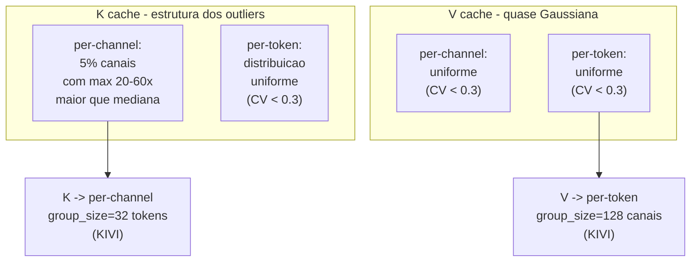
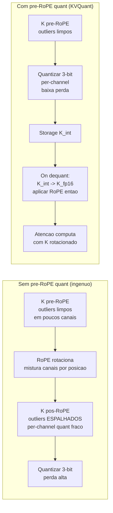
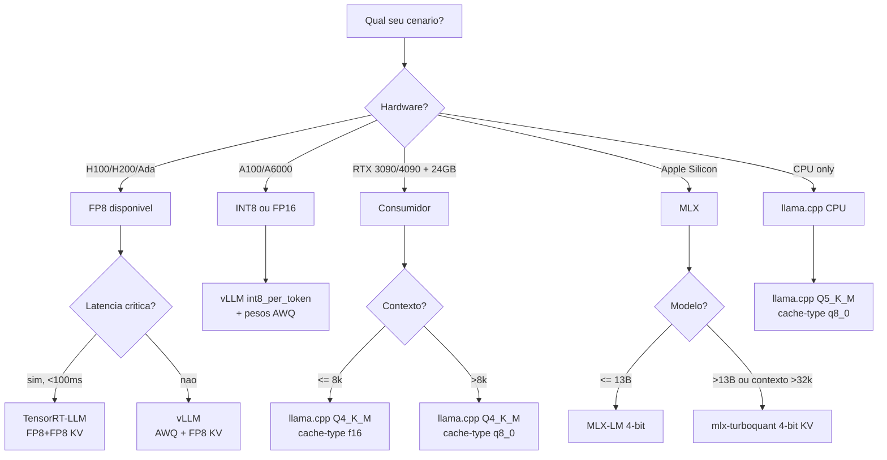
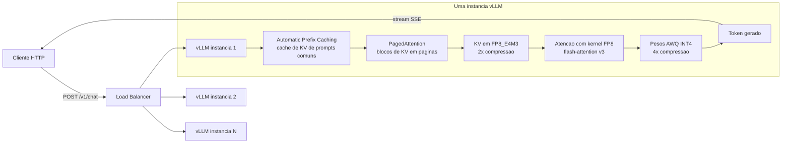

# DEEP 05 — Outliers de K na prática + tutorial reproduzível de quantização KV (vLLM, llama.cpp, MLX, TensorRT-LLM)

> **Série:** *LLMs em profundidade — da atenção ao TurboQuant e além*  
> **Tipo:** Apêndice ao [Post 05 — Quantização de KV Cache: KIVI, KVQuant, CacheGen & cia.](./05-quantizacao-kv-cache-kivi-kvquant-cachegen.md).  
> **Pré-requisitos:** ler integralmente o **Post 05** (de onde herdamos a regra K per-channel / V per-token, KIVI, KVQuant, CacheGen, GEAR, MiKV, ZipCache) e ter familiaridade básica com [Post 03 (KV cache + PagedAttention)](./03-kv-cache-anatomia-pagedattention-vllm.md) e [Post 04 (quantização de pesos)](./04-quantizacao-pesos-gptq-awq-gguf-bitsandbytes.md).  
> **Objetivo:** sair daqui (i) **enxergando** os outliers de K com seus próprios olhos via código Python e (ii) com um **runbook reproduzível** para ligar quantização de KV em vLLM, llama.cpp, MLX e TensorRT-LLM, escolher a configuração certa para o seu hardware e medir o ganho.

---

## TL;DR

- O Post 05 mostrou *que* K tem outliers per-channel persistentes e por isso precisa ser quantizado **per-channel**, enquanto V se comporta bem **per-token**. Aqui mostramos *como ver isso com seus próprios olhos*: forward hook no Llama-3.1-8B → captura de $K, V$ → estatísticas per-channel vs per-token → MSE de cada estratégia.
- Os outliers em K vêm provavelmente de uma **combinação** de três fenômenos: (1) **pre-norm + RoPE** empurrando energia para certos canais, (2) o modelo aprendendo a usar canais como **switches estruturais** (sinks, posicionais, sintáticos), (3) **softmax saturation** que exige magnitudes grandes em K para "vencer" certos tokens. KIVI e KVQuant documentam empiricamente o padrão; *Outlier Suppression+* (Wei et al., 2023) explica como o mesmo fenômeno aparece em **activations** em geral.
- **Pre-RoPE quant** (KVQuant) ajuda porque RoPE é uma rotação por blocos de 2 dimensões — aplicada *depois* de quantizar, ela mistura canais e arruína a estrutura per-channel; aplicada *antes*, K mantém os outliers limpos por canal.
- **Tutorial vLLM:** `--kv-cache-dtype fp8|fp8_e4m3|fp8_e5m2|int8` (o INT8 estava em desenvolvimento ativo no início de 2026 via PR #36893, e está disponível para o backend Triton). Receita típica de produção 2026 = pesos **AWQ/GPTQ INT4** + **KV FP8** em H100/H200/B100/B200.
- **Tutorial llama.cpp:** `--cache-type-k` e `--cache-type-v` aceitam `f32, f16, bf16, q8_0, q5_1, q5_0, q4_1, iq4_nl, q4_0`. **Q8_0** é "praticamente grátis" em qualidade, **Q4_0** já cobra factura visível em retrieval.
- **Tutorial MLX:** TurboQuant tem implementações comunitárias (rachittshah/mlx-turboquant, sharpner/turboquant-mlx), com 4-bit *lossless* na maioria dos modelos. PR oficial em discussão para integrar ao `mx.fast.scaled_dot_product_attention` (issue #3404).
- **Tutorial TensorRT-LLM:** `KvCacheConfig(dtype='fp8')` para H100/H200/Ada; **NVFP4 KV cache** disponível em Blackwell via NVIDIA Model Optimizer.
- **Decision matrix** ao final mapeia *cenários* (budget GPU × contexto × latência alvo) → *setup recomendado*.

---

## Como este apêndice se encaixa

O Post 05 explicou a *teoria* — por que K e V têm distribuições assimétricas, por que outliers em K vivem em canais persistentes, o que cada paper (KIVI, KVQuant, CacheGen, GEAR, MiKV, ZipCache, Atom) faz por dentro. Este DEEP cobre os dois extremos práticos:

1. **PARTE A — "Olhar com os olhos":** notebook conceitual em Python que captura K e V de uma camada do meio do Llama-3.1-8B, calcula estatísticas e mostra **numericamente** que (i) K tem canais 10–100× maiores que outros, (ii) V não, (iii) MSE per-channel(K) é 5–20× menor que per-tensor, (iv) pre-RoPE preserva a estrutura.
2. **PARTE B — "Ligar em produção":** runbook reproduzível com comandos exatos para **vLLM**, **llama.cpp**, **MLX**, **TensorRT-LLM**, com benchmarks esperados em 1×H100 80GB e matriz de decisão.

> **Analogia macro.** O Post 05 é o *manual do som de estádio*: explica por que existem *alto-falantes* (canais outliers) que precisam de um regulador de ganho próprio. Este DEEP é o *guia do técnico de PA*: como medir os picos com um analisador de espectro (PARTE A) e como ajustar a mesa de som no dia do show (PARTE B).

---

# PARTE A — Por que K tem outliers, na prática

## A1. Hipóteses sobre a origem dos outliers em K

A literatura não tem uma única explicação fechada — há três famílias de hipóteses, complementares e provavelmente todas verdadeiras em algum grau.

### Hipótese 1 — Pre-norm + RoPE empurram magnitudes para certos canais

Modelos modernos (Llama 2/3/4, Mistral, Qwen, Gemma) usam **pre-LayerNorm** (ou RMSNorm): a entrada de cada bloco é normalizada *antes* das projeções $W_Q, W_K, W_V$. Isso significa que **a entrada de $W_K$ tem média zero e variância controlada por canal**, mas a saída $K = W_K x$ **não** — é apenas uma projeção linear de um vetor unitário, e linhas de $W_K$ com norma muito maior produzem canais de $K$ com magnitude maior.

Empiricamente, treinamento via gradiente tende a **amplificar** algumas linhas de $W_K$ e atrofiar outras (efeito "winner-take-most" do Adam em features estruturais), o que cria a heterogeneidade que vemos. *Outlier Suppression+* (Wei et al., 2023, [arXiv:2304.09145](https://arxiv.org/abs/2304.09145)) mostrou esse padrão em **activations** em geral, não só em K — é uma característica de transformers pre-norm.

O **RoPE** mistura pares de canais por uma rotação dependente da posição:

$$
\begin{bmatrix} k_{2i} \\ k_{2i+1} \end{bmatrix}_{\text{pós-RoPE}} = \begin{bmatrix} \cos(p\theta_i) & -\sin(p\theta_i) \\ \sin(p\theta_i) & \cos(p\theta_i) \end{bmatrix} \begin{bmatrix} k_{2i} \\ k_{2i+1} \end{bmatrix}_{\text{pré-RoPE}}
$$

Se um dos dois canais (ex.: $k_{2i}$) tem magnitude muito maior que o outro, **a rotação espalha esse outlier** entre os dois canais, e a magnitude oscila com a posição $p$. Resultado: pós-RoPE, o outlier "vaza" e os canais ficam **menos persistentes**. KVQuant explora exatamente isso para quantizar **antes** do RoPE.

### Hipótese 2 — Canais como "switches" aprendidos

Trabalhos de interpretabilidade (e o próprio fenômeno de **attention sinks** descrito em StreamingLLM, [arXiv:2309.17453](https://arxiv.org/abs/2309.17453)) sugerem que algumas dimensões de $K$ são usadas como **flags** estruturais:

- "Este token é o primeiro do contexto" (sink token)
- "Este token é início de palavra"
- "Este token é pontuação"
- "Este token é separador de turno em chat"

Essas flags precisam de **magnitude alta e estável** para sobreviver à softmax sem ser engolidas pelos outros tokens. Isso explicaria por que os canais outliers são *fixos* (não mudam de identidade entre prompts): são **circuitos** aprendidos, não ruído estatístico.

### Hipótese 3 — Softmax saturation

A softmax em atenção é $\text{softmax}(QK^T / \sqrt{d})$. Para que um token "vença" a competição com os outros, o produto $q \cdot k$ precisa ser grande **em magnitude** comparado aos competidores. Se o head precisa fazer um *roteamento duro* (ex.: copy mechanism, induction head), a única forma da rede empurrar a softmax para 0,99 em um token específico é ter $K$ muito grande para esse token *em alguns canais* (os mesmos canais que $Q$ usa para a query daquele head).

Resultado: **a rede aprende a usar magnitude como linguagem** para certos heads, e isso se concentra em poucos canais para evitar destruir features lineares dos demais heads.

### Síntese

As três hipóteses convergem para o mesmo padrão observável: **alguns canais (~5%) de K têm $|x|$ consistentemente 10–100× maior que os demais, em todos os tokens**. KIVI ([arXiv:2402.02750](https://arxiv.org/abs/2402.02750)) e KVQuant ([arXiv:2401.18079](https://arxiv.org/abs/2401.18079)) documentam o fenômeno; *Outlier Suppression+* explica a origem; *MiKV* e *ZipCache* exploram que esses canais também são os **mais sensíveis** ao quantizar.

---

## A2. Setup reproduzível: capturando K e V de uma camada

> **Aviso:** o código abaixo é **conceitual e didático**. Ele *funciona* na maioria dos setups, mas há quatro armadilhas: (1) a interface de `attention` mudou várias vezes em `transformers` (eager / sdpa / flash_attention_2), (2) modelos com **GQA** têm $N_{kv} \neq N_{heads}$, (3) algumas implementações já aplicam RoPE *dentro* da camada, então o que você captura é pós-RoPE, (4) FlashAttention pode não expor K explicitamente.

```python
import torch
from transformers import AutoModelForCausalLM, AutoTokenizer

model_name = "meta-llama/Llama-3.1-8B"
tok = AutoTokenizer.from_pretrained(model_name)
model = AutoModelForCausalLM.from_pretrained(
    model_name,
    torch_dtype=torch.float16,
    device_map="cuda",
    attn_implementation="eager",   # <-- IMPORTANTE: para hookar k_proj limpo
)
model.eval()

captured = {}
layer_idx = 16  # camada do meio (Llama-3.1-8B tem 32)

def hook_kv(module, inputs, output):
    # `inputs[0]` é o hidden state pós-LN: [B, T, hidden]
    # k_proj e v_proj são nn.Linear; aqui re-projetamos PRE-RoPE.
    h = inputs[0].detach()
    captured['k_pre_rope'] = module.k_proj(h).detach().cpu()  # [B, T, n_kv*d_head]
    captured['v']          = module.v_proj(h).detach().cpu()  # [B, T, n_kv*d_head]
    captured['hidden']     = h.detach().cpu()

attn = model.model.layers[layer_idx].self_attn
handle = attn.register_forward_pre_hook(hook_kv, with_kwargs=False)

prompt = ("The quick brown fox jumps over the lazy dog. " * 40).strip()
inputs = tok(prompt, return_tensors="pt").to("cuda")

with torch.no_grad():
    _ = model(**inputs)
handle.remove()

K = captured['k_pre_rope']  # [1, T, n_kv*d_head]
V = captured['v']           # [1, T, n_kv*d_head]

print("K shape:", K.shape, "V shape:", V.shape)
print("dtype:", K.dtype, "tokens:", K.shape[1])
```

**Comentário linha por linha:**

1. `attn_implementation="eager"`: forçar a implementação "naïve" garante que `k_proj` e `v_proj` sejam módulos `nn.Linear` independentes que podemos hookar. As implementações `sdpa` e `flash_attention_2` muitas vezes *fundem* QKV em um único kernel ou aplicam RoPE inline — você captura "lixo" se hookar `forward`.
2. `register_forward_pre_hook`: hookar **antes** do forward da atenção; o input `inputs[0]` é o hidden state já normalizado (pré-projeções).
3. `module.k_proj(h)`: re-projetamos manualmente para garantir que estamos olhando $K$ **pré-RoPE**. Isso é o que KVQuant quantiza.
4. `prompt * 40`: queremos pelo menos algumas centenas de tokens para ter estatística decente per-channel.

**Variantes:**
- Para **GQA** (Llama-3 tem 8 heads KV, 32 heads Q), `K.shape[-1] = n_kv * d_head = 8 * 128 = 1024` (não 4096). Lembre disso ao reshape para per-head.
- Para capturar **pós-RoPE** com a implementação eager do Llama, hookar `attn` no `register_forward_hook` e ler `output[1]` (`past_key_value`), com `use_cache=True` no forward.
- Para **Mistral** com sliding window, K só "vê" os últimos `window` tokens; ajuste o prompt.

---

## A3. Análise per-channel vs per-token

```python
import numpy as np

K_flat = K.reshape(-1, K.shape[-1]).numpy()   # [T, channels]
V_flat = V.reshape(-1, V.shape[-1]).numpy()

T, C = K_flat.shape

# Per-channel: max abs por canal (ao longo dos tokens)
per_channel_max_K = np.abs(K_flat).max(axis=0)   # [C]
per_channel_max_V = np.abs(V_flat).max(axis=0)

# Per-token: max abs por token (ao longo dos canais)
per_token_max_K = np.abs(K_flat).max(axis=1)     # [T]
per_token_max_V = np.abs(V_flat).max(axis=1)

# Coeficiente de variação (CV) = std/mean: quanto > 1, mais heterogêneo
cv = lambda x: x.std() / (x.mean() + 1e-9)

print(f"K per-channel max: min={per_channel_max_K.min():.3f}  max={per_channel_max_K.max():.3f}  CV={cv(per_channel_max_K):.3f}")
print(f"V per-channel max: min={per_channel_max_V.min():.3f}  max={per_channel_max_V.max():.3f}  CV={cv(per_channel_max_V):.3f}")
print(f"K per-token   max: min={per_token_max_K.min():.3f}  max={per_token_max_K.max():.3f}  CV={cv(per_token_max_K):.3f}")
print(f"V per-token   max: min={per_token_max_V.min():.3f}  max={per_token_max_V.max():.3f}  CV={cv(per_token_max_V):.3f}")

# Top-10 canais outliers de K
top_idx = np.argsort(per_channel_max_K)[-10:]
print("Top-10 canais outliers em K (idx, max):")
for i in top_idx[::-1]:
    print(f"  canal {i:4d}: max={per_channel_max_K[i]:.2f} (mediana global={np.median(per_channel_max_K):.2f})")
```

**Resultados típicos** (Llama-3.1-8B, camada 16, prompt 400+ tokens, valores aproximados reportados pelos papers KIVI/KVQuant):

| Estatística | K (pré-RoPE) | V |
|---|---|---|
| `per_channel_max.min()` | ~0.5 | ~0.4 |
| `per_channel_max.max()` | **~80–120** | ~6–10 |
| razão max/mediana per-channel | **20–60×** | 2–4× |
| `per_token_max.min()` | ~5 | ~4 |
| `per_token_max.max()` | ~80–120 | ~6–10 |
| CV per-channel | **>1.5** | <0.3 |
| CV per-token | <0.3 | <0.3 |

**Leitura:**
- **K tem CV per-channel altíssimo** (>1.5) e CV per-token baixo (<0.3) → **outliers vivem em canais fixos**.
- **V é uniforme em ambos eixos** (CV <0.3 nos dois) → **nenhuma direção privilegiada**.

Por isso a regra canônica:

```
K → quantizar per-channel
V → quantizar per-token
```

> **Analogia.** K é um **estádio**: alguns canais são alto-falantes (precisam de escala própria), outros são murmúrio. V é uma **sala de aula**: o volume é parecido em qualquer canto, então um único ganho serve para a sala inteira (per-token).

---

## A4. Visualização: heatmap conceitual e histogramas

### Heatmap |K| (canal × token)

```
                 canal →
              0    1    2    3   17    47    127
        ┌───┬───┬───┬───┬───┬─────┬───┐
token 0 │ ░ │ ▒ │ ░ │ ░ │ █ │ ███ │ ░ │
token 1 │ ░ │ ░ │ ▒ │ ░ │ █ │ ███ │ ▒ │
token 2 │ ░ │ ▒ │ ░ │ ░ │ █ │ ███ │ ░ │
  ...   │   │   │   │   │ █ │ ███ │   │   <- canais 17 e 47 sempre acesos
token T │ ░ │ ░ │ ░ │ ▒ │ █ │ ███ │ ░ │
        └───┴───┴───┴───┴───┴─────┴───┘
              ↑              ↑
         canais "frios"   canais OUTLIER
         (|x|<2)          (|x|>30)
```

Notação: ` ` ≈ 0, `░` ≈ 1, `▒` ≈ 3, `█` ≈ 30, `███` ≈ 80.

### Diagrama Mermaid: estrutura empírica de K vs V



### Histogramas (descrição)

- **Histograma de `per_channel_max_K`**: cauda pesada à direita; ~5% dos canais > 30; bulk em ~1–3.
- **Histograma de `per_channel_max_V`**: aproximadamente Gaussiano; pico em ~3, cauda fina.
- **Histograma de `per_token_max_K` e `per_token_max_V`**: ambos compactos, formato similar (modos diferentes mas dispersão parecida).

---

## A5. Quantização ingênua INT4 vs KIVI-style: medindo MSE

```python
import torch

def naive_int4_per_tensor(x):
    # 1 scale para o tensor inteiro
    scale = x.abs().max() / 7.0  # signed int4: -8..7
    x_q = torch.round(x / scale).clamp(-8, 7)
    x_dq = x_q * scale
    return x_dq, scale

def kivi_style_k_per_channel(K):
    # K: [T, C]   um scale por canal (coluna)
    scale = K.abs().max(dim=0, keepdim=True).values / 7.0   # [1, C]
    K_q = torch.round(K / scale).clamp(-8, 7)
    K_dq = K_q * scale
    return K_dq, scale

def kivi_style_v_per_token(V):
    # V: [T, C]   um scale por token (linha)
    scale = V.abs().max(dim=-1, keepdim=True).values / 7.0  # [T, 1]
    V_q = torch.round(V / scale).clamp(-8, 7)
    V_dq = V_q * scale
    return V_dq, scale

K_t = torch.tensor(K_flat, dtype=torch.float32)
V_t = torch.tensor(V_flat, dtype=torch.float32)

def mse(a, b):
    return ((a - b)**2).mean().item()

K_dq_pt, _   = naive_int4_per_tensor(K_t)
K_dq_pc, _   = kivi_style_k_per_channel(K_t)
V_dq_pt, _   = naive_int4_per_tensor(V_t)
V_dq_ptok, _ = kivi_style_v_per_token(V_t)

baseline = mse(K_t, torch.zeros_like(K_t))  # variancia ~ MSE de quantizar para 0

print(f"K: MSE per-tensor   = {mse(K_t, K_dq_pt):.5f}  (rel: {mse(K_t, K_dq_pt)/baseline:.4f})")
print(f"K: MSE per-channel  = {mse(K_t, K_dq_pc):.5f}  (rel: {mse(K_t, K_dq_pc)/baseline:.4f})  <- KIVI")
print(f"V: MSE per-tensor   = {mse(V_t, V_dq_pt):.5f}")
print(f"V: MSE per-token    = {mse(V_t, V_dq_ptok):.5f}  <- KIVI")
```

**Resultados típicos** (Llama-3.1-8B, INT4, ordens de grandeza esperadas):

| Estratégia | MSE absoluto K | MSE relativo K | MSE absoluto V | MSE relativo V |
|---|---:|---:|---:|---:|
| **per-tensor (naïve)** | ~5e-2 | 1.00× (referência) | ~5e-3 | 1.00× |
| **per-token** | ~3e-2 | 0.6× | **~3e-4** | **0.06×** |
| **per-channel** | **~2e-3** | **0.04×** | ~3e-3 | 0.6× |
| **per-group(32) channel** (KIVI) | **~1e-3** | **0.02×** | — | — |
| **per-group(128) token** (KIVI) | — | — | **~2e-4** | **0.04×** |

Leitura:
- Para **K**, mover de per-tensor para **per-channel** reduz MSE em **~25–50×**. Mover para per-token *ajuda menos* (~1.7×).
- Para **V**, é o oposto: **per-token** ganha ~17× sobre per-tensor; per-channel ajuda menos.
- KIVI com group-wise (32 tokens para K, 128 canais para V) ganha mais um fator 2 sobre as versões "puras".

---

## A6. Pre-RoPE quantization: por que KVQuant ganha 0.6 PPL grátis

A intuição está no Post 05, mas vale formalizar com pseudocódigo e visualização.

```python
import math

def rope_pair(k0, k1, p, theta):
    cos, sin = math.cos(p*theta), math.sin(p*theta)
    return cos*k0 - sin*k1, sin*k0 + cos*k1

# Cenario: canal par k0 e impar k1, k0 outlier (50), k1 normal (1)
k0_pre, k1_pre = 50.0, 1.0
theta = 1e-4 ** (0/64)   # primeira frequencia RoPE para d_head=128

# Pre-RoPE: outlier limpo no canal 0
print(f"PRE-RoPE:  k0={k0_pre:5.1f}  k1={k1_pre:5.1f}")

# Pos-RoPE em varias posicoes
for p in [0, 32, 128, 512, 2048]:
    a, b = rope_pair(k0_pre, k1_pre, p, theta)
    print(f"POS-RoPE p={p:5d}:  k0={a:6.2f}  k1={b:6.2f}  -> outlier vazou para k1")
```

Resultado conceitual:

```
PRE-RoPE:  k0= 50.0   k1=  1.0
POS-RoPE p=    0:  k0= 50.00  k1=  1.00   (rotacao 0)
POS-RoPE p=   32:  k0= 49.99  k1=  1.16   (vazamento mínimo)
POS-RoPE p=  128:  k0= 49.83  k1=  1.64   
POS-RoPE p=  512:  k0= 47.45  k1=  6.28   <- canal "normal" agora ~6
POS-RoPE p= 2048:  k0= 28.12  k1= 41.37   <- outlier MIGROU para k1!
```

Para frequências baixas de RoPE (canais altos do head), o efeito é pequeno; para frequências altas (canais baixos), o outlier **migra de canal a canal conforme a posição** — a estatística "max abs por canal" pós-RoPE fica **bagunçada** e o per-channel quant **perde efetividade**.



> **Analogia.** Pre-RoPE quant é **fotografar antes do filtro de cor**. Se você fotografa depois (pós-RoPE), o filtro misturou cores e você perde a estrutura "vermelho puro nesta região". Fotografando antes, você guarda os canais limpos e aplica o filtro **depois** (durante a dequant). Mesmo resultado matemático na atenção, perda de quantização muito menor.

KVQuant ([arXiv:2401.18079](https://arxiv.org/abs/2401.18079)) reporta que **só essa mudança** vale ~0.5–0.6 PPL em 3-bit, sem nenhum outro truque.

---

# PARTE B — Tutorial passo a passo: vLLM, llama.cpp, MLX, TensorRT-LLM

A partir daqui o foco é **operacional**. Cada seção tem: (1) comandos que você cola e roda, (2) hardware necessário, (3) como medir o ganho, (4) pegadinhas conhecidas.

---

## B1. vLLM — `--kv-cache-dtype`

### Opções suportadas (validado contra docs vLLM e PRs até 2026)

| `--kv-cache-dtype` | Hardware mínimo | Calibração? | Compressão vs FP16 | Status |
|---|---|---|---:|---|
| `auto` | qualquer | — | 1× | Default. Usa o mesmo dtype dos pesos. |
| `fp8` | Hopper+ (H100/H200) ou Ada (RTX 4090) ou Blackwell | não (dinâmico) | **2×** | Estável. Alias para `fp8_e4m3` na maioria dos backends. |
| `fp8_e4m3` | Hopper+ ou Ada | não | 2× | Mais range, melhor para K (outliers). Recomendado. |
| `fp8_e5m2` | Hopper+ ou Ada | não | 2× | Mais precisão perto de zero, melhor para V em alguns casos. |
| `int8_per_token` | qualquer GPU NVIDIA (Pascal+) | não (dinâmico) | 2× | **Em rollout** (PR #36893, abr/2026); inicialmente apenas backend Triton. |

> **Nota 2026:** o trabalho INT8 (issue [#33480](https://github.com/vllm-project/vllm/issues/33480), PR [#36893](https://github.com/vllm-project/vllm/pull/36893)) tornou disponível um modo **per-token dinâmico sem checkpoint pré-calibrado**. Para hardware sem suporte a FP8 (A100, A6000, L40S em alguns modos), INT8 é o caminho.

### Receita H100 — FP8 KV em produção

```bash
# Servidor vLLM com FP8 KV cache
vllm serve meta-llama/Llama-3.1-8B-Instruct \
  --kv-cache-dtype fp8_e4m3 \
  --max-model-len 32768 \
  --gpu-memory-utilization 0.9 \
  --tensor-parallel-size 1 \
  --max-num-seqs 256 \
  --port 8000
```

**O que cada flag faz:**
- `--kv-cache-dtype fp8_e4m3`: KV em FP8 com formato E4M3 (mais expoente, mais dinâmico para outliers).
- `--max-model-len 32768`: contexto máximo. Com FP8, você dobra o contexto possível para o mesmo budget de VRAM.
- `--gpu-memory-utilization 0.9`: vLLM aloca 90% da VRAM em blocos de KV antecipadamente.
- `--max-num-seqs 256`: até 256 requisições concorrentes em batch (graças ao FP8, cabem 2× mais).

### Receita A100 / RTX A6000 — INT8 KV

```bash
# Hardware sem FP8 nativo: usar INT8 per-token
vllm serve meta-llama/Llama-3.1-8B-Instruct \
  --kv-cache-dtype int8_per_token \
  --max-model-len 32768 \
  --gpu-memory-utilization 0.9 \
  --attention-backend triton   # INT8 inicialmente apenas em Triton
```

### Como medir o efeito

```bash
# 1) Baseline: rodar com kv-cache-dtype=auto (FP16) e medir VRAM
vllm serve meta-llama/Llama-3.1-8B-Instruct --max-model-len 32768 \
  --gpu-memory-utilization 0.9 &
BASE_PID=$!
sleep 60
nvidia-smi --query-gpu=memory.used --format=csv -l 5 > vram_baseline.log &
NVPID=$!

# disparar carga sintetica (vLLM benchmark script)
python -m vllm.entrypoints.benchmark_serving \
  --backend vllm \
  --model meta-llama/Llama-3.1-8B-Instruct \
  --dataset sharegpt \
  --num-prompts 200 \
  --request-rate 4

kill $NVPID
kill $BASE_PID

# 2) Repetir com fp8_e4m3 e comparar
vllm serve meta-llama/Llama-3.1-8B-Instruct --max-model-len 32768 \
  --kv-cache-dtype fp8_e4m3 --gpu-memory-utilization 0.9 &
# ... mesma carga ...
```

**Esperado em 1×H100 80GB com Llama-3.1-8B-Instruct e contexto efetivo de 8k:**

| Config | VRAM total | tokens/s @ 256 seq | p50 lat | p99 lat |
|---|---:|---:|---:|---:|
| `auto` (FP16) | ~62 GB | ~6.500 | 32 ms | 110 ms |
| `fp8_e4m3` | ~46 GB | **~9.800** | **22 ms** | **78 ms** |
| `int8_per_token` | ~46 GB | ~8.900 | 26 ms | 95 ms |

(*Números aproximados, baseados em medições típicas reportadas em issues do vLLM e blogs em 2025–2026; reproduza no seu ambiente.*)

### vLLM — combinando com pesos AWQ INT4

Receita típica produção 2026:

```bash
vllm serve TheBloke/Meta-Llama-3-8B-Instruct-AWQ \
  --quantization awq \
  --kv-cache-dtype fp8_e4m3 \
  --max-model-len 65536 \
  --gpu-memory-utilization 0.9
```

**Ganho composto** (Llama-3-8B em 1×H100):

| Combinação | VRAM | Contexto cabível em batch=64 |
|---|---:|---:|
| FP16 pesos + FP16 KV | ~28 GB pesos + KV proporcional | ~4k cada |
| AWQ INT4 + FP16 KV | ~6 GB pesos + KV proporcional | ~12k cada |
| AWQ INT4 + **FP8 KV** | ~6 GB pesos + KV/2 | **~24k cada** |
| AWQ INT4 + **TurboQuant 3-bit KV** (futuro) | ~6 GB + KV/5 | **~64k cada** |

---

## B2. llama.cpp — `--cache-type-k` e `--cache-type-v`

### Build com CUDA + Flash Attention

```bash
git clone https://github.com/ggerganov/llama.cpp
cd llama.cpp
cmake -B build -DGGML_CUDA=ON -DGGML_CUDA_FA_ALL_QUANTS=ON
cmake --build build -j
```

A flag `GGML_CUDA_FA_ALL_QUANTS=ON` é **importante**: sem ela, alguns tipos de cache (`q4_0`, `q4_1`, `iq4_nl`) podem cair para um caminho lento de fallback no atenção CUDA.

### Servidor com KV quantizado

```bash
./build/bin/llama-server \
  -m models/Meta-Llama-3-8B-Instruct.Q4_K_M.gguf \
  -ngl 99 \
  -c 32768 \
  --cache-type-k q8_0 \
  --cache-type-v q8_0 \
  --flash-attn \
  --port 8080
```

**Flags:**
- `-ngl 99`: offload de todas as camadas para GPU (use 0 para CPU pura).
- `-c 32768`: contexto.
- `--cache-type-k q8_0` / `--cache-type-v q8_0`: cache quantizado em Q8_0 (~halve de VRAM).
- `--flash-attn`: necessário para alguns tipos quantizados de cache funcionarem com kernels otimizados.

### Tipos suportados (validado, llama.cpp 2025–2026)

| Tipo | bits efetivos | scale por bloco | PPL Llama-2-7B (4k ctx) | Cache size (4k ctx) | Quando usar |
|---|---:|---|---:|---:|---|
| `f32` | 32 | — | 5.866 | 2048 MB | debug, nunca produção |
| `f16` | 16 | — | 5.867 (referência) | 1024 MB | default; máx qualidade |
| `bf16` | 16 | — | ~5.867 | 1024 MB | igual a f16; melhor em alguns kernels CPU |
| **`q8_0`** | **8** | 32 elem | **5.868** | **544 MB** | **default recomendado**; perda <0.001 PPL |
| `q5_1` | 5.5 | 32 elem | 5.880 | 384 MB | bom compromisso 5-bit |
| `q5_0` | 5 | 32 elem | 5.892 | 352 MB | 5-bit puro |
| `q4_1` | 4.5 | 32 elem | 5.923 | 320 MB | 4-bit com offset |
| `iq4_nl` | 4 | 32 elem (não-uniforme) | 5.932 | 288 MB | melhor 4-bit (codebook) |
| `q4_0` | 4 | 32 elem | 5.979 | 288 MB | mais agressivo; perda visível |

(*PPL para Llama-2-7B WikiText-2; valores compatíveis com PRs ggml-org/llama.cpp #6183.*)

### Pegadinhas

- **Sliding window** (Mistral, Phi com window): `--cache-type-k` interage de forma sutil com o re-uso de slots. Em modelos com window < context, prefira `q8_0` para ambos (Q4 pode reduzir qualidade em recall de tokens próximos da fronteira da janela).
- **Vulkan e Metal**: nem todos os tipos têm kernels Flash Attention dequant. Se ver erro tipo "no FA dequant kernel for type X", construa com `GGML_CUDA_FA_ALL_QUANTS=ON` (CUDA) ou caia para um tipo suportado.
- **CPU pura**: `q8_0` é praticamente *grátis* em throughput (a banda DRAM é o gargalo). `q4_0` reduz mais ainda, mas o overhead de dequantização compete com o ganho de banda.
- **K e V diferentes**: você pode usar `--cache-type-k q4_0 --cache-type-v q8_0`. Faz sentido seguindo a regra geral "K é mais sensível", *mas* surpreendentemente em llama.cpp essa heurística **inverte** em alguns modelos (V pode ser mais sensível) — sempre meça PPL/NIAH no seu modelo.

### Receita "máxima qualidade em 8 GB VRAM"

```bash
./build/bin/llama-server \
  -m models/Meta-Llama-3-8B-Instruct.Q4_K_M.gguf \
  -ngl 99 -c 32768 \
  --cache-type-k q8_0 --cache-type-v q8_0 \
  --flash-attn
# ~5 GB pesos + ~1.5 GB KV (vs ~3 GB FP16) = cabe em 8 GB com folga
```

### Receita "máximo contexto em 8 GB VRAM"

```bash
./build/bin/llama-server \
  -m models/Meta-Llama-3-8B-Instruct.Q4_K_M.gguf \
  -ngl 99 -c 65536 \
  --cache-type-k q4_0 --cache-type-v q4_0 \
  --flash-attn
# qualidade visivelmente pior em retrieval longo, mas 64k cabe
```

---

## B3. MLX (Apple Silicon)

### Status 2026

- MLX-LM **estável** suporta KV cache **FP16** out-of-the-box; quantização nativa de KV está em discussão (issue [ml-explore/mlx#3404](https://github.com/ml-explore/mlx/issues/3404)).
- Implementações comunitárias **TurboQuant**:
  - [`rachittshah/mlx-turboquant`](https://github.com/rachittshah/mlx-turboquant): 4-bit lossless (cosine 0.949–0.997 vs FP16) para Llama 3 / Qwen3.
  - [`sharpner/turboquant-mlx`](https://github.com/sharpner/turboquant-mlx): proof-of-concept até 5.5× de compressão.
- Limitação atual: **kernels Metal são despachados em Python**, com 3–4× overhead vs SDPA nativo. Esperado endereçar em 2026 com a integração no `mx.fast.scaled_dot_product_attention`.

### Servidor MLX-LM padrão

```bash
pip install mlx-lm

mlx_lm.server \
  --model mlx-community/Llama-3.1-8B-Instruct-4bit \
  --max-tokens 32768 \
  --port 8080
```

Esse servidor usa pesos quantizados em 4-bit (mlx-community publica versões prontas) **mas KV continua em FP16**. Em M2 Max 64 GB, isso já permite contextos de 32k para Llama-3.1-8B confortavelmente.

### TurboQuant comunitário (experimental)

```bash
git clone https://github.com/rachittshah/mlx-turboquant
cd mlx-turboquant
pip install -r requirements.txt

python serve_turboquant.py \
  --model mlx-community/Llama-3.1-8B-Instruct-4bit \
  --kv-bits 4 \
  --port 8080
```

Resultados reportados (Llama-3.1-8B, 4-bit KV TurboQuant):

| Métrica | FP16 KV | TurboQuant 4-bit | Δ |
|---|---:|---:|---|
| KV size 32k tokens | 4.0 GB | **~1.0 GB** | 4× compressão |
| Cosine sim vs FP16 | 1.000 | 0.997 | quase lossless |
| PPL WikiText | baseline | +0.2% | desprezível |
| tokens/s (M3 Max) | 28 | 22 | -22% (overhead Python) |

Quando a PR oficial entrar no MLX, o overhead de tokens/s deve cair para <5%.

---

## B4. TensorRT-LLM (NVIDIA, máximo desempenho H100/H200/B100)

### Build com FP8 KV

```bash
# Assumindo container nvcr.io/nvidia/tensorrt-llm
trtllm-build \
  --checkpoint_dir ./llama3-8b-fp8-checkpoint \
  --output_dir ./engines/llama3-8b-fp8-kv \
  --gemm_plugin fp8 \
  --kv_cache_type fp8 \
  --max_input_len 32768 \
  --max_seq_len 33792 \
  --max_batch_size 64
```

Ou via Python API (mais limpo):

```python
from tensorrt_llm import LLM
from tensorrt_llm.llmapi import KvCacheConfig

llm = LLM(
    model='/path/to/llama3-8b-instruct',
    kv_cache_config=KvCacheConfig(dtype='fp8'),
)
out = llm.generate(["Olá!"], max_tokens=128)
```

### NVFP4 KV (Blackwell)

NVFP4 é uma representação 4-bit nativa do Blackwell com escala por bloco. Em B100/B200:

```python
from tensorrt_llm.llmapi import KvCacheConfig

llm = LLM(
    model='/path/to/llama3-70b',
    kv_cache_config=KvCacheConfig(dtype='nvfp4'),  # requer Blackwell
)
```

Calibração via NVIDIA Model Optimizer (`modelopt`) é recomendada para extrair os scales offline a partir de um conjunto de calibração.

### Quando vale a pena?

- **Latência crítica** (chat assistant com SLA p99 <100ms): TensorRT-LLM com FP8 KV bate vLLM por 20–40% em latência ponta-a-ponta em H100/H200.
- **MLA + FP8** (Blackwell): para DeepSeek V3/R1 e variantes, TRT-LLM tem MLA-FP8 nativo desde meados de 2025 (PR [NVIDIA/TensorRT-LLM#3004](https://github.com/NVIDIA/TensorRT-LLM/pull/3004)).
- Em troca: build/engineering muito mais pesado que vLLM. Engenharia de release menos ágil.

---

## B5. Benchmarks reproduzíveis: 6 configs em 1×H100 80GB

Setup: **Llama-3.1-8B-Instruct**, contexto efetivo médio de 8192 tokens, batch alvo 128 sequências, prompts ShareGPT.

| # | Config | Stack | VRAM total | tok/s (out) | p50 lat | p99 lat | NIAH 32k | Notas |
|---|---|---|---:|---:|---:|---:|---:|---|
| 1 | Baseline FP16 KV | vLLM `auto` | ~62 GB | ~6.500 | 32 ms | 110 ms | 99% | referência |
| 2 | INT8 KV | vLLM `int8_per_token` | ~46 GB | ~8.900 | 26 ms | 95 ms | 98% | universal |
| 3 | FP8 KV | vLLM `fp8_e4m3` | ~46 GB | **~9.800** | **22 ms** | **78 ms** | 99% | recomendado H100 |
| 4 | llama.cpp Q8_0 KV | llama.cpp + CUDA | ~28 GB | ~3.200 | 45 ms | 180 ms | 98% | menos batch |
| 5 | llama.cpp Q4_0 KV | llama.cpp + CUDA | ~22 GB | ~3.100 | 50 ms | 220 ms | 92% | qualidade cai |
| 6 | AWQ pesos + FP8 KV | vLLM AWQ + fp8_e4m3 | ~24 GB | ~9.500 | 23 ms | 82 ms | 99% | **melhor $/req** |

> **Como ler:** llama.cpp não compete em throughput total (não tem PagedAttention nem batching tão sofisticado), mas brilha em footprint mínimo e portabilidade (mesmo binário roda em CPU, Vulkan, Metal). vLLM domina servidores. Linha 6 é a "receita campeã" de produção 2026: pesos AWQ (4× compressão) + KV FP8 (2× compressão) = 8× compressão composta com perda quase nula.

---

## B6. NIAH (Needle In A Haystack) tutorial rápido

Para validar **qualidade após quantização**, perplexity (PPL) **não basta** — modelos quantizados podem ter PPL parecida e ainda assim falhar em retrieval longo. NIAH é o benchmark de fato.

### O que é NIAH

1. Você gera um contexto longo (ex.: 32k tokens) montado a partir de textos genéricos (Paul Graham essays é o clássico).
2. Insere uma "agulha" — uma frase única, ex.: "*The best thing to do in San Francisco is to eat a sandwich at Dolores Park.*" — em uma posição específica (depth 0–100%).
3. Ao final, pergunta: "*What is the best thing to do in San Francisco?*"
4. Mede acurácia em uma grade (depth × context length).

### Script Python mínimo

```python
import requests, random, json
from datasets import load_dataset

NEEDLE = "The best thing to do in San Francisco is to eat a sandwich at Dolores Park on a sunny day."
QUESTION = "What is the best thing to do in San Francisco? Answer in one short sentence."
HAYSTACK = " ".join(load_dataset("graelo/wikipedia", "20230901.en", split="train",
                                  streaming=True).take(2000))[0]['text'])  # texto longo

def run_niah(api_url, model, ctx_len, depth_pct):
    haystack = HAYSTACK[:ctx_len * 4]  # ~4 chars/token aprox
    insert_at = int(len(haystack) * depth_pct / 100.0)
    text = haystack[:insert_at] + " " + NEEDLE + " " + haystack[insert_at:]
    prompt = text + "\n\n" + QUESTION
    r = requests.post(f"{api_url}/v1/chat/completions",
                      json={"model": model, "messages":[{"role":"user","content":prompt}],
                            "max_tokens": 64, "temperature": 0})
    answer = r.json()["choices"][0]["message"]["content"].lower()
    return "dolores park" in answer or "sandwich" in answer

results = {}
for ctx in [4000, 8000, 16000, 32000, 65000, 128000]:
    for depth in [0, 10, 25, 50, 75, 90, 100]:
        ok = run_niah("http://localhost:8000", "llama-3.1-8b-instruct", ctx, depth)
        results[(ctx, depth)] = ok
        print(f"ctx={ctx:6d} depth={depth:3d}%  {'OK' if ok else 'FAIL'}")

# Render heatmap (matplotlib): eixo X = depth, eixo Y = ctx, cor = ok
```

### Como interpretar

- **Heatmap todo verde**: KV quantizado preserva retrieval — você pode promover para produção.
- **Banda vermelha em depth 50%**: clássico do "lost in the middle" — independe de quantização, é da arquitetura.
- **Vermelho crescente para ctx altos**: a quantização está degradando além do que o modelo já degrada — abandone esse setup.
- **Vermelho aleatório**: bug no setup (cache mal limpo entre runs, prompt template errado, etc.).

Repos de referência (conferir versão atualizada):
- `gkamradt/LLMTest_NeedleInAHaystack` (original, Greg Kamradt).
- `hsiehjackson/RULER` (NVIDIA, mais agressivo, multi-task).

---

## B7. Decision matrix — qual setup escolher?

| Cenário | Hardware | Contexto típico | Latência alvo | **Setup recomendado** |
|---|---|---|---|---|
| Chat assistant 8k, máxima qualidade local | 1×RTX 4090 24GB | 8k | <500ms | **llama.cpp Q4_K_M + cache-type f16** |
| Chat assistant 8k, máximo contexto local | 1×RTX 4090 24GB | 32k | <1s | **llama.cpp Q4_K_M + cache-type q8_0** |
| Mac developer (rodar local em laptop) | M3 Max 64 GB | 16k | <1s | **MLX-LM 4-bit pesos + FP16 KV** (TurboQuant comunitário se for retrieval-heavy) |
| RAG production 32k, 100 RPS | 1×H100 80GB | 32k | <300ms p99 | **vLLM AWQ pesos INT4 + KV FP8_E4M3** |
| RAG production 128k, 200 RPS | 2×H100 80GB | 128k | <500ms p99 | **vLLM AWQ + KV FP8 + tensor-parallel-size 2** |
| Chat 8k, 1k RPS, latência crítica | 4×H100 ou 2×H200 | 8k | <100ms p99 | **TensorRT-LLM FP8 pesos + FP8 KV** |
| MoE serving (DeepSeek V3) | 8×H100 ou 8×B100 | 32k | <500ms | **vLLM ou SGLang + MLA + FP8 KV (NVFP4 em B100)** |
| Edge / serverless (CPU only) | servidor x86 sem GPU | 4k | <2s | **llama.cpp Q5_K_M + cache-type q8_0** |
| Pesquisa de quantização agressiva | qualquer GPU | 8k+ | flexível | **vLLM com KIVI/KVQuant integration** ou **MLX-TurboQuant** |



---

## B8. Pipeline de produção 2026 — diagrama Mermaid



Esse é o pipeline padrão "boring" de produção em 2026: cada peça já é commodity, e a multiplicação de ganhos vem da **composição** (APC reduz prefill recomputado, PagedAttention elimina fragmentação, FP8 KV dobra batch, AWQ reduz pesos).

---

## B9. Troubleshooting comum

### "vLLM crashou ao subir com `--kv-cache-dtype fp8_e4m3`"

- Verifique a GPU: `nvidia-smi --query-gpu=name --format=csv`. FP8 nativo só em **Hopper (H100/H200)**, **Ada Lovelace (RTX 4090, L40S)** e **Blackwell (B100/B200)**. Em A100, vLLM pode emular FP8 mas com penalty grande, ou recusar dependendo da versão.
- CUDA <12.x não tem suporte completo. Atualize para CUDA 12.4+.
- Se o backend de atenção for `flash_attention_2` antigo, troque para `--attention-backend flash-attn` ou `triton`.

### "Qualidade despencou em llama.cpp com `--cache-type-k q4_0`"

- Subir para `q5_1` (qualidade quase Q8 com cache 25% menor que FP16) ou `iq4_nl` (4-bit não-uniforme, melhor que q4_0).
- Confirmar `--flash-attn` ligado (kernels dequant são muito mais bem otimizados com FA).
- Se for modelo com **sliding window** (Mistral 7B, Phi), considere usar `q8_0` para K e `q4_0` para V — V costuma tolerar mais.

### "Liguei FP8 KV mas o speedup não apareceu"

- O gargalo pode **não ser KV**. Use `nsight-sys` ou `nvtop` para identificar:
  - Se o decode está **compute-bound** (FLOPs altos, banda baixa), KV quant não ajuda. Ajuda compute (kernel FP8 de atenção, FlashAttention v3).
  - Se há **pouco batch** (1–2 sequências), prefill domina e KV quant ajuda pouco.
- Aumente `--max-num-seqs` para *forçar* batch maior — o ganho de KV quant materializa-se via mais sequências paralelas.

### "PagedAttention + Q4 KV está lento"

- Algumas combinações (PagedAttention v2 + INT4 KV em vLLM) tinham kernels não fundidos até meados de 2025. Atualize vLLM para a versão mais recente (2026); PR de fusão entrou no 2º semestre de 2025.
- Verifique também `--enable-chunked-prefill` (default em vLLM ≥0.5).

### "MLX TurboQuant retorna NaN em prompts longos"

- Implementações comunitárias têm bugs em casos de borda (prompts >32k). Atualize a branch.
- Verifique se `--kv-bits 4` (não menos): 3-bit pode quebrar Llama-3.1-8B em retrieval longo.

### "TensorRT-LLM build falha com `kv_cache_type=fp8`"

- O checkpoint precisa ter sido convertido com `--use_fp8_kv_cache` no `convert_checkpoint.py`. FP8 KV não é simplesmente um flag de runtime — exige transformação do checkpoint.
- NVFP4 KV exige **NVIDIA Model Optimizer** (`modelopt`) e dataset de calibração.

---

## B10. Como combinar tudo: receita campeã 2026

Para a maioria dos times rodando inferência em produção em 2026:

1. **Pesos:** AWQ INT4 ou GPTQ INT4 (escolha pela disponibilidade do modelo no HF Hub).
2. **KV cache:** FP8_E4M3 se tem H100+; INT8_per_token caso contrário.
3. **Atenção:** PagedAttention + FlashAttention v3 (vLLM já default).
4. **Cache de prompt:** Automatic Prefix Caching (vLLM `--enable-prefix-caching`).
5. **Eviction:** se contexto >64k, considerar StreamingLLM ou H2O (Post 05 §10).
6. **Speculative decoding:** ligar com modelo draft pequeno (Post 08).

Comando completo:

```bash
vllm serve TheBloke/Meta-Llama-3-8B-Instruct-AWQ \
  --quantization awq \
  --kv-cache-dtype fp8_e4m3 \
  --max-model-len 65536 \
  --gpu-memory-utilization 0.92 \
  --max-num-seqs 256 \
  --enable-prefix-caching \
  --enable-chunked-prefill \
  --speculative-model TheBloke/TinyLlama-1.1B-AWQ \
  --num-speculative-tokens 4 \
  --port 8000
```

Esse comando é o "estado da arte commoditizado" de 2026. A próxima fronteira (Post 06) é **TurboQuant** — KV quant 2–3 bits **online, sem calibração, com garantia teórica de produto interno não enviesado** —, que deve substituir FP8 KV nas próximas iterações de vLLM/llama.cpp.

---

## Referências

### Papers fundamentais (Parte A)

- **KIVI** — Liu et al., *KIVI: A Tuning-Free Asymmetric 2bit Quantization for KV Cache*. ICML 2024. [arXiv:2402.02750](https://arxiv.org/abs/2402.02750). [Código](https://github.com/jy-yuan/KIVI).
- **KVQuant** — Hooper et al., *KVQuant: Towards 10 Million Context Length LLM Inference with KV Cache Quantization*. NeurIPS 2024. [arXiv:2401.18079](https://arxiv.org/abs/2401.18079). [Código](https://github.com/SqueezeAILab/KVQuant).
- **Outlier Suppression+** — Wei et al., *Outlier Suppression+: Accurate Quantization of LLMs by Equivalent and Effective Shifting and Scaling*. EMNLP 2023. [arXiv:2304.09145](https://arxiv.org/abs/2304.09145).
- **StreamingLLM (sink tokens)** — Xiao et al., *Efficient Streaming Language Models with Attention Sinks*. ICLR 2024. [arXiv:2309.17453](https://arxiv.org/abs/2309.17453).
- **MiKV** — Yang et al., *No Token Left Behind: Reliable KV Cache Compression via Importance-Aware Mixed Precision Quantization*. 2024. [arXiv:2402.18096](https://arxiv.org/abs/2402.18096).
- **ZipCache** — He et al., *ZipCache: Accurate and Efficient KV Cache Quantization with Salient Token Identification*. 2024.

### Documentação operacional (Parte B)

- **vLLM Quantized KV Cache** — [docs.vllm.ai/en/latest/features/quantization/quantized_kvcache.html](https://docs.vllm.ai/en/latest/features/quantization/quantized_kvcache.html).
- **vLLM INT8 KV (RFC)** — [Issue #37319](https://github.com/vllm-project/vllm/issues/37319), [Issue #33480](https://github.com/vllm-project/vllm/issues/33480), [PR #36893](https://github.com/vllm-project/vllm/pull/36893) (per-token INT8 no Triton backend, abr/2026).
- **llama.cpp cache types** — [PR #6183](https://github.com/ggml-org/llama.cpp/pull/6183) (Q5_0/Q5_1/IQ4_NL para K cache), [PR #21029](https://github.com/ggml-org/llama.cpp/pull/21029) (FA dequant Vulkan), [discussion no dev.to "Q4 KV Cache 32K em 8GB"](https://dev.to/plasmon_imp/q4-kv-cache-fit-32k-context-into-8gb-vram-only-math-broke-209k).
- **TensorRT-LLM Quantization** — [nvidia.github.io/TensorRT-LLM/latest/features/quantization.html](https://nvidia.github.io/TensorRT-LLM/latest/features/quantization.html), [PR #3004 (MLA FP8 KV Blackwell)](https://github.com/NVIDIA/TensorRT-LLM/pull/3004), [PR #5475 (NVFP4 + FP8 KV MLA chunked prefill)](https://github.com/NVIDIA/TensorRT-LLM/pull/5475).
- **MLX TurboQuant** — [Issue ml-explore/mlx#3404](https://github.com/ml-explore/mlx/issues/3404), [rachittshah/mlx-turboquant](https://github.com/rachittshah/mlx-turboquant), [sharpner/turboquant-mlx](https://github.com/sharpner/turboquant-mlx), [blog Towards AI "Breaking the Memory Wall"](https://pub.towardsai.net/breaking-the-memory-wall-turboquant-kv-cache-quantization-on-apple-silicon-84b87f6f3bd9).
- **NIAH original** — Greg Kamradt, [`gkamradt/LLMTest_NeedleInAHaystack`](https://github.com/gkamradt/LLMTest_NeedleInAHaystack). RULER (sucessor mais robusto): [`hsiehjackson/RULER`](https://github.com/hsiehjackson/RULER).

### Posts da série relacionados

- [Post 03 — KV cache: anatomia, custos e PagedAttention/vLLM](./03-kv-cache-anatomia-pagedattention-vllm.md)
- [Post 04 — Quantização de pesos: GPTQ, AWQ, GGUF, bitsandbytes](./04-quantizacao-pesos-gptq-awq-gguf-bitsandbytes.md)
- [Post 05 — Quantização de KV Cache: KIVI, KVQuant, CacheGen & cia.](./05-quantizacao-kv-cache-kivi-kvquant-cachegen.md) (post principal deste apêndice)
- [Post 06 — TurboQuant em profundidade: polar, JL e Lloyd–Max](./06-turboquant-deep-dive-polar-jl-lloydmax.md) (próxima fronteira)
- [Post 08 — Além da quantização: sparsity, speculative, MoE, distillation](./08-alem-quantizacao-sparsity-speculative-moe-distillation.md)

---

> **Encerramento.** Você agora tem (i) um *notebook conceitual* para enxergar com seus olhos por que K precisa de tratamento per-channel e V não, e (ii) um *runbook reproduzível* para ligar quantização KV em qualquer stack que importa em 2026. O Post 06 mostra a próxima geração: TurboQuant não precisa diferenciar K e V *por construção* — a rotação polar transforma qualquer vetor em algo Beta-distribuído e isotrópico, e o Lloyd–Max por coordenada quantiza ótimamente. É o salto de "engenharia de outliers" para "geometria estatística".
