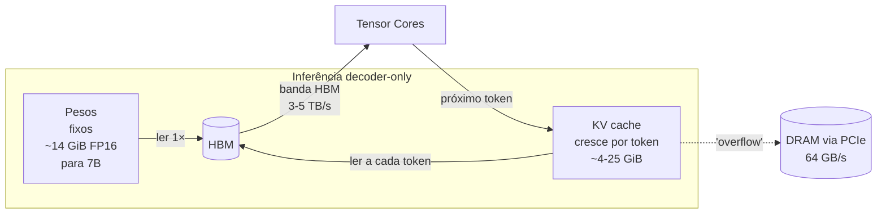
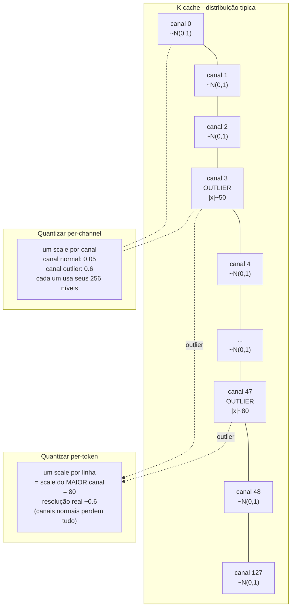
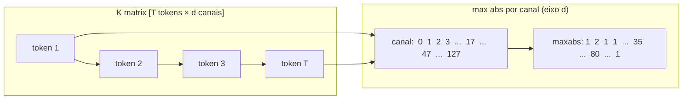
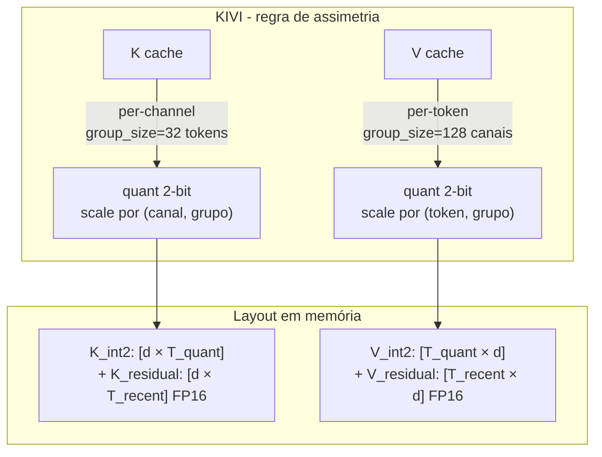
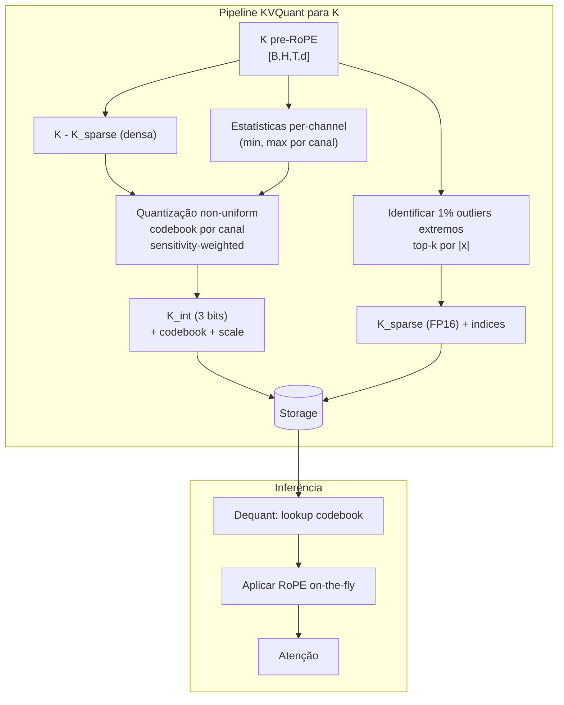
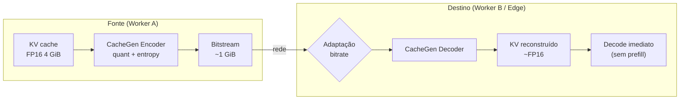
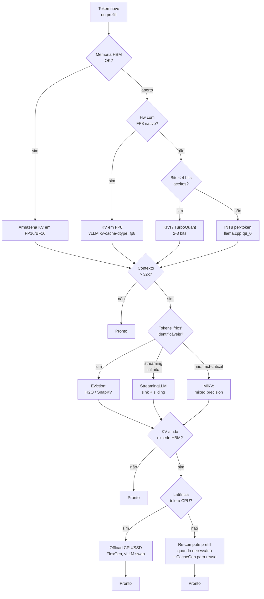

# Post 05 — Quantização de KV Cache: por que é diferente de quantizar pesos, e o que KIVI, KVQuant, CacheGen, GEAR & cia. fazem por dentro

> **Série:** *LLMs em profundidade — da atenção ao TurboQuant e além*  
> **Pré-requisitos:** [Post 03 — KV cache: anatomia, custos e PagedAttention/vLLM](./03-kv-cache-anatomia-pagedattention-vllm.md), [Post 04 — Quantização de pesos: GPTQ, AWQ, GGUF, bitsandbytes](./04-quantizacao-pesos-gptq-awq-gguf-bitsandbytes.md)  
> **Próximo:** Post 06 — *TurboQuant em profundidade: polar, JL e Lloyd–Max*

---

## TL;DR

- O **KV cache** é o que permite ao decoder gerar tokens em **O(1) por passo** (em vez de re-atender todo o histórico). Em troca, ele **cresce linearmente com o contexto** e, em janelas longas, **domina memória e largura de banda** — virando o verdadeiro gargalo da inferência.
- **Quantizar KV ≠ quantizar pesos.** Pesos são *offline*, *estáticos* e podem ser calibrados com paciência; o KV é *online*, *dinâmico*, *streaming*, com **distribuições que mudam por token e por canal**, **outliers brutais em K** (especialmente pós-RoPE) e **distribuições assimétricas entre K e V**.
- O baseline ingênuo — **INT8 per-token, per-head** — funciona bem até ~8 bits, **quebra abaixo de 4 bits** e **destrói 2 bits**. A pesquisa moderna gira em torno de **como contornar os outliers de K**.
- **KIVI** (ICML 2024) propõe a regra hoje canônica: **K per-channel, V per-token, 2 bits**, sem fine-tuning. **KVQuant** (NeurIPS 2024) adiciona **pre-RoPE quant**, **non-uniform** e **dense-and-sparse** para chegar a **<0,1 PPL** com 3 bits. **CacheGen** (SIGCOMM 2024) é a versão **rede**: codificar KV para **transferir** entre nós/edge.
- **GEAR**, **MiKV**, **ZipCache**, **Atom** exploram **erro residual low-rank**, **mixed precision por importância**, **saliência por token** e **fusão weight+act+KV em INT4** respectivamente.
- Na prática: **`llama.cpp`** expõe `-ctk` / `-ctv` (`q8_0`, `q5_1`, `q5_0`, `q4_1`, `q4_0`); **vLLM** expõe `--kv-cache-dtype fp8` (e INT8 em fila desde 2026); **TensorRT-LLM** explora **FP8 KV** em **Hopper** e **MLA-FP8** em **Blackwell**; **MLX** já tem implementações comunitárias com TurboQuant.
- Quantização **não é a única ferramenta**: **eviction** (H2O, SnapKV) e **streaming com sink tokens** (StreamingLLM) **descartam** ao invés de comprimir. Em produção, quase sempre se **combina** quantização + eviction + offload (CPU/SSD).
- **Spoiler do Post 06:** o **TurboQuant** ataca o problema por outro ângulo — ele **rotaciona** o vetor para coordenadas tipo polares (Beta-distribuída), aplica **Lloyd–Max por coordenada** e usa um **resíduo QJL** de 1 bit para garantir produto interno *não enviesado*. Resultado: **2–3 bits por entrada com perda quase nula**, sem calibração e *online*.

---

## 1. Recap: por que o KV cache é o vilão da memória em contexto longo

No [Post 03](./03-kv-cache-anatomia-pagedattention-vllm.md) vimos que cada camada de atenção, a cada token gerado, **escreve um par (K, V) por cabeça** no cache. O tamanho total é:

$$
\text{KV bytes} \;=\; 2 \cdot L \cdot N_{\text{kv}} \cdot d_{\text{head}} \cdot T \cdot B \cdot \text{bytes/elem}
$$

onde $L$ é o número de camadas, $N_{\text{kv}}$ o número de cabeças KV (ver MQA/GQA no [Post 02](./02-attention-mha-mqa-gqa-mla-flashattention.md)), $d_{\text{head}}$ a dimensão por cabeça, $T$ o número de tokens em contexto e $B$ o batch.

Para sentir a ordem de grandeza:

| Modelo | $L$ | $N_{\text{kv}}$ | $d_{\text{head}}$ | KV bytes/token (FP16) | KV @ 32k tokens |
|---|---:|---:|---:|---:|---:|
| Llama-3-8B (GQA 8) | 32 | 8 | 128 | **128 KiB** | **4 GiB** |
| Llama-3-70B (GQA 8) | 80 | 8 | 128 | **320 KiB** | **10 GiB** |
| Mistral-7B (GQA 8) | 32 | 8 | 128 | **128 KiB** | **4 GiB** |
| Qwen2.5-72B (GQA 8) | 80 | 8 | 128 | **320 KiB** | **10 GiB** |
| Llama-2-13B (MHA 40) | 40 | 40 | 128 | **800 KiB** | **25 GiB** |

Para um servidor real (batch >1, múltiplas requisições com contextos distintos, possivelmente 100k+ tokens), o **KV cache ultrapassa o peso do modelo**. É por isso que a literatura inteira de inferência se obceca por ele.

> **Analogia.** Os **pesos** são as *receitas* fixas de uma cozinha — você lê uma vez e pendura na parede. O **KV cache** são as *anotações de cada pedido em andamento* — toda vez que um cliente novo chega ou pede mais um prato, mais bilhetes vão para o quadro. Em uma noite cheia, o quadro fica maior que o livro de receitas.

E aqui entra o segundo agravante: **decode é memory-bound**. A cada token gerado, o GPU precisa **ler o KV inteiro** das camadas para calcular atenção. Se o KV cabe na **HBM** (banda ~3–5 TB/s nas GPUs atuais), tudo bem; se transborda para **CPU/PCIe** (~64 GB/s), a latência explode 50–100×. **Reduzir o tamanho** do KV é, portanto, **reduzir banda lida por token** — o que é praticamente equivalente a **acelerar decode**.



A questão deste post: **como reduzir o tamanho do KV em 2×, 4×, 8× ou mais sem destruir a qualidade da atenção?**

---

## 2. Quantizar KV ≠ quantizar pesos: as quatro razões

No [Post 04](./04-quantizacao-pesos-gptq-awq-gguf-bitsandbytes.md), vimos que quantização de pesos (GPTQ, AWQ, GGUF, NF4) é uma **otimização offline**: você tem o modelo treinado, um conjunto de calibração, **horas de CPU/GPU** para ajustar, e o resultado é um arquivo estático. Quantizar KV é um problema *radicalmente diferente*. Listemos as quatro razões.

### 2.1 É **online** — não há calibração offline

Cada par (K, V) é **produzido durante a inferência**, depende do prompt e dos tokens gerados até agora. **Não dá para ver o cache inteiro antes de decidir como codificá-lo** — precisamos quantizar **logo após produzir** o par e armazenar em memória.

Isso elimina técnicas de pesos como:

- **OBS / OBQ** (segunda ordem, Hessiana) — exige iteração sobre dataset.
- **AWQ** com escala por canal calibrada em *activations* representativas.
- **GPTQ** com correção iterativa por linha.

Sobram técnicas **data-free** ou **streaming** (running stats, transformações fixas, codebooks pré-computados).

### 2.2 Distribuições mudam **por token** e **por canal**

Para pesos, a distribuição é fixa: você calcula min/max ou percentis **uma vez** por linha/grupo. Para KV, a distribuição **muda a cada novo token** e, dentro do mesmo token, **muda drasticamente entre canais** (dimensões de $d_{\text{head}}$). Um esquema de quantização que use **um único par (scale, zero) por tensor** é desastroso.

Há dois "eixos de granularidade" possíveis:

- **per-token**: um par (scale, zero) por token (linha do tensor $K \in \mathbb{R}^{T \times d}$). Bom quando *outliers variam por canal mas não por token*.
- **per-channel**: um par (scale, zero) por canal (coluna). Bom quando *outliers vivem em canais específicos e atravessam todos os tokens*.

A pergunta-chave: **K e V têm o mesmo tipo de outlier?** Resposta da literatura: **não** — e essa observação é o coração de KIVI e KVQuant.

### 2.3 **Outliers em K**, especialmente pós-RoPE

Trabalhos empíricos (KIVI, KVQuant, MiKV) mostram repetidamente o mesmo padrão:

- **K** apresenta **outliers concentrados em alguns canais**: certas dimensões do head têm magnitudes 10–100× maiores que as demais, e **isso atravessa todos os tokens**.
- **V** é muito mais comportado: a distribuição é aproximadamente Gaussiana, **outliers ocorrem por token** (raros) mas não por canal.

Pior: o **RoPE** (Rotary Position Embedding) **mistura pares de canais com rotações dependentes da posição**. Aplicar RoPE *antes* de quantizar **embaralha** os outliers, espalhando-os por mais canais e arruinando a estrutura. Esse é o insight de KVQuant: **quantizar K ANTES do RoPE**, e aplicar RoPE durante a dequantização.



> **Analogia.** Imagine uma reunião gravada. **K per-token, scale por linha** é como **ajustar o ganho do microfone uma vez por minuto** — se um diretor grita uma vez, você precisa baixar o ganho de **todos** durante o minuto inteiro, e os sussurros somem. **K per-channel** é **ter um microfone individual por funcionário** com ganho próprio — o gritão tem ganho baixo, os sussurros têm ganho alto, ninguém perde resolução.

### 2.4 K e V são **assimétricos** — devem ser tratados de forma diferente

Por causa de §2.3, a regra moderna (KIVI) é:

| Tensor | Granularidade ideal | Justificativa |
|---|---|---|
| **K** | **per-channel** | outliers vivem em canais fixos, atravessam tokens |
| **V** | **per-token** | distribuição quase Gaussiana, outliers (se houver) são por token |

Isso parece simples mas tem um detalhe de **engenharia** sutil: per-channel para K significa que **as scales mudam a cada token novo** (porque você acabou de adicionar uma linha à matriz $K$, o que pode mudar min/max por coluna). KIVI resolve isso quantizando em **grupos de tokens** (group_size = 32 ou 64): você acumula 32 tokens em FP16, então os quantiza per-channel todos de uma vez, e o resíduo (tokens dentro do grupo atual) fica em FP16. É um *streaming quantizer* com **buffer**.

---

## 3. O baseline ingênuo: INT8 per-token

Antes dos métodos sofisticados, vamos ao **8-bit per-token, per-head**, que é o que o vLLM faz quando você passa `--kv-cache-dtype fp8` (variando apenas o tipo: FP8 simétrico ao invés de INT8 zero-point):

```python
def quantize_kv_int8_per_token(K_fp16):
    # K_fp16 : [batch, n_heads, T, d_head]
    abs_max = K_fp16.abs().amax(dim=-1, keepdim=True)   # [B,H,T,1]
    scale   = abs_max / 127.0
    K_int8  = (K_fp16 / scale).round().clamp(-128, 127).to(torch.int8)
    return K_int8, scale.to(torch.float16)             # scale fica em FP16

def dequantize_kv_int8_per_token(K_int8, scale):
    return K_int8.to(torch.float16) * scale
```

**Custo de armazenamento adicional**: 1 scale FP16 por (token, cabeça) = `2 bytes / (d_head * 1)` = ~1,5% para `d_head=128`. **Total**: 1 byte/elem + 1,5% overhead ≈ **~2× compressão sobre FP16**.

**Qualidade**: para INT8, a perda em PPL é tipicamente **<0,05** em qualquer modelo decente. **Por isso o FP8 KV em vLLM "simplesmente funciona"**. Mas:

- Em **4 bits** per-token, a perda em retrieval (Needle-in-a-Haystack, GSM8K) começa a ser visível (1–3 pontos).
- Em **2 bits** per-token, **colapso quase total** em qualquer benchmark não trivial.

A literatura quer **2–3 bits** com perda quase nula. Isso obriga a abandonar o per-token simétrico e atacar os outliers de K.

---

## 4. Outliers em K: o problema central

Vamos visualizar o que acontece. Para um Llama-7B com prompt do WikiText, KIVI mediu o `max abs` por canal, sobre milhares de tokens, e mostrou que **alguns canais (~5%) têm magnitude 5–50× maior que os demais — e essa identidade é estável**. Não é "o canal 17 é grande no token 42 e pequeno no token 43"; é "o canal 17 é grande SEMPRE".



Por que isso acontece? Hipóteses:

1. **Atenção sink tokens** (StreamingLLM): a softmax exige normalização para 1, então a rede aprende a **direcionar atenção residual** para alguns tokens iniciais. Para isso, alguns canais de K precisam ter magnitude alta nesses tokens.
2. **Funções "always-on"**: certos canais codificam features estruturais (ex.: "este token é pontuação", "este token é início de palavra") com sinal forte e estável.
3. **RoPE mistura ruído**: quando aplicado, RoPE rotaciona pares de canais e pode espalhar outliers, mas a *fonte* deles é pré-RoPE.

Consequências práticas:

- **Per-token quant** = catastrófico (ver §2.3).
- **Per-channel quant** = funciona bem, mas exige **buffer de tokens** ou **scales pré-computadas**.
- **Pre-RoPE quant** = preserva a estrutura "outliers em poucos canais fixos" — KVQuant ganha 0,5–1,0 PPL só com isso.
- **Dense-and-sparse** = remover ~1% dos pontos mais extremos e mantê-los em FP16 ajuda muito.

---

## 5. KIVI — per-channel para K, per-token para V (2 bits, tuning-free)

**Paper:** Liu, Yuan, Jin, Zhong, Xu, Braverman, Chen, Hu. *KIVI: A Tuning-Free Asymmetric 2bit Quantization for KV Cache.* ICML 2024. [arXiv:2402.02750](https://arxiv.org/abs/2402.02750). [Código: jy-yuan/KIVI](https://github.com/jy-yuan/KIVI).

KIVI é o **trabalho-chave** que estabeleceu, com clareza experimental brutal, a **regra de assimetria K/V** que praticamente todo paper subsequente respeita.

### 5.1 As três decisões de KIVI

1. **K per-channel**, **V per-token**, ambos **assimétricos** (com zero-point), **2 bits**.
2. **Group-wise** ao longo do eixo de quantização: para K, agrupa **32 ou 64 tokens** e quantiza per-channel sobre o bloco; para V, agrupa em FP16 até completar grupo e então quantiza per-token.
3. **Resíduo em FP16**: o "grupo atual" (parcialmente preenchido) fica em FP16 até completar.



A matriz mental que vale guardar:

|  | **eixo de quantização** | **eixo agrupado** | scale shape |
|---|---|---|---|
| **K** | per-canal (d) | grupos de tokens | `[d, n_groups]` |
| **V** | per-token | grupos de canais | `[T, n_g]` |

> **Analogia.** Pensa numa empresa que precisa documentar o que cada funcionário disse em cada reunião. **K per-channel = ajustar microfone por funcionário** (cada funcionário tem timbre/volume próprio que **não muda muito de reunião para reunião**). **V per-token = ajustar microfone por reunião** (cada reunião tem assunto diferente, e o "tom" da fala muda mais entre reuniões do que entre pessoas). KIVI explora exatamente essa assimetria.

### 5.2 Pseudocódigo KIVI (simplificado)

```python
def kivi_append_kv(K_new, V_new, k_quant, k_resid, v_quant, v_resid, gs_k=32, gs_v=128):
    # K_new, V_new : [B, H, 1, d_head]  (um token novo)

    k_resid = torch.cat([k_resid, K_new], dim=2)
    if k_resid.shape[2] >= gs_k:
        k_block, k_resid = k_resid[:, :, :gs_k], k_resid[:, :, gs_k:]
        scale = k_block.abs().amax(dim=2, keepdim=True) / (2**(2-1) - 1)
        zero  = k_block.amin(dim=2, keepdim=True)
        k_int = ((k_block - zero) / scale).round().clamp(0, 3).to(torch.uint8)
        k_quant.append((k_int, scale, zero))

    v_resid = torch.cat([v_resid, V_new], dim=2)
    if v_resid.shape[2] >= 1:
        v_token = v_resid[:, :, -1:, :]
        v_groups = v_token.view(*v_token.shape[:-1], -1, gs_v)
        scale = v_groups.abs().amax(dim=-1, keepdim=True) / (2**(2-1) - 1)
        zero  = v_groups.amin(dim=-1, keepdim=True)
        v_int = ((v_groups - zero) / scale).round().clamp(0, 3).to(torch.uint8)
        v_quant.append((v_int, scale, zero))

    return k_quant, k_resid, v_quant, v_resid
```

### 5.3 Resultados reportados

- **Compressão**: ~6,8× sobre FP16 do KV (2 bits + scale/zero overhead, group_size=32).
- **Memória pico**: 2,6× redução incluindo pesos.
- **Throughput**: 2,35×–3,47× sobre FP16, devido a maior batch.
- **Qualidade**: para Llama-2-7B, perda em PPL <0,2 e em LongBench <1 ponto.

A simplicidade conceitual é o ponto forte: **sem fine-tuning, sem calibração, sem dataset auxiliar**. Funciona "por construção".

---

## 6. KVQuant — pre-RoPE, non-uniform, dense-and-sparse (3 bits, <0,1 PPL)

**Paper:** Hooper, Kim, Mohammadzadeh, Mahoney, Shao, Keutzer, Gholami. *KVQuant: Towards 10 Million Context Length LLM Inference with KV Cache Quantization.* NeurIPS 2024. [arXiv:2401.18079](https://arxiv.org/abs/2401.18079). [Código: SqueezeAILab/KVQuant](https://github.com/squeezeailab/kvquant).

KVQuant *empilha* quatro ideias que se complementam.

### 6.1 As quatro ideias

1. **Per-channel K + per-token V** (mesmo princípio de KIVI).
2. **Pre-RoPE quantization para K**: quantizar K **antes** do RoPE. RoPE é uma rotação por blocos de 2 dimensões dependente da posição; aplicada *antes* da quantização, ela **espalha outliers** e estraga a estrutura per-channel. Aplicada *depois*, K mantém seus outliers limpos por canal e o RoPE é feito **on-the-fly na dequant**. **Ganho**: ~0,6 PPL em 3 bits.
3. **Non-uniform quantization (sensitivity-weighted)**: ao invés de níveis uniformes ($[-8, -7, ..., 7]$ para 4 bits), usar **codebooks treinados** com distância ponderada pela **sensibilidade do gradiente** de cada região do tensor. Regiões com gradiente alto (mais "sensíveis") ganham mais níveis. Lloyd-Max em espírito, mas com pesos.
4. **Dense-and-sparse** per-vector: isolar **~1% dos elementos extremos** como sparse FP16 (com índice) e quantizar **densamente** o restante. Isso "tira do plano" os outliers que sobreviveram à per-channel.



### 6.2 Resultados

- **3 bits**: <0,1 PPL de degradação em WikiText-2 e C4 para Llama, Llama-2, Llama-3, Mistral.
- **2 bits**: viável para sequências longas, com perda controlada.
- **Escala**: 1M tokens em LLaMA-7B em 1× A100-80GB; 10M tokens em 8× A100.
- **Custom CUDA kernels** com até 1,7× speedup.

KVQuant é o **state-of-the-art em qualidade** com 3 bits, ao custo de mais complexidade (codebooks, kernels específicos, manipulação pre-RoPE).

---

## 7. CacheGen — codificar KV para **transferência** (não só armazenamento)

**Paper:** Yuhan Liu et al. *CacheGen: KV Cache Compression and Streaming for Fast Large Language Model Serving.* SIGCOMM 2024. [arXiv:2310.07240](https://arxiv.org/abs/2310.07240). [Código: UChi-JCL/CacheGen](https://github.com/UChi-JCL/CacheGen).

Os trabalhos anteriores otimizam **compressão para HBM**. CacheGen ataca um problema diferente: **e se eu quiser mover KV entre máquinas?**

### 7.1 O cenário-problema

Em muitos sistemas reais (RAG, multi-turn cache, edge inference), o **mesmo prefixo** (documento, system prompt, contexto) é usado em **múltiplas requisições** ou **em múltiplas máquinas**. Recomputar o KV é caro (prefill quadrático). **Transferir** o KV via rede é mais barato — *mas só se ele for pequeno o suficiente*.

Um KV de 32k tokens × Llama-3-8B (FP16) = **4 GiB**. Mover 4 GiB pela rede leva ~32s em 1 Gbps — **inviável**. Em FP8 cai para 2 GiB (~16s). Ainda inviável. CacheGen mira **5–10×** menor.

### 7.2 As ideias

1. **Tensor encoder customizado** que explora **propriedades distribucionais do KV**: alta correlação entre tokens vizinhos, simetrias por canal, esparsidade local.
2. **Bitstream compacto**: quantização aritmética e códigos de Huffman/range, igual a codecs de vídeo.
3. **Adaptação dinâmica de bitrate**: ajusta nível de compressão ao throughput disponível (igual ABR de streaming de vídeo!).



### 7.3 Resultados

- **3,5–4,3× redução** no tamanho do KV.
- **3,2–3,7× redução** no tempo total de "fetch + processar contexto".
- Perda **negligível** em accuracy/PPL.

> **Analogia.** É a diferença entre **enviar o vídeo bruto da reunião** (RAW) e **enviar o vídeo codificado em H.265** com ABR — o conteúdo é o mesmo, mas a forma de transporte foi pensada para a rede, não para a fita magnética.

CacheGen tornou-se a **base do projeto LMCache** (sistema de KV cache distribuído para vLLM), que agora é parte do ecossistema de serving de LLMs em produção.

---

## 8. GEAR, MiKV, ZipCache, Atom (panorâmica rápida)

Família de trabalhos que **complementam** ou **rivalizam** com KIVI/KVQuant, cada um com um insight próprio.

### 8.1 GEAR — quantização densa + low-rank residual + sparse outliers

**Paper:** Kang et al. *GEAR: An Efficient KV Cache Compression Recipe for Near-Lossless Generative Inference of LLM.* ICML 2024 (Workshop). [arXiv:2403.05527](https://arxiv.org/abs/2403.05527). [Código: opengear-project/GEAR](https://github.com/opengear-project/GEAR).

Decomposição **tripla** do KV:

$$
\text{KV} \;=\; Q(\text{KV}) \;+\; UV^\top \;+\; S
$$

- $Q(\text{KV})$: quantização ultra-baixa (2–4 bits) da maioria.
- $UV^\top$: **resíduo low-rank** (rank ~8–16), aproxima erro estrutural.
- $S$: **sparse**, ~1% de outliers em FP16.

Resultados: **near-lossless 4-bit**, 2,38× throughput, 2,29× memória. É um *plug-and-play* sobre KIVI/Flexgen.

### 8.2 MiKV ("No Token Left Behind") — mixed precision por importância

**Paper:** Yang, Cha, Park, Kim, et al. *No Token Left Behind: Reliable KV Cache Compression via Importance-Aware Mixed Precision Quantization.* ICML 2024. [arXiv:2402.18096](https://arxiv.org/abs/2402.18096).

**Insight crítico**: trabalhos de eviction (H2O, SnapKV) **descartam** tokens menos importantes. MiKV mostra que esse descarte causa **alucinações** e **violações de segurança**. Solução: **manter tokens "menos importantes" em precisão mais baixa** (ex.: 2 bits) e **importantes em precisão alta** (ex.: 8 bits), em vez de descartar.

> "Não há token sem alma. Há tokens em INT2 e tokens em INT8."

### 8.3 ZipCache — saliency normalizada por token

**Paper:** Yu, Wang, Du, Niu, Tang. *ZipCache: Accurate and Efficient KV Cache Quantization with Salient Token Identification.* NeurIPS 2024. [arXiv:2405.14256](https://arxiv.org/abs/2405.14256).

Combina:
- **Channel-separable tokenwise quant**: scale per-token, mas separável por canal (compromisso entre per-token e per-channel, com menor overhead que per-channel puro).
- **Saliency**: usa **softmax attention scores normalizados** (corrigindo o viés do triângulo inferior) para identificar tokens "salientes" e dar-lhes mais bits.
- **Aproximação compatível com FlashAttention**: desacopla a saliência do cálculo full attention.

Resultados: 4,98× compressão, 0,38% de perda em GSM8K, 56,9% redução em latência decode.

### 8.4 Atom — "tudo em INT4" para serving

**Paper:** Zhao, Lin, Stoica, Cao. *Atom: Low-Bit Quantization for Efficient and Accurate LLM Serving.* MLSys 2024. [arXiv:2310.19102](https://arxiv.org/abs/2310.19102).

Diferente dos demais: Atom não é só sobre KV — é um **stack completo** que quantiza **pesos + ativações + KV todos em INT4**, com **kernels CUDA INT4** otimizados. Mixed-precision por grupo, fine-grained.

Resultados: **7,73× throughput** sobre FP16, **2,53×** sobre INT8.

### 8.5 Tabela comparativa: métodos de quantização KV

| Método | Bits típicos | Granularidade K | Granularidade V | Pre-RoPE? | Outliers extras | Calibração? | Qualidade reportada | Custo extra | Framework |
|---|---|---|---|---|---|---|---|---|---|
| **INT8 baseline** | 8 | per-token | per-token | — | — | não | <0,05 PPL | scale ~1,5% overhead | vLLM, llama.cpp |
| **FP8 (e4m3 / e5m2)** | 8 | per-tensor / per-token | idem | — | — | scale opcional | <0,1 PPL | nativo H100/H200 | vLLM, TRT-LLM |
| **KIVI** | 2 | per-channel + group=32 | per-token + group=128 | indiferente | resíduo FP16 do grupo atual | **não** | <0,2 PPL | buffer FP16 | impl. PyTorch ref |
| **KVQuant** | 3 (2 viável) | per-channel | per-token | **sim** | dense+sparse 1% FP16 | sim (sensitivity) | <0,1 PPL | codebook + sparse idx | CUDA kernel |
| **GEAR** | 4 (2 com erro recuperado) | per-channel | per-token | indif. | low-rank + sparse | parcial | near-lossless 4-bit | UV factor + S | PyTorch |
| **MiKV** | mixed 2/8 | mixed | mixed | indif. | mantém tudo em algum bit | importance score | **sem alucinação** | mapa de importância | PyTorch |
| **ZipCache** | 4 | channel-separable per-token | idem | indif. | saliência por token | softmax scores | 0,38% drop GSM8K | saliência | FlashAttn-compat |
| **Atom** | 4 (KV+W+A) | group-wise | group-wise | indif. | — | sim (W+A) | <0,5 PPL | INT4 kernel | custom serving |
| **TurboQuant** (Post 06) | 2–3 | rotacionado polar | idem | indif. | resíduo QJL 1-bit | **não** | near-zero IP loss | rotação WHT | MLX, llama.cpp PR |

**Como ler a tabela:**

- Se você quer **simples e estável** em produção hoje: **FP8** (vLLM/TRT-LLM em H100/H200) ou **INT8 per-token** (llama.cpp `q8_0`).
- Se você quer **2 bits sem fine-tuning**: **KIVI** ou **TurboQuant**.
- Se você quer **3 bits com qualidade quase intocada**: **KVQuant**.
- Se você precisa **transferir KV pela rede**: **CacheGen / LMCache**.
- Se você não pode tolerar **descarte de tokens** (segurança, RAG crítico): **MiKV**.

---

## 9. Implementações práticas: llama.cpp, vLLM, TensorRT-LLM, MLX

### 9.1 llama.cpp — `-ctk` e `-ctv`

`llama.cpp` adicionou KV quantization em duas ondas:

- **PR #2969** (2023): KV em `q8_0`, ~50% de RAM/VRAM economizada, perda imperceptível ([link](https://github.com/ggml-org/llama.cpp/pull/2969)).
- **PR #7412** (2024): suporte CUDA para `f16, q8_0, q4_0, q4_1, q5_0, q5_1` em K e V independentemente ([link](https://github.com/ggml-org/llama.cpp/pull/7412)).
- **PR #5684**: opções no servidor ([link](https://github.com/ggml-org/llama.cpp/pull/5684)).
- **PR #21038** (2025/2026): rotação Hadamard pré-quantização para reduzir outliers — ganhos significativos em q4/q5 ([link](https://github.com/ggml-org/llama.cpp/pull/21038)).
- **PR #21131** (2026): integração de **TurboQuant** com 4,57× compressão ([link](https://github.com/ggml-org/llama.cpp/pull/21131)).

Uso na CLI:

```bash
./llama-cli \
  -m models/Llama-3-8B-Instruct.Q4_K_M.gguf \
  -c 32768 \
  -ctk q4_0 -ctv q4_0 \
  -ngl 99 \
  -p "Você é um assistente útil. ..."
```

Os flags `-ctk` (cache type for K) e `-ctv` (cache type for V) aceitam: `f32, f16, bf16, q8_0, q4_0, q4_1, q5_0, q5_1, iq4_nl`.

#### Tabela: presets `ctk/ctv` do llama.cpp

| `ctk = ctv =` | bits/elem | tamanho relativo | qualidade típica | perda Needle/RAG | quando usar |
|---|---|---|---|---|---|
| `f16` | 16 | 100% | baseline | nenhuma | desenvolvimento, debug |
| `bf16` | 16 | 100% | ≈ f16 | nenhuma | mesmo, em hw que prefere bf16 |
| `q8_0` | 8 | 50% | perda imperceptível | nenhuma | **default recomendado** para produção |
| `q5_1` | 5,5 | 35% | perda <0,2 PPL | quase nenhuma | contextos médios (8–32k) |
| `q5_0` | 5,5 | 35% | perda ~0,3 PPL | quase nenhuma | idem |
| `q4_1` | 4,5 | 28% | perda ~0,5–1 PPL | leve em retrieval | contextos longos (>32k), MacBooks |
| `q4_0` | 4,5 | 28% | perda ~1–2 PPL | visível em RAG denso | quando KV é o gargalo absoluto |
| `iq4_nl` | 4 | 25% | perda ~0,5 PPL | aceitável | bom equilíbrio em GPU recente |

**Asymmetry trick**: na prática, **muitos usuários usam `-ctk q8_0 -ctv q4_0` ou `-ctv q5_1`**, refletindo o insight de KIVI: V tolera mais agressividade que K em per-token (porque V não tem outliers severos). O contrário (`-ctk q4_0 -ctv q8_0`) costuma ser pior.

> **Cuidado**: os formatos `qX_Y` em llama.cpp são **per-block** (tipicamente 32 ou 256 elementos por block, com 1 scale FP16 e às vezes 1 zero/min). **Não são per-channel** no sentido KIVI — eles agrupam ao longo da última dimensão (canais de uma cabeça). Para K isso ainda funciona razoavelmente porque os outliers per-channel ficam dentro de blocos de 32 e podem ter scale alto sem afetar todos os canais. **PR #21038** adiciona rotação Hadamard *antes* de quantizar exatamente para amortecer outliers — é a "ponte" entre o esquema simples de llama.cpp e a sofisticação de KVQuant/TurboQuant.

### 9.2 vLLM — `--kv-cache-dtype`

[Documentação oficial](https://docs.vllm.ai/en/latest/features/quantization/quantized_kvcache/).

Suporte estável (até v0.11+):
- `auto` (FP16/BF16 conforme o modelo).
- `fp8` (e4m3 padrão; e5m2 em algumas configurações). **Requer Hopper (H100/H200) ou Ada (L4/L40) para hardware nativo**; em GPUs antigas é emulado em software (sem ganho de banda).
- Em Issue #33480 (jan/2026): **INT8 KV cache** em desenvolvimento ativo, motivado por suportar A100/RTX 4090 (que não têm FP8 nativo).

```python
from vllm import LLM

llm = LLM(
    model="meta-llama/Meta-Llama-3-8B-Instruct",
    kv_cache_dtype="fp8",
    quantization="awq",
    max_model_len=32768,
)
```

A combinação `quantization="awq"` (pesos INT4) + `kv_cache_dtype="fp8"` (KV em 8 bits) é o **padrão de fato** para serving Llama-3-8B em uma única H100 com batch alto.

### 9.3 TensorRT-LLM — FP8 KV em Hopper, MLA-FP8 em Blackwell

NVIDIA [reportou](https://developer.nvidia.com/blog/nvidia-tensorrt-llm-enhancements-deliver-massive-large-language-model-speedups-on-nvidia-h200) que FP8 KV cache em H100/H200 entrega:

- ~2× redução de memória vs FP16.
- ~10k+ tokens/s/GPU em Llama-3-70B.
- Time-to-first-token <100ms em prompts médios.

A [PR #3004](https://github.com/NVIDIA/TensorRT-LLM/pull/3004) adicionou **MLA-FP8** para Blackwell — atenção latente multi-head com KV em FP8, foco em DeepSeek-V2/V3.

### 9.4 MLX — comunidade chegou primeiro

Apple ainda não inclui quantização de KV no MLX nativo, mas a **comunidade** já implementou:

- [mlx-turboquant (rachittshah)](https://github.com/rachittshah/mlx-turboquant): 4,6× compressão Llama-3.2-3B, cosine 0,997 a 4 bits.
- [turboquant-mlx (sharpner)](https://github.com/sharpner/turboquant-mlx): WHT rotation + assimetria K/V.
- [turboquant-mlx (DeadByDawn101)](https://github.com/DeadByDawn101/turboquant-mlx).

Em Apple Silicon, KV quantization é **especialmente crítica** porque:
- Memória unificada é finita (8/16/32/64/128 GB) — não há "swap para HBM extra".
- Banda CPU↔GPU não existe (mesmo chip), mas banda do controller é o limite.
- Em janelas longas, KV pode dobrar o footprint do modelo.

---

## 10. Alternativas: eviction (H2O, SnapKV) e StreamingLLM

Quantização **comprime** todos os tokens. Eviction **descarta** tokens menos úteis. São abordagens **complementares**.

### 10.1 H2O — Heavy Hitter Oracle

**Paper:** Zhang et al. *H2O: Heavy-Hitter Oracle for Efficient Generative Inference of Large Language Models.* NeurIPS 2023. [arXiv:2306.14048](https://arxiv.org/abs/2306.14048). [Código: FMInference/H2O](https://github.com/FMInference/H2O).

**Observação central**: numa atenção de qualquer cabeça, **uma fração pequena (~5–20%) dos tokens recebe a maior parte da massa de atenção** ao longo do tempo. Esses são os "heavy hitters" (H2). Tokens fora desse conjunto contribuem pouco.

**Política**: a cada passo, mantenha:
- **Tokens "recent"**: últimos *k* tokens (essenciais para coerência local).
- **Tokens "heavy"**: top-*m* por soma acumulada de attention scores.
- **Descarte** o resto.

Garantia: formulação como **sub-modular dinâmica**, com bounds de aproximação.

**Resultados**: 20% retidos → 29× throughput sobre HF/DS-Inference, 1,9× latência menor.

> **Analogia.** Numa empresa, jogue fora as atas de reuniões antigas que não tiveram impacto, mas mantenha **as atas das reuniões fundadoras** (decisões estratégicas que ainda guiam tudo) e **as últimas reuniões** (contexto operacional atual).

### 10.2 SnapKV — observation window

**Paper:** Li, Huang, Yang, et al. *SnapKV: LLM Knows What You are Looking for Before Generation.* NeurIPS 2024. [arXiv:2404.14469](https://arxiv.org/abs/2404.14469). [Código: FasterDecoding/SnapKV](https://github.com/FasterDecoding/SnapKV).

**Insight**: cada cabeça de atenção tem um **padrão estável de tokens importantes**, e esse padrão pode ser **detectado nos últimos tokens do prompt** (a "observation window"). A partir do prompt, SnapKV:

1. Roda o prefill normalmente.
2. Mede atenção da observation window aos demais tokens.
3. **Faz cluster** dos tokens importantes por cabeça.
4. Mantém só esses + a janela de observação.

**Resultados**: 8,2× memória, 3,6× speedup decode, 380k tokens em 1× A100-80GB com perda negligível em Needle-in-a-Haystack.

### 10.3 StreamingLLM — sink tokens + janela deslizante

**Paper:** Xiao, Tian, Chen, Han, Lewis. *Efficient Streaming Language Models with Attention Sinks.* ICLR 2024. [arXiv:2309.17453](https://arxiv.org/abs/2309.17453). [Código: mit-han-lab/streaming-llm](https://github.com/mit-han-lab/streaming-llm).

**Descoberta**: se você simplesmente desliza uma janela (descarta tokens antigos), **o modelo colapsa** mesmo dentro da janela treinada. Por quê? Porque a softmax **precisa** de algum lugar para "depositar" massa residual de atenção, e os **primeiros tokens** servem naturalmente como **dreno**. Se eles somem, a softmax explode em ruído.

**Solução**: mantenha sempre os **4 primeiros tokens** (os "**attention sinks**") + uma janela deslizante dos últimos *k*. Resultado: o modelo processa **4M+ tokens** sem degradação, **22× mais rápido** que o baseline naïve.

> **Analogia.** Numa empresa, mesmo descartando atas antigas, **mantenha sempre o contrato fundador da empresa**. É um documento que parece "irrelevante" para a operação diária, mas é o **referencial absoluto** que dá sentido a tudo. Sem ele, todas as discussões viram ruído.

### 10.4 Tabela: quantização vs eviction

| Categoria | Método | O que faz | O que descarta | Casos típicos | Cuidados |
|---|---|---|---|---|---|
| **Quant** | FP8 / INT8 | comprime todos os tokens | nada | produção genérica | precisa hw/scale |
| **Quant** | KIVI / KVQuant | comprime 2–3 bits assimétrico | nada | contexto longo, batch alto | overhead pequeno |
| **Quant** | TurboQuant (Post 06) | rotaciona + Lloyd-Max + QJL | nada | online, streaming | implementação |
| **Eviction** | H2O | mantém heavy + recent | tokens "frios" | dialogue, geração curta-média | pode perder fact distante |
| **Eviction** | SnapKV | clustering pela obs. window | tokens não-cluster | prompts muito longos, RAG | depende de prompt |
| **Streaming** | StreamingLLM | sink + sliding window | tudo fora da janela e fora dos sinks | streaming infinito (chatbot 24h) | esquece middle |
| **Mixed** | MiKV | mantém tudo, mas em precisão variável | nada (só rebaixa) | aplicações sensíveis (segurança, fact) | mais complexo |

A regra mental: **quantização preserva todos os tokens com perda controlada por bit; eviction descarta tokens em troca de zero perda nos remanescentes**. MiKV é o ponto intermediário ("não descarte; rebaixe").

---

## 11. Quando combinar: quantize + evict + offload

Em produção raramente se usa **só** uma técnica. O *playbook* moderno é uma **árvore de decisão** baseada no perfil da carga.



**Combinações canônicas**:

1. **vLLM em H100, Llama-3-70B, batch 32, contexto 8k**: AWQ pesos + FP8 KV. Sem eviction. Sem offload.
2. **llama.cpp em MacBook M3 Max, Llama-3-8B, contexto 32k**: GGUF Q5_K_M pesos + `-ctk q8_0 -ctv q4_0`. Sem eviction.
3. **Servidor multi-tenant, RAG com docs longos, batch alto**: AWQ + FP8 KV + **prefix caching** (vLLM) + **CacheGen** entre nós + **SnapKV** quando KV excede limite.
4. **Chatbot 24/7 com memória "ilimitada"**: FP8 KV + **StreamingLLM** + DB externo para "memória de longo prazo".
5. **Edge inference em Jetson / RK3588**: KIVI 2-bit + offload SSD + recomputar prefill quando contexto > capacidade.

A regra geral: **quantize primeiro** (sempre vale a pena), **evict** quando o contexto realmente cresce além do que cabe, **offload** quando até o evict é insuficiente, e **recomputar com CacheGen** quando você tem o luxo de armazenar prefixos comuns externamente.

---

## 12. Conclusão e ponte para o Post 06

Quantizar KV é **fundamentalmente diferente** de quantizar pesos. As ferramentas mais elegantes da literatura de pesos (GPTQ, AWQ, OBQ) **não funcionam aqui** — elas exigem dataset de calibração e processamento offline.

O que funciona:

1. **Aceitar a assimetria K/V**: K tem outliers persistentes em canais; V é comportado. → **K per-channel, V per-token** (KIVI).
2. **Não embaralhar a estrutura com RoPE antes de quantizar**: pre-RoPE preserva canais (KVQuant).
3. **Dar tratamento especial a outliers extremos**: dense-and-sparse (KVQuant), low-rank residual (GEAR), mixed precision (MiKV).
4. **Pensar em rede**: codificar para transferência (CacheGen).
5. **Combinar com eviction e streaming**: quantização não resolve sozinha contextos verdadeiramente longos.

Mas há uma **abordagem diferente** que ainda não exploramos. E se, em vez de tentar **adaptar a quantização à distribuição irregular** dos KVs, a gente **transformasse os KVs em algo cuja distribuição é conhecida e bem-comportada**? E se essa transformação fosse **barata** (rotação ortogonal, O(d log d) com FFT/Hadamard), **data-free**, e desse **garantias matemáticas** sobre o erro de produto interno?

Essa é a tese do **TurboQuant** (Zandieh et al., 2025). A ideia é:

1. **Rotacionar aleatoriamente** o vetor K/V por uma matriz Hadamard randomizada — em alta dimensão isso aproxima as coordenadas de uma **distribuição Beta** (concentração esférica, "polar").
2. Em coordenadas Beta, **Lloyd–Max por coordenada** atinge taxa-distorção quase ótima.
3. Mas Lloyd–Max otimiza MSE; produto interno fica **enviesado**. Solução: um **resíduo de 1 bit por coordenada** via **Quantized Johnson–Lindenstrauss (QJL)** que **corrige o viés** sem custo de armazenamento relevante.

Resultado: **2–3 bits por entrada** com **perda de produto interno quase nula**, **sem calibração**, **online**. Perfeito para KV cache, mas com aplicação também em **vetores de busca (RAG)**.

> **No próximo post, mergulhamos no TURBOQUANT: por que representar KV em coordenadas polares pode ser uma virada de jogo, com prova matemática e teste prático.**

---

## Referências

### Papers — quantização de KV cache

- **KIVI**. Liu, Yuan, Jin, Zhong, Xu, Braverman, Chen, Hu. *KIVI: A Tuning-Free Asymmetric 2bit Quantization for KV Cache.* ICML 2024. [arXiv:2402.02750](https://arxiv.org/abs/2402.02750) · [Código](https://github.com/jy-yuan/KIVI) · [ICML page](https://proceedings.mlr.press/v235/liu24bz.html)
- **KVQuant**. Hooper, Kim, Mohammadzadeh, Mahoney, Shao, Keutzer, Gholami. *KVQuant: Towards 10 Million Context Length LLM Inference with KV Cache Quantization.* NeurIPS 2024. [arXiv:2401.18079](https://arxiv.org/abs/2401.18079) · [Código](https://github.com/SqueezeAILab/KVQuant)
- **CacheGen**. Y. Liu et al. *CacheGen: KV Cache Compression and Streaming for Fast LLM Serving.* SIGCOMM 2024. [arXiv:2310.07240](https://arxiv.org/abs/2310.07240) · [Código](https://github.com/UChi-JCL/CacheGen) · [Microsoft Research](https://www.microsoft.com/en-us/research/publication/cachegen-fast-context-loading-for-language-model-applications-via-kv-cache-streaming/)
- **GEAR**. Kang et al. *GEAR: An Efficient KV Cache Compression Recipe for Near-Lossless Generative Inference of LLM.* ICML Workshop 2024 / COLM 2024. [arXiv:2403.05527](https://arxiv.org/abs/2403.05527) · [Código](https://github.com/opengear-project/GEAR)
- **MiKV**. Yang et al. *No Token Left Behind: Reliable KV Cache Compression via Importance-Aware Mixed Precision Quantization.* ICML 2024. [arXiv:2402.18096](https://arxiv.org/abs/2402.18096) · [OpenReview](https://openreview.net/forum?id=35mZgOWGNO)
- **ZipCache**. Yu, Wang, Du, Niu, Tang. *ZipCache: Accurate and Efficient KV Cache Quantization with Salient Token Identification.* NeurIPS 2024. [arXiv:2405.14256](https://arxiv.org/abs/2405.14256)
- **Atom**. Zhao, Lin, Stoica, Cao. *Atom: Low-Bit Quantization for Efficient and Accurate LLM Serving.* MLSys 2024. [arXiv:2310.19102](https://arxiv.org/abs/2310.19102) · [SyFI Lab](https://syfi.cs.washington.edu/publications/atom/)

### Papers — eviction e streaming

- **H2O**. Zhang et al. *H2O: Heavy-Hitter Oracle for Efficient Generative Inference of Large Language Models.* NeurIPS 2023. [arXiv:2306.14048](https://arxiv.org/abs/2306.14048) · [Código](https://github.com/FMInference/H2O)
- **SnapKV**. Li, Huang, Yang et al. *SnapKV: LLM Knows What You are Looking for Before Generation.* NeurIPS 2024. [arXiv:2404.14469](https://arxiv.org/abs/2404.14469) · [Código](https://github.com/FasterDecoding/SnapKV)
- **StreamingLLM**. Xiao, Tian, Chen, Han, Lewis. *Efficient Streaming Language Models with Attention Sinks.* ICLR 2024. [arXiv:2309.17453](https://arxiv.org/abs/2309.17453) · [Código](https://github.com/mit-han-lab/streaming-llm) · [Blog hanlab](https://hanlab.mit.edu/blog/streamingllm)

### Documentação de frameworks

- **vLLM** — Quantized KV Cache: [docs.vllm.ai/.../quantized_kvcache](https://docs.vllm.ai/en/latest/features/quantization/quantized_kvcache/) · Engine args: [docs.vllm.ai/.../engine_args](https://docs.vllm.ai/en/latest/configuration/engine_args/) · Issue INT8 KV: [#33480](https://github.com/vllm-project/vllm/issues/33480)
- **llama.cpp** — KV q8_0 PR: [#2969](https://github.com/ggml-org/llama.cpp/pull/2969) · CUDA quant KV demo: [#7412](https://github.com/ggml-org/llama.cpp/pull/7412) · server `-ctk/-ctv`: [#5684](https://github.com/ggml-org/llama.cpp/pull/5684) · Hadamard rotation: [#21038](https://github.com/ggml-org/llama.cpp/pull/21038) · TurboQuant integration: [#21131](https://github.com/ggml-org/llama.cpp/pull/21131)
- **TensorRT-LLM** — MLA FP8 KV (Blackwell) PR: [#3004](https://github.com/NVIDIA/TensorRT-LLM/pull/3004)
- **NVIDIA Technical Blog** — *NVIDIA TensorRT-LLM Enhancements Deliver Massive LLM Speedups on H200*: [link](https://developer.nvidia.com/blog/nvidia-tensorrt-llm-enhancements-deliver-massive-large-language-model-speedups-on-nvidia-h200) · *5× Faster TTFT with KV Cache Early Reuse*: [link](https://developer.nvidia.com/blog/5x-faster-time-to-first-token-with-nvidia-tensorrt-llm-kv-cache-early-reuse/) · *H200 + TRT-LLM MLPerf records*: [link](https://developer.nvidia.com/blog/nvidia-h200-tensor-core-gpus-and-nvidia-tensorrt-llm-set-mlperf-llm-inference-records/)
- **MLX comunidade** — TurboQuant em MLX: [rachittshah/mlx-turboquant](https://github.com/rachittshah/mlx-turboquant) · [DeadByDawn101/turboquant-mlx](https://github.com/DeadByDawn101/turboquant-mlx) · [sharpner/turboquant-mlx](https://github.com/sharpner/turboquant-mlx) · Towards AI write-up: [Breaking the Memory Wall](https://towardsai.net/p/machine-learning/breaking-the-memory-wall-turboquant-kv-cache-quantization-on-apple-silicon)
- **LMCache** (CacheGen evoluído como sistema): [github.com/LMCache/LMCache](https://github.com/LMCache/LMCache)

### Posts da série

- [00 — Índice](./00-INDEX.md)
- [03 — KV cache: anatomia, custos e PagedAttention/vLLM](./03-kv-cache-anatomia-pagedattention-vllm.md)
- [04 — Quantização de pesos: GPTQ, AWQ, GGUF, bitsandbytes](./04-quantizacao-pesos-gptq-awq-gguf-bitsandbytes.md)
- **(próximo)** [06 — TurboQuant em profundidade: polar, JL e Lloyd–Max](./06-turboquant-deep-dive-polar-jl-lloydmax.md)
