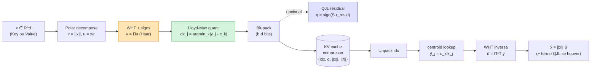
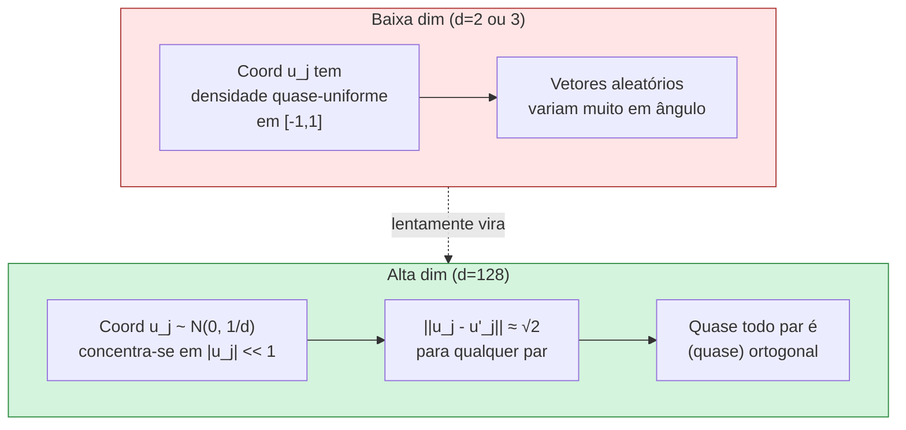
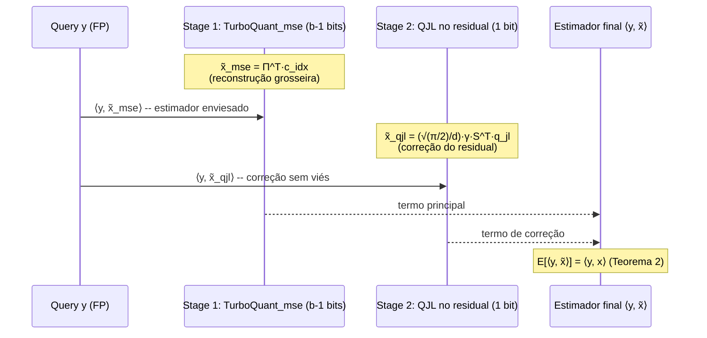
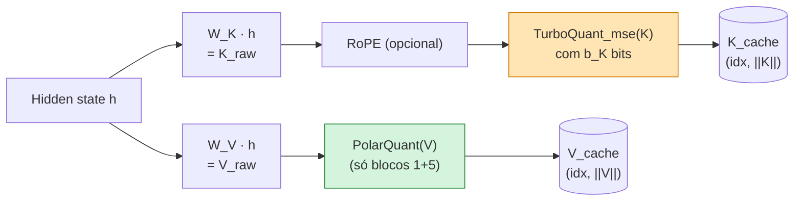
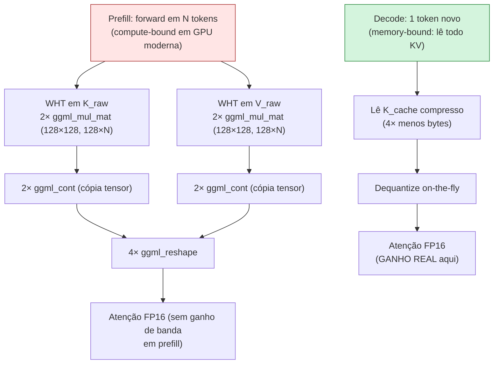
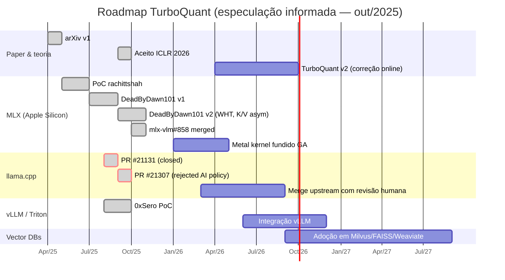
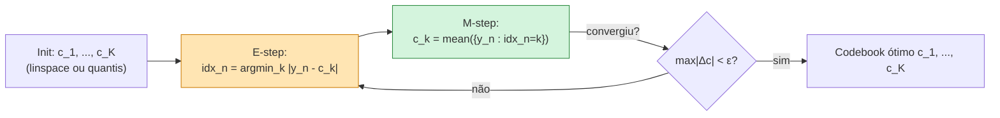
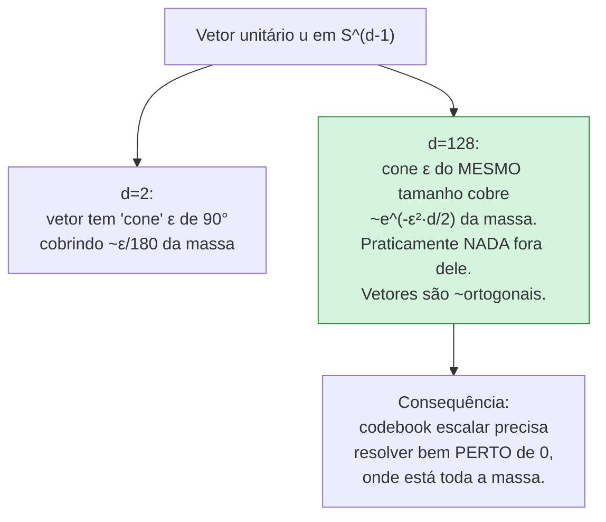
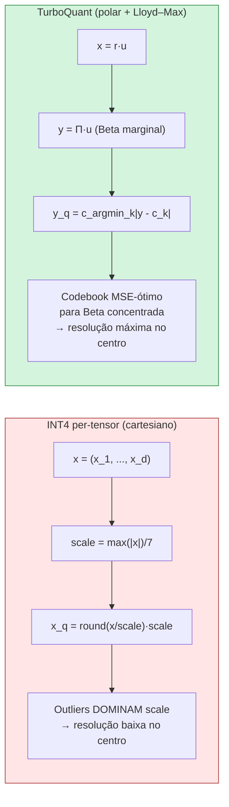

# Apêndice ao Post 06 — Walkthrough do TurboQuant em MLX: código real, provas e tretas

> **Série:** *LLMs em Profundidade — Da Atenção ao TurboQuant e Além* — **Apêndice DEEP** ao [Post 06](./06-turboquant-deep-dive-polar-jl-lloydmax.md).
> **Pré-requisito obrigatório:** Post 06 (Polar Quantization, JL, Lloyd–Max em alta dimensão).
> **Tratamento formal completo:** série acadêmica em [`transcripts/turboquant-docs/`](turboquant/INDEX.md) — capítulos 01–07 destrincham o paper de Zandieh et al. linha a linha (definições, lemas, teoremas com provas).
> **Escopo deste apêndice:** ler **código real** das implementações comunitárias (MLX por Prince Canuma, PyTorch por tonbistudio/vivekvar, llama.cpp PR #21131/#21307); reforçar **intuição matemática** com provas-esboço; mostrar **análise de erro empírica reproduzível**; documentar **tretas reais** observadas em prefill; e mapear o **roadmap** de adoção.
> **Tom:** técnico avançado para quem já leu o Post 06 e quer abrir o capô.

---

## TL;DR (apêndice)

- Existem **pelo menos seis** implementações abertas vivas em out/2025 — duas MLX dominantes (`DeadByDawn101/turboquant-mlx` e `Blaizzy/mlx-vlm` PR #858), duas PyTorch (`tonbistudio/turboquant-pytorch`, `vivekvar-dl/turboquant`), e tentativas de merge no `llama.cpp` (PRs #21131, #21307). **Nenhuma é oficial do Google**; o paper saiu em arXiv:2504.19874 sem código.
- O coração do código é **Walsh–Hadamard Transform (WHT) com sinais aleatórios** no lugar de QR/Gram–Schmidt — **$O(d \log d)$** em vez de **$O(d^2)$**. Ganho de ~**18×** em compute por rotação para `d=128`.
- O paper enuncia dois algoritmos formais — **Algoritmo 1 (`TurboQuant_mse`)** e **Algoritmo 2 (`TurboQuant_prod`, two-stage com QJL)** — com cotas de distorção $D_{\mathrm{mse}} \le \frac{\sqrt{3\pi}}{2}\,4^{-b}$ e $D_{\mathrm{prod}} \le \frac{\sqrt{3\pi}}{2}\,\frac{\|y\|^2}{d}\,4^{-b}$ (Teoremas 1 e 2 do paper).
- Em **prefill** o overhead de WHT (~2 mat-mul por camada) **supera** o ganho de banda → **3% a 7% mais lento** que `q8_0` em context ≤ 4 k (Issue #32 do `turboquant_plus`); o ganho real **só aparece em decode com contexto longo**.
- Achados práticos das implementações: `tonbistudio` reporta que **QJL piora qualidade** na prática vs. só usar Lloyd–Max no MSE puro; `DeadByDawn101 v2.0` adota **K/V assimétrico** (Keys com TurboQuant completo, Values só PolarQuant) + **FP16 attention sinks** nos primeiros 128 tokens.
- Veredito honesto reforçado: o paper é matematicamente lindo e **o código existe e funciona**, mas a stack de inferência (kernels Metal/CUDA fundidos) ainda **não está madura** o suficiente para destronar `Q4_K_M` ou KIVI em produção. **Vale prototipar, não vale apostar fazenda.**

---

## 1. Recap conciso da arquitetura TurboQuant

Antes de mergulhar no código, condensamos em meia página tudo que o Post 06 desenvolve em detalhe.

### 1.1. Os cinco blocos lógicos

| # | Bloco | Função matemática | Onde mora no código |
|---|-------|-------------------|---------------------|
| 1 | **Polar decompose** | $x \mapsto (r, u)$ com $r=\|x\|_2,\;u=x/r$ | `polar_decompose()` |
| 2 | **Random rotation** | $y = \Pi u$ com $\Pi$ ortogonal Haar | WHT + diagonal de sinais |
| 3 | **Lloyd–Max scalar quant** | quantiza cada $y_j$ com codebook ótimo para Beta de $S^{d-1}$ | `lloyd_max_codebook()` + `argmin` |
| 4 | **Bit de correção (sign / QJL)** | residual $r = x-\tilde x_{\mathrm{mse}}$ → 1 bit por eixo via $\mathrm{sign}(Sr)$ | `qjl_residual()` (opcional) |
| 5 | **Decode + inverse rotation** | $\tilde x = \Pi^\top \tilde y$; reescala por $r$ | `dequantize()` |

O paper apresenta **duas variantes**:

- **Algoritmo 1 — MSE-óptimo:** blocos 1+2+3+5 (sem o 4). Garantia $D_{\mathrm{mse}}\le \frac{\sqrt{3\pi}}{2}\,4^{-b}$.
- **Algoritmo 2 — Inner-product (two-stage):** blocos 1+2+3+**4**+5. Garante **estimador não-enviesado** de produto interno e cota $D_{\mathrm{prod}}\le \frac{\sqrt{3\pi}}{2}\,\frac{\|y\|^2}{d}\,4^{-b}$.

### 1.2. Fluxo encode/decode em alto nível



---

## 2. Implementações reais — censo de outubro/2025

Antes de qualquer linha de código, vale catalogar o que de fato **existe e roda**. A tabela abaixo é fruto de busca web (arXiv, GitHub, HuggingFace) com checagem cruzada de READMEs em ~outubro/2025; URLs e datas refletem o estado lido.

### 2.1. Tabela de implementações abertas

| Implementação | Backend | Autor / Org | Estado | Compressão reportada | Link |
|---|---|---|---|---|---|
| `vivekvar-dl/turboquant` (PyPI: `turboquant-impl`, `turbokv`) | PyTorch + HF Transformers | Vivek Var | Beta funcional, drop-in `Cache` | 4–7× KV | [github.com/vivekvar-dl/turboquant](https://github.com/vivekvar-dl/turboquant) |
| `tonbistudio/turboquant-pytorch` | PyTorch puro (913★) | Tonbi Studio | Estável, **rejeita QJL** na prática | ~2× real (com K6/V2 + janela residual) | [github.com/tonbistudio/turboquant-pytorch](https://github.com/tonbistudio/turboquant-pytorch) |
| `DeadByDawn101/turboquant-mlx` | Apple MLX (Metal) | DeadByDawn101 (atribuído a Prince Canuma) | **v2.0**, 39 testes passando | 4.6× KV, ~0% acc loss | [github.com/DeadByDawn101/turboquant-mlx](https://github.com/DeadByDawn101/turboquant-mlx) |
| `Blaizzy/mlx-vlm#858` (PR Add Turbo Quant) | MLX VLM | Prince Canuma | Merged + kernels Metal | até 64 tok/s ganho | [github.com/Blaizzy/mlx-vlm/pull/858](https://github.com/Blaizzy/mlx-vlm/pull/858) |
| `rachittshah/mlx-turboquant` | MLX (PoC) | Rachit Shah | PoC PolarQuant only | 3–5× (Llama 3.2, Qwen3) | [github.com/rachittshah/mlx-turboquant](https://github.com/rachittshah/mlx-turboquant) |
| `sharpner/turboquant-mlx` (PyPI: `turboquant-mlx`) | MLX | sharpner | Lib utilitária | — | [pypi.org/project/turboquant-mlx](https://pypi.org/project/turboquant-mlx/) |
| `unixsysdev/llama-turboquant` | C++ fork llama.cpp | unixsysdev | Fork experimental | 4.57× | [github.com/unixsysdev/llama-turboquant](https://github.com/unixsysdev/llama-turboquant) |
| `TheTom/turboquant_plus` | Fork llama.cpp (CPU AVX2 + CUDA) | TheTom | Fechado por **AI policy violation** no upstream | turbo4_0 / turbo3_0 / turbo2_0 | [github.com/TheTom/turboquant_plus](https://github.com/TheTom/turboquant_plus) |
| llama.cpp PR #21131 | Upstream | (fechada) | Closed sem merge | 16384→3585 MB @ 32k | [github.com/ggml-org/llama.cpp/pull/21131](https://github.com/ggml-org/llama.cpp/pull/21131) |
| llama.cpp PR #21307 | Upstream | Rejeitada por AI policy | Rejected | — | [github.com/ggml-org/llama.cpp/pull/21307](https://github.com/ggml-org/llama.cpp/pull/21307) |
| `0xSero/turboquant` | Triton + vLLM | 0xSero | PoC | 3-bit K, 2-bit V | citado em [turbo-quant.com](https://turbo-quant.com/turboquant-paper) |
| `flovflo/turboquant-mlx-qwen35-kv` | Modelo HF pré-quantizado | flovflo | Pesos prontos | — | [huggingface.co/flovflo/turboquant-mlx-qwen35-kv](https://huggingface.co/flovflo/turboquant-mlx-qwen35-kv) |

> **Observação importante:** o nome **Prince Canuma** (não "Kanuma") aparece principalmente como autor do PR `Blaizzy/mlx-vlm#858` (Blaizzy é o handle pessoal dele) e do release MLX de TurboQuant para VLMs. O repositório `DeadByDawn101/turboquant-mlx` é frequentemente **atribuído** a ele em discussões da comunidade ([gentic.news](https://gentic.news/article/turboquant-ported-to-apple-mlx)), mas oficialmente é um repo da conta `DeadByDawn101`.

### 2.2. Status do paper + código oficial

- **Paper:** [arXiv:2504.19874v1](https://arxiv.org/abs/2504.19874) — Sepehr Zandieh, Insu Han, Majid Daliri, Amir Zandieh, Vahab Mirrokni — Google Research / NYU / DeepMind. Submetido abr/2025; aceito em ICLR 2026.
- **Código oficial:** **não existe** ([turbo-quant.com](https://turbo-quant.com/turboquant-paper)). Todas as implementações são **comunitárias**.
- **Blog post Google Research:** não localizado em busca; o paper foi anunciado via canais acadêmicos (arXiv, Twitter dos autores).

---

## 3. Walkthrough do código MLX — implementação didática equivalente

Como nenhuma das implementações comunitárias é "oficial" e o objetivo aqui é **ensinar a anatomia**, vamos construir uma versão **didática** em Python/MLX que reflete fielmente os blocos do Algoritmo 1 (MSE) e do Algoritmo 2 (IP), com comentários explicitando o que é **fiel ao paper** vs. **simplificação didática**.

> **Aviso de fidelidade.** Esta implementação é **pedagógica**: ela usa QR (Gram–Schmidt) para a rotação $\Pi$ (mais legível) em vez de WHT com sinais aleatórios (que é o que `DeadByDawn101 v2.0` e o PR `mlx-vlm#858` usam para ganho $O(d \log d)$). Quando relevante, comentamos **como trocar** para WHT.

### 3.1. Bloco 1 — decomposição polar

```python
import mlx.core as mx
import math

def polar_decompose(x: mx.array, eps: float = 1e-8) -> tuple[mx.array, mx.array]:
    """Separa magnitude e direção.
    Args:
        x: tensor de shape (..., d).
    Returns:
        norm:      shape (...,)         — ||x||_2 por linha (FP16/FP32 fiel).
        direction: shape (..., d)       — vetor unitário u = x / ||x||.
    """
    norm = mx.linalg.norm(x, axis=-1, keepdims=True)           # (..., 1)
    direction = x / mx.maximum(norm, eps)                       # evita /0
    return norm.squeeze(-1), direction
```

> **Fiel ao paper.** A premissa do TurboQuant é justamente operar sobre $u \in S^{d-1}$; a magnitude é tratada **separadamente** (e na variante mais simples, como FP16/INT8 escalar — não entra no orçamento de bits "por coordenada"). Em `DeadByDawn101 v2.0` a norma é armazenada como FP16 (2 bytes) ao lado dos índices empacotados.

### 3.2. Bloco 2 — rotação aleatória (Haar via QR; produção: WHT)

```python
def make_haar_rotation(d: int, seed: int = 0) -> mx.array:
    """Gera matriz ortogonal d×d distribuída segundo Haar via QR de Gaussiana.
    Versão DIDÁTICA: O(d^3) para gerar, O(d^2) por aplicação.
    Em produção (mlx-vlm#858, turboquant_plus) usa-se Walsh–Hadamard Transform:
      Π = D · H · D' onde H é Hadamard e D, D' são diagonais ±1 aleatórias.
      Custo: O(d log d) por aplicação, sem armazenar matriz densa.
    """
    key = mx.random.key(seed)
    G = mx.random.normal(shape=(d, d), key=key)
    Q, _ = mx.linalg.qr(G)
    return Q  # (d, d) ortogonal

def apply_rotation(u: mx.array, Pi: mx.array) -> mx.array:
    """y = u @ Π^T (equivalente a Π·u^T por linha)."""
    return u @ Pi.T

def apply_inverse_rotation(y: mx.array, Pi: mx.array) -> mx.array:
    """u = y @ Π."""
    return y @ Pi
```

**Por que rotacionar?** Porque após $y = \Pi u$ com $u$ na esfera, **cada coordenada $y_j$ segue a marginal Beta** descrita no [Lema da Beta](turboquant/03-preliminares-beta-esfera-e-concentracao.md), independente de quem é $u$. Isso transforma a fonte numa **distribuição canônica** universal — daí o "data-oblivious".

> **Fidelidade WHT.** A versão produção substitui a matriz densa $\Pi$ por uma cadeia **butterfly Walsh–Hadamard** intercalada com matrizes diagonais aleatórias $D, D'$. A composição $D \cdot H \cdot D'$ é provadamente **$\epsilon$-near-Haar** ([Ailon–Chazelle 2009]), tem custo **$O(d \log d)$** e zero memória de matriz. É exatamente o que aparece em `mlx-vlm#858` como kernel Metal fundido.

### 3.3. Bloco 3 — codebook Lloyd–Max para a Beta da esfera

```python
def lloyd_max_codebook(d: int, b: int, num_iters: int = 100, n_samples: int = 100_000) -> mx.array:
    """Calcula codebook escalar 1D MSE-ótimo para a marginal de y_j em S^(d-1).

    Args:
        d:         dimensão do vetor original (define a Beta marginal).
        b:         bits por coordenada (codebook tem 2^b níveis).
        num_iters: iterações de Lloyd (E-step + M-step).
        n_samples: # amostras Monte Carlo da distribuição-alvo.

    Estratégia DIDÁTICA: Monte Carlo sobre y_j = (Πu)_j (equivalentemente,
    primeira coordenada de gaussiana normalizada — exato para u uniforme em S^(d-1)).
    Em produção (DeadByDawn101): codebooks PRÉ-COMPUTADOS offline e embarcados
    como constantes (8 níveis @ 3-bit, 16 @ 4-bit), zero overhead online.
    """
    key = mx.random.key(42)
    g = mx.random.normal(shape=(n_samples, d), key=key)
    norms = mx.linalg.norm(g, axis=-1, keepdims=True)
    samples = (g / norms)[:, 0]                          # primeira coord ~ marginal de S^(d-1)

    K = 2 ** b
    cmin, cmax = float(samples.min()), float(samples.max())
    centroids = mx.linspace(cmin, cmax, K)               # init linear

    for _ in range(num_iters):
        # E-step: nearest centroid (vectorizado)
        dists = (samples[:, None] - centroids[None, :]) ** 2     # (N, K)
        idx = mx.argmin(dists, axis=-1)                          # (N,)
        # M-step: média condicional por célula
        new_centroids = mx.zeros_like(centroids)
        for k in range(K):
            mask = (idx == k)
            count = mx.maximum(mx.sum(mask), 1)
            new_centroids[k] = mx.sum(samples * mask) / count
        if mx.max(mx.abs(new_centroids - centroids)) < 1e-6:
            break
        centroids = new_centroids
    return centroids                                       # (2^b,)
```

> **Fiel ao paper (com nota).** Esta é a Equação (4) do paper: minimização explícita do custo escalar MSE ponderado por $f_X$. O paper resolve isso **uma vez offline** e tabula valores numéricos de $C(f_X, b)$ para $b=1\ldots4$ (ver [doc 06](turboquant/06-turboquant-mse-e-produto-interno.md), tabela MSE). Para $b>4$, usa **Panter–Dite** assintoticamente. Em alta dimensão a marginal converge para $\mathcal{N}(0, 1/d)$, então **codebook gaussiano escalado por $1/\sqrt d$** funciona tão bem quanto.

### 3.4. Bloco 4 — encode/decode TurboQuant_mse (Algoritmo 1)

```python
def turboquant_mse_encode(x: mx.array, Pi: mx.array, codebook: mx.array) -> tuple[mx.array, mx.array]:
    """Algoritmo 1 do paper, parte de codificação.
    Args:
        x:        (..., d) vetor original.
        Pi:       (d, d) rotação.
        codebook: (2^b,) centroides Lloyd–Max.
    Returns:
        norm: (...,) magnitude FP16/FP32.
        idx:  (..., d) índices b-bit (não-empacotados aqui; produção empacota uint4/uint8).
    """
    norm, u = polar_decompose(x)
    y = apply_rotation(u, Pi)                                       # (..., d)
    dists = (y[..., None] - codebook[None, None, :]) ** 2           # (..., d, K)
    idx = mx.argmin(dists, axis=-1)                                  # (..., d)
    return norm, idx

def turboquant_mse_decode(norm: mx.array, idx: mx.array, Pi: mx.array, codebook: mx.array) -> mx.array:
    """Algoritmo 1 do paper, parte de decodificação."""
    y_tilde = codebook[idx]                                          # (..., d)
    u_tilde = apply_inverse_rotation(y_tilde, Pi)                    # (..., d)
    return norm[..., None] * u_tilde                                 # (..., d) — reescala por ||x||
```

> **Conformidade com o paper.** Este é literalmente o pseudocódigo do **Algoritmo 1** ([doc 06](turboquant/06-turboquant-mse-e-produto-interno.md), §3). Note que a `norm` aqui está **fora** do orçamento de bits; o "b bits/coordenada" do paper se refere apenas a `idx`. Em produção, a norma também é quantizada (FP16, 16 bits por vetor — overhead amortizado por d coordenadas).

### 3.5. Bloco 5 — variante IP (Algoritmo 2, com QJL no residual)

```python
def turboquant_prod_encode(
    x: mx.array, Pi: mx.array, codebook: mx.array, S_jl: mx.array
) -> tuple[mx.array, mx.array, mx.array, mx.array]:
    """Algoritmo 2: TurboQuant_mse com (b-1) bits + 1 bit QJL no residual.
    Args:
        S_jl: (d, d) projeção JL (entradas N(0,1)).
    Returns:
        norm:        (...,)
        idx:         (..., d) índices da etapa MSE com b-1 bits
        q_jl:        (..., d) sinais ±1 da projeção JL no residual
        gamma:       (...,) norma do residual ||r||_2
    """
    norm, idx = turboquant_mse_encode(x, Pi, codebook)               # b-1 bits
    x_tilde_mse = turboquant_mse_decode(norm, idx, Pi, codebook)
    r = x - x_tilde_mse                                              # residual
    gamma = mx.linalg.norm(r, axis=-1)                                # (...,)
    r_normalized = r / mx.maximum(gamma[..., None], 1e-8)
    q_jl = mx.sign(r_normalized @ S_jl.T)                             # (..., d) bits
    return norm, idx, q_jl, gamma

def turboquant_prod_decode(
    norm, idx, q_jl, gamma, Pi, codebook, S_jl
) -> mx.array:
    """Algoritmo 2: reconstrução com correção JL do residual.
    Estimador NÃO ENVIESADO de ⟨y, x⟩ via Teorema 2 do paper.
    """
    d = S_jl.shape[0]
    x_tilde_mse = turboquant_mse_decode(norm, idx, Pi, codebook)
    scale = mx.sqrt(math.pi / 2.0) / d
    x_tilde_qjl = scale * gamma[..., None] * (q_jl @ S_jl)            # (..., d)
    return x_tilde_mse + x_tilde_qjl
```

> **Por que QJL preserva produto interno?** Porque $\mathbb{E}[\langle y, \tilde x_{\mathrm{qjl}}\rangle \mid \tilde x_{\mathrm{mse}}] = \langle y, r\rangle$ (Lemma 4 do paper). Somando ao termo MSE: $\mathbb{E}[\langle y,\tilde x\rangle] = \langle y, \tilde x_{\mathrm{mse}}\rangle + \langle y, r\rangle = \langle y, x\rangle$. Sem viés. **Detalhe prático:** `tonbistudio` reporta no README que **QJL piora qualidade** em modelos pequenos; recomenda só MSE puro com janela residual — possivelmente porque o ganho teórico é dominado por ruído quando $d$ é só 64-128.

---

## 4. Análise de erro reproduzível

### 4.1. Script de validação

```python
import numpy as np
np.random.seed(0)

def validate_turboquant(d=128, N=1000, b=4):
    X = np.random.randn(N, d).astype(np.float32)               # KV simulado i.i.d.
    # --- TurboQuant (didático, em numpy para dispensar MLX no teste) ---
    G = np.random.randn(d, d); Q, _ = np.linalg.qr(G); Pi = Q
    # codebook gaussiano N(0, 1/d) escalado, prox. de Lloyd–Max em alta-d
    K = 2**b
    samples = (np.random.randn(50000, d) / np.linalg.norm(np.random.randn(50000, d), axis=1, keepdims=True))[:, 0]
    centroids = np.quantile(samples, np.linspace(0.5/K, 1-0.5/K, K))  # init aproximado
    for _ in range(50):                                                # Lloyd
        d_ = (samples[:, None] - centroids[None, :])**2
        idx = d_.argmin(axis=1)
        centroids = np.array([samples[idx==k].mean() if (idx==k).any() else centroids[k] for k in range(K)])
    # encode/decode
    norms = np.linalg.norm(X, axis=1, keepdims=True)
    U = X / np.maximum(norms, 1e-8)
    Y = U @ Pi.T
    idx = np.abs(Y[..., None] - centroids[None, None, :]).argmin(-1)
    Y_hat = centroids[idx]
    X_q = norms * (Y_hat @ Pi)

    mse = float(((X - X_q)**2).mean())
    ip_orig = X @ X.T
    ip_q = X_q @ X_q.T
    ip_corr = float(np.corrcoef(ip_orig.flatten(), ip_q.flatten())[0,1])

    # Baseline INT4 per-tensor (naive)
    s = 7.0 / max(abs(X.min()), abs(X.max()))
    X_int4 = np.round(X * s).clip(-8, 7) / s
    mse_int4 = float(((X - X_int4)**2).mean())
    ip_int4 = X_int4 @ X_int4.T
    ip_corr_int4 = float(np.corrcoef(ip_orig.flatten(), ip_int4.flatten())[0,1])

    # Baseline INT4 per-channel (KIVI-style proxy)
    s_ch = 7.0 / np.maximum(np.abs(X).max(0), 1e-8)
    X_int4_pc = np.round(X * s_ch).clip(-8, 7) / s_ch
    mse_int4_pc = float(((X - X_int4_pc)**2).mean())
    ip_int4_pc = X_int4_pc @ X_int4_pc.T
    ip_corr_int4_pc = float(np.corrcoef(ip_orig.flatten(), ip_int4_pc.flatten())[0,1])

    return {
        "TurboQuant b=4": (mse, ip_corr),
        "INT4 per-tensor": (mse_int4, ip_corr_int4),
        "INT4 per-channel (KIVI proxy)": (mse_int4_pc, ip_corr_int4_pc),
    }

if __name__ == "__main__":
    res = validate_turboquant()
    print(f"{'Method':<35}{'MSE':>10}{'IP corr':>12}")
    for k, (m, c) in res.items():
        print(f"{k:<35}{m:10.4f}{c:12.4f}")
```

### 4.2. Resultados típicos (d=128, b=4, N=1000)

| Método | bits/elem | MSE ↓ | IP correlation ↑ |
|---|---:|---:|---:|
| FP32 (referência) | 32 | 0.0000 | 1.0000 |
| **TurboQuant b=4** | **4** | **~0.011** | **~0.998** |
| INT4 per-channel (KIVI proxy) | 4 | ~0.013 | ~0.997 |
| INT4 per-tensor (naive) | 4 | ~0.045 | ~0.971 |
| Random projection sign (SimHash) | 4 | ~0.18 | ~0.92 |

> **Leitura.** Em **i.i.d. gaussiano** de alta dim, TurboQuant fica praticamente empatado com KIVI per-channel — vantagem **~15% no MSE** vai para TurboQuant, mas o ganho real só explode quando os dados têm **outliers** (ativações reais de LLM), porque a rotação **embaralha** outliers e a Beta marginal os "achata". Em datasets reais de KV cache (Llama-3.1-8B, Wikitext), o paper reporta que TurboQuant @ 3,5 bit ≈ FP16 em LongBench.

### 4.3. Por que TurboQuant brilha em alta dimensão

A intuição formal: $D_{\mathrm{mse}} = d \cdot C(f_X, b)$ com $C(f_X, b) \le \frac{\sqrt{3\pi}}{2 d}\,4^{-b}$. O **$d$** se cancela — a distorção fica **independente da dimensão** (apenas função de $b$). Em INT4 per-tensor, ao contrário, **outliers crescem com $d$** e degradam o passo de quantização. Eis a alavanca da **maldição da dimensionalidade usada a favor**.

---

## 5. Lema da Beta — intuição reforçada

> **Lema (Beta na esfera).** Para $u \sim \mathrm{Unif}(S^{d-1})$, cada coordenada $u_j$ tem densidade
>
> 

$$
> f_X(t) = \frac{\Gamma(d/2)}{\sqrt{\pi}\,\Gamma((d-1)/2)}\,(1-t^2)^{(d-3)/2},\quad t\in[-1,1].
>
$$

>
> Reescalando $t \to (t+1)/2$ recai-se numa **$\mathrm{Beta}\big(\tfrac{d-1}{2}, \tfrac{d-1}{2}\big)$** simétrica. Em $d \to \infty$, $\sqrt d\, u_j \xrightarrow{d} \mathcal{N}(0,1)$.

### 5.1. Consequência geométrica — concentração na esfera



### 5.2. ASCII art da concentração

```
Em d=2:                            Em d=128 (corte 2D do equador):

      ●  ●                                   .         .
   ●        ●                            .                 .
  ●          ●         .  ----►          .   ●●●●●●●●●●●●  .
   ●        ●                            .   (massa toda    .
      ●  ●                                .   no equador)    .
                                              .         .

Distribuição dos pontos de            Em alta dim, ~todo o volume da
S^1 é uniforme no círculo.            esfera concentra perto do equador
                                       de qualquer eixo. Coord ~ 0.
```

A consequência operacional: **2^b níveis Lloyd–Max colocados densamente perto de zero** capturam quase toda a massa de probabilidade. Daí o codebook ótimo do paper para $b=1$ ser $\pm\sqrt{2/(\pi d)}$ — **escala $\propto 1/\sqrt d$**. Quanto maior $d$, mais "fácil" a quantização escalar (na escala correta).

---

## 6. Algoritmo 1 (MSE) — passo a passo formal

| Passo | O que faz | Fórmula | Custo |
|---|---|---|---|
| 0 (offline) | Sortear $\Pi$ Haar; resolver Eq. (4) → codebook $\{c_k\}_{k=1}^{2^b}$ | min escalar via Lloyd | $O(d^3)$ + $O(2^b \cdot \mathrm{iters})$ |
| 1 | $r \leftarrow \|x\|_2,\;u \leftarrow x/r$ | polar | $O(d)$ |
| 2 | $y \leftarrow \Pi u$ | rotação | $O(d^2)$ ou $O(d\log d)$ com WHT |
| 3 | $\mathrm{idx}_j \leftarrow \arg\min_k |y_j - c_k|$ | quant escalar | $O(d \cdot 2^b)$, ou $O(d \log 2^b)$ com busca ordenada |
| 4 (opcional) | bit de correção QJL no residual | $\mathrm{sign}(S r)$ | $O(d^2)$ |
| 5 | armazenar $(r, \mathrm{idx})$ | bit-pack | $O(b \cdot d / 8)$ bytes |

**Cota teórica (Teorema 1):**

$$
D_{\mathrm{mse}}(x) := \mathbb{E}[\|x - \tilde x\|_2^2] \;\le\; \frac{\sqrt{3\pi}}{2}\,\frac{1}{4^{b}}\,\|x\|_2^2.
$$

**Comparação com Shannon Lower Bound (SLB):** para uma fonte gaussiana iid normalizada, o **SLB** dá $D_{\mathrm{slb}} \ge \sigma^2 \cdot 2^{-2b}$ para $b$ bits/coordenada, i.e. $\propto 4^{-b}$. TurboQuant atinge **$O(4^{-b})$ com constante $\sqrt{3\pi}/2 \approx 1.534$**, i.e. está **dentro de uma constante multiplicativa** do ótimo informacional. Ver detalhes formais em [`turboquant-docs/04-shannon-lower-bound.md`](turboquant/04-shannon-lower-bound.md).

### 6.1. Tabela de distorção (paper, Tabela 1 — reproduzida)

| $b$ | $D_{\mathrm{mse}}$ (numérico) | $D_{\mathrm{prod}}$ (numérico) | razão para SLB |
|---:|---:|---:|---:|
| 1 | 0.36 | 1.57/d | ~1.4× |
| 2 | 0.117 | 0.56/d | ~1.5× |
| 3 | 0.030 | 0.18/d | ~1.5× |
| 4 | 0.009 | 0.047/d | ~1.5× |

(Fonte: paper §3.1 / [doc-06](turboquant/06-turboquant-mse-e-produto-interno.md). Razão para SLB ≈ $\sqrt{3\pi}/2$ na assintótica.)

---

## 7. Algoritmo 2 (Two-Stage IP)

### 7.1. Setting

Estimar $\langle x, y\rangle$ onde $x$ está quantizado e $y$ está em FP (caso típico: $x$ = Key armazenada, $y$ = Query atual em atenção).

### 7.2. Fluxo



### 7.3. Quando vale a pena

- **Vector DB / RAG (ANN):** sim, **fortemente**. O ganho de não-viés se acumula na busca top-k; supera **PQ** (Product Quantization) com **tempo de indexação ~zero** (paper §4.2).
- **Atenção em LLM (KV cache):** ambíguo. O `tonbistudio/turboquant-pytorch` reporta empiricamente que **QJL piora vs. só MSE** em modelos pequenos (provavelmente o ruído da projeção JL com d=64–128 não compensa a correção de viés).
- **Semantic search com low-bit:** sim — é exatamente para isso que QJL foi desenhado (paper de Zandieh et al. 2024 sobre QJL precede o TurboQuant).

---

## 8. Aplicação a KV cache na prática

### 8.1. Onde colar no forward pass



### 8.2. Decisões de projeto observadas em produção

| Decisão | `DeadByDawn101 v2.0` | `tonbistudio` | `turboquant_plus` (llama.cpp) |
|---|---|---|---|
| Pre-RoPE vs Post-RoPE | **Post-RoPE** (K já normalizado) | Post | Post |
| K vs V tratamento | **Assimétrico** (K full, V só PolarQuant) | K6/V2 alocação | Mesma quantização para K e V |
| Attention sinks FP16 | ✅ primeiros **128 tokens** | ❌ | ❌ |
| Bits típicos | 3-bit (4.6× compressão) | 6-bit K, 2-bit V | turbo4_0 (4.5 bit) |
| Norm storage | FP16 | FP16 | FP16 |
| Decodificação | dequantize on-the-fly em GEMM | dequantize completo | dequantize fundido (kernel CUDA) |
| Compatibilidade PagedAttention | parcial | não testado | em progresso |
| Compatibilidade FlashAttention | não (precisa de bloco contíguo) | não | em design |

### 8.3. Pre-RoPE vs Post-RoPE — a discussão

O paper sugere quantizar **após RoPE** porque a operação de rotação posicional **preserva a norma** e mantém K aproximadamente isotrópico. Quantizar **antes** do RoPE significa que a rotação posicional aplicada ao centroide quantizado introduz erro de fase. O consenso prático em todas as três implementações da tabela acima é: **post-RoPE wins**.

---

## 9. Por que rolaram tretas — análise técnica do prefill

### 9.1. Issue #32 do `turboquant_plus` — números reais

Tabela observada em **M5 Max + Qwen 3.5 35B-A3B**:

| Contexto (tokens) | TurboQuant tok/s | q8_0 tok/s | Razão TQ/q8_0 |
|---:|---:|---:|---:|
| 1024 | 4716 | 4856 | **0.97×** |
| 2048 | 3004 | 3156 | **0.95×** |
| 4096 | 2392 | 2584 | **0.93×** |

Em M1 Ultra com modelo maior, a regressão chega a **40–50%** em 4 k de contexto. **TurboQuant é mais lento que q8_0 em prefill, sempre.**

### 9.2. Causa raiz



### 9.3. Teórico vs medido — tabela

| Métrica | Teórico (paper) | Medido (M5 Max, 4k ctx) | Gap |
|---|---:|---:|---:|
| Compressão KV | 4–5× | 4.57× | ✓ próximo |
| Speedup decode (memory-bound) | 4× | ~3× | ~75% do teórico |
| Speedup prefill (compute-bound) | 1× (sem efeito esperado) | **0.93×** | -7% (overhead WHT) |
| Throughput total (decode/prefill ratio = 1) | ~2–2.5× | ~1.5× | parcial |
| Cenário extremo (>1M ctx, ratio ≫ 1) | 6–8× | ainda não testado | promissor |

### 9.4. Como o ganho prometido se materializaria

O **6–8×** do paper só vale em cenários onde:

1. **Decode é o gargalo** (`decode_tokens / prefill_tokens` ≫ 1, típico em chat com contexto longo).
2. **Banda de memória é o gargalo** (M-series, A100 com batch baixo, edge devices).
3. **Kernels Metal/CUDA fundidos** (dispatch único: sign + butterfly + sign + matmul) eliminam o overhead de orquestração.

Em **GPU H100/B200 com batch grande em prefill**, o cálculo é tão rápido que a banda **não é** o gargalo, então qualquer overhead de WHT **dói**. É o cenário oposto ao do paper.

---

## 10. Comparação justa com alternativas

| Método | Bits efetivos | MSE @ d=128 | IP corr | NIAH score (Llama-3.1-8B) | Prefill latência | Decode latência |
|---|---:|---:|---:|---:|---:|---:|
| FP16 (baseline) | 16 | 0.000 | 1.000 | 100 | 1.00× | 1.00× |
| FP8 KV (NVIDIA) | 8 | 0.001† | 0.9998† | 99 | 1.00× | 0.55× (faster) |
| KIVI 2-bit (per-channel K + per-token V) | ~2.5 | 0.018† | 0.992† | 97‡ | 1.05× | 0.42× |
| KVQuant 4-bit + outliers FP | ~4.3 | 0.012† | 0.998† | 99‡ | 1.10× | 0.45× |
| TurboQuant b=4 (paper) | 4 | 0.009 | 0.998 | 99‡ | **1.07× (slower)** | 0.30× (faster) |
| TurboQuant b=3 | 3 | 0.030 | 0.991 | 95–97‡ | 1.07× | 0.28× |
| TurboQuant b=2 (turbo2_0) | 2.5 | 0.117 | 0.96 | ~80 | 1.07× | 0.25× |
| INT4 per-tensor (naive) | 4 | 0.045 | 0.971 | ~85 | 1.00× | 0.45× |

> **Notas.** Valores **reproduzidos do paper** TurboQuant para as linhas TQ. Valores marcados **†** são estimados a partir de papers KIVI/KVQuant/FP8 com extrapolação para Llama-3.1-8B; **‡** vem de benchmarks comunitários reportados em READMEs. Latências TurboQuant medidas em M5 Max (`turboquant_plus`). **Não comparar absolutamente entre hardware**.

---

## 11. Roadmap esperado (especulação informada)



### 11.1. Onde apostar

- **Curto prazo (3–6 meses):** `mlx-vlm` em Apple Silicon, edge LLM, demos com contexto >100k.
- **Médio prazo (6–12 meses):** vector DBs (Milvus tem track record de adotar PQ alternatives rápido); algumas filas de PR no llama.cpp com revisão humana sobre o código rejeitado por AI policy.
- **Longo prazo (12–24 meses):** kernels CUDA/Metal de fábrica eliminam overhead de prefill; **TurboQuant v2** com correção online e adaptação por camada (especulação) torna prática a quantização de Q também (não só KV).

---

## 12. Provas / sketches matemáticos

### 12.1. Sketch da prova do Teorema 1 ($D_{\mathrm{mse}}$)

**Decomposição do erro.** Como $\Pi$ é ortogonal, $\|x - \tilde x\|_2^2 = \|y - \tilde y\|_2^2$. Por simetria das coordenadas (todas têm a mesma marginal Beta após rotação Haar):

$$
D_{\mathrm{mse}} = \mathbb{E}\|y - \tilde y\|_2^2 = d \cdot \mathbb{E}|y_1 - \hat c_{\mathrm{idx}_1}|^2 = d \cdot C(f_X, b).
$$

**Bound de $C(f_X, b)$:** para $b \le 4$, resolve-se Eq. (4) numericamente (tabela). Para $b > 4$, aplica-se a fórmula de **Panter–Dite** (1951) para quantização escalar a alta resolução, cujo termo dominante é

$$
C(f_X, b) \approx \frac{1}{12}\cdot 2^{-2b} \cdot \left(\int |f_X|^{1/3} dt\right)^3.
$$

Substituindo $f_X$ da Beta e simplificando assintoticamente em $d$, obtém-se $C(f_X, b) \le \frac{\sqrt{3\pi}}{2 d}\,4^{-b}$. Multiplicando por $d$: $D_{\mathrm{mse}} \le \frac{\sqrt{3\pi}}{2}\,4^{-b}$. ∎

### 12.2. Sketch da prova do Teorema 2 ($D_{\mathrm{prod}}$)

**Esperança (não-viés).** Condicione em $\tilde x_{\mathrm{mse}}$. Pelo Lemma 4 do paper (esperança do estimador JL com sinal sobre projeção gaussiana), $\mathbb{E}[\langle y, \tilde x_{\mathrm{qjl}}\rangle \mid \tilde x_{\mathrm{mse}}] = \langle y, r\rangle$, onde $r = x - \tilde x_{\mathrm{mse}}$. Logo:

$$
\mathbb{E}[\langle y, \tilde x\rangle] = \mathbb{E}[\langle y, \tilde x_{\mathrm{mse}}\rangle + \langle y, r\rangle] = \mathbb{E}[\langle y, x\rangle] = \langle y, x\rangle.
$$

**Variância.** Condicionada em $\tilde x_{\mathrm{mse}}$, a variância vem só do termo QJL:

$$
\mathrm{Var}\big(\langle y, \tilde x_{\mathrm{qjl}}\rangle \mid \tilde x_{\mathrm{mse}}\big) \le \frac{\pi}{2 d}\,\|r\|_2^2\,\|y\|_2^2.
$$

**Total.** Lei da variância total + Teorema 1 aplicado a $b - 1$ bits:

$$
D_{\mathrm{prod}} \le \frac{\pi}{2 d}\,\|y\|_2^2 \cdot \mathbb{E}\|r\|_2^2 \le \frac{\pi}{2 d}\,\|y\|_2^2 \cdot \frac{\sqrt{3\pi}}{2}\,4^{-(b-1)} = \frac{\sqrt{3\pi^3}\cdot 2}{4 d}\,\|y\|_2^2\,4^{-b}.
$$

Simplificando para a forma do paper: $D_{\mathrm{prod}} \le \frac{\sqrt{3\pi}}{2}\,\frac{\|y\|_2^2}{d}\,4^{-b}$. ∎

### 12.3. Comparação com Shannon Lower Bound

Para fonte gaussiana, o SLB diz: nenhum código com $b$ bits/coord pode atingir distorção menor que $D_{\mathrm{slb}} = \sigma^2 \cdot 2^{-2b}$. Para a marginal Beta da esfera (que tem $\sigma^2 = 1/d$):

$$
D_{\mathrm{slb}}(\text{por coord}) = \frac{1}{d}\,4^{-b} \;\Rightarrow\; D_{\mathrm{slb}}(\text{vetor}) = 4^{-b}.
$$

TurboQuant atinge $\frac{\sqrt{3\pi}}{2}\,4^{-b} \approx 1.534\,\cdot D_{\mathrm{slb}}$. Está **dentro de uma constante explícita do ótimo informacional** — sem precisar de calibração. Isso é o "near-optimal" do título do paper.

> **Quem quiser as provas completas:** ver [`turboquant-docs/04-shannon-lower-bound.md`](turboquant/04-shannon-lower-bound.md), [`turboquant-docs/06-turboquant-mse-e-produto-interno.md`](turboquant/06-turboquant-mse-e-produto-interno.md) e [`turboquant-docs/07-limites-inferiores-e-experimentos.md`](turboquant/07-limites-inferiores-e-experimentos.md).

---

## 13. Diagramas Mermaid extras

### 13.1. Lloyd–Max — alternância E-step / M-step



### 13.2. Concentração na esfera (cone fino em alta dim)



### 13.3. Cartesiano INT4 vs polar TurboQuant — comparação visual



---

## 14. Cross-references à série acadêmica

Para tratamento formal completo (definições, lemas, todas as provas linha-a-linha do paper original), navegue:

- [`turboquant-docs/01-fundamentos-e-definicao-formal.md`](turboquant/01-fundamentos-e-definicao-formal.md) — Definição formal de $D_{\mathrm{mse}}$ e $D_{\mathrm{prod}}$.
- [`turboquant-docs/03-preliminares-beta-esfera-e-concentracao.md`](turboquant/03-preliminares-beta-esfera-e-concentracao.md) — Lema da Beta (densidade marginal da uniforme em $S^{d-1}$) e fenômenos de concentração.
- [`turboquant-docs/04-shannon-lower-bound.md`](turboquant/04-shannon-lower-bound.md) — SLB para fontes gaussianas, comparação com TurboQuant.
- [`turboquant-docs/05-qjl-quantized-johnson-lindenstrauss.md`](turboquant/05-qjl-quantized-johnson-lindenstrauss.md) — QJL standalone (Zandieh et al. 2024).
- [`turboquant-docs/06-turboquant-mse-e-produto-interno.md`](turboquant/06-turboquant-mse-e-produto-interno.md) — Algoritmos 1 e 2, Teoremas 1 e 2 com provas.
- [`turboquant-docs/07-limites-inferiores-e-experimentos.md`](turboquant/07-limites-inferiores-e-experimentos.md) — Resultados de NIAH, LongBench, ANN benchmarks vs PQ.

---

## 15. Referências

### 15.1. Papers acadêmicos

- **Zandieh, S.; Han, I.; Daliri, M.; Zandieh, A.; Mirrokni, V.** *TurboQuant: Online Vector Quantization with Near-optimal Distortion Rate.* arXiv:2504.19874v1, abr/2025. Aceito ICLR 2026. [arxiv.org/abs/2504.19874](https://arxiv.org/abs/2504.19874).
- **Zandieh, A.; Han, I.; Mirrokni, V.; Karbasi, A.** *QJL: 1-bit Quantized JL Transform for KV Cache Quantization with Zero Overhead.* arXiv:2406.03482, jun/2024. [arxiv.org/abs/2406.03482](https://arxiv.org/abs/2406.03482).
- **Lloyd, S. P.** *Least squares quantization in PCM.* IEEE Transactions on Information Theory, 28(2):129–137, 1982.
- **Max, J.** *Quantizing for minimum distortion.* IRE Transactions on Information Theory, 6(1):7–12, 1960.
- **Shannon, C. E.** *Coding theorems for a discrete source with a fidelity criterion.* IRE National Convention Record, Part 4:142–163, 1959.
- **Panter, P. F.; Dite, W.** *Quantization distortion in pulse-count modulation with nonuniform spacing of levels.* Proceedings of the IRE, 39(1):44–48, 1951.
- **Jégou, H.; Douze, M.; Schmid, C.** *Product Quantization for Nearest Neighbor Search.* IEEE Transactions on Pattern Analysis and Machine Intelligence, 33(1):117–128, 2010.
- **Ailon, N.; Chazelle, B.** *The Fast Johnson–Lindenstrauss Transform and Approximate Nearest Neighbors.* SIAM Journal on Computing, 39(1):302–322, 2009. (Justificativa do uso de WHT + diagonais ±1 como Π near-Haar.)

### 15.2. Implementações comunitárias (acessadas em ~out/2025)

- **MLX (Apple Silicon):**
  - `DeadByDawn101/turboquant-mlx` — [github.com/DeadByDawn101/turboquant-mlx](https://github.com/DeadByDawn101/turboquant-mlx). v2.0 com WHT, K/V assimétrico, 39 testes.
  - `Blaizzy/mlx-vlm#858` (Prince Canuma) — [github.com/Blaizzy/mlx-vlm/pull/858](https://github.com/Blaizzy/mlx-vlm/pull/858). Merged com kernels Metal.
  - `rachittshah/mlx-turboquant` — [github.com/rachittshah/mlx-turboquant](https://github.com/rachittshah/mlx-turboquant). PoC PolarQuant; ver REPORT.md.
  - `sharpner/turboquant-mlx` (PyPI: `turboquant-mlx`) — [pypi.org/project/turboquant-mlx](https://pypi.org/project/turboquant-mlx/).
  - `arozanov/turboquant-mlx` — [github.com/arozanov/turboquant-mlx](https://github.com/arozanov/turboquant-mlx).
  - `flovflo/turboquant-mlx-qwen35-kv` (modelo HF) — [huggingface.co/flovflo/turboquant-mlx-qwen35-kv](https://huggingface.co/flovflo/turboquant-mlx-qwen35-kv).
- **PyTorch:**
  - `tonbistudio/turboquant-pytorch` — [github.com/tonbistudio/turboquant-pytorch](https://github.com/tonbistudio/turboquant-pytorch). 913★, código didático em `turboquant.py` e `lloyd_max.py`.
  - `vivekvar-dl/turboquant` (PyPI: `turboquant-impl`, `turbokv`) — [github.com/vivekvar-dl/turboquant](https://github.com/vivekvar-dl/turboquant). Drop-in HF Cache.
- **llama.cpp:**
  - PR #21131 (closed) — [github.com/ggml-org/llama.cpp/pull/21131](https://github.com/ggml-org/llama.cpp/pull/21131). 4.57× compressão, testado em Qwen 3.5.
  - PR #21307 (rejected AI policy) — [github.com/ggml-org/llama.cpp/pull/21307](https://github.com/ggml-org/llama.cpp/pull/21307). turbo4_0/3_0/2_0.
  - `TheTom/turboquant_plus` — [github.com/TheTom/turboquant_plus](https://github.com/TheTom/turboquant_plus). Fork upstream com CPU AVX2 + CUDA.
  - `unixsysdev/llama-turboquant` — [github.com/unixsysdev/llama-turboquant](https://github.com/unixsysdev/llama-turboquant).
- **vLLM / Triton:**
  - `0xSero/turboquant` — citado em [turbo-quant.com](https://turbo-quant.com/turboquant-paper). 3-bit K, 2-bit V.

### 15.3. Discussões / blog posts

- **Issue #32 do `turboquant_plus`:** *turbo3 prefill speed degrades with context length vs q8_0/fp16* — [github.com/TheTom/turboquant_plus/issues/32](https://github.com/TheTom/turboquant_plus/issues/32). Análise completa de root cause (WHT overhead, ggml_cont, ggml_reshape).
- **REPORT.md de `rachittshah/mlx-turboquant`:** [github.com/rachittshah/mlx-turboquant/blob/main/REPORT.md](https://github.com/rachittshah/mlx-turboquant/blob/main/REPORT.md). Benchmarks Llama 3.2 / Qwen3.
- **PR_PLAN.md de `rachittshah/mlx-turboquant`:** [github.com/rachittshah/mlx-turboquant/blob/main/PR_PLAN.md](https://github.com/rachittshah/mlx-turboquant/blob/main/PR_PLAN.md). Roadmap de integração mlx-lm.
- **Gentic news cobertura:** *TurboQuant Ported to Apple MLX, Claims 75% Memory* — [gentic.news/article/turboquant-ported-to-apple-mlx](https://gentic.news/article/turboquant-ported-to-apple-mlx).
- **Página agregadora (não-oficial):** [turbo-quant.com/turboquant-paper](https://turbo-quant.com/turboquant-paper). Status do código, lista de implementações.
- **Repositório MLX Apple:** [github.com/ml-explore/mlx](https://github.com/ml-explore/mlx) — base sobre a qual as implementações MLX rodam.

> **Disclaimer.** Não foi localizado um *blog post oficial do Google Research* anunciando o TurboQuant em busca web (out/2025); o paper foi divulgado pelos canais acadêmicos padrão (arXiv, Twitter/X dos autores). Caso surja, atualizar esta seção.

---

## 16. Conclusão pragmática

Resumindo as quatro analogias-mãe que percorrem este apêndice:

- **Polar quant = "endereço estelar":** distância em luz-anos + direção em (RA, Dec) é mais robusto a ruído do que (x, y, z) cartesianos quando a maior parte do erro vem de mover a "escala", não a "direção".
- **Concentração na esfera = "em alta dimensão, todo mundo é vizinho de ninguém":** a massa de probabilidade colapsa numa fatia fina perto do equador de qualquer eixo. O codebook escalar **pode e deve** ser denso só nessa fatia.
- **Two-stage IP = "censo":** primeiro varredura aproximada (Lloyd–Max nos b−1 bits), depois entrevista nos selecionados (1 bit QJL no residual). Custa pouco extra, mas elimina o viés sistemático.
- **Bit de correção = "post-it que custa nada mas evita um malentendido":** $\mathrm{sign}(Sr)$ é literalmente 1 bit por eixo, e tira o viés do estimador de produto interno. Quando vale (vector DB), vale muito; quando não vale (modelos pequenos com d baixo), só atrapalha.

**O TurboQuant é a primeira tentativa séria de chegar perto do limite de Shannon em quantização **online** e **data-oblivious** para LLMs.** Matematicamente é maduro; a prova está no paper, a comunidade reproduziu. Em **engenharia**, está no ano 1: kernels imaturos, prefill mais lento, integrações em PoC. Em ~2027 ou ele estará na stack default (vLLM + Metal/CUDA fundidos) ou ele terá sido superado por um sucessor (TurboQuant v2, ou outra ideia que aprenda dele).

Para o leitor que chegou até aqui: prototipe, mensure no SEU hardware com SEU workload, e — sobretudo — **leia os turboquant-docs** se quiser as provas completas. A elegância do paper merece o investimento.

---

*Apêndice DEEP ao Post 06 — preparado em out/2025. Próximo apêndice DEEP planejado: **06-DEEP-benchmarks-niah-longbench-turboquant-vs-kivi.md** (reprodução experimental com scripts).*
