# Post 06 — TurboQuant em profundidade: quantização não-enviesada via polar, Johnson–Lindenstrauss e Lloyd–Max

> **Série:** *LLMs em Profundidade — Da Atenção ao TurboQuant e Além* — Post 06 de 08.
> **Pré-requisitos:** [Post 03 — KV cache & PagedAttention/vLLM](./03-kv-cache-anatomia-pagedattention-vllm.md), [Post 04 — Quantização de pesos (GPTQ/AWQ/GGUF)](./04-quantizacao-pesos-gptq-awq-gguf-bitsandbytes.md), [Post 05 — Quantização de KV cache (KIVI/KVQuant/CacheGen)](./05-quantizacao-kv-cache-kivi-kvquant-cachegen.md).
> **Próximo:** [Post 07 — Contexto longo: RoPE, YaRN, Ring/StreamingLLM, Mamba](./07-contexto-longo-rope-yarn-ring-streaming.md).
> **Referência primária:** Zandieh, Daliri, Hadian, Mirrokni — *TurboQuant: Online Vector Quantization with Near-optimal Distortion Rate*, [arXiv:2504.19874](https://arxiv.org/abs/2504.19874) (Google Research / NYU / DeepMind, 2025; aceito em ICLR 2026).
> **Tratamento formal complementar (paper detalhado):** série acadêmica em `transcripts/turboquant-docs/` (capítulos 01–07).

---

## TL;DR

- **TurboQuant** é um esquema de **quantização vetorial online**, **data-oblivious** (não precisa calibrar com dados) que comprime cada coordenada de um vetor em **`b` bits** mantendo distorção próxima do **limite de Shannon** ($\propto 4^{-b}$).
- A ideia central: **rotacionar aleatoriamente** o vetor para a esfera unitária $S^{d-1}$ (representação **polar**: norma + direção) e quantizar cada coordenada com um **quantizador escalar Lloyd–Max** desenhado para a **distribuição Beta** que aparece naturalmente nas projeções uniformes em alta dimensão.
- Tem **duas variantes**: **MSE** (Algoritmo 1) — minimiza erro quadrático na reconstrução; **Inner Product** (Algoritmo 2 / Teorema 2) — usa um **bit de correção** estilo **QJL** no resíduo para garantir **estimador não-enviesado** de produto interno (ideal para atenção e busca vetorial).
- Resultados reportados pelo paper são fortes: **3,5 bits/canal** mantém qualidade praticamente intacta em Llama-3.1-8B (LongBench, NIAH); **2,5 bits/canal** sofre degradação marginal; em recall de busca vetorial supera **Product Quantization (PQ)** com **tempo de indexação ~zero**.
- A **comunidade** aderiu rápido: implementações em **MLX** (Prince Kanuma / sharpner, rachittshah), **`llama.cpp`** (turboquant_plus, turboquant-cuda) e protótipos para vLLM aparecem desde abril/2025.
- Mas há **tretas reais**: **prefill mais lento** que `q8_0`/`fp16` em hardware de alta banda (H100/H200), com **3–15 % de overhead** dependendo do contexto; ganhos prometidos de **6–8×** **só se materializam em hardware *memory-bound***. Em GPUs onde a banda **não é o gargalo**, o custo da rotação Walsh–Hadamard e da reidratação dos centroides come o lucro.
- **Veredito honesto:** TurboQuant é matematicamente elegante e teoricamente próximo do ótimo de Shannon; **vale acompanhar** e prototipar; **não vale ainda** trocar uma stack de inferência madura (vLLM + KIVI/KVQuant ou GGUF Q4_K_M) por ele em produção sem benchmark sério no seu hardware específico.

---

## 1. Recap rápido — por que ainda precisamos comprimir KV de forma agressiva

Antes de mergulhar no TurboQuant, vale revisitar o cenário em três frases (detalhes nos [Post 03](./03-kv-cache-anatomia-pagedattention-vllm.md) e [Post 05](./05-quantizacao-kv-cache-kivi-kvquant-cachegen.md)):

- O **KV cache** de uma LLM decoder-only cresce **linearmente** com o contexto e proporcional a **camadas × cabeças × dimensão do head × bytes/elemento**. Para Llama-3-70B com 128 k de contexto e `fp16`, ele come **dezenas de gigabytes** *por sequência*.
- **Quantizar pesos** (GPTQ, AWQ, GGUF, NF4) é o caminho fácil porque pesos são **estáticos**, têm distribuições conhecidas e podem ser calibrados *offline*. Já o **KV** é **dinâmico, online e sensível a outliers** — daí a complexidade de KIVI (per-channel/per-token), KVQuant (4-bit + outliers em FP), CacheGen (compressão para transferência).
- A pergunta que fica em aberto após o Post 05 é: **dá para comprimir KV ainda mais — perto do limite teórico do que é informacionalmente possível — sem quebrar a atenção?**

A resposta (parcial, em 2025) chama-se **TurboQuant**.


---

## 2. A intuição central: por que **polar** funciona em alta dimensão

A intuição mais difícil de TurboQuant — e a mais bonita — é por que faz sentido **separar magnitude e direção** (representação **polar**) em vez de quantizar coordenada-a-coordenada (**cartesiano**).

### 2.1. Analogia: endereço por (rua, número) vs (direção, distância)

Imagine que você precisa descrever onde está uma loja em uma cidade enorme:

- **Cartesiano** (`x, y` em metros a partir do centro): se eu errar 10 metros em `x` e 10 metros em `y`, a loja some — em alta densidade urbana qualquer ruído nas coordenadas sai do quarteirão.
- **Polar** (direção a partir do centro + distância): se eu errar 10 metros na **distância** mas acertar a **direção** (ângulo), continuo na mesma rua e quase ninguém percebe. A direção é a *informação estável*, a magnitude é só uma escala.

Em **baixa dimensão** (2D ou 3D) os dois esquemas são equivalentes em precisão — a esfera tem volume comparável ao do cubo, coordenadas são "iguais" geometricamente. Em **alta dimensão** (`d` típico de heads = 64, 128, 256), algo curioso acontece: **quase todo o volume da bola unitária se concentra perto da casca esférica**, e as coordenadas de um vetor uniforme nessa casca **se concentram fortemente perto de zero**, com cauda controlada por uma **Beta**. Isso é a **maldição da dimensionalidade**, **usada a favor**.

### 2.2. Cartesiano vs polar — a intuição geométrica

```mermaid
flowchart TB
  subgraph Cartesiano["Cartesiano em alta dim"]
    C1["Cada coordenada x_j tem<br/>faixa ampla e variância 1/d"]
    C2["Outliers por canal<br/>são frequentes"]
    C3["Quantizador uniforme<br/>desperdiça níveis na cauda"]
    C1 --> C2 --> C3
  end
  subgraph Polar["Polar em alta dim"]
    P1["Magnitude r = ||x||<br/>(escalar único, fácil de quantizar)"]
    P2["Direção theta in S^(d-1)<br/>uniforme após rotação aleatória"]
    P3["Cada coordenada angular<br/>~ Beta concentrada em 0"]
    P4["Quantizador Lloyd-Max<br/>cabe perfeitamente na Beta"]
    P1 --> P2 --> P3 --> P4
  end
  Cartesiano -.["Resolve outliers<br/>com truques (KIVI, KVQuant)"].-> Polar
  style Polar fill:#d4f4dd,stroke:#2a8a3e
  style Cartesiano fill:#ffe5e5,stroke:#aa3030
```

A leitura prática:

- **Cartesiano:** as estatísticas por canal das ativações da LLM têm caudas pesadas — daí o KIVI separar **per-channel** para *Keys* e **per-token** para *Values*, e o KVQuant precisar isolar outliers em `fp16`. Você está, no fundo, lutando contra a estatística da fonte.
- **Polar (com rotação aleatória):** você **força** as coordenadas a seguirem a **Beta da esfera**, que é uma distribuição **conhecida, simétrica, sem caudas extremas** em alta dim. Você projeta a fonte numa distribuição **canônica** e desenha **um único quantizador escalar ótimo** para ela.

Essa é a alavanca conceitual. O resto do TurboQuant é **engenharia matemática para explorar essa alavanca**.

---

## 3. Lema da Beta: por que coordenadas de $S^{d-1}$ seguem uma Beta

### 3.1. Enunciado informal

> **Lema (Beta na esfera).** Seja $y$ um vetor uniformemente distribuído na esfera unitária $S^{d-1}\subset \mathbb{R}^d$. Então cada coordenada $y_j$ tem densidade marginal
>
> 

$$
>  f_X(t) \;=\; \frac{\Gamma(d/2)}{\sqrt{\pi}\,\Gamma((d-1)/2)} \,(1-t^2)^{(d-3)/2}, \qquad t\in[-1,1].
>
$$

>
> Essa densidade pertence à família **Beta simétrica** (após reescala para $[0,1]$) e, em alta dimensão, **converge para uma normal** $\mathcal{N}(0, 1/d)$.

### 3.2. Por que isso vale

A construção mais limpa da **uniforme em $S^{d-1}$** é gerar $g \sim \mathcal{N}(0, I_d)$ e tomar $y = g/\|g\|$. Por **simetria rotacional da Gaussiana esférica**, $y$ é uniforme na esfera. A coordenada $y_1 = g_1/\|g\|$ é a razão entre uma normal-padrão e a raiz da soma de $d$ normais ao quadrado, o que produz exatamente a Beta simétrica acima.

Operacionalmente, no TurboQuant, **forçamos** essa distribuição: dado um vetor de entrada $x$ (um *Key* ou *Value* qualquer), aplicamos uma **matriz ortogonal aleatória** $\Pi$ e trabalhamos com $y = \Pi x$. Isso **destrói a estrutura adversarial das coordenadas** (outliers, polaridade) — qualquer estrutura especial de $x$ é "embaralhada" pela rotação. Como $\Pi$ é ortogonal, **todas as distâncias e produtos internos são preservados**, então não perdemos informação:

$$
\|x_1 - x_2\|_2 \;=\; \|\Pi x_1 - \Pi x_2\|_2,
\qquad
\langle x_1, x_2\rangle \;=\; \langle \Pi x_1, \Pi x_2\rangle.
$$

A **rotação aleatória** é a versão "bonita" do mesmo truque que o KVQuant fazia com `Hadamard transform` para "espalhar" outliers — com a diferença de que aqui ela é **central no design**, não um patch.

### 3.3. Implementação prática da rotação

Na prática, ninguém usa uma matriz ortogonal completa de $d\times d$ (custo $\mathcal{O}(d^2)$ por vetor). Usa-se uma **transformada Walsh–Hadamard randomizada** (sinais aleatórios + butterfly de Hadamard), que é **ortogonal** e tem custo **$\mathcal{O}(d \log d)$**. Esse detalhe entra como **debate de performance** mais adiante: a rotação **não é grátis** e em prefill longo o overhead aparece.

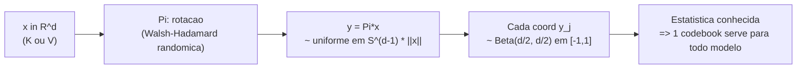

---

## 4. Shannon Lower Bound: a física da informação diz **$4^{-b}$**

### 4.1. Rate-distortion: o limite teórico

A pergunta mais fundamental da teoria da informação aplicada à compressão é:

> Dada uma fonte $X$ e uma medida de distorção $D$, qual é a **menor taxa** $R$ (bits por amostra) necessária para codificar $X$ com distorção esperada $\leq D$?

A resposta vem da **função rate-distortion** $R(D)$ de Shannon (1948, 1959). Para a **Gaussiana $\mathcal{N}(0, \sigma^2)$ sob distorção MSE**:

$$
R(D) \;=\; \tfrac{1}{2}\log_2\!\left(\frac{\sigma^2}{D}\right), \qquad 0 \le D \le \sigma^2.
$$

Invertendo, a **distortion-rate** é:

$$
D(R) \;=\; \sigma^2 \cdot 2^{-2R} \;=\; \sigma^2 \cdot 4^{-R}.
$$

Em palavras: **cada bit adicional reduz a distorção por um fator 4**. Esse $4^{-R}$ (ou $4^{-b}$, trocando $R$ por bits/coordenada $b$) é o famoso **Shannon Lower Bound (SLB)** para fontes gaussianas em MSE.

### 4.2. Analogia: o limite da física da informação

Pense em zoom de imagem digital: ao **dobrar** a resolução em bits por pixel, você não dobra a fidelidade — você a **quadruplica** (porque distorção é em escala quadrática). Esse `4^{-b}` é o **chão termodinâmico** da compressão lossy: ninguém, com nenhum algoritmo, pode quebrá-lo de forma sistemática. Toda quantização real tem **constante multiplicativa** acima dele:

$$
D_{\text{operacional}}(b) \;=\; C \cdot 4^{-b}, \qquad C \ge 1.
$$

A **glória de um quantizador** é minimizar essa constante $C$. Para quantização escalar uniforme em alta resolução, **Panter–Dite (1951)** dá $C \approx \frac{\sqrt{3}\pi}{2} \approx 2{,}72$ para a Gaussiana — e esse é justamente o número que o TurboQuant **alcança** (ou $\sqrt{3\pi}/2 \approx 1{,}53$, dependendo de qual radical o paper usa; ver nota em `transcripts/turboquant-docs/07-limites-inferiores-e-experimentos.md`).

### 4.3. Por que isso é grande coisa

O TurboQuant é, do ponto de vista teórico, uma **das primeiras famílias de quantizadores online, data-oblivious e GPU-friendly** que **chega perto** de $4^{-b}$ — algo que algoritmos como Product Quantization (PQ) só alcançavam **com calibração offline pesada e códigos densos**. Ele faz isso explorando a **Beta da esfera**: quantizar uma fonte cuja distribuição é **conhecida e quase-Gaussiana** é exatamente o cenário em que Lloyd–Max é ótimo — e assim a **constante de Panter–Dite** entra como um teorema, não como um chute.

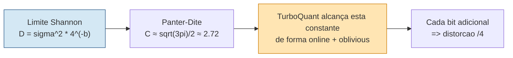

---

## 5. QJL: o antecessor — Quantized Johnson–Lindenstrauss

Antes do TurboQuant, os mesmos autores (Zandieh, Daliri, Hadian, …) publicaram em 2024 o **QJL — *1-Bit Quantized JL Transform for KV Cache Quantization with Zero Overhead*** ([arXiv:2406.03482](https://arxiv.org/abs/2406.03482), AAAI 2025). O QJL é o **embrião** das ideias polar + JL que aparecem maduras em TurboQuant.

### 5.1. Ideia central do QJL

- Aplique uma **projeção JL** $S \in \mathbb{R}^{m\times d}$ (entradas $\sim \mathcal{N}(0,1)$) ao vetor $x$ — isso é **Johnson–Lindenstrauss**: $Sx$ preserva distâncias e produtos internos com alta probabilidade quando $m$ é proporcional a $\log n / \epsilon^2$.
- **Quantize só o sinal**: $q = \mathrm{sign}(Sx) \in \{-1, +1\}^m$. É **1 bit por coordenada projetada**.
- **Estimador de produto interno**: aplique $S$ também ao vetor de consulta $y$ (não quantizado) e use
  

$$
\widehat{\langle x, y\rangle} \;=\; \frac{1}{m}\sqrt{\frac{\pi}{2}}\,\|x\|\, \langle q,\, S y\rangle.
$$

  Esse estimador é **não-enviesado** e tem **variância controlada** — é o famoso **estimador assimétrico** do JL com sinal.

### 5.2. Por que QJL é "zero overhead"

Esquemas de quantização tradicionais (INT8 *per-tensor*, *per-channel*) precisam armazenar **escala** $s$ e **zero point** $z$ por bloco, gastando 1–2 bits adicionais por elemento. **QJL não precisa**: o sinal não tem escala. A única coisa armazenada é $\|x\|$ (uma vez por vetor) e os bits de sinal. Por isso o título: **zero overhead**.

### 5.3. Resultados do QJL

- Em vários LLMs (Llama 2/3) e tarefas de NLP, comprimindo KV para **3 bits** o QJL atinge **~5× redução de memória** sem perda de acurácia mensurável.
- Tem **kernel CUDA** otimizado e o repositório (https://github.com/amirzandieh/QJL) é a base prática que muito da comunidade usou antes do TurboQuant.

### 5.4. A limitação que motivou TurboQuant

QJL é **excelente para preservar produto interno** (graças ao não-enviesamento estilo JL), mas é **subótimo em MSE puro** — você está jogando muita informação fora ao manter só sinais. Quando você quer **reconstruir** o vetor (não só estimar produtos com queries específicas), 1 bit por dimensão é pouco.

A pergunta natural ficou sendo: **dá para combinar**?

- Quantização **MSE-ótima** (Lloyd–Max em polar) para a parte "fácil" da informação.
- **QJL no resíduo** para a parte "fina" + correção de viés.

Essa combinação é o **TurboQuant**.

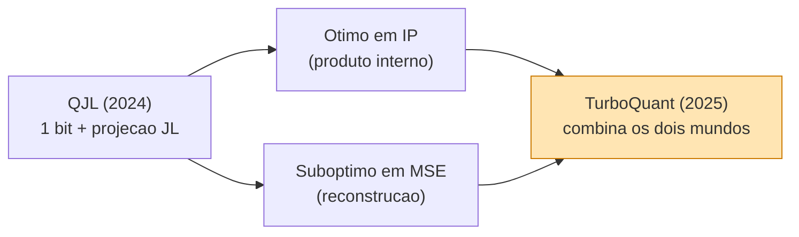

---

## 6. TurboQuant — variante MSE (Lloyd–Max em coordenadas polares)

Vamos abrir o **Algoritmo 1** do paper. Esta é a variante focada em **minimizar erro de reconstrução** $\mathbb{E}\|x - \hat x\|^2$.

### 6.1. Definição formal de $D_{\text{mse}}$

Lembrando do Post 04 e do paper:

$$
D_{\text{mse}}(b) \;:=\; \mathbb{E}_Q\!\left[\|x - \hat x\|_2^2\right], \qquad \hat x = Q^{-1}(Q(x)).
$$

A largura média de bits por coordenada é $b = B/d$. O paper prova:

> **Teorema 1 (limite MSE do TurboQuant).** Para todo $x \in S^{d-1}$ e $b \ge 0$,
> 

$$
>  D_{\text{mse}}(b) \;\le\; \frac{\sqrt{3\pi}}{2}\cdot 4^{-b}.
>
$$

Ou seja, a constante operacional do TurboQuant é $\sqrt{3\pi}/2 \approx 1{,}53$, próxima do ótimo de Panter–Dite.

### 6.2. Os três passos do Algoritmo 1

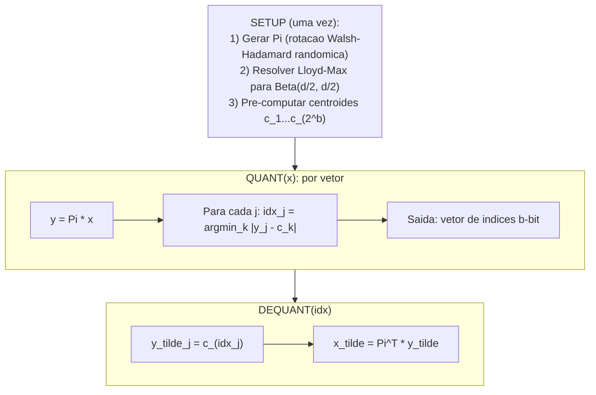

**Passo 1 — Rotação aleatória $\Pi$.** Geramos uma matriz ortogonal aleatória (na prática, uma transformada Walsh–Hadamard randomizada) e calculamos $y = \Pi x$. Pelo Lema da Beta, cada $y_j$ é distribuído $\sim \mathrm{Beta}(d/2, d/2)$ em $[-1, 1]$ (depois de reescalar pela norma).

**Passo 2 — Quantização escalar Lloyd–Max por coordenada.** Resolvemos uma vez (offline) o problema de Lloyd–Max para a densidade Beta:

$$
C(f_X, b) \;:=\; \min_{c_1 \le \cdots \le c_{2^b}} \;\sum_{i=1}^{2^b} \int_{m_{i-1}}^{m_i} (t - c_i)^2 \, f_X(t)\, dt,
$$

onde $m_i = (c_i + c_{i+1})/2$ são os midpoints (fronteiras de Voronoi 1D). Os **centroides** $c_1, \dots, c_{2^b}$ são as **médias condicionais** em cada célula. O algoritmo iterativo de Lloyd alterna **fronteiras → centroides → fronteiras → …** até convergir. Para a Beta de $S^{d-1}$ em alta dim, esse codebook é **universal** — depende só de $d$ e $b$, **não do dado**.

**Passo 3 — Reconstrução.** Cada coordenada vira o centroide do seu intervalo: $\tilde y_j = c_{\mathrm{idx}_j}$. E a **rotação inversa** (que é $\Pi^T$ por ortogonalidade) recupera $\tilde x = \Pi^T \tilde y$.

### 6.3. Por que isso atinge $4^{-b}$

A **prova** do Teorema 1 é elegante:

1. **Ortogonalidade preserva norma**: $\|x - \tilde x\|^2 = \|y - \tilde y\|^2$.
2. **Simetria das coordenadas**: como todas as $y_j$ têm a mesma marginal Beta e o quantizador é o mesmo,
   

$$
D_{\text{mse}} = d \cdot \mathbb{E}|y_1 - \tilde y_1|^2 = d \cdot C(f_X, b).
$$

3. **Lloyd–Max + Panter–Dite** dão $C(f_X, b) \le \frac{\sqrt{3\pi}}{2d} \cdot 4^{-b}$ em alta resolução.
4. Multiplicando por $d$ (passo 2): $D_{\text{mse}} \le \frac{\sqrt{3\pi}}{2} \cdot 4^{-b}$.

### 6.4. Tabela numérica (do paper, valores finos para baixo `b`)

| `b` | $D_{\text{mse}}$ (cota fina) | Compressão vs `fp16` |
|---:|---:|---:|
| 1 | 0,36 | 16× |
| 2 | 0,117 | 8× |
| 3 | 0,030 | ~5,3× |
| 4 | 0,009 | 4× |

Em **3 bits/coord** já temos distorção ~3 % da norma quadrática — suficiente para muitos benchmarks (NIAH, LongBench) ficarem dentro de erro de medida.

### 6.5. Onde isso "encaixa" na inferência de uma LLM

Quando um *Key* ou *Value* é gerado em uma camada de atenção:

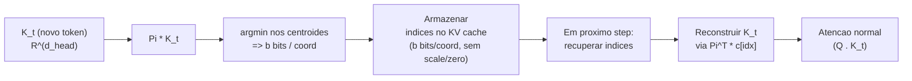

Diferente do KIVI/KVQuant, **não há scale nem zero point** para guardar — tudo é resolvido pelo codebook universal e pela rotação. **Um único codebook por modelo** (depende só de `d_head` e `b`), pré-computado uma vez na inicialização.

---

## 7. TurboQuant — variante IP (two-stage para produto interno)

A variante MSE é ótima para reconstrução **isotrópica**, mas tem um problema sério para **atenção e busca vetorial**: o estimador de produto interno é **enviesado**.

### 7.1. Por que MSE-ótimo é enviesado em IP

O exemplo mais limpo está no paper, com `b = 1` (1 bit por coord):

- Os dois centroides ótimos para a Beta(d/2, d/2) ficam aproximadamente em $\pm \sqrt{2/(\pi d)}$.
- A reconstrução $\hat x_{\text{mse}}$ acaba sendo essencialmente $\sqrt{2/(\pi d)}\cdot \mathrm{sign}(\Pi x)$ rotacionado de volta.
- Calculando o produto interno esperado:
  

$$
\mathbb{E}\langle y, \hat x_{\text{mse}}\rangle \;=\; \frac{2}{\pi}\,\langle y, x\rangle.
$$

Isso é um **viés multiplicativo de $2/\pi \approx 0{,}637$** — toda a sua atenção/similaridade fica **encolhida** por esse fator. Pior: o viés é **dependente da geometria** (depende de $b$ e $d$). Em softmax de atenção, viés multiplicativo desloca **logits**, então a distribuição de atenção não é só "menos confiante", é **diferente**. Em ranking IP de busca vetorial, candidatos próximos ao limiar saltam de posição.

### 7.2. A solução: **dois estágios + bit de correção QJL**

A ideia é **decompor o vetor**:

$$
x \;=\; \underbrace{\hat x_{\text{mse}}}_{\text{primeira etapa: }(b-1)\text{ bits}} \;+\; \underbrace{r}_{\text{residuo}}
$$

E aplicar **QJL no resíduo $r$** com **1 bit por coordenada projetada**, gastando o "último bit" do orçamento.

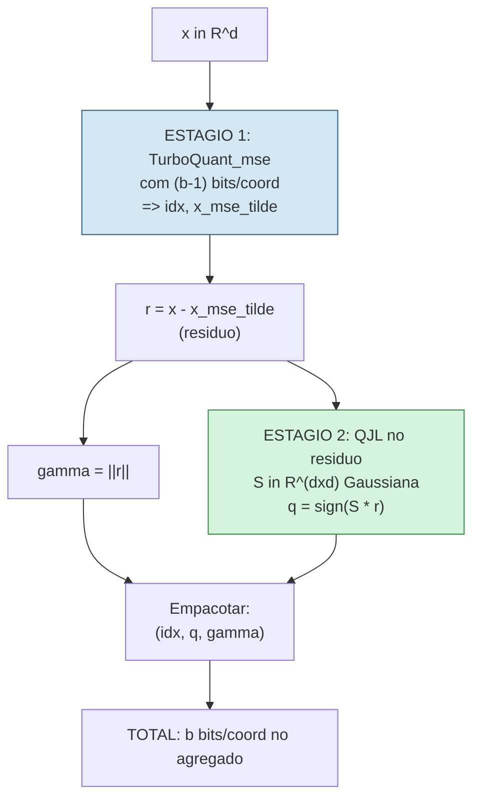

### 7.3. O Algoritmo 2 em detalhes

**Setup (uma vez):**
- Instanciar `TurboQuant_mse` com largura `(b-1)` bits/coord.
- Amostrar matriz JL $S \in \mathbb{R}^{d\times d}$ com entradas Gaussianas i.i.d. (na prática, novamente uma Walsh–Hadamard randomizada).

**Quant_prod(x):**
1. `idx = Quant_mse(x)` — codifica em `(b-1)` bits/coord.
2. `x_mse_tilde = DeQuant_mse(idx)`.
3. `r = x - x_mse_tilde` — resíduo.
4. `q = sign(S * r)` — QJL do resíduo (`d` bits = 1 bit/coord).
5. Salvar `(idx, q, gamma=||r||)`.

**DeQuant_prod(idx, q, gamma):**
1. `x_mse_tilde = DeQuant_mse(idx)`.
2. `x_qjl_tilde = sqrt(pi/2)/d * gamma * S^T * q` (escala calibrada para não-enviesamento).
3. `x_tilde = x_mse_tilde + x_qjl_tilde`.

### 7.4. Two-stage como "peneira fina" — analogia

A intuição se cristaliza assim:

> **Two-stage IP é como filtrar candidatos com uma peneira grossa e depois uma fina.** O `TurboQuant_mse` com `(b-1)` bits aproxima `x` de longe (peneira grossa: rápida, barata, suficiente para a maior parte da energia). O QJL no resíduo, com 1 bit por coordenada, **corrige o viés** multiplicativo da peneira grossa e adiciona a precisão fina onde mais importa: na **estimativa do produto interno**, que é o que a atenção e a busca vetorial efetivamente usam.

### 7.5. Diagrama do estimador two-stage

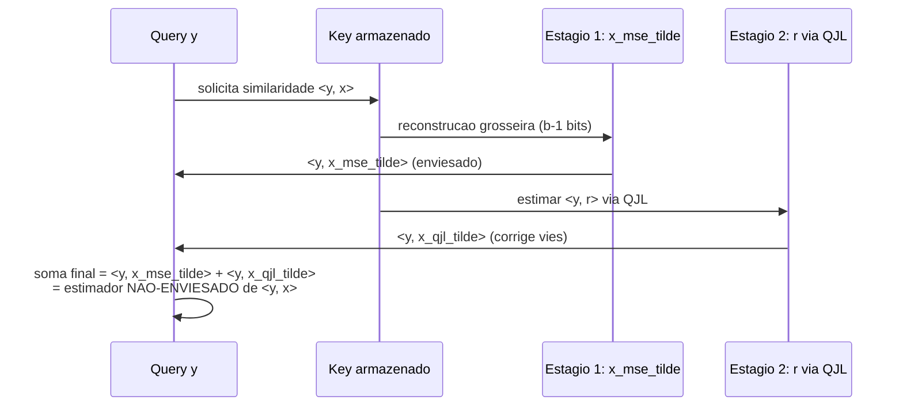

### 7.6. Teorema 2 — não-enviesamento + cota $D_{\text{prod}}$

O paper formaliza:

> **Teorema 2 (TurboQuant IP).** Para todo $x \in S^{d-1}$, $y \in \mathbb{R}^d$, com $\tilde x$ saindo do `DeQuant_prod`:
>
> 1. **Não-enviesamento:** $\mathbb{E}_{\tilde x}[\langle y, \tilde x\rangle] = \langle y, x\rangle$.
> 2. **Distorção:** $D_{\text{prod}}(b) := \mathbb{E}_{\tilde x}\big[(\langle y, x\rangle - \langle y, \tilde x\rangle)^2\big] \;\le\; \dfrac{\sqrt{3\pi}}{2} \cdot \dfrac{\|y\|_2^2}{d} \cdot 4^{-b}.$

E a tabela numérica:

| `b` | $D_{\text{prod}}$ (fina, multiplicar por $\|y\|^2/d$) |
|---:|---:|
| 1 | 1,57 |
| 2 | 0,56 |
| 3 | 0,18 |
| 4 | 0,047 |

A prova é uma decomposição **viés–variância** clássica:

- **Esperança**: condicionando em `x_mse_tilde`, o estimador QJL é construído (Lemma 4 do paper) para que $\mathbb{E}[\langle y, x_{\text{qjl}}\tilde{}\rangle | x_{\text{mse}}\tilde{}] = \langle y, r\rangle$. Pela lei da esperança total, $\mathbb{E}\langle y, \tilde x\rangle = \langle y, x_{\text{mse}}\tilde{}\rangle + \langle y, r\rangle = \langle y, x\rangle$.
- **Variância**: $\mathrm{Var}(\langle y, x_{\text{qjl}}\tilde{}\rangle | x_{\text{mse}}\tilde{}) \le \frac{\pi}{2d}\|r\|^2\|y\|^2$. Tomando esperança em $\|r\|^2$ (que é $D_{\text{mse}}$ do estágio 1) e aplicando o Teorema 1 com `(b-1)` bits, obtém-se a cota em $4^{-b}$.

Notar que **toda a aleatoriedade vem do design do quantizador** (rotação $\Pi$, projeção $S$) — não há suposição alguma sobre a distribuição dos dados $x$. Isso é o **data-oblivious** que o título do paper destaca.

---

## 8. O bit de correção: o ajuste barato que evita erro grosseiro

Vale destacar isoladamente a beleza do **bit de correção QJL**:

- **Custo**: 1 bit por coordenada projetada (que pode ser inferior a `d` se você reduzir a dimensão da projeção; mas no paper é `d`).
- **Efeito**: anula completamente o **viés multiplicativo** do estágio MSE no produto interno.
- **Comparação**: imagine que sua peneira grossa joga fora 36 % do sinal (`b=1` MSE). O bit de correção **devolve a fase** (sinal correto) das contribuições mais relevantes, restaurando a média estatística do produto interno para o valor verdadeiro.

> **Analogia:** o bit de correção é como uma **errata de uma página única** colada no fim de um livro de 500 páginas. Custa quase nada para imprimir, mas evita que o leitor atribua um significado errado ao texto inteiro — porque corrige aquele erro de tradução sistemático que envenenava a leitura.

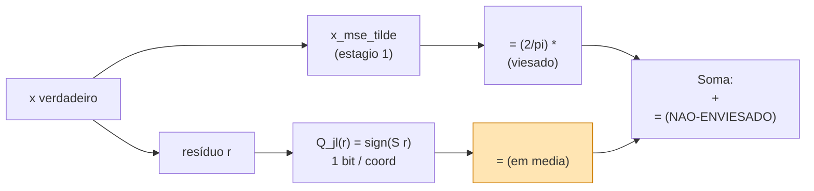

---

## 9. Resultados teóricos: alinhamento com o SLB

Vamos colocar lado a lado o que o paper prova versus o que Shannon permite:

| Quantidade | Limite Shannon (Gaussiana) | TurboQuant (esfera, oblivious, online) |
|---|---|---|
| $D_{\text{mse}}(b)$ | $\sigma^2 \cdot 4^{-b}$ | $\frac{\sqrt{3\pi}}{2} \cdot 4^{-b}$ |
| $D_{\text{prod}}(b)$ | $\sigma^2 \|y\|^2/d \cdot 4^{-b}$ (informacional) | $\frac{\sqrt{3\pi}}{2}\cdot \|y\|^2/d \cdot 4^{-b}$ |
| Estimador IP | — | **Não-enviesado** (Teorema 2) |
| Calibração necessária | depende | **Nenhuma** (oblivious) |
| Setup online | — | **Sim** (rotação + codebook universal) |

A **constante $\sqrt{3\pi}/2 \approx 1{,}53$** (ou $\approx 2{,}72$ na outra interpretação do radical, ver paper §1) é **dentro de um fator pequeno** do ótimo. Para colocar em perspectiva: PQ com `m=8` subespaços e `k=256` centróides em alta dim costuma ter constantes operacionais **>10×** o SLB; KIVI 4-bit fica em torno de **3–5×** dependendo do canal.


---

## 10. Resultados experimentais (DBpedia, NIAH, LongBench)

O paper apresenta dois cenários experimentais:

### 10.1. KV cache em LLMs (Llama-3.1-8B-Instruct)

| Configuração | LongBench (média) | NIAH (precisão) |
|---|---:|---:|
| **Full Precision (16-bit)** | 50,06 | 0,997 |
| **TurboQuant 3,5 bits/canal** | **50,06** | **0,997** |
| **TurboQuant 2,5 bits/canal** | 49,44 | 0,997 |

**Leitura:** a **3,5 bits por canal**, o TurboQuant é **literalmente indistinguível** da precisão completa nessas duas baterias (LongBench cobre 21 tarefas de contexto longo; NIAH testa "agulha no palheiro" em janelas grandes). A **2,5 bits/canal**, há queda de **~1,2 % no LongBench** — substancial mas pequena, e NIAH fica intacto. Compressão efetiva: **~5–7×** vs `fp16`.

### 10.2. Busca vetorial — DBpedia retrieval

O paper compara o **TurboQuant_prod** com **PQ** em retrieval de embeddings da DBpedia:

- **Recall@k**: TurboQuant supera PQ em recall a iguais bits/vetor.
- **Tempo de indexação**: PQ requer **k-means offline** sobre milhões de vetores (minutos a horas). TurboQuant: **zero**, porque o codebook é **universal** (depende só de `d` e `b`). Você indexa em tempo de I/O.
- **Tempo de consulta**: comparáveis; ambos são GPU-friendly.

### 10.3. Tabela comparativa do paper (resumida)

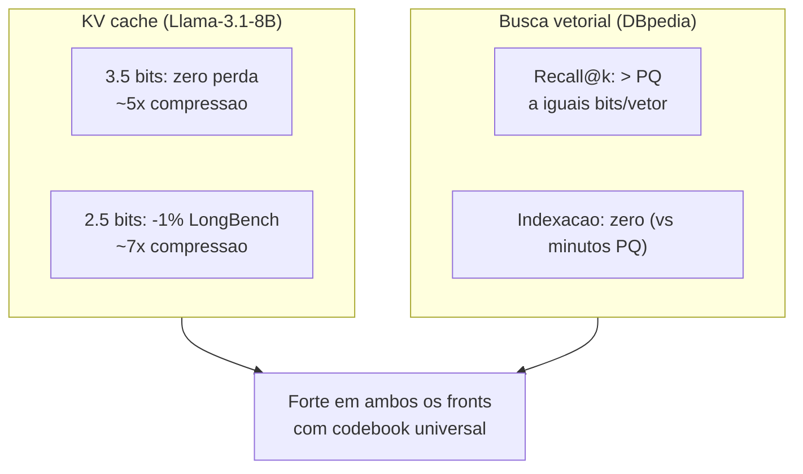

---

## 11. Implementações iniciais e os "tretas"

A boa notícia: **comunidade abraçou**. A má: **a primeira onda de implementações tem problemas reais**. Vamos por partes.

### 11.1. Implementações que existem

| Repositório | Plataforma | Status | Notas |
|---|---|---|---|
| [`amirzandieh/QJL`](https://github.com/amirzandieh/QJL) | CUDA | maduro | predecessor; kernel CUDA otimizado |
| [`sharpner/turboquant-mlx`](https://github.com/sharpner/turboquant-mlx) | MLX (Apple Silicon) | beta | V2 (`mx.quantized_matmul`) e V3 (Lloyd-Max codebook); até **5,5×** em M4 Max |
| [`rachittshah/mlx-turboquant`](https://github.com/rachittshah/mlx-turboquant) | MLX | beta | Polar puro, sem calibração; 2/3/3,5/4 bits |
| [`TheTom/turboquant_plus`](https://github.com/TheTom/turboquant_plus) | `llama.cpp` | alpha | implementação CPU + GPU; problemas de prefill conhecidos |
| [`spiritbuun/llama-cpp-turboquant-cuda`](https://github.com/spiritbuun/llama-cpp-turboquant-cuda) | `llama.cpp` + CUDA | alpha | foco em V dequant fundido |
| [`OnlyTerp/turboquant`](https://github.com/OnlyTerp/turboquant) | Python ref. | maduro | implementação de referência |

Há discussão ativa de ports para vLLM, TensorRT-LLM e SGLang, mas nada **mainstream** ainda.

### 11.2. Treta #1 — Prefill mais lento que `q8_0`/`fp16`

Reportado em [`TheTom/turboquant_plus#32`](https://github.com/TheTom/turboquant_plus/issues/32):

| Tokens | Slowdown vs `fp16` |
|---:|---:|
| 1024 | -3 % |
| 2048 | -5 % |
| 4096 | -7 % |
| 8192 | -10 % a -15 % |

**Causa-raiz:** a **rotação Walsh–Hadamard** custa por camada de atenção:

- 2 multiplicações de matriz `128×128 × 128×N` (forward em Q, "un-rotation" em V).
- 2 cópias inteiras de tensor (`ggml_cont()`) por camada.
- 4 reshapes por camada.

Esse overhead **escala com o contexto** porque a rotação acontece a cada *forward pass* de atenção. Em `fp16` ou `q8_0`, **não tem rotação alguma** — só multiplicação direta.

### 11.3. Treta #2 — Os ganhos de 6–8× são **memory-bound, não compute-bound**

Reportado em [`ggml.cpp` discussion #21829](https://github.com/ggml-org/llama.cpp/discussions/21829): em **H200** (banda de memória **4,8 TB/s**), TurboQuant **turbo3** roda a **67 t/s** vs **78 t/s** com KV cache `fp16` — uma **regressão de 15 %**.

A explicação é simples e **muito importante** para entender quando TurboQuant ganha:

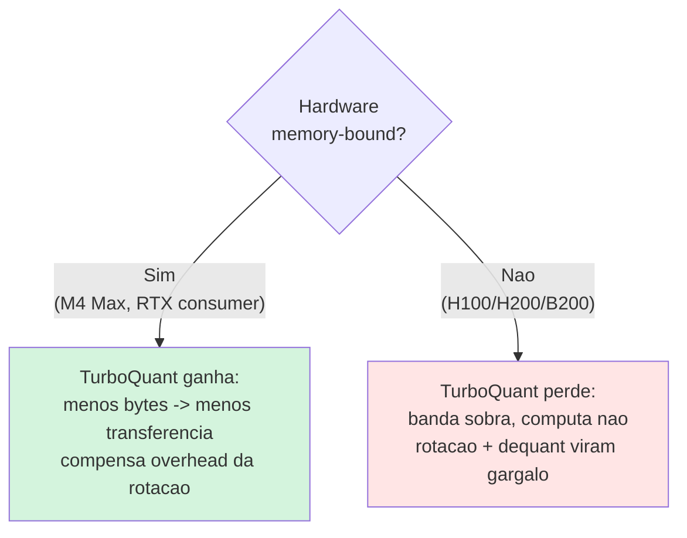

Em hardware de **alta banda** (H100, H200, B200) o KV cache `fp16` **não é o gargalo** — você está **compute-bound** ou *attention-bound*. Adicionar trabalho de rotação só piora.

Em hardware **memory-bound** (Apple Silicon, RTX 3090/4090, GPUs antigas, edge devices), comprimir KV é uma alavanca real e o TurboQuant brilha.

### 11.4. Treta #3 — Quedas de acurácia em algumas implementações iniciais

Vários relatos comunitários (Reddit, GitHub issues) mostram que:

- Implementações que **simplificam** o estágio 2 (pulam o QJL no resíduo) viram efetivamente **PolarQuant puro** — e aí a queda em LongBench/NIAH é maior do que o paper reporta.
- Quando a **rotação não é exatamente ortogonal** (por causa de aproximações Hadamard mal feitas), o Lema da Beta **não vale exatamente** e o codebook universal vira **não-ótimo** para o seu modelo.
- Modelos com **GQA agressivo** (Llama-3 com 8 KV heads) e *Keys* cuja distribuição está **longe de Beta** (por aritmética RoPE específica) sofrem mais.

### 11.5. Decisão prática — quando usar TurboQuant **hoje**

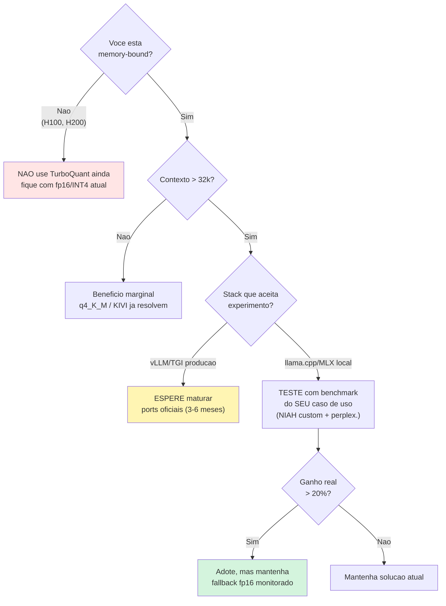

---

## 12. Veredito honesto

Vou separar **o que é genuinamente promissor** e **o que precisa amadurecer**:

### O que é promissor

1. **Fundamento teórico sólido.** Atingir constantes próximas de Panter–Dite com algoritmo **online** e **data-oblivious** é resultado importante. É o tipo de coisa que aparece em livro-texto daqui a 5 anos.
2. **Codebook universal.** A separação entre "engenharia da rotação" e "estatística da Beta" significa que **um único codebook** funciona para todos os modelos com mesmo `d_head` e `b`. Isso é operacionalmente glorioso: sem calibração, sem dados sensíveis, sem retreino.
3. **Estimador de IP não-enviesado.** Para softmax de atenção, ranking de busca vetorial, agregações multi-head — qualquer pipeline que **acumula** estimativas — não-enviesamento é **muito** mais valioso que apenas baixa variância.
4. **Tempo de indexação ~zero** para vector DBs. Para casos onde a base muda muito (e-commerce, news), isso é um diferencial enorme vs PQ.
5. **Bit de correção é elegante.** A ideia de "errata" QJL no resíduo é aplicável a outros contextos — vai virar técnica de bolso.

### O que precisa amadurecer

1. **Kernels de rotação.** Hoje as implementações usam Walsh–Hadamard genérica. Precisamos de **kernels fundidos** (sign + butterfly + sign em um único dispatch) — mencionado em GitHub issues de `turboquant-cuda`.
2. **Co-design com FlashAttention.** Idealmente a rotação acontece **dentro do kernel** de atenção, não como pré/pós-processamento. Hoje custa cópias `ggml_cont` desnecessárias.
3. **Calibração híbrida (opcional).** Para modelos cujo `K`/`V` está **longe da Beta** (alguns custom heads, RoPE com base alta), uma versão **levemente data-aware** poderia recuperar acurácia sem perder o "oblivious" no caminho frio.
4. **Integração mainstream.** Sem PR no vLLM/TGI/SGLang, o TurboQuant fica em laboratório. Ports estão em andamento mas levarão meses.
5. **Benchmarks transparentes em hardware diverso.** O paper só roda H100. Falta um *report* sério em Apple Silicon, RTX consumer, e edge devices — exatamente onde TurboQuant **deve** ganhar mais.

### Quando esperar maturação

Estimativa razoável (não chute, baseada em paralelos com FlashAttention 1→2→3 e PagedAttention):

- **3 meses**: kernels CUDA otimizados em pelo menos uma das implementações comunitárias.
- **6 meses**: PR oficial em vLLM ou SGLang, com flag opcional.
- **12 meses**: comparativos sérios contra KIVI / KVQuant / GGUF Q4_K_M em produção real.
- **18–24 meses**: status default em pelo menos uma stack séria, ou abandonado por uma técnica melhor.

---

## 13. Tabelas comparativas finais

### 13.1. TurboQuant MSE vs IP (variantes internas)

| Aspecto | TurboQuant MSE (Alg. 1) | TurboQuant IP (Alg. 2) |
|---|---|---|
| Otimização | Erro quadrático $\|x - \tilde x\|^2$ | Erro de produto interno $(\langle y, x\rangle - \langle y, \tilde x\rangle)^2$ |
| Estimador IP | **Enviesado** ($\sim 2/\pi$ em `b=1`) | **Não-enviesado** |
| Bits/coord | `b` | `b-1` (MSE) + 1 (QJL no resíduo) = `b` total |
| Custo Quant | 1 rotação + argmin | 1 rotação + argmin + projeção JL no resíduo |
| Custo DeQuant | Lookup centroides + rotação inversa | Lookup + rotação + soma do termo QJL |
| Garantia teórica | $D_{\text{mse}} \le \frac{\sqrt{3\pi}}{2} 4^{-b}$ | $D_{\text{prod}} \le \frac{\sqrt{3\pi}}{2} \frac{\|y\|^2}{d} 4^{-b}$ |
| Quando usar | Reconstrução de KV "isotrópica" | Atenção, similaridade, ranking IP, ANN |

### 13.2. TurboQuant vs alternativas para KV cache

| Técnica | Bits/coord | Calibração | Constante vs SLB | Prefill overhead | Maturidade prod. | Hardware ideal |
|---|---:|---|---:|---|---|---|
| `fp16` baseline | 16 | — | — | 0 % | maduro | qualquer |
| INT8 simples | 8 | scale/zero | ~10× | ~0 % | maduro | qualquer |
| INT4 (`q4_K_M` GGUF) | 4 | offline | ~5× | ~1 % | maduro | CPU, RTX, M-series |
| KIVI 4-bit | 4 | per-channel/per-token online | ~3–5× | ~2 % | beta | GPU |
| KVQuant 4-bit | 4 | offline + outliers fp16 | ~3× | ~2 % | beta | GPU |
| QJL 3-bit | 3 | nenhuma | ~5× | ~3 % | alpha | GPU |
| **TurboQuant 3,5-bit** | 3,5 | **nenhuma** | **~1,5×** | **3–10 %** | **alpha** | **memory-bound** |
| **TurboQuant 2,5-bit** | 2,5 | nenhuma | ~1,5× | 5–15 % | alpha | memory-bound |

### 13.3. Resultados experimentais reportados (Llama-3.1-8B + DBpedia)

| Benchmark | Métrica | `fp16` | TurboQuant 3,5b | TurboQuant 2,5b |
|---|---|---:|---:|---:|
| LongBench (média 21 tarefas) | score médio | 50,06 | **50,06** | 49,44 |
| Needle-in-Haystack (NIAH) | precisão | 0,997 | **0,997** | 0,997 |
| KV memory | × redução | 1× | ~5× | ~7× |
| DBpedia retrieval | Recall@10 vs PQ | — | **superior** | — |
| Indexação DBpedia | tempo | — | **~0** (vs minutos PQ) | — |

---

## 14. Posicionamento na paisagem

```mermaid
flowchart TB
  subgraph Cartesianos["Cartesianos com calibração"]
    PQ["Product Quantization<br/>(2010, Jegou)"]
    KIVI["KIVI<br/>(per-channel/per-token)"]
    KVQ["KVQuant<br/>(4-bit + outliers fp16)"]
  end
  subgraph Polares["Polares oblivious"]
    QJL["QJL<br/>(2024, Zandieh)<br/>1-bit JL"]
    TQ["TurboQuant<br/>(2025, Zandieh et al.)<br/>Lloyd-Max + QJL"]
  end
  subgraph Exato["Sem quantizacao"]
    NN["NN exato fp16/bf16"]
  end
  PQ --> KIVI --> KVQ
  QJL --> TQ
  Cartesianos -.["compete em IP recall<br/>e qualidade KV"].-> Polares
  Polares -.["se aproxima de"].-> Exato
  style TQ fill:#ffe5b3,stroke:#cc7a00
  style QJL fill:#ffe5b3,stroke:#cc7a00
```

Interpretação:

- A **família cartesiana** (PQ, KIVI, KVQuant) atacou o problema com **calibração** e **engenharia de outliers**. Funciona bem mas tem um teto: sempre uma constante pelo menos ~3–10× acima do SLB.
- A **família polar oblivious** (QJL, TurboQuant) ataca pelo design da **distribuição induzida** (Beta na esfera). Resultado: constantes **muito menores** sem calibração, mas com overhead de rotação como custo.
- O **NN exato** em `fp16`/`bf16` é o limite absoluto de qualidade. A pergunta operacional sempre é: **quanto a mais de qualidade você está disposto a pagar com quanto a mais de memória/banda?**

---

## 15. Conclusão e ponte para o Post 07

O **TurboQuant** é o exemplo mais limpo, em 2025, de como a **teoria da informação clássica** (Shannon 1959, Lloyd 1982, Max 1960, Panter–Dite 1951) pode iluminar problemas extremamente práticos de **inferência de LLMs e bases vetoriais modernas**.

Ele faz isso com três ingredientes:

1. **Polar quantization**: separar magnitude e direção, e quantizar coordenadas angulares cuja distribuição é **conhecida** (Beta da esfera).
2. **Lloyd–Max universal**: um único codebook escalar, pré-computado offline para a Beta da dimensão, serve todos os modelos.
3. **Bit de correção QJL**: uma "errata" de 1 bit/coord no resíduo elimina o viés do estágio MSE no produto interno.

E **alcança constantes próximas do Shannon Lower Bound** $4^{-b}$ sem calibração, sem dados sensíveis, sem retreino.

Mas o caminho de **paper → produção** é longo. As primeiras implementações têm overhead de rotação que come ganhos em hardware *compute-bound*. Para você, leitor, a recomendação prática é:

- **Acompanhe** os repositórios da comunidade.
- **Experimente** se você está em ambiente memory-bound (M-series, RTX consumer, edge).
- **Espere** se você está em produção com vLLM/TGI/SGLang em H100/H200.
- **Use** os capítulos formais em `transcripts/turboquant-docs/01..07/` se quiser ver as provas em rigor matemático completo (Lemmas 1–4, Theorems 1–2, Algoritmos 1–2, fórmula de Panter–Dite).

### O que vem a seguir — Post 07: contexto longo

Comprimir KV é só **metade** do desafio dos contextos longos. A outra metade é: **como escalar a atenção em si**? E **como representar posições** (RoPE, YaRN) quando o contexto explode? E **existe alternativa ao Transformer** (Mamba, RWKV) que escape do quadrático?

No próximo post da série iremos **além** da quantização:

- **RoPE & extrapolação**: como funciona, e por que ela quebra fora do contexto de treino.
- **YaRN, NTK-aware scaling, LongRoPE**: a engenharia de "esticar" RoPE.
- **Ring Attention**: paralelizar atenção em janelas de **milhões** de tokens.
- **StreamingLLM**: atenção com janela deslizante + sinks atencionais.
- **Mamba e State Space Models**: a alternativa ao Transformer com complexidade **linear**.

Fica, portanto, marcado o ponto: o TurboQuant resolve **a memória**. O Post 07 vai resolver **a janela**.

---

## Referências

### Papers primários
- Zandieh, A.; Daliri, M.; Hadian, M.; Mirrokni, V. **TurboQuant: Online Vector Quantization with Near-optimal Distortion Rate.** [arXiv:2504.19874](https://arxiv.org/abs/2504.19874), 2025. Aceito em ICLR 2026.
- Zandieh, A.; Daliri, M.; Han, I. **QJL: 1-Bit Quantized JL Transform for KV Cache Quantization with Zero Overhead.** [arXiv:2406.03482](https://arxiv.org/abs/2406.03482), 2024. AAAI 2025 + ICLR 2025 Workshop on Sparsity in LLMs.
- Jégou, H.; Douze, M.; Schmid, C. **Product Quantization for Nearest Neighbor Search.** *IEEE TPAMI*, vol. 33, n. 1, 2011. [HAL](https://inria.hal.science/inria-00514462).

### Fundamentos clássicos (rate-distortion e Lloyd–Max)
- Shannon, C. E. **Coding Theorems for a Discrete Source with a Fidelity Criterion.** *IRE Nat. Conv. Rec.*, 1959.
- Lloyd, S. P. **Least Squares Quantization in PCM.** *IEEE Trans. Inf. Theory*, vol. 28, n. 2, 1982 (originalmente 1957, Bell Labs).
- Max, J. **Quantizing for Minimum Distortion.** *IRE Trans. Inf. Theory*, vol. 6, n. 1, 1960.
- Panter, P. F.; Dite, W. **Quantization Distortion in Pulse-Count Modulation with Nonuniform Spacing of Levels.** *Proc. IRE*, vol. 39, n. 1, 1951.
- Cover, T. M.; Thomas, J. A. **Elements of Information Theory.** Wiley, 2006 (capítulo de rate-distortion).

### Modelos & infra de teste
- AI@Meta. **Llama 3.1 Model Card.** Meta, 2024. https://github.com/meta-llama/llama-models
- Yang, A. et al. **Qwen2.5 Technical Report.** Alibaba, 2024. https://arxiv.org/abs/2412.15115
- Kwon, W. et al. **Efficient Memory Management for Large Language Model Serving with PagedAttention (vLLM).** SOSP 2023. https://arxiv.org/abs/2309.06180
- Apple ML Research. **MLX: An array framework for Apple silicon.** https://github.com/ml-explore/mlx

### Posts e blogs
- Google Research. **TurboQuant: Redefining AI efficiency with extreme compression.** Blog post, 2025. https://research.google/blog/turboquant-redefining-ai-efficiency-with-extreme-compression/
- Towards Data Science. **KV Cache Is Eating Your VRAM. Here's How Google Fixed It With TurboQuant.** 2025.
- Intelligent Living. **TurboQuant Targets the KV Cache Memory Wall.** 2025.
- Danilchenko, D. **Google's TurboQuant Compresses LLM Memory 6x With Zero Accuracy Loss.** 2026.

### Implementações comunitárias
- `amirzandieh/QJL` — kernels CUDA originais. https://github.com/amirzandieh/QJL
- `sharpner/turboquant-mlx` — MLX, V2/V3. https://github.com/sharpner/turboquant-mlx
- `rachittshah/mlx-turboquant` — MLX, polar puro. https://github.com/rachittshah/mlx-turboquant
- `TheTom/turboquant_plus` — `llama.cpp`. https://github.com/TheTom/turboquant_plus
- `spiritbuun/llama-cpp-turboquant-cuda` — `llama.cpp` + CUDA. https://github.com/spiritbuun/llama-cpp-turboquant-cuda
- `OnlyTerp/turboquant` — referência Python. https://github.com/OnlyTerp/turboquant

### Discussões e críticas técnicas
- `ggml-org/llama.cpp` Discussion #20969 — *TurboQuant - Extreme KV Cache Quantization*.
- `ggml-org/llama.cpp` Discussion #21829 — *Turboquant is slower for me* (regressão H200).
- `TheTom/turboquant_plus` Issue #32 — *turbo3 prefill speed degrades with context length*.
- `spiritbuun/llama-cpp-turboquant-cuda` Issue #8 — *persistent V dequant buffer + fused K tile loading*.

### Documentos didáticos locais (série acadêmica)
- `transcripts/turboquant-docs/01-fundamentos-e-definicao-formal.md` — definições $D_{\text{mse}}$, $D_{\text{prod}}$, não-viés, Quant/DeQuant.
- `transcripts/turboquant-docs/03-preliminares-beta-esfera-e-concentracao.md` — Lema da Beta, concentração em alta dimensão.
- `transcripts/turboquant-docs/04-shannon-lower-bound.md` — derivação detalhada do SLB $4^{-b}$.
- `transcripts/turboquant-docs/05-qjl-quantized-johnson-lindenstrauss.md` — QJL com prova do Lemma 4.
- `transcripts/turboquant-docs/06-turboquant-mse-e-produto-interno.md` — Algoritmos 1 e 2, Teoremas 1 e 2.
- `transcripts/turboquant-docs/07-limites-inferiores-e-experimentos.md` — cotas inferiores e tabelas experimentais completas.

---

*Próximo post da série:* [**07 — Contexto longo: RoPE, YaRN, Ring/StreamingLLM, Mamba**](./07-contexto-longo-rope-yarn-ring-streaming.md)
