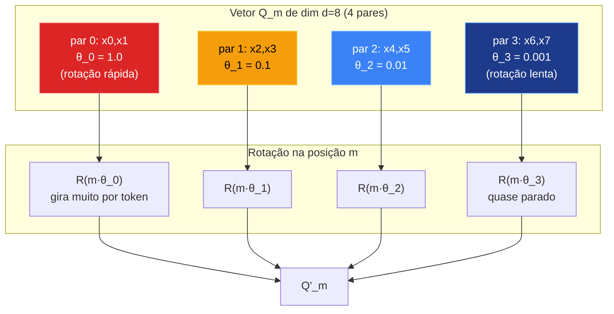
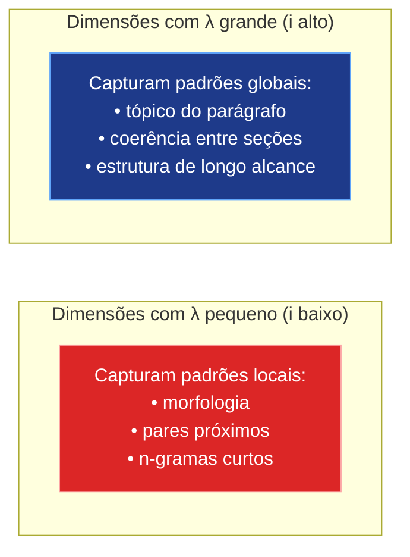
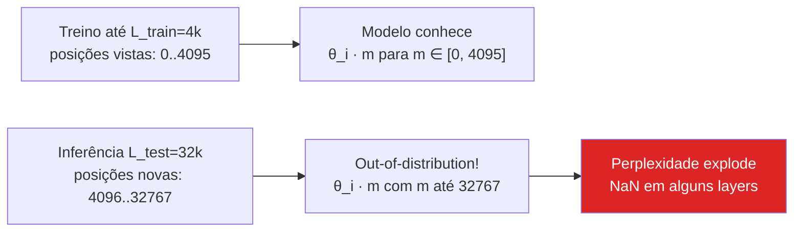
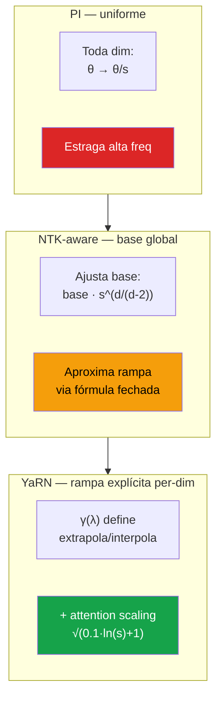
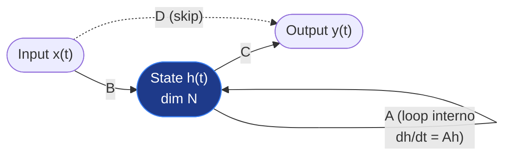
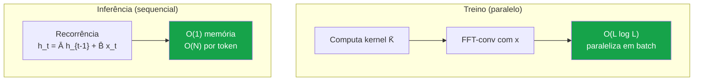
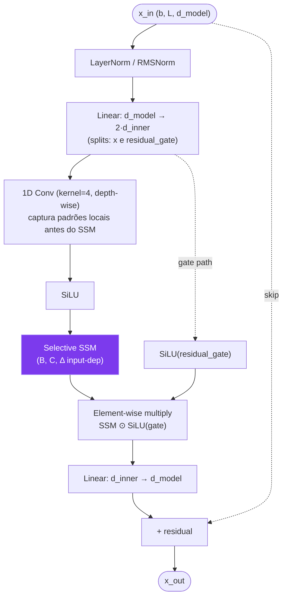
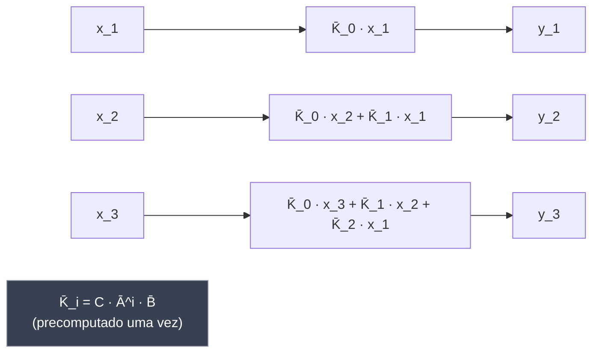
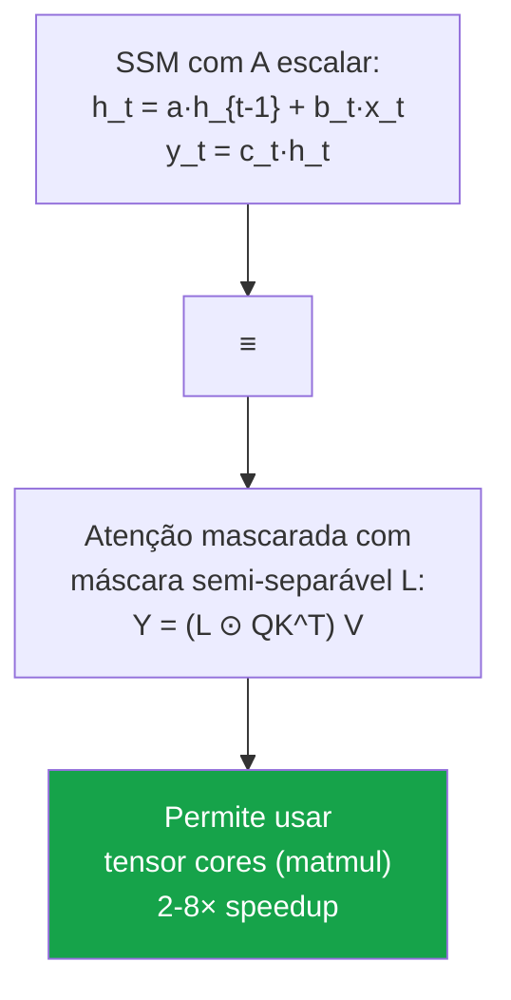

# Post 07 — APROFUNDAMENTO: a matemática completa de RoPE → YaRN e dos State Space Models (Mamba)

> **Apêndice ao Post 07 da série LLM Deep Dive** — *Contexto Longo: como esticar a janela e escalar a atenção*.
> **Pré-requisito:** ter lido o Post 07 (`07-contexto-longo-rope-yarn-ring-streaming.md`). Este apêndice mergulha na matemática que o Post 07 cita por cima.
> **Escopo:** dois grandes blocos independentes, mas complementares.
> - **Parte A — RoPE → YaRN:** da rotação de pares de coordenadas ao *Yet another RoPE extensioN*, passando por PI, NTK-aware, NTK-by-parts, LongRoPE e DynamicNTK.
> - **Parte B — State Space Models (Mamba):** do SSM contínuo de controle clássico ao Mamba selectivo, passando por discretização ZOH, view convolucional, S4, Mamba-2 (SSD) e híbridos como Jamba.

---

## TL;DR (apêndice)

- **RoPE** funciona porque o produto interno de duas projeções rotacionadas só depende da **diferença** das posições — relatividade emerge naturalmente da geometria.
- A **base 10000** dá um espectro de **wavelengths** que vão de ~6 tokens (alta frequência, dimensões "rápidas") até ~62832 tokens (baixa frequência, dimensões "lentas").
- **PI (Position Interpolation)** comprime todas as posições uniformemente — funciona, mas borra alta frequência.
- **NTK-aware** corrige isso ajustando a base; **NTK-by-parts** vai além e mistura por dimensão; **YaRN** consolida tudo + adiciona *attention scaling*; **LongRoPE** procura o melhor scaling per-dim com busca evolutiva; **DynamicNTK** adapta o fator em runtime.
- **SSMs** vêm da teoria de controle: estado oculto h(t) que evolui linearmente. **Discretizar** com ZOH dá uma **recorrência**; desenrolar a recorrência dá uma **convolução** com kernel K̄. Treino paralelo (FFT/conv), inferência recorrente (O(1) memória).
- **S4** estrutura a matriz A com **HiPPO** para preservar memória de longa duração.
- **Mamba** torna B, C, Δ **input-dependent** — perde a forma fechada de convolução, ganha **selectividade**. **Selective Scan** custom CUDA com tiling SRAM.
- **Mamba-2** mostra a dualidade SSM↔atenção (SSD), permitindo usar tensor cores. **Jamba** mistura Mamba + atenção + MoE para ter o melhor dos mundos.
- Em 2026, **híbridos venceram**. Pure-SSM (Falcon Mamba 7B) prova que escala, mas mesmo seus criadores admitem que recall puro ainda é fraco sem alguma camada de atenção.

---

# PARTE A — RoPE → YaRN passo a passo

## A.1. Rotary Position Embedding (RoPE) — recap formal

Su et al. (*RoFormer*, arXiv:2104.09864, 2021) propuseram codificar posição **multiplicando** Q e K por uma matriz de rotação dependente da posição absoluta, de modo que o produto interno Q·K^T dependa apenas da **posição relativa**.

### A.1.1. Definição original

Trabalhamos com pares de coordenadas. Para um vetor de dimensão `d_head` (par), agrupamos em `d_head/2` pares `(x_{2i}, x_{2i+1})`. Para a posição `m` e o par `i`, a matriz de rotação é:

\[
R_{\theta_i,m} = \begin{bmatrix} \cos(m\theta_i) & -\sin(m\theta_i) \\ \sin(m\theta_i) & \cos(m\theta_i) \end{bmatrix}
\]

Onde:

\[
\theta_i = \text{base}^{-2i/d}, \quad \text{base padrão} = 10000, \quad i = 0, 1, \ldots, d/2 - 1
\]

A matriz de rotação completa para o vetor inteiro é **bloco-diagonal** com `d/2` blocos 2×2:

\[
R_m = \mathrm{diag}\Big(R_{\theta_0,m},\, R_{\theta_1,m},\, \ldots,\, R_{\theta_{d/2-1},m}\Big)
\]

Aplicação em Q e K:

\[
Q'_m = R_m\, Q_m, \qquad K'_n = R_n\, K_n
\]

### A.1.2. A propriedade fundamental: dependência apenas em (m − n)

O produto interno entre Q rotacionado na posição `m` e K rotacionado na posição `n`:

\[
\langle Q'_m, K'_n \rangle = (R_m Q_m)^T (R_n K_n) = Q_m^T R_m^T R_n K_n
\]

Como rotações são ortogonais e bloco-diagonais, `R_m^T R_n = R_{n-m}` (rotação líquida pela diferença). Então:

\[
\langle Q'_m, K'_n \rangle = Q_m^T R_{n-m} K_n
\]

> **Insight crítico:** o score de atenção depende **apenas** da diferença `(m − n)`, não dos valores absolutos `m` e `n`. RoPE é um encoding **absoluto** que produz **comportamento relativo**. Essa é a beleza matemática que faz funcionar.

### A.1.3. Diagrama: rotação por pares de dimensão



### A.1.4. Implementação eficiente

A versão usada em prática evita instanciar a matriz; usa identidade trigonométrica:

```python
def apply_rope(x, position_ids, base=10000.0):
    """
    x: (batch, seq, n_heads, d_head) — assume d_head par
    position_ids: (batch, seq) — posições m
    """
    d = x.shape[-1]
    half = d // 2
    inv_freq = 1.0 / (base ** (torch.arange(0, d, 2, dtype=torch.float32) / d))
    # inv_freq: (half,) com θ_i

    freqs = position_ids.unsqueeze(-1) * inv_freq.unsqueeze(0).unsqueeze(0)
    cos = freqs.cos().unsqueeze(2)  # (b, s, 1, half)
    sin = freqs.sin().unsqueeze(2)

    x1 = x[..., :half]
    x2 = x[..., half:]
    rotated = torch.cat([x1 * cos - x2 * sin, x1 * sin + x2 * cos], dim=-1)
    return rotated
```

> **Convenção GPT-NeoX (usada em Llama, Mistral, Qwen, etc.):** os pares são `(x_i, x_{i+d/2})`, não `(x_{2i}, x_{2i+1})`. Matematicamente equivalente, apenas reordena o vetor.

---

## A.2. Frequências e wavelengths — o espectro do RoPE

A escolha `base = 10000` cria um **espectro logarítmico** de frequências. Vamos olhar para `d_head = 128` (padrão Llama).

### A.2.1. Wavelength por dimensão

Para o par `i`, a velocidade angular é `θ_i = 10000^(-2i/d)`. O **período** (wavelength em tokens) é:

\[
\lambda_i = \frac{2\pi}{\theta_i} = 2\pi \cdot 10000^{2i/d}
\]

| `i`   | `2i/d`   | `θ_i = 10000^(-2i/d)` | `λ_i = 2π/θ_i` (tokens) | Comportamento |
|-------|----------|------------------------|--------------------------|---------------|
| 0     | 0.000    | 1.0                    | 6.28                     | gira a cada ~6 tokens (alta freq) |
| 8     | 0.125    | 0.316                  | 19.86                    | ciclo a cada ~20 tokens |
| 16    | 0.250    | 0.1                    | 62.83                    | ~63 tokens |
| 32    | 0.500    | 0.01                   | 628.3                    | ~628 tokens |
| 48    | 0.750    | 0.00316                | 1985.6                   | ~2k tokens |
| 56    | 0.875    | 0.001                  | 6283                     | ~6.3k tokens |
| 60    | 0.9375   | 0.000562               | 11180                    | ~11k tokens |
| 63    | 0.984    | 0.000389               | 16124                    | ~16k tokens |

Observação: para `d_head=128` (64 pares, `i=0..63`), o **maior λ** é cerca de **62832 tokens** (i tendendo a `d/2`), passando perto de **6283 tokens** em `i ≈ 56`. Os valores exatos dependem da convenção (índices `2i` ou simplesmente `i`); o ponto qualitativo é o mesmo: **espectro de meia‐dúzia de tokens até dezenas de milhares**.

### A.2.2. Insight de "alta vs baixa frequência"



> Esse insight é a chave do **NTK-by-parts** e do **YaRN**: tratar dimensões diferentes com *scalings* diferentes.

**Analogia dos relógios analógicos:** imagine um relógio com 64 ponteiros, cada um com velocidade diferente. O ponteiro mais rápido completa uma volta a cada 6 tokens; o mais lento, a cada ~63k tokens. A "hora" dada pelo conjunto de 64 ponteiros codifica a posição absoluta. RoPE coloca esses 64 relógios dentro de Q e K — e o produto interno "cancela" a parte absoluta deixando só o intervalo entre dois timestamps.

---

## A.3. O problema da extrapolação

Modelo treinado com `L_train = 4096`. Em inferência você passa `L_test = 32768`. Posições `m > 4096` **nunca foram vistas** durante o treino:

- Os ponteiros lentos (alta `λ`) **nunca completaram nem metade de uma volta**. O modelo não viu `cos(m·θ_i)` para esses valores grandes de `m·θ_i`.
- A entropia da atenção **explode**: tokens distantes recebem scores ruidosos não calibrados.
- **Resultado empírico:** perplexidade dispara da posição `L_train` em diante, conforme gráficos clássicos do paper YaRN (Figura 1) e do paper PI (Chen et al. 2023).



---

## A.4. Position Interpolation (PI) — Chen et al. 2023

**Paper:** *Extending Context Window of Large Language Models via Positional Interpolation* (arXiv:2306.15595).

**Ideia central:** se o modelo só conhece posições `0..L_train`, **encolha** as posições maiores para caber dentro desse intervalo conhecido.

### A.4.1. Matemática

Definimos o fator de escala:

\[
s = \frac{L_{\text{test}}}{L_{\text{train}}}
\]

Substituímos `m` por `m/s` antes de aplicar RoPE:

\[
m \mapsto m \cdot \frac{L_{\text{train}}}{L_{\text{test}}} = \frac{m}{s}
\]

Equivalentemente, ajustamos `θ_i`:

\[
\theta_i^{\text{PI}} = \frac{\theta_i}{s}
\]

Todas as wavelengths viram `s` vezes maiores: o "relógio rápido" agora completa uma volta a cada `6·s` tokens em vez de `6`.

### A.4.2. Pseudocódigo

```python
def pi_rope_freqs(d, L_train, L_test, base=10000.0):
    s = L_test / L_train
    inv_freq = 1.0 / (base ** (torch.arange(0, d, 2) / d))
    inv_freq_pi = inv_freq / s
    return inv_freq_pi

def apply_pi_rope(x, position_ids, L_train, L_test):
    d = x.shape[-1]
    inv_freq = pi_rope_freqs(d, L_train, L_test)
    # ... aplica como RoPE normal
```

### A.4.3. Limitação

PI funciona, mas **estraga as altas frequências**. O par `i=0`, que rotacionava a cada 6 tokens, agora rotaciona a cada `6·s` tokens. Para `s=8` (4k → 32k), tokens próximos passam a ter rotações **quase idênticas** — o modelo perde resolução posicional fina e fica "míope" em vizinhança curta.

Empiricamente: PI com fine-tune de poucos passos funciona até `s ≈ 4–8`. Sem fine-tune, qualidade cai.

---

## A.5. NTK-aware scaling — bloc97 (Reddit)

**Origem:** post no r/LocalLLaMA por *bloc97* (junho 2023), depois formalizado em vários blogs.

**Insight:** PI estraga alta freq porque interpola **uniformemente**. Melhor seria **interpolar nas baixas frequências** (que precisam) e **extrapolar nas altas** (que ainda funcionam bem). O mecanismo: ajustar a **base** em vez do scaling direto.

### A.5.1. Matemática NTK-aware

Em vez de `θ_i^{new} = θ_i / s`, ajusta-se:

\[
\text{base}_{\text{new}} = \text{base} \cdot s^{\,d/(d-2)}
\]

\[
\theta_i^{\text{NTK}} = \text{base}_{\text{new}}^{-2i/d} = \text{base}^{-2i/d} \cdot s^{-2i/(d-2)}
\]

Comparando:

- Para `i = 0` (alta freq): `θ_0^NTK ≈ θ_0` (sem mudança).
- Para `i = d/2 - 1` (baixa freq): `θ_i^NTK ≈ θ_i / s` (interpolação completa, como PI).
- Intermediário: rampa suave.

### A.5.2. Pseudocódigo

```python
def ntk_aware_freqs(d, L_train, L_test, base=10000.0):
    s = L_test / L_train
    base_new = base * (s ** (d / (d - 2)))
    inv_freq = 1.0 / (base_new ** (torch.arange(0, d, 2) / d))
    return inv_freq
```

### A.5.3. Resultado

NTK-aware funciona **sem fine-tune** para extensões moderadas (até ~4×). É a solução padrão default em alguns codebases (HuggingFace transformers usou como default em alguns modelos antes do YaRN). Limitação: ainda é uma fórmula heurística, não diferencia explicitamente alta/baixa freq por dimensão.

---

## A.6. NTK-by-parts — precursor direto do YaRN

Refinamento explícito: **identificar quais dimensões precisam de interpolação vs extrapolação**, baseado em comparar `λ_i` com `L_train`.

### A.6.1. Critério

- Se `λ_i << L_train` (dimensão de alta freq): o ponteiro completou **muitas voltas** durante o treino. Sabe extrapolar. **Não interpolar.**
- Se `λ_i >> L_train` (dimensão de baixa freq): o ponteiro **não completou nem uma volta** durante o treino. Não sabe extrapolar. **Interpolar (PI).**
- Entre os dois extremos: **rampa suave**.

### A.6.2. Função de mistura

Define-se uma rampa γ(λ) e mistura-se as duas estratégias:

\[
\theta_i^{\text{by-parts}} = (1 - \gamma_i) \cdot \theta_i + \gamma_i \cdot \frac{\theta_i}{s}
\]

Com γ depende de `λ_i` — a forma exata é o que o YaRN consolida abaixo.

---

## A.7. YaRN — Yet another RoPE extensioN (Peng et al. 2023)

**Paper:** *YaRN: Efficient Context Window Extension of Large Language Models* (arXiv:2309.00071, 2023).

YaRN consolida NTK-by-parts com **dois ingredientes a mais**:

1. Definição clara dos limiares `λ_lo`, `λ_hi` da rampa, parametrizados por `α` e `β`.
2. **Attention scaling** (também chamado de *temperature scaling*): corrige a queda de entropia da atenção em contexto longo, multiplicando os scores por um fator `√t`.

### A.7.1. Função de rampa γ

Hyperparams (defaults do paper):

- `α = 1`
- `β = 32`

Limiares:

\[
\lambda_{\text{lo}} = \frac{L_{\text{train}}}{2\pi \cdot \beta}, \qquad \lambda_{\text{hi}} = \frac{L_{\text{train}}}{2\pi \cdot \alpha}
\]

Para `L_train = 4096`, `β=32`, `α=1`:

\[
\lambda_{\text{lo}} \approx 20.4, \qquad \lambda_{\text{hi}} \approx 651.9
\]

Função γ:

\[
\gamma(\lambda) = \begin{cases}
0 & \text{se } \lambda < \lambda_{\text{lo}} \quad \text{(alta freq, EXTRAPOLA)} \\
1 & \text{se } \lambda > \lambda_{\text{hi}} \quad \text{(baixa freq, INTERPOLA via PI)} \\
\dfrac{\lambda - \lambda_{\text{lo}}}{\lambda_{\text{hi}} - \lambda_{\text{lo}}} & \text{caso contrário (RAMPA suave)}
\end{cases}
\]

Aplicada por dimensão:

\[
\theta_i^{\text{YaRN}} = (1 - \gamma(\lambda_i)) \cdot \theta_i + \gamma(\lambda_i) \cdot \frac{\theta_i}{s}
\]

### A.7.2. Attention scaling (a parte "esquecida")

Empiricamente, mesmo corrigindo as frequências, a atenção em contextos longos perde **entropia**: distribui-se de forma muito plana ou muito picuda. YaRN corrige multiplicando logits da atenção por:

\[
\sqrt{t}, \quad \text{onde} \quad t = 0.1 \cdot \ln(s) + 1
\]

Equivalente a multiplicar Q ou K por `t^{1/4}`. Para `s = 8`: `t ≈ 1.21`. Para `s = 32`: `t ≈ 1.35`. É um ajuste pequeno mas mensurável em perplexidade.

### A.7.3. Pseudocódigo YaRN completo

```python
import math
import torch

def compute_yarn_freqs(d, L_train, L_test, base=10000.0, alpha=1.0, beta=32.0):
    """
    Retorna inv_freq ajustado pelo YaRN.
    d         = dim de cada cabeca (par)
    L_train   = contexto original do modelo
    L_test    = contexto desejado
    """
    inv_freq = 1.0 / (base ** (torch.arange(0, d, 2, dtype=torch.float64) / d))
    wavelengths = 2 * math.pi / inv_freq

    lambda_lo = L_train / (2 * math.pi * beta)
    lambda_hi = L_train / (2 * math.pi * alpha)

    ramp = ((wavelengths - lambda_lo) / (lambda_hi - lambda_lo)).clamp(0.0, 1.0)

    s = L_test / L_train
    inv_freq_interp = inv_freq / s
    inv_freq_yarn = inv_freq * (1.0 - ramp) + inv_freq_interp * ramp
    return inv_freq_yarn.float()


def yarn_attention_scale(L_train, L_test):
    s = L_test / L_train
    t = 0.1 * math.log(s) + 1.0
    return math.sqrt(t)


def apply_yarn_rope(x, position_ids, L_train, L_test):
    d = x.shape[-1]
    inv_freq = compute_yarn_freqs(d, L_train, L_test).to(x.device)
    half = d // 2

    freqs = position_ids.float().unsqueeze(-1) * inv_freq.unsqueeze(0).unsqueeze(0)
    cos = freqs.cos().unsqueeze(2)
    sin = freqs.sin().unsqueeze(2)

    x1 = x[..., :half]
    x2 = x[..., half:]
    return torch.cat([x1 * cos - x2 * sin, x1 * sin + x2 * cos], dim=-1)


def yarn_attention(Q, K, V, L_train, L_test, mask=None):
    scale = yarn_attention_scale(L_train, L_test)
    d_head = Q.shape[-1]
    scores = (Q @ K.transpose(-1, -2)) * (scale / math.sqrt(d_head))
    if mask is not None:
        scores = scores.masked_fill(mask == 0, float("-inf"))
    attn = scores.softmax(dim=-1)
    return attn @ V
```

### A.7.4. Diagrama: PI vs NTK vs YaRN



### A.7.5. Resultados empíricos do paper

- Llama 2 7B, 4k → 64k com **400 passos de fine-tune** (vs ~1000 do PI puro).
- Perplexidade em PG-19 e Proof-pile: superior a PI e a NTK-aware na faixa 32k–128k.
- Funciona **zero-shot** (sem fine-tune) até ~2× extensão; com fine-tune curto, vai a 16×.

---

## A.8. LongRoPE — Microsoft 2024 (4k → 2M)

**Paper:** *LongRoPE: Extending LLM Context Window Beyond 2 Million Tokens* (arXiv:2402.13753, 2024).

Insight: NTK e YaRN assumem padrões **uniformes** (rampa monotônica). LongRoPE descobre que o **scaling ótimo per-dimensão é não-uniforme** — algumas dimensões intermediárias se beneficiam de um fator diferente do que a rampa sugere.

### A.8.1. Algoritmo

1. **Search evolutivo:** otimizar um vetor `s = (s_0, s_1, ..., s_{d/2-1})` (um fator por par de dim) para minimizar perplexidade em uma janela alvo.
2. **Inicialização** com YaRN.
3. **Mutação** dos `s_i` com perturbações; **selection** baseada em PPL.
4. **Progressive extension:** primeiro 256k, depois 1M, depois 2M (cada etapa usa o anterior como ponto de partida).

### A.8.2. Resultados

- Phi-3-mini-128k → 2M tokens com 1k passos de fine-tune.
- Mantém qualidade na janela curta (importante: não deteriora 4k).
- Custo: search é caro (centenas de evals), mas único custo offline.

---

## A.9. DynamicNTK — runtime adaptativo

Implementação que ficou popular em `transformers` (HuggingFace) e em diversos modelos comunitários. A ideia: **calcular o scaling com base no comprimento atual da sequência**, não em um `L_test` fixo.

```python
def dynamic_ntk_freqs(d, L_train, L_actual, base=10000.0):
    if L_actual <= L_train:
        s = 1.0
    else:
        s = L_actual / L_train
    base_new = base * (s ** (d / (d - 2)))
    inv_freq = 1.0 / (base_new ** (torch.arange(0, d, 2) / d))
    return inv_freq
```

Vantagens:

- Sequências curtas usam exatamente o RoPE original (sem distorção).
- Sequências longas escalam progressivamente.
- Útil em chat, onde o turno atual pode variar de 100 a 100k tokens.

Desvantagem: `inv_freq` depende de `L_actual`, então o **KV cache não pode ser facilmente reutilizado** entre turnos com tamanhos diferentes (precisa recomputar K rotacionado). Soluções: cachear o K *pré-rotação*.

---

## A.10. Tabela comparativa final — extensões de RoPE

| Método | Precisa fine-tune? | Mantém alta freq? | Escala típica (sem FT) | Escala com FT | Complexidade impl. | Quem usa |
|--------|--------------------|--------------------|------------------------|---------------|---------------------|----------|
| **PI** | recomendado (~1k passos) | ❌ borra | 1× | até 8× | trivial (1 linha) | Vicuna 16k, primeiros longos |
| **NTK-aware** | opcional | ✅ parcial | 2–4× | até 8–16× | trivial (1 linha) | Llama variants comunitárias |
| **NTK-by-parts** | opcional | ✅ por dim | 2–4× | até 16× | baixa | Precursor de YaRN |
| **YaRN** | curto FT (~400 passos) | ✅ + attn scaling | 2–4× | 16–32× | média | Mistral 7B 32k, Yi-34B 200k, Qwen 32k |
| **LongRoPE** | FT progressivo + search | ✅ per-dim search | depende | 256× a 500× | alta (search caro) | Phi-3 128k/2M |
| **DynamicNTK** | não | ✅ adaptativo | adaptativo | n/a | baixa | HF default em vários modelos |

> **Regra prática 2026:** se você quer estender um modelo existente até ~32× sem dor, use **YaRN**. Para extensões absurdas (256× +), use **LongRoPE**. Para chat com comprimentos variáveis sem fine-tune, **DynamicNTK** é o mais ergonômico.

---

# PARTE B — State Space Models (Mamba)

A partir daqui mudamos de assunto: em vez de "como ajustar atenção quadrática para contextos longos", perguntamos "**e se trocássemos atenção por outra coisa?**". A resposta moderna é a família dos **State Space Models** (SSMs), que culmina em Mamba e Mamba-2.

## B.1. Linear State Space Model (tempo contínuo)

A teoria de controle clássico (Kalman 1960, Wiener) define um sistema linear contínuo:

\[
h'(t) = A\, h(t) + B\, x(t)
\]
\[
y(t) = C\, h(t) + D\, x(t)
\]

Onde:

- `h(t) ∈ R^N` é o **estado oculto** (vetor de "memória" do sistema).
- `x(t)` é a entrada (escalar ou vetorial).
- `y(t)` é a saída.
- `A ∈ R^{N×N}`, `B ∈ R^{N×1}`, `C ∈ R^{1×N}`, `D ∈ R^{1×1}` são matrizes aprendidas (D normalmente é skip connection ou zero).

**Intuição:** o estado h evolui linearmente com o tempo (transição A) e recebe injeções da entrada (B). A saída é uma projeção do estado (C).

### B.1.1. Diagrama do SSM contínuo



**Analogia do diário com resumo executivo:** imagine que para cada dia você não anota tudo — apenas atualiza um "resumo executivo" (estado h) com base no que aconteceu no dia (entrada x). Quando alguém te pergunta sobre os últimos meses (saída y), você consulta apenas o resumo, não o diário completo. O resumo tem tamanho fixo (N), independente de quantos dias se passaram.

---

## B.2. Discretização (Zero-Order Hold)

LLMs trabalham com sequências **discretas**: `x_1, x_2, ..., x_L`. Precisamos discretizar o sistema contínuo. A escolha clássica é **ZOH** (Zero-Order Hold), que assume `x(t)` constante por intervalo `Δ`:

### B.2.1. Fórmulas ZOH

\[
\bar{A} = \exp(\Delta\, A)
\]
\[
\bar{B} = (\Delta\, A)^{-1}\big(\exp(\Delta\, A) - I\big)\, \Delta\, B
\]

Na prática, com aproximação de primeira ordem (Mamba usa essa simplificação):

\[
\bar{A} \approx \exp(\Delta\, A), \qquad \bar{B} \approx \Delta\, B
\]

### B.2.2. Recorrência discreta

\[
h_t = \bar{A}\, h_{t-1} + \bar{B}\, x_t
\]
\[
y_t = C\, h_t \quad (+\, D\, x_t)
\]

> **Observação chave:** essa recorrência é **O(1) em memória** (só guarda h_t) e **O(N) em compute por passo**. Para uma sequência de tamanho L: O(L·N) total. **Linear**, não quadrático.

---

## B.3. Convolution view — treino paralelo

A recorrência é sequencial → ruim para treinar em GPU. Mas podemos **desenrolar** a recorrência:

\[
h_1 = \bar{B}\, x_1
\]
\[
h_2 = \bar{A}\bar{B}\, x_1 + \bar{B}\, x_2
\]
\[
h_3 = \bar{A}^2\bar{B}\, x_1 + \bar{A}\bar{B}\, x_2 + \bar{B}\, x_3
\]
\[
h_t = \sum_{k=1}^{t} \bar{A}^{t-k}\, \bar{B}\, x_k
\]

Aplicando C:

\[
y_t = \sum_{k=1}^{t} C\, \bar{A}^{t-k}\, \bar{B}\, x_k = \sum_{k=1}^{t} \bar{K}_{t-k}\, x_k
\]

Onde definimos o **kernel convolucional**:

\[
\bar{K}_i = C\, \bar{A}^i\, \bar{B}, \quad \bar{K} \in \mathbb{R}^L
\]

Ou seja, **y = K̄ ∗ x** (convolução causal em 1D).

### B.3.1. Treino paralelo via FFT

Uma convolução de tamanho L se faz em **O(L log L)** via FFT. Em GPU:

```python
def ssm_conv_view(x, A_bar, B_bar, C, L):
    """
    x: (batch, L)
    A_bar: (N, N) — diagonal na prática
    B_bar: (N, 1)
    C: (1, N)
    """
    K = torch.zeros(L)
    A_pow = torch.eye(A_bar.shape[0])
    for i in range(L):
        K[i] = (C @ A_pow @ B_bar).squeeze()
        A_pow = A_pow @ A_bar
    y = fft_conv(x, K)
    return y
```

### B.3.2. Best of both worlds



> **A grande sacada dos SSMs:** a mesma operação matemática tem **duas formas computacionais** equivalentes — convolução (treina em paralelo) e recorrência (inferência streaming).

---

## B.4. S4 — Structured State Space (Gu et al. 2021)

**Paper:** *Efficiently Modeling Long Sequences with Structured State Spaces* (arXiv:2111.00396, 2021), Albert Gu, Karan Goel, Christopher Ré.

### B.4.1. O problema da matriz A genérica

Se `A` é uma matriz aprendida sem estrutura:

- Calcular `Ā = exp(ΔA)` é caro (matrix exponential).
- Calcular o kernel `K̄_i = C Ā^i B̄` para todos `i = 0..L-1` é O(L · N²) ingênuo.
- Pior: a recorrência tende a **decair exponencialmente** (autovalores |λ| < 1), fazendo o estado esquecer rápido. Se autovalores |λ| > 1, **explode**.

### B.4.2. HiPPO — High-order Polynomial Projection Operators

**Paper anterior:** *HiPPO: Recurrent Memory with Optimal Polynomial Projections* (arXiv:2008.07669, 2020).

HiPPO deriva analiticamente a matriz `A` que **aproxima ótimamente** a função de entrada recente em uma base de polinômios (Legendre). Forma específica (HiPPO-LegS):

\[
A_{nk} = \begin{cases}
-(2n+1)^{1/2}(2k+1)^{1/2} & \text{se } n > k \\
-(n+1) & \text{se } n = k \\
0 & \text{se } n < k
\end{cases}
\]

Essa matriz **preserva memória de longa duração** porque é derivada para minimizar erro de aproximação. S4 usa uma forma diagonalizada dessa matriz (HiPPO normal + low-rank correction) que permite computar o kernel em **O(N log L)**.

### B.4.3. Implementação eficiente do S4

S4 usa **Cauchy kernels** + parametrização DPLR (diagonal plus low rank) para tornar a convolução fast. O detalhe matemático (Vandermonde / Cauchy) é complexo; a essência: **estrutura na matriz A → algoritmos rápidos**.

S4 obteve SOTA em benchmarks de long-range (LRA, Path-X) com ordens de magnitude menos compute que Transformers — primeiro indício de que SSMs poderiam competir.

---

## B.5. Mamba — Selective SSM (Gu & Dao 2023)

**Paper:** *Mamba: Linear-Time Sequence Modeling with Selective State Spaces* (arXiv:2312.00752, 2023).

### B.5.1. A limitação do S4 (e de qualquer SSM LTI)

S4 é **Linear Time-Invariant (LTI)**: as matrizes `A, B, C, Δ` são **fixas** (não dependem de `x_t`). Isso significa que o kernel `K̄` é o mesmo para qualquer entrada. O modelo **trata todos os tokens da mesma forma** — não consegue "filtrar" ou "selecionar" o que é importante.

Comparação com atenção: a atenção é altamente seletiva — para cada query, escolhe dinamicamente quais keys atender. SSMs LTI não fazem isso.

### B.5.2. A inovação de Mamba: selectividade

Torne `B`, `C`, `Δ` **funções da entrada** `x_t`:

\[
B_t = \text{Linear}_B(x_t), \quad C_t = \text{Linear}_C(x_t), \quad \Delta_t = \text{softplus}(\text{Linear}_\Delta(x_t))
\]

`A` continua sendo uma matriz aprendida fixa (compartilhada entre tokens), mas a discretização `Ā_t = exp(Δ_t · A)` e `B̄_t = Δ_t · B_t` agora **dependem do token**.

Recorrência selectiva:

\[
h_t = \bar{A}_t\, h_{t-1} + \bar{B}_t\, x_t
\]
\[
y_t = C_t\, h_t
\]

### B.5.3. Trade-off: perde a forma de convolução

Como `Ā_t` muda a cada `t`, **não existe um kernel `K̄` único**. A view convolucional quebra. A solução: **selective scan algorithm** — uma implementação custom CUDA que faz **parallel scan** (Blelloch / Kogge-Stone) para computar a recorrência em **O(L log L)** em paralelo no GPU.

### B.5.4. Hardware-aware: tiling SRAM

Como FlashAttention (Post 06), Mamba é cuidadoso com **memória hierárquica** da GPU:

- Mantém `h` em **SRAM** (memória rápida do SM) durante todo o scan.
- Evita escrever estados intermediários para HBM (memória global lenta).
- Recomputação backward para economizar memória ativada.

Resultado: ~5× mais rápido que implementação naive em PyTorch, e escala linearmente até 1M tokens.

### B.5.5. Pseudocódigo do Selective Scan (versão didática)

```python
import torch
import torch.nn as nn
import torch.nn.functional as F

class MambaSelectiveSSM(nn.Module):
    def __init__(self, d_inner, d_state):
        super().__init__()
        self.d_inner = d_inner
        self.d_state = d_state
        # A: log para garantir A negativo (decay estável)
        self.A_log = nn.Parameter(torch.log(torch.arange(1, d_state + 1).float())
                                  .unsqueeze(0).expand(d_inner, -1).contiguous())
        # Projeções input-dependentes para B, C, Δ
        self.x_proj = nn.Linear(d_inner, d_state * 2 + 1, bias=False)  # B + C + Δ_in
        self.dt_proj = nn.Linear(1, d_inner)

    def forward(self, x):
        """
        x: (batch, seq, d_inner)
        Retorna y: (batch, seq, d_inner)
        """
        b, L, _ = x.shape
        A = -torch.exp(self.A_log)  # (d_inner, d_state), todos negativos

        # Projeções input-dependentes
        x_dbl = self.x_proj(x)  # (b, L, 2*d_state + 1)
        delta_in, B, C = torch.split(x_dbl, [1, self.d_state, self.d_state], dim=-1)
        delta = F.softplus(self.dt_proj(delta_in))  # (b, L, d_inner) > 0

        # Discretizacao
        # deltaA: (b, L, d_inner, d_state)
        deltaA = torch.exp(delta.unsqueeze(-1) * A.unsqueeze(0).unsqueeze(0))
        # deltaB_x: (b, L, d_inner, d_state)
        deltaB_x = (delta.unsqueeze(-1) * B.unsqueeze(2)) * x.unsqueeze(-1)

        # Recurrence (em CUDA real: parallel scan, O(log L) depth)
        h = torch.zeros(b, self.d_inner, self.d_state, device=x.device)
        ys = []
        for t in range(L):
            h = deltaA[:, t] * h + deltaB_x[:, t]
            y_t = (h * C[:, t].unsqueeze(1)).sum(-1)  # (b, d_inner)
            ys.append(y_t)
        y = torch.stack(ys, dim=1)
        return y
```

> **Em produção:** a versão real (`mamba-ssm` package) substitui o loop por uma chamada CUDA `selective_scan_fn` que implementa **parallel scan** (Blelloch) com complexidade **O(L) trabalho** e **O(log L) depth**. O loop acima existe apenas para clareza pedagógica.

---

## B.6. Mamba block architecture

O Mamba block substitui o "atenção + FFN" do Transformer por:



Comparação direta com bloco Transformer:

| Componente | Transformer | Mamba |
|------------|-------------|-------|
| Camada 1 | MHA (Q,K,V) | Conv1D + Selective SSM |
| Camada 2 | FFN (4× expansion) | Gating multiplicativo |
| Custo train | O(L²·d) | O(L·d·N) |
| Custo infer | O(L·d) por token (lendo KV) | O(d·N) por token (estado fixo) |
| Memória infer | KV cache O(L·d·layers) | Estado h O(d·N·layers) |
| Recall preciso | ✅ excelente | ❌ degrada |

---

## B.7. Mamba-2 — State Space Duality (Dao & Gu 2024)

**Paper:** *Transformers are SSMs: Generalized Models and Efficient Algorithms Through Structured State Space Duality* (arXiv:2405.21060, 2024).

### B.7.1. A grande revelação: SSD

O paper mostra que **uma classe de SSMs** (com matriz A escalar `A = a · I`) é matematicamente **equivalente** a uma forma de atenção mascarada com **matriz semi-separável**. Ou seja:

\[
\text{SSM com A escalar} \equiv \text{atenção com máscara estruturada}
\]

Implicações práticas:

1. Pode-se usar **algoritmos de matmul** (tensor cores!) para SSMs, em vez de scan custom.
2. Mamba-2 é **2–8× mais rápido** que Mamba-1 em hardware moderno (H100).
3. Permite **multi-head SSM** (similar a multi-head attention) — `head_dim` de estado, em paralelo.
4. Reduz a barreira entre os dois mundos: atenção e SSM ficam mais próximos do que parecia.

### B.7.2. Forma SSD

Bloco SSM equivalente à atenção mascarada:

\[
Y = \text{SSD}(X) = (L \odot Q K^T)\, V
\]

Onde `L` é uma **matriz semi-separável de rank 1** (é o produto exterior `1 · 1^T` mascarado triangular, modulado pelos `Δ_t`). Isso lembra muito **Linear Attention** com kernel feature map — não é coincidência.

---

## B.8. Jamba — híbrido Mamba + Transformer + MoE (AI21, 2024)

**Paper:** *Jamba: A Hybrid Transformer-Mamba Language Model* (arXiv:2403.19887, 2024).

### B.8.1. Arquitetura de camadas

Jamba alterna camadas Mamba e Transformer em razão **1:7** (1 atenção a cada 7 Mamba), e adiciona MoE em algumas camadas FFN:


### B.8.2. Por que misturar?

Mamba sozinho tende a falhar em tarefas de **associative recall** (lembrar exatamente um detalhe específico do contexto, tipo "qual era o nome do segundo personagem mencionado?"). O estado fixo `h` comprime informação de forma **lossy** — bom para padrões agregados, ruim para detalhes literais.

Atenção, ao contrário, mantém **acesso direto** a cada token via KV cache. Custa mais, mas **recall perfeito**.

Jamba mistura: **Mamba carrega a memória longa de forma eficiente; atenção esporádica resgata detalhes precisos.**

### B.8.3. Resultados Jamba 52B (12B ativos via MoE)

- Contexto 256k em 1 GPU 80GB.
- Throughput **3× maior** que Mixtral 8x7B em sequências longas.
- Qualidade comparável a Llama 2 70B em benchmarks gerais.

---

## B.9. Comparação Transformer vs Mamba (tabela honesta)

| Eixo | Transformer | Mamba | Mamba-2 | Jamba |
|------|-------------|-------|---------|-------|
| Complexidade treino | O(L²·d) | O(L·d·N) | O(L·d·N) tensor cores | misto |
| Complexidade inferência (por token) | O(L·d) (lê KV) | O(d·N) | O(d·N) | misto |
| Memória inferência | KV cache O(L·d·H·layers) | Estado O(d·N·layers) | mesmo | misto |
| Qualidade GLUE/MMLU | ⭐⭐⭐⭐⭐ | ⭐⭐⭐⭐ | ⭐⭐⭐⭐ | ⭐⭐⭐⭐⭐ |
| Reasoning longo | ⭐⭐⭐⭐ | ⭐⭐⭐ | ⭐⭐⭐ | ⭐⭐⭐⭐ |
| NIAH (needle-in-a-haystack) | ⭐⭐⭐⭐⭐ | ⭐⭐ | ⭐⭐ | ⭐⭐⭐⭐ |
| Throughput em 100k+ tokens | ⭐⭐ | ⭐⭐⭐⭐⭐ | ⭐⭐⭐⭐⭐ | ⭐⭐⭐⭐ |
| Ecossistema (libs, tutoriais) | ⭐⭐⭐⭐⭐ | ⭐⭐⭐ | ⭐⭐ | ⭐⭐ |
| Escalabilidade contexto | até ~1M com hacks | ilimitada teórica | ilimitada teórica | ilimitada teórica |

**Veredito 2026:** Transformer ainda vence em qualidade pura e ecossistema. Mamba/SSM vence em scaling de contexto e memória. **Híbridos (Jamba, Zamba2, Hymba)** capturam o best-of-both-worlds e estão se consolidando como a arquitetura de produção para contextos extremos.

---

## B.10. Outros SSMs e arquiteturas linear-time notáveis

| Modelo / Arquitetura | Origem | Ideia central | Status 2026 |
|-----------------------|--------|---------------|-------------|
| **RWKV** | BlinkDL (open source) | Linear attention disfarçado de RNN; gating WKV | RWKV-7 "Goose" (2025) competitivo com Mistral 7B |
| **RetNet** | Microsoft 2023 | Retentive network: combina recorrência, paralelo e chunked | Pesquisa, pouca adoção produção |
| **GLA — Gated Linear Attention** | 2024 | Linear attention com gating per-channel | Influenciou Mamba-2 e DeltaNet |
| **Hyena** | HazyResearch 2023 | Long convolutions com gating implícito | Ancestral conceitual de Mamba |
| **DeltaNet** | 2024 | Linear attention com regra delta de Hopfield | Boa em recall associativo |
| **GatedDeltaNet** | 2025 | Junta delta + gating | SOTA em alguns benchmarks linear-time |
| **Hymba** | NVIDIA 2024 | Híbrido SSM + atenção em paralelo (não em série como Jamba) | Promissor, modelo pequeno |
| **Zamba2** | Zyphra 2024 | Mamba + atenção compartilhada entre layers | 7B competitivo com Mistral |
| **Falcon Mamba 7B** | TII 2024 | Pure Mamba em escala | Prova que Mamba puro escala em qualidade |
| **Codestral Mamba 7B** | Mistral 2024 | Mamba para código | Throughput excelente em arquivos longos |
| **Recurrent Gemma** | Google 2024 | Híbrido baseado em Griffin (gated linear recurrent) | Gemma 2B/9B variants |
| **Bamba** | IBM 2024 | Mamba2 hybrid; foco em tarefas empresariais | Open source |

---

## B.11. Diagramas adicionais

### B.11.1. SSM convolucional (kernel K̄)



### B.11.2. Mamba-2 SSD: SSM ↔ atenção



---

## B.12. Tabela de modelos 2025–2026 que usam SSM em produção

| Modelo | Empresa | Ano | Tamanho | Arquitetura | Contexto | Observação |
|--------|---------|------|---------|-------------|----------|------------|
| **Mamba-2.8B** | Albert Gu / Tri Dao | 2023 | 2.8B | Pure Mamba | 2k–16k | Prova de conceito |
| **Falcon Mamba 7B** | TII (UAE) | 2024 | 7B | Pure Mamba | 32k+ | Primeiro pure-SSM em escala competitiva |
| **Codestral Mamba 7B** | Mistral | 2024-07 | 7B | Pure Mamba | 256k | Para código |
| **Jamba 52B (12B ativo)** | AI21 | 2024-03 | 52B MoE | Mamba + Attn + MoE | 256k | Primeiro híbrido grande open |
| **Jamba 1.5 Large** | AI21 | 2024-08 | 398B MoE | mesma família | 256k | Comercial |
| **Recurrent Gemma 2B/9B** | Google DeepMind | 2024 | 2B/9B | Griffin (linear recurrent) | 8k+ | Mobile/edge |
| **Zamba2 7B** | Zyphra | 2024 | 7B | Mamba2 + shared attn | 16k | Open small |
| **Bamba 9B** | IBM | 2024 | 9B | Mamba2 + Attn | 32k | Enterprise |
| **Hymba 1.5B** | NVIDIA | 2024 | 1.5B | SSM + Attn paralelo | 8k | Small + eficiente |
| **RWKV-7 Goose** | BlinkDL / RWKV foundation | 2025 | 1.5B–14B | Linear-attn RNN | 64k+ | Comunidade open |
| **Hawk / Griffin** | DeepMind | 2024 | 1B–14B | Gated linear recurrent | 8k+ | Pesquisa |

> **Observação 2026:** mesmo com toda essa lista, **a maioria das LLMs frontier (Claude Sonnet 4.x, GPT-5.x, Gemini 2.5+)** continua sendo Transformer com atenção (mais ou menos eficiente). Pura SSM ainda não destronou em geral — mas em **edge inference, código long-context, e workloads de throughput**, SSMs/Híbridos estão ganhando espaço rápido.

---

## A.13 / B.13. Referências

### RoPE e extensões

- **RoPE (RoFormer)** — Su et al. 2021: arXiv:2104.09864.
- **Position Interpolation** — Chen et al. 2023: arXiv:2306.15595.
- **NTK-aware** — bloc97 (Reddit r/LocalLLaMA, junho 2023). Resumo formal em vários blogs HuggingFace e comunidade.
- **YaRN** — Peng, Quesnelle, Fan, Shippole 2023: arXiv:2309.00071.
- **LongRoPE** — Microsoft 2024: arXiv:2402.13753.
- **DynamicNTK** — kaiokendev blog + thread original bloc97. Implementação canônica em `transformers/src/transformers/modeling_rope_utils.py`.
- **CoCA / xPos / ALiBi** (alternativas) — vide Post 07 referências gerais.

### State Space Models

- **HiPPO** — Gu, Dao, Ermon, Rudra, Ré 2020: arXiv:2008.07669.
- **S4** — Gu, Goel, Ré 2021: arXiv:2111.00396.
- **S4D / S5** — variantes diagonais simplificadas.
- **Mamba** — Gu & Dao 2023: arXiv:2312.00752.
- **Mamba-2 (SSD)** — Dao & Gu 2024: arXiv:2405.21060.
- **Jamba** — AI21 Labs 2024: arXiv:2403.19887.
- **Jamba 1.5** — AI21 Labs 2024-08: arXiv:2408.12570.
- **RWKV** — Peng et al. 2023: arXiv:2305.13048; **RWKV-7 (Goose)** 2025.
- **RetNet** — Sun et al. 2023: arXiv:2307.08621.
- **Hyena** — Poli et al. 2023: arXiv:2302.10866.
- **GLA — Gated Linear Attention** — Yang et al. 2024.
- **Hymba** — NVIDIA 2024.
- **Falcon Mamba 7B** — TII 2024.
- **HazyResearch blog** (Albert Gu, Tri Dao): hazyresearch.stanford.edu/blog — leitura recomendada para intuições.

---

## Conclusão do apêndice

Este apêndice destrinchou a **matemática real** que sustenta:

1. **RoPE → YaRN:** uma sequência de refinamentos que resolveu o problema posicional do contexto longo de forma elegante. A ideia central — **pares de coordenadas rotacionados, com produto interno dependendo só de (m−n)** — é uma das construções mais belas do Transformer moderno. YaRN (e LongRoPE) são extensões que respeitam o espectro de wavelengths e corrigem entropia da atenção.
2. **SSMs e Mamba:** uma rota arquitetural alternativa que, em vez de fazer atenção O(N²) ficar mais barata, simplesmente **troca atenção por recorrência linear**. Mamba combina ZOH + selective scan + tiling SRAM para conseguir treino paralelo e inferência streaming **com complexidade linear**. Mamba-2 mostra que a fronteira entre SSM e atenção é mais tênue do que parecia.

O Post 07 dá o panorama; este apêndice dá o **rigor matemático**. Use-os juntos quando precisar implementar, depurar ou explicar essas técnicas a outras pessoas — especialmente em entrevistas técnicas de M.L. systems, onde "explique YaRN" e "explique Mamba selective scan" viraram perguntas frequentes em 2025–2026.

---

> **Próximo aprofundamento sugerido:** apêndice ao Post 08 sobre matemática de **speculative decoding** (acceptance probability, draft model selection) e **MoE routing** (top-k load balancing, expert capacity).
