# Post 07 — Contexto Longo: como esticar a janela e escalar a atenção

> **Série LLM Deep Dive — Post 07/08**
> Posts anteriores: 01 (fundamentos), 02 (atenção), 03 (KV cache + PagedAttention), 04 (decoding/sampling), 05 (quantização), 06 (FlashAttention).
> Próximo: 08 — *Além da quantização: sparsity, speculative decoding, MoE e distillation*.

---

## TL;DR

- A atenção do Transformer custa **O(N²)** em compute e **O(N·d)** em memória de KV. Dobre a janela e o custo computacional quadruplica; o KV cache dobra. Isso é o **muro do contexto longo**.
- Modelos pré-treinados aprendem uma **janela X** (por exemplo, 4k ou 8k tokens). Para usar 32k, 128k, 1M ou 10M, precisamos *ou* (a) extrapolar via **encodings posicionais inteligentes**, *ou* (b) **paralelizar** a atenção entre máquinas, *ou* (c) **aproximar/sub-amostrar** a atenção, *ou* (d) **trocar a arquitetura** (Mamba, RWKV, RetNet).
- **RoPE** virou padrão para encoding posicional. Suas extensões — **NTK-aware, Position Interpolation (Chen 2023), YaRN (Peng 2023), LongRoPE (Microsoft 2024)** — viabilizaram janelas de 128k a 2M tokens com pouco fine-tuning.
- **Sliding Window Attention** (Mistral, Longformer) limita atenção a uma janela local; **StreamingLLM** descobriu os **sink tokens** que estabilizam streams infinitos; **Ring Attention** distribui contexto entre GPUs em formato de anel; **RAG** continua sendo o atalho pragmático mais usado em produção.
- **Infini-attention** (Google 2024) une memória local (atenção) e memória compressiva linear, viabilizando contexto teoricamente infinito com memória limitada.
- **Mamba** (Gu & Dao 2023), **Mamba-2**, **Jamba** (AI21), **RWKV-7**, **RetNet** propõem arquiteturas com **complexidade linear** e estado recorrente — escalam para milhões de tokens sem KV cache, mas têm trade-offs em recall fino e em tarefas que dependem de buscar agulhas em palheiros.
- Não existe vencedor único. Em produção: **RAG + janela média** ainda ganha; **sliding window + sink** estabiliza chats longos; **YaRN/LongRoPE** estende modelos pré-treinados; **Ring/Sequence parallelism** permite treinar com contexto colossal; **Mamba/Jamba** começam a aparecer em workloads onde recall é menos crítico que velocidade.

---

## 1. O problema do contexto longo: dois custos diferentes

Antes de mergulhar nas técnicas, é fundamental distinguir **dois problemas** que muita gente confunde:

1. **Problema computacional (compute + memória):** processar uma sequência longa custa caro. Atenção é **O(N²·d)** em FLOPs; KV cache é **O(N·d·layers)** em bytes.
2. **Problema posicional (extrapolação):** o modelo *foi treinado com posições 0..X*. Quando você passa posição X+1, X+2, etc., os embeddings posicionais nunca foram vistos durante o treino — comportamento indefinido, normalmente catastrófico.

Os dois problemas são ortogonais:

- Você pode resolver o **problema posicional** (com YaRN, por exemplo) e ainda assim **não conseguir rodar 1M tokens** porque o KV cache não cabe na GPU.
- Você pode resolver o **problema computacional** (com Ring Attention, por exemplo) e ainda assim **o modelo gerar lixo** depois da posição X porque os encodings posicionais não extrapolam.

A maioria das soluções modernas trata **uma** das duas dimensões. As soluções *production-grade* (Gemini 2.5, Claude Sonnet 4.x, Llama 4) combinam várias técnicas: extensão de RoPE + paralelismo de sequência + sliding window + sinks + às vezes RAG implícito.

### 1.1. Por que atenção é O(N²)?

Lembrete do Post 02: para cada token, a atenção computa similaridade com **todos** os outros tokens da sequência (causalmente, com os anteriores). Isso forma uma **matriz N×N** de scores antes do softmax.

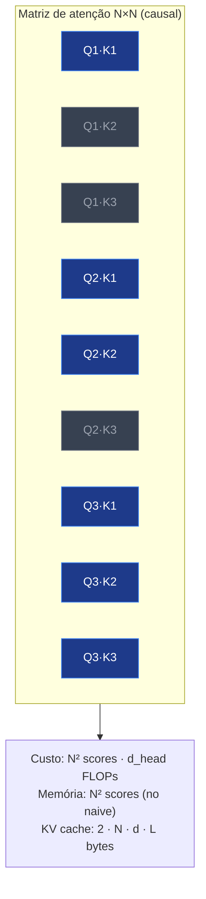

Para N=4096 e d=128, são ~67M operações de produto interno **por cabeça, por camada**. Para N=1M, são **~16 trilhões** de operações por cabeça por camada. FlashAttention (Post 06) reduz a constante e a banda de memória, mas o **expoente quadrático permanece**.

### 1.2. Por que KV cresce linear?

Cada token gerado guarda seu **K** e seu **V** para que tokens futuros possam atender a ele. Para um modelo com:

- L camadas
- H cabeças
- d_head dimensão por cabeça
- precisão p bytes (fp16=2, fp8=1, int4=0.5)

**KV cache total ≈ 2 · N · L · H · d_head · p bytes.**

Em um Llama 3 70B (L=80, H=64, d_head=128, fp16=2 bytes):
- 1 token ≈ 2.6 MB de KV
- 4k tokens ≈ 10.5 GB
- 32k tokens ≈ 84 GB
- 1M tokens ≈ **2.6 TB de KV cache** (em fp16)

A quantização de KV (Post 05) ajuda — em int4 isso vira ~650 GB, ainda monstruoso para 1 sequência. Por isso modelos como Gemini 2.5 ou Llama 4 não rodam atenção plena em 10M tokens em 1 GPU; usam **paralelismo de sequência**, **sliding window**, **MoE de KV** ou **arquiteturas híbridas**.

### 1.3. O problema da extrapolação posicional

Os Transformers originais (Vaswani 2017) usavam **encodings sinusoidais**. A justificativa: senos e cossenos são periódicos, então em teoria o modelo poderia extrapolar para posições nunca vistas.

Na prática, **não extrapola**. Press et al. (2022) mostraram que sinusoidal e learned positional embeddings degradam catastroficamente assim que você passa do comprimento de treino. RoPE (Su et al. 2021) tem comportamento parecido se usado *naive*. Por isso surgiu a **família de extensões de RoPE**: para reaproveitar modelos pré-treinados em janelas maiores **sem retreinar do zero**.

---

## 2. Encodings posicionais: do sinusoidal ao RoPE

Atenção pura (Q·Kᵀ) é **invariante a permutação**: trocar a ordem dos tokens não muda nada. O encoding posicional injeta a noção de "este token está na posição 17, aquele na posição 245".

### 2.1. Sinusoidal (Vaswani et al. 2017)

Cada posição *p* recebe um vetor fixo cujas componentes são senos e cossenos de frequências geométricas:

```
PE(p, 2i)   = sin(p / 10000^(2i/d))
PE(p, 2i+1) = cos(p / 10000^(2i/d))
```

- Não tem parâmetros aprendíveis.
- A intuição era que diferenças de posição (p2 − p1) seriam expressáveis por combinações lineares de PE(p1) e PE(p2). Funciona em teoria; extrapola mal na prática.
- Ainda usado em alguns Transformers small e modelos de visão (ViT).

### 2.2. Learned positional embeddings (BERT, GPT-2, GPT-3)

Cada posição vira uma linha de uma tabela aprendida: `embed_pos[p]`. Simples, mas **não extrapola** para p > comprimento de treino — não há linha na tabela.

### 2.3. ALiBi — Attention with Linear Biases (Press et al. 2022)

ALiBi joga fora a noção de embeddings posicionais e injeta posição **diretamente nos scores de atenção**, somando um *bias linear*:

```
attention_score(i, j) = Qᵢ·Kⱼ − m · (i − j)
```

Onde `m` é uma constante específica por cabeça (não treinada). Quanto mais distante j está de i, maior a penalidade.

- **Vantagem decisiva:** extrapola muito bem. Treinar com 1024, inferir com 2048 funciona razoavelmente.
- 11% mais rápido e 11% menos memória que sinusoidal segundo o paper.
- Usado em **MPT (MosaicML)**, **BLOOM**, **Falcon**, alguns modelos do Replit.
- **Desvantagem:** o decaimento é monotônico — ALiBi tende a "esquecer" muito rápido tokens distantes. Em tarefas de recall longo (precisar lembrar de algo a 50k tokens atrás), ALiBi tem performance inferior a RoPE+escala.

### 2.4. RoPE — Rotary Position Embedding (Su et al. 2021)

RoPE virou o **padrão de fato** desde 2023. Llama, Llama 2/3/4, Mistral, Qwen, Gemma, Phi, DeepSeek, Yi, Mixtral — todos usam RoPE.

A ideia: em vez de **somar** um vetor posicional a Q e K, **rotacionar** Q e K em pares de dimensões por um ângulo proporcional à posição. Cada par (d_2i, d_2i+1) é rotacionado por um ângulo θᵢ = p · ωᵢ, onde:

```
ωᵢ = base^(−2i/d),   base padrão = 10000
```

Após a rotação, o produto interno Qᵢ·Kⱼ depende **apenas da diferença (i − j)**, não das posições absolutas. É uma forma elegante de codificar **posição relativa**.

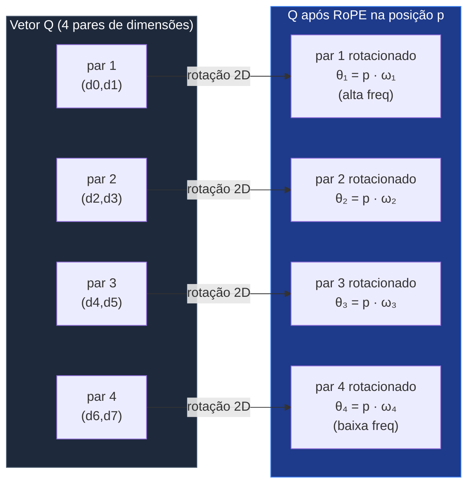

#### Analogia: RoPE = cofre de relógios

> Imagine cada par de dimensões como um **relógio analógico**. Os pares de baixo índice são "relógios rápidos" (freq alta) — giram muitas voltas em poucas posições. Os pares de alto índice são "relógios lentos" (freq baixa) — uma volta inteira leva milhões de posições.
>
> A posição p é codificada como o **estado conjunto de todos esses relógios** após p ticks. Quando o modelo compara Q (na posição i) com K (na posição j), o que importa é a **diferença de relógios** — quantos ticks separam as duas posições.
>
> Os relógios rápidos discriminam vizinhança fina ("o token anterior", "dois tokens atrás"). Os relógios lentos discriminam contexto global ("alguém falou disso há 8000 tokens?").

#### Por que RoPE não extrapola sozinho

O comprimento máximo treinado define o "raio máximo" que cada relógio fica girando. Quando você usa posição maior que o treinado, os **relógios rápidos** completam voltas que o modelo nunca viu — entram em **regime caótico**. Daí a necessidade de extensões.

### 2.5. Tabela comparativa: encodings posicionais

| Encoding | Tipo | Extrapola? | Custo extra | Modelos | Janela típica |
|---|---|---|---|---|---|
| Sinusoidal | Aditivo, fixo | Mal | Zero | Vaswani original, ViT | Até treino |
| Learned PE | Aditivo, treinado | Não | Tabela N×d | BERT, GPT-2, GPT-3 | Travada no treino |
| ALiBi | Bias direto em score | Bom (~2× treino) | Zero | MPT, BLOOM, Falcon | 2k → 4-8k OK |
| RoPE base | Rotação relativa | Mal sem extensão | Zero | Llama 1, GPT-NeoX, Mistral 7B v0.1 | Até treino |
| RoPE + NTK-aware | Escala não-linear da base | Decente sem fine-tune | Zero | Llama 2 long-context comunitário | 4k → 8-16k |
| RoPE + Position Interpolation (PI, Chen 2023) | Comprime posições linearmente | Bom com fine-tune | Zero | Llama 2 32k Meta | 4k → 32k |
| RoPE + YaRN (Peng 2023) | NTK-by-parts + atenção temperada | Muito bom | Zero | Mistral 7B 128k, Code Llama, Yi 200k | 4k → 128k |
| LongRoPE (Microsoft 2024) | Busca não-uniforme + 2 estágios | Excelente | Busca evolutiva | Phi-3 mini 128k, Phi-3 medium 128k | 4k → 2M |

A maior parte dos modelos comerciais de 2024-2026 usa **RoPE + alguma extensão**. ALiBi caiu em desuso para LLMs grandes porque empata em qualidade de extrapolação **se** RoPE for bem escalado, e perde em recall de longo alcance.

---

## 3. Estendendo RoPE: NTK, Position Interpolation, YaRN, LongRoPE

Esta seção é o coração do post para quem quer **estender modelos open-source** sem retreinar do zero.

### 3.1. Position Interpolation (PI) — Chen et al. 2023

A intuição mais simples: se o modelo aprendeu posições de 0 a L, e queremos estender para posições de 0 a kL, então **comprima** as novas posições para caberem no intervalo treinado.

Em vez de aplicar rotação θ = p · ωᵢ, aplique θ = (p / k) · ωᵢ.

```
RoPE(p, ω) → RoPE(p/k, ω)
```

Onde k = (novo_comprimento / comprimento_treino). Por exemplo, para estender Llama 2 (treino=4k) para 32k, k=8.

**Vantagem:** simples; com ~1000 passos de fine-tune, modelos esticam bem.
**Desvantagem:** comprime **igualmente** todas as frequências, prejudicando os relógios rápidos (perdem resolução fina). Em testes de recall fino, PI tem queda perceptível.

### 3.2. NTK-aware scaling (bloke da comunidade, formalizado em YaRN)

Inspirado por análise NTK (Neural Tangent Kernel): o problema com PI é que ele esmaga as frequências altas. NTK-aware propõe **escalar a base** do RoPE:

```
base_nova = base · k^(d/(d−2))
```

Isso preserva as frequências altas (relógios rápidos continuam rápidos) e estica apenas as frequências baixas (relógios lentos se tornam **ainda mais lentos**, abrangendo mais posições).

- **Dynamic NTK**: ajusta a escala dinamicamente em função do comprimento da sequência. Bom para modelos zero-shot (sem fine-tune).
- **NTK-by-parts**: separa as dimensões em três grupos (alta freq preservada, média freq escalada NTK, baixa freq escalada PI). Base de YaRN.

### 3.3. YaRN — Yet another RoPE extensioN (Peng et al. 2023)

YaRN é hoje a técnica de extensão *single* mais usada na comunidade open-source. Combina três ingredientes:

1. **NTK-by-parts interpolation** (descrito acima).
2. **Atenção com temperatura ajustada**: ao escalar para janelas maiores, a entropia da distribuição de atenção muda. YaRN multiplica os scores de atenção por uma constante √(0.1 · ln(s) + 1), onde s é o fator de escala. Mantém a distribuição "afiada".
3. **Fine-tune curto** (10x menos tokens, 2.5x menos passos que métodos anteriores).

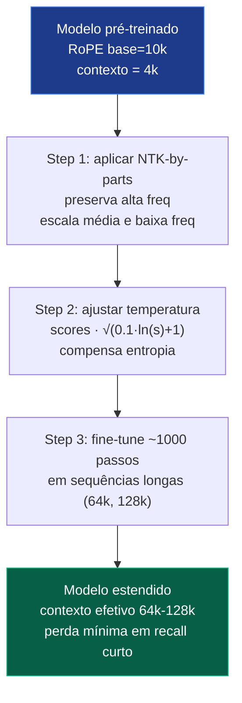

Resultados publicados: YaRN-Mistral 7B atinge 128k tokens com perplexity competitiva e recall de "needle-in-the-haystack" comparável a modelos treinados nativamente em janelas maiores. YaRN virou **base de muitos modelos community-extended** (Yi-200k, Mistral 7B v0.2, Code Llama 100k, vários "long-context-finetune" no Hugging Face).

### 3.4. LongRoPE (Microsoft 2024)

LongRoPE empurra a fronteira para **2M tokens**. Três inovações:

1. **Não-uniformidade na interpolação**: em vez de uma única função de escala, faz uma **busca evolucionária** sobre fatores de escala individuais por dimensão. Descobre que dimensões específicas precisam de escalas diferentes.
2. **Estratégia progressiva**: primeiro fine-tune para 256k; depois aplica nova interpolação para 2048k; depois ajusta para preservar performance em janela curta.
3. **Recovery em 8k**: re-ajuste leve para não perder qualidade nos primeiros 8k tokens (que é onde 95% dos prompts reais ficam).

Integrado em **Phi-3 mini 128k** e **Phi-3 medium 128k**. Versão **LongRoPE2** (2025) refina ainda mais com escalonamento "near-lossless".

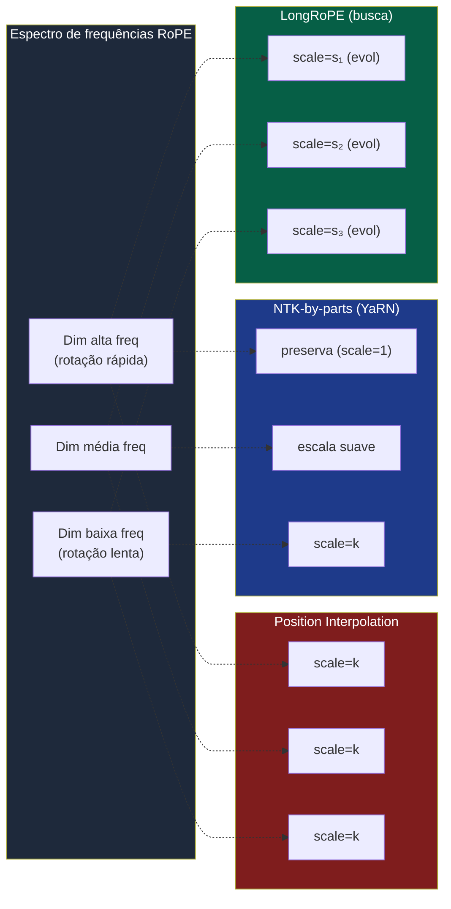

#### Analogia: YaRN/LongRoPE = esticando o relógio

> Posição é tempo: cada relógio (par de dimensões) marca uma "hora" diferente. Se o modelo só aprendeu a "ler relógios" para um dia (contexto curto) e você quer cobrir uma semana, há três estratégias:
>
> 1. **PI**: encolher uniformemente todos os ponteiros. Funciona, mas você perde a noção de minutos (alta freq).
> 2. **YaRN**: deixar os ponteiros rápidos como estão e esticar só os ponteiros lentos. Você ainda lê minutos, mas as horas do dia agora marcam dias da semana.
> 3. **LongRoPE**: testar uma combinação **diferente de esticamento por relógio**, descobrindo empiricamente quais ponteiros aguentam ser esticados mais e quais não.
>
> A noite — o "regime caótico" onde os ponteiros viram demais — fica adiada para muito mais longe.

### 3.5. Comparativo de extensões

| Técnica | Fine-tune? | Janela típica | Qualidade | Custo extra | Quem usa |
|---|---|---|---|---|---|
| Position Interpolation (PI) | ~1k passos | 4k → 32k | Boa | Zero | Llama 2 32k Meta |
| NTK-aware (dynamic) | Não | 4k → 8k | Decente | Zero | Llama 2 zero-shot |
| NTK-by-parts (YaRN base) | ~400 passos | 4k → 64-128k | Muito boa | Zero | Mistral 7B 128k |
| YaRN (full) | ~1k passos | 4k → 128k | Muito boa | Pequeno (temp) | Yi-200k, Code Llama 100k |
| LongRoPE | ~1k passos + busca | 4k → 2M | Excelente | Busca evolutiva | Phi-3 128k |
| LongRoPE2 (2025) | Otimizado | 4k → 4M+ | Quase lossless | Otimização | Phi-4 long-context |

Em 2025, a Microsoft publicou **LongRoPE2: Near-Lossless LLM Context Window Scaling**, refinando ainda mais a busca por escalas.

---

## 4. Sliding Window Attention e variantes

Outra família de soluções: **não atender a tudo**. Cada token só vê os **W tokens anteriores**.

### 4.1. Sliding Window básico

- **Custo:** O(N · W) em vez de O(N²). Linear em N.
- **KV cache:** O(W · L · H · d_head). Constante em N (uma vez que a janela enche).
- **Limitação:** o modelo não enxerga nada antes da janela. Para contexto longo "verdadeiro", precisa de mecanismos extras.

### 4.2. Longformer (Beltagy et al. 2020)

Sliding window + **global attention** em alguns tokens especiais (CLS, perguntas). Os globais atendem a tudo e recebem atenção de tudo. Pioneiro em **128k tokens** para tarefas de QA.

### 4.3. Mistral 7B v0.1 — Sliding Window Attention (SWA)

Mistral introduziu SWA com janela de **4096** tokens em um modelo treinado para 8k de contexto efetivo. A ideia: cada camada vê 4k tokens, mas como há **L camadas empilhadas**, a "informação efetiva" se propaga por L · W = 32 · 4096 ≈ 128k tokens via **receptive field**.

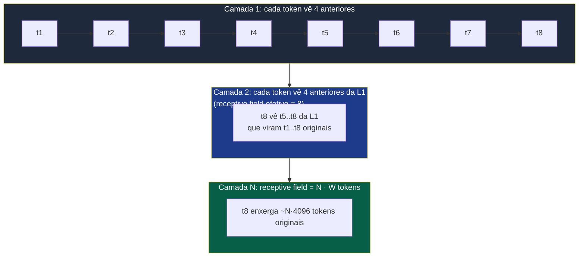

**Trade-off:** receptive field é só "potencial". Se o modelo não foi treinado para usar esse caminho, informação distante chega muito diluída. Mistral abandonou SWA puro nas versões posteriores (Mistral 7B v0.2 em diante usa atenção plena com RoPE estendido).

### 4.4. Outras variantes

- **BigBird (Zaheer et al. 2020):** sliding window + global tokens + **random** attention (alguns tokens aleatórios). Aproximação de atenção plena com complexidade linear.
- **Longformer-Encoder-Decoder (LED):** sliding em encoder, atenção plena em decoder.
- **Sparse Transformer (Child et al. 2019):** padrão fixo de atenção esparsa (strided + local).

Em LLMs autoregressivos modernos, sliding window puro perdeu para abordagens híbridas (sliding + sink + RoPE estendido) ou para arquiteturas SSM.

---

## 5. StreamingLLM e o papel dos "sink tokens"

Em 2023, Xiao et al. (MIT/Meta/CMU) publicaram **Efficient Streaming Language Models with Attention Sinks** (arXiv:2309.17453). Descoberta surpreendente que reorganizou como pensamos sobre janelas longas.

### 5.1. O paradoxo do sliding window

Se você simplesmente usa **sliding window** em decodificação infinita (chatbot rodando dias), a perplexidade **explode** assim que os primeiros tokens saem da janela.

Era esperado um **degradation gradual** — não. É um colapso abrupto: o modelo começa a gerar lixo.

### 5.2. A descoberta dos "attention sinks"

Olhando os heatmaps de atenção, Xiao et al. notaram que **mesmo em camadas profundas**, os primeiros 1-4 tokens recebem **uma fração desproporcional da atenção**, mesmo quando são tokens semanticamente vazios (BOS, espaço, ".").

Por quê? **Porque o softmax força que os pesos de atenção somem 1.** Quando uma cabeça "não tem nada útil para atender", ela precisa **descartar atenção em algum lugar**. Os primeiros tokens viraram esse "ralo" — porque são vistos por todos os outros tokens (causal).

> **Os primeiros tokens são "pias de excesso de atenção".** O modelo aprende a usá-los como buffer para regularizar a distribuição.

### 5.3. StreamingLLM = sink tokens + janela móvel

A solução é elegante: **mantenha permanentemente os primeiros 4 tokens** no KV cache, mesmo deslizando o resto.

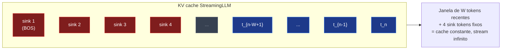

Resultado: modelos como Llama-2-7B podem processar **4 milhões de tokens em stream** com perplexidade estável, sem fine-tune, com **22x speedup** versus recomputar a janela a cada inferência.

### 5.4. Sink tokens "treinados de propósito"

O paper mostra que se você **adiciona um token-sink dedicado durante o pré-treino** (um token especial que não carrega semântica, só serve como ralo de atenção), a estabilidade em streaming melhora ainda mais. Modelos posteriores (incluindo gpt-oss da OpenAI) adotaram essa prática.

### 5.5. Adoção na indústria

StreamingLLM virou um dos *backbones* implícitos da inferência moderna:
- HuggingFace Transformers tem suporte direto.
- NVIDIA TensorRT-LLM implementou.
- OpenAI menciona "attention sink mechanism" em modelos open weights (gpt-oss).
- Muitos servidores de chat de longo prazo usam alguma variante para não ter que recomputar do zero a cada turno longo.

#### Analogia: sink = thread no Twitter

> Em qualquer thread longo no Twitter/X, mesmo se você só lê os últimos posts, **o post inicial ancora o contexto**. Tirar o primeiro post deixa o resto do thread sem âncora. Os attention sinks são o "post inicial do thread" — ancoram o stream mesmo quando todo o resto rola pela janela.

### 5.6. Por que só sink + janela não é suficiente para tudo?

StreamingLLM **não recupera informação que saiu da janela**. Se você precisa lembrar literalmente de algo dito há 1M tokens, sink + janela não traz de volta — a informação foi descartada do KV.

Por isso, em produção, StreamingLLM costuma vir combinado com:
- **RAG** para acesso a memória factual antiga;
- **Sumarização periódica** ("compressing summary" das janelas que saíram);
- **YaRN/LongRoPE** quando o usuário precisa de "atenção plena estendida" para fragmentos longos.

---

## 6. Ring Attention: paralelizar contexto entre GPUs

Liu, Zaharia & Abbeel (UC Berkeley, 2023) — **Ring Attention with Blockwise Transformers for Near-Infinite Context** (arXiv:2310.01889). Um trabalho que destravou treino e inferência em janelas de **dezenas de milhões de tokens**.

### 6.1. O insight: dividir a sequência, não o batch

Em paralelismo tradicional (data parallelism), cada GPU pega um **batch** diferente. Mas se a **sequência** é o gargalo, você quer que cada GPU pegue um **pedaço da mesma sequência**.

Isso é **sequence parallelism**. Existe há tempo (Megatron-LM já fazia variantes), mas o desafio é a **atenção**: cada Q precisa ver **todos os Ks e Vs**. Se Q da GPU 1 só vê K/V locais, perdemos atenção plena.

### 6.2. A topologia em anel

Ring Attention organiza N GPUs em um **anel lógico**. Cada GPU guarda um pedaço da sequência (digamos, N/G tokens onde G = número de GPUs). Computa atenção com seu próprio K/V, depois **passa K/V para o vizinho** enquanto recebe K/V do anterior.

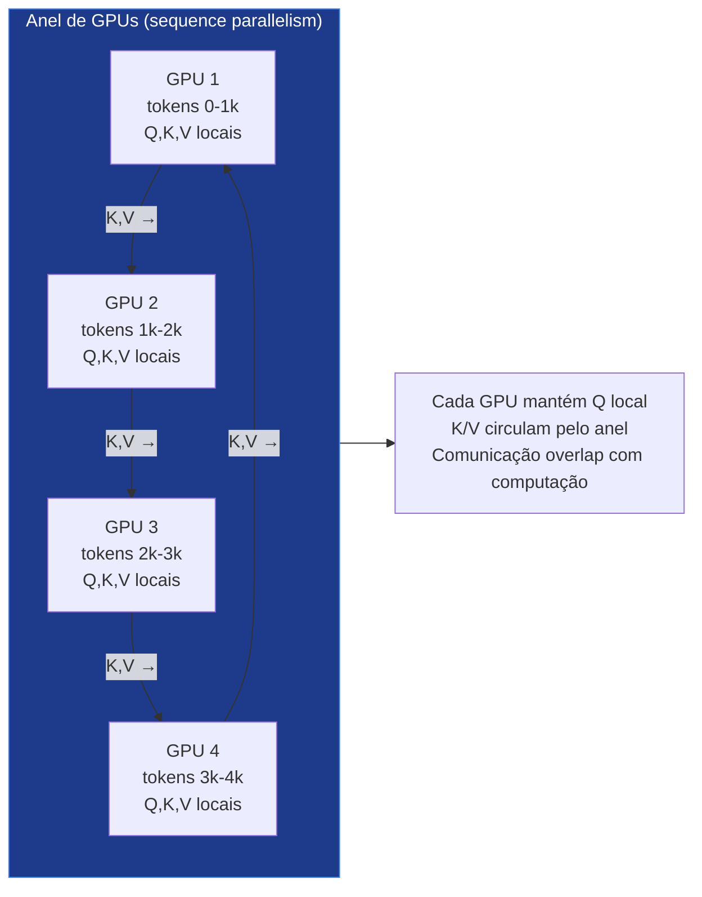

Após G rodadas (G = número de GPUs), cada Q já viu **todos** os K/V da sequência inteira. Atenção plena, distribuída.

### 6.3. Por que funciona bem na prática

- **Comunicação overlap com computação**: enquanto a GPU computa atenção do bloco corrente, ela já está enviando o próximo bloco e recebendo o anterior. Bandwidth é "escondida".
- **Memória por GPU é constante** em N: cada GPU guarda só seu pedaço (~N/G tokens). Quanto mais GPUs, maior a sequência possível.
- **Sem aproximação**: é atenção exata, não esparsa. Qualidade não cai.

Liu et al. demonstraram **100M+ tokens** num cluster de 512 TPUv4. O **Large World Model (LWM)** treinado com Ring Attention conseguiu janelas de **1M tokens em vídeo + texto**.

### 6.4. Variantes

- **Striped Attention** (Brandon et al. 2023): otimização de Ring Attention para casos causais. Em causal attention, distribuir consecutivamente cria desbalanço (algumas GPUs ficam com mais trabalho). Stripe distribui em padrão "intercalado", balanceando.
- **DeepSpeed Ulysses**: alternativa baseada em all-to-all em vez de ring. Trade-off diferente entre comunicação e memória.
- **Sequence Parallelism em Megatron-LM**: integrado em frameworks de treino de larga escala.

### 6.5. Quando Ring Attention faz sentido

- **Treino**: sim, sempre que o contexto é maior que cabe em 1 GPU.
- **Inferência batch**: sim, para servir queries longas (1M tokens) que não caberiam em GPU única.
- **Inferência streaming/chat**: menos prático — comunicação tem latência. Para chats com muitos usuários, sliding window + sink tende a ganhar.

---

## 7. Memória externa e RAG

Toda essa engenharia para esticar a janela ignora um fato pragmático: **muitos casos de uso "contexto longo" são na verdade casos de "preciso de informação relevante", não de "preciso ver tudo simultaneamente"**.

### 7.1. RAG — Retrieval-Augmented Generation

Em vez de jogar 100k tokens no prompt, **indexe** seus documentos em um vector store, recupere os K mais relevantes para a query, e passe **só esses** para o LLM.

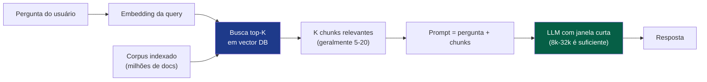

**Vantagens:**
- Janela do LLM permanece pequena (custo previsível).
- Atualizações no corpus não exigem retreinar nada.
- Citação/grounding fica natural (você sabe quais chunks foram usados).

**Desvantagens:**
- Qualidade depende **fortemente** da qualidade do retriever.
- Não funciona bem para tarefas que precisam de **raciocínio cruzado** entre muitos documentos simultâneos (graph reasoning, sumarização global, code search transversal).
- "Lost in the middle" ainda pode acontecer dentro do prompt construído.

### 7.2. Híbridos RAG + janela longa

Padrão emergente em 2025-2026: **janelas grandes (1M)** + **RAG** *como first-pass*. RAG pré-filtra para evitar pagar custo de 1M tokens em queries simples; janela longa fica disponível para queries complexas.

### 7.3. Compressive Memory — Memorizing Transformer (Wu et al. 2022)

Adiciona uma **camada de memória externa** que armazena (K, V) de tokens passados em um índice kNN. Cada query consulta os K mais próximos da memória. Combina atenção local com **lookup global** sem custo quadrático.

Precursor conceitual de muito do que veio depois (Infini-attention, Memorizing-RAG, etc.).

---

## 8. Infini-attention: memória compressiva integrada (Google 2024)

Munkhdalai, Faruqui & Gopal (Google) propuseram **Leave No Context Behind: Efficient Infinite Context Transformers with Infini-attention** (arXiv:2404.07143). Tenta unir o melhor de dois mundos: atenção local **+** memória compressiva linear, dentro da mesma camada.

### 8.1. Arquitetura

Cada cabeça de atenção tem **dois "fluxos"**:

1. **Atenção local mascarada**: como sliding window — atende aos últimos N tokens com atenção exata.
2. **Memória compressiva linear**: um "estado de memória" (matriz Mₛ) que acumula informações do passado em um formato compactado, atualizado de forma recursiva (delta rule, similar a linear attention).

A saída da cabeça é uma **combinação aprendida** dos dois:
```
output = β · local_attn + (1 − β) · memory_lookup(Q, M)
```

Onde β é uma porta aprendida (gate sigmoid) por cabeça/posição.

### 8.2. Atualização da memória

A memória M é atualizada após cada bloco usando uma regra recorrente (semelhante ao delta rule de RWKV / RetNet):

```
M_{s+1} = M_s + φ(K_s)ᵀ · V_s
```

Onde φ é uma função de feature map (geralmente ELU+1 ou similar). É essencialmente **linear attention** acumulando estado entre blocos.

Como M tem tamanho **fixo** (d × d ou similar), a memória **não cresce** com a sequência. É a "compressive memory": o passado fica codificado em uma matriz limitada, **comprimido com perdas**.

### 8.3. Resultados

- **1B e 8B** parâmetros testados.
- Sequências de **1M tokens** processadas após fine-tune apenas em 5k.
- Sumarização de livros (500k tokens) competitiva.
- Memória bounded constante — viabiliza streaming infinito sem KV cache crescer.

### 8.4. Limitações

- "Compressivo com perdas" é uma faca de dois gumes: passado distante fica **borrado**. Tasks de recall pontual (achar uma agulha) sofrem.
- Não substitui atenção plena para tarefas que dependem de detalhe fino em pontos específicos.
- Ainda não há um "Llama Infini-attention" produção; é mais um **building block** que aparece em arquiteturas híbridas.

---

## 9. Alternativas ao Transformer: Mamba, Jamba, RWKV, RetNet

Nesta seção, saímos da família atenção e entramos no **espaço de modelos recorrentes modernos** que prometem **complexidade linear** em treino **e** inferência.

### 9.1. State Space Models — recap

State space models (SSMs) modelam uma sequência como um sistema linear contínuo:

```
h(t)' = A · h(t) + B · x(t)    (estado)
y(t)  = C · h(t)               (saída)
```

Discretizado, vira uma **recorrência**:
```
h_t = Ā · h_{t-1} + B̄ · x_t
y_t = C · h_t
```

Versões anteriores (S4, Gu et al. 2022) tinham A, B, C **fixos** (não dependiam do input). Boa eficiência, mas **conteúdo não influenciava o estado** — limitação grave para linguagem.

### 9.2. Mamba — Selective SSM (Gu & Dao, dezembro 2023)

A inovação central do Mamba: **fazer A, B, C dependentes do input** (`A_t = f(x_t)`). Isso transforma o SSM de um filtro fixo num **mecanismo seletivo**: dependendo do token, o estado pode reter/esquecer informação diferente.

Acoplado a um **algoritmo paralelo hardware-aware** (parallel scan que roda eficientemente em GPU), Mamba consegue:
- **Treino paralelo** (como Transformer): O(N log N) ou O(N) dependendo do scan usado.
- **Inferência recorrente** com estado de tamanho fixo: O(1) por token, **sem KV cache crescente**.

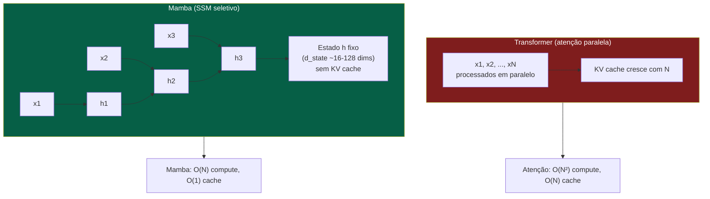

#### Analogia: Mamba = diário com resumo diário

> Imagine que você precisa lembrar o que aconteceu no ano todo. Duas estratégias:
>
> 1. **Transformer**: re-leia o diário inteiro toda vez que quiser tomar uma decisão. Custo cresce com o tamanho do diário.
> 2. **Mamba**: mantenha um **resumo** que você atualiza no fim de cada dia, decidindo conscientemente o que vale a pena guardar e o que pode ser esquecido. O resumo cabe em uma página, sempre.
>
> O resumo (estado h) tem tamanho fixo. A "decisão" do que guardar/esquecer é o que A_t, B_t aprendem a fazer com base no input.

### 9.3. Mamba-2 (Dao & Gu, maio 2024)

Mamba-2 unifica SSM e atenção via um framework chamado **State Space Duality (SSD)**. Mostra que SSMs com estrutura específica são equivalentes a um tipo de atenção linear (com mascaramento estruturado).

- 2-8x mais rápido que Mamba-1 em hardware moderno.
- Dimensão de estado maior (256+).
- Permite usar truques de tensor cores (matmuls grandes em vez de scans), o que casa melhor com GPUs A100/H100.

### 9.4. Jamba (AI21, 2024-2025)

A AI21 publicou **Jamba** — primeiro modelo *production-grade* com arquitetura híbrida Mamba + Transformer + MoE.

- **Razão Mamba:Transformer:** ~7:1 (sete blocos Mamba para cada bloco de atenção plena). Equilibra capacidade de recall (atenção) com eficiência (Mamba).
- **MoE**: 12B parâmetros ativos de 52B totais (Jamba-1.0). Versões 1.5 chegam a 94B ativos / 398B totais.
- **Janela**: 256k tokens nativos, com até 140k cabendo numa única GPU (A100 80GB).
- **Throughput**: 3x Mixtral 8x7B em contexto longo.
- Apache 2.0.

Jamba2 (2025) lança variantes 3B densos e 52B/12B MoE focados em produção.

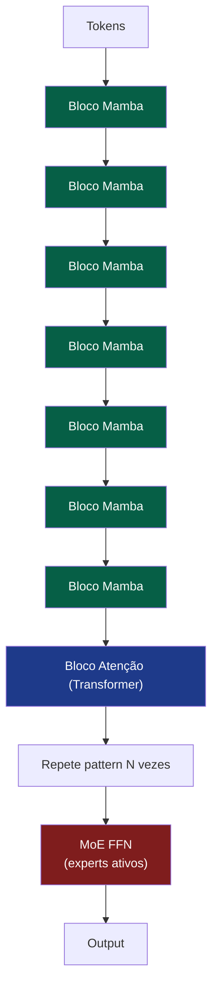

### 9.5. Falcon Mamba (TII, 2024)

Modelo open-source **puramente Mamba** de 7B parâmetros, sem nenhum bloco de atenção. Demonstrou que Mamba puro pode competir com Llama 3 / Mistral em benchmarks gerais. Boa prova de conceito, mas em recall fino ainda fica atrás de modelos com atenção.

### 9.6. RWKV-7 "Goose" (2025)

RWKV é uma família de modelos linear-attention com herança de RNNs, mantida por uma comunidade open-source liderada pelo Bo Peng. RWKV-7 introduz:

- **Generalized delta rule** com **vector-valued gating** e **in-context learning rates**.
- Capacidade de **state tracking** e reconhecer **todas as linguagens regulares** (capacidade que o Transformer puro **não tem** sob conjecturas padrão de complexidade — Transformers ficam limitados a TC0).
- Modelos de 0.19B a 2.9B parâmetros, treinados em 3.1T tokens multilíngues.
- Inferência com **memória constante** e tempo constante por token.

RWKV brilha em **edge devices** e cenários onde memória/latência por token importa mais que SOTA absoluto.

### 9.7. RetNet (Retentive Network, Microsoft 2023)

RetNet (Sun et al. 2023) propôs um substituto para a atenção chamado **retention**, com três modos:

- **Paralelo** (treino, como Transformer).
- **Recorrente** (inferência, O(1) por token).
- **Chunkwise recorrente** (sequência longa em blocos).

Resultados publicados: 3.4x menos memória, 15.6x mais throughput, 8.4x menos latência que Transformers em inferência.

Adoção em produção foi limitada (RetNet original não decolou ao nível do Mamba), mas o paradigma "três modos" inspirou design subsequente.

### 9.8. Tabela: Transformer vs alternativas

| Modelo | Train | Infer | KV cache | Recall fino | State tracking | Maturidade |
|---|---|---|---|---|---|---|
| Transformer puro | O(N²) | O(N) por token (com cache) | O(N) crescente | Excelente | Limitado (TC0) | Padrão de fato |
| Sliding Window | O(N·W) | O(W) por token | O(W) constante | Bom até W tokens | Limitado | Maduro (Mistral, Longformer) |
| StreamingLLM (sink+W) | — (inferência) | O(W) por token | O(W+sinks) | Bom até W | Limitado | Maduro, em produção |
| Ring Attention | O(N²/G) por GPU | O(N/G) por GPU | O(N/G) por GPU | Excelente | Pleno | Maduro em treino |
| Mamba / Mamba-2 | O(N) | O(1) por token | Estado fixo | Médio (cai em needle-tasks) | Pleno (linguagens regulares) | Jovem mas crescendo |
| Jamba (híbrido) | O(N) + atenção plena pontual | misto | Misto | Bom (atenção em pontos-chave) | Pleno | Production-ready (2024+) |
| RWKV-7 | O(N) | O(1) por token | Estado fixo | Médio | Pleno | Jovem, popular em edge |
| RetNet | O(N²) treino, O(1) infer | O(1) por token | Estado fixo | Médio | — | Acadêmico |
| Infini-attention | O(N·W) + memória | O(W) + lookup | O(W + M_fixed) | Bom local + médio remoto | Pleno | Pesquisa Google |

---

## 10. Comparação prática: o que escolher?

### 10.1. Tabela de decisão

| Cenário | Janela esperada | Restrição dominante | Recomendação |
|---|---|---|---|
| Chat 8k-32k, throughput alto | ≤ 32k | Latência | RoPE + atenção plena + KV em fp8/int4 |
| Chat infinito (assistente sempre-ligado) | ∞ tokens, sem precisar lembrar tudo | KV cresce | StreamingLLM (sink + sliding) |
| QA sobre 1M docs | Recuperar trechos | Preço por query | RAG + janela 16-32k |
| Análise de codebase grande (200k LOC) | 200k-500k | Recall semântico | Janela longa (YaRN/LongRoPE) + retrieval híbrido |
| Sumarização de livro (500k+ tokens) | 500k+ | Recall global | Mamba/Jamba ou Infini-attention |
| Treino de modelo com 1M+ contexto | 1M+ | Treino | Ring Attention + sequence parallelism |
| Edge/mobile com prompts longos | 32k+ | Memória RAM | Mamba ou RWKV (estado fixo) |
| Vídeo + texto, hora+ de duração | 1M-10M | Compute | Ring Attention no treino, Mamba/Jamba inferência |

### 10.2. Modelos atuais (2025-2026) e suas estratégias declaradas

| Modelo | Janela | Encoding | Estratégia |
|---|---|---|---|
| Llama 4 Scout (Meta, abr 2025) | 10M (declarada) | RoPE escalado iRoPE | "Lost in middle" forte; recall efetivo bem menor |
| Llama 4 Maverick | 1M | RoPE estendido | Atenção plena + MoE |
| Gemini 2.5 Pro | 1M | Não detalhado oficialmente | Suspeita: Ring + RAG implícito |
| Claude Sonnet 4.x | 1M | Não detalhado | Forte na qualidade até ~200k |
| GPT-5.x | 1M+ | Não detalhado | Atenção sink + sliding window misturados |
| Qwen 3.6 Plus | 1M | Provável YaRN/escala RoPE | Open-weight, forte em multilíngue |
| Mistral Large/Codestral | 256k+ | YaRN | Open-weight |
| Phi-3 mini/medium 128k | 128k | LongRoPE | Eficiência em modelos pequenos |
| Jamba 1.5 / Jamba2 | 256k+ | Mamba (sem RoPE em SSM blocks) | Híbrido SSM+Atenção+MoE |
| Falcon Mamba 7B | 256k | Sem encoding (SSM puro) | Apache 2.0, prova de conceito |
| RWKV-7 Goose | até 1M+ | Sem RoPE (recorrente) | Modelos pequenos eficientes |

### 10.3. O paradoxo dos contextos "10M efetivos"

Trabalho recente (relatado em vários blogs técnicos em 2025-2026) mostra que **a janela declarada e a janela utilizável divergem dramaticamente**:

- **Llama 4 Scout (10M declarada)**: scores de compreensão em **128k** já caem para ~15%. Recall semântico efetivo estimado em ~1k tokens em testes adversariais. **Quase 4 ordens de grandeza** abaixo da janela declarada.
- **Claude 3.5 Sonnet (200k)**: recall efetivo ~4k em algumas tasks complexas. ~2% do declarado.
- **Gemini 2.0 Flash (1M)**: ~4k efetivo em recall semântico avançado.

A causa raiz é o fenômeno **"Lost in the Middle"** (Liu et al. 2023): LLMs recuperam bem informação no **início** e no **fim** do prompt, mas catastroficamente mal no **meio**. A degradação piora com o aumento da janela, mesmo com extensões posicionais perfeitas.

Lições práticas:
- Não confie em janela declarada para tasks complexas. **Teste no seu domínio**.
- Estruturação do prompt importa: ponha dados críticos no começo ou no final.
- RAG ainda é seu amigo — recuperar 16k tokens relevantes vence colocar 1M de tokens com 99% de ruído.

### 10.4. Trade-offs resumidos

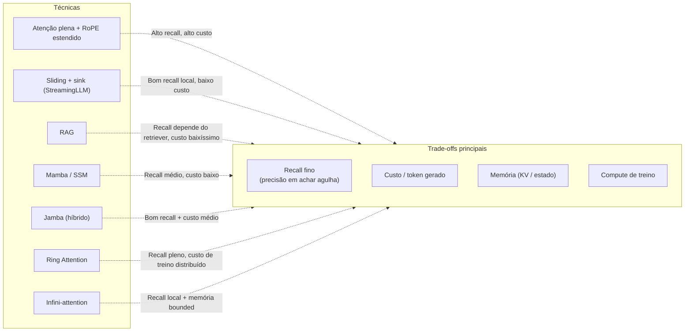

---

## 11. Conclusão

A questão "como gerenciar contexto longo em LLMs" se decompôs em uma constelação de subproblemas, cada um com sua família de técnicas:

- **Posição**: do sinusoidal ao RoPE, e de RoPE para NTK → PI → YaRN → LongRoPE. O que era um único embedding aditivo virou uma **disciplina de extensão de embeddings rotativos**.
- **Compute / memória**: FlashAttention reduziu a constante; Ring Attention distribuiu entre GPUs; PagedAttention (Post 03) gerenciou KV; sliding window e sinks reduziram a janela ativa; quantização de KV (Post 05) cortou bytes. **Várias técnicas em paralelo**, não uma vencedora.
- **Memória externa**: RAG continua sendo a solução *prática* dominante; Infini-attention e Memorizing Transformer trazem memória compressiva interna como design alternativo.
- **Arquiteturas alternativas**: Mamba/Jamba/RWKV/RetNet demonstram que SSMs e linear attention conseguem competir em muitas tasks, com complexidade linear e estado fixo. Em recall fino ainda perdem; em throughput ganham.

A próxima fronteira não é "qual técnica vence", mas **como combiná-las**. Modelos de produção em 2025-2026 quase sempre usam uma **pilha** de:
1. RoPE estendido (YaRN/LongRoPE) **+**
2. Sliding window com sinks **+**
3. KV quantizado **+**
4. RAG implícito ou explícito **+**
5. Sequence parallelism em treino **+**
6. Em alguns casos (Jamba), blocos Mamba intercalados.

E mesmo assim, o gap entre **janela declarada** e **janela efetiva utilizável** continua aberto. "Contexto longo" é tanto problema de engenharia quanto de **avaliação**: medir corretamente o que o modelo realmente faz em 1M tokens é tão difícil quanto fazer o modelo trabalhar em 1M tokens.

---

## Ponte para o Post 08

> **No último post da série: além da quantização — sparsity, speculative decoding, MoE e distillation. As outras alavancas para ter LLMs grandes em hardware pequeno.**

Já cobrimos quantização (Post 05), KV cache (Post 03) e contexto longo (este post). No 08, fechamos a série com as **técnicas restantes que viabilizam servir LLMs grandes** em GPUs pequenas e CPUs:
- **Sparsity** (estrutural e dinâmica): tirar pesos sem perder qualidade.
- **Speculative decoding**: usar um modelo pequeno para "adivinhar" tokens e validar com o grande.
- **MoE (Mixture of Experts)**: ativar só uma fração dos parâmetros por token (Mixtral, DeepSeek-V2/3, Llama 4, GPT-OSS, Jamba).
- **Distillation**: treinar um modelo pequeno para imitar um grande (Llama 4 Scout veio de Llama 4 Behemoth).

Junto com o que aprendemos até aqui, isso compõe o **arsenal completo** de quem coloca LLMs em produção.

---

## Referências

### Encodings posicionais

- Vaswani, A. et al. (2017). *Attention Is All You Need.* arXiv:1706.03762.
- Su, J. et al. (2021). *RoFormer: Enhanced Transformer with Rotary Position Embedding.* arXiv:2104.09864.
- Press, O., Smith, N., Lewis, M. (2022). *Train Short, Test Long: Attention with Linear Biases (ALiBi).* ICLR 2022. arXiv:2108.12409.

### Extensões de RoPE

- Chen, S. et al. (2023). *Extending Context Window of Large Language Models via Positional Interpolation.* arXiv:2306.15595.
- bloc97 / NTK-aware blog posts (LocalLLaMA reddit, julho 2023). *NTK-aware scaled RoPE.*
- Peng, B. et al. (2023). *YaRN: Efficient Context Window Extension of Large Language Models.* arXiv:2309.00071. ICLR 2024.
- Ding, Y. et al. (Microsoft, 2024). *LongRoPE: Extending LLM Context Window Beyond 2 Million Tokens.* arXiv:2402.13753. ICML 2024.
- Microsoft (2025). *LongRoPE2: Near-Lossless LLM Context Window Scaling.*
- Hugging Face Transformers docs — RoPE scaling (linear, dynamic, YaRN, LongRoPE).

### Sliding window e variantes

- Beltagy, I., Peters, M., Cohan, A. (2020). *Longformer: The Long-Document Transformer.* arXiv:2004.05150.
- Zaheer, M. et al. (2020). *Big Bird: Transformers for Longer Sequences.* arXiv:2007.14062.
- Mistral AI. *Sliding Window Attention* — docs do Mistral 7B v0.1.

### StreamingLLM e sinks

- Xiao, G. et al. (2023). *Efficient Streaming Language Models with Attention Sinks.* arXiv:2309.17453. ICLR 2024.
- MIT-Han Lab blog post: *How Attention Sinks Keep Language Models Stable.*
- HuggingFace Transformers — attention_sink docs.
- Repo: github.com/mit-han-lab/streaming-llm.

### Ring Attention e Sequence Parallelism

- Liu, H., Zaharia, M., Abbeel, P. (2023). *Ring Attention with Blockwise Transformers for Near-Infinite Context.* arXiv:2310.01889.
- Brandon, W. et al. (2023). *Striped Attention: Faster Ring Attention for Causal Transformers.*
- Together AI blog (2023). *Ring Attention Explained.*
- DeepSpeed Ulysses — Microsoft DeepSpeed docs.
- Megatron-LM — sequence parallelism docs.

### Memória externa e Infini-attention

- Borgeaud, S. et al. (2022). *Improving Language Models by Retrieving from Trillions of Tokens (RETRO).* arXiv:2112.04426.
- Wu, Y. et al. (2022). *Memorizing Transformers.* ICLR 2022. arXiv:2203.08913.
- Munkhdalai, T., Faruqui, M., Gopal, S. (Google, 2024). *Leave No Context Behind: Efficient Infinite Context Transformers with Infini-attention.* arXiv:2404.07143.
- Liu, N. et al. (2023). *Lost in the Middle: How Language Models Use Long Contexts.* arXiv:2307.03172.

### SSMs e alternativas ao Transformer

- Gu, A. et al. (2022). *Efficiently Modeling Long Sequences with Structured State Spaces (S4).* arXiv:2111.00396.
- Gu, A., Dao, T. (2023). *Mamba: Linear-Time Sequence Modeling with Selective State Spaces.* arXiv:2312.00752.
- Dao, T., Gu, A. (2024). *Transformers are SSMs: Generalized Models and Efficient Algorithms Through Structured State Space Duality (Mamba-2).* ICML 2024.
- AI21 Labs (2024). *Jamba: A Hybrid Transformer-Mamba Language Model.*
- AI21 Labs (2024-2025). *Jamba 1.5 / Jamba2.*
- TII (2024). *Falcon Mamba 7B.*
- Sun, Y. et al. (Microsoft, 2023). *Retentive Network: A Successor to Transformer for Large Language Models.* arXiv:2307.08621.
- Peng, B. et al. (RWKV team, 2025). *RWKV-7 "Goose" — Architecture and Pretraining Report.*
- HazyResearch / Tri Dao blog posts (2023-2024) sobre SSMs e Mamba.

### Modelos com janelas longas (2024-2026)

- Meta (2025). *Llama 4 Scout / Maverick* — model cards e blog post.
- Google DeepMind. *Gemini 2.5 Pro* — model card.
- Anthropic. *Claude 3.5 / Sonnet 4.x* — system prompts e docs.
- OpenAI. *GPT-5 / GPT-OSS* — model cards.
- Microsoft. *Phi-3 mini/medium 128k* — model cards.
- Alibaba. *Qwen 2.5 / Qwen 3* — model cards e papers técnicos.
- Análises independentes: *AI Context Window Comparison 2026: 1M to 10M Tokens* (digitalapplied.com), *Llama 4 Scout 10M Context: What Actually Works* (ismatsamadov.com), *The Context Window Race: 10M Tokens, 1K Effective* (mmntm.net).

### Recursos práticos

- Hugging Face docs — `RoPE scaling`, `attention_sink`, `sliding_window`.
- vLLM docs — `--rope-scaling`, `--max-model-len`.
- Together AI blog — implementações de Ring Attention.
- LocalLLaMA (reddit) — discussões comunitárias sobre extensão de contexto.

---

*Próximo: **Post 08 — Além da quantização: sparsity, speculative decoding, MoE e distillation**.*
