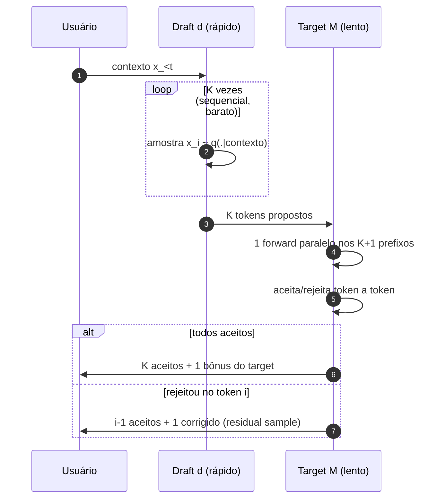
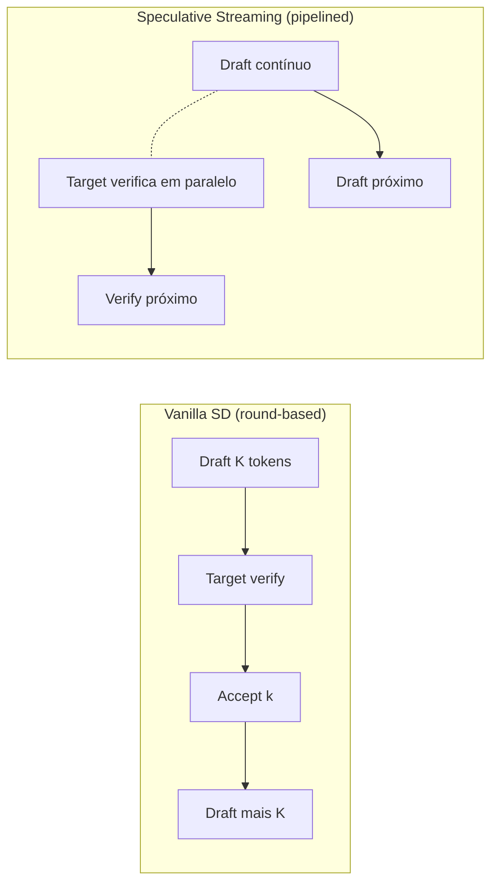
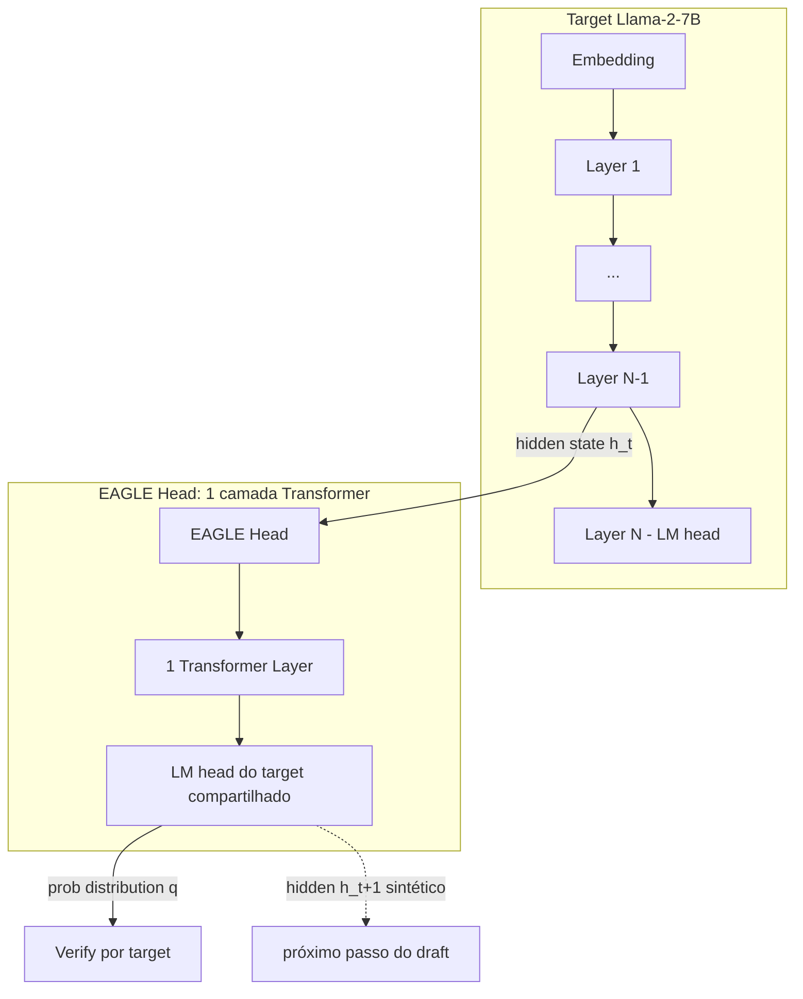
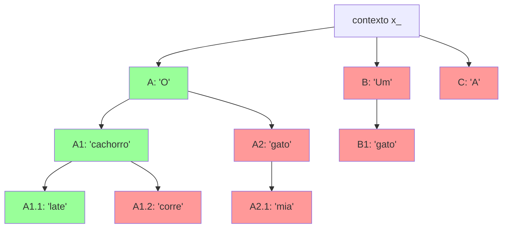
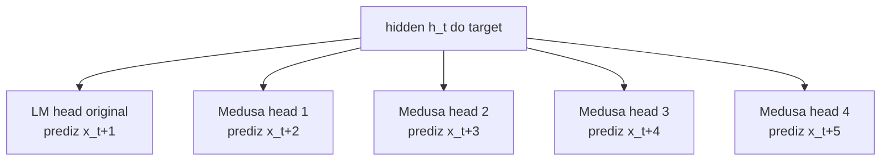
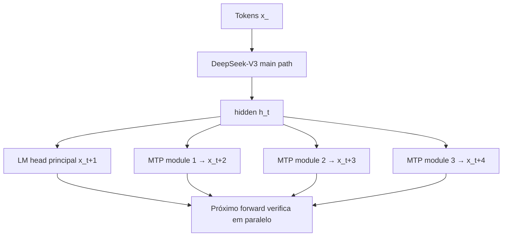
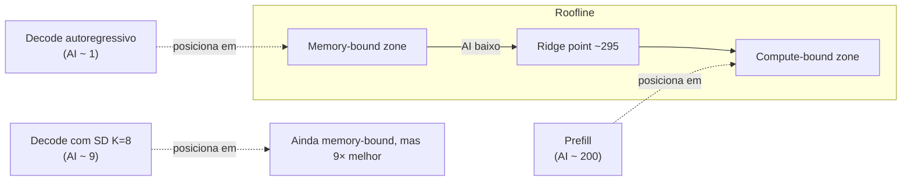

# 08-DEEP — Speculative Decoding (matemática) e EAGLE-1/2/3 deep dive

> **Apêndice ao Post 08** — _Além da quantização: sparsity, speculative decoding, MoE e distillation_.
> **Pré-requisito:** ter lido o Post 08 (`08-alem-quantizacao-sparsity-speculative-moe-distillation.md`).
> **Foco:** (A) prova matemática de equivalência distribucional do speculative decoding; (B) EAGLE-2/3 e o ecossistema de drafts (Medusa, Lookahead, MTP) com receitas práticas.

Este documento é dividido em duas partes complementares:

- **Parte A** trata o speculative decoding como um **algoritmo de Monte Carlo com correção de viés**. Provamos por que ele preserva exatamente a distribuição do target, deduzimos a probabilidade de aceitação esperada e montamos o speedup teórico em função de \(\alpha\) e \(K\).
- **Parte B** percorre as variantes modernas — EAGLE-1/2/3, Medusa, Lookahead, Self-speculative, MTP do DeepSeek-V3 — comparando arquiteturas, custos de treino, ganhos reportados e como combinar com KV quant, paged attention e MoE.

Nada aqui é "mais um truque": speculative decoding é o **único método de aceleração de decoding lossless** que preserva exatamente a distribuição original do modelo. Entender por quê é ganhar uma intuição forte sobre amostragem em geral.

---

## Sumário

- [PARTE A — Speculative decoding matemático](#parte-a--speculative-decoding-matematico)
  - [1. Revisão da ideia central](#1-revisao-da-ideia-central)
  - [2. A garantia matemática (Leviathan / Chen)](#2-a-garantia-matematica-leviathan--chen)
  - [3. Algoritmo de aceitação/rejeição](#3-algoritmo-de-aceitacaorejeicao)
  - [4. Prova de correção (1 token)](#4-prova-de-correcao-1-token)
  - [5. Acceptance probability esperada](#5-acceptance-probability-esperada)
  - [6. Custo do algoritmo e K ótimo](#6-custo-do-algoritmo-e-k-otimo)
  - [7. Exemplos numéricos reais](#7-exemplos-numericos-reais)
  - [8. Variantes (vanilla, self, lookup, streaming)](#8-variantes-vanilla-self-lookup-streaming)
- [PARTE B — EAGLE-1/2/3 e o ecossistema de drafts](#parte-b--eagle-123-e-o-ecossistema-de-drafts)
  - [9. EAGLE-1 (2024)](#9-eagle-1-2024)
  - [10. Tree-based speculative decoding](#10-tree-based-speculative-decoding)
  - [11. EAGLE-2](#11-eagle-2)
  - [12. EAGLE-3 (2025)](#12-eagle-3-2025)
  - [13. Medusa, Lookahead — comparação](#13-medusa-lookahead--comparacao)
  - [14. MTP do DeepSeek-V3](#14-mtp-do-deepseek-v3)
  - [15. Implementações práticas (vLLM, SGLang, TRT-LLM, llama.cpp, HF)](#15-implementacoes-praticas)
  - [16. Comando concreto vLLM](#16-comando-concreto-vllm)
  - [17. Quando NÃO usar speculative decoding](#17-quando-nao-usar-speculative-decoding)
  - [18. Speculative + outras otimizações](#18-speculative--outras-otimizacoes)
  - [19. Análise de gargalo (Roofline)](#19-analise-de-gargalo-roofline)
  - [20. Especulação para reasoning models (o1/R1/QwQ)](#20-especulacao-para-reasoning-models)
  - [21. Bloco de código educacional](#21-bloco-de-codigo-educacional)
  - [22. Referências](#22-referencias)

---

# PARTE A — Speculative decoding matemático

## 1. Revisão da ideia central

> **Analogia mestre:** speculative decoding é um **estagiário rápido que escreve K palavras em rascunho** enquanto o **sênior (target)** lê e valida em **lote**. Sempre que o sênior concorda, o estagiário compra uma vantagem temporal. Quando discorda, o sênior corrige a partir do ponto exato e descarta o resto.

Os ingredientes são:

- **Modelo target \(M\):** o modelo grande, lento, autoritativo (ex.: Llama-3.1-70B). Sua distribuição autoregressiva \(p(x_t \mid x_{<t})\) é a "verdade" que queremos preservar.
- **Modelo draft \(d\):** modelo pequeno e rápido (ex.: Llama-3.1-8B, ou uma MTP head, ou EAGLE head) com distribuição \(q(x_t \mid x_{<t})\).
- **Bloco de \(K\) tokens propostos:** o draft gera \(K\) tokens autoregressivos sequenciais.
- **Verificação paralela:** o target faz **um forward pass** processando os \(K+1\) prefixos em paralelo (como prefill), retornando \(K+1\) distribuições.
- **Aceitação token-a-token:** comparamos \(p\) vs \(q\) em cada posição; aceitamos se \(p \ge q\), senão sorteamos.

Por que isso pode ser mais rápido? Porque o **decoding** com batch=1 é **memory-bound**: o gargalo é ler os pesos do modelo da HBM, não os FLOPs. Ler os pesos para gerar 1 token ou 5 tokens custa quase o mesmo. Logo, **verificar 5 tokens em paralelo no target ≈ custo de gerar 1 token autoregressivo**. Se conseguirmos aceitar 3 tokens em média, ganhamos ~3×.



A regra "**i-1 aceitos + 1 corrigido**" é o coração do algoritmo. Os tokens \(i+1, \dots, K\) propostos pelo draft são **descartados**, porque o contexto deles assume que o token \(i\) era aquele do draft (rejeitado), o que invalida a sequência.

---

## 2. A garantia matemática (Leviathan / Chen)

**Teorema (Leviathan et al. 2022; Chen et al. 2023):**
A distribuição da sequência de saída do speculative decoding com aceitação/rejeição correta é **exatamente igual** à distribuição da geração autoregressiva do target \(M\) com a mesma temperatura/sampling.

Em símbolos: para qualquer prefixo \(x_{<t}\) e qualquer token \(x\),
\[
P_{\text{spec}}(x_t = x \mid x_{<t}) \;=\; p(x \mid x_{<t}).
\]

**Por que isso é não-trivial?** Considere um esquema **ingênuo**: "aceito o token \(x\) do draft sse \(p(x) \ge q(x)\)". Isso enviesa! Tokens onde \(p\) é alto seriam favorecidos demais; tokens com \(p < q\) nunca apareceriam. Repetições, refrões, padrões "fáceis" do draft seriam super-amostrados.

A correção precisa três engrenagens trabalhando em conjunto:

1. **Aceitação probabilística** (não determinística) com probabilidade \(\min(1, p/q)\).
2. **Distribuição residual** quando rejeitamos: amostramos do "que sobrou" entre \(p\) e \(q\), normalizado.
3. **Descarte das propostas pós-rejeição:** os tokens \(i+1..K\) caem fora porque seu contexto era condicional num token rejeitado.

Trocar qualquer uma dessas três por um atalho ingênuo **introduz viés**. Veremos a seguir o algoritmo exato e a prova.

---

## 3. Algoritmo de aceitação/rejeição

### 3.1 Pseudo-código formal

Dado contexto \(c = x_{<t}\), proposta \(\tilde{x}_1, \dots, \tilde{x}_K\) sampleada do draft e distribuições do target \(p_i = p(\cdot \mid c, \tilde{x}_1, \dots, \tilde{x}_{i-1})\) e do draft \(q_i\), para cada \(i = 1, \dots, K\):

1. Calcule \(r = U(0,1)\).
2. Seja \(\tilde{x} = \tilde{x}_i\). Aceite se
   \[
   r \;<\; \min\!\left(1, \frac{p_i(\tilde{x})}{q_i(\tilde{x})}\right).
   \]
3. Se aceitou: avance para \(i+1\).
4. Se rejeitou: defina a **distribuição residual**
   \[
   p'_i(x) \;=\; \frac{\big[p_i(x) - q_i(x)\big]_+}{Z}, \quad Z = \sum_y \big[p_i(y) - q_i(y)\big]_+
   \]
   onde \([z]_+ = \max(0, z)\). Amostre \(x'_i \sim p'_i\) e **emita \(x'_i\) como o token \(t+i-1\)**, descartando \(\tilde{x}_{i+1..K}\).
5. Se aceitou todos os \(K\): emita também um **token bônus** \(x_{K+1} \sim p_{K+1}\) (a distribuição do target no próximo passo, "de graça" porque já calculamos).

Resultado: emite entre **1 e K+1 tokens novos** por iteração de SD.

### 3.2 Por que aceitar com prob \(\min(1, p/q)\)?

Essa é a **regra de Metropolis–Hastings com proposta independente \(q\) e alvo \(p\)** — só que aplicada a **uma única amostra**, não a uma cadeia de Markov. A propriedade "amostra resultante é distribuída como \(p\)" é o que torna o método correto. Vamos prová-la.

---

## 4. Prova de correção (1 token)

Vamos provar que, para um único token, \(P(\text{output} = x) = p(x)\), assumindo:
- Draft propõe \(\tilde{x} \sim q\).
- Aceitação probabilística com prob \(\min(1, p(\tilde{x})/q(\tilde{x}))\).
- Em caso de rejeição, amostra do residual \(p'\).

### 4.1 Decomposição em dois eventos disjuntos

Para qualquer token \(x\), o evento "output = \(x\)" pode acontecer de duas formas mutuamente exclusivas:

- **(A)** O draft propôs exatamente \(\tilde{x} = x\) **e** foi aceito.
- **(B)** O draft propôs algum \(\tilde{x} = y\) (qualquer \(y\), inclusive \(y = x\)) **e** foi rejeitado, **e então** o residual sorteou \(x\).

Logo:
\[
P(\text{output} = x) \;=\; P(A) + P(B).
\]

### 4.2 Calculando \(P(A)\)

\[
P(A) \;=\; q(x) \cdot \min\!\left(1, \frac{p(x)}{q(x)}\right) \;=\; \min\big(q(x),\, p(x)\big).
\]

Casos:
- Se \(p(x) \ge q(x)\): \(\min = q(x)\), e \(p(x)/q(x) \ge 1\), aceitação garantida → \(P(A) = q(x)\).
- Se \(p(x) < q(x)\): \(\min = p(x)\), aceitação probabilística → \(P(A) = q(x) \cdot p(x)/q(x) = p(x)\).

Em ambos os casos, \(P(A) = \min(p(x), q(x))\).

### 4.3 Calculando \(P(B)\)

\(P(B) = P(\text{rejeitou alguma proposta}) \cdot P(\text{residual amostrou } x \mid \text{rejeitou})\).

**Probabilidade de rejeitar (qualquer proposta):**
\[
P(\text{rej}) \;=\; \sum_y q(y) \cdot \left(1 - \min\!\left(1, \frac{p(y)}{q(y)}\right)\right).
\]

Para cada \(y\):
- Se \(p(y) \ge q(y)\): \(1 - 1 = 0\), termo nulo.
- Se \(p(y) < q(y)\): \(1 - p(y)/q(y)\), e \(q(y) \cdot (1 - p(y)/q(y)) = q(y) - p(y) = [q(y) - p(y)]_+\).

Portanto:
\[
P(\text{rej}) \;=\; \sum_y \big[q(y) - p(y)\big]_+.
\]

**Identidade chave:** as massas "que sobram" de cada lado são iguais, porque \(\sum p = \sum q = 1\):
\[
\sum_y \big[q(y) - p(y)\big]_+ \;=\; \sum_y \big[p(y) - q(y)\big]_+ \;=\; Z.
\]

Verifique: \(\sum_y (p(y) - q(y)) = 0\). Separando em partes positivas e negativas: \(\sum_y [p-q]_+ - \sum_y [q-p]_+ = 0\), logo iguais. Esse é o "buraco" entre \(p\) e \(q\), também conhecido como **distância de variação total** \(\mathrm{TV}(p,q) = \tfrac{1}{2} \sum_y |p(y)-q(y)| = Z\).

**Probabilidade do residual sortear \(x\):**
\[
p'(x) \;=\; \frac{[p(x) - q(x)]_+}{Z}.
\]

**Combinando:**
\[
P(B) \;=\; Z \cdot \frac{[p(x) - q(x)]_+}{Z} \;=\; [p(x) - q(x)]_+.
\]

### 4.4 Soma final

\[
P(\text{output} = x) \;=\; P(A) + P(B) \;=\; \min(p(x), q(x)) + [p(x) - q(x)]_+.
\]

**Casos:**
- Se \(p(x) \ge q(x)\): \(\min = q(x)\) e \([\,]_+ = p(x) - q(x)\). Soma: \(q(x) + p(x) - q(x) = p(x)\). ✓
- Se \(p(x) < q(x)\): \(\min = p(x)\) e \([\,]_+ = 0\). Soma: \(p(x)\). ✓

**Em ambos os casos, \(P(\text{output} = x) = p(x)\).** QED.

> **Observação fina:** a prova generaliza para múltiplos tokens via condicionamento — após aceitar \(\tilde{x}_1, \dots, \tilde{x}_{i-1}\), o problema do token \(i\) é idêntico ao caso de 1 token, mas no contexto estendido. Por indução, toda a sequência tem a distribuição correta. A elegância é total: **a correção composicional cai gratuitamente da regra de aceitação local**.

---

## 5. Acceptance probability esperada

Definimos a **probabilidade de aceitação** \(\alpha\) (esperança sobre o draft \(q\)):
\[
\alpha \;=\; \mathbb{E}_{x \sim q}\!\left[\min\!\left(1, \frac{p(x)}{q(x)}\right)\right] \;=\; \sum_x q(x) \cdot \min\!\left(1, \frac{p(x)}{q(x)}\right) \;=\; \sum_x \min(p(x), q(x)).
\]

E pela identidade:
\[
\alpha \;=\; 1 - \mathrm{TV}(p, q) \;=\; 1 - \tfrac{1}{2} \sum_x |p(x) - q(x)|.
\]

> **Interpretação:** \(\alpha\) é literalmente "**1 menos a distância entre as distribuições**". Draft idêntico ao target ⇒ \(\alpha = 1\). Draft random ⇒ \(\alpha \approx 1/V\) (vocab size).

### 5.1 Speedup teórico

Em uma iteração de SD, gastamos:
- 1 forward do target (custo \(C_T\)) verificando \(K\) tokens em paralelo.
- \(K\) forwards do draft (custo total \(K \cdot C_d\)).

E aceitamos um número aleatório \(N \in \{0, 1, \dots, K\}\) de tokens, mais **1 token bônus** se \(N = K\). Em média, com tokens i.i.d. (aproximação clássica):
\[
\mathbb{E}[N + \mathbb{1}_{N=K}] \;=\; \frac{1 - \alpha^{K+1}}{1 - \alpha}.
\]

Assumindo \(C_d \ll C_T\) (draft muito menor):
\[
\text{Speedup} \;\approx\; \frac{\mathbb{E}[\text{tokens emitidos}]}{1 \text{ forward target}} \;=\; \frac{1 - \alpha^{K+1}}{1 - \alpha}.
\]

Se considerarmos o overhead do draft, fica:
\[
\text{Speedup} \;\approx\; \frac{(1 - \alpha^{K+1})/(1-\alpha)}{1 + K \cdot c}, \quad c = C_d / C_T.
\]

### 5.2 Tabela: speedup teórico para K=4

| \(\alpha\) | Tokens aceitos médios (sem bônus) | Speedup ideal (sem custo draft) | Speedup com \(c=0.1\) |
| --- | --- | --- | --- |
| 0.50 | 1.94 | ≈ 1.94× | 1.39× |
| 0.70 | 2.59 | ≈ 2.59× | 1.85× |
| 0.85 | 3.22 | ≈ 3.22× | 2.30× |
| 0.95 | 3.72 | ≈ 3.72× | 2.66× |
| 0.99 | 3.94 | ≈ 3.94× | 2.81× |

> **Observação:** para \(\alpha\) baixo (< 0.5), o speedup teórico cai rapidamente abaixo de 1.5×, e na prática o overhead do draft come o ganho. Por isso EAGLE/Medusa investem tanto em **maximizar α**.

---

## 6. Custo do algoritmo e K ótimo

### 6.1 Decomposição do custo

| Componente | Custo (por iteração SD) | Comentário |
| --- | --- | --- |
| Draft generation | \(K \cdot C_d\) | Sequencial, mas modelo pequeno (≈10× menor) |
| Target verification | \(C_T\) (≈ 1 forward) | Paralelo, similar a 1 token de prefill com batch=K+1 |
| Sampling (target dist) | \(O(K \cdot V)\) | Negligível na prática |
| Residual normalize (worst case) | \(O(V)\) | 1× em caso de rejeição |

### 6.2 Escolha de \(K\)

Aumentar \(K\):
- (+) Mais paralelismo no target.
- (−) Custo do draft cresce linearmente.
- (−) \(\alpha^K\) decresce (probabilidade de aceitar todos cai).

Existe um \(K^\ast\) ótimo. Aproximação clássica (assumindo aceitos i.i.d.):
\[
K^\ast \;\approx\; \frac{1}{1 - \alpha}.
\]

| \(\alpha\) | \(K^\ast\) | Comentário |
| --- | --- | --- |
| 0.50 | 2 | Draft ruim, vale pouco esticar |
| 0.70 | 3–4 | Sweet spot vanilla SD |
| 0.85 | 6–7 | Draft bom (EAGLE típico) |
| 0.95 | 20+ | Draft excelente (MTP DeepSeek, EAGLE-3) |

Na prática, vLLM/SGLang aceitam `--num-speculative-tokens` (ou equivalente). Use 4–8 para vanilla SD com draft "alvo/10", e 5–10 para EAGLE/Medusa.

---

## 7. Exemplos numéricos reais

### 7.1 Pares draft/target conhecidos (α e speedup empírico)

| Target | Draft | α típico (greedy) | Speedup empírico (1× GPU, batch=1) | Fonte |
| --- | --- | --- | --- | --- |
| Llama-3.1-70B | Llama-3.1-8B | 0.80–0.85 | 2.3–2.8× | Comum em vLLM/HF |
| Llama-3.1-8B | Llama-3.2-1B | 0.75–0.85 | 2.0–2.5× | Llama 3.2 release notes |
| Qwen2.5-72B | Qwen2.5-7B | 0.80–0.88 | 2.4–2.9× | SGLang docs |
| Llama-2-7B-chat | EAGLE head | 0.85–0.90 | 2.7–3.5× | Li et al. 2024 |
| Llama-2-7B-chat | EAGLE-2 (tree adaptativa) | 0.88–0.93 | 3.5–4.5× | Li et al. 2024 (paper 2) |
| Llama-2-7B-chat | EAGLE-3 (training-time test) | 0.92–0.96 | 4.5–6.5× | arXiv:2503.01840 |
| DeepSeek-V3 | MTP heads (integradas) | 0.90+ | ~1.8× (em throughput) | DeepSeek-V3 tech report |
| GPT-4-class | Distilled small draft | 0.70–0.85 | 1.5–2.5× | Cobertura via API closed |

### 7.2 Conta de cabeça

Llama-3.1-70B em 4×H100 com TP=4. Decoding sem SD: ~30 tok/s/usuário (batch=1). Com SD vanilla (Llama-3.1-8B draft, K=5, α≈0.85): tokens aceitos médios ≈ 3.7. Speedup empírico ~2.3× (overhead draft pesa). Resultado: ~70 tok/s/usuário.

Trocando para EAGLE-2 head treinada para esse target: α≈0.92, K=5, tokens aceitos ~4.4, overhead draft ínfimo (<5%). Resultado: ~120 tok/s/usuário (4×).

---

## 8. Variantes (vanilla, self, lookup, streaming)

### 8.1 Vanilla SD

- **Origem:** Leviathan et al. 2022, Chen et al. 2023.
- **Setup:** dois modelos separados (target + draft). Draft tipicamente da mesma família/tokenizador.
- **Pré-requisito crítico:** **mesmo tokenizador**. Se diferentes, precisaria realinhar (não trivial; existem hacks com BPE matching).
- **Custo:** zero treino extra, basta carregar dois pesos. Prós: implementação simples. Contras: requer um draft existente; não aproveita features internas do target.

### 8.2 Self-speculative (Layer skipping / Hybrid)

- **Ideia:** o próprio target faz um "fast pass" com **camadas skipadas**, gerando o draft, e depois um "full pass" para verificar.
- **Variantes:** Draft & Verify (Zhang et al. 2024), LayerSkip (Meta, 2024), SkipDecode.
- **Vantagem:** zero modelo extra; menor consumo de VRAM. Funciona até para modelos onde não existe um draft pequeno do mesmo tokenizador.
- **Desvantagem:** α geralmente mais baixo que EAGLE, e fast pass ainda lê pesos do target (ganho menor que com draft 10× menor).

### 8.3 N-gram lookup / Prompt Lookup Decoding (PLD)

- **Ideia:** usar o **próprio prompt/contexto** como "draft": se o usuário acabou de mencionar uma string, é provável que apareça repetida. Olha n-gramas no prefixo.
- **Casos campeões:**
  - **Code generation:** muita repetição de variáveis, imports, padrões.
  - **JSON/RAG:** estrutura repetitiva, chaves reaparecem.
  - **Chat com retrieval:** o documento referenciado aparece quase verbatim na resposta.
- **Custo:** **zero**. Não precisa de draft model algum. Implementado em HF transformers como `prompt_lookup_num_tokens`.
- **Limitação:** falha em geração criativa "do zero". α pode ser 0 se nada do prompt é reutilizado.

### 8.4 Speculative streaming

- **Ideia:** rodar draft e verify em **pipeline contínuo** (não em "rounds"). O draft gera enquanto o target verifica o lote anterior.
- **Frameworks:** SGLang, Speculative Streaming (Apple), MEDUSA-2.
- **Ganho:** elimina bolhas de pipeline; útil em cenário multi-usuário.



---

# PARTE B — EAGLE-1/2/3 e o ecossistema de drafts

## 9. EAGLE-1 (2024)

**Paper:** Li et al., _"EAGLE: Speculative Sampling Requires Rethinking Feature Uncertainty"_, arXiv:2401.15077, jan/2024.

### 9.1 Insights centrais

1. **Feature uncertainty > logit uncertainty:** prever o **próximo logit** é instável, mas prever o **próximo hidden state (feature)** é mais previsível e contém mais informação.
2. **Reaproveitar features do target:** em vez de o draft processar de novo o contexto inteiro a partir de embeddings, ele recebe **as features da penúltima camada do target** como input. Isso pula o trabalho duplo.
3. **Cabeça leve:** uma única camada Transformer adicional, treinada como auto-regressivo de features.

### 9.2 Arquitetura



A EAGLE head opera **em features**, não em tokens. Cada passo do draft:
1. Recebe a feature \(h_t\) (do target ou da iteração anterior do draft).
2. Roda 1 camada Transformer.
3. Aplica o **LM head do target compartilhado** para gerar \(q(\cdot)\).
4. Amostra \(\tilde{x}_{t+1}\), embute, soma com a próxima feature predita, e repete.

### 9.3 Training

- Custo: ~1–2 dias em 1 GPU para uma EAGLE head (vs. semanas para treinar um draft do zero).
- Loss: combinação de regression em features + cross-entropy em logits.
- Dados: ShareGPT, Alpaca, ou o próprio dataset de fine-tuning do target.

### 9.4 Resultados EAGLE-1

| Modelo | Speedup (greedy, batch=1) |
| --- | --- |
| Vicuna-7B-v1.3 | 2.7× |
| LLaMA-2-Chat 7B | 2.8× |
| LLaMA-2-Chat 13B | 2.9× |
| Mixtral-8x7B | 2.9× |

Lossless por construção (usa o mesmo algoritmo de Leviathan).

---

## 10. Tree-based speculative decoding

A inovação que faz EAGLE/Medusa pularem patamar é **deixar de propor uma sequência linear de K tokens e passar a propor uma árvore**.

### 10.1 Por que árvore?

Em SD linear, se rejeito o token 2, perco tokens 3..K. Mas e se eu propusesse **várias continuações alternativas no token 2**? O target verifica todas em paralelo, e eu fico com o **caminho válido mais longo**.



Verde = caminho aceito. Vermelho = ramos rejeitados (descartados em paralelo).

### 10.2 Como verificar uma árvore em 1 forward?

Truque: empilhar todos os nós em uma única sequência e usar uma **attention mask custom** que respeita a topologia da árvore (cada nó vê apenas seus ancestrais, não os irmãos). É essencialmente um "**block-diagonal mask** com dependências de árvore".

Exemplo: árvore com 26 nós → 1 forward do target processa 26 tokens com mask especial → retorna 26 distribuições, uma por nó.

### 10.3 Aceitação na árvore

Para cada caminho da raiz à folha:
1. Aplique aceitação/rejeição token-a-token.
2. Marque o caminho como "válido" se todos aceitos; "parcialmente válido" até o ponto da rejeição.

Aceite o **caminho válido mais longo**. Em caso de empate, escolha pelo melhor "score residual" (ou sample).

### 10.4 Ganho teórico

Com fanout \(b\) em cada nível e profundidade \(K\), o número esperado de tokens aceitos é maior que numa cadeia linear. A análise exata depende da distribuição, mas EAGLE-2 mostra empiricamente que árvores com 25–60 nós e profundidade 5–6 dão **+30–50% sobre vanilla EAGLE-1**.

---

## 11. EAGLE-2

**Paper:** Li et al., arXiv:2406.16858, jun/2024.

### 11.1 Adaptive tree

EAGLE-1 usa uma árvore **fixa** (mesma topologia em todos os contextos). EAGLE-2 percebe que **a forma ótima da árvore depende do contexto**:

- Em zonas de **alta confiança** (ex.: completar `def fibonacci(n):` com `\n    if n`), a árvore deve ser **fina e profunda** (poucas alternativas, mas longas).
- Em zonas de **baixa confiança** (ex.: começo de uma resposta criativa), a árvore deve ser **larga e rasa** (muitas alternativas, mas curtas — mais provável de rejeitar cedo).

EAGLE-2 usa um **score** (produto das probabilidades de cada caminho até o nó) para decidir dinamicamente a forma da árvore, expandindo nós mais promissores.

### 11.2 Reordering

Verificação eficiente requer mapear a árvore para uma sequência linear "topologicamente ordenada". EAGLE-2 ordena para maximizar **localidade de cache** e **paths aceitos**.

### 11.3 Resultados

| Modelo | Speedup vs. autoregressivo |
| --- | --- |
| Vicuna-7B | 4.0× |
| LLaMA-2-Chat 7B | 4.5× |
| LLaMA-2-Chat 13B | 4.3× |
| LLaMA-2-Chat 70B | 3.7× |

---

## 12. EAGLE-3 (2025)

**Paper:** Li et al., _"EAGLE-3: Scaling up Inference Acceleration of LLMs via Training-Time Test"_, arXiv:2503.01840, mar/2025.

### 12.1 Mudanças principais

1. **Abandonar a regressão de features:** EAGLE-1/2 treinava o draft para **prever a feature** do próximo passo. EAGLE-3 mostra que isso satura conforme escalamos dados de treino. Solução: **prever direto o próximo token** (cross-entropy puro).
2. **Multi-layer feature fusion:** em vez de usar apenas a penúltima camada do target, EAGLE-3 **funde features de múltiplas camadas** (early, middle, late) → mais informação contextual para o draft.
3. **Training-time test:** durante o treino, simular **as condições reais de inferência** (incluindo o erro acumulado autoregressivo do draft). Isso resolve o **distribution shift** clássico de scheduled sampling.

### 12.2 Resultados

- Speedup até **6.5×** vs. autoregressivo (LLaMA-2 7B, batch=1).
- ~1.4× sobre EAGLE-2.
- Em **SGLang com batch=64**, ganho de throughput ~1.38×.
- Real-world H100: **373 tok/s** (vs. 158 tok/s sem SD) num único GPU.

### 12.3 É ainda lossless?

Sim. EAGLE-3 não mexe na regra de aceitação/rejeição — apenas no **draft**. Como o target ainda verifica com Leviathan/Chen, a distribuição de saída é provavelmente exata. (Ver "Is EAGLE-3 Speculative Decoding Lossless?" — Ethan Liu, 2025.)

> **Status 2025/2026:** EAGLE-3 é o estado-da-arte público para drafts treinados especificamente para um target. Suportado em **vLLM v1** (`spec_decode/eagle.py`), **SGLang** (nativo), e **TensorRT-LLM**.

---

## 13. Medusa, Lookahead — comparação

### 13.1 Medusa (Cai et al. 2024, arXiv:2401.10774)

- **Ideia:** anexar **K cabeças LM paralelas** no topo do target. A cabeça \(k\) prediz o token \(t+k\) condicionado em \(h_t\), **sem rodar passos autoregressivos**.
- **Vantagem:** muito simples. Zero modelo extra, treino rápido (apenas as cabeças).
- **Desvantagem:** as cabeças não veem os tokens intermediários sampleados → α decai com \(k\). Speedup típico 2.0–2.8×.
- **Variante Medusa-2:** ajusta o target em conjunto com as cabeças (joint fine-tuning) → +ganho.



### 13.2 Lookahead Decoding (Fu et al., HazyResearch blog, 2024)

- **Ideia:** **sem draft model algum**. Mantém uma **n-gram cache** de continuações observadas e usa o próprio target para gerar e verificar n-gramas em paralelo (estilo Jacobi iteration).
- **Vantagem:** zero modelo extra, zero treino.
- **Desvantagem:** ganho moderado (1.5–2×). Depende muito de repetições.

### 13.3 Tabela comparativa de métodos

| Método | Modelo extra? | Treino extra? | α típico | Speedup | Tree? | Lossless? |
| --- | --- | --- | --- | --- | --- | --- |
| Vanilla SD | Sim (draft) | Não | 0.70–0.85 | 2–2.8× | Não | ✓ |
| Medusa | Cabeças no target | Sim (curto) | 0.55–0.75 | 2–2.8× | Sim (linear) | ✓ |
| Medusa-2 | Cabeças + finetune target | Sim (mais longo) | 0.65–0.80 | 2.5–3.2× | Sim | ✓ |
| EAGLE-1 | 1 layer extra | Sim (1–2 dias) | 0.80–0.90 | 2.7–2.9× | Sim (fixa) | ✓ |
| EAGLE-2 | 1 layer extra | Igual EAGLE-1 | 0.85–0.93 | 3.7–4.5× | Sim (adaptiva) | ✓ |
| EAGLE-3 | 1 layer extra (multi-feat) | Mais dados | 0.92–0.96 | 4.5–6.5× | Sim (adaptiva) | ✓ |
| Lookahead | Não | Não | varia | 1.5–2× | N-gram | ✓ |
| Self-spec (LayerSkip) | Não | Sim (ajuste target) | 0.65–0.80 | 1.8–2.5× | Não | ✓ |
| MTP (DeepSeek-V3) | Heads integradas | Treino conjunto | 0.85–0.92 | ~1.8× (throughput) | Sim | ✓ |
| PLD (n-gram do prompt) | Não | Não | 0–0.95 (bimodal) | 1.0–4× (RAG/code) | Não | ✓ |

---

## 14. MTP do DeepSeek-V3

### 14.1 Multi-Token Prediction como objetivo de treino

DeepSeek-V3 (arXiv:2412.19437) treina com **N "MTP modules" auxiliares** ligados a posições futuras. Cada MTP prediz o token \(t+k\) condicionado nos tokens reais até \(t\) (não nos sampleados — usa **teacher forcing** durante treino).

A loss total:
\[
\mathcal{L} = \mathcal{L}_{\text{main}} + \lambda \sum_{k=1}^{N} \mathcal{L}_{\text{MTP},k}.
\]

### 14.2 Por que ajuda no treino?

- **Gradiente mais rico:** o modelo aprende dependências mais longas (predizer 4 tokens à frente força o hidden state a carregar mais informação).
- **Regularização:** impede que o modelo "decore" só transições imediatas.

### 14.3 Por que serve naturalmente como draft em inferência?

Os MTP modules **já estão treinados** para prever tokens futuros. Na inferência:
1. Forward normal do target → produz \(h_t\).
2. MTP heads aplicadas em \(h_t\) → predições para \(t+1, t+2, \dots, t+N\).
3. Verifica com o target no próximo forward.



### 14.4 Resultados

DeepSeek-V3 reporta **~1.8× speedup em decoding via MTP**, sem nenhum modelo extra além das heads que já vieram com o checkpoint. É o "speculative free lunch" mais bonito do mercado em 2025.

---

## 15. Implementações práticas

### 15.1 vLLM v1 (jul/2025+)

vLLM v1 traz suporte completo a EAGLE/EAGLE-3, Medusa, MLPSpeculator e n-gram (PLD) via flag `--speculative-config`. Antes (vLLM v0): `--speculative-model` + `--num-speculative-tokens`. Migração em curso.

Sintaxe v1 atual (validar com `vllm serve --help` no seu build):
```bash
vllm serve <target> \
  --speculative-config '{"method":"eagle","model":"<draft_path>","num_speculative_tokens":5}'
```
ou via YAML:
```yaml
model: meta-llama/Llama-3.1-70B-Instruct
tensor-parallel-size: 4
speculative-config:
  method: eagle
  model: yuhuili/EAGLE-LLaMA3.1-Instruct-70B
  num_speculative_tokens: 5
```

### 15.2 SGLang

```python
from sglang import RuntimeEndpoint
runtime = RuntimeEndpoint(
    "http://localhost:30000",
    speculative_algorithm="EAGLE3",
    speculative_draft_model_path="lmsys/eagle3-llama-3.1-instruct-8b",
    speculative_num_steps=5,
    speculative_eagle_topk=10,
    speculative_num_draft_tokens=64
)
```

SGLang foi um dos primeiros a integrar EAGLE-3 e roda **adaptive tree** nativamente.

### 15.3 TensorRT-LLM

```python
from tensorrt_llm import LLM
llm = LLM(
    model="meta-llama/Llama-3.1-70B-Instruct",
    speculative_config={
        "spec_decoding_mode": "eagle",  # ou "medusa", "lookahead"
        "speculative_model": "yuhuili/EAGLE-LLaMA3.1-Instruct-70B",
        "max_draft_len": 5,
    }
)
```

### 15.4 llama.cpp

```bash
./llama-cli \
  -m llama-3.1-70b-q4_K_M.gguf \
  --draft-model llama-3.1-8b-q4_K_M.gguf \
  --draft 5 \
  -p "Explique a relatividade geral em 1 parágrafo."
```

Apenas vanilla SD; não tem EAGLE nativo (alguns forks experimentam).

### 15.5 HuggingFace transformers

```python
from transformers import AutoModelForCausalLM, AutoTokenizer
target = AutoModelForCausalLM.from_pretrained("meta-llama/Llama-3.1-70B-Instruct")
draft = AutoModelForCausalLM.from_pretrained("meta-llama/Llama-3.1-8B-Instruct")
tok = AutoTokenizer.from_pretrained("meta-llama/Llama-3.1-70B-Instruct")
inputs = tok("Olá, conte sobre o universo:", return_tensors="pt").to("cuda")
out = target.generate(**inputs, assistant_model=draft, max_new_tokens=200)
```

Também aceita `prompt_lookup_num_tokens=10` para PLD sem draft.

---

## 16. Comando concreto vLLM

**Ambiente real (validado para vLLM ≥ 0.7 / v1):**

```bash
# Vanilla SD com Llama-3.1-70B target + Llama-3.1-8B draft
vllm serve meta-llama/Llama-3.1-70B-Instruct \
  --tensor-parallel-size 4 \
  --speculative-config '{
    "method": "draft_model",
    "model": "meta-llama/Llama-3.1-8B-Instruct",
    "num_speculative_tokens": 5
  }' \
  --max-model-len 32768 \
  --port 8000
```

**Com EAGLE head (idealmente + 2× speedup vs vanilla):**

```bash
vllm serve meta-llama/Llama-3.1-70B-Instruct \
  --tensor-parallel-size 4 \
  --speculative-config '{
    "method": "eagle",
    "model": "yuhuili/EAGLE-LLaMA3.1-Instruct-70B",
    "num_speculative_tokens": 7
  }' \
  --max-model-len 32768
```

**Com EAGLE-3 (estado-da-arte 2025):**

```bash
vllm serve meta-llama/Llama-3.1-70B-Instruct \
  --tensor-parallel-size 4 \
  --speculative-config '{
    "method": "eagle3",
    "model": "lmsys/eagle3-llama-3.1-instruct-70b",
    "num_speculative_tokens": 8
  }'
```

> **Validação:** sempre rode `vllm serve --help | rg -i specul` para confirmar a sintaxe da sua versão. Em vLLM v0 ainda funciona `--speculative-model` + `--num-speculative-tokens` como flags top-level (legado).

---

## 17. Quando NÃO usar speculative decoding

| Cenário | Por quê SD perde sentido |
| --- | --- |
| Batch grande (≥ 16) | Target já está **compute-bound**, draft adiciona overhead sem ganho. SD brilha em batch=1 a 4. |
| Sampling com `temperature=1.5+` | \(p\) e \(q\) ficam quase uniformes ⇒ \(\alpha\) despenca, e SD perde. |
| Gap target/draft pequeno | Se "draft" custa quase o mesmo que target (ex.: 70B target + 32B draft), o overhead come o ganho. |
| Tokenizadores diferentes | SD vanilla precisa **mesmo tokenizer**. EAGLE e MTP herdam o do target — sem problema. |
| Tarefas muito específicas (out-of-distribution para o draft) | α cai para 0.4–0.5; speedup ≤ 1.3×. |
| Latência primeiro token (TTFT) | SD não acelera prefill, só decode. Se o problema é TTFT, foque em chunked prefill, FlashAttention, KV reuse. |
| Streaming com chunks de 1 token | SD entrega "rajadas" de N tokens; não combina perfeitamente com streaming token-a-token (precisa "esperar a verificação"). Usar speculative streaming. |

---

## 18. Speculative + outras otimizações

### 18.1 Matriz de compatibilidade

| Combinação | Compatível? | Comentário |
| --- | --- | --- |
| SD + KV quantizado (KIVI/KVQuant) | ✓ | Aplica em ambos draft e target. Gera ~10–15% extra speedup. |
| SD + Chunked prefill | ✓ | Ortogonais. Prefill chunked, decode com SD. |
| SD + PagedAttention (vLLM) | ✓ | Gerenciado pelo vLLM transparentemente. |
| SD + MoE (target) | ⚠️ | Cuidado: target MoE ativa só 2/256 experts → barato. Draft denso pode ficar **comparativamente caro**. Use draft MoE pequeno ou EAGLE específico para MoE. |
| SD + LoRA (multi-tenant) | ⚠️ | Draft precisa ter o mesmo LoRA, ou α despenca. vLLM tem suporte experimental. |
| SD + Quant target (GPTQ/AWQ) | ✓ | Combina perfeitamente — SD reduz tokens decodificados, quant reduz custo por token. |
| SD + FlashAttention | ✓ | SD só pede que o backend de attention aceite **tree mask**. FA-2/3 aceitam masks customizadas. |
| SD + Continuous batching | ✓ (com tuning) | Em batch grande, SD vira marginal/negativo. Use scheduler que ative SD apenas em batches pequenos. |
| SD + Long context (> 64k) | ✓ | KV cache do draft fica caro também; se draft for 8B com 64k, gasta VRAM. Considere sliding window no draft. |

### 18.2 Receitas combinadas (production stack 2025)

| Stack alvo | Componentes | Speedup estimado vs. baseline |
| --- | --- | --- |
| Llama-70B chat | AWQ 4-bit + EAGLE-3 + PagedAttn + FA3 | 8–12× |
| DeepSeek-V3 671B (37B ativos) | MTP + KV-int8 + chunked prefill | 4–6× |
| Mixtral 8x7B (RAG) | EAGLE-2 + PLD + KV-int8 | 5–8× |
| Code completion (8B) | MTP/EAGLE + PLD para imports | 6–10× (depende de repetição) |

---

## 19. Análise de gargalo (Roofline)

### 19.1 Onde decoding normal vive no roofline

Decoding autoregressivo com batch=1:
- Por token: lê todos os pesos do modelo (e todo o KV) → ~140 GB para Llama-70B em fp16.
- FLOPs por token: ~2× parameters = 140 GFLOPs.
- Arithmetic intensity (FLOP / byte) = 140 GFLOPs / 140 GB = **1 FLOP/byte**.
- H100 SXM: pico 989 TFLOPs (BF16), bandwidth 3.35 TB/s.
- Ridge point: 989e12 / 3.35e12 ≈ **295 FLOP/byte**.
- **1 FLOP/byte ≪ 295 FLOP/byte ⇒ decoding é fortemente memory-bound.**

### 19.2 Onde SD coloca decoding

SD verifica K+1 tokens em paralelo. Os pesos são lidos **uma única vez**, mas usados para K+1 tokens. AI passa de 1 → ~K+1 FLOP/byte.

Para K=8: AI ≈ 9 FLOP/byte. Ainda memory-bound, mas **9× menos**. A latência por token efetivo cai porque cada leitura amortiza vários tokens.



> **Insight:** SD é o método mais eficaz para **mover decoding na direção do prefill** no roofline. Ele não muda os FLOPs do modelo — muda a relação compute/bytes do **kernel de inferência**.

---

## 20. Especulação para reasoning models (o1/R1/QwQ)

### 20.1 Por que reasoning é caso especial

Modelos de reasoning (o1, DeepSeek-R1, QwQ, Gemini 2.5 Thinking) gastam **a maior parte do compute em chain-of-thought interno**: 1k–10k tokens de "pensamento" para produzir 100 tokens de resposta. Se SD acelerar o "pensar", o ganho é **multiplicativo**.

### 20.2 Vantagens

- **Cadeias de raciocínio são previsíveis** em segmentos: "Let me think... I need to compute 23 × 47. First, 23 × 50 = 1150, then..." → muita repetição e padrão.
- **Draft pode ser um modelo menor com fine-tuning para raciocínio** (ex.: R1-distill-7B como draft para R1).

### 20.3 Desafios

- **Sampling alto (temp=0.7–1.0):** o1 e R1 usam temperaturas altas para diversidade de raciocínio, e \(\alpha\) cai junto.
- **Cadeias divergentes:** se o draft "vai por outro caminho", α cai cedo.

### 20.4 Pesquisa recente

- **SpecReason / SpecDec for Reasoning** (vários papers 2025): drafts especializados em CoT.
- **DeepSeek-R1 + R1-Distill 7B como draft:** comunidade reporta α ≈ 0.85 e speedup 2–3×.
- **EAGLE-R:** variante de EAGLE treinada em traces de reasoning.
- **Search 2026:** consultar arXiv para "Speculative Decoding for Reasoning Models 2025".

---

## 21. Bloco de código educacional

### 21.1 SD vanilla — algoritmo de aceitação/rejeição (Python didático)

```python
import math
import random
import numpy as np

def speculative_decode_step(target_fn, draft_fn, sample_fn, context, K=4):
    """
    Executa 1 iteração de speculative decoding.
    
    Args:
        target_fn(ctx) -> np.ndarray (vocab,) com p(.|ctx)
        draft_fn(ctx)  -> np.ndarray (vocab,) com q(.|ctx)
        sample_fn(p)   -> int (token amostrado de p)
        context: lista de token IDs
        K: quantos tokens propor

    Returns:
        Lista de tokens emitidos (1..K+1).
    """
    # 1. Draft propõe K tokens autoregressivos
    draft_tokens = []
    draft_dists = []
    ctx = list(context)
    for _ in range(K):
        q = draft_fn(ctx)
        x = sample_fn(q)
        draft_tokens.append(x)
        draft_dists.append(q)
        ctx.append(x)
    
    # 2. Target processa o lote inteiro em 1 forward (paralelo)
    #    Retorna K+1 distribuições: para cada prefixo, prediz o próximo
    target_dists = target_fn_batched(target_fn, context, draft_tokens)
    # target_dists[i] = p(. | context + draft_tokens[:i])
    
    # 3. Aceitação/rejeição token-a-token
    emitted = []
    for i in range(K):
        p = target_dists[i]
        q = draft_dists[i]
        x_tilde = draft_tokens[i]
        
        ratio = p[x_tilde] / max(q[x_tilde], 1e-12)
        accept_prob = min(1.0, ratio)
        
        if random.random() < accept_prob:
            emitted.append(x_tilde)
        else:
            # Sample do residual: p'(x) = max(0, p(x) - q(x)) / Z
            residual = np.maximum(p - q, 0.0)
            Z = residual.sum()
            if Z < 1e-12:
                # Edge case: p == q exatamente; cair no target puro
                emitted.append(sample_fn(p))
            else:
                residual /= Z
                emitted.append(sample_fn(residual))
            return emitted  # tokens i+1..K-1 descartados
    
    # 4. Todos K aceitos: emite token bônus do target
    emitted.append(sample_fn(target_dists[K]))
    return emitted


def target_fn_batched(target_fn, context, draft_tokens):
    """Simula 1 forward paralelo; em produção isso é 1 chamada CUDA com batch=K+1."""
    dists = []
    ctx = list(context)
    dists.append(target_fn(ctx))
    for x in draft_tokens:
        ctx.append(x)
        dists.append(target_fn(ctx))
    return dists
```

> **Atenção pedagógica:** `target_fn_batched` está escrito em loop só para clareza. Na implementação real (vLLM, TRT-LLM), o target processa os K+1 prefixos **em uma única chamada com tree/causal mask**, custando ~1 forward de prefill com batch=K+1 — não K+1 forwards sequenciais.

### 21.2 Verificação de equivalência distribucional (test empírico)

```python
def test_speculative_is_correct(p, q, n_samples=100_000):
    """
    Verifica empiricamente que SD produz amostras de p, mesmo usando q como draft.
    """
    from collections import Counter
    
    counts_target = Counter()
    counts_spec = Counter()
    
    # Baseline: amostra direto de p
    for _ in range(n_samples):
        x = np.random.choice(len(p), p=p)
        counts_target[x] += 1
    
    # SD: 1 token de proposta de q + aceitação/rejeição
    for _ in range(n_samples):
        x_tilde = np.random.choice(len(q), p=q)
        ratio = p[x_tilde] / max(q[x_tilde], 1e-12)
        if np.random.rand() < min(1.0, ratio):
            counts_spec[x_tilde] += 1
        else:
            residual = np.maximum(p - q, 0.0)
            residual /= residual.sum()
            x = np.random.choice(len(p), p=residual)
            counts_spec[x] += 1
    
    # Compara empiricamente p vs SD
    for x in range(len(p)):
        f_target = counts_target[x] / n_samples
        f_spec = counts_spec[x] / n_samples
        print(f"x={x}: p={p[x]:.4f}, target={f_target:.4f}, spec={f_spec:.4f}, "
              f"|diff|={abs(f_target - f_spec):.4f}")

# Exemplo
p = np.array([0.5, 0.3, 0.2])
q = np.array([0.7, 0.2, 0.1])  # draft enviesado para token 0
test_speculative_is_correct(p, q)
# Esperado: f_spec converge para p, dentro do erro de Monte Carlo
```

Rode esse teste — você verá empiricamente que **SD com draft enviesado** ainda produz amostras de \(p\). É a prova do Teorema 2 em ação.

---

## 22. Referências

### Papers fundadores

- **Speculative Decoding (Leviathan et al. 2022):** _Fast Inference from Transformers via Speculative Decoding_, arXiv:2211.17192.
- **Speculative Sampling (Chen et al. 2023, DeepMind):** _Accelerating Large Language Model Decoding with Speculative Sampling_, arXiv:2302.01318.
- **SpecInfer (Miao et al. 2023):** _SpecInfer: Accelerating LLM Serving with Speculative Inference and Token Tree Verification_, arXiv:2305.09781.

### Família EAGLE

- **EAGLE-1 (Li et al. 2024):** _EAGLE: Speculative Sampling Requires Rethinking Feature Uncertainty_, arXiv:2401.15077.
- **EAGLE-2 (Li et al. 2024):** _EAGLE-2: Faster Inference of LLMs with Dynamic Draft Trees_, arXiv:2406.16858.
- **EAGLE-3 (Li et al. 2025):** _EAGLE-3: Scaling up Inference Acceleration of LLMs via Training-Time Test_, arXiv:2503.01840.

### Métodos paralelos

- **Medusa (Cai et al. 2024):** _Medusa: Simple LLM Inference Acceleration Framework with Multiple Decoding Heads_, arXiv:2401.10774.
- **Lookahead Decoding (Fu et al. 2024):** blog HazyResearch — _Breaking the Sequential Dependency of LLM Inference Using Lookahead Decoding_.
- **Layer Skip / Self-speculative (Elhoushi et al. 2024, Meta):** _LayerSkip: Enabling Early Exit Inference and Self-Speculative Decoding_, arXiv:2404.16710.
- **Cascade Speculative (NVIDIA, 2024):** múltiplos drafts em cascata.
- **Prompt Lookup Decoding (PLD):** apandey/prompt-lookup-decoding (GitHub), implementado em HF transformers.

### MTP / DeepSeek-V3

- **DeepSeek-V3 Tech Report (2024):** arXiv:2412.19437. Seção sobre Multi-Token Prediction como objetivo auxiliar e uso em inferência.

### Implementações

- **vLLM v1 — speculative decoding docs:** `docs.vllm.ai/en/latest/api/vllm/v1/spec_decode/eagle/` e `docs.vllm.ai/api/vllm/v1/features/speculative_decoding/eagle/`.
- **vLLM EAGLE issue tracker:** github.com/vllm-project/vllm/issues/15901 (status de suporte EAGLE/EAGLE-3 em vLLM v1).
- **SGLang speculative decoding:** `docs.sglang.ai/backend/speculative_decoding.html` — suporte nativo a EAGLE-3 com adaptive tree.
- **TensorRT-LLM:** docs NVIDIA `TensorRT-LLM` → `examples/eagle`, `examples/medusa`.
- **HuggingFace transformers:** `assistant_model` argument em `model.generate()`; `prompt_lookup_num_tokens` para PLD.
- **llama.cpp:** flag `--draft-model` e `--draft N` em `llama-cli`.

### Análises / benchmarks

- **Is EAGLE-3 Speculative Decoding Lossless? (Ethan Liu, 2025):** análise informal confirmando preservação distribucional.
- **E2E Networks Blog:** _EAGLE-3 Speculative Decoding: 2-6x Faster LLM Inference Guide_ — hands-on em H100.
- **Speculative Decoding for Reasoning (várias 2025):** consultar arXiv "speculative reasoning chain-of-thought 2025/2026" para o estado-da-arte mais recente.

### Para validação contínua

- O ecossistema 2025/2026 evolui rápido. Sempre confirme:
  - Sintaxe atual de `vllm serve --speculative-config` (vLLM ≥ v1).
  - Quais EAGLE-3 heads pré-treinadas estão em `lmsys/`, `yuhuili/`, `SafeAILab/EAGLE` no HuggingFace para o seu target.
  - Compatibilidade com novos modelos (Llama-4, Qwen3, DeepSeek-V4 etc.).

---

> **Resumo executivo:** speculative decoding é o único acelerador de decoding **lossless por construção**. A prova de equivalência distribucional (Leviathan/Chen) garante que a saída tem exatamente a distribuição do target — basta seguir a regra de aceitação \(\min(1, p/q)\) e o residual sampling. Em 2025/2026, a fronteira prática é EAGLE-3 (training-time test, multi-feat fusion) com speedups de 4–6× em batch=1, e MTP do DeepSeek-V3 como exemplo elegante de "speculative grátis" embutido no próprio treino do modelo. Combine com KV quant, paged attention e chunked prefill para empilhar 8–12× sobre o baseline. Em batch alto (≥16), volte para o autoregressivo puro — SD ali já não compensa.
