# Post 08 — Além da quantização: speculative decoding, MoE, sparsity, distillation e o futuro próximo

> **Série**: LLMs em Profundidade — Da Atenção ao TurboQuant e Além
> **Post**: 08 / 08 (final da série)
> **Pré-requisitos**: Posts 01–07 (arquitetura, atenção, KV cache, quantização de pesos e de KV, TurboQuant, contexto longo)
> **Tom**: técnico + analogias do mundo real
> **Objetivo**: mapear todas as alavancas de eficiência **complementares** à quantização — e fechar a série amarrando tudo

---

## TL;DR

Quantização (Posts 04–06) ataca **um eixo do problema**: quantos bits cada peso e cada KV ocupam. Mas servir uma LLM em produção tem **muitos eixos** simultâneos — memória, largura de banda, latência por token, *throughput* agregado, qualidade da geração, custo por milhão de tokens, energia.

Este post percorre o **arsenal complementar** que a indústria construiu nos últimos 3 anos para atacar os eixos restantes:

1. **Speculative decoding**: gerar vários tokens por passo do modelo grande, usando um modelo *draft* barato (ou heads extras) que **propõe** e o modelo grande **verifica em batch**. *Lossless* (mantém a distribuição), *speedup* típico 2–4×.
2. **Mixture of Experts (MoE)**: substituir o MLP denso por dezenas/centenas de **especialistas** dos quais apenas *k* são ativados por token. Capacidade total enorme (Mixtral 47 B, DeepSeek‑V3 671 B, Llama 4 Maverick 400 B), compute por token de modelo muito menor (13 B, 37 B, 17 B, respectivamente). Memória continua alta — você precisa carregar **tudo**.
3. **Sparsity**: zerar **pesos** que pouco contribuem (SparseGPT, Wanda; padrão estruturado **2:4** acelerado em GPUs Ampere/Hopper/Blackwell), ou explorar **sparsity de ativação** (Deja Vu, PowerInfer, “LLM in a Flash” da Apple) para mover só o que importa entre HBM/DRAM/SSD.
4. **Knowledge distillation**: treinar um modelo pequeno (*student*) imitando um grande (*teacher*) — base clássica de Hinton 2015, hoje estendida com geração sintética e *“textbooks are all you need”* (Phi).
5. **Cascading / routing**: rotear a query para o modelo certo (FrugalGPT, RouteLLM, *small‑LM first* + *escalation*), economizando ordens de grandeza.
6. **Pipeline real**: como vLLM, SGLang e TensorRT‑LLM combinam **paged KV + quantização + MoE + speculative + 2:4** num único motor.
7. **Hardware 2026**: Blackwell B200 (FP4 nativo), MI300X (192 GB HBM3), TPU v5p/v6, Apple Silicon com memória unificada — e o que isso muda no jogo.

Ao final da série, você terá um **mapa completo** das técnicas — em quatro eixos (memória, latência, *throughput*, qualidade) — e poderá decidir, para cada caso, **qual combinação faz sentido**.

> **Analogias‑guia deste post:**
> - **Speculative decoding** = um estagiário escreve o rascunho rápido, o sênior só revisa em lote — se o rascunho está bom, aceita várias frases de uma vez.
> - **MoE** = uma biblioteca com 100 especialistas, mas só 2 atendem cada cliente — capacidade enorme, atendimento focado.
> - **Sparsity** = manter na agenda só os contatos que você de fato liga — o resto fica em silêncio sem ocupar espaço útil.
> - **Distillation** = o professor ensina o aluno **só o necessário**, sem decorar a enciclopédia inteira.
> - **Cascading** = primeiro chama o assistente; se complicar, escala pro chefe — você só paga “sênior” quando precisa de sênior.

---

## 1. Recap: o que vimos até aqui

Antes de avançar, vale ter o **mapa do território** percorrido até o Post 07. Cada técnica anterior atacou um gargalo específico — e elas se compõem com as deste post de forma quase ortogonal.

### 1.1. Posts 01–03 — fundação

- **Post 01 — Transformer decoder‑only**: tokens → embeddings → blocos (atenção + MLP + residual + LayerNorm) → *logits*. Geração **autoregressiva**: para cada token novo o modelo é executado de ponta a ponta.
- **Post 02 — Atenção (MHA/MQA/GQA/MLA, FlashAttention)**: o custo é $O(N^2 d)$ em compute e $O(N^2)$ em memória se feito de forma ingênua. Variantes reduzem o número de heads no KV (MQA/GQA) ou comprimem o KV em latente (MLA/DeepSeek). FlashAttention 1/2/3 evita materializar a matriz $N\times N$ usando tiling em SRAM.
- **Post 03 — KV cache & PagedAttention/vLLM**: a memória do KV cresce **linearmente** com a sequência por requisição, fragmenta como heap de C, e PagedAttention resolve isso com páginas fixas de 16 tokens.

### 1.2. Posts 04–06 — quantização (o foco mais profundo)

- **Post 04 — quantização de pesos**: GPTQ (Hessian‑based, INT4), AWQ (activation‑aware), bitsandbytes (NF4 / FP4 / 8‑bit), GGUF (família llama.cpp com Q4_K_M, Q5_K_M, Q6_K, IQ‑*matrix*, etc.).
- **Post 05 — quantização de KV cache**: KIVI (per‑channel para *Keys*, per‑token para *Values*), KVQuant, CacheGen — atacando *outliers* canal a canal.
- **Post 06 — TurboQuant em profundidade**: rotação polar + Johnson–Lindenstrauss para **gaussianizar** as distribuições; Lloyd–Max ótimo em duas variações (MSE para pesos, *inner product* para KV); cota $4^{-b}$ para quantização não‑enviesada.

### 1.3. Post 07 — contexto longo

- **RoPE / YaRN / NTK** para estender a janela; **Ring Attention** para distribuir uma sequência muito longa em vários nós; **StreamingLLM** para “janela deslizante + sumidouros de atenção”; **Mamba / SSMs** como alternativa fora do paradigma puro Transformer.

### 1.3.1. Mini‑formulário consolidado dos posts anteriores

Para não precisar saltar entre janelas, eis as fórmulas mais importantes que vamos referenciar aqui:

- **Self‑attention**: $\mathrm{Attn}(Q,K,V) = \mathrm{softmax}\!\left(\frac{QK^\top}{\sqrt{d_k}}\right) V$.
- **GQA** (Grouped Query Attention): $H_q$ heads de query, $H_{kv} < H_q$ heads de KV (compartilhados entre grupos). Reduz KV em $H_q/H_{kv}$×.
- **KV cache size por token**: $2 \cdot L \cdot H_{kv} \cdot d_h \cdot b$ bytes, onde $L$ = número de camadas, $d_h$ = dim por head, $b$ = bytes por elemento (2 = FP16).
- **Quantização linear por canal**: $q_i = \mathrm{round}\!\left(\frac{x_i - z_i}{s_i}\right)$, com escala $s_i$ e zero‑point $z_i$ por canal/grupo.
- **GPTQ** (loss layer‑wise): $\min_{\hat W} \| W X - \hat W X \|^2$, resolvido com Hessian inversa via OBS (Optimal Brain Surgeon).
- **AWQ**: escala canais cuja **ativação** tem alta norma (`scale = act_norm^α`), depois quantiza pesos uniformemente.
- **Cota TurboQuant**: $\mathrm{MSE}(\hat x) \leq C \cdot 4^{-b} \cdot \|x\|^2$ para $b$‑bit não‑enviesado pós‑rotação polar+JL. Veja Post 06 §3.

Toda vez que uma fórmula nova aparecer aqui, dou referência cruzada para o post de origem.

### 1.4. Métricas que importam (vocabulário operacional)

Antes de seguir, vale fixar nomenclatura — porque cada técnica vai mexer em um eixo específico:

- **TTFT** (*Time To First Token*): tempo entre o `POST /v1/chat/completions` e o **primeiro** token na rede. Domina a percepção subjetiva de latência. É majoritariamente **prefill** (custo $O(N \cdot d^2 + N^2 d)$ para o prompt de tamanho $N$). PagedAttention + FlashAttention + prefix cache atacam aqui.
- **TPOT** (*Time Per Output Token*): tempo médio de cada token de saída **após** o primeiro. Domina a velocidade de *streaming* da resposta. Quase 100% **decode**, 100% memory‑bound. **Speculative decoding** ataca diretamente este eixo.
- **TPS por usuário** (*tokens per second per user*): $1/\text{TPOT}$. É a métrica que aparece em demos públicas (“Blackwell quebra a barreira de 1.000 TPS/usuário”).
- **Throughput agregado** (*tokens/s do servidor*, somando todos os usuários simultâneos): cresce com o batch, mas depois satura quando vira compute‑bound. **MoE** e **PagedAttention** ajudam aqui.
- **Goodput** (vLLM, 2024): throughput **dentro do SLA** (TPOT < X ms). Métrica honesta para SaaS.
- **Custo por 1 M tokens output**: integra capex (GPU comprada/alugada) + opex (energia) + utilização média. É a métrica de negócio.
- **Quality** (perplexidade, MMLU, GPQA, HumanEval, MT‑Bench, Arena ELO): que técnicas como quantização e sparsity podem **degradar** se feitas mal — e que outras (MoE, distillation com synth data) podem **melhorar**.

A dificuldade é que **otimizar um eixo costuma piorar outro**. Speculative reduz TPOT mas **piora goodput em batch alto**. MoE aumenta capacidade mas exige mais VRAM. 2:4 acelera mas perde 0,5 ppl. Quantização libera memória mas pode perder qualidade em outliers. **Não há almoço grátis** — há *sweet spots* dependendo do workload.

### 1.5. O que **falta** atacar

Mesmo com todos esses ganhos, ainda há quatro frentes em aberto:

| Eixo | O que ainda dói | Quem este post resolve |
|---|---|---|
| **Latência por token (TPOT)** | Mesmo com KV cache, gerar 1 token por *forward* é serial; cada *forward* é memory‑bound; em H100 com 70B FP16 ≈ 21 tok/s teórico | Speculative decoding (2–4× direto) |
| **Capacidade do modelo (qualidade)** | Para ganhar qualidade, parecia preciso aumentar parâmetros **e** *compute* na mesma proporção | MoE: cresce parâmetros sem crescer compute por token |
| **Tamanho do peso ativo** | INT4 ainda gera 70 B de tensor para **ler** a cada token | Sparsity (2:4 corta ~50% do tráfego de matmul), activation sparsity (não lê o que não vai usar) |
| **Custo por requisição** | Pagar GPT‑4 (ou H100‑hora) para resumir 3 linhas é caro; 95% das queries não exigem 70B | Distillation + cascading/routing |
| **Memória **inicial** do modelo** (não do KV)** | Mesmo um Llama‑70B INT4 = 35 GB; modelos do **estado da arte** ultrapassam VRAM única | Expert offload (MoE), activation sparsity (LLM in a Flash) |
| **Aproveitamento do hardware novo** (FP4, sparse cores) | INT4 software ≠ FP4 hardware nativo | TurboQuant + 2:4 + Blackwell FP4 — combinados |

Daqui em diante, atacamos **cada um** desses eixos.

---

## 2. Speculative decoding: pegar atalhos com confiança

### 2.1. O gargalo que speculative resolve

Geração autoregressiva é **memory‑bound**, não *compute‑bound*. Para gerar **1 token**, o modelo precisa **ler todos os pesos** de HBM para SRAM (e todo o KV das camadas). Vamos botar números.

#### 2.1.1. Mini‑análise *roofline*

Considere uma H100 SXM:
- **HBM3 bandwidth**: ~3,35 TB/s
- **Tensor core FP16**: ~989 TFLOPS (densos), ~1.979 TFLOPS (2:4 sparse)
- **Tensor core FP8**: ~1.979 TFLOPS

Para um Llama‑70B em FP16:
- Pesos: ~140 GB
- KV por token (GQA, 8 heads, head_dim=128, 80 camadas, 2 tensores K/V, FP16): $2 \cdot 80 \cdot 8 \cdot 128 \cdot 2 = 327.680$ bytes ≈ **0,32 MB/token**

Numa decoda de 1 token (batch=1), o tráfego é dominado pelos **pesos**: 140 GB / 3,35 TB/s ≈ **42 ms/token** ≈ **24 tok/s**.

A intensidade aritmética é $\approx \frac{2 \cdot 70 \cdot 10^9 \text{ FLOPs}}{140 \cdot 10^9 \text{ bytes}} = 1 \text{ FLOP/byte}$ — muito abaixo da intensidade de balanço da H100 (~295 FLOPs/byte). Estamos longe à esquerda do *roofline* — sentados sobre a parede da memória.

A grande sacada: as **matrizes de peso são lidas da mesma forma** se você processar 1 token ou 8 tokens em batch. Logo, se você conseguir dar ao modelo **8 candidatos** para verificar de uma vez, paga praticamente o mesmo custo de memória — e dependendo de quantos forem aceitos, sai com 2–8 tokens por passo em vez de 1.

Em termos de roofline: ao agrupar $\gamma$ candidatos, a intensidade aritmética sobe para $\sim \gamma \cdot 1$ FLOP/byte; até saturar o tensor core, **cada token extra é praticamente grátis**. O “teto de batch” onde isso para de funcionar fica em torno de 32–64 em FP16 numa H100, dependendo do modelo. Para batch baixo (1–8), o ganho é praticamente proporcional aos tokens aceitos.

> **Analogia.** Numa redação, em vez de o **editor sênior** escrever palavra por palavra, um **estagiário** escreve um rascunho rápido. O sênior lê tudo de uma vez e, na maior parte do texto, só assina embaixo. Quando o estagiário escreve algo errado, o sênior corrige aquela frase e o estagiário continua dali.

Esse é exatamente o protocolo de speculative decoding (Leviathan et al., Google, 2022 — arXiv:2211.17192; Chen et al., DeepMind, 2023 — arXiv:2302.01318), e o ponto **chave** é que ele é **lossless**: a distribuição final dos tokens é matematicamente idêntica à do modelo grande sozinho.

### 2.2. Vanilla speculative decoding (Leviathan / DeepMind)

**Setup**:
- **Modelo target** $M_p$ — o grande, lento, alta qualidade. Distribuição $p(x)$.
- **Modelo draft** $M_q$ — pequeno, rápido, mesma vocab. Distribuição $q(x)$.

**Loop**:
1. O draft $M_q$ gera **$\gamma$ tokens** sequencialmente: $x_1, x_2, \ldots, x_\gamma$.
2. O target $M_p$ processa **um único forward** sobre o prefixo + esses $\gamma$ tokens (em batch, paralelo nas posições) e produz $p(x_1), p(x_2), \ldots, p(x_\gamma), p(x_{\gamma+1})$.
3. Para cada $x_i$, aceita com probabilidade $\min\!\left(1, \frac{p(x_i)}{q(x_i)}\right)$. Se aceitou todos, ganha mais 1 token “de bônus” amostrado de $p(x_{\gamma+1})$. Se rejeitou na posição $j$, reamostra $x_j$ de uma distribuição **residual** corrigida $\mathrm{norm}(\max(0, p - q))$.

A propriedade fundamental (provada nos dois papers acima): a sequência aceita tem **distribuição exatamente $p$** — não há perda de qualidade, em nenhum sentido estatístico.

#### 2.2.1. Por que a regra de aceitação preserva a distribuição

A intuição: queremos **amostrar** de $p$ usando amostras de $q$. Esse é o problema clássico de **rejection sampling**, mas com uma correção elegante.

- Quando $p(x_i) \geq q(x_i)$, aceita sempre. O draft “subestimou” a probabilidade desse token; podemos confiar na sugestão.
- Quando $p(x_i) < q(x_i)$, aceita com prob $p(x_i)/q(x_i)$. O draft “superestimou”; corrigimos rebaixando proporcionalmente.

Em caso de rejeição, **reamostra** de:

$$
p_{\text{res}}(x) = \frac{\max(0, p(x) - q(x))}{\sum_{x'} \max(0, p(x') - q(x'))}.
$$

Isso compensa exatamente o que a regra de aceitação tirou. Resultado: a distribuição final do **token emitido naquela posição** é $p$, independentemente de $q$. É magia? Não, é álgebra.

#### 2.2.2. Pseudo‑código

```python
def speculative_step(prefix, M_target, M_draft, gamma):
    drafts = []
    pkv_d = M_draft.kv(prefix)
    for _ in range(gamma):
        x, q = M_draft.sample(pkv_d)
        pkv_d = M_draft.advance(pkv_d, x)
        drafts.append((x, q))

    p_target = M_target.forward(prefix + [d[0] for d in drafts])
    accepted = []
    for i, (x, q) in enumerate(drafts):
        r = uniform(0, 1)
        if r < min(1.0, p_target[i][x] / q[x]):
            accepted.append(x)
        else:
            x_new = sample_from(residual(p_target[i], q))
            accepted.append(x_new)
            return accepted
    bonus = sample_from(p_target[gamma])
    return accepted + [bonus]
```

Note que **se aceitar todos os $\gamma$**, ainda ganha 1 token de bônus. Em condições ideais (mesmas distribuições), `gamma+1` tokens por passo.

**Speedup** depende de:
- **Taxa de aceitação $\alpha$**: se draft e target concordam muito (texto em inglês corriqueiro, código repetitivo), $\alpha \to 1$ e o ganho aproxima $\gamma+1$. Em texto técnico difícil, $\alpha$ cai.
- **Custo relativo** $c = T_q / T_p$ (forward draft / forward target): só compensa se $c$ for pequeno.

A fórmula clássica (Leviathan, 2022) para o *expected speedup* com $\gamma$ tokens spec:

$$
\mathbb{E}[\text{speedup}] = \frac{1 - \alpha^{\gamma+1}}{(1 - \alpha)(1 + c\gamma)}.
$$

Com $\alpha = 0{,}7$ e $\gamma = 4$, $c = 0{,}1$, temos ~2,3× — números medidos em T5‑XXL no paper original (2–3×).

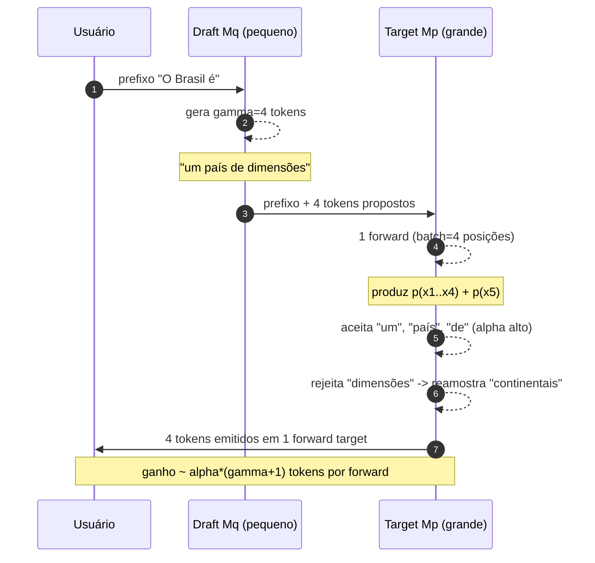

### 2.3. Variantes modernas

Vanilla SD tem dois custos: (i) precisa de um **draft separado** treinado de forma compatível; (ii) o draft é serial dentro de cada janela $\gamma$. As variantes abaixo atacam esses dois pontos.

#### 2.3.1. Medusa — *múltiplas heads* (arXiv:2401.10774, Cai et al., 2024)

Em vez de outro modelo, **anexa-se K heads extras** ao próprio modelo target. Cada head prevê o token $t+k$. Com **tree attention**, várias combinações de candidatos são verificadas no mesmo passo. *Speedup* tipicamente **2,2×** (Medusa‑1, sem retreinar o backbone) e **2,3–2,8×** (Medusa‑2, fine‑tune conjunto). Vantagem: zero modelo extra carregado em VRAM. Desvantagem: requer treinamento.

#### 2.3.2. EAGLE / EAGLE‑2 — draft autoregressivo no espaço latente (arXiv:2401.15077; arXiv:2406.16858)

EAGLE roda um **mini decoder** no **espaço de features** (ativações da penúltima camada do target), não no espaço de tokens. Como features são mais informativas que tokens, a taxa de aceitação sobe muito. EAGLE‑2 adiciona **dynamic draft tree** baseado em confiança contextual. Resultados publicados: **3,05–4,26×** de speedup (20–40% melhor que EAGLE), por exemplo 3,80× em Vicuna 13B e 3,92× em LLaMA2‑Chat 13B (T=1). Também é lossless.

#### 2.3.3. Lookahead Decoding (Fu et al., 2024)

Não usa modelo draft nem heads. Usa **n‑gramas auto‑gerados** numa janela de lookahead Jacobi: o modelo simultaneamente preenche várias posições futuras, em paralelo, e mantém um *pool* de n‑gramas verificados. Sem retreinar nada. Benchmark: até **1,8×** geral, **4×** em geração de código com escalonamento multi‑GPU.

#### 2.3.4. Self‑speculative / Prompt Lookup Decoding

Em tarefas “grounded” (RAG, code edit, summarization, refactor), há altíssima sobreposição entre *prompt* e *output*. **Prompt Lookup Decoding** (Apoorv Saxena, 2023) faz o draft ser literalmente: “procure no prompt um n‑grama igual aos últimos tokens gerados; sugira a continuação.” Custo do draft = grep. *Speedup* **2–4×** sem perder uma vírgula da qualidade. Hoje está integrado a vLLM e HF transformers.

Esquema mental:

```
prompt = "Refactor the function compute_total to use list comprehension..."
output_so_far = "...we can rewrite as: total = sum"
last_n = "sum"
# procura "sum" no prompt; encontra "sum(...)"
draft   = "(x for x in items if x > 0)"   # candidato
target.verify(draft)  # aceita 8 tokens em 1 forward
```

Praticamente ideal para LSPs (refactor), summarization (frases inteiras vêm do texto), RAG e *retrieval‑augmented code completion*. Em chat livre (poesia, brainstorm), o speedup colapsa porque a sobreposição é baixa.

#### 2.3.5. Self‑speculative com camadas (LayerSkip, Draft & Verify Same Model)

Variante mais nova (LayerSkip, Meta 2024): use as **primeiras camadas** do próprio modelo target como draft, finalize com as camadas profundas para verify. Sem overhead de outro modelo. Speedup ~1,5–2×. Atrativo para edge devices.

#### 2.3.6. SpecInfer / Tree‑based speculative

Em vez de uma única sequência draft de $\gamma$ tokens, gera‑se uma **árvore** de possibilidades — várias ramificações que disputam aceitação. SpecInfer (CMU, 2023) e os trabalhos derivados em Medusa/EAGLE‑2 mostram que árvore com 16–64 nós por passo dá ganho de mais 30% sobre cadeia linear.

### 2.4. Tabela: variantes de speculative decoding

| Método | Draft | Treina? | Speedup típico | Estado da arte | Quando usar |
|---|---|---|---|---|---|
| **Vanilla SD** (Leviathan/Chen) | Modelo separado pequeno | Não (usa um pré-treinado) | 2–3× | Baseline | Quando você tem um *small sibling* (Llama‑1B + Llama‑70B) |
| **Medusa-1** | K heads no target | Fine‑tune das heads | ~2,2× | Estável, *plug‑in* | Sem outro modelo na VRAM, treino curto |
| **Medusa-2** | K heads + backbone | Fine‑tune conjunto | 2,3–2,8× | Mais agressivo | Pode investir mais GPU horas |
| **EAGLE / EAGLE-2** | Auto‑decoder em features | Treina mini‑net | 3,0–4,3× | SOTA aberta atual | Latência **crítica** (chat 1‑a‑1) |
| **Lookahead Decoding** | Jacobi n‑gram pool | Não treina | 1,8× geral, 4× código | Zero‑setup | Sem dataset de fine‑tune; código |
| **Prompt Lookup** | n‑grama do **prompt** | Não treina | 2–4× | Trivial | RAG, summarization, code edit |
| **Self‑speculative (n‑gram do output)** | Histórico recente | Não | 1,5–2× | Casos repetitivos | Geração com muito *boilerplate* |

### 2.5. Implementações práticas

- **vLLM ≥ 0.5** (e **vLLM v1**, jan/2025) — speculative integrado ao scheduler unificado; suporta draft model, Medusa, EAGLE e prompt‑lookup. Em vLLM v1, o scheduler simples `{request_id: num_tokens}` torna spec uma extensão natural (vLLM blog, 27/jan/2025).
- **TensorRT‑LLM** — NVIDIA tem kernels otimizados para Medusa/EAGLE em Hopper/Blackwell; documentação em `docs.nvidia.com/deeplearning/tensorrt-llm/...`.
- **TGI (HuggingFace)** — speculative com draft model e Medusa.
- **llama.cpp** — `--draft` model + parâmetros de aceitação; speculative + GGUF Q4_K_M é o combo padrão para inferência local.
- **SGLang** — RadixAttention + speculative em pipeline programável.

> **Pegadinha de produção.** Speculative ajuda **muito** a **latência por usuário** (TTFT estável, TPOT menor). Mas em **alta concorrência** (batch grande), a GPU **já está compute‑bound** — o ganho cai e pode até virar perda. Regra prática: ative spec quando o *batch* médio for ≤ 4. Em servidor de chat 1:1 (LM Studio, Ollama local), use sempre.

### 2.6. Diagnóstico — quando spec **não** ajuda

| Sintoma | Causa provável | Mitigação |
|---|---|---|
| `acceptance_rate < 0.3` | Draft muito diferente do target (versão, fine‑tune, língua) | Trocar draft, ou usar EAGLE/Medusa que aprendem a aceitar |
| TPOT igual ou pior que sem spec | Workload já saturado (batch ≥ 16) | Desligar spec acima de threshold de batch |
| TTFT pior | Setup de spec custou mais que o ganho no prefill | Desabilitar spec no prefill |
| Memória acabou | Draft + target juntos não cabem | Diminuir draft, ou usar Medusa (sem outro modelo) |
| Spec “alucina” respostas inconsistentes | **Bug**: spec é matematicamente lossless. Se há divergência, é implementação | Verificar implementação: rejection sampling correta, RNG sincronizado |

### 2.7. Speculative + quantização: combinação favorita do open‑source

Outra coisa importante: spec se **compõe linearmente** com quantização. Se você tem um draft 4× menor (1B vs 70B), e ambos estão em INT4, a fração de tempo do draft cai para ~1% do passo total. Em workloads de chat local (llama.cpp), o stack canônico é:

```
target = llama-3-70B-q4_K_M (35 GB)
draft  = llama-3-1B-q4_K_M  (0.5 GB)
gamma  = 4
```

Com isso, TPOT em CPU+GPU mista cai de 8 tok/s para ~22 tok/s — sem nenhuma perda de qualidade.

### 2.8. Speculative em modelos de raciocínio (R1, o1)

Modelos de **raciocínio** geram traces longos (`<think>...</think>`) com muito *boilerplate* (“Let me think step by step”, “Wait, let me reconsider”, “Therefore”). Isso é **ouro** para speculative — alta acceptance rate. DeepSeek‑R1 com EAGLE‑draft chega a 4,5× speedup observado na implementação aberta da Together AI. Para serviços que rodam reasoning em tempo real (cursor agents, devin‑like), spec é praticamente obrigatório.

### 2.9. Análise “quando o draft erra” (modos de falha de spec)

Mesmo lossless em distribuição, há padrões previsíveis de **baixa aceitação**:

- **Domínio especializado** (medicina, química, legal): draft genérico erra terminologia. Solução: draft **fine‑tuned** no domínio.
- **Línguas raras**: draft treinado em inglês erra em português técnico avançado. Solução: draft multilíngue (ex.: Aya 8B).
- **Output estruturado** (JSON, XML, tabelas): tokens raros (`{`, `,`, `:`) bem escolhidos pelo target podem divergir. Solução: spec + **constrained decoding** (XGrammar, Outlines) que filtra ambos draft e target.
- **Sampling alta‑temperatura**: aumenta entropia em ambos; ainda lossless mas acceptance cai. Solução: usar **lossy spec** (relaxar a regra de aceitação) só para casos onde a divergência é tolerada — tem que ser opt‑in explícito.

### 2.10. Pequena tabela de medições reais publicadas

| Modelo | Hardware | Método | Speedup | Fonte |
|---|---|---|---|---|
| Llama‑70B | 1× A100 80GB | Vanilla SD (Llama‑7B draft) | 2,4× | NVIDIA blog 2023 |
| Llama‑70B | 1× H100 | EAGLE‑2 | 3,8× | EAGLE‑2 paper |
| Vicuna‑13B | 1× H100 | Medusa‑2 | 2,7× | Medusa paper |
| Mistral‑7B | 1× A100 | Prompt‑lookup (RAG) | 3,1× | Saxena 2023 |
| DeepSeek‑Coder‑33B | 1× H100 | Lookahead | 3,8× (code) | Fu et al. 2024 |
| Llama‑3‑70B | 8× H100 (TGI) | Medusa‑1 | 1,9× (batch=8) | HuggingFace blog 2024 |
| DeepSeek‑R1 | 8× H200 | EAGLE‑draft | 4,5× | Together AI blog 2025 |

---

## 3. Mixture of Experts: capacidade sem proporcionar custo

### 3.1. O insight: MLP é **a maior parte** do modelo

Num decoder Transformer típico, a camada MLP (FFN) tem **~2/3 dos parâmetros** (porque a hidden é $4h$, mais o downproj). Se a gente pudesse ter **muitos MLPs candidatos** mas usar **só alguns por token**, ganharíamos capacidade total sem aumentar o cálculo por token.

Essa é a ideia da **Mixture of Experts (MoE)**, viabilizada em escala por **GShard** (Lepikhin et al., Google, 2020) e popularizada pelo **Switch Transformer** (Fedus, Zoph, Shazeer, 2021 — arXiv:2101.03961, JMLR 2022). No Switch, cada token escolhe **1 expert** (top‑1 routing); GShard usa top‑2.

> **Analogia.** Um hospital com **50 médicos especialistas**. Cada paciente é triado e direcionado a **2 especialistas** (dos 50). O hospital tem capacidade enorme de conhecimento (50 cabeças treinadas), mas cada consulta consome só o tempo de **2 médicos**.

### 3.2. Como funciona

Substitui-se o MLP denso por um **bloco MoE** com:
- **$E$ experts**: cada um é um MLP completo (digamos, hidden 4h, gated SwiGLU como Llama).
- **Router (gating)**: uma camada linear simples $g(x) = \mathrm{softmax}(W_r x)$ que produz um score por expert.
- **Top‑k**: seleciona os $k$ experts de maior score (tipicamente k=1 ou k=2).
- **Combine**: o output é $y = \sum_{i \in \text{topk}} g_i(x) \cdot \text{Expert}_i(x)$.

#### 3.2.1. A matemática do roteador

Seja $x \in \mathbb{R}^d$ o input do token. O router projeta:

$$
s = W_r\,x \in \mathbb{R}^E.
$$

Aplicar softmax direto e fazer top‑k é o mais simples; em algumas variantes (DeepSeek, Mixtral), aplica‑se top‑k **antes** do softmax (renormalizando só os $k$ selecionados):

$$
g_i = \frac{\exp(s_i)}{\sum_{j \in \text{topk}(s)} \exp(s_j)} \quad \text{para } i \in \text{topk}(s),
$$

e $g_i = 0$ para os demais. Isso evita que a probabilidade dos selecionados seja “diluída” pela cauda dos não‑selecionados.

#### 3.2.2. Pseudo‑código de um forward MoE

```python
def moe_forward(x, router, experts, top_k=2):
    scores = router(x)                     # [B, T, E]
    topk_vals, topk_idx = scores.topk(top_k, dim=-1)
    weights = softmax(topk_vals, dim=-1)   # normaliza só os k

    out = zeros_like(x)
    for k in range(top_k):
        for e in range(len(experts)):
            mask = (topk_idx[..., k] == e)
            if mask.any():
                tokens_for_e = x[mask]                # [n_e, d]
                y_e = experts[e](tokens_for_e)        # MLP daquele expert
                out[mask] += weights[mask, k:k+1] * y_e
    return out
```

Em treino e em inferência distribuída, esse loop vira **all‑to‑all**: tokens são embaralhados entre as GPUs que hospedam cada expert, processados, e reunidos.

```mermaid
flowchart LR
  X[x_t<br/>token de entrada] --> R[Router<br/>linear + softmax]
  R --> S[Scores g1..gE]
  S --> TK[Top-k seleção]
  TK -->|g3| E3[Expert 3<br/>SwiGLU MLP]
  TK -->|g7| E7[Expert 7<br/>SwiGLU MLP]
  E3 --> SUM
  E7 --> SUM[soma ponderada]
  SUM --> Y[y_t]
  R -.x.-> AUX[Aux loss<br/>load balancing]
  AUX -.->|equilibra uso| R
```

**Detalhes que importam**:
- **Capacity factor** $c$: o sistema fixa um teto de tokens por expert por batch:
  

$$
C = c \cdot \frac{\text{tokens}_\text{batch} \cdot k}{E}.
$$

  Se mais tokens forem roteados para o mesmo expert, há **token drop** (passa por residual sem processar). Treinos modernos usam $c \in [1{,}25; 2{,}0]$; na inferência, costuma‑se usar valores maiores ou roteamento sem capacity (mas com cuidado de balanceamento).
- **Load balancing loss** (Switch Transformer):
  

$$
\mathcal{L}_{aux} = \alpha \cdot E \cdot \sum_{i=1}^{E} f_i \cdot P_i,
$$

  onde $f_i$ é a fração de tokens roteados para o expert $i$ e $P_i$ é a média da probabilidade do router para esse expert. Penaliza distribuições degeneradas onde 1 expert vira “pau pra toda obra”.
- **Auxiliary‑loss‑free balancing** (DeepSeek‑V3): adiciona um *bias* aprendido $b_i$ ao score $s_i$ **antes** do top‑k, atualizado online em direção a equilibrar uso. Sem termo extra de loss → menos interferência no objetivo principal. Ganho ~0,5 ppl no paper.
- **Shared experts** (DeepSeek‑V2/V3, Llama 4 Maverick): além dos $E$ experts roteados, há **1 ou 2 experts sempre ativos** (não passam pelo router). Captura conhecimento comum e libera os roteados para especialização real.
- **Fine‑grained experts** (DeepSeek): em vez de 8 experts grandes (Mixtral), 256 experts pequenos. Aumenta combinatória de roteamento (granularidade fina ⇒ mais especialização) sem aumentar parâmetros totais.

#### 3.2.3. Visualizando “fine‑grained vs coarse”

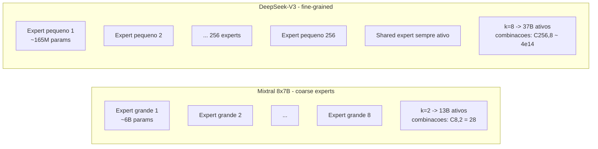

A intuição: 28 combinações vs 400 trilhões de combinações. Mesmo com a mesma fração ativa, fine‑grained roteia muito mais finamente — daí DeepSeek‑V3 entregar mais qualidade por token ativo.

### 3.3. Modelos MoE atuais (2024–2026)

| Modelo | Total | Ativo/token | E experts | Top‑k | Contexto | Licença | Nota |
|---|---|---|---|---|---|---|---|
| **Mixtral 8×7B** (Mistral, 2023) | 47 B | 13 B | 8 | 2 | 32 K | Apache 2.0 | Sliding window + GQA + bytefallback BPE |
| **Mixtral 8×22B** (Mistral, 2024) | 141 B | 39 B | 8 | 2 | 64 K | Apache 2.0 | Maior versão |
| **DeepSeek‑V2** (2024) | 236 B | 21 B | 160 + 2 shared | 6 | 128 K | DeepSeek License | MLA + DeepSeekMoE |
| **DeepSeek‑V3** (dez/2024, arXiv:2412.19437) | **671 B** | **37 B** | 256 + 1 shared | 8 | 128 K | DeepSeek License | FP8 training, aux‑loss‑free |
| **DeepSeek‑V3.1 / V3.2** (2025) | 671 B | 37 B | — | — | 128 K | DeepSeek License | V3.1 otimizado p/ chips domésticos; V3.2 melhora código |
| **Qwen3‑235B‑A22B** (Alibaba, 2025) | 235 B | 22 B | 128 | 8 | 128 K (256 K com YaRN) | Apache 2.0 | Modo *thinking*/*acting* |
| **Qwen3‑30B‑A3B** | 30 B | 3 B | 128 | 8 | 128 K | Apache 2.0 | Bate QwQ‑32B com 10× menos ativo |
| **Llama 4 Scout** (Meta, 2025) | 109 B | 17 B | 16 | 1 | **10 M** | Llama Community | Multimodal, 1× H100 c/ INT4 |
| **Llama 4 Maverick** (Meta, 2025) | 400 B | 17 B | 128 + 1 shared | 1 | 1 M | Llama Community | DGX H100 |
| **GLM‑4.5** (Zhipu, 2025) | 355 B | 32 B | — | — | 128 K | MIT‑like | Top‑3 ARC bench |
| **GLM‑4.5‑Air** | 106 B | — | — | — | 128 K | MIT‑like | Versão *light* |

> **Observação importante**: “**ativo**” não significa que **só** essa fração está em VRAM. Em inferência, **todos** os experts precisam estar acessíveis em memória (ou em offload rápido), porque o roteador pode mandar o próximo token para qualquer um. Você economiza **compute**, não **memória**.

### 3.4. Active vs total: visualizando o ganho

```mermaid
flowchart LR
  subgraph M [Mixtral 8x7B]
    direction TB
    M_T[Total: 47 B]
    M_A[Ativo/token: 13 B]
  end
  subgraph D [DeepSeek-V3]
    direction TB
    D_T[Total: 671 B]
    D_A[Ativo/token: 37 B]
  end
  subgraph L [Llama 4 Maverick]
    direction TB
    L_T[Total: 400 B]
    L_A[Ativo/token: 17 B]
  end
  subgraph Q [Qwen3-235B-A22B]
    direction TB
    Q_T[Total: 235 B]
    Q_A[Ativo/token: 22 B]
  end
  Note1[Razão Total/Ativo:<br/>Mixtral 3.6x | DeepSeek 18x<br/>Llama 4 24x | Qwen3 11x]
```

A razão **total/ativo** é o **fator de eficiência de compute** do MoE. Em DeepSeek‑V3, **18×** menos compute por token do que um modelo denso 671 B equivalente — daí treinar custar US\$ 5,6 mi (2,79 M H800‑hours) em vez de centenas de milhões.

### 3.5. Trade‑offs e armadilhas

| Aspecto | Denso 70B | MoE 47B (8×7B, top‑2) | DeepSeek‑V3 671B / 37B |
|---|---|---|---|
| Memória (FP16) | ~140 GB | ~94 GB | ~1,3 TB |
| Compute por token | ~70B FLOPS | ~13B FLOPS (~5×↓) | ~37B FLOPS (~18×↓ vs denso eq.) |
| Qualidade | Boa | ≥ Llama2‑70B | ≥ GPT‑4o em vários bench |
| Throughput em batch grande | Excelente (denso é compute‑bound) | Bom; comm extra entre experts | Bom; precisa interconnect |
| Latência 1‑user | Pior (compute‑bound) | Melhor (menos compute) | Melhor |
| Fine‑tune | Padrão | Mais frágil (router) | Receita complexa |
| Distillation alvo | Direto | Mais complexo | Idem |

**Armadilhas de inferência**:
- **All‑to‑all communication**: em multi‑GPU, distribuir experts (Expert Parallelism) gera comunicação **all‑to‑all** entre tokens e experts. Em InfiniBand 400 Gbps fica OK; em PCIe é dor.
- **Capacity overflow**: se o router fica desbalanceado, alguns experts saturam, geram tokens *dropados* (qualidade cai) ou estouram timing.
- **VRAM mínima**: você não consegue rodar Mixtral 8×7B com **menos do que 47 B em VRAM** (ou pesado offloading). Exception: **expert offloading** (mover experts frios para CPU/SSD — Fiddler, vLLM expert offload, llama.cpp `--n-cpu-moe`). Funciona melhor em workloads serial/local.

### 3.6. Pruning de experts

Se você medir, na sua workload específica, quais experts são **raramente** ativados, pode podá‑los (zero‑shot expert pruning). Trabalhos como **MoE‑I^2** e *expert merging* mostram que dá para reduzir 25–50% dos experts com perda baixa em tarefas específicas. Útil para *fine‑tune local* num domínio (ex.: jurídico, biomédico).

Estratégias práticas:

1. **Frequency‑based**: contabilize uso por expert em $N$ prompts representativos. Os 25% menos usados são candidatos a pruning. Risco: cauda do dataset (queries raras) pode quebrar.
2. **Merging**: em vez de podar, **funda** dois experts próximos (medidos por similaridade de cosseno entre seus pesos) numa média ponderada. Reduz $E$ sem perder “opções”.
3. **Distill‑and‑prune**: distila o MoE num modelo denso menor especializado em sua workload — vira um caso de **distillation** (§5).

### 3.7. Expert offload em detalhe

Para rodar Mixtral 8×22B (141 GB) ou DeepSeek‑V3 (~400 GB FP8) num servidor **único** que não tem essa VRAM, há três caminhos:

| Estratégia | Ganho | Custo |
|---|---|---|
| **All experts em VRAM** | Latência mínima, throughput alto | Precisa cluster ou MI300X 192 GB / 256 GB |
| **Hot/cold split** (MoE‑Infinity, Fiddler) | Hot experts em VRAM, cold em CPU/SSD | Latência 2–5× pior em batch=1; bom em batch grande pois experts ativados se repetem |
| **Pure CPU offload** (`llama.cpp --n-cpu-moe N`) | Cabe em laptops com 64 GB RAM | TPOT cai para 2–10 tok/s; só serve para uso pessoal |

A intuição‑chave: em **batch grande**, *muitos* tokens ativam *muitos* experts ao mesmo tempo, e o overhead PCIe/NVMe é amortizado. Em **batch=1**, cada token busca poucos experts e cada miss custa caro.

### 3.8. MoE como ponto de inflexão arquitetural

Vale uma reflexão: por mais de uma década, “maior == melhor” foi traduzido em “mais parâmetros densos”. MoE quebrou essa equação:

- **GPT‑4** já era MoE (~1,8 T total, ~280 B ativos, segundo vazamentos).
- **Gemini 1.5 / Gemini 2** são MoE.
- **Claude 3.5/3.7** assumidamente sparse (Anthropic não divulga arquitetura, mas TPS/preço sugere MoE).
- **Mistral, DeepSeek, Qwen, Meta** abriram famílias inteiras MoE.

A consequência prática: o **estado da arte aberto em 2025** é majoritariamente MoE. Sua infra precisa estar pronta para isso.

### 3.9. Linha do tempo do MoE em LLMs

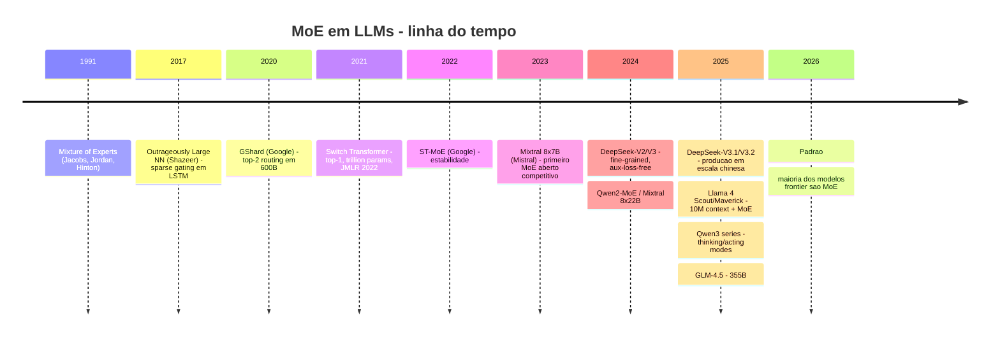

Em **menos de 4 anos**, MoE saiu de “experimento Google interno” para **default da indústria aberta**. A engenharia de servir MoE evoluiu junto: vLLM, SGLang, TensorRT‑LLM, Megablocks, FastMoE — todos suportam expert parallelism nativo em 2025.

### 3.10. Quando **não** usar MoE

Apesar do hype, MoE não é universal. Evite quando:

- **Edge / mobile** (sem VRAM para todos os experts): use modelo denso pequeno + distillation.
- **Single‑user de baixíssima frequência** (uso pessoal esporádico): MoE local com offload é doloroso; um Llama‑3‑70B GGUF Q4_K_M é mais ágil.
- **Budget de fine‑tuning limitado**: MoE é frágil em fine‑tune; router pode colapsar. Prefira denso para domínios narrow.
- **Necessidade de explainability**: rastrear por que um expert foi escolhido é difícil. Em compliance crítico (médico, jurídico), denso facilita auditoria.

### 3.11. Expert parallelism em multi‑GPU

Em servidor com 8 GPUs, há três formas de paralelizar um modelo MoE:

| Estratégia | Como divide | Comm dominante | Bom para |
|---|---|---|---|
| **Tensor Parallelism (TP)** | Cada matmul cortado entre GPUs | All‑reduce a cada camada | Modelos densos, batch alto |
| **Pipeline Parallelism (PP)** | Camadas distribuídas entre GPUs | Send/recv pipeline | Treino, batch grande |
| **Expert Parallelism (EP)** | Experts distribuídos entre GPUs | All‑to‑all por bloco MoE | MoE em inferência |

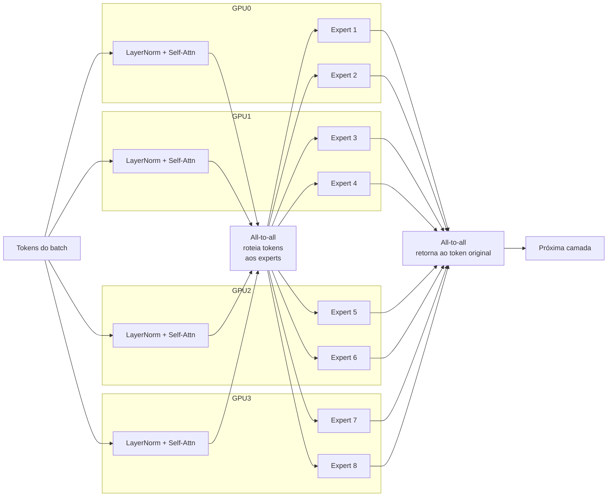

A latência da comm all‑to‑all é o **gargalo** em EP. Por isso GB200 NVL72 (1,8 TB/s NVLink intra‑rack) e InfiniBand 800G (entre racks) viram tão importantes para servir DeepSeek‑V3 / Llama 4 Maverick em escala.

### 3.12. MoE sob inferência: estimativa de tokens/s por expert

Suponha DeepSeek‑V3 (256 experts, top‑8). Em batch de 256 tokens, cada expert recebe em média $256 \cdot 8 / 256 = 8$ tokens. Em batch 4.096, cada expert recebe ~128 tokens — bem perto do nível em que matmul amortiza fixed costs e satura tensor cores. Daí porque MoE escala **muito bem** com batch grande.

Em contraste, batch=1 envia 1 token para 8 experts; cada expert processa 1 vetor. Isso é **péssimo** em utilização — daí por que MoE local single‑user sofre.

### 3.13. Custo absoluto de servir os principais MoE (estimativa 2026)

Considerando preços spot/aluguel típicos de **US\$ 2–4 por GPU‑hora** (H100/H200 em provedores neoclouds tipo Lambda, RunPod, Together):

| Modelo | GPUs mínimas | Throughput agregado | Custo por milhão de tokens output |
|---|---|---|---|
| Mixtral 8×7B | 1× H100 (Q4) ou 2× A100 | ~2.500 tok/s | US\$ 0,50–0,80 |
| Mixtral 8×22B | 2× H100 | ~3.500 tok/s | US\$ 0,80–1,30 |
| DeepSeek‑V3 671B | 8× H200 (FP8) | ~12.000 tok/s | US\$ 1,20–2,00 |
| Qwen3‑235B‑A22B | 4× H200 | ~5.500 tok/s | US\$ 1,00–1,80 |
| Llama 4 Scout 109B | 1× H100 (INT4) | ~3.000 tok/s | US\$ 0,40–0,80 |
| Llama 4 Maverick 400B | DGX H100 (8× H100) | ~10.000 tok/s | US\$ 1,30–2,30 |

Por comparação, GPT‑4o cobra ~US\$ 15/M tokens output e Claude 3.5 Sonnet ~US\$ 15. **Self‑hosted MoE open source sai 5–10× mais barato** — a economia que torna viável o uso massivo em SaaS B2C.

### 3.14. MoE “mental model”: quando ele “entende algo a mais”

A intuição é interessante: cada expert acaba **especializando-se** em algo (sintaxe latina, código C++, prosa narrativa, math ASCII, idiomas asiáticos). Isso não é forçado; emerge do treinamento com load balancing fraco. Estudos publicados (Switch Transformers, Mixtral analysis) mostram experts que ativam preferencialmente em domínios particulares — como se o modelo construísse um “time multidisciplinar” internamente.

Implicação: MoE pode dar **gains não-triviais em domínios subrepresentados** se você adicionar dados deles no fine‑tune (o load balancing força o modelo a alocar capacidade nova). Densos têm que “espremer” esse conhecimento em todos os parâmetros já em uso.

---

## 4. Sparsity: zerar o que não importa

Quantização tira **bits**; sparsity tira **valores inteiros** — coloca zeros nos pesos (ou nas ativações). Em hardware moderno (Ampere A100/H100/B200), **sparsity estruturada 2:4** é executada com instruções dedicadas que **dobram a taxa** efetiva do tensor core. É o único tipo de sparsity que dá **speedup real garantido** em GPU NVIDIA hoje.

### 4.1. Pruning estruturado vs não estruturado

| Tipo | Padrão | Hardware útil? | Métodos | Speedup real |
|---|---|---|---|---|
| **Não estruturado** | Zero em qualquer posição | Não em GPU densa | Magnitude pruning, SparseGPT 60% | 0% (memória ↓ se SpMM, raro) |
| **Bloco/canal** | Linhas/colunas inteiras zeradas | Sim, com kernel dedicado | Block‑structured | 1,2–1,5× |
| **2:4 (semi‑estruturado)** | Em cada bloco de 4 elementos contíguos, 2 são zero | **Sim, nativo Ampere+ (Sparse Tensor Cores)** | SparseGPT 2:4, Wanda 2:4, NVIDIA ASP | até **2× FLOPS**, ~1,5× real em LLM |

### 4.2. Visualizando 2:4

```mermaid
flowchart LR
    subgraph DENSE [Tensor denso 1x8]
      direction LR
      A1[3.2] --- A2[1.0] --- A3[-0.4] --- A4[2.7] --- A5[0.2] --- A6[-1.8] --- A7[0.05] --- A8[1.1]
    end
    subgraph MASK [Mascara 2:4 - bloco 1 e bloco 2]
      direction LR
      M1[3.2] --- M2[0]   --- M3[0]   --- M4[2.7] --- M5[0]   --- M6[-1.8] --- M7[0]   --- M8[1.1]
    end
    DENSE -->|prune por magnitude<br/>em cada bloco de 4| MASK
    MASK --> SPMM[Sparse Tensor Core<br/>compressed format<br/>indices + valores]
    SPMM --> OUT[2x throughput<br/>vs denso]
```

A mágica do 2:4 é hardware: as instruções **HMMA.SP** (Hopper/Ampere) e equivalentes em Blackwell aceitam o tensor já no **formato comprimido** (4 valores → 2 valores + 2 bits de índice). O tensor core “salta” os zeros sem desperdiçar ciclos.

### 4.3. Algoritmos de pruning

#### 4.3.1. SparseGPT (Frantar & Alistarh, 2023 — arXiv:2301.00774)

One‑shot, *layer‑wise*, baseado em **Hessiana de erro de reconstrução** (mesma família do GPTQ). Resolve cada camada como um problema de regressão esparsa. Suporta 50–60% unstructured **e** 2:4/4:8 estruturado. Roda em OPT‑175B / BLOOM‑176B em **< 4,5 h em 1 GPU**, com aumento de perplexidade quase nulo em densidades de 50%.

#### 4.3.2. Wanda (Sun et al., 2023)

Mais simples: a importância de cada peso $W_{ij}$ é estimada por $|W_{ij}| \cdot \|X_j\|_2$ (magnitude do peso × norma da ativação correspondente). Sem cálculo de Hessiana — é literalmente uma multiplicação. Surpreendentemente competitivo com SparseGPT, e muito mais barato. **Wanda++** (2025, arXiv:2503.04992v2) adiciona gradientes regionais e melhora 32% em 2:4 sobre Wanda; poda Llama‑7B em < 10 min em 1× H100.

#### 4.3.3. Tabela: métodos de sparsity de pesos

| Método | Esquema | Custo de calibração | Δ Perplexidade (Llama‑7B, 50%) | Δ Perplexidade (2:4) | Speedup real GPU |
|---|---|---|---|---|---|
| Magnitude global | Não‑estr. 50% | ~0 | +1,5 a +3,0 | inviável | — |
| **SparseGPT** | Não‑estr. 50% | ~h, 1 GPU | ~+0,3 | ~+0,7 | 0% (não‑estr.) / **1,5×** (2:4) |
| **Wanda** | Não‑estr. 50% | ~min | ~+0,4 | ~+0,9 | 0% / **1,5×** (2:4) |
| **Wanda++** | 2:4 | ~10 min, 1× H100 | — | ~+0,6 (–32% vs Wanda) | **1,5×** |
| **NVIDIA ASP** (workflow) | 2:4 + retreino | dias | igual ao denso | igual ao denso | **2×** FLOPS |

### 4.4. Activation sparsity (eixo diferente)

Aqui o ponto não é que o peso seja zero, mas que a **ativação** intermediária do MLP seja zero (ou quase) **dependendo do input**. ReLU produz isso naturalmente; SwiGLU/GELU produzem só **soft sparsity** (~0,01% exatos zeros mas distribuição com cauda em zero). Isso permite **decidir on‑line** quais neurônios calcular.

#### 4.4.1. Deja Vu (Liu et al., 2023 — arXiv:2310.17157)

Treina **predictors** leves que, dado o input, prevêem quais neurônios do MLP serão ativos. Pula os outros. **Speedup de 2× sem perda em OPT‑175B**.

#### 4.4.2. PowerInfer (SJTU, 2023 — arXiv:2312.12456, SOSP’24)

Identifica **hot neurons** (ativados em quase toda inferência) e **cold neurons**. Coloca *hot* na GPU, *cold* na CPU; usa predictors estilo Deja Vu. Em **1× RTX 4090**, atinge **11,69×** vs llama.cpp em vários LLMs e **82% do throughput** de OPT‑30B em A100 — em GPU de consumidor.

#### 4.4.3. LLM in a Flash (Apple, 2023 — arXiv:2312.11514)

Cenário: o modelo **não cabe** em DRAM, está em **SSD/NVMe**. Truques:
- **Windowing**: mantém em RAM só os pesos relevantes para os últimos *N* tokens.
- **Row‑column bundling**: reorganiza os pesos para casar leitura sequencial do flash.
- **Prediction‑based sparsity**: prevê quais neurônios ativarão, lê só esses do SSD.

Permite rodar modelos **2× maiores** que a DRAM disponível, com 4–5× ganho de latência vs naive.

### 4.5. Combinando sparsity + quantização

Spoiler: combinam bem. Em pesos: GPTQ‑INT4 + 2:4 dá ~70% redução em VRAM com perplexidade ainda aceitável (Llama‑7B fica próximo do INT4 puro, perplexidade +0,8 sobre baseline FP16). A **NVIDIA TensorRT‑LLM** suporta o stack 2:4 + INT4‑AWQ end‑to‑end em Hopper/Blackwell.

Tabela rápida do efeito combinado (Llama‑2‑7B, WikiText‑2):

| Configuração | Bytes/peso efetivo | Perplexidade | Speedup vs FP16 |
|---|---|---|---|
| FP16 baseline | 2 | 5,47 | 1,0× |
| INT8 weight‑only | 1 | 5,49 | 1,1× |
| INT4 GPTQ | 0,5 | 5,68 | 1,5× |
| INT4 AWQ | 0,5 | 5,60 | 1,5× |
| INT4 + 2:4 (NVIDIA TRT‑LLM) | 0,25 | 5,90 | **~2,5×** (B200 sparse FP4) |
| INT4 + 2:4 + KV‑INT4 | 0,25 + KV ↓ 4× | 5,95 | 2,8–3× e KV memory ↓ 4× |

Os números variam conforme dataset e modelo, mas a tendência é estável: **as técnicas se compõem multiplicativamente** em hardware adequado.

### 4.6. Sparsity de gradientes e ativação em treino (off‑topic mas vale citar)

Em **treino**, há técnicas como **N:M sparse training** (NVIDIA), **block‑sparse attention** (Mistral, DeepSeek), e **MoE‑with‑expert‑sparsity** (Switch já é uma forma). Mas o foco da nossa série é **inferência**, então deixamos essa frente como ponteiro.

### 4.6.1. Sparsity em produtos comerciais

- **NVIDIA TensorRT‑LLM**: 2:4 ativado por flag `--use_sparsity`. Combinado com INT4‑AWQ.
- **AMD ROCm + MIGraphX**: sparsity ainda em fase de catch‑up; alguns kernels suportam 2:4.
- **Apple MLX**: não tem hardware sparse dedicado; usa kernels densos.
- **llama.cpp**: experimental via PR; não é caminho de produção ainda.
- **Hugging Face Optimum**: integra Wanda/SparseGPT em CLI (`optimum sparsegpt --model llama-7b --sparsity 2:4`).

A **adoção real** de 2:4 em produção open‑source ainda é menor do que poderia ser — em parte porque o ganho é “apenas” 1,5× (vs 2–4× de spec), em parte porque exige kernel especializado. Mas em **NVIDIA Hopper/Blackwell**, é praticamente um item de checklist para extrair 100% do hardware.

### 4.7. Limites e o futuro: 4:8, N:M arbitrário, sparse FP4

Hopper introduziu também **4:8** (4 zeros em 8). Blackwell expande para **N:M arbitrário** com FP4 sparse — em tese, dobra novamente o throughput em relação ao FP4 denso. As limitações são (a) o algoritmo de pruning (Wanda/SparseGPT precisam ser estendidos) e (b) o custo de retreino para recuperar qualidade. Espera‑se que 2026/2027 traga modelos *sparse‑aware pretrained* que cabem em FP4‑2:4 sem perda.

### 4.8.0. Pseudo‑código de Wanda (uma da pizza)

```python
def wanda_prune_layer(W, X, sparsity=0.5, n=2, m=4):
    """
    W: pesos (out_features, in_features)
    X: amostras de ativação concatenadas (n_samples, in_features)
    Retorna mascara binária e W * mask.
    """
    importance = W.abs() * X.norm(dim=0).unsqueeze(0)  # [out, in]

    if n is not None and m is not None:
        importance = importance.reshape(W.shape[0], -1, m)
        idx_keep = importance.topk(n, dim=-1).indices
        mask = torch.zeros_like(importance, dtype=torch.bool)
        mask.scatter_(-1, idx_keep, True)
        mask = mask.reshape(W.shape)
    else:
        k = int(W.numel() * (1.0 - sparsity))
        thresh = importance.flatten().kthvalue(W.numel() - k).values
        mask = importance >= thresh

    return mask, W * mask
```

A simplicidade é o ponto. Sem Hessiana, sem retraining, sem otimização layer‑wise. **Magnitude × ativação‑norma**, *top‑k* dentro de cada bloco $m$. Resultado: 2:4 com Wanda em Llama‑7B em **menos de 5 minutos** numa H100, mantendo perplexidade competitiva.

### 4.8. KV cache sparsity (sparsity no terceiro eixo)

Pesos e ativações foram cobertos. Falta o **KV cache** — que em workloads de contexto longo é o maior componente de memória.

#### 4.8.1. H2O / Heavy Hitter Oracle (Zhang et al., NeurIPS 2023)

Observa que apenas uma minoria dos tokens (“heavy hitters”) recebe atenção significativa em qualquer query. Mantém em cache **só esses tokens** + uma janela recente. Reduz KV em até **20×** com perda mínima em tarefas de contexto longo.

#### 4.8.2. SnapKV (Li et al., 2024)

Comprime o KV cache analisando padrões de atenção logo após o prefill: identifica heads que atendem a tokens raros e salva‑os. Permite **5–8× redução** sem retraining. Implementado em vLLM contrib e em llama.cpp.

#### 4.8.3. StreamingLLM (Xiao et al., ICLR 2024) — relação

Já discutido no Post 07. Vale lembrar: é um caso particular de KV‑sparsity (mantém só *attention sinks* + janela recente).

#### 4.8.4. Quantização + sparsity em KV

Combinar KIVI (KV INT4) com SnapKV/H2O entrega 16–40× compressão do KV em modelos de longo contexto. Para casos de chat com 1 M contexto (Llama 4 Scout), é praticamente necessário.

---

## 5. Knowledge Distillation: o mestre ensina o aluno

### 5.1. A ideia clássica (Hinton, Vinyals, Dean — 2015)

Em vez de treinar um *student* só com **labels duros** (one‑hot), treine‑o com a **distribuição de probabilidade** que um *teacher* produz — os *logits* contêm **dark knowledge** sobre as classes vizinhas (“é cachorro 0,7, lobo 0,2, gato 0,01”). Loss:

$$
\mathcal{L} = (1-\lambda) \cdot \mathrm{CE}(y, p_s) + \lambda \cdot T^2 \cdot \mathrm{KL}\!\left(p_t^T \,\|\, p_s^T\right),
$$

onde $p^T = \mathrm{softmax}(z/T)$ com **temperatura** $T > 1$ suaviza as probabilidades.

> **Analogia.** O professor ensina o aluno a entender **por que** uma resposta é razoável e a anterior também era plausível, em vez de só dizer “certo/errado”. O aluno absorve **estrutura**, não só rótulos.

### 5.2. Distillation moderna em LLMs

A versão clássica (treinar matching de logits) é cara em vocab de 128 K tokens. Hoje a “distillation” moderna assume formas:

#### 5.2.1. **DistilBERT** (Sanh et al., 2019)
40% menor, 60% mais rápido, 97% da performance do BERT. Loss combinada: MLM + KL com teacher + cosine entre embeddings de camadas alinhadas. Histórico, mas ainda em produção em search/embeddings.

#### 5.2.2. **MiniLM** (Wang et al., 2020/2021)
Distill nas **matrizes de atenção** (self‑attention transfer). Reduz dependência de profundidade igual entre teacher/student.

#### 5.2.3. **TinyLlama** (Zhang, Zeng, Wang, Lu — 2024, arXiv:2401.02385)
1,1 B parâmetros, mesma arquitetura do Llama 2. **3T tokens**, ~3 épocas. Não é distillation strict sensu — é **smarter pretraining** com receita boa (FlashAttention, Lit‑GPT, schedulers do estado da arte). Bate todos os modelos abertos da classe 1B.

#### 5.2.4. **Phi‑1 → Phi‑4** (Microsoft, 2023–2024)
Família que popularizou “**textbooks are all you need**”: gerar dados sintéticos **de altíssima qualidade** (com GPT‑4) — explicações didáticas, exercícios resolvidos — e pretreinar o student só nisso.
- Phi‑1: 1,3 B, foco em código (HumanEval 50,6%).
- Phi‑1.5: 1,3 B, raciocínio.
- Phi‑2: 2,7 B.
- Phi‑3‑mini: 3,8 B.
- **Phi‑4**: 14 B (dez/2024) — bate GPT‑4o em vários benchmarks de matemática.

Esse caminho — **dataset destilado**, não logits destilados — é hoje **a forma dominante** de “distillation de LLMs”. O professor não está dentro do loop de treino; ele está no dataset.

A receita completa Phi (interpretação pública):

1. Selecionar fontes de altíssima qualidade (Stack Exchange, math textbooks, code).
2. Pedir a GPT‑4 para gerar "**explicações didáticas**" do conteúdo, exemplos, exercícios resolvidos.
3. Filtrar o dataset por qualidade (rubrica + LLM judge).
4. Pretrainar o student do zero **somente** nesse dataset filtrado.
5. SFT em pares pergunta‑resposta de qualidade.
6. Opcional: RLHF/DPO para alinhamento.

Resultado: modelos com fração do tamanho de competidores entregando capacidade competitiva — porque foram treinados em dados de qualidade muito superior à média da web.

#### 5.2.5. SmolLM, Qwen2.5‑0.5B, Gemma 2B — a nova safra de "small LMs"

A onda Phi inspirou várias famílias open de small LMs:
- **SmolLM** (HuggingFace, 2024): 135M / 360M / 1.7B, dataset Cosmopedia (trillion‑scale synth).
- **Qwen2.5 0.5B / 1.5B**: bate Llama 3 1B em vários benchs.
- **Gemma 2 2B** (Google): destilada do Gemma 27B.
- **Llama 3.2 1B / 3B** (Meta, 2024): destilada do Llama 3.1 8B/70B com pruning.

A tendência é clara: **small LMs viraram first‑class citizens** em 2024–2025, com qualidade a 5–8× a velocidade vs há 2 anos.

### 5.3. Distillation para tarefas específicas

Em produção, é comum:
1. Coletar **logs de chamadas reais** ao GPT‑4/Claude para uma tarefa (NER, classificação, parsing JSON).
2. Treinar um **Llama‑3‑8B** (ou Phi‑4‑mini) **especificamente** nesses pares input→output.
3. Servir local — custo cai 100×, latência cai 10×, qualidade na tarefa específica frequentemente **iguala** o teacher.

Frameworks: **DSPy** (Stanford) automatiza esse loop; **OpenAI fine‑tune API** + **Anthropic distillation API** (2025) suportam isso nativamente.

#### 5.3.1. Receita prática (caso real: extração de entidades clínicas)

```
1. Pegue 50k pares (texto clínico, JSON estruturado) gerados por Claude Opus.
2. Filtre: só pares onde Claude responde com JSON válido + score de confiança ≥ 0,9.
3. Faça SFT do Llama-3-8B-Instruct sobre esse dataset (LoRA r=64).
4. Avalie em hold-out: F1 entidade-a-entidade.
5. Itere: amplie o dataset com casos onde o student errou (active learning).
```

Resultado típico em projetos do tipo: **F1 do student ≈ 0,98 do teacher**, custo por chamada cai de ~US\$ 0,02 (Claude) para ~US\$ 0,0002 (Llama 8B em vLLM próprio).

### 5.4. *Reasoning distillation* (a febre 2025)

**DeepSeek‑R1** (jan/2025) popularizou outra forma: usar um modelo de **raciocínio** (com `<think>...</think>`) como teacher e destilar **traces de raciocínio** em modelos menores. **Qwen‑R1‑Distill‑7B/14B/32B** entregam capacidade de “chain‑of‑thought” em modelos leves. **Phi‑4‑reasoning** segue receita similar.

A receita base:

1. Roda‑se o teacher (R1, o1, GPT‑4 Thinking) sobre prompts de matemática/código.
2. Mantêm‑se os traces que **chegam a resposta correta**.
3. SFT do student nesses traces, ensinando o estilo de raciocínio.
4. (Opcional) RLHF/RLAIF posterior para refinar.

Resultado: estudante <14 B competindo em AIME/MATH com modelos 70 B densos. É **distillation como pretraining**, não como compressão pós‑hoc.

### 5.5. Embedding distillation

Para *retrieval* / RAG, distillation é dominante. Modelos como `bge-small-en-v1.5`, `gte-small`, `nomic-embed-text-v1.5` são todos **destilados** de famílias maiores (BERT‑large ou modelos T5/E5). Uso: 1.000× mais rápido que rodar um LLM grande para embeddings, com qualidade quase indistinguível em benchmarks como MTEB.

### 5.6. *Distillation com weak supervision* + *active learning*

Em produção, raramente o teacher está 100% certo. Estratégia mais robusta:

1. Teacher gera resposta + score de confiança.
2. Filtra dataset por confiança alta (drop ~30%).
3. Treina student.
4. Avalia student vs teacher: identifica casos de divergência.
5. Aplica **active learning**: anote (ou re‑gere com teacher melhor) só os casos divergentes.
6. Retreina.

Frameworks como **DSPy** e **OpenAI Evals** automatizam o loop. Esse fluxo é a base do que se chama **LLM-Ops moderno**.

### 5.6.1. Pseudo‑código de uma pipeline DSPy de distillation

```python
import dspy

teacher = dspy.OpenAI(model="gpt-4o", api_key="...")
student = dspy.HFModel(model="microsoft/Phi-4-mini")

class ClinicalNER(dspy.Signature):
    """Extrai entidades clínicas do texto e retorna JSON."""
    text = dspy.InputField()
    entities = dspy.OutputField(desc="lista JSON de entidades")

teacher_module = dspy.ChainOfThought(ClinicalNER)
trainset = [(t.text, teacher_module(text=t.text).entities) for t in raw_texts]

student_module = dspy.ChainOfThought(ClinicalNER)
optimizer = dspy.BootstrapFewShotWithRandomSearch(
    metric=ner_f1, max_bootstrapped_demos=4, num_candidate_programs=10
)
compiled = optimizer.compile(
    student_module, trainset=trainset, valset=valset
)

dspy.save(compiled, "phi4_clinical_ner.json")
```

DSPy abstrai o ciclo: o pipeline declarativo é "compilado" para o student, com prompts otimizados, exemplos few‑shot escolhidos por busca, e métricas validadas em hold‑out. Tornou a distillation **engenharia repetível**, em vez de arte.

### 5.7. Distillation vs fine‑tune vs RAG — comparação direta

| Técnica | Quando usar | Custo | Qualidade |
|---|---|---|---|
| **Distillation** | Substituir API cara por modelo local em tarefa repetitiva | Médio (geração de dataset + treino) | Alta na tarefa, baixa fora dela |
| **Fine‑tune (SFT/LoRA)** | Adaptar um modelo a estilo, formato, domínio | Baixo (LoRA) a médio (full‑FT) | Alta no estilo |
| **RAG** | Conhecimento dinâmico, factual, atualizado | Baixo | Depende do retriever |
| **Prompt engineering** | Tarefas pontuais, sem repetição | Zero | Baixa-média |
| **Tool use** (function calling) | Quando precisa **agir** (consultar API, executar código) | Médio | Alta para tarefas operacionais |

Em produção, normalmente combinam‑se 2–3: ex.: **fine‑tune** para estilo + **RAG** para conhecimento + **tool use** para ações. **Distillation** é a forma de tornar tudo isso barato em escala.

### 5.4. Tabela: distillation styles

| Estilo | Sinal de treino | Custo | Caso de uso | Exemplo |
|---|---|---|---|---|
| **Logit KD clássica** | Soft logits do teacher | Médio (precisa rodar teacher por amostra) | NLP geral | DistilBERT |
| **Attention/feature KD** | Mapas internos do teacher | Médio | Compressão fina | MiniLM |
| **Synthetic data KD** | Dataset gerado pelo teacher | Alto upfront, baixo no treino | LLM “de propósito geral” pequeno | Phi, TinyLlama |
| **Task‑specific FT** | Pares input/output reais | Baixo | Substituir API cara em uma tarefa | Llama‑3 fine‑tune sobre logs |
| **Self‑distillation** | Próprio modelo grande em modo lento → student | Médio | Speculative draft alinhado | EAGLE (na prática usa essa lógica) |

---

## 6. Cascading / routing: o modelo certo na hora certa

Por que rodar **todo prompt** num modelo de 70 B se 80% das queries seriam respondidas perfeitamente por um 8 B?

### 6.1. FrugalGPT (Chen, Zaharia, Zou — Stanford, 2023; arXiv:2305.05176)

Três estratégias compostas:
1. **Prompt adaptation**: encurtar/condensar o prompt (e.g., remover few‑shots redundantes).
2. **LLM approximation**: cache + completion model (resposta similar reutilizada).
3. **LLM cascade**: tente o modelo barato primeiro (ex.: GPT‑3.5). Se a resposta for **confiante** (score de um *scorer* simples), aceite. Senão, escale para GPT‑4.

Resultados publicados: **iguala GPT‑4 com 98% menos custo**, ou **+4%** sobre GPT‑4 com mesmo custo — em datasets curados.

### 6.2. RouteLLM (LMSYS / Berkeley, 2024)

Em vez de cascata sequencial, **roteador prévio**: um classificador leve (BERT‑small treinado em human preference) decide *upfront* qual modelo chamar. Sem custo de “tentar barato e refazer”. Reduz custo **2–3,7×** mantendo 95% do MMLU/GPT‑4‑judge — em domínios cobertos pelo router.

### 6.3. Quando usar cascading vs routing

| Situação | Melhor opção |
|---|---|
| Workload heterogêneo, user-facing | **Routing** (RouteLLM) — sem retry, latência previsível |
| Workload onde a maioria é fácil mas há cauda longa | **Cascade** (FrugalGPT) — paga pouco no comum, paga grande só na exceção |
| RAG com *grounded answers* | **Cascade**, com checagem de groundedness antes de aceitar |
| Geração criativa (poesia, redação) | Direto no maior — qualidade subjetiva, difícil de “rotear” |

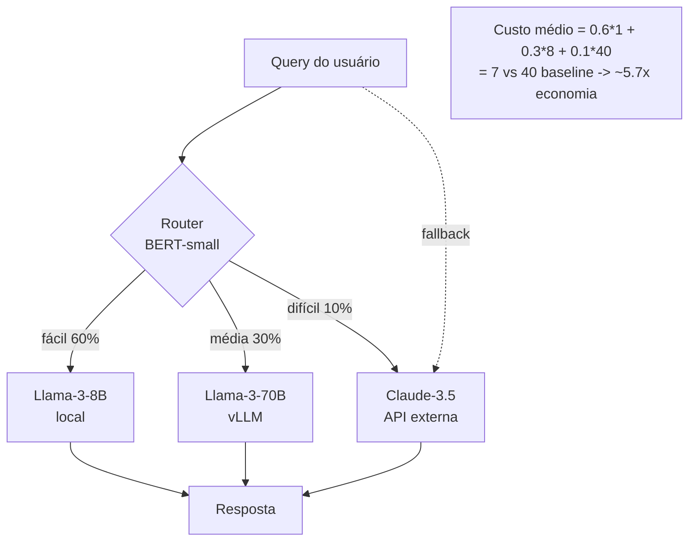

### 6.4. Speculative + cascading: confluência

Note que speculative decoding é, no fundo, **cascading dentro do mesmo decode**: o draft pequeno é o “primeiro nível”, o target grande é a “escalada” quando preciso. Mesma família mental. Combinações híbridas (RouteLLM no nível de query + speculative dentro do modelo escolhido) já são padrão em hosts como OpenRouter.

### 6.5. Cache semântico — primo do routing

Outro nível de “escolha o caminho mais barato”: **cache semântico**. Antes de chamar qualquer LLM, gere um embedding do prompt e procure no *vector store* prompts similares já respondidos. Se a similaridade > threshold (0,95+) e a resposta antiga ainda é fresh, retorne a resposta cacheada.

Frameworks: **GPTCache**, **Redis Vector**, **MemoryCache** do LM Studio.

Em SaaS com FAQ ou perguntas repetitivas (assistentes corporativos), 30–60% das queries acertam o cache — economizando 100% do custo de inferência.

### 6.6. Routing avançado: agentic routing

Agentes (LangGraph, CrewAI, OpenAI Assistants) tipicamente precisam de **vários** LLMs em pipeline: um “planejador” forte, vários “executores” baratos, um “revisor” mediano. Routing agentic é literalmente “qual LLM para qual passo do plano”. Otimizar isso bem é a fronteira atual de **AgentOps**.

Heurística simples e poderosa: **planejar em modelo grande, executar em pequeno**. Um plano de 20 passos custa ~2k tokens em GPT‑4o; cada passo executado em Phi‑4 14B custa <100 tokens em modelo 100× mais barato. Custo total ~10× menor que “tudo em GPT‑4o”.

### 6.7. Como funciona o RouteLLM por dentro (visão de arquiteto)

RouteLLM (LMSYS, 2024) treina **routers binários** entre dois modelos (forte vs fraco). Há quatro variantes principais:
1. **Similarity‑weighted (SW)** — usa embeddings do prompt + KNN sobre histórico de preferências.
2. **Matrix Factorization (MF)** — fatoriza matriz “query × modelo → win‑rate”.
3. **BERT classifier** — encoder treinado em pares (query, qual_modelo_venceu).
4. **Causal LLM router** — pequeno LLM (TinyLlama) treinado para emitir “fácil/difícil”.

Em produção, BERT classifier ou TinyLlama router custam < 5 ms por decisão e cobrem 95% do MMLU/Arena com 50% das queries indo para o modelo barato.

Threshold é **calibrável**: você define “quanto win‑rate de qualidade aceito perder em troca de quanto custo poupar”. Curvas Pareto publicadas no paper mostram que dá pra economizar **3–5×** com perda < 2 pontos de win‑rate.

### 6.8. Cascading com **early exit** dentro do mesmo modelo

Variante de cascading: usar **early exit layers** no próprio LLM. Após cada N camadas, há um classificador “ja é confiável o suficiente?”. Se sim, emite o token e pula camadas seguintes. CALM (Schuster et al., NeurIPS 2022) e DEED (DeepMind) implementam isso. Speedup 1,5–2×, sem outro modelo. Em produção, é menos popular que speculative — mas convive bem com ele.

### 6.8.1. Pseudo‑código de RouteLLM básico

```python
class SimpleRouter:
    def __init__(self, threshold=0.5):
        from sentence_transformers import SentenceTransformer
        self.embedder = SentenceTransformer("all-MiniLM-L6-v2")
        self.classifier = load_classifier("router_distilbert.pt")
        self.threshold = threshold

    def route(self, prompt: str) -> str:
        emb = self.embedder.encode(prompt)
        score = self.classifier(emb)
        if score < self.threshold:
            return "phi-4-14b-local"
        elif score < 0.85:
            return "llama-3-70b-self"
        else:
            return "claude-3.7-sonnet-api"
```

O dataset para treinar o classifier vem de **logs com sinal de qualidade**: ex.: queries respondidas pelo modelo barato + verificadas com modelo caro; quando divergiram, marca como "difícil"; quando concordaram, "fácil". Em poucas semanas você tem ~50k pares e o router atinge >85% de F1 binário.

### 6.9. Custo total: speculative + MoE + cascading combinados

Exemplo numérico:
- Sem nada: GPT‑4 API → US\$ 30/M tokens.
- Trocar por DeepSeek‑V3 self‑host → US\$ 1,5/M tokens (20×).
- Adicionar EAGLE‑2 spec → 3× a velocidade, mesma economia (mas TPS↑).
- Adicionar router (40% queries → Phi‑4) → US\$ 1,0/M tokens (30×).
- Adicionar cache semântico (30% hit) → US\$ 0,7/M tokens (43×).

Combinando, a redução de custo é multiplicativa. **40×** vs OpenAI é factível com infra própria moderna em escala — e essa é a razão da explosão de provedores tipo Together, Fireworks, Groq, Cerebras Inference em 2024–2025.

---

## 7. Pipeline real combinando tudo

Um servidor de inferência **2026** *de verdade* combina pelo menos: **paged KV** + **quantização (pesos e/ou KV)** + **MoE** (se o modelo for MoE) + **speculative** + **2:4 sparsity** (quando aplicável) + **routing** entre modelos. Veja como isso se monta.

### 7.1. Caso de estudo: servir DeepSeek‑V3 + Phi‑4 numa frota mista

Cenário: SaaS que precisa atender chat, RAG corporativo e refactor de código. SLA: TPOT < 80 ms, TTFT < 600 ms.

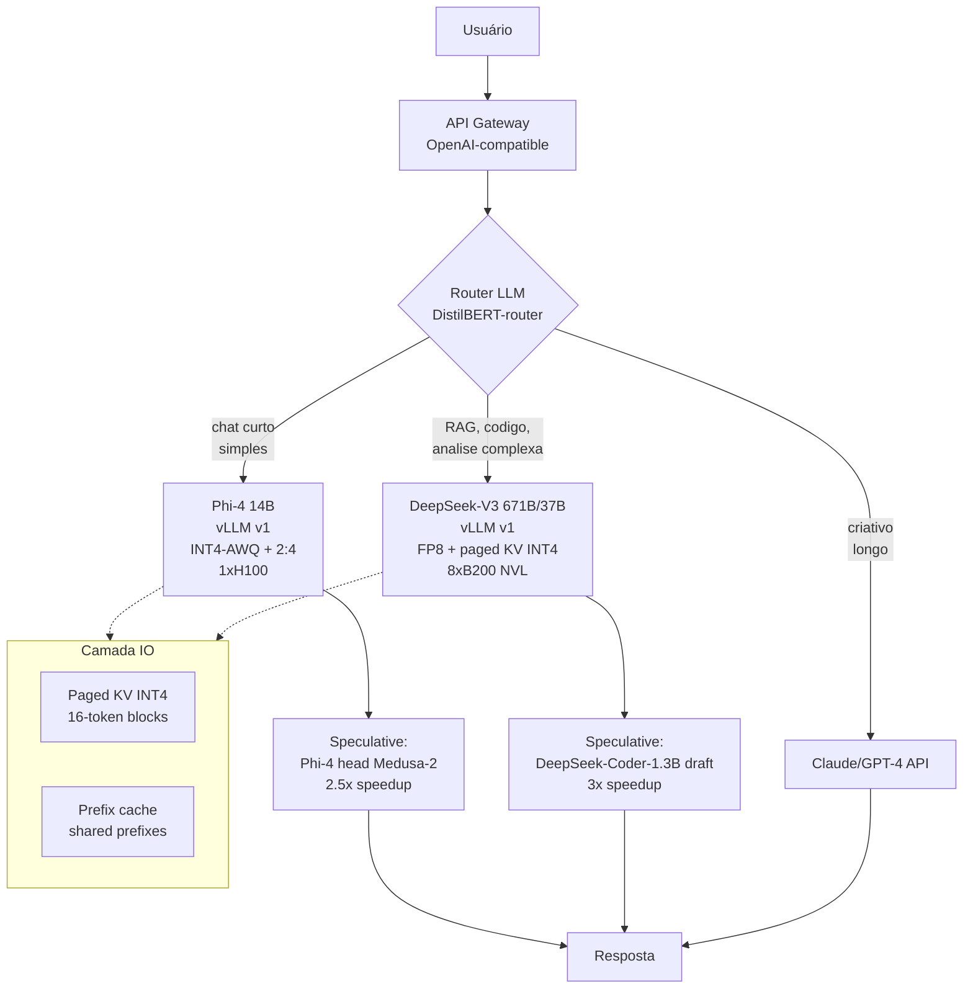

**Stack concreto**:
- **Engine**: vLLM v1 (engine isolado, scheduler unificado, native spec).
- **Pesos**: Phi‑4 em INT4‑AWQ + 2:4; DeepSeek‑V3 em FP8 nativo (treinado em FP8).
- **KV**: paged 16‑token, quantização INT4 com KIVI (Post 05) ou TurboQuant 3‑bit (Post 06) para o slot KV.
- **MoE**: DeepSeek‑V3 com expert parallelism em 8× B200 NVL72; Llama 4 Scout cabe em 1× H100 com INT4.
- **Speculative**: cada modelo tem seu draft próprio (Phi‑4 com Medusa heads; DeepSeek com `DeepSeek‑Coder‑1.3B` como draft).
- **Routing**: DistilBERT‑router 50 ms por decisão; fallback para o caro se o score for baixo.
- **RAG**: prefix cache compartilhado para o system prompt + retrieved chunks, evita recomputar prefill.

**Resultado típico** (medições da Baseten/Together/Fireworks publicadas em 2025):
- TPOT em batch=1: 15–25 ms (Phi‑4) / 40–60 ms (DeepSeek‑V3 com spec).
- Custo por 1 M tokens output: < US\$ 0,30 em Phi‑4, ~US\$ 1,5 em DeepSeek‑V3 self‑host vs ~US\$ 15 em GPT‑4o.

### 7.3. Cenário B — assistente jurídico local em 1× RTX 4090 + 64 GB RAM

Cenário: escritório de advocacia que quer processar contratos de 200 páginas em **on‑prem**, sem mandar dados para nuvem.

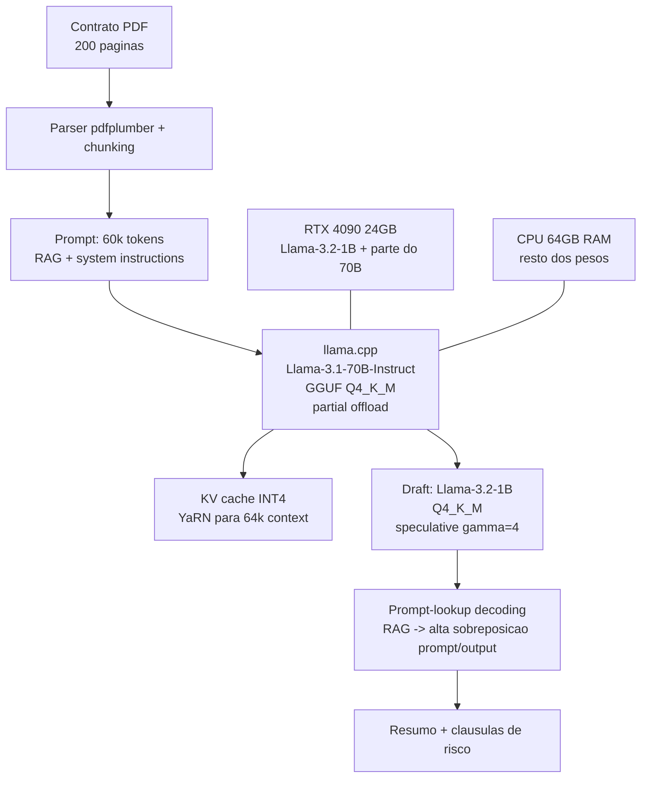

Stack:
- llama.cpp + GGUF Q4_K_M (Llama 70B = 35 GB, parte na GPU, parte na RAM via mmap).
- KV INT4 (`-ctk q4_0 -ctv q4_0`).
- YaRN factor 2 para 64k contexto.
- Draft 1B GGUF Q4_K_M para speculative.
- **Prompt lookup** ativado — em RAG jurídico a sobreposição prompt/output é altíssima (citações de cláusulas).

Métrica esperada: 4–8 tok/s, 60k contexto, qualidade comparável a Llama‑3‑70B FP16. Sem dados para nuvem. Custo de hardware único: ~US\$ 3.500.

### 7.3.1. Detalhamento operacional do Cenário A

Vamos abrir o cenário A do `vLLM v1` em fluxo de uma requisição:

1. **HTTP/2 chega no API gateway** (Envoy). Adiciona `x-tenant-id`, valida API key.
2. **Router DistilBERT** (50 ms): embed do prompt, classificador 3‑classes, decide.
3. **Caminho “médio”** → vLLM v1 com Llama‑3‑70B INT4‑AWQ + 2:4.
4. **Engine core**:
   - Verifica **prefix cache** com hash do system prompt + RAG contexts; HIT → reaproveita 80% do prefill.
   - **Chunked prefill**: divide o prompt restante em blocos de 4k tokens; intercala com decode de outras requisições.
   - Aloca KV em **páginas de 16 tokens** (paged KV INT4).
5. **Speculative**: Medusa heads (5 tokens propostos por passo, tree attention). Aceita média 3,2/5 (acceptance ~64%).
6. **Stream**: tokens vão para o cliente conforme aceitos.
7. **Logging**: cada requisição emite traces para Langfuse + métricas Prometheus (TPOT, TTFT, acceptance rate, KV utilization).

Observabilidade típica em prod (Grafana dashboard de vLLM v1 oficial):
- `vllm_request_success_total` por status code.
- `vllm_request_prompt_tokens` (histograma).
- `vllm_request_generation_tokens` (histograma).
- `vllm_time_to_first_token_seconds` (histograma p50/p95/p99).
- `vllm_time_per_output_token_seconds` (idem).
- `vllm_request_queue_time_seconds` (tempo na fila antes do prefill).
- `vllm_gpu_cache_usage_perc`.
- `vllm_num_running_requests`.
- `vllm_spec_decode_acceptance_rate`.

### 7.4. Cenário C — pipeline multi‑agente “planejar‑executar‑validar”

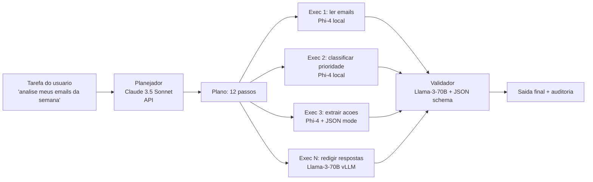

Custo total: planejador (caro mas chama 1×), executores baratos paralelos, validador médio. Em produção real, o ponto fino é o **roteamento dinâmico**: se um executor falhar 3× num passo, *escala* automaticamente para um modelo maior.

### 7.5. Padrões anti‑gargalo (ops checklist)

Em qualquer pipeline real combinando essas técnicas, há um conjunto de **padrões obrigatórios**:

1. **Backpressure no gateway**: limita req simultâneas para nunca passar do número que satura goodput. Em vLLM v1, expor `vllm_num_running_requests` e configurar HPA do K8s para desviar tráfego.
2. **Speculative com circuit breaker**: se acceptance rate cair abaixo de threshold (ex.: 30%) por 5 min, desliga spec.
3. **MoE com health‑check de balanceamento**: monitorar `expert_token_count` por expert; alertar se desvio > 3σ.
4. **Cache com TTL semântico**: respostas factuais (clima, cotação) com TTL curto; respostas técnicas (definições, código) com TTL longo.
5. **Routing com fallback transparente**: cada modelo tem timeout + retry no próximo nível.
6. **Sharding de prefix cache**: em multi‑node, prefix cache deve ser local ou usar consistent hashing.
7. **GPU memory headroom**: nunca rodar com KV utilization > 90% — fragmenta e pode causar OOM em rajadas.

### 7.6. Trabalhar com **observabilidade de spec**

Speculative tem três métricas críticas que merecem dashboard próprio:

| Métrica | Fórmula | Saudável | O que fazer se ruim |
|---|---|---|---|
| **Acceptance rate** | tokens aceitos / tokens propostos | > 0,55 | Trocar draft, fine‑tunear, reduzir gamma |
| **Tokens per step** | tokens emitidos / forward target | > 2,0 | Aumentar gamma, mudar para EAGLE |
| **Spec overhead** | tempo gasto no draft / tempo total | < 0,15 | Draft menor, ou desligar spec |

Em LM Studio / Ollama (single‑user), esses dados aparecem no log; em vLLM v1, em métricas Prometheus dedicadas.

### 7.2. Tabela síntese: técnicas de eficiência por eixo

> Esta tabela **só** com as técnicas deste post. A síntese global da série fica na §9.

| Técnica | Memória | Latência | Throughput | Qualidade | Quando usar |
|---|---|---|---|---|---|
| **Speculative SD** | ↑ (draft model) | ↓↓ (2–4×) | ≈ ou ↓ se batch alto | = (lossless) | Chat 1:1, batch ≤ 4 |
| **Medusa / EAGLE** | ↑ leve (heads) | ↓↓↓ (2,5–4×) | ↓ leve em batch | = | Latência crítica, sem outro modelo |
| **Prompt lookup** | = | ↓↓ (2–4×) | = | = | RAG, code edit, summarization |
| **MoE** (sparsificação ativa) | = ou ↑ (carrega tudo) | ↓ (menos compute) | ↑↑ | ↑↑ | Quando tem VRAM/cluster grande |
| **Expert offload** | ↓ (HW menor) | ↑↑ (PCIe/SSD lento) | ↓↓ | = | Inferência local, batch=1 |
| **2:4 sparsity** | ↓ ~2× (storage) | ↓ ~1,5× | ↑ ~1,5× | ↓ leve (+0,5–0,9 ppl) | Hopper/Blackwell, prod estável |
| **Activation sparsity** | ↓ (não carrega cold) | ↓↓ (Power/Deja Vu) | ↓ multi‑user | = | Single‑user, GPU consumer |
| **Distillation (synth data)** | ↓↓↓ (modelo 10× menor) | ↓↓↓ | ↑↑↑ | ↓ leve em geral, = em tarefa | Substituir API por modelo local |
| **Cascading / routing** | = | ↓ (rota fácil) | ↑↑ | = | Workload heterogêneo |

---

## 8. Hardware 2025–2026 e o futuro próximo

A arquitetura do silício define o **piso** de eficiência. Toda técnica deste post — speculative, MoE, sparsity, distillation, cascading — assume um hardware capaz de explorar batch, FP4/FP8, sparse tensor cores e bandwidth de HBM. Resumo do estado da arte e do que está chegando.

### 8.0. Tabela mestre de aceleradores (2024–2026)

| Acelerador | HBM | BW HBM | FP16 dense | FP8 dense | FP4 dense | Sparse FP4 | NVLink/IF | Interconnect | Lançamento |
|---|---|---|---|---|---|---|---|---|---|
| NVIDIA A100 80GB | 80 GB HBM2e | 2,0 TB/s | 312 TFLOPS | — | — | — | NVLink 3 (600 GB/s) | InfiniBand 200G | 2020 |
| NVIDIA H100 SXM | 80 GB HBM3 | 3,35 TB/s | 989 TFLOPS | 1.979 TFLOPS | — | — | NVLink 4 (900 GB/s) | InfiniBand 400G | 2022 |
| NVIDIA H200 | 141 GB HBM3e | 4,8 TB/s | 989 TFLOPS | 1.979 TFLOPS | — | — | NVLink 4 (900 GB/s) | InfiniBand 400G | 2024 |
| NVIDIA B200 (Blackwell) | 192 GB HBM3e | 8,0 TB/s | ~2.250 TFLOPS | ~4.500 TFLOPS | ~9.000 TFLOPS | ~18.000 TFLOPS | NVLink 5 (1,8 TB/s) | InfiniBand 800G | 2025 |
| NVIDIA GB200 NVL72 | 72×192 GB | 8,0 TB/s/chip | 162 PFLOPS | 324 PFLOPS | 648 PFLOPS | 1,3 EFLOPS | NVLink 5 rack | — | 2025 |
| AMD MI300X | 192 GB HBM3 | 5,3 TB/s | 1.307 TFLOPS | 2.614 TFLOPS | — | — | Infinity Fabric (896 GB/s) | RoCE | 2024 |
| AMD MI325X | 256 GB HBM3e | 6,0 TB/s | 1.307 TFLOPS | 2.614 TFLOPS | — | — | Infinity Fabric | RoCE | 2025 |
| Google TPU v5p | 95 GB HBM | 4,8 TB/s | ~459 TFLOPS BF16 | ~918 TFLOPS INT8 | — | — | ICI 4,8 TB/s | OCI | 2024 |
| Google TPU v6 “Trillium” | 32 GB HBM | 1,6 TB/s | ~926 TFLOPS BF16 | ~1.852 TFLOPS INT8 | — | — | ICI 3,2 TB/s | OCI | 2024 |
| Apple M3 Ultra | 192 GB unificada | 800 GB/s | ~28 TFLOPS GPU | — | — | — | UMA | Thunderbolt 5 | 2024 |
| Apple M4 Max | 128 GB unificada | 546 GB/s | ~16 TFLOPS GPU | — | — | — | UMA | Thunderbolt 5 | 2024 |

> Observação: TFLOPs de marketing assumem clock de boost e formato ideal. Em produção real, conte com 60–80% disso, dependendo do kernel.

### 8.1. NVIDIA Blackwell (B200, GB200 NVL72)

### 8.1. NVIDIA Blackwell (B200, GB200 NVL72)

- **FP4 nativo** em tensor cores de 5ª geração — **dobra** vs FP8 do Hopper.
- **2× NVLink bandwidth** (5ª gen).
- GB200 **NVL72**: 72 GPUs num rack, 1.800 GB/s bidirecional, 13,4 TB de HBM3e total.
- **Resultado público**: 1.000+ TPS/usuário em Llama 4 Maverick (400B); 250+ TPS/usuário em DeepSeek‑R1 671B; 36× ganho em DeepSeek‑R1 só em 2025 via TensorRT‑LLM.

Implicação prática: FP4 muda a equação da **quantização** (Posts 04–06). O TurboQuant 4‑bit que provamos não‑enviesado executa **a velocidade do hardware**, sem dequantização. KV cache em FP4 vira viável em produção.

### 8.2. AMD MI300X / MI325X

- **192 GB HBM3** (MI300X), **256 GB HBM3e** (MI325X) — vs 80 GB H100, 141 GB H200.
- Permite Llama‑70B FP16 em 1 GPU; DeepSeek‑V3 671B **em ~7 GPUs** em vez de 16.
- Software (ROCm, vLLM AMD, SGLang AMD) amadureceu muito em 2025.

### 8.3. Google TPU v5p / v6 (Trillium)

- v5p: 95 GB HBM, 4.800 GBps; pods com até 8.960 chips.
- v6 “Trillium” (anunciado 2024, em produção 2025): 4,7× perf vs v5e, 2× HBM, 2× ICI bandwidth.
- Stack JAX/XLA continua sendo a porta de entrada principal.

### 8.4. Apple Silicon (M3 Ultra, M4 Pro/Max)

- **Memória unificada** de 128–192 GB (M2/M3 Ultra) acessível à GPU/Neural Engine.
- **MLX** (Apple, 2023+) e **llama.cpp Metal** rodam Llama‑70B / Mixtral / DeepSeek‑V3‑lite localmente em laptop.
- Trabalhos como **LLM in a Flash** (§4.4.3) são fundamentais aqui — quando a memória é suficiente, latência é excelente; quando não é, sparsity + flash storage compensam.

#### 8.4.1. Benchmarks comparativos de inferência local

Medidas típicas (Llama‑3.1‑70B Q4_K_M):

| Hardware | TPS (batch=1) | Notas |
|---|---|---|
| MacBook Pro M3 Max 64GB | ~9 tok/s | Metal acelerado |
| Mac Studio M2 Ultra 192GB | ~13 tok/s | UMA explorada |
| Mac Studio M3 Ultra 256GB | ~19 tok/s | Memory bandwidth ~800 GB/s |
| RTX 4090 24GB + DDR5 64GB | ~10 tok/s (partial offload) | Limitado pela parte CPU |
| RTX 5090 32GB + DDR5 64GB | ~15 tok/s | Mais headroom GPU |
| 1× H100 80GB | ~25 tok/s | Tudo em VRAM |
| 1× H100 + speculative (1B draft) | ~50 tok/s | Spec brilha em batch=1 |
| 1× B200 192GB + spec + 2:4 | ~110 tok/s | Topo prática 2026 |

Apple Silicon é o **vencedor por dólar gasto em hardware único**. Mac Studio M3 Ultra (US\$ 7k) entrega ~70% da performance de uma H100 (\$40k+) em uso single‑user.

### 8.4.2. Snapdragon 8 Gen 3 / Apple A‑series

Telefones high‑end (Galaxy S24 Ultra, Pixel 9, iPhone 15 Pro+) já rodam:
- Phi‑3‑mini 3.8B INT4: ~10 tok/s.
- Gemma 2B INT4: ~25 tok/s.
- Llama 3.2 1B INT4: ~50 tok/s.

Apple **Foundation Models** (anunciado WWDC’24, em rollout 2025) é o equivalente a “Phi‑mini local” integrado ao iOS — modelos da própria Apple servidos via APIs do sistema, com fine‑tune via adapters (LoRA‑like).

### 8.5. Software stack 2026

| Camada | Estado da arte 2026 | Notas |
|---|---|---|
| **Engine de servidor** | vLLM v1, SGLang, TensorRT‑LLM, TGI | vLLM v1 default em chunked prefill + spec |
| **Quantização** | AutoGPTQ, AutoAWQ, llama.cpp GGUF, NVIDIA Model Optimizer (FP4/FP8/INT4) | TurboQuant em integração experimental |
| **MoE** | DeepSpeed‑MoE, FastMoE, Megatron‑MoE, vLLM expert‑offload | Expert parallelism é o padrão |
| **Sparsity** | NVIDIA ASP, TensorRT‑LLM 2:4, Wanda/SparseGPT | 2:4 estável em prod |
| **Speculative** | vLLM (Medusa, EAGLE, draft, prompt‑lookup), TensorRT‑LLM (Medusa/EAGLE/Lookahead), llama.cpp (`--draft`) | Padrão em chat 1:1 |
| **Local** | llama.cpp, Ollama, LM Studio, MLX, Jan, Open WebUI | GGUF + speculative + Metal/CUDA |
| **Treinamento** | Megatron‑LM, NeMo, DeepSpeed, OpenRLHF, TRL, Verl | RLHF/RLAIF + LoRA/QLoRA padrão |
| **Routing** | RouteLLM, LangGraph, LiteLLM Router, Portkey, OpenRouter | OpenRouter unifica APIs |
| **Cache semântico** | GPTCache, Redis Vector, Qdrant, MemoryCache | Embeddings em CPU para HIT rápido |
| **Distillation framework** | DSPy, LMSYS Chatbot Arena tools, LLM Foundry | Synth data > teacher logits |
| **Observabilidade** | Langfuse, Phoenix, Helicone, Weights & Biases Prompts | Traces de tokens/latência |

### 8.5.1. Cerebras Inference, Groq, SambaNova: aceleradores não‑GPU

Não dá para falar de hardware 2025/2026 sem mencionar os **wafer‑scale e accelerators dedicados** que mudaram o jogo de latência:

- **Groq LPU**: SRAM enorme on‑chip, sem HBM. Llama‑70B a **300+ tok/s/usuário** (vs 50 em H100). Custo absoluto alto, latência insuperável.
- **Cerebras WSE‑3**: wafer inteiro como chip. Llama‑70B a **1.500+ tok/s/usuário**. Para reasoning models (R1), 5× a velocidade de H100.
- **SambaNova SN40L**: HBM + DRAM tiered, otimizado para MoE.

Para certas workloads (chat ultra‑responsivo, reasoning interativo), esses aceleradores *batem* o stack GPU+spec+sparsity em latência absoluta. Mas o custo por token ainda é maior em workload batch.

A leitura: GPU NVIDIA continua dominante em **flexibilidade e ecossistema**; aceleradores especializados ganham nichos onde latência é tudo.

### 8.6. O “teto” termodinâmico

Vale lembrar: por mais que cresçam FLOPS, há um piso físico — **energia para mover bits da HBM até o tensor core**. Cada bit movido custa ~10 pJ em sistemas atuais; um forward de 70 B FP16 (140 GB) consome ~11 J **só de transporte de memória**. Em 1.000 forward/s = 11 kW só de DRAM. Por isso a indústria avança em **3 frentes** simultaneamente:

1. **Menos bits** (FP4, NF4, TurboQuant 3‑bit): cada bit não‑transportado é energia salva.
2. **Reuso** (KV cache, prefix cache, MoE com experts pré‑carregados): cada releitura evitada é ganho.
3. **Maior bandwidth** (HBM3e → HBM4 em 2026/27): empurra o teto.

A combinação dessas três é o futuro de inferência de LLMs. **Sparsity** e **MoE** são essencialmente formas de “não mover bits que não importam”. **Speculative** é “fazer mais aritmética com a mesma leitura de pesos”. Tudo aponta para o mesmo lugar: **mover menos, computar com o que já está perto, repetir o mínimo possível**.

### 8.7. O que esperar de 2026 e 2027

Tendências que dá para projetar com confiança:

1. **HBM4** (chega em 2026): bandwidth de ~1,5 TB/s/stack, dobra HBM3e. Vai liberar mais 2× de TPS sem mexer no software.
2. **FP4 nativo em todos**: AMD MI350, Intel Gaudi 3, próxima geração de TPU.
3. **Sparse FP4** com N:M arbitrário em Blackwell Ultra (B300, anunciado).
4. **MoE como default**: Llama 5, Qwen4, Mistral Large 3 — todos serão MoE; modelos densos viram exceção (e foco em domínio).
5. **TurboQuant + sparse FP4** integrados em vLLM/TRT‑LLM como flag.
6. **Reasoning models** (R1, o3) viram commodity; o ganho competitivo vai estar em **eficiência da reasoning trace** (sparse attention sobre o trace, KV‑sparsity adaptativo).
7. **Edge LLMs** (3–7B) começam a substituir uso médio de Phi‑mini/Gemma; iPad/iPhone com 32 GB rodam modelos ~"GPT‑3.5 quality" localmente.
8. **Agentic systems** demandam stacks de routing dinâmico; OpenRouter, LiteLLM, Portkey crescem como camada de abstração.
9. **Distillation legalmente acordada**: APIs comerciais (OpenAI, Anthropic) abrem APIs específicas para distillation com licenciamento adequado.
10. **Standards de format**: GGUF, safetensors, ONNX‑LLM convergem; intercâmbio entre engines fica trivial.

A próxima fronteira de pesquisa? **Inferência adaptativa por token**: o modelo decide, *para cada token específico*, qual nível de quantização, qual subset de experts, qual profundidade de camadas usar. Trabalhos preliminares (DEED, AdaToken, Mixture‑of‑Depths) apontam nessa direção. Se isso amadurecer, podemos ter mais 2–3× de ganho em ~2027.

A história dos LLMs é a história da queda do **custo por token útil**. Em 2020, GPT‑3 custava ~US\$ 60 por milhão. Em 2024, GPT‑4 baixou para US\$ 30. Em 2025, DeepSeek‑V3 self‑hosted entrega o equivalente por **US\$ 1,5**. Em 2026, com B200 + spec + sparsity + MoE + caching, espera‑se cair para **US\$ 0,30–0,50**.

É **40× em 2 anos**. Por hardware? Não — por **engenharia inteligente sobre o mesmo hardware**, somando todas as alavancas que esta série explorou.

### 8.8. Em uma frase: o futuro da inferência

> **"Mover menos bits, repetir menos cálculos, e gastar tokens no que importa — para cada usuário, em cada query, em cada camada."**

Tudo o que vimos é uma versão concreta dessa frase em um eixo específico. Quem dominar a composição dessas técnicas estará à frente em qualquer projeto sério com LLMs nos próximos anos.

### 8.9. Onde a fronteira ainda está aberta

Áreas onde a pesquisa de 2026 está ativamente investindo (e oportunidades para contribuir):

- **Adaptive computation per token**: Mixture of Depths, Mixture of Experts dinâmico por dificuldade.
- **Continuous KV compression**: comprimir KV mais agressivamente quanto mais antigo o token.
- **Sparse attention nativa**: arquiteturas como Native Sparse Attention (NSA, DeepSeek 2025), Big Bird+, e o renascimento de Longformers.
- **Hybrid Mamba‑Transformer**: ZAMBA, Hymba, Codestral Mamba — mistura de SSM e atenção.
- **Routing sem treino**: roteadores zero‑shot baseados em embedding, sem dataset humano.
- **Distill no nível semântico**: não destilar logits ou tokens, mas **estados internos compactos** (JEPA‑style).
- **Reasoning eficiente**: comprimir traces de raciocínio sem perder rigor (LATRO, o3‑mini).
- **Inferência probabilística calibrada**: certificados de qualidade (FrugalGPT pioneirou) com garantias formais.
- **Privacy‑preserving inference**: HE/MPC para servir LLMs com input criptografado (mais aplicável em domínios críticos como saúde e finanças).
- **Energy‑per‑token reporting**: tornar visível o custo energético; mover para modelos eficientes não só por dinheiro mas por sustentabilidade.

A frente está aberta. Boas escolhas o aguardam.

---

## 9. Conclusão da série: amarrando tudo

### 9.1. Síntese global — todas as técnicas da série, num só mapa

A tabela abaixo é a **síntese executiva** da série. Linhas: cada técnica em cada post. Colunas: efeito em **memória, latência, throughput, qualidade**, e a recomendação de **quando usar**.

| # | Técnica | Origem (Post) | Memória | Latência | Throughput | Qualidade | Quando usar |
|---|---|---|---|---|---|---|---|
| 1 | **MHA** baseline | 02 | alta (KV grande) | alta | baixo (KV) | = | Modelos pequenos / didático |
| 2 | **MQA** | 02 | ↓↓ KV (1 head shared) | ↓ | ↑ | ↓ leve | Phi, modelos compactos |
| 3 | **GQA** | 02 | ↓ KV (G grupos) | ↓ | ↑ | ≈ | **Padrão atual** (Llama 3, Mistral) |
| 4 | **MLA** (latente) | 02 | ↓↓↓ KV | ↓ | ↑↑ | ≈ | DeepSeek‑V2/V3 |
| 5 | **FlashAttention 1/2/3** | 02 | ↓ memória atenção | ↓ prefill | ↑↑ | = | **Sempre que possível** |
| 6 | **PagedAttention / vLLM** | 03 | KV sem fragmentação | ↓ | ↑↑↑ | = | **Padrão em servidor** |
| 7 | **Prefix cache** | 03 | reaproveita prefill | ↓↓ TTFT | ↑↑ | = | Chats, RAG, system prompts compartilhados |
| 8 | **Quant pesos INT8** (LLM.int8) | 04 | ↓ 2× | ≈ | ≈ | ≈ | Bitsandbytes naive |
| 9 | **Quant pesos INT4 (GPTQ/AWQ)** | 04 | ↓ 4× | ↓ leve (HBM↓) | ↑ | ↓ pequeno | Inferência local; H100 INT4 |
| 10 | **NF4 (bitsandbytes)** | 04 | ↓ 4× | ≈ | ≈ | ≈ INT4 | Treino + QLoRA |
| 11 | **GGUF Q4_K_M / Q5_K_M / Q6_K** | 04 | ↓ 4–6× | ↓ leve | ↑ | ≈ | llama.cpp local; Apple Silicon |
| 12 | **KV INT8 simples** | 05 | ↓ 2× KV | = | ↑ batch | ↓ pequeno | Win fácil |
| 13 | **KV INT4 (KIVI/KVQuant per‑channel/per‑token)** | 05 | ↓ 4× KV | = | ↑↑ batch grande | ↓ pequeno (com per‑channel) | Long context, batch alto |
| 14 | **TurboQuant** (polar + JL + Lloyd–Max) | 06 | ↓ 4–8× pesos e/ou KV | = | ↑↑ | ≈ (não‑enviesado, cota $4^{-b}$) | Quando perder bias importa (KV crítico) |
| 15 | **RoPE / NTK / YaRN** | 07 | = | = | = | habilita ctx longo | Estender janela |
| 16 | **Ring Attention** | 07 | distribuído | ↑ comm | ↑↑ ctx | = | Treino/inferência ctx 1 M+ |
| 17 | **StreamingLLM (sumidouros)** | 07 | janela fixa | ↓↓ em chat infinito | = | ≈ em ctx útil | Chat de longa duração |
| 18 | **Mamba / SSMs** | 07 | linear em N | ≈ | ↑↑ ctx | depende | Sequências muito longas, OOD |
| 19 | **Speculative SD (vanilla)** | **08** | ↑ draft | ↓↓ (2–3×) | ≈ batch baixo | = | Chat 1:1 |
| 20 | **Medusa / EAGLE / Lookahead / Prompt lookup** | **08** | ≈/↑ leve | ↓↓↓ (2–4×) | ≈ | = | Latência crítica; RAG/code |
| 21 | **MoE (Mixtral, DeepSeek‑V3, Llama 4)** | **08** | ≈ ou ↑ (carrega tudo) | ↓ por token | ↑↑ | ↑↑ | Quando tem cluster |
| 22 | **Expert offload** | **08** | ↓ HW | ↑↑ | ↓ | = | Inferência local de MoE |
| 23 | **Sparsity 2:4** | **08** | ↓ ~2× | ↓ ~1,5× | ↑ ~1,5× | ↓ leve | Ampere/Hopper/Blackwell, prod |
| 24 | **Activation sparsity (Deja Vu, PowerInfer)** | **08** | ↓↓ (cold off) | ↓↓ batch=1 | ↓ batch alto | = | Single‑user, GPU consumer |
| 25 | **Distillation (TinyLlama, Phi)** | **08** | ↓↓↓ | ↓↓↓ | ↑↑↑ | ↓ geral, = na tarefa | Substituir API; *small as good* |
| 26 | **Cascading / routing (FrugalGPT, RouteLLM)** | **08** | = | ↓ (rota fácil) | ↑↑ | = média | Workload heterogêneo |

### 9.2. Como combinar — playbook estendido por cenário

#### 9.2.1. Local consumer (RTX 4070/4090, Apple M3/M4)

- **Engine**: llama.cpp (GPU+CPU mista) ou Ollama (wrapper); MLX no Mac.
- **Modelo**: Llama‑3‑70B GGUF Q4_K_M (35 GB) ou Mistral‑Small‑22B GGUF Q5_K_M (15 GB) ou Qwen3‑30B‑A3B (3 B ativos) — esse último é ouro: cabe em VRAM e ainda é MoE.
- **KV**: `-ctk q4_0 -ctv q4_0` (INT4 KV).
- **Speculative**: `--draft Llama-3.2-1B-Instruct.Q4_K_M.gguf --draft-max 8`.
- **Contexto**: até 32k naturalmente; com YaRN, 128k.
- **Esperado**: 15–30 tok/s em chat 1:1, qualidade comparável a Claude 3 Haiku.

#### 9.2.2. Workstation prosumer (1× H100 / B200, MI300X)

- **Engine**: vLLM v1 ou TensorRT‑LLM.
- **Modelo**: Llama‑3.3‑70B INT4‑AWQ + 2:4 sparsity, ou Llama 4 Scout INT4 (cabe em 1× H100).
- **KV**: paged INT4 (KIVI), prefix cache global.
- **Speculative**: Medusa heads pré‑treinadas, ou EAGLE‑2 se tiver tempo de treino.
- **Esperado**: 80–120 tok/s/usuário, 5k–8k tok/s agregado.

#### 9.2.3. Cluster multi‑GPU (8× H100 / NVL72)

- **Engine**: vLLM v1 + Ray, SGLang, ou TensorRT‑LLM.
- **Modelo**: DeepSeek‑V3 671B FP8 (cabe em 8× H200 com expert parallelism), ou Llama 4 Maverick.
- **KV**: paged + prefix cache.
- **Speculative**: EAGLE‑draft sobre o próprio modelo, com tree attention.
- **Roteamento**: shard de experts inteligente (cluster topology aware).
- **Esperado**: 40k+ tok/s/servidor, latência 80–120 ms TPOT.

#### 9.2.4. SaaS multi‑tenant com custo agressivo

- **Roteador**: DistilBERT‑router classifica query em {trivial, médio, complexo}.
- **Trivial (60%)**: Phi‑4 14B INT4 em 1× H100 — 100 req/s/H100.
- **Médio (30%)**: Llama‑3‑70B INT4 + 2:4 + speculative — 20 req/s/H100.
- **Complexo (10%)**: DeepSeek‑V3 ou API externa (Claude 3.7).
- **Cache**: GPTCache em Redis Vector (embedding + similarity threshold 0,93).
- **Distillation**: pipeline contínuo — logs de produção viram dataset para Phi‑4.
- **Esperado**: redução 5–10× de custo vs “tudo no modelo grande”.

#### 9.2.5. Contexto extra‑longo (jurídico, código de monorepo, Bio‑NLP)

- **Modelo**: Llama 4 Scout (10 M ctx) ou Mamba‑2 hybrids (Codestral Mamba, ZAMBA).
- **Atenção**: Ring Attention se passar de 1 M tokens; StreamingLLM para chat infinito.
- **KV**: quantização 3–4 bits (TurboQuant), SnapKV para descartar tokens de baixa atenção.
- **Speculative**: prompt‑lookup (perfeito para RAG sobre documento longo).
- **Esperado**: viável processar contratos de 200 páginas em < 60 s, mantendo qualidade.

#### 9.2.6. Edge / mobile (Snapdragon 8 Gen 3, M‑class iPhone)

- **Modelo**: Phi‑3‑mini 3.8B INT4, Gemma‑2‑2B, Qwen2.5‑1.5B.
- **Engine**: ExecuTorch (PyTorch mobile), MLC‑LLM, llama.cpp móbil, Apple Foundation Models.
- **Quantização**: INT4 ou INT8 (NPUs ARM otimizadas).
- **Speculative**: prompt‑lookup (sem outro modelo).
- **Esperado**: 5–15 tok/s no celular, ~80 tok/s em iPad M4.

#### 9.2.7. Inferência batch off‑line (data prep, embedding bulk)

- **Engine**: vLLM batched, ou raw transformers + FlashAttention.
- **Speculative**: **desligado** (batch alto não se beneficia).
- **Quantização**: agressiva (INT4 + 2:4 + KV INT4).
- **Concurrency**: maximizar batch (centenas de prompts simultâneos).
- **Esperado**: throughput dominante, latência irrelevante.

### 9.3. Tabela síntese de combinações por SLA

| SLA | Workload | Stack recomendada | Hardware mínimo |
|---|---|---|---|
| TPOT < 30 ms | Chat ultra‑responsivo | EAGLE‑2 + Llama‑3‑70B INT4 | 2× H100 |
| TPOT < 80 ms | Chat normal | Medusa + Llama‑3‑70B INT4 + 2:4 | 1× H100 |
| TPOT < 200 ms | Tarefas batch leves | Llama‑3‑8B INT4 + paged KV | 1× A100 40GB |
| Throughput > 30k tok/s/serv | RAG corporativo | DeepSeek‑V3 FP8 cluster | 8× H200 |
| Custo < US\$ 0,5/M tok | SaaS B2C | Phi‑4 INT4 + cache | 1× L40S |
| Local gratuito | Uso pessoal | Llama‑3‑70B GGUF Q4_K_M | RTX 4090 + 64 GB RAM |

### 9.3. Próximos passos para o leitor

#### 📚 Papers para ler em ordem

1. *Attention Is All You Need* (Vaswani 2017) — base de tudo.
2. *FlashAttention 1, 2, 3* (Dao 2022/2023, Tri Dao 2024) — kernel attention.
3. *Efficient Memory Management for Large Language Model Serving with PagedAttention* (Kwon et al., SOSP 2023) — base do vLLM.
4. *GPTQ* (Frantar 2023), *AWQ* (Lin 2023), *KIVI* (Liu 2024).
5. *TurboQuant* (arXiv:2504.19874) — caso ainda não tenha lido.
6. *Speculative Decoding* (Leviathan 2022, Chen 2023) + *EAGLE‑2* (2024).
7. *Switch Transformer* (Fedus 2021), *Mixtral* (2401.04088), *DeepSeek‑V3* (2412.19437).
8. *SparseGPT* (2301.00774), *Wanda* (2306.11695), *Deja Vu* (2310.17157), *PowerInfer* (2312.12456), *LLM in a Flash* (2312.11514).
9. *FrugalGPT* (2305.05176), *RouteLLM* (2024).

#### 🛠️ Ferramentas para experimentar (em ordem de aprendizado)

1. **llama.cpp + GGUF**: rode um Llama‑3‑8B Q5_K_M no laptop; experimente `--draft` para speculative.
2. **Ollama / LM Studio**: interfaces friendly em cima do mesmo stack.
3. **vLLM (v1)**: servidor de produção. Comece com `vllm serve meta-llama/Llama-3.1-8B-Instruct`. Depois ative `--speculative-config '{"method": "ngram", ...}'`.
4. **SGLang**: para *programmable serving* (RAG, agentic).
5. **TensorRT‑LLM**: quando for sério em NVIDIA Hopper/Blackwell.
6. **MLX (Apple)**: para experimentar em Apple Silicon com APIs amigáveis.
7. **DSPy** (Stanford): para distillation/routing de fato em produção.
8. **AutoGPTQ / AutoAWQ / NVIDIA Model Optimizer**: quantização dos seus próprios pesos.

#### 👥 Comunidades e fontes para seguir

- **Blog vLLM** (`blog.vllm.ai`) — atualizações de engine.
- **NVIDIA Developer Blog** — TensorRT‑LLM, Blackwell, MoE optimizations.
- **HuggingFace blog & papers** (`huggingface.co/papers`) — dailies de pesquisa filtrados.
- **EleutherAI** Discord — sala de #scaling, #efficiency.
- **r/LocalLLaMA** — práticas reais de inferência local.
- **Sebastian Raschka’s newsletter** — explicações didáticas semanais.
- **Stas Bekman’s ML Engineering book** — bíblia operacional.
- **Tri Dao’s twitter/x** (@tri_dao) — futuro do FlashAttention.
- **lmsys.org** — Chatbot Arena, benchmarks atualizados.
- **artificialanalysis.ai** — comparações cost/quality entre todos os modelos.
- **Together AI / Fireworks blog** — engenharia real de servir MoE.
- **Anthropic research** (`anthropic.com/research`) — papers sobre safety e mech interp.
- **DeepMind blog** — pesquisa fundamental.
- **MLX community / r/Apple** — para inferência local em Apple Silicon.

#### 🎯 Roadmap pessoal sugerido (3 meses)

**Mês 1 — fundamentos práticos**:
- Semana 1: rodar Llama‑3‑8B em GGUF Q4 local (Ollama). Medir TPOT, TTFT.
- Semana 2: ativar `--draft` (spec). Comparar TPOT.
- Semana 3: subir vLLM em uma cloud (RunPod \$1/h). Servir endpoint OpenAI‑compatible.
- Semana 4: ler papers de FlashAttention e PagedAttention.

**Mês 2 — quantização e MoE**:
- Semana 1: quantizar seu próprio modelo (AutoGPTQ ou AutoAWQ).
- Semana 2: rodar Mixtral 8×7B em vLLM. Medir vs Llama dense.
- Semana 3: ler papers Mixtral, DeepSeek‑V3.
- Semana 4: experimentar expert offload (Mixtral 8×22B em laptop).

**Mês 3 — pipeline real**:
- Semana 1: implementar router simples (DistilBERT) entre dois modelos.
- Semana 2: distillar Phi‑mini para sua tarefa (DSPy).
- Semana 3: combinar tudo (router + spec + cache).
- Semana 4: medir economias e publicar artigo (você merece!).

---

## Referências

### Speculative decoding
- Leviathan, Y., Kalman, M., Matias, Y. **Fast Inference from Transformers via Speculative Decoding**. arXiv:2211.17192 (2022). PMLR 202 (ICML 2023).
- Chen, C. et al. (DeepMind). **Accelerating Large Language Model Decoding with Speculative Sampling**. arXiv:2302.01318 (2023).
- Cai, T. et al. **Medusa: Simple LLM Inference Acceleration Framework with Multiple Decoding Heads**. arXiv:2401.10774 (2024). Also ICML 2024.
- Li, Y. et al. **EAGLE: Speculative Sampling Requires Rethinking Feature Uncertainty**. arXiv:2401.15077 (2024).
- Li, Y. et al. **EAGLE‑2: Faster Inference of Language Models with Dynamic Draft Trees**. arXiv:2406.16858 (2024).
- Fu, Y., Bailis, P., Stoica, I., Zhang, H. **Break the Sequential Dependency of LLM Inference Using Lookahead Decoding**. ICML 2024 (PMLR 235).
- Saxena, A. **Prompt Lookup Decoding**. github.com/apoorvumang/prompt-lookup-decoding (2023).
- NVIDIA Developer Blog — *Accelerated speculative decoding in TensorRT‑LLM* (2024–2025).
- vLLM Blog — *vLLM V1: A Major Upgrade to vLLM’s Core Architecture* (2025‑01‑27).

### Mixture of Experts
- Lepikhin, D. et al. **GShard: Scaling Giant Models with Conditional Computation and Automatic Sharding**. arXiv:2006.16668 (2020).
- Fedus, W., Zoph, B., Shazeer, N. **Switch Transformers: Scaling to Trillion Parameter Models with Simple and Efficient Sparsity**. arXiv:2101.03961 (2021); JMLR 23 (2022).
- Jiang, A. et al. (Mistral). **Mixtral of Experts**. arXiv:2401.04088 (2024). Blog: mistral.ai/news/mixtral-of-experts/.
- Mistral AI Blog — *Cheaper, better, faster, stronger* (Mixtral 8x22B announcement, 2024).
- DeepSeek‑AI. **DeepSeek‑V2 / DeepSeek‑V3 Technical Reports**. arXiv:2405.04434, arXiv:2412.19437. Blog: api-docs.deepseek.com.
- Meta. **Llama 4 Model Cards** — Scout, Maverick, Behemoth (2025). github.com/meta-llama/llama-models.
- Qwen Team. **Qwen3 Blog & Tech Report** (2025). qwenlm.github.io/blog/qwen3.
- Zhipu AI. **GLM‑4.5 Technical Report** (2025).

### Sparsity
- Frantar, E., Alistarh, D. **SparseGPT: Massive Language Models Can be Accurately Pruned in One‑Shot**. arXiv:2301.00774 (2023). PMLR 202.
- Sun, M., Liu, Z., Bair, A., Kolter, Z. **A Simple and Effective Pruning Approach for Large Language Models** (Wanda). arXiv:2306.11695 (2023).
- Sun, M. et al. **Wanda++: Pruning Large Language Models via Regional Gradients**. arXiv:2503.04992 (2025).
- Liu, Z. et al. **Deja Vu: Contextual Sparsity for Efficient LLMs at Inference Time**. arXiv:2310.17157 (2023). ICML 2023.
- Song, Y. et al. **PowerInfer: Fast Large Language Model Serving with a Consumer‑grade GPU**. arXiv:2312.12456 (2023). SOSP 2024.
- Apple ML Research. **LLM in a Flash: Efficient Large Language Model Inference with Limited Memory**. arXiv:2312.11514 (2023). Blog: machinelearning.apple.com.
- NVIDIA. *Accelerating Sparse Deep Neural Networks* (whitepaper, 2024) — ASP workflow para 2:4.

### Distillation & small models
- Hinton, G., Vinyals, O., Dean, J. **Distilling the Knowledge in a Neural Network**. arXiv:1503.02531 (2015).
- Sanh, V. et al. **DistilBERT**. arXiv:1910.01108 (2019).
- Wang, W. et al. **MiniLM**. arXiv:2002.10957 (2020).
- Zhang, P., Zeng, G., Wang, T., Lu, W. **TinyLlama: An Open‑Source Small Language Model**. arXiv:2401.02385 (2024).
- Microsoft Research. **Phi‑1, Phi‑1.5, Phi‑2, Phi‑3, Phi‑4** technical reports (2023–2024). Blog: microsoft.com/research/blog (séries Phi).

### Cascading / routing
- Chen, L., Zaharia, M., Zou, J. **FrugalGPT: How to Use Large Language Models While Reducing Cost and Improving Performance**. arXiv:2305.05176 (2023).
- Ong, I. et al. (LMSYS). **RouteLLM: Learning to Route LLMs with Preference Data**. arXiv:2406.18665 (2024).

### Hardware & frameworks
- NVIDIA. *NVIDIA Blackwell Architecture Whitepaper* (2024).
- NVIDIA Developer Blog — *Blackwell Breaks the 1,000 TPS/User Barrier With Meta’s Llama 4 Maverick* (2025).
- NVIDIA Developer Blog — *Delivering Massive Performance Leaps for MoE Inference on NVIDIA Blackwell* (2025).
- NVIDIA Developer Blog — *NVIDIA Blackwell Delivers World‑Record DeepSeek‑R1 Inference Performance* (2025).
- AMD. *Instinct MI300X / MI325X product briefs* (2024–2025).
- Google. *TPU v5p / Trillium (v6) blogs* (2024–2025).
- Apple. *MLX framework* (github.com/ml-explore/mlx).
- vLLM Project. **vLLM V1** docs: docs.vllm.ai/en/stable/usage/v1_guide.html.
- SGLang. github.com/sgl-project/sglang.
- TensorRT‑LLM. github.com/NVIDIA/TensorRT-LLM.
- llama.cpp. github.com/ggerganov/llama.cpp.
- Groq. *Inference at the Speed of Thought* (2024).
- Cerebras Systems. *WSE‑3 Datasheet & Inference benchmarks* (2024–2025).
- SambaNova Systems. *SN40L Whitepaper* (2024).
- Together AI. *Inference benchmarks blog* (2025).
- Fireworks AI. *Mixture of Agents engineering blog* (2024–2025).

### Skills & ferramentas (links rápidos)
- DSPy: github.com/stanfordnlp/dspy
- LangGraph: github.com/langchain-ai/langgraph
- LiteLLM: github.com/BerriAI/litellm
- OpenRouter: openrouter.ai
- Helicone: helicone.ai
- Phoenix (Arize): github.com/Arize-ai/phoenix
- Langfuse: langfuse.com
- LMSYS Chatbot Arena: chat.lmsys.org
- Artificial Analysis: artificialanalysis.ai
- HuggingFace Open LLM Leaderboard: huggingface.co/open-llm-leaderboard

### Cursos e materiais didáticos sobre eficiência
- Stanford CS336 (Language Modeling from Scratch, Karpathy/Diao 2024)
- HuggingFace NLP Course (sessões de quantização e distillation)
- "Designing ML Systems" (Chip Huyen, 2022) — engenharia de produção
- "ML Engineering Online Book" (Stas Bekman) — bíblia operacional
- "Building Large Language Models from Scratch" (Sebastian Raschka, 2024)
- vLLM official cookbook: github.com/vllm-project/vllm/tree/main/examples

---

## 10. FAQ — perguntas que aparecem em produção

**Q1. “Vale a pena ativar speculative decoding em servidor com 100+ requisições simultâneas?”**
Em geral, **não**. Em batch alto, a GPU já está compute‑bound; spec adiciona overhead de draft sem ganho. Use spec apenas quando o batch médio for ≤ 4–8. Em workloads heterogêneos, ative spec dinamicamente quando o scheduler detectar batch baixo.

**Q2. “Se eu rodo um MoE local com expert offload, qual a melhor estratégia?”**
- Mantenha em VRAM os experts mais frequentemente ativados (`hot`).
- Faça **token‑batching agressivo** (vários tokens por forward) — assim os experts ativados se repetem e amortizam o I/O.
- Use SSD NVMe (≥ 5 GB/s sequencial) para experts cold; PCIe 4.0 já gargala.
- Considere **fusing**: agrupar experts de várias camadas no mesmo chunk para reduzir round‑trips.

**Q3. “Quantização e sparsity comem quanto da minha qualidade?”**
- INT8 weight‑only: ~0% perda perceptível.
- INT4 GPTQ/AWQ: 0,2–0,5 ppl em modelos ≥ 7B.
- 2:4 sparsity sozinha: 0,5–1,0 ppl.
- INT4 + 2:4: 0,7–1,5 ppl. Mensure no seu **dataset de validação** — número de paper raramente refletirá seu domínio.

**Q4. “Distillation funciona pra LLMs grandes?”**
Sim e não. **Synth‑data distillation** (Phi style) é a forma dominante: gera dados de altíssima qualidade com o teacher e treina o student do zero (ou faz SFT contínuo). **Logit KD clássico** é caro em vocab de 128k e raramente compensa em LLMs frontier — mas é ótimo pra tasks específicas (classificação, NER, embeddings).

**Q5. “Quando MoE não vale a pena?”**
Quando você não tem VRAM/cluster para carregar todos os experts e o workload é **single‑user** (sem amortização de batch). Aí um modelo denso menor (Llama‑3‑8B/70B, Qwen3‑32B denso) costuma ser melhor. Regra prática: MoE brilha em **servidores multi‑tenant**.

**Q6. “Vale a pena trocar PyTorch por JAX/MLX para inferência?”**
- **MLX**: sim, em Apple Silicon (memória unificada explorada).
- **JAX/Pallas**: sim, em TPU; em GPU NVIDIA, vLLM/TensorRT‑LLM ganham por kernels Otimizados.
- **PyTorch + torch.compile + Triton**: ainda o caminho mainstream em GPU.

**Q7. “Preciso retreinar para usar 2:4 sparsity?”**
Idealmente sim (NVIDIA ASP). Mas SparseGPT/Wanda permitem 2:4 *post‑hoc* com perda aceitável. Para uso em produção crítico, faça pelo menos um **knowledge‑distillation refresh** (~100k passos sobre dataset de qualidade) para recuperar 80% da perda.

**Q8. “Como escolho entre EAGLE, Medusa e prompt‑lookup?”**
- **Prompt‑lookup**: tente primeiro. Zero treino, ganho enorme em RAG/code/summarization.
- **Medusa**: se prompt‑lookup falha (chat livre) e você pode fine‑tunar.
- **EAGLE‑2**: quando latência é **crítica** e você pode pagar o esforço de treino do mini‑decoder.
- **Vanilla SD**: quando já tem um sibling small (ex.: Llama 1B + Llama 70B mesma família).

**Q9. “Roteamento entre modelos é seguro? Não vai vazar qualidade?”**
Depende do roteador. RouteLLM tem controle por *threshold* — você define o piso de qualidade desejado e ele decide. Em produção, monitore **divergência** entre router e teacher: se mais de 5% das queries seriam mal‑roteadas, ajuste.

**Q10. “Esses ganhos somam mesmo? Ou tem dupla contagem?”**
Em geral somam **multiplicativamente** se forem **ortogonais** (atacam eixos diferentes). PagedAttention (memória KV), INT4 (memória pesos), Medusa (latência decode), 2:4 (compute) — todos ortogonais. Combinar dá 5–10× speedup vs FP16 baseline em servidor moderno. Mas também há **diminishing returns**: combinar três técnicas que atacam o mesmo eixo (3 técnicas de quantização) não dá 3×, dá ~1×.

---

## 10.5. Erros comuns vistos em produção

Um catálogo de pegadinhas reais que custaram caro a equipes:

1. **Ativar speculative em batch alto**: ao subir tráfego, esquecem de desligar spec. TPOT piora 30%, throughput cai. **Fix**: scheduler condicional (vLLM v1 já faz).
2. **KV INT4 sem per‑channel scaling**: aplica quantização global no KV → outliers em poucos canais quebram tudo. **Fix**: KIVI per‑channel para Keys, per‑token para Values.
3. **MoE com expert offload em PCIe 3.0**: o link gargala em 16 GB/s — cada miss custa 50–100 ms. **Fix**: PCIe 5.0 ou NVLink, ou simplesmente cache mais agressivo dos hot experts.
4. **Distillation com dataset enviesado**: student herda só os casos que aparecem nos logs do teacher. Em produção, tropeça em casos raros. **Fix**: amostragem estratificada + active learning.
5. **Cascading sem fallback**: query passa no “fácil”, retorna alucinação confiante; não escala para o “difícil”. **Fix**: cascading + auditoria amostrada (ex.: 1% das respostas re‑avaliadas pelo modelo grande, alertar divergências).
6. **2:4 sem retreino e em modelos pequenos**: perplexidade explode em modelos < 3B. **Fix**: 2:4 só em modelos ≥ 7B, ou faça SFT de recovery.
7. **Prefix cache em multi‑tenant sem isolation**: dados de tenant A vazam pra tenant B via cache‑hit. **Fix**: chave de cache inclui tenant_id (ou hash do prompt completo).
8. **Quantização agressiva sem eval de domínio**: WikiText perplexity OK, mas tarefa real desmorona (ex.: NER em PT‑BR jurídico). **Fix**: eval específico do seu use case, sempre.
9. **Routing com classifier desatualizado**: dataset do router é de 6 meses atrás; novos modelos disponíveis (DeepSeek‑V3, Llama 4) não estão no leque. **Fix**: ciclo de retreino mensal do router.
10. **Esquecer de desabilitar spec/2:4 em workloads de generation strict** (logits exatos para teste): mesmo lossless em distribuição, byte‑exact pode mudar. **Fix**: flags por requisição.

---

## 11. Apêndices técnicos

### Apêndice A — Speculative decoding em código (versão didática)

Implementação de referência (intencionalmente sem otimizações) para fixar o conceito. Em produção use vLLM, TGI ou TensorRT‑LLM.

```python
import torch
import torch.nn.functional as F

def speculative_decode_step(
    target_model,
    draft_model,
    input_ids,
    gamma=4,
    temperature=1.0,
    top_p=1.0,
):
    """
    Executa um passo de speculative decoding lossless.
    Retorna lista de tokens emitidos (>= 1, <= gamma+1).
    """
    device = input_ids.device
    draft_tokens = []
    draft_probs = []

    cur = input_ids
    for _ in range(gamma):
        with torch.no_grad():
            logits = draft_model(cur).logits[:, -1, :]
        probs = F.softmax(logits / temperature, dim=-1)
        if top_p < 1.0:
            probs = top_p_filter(probs, top_p)
        token = torch.multinomial(probs, num_samples=1)
        draft_tokens.append(token.item())
        draft_probs.append(probs.squeeze(0).cpu())
        cur = torch.cat([cur, token], dim=1)

    full_input = torch.cat(
        [input_ids, torch.tensor([draft_tokens], device=device)], dim=1
    )
    with torch.no_grad():
        target_logits = target_model(full_input).logits

    target_probs = F.softmax(target_logits / temperature, dim=-1)

    accepted = []
    for i, x_i in enumerate(draft_tokens):
        p_i = target_probs[0, input_ids.shape[1] - 1 + i, x_i].item()
        q_i = draft_probs[i][x_i].item()
        r = torch.rand(1).item()
        ratio = min(1.0, p_i / max(q_i, 1e-12))
        if r < ratio:
            accepted.append(x_i)
        else:
            p_full = target_probs[0, input_ids.shape[1] - 1 + i].cpu()
            q_full = draft_probs[i]
            residual = torch.clamp(p_full - q_full, min=0.0)
            residual = residual / residual.sum()
            x_new = torch.multinomial(residual, num_samples=1).item()
            accepted.append(x_new)
            return accepted

    last_p = target_probs[0, -1].cpu()
    bonus = torch.multinomial(last_p, num_samples=1).item()
    accepted.append(bonus)
    return accepted
```

Pontos a observar:
- `target_model(full_input)` é executado **uma única vez** com batch nas posições — esse é o ganho.
- `residual = clamp(p - q, min=0)` é a distribuição corrigida de Leviathan.
- O `bonus` token só vem se aceitar todos os $\gamma$ propostos.
- Para tree‑attention (Medusa/EAGLE‑2), o trecho do `target_logits` precisa de uma máscara causal especial sobre a árvore.

### Apêndice B — Forward MoE “de bolso” (sem all‑to‑all distribuído)

```python
import torch
import torch.nn as nn
import torch.nn.functional as F

class SwiGLUExpert(nn.Module):
    def __init__(self, d, d_hidden):
        super().__init__()
        self.w_gate = nn.Linear(d, d_hidden, bias=False)
        self.w_up   = nn.Linear(d, d_hidden, bias=False)
        self.w_down = nn.Linear(d_hidden, d, bias=False)

    def forward(self, x):
        return self.w_down(F.silu(self.w_gate(x)) * self.w_up(x))

class MoELayer(nn.Module):
    def __init__(self, d, d_hidden, num_experts=8, top_k=2):
        super().__init__()
        self.router = nn.Linear(d, num_experts, bias=False)
        self.experts = nn.ModuleList(
            [SwiGLUExpert(d, d_hidden) for _ in range(num_experts)]
        )
        self.top_k = top_k

    def forward(self, x):
        B, T, D = x.shape
        x_flat = x.reshape(-1, D)
        scores = self.router(x_flat)
        topk_vals, topk_idx = scores.topk(self.top_k, dim=-1)
        weights = F.softmax(topk_vals, dim=-1)

        out = torch.zeros_like(x_flat)
        for e_idx, expert in enumerate(self.experts):
            mask = (topk_idx == e_idx)            # [N, K]
            if not mask.any():
                continue
            row_idx, k_idx = mask.nonzero(as_tuple=True)
            tokens = x_flat[row_idx]
            y = expert(tokens)
            w = weights[row_idx, k_idx].unsqueeze(-1)
            out.index_add_(0, row_idx, w * y)
        return out.reshape(B, T, D)
```

Em produção:
- Substitua o loop por uma **gather/scatter batched** (Megablocks, FasterMoE).
- Em multi‑GPU, use **expert parallelism**: cada GPU hospeda um subconjunto dos experts; tokens são `all_to_all`‑shuffled.
- Adicione **load balancing loss** durante treino:
  ```python
  freqs = torch.bincount(topk_idx.flatten(), minlength=E) / topk_idx.numel()
  probs_avg = scores.softmax(-1).mean(0)
  aux_loss = E * (freqs * probs_avg).sum()
  ```

### Apêndice C — Cookbook: como medir cada métrica honestamente

#### C.1. TTFT e TPOT
```python
import time
t0 = time.perf_counter()
first_token = None
tokens = []
for tok in stream_response(prompt):
    if first_token is None:
        first_token = time.perf_counter()
        ttft = first_token - t0
    tokens.append((time.perf_counter(), tok))
tpot = (tokens[-1][0] - tokens[0][0]) / max(1, len(tokens) - 1)
print(f"TTFT={ttft*1000:.1f} ms  TPOT={tpot*1000:.1f} ms  ({1/tpot:.1f} tok/s)")
```

#### C.2. Throughput agregado
Use **wrk2**, **k6** ou **vllm‑bench** para gerar carga concorrente. Meça `tokens_processed_total / wall_time` ao longo de 5 minutos. Não confie em single‑shot.

#### C.3. Acceptance rate (spec)
A maioria dos engines (vLLM, TGI) expõe `prometheus_metric` `spec_decode_acceptance_rate`. Em llama.cpp, `--log-progress` mostra `mean accept_n`.

#### C.4. Goodput

$$
\text{Goodput} = \frac{\text{tokens dentro do SLA}}{\text{wall time}}.
$$

Em vLLM, é direto via `--metrics-port` e Grafana dashboard oficial.

#### C.5. Quality (sem se enganar)
- **MT‑Bench** (LMSYS): conversação multi‑turn, julgada por GPT‑4.
- **MMLU‑Pro / GPQA**: conhecimento amplo.
- **HumanEval+/MBPP+**: código.
- **AIME / MATH‑500**: matemática.
- **MTEB**: embeddings/retrieval.
- **Domain‑specific**: nada substitui um *eval set* curado da sua workload.

Sempre meça **antes e depois** de cada otimização. Quantização agressiva, sparsity ou distillation podem regredir em domínios fora do dataset de calibração.

### Apêndice D₀ — Cookbook: pseudo‑código de SparseGPT (uma da pizza)

```python
def sparsegpt_prune_layer(W, X, sparsity=0.5, blocksize=128, lambda_=1e-2):
    """
    W: pesos (d_out, d_in)
    X: ativações (n_samples, d_in)
    Implementação simplificada do SparseGPT (Frantar 2023).
    """
    H = X.T @ X / X.shape[0]                    # Hessiana de erro
    H += lambda_ * torch.eye(H.shape[0])
    H_inv = torch.linalg.inv(H)
    Hinv_diag = torch.diag(H_inv)

    mask = torch.ones_like(W, dtype=torch.bool)
    W_q = W.clone()

    for col_block in range(0, W.shape[1], blocksize):
        cols = slice(col_block, col_block + blocksize)
        W_block = W_q[:, cols]
        Hinv_block = Hinv_diag[cols]
        scores = W_block.pow(2) / Hinv_block.unsqueeze(0)

        n_keep = int((1 - sparsity) * W_block.numel())
        thresh = scores.flatten().kthvalue(W_block.numel() - n_keep).values
        block_mask = scores >= thresh

        for j in range(W_block.shape[1]):
            for i in range(W_block.shape[0]):
                if not block_mask[i, j]:
                    err = W_q[i, col_block + j] / Hinv_diag[col_block + j]
                    W_q[i, col_block + j:] -= err * H_inv[col_block + j, col_block + j:]
                    W_q[i, col_block + j] = 0.0
        mask[:, cols] = block_mask
    return mask, W_q
```

Note como SparseGPT, ao zerar um peso, **redistribui** o erro nos pesos restantes da mesma linha — algoritmicamente é parente do GPTQ (Post 04). Por isso compartilham a propriedade de funcionar one‑shot, sem retraining.

### Apêndice D — Layout de tensor 2:4 em CUDA (sketch)

```
Tensor original W (M x K), denso.
Reorganize em chunks de 4 elementos contíguos ao longo de K.
Por chunk, mantenha os 2 maiores em magnitude; os outros 2 ficam zero.

Formato compactado:
- W_compressed: (M x K/2)  -> apenas valores não‑zero
- W_indices:    (M x K/4 x 2 bits) -> qual posição (0-3) cada valor ocupa

GEMM Sparse Tensor Core:
  Y[m, n] = sum_{k} W_compressed[m, k_compact] * X[lookup(k_compact, indices), n]
Cada ciclo do tensor core processa 2 elementos não-zero em vez de 4.
Throughput dobrado, com mesmo footprint de SRAM.
```

A NVIDIA encapsula isso em `cusparseLt` e nos kernels do TensorRT‑LLM (`gemm_sparse_int4_2_4`). Para usar em PyTorch, basta `torch.sparse.mask_to_sparse_semi_structured` + `to_sparse_semi_structured`.

### Apêndice E — Roofline visual de inferência

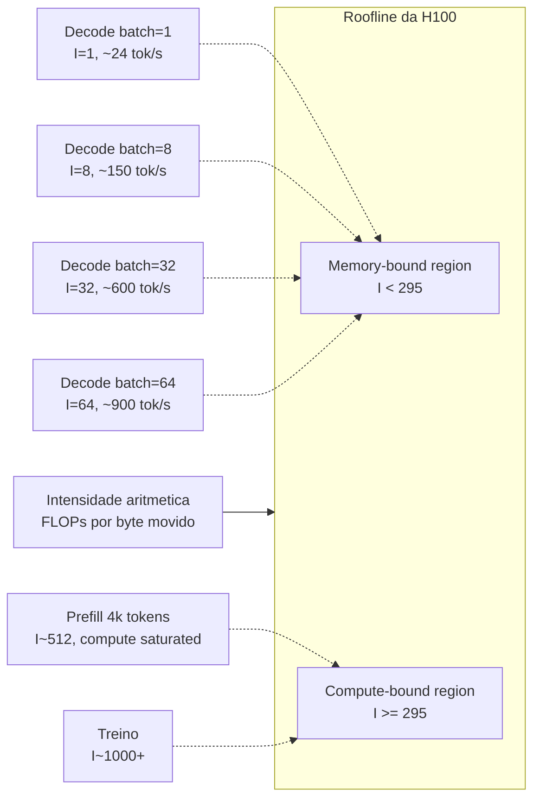

Speculative decoding desloca **a mesma decode** mais para a direita (mais FLOPs por leitura de pesos). MoE com batch alto também — daí MoE escala bem em servidor. Quantização **abaixa o eixo X** (menos bytes) e libera mais do compute.

### Apêndice F — Comandos de referência rápida

#### llama.cpp local com speculative
```bash
./llama-cli \
  -m models/llama-3-70b-instruct.Q4_K_M.gguf \
  --draft models/llama-3.2-1b-instruct.Q4_K_M.gguf \
  --draft-max 8 \
  -ctk q4_0 -ctv q4_0 \
  -c 32768 \
  -ngl 60 \
  -p "Explique speculative decoding em 3 parágrafos."
```

#### vLLM v1 servidor com Medusa
```bash
vllm serve meta-llama/Llama-3.1-70B-Instruct \
  --quantization awq \
  --kv-cache-dtype fp8 \
  --enable-prefix-caching \
  --speculative-config '{"model": "lmsys/medusa-vicuna-7b-v1.5", "num_speculative_tokens": 5, "method": "medusa"}' \
  --tensor-parallel-size 4
```

#### TensorRT‑LLM com 2:4 sparsity
```bash
trtllm-build \
  --checkpoint_dir ./llama-70b-int4-sparse-2-4/ \
  --output_dir ./engines/llama-70b-int4-sparse/ \
  --gemm_plugin auto \
  --use_paged_context_fmha enable \
  --use_fp8_context_fmha enable \
  --max_input_len 8192 \
  --max_output_len 4096 \
  --max_batch_size 64
```

#### vLLM com expert offload (DeepSeek‑V3 num servidor pequeno)
```bash
vllm serve deepseek-ai/DeepSeek-V3 \
  --tensor-parallel-size 8 \
  --enable-expert-offload \
  --max-model-len 32768
```

#### Distillation com TRL
```python
from trl import DistillationTrainer
trainer = DistillationTrainer(
    teacher_model="anthropic/claude-3-haiku",
    student_model="microsoft/Phi-4-mini",
    dataset=production_logs_dataset,
    method="logit_kd",
    temperature=2.0,
    alpha=0.7,
)
trainer.train()
```

---

## 11.5. Antes/depois: três anos de evolução em produção

Para sentir o salto, eis a comparação **2022 vs 2026** num servidor com 8× A100 80GB (versus 8× H200 / B200), servindo Llama‑70B equivalente:

| Métrica | Stack 2022 (FP16, no spec, no MoE, no paged) | Stack 2026 (FP8/INT4 + spec + 2:4 + paged) | Ganho |
|---|---|---|---|
| TPOT (batch=1) | ~150 ms | ~20–40 ms | 4–7× |
| TPS/usuário | ~6 | ~30–50 | 5–8× |
| Throughput agregado | ~2.000 tok/s | ~30.000 tok/s | 15× |
| Memória/usuário (KV) | ~5 GB (32k ctx) | ~1 GB | 5× |
| Custo por 1 M tok | ~US\$ 30 | ~US\$ 1,5–3 | 10–20× |

E isso ignorando que o **modelo de 2026** (Llama‑3.3, DeepSeek‑V3) entrega muito mais qualidade do que o de 2022 (LLaMA‑1, OPT). A combinação “mais qualidade + 10× barato” é o que mudou economicamente o jogo dos LLMs.

## 11.6. Cenários adicionais de pipeline real

#### Cenário D — atendimento B2C com volumetria altíssima (e‑commerce)

- **Volume**: 5M queries/dia, picos de 200 req/s.
- **Stack**: 
  - **L1 (40%)**: cache semântico (Redis Vector + bge‑small embeddings).
  - **L2 (50%)**: Phi‑4 14B INT4 + 2:4 em 4× H100 — 1500 req/s.
  - **L3 (10%)**: DeepSeek‑V3 self‑host em 8× H200 — 50 req/s.
  - **Distillation contínua**: logs de L3 que viram dataset para L2.
- **Resultado**: latência mediana 280 ms, p99 800 ms; custo unitário < US\$ 0,001/query.

#### Cenário E — research lab privado

- **Workload**: equipe de 30 pesquisadores, queries longas (20k tokens), heterogêneas, latência aceita até 30s.
- **Stack**:
  - 1× node DGX H200 (8 GPUs, 1,1 TB HBM total).
  - DeepSeek‑V3 671B FP8 + paged KV INT4.
  - vLLM v1 com chunked prefill (4k blocks).
  - Speculative EAGLE‑2 (draft fine‑tuned no domínio).
  - Cache de prefixos: shared system prompt (5k tokens) + retrieved context cacheável.
- **Resultado**: throughput agregado ~10k tok/s, com latência adequada para uso interativo.

#### Cenário F — IoT industrial / assistente embedded

- **Restrições**: 32 GB RAM, sem GPU dedicada (NPU integrada).
- **Stack**:
  - Phi‑3‑mini 3.8B INT4, ~2 GB no disco, ~3 GB em RAM com KV.
  - llama.cpp com NEON otimizações.
  - Prompt‑lookup decoding ativo.
  - Sem cache (memória escassa).
- **Resultado**: 8–15 tok/s no edge, suficiente para comandos de operador.

## 11.7. Mapa final de “tudo que aprendi nesta série”

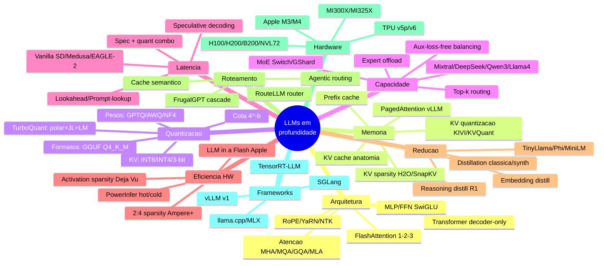

---

## 12. Glossário rápido

- **TPOT** — Time Per Output Token (decode).
- **TTFT** — Time To First Token (prefill + 1ª decode).
- **Goodput** — Throughput dentro do SLA.
- **Active params** — parâmetros usados por token (em MoE).
- **Total params** — todos os parâmetros do modelo (somando experts).
- **Expert** — sub‑MLP em MoE.
- **Top‑k routing** — k experts por token.
- **Capacity factor** — quanto cada expert pode processar antes de droppar.
- **2:4 sparsity** — 2 zeros em cada 4 valores contíguos; aceleração nativa Ampere+.
- **Activation sparsity** — neurônios cujo output é 0 (ou ~0) por input.
- **Hot/cold neuron** — frequência de ativação (PowerInfer).
- **Distillation** — student aprende de teacher (logits, traces, ou dataset sintético).
- **Cascade** — sequência baratos → caros (FrugalGPT).
- **Routing** — classificador escolhe modelo upfront (RouteLLM).
- **Speculative decoding** — draft propõe, target verifica.
- **Acceptance rate (α)** — fração média de tokens propostos pelo draft que o target aceita.
- **Bonus token** — token adicional amostrado livremente quando todos os γ propostos foram aceitos.
- **Tree attention** — verificação de várias hipóteses paralelas via máscara causal expandida.
- **Expert offload** — deslocar experts frios para CPU/SSD.
- **Prefix cache** — KV cache compartilhado entre requisições com mesmo prefixo.
- **Chunked prefill** — partir o prefill em pedaços para escalar com decode.
- **Roofline** — modelo gráfico de teto de performance (compute vs bandwidth).
- **NVL72** — rack Blackwell com 72 GPUs interligadas por NVLink 5.

---

## 13. Resumo executivo (TL;DR estendido por seção)

Para quem volta a este post como **referência rápida**:

- **§2 Speculative**: rascunho rápido + revisão lote. Lossless em distribuição. EAGLE‑2 SOTA aberto (3–4×). Não usar em batch alto. Combinar com prompt‑lookup em RAG/code.
- **§3 MoE**: capacidade total alta, compute por token baixo. Mas **memória total enorme** — você carrega todos os experts. DeepSeek‑V3 671B/37B é ponto de referência. Llama 4 Scout 109B cabe em 1× H100 INT4. Expert parallelism é a forma de escalar; expert offload é o jeito de rodar local.
- **§4 Sparsity**: 2:4 estruturado é o único que dá speedup real em GPU NVIDIA (Ampere+). SparseGPT/Wanda permitem 2:4 post‑hoc. Activation sparsity (Deja Vu, PowerInfer) brilha em single‑user/local. KV sparsity (H2O, SnapKV) ataca o KV cache em ctx longo.
- **§5 Distillation**: o caminho moderno é **synth data** (Phi style), não logits. TinyLlama, Phi‑4, R1‑Distill ilustram. Em produção: distile API cara para Phi‑4 mini. F1 ≈ teacher, custo / 100×.
- **§6 Cascading/Routing**: FrugalGPT (cascade) ou RouteLLM (router upfront). Cache semântico amplifica. 5–10× redução de custo em workload heterogêneo.
- **§7 Pipeline real**: tudo junto — vLLM v1 + INT4 + 2:4 + paged + spec + router. Pode dar 40× custo vs API frontier.
- **§8 Hardware**: B200 traz FP4 nativo; MI300X dá 192 GB; Apple Silicon ganha por dólar local. Aceleradores não‑GPU (Groq, Cerebras) brilham em latência absoluta.

## 14. Pequena bibliografia anotada para “mergulho rápido”

Se você só pode ler **5 papers** (e nada mais) para entender o estado da arte de inferência eficiente em LLMs, leia estes — em ordem:

1. **Vaswani et al. 2017 — “Attention Is All You Need”**: ainda a porta de entrada conceitual. 11 páginas.
2. **Dao 2022 — “FlashAttention: Fast and Memory‑Efficient Exact Attention with IO‑Awareness”**: ensina a pensar em I/O, não só FLOPs. Muda o paradigma.
3. **Kwon et al. 2023 (SOSP) — “Efficient Memory Management for LLM Serving with PagedAttention”**: o paper do vLLM. Mostra como pensar **sistema** em LLMs.
4. **Leviathan et al. 2022 — “Fast Inference from Transformers via Speculative Decoding”**: a virada do paradigma autoregressivo.
5. **DeepSeek 2024 — “DeepSeek‑V3 Technical Report”**: condensa MoE moderno + MLA + FP8 + aux‑loss‑free. É o que mais perto temos de um “livro‑texto open de LLM frontier 2025”.

E se você puder ler 5 a mais, adicione: TurboQuant (arXiv:2504.19874), Mixtral (2401.04088), SparseGPT (2301.00774), EAGLE‑2 (2406.16858), e PowerInfer (2312.12456).

## 15. Despedida pessoal — uma reflexão

Quando comecei a escrever esta série, o objetivo era **didático**: pegar um leitor com conhecimento básico de deep learning e levá‑lo até o ponto de ler papers de inferência sem se perder. Mas o exercício de organizar todo esse material em 8 posts mostrou algo a mais: a **inferência eficiente** virou **a área mais importante de pesquisa aplicada em LLMs hoje**.

A razão é simples — modelos cada vez maiores são treinados (caro, sim, mas pago **uma vez**); a inferência é o custo **infinito** de servir milhões de usuários todos os dias. Cada percentual ganho em TPOT é dinheiro economizado direto. Cada GB de KV liberado é um usuário a mais por GPU.

Mais profundamente: as técnicas que vimos nesta série — quantização, sparsity, MoE, speculative, distillation — são todas formas de **reconhecer que nem tudo importa igualmente**. Nem todo bit do peso, nem toda ativação, nem todo expert, nem todo token de output, nem toda query, nem todo modelo. **Identificar o que importa e gastar recursos só ali** é, no fundo, o mesmo princípio que guia engenharia em geral: **alocação eficiente sob restrição**.

Cabe lembrar que tudo isso roda em cima de uma **matemática elegantíssima** (TurboQuant, FlashAttention, speculative sampling). A boa engenharia não é “gambiarra inspirada”; é matemática reconhecida e implementada com cuidado de implementação.

Você acompanhou — espero — não só *o quê* fazer, mas *por quê*. Esse é o presente que se leva para o resto da carreira.

Boa caçada, mais uma vez.

—

## Encerramento da série

Esta foi a **última estação** da nossa jornada.

Começamos no Post 01 com um Transformer decoder‑only — uma máquina conceitualmente simples: tokenizer → embeddings → blocos com atenção e MLP → softmax. No Post 02 abrimos a atenção em variantes (MHA, MQA, GQA, MLA) e vimos como o FlashAttention domou seu custo quadrático sem mudar a matemática. No Post 03, o KV cache deixou de ser um detalhe e revelou o gargalo central da inferência — resolvido elegantemente por PagedAttention/vLLM.

Os Posts 04, 05 e 06 mergulharam em **quantização**, com o Post 06 fechando o argumento técnico do **TurboQuant**: rotação polar para gaussianizar, JL para garantir geometria, Lloyd–Max para quantizar otimamente, e a cota $4^{-b}$ que finalmente coloca quantização não‑enviesada em pé de igualdade com a versão *full precision*. O Post 07 estendeu tudo isso para **contexto longo** — RoPE/YaRN, Ring Attention, StreamingLLM, Mamba.

Neste Post 08 fechamos o cerco pelos **eixos restantes**: speculative decoding ataca a serialidade da geração; MoE compra capacidade barata; sparsity (em pesos e ativações) corta o que não importa; distillation faz modelos pequenos brilharem; cascading rotea inteligência. Tudo composto, a curva *capability‑per‑dollar* dos LLMs continua caindo num ritmo que era impensável em 2022.

A síntese: **não existe uma única alavanca**. Existe um **portfólio** delas. O engenheiro de inferência moderno é um *orquestrador* de quantização + paged KV + MoE + speculative + sparsity + distillation, em cima de hardware (Blackwell, MI300X, TPU v6, Apple Silicon) que continua a evoluir. Cada técnica, vista de perto, tem matemática elegante. Vista de longe, todas convergem para o mesmo objetivo: **mover menos bits, repetir menos cálculos, gastar menos energia para a mesma resposta de qualidade**.

Se você acompanhou os 8 posts, agora tem **mais do que vocabulário**: tem o **modelo mental** pra ler qualquer paper novo que aparecer no arXiv amanhã. E haverá outro amanhã. E outro depois.

Boa caçada.

— Fim da série *LLMs em Profundidade — Da Atenção ao TurboQuant e Além*.
