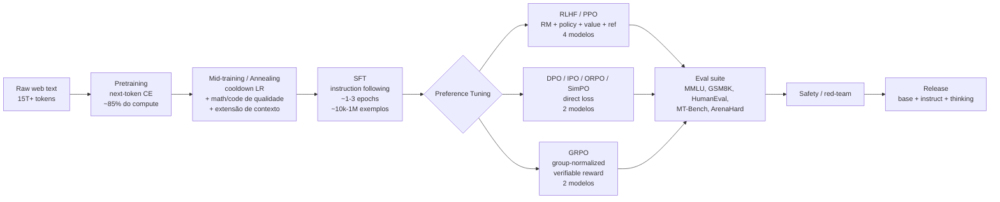
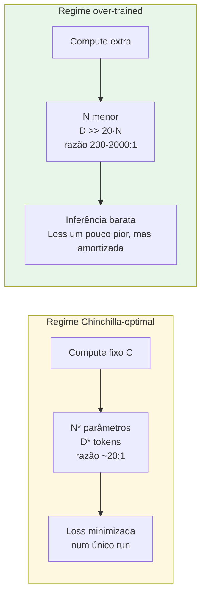
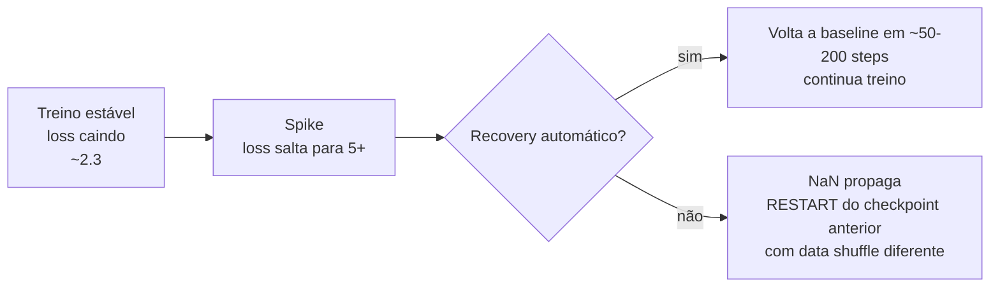
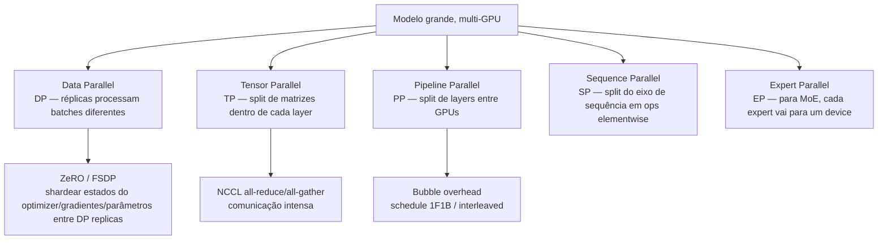
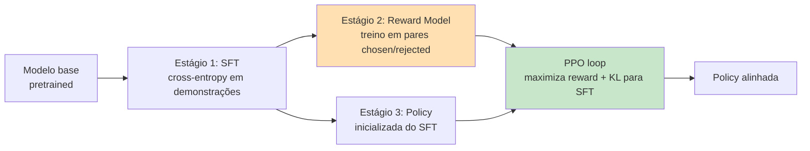
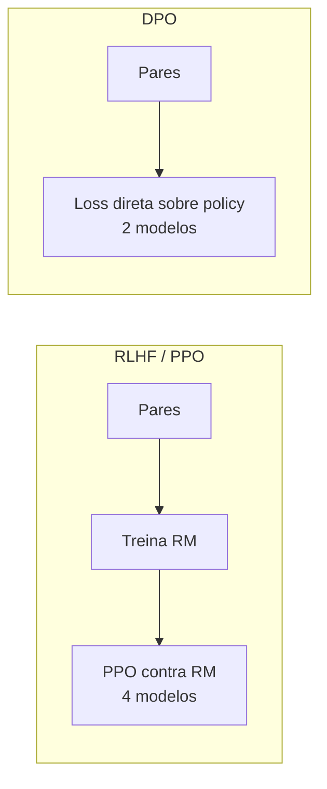
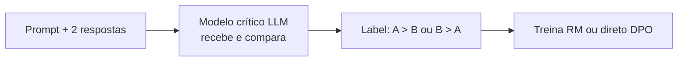
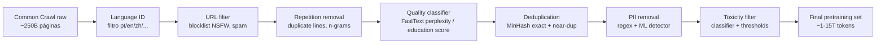

# Post 09 — Treinamento de LLMs: do pretraining ao alinhamento (SFT, DPO, GRPO, RLHF)

> **Série**: LLMs em Profundidade — Da Atenção ao TurboQuant e Além
> **Post**: 09 — *abertura da frente de TREINO* (após 8 posts e 6 apêndices DEEP cobrindo inferência)
> **Pré-requisitos**: Post 01 (arquitetura decoder‑only). **Ideal**: Post 04 (quantização) — útil para entender FP8 training e QLoRA. Os demais (02, 03, 05–08) não são necessários aqui.
> **Próximos**: Post 10 (hardware de treino), Post 11 (frameworks), Post 18 (reasoning fine‑tuning), Apêndice 04‑DEEP (QLoRA hands‑on).
> **Tom**: técnico rigoroso primeiro, **analogia humana** logo em seguida.
> **Objetivo**: dar o **mapa completo do ciclo de vida de uma LLM** — pretraining → annealing → SFT → preferências (DPO/IPO/KTO/ORPO/SimPO) → GRPO/RLHF → eval — com matemática, hyperparams reais de 2025/2026, custos, frameworks open‑source e ponteiros para os papers seminais.

---

## TL;DR (resumo executivo)

- Os Posts 01–08 dissecaram **inferência** (atenção, KV cache, quantização, contexto longo, MoE, speculative). Este post abre a outra metade do mundo: **como esses pesos chegam até ali**.
- O ciclo típico de uma LLM moderna tem 4 estágios: **(1) pretraining** (next‑token em trilhões de tokens da web) → **(2) mid‑training/annealing** (cooldown com dados de alta qualidade + extensão de contexto) → **(3) SFT** (instruction tuning supervisionado) → **(4) preference tuning** (DPO/RLHF/GRPO).
- **Pretraining** é o estágio mais caro: Llama 3.1 405B custou ~$60 M em ~16 000 H100 (≈ 30,8 M GPU‑hours, ≈ 3,8 × 10²⁵ FLOPs). DeepSeek‑V3 (671 B MoE, 37 B ativos) baixou para ~$5,6 M graças a FP8 + DualPipe + co‑design.
- A lei de **Chinchilla** (Hoffmann 2022) sugeria 20 tokens por parâmetro como ótimo para uma run de treino isolada; em 2024–26 a indústria treina **muito além disso** (200–1000 tokens/parâmetro) porque o ótimo de **inferência amortizada** (modelo pequeno servido bilhões de vezes) bate o ótimo de treino.
- **SFT** ensina **formato e instruction‑following** com cross‑entropy mascarada; **preferências** ensinam **qualidade subjetiva** (helpful/harmless/honest).
- **RLHF clássico (PPO)** treina um *reward model* e otimiza a política contra ele com KL‑regularização. **DPO** (Rafailov 2023) provou que o problema é equivalente a uma **classification loss direta** sobre pares — sem RM separado, sem PPO loop, sem 4 modelos em memória.
- A família **DPO** explodiu em 2023–25: IPO, KTO, ORPO, SimPO, CPO. Cada uma corrige um problema do DPO original (overfitting, necessidade de pares, custo de SFT prévio, dependência de reference model).
- **GRPO** (DeepSeekMath / DeepSeek‑R1, 2024–25) abandonou tanto o reward model quanto a value network: amostra **G respostas** por prompt, calcula reward verificável (matemática, código, judge LLM), normaliza por grupo. É o algoritmo por trás do reasoning de R1, o1‑style.
- 2025–26 explora ainda: **Constitutional AI**, **Self‑Reward**, **PRMs vs ORMs**, **process reward models** para CoT, **test‑time compute training**.
- O ecossistema open‑source está **maduro**: TRL, Axolotl, LlamaFactory, Unsloth, OpenRLHF, veRL, NeMo‑Aligner, TorchTitan cobrem do laptop ao cluster com 16 k GPUs.

> **Analogias‑guia deste post:**
> - **Pretraining** = ler todo o acervo de uma biblioteca pública, sem mestre, só absorvendo padrões.
> - **Annealing/cooldown** = nas últimas semanas antes da prova, baixar o ritmo e ler só os clássicos canônicos.
> - **SFT** = estagiar com um mentor que te mostra exemplos curados de boa redação.
> - **RLHF** = ter um crítico literário que avalia rascunhos; você ajusta o estilo para agradá‑lo (e o crítico é um modelo aprendido).
> - **DPO** = comparar dois rascunhos lado a lado e escolher o melhor — pula o crítico intermediário, vai direto à comparação.
> - **GRPO** = entregar a mesma tarefa 8 vezes, comparar entre si, e reforçar o que ficou acima da média do próprio grupo.
> - **Constitutional AI** = ter uma constituição interna que o autor consulta para se autocorrigir.

---

## Índice

1. [O ciclo de vida de um modelo](#1-o-ciclo-de-vida-de-um-modelo)
2. [Pretraining: o estágio fundador](#2-pretraining-o-estagio-fundador)
3. [Tokenization revisada](#3-tokenization-revisada)
4. [Hyperparams de pretraining](#4-hyperparams-de-pretraining)
5. [Loss spikes e estabilidade numérica](#5-loss-spikes-e-estabilidade-numerica)
6. [Infra de pretraining: 3D parallelism, ZeRO, FSDP](#6-infra-de-pretraining-3d-parallelism-zero-fsdp)
7. [Mid‑training / annealing recipes](#7-mid-training--annealing-recipes)
8. [SFT — Supervised Fine‑Tuning](#8-sft--supervised-fine-tuning)
9. [Preference data e o problema de alinhamento](#9-preference-data-e-o-problema-de-alinhamento)
10. [RLHF clássico com PPO](#10-rlhf-classico-com-ppo)
11. [DPO — Direct Preference Optimization](#11-dpo--direct-preference-optimization)
12. [A família DPO: IPO, KTO, ORPO, SimPO, CPO](#12-a-familia-dpo-ipo-kto-orpo-simpo-cpo)
13. [GRPO — Group Relative Policy Optimization](#13-grpo--group-relative-policy-optimization)
14. [RLAIF, Constitutional AI, Self‑Reward](#14-rlaif-constitutional-ai-self-reward)
15. [Alinhamento avançado 2025/2026](#15-alinhamento-avancado-20252026)
16. [Data curation: qualidade > quantidade](#16-data-curation-qualidade--quantidade)
17. [Avaliação durante o treino](#17-avaliacao-durante-o-treino)
18. [Custos reais 2026](#18-custos-reais-2026)
19. [Receitas open‑source: TRL, Axolotl, LlamaFactory, Unsloth, OpenRLHF, veRL](#19-receitas-open-source)
20. [Próximos passos do leitor](#20-proximos-passos-do-leitor)
21. [Referências](#21-referencias)

---

## 1. O ciclo de vida de um modelo

### 1.1 Visão executiva

Um LLM moderno **não nasce pronto**. Ele atravessa uma cadeia de fases distintas, cada uma com **objetivo, dataset, loss, hyperparams, custo computacional e métricas próprias**. Os números pulam ordens de magnitude entre estágios.



### 1.2 Tabela‑mestra dos estágios

| # | Estágio | Objetivo | Dado típico | Loss | % do compute total | Custo OoM (modelo 8 B) | Custo OoM (modelo 405 B) |
|---|---------|----------|-------------|------|-------------------:|-----------------------:|-------------------------:|
| 1 | Pretraining | Aprender linguagem, código, fatos, estatística do mundo | 1–15 T tokens da web (FineWeb, RedPajama, DCLM, Stack v2) | Cross‑entropy de next‑token | 80–95 % | ~1 M GPU‑h H100 (~$2 M) | ~30 M GPU‑h (~$60 M) |
| 2 | Annealing / cooldown | Refinar com dados premium, baixar LR, estender contexto | 100 B–1 T tokens curados (math, code, papers) | Mesma CE com lr decrescente | 2–10 % | ~50 k GPU‑h (~$100 k) | ~3 M GPU‑h (~$6 M) |
| 3 | SFT | Instruction following, formato chat | 10 k–1 M pares (prompt, resposta) | CE só na resposta | <1 % | 100–10 000 GPU‑h (~$200–$20 k) | 100 k GPU‑h (~$200 k) |
| 4a | RLHF / PPO | Alinhar a preferências humanas | 50 k–500 k pares (chosen, rejected) + RM | RM: BT loss; Policy: PPO + KL | 1–5 % | 10 k–100 k GPU‑h | 1 M+ GPU‑h |
| 4b | DPO & cia | Mesmo alvo, sem RM | 50 k–500 k pares | DPO loss direta | <1 % | 1 k–10 k GPU‑h | 100 k GPU‑h |
| 4c | GRPO (reasoning) | Habilitar raciocínio longo (CoT, *thinking*) | Prompts com reward verificável (math, code) | PPO‑like com group‑norm advantage | 5–20 % (R1‑zero) | 10 k–100 k GPU‑h | 1 M+ GPU‑h |
| 5 | Eval + red‑team | Medir qualidade, segurança, robustez | benchmarks + adversarial probes | — | <1 % | dezenas a centenas de horas | idem |

> **Leitura da tabela.** O grosso do dinheiro vai em **(1)**. Por isso quase todo lab roda **um único pretraining por modelo** e itera em (2)–(4) várias vezes — você pode produzir 3 ou 4 versões de instruct em cima da mesma base, e o custo do alinhamento é ordens de magnitude menor.

> **Analogia.** Pretraining é construir o **edifício**: fundação, estrutura, paredes — caro, demorado, decisão de uma vez. Annealing é a **pintura final**. SFT é **mobiliar e decorar**. Preference tuning é **ajustar móveis e iluminação para o gosto do morador**. Você pode redecorar várias vezes; você não derruba a estrutura.

### 1.3 Por que essa separação faz sentido

Cada estágio responde a uma pergunta **diferente**:

| Estágio | Pergunta que responde |
|---------|------------------------|
| Pretraining | "Como o mundo escreve em geral?" |
| Annealing | "Quais textos representam o **melhor** desse mundo?" |
| SFT | "Como devo **responder** a uma pergunta?" |
| Preference tuning | "Qual de duas respostas é **melhor** para um humano?" |
| RLAIF / Self‑Reward | "Como me **avaliar** sem depender só de humanos?" |
| GRPO de reasoning | "Como **pensar mais** antes de responder?" |

Um único objetivo (next‑token) é maravilhoso para cobrir o primeiro item, mas insuficiente para os demais — daí a necessidade de empilhar estágios.

---

## 2. Pretraining: o estágio fundador

### 2.1 Objetivo: next‑token prediction (causal LM)

A LLM é treinada para **maximizar a verossimilhança do próximo token** dado o contexto:

\[
\mathcal{L}_{\text{CE}}(\theta) = -\,\mathbb{E}_{x \sim \mathcal{D}} \sum_{t=1}^{T} \log p_\theta(x_t \mid x_{<t})
\]

- \(x = (x_1,\dots,x_T)\): sequência de tokens.
- \(p_\theta\): distribuição softmax sobre o vocabulário.
- \(\mathcal{D}\): dataset (centenas de bilhões a trilhões de tokens).

Em batch, a perda é a **cross‑entropy média** entre o token verdadeiro e o logit emitido:

\[
\text{loss} = \frac{1}{B \cdot T} \sum_{b=1}^{B} \sum_{t=1}^{T} -\log p_\theta(x^{(b)}_t \mid x^{(b)}_{<t})
\]

> **Por que esse objetivo é tão poderoso?** Porque para prever bem o próximo token em **qualquer texto** o modelo precisa, implicitamente, modelar gramática, sintaxe, semântica, fatos do mundo, causalidade, intenção do autor, estilo. É um **objetivo proxy** absurdamente rico.

### 2.2 Token weighting

Variantes comuns:

- **Document‑level**: cada documento conta igual, independente do tamanho. Evita que documentos enormes dominem o gradiente.
- **Quality‑weighted**: documentos de fontes melhores (Wikipedia, livros, papers) recebem peso maior. FineWeb‑Edu faz isso via classifier de "education score".
- **Length‑normalized**: alguns labs dividem a loss por número de tokens não‑padding para evitar viés de batches mistos.

### 2.3 Datasets de pretraining (estado da arte 2026)

| Dataset | Tamanho | Foco | Acesso | Licença |
|---------|--------:|------|--------|---------|
| **FineWeb** (HuggingFace, 2024) | 15 T tokens | web limpo, dedup MinHash | aberto | ODC‑By |
| **FineWeb‑Edu** (HF, 2024) | 1,3 T tokens | filtro educational score (Llama‑3‑70B classifier) | aberto | ODC‑By |
| **RedPajama‑v2** (Together, 2024) | 30 T tokens (raw) → ~5 T após dedup | web + 100 quality signals | aberto | misto |
| **DCLM** (Apple/UW, 2024) | 240 T raw → 4 T pool | benchmark de data curation | aberto | misto |
| **Dolma** (AI2, 2023) | 3 T tokens | web + papers + code + Wikipedia | aberto | ODC‑By |
| **RefinedWeb** (TII / Falcon, 2023) | 5 T tokens | apenas web filtrada | aberto | ODC‑By |
| **Common Crawl** (raw) | ~250 B páginas | snapshot da web | aberto | livre |
| **The Stack v2** (BigCode, 2024) | 900 B tokens de código | 600+ linguagens, dedup permissivo | aberto | misto (permissivo) |
| **proof‑pile‑2** | 55 B tokens | matemática (arXiv, ProofWiki, OpenWebMath) | aberto | misto |
| **Pile** (EleutherAI, 2020) | 825 GB | misto histórico | aberto (com avisos) | misto |

> **Tendência 2024–26.** Saiu o "raspar tudo da web bruta"; entrou o "**curar agressivamente**". DCLM mostrou que com 4 T tokens **bem filtrados** você bate runs de 15 T tokens crus. Phi‑3/Phi‑4 (Microsoft) foram ainda mais longe: dataset majoritariamente **sintético** ("textbooks are all you need"), mostrando que para um modelo de 7 B você pode bater modelos 10× maiores.

### 2.4 Tamanhos típicos (escala 2024–26)

| Modelo | Parâmetros | Tokens de pretraining | Razão tokens/param |
|--------|-----------:|----------------------:|--------------------:|
| Llama 1 7B (2023) | 7 B | 1,0 T | 143 |
| Llama 2 7B (2023) | 7 B | 2,0 T | 286 |
| Llama 3 8B (2024) | 8 B | 15,0 T | 1875 |
| Llama 3.1 405B (2024) | 405 B | 15,6 T | 38 |
| Qwen 2.5 7B (2024) | 7 B | 18 T | 2571 |
| Qwen 2.5 72B (2024) | 72 B | 18 T | 250 |
| DeepSeek‑V3 (2024) | 671 B (37 B ativos) | 14,8 T | 22 (sobre total) / 400 (sobre ativos) |
| Llama 4 Scout (2025) | 109 B (17 B ativos) | ~40 T | 367 / 2353 |
| Llama 4 Maverick (2025) | 400 B (17 B ativos) | ~22 T | 55 / 1294 |
| Gemma 2 9B (2024) | 9 B | 8 T | 889 |

### 2.5 Compute: ordens de grandeza

A regra **6 N D** (Kaplan 2020; Chinchilla 2022) estima FLOPs de pretraining para um modelo denso:

\[
\text{FLOPs} \approx 6 \cdot N \cdot D
\]

- \(N\) = número de parâmetros.
- \(D\) = número de tokens de treino.
- O fator 6 = forward (2 N D) + backward (4 N D).

**Exemplo Llama 3.1 405B**:

\[
6 \cdot 405\!\times\!10^9 \cdot 15{,}6\!\times\!10^{12} \approx 3{,}8\times 10^{25}\ \text{FLOPs}
\]

Em 16 000 H100 a ~989 TFLOP/s BF16 com ~40 % MFU (Model FLOPs Utilization realista):

\[
\frac{3{,}8\times 10^{25}}{16\,000 \cdot 989\!\times\!10^{12} \cdot 0{,}40} \approx 6{,}0\times 10^6\ \text{s} \approx 70\ \text{dias}
\]

Total ≈ **30,8 M GPU‑hours**, custo a $2/H100‑hour ≈ **$60 M** (alinha com estimativas públicas reportadas). Adicione 30–40 % de overhead para falhas, restarts, ablations e a conta sobe para os $80 M citados por analistas.

> **Chinchilla scaling laws (Hoffmann 2022, arXiv:2203.15556).** Para um **orçamento de FLOPs fixo**, o ótimo de loss de pretraining é alcançado com:
>
> \[
> N^\* \propto C^{0{,}5}, \quad D^\* \propto C^{0{,}5}, \quad \text{razão ótima} \approx 20\ \text{tokens/param}
> \]
>
> Ou seja: para 10⁵ FLOPs, dobrar parâmetros sem dobrar tokens é desperdício; o ponto ótimo balanceia ambos.

#### 2.5.1 Por que a indústria viola Chinchilla "para mais"

Chinchilla otimiza **loss de pretraining ao final do treino**, ignorando inferência. Mas modelos servidos em produção pagam custo de inferência **bilhões de vezes**. Logo o **ótimo amortizado** é treinar **muito mais do que Chinchilla recomenda**, em troca de modelos menores que rodam mais barato. Llama 3 8B com **15 T tokens** (1875 tok/param, ~94× Chinchilla) é o exemplo canônico.



| Modelo | Razão tok/param | Regime |
|--------|----------------:|--------|
| Chinchilla 70B (2022) | 20 | optimal |
| Llama 1 7B | 143 | levemente over |
| Llama 3 8B | 1875 | extremo over |
| Qwen 2.5 7B | 2571 | extremo over |

### 2.6 Curriculum learning

Ordem dos dados importa. Estratégias comuns:

- **Easy → hard**: começar com texto curto, simples, alta qualidade; aumentar dificuldade.
- **Domain warmup**: primeiros B tokens só em web genérica; depois mistura code/math.
- **Mixture scheduling**: ajustar proporções da mistura ao longo do treino (ex: começar com 5 % code, terminar com 25 %).

Em modelos grandes a evidência empírica de ganho com curriculum é mista — muitos labs usam **mixture estática** (proporções fixas) e ainda assim convergem bem. Curriculum é mais relevante em **annealing** (próximo tópico) e em **continual pretraining** para domínio específico.

### 2.7 Annealing phase / cooldown

Os **últimos 5–15 % dos tokens** são tratados como uma fase distinta:

- **Learning rate schedule**: decay agressivo para 10 % do peak, depois para 0.
- **Mistura de dados**: aumentar proporção de **alta qualidade** (math, code, papers, livros, dados sintéticos curados).
- **Sequence length**: comum estender aqui (ex: Llama 3 fez 8k → 128k via continual pretraining no final).
- **Domain‑specific**: alguns labs adicionam dados curados de seu vertical (ex: medical, legal).

> **Por que funciona?** O modelo já aprendeu a "linguagem geral"; a fase final esculpe **competências de alta qualidade** que dominam a percepção subjetiva. Análogo a **destilar um bom vinho**: 95 % do sabor vem da fermentação principal, mas os últimos meses no carvalho fazem a diferença que o crítico nota.

---

## 3. Tokenization revisada

> O Post 01 introduziu tokens. Aqui aprofundamos o que muda em **2024–26**: vocabulários cresceram, multilíngue ganhou prioridade, e tokenização virou variável de **co‑design** com o pretraining.

### 3.1 Algoritmos canônicos

| Algoritmo | Quem usa | Característica |
|-----------|----------|----------------|
| **BPE** (Byte Pair Encoding) | GPT‑2/3/4, Llama 1/2/3, Mistral, Qwen | Fundir pares mais frequentes até atingir vocab alvo |
| **Byte‑level BPE** | GPT‑2+, tiktoken, Llama 3 | BPE sobre bytes UTF‑8 → cobre qualquer Unicode sem `<UNK>` |
| **SentencePiece + Unigram** | T5, mBART, Gemma, PaLM | Modelo probabilístico; remove tokens iterativamente |
| **SentencePiece + BPE** | Llama 1/2 (Llama 3 mudou) | Variante BPE da lib SentencePiece |
| **Tiktoken** (impl. Rust) | OpenAI (GPT‑3.5/4/4o/5) | Implementação ultra‑rápida de byte‑level BPE |

### 3.2 Vocab size: a explosão recente

| Modelo | Vocab | Observação |
|--------|------:|------------|
| GPT‑2 | 50 257 | inglês‑centric |
| Llama 1 / 2 | 32 000 | SentencePiece, fraco em CJK |
| Llama 3 / 3.1 | 128 256 | tiktoken‑based, multilíngue forte |
| Llama 4 | 200 000+ | multimodal (texto+imagem) |
| GPT‑4 / 4o | ~100 277 (`o200k_base` em GPT‑4o) | tiktoken |
| Qwen 2.5 | 151 936 | CJK/Arabic/EU‑languages cobertos |
| DeepSeek‑V3 | 129 280 | otimizado para math/code |
| Gemma 2 | 256 128 | maior vocab público até então |

### 3.3 Por que vocab grande ajuda multilíngue

- Em vocab pequeno, palavras em chinês/árabe/devanagari **explodem** em muitos tokens (5–10× mais que inglês para o mesmo significado).
- Mais tokens = mais contexto consumido = mais latência e custo.
- Vocab grande **inclui sub‑palavras nativas** dessas línguas, equalizando custo por palavra.
- Trade‑off: matriz de embedding cresce (`vocab × hidden`), encarecendo memória e a saída do `lm_head`.

> **Analogia.** Um vocab pequeno é uma **régua só com centímetros**: serve para medir madeira, mas para joias você precisa de uma régua com milímetros. Línguas com escrita logográfica precisam de "régua mais fina"; vocab grande dá isso.

### 3.4 Detalhes que importam no pretraining

- **Pré‑tokenização**: GPT/Llama 3 usam regex sofisticado (split por categoria Unicode) antes do BPE para evitar fundir tokens absurdos como `","` com palavras.
- **Numbers**: alguns labs split por dígito (`123` → `1`, `2`, `3`) para ajudar matemática; outros mantêm tokens compostos.
- **Whitespace**: SentencePiece marca espaços com `▁` (U+2581); byte‑level BPE trata como bytes 0x20.
- **Special tokens**: `<|begin_of_text|>`, `<|eot|>`, `<|im_start|>` etc. — aqui é onde o **chat template** entra (importante em SFT).

---

## 4. Hyperparams de pretraining

### 4.1 Optimizer: AdamW

A indústria **converge** em AdamW (Loshchilov & Hutter 2019) com weight decay desacoplado:

\[
\begin{aligned}
m_t &= \beta_1 m_{t-1} + (1-\beta_1)\, g_t \\
v_t &= \beta_2 v_{t-1} + (1-\beta_2)\, g_t^2 \\
\hat{m}_t &= m_t / (1-\beta_1^t),\quad \hat{v}_t = v_t / (1-\beta_2^t) \\
\theta_t &= \theta_{t-1} - \eta\,\Big(\,\frac{\hat{m}_t}{\sqrt{\hat{v}_t}+\epsilon} + \lambda\, \theta_{t-1}\Big)
\end{aligned}
\]

Hyperparams recomendados (consenso 2024–26):

- \(\beta_1 = 0{,}9\), \(\beta_2 = 0{,}95\) (mais baixo que o padrão 0,999 — modelos grandes preferem média móvel mais responsiva da variância).
- \(\epsilon = 10^{-8}\) (ou \(10^{-5}\) em FP8 para evitar denormals).
- Weight decay \(\lambda = 0{,}1\).

> **Curiosidade.** A escolha \(\beta_2 = 0{,}95\) (vs 0,999) vem de Brown et al. (GPT‑3, 2020) e empiricamente reduz loss spikes em modelos grandes.

#### 4.1.1 Alternativas

- **Lion** (Chen 2023): só sinal do gradiente, ~2× mais barato em memória que Adam, ~comparável em loss. Não pegou em produção.
- **Sophia** (Liu 2023): segunda ordem aproximada, prometia 2× speedup em wall‑clock mas resultados não se replicaram em modelos grandes.
- **Muon** (Jordan 2024): otimizador de Newton‑Schulz para matrizes, ganhou tração para casos específicos.
- **Shampoo / Distributed Shampoo**: pré‑condicionador de Kronecker, usado por algumas equipes em escala.

### 4.2 Learning rate schedule

Padrão 2024–26: **linear warmup** de ~2 000 steps até `lr_peak`, depois **cosine decay** até 10 % do peak.

\[
\eta(t) =
\begin{cases}
\eta_{\max}\cdot \dfrac{t}{t_{\text{warm}}} & t \le t_{\text{warm}} \\[4pt]
\eta_{\min} + \dfrac{1}{2}(\eta_{\max}-\eta_{\min})\,\Big(1 + \cos\big(\pi\,\dfrac{t-t_{\text{warm}}}{T-t_{\text{warm}}}\big)\Big) & t > t_{\text{warm}}
\end{cases}
\]

Variações modernas:

- **WSD** (Warmup‑Stable‑Decay, MiniCPM 2024): warmup → constante → decay rápido. Permite **rebobinar** o checkpoint pré‑decay e treinar mais sem reaquecer.
- **InfLR** (infinite LR schedules, 2025): mantém lr constante, decay só quando você decide parar.

### 4.3 Lr peak por escala

| Modelo | LR peak |
|--------|--------:|
| 1B    | ~3,0 × 10⁻⁴ |
| 7B    | ~3,0 × 10⁻⁴ |
| 8B    | ~3,0 × 10⁻⁴ |
| 13B   | ~3,0 × 10⁻⁴ |
| 30B   | ~1,5 × 10⁻⁴ |
| 70B   | ~1,5 × 10⁻⁴ |
| 405B  | ~8,0 × 10⁻⁵ |

> Heurística: **lr cai quando o modelo cresce**. Razão: gradientes em modelos grandes têm magnitude maior (mais parâmetros somando) e o sweet spot de update size diminui.

### 4.4 Batch size

- **Sweet spot empírico (2024)**: ~4 M tokens por batch para modelos 7–70 B.
- **Llama 3.1 405B**: começou em ~4 M e escalou para **16 M tokens** ao longo do treino para melhor utilização do cluster.
- Batch grande demais = gradient noise insuficiente, generalização piora; batch pequeno demais = underutiliza o cluster.

### 4.5 Outros hyperparams canônicos

- **Gradient clipping**: norm global a 1,0 (essencial para evitar spikes catastróficos).
- **Weight decay**: 0,1 (sobre todos os parâmetros exceto biases e norms — `decoupled`).
- **Sequence length**: começa curta (2k–4k) por compute; estende em annealing (8k → 32k → 128k → 1M).
- **Init**: trunc‑normal com std = 0,02 ou std = √(2/d) (init estilo Megatron).
- **Dropout**: **0** em pretraining moderno (não ajuda quando o dataset é maior que o modelo).

### 4.6 Tabela comparativa: hyperparams Llama 1/2/3 vs Qwen 2.5 vs DeepSeek‑V3

| Hyperparam | Llama 1 65B | Llama 2 70B | Llama 3 70B | Llama 3.1 405B | Qwen 2.5 72B | DeepSeek‑V3 671B |
|-----------|------------:|------------:|------------:|---------------:|-------------:|------------------:|
| Tokens (T) | 1,4 | 2,0 | 15,0 | 15,6 | 18 | 14,8 |
| Lr peak | 1,5e‑4 | 1,5e‑4 | 1,5e‑4 | 8e‑5 | 1,5e‑4 | 2,2e‑4 |
| Lr min | 1e‑5 | 1e‑5 | 1,5e‑5 | 8e‑6 | 1e‑5 | 2,2e‑5 |
| Warmup steps | 2 000 | 2 000 | 8 000 | 8 000 | 5 000 | 2 000 |
| Schedule | cosine | cosine | cosine | cosine | cosine | WSD |
| Batch (tokens) | 4 M | 4 M | 16 M | 16 M | 8 M | 15 M |
| Seq len pretrain | 2 048 | 4 096 | 8 192 | 8 192 | 4 096 | 4 096 |
| Optimizer | AdamW | AdamW | AdamW | AdamW | AdamW | AdamW |
| β₁/β₂ | 0,9/0,95 | 0,9/0,95 | 0,9/0,95 | 0,9/0,95 | 0,9/0,95 | 0,9/0,95 |
| Weight decay | 0,1 | 0,1 | 0,1 | 0,1 | 0,1 | 0,1 |
| Grad clip | 1,0 | 1,0 | 1,0 | 1,0 | 1,0 | 1,0 |
| Precision | BF16 | BF16 | BF16 | BF16 | BF16 | **FP8 mixed** |

---

## 5. Loss spikes e estabilidade numérica

### 5.1 O fenômeno

Em runs longos é comum ver a **loss explodir** — um spike de 2,5 → 8,0 em poucos steps, ou pior, **NaN**. Em Llama, OPT, BLOOM, Megatron‑Turing relatos públicos mostram dezenas de spikes ao longo de meses de treino.



### 5.2 Por que aparecem

Causas conhecidas:

- **Outliers em embedding**: alguns tokens raros têm gradiente enorme.
- **Attention saturation**: scores muito grandes saturam o softmax → gradiente colapsa em certas heads.
- **Layer norm overflow** em FP16/BF16 quando ativações ficam muito grandes.
- **Padrões patológicos no batch**: blocos de PII, spam, código binário escapam dos filtros.
- **Numerical instability** em FP8 ou em ops fundidas mal calibradas.

### 5.3 Mitigações canônicas

| Técnica | O que faz | Origem |
|---------|-----------|--------|
| **Gradient clipping** (norm 1,0) | Limita magnitude do update | folclore Adam |
| **Query‑Key normalization** | LayerNorm em Q e K antes do dot product → mata saturation | Henry et al. 2020; Llama 3 adotou |
| **Embedding clipping** | Clip de embeddings no init e a cada step | OPT, BLOOM |
| **Z‑loss** | Termo extra na loss penalizando log‑sum‑exp grande dos logits | PaLM (Chowdhery 2022) |
| **Skip‑and‑rewind** | Detecta spike, descarta o batch, rewind ao último step bom | Megatron, Llama |
| **BF16 puro** | Evita underflow do FP16 (mais range, menos precisão) | padrão desde 2022 |
| **FP32 master weights** + **BF16 compute** | Atualizações em alta precisão, forward/backward em low | mixed precision |
| **Scale‑invariant LR** | Ajustar lr por norm do parâmetro (LAMB‑style) | menos comum |

### 5.4 Z‑loss (PaLM)

\[
\mathcal{L}_{\text{total}} = \mathcal{L}_{\text{CE}} + \alpha\, \big(\log Z(x)\big)^2,\quad \alpha \approx 10^{-4}
\]

onde \(Z(x) = \sum_v \exp(\text{logit}_v(x))\). Penaliza logits muito grandes em valor absoluto, mantendo a softmax bem condicionada.

### 5.5 Spike recovery vs restart

- **Spike pequeno** (loss < 2× baseline, recovery em <500 steps): segue o treino. Spike pode até ajudar (escapou de um local minimum).
- **Spike grande** (NaN, loss > 5× baseline, sem recovery): restart do **último checkpoint estável**, geralmente embaralhando o batch que causou o problema.

> Na prática: o time de Llama 3 reportou **dezenas de restarts** ao longo dos 70 dias, com cada restart custando algumas horas de wall‑clock. Aceito como custo da escala.

---

## 6. Infra de pretraining: 3D parallelism, ZeRO, FSDP

### 6.1 O problema

Para treinar um 405 B em 16 000 GPUs você precisa **distribuir**:

1. Os **parâmetros** (não cabem numa GPU).
2. Os **gradientes** (mesma magnitude que parâmetros).
3. Os **optimizer states** (Adam = 2× parâmetros; FP32 master = mais 1× ou 2×).
4. As **ativações** (proporcionais a batch × seq_len × hidden, podem ser maiores que os parâmetros).

Quatro alavancas complementares:



### 6.2 Data Parallel (DP)

- Cada GPU tem **uma cópia inteira** do modelo.
- Cada GPU processa um **micro‑batch diferente**.
- All‑reduce dos gradientes ao final do backward.
- Limite: o modelo precisa caber numa GPU. Em modelos grandes, DP **sozinho não basta**.

### 6.3 Tensor Parallel (TP) — Megatron‑style

Divide as matrizes **dentro** de cada layer. Para `Y = XA`, divide `A` em colunas:

\[
A = [A_1\,|\,A_2],\quad Y = X\,[A_1\,|\,A_2] = [XA_1\,|\,XA_2]
\]

Cada GPU calcula uma fatia. Para a próxima camada (`Z = YB`), divide `B` em linhas e faz **all‑reduce** ao final. Tipicamente TP=8 (intra‑node, NVLink), TP=16 começa a sofrer com latência.

### 6.4 Pipeline Parallel (PP)

Divide o **modelo em estágios** (camadas L1–L4 na GPU 0, L5–L8 na GPU 1, ...). Os micro‑batches fluem em pipeline; precisa scheduler **1F1B** ou **interleaved 1F1B** (Megatron) para minimizar a "bubble" de pipeline.

### 6.5 Sequence Parallel (SP)

Em ops como **dropout, layer norm, residual** — que não envolvem all‑reduce — divide ao longo do eixo de sequência. Reduz memória de ativação sem custo extra de comunicação. Combinado com TP é quase free.

### 6.6 Expert Parallel (EP) — para MoE

Cada **expert** vai para uma GPU diferente. Tokens são roteados (all‑to‑all) para o expert correto, computados localmente, retornados (all‑to‑all reverso). DeepSeek‑V3 / Llama 4 usam EP=64 ou mais.

### 6.7 ZeRO (DeepSpeed) e FSDP (PyTorch)

ZeRO (Rajbhandari 2019) reduz memória **do data parallel** shardeando entre DP replicas:

| Stage | O que sharda | Memória por GPU |
|------:|--------------|-----------------|
| ZeRO‑1 | Optimizer states | 4× menor (Adam) |
| ZeRO‑2 | + gradientes | até 8× menor |
| ZeRO‑3 | + parâmetros | até DP× menor (com all‑gather just‑in‑time) |

**FSDP** (Fully Sharded Data Parallel, PyTorch ≥ 1.11) é o equivalente nativo: shardeia parâmetros, faz all‑gather antes do forward de cada layer, all‑reduce + reshard depois. Substitui DDP em escala grande.

### 6.8 Tabela: estratégia × partição × comunicação × escalabilidade

| Estratégia | O que particiona | Comunicação dominante | Quando usar |
|-----------|------------------|------------------------|-------------|
| DP / DDP | nada (réplica completa) | all‑reduce de gradientes | modelos pequenos, muitos batches |
| ZeRO‑1/2/3 | optimizer / +grads / +params | all‑gather + reduce‑scatter | qualquer escala, drop‑in com DP |
| FSDP | todos (igual ZeRO‑3) | idem | PyTorch nativo, padrão Meta |
| TP (Megatron) | matrizes de cada layer | all‑reduce dentro de NVLink | intra‑node, ≤8 GPUs |
| PP | layers do modelo | send/recv ponto a ponto | inter‑node, modelos com muitas camadas |
| SP | ativações no eixo seq | reduz‑scatter de norms | combinado com TP |
| EP | experts MoE | all‑to‑all | MoE com muitos experts |

### 6.9 Frameworks

| Framework | Foco | Mantenedor |
|-----------|------|------------|
| **Megatron‑LM** | TP + PP + SP, padrão para LLMs grandes | NVIDIA |
| **NeMo** | wrapper sobre Megatron, recipes prontos | NVIDIA |
| **TorchTitan** | pretraining minimal em PyTorch puro (FSDP2) | Meta |
| **DeepSpeed** | ZeRO + pipeline + activation checkpointing | Microsoft |
| **Llama‑Stack** | recipes Meta (treino + serving) | Meta |
| **MaxText** | JAX, TPU‑native | Google |
| **Fairscale / Accelerate** | utilitários de sharding | Meta / HuggingFace |

### 6.10 Stack de comunicação: NCCL

NVIDIA Collective Communications Library — implementa **all‑reduce, all‑gather, reduce‑scatter, all‑to‑all** sobre NVLink (intra‑node) e InfiniBand/RoCE (inter‑node). Topologia ring‑based para all‑reduce; tree para latência baixa em mensagens pequenas.

> **Regra prática**: TP cabe **dentro** de um node (NVLink), PP entre nodes, DP/FSDP cobre o resto. Em 16 000 GPUs típico: TP=8, PP=16, DP=128.

### 6.11 Storage

- **NVMe local** (~3,5 GB/s leitura) para o **dataset** (shards pré‑tokenizados em formato Parquet/Arrow/MosaicML‑MDS).
- **Lustre / GPFS / Weka** (shared filesystem) para **checkpoints**: a cada N steps salvar o estado completo (~6× tamanho do modelo, contando optimizer + grads).
- Frequência típica: checkpoint a cada 1–2 horas de wall‑clock; manter as últimas 5–10 versões para roll‑back.

---

## 7. Mid‑training / annealing recipes

> Já abordado no §2.7 conceitualmente. Aqui detalhamos.

### 7.1 Reescalonar mistura de dados

Receita típica de annealing (últimos 10 % dos tokens):

| Componente | Pretraining (%) | Annealing (%) |
|-----------|----------------:|--------------:|
| Web genérica (CC, FineWeb) | 70 | 30 |
| Código (Stack v2) | 10 | 20 |
| Matemática (proof‑pile, OpenWebMath) | 3 | 15 |
| Wikipedia / livros | 5 | 10 |
| Papers (arXiv) | 2 | 10 |
| Synthetic (Q&A, textbooks) | 0 | 10 |
| Código curado (LeetCode, Codeforces) | 0 | 5 |

### 7.2 Aumentar context length progressivamente

**Llama 3 recipe**:

1. Pretrain em seq_len 8 192 (mais barato; quase todo o compute).
2. Continual pretraining em seq_len 16 k → 32 k → 64 k → 128 k, com:
   - Datasets de documentos longos (livros, repositórios inteiros, papers com appendix).
   - **RoPE base** ajustada (Post 07 cobre matemática).
   - Tokens adicionais: ~800 B no total da extensão (vs 15 T do pretraining).
3. Avaliar em **needle‑in‑a‑haystack**, **RULER**, **LongBench**.

> **Observação.** Em 2025/26 muitos labs já fazem **continual pretraining** intercalando documentos longos no próprio annealing, encurtando o pipeline.

### 7.3 Long‑context continual pretraining

Estratégias para evitar **regressão em tarefas curtas**:

- Misturar 50 % docs longos + 50 % docs curtos durante a extensão.
- Usar **YaRN** ou **LongRoPE** (Post 07) para extrapolar sem retreino agressivo.
- Avaliar perplexity em ambos regimes a cada checkpoint.

---

## 8. SFT — Supervised Fine‑Tuning

### 8.1 Objetivo

Ensinar o modelo a **seguir instruções** num formato conversacional:

> Usuário: "Explique fotossíntese para uma criança de 8 anos."
> Assistente: "Fotossíntese é como as plantas fazem comida..."

A loss é cross‑entropy de next‑token, **mas mascarada para apenas a resposta do assistant**:

\[
\mathcal{L}_{\text{SFT}} = -\sum_{t \in \text{response}} \log p_\theta(x_t \mid x_{<t})
\]

Tokens do prompt (sistema + usuário) **não recebem gradiente** — caso contrário o modelo aprenderia a "alucinar usuários" também.

### 8.2 Datasets de SFT (estado da arte 2026)

| Dataset | Tamanho | Origem | Foco | Licença |
|---------|--------:|--------|------|---------|
| **OpenAssistant** (LAION 2023) | 161 k convos | crowdsource | conversação geral | Apache‑2 |
| **ShareGPT** | ~90 k convos | export usuários ChatGPT | conversação real | "fair use" (cinza) |
| **Tulu 3 SFT mix** (AI2 2024) | 939 k | curado de várias fontes | state‑of‑the‑art aberto | ODC‑By |
| **OpenHermes 2.5** | 1 M | sintético + curado | dialogo geral | MIT |
| **Magpie** (2024) | 4 M | self‑synthesis (Llama instruct gera prompts) | scale via data sintética | mistura |
| **UltraChat** | 1,5 M | sintético GPT‑3.5 | conversação ampla | MIT |
| **Dolly 15k** (Databricks 2023) | 15 k | humano curado | qualidade sobre quantidade | CC‑BY‑SA |
| **Alpaca / Alpaca‑GPT4** | 52 k | sintético davinci/GPT‑4 | inicial seminal (não usar em prod 2026) | CC‑BY‑NC |
| **Code Alpaca** | 20 k | sintético | código | CC‑BY‑NC |
| **Distilled‑R1** (2025+) | dezenas a centenas de k | destilação CoT do DeepSeek‑R1 | reasoning | misto |
| **NuminaMath** | 860 k | math step‑by‑step | matemática | mista |

### 8.3 Synthetic data via modelos maiores

- **Self‑Instruct** (Wang 2022): seed humano + bootstrap por GPT.
- **Magpie** (Xu 2024): "engana" o template chat para o modelo gerar **prompts**, depois respostas; sem custo de prompt humano.
- **Distillation from frontier model**: gerar (prompt, resposta) com Claude/GPT‑4/R1 e treinar o student. Cuidado com **termos de uso** das APIs.
- **Constitutional / RLAIF**: usar o próprio modelo para gerar pares de preferência.

### 8.4 Chat templates

Cada família de modelo tem seu **template** — o jeito que prompt + sistema + resposta são serializados. Erro aqui é uma das causas mais comuns de SFT ruim.

**ChatML** (OpenAI / Mistral / Qwen):

```text
<|im_start|>system
Você é um assistente útil.<|im_end|>
<|im_start|>user
O que é entropia?<|im_end|>
<|im_start|>assistant
Entropia é uma medida de desordem...<|im_end|>
```

**Llama 3 chat template**:

```text
<|begin_of_text|><|start_header_id|>system<|end_header_id|>

Você é um assistente útil.<|eot_id|><|start_header_id|>user<|end_header_id|>

O que é entropia?<|eot_id|><|start_header_id|>assistant<|end_header_id|>

Entropia é uma medida de desordem...<|eot_id|>
```

**Alpaca** (clássico, deprecado em prod mas comum em datasets):

```text
Below is an instruction that describes a task...

### Instruction:
O que é entropia?

### Response:
Entropia é uma medida de desordem...
```

> **Regra de ouro**: o template usado em **inferência** precisa ser **exatamente o mesmo** do SFT. Discrepância → distribuição shift → modelo gera lixo.

### 8.5 Hyperparams típicos

| Hyperparam | SFT 7B | SFT 70B |
|-----------|--------|---------|
| Epochs | 1–3 | 1–2 |
| LR peak | 5e‑6 a 2e‑5 | 1e‑6 a 5e‑6 |
| Batch (samples) | 64–256 | 32–128 |
| Seq len | 4 096–8 192 | 4 096 |
| Optimizer | AdamW | AdamW |
| Warmup | 3 % dos steps | 3 % dos steps |
| Schedule | cosine ou linear | cosine ou linear |
| Weight decay | 0,0–0,01 | 0,0 |
| Grad clip | 1,0 | 1,0 |

> Notas: lr é **1–2 ordens de magnitude menor** que pretraining. Weight decay quase zero (não queremos esquecer o pretraining).

### 8.6 Comando exemplo: TRL `SFTTrainer`

```python
from datasets import load_dataset
from transformers import AutoTokenizer, AutoModelForCausalLM
from trl import SFTTrainer, SFTConfig

model_id = "meta-llama/Llama-3.1-8B-Instruct"
tok = AutoTokenizer.from_pretrained(model_id)
model = AutoModelForCausalLM.from_pretrained(model_id, torch_dtype="bfloat16")

ds = load_dataset("HuggingFaceH4/ultrachat_200k", split="train_sft")

cfg = SFTConfig(
    output_dir="./llama3-sft-ultrachat",
    num_train_epochs=1,
    per_device_train_batch_size=8,
    gradient_accumulation_steps=4,
    learning_rate=5e-6,
    lr_scheduler_type="cosine",
    warmup_ratio=0.03,
    bf16=True,
    gradient_checkpointing=True,
    max_seq_length=4096,
    packing=True,                # concatena exemplos curtos
    completion_only_loss=True,   # mascara prompt
    chat_template="llama3",
)

trainer = SFTTrainer(model=model, tokenizer=tok, train_dataset=ds, args=cfg)
trainer.train()
trainer.save_model("./llama3-sft-final")
```

> `completion_only_loss=True` é crucial — sem ele você está treinando next‑token sobre o prompt também, o que desalinha o modelo.

### 8.7 Pacotes alternativos

| Pacote | Vantagem |
|--------|----------|
| **Axolotl** | Receita YAML declarativa; suporta SFT, DPO, ORPO, GRPO numa única config. |
| **LlamaFactory** | GUI + CLI, suporte a 100+ modelos prontos. |
| **Unsloth** | Speedups 2–5× via Triton kernels; ótimo para LoRA/QLoRA em 1 GPU. |
| **Together / Modal / Lightning** | SaaS de SFT. |

---

## 9. Preference data e o problema de alinhamento

### 9.1 Por que SFT não basta

SFT ensina o **formato** ("responda como um assistente útil") e tópicos cobertos no dataset. Mas não ensina **qualidade subjetiva**:

- Estilo (verboso vs conciso, formal vs casual).
- Tom (empático, técnico, neutro).
- Veracidade (preferência por respostas que admitem incerteza).
- Segurança (recusas apropriadas, sem over‑refusal).
- Helpfulness (instrução completa vs evasiva).

Essas dimensões são difíceis de capturar via cross‑entropy direta. **Preferências** (humanos comparando respostas) capturam essa nuance.

### 9.2 Coleta de preferências

Modos comuns:

1. **Pairwise humano**: anotador vê (prompt, resposta A, resposta B), escolhe melhor.
2. **K‑wise ranking**: anotador ranqueia 4–7 respostas.
3. **Multi‑aspect**: anota separadamente helpfulness, harmlessness, honesty.
4. **AI feedback (RLAIF)**: outro modelo (mais forte) compara.
5. **Constitutional AI**: o próprio modelo critica suas saídas guiado por princípios escritos.

### 9.3 Datasets de preferência (2024–26)

| Dataset | Origem | Tamanho | Formato | Foco |
|---------|--------|--------:|---------|------|
| **HH‑RLHF** (Anthropic 2022) | humano | 170 k | pairwise | helpful + harmless |
| **OpenAssistant pref** | crowdsource | ~50 k | pairwise/ranking | conversação aberta |
| **UltraFeedback** (2023) | GPT‑4 judge | 64 k | quad‑aspect | qualidade conversacional |
| **HelpSteer 2** (NVIDIA 2024) | humano | 21 k | multi‑aspect | helpful, correct, coherent, complex, verbosity |
| **Tulu 3 prefs** (AI2 2024) | misto | ~270 k | pairwise | SOTA aberto |
| **Skywork Reward Preference** | misto | ~80 k | pairwise | RM training |
| **Magpie‑pref** | self‑synthesis | ~100 k | pairwise | diversidade |
| **Distilled R1 prefs** | DeepSeek R1 judge | varia | pairwise | reasoning |

### 9.4 Formato canônico

JSONL com:

```json
{
  "prompt": "Explique entropia...",
  "chosen": "Entropia mede desordem em um sistema...",
  "rejected": "Entropia é a quantidade de informação..."
}
```

Para K‑wise:

```json
{
  "prompt": "...",
  "responses": ["...", "...", "...", "..."],
  "ranking": [2, 0, 1, 3]
}
```

---

## 10. RLHF clássico com PPO

### 10.1 O pipeline em 3 estágios (InstructGPT, Ouyang 2022)



### 10.2 Reward Model (RM)

Pega o modelo SFT, **substitui** o `lm_head` por um **scalar head** (linear de hidden → 1). Entrada: (prompt, response). Saída: escalar `r(s, a)`.

**Loss de Bradley‑Terry** (modelo probabilístico de comparações):

\[
P(c \succ r \mid s) = \sigma\big(r_\phi(s, c) - r_\phi(s, r)\big)
\]

\[
\mathcal{L}_{\text{RM}} = -\,\mathbb{E}_{(s, c, r) \sim \mathcal{D}_{\text{pref}}}\Big[\log \sigma\big(r_\phi(s, c) - r_\phi(s, r)\big)\Big]
\]

Pseudo‑código (PyTorch):

```python
def reward_model_loss(model, prompts, chosen, rejected):
    """
    model: SFT base com scalar head.
    prompts/chosen/rejected: tensors de tokens.
    """
    chosen_ids   = torch.cat([prompts, chosen],   dim=1)
    rejected_ids = torch.cat([prompts, rejected], dim=1)

    r_chosen   = model(chosen_ids).rewards[:, -1]    # último token
    r_rejected = model(rejected_ids).rewards[:, -1]

    loss = -torch.nn.functional.logsigmoid(r_chosen - r_rejected).mean()
    return loss
```

### 10.3 PPO (Proximal Policy Optimization)

Otimiza a **policy** \(\pi_\theta\) maximizando o reward, regularizado por KL ao SFT (ref):

\[
\max_\theta\ \mathbb{E}_{s \sim \mathcal{D},\ a \sim \pi_\theta(\cdot\mid s)}\Big[r_\phi(s, a) - \beta\, \text{KL}\big(\pi_\theta(\cdot\mid s)\,\Vert\,\pi_{\text{ref}}(\cdot\mid s)\big)\Big]
\]

PPO clipped objective (Schulman 2017):

\[
\mathcal{L}_{\text{PPO}}(\theta) = \mathbb{E}_t\Big[\min\big(\rho_t(\theta)\, A_t,\ \text{clip}(\rho_t(\theta), 1-\epsilon, 1+\epsilon)\, A_t\big)\Big]
\]

com \(\rho_t = \pi_\theta(a_t\mid s_t) / \pi_{\theta_{\text{old}}}(a_t \mid s_t)\), \(\epsilon \approx 0{,}2\), \(A_t\) advantage estimado por GAE.

### 10.4 Os 4 modelos em memória

| Modelo | Função | Treinado? |
|--------|--------|-----------|
| **Policy** \(\pi_\theta\) | gera respostas | sim |
| **Reference** \(\pi_{\text{ref}}\) | KL anchor (cópia congelada do SFT) | não |
| **Reward Model** \(r_\phi\) | dá score | não (treinado antes) |
| **Value/Critic** \(V_\psi\) | estima retorno esperado | sim |

São **4 forwards** por step → memória brutal. É o principal motivo da explosão do DPO e GRPO (que reduzem isso).

### 10.5 Problemas práticos

- **Instabilidade**: PPO em RL é notoriamente sensível a hyperparams.
- **Reward hacking**: política aprende a explorar o RM (ex: respostas longas demais porque o RM viesa para verbosidade).
- **Mode collapse**: política colapsa em uma resposta única.
- **KL drift**: KL para SFT cresce sem controle se β baixo demais.
- **Custo**: PPO loop em modelo 70B = dezenas de milhares de GPU‑horas.

> **Mitigação**: **adaptive KL** (β ajustado dinamicamente para manter KL alvo), **reward normalization**, **value function clipping**, **early stopping** quando KL excede limite.

### 10.6 InstructGPT (a origem)

Ouyang et al. 2022 (arXiv:2203.02155) mostraram que um GPT‑3 175B + RLHF com **40 rotuladores humanos** e ~30 k pares produzia respostas preferidas mesmo a um GPT‑3 sem RLHF — base de tudo que veio depois (ChatGPT, Claude, Llama Instruct).

---

## 11. DPO — Direct Preference Optimization

### 11.1 O insight (Rafailov et al. 2023, arXiv:2305.18290)

Sob a parametrização de Bradley‑Terry e a forma fechada do **policy ótimo de RLHF KL‑regularizado**:

\[
\pi^*(a\mid s) = \frac{1}{Z(s)} \pi_{\text{ref}}(a\mid s)\, \exp\!\Big(\frac{1}{\beta}\, r(s,a)\Big)
\]

Pode‑se **inverter** a relação para escrever o reward em função da policy:

\[
r(s, a) = \beta\, \log \frac{\pi^*(a\mid s)}{\pi_{\text{ref}}(a\mid s)} + \beta\,\log Z(s)
\]

Substituindo na loss de Bradley‑Terry, o termo \(\log Z(s)\) **cancela** entre chosen e rejected, e ficamos com:

\[
\mathcal{L}_{\text{DPO}}(\theta) = -\,\mathbb{E}_{(s,c,r)}\Bigg[\log \sigma\Bigg(\beta\, \log\frac{\pi_\theta(c\mid s)}{\pi_{\text{ref}}(c\mid s)} - \beta\, \log\frac{\pi_\theta(r\mid s)}{\pi_{\text{ref}}(r\mid s)}\Bigg)\Bigg]
\]

**Não precisa** de RM separado. **Não precisa** de PPO loop. **Não precisa** de value network. Só **2 modelos** (policy + ref) e uma classification loss direta.



### 11.2 Pseudo‑código

```python
def dpo_loss(policy, ref, prompts, chosen, rejected, beta=0.1):
    """Calcula DPO loss em um batch de pares."""
    # log-prob da resposta sob cada modelo
    logp_pi_c   = compute_logp(policy, prompts, chosen)
    logp_pi_r   = compute_logp(policy, prompts, rejected)
    logp_ref_c  = compute_logp(ref,    prompts, chosen)
    logp_ref_r  = compute_logp(ref,    prompts, rejected)

    pi_logratio_c  = logp_pi_c  - logp_ref_c
    pi_logratio_r  = logp_pi_r  - logp_ref_r

    # diferença margens chosen - rejected
    logits = beta * (pi_logratio_c - pi_logratio_r)

    loss = -torch.nn.functional.logsigmoid(logits).mean()

    # métricas úteis
    chosen_reward   = beta * pi_logratio_c.detach()
    rejected_reward = beta * pi_logratio_r.detach()
    reward_acc      = (chosen_reward > rejected_reward).float().mean()

    return loss, {"reward_acc": reward_acc, "margin": (chosen_reward - rejected_reward).mean()}
```

### 11.3 Hyperparams típicos

| Hyperparam | Valor típico |
|-----------|--------------|
| β | 0,1 a 0,5 (0,1 = mais flexível, 0,5 = mais conservador) |
| LR | 5e‑7 a 1e‑6 (10× menor que SFT!) |
| Epochs | 1–3 |
| Batch | 32–128 pares |
| Optimizer | AdamW |
| Schedule | linear ou cosine |
| Warmup | 10 % steps |

### 11.4 Trade‑offs DPO vs PPO

| Aspecto | PPO | DPO |
|---------|-----|-----|
| Modelos em memória | 4 | 2 |
| Estabilidade | sensível | bem estável |
| Custo compute | 5–10× SFT | 1–2× SFT |
| Reward hacking | sim | sim (mas via dataset, mais previsível) |
| Qualidade pico (com tuning fino) | levemente melhor | levemente pior |
| Facilidade de implementação | difícil | trivial (PR de 200 linhas no TRL) |

> **Em 2024–26**: DPO virou o **default** da comunidade (Tulu 3, Zephyr, Notus, OpenChat, Llama 3.1 Instruct). PPO ainda usado nos labs frontier (OpenAI, Anthropic) e em GRPO‑style RL.

### 11.5 Comando exemplo: TRL `DPOTrainer`

```python
from trl import DPOTrainer, DPOConfig

cfg = DPOConfig(
    output_dir="./llama3-dpo",
    num_train_epochs=1,
    per_device_train_batch_size=4,
    gradient_accumulation_steps=8,
    learning_rate=5e-7,
    lr_scheduler_type="cosine",
    warmup_ratio=0.1,
    bf16=True,
    gradient_checkpointing=True,
    beta=0.1,
    max_length=2048,
    max_prompt_length=1024,
)

trainer = DPOTrainer(
    model=policy,        # SFT-tuned
    ref_model=ref,       # mesmo SFT, congelado
    tokenizer=tok,
    args=cfg,
    train_dataset=pref_ds,  # colunas: prompt, chosen, rejected
)
trainer.train()
```

---

## 12. A família DPO: IPO, KTO, ORPO, SimPO, CPO

A "explosão pós‑DPO" corrigiu cada um dos calcanhares‑de‑Aquiles do original.

### 12.1 IPO — Identity Preference Optimization (Azar et al. 2023, arXiv:2310.12036)

**Problema do DPO**: a função sigmoid satura quando a margem cresce → policy fica **over‑confident** em pares "fáceis" e overfitta.

**Solução**: substituir \(\log \sigma\) por uma loss MSE‑like que cresce **linearmente**:

\[
\mathcal{L}_{\text{IPO}} = \mathbb{E}\Big[\big(\Delta - \tfrac{1}{2\beta}\big)^2\Big],\quad \Delta = \log\frac{\pi_\theta(c)}{\pi_{\text{ref}}(c)} - \log\frac{\pi_\theta(r)}{\pi_{\text{ref}}(r)}
\]

Mais robusto a labels ruidosas; melhor em datasets com baixa concordância humana.

### 12.2 KTO — Kahneman‑Tversky Optimization (Ethayarajh et al. 2024, arXiv:2402.01306)

**Problema do DPO**: precisa de **pares**. Mas em produção é mais comum coletar **feedback binário** (👍 / 👎 num único exemplo), não pares.

**Solução**: usa só (prompt, response, label binário) inspirando‑se em **prospect theory**:

\[
\mathcal{L}_{\text{KTO}} = \mathbb{E}\Big[w_{\text{good}}\cdot v(\text{good signal}) + w_{\text{bad}}\cdot v(\text{bad signal})\Big]
\]

onde \(v(\cdot)\) é uma função de utilidade côncava para ganhos e convexa para perdas. Torna possível treinar com **logs de produção** (thumbs up/down) sem precisar parear.

### 12.3 ORPO — Odds Ratio Preference Optimization (Hong & Lee 2024, arXiv:2403.07691)

**Problema do DPO**: precisa de **SFT primeiro**, depois preference tuning. Dois estágios = mais compute, mais bookkeeping.

**Solução**: combina SFT + preference num **único stage**:

\[
\mathcal{L}_{\text{ORPO}} = \mathcal{L}_{\text{SFT}}(c) + \lambda\, \mathcal{L}_{\text{OR}}(c, r)
\]

\[
\mathcal{L}_{\text{OR}} = -\log \sigma\!\left(\log \frac{\text{odds}(c)}{\text{odds}(r)}\right),\quad \text{odds}(x) = \frac{p_\theta(x)}{1 - p_\theta(x)}
\]

Sem reference model. Sem stage extra. Comum em receitas Axolotl 2024.

### 12.4 SimPO — Simple Preference Optimization (Meng et al. 2024, arXiv:2405.14734)

**Problema do DPO**: depende de \(\pi_{\text{ref}}\) → memória dobrada e inferência da ref a cada step.

**Solução**: usa **margin direto** sobre log‑likelihood normalizada por comprimento, **sem reference model**:

\[
\mathcal{L}_{\text{SimPO}} = -\log \sigma\!\Bigg(\frac{\beta}{|c|}\log \pi_\theta(c\mid s) - \frac{\beta}{|r|}\log \pi_\theta(r\mid s) - \gamma\Bigg)
\]

Margem \(\gamma\) é hyperparam de "quanta vantagem o chosen precisa ter".

### 12.5 CPO — Contrastive Preference Optimization

Variante mais voltada a **NMT** (tradução), introduz penalização contrastiva extra. Menos popular fora desse domínio.

### 12.6 Tabela comparativa

| Algoritmo | Precisa pares? | Precisa ref? | SFT separado? | Memória extra | Quando usar |
|-----------|:--------------:|:------------:|:-------------:|---------------|-------------|
| RLHF/PPO | sim | sim | sim | 4 modelos | frontier labs, máx qualidade |
| DPO | sim | sim | sim | 2 modelos | default 2024+ |
| IPO | sim | sim | sim | 2 modelos | dados ruidosos / overfit DPO |
| KTO | **não** (só labels) | sim | sim | 2 modelos | feedback binário em prod |
| ORPO | sim | **não** | **não** | 1 modelo | pipeline simplificado |
| SimPO | sim | **não** | sim | 1 modelo | budget memory baixo |
| CPO | sim | sim | sim | 2 modelos | tradução / NMT |

---

## 13. GRPO — Group Relative Policy Optimization

### 13.1 Origem

Introduzido em **DeepSeekMath** (Shao et al. 2024, arXiv:2402.03300) e popularizado em **DeepSeek‑R1** (DeepSeek‑AI 2025, arXiv:2501.12948), GRPO é um algoritmo de **RL** desenhado para tarefas com **reward verificável** (matemática, código, jogos, lógica).

### 13.2 O insight central

PPO precisa de:
- **Reward model** (treinado em pares).
- **Value network** (para advantage via GAE).

Para tarefas onde o reward é **calculável diretamente** (a resposta de matemática está certa? o código passa nos testes?), nada disso é necessário. GRPO substitui ambos por **normalização por grupo**:

1. Para cada prompt \(s\), amostra **G respostas**: \(\{a_1, \dots, a_G\} \sim \pi_{\theta_{\text{old}}}(\cdot \mid s)\).
2. Computa reward \(r_i = R(s, a_i)\) (verificador, judge LLM, ou rule‑based).
3. Calcula **advantage normalizado por grupo**:

\[
\hat A_i = \frac{r_i - \mathrm{mean}(\{r_1,\dots,r_G\})}{\mathrm{std}(\{r_1,\dots,r_G\}) + \epsilon}
\]

4. Otimiza policy com objetivo PPO‑like:

\[
\mathcal{L}_{\text{GRPO}} = \mathbb{E}\Bigg[\frac{1}{G}\sum_{i=1}^{G}\Big( \min\big(\rho_i\,\hat A_i,\ \text{clip}(\rho_i, 1\!-\!\epsilon, 1\!+\!\epsilon)\,\hat A_i\big) - \beta\, D_{\text{KL}}(\pi_\theta\,\Vert\,\pi_{\text{ref}})\Big)\Bigg]
\]

com \(\rho_i = \pi_\theta(a_i\mid s)/\pi_{\theta_{\text{old}}}(a_i\mid s)\).

### 13.3 Diagrama

```mermaid
flowchart LR
    A[Prompt s] --> B[Sample G respostas<br>a_1, ..., a_G]
    B --> C[Reward verificável<br>R(s, a_i) por verificador<br>math, code, judge]
    C --> D[Advantage normalizado por grupo<br>hat A_i = (r_i - mean) / std]
    D --> E[PPO-like update<br>+ KL para ref]
    E --> F[Policy atualizada]
    style C fill:#fff8e1
    style D fill:#c8e6c9
```

### 13.4 Pseudo‑código (advantage)

```python
def grpo_advantages(rewards, eps=1e-6):
    """
    rewards: tensor (B, G) — G respostas por prompt do batch.
    Retorna advantage normalizada por grupo.
    """
    mean = rewards.mean(dim=-1, keepdim=True)            # (B, 1)
    std  = rewards.std(dim=-1, keepdim=True).clamp_min(eps)
    return (rewards - mean) / std                         # (B, G)


def grpo_loss(policy, ref, prompts, responses_g, rewards, beta=0.04, eps_clip=0.2):
    """
    responses_g: lista de G respostas por prompt.
    """
    advs = grpo_advantages(rewards)                       # (B, G)

    losses = []
    for i in range(G):
        logp_pi   = compute_logp(policy, prompts, responses_g[:, i])
        logp_old  = compute_logp_no_grad(policy_old, prompts, responses_g[:, i])
        logp_ref  = compute_logp_no_grad(ref, prompts, responses_g[:, i])

        ratio    = (logp_pi - logp_old).exp()
        unclipped = ratio * advs[:, i]
        clipped   = ratio.clamp(1 - eps_clip, 1 + eps_clip) * advs[:, i]

        pg_loss = -torch.min(unclipped, clipped).mean()
        kl      = (logp_pi - logp_ref).mean()  # KL aprox

        losses.append(pg_loss + beta * kl)
    return torch.stack(losses).mean()
```

### 13.5 Por que funciona

- **Sem RM** = sem reward hacking sobre RM (mas pode haver hacking sobre o verificador).
- **Sem value network** = metade da memória.
- **Group normalization** dá um baseline implícito que reduz variância sem precisar de critic.
- Funciona **brilhantemente** quando o reward é objetivo: math (resposta certa/errada), code (testes passam), formal proof (prova válida).

### 13.6 PPO vs DPO vs GRPO

| Aspecto | PPO | DPO | GRPO |
|---------|-----|-----|------|
| Modelos | policy + ref + RM + value | policy + ref | policy + ref |
| Reward | RM aprendido | implícito (pares) | verificável |
| Tipo de dado | pares | pares | prompts (sem labels) |
| Variância | alta | baixa | média (mitigada por grupo) |
| Reasoning emergente | possível | difícil | sim (ver R1) |
| Compute | alto | baixo | médio‑alto |
| Quando usar | helpful/harmless geral | preferências curadas | math, code, reasoning |

### 13.7 DeepSeek‑R1 e o "moment of clarity"

R1 (e R1‑Zero) demonstrou que GRPO **direto sobre o modelo base** (sem SFT prévio em alguns experimentos) faz emergir comportamentos como:

- **Self‑verification** ("vamos checar essa resposta...").
- **Backtracking** ("hmm, isso não parece certo, vou tentar outra abordagem").
- **CoT longo** que cresce naturalmente conforme o problema é difícil.

Isso é o "**aha moment**" descrito no paper: capacidades de raciocínio aparecem como **resultado do RL** sem precisar de demonstrações curadas. Sinal forte de que para reasoning, **o objetivo certo + dados certos** importa mais que arquitetura nova.

---

## 14. RLAIF, Constitutional AI, Self‑Reward

### 14.1 RLAIF (Reinforcement Learning from AI Feedback)

Bai et al. (Anthropic 2022, arXiv:2212.08073) e Lee et al. (Google 2023) mostraram que **um LLM forte** pode substituir humanos em rotular pares de preferência:



Vantagens: **escala infinita**, custo marginal de inferência, consistência maior que entre múltiplos rotuladores humanos.

Desvantagens: **viés do crítico** (se o crítico é GPT‑4, sua estética vira a estética do treinado); **sycophancy compound**.

### 14.2 Constitutional AI (Anthropic)

Em vez de apenas comparar, o modelo é **guiado por princípios escritos** ("constituição"). O fluxo:

1. Modelo gera resposta inicial.
2. Modelo critica a resposta segundo princípios ("essa resposta é evasiva? promove dano?").
3. Modelo reescreve.
4. (resposta original, resposta revisada) vira par de preferência.

Os princípios incluem coisas como "Prefira respostas éticas, evite estereótipos, seja útil sem ser obsequioso, admita incerteza quando aplicável."

> **Analogia**. É um autor que **consultou um manual de estilo** (constituição) antes de submeter o rascunho. Internaliza‑se a editoria sem precisar de um editor humano em cada texto.

### 14.3 SPIN — Self‑Play Fine‑Tuning

Chen et al. 2024: o modelo joga **contra a versão anterior de si mesmo**, alternando rounds. Sem dados externos novos. Funciona em datasets pequenos onde o ganho marginal de DPO satura.

### 14.4 Self‑Reward (Yuan et al. 2024, arXiv:2401.10020)

O modelo **gera prompts**, **gera respostas**, **se julga**, e treina nas próprias preferências. Loop fechado de melhoria:

```mermaid
flowchart LR
    A[Modelo M_t] --> B[Gera prompts]
    B --> C[Gera N respostas por prompt]
    C --> D[M_t julga e ranqueia]
    D --> E[Filtra top vs bottom]
    E --> F[DPO em M_t -&gt; M_{t+1}]
    F --> A
```

Resultados surpreendentes: ganhos sustentados por 3–5 iterações antes de saturar.

### 14.5 Tendência 2026

Mistura humano + AI. Humanos para **calibrar o critic** (dar uma fração pequena de labels gold), AI para **escalar** o resto. Custo marginal cai 10–100×.

---

## 15. Alinhamento avançado 2025/2026

### 15.1 DRPO — Direct Reward Optimization

Variante onde se otimiza **diretamente o reward esperado** com baseline subtraído (REINFORCE simplificado), mas usando expectation sob a policy atual e sem reward model aprendido. Atrai por simplicidade.

### 15.2 PRO — Preference Ranking Optimization

Generaliza DPO para **K respostas ranqueadas** simultaneamente (não apenas pares). Ganha eficiência de dado quando você já tem rankings completos.

### 15.3 Reasoning fine‑tuning (R1, o1‑style)

Treinar para **CoT longo**. Receita típica:

1. SFT em traces de raciocínio (curados ou destilados de modelo professor).
2. GRPO com reward verificável.
3. SFT final para "polish" do estilo de pensamento.

OpenAI **não publicou** detalhes do o1, mas publicações independentes (R1, QwQ, Llama Reasoning) sugerem que essa receita captura o essencial.

### 15.4 Test‑time compute training

Treinar o modelo para **aproveitar mais tokens em inferência** (CoT longo, beam search, self‑consistency). Inverte o trade‑off: gasta mais em inferência por chamada, mas ganha qualidade impossível com modelo menor.

### 15.5 Process Reward Models (PRMs) vs Outcome Reward Models (ORMs)

| Tipo | O que recompensa | Exemplo |
|------|-------------------|---------|
| **ORM** | resposta final correta | "essa equação está certa? +1" |
| **PRM** | cada passo intermediário | "esse passo do CoT é válido? +1" |

PRMs são mais precisos (atribuem crédito step‑by‑step) mas caros de coletar. **Math‑Shepherd** (2024) e **OmegaPRM** (2024) propõem geração automática de labels de processo via roll‑out ('seria possível chegar à resposta certa partindo daqui?').

### 15.6 Self‑Refine, Reflexion durante treino

Originalmente técnicas de **inferência** (modelo crítica e refina), agora incorporadas ao **treino**: o modelo aprende padrões de auto‑refinamento como parte do dataset de SFT/DPO.

---

## 16. Data curation: qualidade > quantidade

### 16.1 A virada Phi (Microsoft)

**Phi‑1** (2023), **Phi‑2** (2023), **Phi‑3** (2024, arXiv:2404.14219), **Phi‑4** (2024) demonstraram que modelos 3–14 B treinados em dados **majoritariamente sintéticos** (textbook‑quality) batem modelos 10× maiores em benchmarks. Slogan: **"textbooks are all you need"**.

Componentes do dataset:

- Filtragem severa de web (manter top 1–5 % por classifier).
- **Geração sintética** de conteúdo educacional (GPT‑4 escrevendo "livros").
- **Synthetic Q&A** com cobertura curricular intencional.
- Controle de **distribuição de tópicos** (intencional, não orgânico).

### 16.2 Pipelines típicos de curation



### 16.3 Deduplication

- **Exact dedup**: hash SHA do documento.
- **Near‑dup**: MinHash + LSH (Locality Sensitive Hashing) para encontrar duplicatas com pequenas diferenças (ex: mesmo artigo em 5 sites).
- **Substring dedup**: suffix array para remover blocos idênticos longos.
- Estudos (Lee et al. 2022) mostram que **dedup melhora loss e generalização**.

### 16.4 Toxicity / PII

- Classifier baseline (FastText, RoBERTa).
- PII regex (emails, telefones, CPF/SSN) + ML para casos contextuais (nomes em contextos sensíveis).
- Trade‑off: filtro agressivo demais remove conteúdo legítimo de saúde/jurídico.

### 16.5 Education score (FineWeb‑Edu)

HuggingFace treinou um classifier (Llama‑3‑70B como teacher) que dá um score 0–5 para "quão educacional" é uma página. Manter apenas score ≥ 3 reduz dataset em ~10× mas melhora drasticamente downstream evals.

### 16.6 Synthetic data: prós e contras

| Pró | Contra |
|-----|--------|
| Cobertura curricular controlada | Risco de **collapse** (Shumailov 2024): treinar só em dados sintéticos degrada |
| Rotulagem automática | Vieses do gerador propagam |
| Custo marginal baixo | Não captura "long tail" da web |
| Permite bootstrap | Limita a diversidade estilística |

> **Receita 2026**: mistura ~60–80 % web curada + ~20–40 % sintético é o sweet spot.

---

## 17. Avaliação durante o treino

### 17.1 Loss eval em hold‑out

Reservar ~0,1 % do dataset para eval contínuo. Plotar `eval_loss` vs `train_loss` a cada N steps. Divergência grande sugere overfit ou data contamination.

### 17.2 Downstream evals (núcleo)

| Benchmark | Mede | Tipo |
|-----------|------|------|
| **MMLU** | conhecimento geral (57 áreas) | múltipla escolha |
| **GSM8K** | matemática elementar (CoT) | resposta numérica |
| **MATH** | matemática competitiva | resposta exata |
| **HumanEval** | geração de código (Python) | passa testes |
| **MBPP** | código sketches | testes |
| **HellaSwag** | senso comum | múltipla escolha |
| **ARC‑Challenge** | ciências para criança | múltipla escolha |
| **TruthfulQA** | veracidade | aberta + judge |
| **MT‑Bench** | conversação multi‑turn | judge LLM |
| **AlpacaEval 2** | win rate vs GPT‑4 | judge LLM |
| **ArenaHard** | conversação difícil | judge LLM |
| **IFEval** | seguir instruções precisas | rule‑based |
| **BBH** (Big‑Bench Hard) | tarefas complexas | mistas |
| **GPQA** | grad‑level science | múltipla escolha |
| **AIME / MATH‑500** | reasoning matemática | exato |
| **LiveCodeBench** | código contemporâneo | testes |
| **RULER** | long‑context multi‑task | misto |
| **SWE‑Bench** | bug fixing real | patches |

### 17.3 Loss vs downstream: a divergência

Em alguns regimes (especialmente com **annealing**), `eval_loss` continua caindo monotonicamente mas downstream evals **estagnam** ou **regridem**. Causas:

- Loss média pondera todos os tokens igualmente; downstream pondera só o "punch line".
- Datasets de eval podem estar **contaminados** (presente no pretraining sem você saber).
- Diferenças de **tokenização** entre treino e eval.

> **Boa prática**: dashboard contínuo de N evals downstream, não só loss.

### 17.4 CI/CD de treino

Em labs maduros, cada checkpoint dispara automaticamente:

1. Eval suite (1–4 horas).
2. Comparação com baseline (modelo anterior).
3. Alertas se métrica degrada.
4. Decisão automática de promover (ou não) o checkpoint.

Ferramentas: **lm‑evaluation‑harness** (EleutherAI), **OpenCompass**, **HELM** (Stanford), **Inspect** (UK AISI).

---

## 18. Custos reais 2026

### 18.1 Estimativas públicas

| Modelo | Compute estimado | Custo estimado | Fonte |
|--------|------------------|----------------|-------|
| GPT‑4 (2023) | ~2 × 10²⁵ FLOPs | $80–100 M | analistas / Patel (SemiAnalysis) |
| Llama 3.1 405B (2024) | 3,8 × 10²⁵ FLOPs, 30,8 M H100‑h | ~$60 M | Meta (parcial) + estimativa $2/H100‑h |
| DeepSeek‑V3 (2024) | 2,79 M H800‑h | $5,576 M | DeepSeek paper |
| Llama 4 Maverick (2025) | ~30 M+ H100‑h estimado | ~$60–80 M | Meta (parcial) |
| Claude 3.5 Sonnet (2024) | não público | estimado $20–40 M | independentes |
| Gemini Pro 1.5 (2024) | não público | estimado $30–50 M (TPU‑hora) | independentes |
| DeepSeek R1 (2025) | base V3 + ~$1 M de RL | ~$6 M total | DeepSeek |
| Qwen 2.5 72B (2024) | não público | estimado $5–10 M | independentes |
| Phi‑4 14B (2024) | ~5 M H100‑h | ~$10 M | Microsoft |

### 18.2 Tendência: queda dramática

Forças que reduzem custo:

1. **Algorithmic efficiency**: MoE (capacidade alta com FLOPs baixos por token), FP8 training (DeepSeek‑V3), better data (DCLM, FineWeb‑Edu).
2. **Hardware**: H100 → H200 → B200/B300 (FP4 nativo) → próxima geração; queda de $/FLOP de ~2× a cada 2 anos.
3. **Co‑design**: NCCL otimizado, custom CUDA kernels (Megatron, FlashAttention 3), atenção sparse.
4. **Data quality**: 4 T tokens curados ≈ 15 T tokens crus → ~3,5× menos compute para mesma qualidade.

> **Hamming**: o custo de treinar **GPT‑4‑class** caiu de ~$100 M (2023) para ~$5–10 M (DeepSeek‑V3 ‑style, 2024–25). **Se a tendência segue**, em 2027 esse custo pode ser <$1 M com ferramentas open‑source. *Frontier* continua caro porque o frontier se move.

### 18.3 Como labs frontier amortizam

- Um **base model** roda o pretraining caro.
- Sobre ele, **dezenas** de fine‑tunes (instruct, reasoning, code, math, bilíngue) — cada um custa <1 % do base.
- **Multiple checkpoints** (model versions) servidos em paralelo.
- Para inferência, **destilação** + quantização entregam o conhecimento em modelos menores e baratos.

---

## 19. Receitas open‑source

### 19.1 TRL (HuggingFace)

`transformers + datasets + trl` é o trio canônico. Trainers prontos: `SFTTrainer`, `DPOTrainer`, `KTOTrainer`, `ORPOTrainer`, `GRPOTrainer`, `PPOTrainer`, `RewardTrainer`.

```python
# GRPOTrainer (TRL >= 0.13)
from trl import GRPOTrainer, GRPOConfig

cfg = GRPOConfig(
    output_dir="./qwen-grpo-math",
    learning_rate=1e-6,
    per_device_train_batch_size=2,
    num_generations=8,           # G
    max_prompt_length=512,
    max_completion_length=1024,
    beta=0.04,
    reward_funcs=["math_equality"],  # função verificadora
)

trainer = GRPOTrainer(model=policy, args=cfg, train_dataset=math_prompts)
trainer.train()
```

### 19.2 Axolotl

YAML declarativo. Trade entre todos os trainers do TRL com 5 linhas de config. Padrão da comunidade hobbyista para LoRA/QLoRA fine‑tunes.

```yaml
base_model: meta-llama/Llama-3.1-8B-Instruct
load_in_4bit: true
adapter: qlora
sequence_len: 4096
datasets:
  - path: HuggingFaceH4/ultrafeedback_binarized
    type: dpo
rl: dpo
dpo_beta: 0.1
learning_rate: 5.0e-7
num_epochs: 1
```

### 19.3 LlamaFactory

GUI + CLI cobrindo SFT, DPO, KTO, ORPO, PPO, GRPO em 100+ modelos. Ótimo para iteração rápida.

### 19.4 Unsloth

Triton kernels customizados para LoRA/QLoRA → speedup 2–5× em 1 GPU. Default para **fine‑tunes em laptops** ou Colab.

### 19.5 OpenRLHF

Pipeline distribuído de RLHF/PPO com **Ray**. Suporta clusters de centenas de GPUs.

### 19.6 veRL (ByteDance)

Framework para **GRPO em escala**, usado nos modelos Doubao/Seed da ByteDance. Suporte forte para reward verificável + scaling para 1000+ GPUs.

### 19.7 NeMo‑Aligner (NVIDIA)

Stack completo de RLHF/DPO/RPO sobre NeMo (Megatron‑LM). Ideal para quem já usa NeMo no pretraining.

### 19.8 TorchTitan (Meta)

**Pretraining minimal** em PyTorch puro, com FSDP2, TP, PP, SP, sem dependência do Megatron. Pequeno, hackeável, ideal para pesquisa.

### 19.9 Tabela‑resumo

| Framework | Foco | Escala | Comunidade |
|-----------|------|-------|------------|
| **TRL** | SFT, DPO, KTO, ORPO, GRPO, PPO | 1 GPU → ~64 GPUs | enorme |
| **Axolotl** | YAML‑driven fine‑tune | 1 → 64 GPUs | grande |
| **LlamaFactory** | GUI + CLI | 1 → 64 GPUs | grande |
| **Unsloth** | LoRA/QLoRA acelerado | 1 GPU | grande |
| **OpenRLHF** | RLHF distribuído (Ray) | 100+ GPUs | média |
| **veRL** | GRPO em escala | 1000+ GPUs | crescente |
| **NeMo‑Aligner** | RLHF sobre NeMo | clusters NVIDIA | empresarial |
| **TorchTitan** | pretraining minimal | qualquer | pesquisa |
| **Megatron‑LM** | pretraining clássico | clusters NVIDIA | enorme |
| **DeepSpeed** | ZeRO + pipeline | qualquer | enorme |

---

## 20. Próximos passos do leitor

| Você quer saber sobre... | Vá para |
|--------------------------|---------|
| Hardware (GPUs, TPUs, NVLink, IB) e como dimensionar cluster | **Post 10** |
| Frameworks de treino: Megatron, NeMo, TorchTitan a fundo | **Post 11** |
| Reasoning fine‑tuning (R1, o1, QwQ) com matemática | **Post 18** |
| QLoRA / LoRA passo a passo | **Apêndice 04‑DEEP** |
| Quantização para inferência | **Posts 04, 05, 06** |
| Atenção e KV cache | **Posts 02, 03** |
| Speculative decoding, MoE | **Post 08** |
| Contexto longo, RoPE/YaRN | **Posts 07 + 07‑DEEP** |

> **Sugestão de roteiro prático.** Se você quer **treinar seu primeiro fine‑tune** num modelo 7‑8 B em uma única GPU 24 GB:
>
> 1. Leia este post (estágios e algoritmos).
> 2. Leia o **04‑DEEP** (QLoRA hands‑on).
> 3. Use **Unsloth + TRL SFTTrainer** com `Llama-3.1-8B-Instruct` + `ultrachat_200k`.
> 4. Faça **DPOTrainer** com `ultrafeedback_binarized`.
> 5. Avalie com `lm-evaluation-harness` em MMLU + GSM8K.
> 6. Em 4–8 horas você tem um instruct fine‑tune competitivo, custo <$10.

---

## 21. Referências

### Papers seminais

- **Attention Is All You Need** — Vaswani et al. 2017, [arXiv:1706.03762](https://arxiv.org/abs/1706.03762)
- **GPT‑3 / Language Models are Few‑Shot Learners** — Brown et al. 2020, [arXiv:2005.14165](https://arxiv.org/abs/2005.14165)
- **InstructGPT** — Ouyang et al. 2022, [arXiv:2203.02155](https://arxiv.org/abs/2203.02155)
- **Chinchilla scaling laws** — Hoffmann et al. 2022, [arXiv:2203.15556](https://arxiv.org/abs/2203.15556)
- **Llama 3 herd** — Meta 2024, [arXiv:2407.21783](https://arxiv.org/abs/2407.21783)
- **Llama 4 herd** — Meta 2025
- **DPO** — Rafailov et al. 2023, [arXiv:2305.18290](https://arxiv.org/abs/2305.18290)
- **IPO** — Azar et al. 2023, [arXiv:2310.12036](https://arxiv.org/abs/2310.12036)
- **KTO** — Ethayarajh et al. 2024, [arXiv:2402.01306](https://arxiv.org/abs/2402.01306)
- **ORPO** — Hong & Lee 2024, [arXiv:2403.07691](https://arxiv.org/abs/2403.07691)
- **SimPO** — Meng et al. 2024, [arXiv:2405.14734](https://arxiv.org/abs/2405.14734)
- **DeepSeekMath / GRPO original** — Shao et al. 2024, [arXiv:2402.03300](https://arxiv.org/abs/2402.03300)
- **DeepSeek‑R1** — DeepSeek‑AI 2025, [arXiv:2501.12948](https://arxiv.org/abs/2501.12948)
- **DeepSeek‑V3 technical report** — DeepSeek‑AI 2024, [arXiv:2412.19437](https://arxiv.org/abs/2412.19437)
- **Constitutional AI** — Bai et al. 2022, [arXiv:2212.08073](https://arxiv.org/abs/2212.08073)
- **Self‑Reward** — Yuan et al. 2024, [arXiv:2401.10020](https://arxiv.org/abs/2401.10020)
- **Phi‑3** — Microsoft 2024, [arXiv:2404.14219](https://arxiv.org/abs/2404.14219)
- **PPO** — Schulman et al. 2017, [arXiv:1707.06347](https://arxiv.org/abs/1707.06347)
- **AdamW** — Loshchilov & Hutter 2019, [arXiv:1711.05101](https://arxiv.org/abs/1711.05101)
- **ZeRO** — Rajbhandari et al. 2019, [arXiv:1910.02054](https://arxiv.org/abs/1910.02054)
- **Megatron‑LM** — Shoeybi et al. 2019, [arXiv:1909.08053](https://arxiv.org/abs/1909.08053)
- **PaLM (Z‑loss)** — Chowdhery et al. 2022, [arXiv:2204.02311](https://arxiv.org/abs/2204.02311)
- **Magpie** — Xu et al. 2024, [arXiv:2406.08464](https://arxiv.org/abs/2406.08464)
- **Self‑Instruct** — Wang et al. 2022, [arXiv:2212.10560](https://arxiv.org/abs/2212.10560)
- **DCLM** — Li et al. 2024, [arXiv:2406.11794](https://arxiv.org/abs/2406.11794)
- **Math‑Shepherd (PRM)** — Wang et al. 2023, [arXiv:2312.08935](https://arxiv.org/abs/2312.08935)
- **OmegaPRM** — Luo et al. 2024
- **Tulu 3** — Lambert et al. 2024, [arXiv:2411.15124](https://arxiv.org/abs/2411.15124)

### Datasets / blogs

- **FineWeb / FineWeb‑Edu** — HuggingFace blog, 2024
- **RedPajama‑v2** — Together blog, 2024
- **The Stack v2** — BigCode, 2024
- **OpenAssistant** — LAION 2023
- **HH‑RLHF** — Anthropic, 2022

### Documentação e ferramentas

- **TRL** — HuggingFace, [https://huggingface.co/docs/trl](https://huggingface.co/docs/trl)
- **Axolotl** — [https://github.com/axolotl-ai-cloud/axolotl](https://github.com/axolotl-ai-cloud/axolotl)
- **LlamaFactory** — [https://github.com/hiyouga/LLaMA-Factory](https://github.com/hiyouga/LLaMA-Factory)
- **Unsloth** — [https://github.com/unslothai/unsloth](https://github.com/unslothai/unsloth)
- **OpenRLHF** — [https://github.com/OpenRLHF/OpenRLHF](https://github.com/OpenRLHF/OpenRLHF)
- **veRL** — [https://github.com/volcengine/verl](https://github.com/volcengine/verl)
- **NeMo‑Aligner** — [https://github.com/NVIDIA/NeMo-Aligner](https://github.com/NVIDIA/NeMo-Aligner)
- **TorchTitan** — [https://github.com/pytorch/torchtitan](https://github.com/pytorch/torchtitan)
- **Megatron‑LM** — [https://github.com/NVIDIA/Megatron-LM](https://github.com/NVIDIA/Megatron-LM)
- **DeepSpeed** — [https://www.deepspeed.ai/](https://www.deepspeed.ai/)
- **lm‑evaluation‑harness** — [https://github.com/EleutherAI/lm-evaluation-harness](https://github.com/EleutherAI/lm-evaluation-harness)

### Blogs / surveys recomendados

- **Sebastian Raschka** — Magazine of LLM Research (Substack); posts sobre LoRA, RLHF, DPO, GRPO.
- **Lilian Weng** — "RLHF: Reinforcement Learning from Human Feedback" (lilianweng.github.io).
- **Nathan Lambert** — Interconnects.ai; análises de Tulu, DPO, GRPO, R1.
- **Chip Huyen** — "RLHF" capítulo do livro AI Engineering.
- **Hugging Face Alignment Handbook** — repo prático com receitas SFT/DPO end‑to‑end.

---

> **Próximo post (10)**: hardware de treino — H100/H200/B200/B300, MI300X, TPU v5p/v6, Apple Silicon. Como dimensionar cluster, calcular MFU, escolher topologia de rede (rail‑optimized, fat‑tree, dragonfly), provisionar storage e gerenciar falhas em runs de meses.
