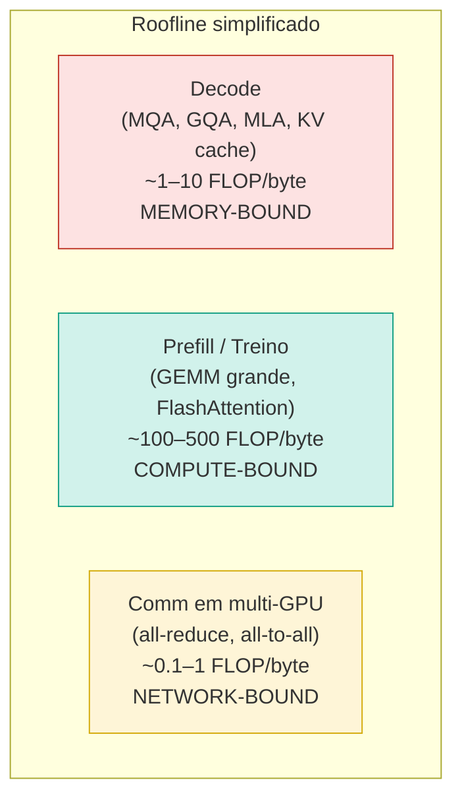
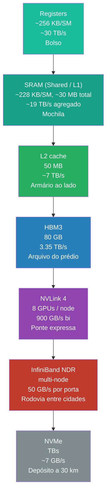
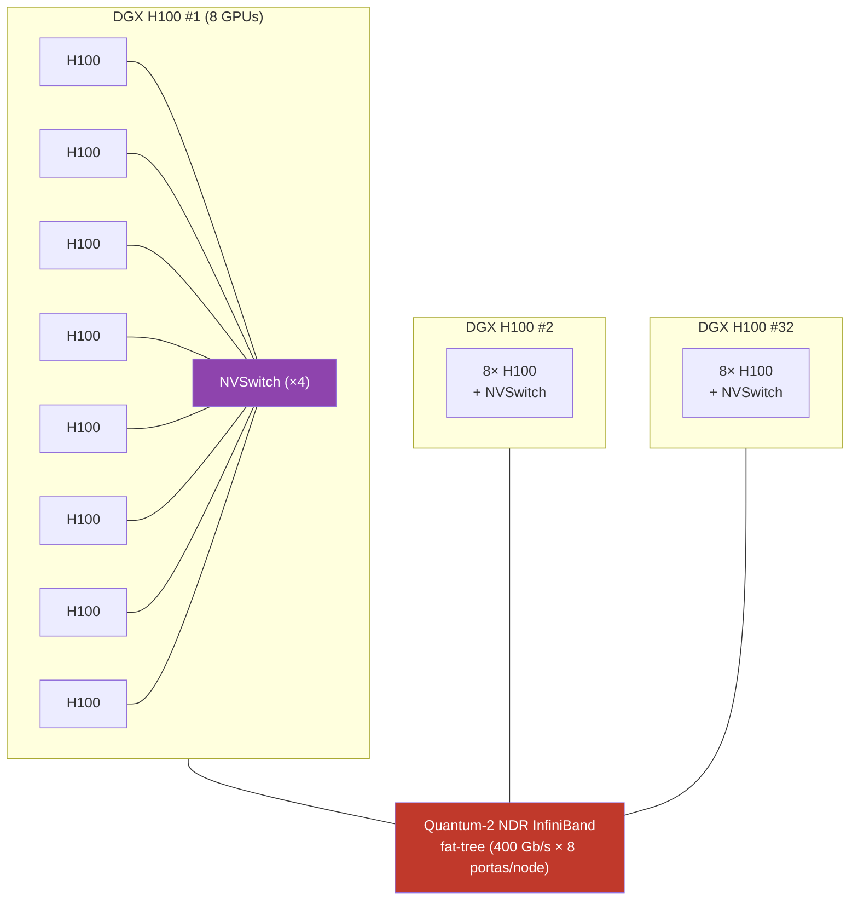
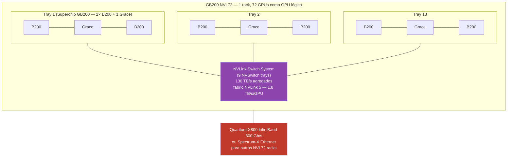
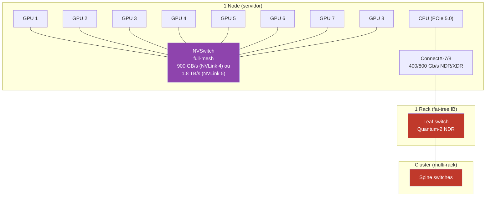
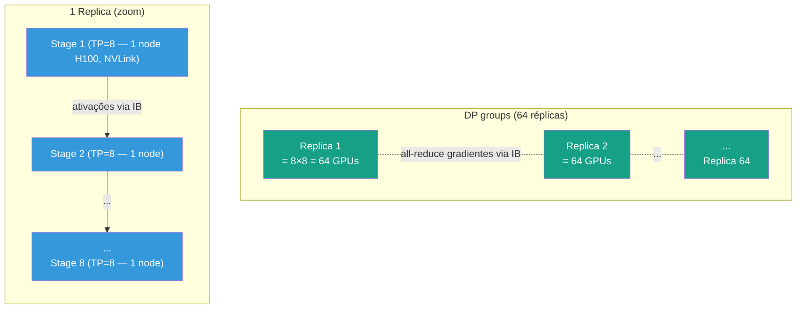
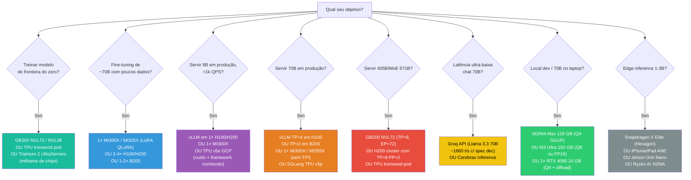

# Post 10 — Hardware para LLMs: H100/H200, Blackwell B100/B200/B300, MI300X/MI355X, TPU, Apple Silicon, Groq, Cerebras e o resto da fauna

> **Série:** *LLMs em Profundidade — Da Atenção ao TurboQuant e Além*
> **Pré-requisitos:**
> - [Post 01 — Arquitetura Transformer & LLMs decoder-only](./01-arquitetura-transformer-decoder-llm.md)
> - [Post 02 — Atenção: MHA/MQA/GQA/MLA/FlashAttention](./02-attention-mha-mqa-gqa-mla-flashattention.md) (entender prefill vs decode, SRAM vs HBM)
> - [Post 03 — KV cache e PagedAttention/vLLM](./03-kv-cache-anatomia-pagedattention-vllm.md) (memory-bound do decode)
> - [Post 04 — Quantização de pesos](./04-quantizacao-pesos-gptq-awq-gguf-bitsandbytes.md) (formatos numéricos)
> **Próximo:** Post 11 — Frameworks de inferência (vLLM, SGLang, TensorRT-LLM, llama.cpp, MLX) (em produção)
> **Índice:** [00-INDEX](./00-INDEX.md)

---

## TL;DR

Os posts 02–08 trataram **algoritmos** que reduzem o custo de uma LLM (atenção esparsa, KV quantizado, speculative decoding, sparsity, MoE, contexto longo). Mas todo algoritmo roda em silício, e silício tem **três grandezas que dominam tudo**:

1. **Compute** (TFLOPS por número de bits — FP16, FP8, FP4),
2. **Capacidade e largura de banda de memória** (GB e GB/s do HBM/LPDDR),
3. **Interconexão** (NVLink, NVSwitch, ICI, InfiniBand, Ethernet).

Para uma LLM moderna:
- O **prefill** é tipicamente **compute-bound** (saturando Tensor Cores),
- O **decode** é tipicamente **memory-bound** (saturando HBM bandwidth),
- O **treino multi-GPU** é frequentemente **comm-bound** (saturando NVLink/IB).

Neste post mapeamos **quem é quem no silício de IA em 2024–2026**:

- **NVIDIA Hopper (H100, H200)** — a base instalada que ainda domina datacenters,
- **NVIDIA Blackwell (B100, B200, GB200, B300/Blackwell Ultra, GB300)** — a geração atual,
- **NVIDIA Vera Rubin (R100/Rubin, Rubin Ultra)** — anunciada em GTC 2025/2026, embarques H2 2026,
- **AMD Instinct MI300X, MI325X, MI355X** — concorrência real em memória e FP4,
- **Google TPU v5e/v5p, v6 Trillium, v7 Ironwood** — opção de pod gigantes via GCP,
- **Apple Silicon M3/M4 Max/Ultra** — *unified memory* democratiza Llama-70B no laptop,
- **Aceleradores especializados**: Groq LPU, Cerebras WSE-3, SambaNova SN40L, Tenstorrent, AWS Trainium 2,
- **Edge NPUs**: Qualcomm Hexagon, Intel Lunar Lake, AMD XDNA, Apple Neural Engine,
- **Topologias e fabric**: NVLink 4/5/6, NVSwitch, NVL72/NVL576, InfiniBand NDR/XDR, Ethernet RoCE.

E fechamos com **árvores de decisão**: dado seu cenário (treinar do zero, fine-tunar, servir 8B com 1k QPS, rodar 70B local, latência ultra-baixa) → qual hardware faz sentido.

> **Anti-overlap.** Aqui **não** detalhamos o algoritmo do FlashAttention (Post 02 / 02-DEEP), nem a aritmética do KV cache (Post 03/05), nem os kernels de quantização (Post 04). O foco é **chip, package, rack, datacenter**.

---

## Sumário

1. [Por que hardware importa para LLM](#1-por-que-hardware-importa-para-llm)
2. [Anatomia de uma GPU NVIDIA moderna (H100 como referência)](#2-anatomia-de-uma-gpu-nvidia-moderna-h100-como-referência)
3. [NVIDIA Hopper: H100 e H200](#3-nvidia-hopper-h100-e-h200)
4. [NVIDIA Blackwell: B100, B200, GB200](#4-nvidia-blackwell-b100-b200-gb200)
5. [Blackwell Ultra (B300/GB300) e roadmap Vera Rubin](#5-blackwell-ultra-b300gb300-e-roadmap-vera-rubin)
6. [Stack de software NVIDIA (CUDA, cuDNN, NCCL, TRT-LLM, Triton)](#6-stack-de-software-nvidia)
7. [AMD Instinct: MI300X, MI325X, MI355X](#7-amd-instinct-mi300x-mi325x-mi355x)
8. [Google TPU: v5e/v5p, v6 Trillium, v7 Ironwood](#8-google-tpu-v5ev5p-v6-trillium-v7-ironwood)
9. [Apple Silicon (M-series): unified memory](#9-apple-silicon-m-series-unified-memory)
10. [Aceleradores especializados (Groq, Cerebras, SambaNova, Tenstorrent, Trainium)](#10-aceleradores-especializados)
11. [NVLink, NVSwitch, fabric e topologias de cluster](#11-nvlink-nvswitch-fabric-e-topologias-de-cluster)
12. [Topologias de paralelismo (DP, TP, PP, SP, EP) e o hardware que cada uma estressa](#12-topologias-de-paralelismo)
13. [Formatos numéricos: FP32 → FP4 (e por que cada um existe)](#13-formatos-numéricos)
14. [Eficiência energética (perf/watt) e cooling](#14-eficiência-energética-e-cooling)
15. [Custo total: MSRP, cloud pricing, TCO, custo por 1M tokens](#15-custo-total-tco-e-custo-por-1m-tokens)
16. [Memória: HBM3/3e/4, LPDDR, GDDR e o "memory wall"](#16-memória-hbm334-lpddr-gddr-e-o-memory-wall)
17. [Edge e on-device LLMs (NPUs)](#17-edge-e-on-device-llms-npus)
18. [Decisões: como escolher hardware para seu cenário](#18-decisões-como-escolher-hardware-para-seu-cenário)
19. [Mapping hardware ⇄ frameworks](#19-mapping-hardware--frameworks)
20. [Tendências 2025–2027 (óptica, 3D-stacking, CXL, DPUs)](#20-tendências-20252027)
21. [Recapitulando](#21-recapitulando)
22. [Referências](#22-referências)

---

## 1. Por que hardware importa para LLM

### 1.1 Recap do gargalo (prefill vs decode)

Do [Post 02](./02-attention-mha-mqa-gqa-mla-flashattention.md) e [Post 03](./03-kv-cache-anatomia-pagedattention-vllm.md):

- **Prefill** (processar o prompt inteiro de uma vez): atenção $O(N^2 \cdot d)$, GEMM grande, **compute-bound** — você satura os Tensor Cores da GPU.
- **Decode** (gerar 1 token por vez): para cada token novo, você lê **todo o KV cache** da HBM. O compute por token é minúsculo, mas o tráfego de memória é gigantesco. Resultado: **memory-bound** — você satura a banda do HBM.

Isso muda tudo: para **decode**, dobrar o número de Tensor Cores **não acelera nada** se o HBM não tiver mais banda. Daí a importância de HBM3 → HBM3e → HBM4.

### 1.2 Roofline em um diagrama

O **modelo roofline** (Williams, Waterman, Patterson 2009) plota:
- **Eixo X:** intensidade aritmética (FLOPs por byte movido).
- **Eixo Y:** desempenho atingível (FLOPS).

Há **dois tetos**:
- À esquerda (baixa intensidade): teto inclinado = **bandwidth × intensidade** (memory-bound).
- À direita (alta intensidade): teto plano = **peak FLOPS** (compute-bound).

Onde caem as cargas LLM:



Cada zona pede **um aspecto diferente do hardware**:
- Decode pede **HBM bandwidth** (HBM3e > HBM3).
- Prefill/treino pede **TFLOPS denso** (Tensor Cores, FP8/FP4).
- Multi-GPU pede **NVLink/NVSwitch/IB** (quando o modelo não cabe em 1 chip).

### 1.3 Lei de Amdahl em multi-GPU

Se você divide o trabalho em $P$ GPUs, com fração $s$ **serial** (não paraleliza) e fração $(1-s)$ paralelizável:

$$
\text{Speedup}(P) = \frac{1}{s + (1-s)/P}
$$

Em LLM, "serial" inclui **comunicação coletiva** (all-reduce de gradientes em DP, all-to-all em EP/MoE, all-gather em TP). Quanto pior a interconexão, maior o $s$ efetivo, e o speedup achata.

**Exemplo concreto.** Treinar Llama-3 70B em 1024 H100s:
- Com NVLink + IB NDR (400 Gb/s) bem topologizado: ~85–90% de eficiência forte (MFU ~50%+).
- Com Ethernet 100 GbE genérico (sem RDMA): pode cair para 30–40% — aquele compute todo desperdiçado esperando network.

### 1.4 Hardware lottery (Hooker, 2020)

Sara Hooker, em *"The Hardware Lottery"* (2020), argumenta: **algoritmos que ganham tração não são necessariamente os melhores em abstrato — são os que casam bem com o hardware disponível**. Exemplos:

- O **Transformer** explodiu porque GPUs de Tensor Core (Volta, 2017) tornaram GEMM densos baratíssimos.
- LSTMs/RNNs tinham dependência sequencial que **não paraleliza bem em GPU**, ficaram pra trás.
- **MoE** virou viável quando NVLink + all-to-all ficaram baratos o suficiente (Switch Transformer 2021, GPT-4 reportadamente, DeepSeek-V3 2024).
- **State Space Models (Mamba)** ainda lutam para suplantar Transformer em parte porque o ecossistema CUDA/cuDNN/TRT-LLM é todo otimizado para atenção (ver [Post 07](./07-contexto-longo-rope-yarn-ring-streaming.md)).

> **Implicação prática.** Quando você escolhe "nosso modelo vai usar técnica X", está implicitamente apostando que **o hardware do seu cluster — e dos clusters dos seus clientes daqui a 2 anos — vai favorecer X**. Hardware-lock-in é real.

---

## 2. Anatomia de uma GPU NVIDIA moderna (H100 como referência)

Antes de comparar chips, é preciso vocabulário. Vamos abrir uma H100.

### 2.1 SM (Streaming Multiprocessor)

O **SM** é a unidade básica de execução. Uma H100 SXM5 tem **132 SMs ativos** (de 144 no die GH100). Dentro de cada SM:

- **CUDA Cores** (FP32, INT32, FP64) — operações escalares e vetoriais "tradicionais".
- **Tensor Cores (4ª geração no Hopper)** — unidades dedicadas a **GEMM** (multiplicação de matrizes), suportando FP16, BF16, TF32, FP8 (E4M3 e E5M2). É o que dá os "989 TFLOPs FP16" da H100.
- **Tensor Memory Accelerator (TMA)** — DMA dedicado: copia tiles de HBM → SRAM e vice-versa **em background**, liberando os warps para computar. Crucial para FlashAttention 3.
- **Warp Schedulers** — 4 por SM, escalonam *warps* de 32 threads.
- **Registers** — banco enorme (~64K registradores de 32 bits por SM), latência ~1 ciclo.
- **Shared Memory / L1 cache** — ~228 KB por SM (configurável); a "SRAM" que o FlashAttention usa.

### 2.2 Hierarquia de memória

A coisa mais importante para entender LLM. Da mais rápida (e cara em silício) para a mais lenta:

| Nível | Capacidade típica (H100) | Latência (~) | Largura de banda (~) | Analogia |
|---|---|---|---|---|
| Registradores | ~256 KB / SM (todos os threads) | 1 ciclo (~0.3 ns) | ~30 TB/s (efetiva) | Bolso |
| SRAM (Shared / L1) | ~228 KB / SM, ~30 MB total | ~20 ciclos (~5 ns) | ~19 TB/s agregado | Mochila nas costas |
| L2 cache | 50 MB | ~150 ciclos (~50 ns) | ~7 TB/s | Armário ao lado da mesa |
| HBM3 | 80 GB | ~500 ciclos (~400 ns) | 3.35 TB/s | Sala-arquivo do prédio |
| NVLink (intra-node) | até 8 GPUs no mesmo node | µs | 900 GB/s bi (NVLink 4) | Ponte expressa entre dois prédios |
| InfiniBand NDR (inter-node) | múltiplos nodes no rack/cluster | poucos µs | 400 Gb/s = 50 GB/s | Rodovia entre cidades |
| Ethernet 100 GbE | inter-rack genérico | ~10 µs | 12.5 GB/s | Estrada secundária |
| SSD NVMe (storage) | TB | ~100 µs | ~7 GB/s | Depósito a 30 km |

Observe os **5–6 ordens de grandeza** entre registradores e HBM. **É por isso que FlashAttention existe**: ao invés de materializar a matriz $N \times N$ da atenção em HBM ($N^2 \cdot 2$ bytes em FP16), o FlashAttention faz tiling em SRAM, evitando o tráfego HBM (ver [Post 02-DEEP](./02-DEEP-online-softmax-flashattention.md)).



> **Analogia integrada.** Pense em você no escritório:
> - Registradores = o que está **na sua mão agora**.
> - SRAM = sua **mochila** ao lado da cadeira.
> - L2 = um **armário** dois passos atrás.
> - HBM = a **sala-arquivo** do prédio.
> - NVLink = uma **ponte expressa** para o prédio vizinho (outra GPU).
> - InfiniBand = uma **rodovia** para outra cidade (outro rack).

### 2.3 HBM3 vs HBM3e vs HBM4

**HBM = High Bandwidth Memory.** É memória DRAM empilhada em **3D**, conectada à GPU por um **interposer de silício** (TSV — through-silicon vias). Cada "stack" tem múltiplas die de DRAM empilhadas.

| Geração | BW por stack | Capacidade por stack | Stacks por GPU típico | BW total típica | Exemplo |
|---|---|---|---|---|---|
| HBM2e | ~460 GB/s | 16 GB | 4–8 | 1.5–2 TB/s | A100 (80GB) |
| HBM3 | ~819 GB/s | 16–24 GB | 5–6 | 3–4 TB/s | H100 80GB, MI300X |
| HBM3e | ~1.0–1.2 TB/s | 24–36 GB | 6–8 | 4.8–8 TB/s | H200 (141GB), B200 (192GB), MI355X (288GB) |
| HBM4 | ~1.5–2 TB/s | 36–48 GB | 8 | 12–22 TB/s | Rubin (288GB, 22 TB/s) |

> **Por que HBM domina LLMs.** Porque LLM **decode é memory-bound** (§1.1). Cada extra de TB/s vira diretamente extra de tokens/segundo. Por isso a H200 (mesmo compute da H100, mas 4.8 TB/s vs 3.35 TB/s) acelera decode em ~1.4× sem mexer em uma linha de código.

### 2.4 PCIe vs NVLink vs NVSwitch

| Fabric | Geração / spec | BW por link | Topologia | Casos de uso |
|---|---|---|---|---|
| PCIe 4.0 ×16 | 64 GB/s bi | par CPU↔GPU | host I/O | A100 PCIe |
| PCIe 5.0 ×16 | 128 GB/s bi | par CPU↔GPU | host I/O | H100 PCIe, MI300X |
| PCIe 6.0 ×16 | 256 GB/s bi | par CPU↔GPU | host I/O (futuro) | Blackwell host link, Rubin |
| NVLink 4 (Hopper) | 900 GB/s bi por GPU (18 links × 50 GB/s) | mesh entre GPUs do node | TP intra-node, treino | H100 SXM |
| NVLink 5 (Blackwell) | 1.8 TB/s bi por GPU | mesh + switch | TP, fabric NVL72 | B200, GB200, B300 |
| NVLink 6 (Rubin) | 3.6 TB/s bi por GPU | mesh + switch | NVL576 | Rubin |
| NVSwitch 3 (Hopper) | conecta 8 GPUs, 7.2 TB/s agregados | full-mesh no node | DGX H100 / HGX | H100 |
| NVSwitch 4 (Blackwell) | 1.8 TB/s por porta, fabric NVL72 (até 72 GPUs num "rack-scale GPU") | rack | GB200/GB300 NVL72 | Blackwell |

> **NVLink ≠ PCIe.** PCIe conecta GPU↔CPU. NVLink conecta GPU↔GPU **diretamente**, sem passar pela CPU, e é **>10× mais rápido**. Por isso TP (tensor parallel) **só funciona razoavelmente sobre NVLink** — sobre PCIe vira gargalo.

---

## 3. NVIDIA Hopper: H100 e H200

A geração **Hopper** (anunciada em GTC 2022, GA H100 em 2023) é a base instalada que ainda domina datacenters em 2024–2026.

### 3.1 H100 — variantes

| Variante | Form factor | VRAM | HBM BW | FP8 TFLOPs (dense) | NVLink | TDP | MSRP* |
|---|---|---|---|---|---|---|---|
| **H100 SXM5** | módulo SXM (HGX) | 80 GB HBM3 | 3.35 TB/s | ~1979 (sparsity 2×) / ~990 dense | 900 GB/s | 700 W | \$30–40k |
| **H100 PCIe** | placa PCIe ×16 | 80 GB HBM3 | 2 TB/s | ~1513 / ~756 dense | 600 GB/s (PCIe link) | 350 W | \$25–30k |
| **H100 NVL** | 2× PCIe pareadas via NVLink bridge | 2× 94 GB HBM3 (188 GB total) | 2× 3.9 TB/s | ~1979 / ~990 por GPU | 600 GB/s entre as duas | 2× 400 W | \$50k+ |

*MSRP estimado mid-2024; preços flutuaram fortemente com escassez.

**Insight.** A `H100 NVL` foi a resposta para **rodar Llama-2 70B em FP8** confortavelmente: 188 GB cabem o modelo + KV em 1 par de placas. Mais memória > mais TFLOPs para muitos casos de inferência.

### 3.2 HGX H100 e DGX H100

- **HGX H100**: placa com **8× H100 SXM5 + 4× NVSwitch**, vendida pela NVIDIA para OEMs (Supermicro, Dell, HPE…) montarem servidores. É o "tijolo" do datacenter de IA.
- **DGX H100**: servidor de referência da própria NVIDIA com 8× H100, 2× CPUs Intel Sapphire Rapids, 8× ConnectX-7 (400 Gb/s NDR), ~\$300–400k.
- **DGX SuperPOD**: 32 DGX H100 (256 GPUs) interconectados via Quantum-2 NDR InfiniBand, fat-tree topology, base reference design dos hyperscalers.

### 3.3 H200 — mesmo compute, muito mais memória

| Spec | H100 SXM5 | H200 SXM5 | Δ |
|---|---|---|---|
| VRAM | 80 GB HBM3 | **141 GB HBM3e** | +76% |
| HBM BW | 3.35 TB/s | **4.8 TB/s** | +43% |
| FP8 dense TFLOPs | ~990 | ~990 | igual |
| FP16 TFLOPs | ~989 | ~989 | igual |
| TDP | 700 W | 700 W | igual |
| NVLink | 900 GB/s | 900 GB/s | igual |

**Tradução prática.** H200 é uma H100 com upgrade só de memória. Para **decode de LLM grande** (memory-bound), isso vira **~40% mais throughput**. Para **treino** ou **prefill** (compute-bound), o ganho é menor (mas ainda existe via melhor *utilization*).

### 3.4 Topologia DGX H100 SuperPOD (esquemática)



> **Por que IB e não Ethernet?** Latência ultra-baixa (sub-µs com RDMA), suporte nativo a coletivos NCCL otimizados, congestion control determinístico. Meta optou por Ethernet RoCE (custo, fornecedor único) — funciona, mas exige **engenharia de rede pesada** para bater latência IB.

---

## 4. NVIDIA Blackwell: B100, B200, GB200

Anunciada em GTC 2024 (março) e GA em segundo semestre de 2024 / início 2025, **Blackwell** é a primeira geração da NVIDIA a usar **chiplets** (2 dies em 1 package).

### 4.1 O salto arquitetural

- **2 dies em 1 package**, conectados por **NV-HBI (NVIDIA High-Bandwidth Interface)**: ~10 TB/s die-to-die. Para o software, parecem **uma GPU única**.
- **Transformer Engine de 2ª geração**: suporte nativo a **FP4** (E2M1) e **FP6** (microscaling MXFP4/MXFP6/NVFP4 — formatos da OCP).
- **Tensor Cores de 5ª geração**: 4× a vazão FP8 da Hopper, 2× FP16.
- **Decompression Engine** dedicado (LZ4, Snappy, Deflate) — útil para data-loading.
- **5ª gen NVLink**: 1.8 TB/s bi por GPU (2× a Hopper).
- **Confidential Computing** em hardware (TEE para LLM).

### 4.2 SKUs principais

| SKU | VRAM | HBM BW | FP4 dense | FP8 dense | FP16 dense | TDP | Cooling |
|---|---|---|---|---|---|---|---|
| **B100** | 192 GB HBM3e | 8 TB/s | 14 PFLOPS | 7 PFLOPS | 3.5 PFLOPS | 700 W | air-coolable |
| **B200** | 192 GB HBM3e | 8 TB/s | 20 PFLOPS | 10 PFLOPS | 5 PFLOPS | 1000 W | liquid (HGX air também existe a TDP reduzido) |
| **GB200 (Superchip)** | 2× B200 + 1 Grace ARM (72-core Neoverse V2) | 384 GB HBM3e + 480 GB LPDDR5X | 16 TB/s + 512 GB/s LPDDR | 40 PFLOPS | 20 PFLOPS | 10 PFLOPS | 2700 W | liquid |

> **Curiosidade.** O **B100** existe principalmente para drop-in em chassis HGX antigos resfriados a ar. O **B200** com 1000W exige liquid cooling, e a versão "verdadeiramente Blackwell" para datacenter é o **GB200**, que vem casado a uma CPU Grace via **NVLink-C2C** (900 GB/s coerente) — eliminando o gargalo PCIe.

### 4.3 GB200 NVL72 — o "rack como uma GPU"

O **NVL72** é o produto rack-scale da Blackwell:

- **72 GPUs B200** (= 36 Superchips GB200) em **1 rack liquid-cooled**,
- **36 CPUs Grace**,
- Interconectados por **NVLink Switch System** (9 NVSwitch trays): **130 TB/s agregados** dentro do rack,
- Total: **13.5 TB de HBM3e**, **30 TB de LPDDR**, **1.4 ExaFLOPS FP4 dense** (2.88 ExaFLOPS sparsity 2×).



> **Implicação para Tensor Parallel.** No NVL72, você pode rodar **TP=72** com latência semelhante ao TP=8 atual da H100, porque o NVLink fabric trata as 72 GPUs como uma. Isso muda a economia de **modelos trilhão de parâmetros** servidos com baixa latência.

### 4.4 Para que serve cada Blackwell?

- **B100**: drop-in em datacenters air-cooled antigos.
- **B200 (HGX)**: novos servidores air-cooled de 8 GPUs (similar HGX H100).
- **GB200 NVL72/NVL36**: hyperscalers (AWS Project Ceiba, Microsoft, Meta, Oracle) — cargas trilhão de parâmetros, MoE gigante, raciocínio o1-style.

---

## 5. Blackwell Ultra (B300/GB300) e roadmap Vera Rubin

### 5.1 Blackwell Ultra (anunciado GTC 2025)

- **B300**: **288 GB HBM3e** (1.5× B200), **15 PFLOPS dense FP4** (~1.5× B200), 640 Tensor Cores de 5ª gen, foco em **AI reasoning workloads** (modelos o1/o3-style com test-time scaling).
- **NV-HBI** mantido em ~10 TB/s.
- **GB300 NVL72**: 72 B300 + 36 Grace, **40 TB de memória coerente** no rack, **130 TB/s** internos.
- Lançamento mid/late 2025.

### 5.2 Vera Rubin (anunciado GTC 2025/2026, embarques H2 2026)

A geração **Rubin** (homenagem à astrofísica Vera Rubin) vem com **uma família inteira de chips coordenados**:

| Componente | Detalhes |
|---|---|
| **Rubin GPU** | 50 PFLOPS FP4 (inference), 288 GB **HBM4** @ **22 TB/s** |
| **Vera CPU** | 88 cores "Olympus" custom NVIDIA, 1.2 TB/s memory BW, focada em RL e agentic AI |
| **NVLink 6** | 3.6 TB/s bi por GPU (2× NVLink 5), 260 TB/s agregados |
| **NVL576 / Kyber** | rack-scale com 576 Rubin GPUs (Rubin Ultra) |
| **ConnectX-9** | 1.6 Tb/s NIC |
| **Quantum-X800 / Spectrum-X** | IB / Ethernet 800 Gb/s |
| **BlueField-4 DPU** | offload storage/security |

### 5.3 Roadmap NVIDIA consolidado

| Ano | Geração | Produto principal | Destaque |
|---|---|---|---|
| 2020 | Ampere | A100 (40/80 GB) | Tensor Cores 3ª gen, BF16 |
| 2022 | Hopper | H100 SXM5 | FP8, TMA, Transformer Engine 1ª gen |
| 2024 | Hopper refresh | **H200** | HBM3e 141 GB |
| 2024–2025 | **Blackwell** | B100, B200, **GB200 NVL72** | chiplets, FP4, NVLink 5 |
| 2025 | **Blackwell Ultra** | B300, GB300 NVL72 | 288 GB, FP4 reasoning, 15 PFLOPS |
| 2026 (H2) | **Rubin** | R100/Rubin, NVL144 | HBM4, NVLink 6 |
| 2027 | **Rubin Ultra** | NVL576 / Kyber rack | 576 GPUs em 1 fabric |
| 2028 | **Feynman** | 3D die-stacked + custom HBM + Rosa CPU | ciclo de ~2 anos |

> **Padrão.** A NVIDIA agora alterna entre **base** (B200, R100) e **Ultra** (B300, R-Ultra) num ritmo anual, com saltos arquiteturais a cada 2 anos. Capex hyperscaler está calibrado para isso (depreciação ~3 anos).

---

## 6. Stack de software NVIDIA

Hardware sem software é metal inerte. A vantagem mais profunda da NVIDIA é o **CUDA moat** — duas décadas de tooling, kernels e know-how acumulado.

| Camada | Componente | Função |
|---|---|---|
| Driver | **NVIDIA Driver + CUDA runtime** | API host ↔ GPU |
| Linguagem GPU | **CUDA C++** (nvcc) | escrever kernels |
| DSL alto nível | **OpenAI Triton** | escrever kernels em Python (FA, GEMM custom) |
| Templates GEMM | **CUTLASS** | building blocks para kernels GEMM |
| Math libs | **cuBLAS, cuBLASLt** | GEMM denso, FP8 GEMM |
| DNN | **cuDNN** | conv, attention, normalizations |
| Comm | **NCCL** | all-reduce, all-gather, all-to-all em NVLink/IB |
| Treino | **Megatron-LM, NeMo, JAX (via XLA-CUDA)** | TP/PP/SP/EP, mixed precision |
| Inferência | **TensorRT-LLM** | engines compilados, in-flight batching, FP8 |
| Serving | **Triton Inference Server** (não confundir com Triton DSL!) | gerenciar engines |
| Serverless | **NIM (NVIDIA Inference Microservices)** | containers prontos para LLM |

> **Cuidado com a homonímia.** Existe **OpenAI Triton** (DSL Python para kernels GPU, usado pelo FlashAttention) e **NVIDIA Triton Inference Server** (orquestrador de modelos). Não são a mesma coisa.

### 6.1 TensorRT-LLM rapidamente

- Compila o grafo de uma LLM (Llama, Mistral, Mixtral, GPT-NeoX…) para um *engine* binário CUDA.
- Suporta **in-flight batching** (similar ao continuous batching do vLLM), **paged KV**, **FP8 quantizado**.
- É **mais rápido que vLLM** em benchmarks NVIDIA — mas **menos flexível** (compilação demorada, sem suporte trivial para modelos novos).
- **vLLM 0.6+** vem fechando o gap; em produção real o pareo é HW-dependente.

Vamos detalhar TRT-LLM, vLLM e SGLang no **Post 11 — Frameworks de inferência**.

---

## 7. AMD Instinct: MI300X, MI325X, MI355X

A AMD é o **único concorrente real** da NVIDIA em datacenter de IA hoje (2024–2026), liderando especialmente em **memória** (até 288 GB num único pacote).

### 7.1 MI300X — o "ataque pelo flanco da memória"

Lançado dez/2023, GA 2024. Especificações:

- **CDNA 3** + chiplet design (8 XCDs + 4 IODs em 1 package).
- **192 GB HBM3** (mais do que **2× a H100 80GB**).
- **5.3 TB/s** HBM bandwidth (vs 3.35 da H100).
- **1.3 PFLOPS FP16**, **2.6 PFLOPS FP8** (sparsity 2× → ~5.2).
- 750 W TDP, OAM module.
- Sem NVLink-equivalente nativo — usa **Infinity Fabric** entre 8 GPUs do node.

**Onde brilha.** **Servir Llama-3 70B inteiro em 1 GPU**, sem TP. KV cache caber sobrando. Pré-fill grande. Para muitos workloads de inferência, **1× MI300X ≈ 2× H100 80GB**.

**Onde sofre.** Software. ROCm 6+ e PyTorch ROCm têm gaps em kernels otimizados (FlashAttention 3, FP8 GEMM eficiente). O ecossistema CUDA tem 15 anos de vantagem. **Mas vLLM e SGLang já suportam MI300X em produção** desde 2024.

### 7.2 MI325X — refresh com mais memória

- Lançado out/2024.
- **256 GB HBM3e** (vs 192 da MI300X).
- **6 TB/s** HBM BW.
- **Mesmo compute** da MI300X (1.3 / 2.6 PFLOPS FP16/FP8).
- 1000 W TDP.
- Foco: drop-in upgrade no mesmo socket UBB OAM.

### 7.3 MI355X — CDNA 4 e FP4 nativo

GA junho 2025:

- **CDNA 4** em TSMC N3P, 256 compute units, 1024 matrix cores.
- **288 GB HBM3e** (50% a mais que B200).
- **8 TB/s** HBM BW.
- **2.5 PFLOPS FP16** (+77% vs MI300X), **5 PFLOPS FP8**, **10.1 PFLOPS FP4/MXFP4**.
- 1400 W TBP, OAM.
- Foco direto em LLM serving e training de larga escala.

### 7.4 Tabela comparativa AMD vs NVIDIA

| Spec | H100 SXM | H200 SXM | B200 | B300 | MI300X | MI325X | MI355X |
|---|---|---|---|---|---|---|---|
| VRAM | 80 GB HBM3 | 141 GB HBM3e | 192 GB HBM3e | 288 GB HBM3e | 192 GB HBM3 | 256 GB HBM3e | 288 GB HBM3e |
| HBM BW (TB/s) | 3.35 | 4.8 | 8 | 8 (est) | 5.3 | 6 | 8 |
| FP4 dense (PFLOPS) | — | — | 20 | 15 (denso/sparsity contas diferentes) | — | — | 10.1 |
| FP8 dense (PFLOPS) | ~1.0 | ~1.0 | 10 | — | 2.6 | 2.6 | 5.0 |
| FP16/BF16 (PFLOPS) | ~1.0 | ~1.0 | 5 | — | 1.3 | 1.3 | 2.5 |
| Interconnect intra-node | NVLink 4 (900 GB/s) | NVLink 4 | NVLink 5 (1.8 TB/s) | NVLink 5 | Infinity Fabric (~896 GB/s entre 8 GPUs) | Inf. Fabric | Inf. Fabric 4 |
| TDP (W) | 700 | 700 | 1000 | ~1200 (est) | 750 | 1000 | 1400 |
| Software prim. | CUDA, TRT-LLM | CUDA | CUDA | CUDA | ROCm 6, vLLM, SGLang | ROCm 6 | ROCm 7 |

### 7.5 Adoção real (2024–2025)

- **Microsoft Azure**: deploys de MI300X para Copilot e clientes empresariais.
- **Meta**: MI300X usadas em parte da carga Llama 3 inference (anúncio jan/2024).
- **Oracle Cloud**: clusters MI300X dedicados.
- **OpenAI**: rumores de avaliações; nada confirmado em produção.
- **xAI / Tesla**: lealdade a NVIDIA até agora, mas avaliando.

> **Síntese.** Em 2026, **AMD tem produto competitivo em silício**, mas o ecossistema software ainda exige investimento de engenharia do cliente. Para quem aceita esse custo, a economia é boa (MSRP MI300X ~\$15-20k vs H100 ~\$30-40k, e o dobro de VRAM).

---

## 8. Google TPU: v5e/v5p, v6 Trillium, v7 Ironwood

Google projeta TPUs **internamente desde 2015** para suas próprias cargas (Search, Translate, Gemini). Disponível **só via GCP** (não há TPU para venda direta).

### 8.1 Arquitetura — systolic array

Cada TPU tem uma **MXU (Matrix Multiply Unit)** que é um **systolic array** (Kung & Leiserson 1979): malha 2D de PEs (processing elements) onde dados fluem ritmicamente. Para GEMM, isso atinge **utilização >90%** sem overhead de control flow.

```mermaid
flowchart LR
    A1["a11"] --> A2["a12"] --> A3["a13"]
    B1["b11"] --> B2["b21"] --> B3["b31"]

    subgraph MXU["MXU 128×128 (esquema)"]
        P11((PE)):::pe -- a -.-> P12((PE))
        P12 -- a -.-> P13((PE))
        P21((PE)) -- a -.-> P22((PE))
        P22 -- a -.-> P23((PE))
        P11 -- b -.-> P21
        P12 -- b -.-> P22
        P13 -- b -.-> P23
    end

    classDef pe fill:#3498db,color:#fff
```

Cada PE faz `acc += a * b` por ciclo, em FP16/BF16/FP8. TPU v5p tem **MXU 256×256**, e Ironwood subiu pra dimensões ainda maiores (não totalmente públicas).

### 8.2 Linhagem TPU

| Geração | Ano | Memória | BW | Compute pico | Pod size | Foco |
|---|---|---|---|---|---|---|
| TPU v4 | 2021 | 32 GB HBM2 | 1.2 TB/s | 275 TFLOPS BF16 | 4096 chips | training |
| TPU v5e | 2023 | 16 GB HBM2 | 819 GB/s | 197 TFLOPS BF16 | 256 chips | cost-efficient inf+train |
| TPU v5p | 2023 | 95 GB HBM | 2.8 TB/s | 459 TFLOPS BF16 | 8960 chips | training large |
| **TPU v6 Trillium** | 2024 | 32 GB HBM | 1.6 TB/s | ~926 TFLOPS BF16 | 256 chips | gen-purpose |
| **TPU v7 Ironwood** | 2025 (GA H2) | **192 GB HBM3e** | **7.4 TB/s** | **4614 TFLOPS FP8** | **9216 chips** | **inference-first** |

### 8.3 Ironwood em mais detalhe

- **Primeiro TPU com FP8 nativo** em Tensor Cores.
- **Dual-die chiplet**.
- **42.5 ExaFLOPS** quando escalado a um pod completo de 9216 chips.
- **1.77 PB de HBM total** num pod (!).
- **9.6 Tb/s** ICI inter-chip.
- **2× perf/watt vs Trillium**.
- SparseCore 3ª/4ª gen para embeddings (recommendation, busca, financeiro).

### 8.4 ICI — Inter-Chip Interconnect

Os pods TPU usam **ICI**, uma malha **3D torus** (ou variantes 4D/twisted torus). Vantagem sobre InfiniBand:
- **Bandwidth uniforme entre vizinhos** — bom para all-reduce em padrões previsíveis.
- **Sem switches centrais** (cada chip conecta direto aos vizinhos no torus).
- **Escala bem até milhares de chips** sem degradação.

### 8.5 Software TPU

- **JAX** (Google) — DSL funcional Python sobre **XLA** compiler. JAX é **a** linguagem natural de TPU.
- **TensorFlow** — primária mas em declínio relativo a JAX.
- **PyTorch/XLA** — torch sobre XLA, funciona, mas tem cantos.
- **vLLM-TPU**, **SGLang-TPU** — suporte oficial 2024+.
- **MaxText** (Google open-source) — receitas Megatron-equivalentes em JAX.

### 8.6 Quando TPU faz sentido?

- **Cargas grandes em GCP**: cost-per-token competitivo para Llama-70B+, Gemini family interna.
- **Quem já está em JAX**: produtividade alta.
- **Pods enormes**: se você precisa treinar modelo de fronteira do zero em capex bem dimensionado, um pod TPU v5p/Ironwood é único no mercado.

**Limitações.** Lock-in GCP. Ecossistema PyTorch funciona mas não é first-class. Comunidade open-source menor.

---

## 9. Apple Silicon (M-series): unified memory

Apple não vende para datacenter, mas fez algo único: **Unified Memory Architecture (UMA)** torna laptops Mac viáveis para **rodar Llama-70B local**.

### 9.1 UMA na prática

- CPU, GPU e ANE (Neural Engine) compartilham **a mesma RAM física**, sem cópia entre VRAM e RAM.
- Memória **LPDDR5/5x** soldada no SoC, **muito próxima** do compute.
- Quando você carrega um modelo de 50 GB no Mac, ele entra direto na "VRAM" — porque **toda RAM é VRAM**.

### 9.2 Família M-series para LLM

| Chip | Ano | GPU cores | Memória | BW | Foco LLM |
|---|---|---|---|---|---|
| **M3 Max** | 2023 | 30/40 | até 128 GB LPDDR5 | 300/400 GB/s | Llama-70B Q4 (~40 GB) viável |
| **M3 Ultra** | 2024 (Mac Studio) | 60/80 | até 192 GB LPDDR5 | 800 GB/s | Llama-70B FP16, 405B Q4 |
| **M4 Max** | 2024 | 32/40 | até 128 GB LPDDR5x | 410/546 GB/s | melhor que M3 Max ~30% |
| **M4 Ultra*** | 2025 (esperado) | até 80 | até 256 GB LPDDR5x | ~1 TB/s (estimado) | Llama-405B Q4 + folga |

*M4 Ultra ainda não confirmado no momento desta escrita; specs estimadas via Mac Studio anticipated lineup.

### 9.3 Vantagem e desvantagem

**Vantagem.**
- Cabe modelo grande no laptop. Llama-3 70B Q4 em ~40 GB → roda confortável num M3 Max 128 GB.
- Latência de carregamento mínima (sem PCIe).
- ~150–250 W total — cabível numa mesa, sem cooling de datacenter.

**Desvantagem.**
- BW de 400–800 GB/s é **bem menos que HBM3** (3+ TB/s). Resultado: throughput de tokens/s é menor.
- Compute GPU em FLOPS bruto é fração de uma H100 (~10 TFLOPS FP16 num M3 Ultra vs ~989 numa H100).
- Ideal para **single-user** (chat local, prototipagem, dev). **Não é** para servir 1000 QPS.

### 9.4 Software Apple Silicon

- **MLX** (Apple, 2023) — array framework Python similar a JAX+PyTorch, otimizado para UMA. **MLX TurboQuant** etc. (ver [Post 06-DEEP](./06-DEEP-mlx-turboquant-walkthrough.md)).
- **llama.cpp Metal backend** — o mais popular para inference local (GGUF Q4/Q5/Q8).
- **PyTorch MPS** — backend Metal Performance Shaders. Funciona, mas tem gaps.
- **Core ML + ANE** — pipeline Apple para apps iOS/macOS (Apple Intelligence usa).

> **Analogia.** Apple Unified Memory = "**a casa toda é teu bolso**". Não tem armário, sala-arquivo, depósito separados — tudo é o mesmo espaço, e é grande. O preço é que o "bolso" é mais lento que o de uma GPU dedicada (mas você cabe modelos enormes nele).

---

## 10. Aceleradores especializados

Quando você sai do "datacenter genérico de IA" e foca em **latência** ou **custo por token**, surgem arquiteturas alternativas. Vejamos as principais.

### 10.1 Groq LPU — SRAM-only, latência determinística

Fundada por ex-Google (mesmos engenheiros do TPU v1). A **LPU (Language Processing Unit)**:

- **Fabricada em 14 nm GlobalFoundries** (1ª geração; nova em 4 nm anunciada).
- **230 MB de SRAM por chip**, **80 TB/s** de bandwidth on-chip.
- **Sem HBM, sem DRAM** — todo o modelo fica em SRAM, **distribuído por centenas de chips**.
- **~750 TFLOPS FP8**, ~300 W.
- Arquitetura **TSP (Tensor Streaming Processor)**: dataflow determinístico, sem caches, sem branch prediction. Você compila o modelo num **plano de execução** estático.

**Performance Llama 3 70B na nuvem GroqCloud:**
- Standard: **~250–280 tokens/s** (única-amostra streaming).
- Com **speculative decoding** (introduzido nov/2024): **>1600 tokens/s** (6× boost).

**Limitações.**
- **Modelos pré-compilados** — você não roda um modelo arbitrário; precisa Groq compilar.
- **Contexto limitado** (~32k típico, depende do modelo).
- Disponível **só via API** GroqCloud (sem on-prem).
- Custo capex absurdo: 1 stack = **568 LPUs** para servir Llama-70B com baixa latência.

> **Analogia.** Groq LPU é **uma Ferrari de 1 lugar**: extremamente rápida se você só quer ir do A ao B em linha reta. Não é boa para batches grandes nem para mudar de modelo a toda hora.

### 10.2 Cerebras WSE-3 — wafer-scale

A WSE-3 é **um wafer inteiro de silício como 1 chip**:

- **46.225 mm²** (vs ~814 mm² do H100).
- **900.000 cores**, 5 nm, **4 trilhões de transistores**.
- **44 GB SRAM on-chip** (~880× mais memória *on-die* que uma GPU).
- **21 PB/s memory bandwidth** agregada.
- **214 PB/s fabric** entre cores.

**Vantagem.** Para modelos que **cabem em 1 wafer**, a comunicação inter-chip simplesmente não existe — é tudo on-die. A Cerebras claima **5× mais rápido que cluster DGX H100** equivalente em treino.

**Limitações.**
- Software ecosystem **muito** menor (ecossistema próprio CSL).
- Modelos suportados são **curados** pela Cerebras.
- Custo capex e cooling são altíssimos.
- Mercado endereçável pequeno (poucos clientes podem pagar e operar).

> **Analogia.** Cerebras = "**1 quarteirão inteiro de cidade virou 1 prédio só**". Quem mora nele anda super rápido entre os escritórios, mas só cabem alguns inquilinos.

### 10.3 SambaNova SN40L — dataflow

- Reconfigurable Dataflow Architecture (RDU).
- **1.5 TB DDR + HBM3** (memória hierárquica grande, foco em modelos enormes).
- Sweetspot: **MoE** com muitos experts e **inference de longo contexto**.
- Cliente notório: várias LLMs governamentais e financeiras dos EUA.

### 10.4 Tenstorrent (Wormhole, Blackhole)

- Fundada por Jim Keller (CPU architect lendário).
- **RISC-V cores + Tensor cores**, arquitetura aberta.
- Software **open-source** (TT-Metalium, TT-NN).
- **Wormhole** (2024) e **Blackhole** (2025) já em mãos de devs.
- Aposta de longo prazo: comunidade aberta como contraponto ao lock-in CUDA.

### 10.5 AWS Trainium 2 / Inferentia 3

- **Trainium 2 (TRN2)**: 20.8 PFLOPS FP8 por chip, GA out/2024.
- **TRN2 UltraServer**: 4 servers × 16 chips = 64 chips, **83.2 PFLOPS FP8**, **6 TB HBM**, 12.8 Tbps EFA.
- **Project Rainier** (AWS + Anthropic, online out/2025): ~500.000 chips Trainium 2, cluster de **5 ExaFLOPS efetivos** treinando Claude.
- **Inferentia 3** (esperado): foco serving, custo/token agressivo.
- Software: **Neuron SDK** (compatível com PyTorch/JAX via XLA).

### 10.6 Edge TPU / NVIDIA Jetson — só pra mencionar

- **Google Coral / Edge TPU**: poucos TOPS, foco visão / classificação. Não é viável para LLM além de tinyLLM 1B Q4.
- **NVIDIA Jetson Orin / Thor**: SoC ARM + GPU Ampere/Blackwell-class compacta. Roda Llama-7B–13B confortavelmente. Robótica, drones, edge industrial.

### 10.7 Tabela comparativa (especializados)

| Acelerador | Memória | BW | Compute pico | Workload alvo | Status |
|---|---|---|---|---|---|
| **Groq LPU (gen 1)** | 230 MB SRAM/chip | 80 TB/s on-chip | 750 TFLOPS FP8 | latência ultra-baixa | GA via API |
| **Cerebras WSE-3** | 44 GB SRAM/wafer | 21 PB/s | ~125 PFLOPS FP16 (claim) | training de fronteira | comercial nicho |
| **SambaNova SN40L** | 1.5 TB DDR + HBM | n/a publicado | ~5 PFLOPS BF16 | MoE + long context | enterprise |
| **Tenstorrent Blackhole** | 32 GB GDDR6 | 800 GB/s | ~745 TFLOPS FP8 | dev / aberto | shipping 2025 |
| **AWS Trainium 2** | ~96 GB HBM | ~3 TB/s (est) | 20.8 PFLOPS FP8 | training / inf AWS-only | GA |
| **NVIDIA Jetson AGX Thor** | 128 GB LPDDR5x | 273 GB/s | ~2 PFLOPS (sparse) | edge robotics | GA 2025 |

---

## 11. NVLink, NVSwitch, fabric e topologias de cluster

### 11.1 Hierarquia de interconexão



**Hierarquia conceitual:**
1. **Intra-GPU**: SRAM, L2, HBM (cobertos em §2).
2. **Intra-node** (8 GPUs): NVLink + NVSwitch — para TP e parte de SP.
3. **Intra-rack** (vários nodes, ~16–32 nodes): InfiniBand leaf switches — para PP e parte de DP.
4. **Inter-rack** (cluster): IB spine — para DP grande, EP em MoE distribuído.

### 11.2 InfiniBand vs Ethernet RoCE

| Atributo | InfiniBand NDR/XDR | Ethernet RoCE v2 (lossless) |
|---|---|---|
| Bandwidth/link | 400 / 800 Gb/s | 400 / 800 Gb/s |
| Latência | ~600 ns–1 µs | ~1–3 µs (com tuning) |
| RDMA | nativo, mature | requer PFC + ECN bem configurados |
| Switches | NVIDIA Quantum-2/X800 | Arista, Cisco, Broadcom (commodity) |
| Custo CapEx | alto | médio |
| Operacional | stack proprietário | conhecimento Ethernet padrão |
| Adotado por | maioria dos hyperscalers (NVIDIA stack) | **Meta** (escala massiva), Oracle, alguns clouds |

> **Quem usa o quê.** Microsoft, AWS, Google interno, OpenAI/Coreweave: IB. **Meta**: Ethernet RoCE em larga escala (decisão de arquitetura para reduzir vendor lock-in e custo). Ambos funcionam — a diferença está no **engineering effort**.

### 11.3 NVLink Switch System (NVL72) em mais detalhe

No GB200 NVL72:
- 9 **NVSwitch trays** dedicados ao rack.
- Cada B200 tem **18 portas NVLink 5** (cada @ 100 GB/s bi).
- Total agregado: **130 TB/s** dentro do rack.
- Faz com que **TP=72** se comporte como TP=8 hoje.

Isso libera **paralelizar Mixture-of-Experts** (EP=72) sem que o all-to-all destrua o throughput.

---

## 12. Topologias de paralelismo

Quando o modelo não cabe em 1 GPU, ou quando você tem muitas GPUs e quer uso eficiente, combina-se múltiplos eixos de paralelismo. Cada eixo **estressa um nível diferente da hierarquia**.

### 12.1 As 5 dimensões clássicas

| Eixo | Sigla | O que paraleliza | Comunicação dominante | BW exigida | Onde rodar |
|---|---|---|---|---|---|
| **Data Parallel** | DP | mini-batch dividido entre GPUs | **all-reduce de gradientes** ao fim do step | média (ZeRO reduz) | inter-node OK |
| **Tensor Parallel** | TP | linhas/colunas de cada matrix W | **all-reduce/all-gather de ativações por camada** | **muito alta** (cada layer) | **intra-node NVLink** |
| **Pipeline Parallel** | PP | camadas em estágios | ativações entre stages (point-to-point) | média | inter-node IB |
| **Sequence Parallel** | SP | dimensão de sequência (ativações longas) | all-gather/reduce-scatter | alta | intra-node |
| **Expert Parallel** | EP | experts de MoE distribuídos entre GPUs | **all-to-all** de tokens→experts | altíssima | NVLink/IB combinados |

### 12.2 Diagrama: Megatron 3D parallelism (TP × PP × DP)

Cenário Llama-3 405B em 4096 H100s, config exemplo: **TP=8, PP=8, DP=64** (≈8×8×64=4096):



**Por que esse layout?**
- **TP=8** sempre dentro do mesmo node (NVLink) — a comunicação por camada é frequente.
- **PP=8** entre nodes do rack (IB) — comunicação só entre stages.
- **DP=64** entre racks (IB spine) — all-reduce só ao fim do step.

### 12.3 EP (expert parallel) e MoE

Em **MoE** (DeepSeek-V3, Mixtral, GPT-4 reportadamente — ver [Post 08](./08-alem-quantizacao-sparsity-speculative-moe-distillation.md)):
- Cada token escolhe **K experts** dentre **N**.
- Os experts são distribuídos por GPUs (EP).
- Após o gating, **all-to-all** redistribui tokens → experts → tokens.

**All-to-all é o pior padrão de comunicação** (cada GPU manda dados pra **todas** as outras). É por isso que NVL72 (NVLink fabric extenso) muda a economia de MoE.

---

## 13. Formatos numéricos

### 13.1 Por que importa

Cada formato tem 3 propriedades principais:
- **Range** (quantos expoentes diferentes representa).
- **Precisão** (granularidade dentro de cada expoente).
- **Footprint** (bytes que ocupa).

LLMs descobriram: para ativações com **outliers** (ver [Post 04/05](./04-quantizacao-pesos-gptq-awq-gguf-bitsandbytes.md)), **range > precisão**. Por isso BF16 venceu FP16 em treino, e FP8 E5M2 substitui E4M3 em backward.

### 13.2 Tabela completa

| Formato | Bits | Sign | Exp | Mant | Range aprox. | Hardware nativo |
|---|---|---|---|---|---|---|
| **FP32** | 32 | 1 | 8 | 23 | ±10³⁸ | tudo |
| **TF32** (NV) | 19 (efetivo) | 1 | 8 | 10 | ±10³⁸ | A100, H100 |
| **BF16** | 16 | 1 | 8 | 7 | ±10³⁸ | A100, H100, B200, MI300X, TPU |
| **FP16** | 16 | 1 | 5 | 10 | ±65k | tudo desde Volta |
| **FP8 E4M3** | 8 | 1 | 4 | 3 | ±448 | H100, B200, MI355X, Ironwood |
| **FP8 E5M2** | 8 | 1 | 5 | 2 | ±57344 | H100, B200, MI355X, Ironwood |
| **MXFP6** | 6 + scale block | 1 | 3 | 2 | ±10 (com scale per-block 32) | B200, MI355X |
| **MXFP4 / NVFP4** | 4 + scale | 1 | 2 | 1 | ~±6 (com scale) | B200, B300, MI355X |
| **NF4** | 4 (lookup, não IEEE) | — | — | — | normal-distribution-quantile | bitsandbytes (S/W) |
| **INT8** | 8 | — | — | — | -128..127 | tudo |
| **INT4** | 4 | — | — | — | -8..7 | GPTQ/AWQ kernels CUDA |

> **Onde isso muda algoritmo.** O **DeepSeek-V3** (2024) treinou em **FP8 nativo** — é o primeiro modelo de fronteira com pré-treino full FP8. Hopper habilitou; Blackwell vai além para **FP4 training** experimental (ainda risky).

### 13.3 Microscaling (MX) — OCP standard

Em **MXFP4/MXFP6/MXFP8**: cada **bloco de 32 elementos** compartilha um **scale FP8** comum. Isso dá range alto sem custo de bits por elemento.

- Suportado em hardware Blackwell B200/B300, MI355X.
- Padronizado pela **Open Compute Project (OCP)** em 2023 — multi-vendor.
- Contraparte NVIDIA: **NVFP4** (variante com scaling refinado).

---

## 14. Eficiência energética e cooling

### 14.1 Perf/watt comparativo

| Hardware | TDP | Compute pico | Perf/watt |
|---|---|---|---|
| H100 SXM | 700 W | ~1 PFLOPS FP8 | ~1.4 GFLOPS/W FP8 |
| H100 SXM (sparse 2×) | 700 W | ~2 PFLOPS FP8 sparse | ~2.8 GFLOPS/W |
| B200 | 1000 W | 10 PFLOPS FP8 | ~10 GFLOPS/W |
| B200 | 1000 W | 20 PFLOPS FP4 | ~20 GFLOPS/W |
| B300 | ~1200 W | 15 PFLOPS FP4 | ~12.5 GFLOPS/W |
| MI300X | 750 W | 2.6 PFLOPS FP8 | ~3.5 GFLOPS/W |
| MI355X | 1400 W | 5 PFLOPS FP8 | ~3.6 GFLOPS/W |
| MI355X (FP4) | 1400 W | 10.1 PFLOPS FP4 | ~7.2 GFLOPS/W |
| TPU v5p | ~700 W | 459 TFLOPS BF16 | ~0.66 TFLOPS/W BF16 |
| TPU Ironwood | ~600 W (est) | 4614 TFLOPS FP8 | ~7.7 TFLOPS/W FP8 |
| Apple M4 Ultra (est) | ~150 W | ~30 TFLOPS FP16 (est) | ~0.2 TFLOPS/W |
| Groq LPU | ~300 W | 750 TFLOPS FP8 | ~2.5 TFLOPS/W |

**Take-aways.**
- B200 melhora ~7× perf/watt FP8 sobre H100 — salto enorme.
- Blackwell em FP4 → ~14× sobre Hopper FP8.
- TPU Ironwood em FP8 é competitivo com Blackwell.

### 14.2 Cooling

- **H100**: air cooling viável até ~700 W em chassis bem projetados.
- **B200/B300**: **liquid cooling obrigatório** em rack-scale (NVL72/NVL36). Air cooled SKUs existem mas com TDP capado.
- **MI355X**: 1400 W → liquid cooling obrigatório.
- **Datacenter PUE**: hyperscalers modernos PUE ~1.1–1.2 (cooling+overhead = 10-20% extra). Air-cooled antigo ~1.5+.

> **Custo escondido.** Para 1 rack NVL72 a 120 kW, os **chillers, CDU (coolant distribution unit), tubos secundários** representam ~15-20% do CapEx total do datacenter. Não dá pra simplesmente "trocar H100 por B200" — frequentemente exige **retrofit completo do datacenter**.

---

## 15. Custo total: TCO e custo por 1M tokens

### 15.1 MSRP indicativo (mid-2025)

| GPU | MSRP (USD, est.) |
|---|---|
| H100 SXM | \$30k–40k |
| H100 PCIe | \$25k–30k |
| H200 SXM | \$35k–45k |
| B200 | \$35k–50k |
| B300 | \$40k–55k |
| MI300X | \$15k–20k |
| MI325X | \$20k–25k |
| MI355X | \$25k–35k |
| TPU v5p / Ironwood | n/a (só GCP) |
| Groq LPU stack (568 chips) | n/a (só Groq) |

**Atenção:** preços são **negociados e flutuam**. Listas oficiais quase nunca existem.

### 15.2 Cloud pricing on-demand (2025/2026)

| GPU | AWS | GCP | Azure | Specialist (RunPod, Lambda, Vast) |
|---|---|---|---|---|
| H100 80GB SXM | \$3.90–4.15/h (p5.48xlarge) | \$3.00–4.10/h (a3-megagpu) | \$5.40–6.98/h (NCadsH100v5) | \$1.87–3.00/h |
| H200 SXM | \$5–7/h | \$5–7/h | \$6–8/h | \$3–5/h |
| B200 | \$7–10/h (early) | \$8–12/h (early) | n/a (limited) | \$5–8/h (limited) |
| MI300X | n/a (limited) | n/a | \$4.50–6/h (preview) | \$2–4/h |
| TPU v5p | — | \$4.20/h por chip on-demand | — | — |

> **Spot/reserved** podem reduzir 30-70%. **Capacity blocks** (AWS) reservam GPUs por janela específica.

### 15.3 TCO on-prem vs cloud — heurística

Para uso intensivo (>50% utilização ano-redondo) **on-prem geralmente vence** cloud em ~2-3 anos:

```
TCO_on_prem  =  CapEx (GPU + servidor + rack + cooling)
              + OpEx (power × $/kWh × hours/year × PUE)
              + Maintenance (~5–10% CapEx/ano)
              + Engineering (DC ops staff)
```

Exemplo simplificado, 1 servidor 8× H100 SXM:
- CapEx: 8 × \$35k + \$50k servidor + cabling = ~\$330k
- Power: 8 × 700W + overhead = ~7 kW × 24h × 365 = 61 MWh/ano × \$0.10/kWh = **\$6.1k/ano**
- Cooling/PUE: × 1.3 → **\$8k/ano**
- Maintenance: \$20-30k/ano
- Total Year-1: ~\$370k. Year-2/3: ~\$40k/ano.

Equivalente cloud on-demand AWS: 8 × \$4.10 × 8760h = **\$287k/ano**. Já no ano 2 on-prem é mais barato. (Ignorando custo de oportunidade do CapEx etc.)

### 15.4 Custo por 1M tokens (Llama-3 70B inference)

Estimativa grosseira para serving Llama-3 70B em FP8 com vLLM/SGLang, 1k QPS sustentado:

| Setup | Tokens/s aprox | Custo/h | $ por 1M tokens (output) |
|---|---|---|---|
| 4× H100 SXM (TP=4) | ~3500 t/s | \$16/h on-prem amortizado | \$1.27 |
| 4× H100 SXM (TP=4) | ~3500 t/s | \$16/h cloud | \$1.27 |
| 1× B200 (TP=1) | ~5500 t/s | \$8/h on-prem | \$0.40 |
| 1× MI300X (TP=1) | ~3000 t/s | \$4/h cloud preview | \$0.37 |
| Groq LPU (API) | ~270 t/s (single) | API: ~\$0.59 in / \$0.79 out per 1M | \$0.79 |
| TPU v5p (8 chips) | ~3000 t/s | \$33/h | \$3.05 |

> **Caveat.** Estimativas dependem fortemente de **batch size, contexto, modelo, framework, quantização**. Use como ordens de grandeza, não como tabela final.

---

## 16. Memória: HBM3/3e/4, LPDDR, GDDR e o "memory wall"

### 16.1 O memory wall (Patterson, 2021)

Trabalho clássico de John Patterson: **compute escala mais rápido que memória**. Em 20 anos, FLOPS/chip cresceram ~60.000×, mas BW de DRAM cresceu ~30×. O gap se chama **memory wall**, e LLM vive cravado nele.

A solução de HBM (memória empilhada com TSV) é **a tentativa mais bem-sucedida** de mitigar.

### 16.2 Tabela HBM gens

| Gen | Pin rate | BW por stack | Capacity por stack | Lançamento | Quem usa |
|---|---|---|---|---|---|
| HBM2 | 2.4 Gbps | ~307 GB/s | 8 GB | 2016 | V100 |
| HBM2e | 3.6 Gbps | ~460 GB/s | 16 GB | 2019 | A100 |
| HBM3 | 6.4 Gbps | ~819 GB/s | 16–24 GB | 2022 | H100, MI300X |
| HBM3e | 8–9.6 Gbps | ~1.0–1.2 TB/s | 24–36 GB | 2024 | H200, B200, MI355X, Ironwood |
| HBM4 | ~10–12 Gbps | ~1.5–2 TB/s | 36–48 GB | 2026 | Rubin (anunciado), AMD MI400 (rumor) |

**Stacks por GPU:**
- H100: 5 active stacks de 16 GB = 80 GB.
- H200: 6 stacks de 24 GB HBM3e = 144 (efetivo 141).
- B200: 8 stacks de 24 GB HBM3e = 192 GB.
- B300: 8 stacks de 36 GB HBM3e = 288 GB.
- Rubin: 8 stacks de 36 GB HBM4 = 288 GB.
- MI355X: 8 stacks de 36 GB HBM3e = 288 GB.

### 16.3 Supply chain HBM

Apenas **3 fornecedores**: SK Hynix, Samsung, Micron.
- **SK Hynix** lidera HBM3e (~50% market share); contratos exclusivos com NVIDIA por blocos.
- **Samsung** atrás por gargalos de qualificação na NVIDIA HBM3e (resolvidos 2024-2025).
- **Micron** entrante mais novo, ganhando share rapidamente.
- HBM **vendida out 12-18 meses à frente**. Ano 2024-2025 = supply-constrained.

### 16.4 LPDDR e GDDR — quando aparecem

- **LPDDR5/5x**: usado em Apple Silicon, mobile, e nos **CPUs Grace** dos GB200/GB300 (480-960 GB de "host memory" coerente com GPU via NVLink-C2C).
- **GDDR6/6x/7**: usado em GPUs gaming (RTX 4090/5090), Tenstorrent Wormhole/Blackhole. ~600-900 GB/s — meio-termo entre DRAM e HBM, custo bem menor.

> **Trade-off.** HBM custa **5–10× DDR5** por GB. Por isso ninguém substitui DRAM por HBM na sua máquina — só faz sentido onde **bandwidth domina** (LLM, HPC, alguns ML).

---

## 17. Edge e on-device LLMs (NPUs)

A onda de "Phi-3 / Llama-3.2 / Gemma 2 small" + quantização Q4 viabiliza LLMs em **smartphones, laptops, dispositivos embarcados**.

### 17.1 NPUs principais (2024–2025)

| Vendor | NPU | Plataforma | TOPS INT8 | Framework |
|---|---|---|---|---|
| **Apple** | Neural Engine (16-core) | A18 Pro, M4 family | ~38 TOPS (M4) | Core ML, MLX |
| **Qualcomm** | Hexagon NPU | Snapdragon 8 Gen 3, X Elite | 45-75 TOPS | QNN, ONNX Runtime QNN EP |
| **Intel** | NPU (VPU) | Lunar Lake (Core Ultra 200V), Arrow Lake | 48 TOPS | OpenVINO |
| **AMD** | XDNA | Phoenix, Strix Point (Ryzen AI 300) | 50 TOPS | Ryzen AI SDK, ONNX |
| **Google** | Edge TPU | Coral | 4 TOPS | TFLite |
| **NVIDIA** | n/a (usa GPU) | Jetson Orin Nano: 67 TOPS Tensor | TensorRT |

### 17.2 Modelos viáveis on-device

| Modelo | Params | Q4 size aprox | RAM mínima | NPU/GPU recomendado |
|---|---|---|---|---|
| **Qwen 2.5 0.5B** | 0.5B | ~350 MB | 1 GB | qualquer NPU mobile |
| **Phi-3 mini 3.8B** | 3.8B | ~2.2 GB | 4 GB | Hexagon, M-series, XDNA |
| **Llama 3.2 1B** | 1B | ~700 MB | 2 GB | qualquer NPU |
| **Llama 3.2 3B** | 3B | ~1.8 GB (Q4) | 3 GB | NPU 30+ TOPS |
| **Gemma 2 2B** | 2B | ~1.4 GB | 3 GB | NPU 30+ TOPS |
| **Mistral 7B** | 7B | ~4.5 GB Q4 | 8 GB | M-series, XDNA, Hexagon |

### 17.3 Apple Intelligence — caso de estudo

- Modelo de ~3B no device (rodando no ANE), modelo de ~30B na **Private Cloud Compute** em servidores Apple Silicon.
- Toolchain: Core ML + ANE + iOS Foundation Models framework.
- Prova que **NPU de smartphone é viável para LLM 1-3B** com latência interativa (~30-60 tokens/s).

> **Quantização extrema.** Llama-3.2 3B em Q4 + KV cache em INT4 cabe em **~2 GB total**, rodando confortável em smartphones flagship.

---

## 18. Decisões: como escolher hardware para seu cenário

Vamos costurar tudo numa **árvore de decisão prática**.



### 18.1 Heurísticas adicionais

- **"Tenho budget X. O que compro?"** — Sempre cheque **VRAM por dólar**. MI300X frequentemente vence em $/GB-VRAM, importante se você não tem TP.
- **"Vou treinar Llama-3-style do zero"** — Esqueça nada exceto **GB200 NVL72** ou **TPU Ironwood pod** (>\$100M cluster). Para **continued pretraining** ou **alignment**, 64-256 H100s já bastam.
- **"Precisamos rodar agora, sem engenharia"** — Cloud + framework maduro: **AWS p5/p5en + vLLM/TRT-LLM** ou **GroqCloud para latência**.
- **"Open-source first, vendor-lock zero"** — Tenstorrent + Llama + vLLM. Aposta de longo prazo.

---

## 19. Mapping hardware ⇄ frameworks

Nem todo framework roda nativamente em todo hardware. Tabela de compatibilidade (mid-2026):

| Framework | NVIDIA H/B/Rubin | AMD MI300/MI355 | Google TPU | Apple Silicon | Intel/AMD NPU | Groq | Cerebras |
|---|---|---|---|---|---|---|---|
| **vLLM** | nativo, primário | suportado (ROCm) | TPU backend (oficial) | n/a | n/a | n/a | n/a |
| **SGLang** | nativo | suportado | TPU backend | n/a | n/a | n/a | n/a |
| **TensorRT-LLM** | nativo, mais rápido em NV | n/a | n/a | n/a | n/a | n/a | n/a |
| **llama.cpp** | CUDA backend | ROCm/HIP backend | n/a | Metal (excelente) | Vulkan/SYCL | n/a | n/a |
| **MLX** | n/a | n/a | n/a | nativo | n/a | n/a | n/a |
| **PyTorch** | CUDA (1ª classe) | ROCm (catching up) | XLA | MPS (gaps) | OpenVINO via ONNX | n/a | n/a |
| **JAX** | XLA-CUDA | XLA-ROCm (limitado) | nativo (1ª classe) | n/a | n/a | n/a | n/a |
| **ONNX Runtime** | CUDA EP, TRT EP | ROCm EP | n/a | Core ML EP | OpenVINO EP, QNN EP, DirectML | n/a | n/a |
| **Megatron-LM** | nativo | suportado experimental | via JAX/MaxText | n/a | n/a | n/a | n/a |
| **NeMo** | nativo | n/a | n/a | n/a | n/a | n/a | n/a |
| **Groq compiler** | n/a | n/a | n/a | n/a | n/a | nativo | n/a |
| **Cerebras Software Platform** | n/a | n/a | n/a | n/a | n/a | n/a | nativo |

### 19.1 Production readiness (subjetivo, mid-2026)

| HW | "Vou pra prod amanhã" | "Em 6 meses" | "Risco alto / aposta" |
|---|---|---|---|
| H100/H200 + vLLM/TRT-LLM | ✅ | | |
| B200 + vLLM | ✅ (early prod) | | |
| MI300X + vLLM | ✅ (Azure, Meta usam) | | |
| TPU v5p + JAX/SGLang | ✅ se já em GCP | | |
| Apple Silicon + MLX/llama.cpp | ✅ (single-user/dev) | | |
| Groq API | ✅ (chat latência) | | |
| Cerebras Inference | | ✅ | |
| Tenstorrent + custom | | | ⚠️ |
| Trainium 2 + Neuron | ✅ se AWS-only | | |

---

## 20. Tendências 2025–2027

### 20.1 Optical interconnects (NVLink fotônico, CPO)

- **Co-Packaged Optics (CPO)** anunciado pela NVIDIA — substituir cobre por fibra óptica direto no package.
- Reduz consumo de energia em interconect ~3-5×.
- Permite **escalar fabric** para milhares de GPUs sem latency penalty atual.
- Primeiros produtos: **2026-2027** (Rubin Ultra / Feynman geração).

### 20.2 3D-stacked compute + memory

- AMD MI300X já é **3D stacked** (XCDs sobre IODs com TSV).
- Próximo passo: **HBM4 + compute logic na mesma stack** (active interposer).
- **Feynman (NVIDIA, 2028)** anuncia 3D die-stacked GPU.

### 20.3 CXL para memory tiering

**Compute Express Link (CXL)** permite expandir memória do servidor com **DDR coerente** acessível por CPU **e** GPU.
- Caso de uso LLM: **KV cache "frio"** (sessões idle, embeddings de RAG) em DDR (barato, lento), **KV "hot"** em HBM.
- Implementações iniciais em Hopper + CXL 2.0 hosts.
- Maturidade real esperada **2026-2027**.

### 20.4 DPUs (BlueField, Pensando) e SmartNICs

- Offload de network, storage e segurança para **DPU dedicada**.
- Libera CPUs para fazer mais I/O útil.
- Padrão em todos os clusters Blackwell/Rubin.

### 20.5 Neuromorphic e analog (longo prazo)

- **Lightmatter (fotônico analog)**: matrix multiply em luz, MZI mesh.
- **Mythic (analog in-memory)**: GEMM analógico em flash NOR.
- **IBM NorthPole / TrueNorth**: spiking neuromorphic.
- **Status**: pesquisa avançada / produtos nicho. **Pouco provável** que substitua GPU/TPU em LLM antes de 2030.

---

## 21. Recapitulando

- LLMs vivem 3 regimes: **prefill** (compute-bound), **decode** (memory-bound), **multi-GPU train/serve** (comm-bound). Cada um pede uma face diferente do hardware.
- A hierarquia de memória vai de **registradores/SRAM** (dezenas de TB/s) até **HBM** (GB/s) e **NVLink/IB** (GB/s) — diferenças de **ordens de grandeza** que dão sentido ao FlashAttention, KV quantization, etc.
- **NVIDIA Hopper (H100/H200)** ainda é a base instalada; **Blackwell (B200/B300)** entrega ~7× perf/watt FP8 e habilita FP4 nativo; **Rubin** chega 2026 com HBM4 e NVLink 6.
- **AMD MI300X/MI325X/MI355X** é concorrência real, especialmente em **VRAM por dólar**. Software ROCm está fechando o gap.
- **Google TPU Ironwood (v7)** é primeiro TPU com FP8 nativo — competidor de Blackwell em GCP.
- **Apple Silicon** com UMA democratiza Llama-70B no laptop (M3/M4 Max/Ultra com 128-192 GB unified).
- **Aceleradores especializados**: Groq (latência), Cerebras (wafer), SambaNova (MoE), Tenstorrent (open), AWS Trainium 2 (Anthropic Project Rainier).
- **NVLink 5/NVSwitch + NVL72** transforma rack inteiro em "1 GPU lógica" — muda economia de MoE e modelos trilhão.
- **Formatos numéricos**: FP32 → BF16 → FP8 (E4M3/E5M2) → FP4 (MXFP4/NVFP4). Cada salto exige hardware nativo.
- **Cooling liquid** virou requisito (B200/B300/MI355X). Datacenter precisa retrofit.
- **Edge LLM** já é viável: Phi-3 mini, Llama-3.2 1B/3B, Gemma 2 rodam em smartphones e laptops com NPU.

A **hardware lottery** continua: o algoritmo que vencer 2026-2027 é o que casar bem com Blackwell/Rubin/MI355X. **Software-hardware co-design** é a fronteira real.

> **Próximo post.** **Post 11 — Frameworks de inferência: vLLM, SGLang, TensorRT-LLM, llama.cpp, MLX**, onde aterrissamos como esse silício é orquestrado em produção (continuous batching, PagedAttention, scheduler, prefill-decode disaggregation).

---

## 22. Referências

### NVIDIA
- **NVIDIA H100 Tensor Core GPU Datasheet** — [nvidia.com/en-us/data-center/h100](https://www.nvidia.com/en-us/data-center/h100/)
- **NVIDIA H200 Tensor Core GPU** — [nvidia.com/en-us/data-center/h200](https://www.nvidia.com/en-us/data-center/h200/)
- **NVIDIA Blackwell Architecture Whitepaper** (B100/B200, GTC 2024) — [nvidia.com/en-us/data-center/technologies/blackwell-architecture](https://www.nvidia.com/en-us/data-center/technologies/blackwell-architecture/)
- **DGX B200 Datasheet** — NVIDIA prod website
- **GB200 NVL72** — [nvidia.com/en-us/data-center/gb200-nvl72](https://www.nvidia.com/en-us/data-center/gb200-nvl72/)
- **NVIDIA Blackwell Ultra (B300/GB300)** — NVIDIA Technical Blog, GTC 2025
- **NVIDIA Vera Rubin Platform** — NVIDIA Tech Blog, GTC 2025/2026
- **CUTLASS, cuBLAS, cuDNN, NCCL, TensorRT-LLM** — docs NVIDIA Developer
- **Megatron-LM (Shoeybi et al., 2020)** — [arXiv:1909.08053](https://arxiv.org/abs/1909.08053)

### AMD
- **AMD Instinct MI300X Datasheet** — [amd.com/en/products/accelerators/instinct/mi300/mi300x.html](https://www.amd.com/en/products/accelerators/instinct/mi300/mi300x.html)
- **AMD Instinct MI325X Datasheet (out/2024)**
- **AMD Instinct MI355X Datasheet (jun/2025)** — CDNA 4 brochure
- **ROCm Documentation** — [rocm.docs.amd.com](https://rocm.docs.amd.com/)

### Google
- **TPU v5p / v5e** — [cloud.google.com/tpu/docs/system-architecture-tpu-vm](https://cloud.google.com/tpu/docs/system-architecture-tpu-vm)
- **Trillium TPU (v6, 2024)** — Google Cloud Blog
- **Ironwood TPU (v7, 2025)** — *"Inside the Ironwood TPU codesigned AI stack"*, Google Cloud Blog
- **JAX** — [jax.readthedocs.io](https://jax.readthedocs.io/)

### Apple
- **Apple M4 / M4 Pro / M4 Max keynote (out/2024)** — apple.com newsroom
- **Apple M3 Ultra / Mac Studio (mar/2024)**
- **MLX framework** — [github.com/ml-explore/mlx](https://github.com/ml-explore/mlx)
- **Apple Intelligence Architecture** — Apple ML Research blog

### Aceleradores especializados
- **Groq LPU paper / blog**: *"A New Speed Benchmark for Llama 3.3 70B"* — groq.com/blog
- **Cerebras WSE-3 specs / Datasheet** — cerebras.net
- **SambaNova SN40L** — sambanova.ai
- **Tenstorrent Wormhole/Blackhole** — tenstorrent.com
- **AWS Trainium 2 / Project Rainier** — aboutamazon.com/news/aws (out/2025)

### Conceitos e papers seminais
- **Hooker, S. (2020)**. *"The Hardware Lottery."* — [arXiv:2009.06489](https://arxiv.org/abs/2009.06489)
- **Williams, Waterman, Patterson (2009)**. *"Roofline: An Insightful Visual Performance Model."* — Comm. ACM.
- **Gholami et al. (2024)**. *"AI and Memory Wall."* — [arXiv:2403.14123](https://arxiv.org/abs/2403.14123)
- **Patterson et al. (2021)**. *"Carbon emissions and large neural network training."* — arXiv:2104.10350
- **Kung, H.T., Leiserson, C.E. (1979)**. *"Systolic arrays for VLSI."* — base teórica TPU MXU.
- **Open Compute Project (OCP)** — *Microscaling Formats Specification* (MXFP4/MXFP6/MXFP8), 2023.
- **DeepSeek-V3 Technical Report (2024)** — [arXiv:2412.19437](https://arxiv.org/abs/2412.19437) — primeiro pré-treino FP8 nativo de fronteira.

### Análise de mercado e operação
- **SemiAnalysis (Dylan Patel)** — relatórios contínuos sobre roadmap NVIDIA, AMD, supply chain HBM, capex hyperscalers.
- **The Next Platform** — coverage técnica de Ironwood, MI355X, GB200.
- **Tom's Hardware / AnandTech** — coverage GTC anúncios.

### Cross-references da série
- **FlashAttention (que usa SRAM):** [Post 02](./02-attention-mha-mqa-gqa-mla-flashattention.md) e [Post 02-DEEP](./02-DEEP-online-softmax-flashattention.md).
- **KV cache (que estressa HBM):** [Post 03](./03-kv-cache-anatomia-pagedattention-vllm.md), [Post 05](./05-quantizacao-kv-cache-kivi-kvquant-cachegen.md) e [Post 05-DEEP](./05-DEEP-outliers-kv-quant-tutorial.md).
- **Quantização (que aproveita FP8/FP4):** [Post 04](./04-quantizacao-pesos-gptq-awq-gguf-bitsandbytes.md) e [Post 04-DEEP](./04-DEEP-gptq-qlora-handson.md).
- **TurboQuant em MLX (Apple Silicon):** [Post 06-DEEP](./06-DEEP-mlx-turboquant-walkthrough.md).
- **Contexto longo (que tensiona BW + capacidade):** [Post 07](./07-contexto-longo-rope-yarn-ring-streaming.md) e [Post 07-DEEP](./07-DEEP-yarn-ssm-math.md).
- **Sparsity, MoE, speculative (que mudam o regime de comm):** [Post 08](./08-alem-quantizacao-sparsity-speculative-moe-distillation.md) e [Post 08-DEEP](./08-DEEP-speculative-math-eagle.md).
- **Frameworks de inferência (próximo, Post 11)** — onde tudo isso vira tokens/segundo na prática.
