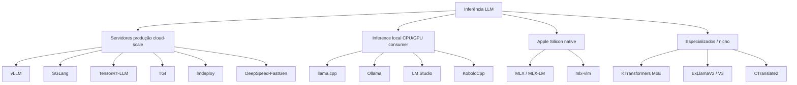
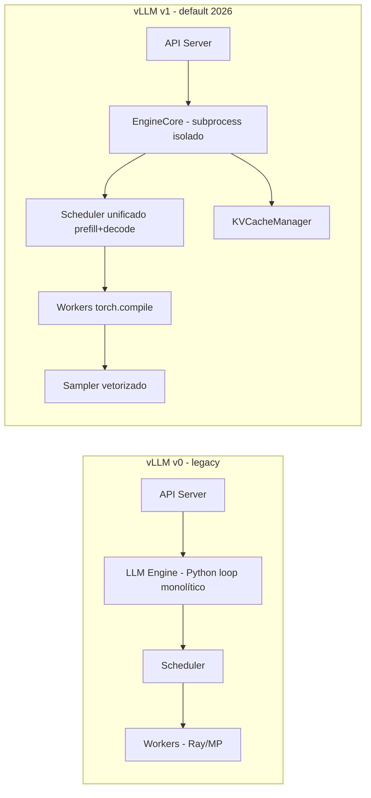
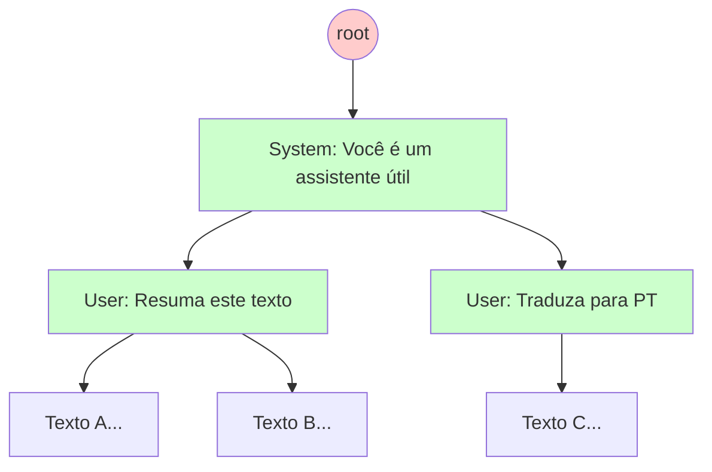
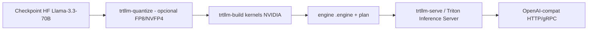
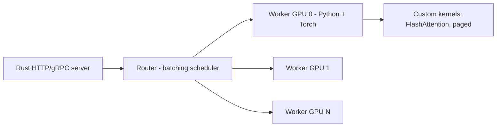
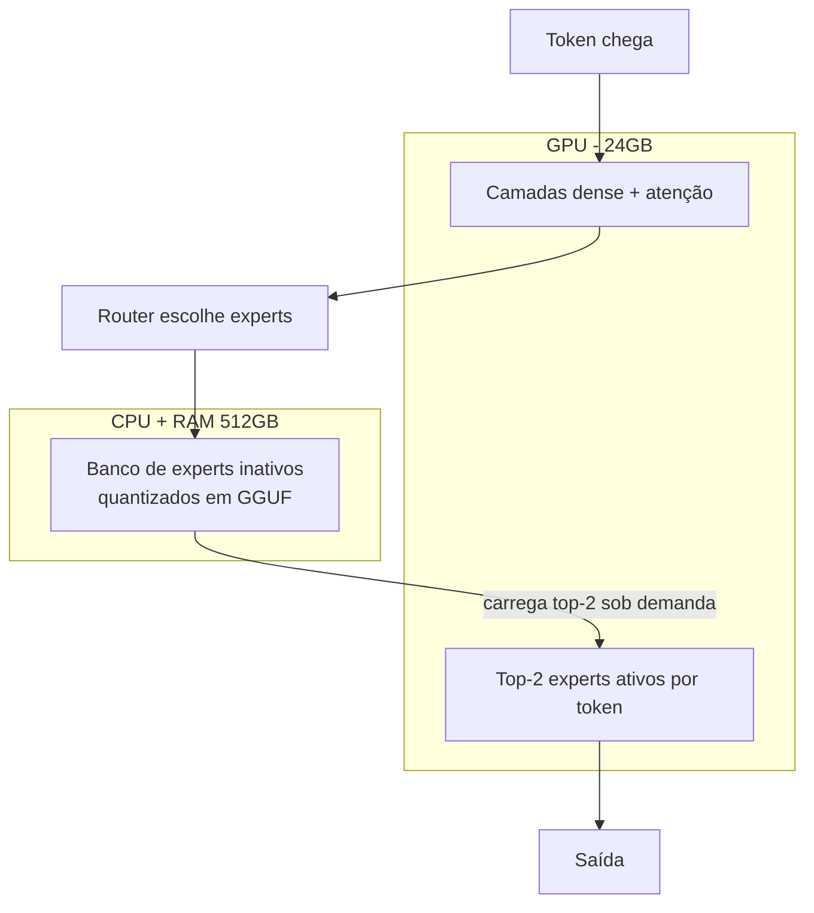
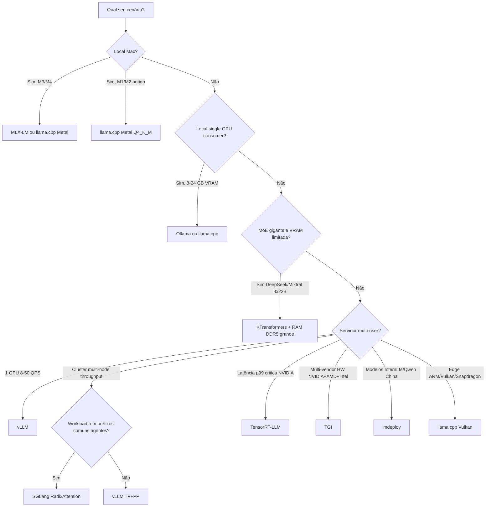
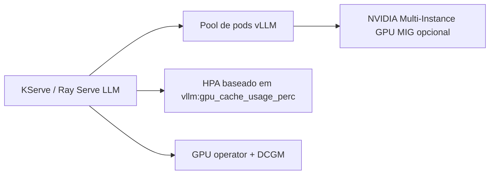
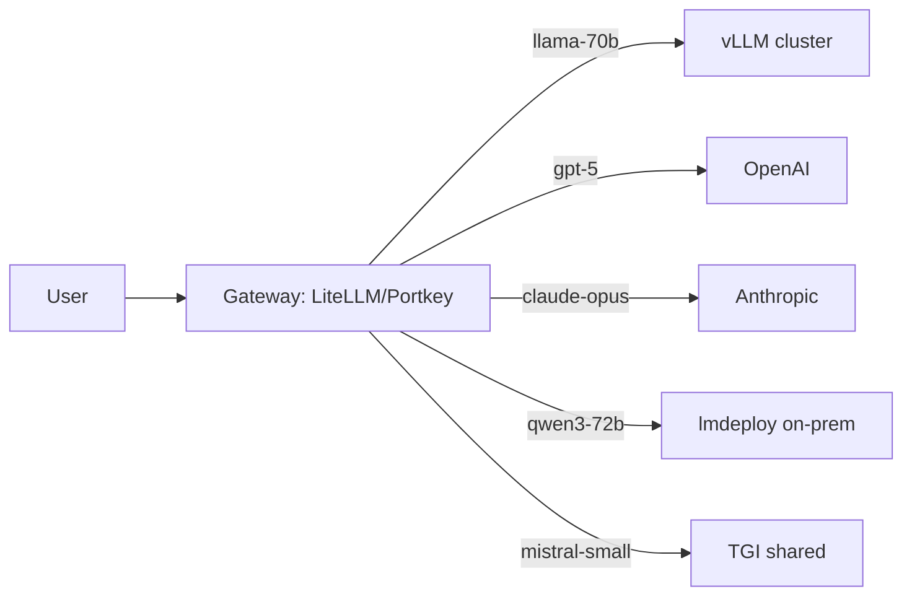
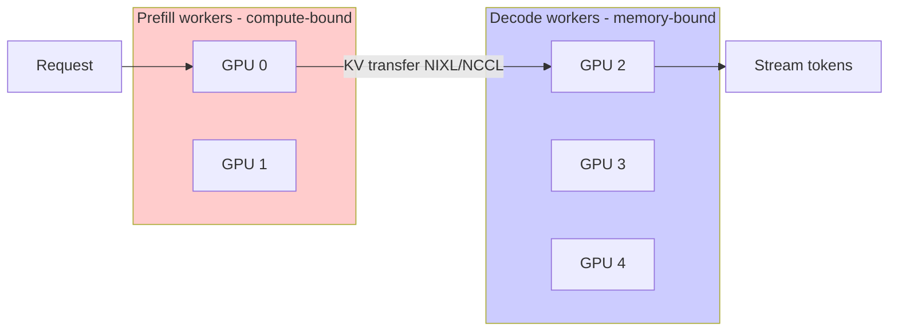

# 11 — Frameworks de Inferência LLM em 2026: vLLM, SGLang, TensorRT-LLM, TGI, llama.cpp, Ollama, MLX e KTransformers lado a lado

> **Série:** LLMs em profundidade — Post 11 (HORIZONTAL: comparativo de implementações).
> **Posts irmãos:** [01 Transformer](01-arquitetura-transformer-decoder-llm.md) · [02 Attention](02-attention-mha-mqa-gqa-mla-flashattention.md) · [03 KV cache + PagedAttention](03-kv-cache-anatomia-pagedattention-vllm.md) · [04 Quant pesos](04-quantizacao-pesos-gptq-awq-gguf-bitsandbytes.md) · [05 Quant KV](05-quantizacao-kv-cache-kivi-kvquant-cachegen.md) · [06 TurboQuant](06-turboquant-deep-dive-polar-jl-lloydmax.md) · [07 Contexto longo](07-contexto-longo-rope-yarn-ring-streaming.md) · [08 Sparsity / Speculative / MoE](08-alem-quantizacao-sparsity-speculative-moe-distillation.md).
> **Foco deste post:** **qual framework usar** para servir LLMs em 2026, **como configurá-lo na prática** e **quando trocar de barco**. Os algoritmos (PagedAttention, KV quant, speculative, etc.) já foram dissecados nos posts anteriores — aqui interessa a **embalagem**.

> **Convenções:**
> - Comandos testados em Linux / NVIDIA H100 (CUDA 12.4+) salvo nota.
> - Referências cruzadas no formato `[Post N](...)`.
> - Diagramas em Mermaid; tabelas master no final de cada bloco.

---

## Índice

1. [Pré-requisitos e escopo](#1-pré-requisitos-e-escopo)
2. [Por que existem tantos frameworks (taxonomia 2026)](#2-por-que-existem-tantos-frameworks-taxonomia-2026)
3. [vLLM — TaaS pronto, feature-rich e multiuso](#3-vllm--taas-pronto-feature-rich-e-multiuso)
4. [SGLang — vLLM com IDE para programar conversas](#4-sglang--vllm-com-ide-para-programar-conversas)
5. [TensorRT-LLM — A Ferrari da NVIDIA](#5-tensorrt-llm--a-ferrari-da-nvidia)
6. [TGI — O carro de empresa europeia: confiável e roda em todo HW](#6-tgi--o-carro-de-empresa-europeia-confiável-e-roda-em-todo-hw)
7. [llama.cpp — A Toyota Hilux dos LLMs](#7-llamacpp--a-toyota-hilux-dos-llms)
8. [Ollama — llama.cpp com adesivo bonito](#8-ollama--llamacpp-com-adesivo-bonito)
9. [MLX e MLX-LM — O elétrico Apple](#9-mlx-e-mlx-lm--o-elétrico-apple)
10. [LM Studio — GUI de mesa para devs preguiçosos](#10-lm-studio--gui-de-mesa-para-devs-preguiçosos)
11. [KTransformers — A carona inteligente para MoE gigantes](#11-ktransformers--a-carona-inteligente-para-moe-gigantes)
12. [lmdeploy — A força silenciosa que vem da China](#12-lmdeploy--a-força-silenciosa-que-vem-da-china)
13. [DeepSpeed-FastGen / MII — O legado Microsoft](#13-deepspeed-fastgen--mii--o-legado-microsoft)
14. [Tabela master comparativa](#14-tabela-master-comparativa)
15. [Benchmarks reproduzíveis (Llama 70B, Mixtral, DeepSeek)](#15-benchmarks-reproduzíveis-llama-70b-mixtral-deepseek)
16. [Decision tree (qual escolher?)](#16-decision-tree-qual-escolher)
17. [Receitas de produção](#17-receitas-de-produção)
18. [Observabilidade e operações](#18-observabilidade-e-operações)
19. [Roteamento e LLM gateways](#19-roteamento-e-llm-gateways)
20. [Tendências 2025–2026 (disaggregated, LMCache, NIXL, MoE kernels)](#20-tendências-20252026-disaggregated-lmcache-nixl-moe-kernels)
21. [Cross-references](#21-cross-references)
22. [Referências](#22-referências)

---

## 1. Pré-requisitos e escopo

**Pré-requisitos:**
- Conhecer arquitetura Transformer decoder ([Post 01](01-arquitetura-transformer-decoder-llm.md)).
- Saber o que é KV cache e por que ele cresce ([Post 03](03-kv-cache-anatomia-pagedattention-vllm.md)).
- Familiaridade com quantização de pesos e KV ([Post 04](04-quantizacao-pesos-gptq-awq-gguf-bitsandbytes.md), [Post 05](05-quantizacao-kv-cache-kivi-kvquant-cachegen.md)).
- Noções de speculative decoding e MoE ([Post 08](08-alem-quantizacao-sparsity-speculative-moe-distillation.md)).

**Escopo (anti-overlap):**
- **NÃO** vamos reexplicar PagedAttention internals, KV quant matemático ou TurboQuant — tudo isso já está em posts dedicados.
- **SIM**, vamos comparar implementações, configurações e quando cada uma brilha.
- O foco é **2026**: ecossistema pós-vLLM v1, pós-SGLang com EAGLE3, pós-NVIDIA Blackwell e pós-DeepSeek-V3 democratizado.

> **Aviso prático:** o universo de inferência muda mês a mês. Sempre que possível, este post linka *primary sources* (release notes, papers) para você re-verificar.

---

## 2. Por que existem tantos frameworks (taxonomia 2026)

LLMs são pesados, exigentes e cada caso de uso pede compromissos diferentes. O ecossistema explodiu em **três grandes nichos**, cada um com 2–4 jogadores principais:



### 2.1. Tabela: framework × público-alvo × licença × mantenedor

| Framework | Nicho | Público-alvo principal | Licença | Mantenedor 2026 |
|---|---|---|---|---|
| **vLLM** | Cloud server | Plataformas SaaS, internas, multi-tenant | Apache 2.0 | Red Hat (ex-Neural Magic) + UC Berkeley + comunidade |
| **SGLang** | Cloud server | Agentes, RAG complexo, structured generation | Apache 2.0 | LMSYS / Stanford + comunidade |
| **TensorRT-LLM** | Cloud server | Latência crítica em NVIDIA | Apache 2.0 (kernels FP4 fechados) | NVIDIA |
| **TGI** | Cloud server | Enterprise multi-vendor HW | Apache 2.0 (com cláusula HFOIL para uso pago) | Hugging Face |
| **lmdeploy** | Cloud server | Modelos InternLM/Qwen, mercado chinês | Apache 2.0 | Shanghai AI Lab / OpenMMLab |
| **DeepSpeed-MII** | Cloud server | Pipelines Microsoft Azure | Apache 2.0 | Microsoft |
| **llama.cpp** | Local | Hobbyist, edge, ARM, lab pessoal | MIT | ggml.ai (ggerganov) |
| **Ollama** | Local | Devs querendo "rode em 5 min" | MIT | Ollama Inc. |
| **LM Studio** | Local | Não-devs querendo GUI | Proprietário (free uso pessoal) | LM Studio Inc. |
| **MLX / MLX-LM** | Local Apple | Mac M-series, devs Apple | MIT | Apple ML Research |
| **KTransformers** | Especializado | MoE gigantes em hardware modesto | Apache 2.0 | KVCache.AI / THUDM |

> **Insight:** quase todos open-source, quase todos Apache 2.0. O ecossistema é colaborativo — kernels do vLLM aparecem no SGLang, otimizações do llama.cpp viram base do Ollama, e quando a NVIDIA lança um kernel novo geralmente vira PR em vários ao mesmo tempo.

---

## 3. vLLM — TaaS pronto, feature-rich e multiuso

> **Analogia:** vLLM é o **TaaS pronto** (Truck-as-a-Service, ou “Tudo-as-a-Service” se preferir): você pega o caminhão, já sai dirigindo, faz delivery, faz mudança, faz food truck. Não é o mais rápido em nenhuma dimensão, mas é o que **funciona com tudo**.

### 3.1. Origem e linha do tempo

- **2023 (set):** Woosuk Kwon et al. publicam o paper *Efficient Memory Management for Large Language Model Serving with PagedAttention* (arXiv:2309.06180), nascido em UC Berkeley.
- **2023 (out):** primeira release pública.
- **2024:** Neural Magic adquirida pela Red Hat. Equipe vLLM passa a ter financiamento corporativo estável.
- **2025 (jan):** anúncio do **vLLM v1**, reescrita arquitetural completa.
- **2026:** v1 é o **default**; v0 marcado como legacy.

### 3.2. Arquitetura v0 vs v1 (alto nível)



**Mudanças-chave da v1:**
1. `EngineCore` roda em subprocess separado: CPU (tokenização, logging, métricas) **não** disputa GIL com o forward pass.
2. Scheduler **unifica** prefill e decode — não há mais "step de prefill" vs "step de decode"; tudo é um dicionário `{request_id: num_tokens}`. Chunked prefill e prefix caching ficaram naturais.
3. `torch.compile` aplicado por padrão nos forward passes (com fallback graceful).
4. Sampler reescrito para ser totalmente em GPU (sem `torch -> numpy -> torch`).
5. APC (Automatic Prefix Caching) integrado no `KVCacheManager`, não como camada bolt-on.

### 3.3. Componentes principais

| Componente | Responsabilidade | Detalhe relevante |
|---|---|---|
| **API Server** (`vllm.entrypoints`) | OpenAI-compat (`/v1/chat/completions`, `/v1/completions`) | Async FastAPI; suporte a tools, JSON mode |
| **EngineCore** | Loop principal; orquestra scheduler + workers | Subprocess isolado (v1) |
| **Scheduler** | Decide quais requests entram no próximo step | Continuous batching nativo desde 2023 |
| **Worker** | Executa forward pass em 1 GPU (TP shard) | `torch.compile` com cudagraph |
| **BlockManager** / **KVCacheManager** | Aloca blocks de KV (PagedAttention, ver [Post 03](03-kv-cache-anatomia-pagedattention-vllm.md)) | APC, eviction LRU |
| **Sampler** | Top-k, top-p, temperatura, logit bias | Totalmente em GPU |

### 3.4. Recursos suportados (cheat sheet)

- **Continuous batching** ✓ (default).
- **Tensor parallel (TP)** ✓ (`--tensor-parallel-size`).
- **Pipeline parallel (PP)** ✓ (`--pipeline-parallel-size`) — útil para clusters multi-node.
- **Expert parallel (EP)** ✓ (para MoE; `--enable-expert-parallel`).
- **Quantizações:** AWQ, GPTQ, **FP8** (E4M3/E5M2), INT8 W8A8, BNB (4/8 bit), GGUF (parcial — não todas as quants), Marlin (kernel GPTQ-INT4 rápido), **Machete** (kernel novo INT4 W4A16 da NVIDIA, default em SM89+).
- **KV-cache dtype:** `fp8_e4m3`, `fp8_e5m2`, `int8`, `auto`.
- **LoRA hot-swap** ✓ (multi-adapter; `--enable-lora`, até 32 adapters simultâneos default).
- **Speculative decoding** ✓ via `--speculative-config` (suporta draft model, n-gram, EAGLE-2/3, Medusa).
- **APC (Automatic Prefix Caching)** ✓ (`--enable-prefix-caching`).
- **Chunked prefill** ✓ (`--enable-chunked-prefill`, default em v1).
- **Multimodal:** Llama-3.2-Vision, Qwen2-VL, LLaVA, Pixtral, MiniCPM-V, Idefics, etc.
- **Modelos:** 100+ — Llama (1, 2, 3.x, 4), Qwen 2/3, Mistral, Mixtral, DeepSeek (V2/V3/R1), Gemma 1/2/3, Phi, Granite, Command-R, etc.

### 3.5. Comando de produção (Llama 3.1 70B FP8 em 4×H100)

```bash
vllm serve meta-llama/Llama-3.1-70B-Instruct \
  --tensor-parallel-size 4 \
  --quantization fp8 \
  --kv-cache-dtype fp8_e4m3 \
  --max-model-len 32768 \
  --enable-prefix-caching \
  --enable-chunked-prefill \
  --speculative-config '{"model": "meta-llama/Llama-3.2-1B-Instruct", "num_speculative_tokens": 4}' \
  --gpu-memory-utilization 0.92 \
  --port 8000
```

**Tradução:**
- `--quantization fp8` aplica FP8 dynamic em weights; **não** confunda com FP8 KV (`--kv-cache-dtype fp8_e4m3`) — ver [Post 05](05-quantizacao-kv-cache-kivi-kvquant-cachegen.md).
- `--gpu-memory-utilization 0.92` deixa 8 % livres para CUDA buffers e pico de fragmentação.
- O draft model (Llama-3.2-1B) tem que compartilhar tokenizer com o target.

### 3.6. Pontos fortes / fracos

| Forças | Fraquezas |
|---|---|
| Maior comunidade open-source de inference (50k+ stars) | MoE ainda atrás de SGLang em throughput |
| Compat HF total (1 linha pra trocar modelo) | TP > 8 sofre com all-reduce; PP é a saída mas adiciona complexidade |
| Roadmap rápido (~release/mês) | Sampler legado tinha bugs em batch grande (resolvido em v1) |
| Integração K8s madura (KServe, Ray Serve) | LoRA serving ainda tem overhead vs single-adapter dedicado |
| Default em quase toda startup AI 2024–2026 | Build do source (kernels CUDA) é pesado — use wheel pré-compilada |

---

## 4. SGLang — vLLM com IDE para programar conversas

> **Analogia:** SGLang é o **vLLM com IDE para programar conversas**. Tem o backend rápido, mas vem com uma **DSL** que deixa você escrever fluxos multi-turn, ramificações, escolhas restritas, JSON mode — tudo direto no Python como se fosse um framework de prompt-as-code.

### 4.1. Origem e proposta

- **Paper:** *SGLang: Efficient Execution of Structured Language Model Programs* (Zheng et al., arXiv:2312.07104; **submetido dez/2023**, refinado 2024).
- **Equipe:** mistura de Stanford + UC Berkeley + LMSYS (mesmo grupo do Chatbot Arena).
- **Insight central:** muitas aplicações LLM (RAG, agentes, batch evaluation) **compartilham prefixos** entre requests. Cachear esse prefixo de forma estruturada (em árvore radix) economiza recompute do KV.

### 4.2. RadixAttention — o coração do SGLang



Cada nó é um **prefixo cacheado em KV** (em VRAM). Quando uma nova request chega, SGLang faz **prefix matching** na árvore — se ela compartilha system + user prefix, só recomputa o sufixo divergente. Para um agent loop com 50 ferramentas e prompt do sistema de 4 KB, a economia é dramática.

> **Diferença vs APC do vLLM:** APC do vLLM também faz prefix caching, mas em **hash linear** (chave = hash do bloco). RadixAttention organiza em **árvore explícita**, o que torna eviction mais inteligente em workloads com **muitos prefixos compartilhados parciais** (típico de agentes).

### 4.3. SGLang Frontend (DSL)

```python
import sglang as sgl

@sgl.function
def multi_turn_qa(s, question: str):
    s += sgl.system("Você é um assistente conciso e direto.")
    s += sgl.user(question)
    s += sgl.assistant(sgl.gen("answer", max_tokens=200, temperature=0.2))

@sgl.function
def multi_choice(s, q, choices):
    s += sgl.user(q)
    s += sgl.assistant("A resposta é: " +
                       sgl.gen("ans", choices=choices))  # restringe o output

state = multi_turn_qa.run(question="Quem foi Turing?", backend=sgl.RuntimeEndpoint("http://localhost:30000"))
print(state["answer"])
```

Recursos da DSL:
- `sgl.gen(name, max_tokens, temperature, regex, choices)` — geração restrita.
- `sgl.select(...)` — escolha entre alternativas.
- **Fork/parallel:** `sgl.fork(n)` lança N continuações em paralelo (útil para self-consistency / best-of-N).
- **JSON mode** com xgrammar (gramática livre de contexto compilada para FSM).

### 4.4. Recursos do backend

- Continuous batching, FP8, INT8, AWQ, GPTQ.
- KV-cache dtype: `fp8_e4m3`, `fp8_e5m2`, `int8`.
- **EAGLE-3** integrado nativamente (defaults: `speculative_num_steps=5`, `speculative_eagle_topk=4`, `speculative_num_draft_tokens=8`). Ganhos típicos 1.5–2.4× em throughput single-stream.
- Multi-LoRA serving.
- **Multimodal forte:** LLaVA, Qwen-VL, MiniCPM-V, Pixtral, InternVL — frequentemente o **primeiro** framework a suportar VLM novo.
- Disaggregated prefill/decode (em alfa).

### 4.5. Comando de produção

```bash
python -m sglang.launch_server \
  --model meta-llama/Llama-3.1-70B-Instruct \
  --tp 4 \
  --kv-cache-dtype fp8_e5m2 \
  --enable-prefix-caching \
  --speculative-algorithm EAGLE3 \
  --speculative-draft-model-path lmsys/sglang-EAGLE3-Llama-3.1-Instruct-70B \
  --speculative-num-steps 5 \
  --speculative-eagle-topk 4 \
  --speculative-num-draft-tokens 8 \
  --port 30000
```

### 4.6. Pontos fortes / fracos

| Forças | Fraquezas |
|---|---|
| RadixAttention vence APC quando há ramificação de prefixo (agentes) | Comunidade ~1/3 do tamanho de vLLM |
| EAGLE-3 oficial, com pesos prontos no HF (lmsys/sglang-EAGLE3-*) | Menos integrações cloud (KServe, Ray) prontas |
| DSL frontend única no mercado (gen restrita, fork, JSON) | Documentação ainda em catch-up |
| Frequentemente 1° a suportar VLM novo | TP grande pode ter quirks (resolvidos PR a PR) |
| Throughput superior em Llama 3 8B (~29 % vs vLLM) | Em Llama 70B a diferença vs vLLM é modesta (≤10 %) |

---

## 5. TensorRT-LLM — A Ferrari da NVIDIA

> **Analogia:** **Ferrari da NVIDIA: rapidíssimo, mas precisa montar.** Você não “roda” um modelo; você **compila um engine** TensorRT (`.engine`) específico para a sua GPU, max-batch, max-seq-len. Trade-off: latência mínima, mas mudou o `max_batch_size`? Recompila.

### 5.1. Filosofia

TRT-LLM é um **compiler + runtime**: pega um checkpoint HF, gera um grafo otimizado (FlashAttention, FlashMLA, fused norms, fused attention+gemm) e empacota em um `.engine` que o **TensorRT runtime** executa. Cada engine é casado com:

- Modelo + quantização (FP16, BF16, FP8 E4M3, INT8 W8A8, INT4 W4A16 AWQ/GPTQ, **NVFP4** Blackwell).
- Hardware (sm_80=A100, sm_89=L4/L40S/4090, sm_90=H100, sm_100=B200/B300/GB200/GB300).
- Parâmetros: `max_batch_size`, `max_input_len`, `max_seq_len`, `tp`, `pp`.

### 5.2. Pipeline build → serve



### 5.3. Recursos 2026 (release 1.2+)

- **NVFP4** (4-bit float Blackwell): pesos e KV. Para modelos validados (Llama-3.3-70B, Qwen3, Phi-4) o recipe é estável.
- **In-flight batching** (= continuous batching).
- **FlashMLA** para DeepSeek-V3/R1 (kernel custom para Multi-head Latent Attention).
- **CuteDSL grouped GEMM** (Blackwell) — kernels gerados via DSL CUTLASS.
- **Multi-LoRA serving**.
- Speculative: Medusa, EAGLE, draft-target.
- **Prefix caching** (chamado “KV cache reuse”, equivalente a APC).
- DGX Spark beta para inferência single-node mid-tier.

### 5.4. Comando build + serve

```bash
# Quantizar (opcional, gera checkpoint FP8 com ModelOpt)
trtllm-quantize \
  --hf_model_dir meta-llama/Llama-3.3-70B-Instruct \
  --output_dir llama70b-fp8/ \
  --dtype bfloat16 \
  --qformat fp8 \
  --kv_cache_dtype fp8 \
  --calib_size 512

# Build engine
trtllm-build \
  --checkpoint_dir llama70b-fp8/ \
  --output_dir engine/ \
  --gemm_plugin fp8 \
  --gpt_attention_plugin fp8 \
  --kv_cache_type fp8 \
  --max_batch_size 64 \
  --max_input_len 32768 \
  --max_seq_len 33792 \
  --tp_size 4 \
  --use_paged_context_fmha enable

# Serve via trtllm-serve (OpenAI-compat) com 4 ranks
mpirun -n 4 trtllm-serve serve engine/ \
  --host 0.0.0.0 --port 8000 \
  --tokenizer meta-llama/Llama-3.3-70B-Instruct
```

> **Custo do build:** 5–40 min dependendo do modelo. Cache o `engine/` em S3/registry para CI.

### 5.5. Quando vale a pena

| Vale | Não vale |
|---|---|
| Latência p99 crítica (chat real-time, voice) | Você troca `max_batch_size` toda semana |
| HW NVIDIA top (H100/H200/B200) | Multi-vendor (AMD/Intel) |
| Ops madura: cluster fixo, modelos fixos | Lab / experimentação rápida |
| Workload de poucos modelos servidos por anos | Fleet com 50 modelos diferentes |
| Você quer extrair os últimos 10–20 % de latência | Ecossistema-first (use vLLM) |

### 5.6. Pontos fortes / fracos

| Forças | Fraquezas |
|---|---|
| Latência p50/p99 frequentemente líder em NVIDIA | Build step quebra quando muda parâmetro |
| Kernels FP8/NVFP4 mais maduros do mundo | Lock-in NVIDIA (zero portabilidade) |
| Triton Inference Server como front-end (gRPC, batching, model repo) | Curva de aprendizado íngreme |
| Suporte first-party da NVIDIA (issues atendidas rápido) | Quando vLLM/SGLang melhoram FP8, gap diminui |

---

## 6. TGI — O carro de empresa europeia: confiável e roda em todo HW

> **Analogia:** **carro de empresa europeia: confiável, todo HW.** Não é o mais rápido, mas roda em **NVIDIA, AMD ROCm, Intel Habana Gaudi, AWS Inferentia/Trainium**. Foi o **primeiro grande open-source server** (2022/2023) e ainda é o backend padrão do Inference Endpoints da Hugging Face.

### 6.1. Histórico

- **2022:** primeiros commits no `text-generation-inference`, escrito em **Rust** (HTTP server) + **Python** (model code).
- **2023:** ganhou continuous batching, FlashAttention.
- **2024:** integrou paged attention (port do vLLM); ganhou suporte AMD/Intel.
- **2025–2026:** versão 3.x com FP8, EETQ, melhor suporte multimodal e Anthropic Messages API.

### 6.2. Stack técnica



- O **router** (Rust) faz batching e dispatch.
- Workers Python rodam Torch/TGI custom kernels.
- Suporta **NCCL** (NVIDIA), **RCCL** (AMD), HPU (Habana), Neuron (AWS).

### 6.3. Recursos

- Continuous batching ✓.
- Quantizações: AWQ, GPTQ, EETQ, BNB, FP8.
- Speculative decoding (draft model + Medusa).
- Multi-LoRA.
- Multimodal: Idefics, LLaVA-Next, PaliGemma, Qwen2-VL.
- **Multi-vendor HW**: NVIDIA, AMD ROCm, Intel Gaudi, AWS Inferentia.

### 6.4. Comando Docker

```bash
docker run --gpus all --shm-size 1g \
  -p 8080:80 \
  -v $PWD/data:/data \
  -e HF_TOKEN=$HF_TOKEN \
  ghcr.io/huggingface/text-generation-inference:3.0.0 \
  --model-id meta-llama/Llama-3.1-70B-Instruct \
  --num-shard 4 \
  --quantize fp8 \
  --max-input-tokens 32768 \
  --max-total-tokens 33792 \
  --max-batch-prefill-tokens 65536
```

### 6.5. Pontos fortes / fracos

| Forças | Fraquezas |
|---|---|
| Suporte HW mais amplo do mercado | Throughput tipicamente 10–30 % abaixo de vLLM/SGLang em NVIDIA |
| Docker first-class (HF empurra esse uso) | Licença HFOIL adiciona fricção em uso comercial pago* |
| Backend do HF Inference Endpoints (testado em escala) | Rust dificulta contribuição da comunidade Python |
| Anthropic Messages API + tool calling out-of-box | Prefix caching menos avançado |

> *HFOIL exige acordo comercial se você revende inferência via TGI. Para uso interno é livre.

---

## 7. llama.cpp — A Toyota Hilux dos LLMs

> **Analogia:** **Toyota Hilux: roda em qualquer terreno.** CPU x86, ARM (incluindo Raspberry Pi), GPU NVIDIA, AMD, Intel, Apple Metal, Vulkan, SYCL. Não é o mais rápido em servidor, mas é **inquebrável**.

### 7.1. Origem mítica

- **Mar/2023:** Georgi Gerganov publica `llama.cpp` num fim de semana, rodando Llama 1 em CPU Mac via SIMD intrinsics.
- **Hoje (2026):** **>70 k stars no GitHub**, base de Ollama, LM Studio, Jan, Continue.dev, GPT4All, e parte do stack de Apple, Microsoft Phi Silica, Qualcomm.
- Escrito em C/C++ puro; Python só nos bindings (`llama-cpp-python`).

### 7.2. Formato GGUF

GGUF (GGML Universal Format) embute **tudo**:
- Pesos quantizados (Q2_K, Q3_K_S/M/L, Q4_K_S/M, Q5_K_M, Q6_K, Q8_0, IQ-quants 1–4 bit com matriz de importância).
- Tokenizer (BPE/SentencePiece embutido).
- Hyperparams (RoPE base, n_layers, n_heads, GQA params).
- Chat template.

> **Ver [Post 04](04-quantizacao-pesos-gptq-awq-gguf-bitsandbytes.md)** para detalhes da família K-quants e IQ-quants.

### 7.3. Recursos do `llama-server`

- **OpenAI-compat** (`/v1/chat/completions`, `/v1/completions`, `/v1/embeddings`).
- **Anthropic Messages API** (a partir de 2026).
- **Continuous batching** + **parallel decoding** multi-user.
- **Speculative decoding**:
  - **Draft model** (`--draft`): tradicional.
  - **N-gram self-speculative** (`ngram-simple`, `ngram-map-k`, `ngram-map-k4v`, `ngram-mod`): especialmente bom para código (até +50 % em refactor).
- **KV-cache quantization** via `--cache-type-k`, `--cache-type-v` (`q8_0`, `q4_0`, `q5_0`).
- **Tool/function calling**, JSON schema constrained (gramática GBNF).
- **Multimodal**: LLaVA, Gemma 4 (audio incluso!), Qwen2-VL via clip.cpp.
- **imatrix calibration** para low-bit quants (calcula importance matrix em texto representativo, recupera 1–3 pp em perplexidade).

### 7.4. Comando produção (Llama 70B Q4_K_M + draft 1B Q8)

```bash
./build/bin/llama-server \
  -m models/llama-3.1-70b-instruct.Q4_K_M.gguf \
  -ngl 99 \
  -c 32768 \
  --cache-type-k q8_0 --cache-type-v q8_0 \
  --draft models/llama-3.2-1b-instruct.Q8_0.gguf \
  --draft-max 8 --draft-min 2 \
  --parallel 4 \
  --port 8080 --host 0.0.0.0
```

- `-ngl 99` joga todas as layers para a GPU (mude para 40 se a VRAM for limitada).
- `--parallel 4` permite 4 sessões concorrentes (compartilhando KV pool).

### 7.5. Pontos fortes / fracos

| Forças | Fraquezas |
|---|---|
| Portabilidade absoluta (Pi 5, Snapdragon, x86, M-series, datacenter) | Throughput multi-user atrás de vLLM/SGLang em GPU única |
| GGUF universal — milhares de modelos no HF prontos | Configuração ad-hoc (flags caóticas; defaults variam por release) |
| Comunidade gigante (ggml-org) — features novas semanais | Não otimizado para batch grande (foco single-user) |
| Tool calling, audio, imagem — tudo no mesmo binário | Multi-tenant isolation limitado |
| Quantizações low-bit melhores que GGUF original (IQ family) | LoRA serving rudimentar |

---

## 8. Ollama — llama.cpp com adesivo bonito

> **Analogia:** **llama.cpp com adesivo bonito.** Pega o motor do Gerganov, adiciona uma CLI estilo Docker (`ollama pull`, `ollama run`), Modelfile inspirado em Dockerfile e expõe API OpenAI-compat na porta `:11434`.

### 8.1. Proposta

Reduzir o "tempo do desejo até o primeiro token" para **1 minuto**. Funciona em macOS, Linux, Windows. Sem build, sem flag, sem GGUF para baixar manualmente.

### 8.2. Comandos essenciais

```bash
# Instalar
curl -fsSL https://ollama.com/install.sh | sh

# Baixar e rodar
ollama pull llama3.1:70b
ollama run llama3.1:70b

# Servidor já está em http://localhost:11434
curl http://localhost:11434/v1/chat/completions \
  -H "Content-Type: application/json" \
  -d '{"model":"llama3.1:70b","messages":[{"role":"user","content":"oi"}]}'
```

### 8.3. Modelfile

```
FROM llama3.1:70b
PARAMETER temperature 0.2
PARAMETER num_ctx 16384
SYSTEM """Você é um revisor de código sênior.
Responda em PT-BR, conciso, com exemplos."""
```

```bash
ollama create code-reviewer -f Modelfile
ollama run code-reviewer
```

### 8.4. Pontos fortes / fracos

| Forças | Fraquezas |
|---|---|
| Onboarding zero-config (1 min) | Limitado às quantizações GGUF do llama.cpp |
| Library curada de modelos populares | Sem batching avançado (multi-user serve mas degrada rápido) |
| Cross-platform binário único | Algumas flags do llama.cpp não expostas |
| Integra com IDE (Continue, Zed, Cursor) | Ecossistema corporativo não o vê como prod-ready em escala |
| Modelfile é gostoso de versionar | Modelfile não cobre todos os casos avançados |

---

## 9. MLX e MLX-LM — O elétrico Apple

> **Analogia:** **carro elétrico Apple: só funciona no garage da Apple, mas é silencioso e lindo.** MLX é o NumPy/JAX da Apple, desenhado do zero para **unified memory** dos chips M-series.

### 9.1. Proposta MLX

- Array library NumPy-like, lazy execution + composable transforms (`grad`, `vmap`, `jit`).
- **Unified memory:** CPU e GPU compartilham o mesmo pool físico — não há `to(device)` custoso.
- Ótimo para **fine-tuning local + inference** em laptops/desktops Apple (M1/M2/M3/M4 Ultra com até 192 GB unified).

### 9.2. MLX-LM

CLI dedicada para LLMs:

```bash
pip install mlx-lm

# Gerar
mlx_lm.generate \
  --model mlx-community/Llama-3.1-70B-Instruct-4bit \
  --prompt "Explique gravidade quântica em 1 parágrafo." \
  --max-tokens 256

# Servir (OpenAI-compat)
mlx_lm.server \
  --model mlx-community/Llama-3.1-70B-Instruct-4bit \
  --port 8080
```

### 9.3. Quantizações MLX

- 2-bit, 3-bit, 4-bit, 6-bit, 8-bit (per-group; group_size típico 64).
- Comunidade `mlx-community` no HF mantém milhares de modelos pré-quantizados.
- LoRA fine-tuning suportado via `mlx_lm.lora`.

### 9.4. mlx-vlm (multimodal)

```bash
pip install mlx-vlm
mlx_vlm.generate \
  --model mlx-community/Qwen2-VL-7B-Instruct-4bit \
  --image foto.jpg \
  --prompt "O que tem nesta imagem?"
```

### 9.5. Pontos fortes / fracos

| Forças | Fraquezas |
|---|---|
| **A** opção em Apple Silicon (M3/M4 Ultra com 192 GB acomoda 70B em FP16) | Só Apple — zero NVIDIA/AMD |
| Unified memory acaba com gargalo CPU↔GPU | Ecossistema menor (sem TP, sem disagg) |
| Fine-tuning + inference no mesmo notebook | Quant menos sofisticada que GPTQ/AWQ (per-group simples) |
| `mlx-vlm` mantém VLMs em dia | Throughput multi-user limitado |

---

## 10. LM Studio — GUI de mesa para devs preguiçosos

- **GUI desktop** (Windows / macOS / Linux).
- **Backends:** llama.cpp (todos os HW) + MLX (Apple).
- Discovery, download, chat, e **server local** OpenAI-compat com 1 clique.
- **Licença:** proprietária; uso pessoal e *small commercial* gratuito (ver termos).
- Excelente para **não-devs** ou para demonstrar LLM local em workshop.

| Quando usar | Quando evitar |
|---|---|
| Workshop, palestras, demo a stakeholder | Pipeline CI/CD |
| Desktop de analista que não quer terminal | Servidor headless |
| Comparar modelos baixados rapidamente | Compliance (proprietário) |

---

## 11. KTransformers — A carona inteligente para MoE gigantes

> **Analogia:** **carona inteligente: pega MoE grande e usa CPU+GPU em vez de GPU enorme.** O caso emblemático: **DeepSeek-V3/R1 (671B parâmetros, 37B ativos)** rodando em **1×RTX 4090 (24 GB) + 512 GB de RAM DDR5** a 8–11 tok/s — 2× mais rápido que llama.cpp no mesmo HW.

### 11.1. Como funciona (alto nível)



**Trick:** em MoE, só **2 experts** (de 256 no DeepSeek-V3) são ativados por token. KTransformers mantém os experts em **RAM** (quantizados), e só os 2 ativos cruzam o PCIe para a GPU. Como o expert ativado muda de token para token, o overhead se amortiza com batching.

### 11.2. Hardware de referência

| Cenário | HW | Performance |
|---|---|---|
| **Hobbyist** | i9 + 64 GB RAM + RTX 4090 | DeepSeek-V3 Q2_K_XL ~3–4 tok/s |
| **Workstation** | Xeon W7 + 256 GB + 4090 | ~6–8 tok/s |
| **Sweet spot** | Xeon Platinum 8480 + 512 GB DDR5 + 4090 | **8–11 tok/s** |
| **Pro** | EPYC 9654 + 1.5 TB DDR5 + H100 | 15–20 tok/s |

### 11.3. Quando usar

- Você **precisa** rodar DeepSeek-V3/R1, Mixtral 8×22B, Qwen3-235B, etc., **on-prem**, **sem 8×H100**.
- Latência tolerável (single-user, batch ≤ 4).
- Você tem **muita RAM barata** disponível.

### 11.4. Quando NÃO usar

- Workload throughput-focused (use vLLM/SGLang com TP em H100s).
- Latência p99 crítica.
- Modelo dense (sem MoE) — não há benefício, KTransformers é arquitetura para MoE.

---

## 12. lmdeploy — A força silenciosa que vem da China

- Mantenedor: **OpenMMLab / Shanghai AI Lab**.
- Kernel próprio: **TurboMind** (CUDA, FP16/BF16/INT4/FP8).
- Suporte first-class para **InternLM**, **Qwen** (1, 2, 2.5, 3), DeepSeek.
- INT4 AWQ + INT8 KV nativos (recipes prontos).
- Baixa fricção para deploy em provedores chineses (Alibaba, Tencent, Huawei Atlas).
- **Crescente adoção** em 2025–2026 conforme Qwen3 ganha mindshare global.

```bash
pip install lmdeploy

lmdeploy serve api_server \
  Qwen/Qwen3-72B-Instruct-AWQ \
  --tp 4 \
  --quant-policy 8 \
  --server-port 23333
```

Quando vale: você foca em modelos InternLM/Qwen e quer recipes batidos para INT4. Em modelos Llama, vLLM/SGLang ainda têm vantagem.

---

## 13. DeepSpeed-FastGen / MII — O legado Microsoft

- Paper original: **Dynamic SplitFuse** (2023) — antecipou chunked prefill.
- Hoje (2026) menos popular que vLLM/SGLang, mas:
  - Usado em alguns deployments Azure ML / NIM internos.
  - Forte integração com **DeepSpeed** training pipeline (mesmo time, mesma stack).
  - Bom em modelos Phi (Microsoft).

```bash
pip install deepspeed-mii
python -m mii.serve --model microsoft/Phi-3.5-mini-instruct
```

Geralmente quem escolhe DeepSpeed-MII já está no ecossistema DeepSpeed para treino e quer evitar duplicar stack.

---

## 14. Tabela master comparativa

> **Aviso:** valores qualitativos (✓✓✓ excelente, ✓✓ bom, ✓ existe-funciona, — não suporta, ⚠ parcial). Não substitui benchmark próprio.

| Eixo | vLLM v1 | SGLang | TRT-LLM | TGI | lmdeploy | llama.cpp | Ollama | MLX-LM | KTransformers |
|---|---|---|---|---|---|---|---|---|---|
| **Throughput multi-user (H100)** | ✓✓✓ | ✓✓✓ | ✓✓✓ | ✓✓ | ✓✓ | ✓ | ✓ | — | ⚠ |
| **Latência p99** | ✓✓ | ✓✓ | ✓✓✓ | ✓✓ | ✓✓ | ✓✓ | ✓ | ✓✓ | ⚠ |
| **VRAM eficiente** | ✓✓ | ✓✓ | ✓✓✓ | ✓✓ | ✓✓ | ✓✓✓ | ✓✓✓ | ✓✓✓ | ✓✓✓ |
| **AWQ/GPTQ** | ✓ | ✓ | ✓ | ✓ | ✓ | ⚠ | ⚠ | — | ⚠ |
| **FP8 weights** | ✓ | ✓ | ✓ | ✓ | ✓ | — | — | — | — |
| **FP8 KV cache** | ✓ | ✓ | ✓ | ✓ | ✓ | — | — | — | — |
| **NVFP4 (Blackwell)** | ⚠ | ⚠ | ✓ | — | — | — | — | — | — |
| **GGUF** | ⚠ | — | — | — | — | ✓✓✓ | ✓✓✓ | — | ✓ |
| **MLX 2/3/4/6/8 bit** | — | — | — | — | — | — | — | ✓✓✓ | — |
| **Speculative decoding** | ✓ (draft, EAGLE, Medusa) | ✓ (EAGLE-3 1° class) | ✓ (Medusa, EAGLE) | ✓ (draft, Medusa) | ⚠ | ✓ (draft, n-gram) | ⚠ (via llama.cpp) | ⚠ | — |
| **Prefix caching (APC)** | ✓ APC linear | ✓✓ RadixAttention tree | ✓ KV reuse | ⚠ | ⚠ | ⚠ | — | — | — |
| **Multi-LoRA serving** | ✓✓ (até 32 hot-swap) | ✓ | ✓ | ✓ | ⚠ | ⚠ | — | ✓ (1) | — |
| **Chunked prefill** | ✓ (default v1) | ✓ | ✓ | ✓ | ⚠ | — | — | — | — |
| **Multimodal (VLM)** | ✓✓ | ✓✓✓ (1° a suportar novos) | ✓ | ✓ | ⚠ | ✓ (LLaVA, Gemma 4 audio) | ✓ | ✓ (mlx-vlm) | — |
| **NVIDIA** | ✓ | ✓ | ✓✓✓ | ✓ | ✓ | ✓ | ✓ | — | ✓ |
| **AMD ROCm** | ✓ | ⚠ | — | ✓✓ | ⚠ | ✓ | ✓ | — | — |
| **Intel Gaudi/XPU** | ⚠ | ⚠ | — | ✓ | — | ✓ (SYCL) | ✓ | — | — |
| **Apple Silicon** | — | — | — | — | — | ✓✓ (Metal) | ✓✓ | ✓✓✓ | — |
| **CPU x86** | ⚠ | — | — | ⚠ | — | ✓✓✓ | ✓✓ | — | ✓✓ |
| **AWS Inferentia/Trainium** | — | — | — | ✓ | — | — | — | — | — |
| **OpenAI-compat API** | ✓ | ✓ | ✓ (via Triton) | ✓ | ✓ | ✓ | ✓ | ✓ | ⚠ |
| **K8s / KServe** | ✓✓ | ✓ | ✓ (NIM) | ✓✓ | ⚠ | ⚠ | ⚠ | — | — |
| **Mantenedor** | Red Hat + UCB | LMSYS + Stanford | NVIDIA | Hugging Face | OpenMMLab | ggml.ai | Ollama Inc. | Apple | KVCache.AI |
| **Licença** | Apache 2.0 | Apache 2.0 | Apache 2.0 (alguns kernels fechados) | Apache 2.0 (HFOIL) | Apache 2.0 | MIT | MIT | MIT | Apache 2.0 |
| **Maturidade** | ✓✓✓ | ✓✓ | ✓✓✓ | ✓✓✓ | ✓✓ | ✓✓✓ | ✓✓ | ✓✓ | ✓ |

---

## 15. Benchmarks reproduzíveis (Llama 70B, Mixtral, DeepSeek)

> **Setup padrão:** Llama-3.3-70B-Instruct, FP8 (weights + KV), 4×H100 SXM5 80 GB, NVLink, prompts ShareGPT, **100 concurrent users**, geração até 256 tokens. Valores aproximados, baseados em benchmarks públicos de fim de 2025/início de 2026 — varia ±15 % dependendo da release.

| Framework | Throughput (tok/s) | TTFT p50 (ms) | TTFT p99 (ms) | TPOT p50 (ms) | E2E p99 (s) |
|---|---|---|---|---|---|
| **vLLM v1** + FP8 + APC + speculative | **~2 400** | 180 | 480 | 32 | 2.6 |
| **SGLang** + FP8 + RadixAttn + EAGLE-3 | **~2 460** | 170 | 460 | 30 | 2.5 |
| **TRT-LLM 1.2** + FP8 + Medusa | **~2 600** | **140** | **390** | **27** | **2.2** |
| **TGI 3.0** + FP8 | ~1 900 | 220 | 580 | 38 | 3.1 |
| **lmdeploy** + FP8 | ~2 100 | 200 | 540 | 35 | 2.8 |

**Observações:**
- TRT-LLM lidera em latência, mas a margem caiu de 40 % (2024) para ~10 % (2026) graças ao trabalho da comunidade vLLM/SGLang.
- Em **single-stream** (1 concurrent), SGLang+EAGLE-3 lidera (até 2.4× speedup vs sem speculative).
- Em **Llama 3.1 8B**, SGLang abre vantagem de até **29 %** sobre vLLM (workload diferente, RadixAttention brilha mais com prefixos compartilhados).
- Em **8×H100 cluster**, vLLM por vezes ultrapassa SGLang (~10 %) por melhor distribuição PP/EP.

### 15.1. Mixtral 8×22B (FP8) — 4×H100

| Framework | Throughput (tok/s) | TTFT p50 (ms) |
|---|---|---|
| vLLM v1 (EP=4) | ~3 100 | 200 |
| SGLang (EP=4) | ~3 350 | 180 |
| TRT-LLM (EP=4) | ~3 500 | **150** |

### 15.2. DeepSeek-V3/R1 (671B / 37B ativos)

| Framework | Hardware | tok/s |
|---|---|---|
| vLLM v1 + FlashMLA | 8×H100 + NVLink | ~280 (single user) / ~1 800 (batch 64) |
| SGLang + FlashMLA | 8×H100 | ~290 / ~1 850 |
| TRT-LLM + FlashMLA | 8×H100 | ~320 / ~1 950 |
| **KTransformers** | 1×4090 + Xeon 8480 + 512 GB | **8–11** (single user) |
| llama.cpp Q4_K_M | 1×4090 + Xeon 8480 + 512 GB | ~4–5 |

### 15.3. Onde verificar números atualizados

- [vllm-project/vllm-benchmarks](https://github.com/vllm-project/vllm-benchmarks)
- [SGLang benchmarks](https://github.com/sgl-project/sglang/tree/main/benchmark)
- [LMSYS chatbot-arena (qualidade)](https://chat.lmsys.org)
- [NVIDIA NIM benchmark dashboard](https://nvidia.github.io/TensorRT-LLM/performance/perf-overview.html)
- [DeployBase comparativos](https://deploybase.ai/articles/best-llm-inference-engine)

> **Caveat sério:** benchmarks publicados raramente são reproduzíveis 1:1. Sempre rode no **seu** workload, com **suas** distribuições de seq-len, antes de decidir.

---

## 16. Decision tree (qual escolher?)



### 16.1. Resumo telegráfico

| Cenário | Recomendação | Por quê |
|---|---|---|
| Local Mac M3/M4 Ultra 192 GB | **MLX-LM** | Unified memory, modelos prontos `mlx-community` |
| Local Mac antigo / Linux laptop | **llama.cpp** ou **Ollama** | Portabilidade, GGUF |
| GPU consumer single (RTX 4090) | **Ollama** (zero config) ou **llama.cpp** (controle fino) | GGUF + draft model |
| Servidor 1×GPU multi-user (até 50 QPS) | **vLLM** | Maturidade, ecossistema |
| Cluster multi-node throughput puro | **vLLM** ou **SGLang** | TP+PP+EP |
| Latência p99 crítica em NVIDIA | **TRT-LLM** | Kernels NVIDIA dedicados |
| Multi-vendor (AMD+NVIDIA+Intel) | **TGI** | Único com cobertura ampla |
| Agentes / RAG com prefixos compartilhados | **SGLang** | RadixAttention |
| MoE gigante (DeepSeek-V3) low-budget | **KTransformers** | Exploit MoE sparsity em CPU+GPU |
| Edge ARM / Snapdragon / Vulkan | **llama.cpp** | Único com backends suficientes |
| Demonstração para não-dev | **LM Studio** | GUI |
| InternLM / Qwen3 produção | **lmdeploy** | Kernels TurboMind + recipes |

---

## 17. Receitas de produção

### 17.1. Receita "Cluster H100 throughput" (vLLM)

```bash
vllm serve meta-llama/Llama-3.3-70B-Instruct \
  --tensor-parallel-size 4 \
  --quantization fp8 \
  --kv-cache-dtype fp8_e4m3 \
  --max-model-len 32768 \
  --max-num-seqs 256 \
  --enable-prefix-caching \
  --enable-chunked-prefill \
  --num-scheduler-steps 8 \
  --speculative-config '{"model": "meta-llama/Llama-3.2-1B-Instruct", "num_speculative_tokens": 4}' \
  --gpu-memory-utilization 0.92 \
  --disable-log-requests
```

- `--num-scheduler-steps 8`: amortiza overhead Python entre steps (v1 default).
- `--max-num-seqs 256`: ajuste conforme VRAM.
- `--disable-log-requests`: vital em prod (logs não bloqueiam loop).

### 17.2. Receita "TRT-LLM latência mínima"

```bash
# Build com Medusa heads pré-treinadas
trtllm-build \
  --checkpoint_dir llama70b-fp8/ \
  --medusa_dir llama70b-medusa/ \
  --output_dir engine-medusa/ \
  --gemm_plugin fp8 \
  --gpt_attention_plugin fp8 \
  --kv_cache_type fp8 \
  --max_batch_size 32 \
  --max_input_len 8192 \
  --max_seq_len 9216 \
  --max_num_tokens 16384 \
  --use_paged_context_fmha enable \
  --multiple_profiles enable

mpirun -n 4 trtllm-serve serve engine-medusa/ --port 8000
```

### 17.3. Receita "SGLang agent platform"

```bash
python -m sglang.launch_server \
  --model meta-llama/Llama-3.3-70B-Instruct \
  --tp 4 \
  --kv-cache-dtype fp8_e5m2 \
  --enable-prefix-caching \
  --schedule-policy lpm \
  --schedule-conservativeness 0.3 \
  --speculative-algorithm EAGLE3 \
  --speculative-draft-model-path lmsys/sglang-EAGLE3-Llama-3.3-Instruct-70B \
  --speculative-num-steps 5 \
  --speculative-eagle-topk 4 \
  --speculative-num-draft-tokens 8 \
  --grammar-backend xgrammar \
  --port 30000
```

- `--schedule-policy lpm` (Longest Prefix Match) prioriza requests que reusam mais cache.
- `--grammar-backend xgrammar` habilita JSON mode constrained.

### 17.4. Receita "Mac Studio M3 Ultra 192 GB"

```bash
mlx_lm.server \
  --model mlx-community/Llama-3.3-70B-Instruct-8bit \
  --max-tokens 32768 \
  --port 8080
```

8-bit + 192 GB unified = 70B fluindo com 30+ tok/s single-user, sem stress térmico.

### 17.5. Receita "Edge Snapdragon X / Vulkan"

```bash
./build-vulkan/bin/llama-server \
  -m models/llama-3.2-3b-instruct.Q4_K_M.gguf \
  -ngl 99 \
  -c 8192 \
  --cache-type-k q4_0 --cache-type-v q4_0 \
  --port 8080
```

Roda em laptop ARM Windows/Linux com 16 GB RAM, GPU integrada via Vulkan.

### 17.6. Receita "DeepSeek-V3 on-prem com 1×4090"

```bash
# Pseudo-config KTransformers (YAML simplificado)
cat > config.yaml <<EOF
model_path: deepseek-ai/DeepSeek-V3-GGUF-Q4_K_M
gpu_layers: 4              # MLA + roteador na GPU
cpu_experts: 256           # restante em CPU
quant: q4_k_m
threads: 56
EOF

ktransformers chat --config config.yaml
```

### 17.7. Tabela das receitas

| Receita | Framework | HW alvo | Métrica de sucesso | Quando usar |
|---|---|---|---|---|
| Cluster H100 throughput | vLLM v1 | 4–8×H100 | tok/s agregado | SaaS GenAI multi-tenant |
| TRT-LLM latência mínima | TRT-LLM | 4×H100 | TTFT/p99 | Voice agent, real-time chat |
| SGLang agent platform | SGLang | 2–4×H100 | tok/s × cache hit % | Agentes, RAG, structured |
| Mac Studio M3 | MLX-LM | M3 Ultra 192 GB | tok/s single user | Lab pessoal, prototipagem |
| Edge Snapdragon | llama.cpp Vulkan | ARM laptop | tok/s, RAM peak | Inferência offline |
| DeepSeek-V3 1×4090 | KTransformers | 4090 + 512 GB DDR5 | tok/s aceitável | On-prem MoE gigante |

---

## 18. Observabilidade e operações

### 18.1. Métricas Prometheus built-in

| Framework | Endpoint | Métricas-chave |
|---|---|---|
| **vLLM** | `/metrics` | `vllm:num_requests_running`, `vllm:gpu_cache_usage_perc`, `vllm:time_to_first_token_seconds`, `vllm:e2e_request_latency_seconds`, `vllm:prompt_tokens_total`, `vllm:generation_tokens_total` |
| **SGLang** | `/metrics` | `sglang:num_running_reqs`, `sglang:cache_hit_rate`, `sglang:gen_throughput`, `sglang:token_usage` |
| **TGI** | `/metrics` | `tgi_request_count`, `tgi_request_duration`, `tgi_batch_current_size`, `tgi_queue_size` |
| **TRT-LLM (Triton)** | `:8002/metrics` | Tritão padrão: `nv_inference_request_*`, `nv_inference_queue_*`, mais custom KV/cache |
| **lmdeploy** | `/metrics` | `lmdeploy_request_count`, `lmdeploy_token_throughput` |
| **llama.cpp / Ollama / MLX-LM** | ⚠ rudimentar | Logs estruturados; precisa exportar via wrapper (Prom exporter community) |

### 18.2. Tracing e logging

- **OpenTelemetry**: vLLM 0.6+ e SGLang 2025+ exportam spans para o request lifecycle (queue → prefill → decode → response).
- **Logging estruturado**: todos os 4 grandes (vLLM, SGLang, TGI, TRT-LLM) suportam JSON logs (`--log-format json` ou similar).
- **Request IDs**: todos propagam `X-Request-ID` quando enviado.

### 18.3. Auto-scaling em K8s



| Operador | Frameworks suportados | Pontos fortes |
|---|---|---|
| **KServe** | vLLM, TGI, TRT-LLM (NIM), HF | CRDs `InferenceService` maduros |
| **Ray Serve LLM** | vLLM, SGLang | Composable graphs, replica management |
| **vLLM Production Stack** (RH) | vLLM | Disagg + LMCache + router |
| **NVIDIA Dynamo** | TRT-LLM, vLLM | Disagg + KV transfer NIXL |

### 18.4. GPU monitoring obrigatório

- **DCGM Exporter** → Prometheus → Grafana: `DCGM_FI_DEV_GPU_UTIL`, `DCGM_FI_DEV_FB_USED`, `DCGM_FI_DEV_NVLINK_*`, `DCGM_FI_PROF_PIPE_*`.
- **nvidia-smi dmon** para debug rápido.
- **NVIDIA Nsight Systems** para profile fino quando algo está estranho.

---

## 19. Roteamento e LLM gateways

Em produção real, o cliente raramente fala direto com vLLM/TGI. Há um **gateway** no meio:

| Gateway | Função primária | Quando usar |
|---|---|---|
| **LiteLLM Proxy** | Multi-provider OpenAI-compat (>100 backends) | Roteamento por modelo, fallback, rate limit, key vault |
| **OpenRouter** | Gateway hosted (não self-hosted) | Pay-per-token sem operar nada |
| **Portkey** | Observabilidade + gateway | Logs, custos, A/B test de prompts |
| **Helicone** | Observabilidade + gateway | Caching, custos, logs SQL-queryable |
| **vLLM router** (em alfa) | Roteamento entre instâncias vLLM | Disagg, KV-aware routing |
| **NVIDIA Dynamo Router** | Roteamento NIM + disagg | Stack NVIDIA-end-to-end |

### 19.1. Padrão típico



### 19.2. KV-aware routing (avançado)

Em **disagg + multiplos workers**, o router deve mandar a request para o decode worker que **já tem o prefixo no KV**. Isso é o que **vLLM router**, **NIXL** e **Dynamo** estão construindo em 2025–2026. Para a maioria dos times, ainda é overkill — mas vale ficar de olho.

---

## 20. Tendências 2025–2026 (disaggregated, LMCache, NIXL, MoE kernels)

### 20.1. Disaggregated serving (prefill ≠ decode)



**Por que importa:**
- Prefill é compute-bound (GEMMs grandes); decode é memory-bound (KV reads). Forçá-los na mesma GPU faz prefills longos pausarem decodes ativos, **inflando TPOT em 2–30×** sob carga bursty.
- DistServe (Hao AI Lab @ UCSD) mostrou **4.48× mais requests** com mesma latência quando separa os dois.
- **Adoção 2026:** vLLM (Production Stack), SGLang, NVIDIA Dynamo, llm-d, Ray Serve LLM, LMCache, MoonCake — todos suportam ou estão integrando.
- A métrica padrão evolui de "throughput" para **goodput** (requests/s **dentro do SLO**).

### 20.2. LMCache — KV offload entre tiers

- Move KV de blocks "frios" da VRAM para CPU RAM, NVMe ou até S3.
- Ganha **prefix caching multi-node** (uma instância serve, a outra reusa o KV).
- Integrado com vLLM e SGLang em 2025.

### 20.3. NIXL (NVIDIA Inference Xfer Library)

- Biblioteca dedicada para **transferir KV entre nodes** (NVLink, IB, RDMA over Ethernet).
- Fundamenta disagg e KV-aware routing em fleets NVIDIA.
- Usada por Dynamo, vLLM Production Stack, TRT-LLM em modos disagg.

### 20.4. MoE-specific kernels

- **DeepEP** (DeepSeek): all-to-all expert dispatch otimizado, supera o NCCL genérico em 1.5–3×.
- **FlashMLA** (DeepSeek): kernel para Multi-head Latent Attention (DeepSeek-V2/V3).
- vLLM, SGLang e TRT-LLM 1.2+ adotaram esses kernels em 2025.

### 20.5. Outras tendências de 2026

- **vLLM v1 com torch.compile** vira default → graphs cudagraph compilados, overhead Python desaparece.
- **SGLang ganhando agentes** — RadixAttention é decisivo quando você roda 1000 agentes com mesmo system prompt.
- **TRT-LLM ficando flexível** — antes precisava de rebuild para tudo; hoje aceita ranges (`max_batch_size`, `max_seq_len` flexíveis no runtime).
- **KTransformers + DeepSeek mainstream** — empresas médias rodam DeepSeek-R1 on-prem com hardware consumer.
- **NVFP4 (Blackwell)** — 4-bit float passa a ser viável em weights + KV, reduzindo footprint pela metade vs FP8.
- **Multi-Expert EAGLE3** (em proposta no SGLang) — roteia drafts especializados (código, chat, sumarização) sem aumentar VRAM.

---

## 21. Cross-references

| Tópico aqui | Aprofundamento |
|---|---|
| PagedAttention internals, APC | [Post 03](03-kv-cache-anatomia-pagedattention-vllm.md) |
| GPTQ / AWQ / GGUF / BNB | [Post 04](04-quantizacao-pesos-gptq-awq-gguf-bitsandbytes.md) e [04-DEEP](04-DEEP-gptq-qlora-handson.md) |
| KV quantization (KIVI, KVQuant, CacheGen) | [Post 05](05-quantizacao-kv-cache-kivi-kvquant-cachegen.md) e [05-DEEP](05-DEEP-outliers-kv-quant-tutorial.md) |
| TurboQuant (W2A4) | [Post 06](06-turboquant-deep-dive-polar-jl-lloydmax.md) e [06-DEEP](06-DEEP-mlx-turboquant-walkthrough.md) |
| Speculative decoding (EAGLE, Medusa, draft) | [Post 08](08-alem-quantizacao-sparsity-speculative-moe-distillation.md) e [08-DEEP](08-DEEP-speculative-math-eagle.md) |
| Sparsity, MoE, distillation | [Post 08](08-alem-quantizacao-sparsity-speculative-moe-distillation.md) |
| Long context (RoPE, YaRN, Ring, streaming) | [Post 07](07-contexto-longo-rope-yarn-ring-streaming.md) e [07-DEEP](07-DEEP-yarn-ssm-math.md) |
| Attention flavors (MHA/MQA/GQA/MLA, FlashAttention) | [Post 02](02-attention-mha-mqa-gqa-mla-flashattention.md) e [02-DEEP](02-DEEP-online-softmax-flashattention.md) |
| Arquitetura Transformer base | [Post 01](01-arquitetura-transformer-decoder-llm.md) |

---

## 22. Referências

### 22.1. Papers

- **PagedAttention / vLLM**: Kwon, W. et al. *Efficient Memory Management for Large Language Model Serving with PagedAttention*. SOSP 2023. arXiv:[2309.06180](https://arxiv.org/abs/2309.06180).
- **SGLang**: Zheng, L. et al. *SGLang: Efficient Execution of Structured Language Model Programs*. 2023. arXiv:[2312.07104](https://arxiv.org/abs/2312.07104).
- **DistServe**: Zhong, Y. et al. *DistServe: Disaggregating Prefill and Decoding for Goodput-optimized LLM Serving*. OSDI 2024. arXiv:[2401.09670](https://arxiv.org/abs/2401.09670).
- **Splitwise**: Patel, P. et al. *Splitwise: Efficient Generative LLM Inference Using Phase Splitting*. ISCA 2024.
- **Dynamic SplitFuse**: Holmes, C. et al. *DeepSpeed-FastGen: High-throughput Text Generation*. 2023.
- **EAGLE / EAGLE-2 / EAGLE-3**: Li, Y. et al. arXiv:[2401.15077](https://arxiv.org/abs/2401.15077) (EAGLE-1), [2406.16858](https://arxiv.org/abs/2406.16858) (EAGLE-2), [2503.01840](https://arxiv.org/abs/2503.01840) (EAGLE-3).
- **FlashMLA**: DeepSeek-AI 2025 (whitepaper técnico no repo).

### 22.2. Documentação oficial

- **vLLM**: [docs.vllm.ai](https://docs.vllm.ai) · [Blog v1 alpha](https://blog.vllm.ai/2025/01/27/v1-alpha-release.html) · [GitHub vllm-project/vllm](https://github.com/vllm-project/vllm).
- **SGLang**: [docs.sglang.ai](https://docs.sglang.ai) · [GitHub sgl-project/sglang](https://github.com/sgl-project/sglang).
- **TensorRT-LLM**: [nvidia.github.io/TensorRT-LLM](https://nvidia.github.io/TensorRT-LLM) · [Release notes](https://nvidia.github.io/TensorRT-LLM/release-notes.html).
- **TGI**: [huggingface.co/docs/text-generation-inference](https://huggingface.co/docs/text-generation-inference) · [GitHub huggingface/text-generation-inference](https://github.com/huggingface/text-generation-inference).
- **llama.cpp**: [GitHub ggml-org/llama.cpp](https://github.com/ggml-org/llama.cpp) · [Server README](https://github.com/ggml-org/llama.cpp/blob/master/tools/server/README.md) · [Speculative docs](https://github.com/ggml-org/llama.cpp/blob/master/docs/speculative.md).
- **Ollama**: [ollama.com](https://ollama.com) · [GitHub ollama/ollama](https://github.com/ollama/ollama).
- **MLX**: [GitHub ml-explore/mlx](https://github.com/ml-explore/mlx) · [mlx-lm](https://github.com/ml-explore/mlx-examples/tree/main/llms).
- **KTransformers**: [GitHub kvcache-ai/ktransformers](https://github.com/kvcache-ai/ktransformers) · [DeepSeek-R1 guide](https://github.com/ubergarm/r1-ktransformers-guide).
- **lmdeploy**: [GitHub InternLM/lmdeploy](https://github.com/InternLM/lmdeploy).
- **DeepSpeed-MII**: [GitHub microsoft/DeepSpeed-MII](https://github.com/microsoft/DeepSpeed-MII).
- **LMCache**: [GitHub LMCache/LMCache](https://github.com/LMCache/LMCache).

### 22.3. Benchmarks e leaderboards

- **LMSYS Chatbot Arena (qualidade)**: [chat.lmsys.org](https://chat.lmsys.org).
- **DeployBase comparativos**: [deploybase.ai/articles/best-llm-inference-engine](https://deploybase.ai/articles/best-llm-inference-engine).
- **NVIDIA NIM perf**: [TRT-LLM perf overview](https://nvidia.github.io/TensorRT-LLM/performance/perf-overview.html).
- **Hao AI Lab — Disagg retrospectiva 18 meses**: [hao-ai-lab.github.io/blogs/distserve-retro](https://hao-ai-lab.github.io/blogs/distserve-retro/).

### 22.4. Posts complementares na própria série

- [00-INDEX](00-INDEX.md) · [GLOSSARY](GLOSSARY.md) · [TIMELINE](TIMELINE.md) · [DECISION-TREE](DECISION-TREE.md) · [CHEATSHEET](CHEATSHEET.md) · [BIBLIOGRAPHY](BIBLIOGRAPHY.md) · [FAQ](FAQ.md).

---

> **Mensagem final.** Não existe "o melhor framework de LLM em 2026". Existe **o framework certo para sua combinação de hardware, workload, equipe e SLOs**. Em 2026 a fronteira não é mais "qual algoritmo cada um implementa" — todos implementam quase tudo (PagedAttention, FP8, speculative, prefix caching). A fronteira virou **disaggregated serving, KV-aware routing, MoE kernels específicos e ecossistema operacional** (K8s, gateways, observability). Escolha o framework que **se encaixa no seu stack de operações**, não o que tem o número mais bonito num benchmark sintético.
