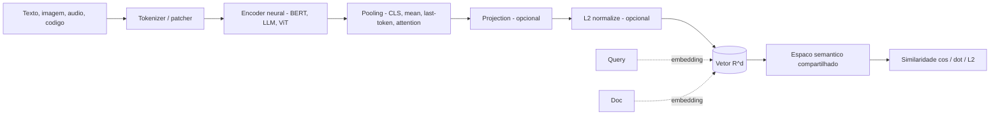
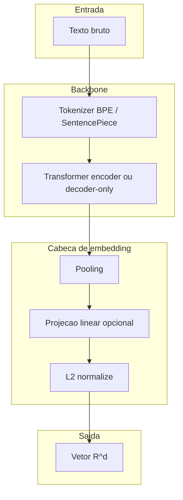
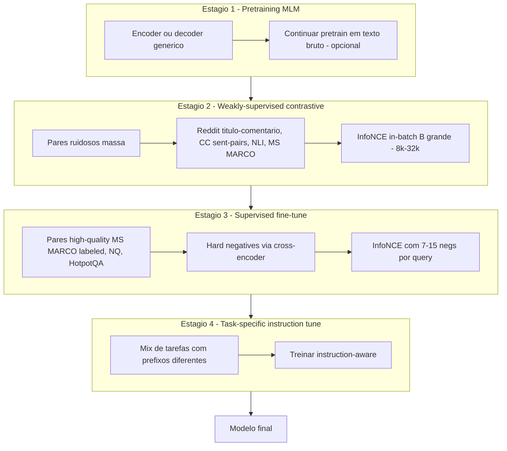
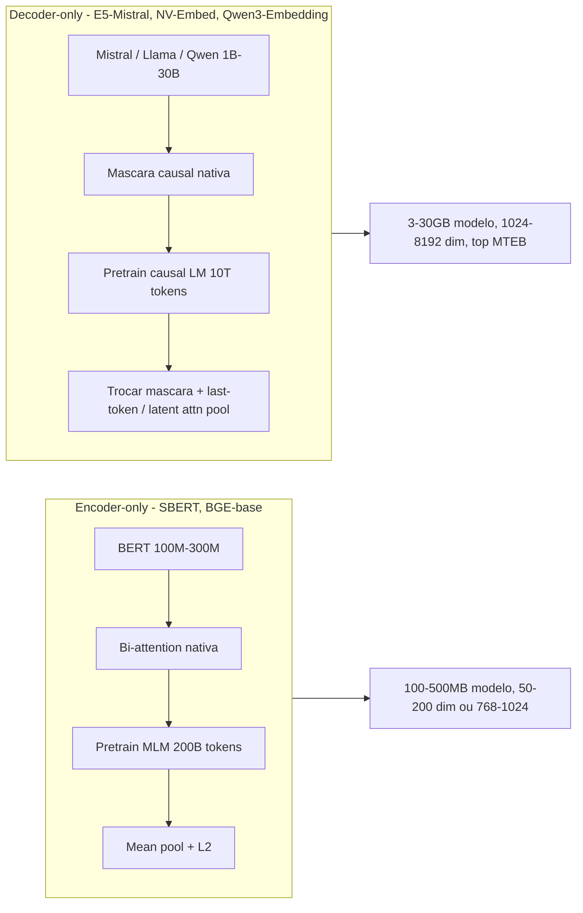
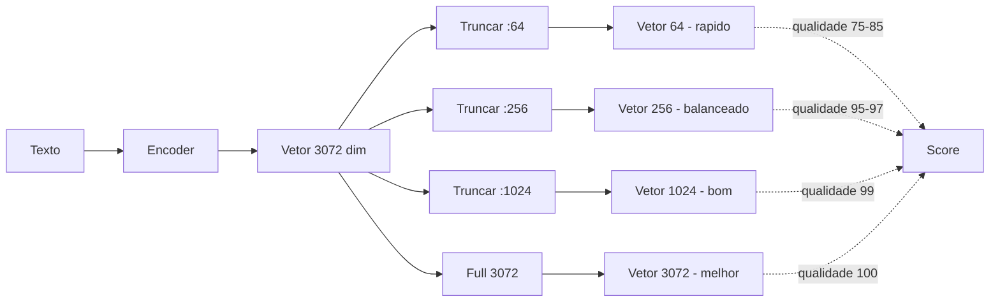
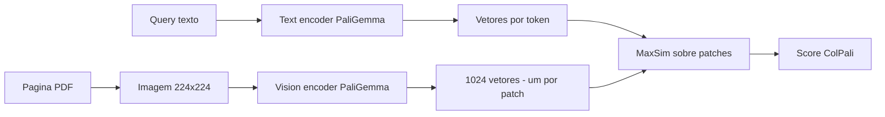
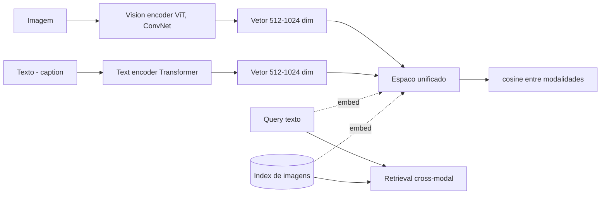
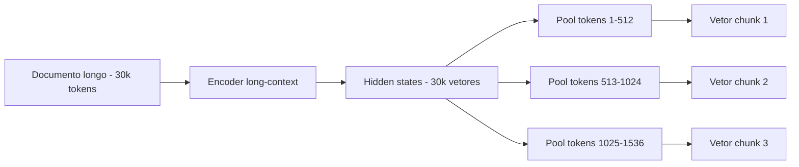

# Post 12 — Embeddings em profundidade: contrastive learning, MTEB, Matryoshka, multi-vector e multimodal

> Série: **LLM Deep Dive** — do tijolo ao prédio.
> Pré-requisitos: Post 01 (arquitetura Transformer), Post 04 (quantização — usada em embeddings binários/INT8), Post 06 (TurboQuant — aplicável a vetores), Post 09 (treinamento — contrastive é um regime de fine-tune) e Post 11 (frameworks que servem embeddings).
> Próximo post: **Post 13 — RAG em profundidade**, onde os embeddings deixam de ser objeto de estudo e viram **componente** de um sistema maior.

---

## TL;DR

- **Embedding** é uma função \( f: x \rightarrow \mathbb{R}^d \) que mapeia texto, imagem, áudio ou código para um vetor onde **proximidade geométrica = similaridade semântica**. É o "endereço num bairro" onde vizinhos têm significado parecido.
- A **arquitetura** é quase sempre um encoder (BERT-style) ou um **decoder-only adaptado** (LLM2Vec, E5-Mistral, NV-Embed) seguido de **pooling** (CLS, mean, last-token, attention) e **projeção opcional**.
- O **treinamento** dominante é **contrastive learning** com loss **InfoNCE**: puxar o par correto, empurrar todos os errados ao mesmo tempo. *Hard negatives* (BM25, cross-encoder, in-batch) são o segredo da qualidade.
- A pipeline canônica (BGE / E5 / SBERT) tem **quatro estágios**: pretraining MLM → contrastive *weakly-supervised* (NLI, MS MARCO, Reddit, CC) → contrastive *supervised* com hard negatives → instruction tuning task-specific.
- Em 2026, **embeddings decoder-only** dominam o topo do MTEB: **Gemini Embedding 001** (Google, top inglês), **NV-Embed-v2** (Mistral 7B), **Qwen3-Embedding-8B** (top multilingue v2), **Llama-Embed-Nemotron-8B** (NVIDIA, multilingue open), **Microsoft Harrier-oss-v1-27b** (open, multilingue), **Cohere Embed v4** (multimodal text+imagem, 128k context), **Jina Embeddings v4** (3.8B, multimodal multilingue), **Voyage 3 large / Voyage 4** (Anthropic), **BGE-M3** (dense + sparse + multi-vector simultâneos), **Nomic Embed v2 MoE** (open-data, ~305M ativos).
- **Matryoshka Representation Learning** (Kusupati 2022) virou padrão de fato: **um único modelo serve N dimensões** (3072 → 1536 → 512 → 256 → 64), permitindo cortar storage/latência em runtime sem retreinar. Adotado por OpenAI 3-large/small, Cohere v3/v4, Nomic v1.5/v2, Jina v3, Voyage 3 large, Snowflake Arctic v2.0.
- **Multi-vector** (ColBERT, ColBERTv2, PLAID, ColPali) troca **storage \(10\text{–}100\times\) maior** por *recall* superior via *late interaction* (`MaxSim`). É a melhor opção quando o *budget* é precisão e o índice cabe em SSD/NVMe.
- **Sparse aprendido** (SPLADE, SPLADE++, BGE-M3-sparse) oferece **lexical match interpretável** sobre índice invertido tradicional — combinado com denso, é o backbone de busca híbrida moderna.
- **Multimodal** (CLIP, SigLIP, SigLIP-2, EVA-CLIP, JinaCLIP v2, Cohere v4, Voyage multimodal-3, ImageBind) projeta texto+imagem (e até áudio/vídeo/IMU) num **espaço compartilhado** via contrastive em pares (`image, caption`).
- **Avaliação** rigorosa = **MTEB / MMTEB v2** (Muennighoff 2022, agora com 8 famílias de tarefas e 200+ datasets) + **MIRACL** (multilingue retrieval) + **BEIR** (zero-shot) + **CoIR** (código) + **MTEB-PT** (português, relevante para audiência BR) + **custom eval** com seus próprios golden pairs.
- **Compressão**: INT8 perde quase nada, INT4 ainda funciona, **binary embeddings** (Cohere `int1`, Mixedbread BinQuant, BGE binary) trocam *cosine* por *Hamming* e ficam centenas de vezes mais rápidos. **TurboQuant** (Post 06) aplica-se diretamente a embeddings.
- **Fine-tune** vale a pena quando você tem (a) gap mensurável em custom eval, (b) ≥ 10k pares de qualidade, (c) volume de queries que paga o esforço operacional. Receita típica: `sentence-transformers` + `MultipleNegativesRankingLoss` + hard negatives via cross-encoder rerank.

> **Analogia mestre.** Pense num **dicionário multilíngue gigantesco e geométrico**: cada palavra, frase, parágrafo, página de PDF, foto ou trecho de código vira um **endereço** num espaço de centenas de dimensões. Endereços vizinhos = significados parecidos. Treinar um embedding é **organizar a cidade** para que assuntos próximos morem perto. Buscar é **dar um CEP** e perguntar "quem mora na vizinhança?". Tudo o que vem depois (RAG, classificação, clustering, recomendação, busca semântica, deduplicação) é **consequência geométrica** dessa organização.

---

## Índice

1. [O que é um embedding (formal)](#1-o-que-e-um-embedding-formal)
2. [Histórico: de word2vec a decoder-only embeddings](#2-historico-de-word2vec-a-decoder-only-embeddings)
3. [Anatomia de um modelo de embedding moderno](#3-anatomia-de-um-modelo-de-embedding-moderno)
4. [Contrastive learning e InfoNCE](#4-contrastive-learning-e-infonce)
5. [Pipeline típico SBERT/BGE/E5: os quatro estágios](#5-pipeline-tipico-sbertbgee5-os-quatro-estagios)
6. [Decoder-only embeddings (LLM2Vec, E5-Mistral, NV-Embed)](#6-decoder-only-embeddings-llm2vec-e5-mistral-nv-embed)
7. [Matryoshka Representation Learning](#7-matryoshka-representation-learning)
8. [Multi-vector (ColBERT, ColBERTv2, ColPali)](#8-multi-vector-colbert-colbertv2-colpali)
9. [Sparse aprendido (SPLADE, BGE-M3-sparse)](#9-sparse-aprendido-splade-bge-m3-sparse)
10. [Estado da arte 2026 — MTEB top](#10-estado-da-arte-2026--mteb-top)
11. [Multilingual embeddings (e o caso PT-BR)](#11-multilingual-embeddings-e-o-caso-pt-br)
12. [Embeddings multimodais (CLIP, SigLIP, ColPali, ImageBind)](#12-embeddings-multimodais-clip-siglip-colpali-imagebind)
13. [Embeddings para código](#13-embeddings-para-codigo)
14. [Domain-specific (Bio/Med, Legal, Finance)](#14-domain-specific-biomed-legal-finance)
15. [Avaliação rigorosa: MTEB, BEIR, MIRACL, CoIR, custom eval](#15-avaliacao-rigorosa-mteb-beir-miracl-coir-custom-eval)
16. [Compressão e otimização (INT8, INT4, binary, PQ, distillation, TurboQuant)](#16-compressao-e-otimizacao-int8-int4-binary-pq-distillation-turboquant)
17. [Long-context embeddings e late chunking](#17-long-context-embeddings-e-late-chunking)
18. [Instruction-tuned embeddings](#18-instruction-tuned-embeddings)
19. [Hosted vs self-hosted: custos e decisão](#19-hosted-vs-self-hosted-custos-e-decisao)
20. [Embeddings em RAG (resumo, ponte para o Post 13)](#20-embeddings-em-rag-resumo-ponte-para-o-post-13)
21. [Fine-tuning embeddings em domínio próprio](#21-fine-tuning-embeddings-em-dominio-proprio)
22. [Tendências 2025–2026](#22-tendencias-20252026)
23. [Cross-references e roadmap](#23-cross-references-e-roadmap)
24. [Referências](#24-referencias)

---

## 1. O que é um embedding (formal)

### 1.1 Definição geométrica

Um **embedding** é uma função

\[
f_\theta : \mathcal{X} \rightarrow \mathbb{R}^d
\]

onde \(\mathcal{X}\) é o espaço de entradas (frases, parágrafos, imagens, trechos de código, áudio…) e \(\mathbb{R}^d\) é um espaço vetorial de dimensão fixa \(d\) (tipicamente 256–8192). Os parâmetros \(\theta\) são treinados de modo a satisfazer **uma única propriedade geométrica**:

\[
\text{sim}(f(x), f(y)) \approx \text{sim}_{\text{semântica}}(x, y)
\]

A **similaridade geométrica** é, na prática, uma de três funções:

| Métrica | Fórmula | Quando usar |
|---|---|---|
| **Cosine similarity** | \(\frac{\langle u, v \rangle}{\|u\| \cdot \|v\|}\) | Padrão para texto; remove efeito de magnitude |
| **Dot product (IP)** | \(\langle u, v \rangle\) | Quando vetores já estão normalizados, ou modelos que treinam com IP (NV-Embed, alguns BGE) |
| **L2 (euclidiana)** | \(\|u - v\|_2\) | Equivalente a cosine para vetores unitários; usado por alguns vector DBs por baseline |

> **Detalhe crítico.** Para vetores **L2-normalizados** (\(\|u\| = 1\)), cosine, dot product e L2 são **monótonos um do outro**: ranqueiam exatamente igual. Por isso a maioria dos modelos modernos *normaliza no `forward`* — você pode usar qualquer métrica do seu vector DB sem mudar resultado.

### 1.2 Diagrama do processo



### 1.3 Por que isso é poderoso

Uma vez que você tem \(f\), **qualquer tarefa** que dependa de "estes dois itens são parecidos?" cai em:

1. **Busca semântica / RAG** — Post 13.
2. **Classificação** por *nearest centroid* (zero/few-shot).
3. **Clustering** (k-means no espaço de embedding).
4. **Deduplicação** (cosine > 0.95 → duplicata provável).
5. **Recomendação** (item-item, user-item).
6. **Anomaly detection** (item longe de qualquer cluster conhecido).
7. **Cross-modal retrieval** (texto → imagem, texto → código, áudio → vídeo).
8. **Retrieval para fine-tune** (escolher exemplos *in-context* relevantes).

Tudo isso roda em **um único índice** se a função \(f\) for boa.

---

## 2. Histórico: de word2vec a decoder-only embeddings

### 2.1 As cinco gerações

| Geração | Ano | Marco | Característica |
|---|---|---|---|
| **G1: Estáticos** | 2013–2017 | **word2vec** (Mikolov), **GloVe** (Pennington), **fastText** | 1 vetor por palavra; sem contexto; rápido; baseline eterno |
| **G2: Contextuais** | 2018 | **ELMo** (Peters), **BERT [CLS]** (Devlin), **InferSent** (Conneau) | Palavra muda de embedding conforme contexto; mas frase = pooling cru |
| **G3: Sentence-BERT** | 2019–2021 | **SBERT** (Reimers 2019), **SimCSE** (Gao 2021), **Sentence-T5** | Siamese fine-tune com NLI/STS; embedding de frase virou produto de primeira classe |
| **G4: BGE/E5/Instructor** | 2022–2023 | **INSTRUCTOR** (Su 2022), **E5** (Wang 2022), **BGE** (BAAI 2023), **GTE** (Alibaba) | Multi-stage contrastive em larga escala; weakly-supervised + supervised; instruction-aware |
| **G5: Decoder-only & multimodal** | 2024–2026 | **LLM2Vec** (BehnamGhader 2024), **E5-Mistral**, **NV-Embed**, **Qwen3-Embedding**, **Gemini Embedding**, **Cohere v4**, **ColPali**, **Jina v4** | LLMs decoder reaproveitados + Matryoshka padrão + multimodal unificado |

### 2.2 O salto que mudou tudo (SBERT, 2019)

Antes de SBERT, gerar um vetor de **frase** com BERT era ruim: usar `[CLS]` cru produzia embeddings cuja similaridade cosine era **pior que GloVe pooling**. Reimers e Gurevych (2019) treinaram BERT com **siamese fine-tune em SNLI + MultiNLI** — duas frases passam pela mesma rede, pooling, e a loss aproxima `entailment` e afasta `contradiction`. Resultado: **5–10× melhoria em STS-B** com latência inalterada.

### 2.3 O segundo salto (decoder-only, 2024)

LLM2Vec (BehnamGhader 2024) mostrou que um decoder-only LLM (Mistral 7B, Llama 3) pode virar embedding model **estado-da-arte** com três passos baratos:

1. Habilitar **bidirectional attention** (mudar a máscara causal para máscara cheia).
2. **Masked next-token prediction** (curto pretrain para a rede aprender a usar contexto bidirecional).
3. **Supervised contrastive** com pares de retrieval.

NV-Embed (NVIDIA, 2024) e E5-Mistral (Microsoft, 2024) seguiram a receita e tomaram o topo do MTEB. Em 2025–2026, **Qwen3-Embedding (8B)**, **Gemini Embedding 001**, **Llama-Embed-Nemotron-8B** e **Microsoft Harrier-oss-v1-27b** consolidaram o paradigma.

> **Por que decoder-only é melhor?** Hipótese mais aceita: o pretrain **massivo** em next-token prediction expõe o modelo a vastly mais texto e variações de raciocínio do que qualquer pretrain de encoder dedicado. O contrastive depois só "instala uma cabeça de leitura" sobre essa representação rica. Custo: 7B vs 100M parâmetros — mas em RAG o gargalo costuma ser **qualidade do top-k**, não custo de embed (que é one-shot por doc).

---

## 3. Anatomia de um modelo de embedding moderno

### 3.1 Quatro componentes



### 3.2 Estratégias de pooling

| Estratégia | Como funciona | Modelos típicos | Trade-off |
|---|---|---|---|
| **`[CLS]` token** | Pega vetor do token especial `[CLS]` | BERT vanilla, alguns BGE | Simples; mas exige fine-tune para [CLS] virar bom resumo |
| **Mean pooling** | Média de todos os tokens (ponderada por máscara de atenção) | SBERT, E5, BGE-base | Robusto, padrão da indústria |
| **Max pooling** | Max element-wise | Alguns ColBERT-style | Pouco usado em single-vector |
| **Last token** | Pega o último token (decoder-only natural) | E5-Mistral, NV-Embed v1, Qwen3-Embedding | Natural para decoder; precisa pad-side correto |
| **EOS token** | Adiciona `<eos>` e pega seu hidden | NV-Embed v2 (latent attention pool), Gemini | Versão "explícita" de last-token |
| **Latent attention pool** | Aprende N "query" tokens que atendem aos hidden states | NV-Embed v2 | +0.5–1 ponto MTEB; custo extra desprezível |
| **Weighted mean (instruction-aware)** | Pondera pelos tokens **depois** do prompt de instrução | INSTRUCTOR, E5-instruct | Foca o vetor na intenção da query |

### 3.3 Pseudocódigo de um forward típico (decoder-only com last-token + L2)

```python
import torch
import torch.nn.functional as F
from transformers import AutoTokenizer, AutoModel

class DecoderEmbedder:
    def __init__(self, model_name="intfloat/e5-mistral-7b-instruct"):
        self.tok = AutoTokenizer.from_pretrained(model_name)
        self.tok.padding_side = "left"  # critico para last-token pooling
        self.model = AutoModel.from_pretrained(model_name, torch_dtype=torch.float16).eval()

    def embed(self, texts: list[str], task: str = "Given a query, retrieve relevant docs"):
        prompts = [f"Instruct: {task}\nQuery: {t}" for t in texts]
        batch = self.tok(prompts, padding=True, truncation=True, max_length=4096,
                         return_tensors="pt").to(self.model.device)
        with torch.no_grad():
            out = self.model(**batch)
        # last hidden state, ultimo token nao-pad (com left padding eh sempre o ultimo)
        h = out.last_hidden_state[:, -1, :]
        return F.normalize(h, p=2, dim=-1)
```

### 3.4 O detalhe sobre `padding_side`

Decoder-only embedders **devem** usar `padding_side="left"` para que o último token relevante seja sempre o último da sequência (e o pooling fique trivial). Encoder-only (BERT) usa right padding e mean pooling sobre `attention_mask`. Esquecer disso é a fonte mais comum de embeddings ruins em produção.

---

## 4. Contrastive learning e InfoNCE

### 4.1 A intuição: ringue de empurra-empurra

Imagine que você tem uma **query** \(q\) e um **documento positivo** \(d^+\) (que de fato responde \(q\)). Você também tem **N documentos negativos** \(d_1^-, d_2^-, \ldots, d_N^-\). A loss **InfoNCE** (van den Oord 2018) é:

\[
\mathcal{L}_{\text{InfoNCE}}(q, d^+, \{d_i^-\}) =
-\log \frac{\exp(\text{sim}(q, d^+)/\tau)}{\exp(\text{sim}(q, d^+)/\tau) + \sum_{i=1}^{N} \exp(\text{sim}(q, d_i^-)/\tau)}
\]

Onde \(\tau\) é a **temperatura** (tipicamente 0.01–0.05). Lendo:

- **Numerador**: "puxa" o positivo.
- **Denominador**: "empurra" o positivo + todos os negativos (softmax os faz competir).
- Conceitualmente é uma **classificação multi-classe** entre `1 + N` candidatos, em que a "classe correta" é o positivo.

> **Analogia.** É um **ringue** com 1 amigo e N estranhos. A loss penaliza qualquer estranho que esteja mais perto de você do que o amigo. Quanto maior \(N\), mais difícil o ringue, mais discriminativo o modelo.

### 4.2 Pseudocódigo PyTorch

```python
import torch
import torch.nn.functional as F

def info_nce_loss(q: torch.Tensor, d_pos: torch.Tensor, d_neg: torch.Tensor,
                  tau: float = 0.02) -> torch.Tensor:
    """
    q     : (B, dim) embeddings de queries
    d_pos : (B, dim) embedding do positivo correspondente a cada q
    d_neg : (B, N, dim) embeddings de N negativos por query
    Assumindo todos L2-normalizados.
    """
    sim_pos = (q * d_pos).sum(-1, keepdim=True) / tau          # (B, 1)
    sim_neg = torch.einsum("bd,bnd->bn", q, d_neg) / tau        # (B, N)
    logits  = torch.cat([sim_pos, sim_neg], dim=1)              # (B, 1+N)
    labels  = torch.zeros(q.size(0), dtype=torch.long, device=q.device)
    return F.cross_entropy(logits, labels)
```

### 4.3 In-batch negatives: o truque que escala

Carregar `N` negativos por query é caro. O truque **in-batch** (Henderson 2017, refinado por SimCLR/SBERT/E5) reusa **os positivos das outras queries no batch como negativos**:

```python
def in_batch_info_nce(q: torch.Tensor, d_pos: torch.Tensor, tau: float = 0.02):
    """
    q, d_pos: (B, dim), L2-normalized.
    Cada q_i tem como positivo d_pos[i] e como negativos d_pos[j] para j != i.
    """
    logits = (q @ d_pos.T) / tau                                # (B, B)
    labels = torch.arange(q.size(0), device=q.device)
    return F.cross_entropy(logits, labels)
```

Com batch \(B = 1024\) você ganha **1023 negativos grátis por query**. Os modelos top-MTEB modernos treinam com batches efetivos de 8k–32k via **gradient cache** (GradCache, Gao 2021) ou TPU pods.

### 4.4 Hard negatives mining: o pulo do gato

In-batch negatives costumam ser **fáceis demais** (assuntos totalmente diferentes). O salto de qualidade vem de **hard negatives**: documentos **parecidos com o positivo, mas errados**. Três fontes:

| Fonte | Como gerar | Custo |
|---|---|---|
| **BM25** | Top-50 do BM25 sobre o corpus, removendo positivo | Quase grátis (índice invertido) |
| **Modelo anterior (rerun)** | Usar o próprio modelo de embedding em treino para reranquear | Médio (1 forward pass) |
| **Cross-encoder** | Cross-encoder pequeno (ex.: `ms-marco-MiniLM-L-12-v2`) reranqueia top-100 e marca os "quase positivos" como hard neg | Alto (mas best quality) |

**Receita BGE/E5 padrão**: para cada par `(q, d+)`, sortear ~7 hard negatives via BM25, **filtrar via cross-encoder** removendo os que o cross-encoder julga *também positivos* (false negatives), e usar o restante.

### 4.5 Pseudocódigo de hard negative mining via cross-encoder

```python
from sentence_transformers import CrossEncoder

def mine_hard_negatives(query: str, positive: str, corpus: list[str],
                        bm25_topk: list[int], reranker: CrossEncoder,
                        n_negatives: int = 7, false_neg_threshold: float = 0.85):
    """
    bm25_topk: indices no corpus do top-K BM25 para a query (~50)
    reranker : cross-encoder calibrado para retorno em [0,1]
    Retorna ate n_negatives hard negatives, filtrando false negatives.
    """
    candidates = [corpus[i] for i in bm25_topk if corpus[i] != positive]
    pairs = [(query, c) for c in candidates]
    scores = reranker.predict(pairs)
    pos_score = reranker.predict([(query, positive)])[0]
    hard_negs = []
    for c, s in sorted(zip(candidates, scores), key=lambda x: -x[1]):
        if s >= false_neg_threshold * pos_score:
            continue
        hard_negs.append(c)
        if len(hard_negs) >= n_negatives:
            break
    return hard_negs
```

### 4.6 Triplet loss: o predecessor

Antes do InfoNCE, o padrão era **triplet loss** (Schroff 2015 — FaceNet):

\[
\mathcal{L}_{\text{triplet}} = \max(0, \text{sim}(q, d^-) - \text{sim}(q, d^+) + m)
\]

com **margin** \(m\). Funciona, mas:
- **1 negativo por amostra** → muita amostragem para qualidade.
- Sensível à escolha do margin.
- InfoNCE é estritamente mais informativo (é triplet com N=1 caso degenerado).

Hoje, **InfoNCE com hard negatives + in-batch** é o padrão universal. Triplet sobrevive em face recognition e nos primeiros tutoriais de SBERT.

---

## 5. Pipeline típico SBERT/BGE/E5: os quatro estágios

### 5.1 Visão geral



### 5.2 Detalhamento por estágio

| Estágio | Objetivo | Dados típicos | Volume | Loss |
|---|---|---|---|---|
| **1. MLM continued pretrain** | Adaptar encoder ao domínio (web, código, multilingue) | Common Crawl, Wikipedia, GitHub, mC4 | 100B–1T tokens | Masked LM |
| **2. Weakly-supervised contrastive** | Aprender a noção de "par relacionado" | Reddit (título→comentário), Stack Exchange, NLI, mMARCO, S2ORC, CCNews | 100M–1B pares | InfoNCE in-batch |
| **3. Supervised contrastive** | Refinar com pares julgados por humanos | MS MARCO labeled, NQ, HotpotQA, SQuAD, FEVER | 100k–10M pares | InfoNCE + hard negs |
| **4. Instruction tuning** | Tornar o modelo task-aware | Mix de retrieval / clustering / classification com prefixos | 100k–1M pares | InfoNCE com prefix |

### 5.3 O salto do BGE/E5

BAAI BGE (2023) e Microsoft E5 (Wang 2022, atualizado 2023) explicaram a receita publicamente. Antes deles, modelos com performance comparável (Cohere v2, OpenAI ada-002) eram caixa-preta. Hoje, **qualquer um pode reproduzir um BGE-base-en-v1.5** com:

- 1 GPU A100 (40 GB) por algumas semanas.
- ~200 GB de pares Reddit + CC + NLI.
- 50k pares MS MARCO labeled + hard negs.
- `sentence-transformers` ou `unilm/e5` repo.

A consequência é que **o moat dos provedores hosted é frágil em quality bruto** — eles competem em **custo de servir, multilingue, multimodal e MRL** — não mais em "embedding quality" abstrato.

---

## 6. Decoder-only embeddings (LLM2Vec, E5-Mistral, NV-Embed)

### 6.1 Por que decoder-only funciona tão bem

Pretrain de LLM decoder-only (Llama, Mistral, Qwen) usa **trilhões de tokens** e expõe a rede a vastly mais texto do que qualquer encoder dedicado já viu. O hidden state do último token em uma sequência longa **acumula a representação completa** do contexto.

O problema histórico era a **máscara causal**: cada token só vê os anteriores, então `embed("the cat sat")` ignora "sat" quando computa o embedding de "the". LLM2Vec (BehnamGhader 2024) mostrou que isso é **conserto barato**:

| Passo | O que faz | Custo |
|---|---|---|
| **1. Bi-attention** | Trocar a máscara causal por máscara cheia | 0 (só código) |
| **2. MNTP** | Masked Next-Token Prediction (BERT-style sobre o decoder com bi-attn) | ~1B tokens |
| **3. SimCSE unsupervised** | Contrastive sem rótulos (dropout-based) | ~10M frases |
| **4. Supervised contrastive** | Pares E5/BGE-quality com hard negs | ~100k–1M pares |

Com isso, **Llama 3 8B** ou **Mistral 7B** viram **state-of-the-art em MTEB** com fine-tune barato.

### 6.2 Comparação: encoder-only vs decoder-only embedder



| Aspecto | Encoder-only | Decoder-only |
|---|---|---|
| **Tamanho típico** | 100M–600M | 1B–30B |
| **Dim típica** | 384, 768, 1024 | 1024–8192 |
| **MTEB topo** | ~65 (BGE-large-en-v1.5) | ~72 (NV-Embed v2), ~73 (Gemini), ~70 (Qwen3-8B) |
| **Latência embed (1 frase, A100)** | 5–20 ms | 50–500 ms |
| **Custo storage por vetor** | 1.5–4 KB (fp32) | 4–32 KB (fp32) |
| **Quando vale** | Volume gigantesco (bilhões de docs), latência crítica | Qualidade > custo, retrieval difícil |

### 6.3 Modelos representativos (2025–2026)

| Modelo | Base | Params | Dim | Max tokens | MTEB v2 multilingue | Licença |
|---|---|---|---|---|---|---|
| **NV-Embed-v2** | Mistral 7B | 7.85B | 4096 | 32k | ~72.3 | Não-comercial (research) |
| **E5-Mistral-7B-instruct** | Mistral 7B | 7B | 4096 | 32k | ~66.6 | MIT |
| **Qwen3-Embedding-8B** | Qwen3 8B | 8B | 4096 (MRL→32–4096) | 32k | ~70.6 | Apache 2.0 |
| **Qwen3-Embedding-4B** | Qwen3 4B | 4B | 2560 | 32k | ~69.5 | Apache 2.0 |
| **Qwen3-Embedding-0.6B** | Qwen3 0.6B | 0.6B | 1024 | 32k | ~64.3 | Apache 2.0 |
| **GTE-Qwen2-7B-instruct** | Qwen2 7B | 7B | 3584 | 32k | ~67.2 | Apache 2.0 |
| **stella_en_1.5B_v5** | Qwen1.5 1.5B | 1.5B | 1024 (MRL) | 8192 | ~66.0 | MIT |
| **Linq-Embed-Mistral** | Mistral 7B | 7B | 4096 | 32k | ~68.2 | CC-BY-NC |
| **Llama-Embed-Nemotron-8B** | Llama 3.1 8B | 8B | 4096 | 8192 | top multilingue 2026 | Open weights (NVIDIA) |
| **Microsoft Harrier-oss-v1-27b** | Phi/proprietário | 27B (25.6B ativos) | 5376 | 32k | top MMTEB v2 2026 | MIT |
| **Microsoft Harrier-oss-v1-0.6b** | Phi-mini | 0.6B | 1024 | 8192 | competitivo | MIT |

> **Observação.** A licença **não-comercial** de NV-Embed v2 e Linq fez muita gente migrar para Qwen3-Embedding (Apache 2.0) e Harrier (MIT) ao longo de 2025–2026.

---

## 7. Matryoshka Representation Learning

### 7.1 O problema que resolve

Você embedou 100M docs em 3072 dimensões com `text-embedding-3-large`. Storage: \(100\text{M} \times 3072 \times 4\text{B} = 1.23\text{ TB}\). Latência cosine: O(d).

**Você precisa cortar pela metade**. Tradicionalmente: re-embed tudo com modelo de 1536 dim. Custo: ré-fazer 100M API calls e re-indexar.

**Matryoshka Representation Learning** (Kusupati 2022, NeurIPS) treina o modelo de modo que **truncar o vetor pelas primeiras k dimensões já produz um embedding válido**. Você corta de 3072 para 1536, 768, 512, 256 ou 64 **em runtime**, sem re-embed.

> **Analogia.** É a **boneca russa** (matryoshka): cada nível encaixado é uma boneca completa por si — não um pedaço quebrado. Você abre até o tamanho que precisa.

### 7.2 Como treinar

A loss agregada soma a perda contrastive computada **em cada granularidade** \(d_k \in \{64, 128, 256, 512, 1024, 2048, 3072\}\):

\[
\mathcal{L}_{\text{MRL}} = \sum_{k} w_k \cdot \mathcal{L}_{\text{InfoNCE}}\left(f(x)[:d_k]\right)
\]

```python
def matryoshka_info_nce(q_full: torch.Tensor, d_pos_full: torch.Tensor,
                        dims: list[int] = [64, 128, 256, 512, 1024, 2048, 3072],
                        weights: list[float] = None,
                        tau: float = 0.02) -> torch.Tensor:
    if weights is None:
        weights = [1.0 / len(dims)] * len(dims)
    total = 0.0
    for d_k, w in zip(dims, weights):
        q_k     = F.normalize(q_full[:, :d_k], p=2, dim=-1)
        d_pos_k = F.normalize(d_pos_full[:, :d_k], p=2, dim=-1)
        total = total + w * in_batch_info_nce(q_k, d_pos_k, tau)
    return total
```

### 7.3 Adoção 2026

| Modelo | Dimensões disponíveis (truncáveis) | Notas |
|---|---|---|
| **OpenAI text-embedding-3-large** | 3072 (default), também aceita 1536, 1024, 512, 256 via `dimensions` | MRL nativo desde Jan/2024 |
| **OpenAI text-embedding-3-small** | 1536 (default), até 512 | MRL nativo |
| **Cohere Embed v3 / v4** | 1536 / 1024 / 512 / 256 (v4); 1024 (v3) | MRL nativo, `embedding_types` |
| **Nomic Embed v1.5 / v2** | 768 → 64 (v1.5); 768 → 256 (v2 MoE) | MRL + open-data |
| **Snowflake Arctic-Embed-v2.0** | 1024 → 256 | MRL + multilingue |
| **Jina Embeddings v3 / v4** | 1024 → 32 (v3); 2048 / 1024 / 512 (v4) | MRL + LoRA task adapters |
| **Voyage 3 large / Voyage 4** | 2048 / 1024 / 512 / 256 | MRL nativo |
| **BGE-M3** | 1024 → 512 | MRL parcial |
| **Stella-en-1.5B-v5** | 8192 → 1024 → 256 | MRL agressivo |
| **Qwen3-Embedding (todas)** | 32 → 4096 (8B) | MRL nativo, qualquer corte |

### 7.4 Quanto se perde ao truncar

**Surpresa positiva**: o gradiente da Matryoshka loss naturalmente **força as dimensões iniciais a carregar a maior parte do sinal**. Empiricamente:

| % de dimensões usadas | % de qualidade retida (cosine recall@10) |
|---|---|
| 100% (full) | 100% baseline |
| 50% (corte ao meio) | 98–99% |
| 25% | 95–97% |
| 12.5% | 90–94% |
| 6% (extremo) | 75–85% |

Para um índice de 100M vetores, cortar 3072→512 é **6× menos storage e ~6× menos latência cosine**, perdendo ~3% de recall@10. Para a maioria dos sistemas RAG, é troca **grátis**.

### 7.5 Diagrama visual



---

## 8. Multi-vector (ColBERT, ColBERTv2, ColPali)

### 8.1 A ideia

Single-vector embedding **comprime a frase inteira em um ponto**. Isso perde nuance: uma query que casa com **uma palavra específica** do doc fica diluída.

ColBERT (Khattab 2020) propôs: **um vetor por token**. Em vez de comprimir, mantenha a **constelação de embeddings de tokens**, e compute a similaridade query-doc como:

\[
\text{MaxSim}(q, d) = \sum_{i=1}^{|q|} \max_{j=1}^{|d|} \langle q_i, d_j \rangle
\]

Para cada token de query, pega o **melhor match** entre todos os tokens do doc (`max`), e soma. Isso é **late interaction**: query e doc são embedados independentemente, mas a comparação é por token.

> **Analogia.** Em vez de tirar **uma foto do prédio inteiro** (single-vector) e comparar com a foto do outro prédio, ColBERT tira **uma foto de cada janela** e compara cada janela da query com a melhor janela do doc.

### 8.2 Pseudocódigo MaxSim

```python
def colbert_maxsim(q: torch.Tensor, d: torch.Tensor) -> torch.Tensor:
    """
    q: (Lq, dim) embeddings de tokens da query
    d: (Ld, dim) embeddings de tokens do documento
    Retorna scalar: score de similaridade ColBERT.
    """
    # (Lq, Ld) matriz de similaridade token-token
    sim = q @ d.T
    # max sobre tokens de doc para cada token de query
    max_per_q_token, _ = sim.max(dim=1)
    # soma sobre tokens de query
    return max_per_q_token.sum()
```

### 8.3 ColBERTv2 e PLAID: o ajuste de produção

ColBERT vanilla precisa **carregar todos os vetores de todos os docs candidatos** para computar MaxSim — caro de mais para 1M+ docs.

**ColBERTv2** (Santhanam 2021, arXiv:2112.01488):
- **Centroid-based compression** com K-means: cada vetor de token é representado pelo seu centroide + delta quantizado em 1–2 bits.
- Storage cai **8–32×** vs ColBERT vanilla.
- Recall fica praticamente igual.

**PLAID** (Santhanam 2022): vector store especializado em ColBERT que faz:
1. Filtro inicial por centroides (rapidíssimo).
2. Decompressão lazy só dos top-K candidatos.
3. MaxSim final.

Latência típica em 1M docs: 50–200 ms (vs <10 ms de single-vector).

### 8.4 ColPali: late interaction visual (2024)

ColPali (Faysse 2024, arXiv:2407.01449) leva a ideia para **PDFs como imagens**:



Em vez de **OCR + chunking + embed texto**, ColPali embeda a página inteira como imagem com encoder vision. Funciona surpreendentemente bem em PDFs ricos visualmente (tabelas, gráficos, diagramas, infográficos) onde OCR falha.

### 8.5 Quando usar multi-vector

| Cenário | Single-vector | Multi-vector |
|---|---|---|
| Latência <50 ms, 100M+ docs | ✅ | ❌ (storage proibitivo) |
| Recall máximo, 100k–10M docs | ⚠️ | ✅ |
| PDFs visuais (tabelas, charts) | ❌ | ✅ (ColPali) |
| Multi-tenant com filtros pesados | ✅ | ⚠️ |
| Long docs com matches pontuais | ⚠️ | ✅ |
| Storage caro / orçamento apertado | ✅ | ❌ |

**Storage típico**: 1024 tokens × 128 dim × 1 bit (ColBERTv2) = **16 KB/doc** vs **4 KB/doc** single-vector fp32. Para 100M docs: **1.6 TB** vs 400 GB.

---

## 9. Sparse aprendido (SPLADE, BGE-M3-sparse)

### 9.1 BM25 ressuscitado por neural

BM25 (Robertson 1994) é o **baseline lexical** clássico: TF-IDF tunado, vetor sparse de tamanho `|vocab|`, indexado por inverted index. **Imbatível em queries com palavras raras** (CPF, código de produto, nomes próprios), mas péssimo em sinônimos.

**SPLADE** (Formal 2021, arXiv:2107.05720) é um **BM25 aprendido**:

1. Passa o texto pelo BERT (encoder).
2. Sobre cada token do output, projeta para o vocabulário inteiro via **MLM head**.
3. Aplica **ReLU + log(1+x)** e faz **max-pooling** sobre tokens.
4. Resultado: vetor sparse de tamanho \(|V| \approx 30\text{k}\), com termos do vocab que o modelo **expandiu/contraiu** semanticamente.

\[
w_j = \max_i \log\left(1 + \text{ReLU}\left(\text{logit}(t_i, v_j)\right)\right)
\]

A loss combina contrastive InfoNCE com **regularização L1** sobre os pesos para forçar sparsity.

### 9.2 Vantagens do sparse aprendido

- **Lexical match preservado** (palavra rara funciona).
- **Interpretável**: você vê quais palavras o modelo achou importantes.
- **Indexável em Lucene/Elasticsearch/OpenSearch** com custos clássicos de inverted index.
- **Eficiente em queries esparsas** (poucos termos).
- **Combina nativamente com denso** via RRF (Reciprocal Rank Fusion).

### 9.3 SPLADEv2, SPLADE++, BGE-M3-sparse

| Modelo | Ano | Notas |
|---|---|---|
| **SPLADE-max** | 2021 | Original |
| **SPLADEv2** | 2021 | Distill de cross-encoder + L1 melhor |
| **SPLADE++** (CoCondenser) | 2022 | Pretrain CoCondenser melhora qualidade |
| **SPLADE-doc** | 2022 | Variante só para docs (query passa direto) |
| **OpenSearch Neural Sparse** | 2024 | Versão otimizada por OpenSearch para produção |
| **BGE-M3-sparse** | 2024 | Mesmo modelo BGE-M3 produz 3 outputs simultâneos: dense + sparse + multi-vector |

### 9.4 BGE-M3: o "tudo-em-um"

BGE-M3 (Chen 2024) é especial: **um único forward pass** produz três representações:

1. **Dense vector** (1024 dim).
2. **Sparse vector** estilo SPLADE.
3. **Multi-vector** estilo ColBERT.

Você indexa as três e combina os três scores na hora da query. Custo de inferência: **igual a 1 modelo**. Custo de storage: ~3× vs single-vector. Recall: melhor que qualquer um sozinho na maioria dos benchmarks.

### 9.5 Tabela: tipos de embedding

| Tipo | Vector size | Storage típico (1k tokens) | Indexação | Recall típico | Latência |
|---|---|---|---|---|---|
| **Sparse BM25** | ~|V| (30k+, mas <100 não-zero) | <500 B | Inverted index (Lucene) | Baixo em sinônimos, alto em raros | <5 ms |
| **Sparse SPLADE** | ~|V| (~200 não-zero) | 1–2 KB | Inverted index | Médio-alto | 10–30 ms |
| **Dense single-vector** | 768–4096 fp32 | 3–16 KB | HNSW / IVF / DiskANN | Alto | 5–20 ms |
| **Dense + Matryoshka 256d** | 256 fp32 | 1 KB | HNSW | Quase igual full | 2–5 ms |
| **Dense binary (1 bit)** | 1024 bits | 128 B | Hamming + reorder | Médio (com rerank: alto) | <1 ms |
| **Multi-vector (ColBERT)** | tokens × 128 fp32 | 50–500 KB | PLAID / Vespa | Muito alto | 50–200 ms |
| **Multi-vector ColBERTv2** | tokens × 128 (1–2 bit) | 5–50 KB | PLAID | Muito alto | 30–100 ms |

---

## 10. Estado da arte 2026 — MTEB top

### 10.1 Snapshot de mercado (Q2 2026)

> Dados consolidados via WebSearch (MTEB English & MMTEB v2 leaderboards, março–abril 2026; awesomeagents.ai, GitHub `embeddings-benchmark/mteb`, blogs Microsoft/Google/NVIDIA/Cohere/Anthropic).

| Rank inglês | Modelo | Provedor | Base | Params | Dim | Max tokens | MTEB-eng v2 | Multilingue | Licença |
|---|---|---|---|---|---|---|---|---|---|
| 1 | **Gemini Embedding 001** | Google | proprietário | n.d. | 3072 (MRL) | 8k | ~73.4 | ✅ 100+ | Proprietário (API) |
| 2 | **NV-Embed-v2** | NVIDIA | Mistral 7B | 7.85B | 4096 | 32k | ~72.3 | ✅ | Não-comercial |
| 3 | **Qwen3-Embedding-8B** | Alibaba/Qwen | Qwen3 8B | 8B | 4096 (MRL) | 32k | ~71.0 | ✅ 100+ | Apache 2.0 |
| 4 | **Microsoft Harrier-oss-v1-27b** | Microsoft | proprietário | 27B (25.6B) | 5376 | 32k | ~70.5 (top MMTEB v2) | ✅ 100+ | MIT |
| 5 | **Llama-Embed-Nemotron-8B** | NVIDIA | Llama 3.1 8B | 8B | 4096 | 8k | ~69.8 (top multilingue open) | ✅ | Open weights |
| 6 | **Linq-Embed-Mistral** | Linq AI | Mistral 7B | 7B | 4096 | 32k | ~68.2 | ✅ | CC-BY-NC |
| 7 | **GTE-Qwen2-7B-instruct** | Alibaba | Qwen2 7B | 7B | 3584 | 32k | ~67.2 | ✅ | Apache 2.0 |
| 8 | **stella_en_1.5B_v5** | Diffuser | Qwen1.5 1.5B | 1.5B | 1024 (MRL) | 8k | ~66.0 | parcial | MIT |
| 9 | **E5-Mistral-7B-instruct** | Microsoft | Mistral 7B | 7B | 4096 | 32k | ~66.6 | ✅ | MIT |
| 10 | **bge-multilingual-gemma2** | BAAI | Gemma 2 9B | 9B | 3584 | 8k | ~65.5 | ✅ | Gemma license |

### 10.2 Modelos comerciais hosted (2026)

| Modelo | Provedor | Dim | Max tokens | MRL | Multilingue | Multimodal | Preço (/M tokens) |
|---|---|---|---|---|---|---|---|
| **Gemini Embedding 001** | Google | 3072 → 256 | 8k | ✅ | ✅ 100+ | ❌ | ~$0.13 |
| **OpenAI text-embedding-3-large** | OpenAI | 3072 → 256 | 8191 | ✅ | ✅ | ❌ | $0.13 |
| **OpenAI text-embedding-3-small** | OpenAI | 1536 → 512 | 8191 | ✅ | ✅ | ❌ | $0.02 |
| **Cohere Embed v4** | Cohere | 1536/1024/512/256 | 128k | ✅ | ✅ 100+ | ✅ text+img | ~$0.12 |
| **Cohere Embed Multilingual v3** | Cohere | 1024 | 512 | ❌ | ✅ 100+ | ❌ | $0.10 |
| **Voyage 3 large** | Anthropic/Voyage | 2048/1024/512/256 | 32k | ✅ | ✅ | ❌ | $0.18 (200M free) |
| **Voyage 4 / 4-large** | Anthropic/Voyage | 2048 | 32k | ✅ | ✅ | ✅ | n.d. (premium) |
| **Voyage code-3** | Anthropic/Voyage | 1024 | 32k | ✅ | ❌ (código) | ❌ | $0.18 |
| **Voyage multimodal-3** | Anthropic/Voyage | 1024 | 32k | ✅ | ✅ | ✅ text+img | $0.12 |
| **Jina Embeddings v3** | Jina AI | 1024 → 32 | 8192 (32k RoPE) | ✅ | ✅ 89 | ❌ | $0.02 |
| **Jina Embeddings v4** | Jina AI | 2048/1024/512 | 32k | ✅ | ✅ 100+ | ✅ text+img + visual | n.d. |
| **Mixedbread mxbai-embed-large** | Mixedbread | 1024 (MRL) | 512 | ✅ | parcial | ❌ | $0.06 |
| **Snowflake Arctic-Embed v2.0** | Snowflake | 1024/768/256 | 8192 | ✅ | ✅ | ❌ | uso interno + open |

### 10.3 Caveat: contaminação MTEB

MTEB virou **alvo de overfit**: alguns modelos têm scores suspeitos quando comparados a custom evals dos próprios usuários. As melhores práticas em 2026:

1. **Sempre rodar custom eval** com 200–1000 pares próprios (golden pairs do seu domínio).
2. Conferir **MTEB-PT** se o uso é em português (não dá para confiar só em MTEB-eng).
3. Olhar **MMTEB v2** (multilingue, mais recente, mais resistente a contaminação).
4. **Não escolher o top-1**, escolher um do top-5 que tenha **licença e custo OK** para você.
5. Reproduzir o número **localmente** com a mesma seed/script — diferenças de >2 pontos costumam ser bug de avaliação, não de modelo.

---

## 11. Multilingual embeddings (e o caso PT-BR)

### 11.1 Modelos multilíngues principais

| Modelo | Idiomas | Português | Notas |
|---|---|---|---|
| **mE5-large** (multilingual E5) | 100 | ✅ bom | Encoder XLM-R, base sólida |
| **bge-m3** | 100+ | ✅ excelente | Dense + sparse + multi-vector |
| **bge-multilingual-gemma2** | 100+ | ✅ excelente | Gemma 2 9B base |
| **Cohere Embed Multilingual v3 / v4** | 100+ | ✅ excelente | Líder histórico em multilingue hosted |
| **Gemini Embedding 001** | 100+ | ✅ bom | Pretrain massivo do Gemini |
| **Llama-Embed-Nemotron-8B** | 100+ | ✅ bom | Top MMTEB v2 multilingue open 2026 |
| **Microsoft Harrier-oss** | 100+ | ✅ bom | MIT, top MMTEB v2 |
| **Nomic Embed v2 MoE** | ~100 | ✅ bom | 305M ativos, open-data, MoE |
| **Snowflake Arctic-Embed v2.0** | 80+ | ✅ bom | MRL nativo |
| **Jina Embeddings v3 / v4** | 89/100 | ✅ bom | LoRA task adapters |
| **LaBSE** (Language-agnostic BERT) | 109 | ✅ médio | Bom para bitext mining |
| **Voyage 3 large** | 100+ | ✅ bom | Hosted, 32k context |

### 11.2 Avaliação multilingue

| Benchmark | Foco | Tarefas |
|---|---|---|
| **MMTEB v2** | Geral multilingue | 200+ datasets, 8 famílias |
| **MIRACL** | Retrieval em 18 idiomas | nDCG@10 |
| **mMARCO** | Tradução do MS MARCO para 14 idiomas | MRR@10 |
| **XQuAD / TyDi-QA** | QA multilingue | EM / F1 |
| **MTEB-PT** | MTEB para português | Cobertura de tarefas comuns em PT-BR |
| **MASSIVE** | Intent / slot filling em 51 idiomas | F1 |

### 11.3 Caso PT-BR: o que funciona bem

Para **português brasileiro** (uso típico: RAG corporativo, busca semântica, classificação de tickets), os modelos que **consistentemente** entregam em 2026:

| Cenário | Recomendação |
|---|---|
| **RAG simples, hosted, baixo custo** | OpenAI 3-small (1536 dim, $0.02/M) ou Cohere Embed Multilingual v3 |
| **RAG corporativo, qualidade alta hosted** | Cohere Embed v4 ou Gemini Embedding 001 |
| **RAG self-hosted, GPU disponível** | bge-m3 (1024 dim, dense+sparse), Llama-Embed-Nemotron-8B, Qwen3-Embedding-4B/8B |
| **Edge / latência ultra-baixa** | mxbai-embed-large, Snowflake Arctic-Embed v2.0, Qwen3-Embedding-0.6B |
| **PDFs visualmente ricos** | ColPali ou Cohere Embed v4 / Voyage multimodal-3 |
| **Domínio jurídico / médico / financeiro PT** | Fine-tune de bge-m3 ou Qwen3-4B com seu corpus + custom eval |

**Cuidado clássico**: modelos **"english-only"** (BGE-large-en-v1.5, NV-Embed-v2 algumas versões, stella, GTE-en) podem **embed PT** sem erro mas com qualidade muito inferior — sempre compare contra um multilingue real no seu custom eval.

---

## 12. Embeddings multimodais (CLIP, SigLIP, ColPali, ImageBind)

### 12.1 A ideia: espaço compartilhado

Treinar **dois encoders** (texto + imagem, por exemplo) com contrastive em pares `(imagem, caption)`, de modo que **vetores de modalidades diferentes** vivam no mesmo espaço.



> **Analogia.** É um **dicionário poliglota geométrico**: o conceito "gato" em texto, em foto e (com CLAP) em áudio de miado caem todos no mesmo CEP. A query "gatinho preto" puxa imagens de gatos pretos sem precisar de OCR ou tags.

### 12.2 CLIP (OpenAI 2021)

**CLIP** (Radford 2021, arXiv:2103.00020) foi o salto:
- 400M pares `(imagem, alt-text)` da internet.
- ViT (vision) + Text Transformer.
- InfoNCE em batch enorme (32k).
- Resultado: **zero-shot image classification** competindo com supervised baselines.

### 12.3 SigLIP (Google 2023) e SigLIP-2

**SigLIP** (Zhai 2023, arXiv:2303.15343) trocou **softmax** por **sigmoid loss** pareada:

\[
\mathcal{L}_{\text{SigLIP}} = -\sum_{i,j} \log \sigma(\text{sign}(i,j) \cdot (\langle u_i, v_j \rangle / \tau + b))
\]

A loss é independente para cada par `(i,j)`, sem normalizar pelo batch. Vantagens:
- **Não exige batch enorme** (CLIP precisa 32k para top quality).
- Treina mais rápido.
- Melhor zero-shot em scale menor.

**SigLIP-2** (2024) generaliza com captions sintéticas + decoder pretraining.

### 12.4 Modelos representativos (2026)

| Modelo | Modalidades | Dim | Notas |
|---|---|---|---|
| **CLIP ViT-L/14** (OpenAI) | text + image | 768 | Original, ainda baseline |
| **OpenCLIP** (LAION) | text + image | 512–1024 | Reproduções open massivas (LAION-5B) |
| **SigLIP-base/large** (Google) | text + image | 768 | Sigmoid loss, top em zero-shot |
| **SigLIP-2** | text + image | 768–1152 | Versão refinada com captions sintéticas |
| **EVA-CLIP** (BAAI) | text + image | 512–1024 | Pretrain massivo, top em scaling |
| **JinaCLIP v2** | text + image, 89 idiomas | 768 (MRL) | Multilingue + multimodal |
| **Cohere Embed v4** | text + image unified | 256/512/1024/1536 | 128k context, MRL, líder hosted |
| **Voyage multimodal-3** | text + image | 1024 | Hosted, integrado com Anthropic |
| **ColPali** (vision) | imagem de página + texto query | 128 × patches | Late interaction visual |
| **CLAP** (LAION) | text + audio | 512 | Audio captioning / search |
| **ImageBind** (Meta) | 6 modalidades unificadas (image, text, audio, depth, thermal, IMU) | 1024 | Hub multimodal "qualquer-para-qualquer" |
| **NomicEmbed-Vision** | text + image | 768 | Open weights |

### 12.5 Use cases típicos

| Caso | Modelo recomendado |
|---|---|
| **Image search por texto** | CLIP, SigLIP-2, Cohere v4 |
| **Recomendação de produto por foto** | CLIP fine-tuned no catálogo |
| **PDF RAG visual** (gráficos, tabelas) | ColPali, Cohere v4, Voyage multimodal-3 |
| **Vídeo retrieval** | CLIP por frame + pooling, ImageBind |
| **Áudio retrieval por texto** | CLAP, ImageBind |
| **Classificação zero-shot** | CLIP (text labels como queries) |
| **Multimodal RAG geral** | Cohere v4 ou Jina v4 (unificado, hosted) |

---

## 13. Embeddings para código

### 13.1 Por que código precisa modelo dedicado

Tokens de código têm distribuição **muito diferente** de texto natural:
- Identificadores arbitrários (`getUserById`, `__init__`).
- Sintaxe estrutural (parênteses, indentação, semicolons) carrega significado.
- Mesmo "documento" pode ser função, classe, arquivo, repositório.
- Semântica = comportamento de execução, não similaridade léxica.

### 13.2 Modelos de embedding para código (2026)

| Modelo | Base | Linguagens | Notas |
|---|---|---|---|
| **Voyage code-3** | proprietário | 100+ | Hosted, top em CoIR 2026 |
| **Jina code-v2** | proprietário | 30+ | Hosted, suporta 8k context |
| **CodeT5+ embeddings** | CodeT5+ | 9 | Encoder-decoder; uso research |
| **Salesforce SFR-Embedding-Code** | proprietário | 12 | Open weights |
| **bge-code-v1** (BAAI) | BGE base | 80+ | Open, Apache 2.0 |
| **CodeBERT / GraphCodeBERT** | RoBERTa | 6 | Histórico, baseline |
| **CodeRankEmbed** (Nomic) | Nomic-base | 100+ | Open, otimizado para retrieval |
| **Qwen3-Embedding-8B** (instruction "code") | Qwen3 | 100+ | Multipropósito decente em código |

### 13.3 Avaliação: CoIR

**CoIR** (Code Information Retrieval, 2024) é o benchmark padrão:
- **Code-to-code search** (achar implementação similar).
- **Text-to-code search** (achar código a partir de docstring).
- **Code-to-text** (achar docstring de função).
- 10 linguagens, 14 datasets.

Em 2026, Voyage code-3 lidera, com bge-code-v1 e CodeRankEmbed competindo no open-source.

### 13.4 Quando usar text embedder vs code embedder

| Caso | Recomendação |
|---|---|
| **Buscar trecho de docstring → função** | text embedder funciona razoavelmente |
| **Buscar função → função similar** | code embedder é necessário |
| **RAG sobre wiki técnica + código misturado** | text embedder multilingue + bge-code-v1 em índice separado, fundir scores |
| **Code review / PR review** | code embedder + cross-encoder específico |

---

## 14. Domain-specific (Bio/Med, Legal, Finance)

### 14.1 Quando vale a pena

Modelos genéricos top-MTEB tipicamente perdem 5–15 pontos em domínios com **vocabulário denso e jargão técnico**: medicina (CIDs, fármacos), direito (jurisprudência), finanças (instrumentos), química (IUPAC).

### 14.2 Modelos representativos

| Domínio | Modelos | Dataset de treino |
|---|---|---|
| **Bio/Médico (EN)** | BioLORD, MedEmbed, NV-Embed-medical, ClinicalBERT, BioBERT, SciNCL, S-PubMedBERT-MS-MARCO | PubMed, MIMIC, OAG, BioASQ |
| **Bio/Médico (multilingue)** | mE5 fine-tuned em PubMed translations | PubMed + MIMIC + traduções |
| **Legal (EN)** | legal-bert-base, LEGAL-BERT, Lawformer, SaulLM-7B-embed | Caselaw Access Project, EUR-Lex, COLIEE |
| **Legal (PT-BR)** | jurisbert (UFMG), bge-m3 fine-tuned em STJ/STF | Jurisprudência STJ/STF + diários oficiais |
| **Financeiro** | FinBERT, FinE5, BloombergGPT-embed (proprietário), Voyage finance-2 (hosted) | Notícias financeiras, 10-K, transcripts |
| **Científico** | SPECTER2, SciBERT, SciNCL, S2ORC-BERT | S2ORC, ArXiv, ACL anthology |
| **Químico** | MolBERT, ChemBERTa | PubChem, ZINC |

### 14.3 Receita pragmática

1. Comece com um **multilingue forte** (bge-m3, Qwen3-Embedding-4B, Cohere v4).
2. Construa **custom eval** com 100–500 golden pairs do seu domínio (queries reais → docs corretos).
3. Se gap > 10 pontos vs alternativas, **fine-tune** (Seção 21) com 5k–50k pares específicos.
4. Reavalie no custom eval; só promova se ganho > 3 pontos sem regressão em "queries genéricas".

---

## 15. Avaliação rigorosa: MTEB, BEIR, MIRACL, CoIR, custom eval

### 15.1 MTEB (Muennighoff 2022)

**Massive Text Embedding Benchmark** (arXiv:2210.07316) é a planilha que organizou o caos. Versão original cobria 8 famílias × 56 datasets:

| Família | Tarefa típica | Exemplo de dataset | Métrica |
|---|---|---|---|
| **Classification** | Classificação por logistic regression sobre embedding | AmazonReviews, Banking77 | Accuracy |
| **Clustering** | k-means + V-measure | Reddit, ArxivClustering | V-measure |
| **Pair classification** | Detecção de paráfrase / NLI | TwitterURL, SprintDup | AvgPrecision |
| **Reranking** | Reordenar candidatos | MindSmall, AskUbuntu | MRR/MAP |
| **Retrieval** | Buscar doc relevante | NQ, HotpotQA, TREC-COVID | nDCG@10 |
| **STS** | Similaridade semântica | STS-B, SICK-R | Spearman |
| **Summarization** | Score de resumos | SummEval | Spearman |
| **BitextMining** | Encontrar tradução | BUCC, Tatoeba | F1 |

**MMTEB v2** (2024–2025) expandiu para **200+ datasets em 100+ idiomas**, com governança comunitária e melhor controle de contaminação.

### 15.2 BEIR (Thakur 2021)

**Benchmarking-IR** (arXiv:2104.08663) é o predecessor focado **só em retrieval zero-shot**: 18 datasets de domínios diferentes (finanças, biomédico, jurídico, fact-checking). Um modelo bom em BEIR generaliza melhor que um bom só em MS MARCO.

### 15.3 MIRACL e mMARCO

- **MIRACL** (Zhang 2022): retrieval em 18 idiomas, métrica nDCG@10. Padrão para multilingue.
- **mMARCO** (Bonifacio 2021): MS MARCO traduzido para 14 idiomas. Bom para passage retrieval multilingue.

### 15.4 CoIR

Já vimos: padrão para código (Seção 13.3).

### 15.5 MTEB-PT

Versão em português brasileiro com tarefas de classificação (sentimento ofensivo, propaganda, tópicos de notícia), clustering (notícias) e STS (ASSIN, ASSIN2). **Crucial para sistemas que servem audiência BR** — não confie só em "o modelo é multilingue".

### 15.6 Custom eval: o mais importante

MTEB é "ranking público"; **seu sistema responde queries reais dos seus usuários**. Construa:

1. **Golden pairs**: 200–1000 `(query_real, doc_correto)`.
2. **Distratores plausíveis**: docs do seu corpus que **parecem** responder mas não respondem.
3. **Métrica**: `recall@10`, `MRR@10`, `nDCG@10`.
4. **Loop**: rodar a cada release de modelo / mudança de prompt / mudança de chunking.

```python
def custom_eval(model, golden_pairs: list[tuple[str, str]],
                corpus: list[str], k: int = 10) -> dict:
    """
    golden_pairs: [(query, doc_correto), ...]
    corpus      : todos os docs (inclui os corretos + distratores)
    Retorna recall@k e MRR@k.
    """
    corpus_emb = model.encode(corpus, convert_to_tensor=True, normalize_embeddings=True)
    correct_ids = [corpus.index(d) for _, d in golden_pairs]
    queries     = [q for q, _ in golden_pairs]
    q_emb       = model.encode(queries, convert_to_tensor=True, normalize_embeddings=True)

    sims = q_emb @ corpus_emb.T                      # (Q, |corpus|)
    topk = sims.topk(k, dim=1).indices.tolist()      # (Q, k)

    hits, mrr = 0, 0.0
    for cid, ranked in zip(correct_ids, topk):
        if cid in ranked:
            hits += 1
            mrr += 1.0 / (ranked.index(cid) + 1)
    return {"recall@k": hits / len(golden_pairs),
            "MRR@k":    mrr  / len(golden_pairs)}
```

### 15.7 LLM-as-judge para construir golden

Quando não há golden labelado, use um **LLM forte** (GPT-5, Claude Sonnet 4, Gemini 2.5) como juiz: gere `(query, doc_candidato)`, peça nota 1–5 de relevância, considere `nota >= 4` como positivo. Custo: 1–2 dólares por 100 pares avaliados; ROI altíssimo.

---

## 16. Compressão e otimização (INT8, INT4, binary, PQ, distillation, TurboQuant)

### 16.1 Por que comprimir embeddings?

100M docs × 3072 dim × 4 B (fp32) = **1.23 TB**. Se você quer rodar na RAM de uma máquina (160 GB típica), precisa cortar **≥ 8×**. Quatro alavancas:

1. **Reduzir dimensionalidade** (Matryoshka — Seção 7).
2. **Quantizar** (INT8, INT4, binary).
3. **PQ / OPQ** (Product Quantization — clássico em vector DB).
4. **Distillar** o modelo para versão menor.

### 16.2 INT8 e INT4

- **INT8 per-channel**: mantém escala por dimensão. Perda de cosine recall típica: <1% para BGE/E5/Qwen3.
- **INT4**: perda 2–5%, mas storage **8×** menor que fp32. Funciona surpreendentemente bem para embeddings (distribuição mais bem-comportada que weights de LLM).

### 16.3 Binary embeddings (1 bit por dimensão)

**BinQuant** (Mixedbread), **Cohere int1**, **BGE binary**: cada componente vira `0` ou `1` (`> 0` ou `< 0`). Cosine vira **Hamming distance**:

```python
def hamming_search(q_bits: np.ndarray, db_bits: np.ndarray, k: int = 10) -> np.ndarray:
    """
    q_bits  : (1, d/8) packed bits da query
    db_bits : (N, d/8) packed bits do indice
    Retorna top-k indices via Hamming distance.
    """
    xor = np.bitwise_xor(db_bits, q_bits)
    dist = np.unpackbits(xor, axis=1).sum(axis=1)   # popcount
    return np.argpartition(dist, k)[:k]
```

Vantagens:
- Storage **32×** menor que fp32 (1024 dim → 128 B).
- Hamming via SIMD (POPCNT) é **centenas de vezes** mais rápido que dot product fp32.
- Em 1B-vectors, faz diferença entre RAM e disco.

Desvantagens:
- Perda de recall típica 5–15%. Mitigação: **reranquear top-1000 binary com fp32 ou INT8** (latência ainda quase tão rápida quanto só binary).

> **Analogia.** Binary embedding é como **comprimir endereço para CEP de 4 dígitos**: você perde precisão (vários endereços viram o mesmo CEP), mas a comparação fica milhares de vezes mais rápida. Para **filtro grosso** (top-1000 candidatos), é perfeito; para o ranking final, reembed em fp32.

### 16.4 Product Quantization (PQ)

PQ (Jégou 2010) particiona o vetor em **M sub-vetores** e quantiza cada um com seu próprio codebook de **K centroides** (K-means). Cada vetor é representado por **M códigos de log₂(K) bits**.

Exemplo: dim=1024, M=64 (sub-vetores de 16d cada), K=256 → cada vetor = 64 bytes (vs 4096 B fp32). **64×** redução.

**OPQ** (Optimized PQ) rotaciona o espaço antes para melhorar a quantização. **DiskANN** combina OPQ + grafo no disco para indexar bilhões de vetores em uma única máquina.

PQ é o backbone de **FAISS-IVFPQ**, **Milvus**, **Qdrant** (em modo PQ), **Vespa** e quase todo vector DB sério. Ver Post 13 para detalhe operacional.

### 16.5 TurboQuant aplicado a embeddings (Post 06)

**TurboQuant** (Post 06, arXiv:2504.19874) é uma quantização **não-enviesada** com cota \(4^{-b}\) para MSE/IP. Aplica-se a vetores de embedding com ganhos:

- **Sem necessidade de calibração** (ao contrário de PQ).
- **Erro distribuído isotropicamente** (importante para cosine).
- Combinável com Matryoshka (truncar primeiro, quantizar depois) e binary (TurboQuant 1-bit é binary com **tratamento polar** dos outliers).

Para detalhes formais, ver Post 06 e a série `turboquant/`.

### 16.6 Distillation

Modelos top-MTEB de 7B+ são caros para servir. **Distillation**:
- Modelo "professor" (ex.: NV-Embed-v2) gera embeddings para 10M docs.
- Modelo "aluno" (ex.: bge-base) é treinado com loss MSE entre seu embedding e o do professor.
- Aluno fica com 80–95% da qualidade do professor com **30× menos parâmetros**.

Usado em: TinyBERT, MiniLM, e versões "distilled" de quase todo embedder grande. Snowflake Arctic-Embed v2.0 (568M) foi distillado de modelos 7B+.

### 16.7 Tabela: técnica × redução × perda

| Técnica | Redução storage | Latência relativa | Perda recall@10 típica |
|---|---|---|---|
| **fp32 baseline** | 1× | 1× | 0% |
| **fp16** | 2× | 1× (cosine igual) | <0.5% |
| **INT8 per-channel** | 4× | 0.5–0.8× | <1% |
| **INT4** | 8× | 0.4× | 2–5% |
| **Binary (1 bit)** | 32× | 0.01–0.05× (Hamming SIMD) | 5–15% (com rerank: <2%) |
| **PQ M=64 K=256** | 64× | 0.1× | 3–8% |
| **OPQ + DiskANN** | 32–128× | depende disco | 5–10% |
| **Matryoshka 3072→256** | 12× | 0.1× | 3–5% |
| **Matryoshka + INT8** | 48× | 0.05× | 4–6% |
| **Matryoshka + Binary + rerank fp32 top-1000** | 32–64× | 0.05× | <2% |

---

## 17. Long-context embeddings e late chunking

### 17.1 Onde estamos em 2026

| Geração | Max tokens | Modelos |
|---|---|---|
| **BERT era** | 512 | SBERT, BGE-base original |
| **SBERT longa** | 1024 | distiluse-multilingual |
| **2023 wave** | 2048–4096 | BGE-large-v1.5, mE5 |
| **2024 long** | 8192 | E5-Mistral, Jina v3, GTE-large, Cohere v3 |
| **2024–2025 ultra-long** | 32k–128k | Jina v3 (32k via RoPE), NV-Embed v2 (32k), Cohere v4 (128k), Voyage 3 (32k) |
| **2026 extremo** | 1M | Voyage 3 large (em alguns endpoints), Gemini Embedding (truncado, mas suporta longo input via summarization interna) |

### 17.2 O dilema: long-context dilui detalhes

Embedar um livro de 500 páginas em **um único vetor** dilui o sinal: a query "qual é o nome do tio do protagonista?" se perde no meio do tema geral "romance familiar do século XX".

**Padrões de uso**:

| Cenário | Estratégia |
|---|---|
| **Manuais técnicos curtos (1–10 pág)** | Embedar inteiro com modelo 8k+ |
| **PDFs longos (50–500 pág)** | Chunking + embeddings por chunk (Post 13) |
| **Livros / contratos jurídicos** | Hybrid: chunk pequeno (resumo de capítulo) + chunk fino (parágrafo) |
| **Páginas web heterogêneas** | Late chunking |

### 17.3 Late chunking (Jina, 2024)

Em vez de chunkar **antes** de embedar (perdendo contexto entre chunks), Jina propôs:

1. Embedar o **documento inteiro** (até max-tokens do modelo, 8k–32k).
2. Manter os hidden states de cada token.
3. **Pool** os hidden states **por chunk** (média sobre os tokens do chunk).
4. Cada chunk fica com **embedding consciente do contexto vizinho**.



Ganho típico em RAG: **+5 a +12 pontos** de recall@10 vs chunking ingênuo, sobretudo em queries que dependem de contexto entre chunks (anáfora, referências cruzadas).

---

## 18. Instruction-tuned embeddings

### 18.1 INSTRUCTOR (Su 2022)

INSTRUCTOR (arXiv:2212.09741) foi o primeiro embedder **task-aware**: o input recebe um **prefixo de instrução** descrevendo a tarefa:

```
Represent the financial news for retrieval: {texto}
Represent the academic abstract for clustering: {texto}
Represent the question for finding similar question: {texto}
```

O mesmo embedding pode então servir múltiplas tarefas no **mesmo índice** sem fine-tune separado.

### 18.2 Adoção 2026: padrão da indústria

Praticamente todo embedder top-MTEB de 2024+ é **instruction-aware**:

| Modelo | Prefixo de query típico | Prefixo de doc típico |
|---|---|---|
| **E5 (família)** | `query: {q}` | `passage: {d}` |
| **E5-Mistral / NV-Embed** | `Instruct: {task}\nQuery: {q}` | (sem prefixo) |
| **BGE-en / BGE-zh** | `Represent this sentence for searching relevant passages: {q}` | (sem prefixo) |
| **bge-m3** | (sem prefixo, ou instruction opcional) | (sem prefixo) |
| **Qwen3-Embedding** | `Instruct: Given a query, retrieve docs.\nQuery: {q}` | (sem prefixo) |
| **Cohere v3 / v4** | `input_type="search_query"` (parâmetro API) | `input_type="search_document"` |
| **Voyage** | `input_type="query"` | `input_type="document"` |
| **Jina v3 / v4** | `task="retrieval.query"` (LoRA adapter) | `task="retrieval.passage"` |
| **OpenAI 3-large** | (sem prefixo, mas Matryoshka via `dimensions`) | (sem prefixo) |

### 18.3 Quando ajuda

Maior ganho quando:
- O **mesmo índice** serve **múltiplas tarefas** (retrieval + clustering + classification).
- Você quer **task transfer** (treinou em MS MARCO mas usa em domínio jurídico).
- Você precisa diferenciar **query short** vs **doc long** (assimétrico).

Não esqueça: aplicar prefixo errado (treinar com `query:` e servir sem) costuma derrubar 5–10 pontos de recall. **Sempre confira a model card.**

---

## 19. Hosted vs self-hosted: custos e decisão

### 19.1 Cenário: 100M documentos × 1000 tokens cada (100B tokens totais)

| Provedor | Modelo | Custo embedding | Custo storage (1024 dim, fp32) | Custo storage (binary) |
|---|---|---|---|---|
| **OpenAI** | text-embedding-3-large @ 1024 dim (MRL) | $0.13 × 100k = **$13.000** | 100M × 4 KB = 400 GB | 100M × 128 B = 12 GB |
| **OpenAI** | text-embedding-3-small @ 512 dim (MRL) | $0.02 × 100k = **$2.000** | 100M × 2 KB = 200 GB | — |
| **Cohere** | Embed v4 @ 1024 dim | ~$0.12 × 100k = **$12.000** | 400 GB | 12 GB |
| **Cohere** | Multilingual v3 | $0.10 × 100k = **$10.000** | 400 GB | — |
| **Voyage** | voyage-3-large | $0.18 × 100k − 200M free = **$17.964** | 400 GB | 12 GB |
| **Jina v3** | hosted | ~$0.02 × 100k = **$2.000** | 400 GB | — |
| **Mixedbread mxbai** | hosted | $0.06 × 100k = **$6.000** | 400 GB | — |
| **Self-hosted bge-m3** | 1× A100 (80GB), throughput ~500 docs/s | 100M / 500 = 200k s ≈ 56h × $1.50/h ≈ **$84** GPU + tempo de eng | 400 GB | 12 GB |
| **Self-hosted Qwen3-Embedding-8B** | 1× H100, ~150 docs/s | 100M / 150 ≈ 185h × $3/h ≈ **$555** GPU | 400 GB | 12 GB |
| **Self-hosted NV-Embed-v2** | 2× H100, ~100 docs/s | 100M / 100 = 278h × $6/h ≈ **$1.668** GPU | 400 GB | 12 GB |

### 19.2 Quando hosted vence

- **Volume baixo-médio** (< 100M tokens/mês).
- **Sem time de MLOps** disponível.
- **Multimodal** sem GPUs L40S/H100 disponíveis.
- **Necessidade de SLA** garantido (suporte enterprise).

### 19.3 Quando self-hosted vence

- **Volume alto** (bilhões de tokens/mês — economia explode em escala).
- **Dados sensíveis** que não podem sair do perímetro (saúde, financeiro, governo).
- **Latência crítica** (servir embed em <10 ms exige co-localização com retrieval).
- **Customização** (fine-tune em domínio próprio).
- **Multilingue / domain-specific** onde modelos open superam hosted.

### 19.4 Decisão por cenário

| Cenário | Recomendação |
|---|---|
| **POC / startup early-stage** | OpenAI 3-small + pgvector |
| **Produto SaaS, growth stage** | Cohere v4 (multilingue + multimodal hosted) |
| **Empresa regulada (saúde, financeiro)** | bge-m3 ou Qwen3-Embedding self-hosted + Qdrant on-prem |
| **Big tech, bilhões docs** | Llama-Embed-Nemotron-8B ou NV-Embed-v2 self-hosted + Vespa/Milvus |
| **Edge / mobile** | bge-small, Snowflake Arctic v2.0, Qwen3-Embedding-0.6B (CoreML/ONNX) |
| **Multimodal RAG (PDFs, imagens)** | Cohere Embed v4 ou Voyage multimodal-3, ou ColPali self-hosted |
| **Código** | Voyage code-3 ou bge-code-v1 self-hosted |
| **PT-BR foco** | Cohere v3/v4, Qwen3-Embedding-4B/8B, ou bge-m3 self-hosted (todos com MTEB-PT eval) |

---

## 20. Embeddings em RAG (resumo, ponte para o Post 13)

Embeddings são o **primeiro estágio** de RAG, mas **não o único**. O Post 13 cobre a stack completa: **chunking estratégico, vector DB (Qdrant/Milvus/pgvector/Pinecone), HNSW, hybrid search, reranking com cross-encoder, GraphRAG, Agentic RAG, avaliação com Ragas/TruLens**.

Aqui, três pontes essenciais:

### 20.1 Embedding ≠ pipeline de busca

Um embedder MTEB top-3 sozinho **não garante** RAG bom. Os fatores que pesam mais em produção:

1. **Chunking** apropriado ao tipo de doc (estrutural vs semântico vs late chunking).
2. **Hybrid search** (denso + esparso + BM25, com fusão RRF).
3. **Reranker cross-encoder** sobre top-100 (BGE Reranker v2, Cohere Rerank 3, Voyage rerank-2).
4. **Filtros por metadado** (multi-tenant, recency, idioma, permissão).
5. **Prompt template** que sabe lidar com contexto + faltar contexto.

### 20.2 Re-embed quando trocar modelo

Trocar `OpenAI 3-large` por `Cohere v4` significa **reindexar 100% do corpus**. Custo (Seção 19.1) deve entrar na decisão. **Matryoshka mitiga**: trocar de dimensão dentro do mesmo modelo é grátis; trocar de modelo nunca.

### 20.3 Sparse + denso + multi-vector simultâneos

A vantagem de **BGE-M3** é cobrir os três paradigmas com um forward só. Em produção 2026, é cada vez mais comum servir **dois ou três** índices paralelos e fundir scores via RRF (Reciprocal Rank Fusion). Para detalhes, Post 13 §9.

---

## 21. Fine-tuning embeddings em domínio próprio

### 21.1 Quando vale a pena

Faça fine-tune se **todas** as seguintes forem verdadeiras:

1. **Custom eval** mostra gap >5–10 pontos vs alternativas.
2. Você tem ≥ 10k pares de qualidade (`(query, doc+)`), idealmente 50k+.
3. Volume de queries paga o esforço operacional (servir, atualizar, monitorar).
4. Domínio com vocabulário/jargão denso onde modelo genérico falha.
5. Não há **modelo domain-specific** já existente que resolva (Seção 14).

### 21.2 GPL: gerar pares automaticamente

**GPL** (Generative Pseudo Labeling, Wang 2021) usa um LLM para **gerar queries sintéticas** a partir de docs do seu corpus, depois treina contrastive nesses pares. Custo baixo (1k–10k chamadas de LLM forte), funciona surpreendentemente bem para *cold start*.

### 21.3 Receita SBERT padrão

```python
from sentence_transformers import SentenceTransformer, losses, InputExample
from torch.utils.data import DataLoader

train_examples = [
    InputExample(texts=[query, pos_doc])
    for query, pos_doc in pairs   # com hard negs implicitos via in-batch
]
train_dataloader = DataLoader(train_examples, batch_size=64, shuffle=True)

model = SentenceTransformer('BAAI/bge-large-en-v1.5')
train_loss = losses.MultipleNegativesRankingLoss(model)

model.fit(
    train_objectives=[(train_dataloader, train_loss)],
    epochs=2,
    warmup_steps=100,
    output_path="bge-large-en-v1.5-meudominio",
)
```

`MultipleNegativesRankingLoss` é a versão SBERT da InfoNCE in-batch. Para incluir **hard negatives explícitos**:

```python
train_examples = [
    InputExample(texts=[query, pos_doc, *hard_negs])
    for query, pos_doc, hard_negs in triples
]
train_loss = losses.MultipleNegativesRankingLoss(
    model, scale=20.0   # 1/tau aproximado
)
```

### 21.4 Hard negative mining via cross-encoder (revisão)

Use a função `mine_hard_negatives` da Seção 4.5 **antes** do fine-tune. Produz triplas `(q, d+, d-)` onde `d-` é semanticamente próximo de `d+` (difícil) mas **filtrado** para não ser falso negativo (filtro via cross-encoder ms-marco-MiniLM-L-12-v2 ou BGE Reranker v2).

### 21.5 Quando NÃO fine-tunar

- Dataset < 10k pares: alto risco de overfit.
- Sem custom eval para medir antes/depois → cego.
- Modelo base genérico já performa > 0.85 recall@10 no seu eval.
- Time/orçamento sem capacidade de manter o modelo (re-treinar quando corpus mudar).

Em todos esses casos: prefira **prompt engineering nas instruções** (E5/INSTRUCTOR/Cohere `input_type`) ou **trocar para um modelo melhor**.

---

## 22. Tendências 2025–2026

### 22.1 LLM-based embeddings dominam MTEB

Encoder-only ainda existe (BGE-base, mE5) por **custo de inferência**, mas o topo do MTEB e MMTEB v2 é **monopolizado por modelos decoder-only** (Gemini, NV-Embed, Qwen3-Embedding, Llama-Embed-Nemotron, Harrier, E5-Mistral). Tendência: **destilar esses gigantes para versões 100M–500M** que mantenham 90% da qualidade (Snowflake Arctic v2.0, Qwen3-Embedding-0.6B já fazem isso).

### 22.2 Multimodal unificado

**Cohere Embed v4**, **Jina Embeddings v4**, **Voyage multimodal-3** já tratam **texto + imagem em mesmo espaço**. ImageBind generaliza para 6 modalidades. Tendência 2026–2027: **um embedder universal** (texto + imagem + áudio + vídeo + código) com instrução task-aware.

### 22.3 Matryoshka virou padrão

OpenAI 3-large/small, Cohere v3/v4, Nomic v1.5/v2, Jina v3/v4, Voyage 3 large, Snowflake Arctic v2.0, Qwen3-Embedding (todas), Stella v5 — **todos com MRL**. É virtualmente impossível lançar um embedder novo sem MRL em 2026.

### 22.4 Binary / INT4 para escala

**Hamming via SIMD** (Cohere `int1`, Mixedbread BinQuant, BGE binary, Qdrant `binary` index) é o que faz **bilhões de vetores** caberem em uma máquina. Tendência: bibliotecas como `usearch`, `hnswlib`, `Faiss` ganham suporte first-class para binary. **TurboQuant 1-bit** (Post 06) é a próxima fronteira teórica.

### 22.5 Open-data embeddings

**Nomic Embed v1.5/v2** liberou pesos + dados + código de treino. **Qwen3-Embedding** (Apache 2.0). **Microsoft Harrier** (MIT). Tendência: mais transparência, menos black-box, mais comunidade reproduzindo benchmarks.

### 22.6 Embeddings com instruction & late chunking nativos

Próxima geração já assume **instruction prefix** e **late chunking** como features de fábrica (Jina v3/v4 LoRA adapters, Qwen3-Embedding com prompt task-aware). O embedder vira **um pipeline configurável**, não um "encoder fixo".

### 22.7 Convergência embedding ↔ reranker ↔ generator

LLM2Vec mostrou que decoder-only é embedder. **EAGLE** e **MTP** (Post 08) mostraram que decoder-only é speculative drafter. **NV-Embed** vem com reranker integrado (cross-encoder do mesmo backbone). Tendência: **um único modelo serve embed + rerank + draft + gen** com adapters/LoRAs diferentes — economia de inferência massiva em RAG.

---

## 23. Cross-references e roadmap

### 23.1 Onde cada peça aparece na série

| Tópico | Post |
|---|---|
| **Arquitetura Transformer (encoder/decoder)** | [01](./01-arquitetura-transformer-decoder-llm.md) |
| **Atenção bidirecional vs causal** | [02](./02-attention-mha-mqa-gqa-mla-flashattention.md) |
| **Quantização aplicada a embeddings** | [04](./04-quantizacao-pesos-gptq-awq-gguf-bitsandbytes.md) |
| **TurboQuant (aplicável a vetores embedding)** | [06](./06-turboquant-deep-dive-polar-jl-lloydmax.md), [06-DEEP](./06-DEEP-mlx-turboquant-walkthrough.md) |
| **Long-context (RoPE/YaRN)** | [07](./07-contexto-longo-rope-yarn-ring-streaming.md) |
| **Distillation, MoE (Nomic Embed v2)** | [08](./08-alem-quantizacao-sparsity-speculative-moe-distillation.md) |
| **Treinamento, contrastive como SFT** | [09](./09-treinamento-pretraining-sft-dpo-grpo-rlhf.md) |
| **Hardware para embedders (H100, etc)** | [10](./10-hardware-h100-h200-b100-b200-mi300x-tpu-apple-groq.md) |
| **Frameworks que servem embeddings (vLLM, TEI, Infinity)** | [11](./11-frameworks-vllm-sglang-trtllm-tgi-llamacpp-mlx-ollama.md) |
| **RAG completo (uso de embeddings)** | [13](./13-rag-chunking-retrieval-rerank-graph-agentic-eval.md) |
| **Multimodal LLMs (cérebro do multimodal embedder)** | 17 (planejado) |
| **Reasoning models (test-time compute)** | [18](./18-reasoning-models-o1-o3-r1-qwq-grpo-test-time-compute.md) |

### 23.2 Para diferentes perfis

- **Engenheiro construindo RAG**: 12 (este) → 13.
- **ML researcher de embeddings**: 09 → 12 → 06 (TurboQuant em vetores) → 13 §15–17.
- **Devops servindo embeddings em escala**: 12 §16, §19 → 11 → 10.
- **Product manager / arquiteto**: 12 §10, §19 → 13 §22.

---

## 24. Referências

### Embeddings clássicos

- **word2vec**: Mikolov et al., *Efficient Estimation of Word Representations*, 2013, [arXiv:1301.3781](https://arxiv.org/abs/1301.3781).
- **GloVe**: Pennington et al., *GloVe: Global Vectors*, EMNLP 2014.
- **fastText**: Bojanowski et al., 2016, [arXiv:1607.04606](https://arxiv.org/abs/1607.04606).
- **ELMo**: Peters et al., 2018, [arXiv:1802.05365](https://arxiv.org/abs/1802.05365).
- **BERT**: Devlin et al., 2018, [arXiv:1810.04805](https://arxiv.org/abs/1810.04805).

### Sentence embeddings

- **SBERT**: Reimers & Gurevych, *Sentence-BERT*, EMNLP 2019, [arXiv:1908.10084](https://arxiv.org/abs/1908.10084).
- **SimCSE**: Gao et al., 2021, [arXiv:2104.08821](https://arxiv.org/abs/2104.08821).
- **Sentence-T5**: Ni et al., 2021, [arXiv:2108.08877](https://arxiv.org/abs/2108.08877).

### Contrastive & InfoNCE

- **InfoNCE**: van den Oord et al., *Representation Learning with Contrastive Predictive Coding*, 2018, [arXiv:1807.03748](https://arxiv.org/abs/1807.03748).
- **SimCLR**: Chen et al., 2020, [arXiv:2002.05709](https://arxiv.org/abs/2002.05709).
- **MoCo**: He et al., 2019, [arXiv:1911.05722](https://arxiv.org/abs/1911.05722).
- **GradCache**: Gao et al., 2021, [arXiv:2101.06983](https://arxiv.org/abs/2101.06983).

### Pipeline moderno BGE/E5/INSTRUCTOR

- **INSTRUCTOR**: Su et al., 2022, [arXiv:2212.09741](https://arxiv.org/abs/2212.09741).
- **E5**: Wang et al., *Text Embeddings by Weakly-Supervised Contrastive Pre-training*, 2022, [arXiv:2212.03533](https://arxiv.org/abs/2212.03533).
- **E5-Mistral**: *Improving Text Embeddings with Large Language Models*, 2024, [arXiv:2401.00368](https://arxiv.org/abs/2401.00368).
- **BGE-M3**: Chen et al., 2024, [arXiv:2402.03216](https://arxiv.org/abs/2402.03216).
- **GPL**: Wang et al., *GPL: Generative Pseudo Labeling*, 2021, [arXiv:2112.07577](https://arxiv.org/abs/2112.07577).

### Decoder-only embeddings

- **LLM2Vec**: BehnamGhader et al., 2024, [arXiv:2404.05961](https://arxiv.org/abs/2404.05961).
- **NV-Embed**: Lee et al., 2024, [arXiv:2405.17428](https://arxiv.org/abs/2405.17428).
- **Qwen3-Embedding**: 2025, [arXiv:2506.05176](https://arxiv.org/abs/2506.05176).

### Matryoshka

- **MRL**: Kusupati et al., *Matryoshka Representation Learning*, NeurIPS 2022, [arXiv:2205.13147](https://arxiv.org/abs/2205.13147).
- **Matryoshka Adaptor**: vários, 2023–2024.

### Multi-vector (ColBERT family)

- **ColBERT**: Khattab & Zaharia, 2020, [arXiv:2004.12832](https://arxiv.org/abs/2004.12832).
- **ColBERTv2**: Santhanam et al., 2021, [arXiv:2112.01488](https://arxiv.org/abs/2112.01488).
- **PLAID**: Santhanam et al., 2022, [arXiv:2205.09707](https://arxiv.org/abs/2205.09707).
- **ColPali**: Faysse et al., 2024, [arXiv:2407.01449](https://arxiv.org/abs/2407.01449).

### Sparse aprendido

- **SPLADE**: Formal et al., 2021, [arXiv:2107.05720](https://arxiv.org/abs/2107.05720).
- **SPLADEv2**: Formal et al., 2021, [arXiv:2109.10086](https://arxiv.org/abs/2109.10086).
- **SPLADE++**: Formal et al., 2022, [arXiv:2205.04733](https://arxiv.org/abs/2205.04733).

### Multimodal

- **CLIP**: Radford et al., 2021, [arXiv:2103.00020](https://arxiv.org/abs/2103.00020).
- **SigLIP**: Zhai et al., 2023, [arXiv:2303.15343](https://arxiv.org/abs/2303.15343).
- **EVA-CLIP**: Sun et al., 2023, [arXiv:2303.15389](https://arxiv.org/abs/2303.15389).
- **OpenCLIP**: Cherti et al., 2022, [arXiv:2212.07143](https://arxiv.org/abs/2212.07143).
- **CLAP**: Wu et al., 2022, [arXiv:2206.04769](https://arxiv.org/abs/2206.04769).
- **ImageBind**: Girdhar et al., Meta, 2023, [arXiv:2305.05665](https://arxiv.org/abs/2305.05665).
- **Jina Embeddings v4**: Jina AI, 2025, [release](https://jina.ai/news/jina-embeddings-v4-universal-embeddings-for-multimodal-multilingual-retrieval).

### Avaliação

- **MTEB**: Muennighoff et al., 2022, [arXiv:2210.07316](https://arxiv.org/abs/2210.07316).
- **MMTEB v2**: Enevoldsen et al., 2024, [arXiv:2502.13595](https://arxiv.org/abs/2502.13595).
- **BEIR**: Thakur et al., 2021, [arXiv:2104.08663](https://arxiv.org/abs/2104.08663).
- **MIRACL**: Zhang et al., 2022, [arXiv:2210.09984](https://arxiv.org/abs/2210.09984).
- **mMARCO**: Bonifacio et al., 2021, [arXiv:2108.13897](https://arxiv.org/abs/2108.13897).
- **CoIR**: 2024, [arXiv:2407.02883](https://arxiv.org/abs/2407.02883).

### Compressão

- **PQ**: Jégou et al., 2010.
- **OPQ**: Ge et al., 2013.
- **DiskANN**: Subramanya et al., NeurIPS 2019.
- **TurboQuant**: Sharir & Shamir, 2025, [arXiv:2504.19874](https://arxiv.org/abs/2504.19874).
- **Cohere int8 / int1**: Cohere blog 2024, [link](https://cohere.com/blog/int8-binary-embeddings).
- **Mixedbread BinQuant**: 2024, [link](https://mixedbread.ai/blog/binary-mrl).

### State of the art 2026 (WebSearch consolidado)

- **Microsoft Harrier**: Microsoft Research blog, abril 2026, [WinBuzzer cobertura](https://winbuzzer.com/2026/04/09/microsoft-open-sources-harrier-embedding-model-tops-mteb-xcxwbn/).
- **MTEB Leaderboard March 2026**: [awesomeagents.ai](https://awesomeagents.ai/leaderboards/embedding-model-leaderboard-mteb-march-2026/).
- **Cohere Embed v4**: [blog Cohere 2025](https://cohere.com/blog/embed-4), [changelog](https://docs.cohere.com/changelog/embed-multimodal-v4).
- **Voyage 3 large**: [docs.voyageai.com pricing](https://docs.voyageai.com/docs/pricing/).
- **Nomic Embed v2 MoE**: [blog Nomic 2025](https://www.nomic.ai/blog/posts/nomic-embed-text-v2).
- **Qwen3-Embedding**: [blog Qwen 2025](https://qwenlm.github.io/blog/qwen3-embedding).
- **OpenAI text-embedding-3-large**: [docs OpenAI](https://platform.openai.com/docs/models/text-embedding-3-large/), $0.13/M tokens (2026).
- **MTEB GitHub**: [embeddings-benchmark/mteb](https://github.com/embeddings-benchmark/mteb).

### Bibliotecas e frameworks práticos

- **sentence-transformers**: [SBERT.net](https://www.sbert.net/).
- **Hugging Face TEI** (Text Embedding Inference): [github](https://github.com/huggingface/text-embeddings-inference).
- **Infinity** (substituto leve de TEI): [github](https://github.com/michaelfeil/infinity).
- **FAISS**: [github](https://github.com/facebookresearch/faiss).
- **usearch**: [github](https://github.com/unum-cloud/usearch).
- **Qdrant**, **Milvus**, **Vespa**, **Weaviate**, **pgvector**, **Pinecone**, **Turbopuffer** — cobertos no Post 13 §6.

---

> **Próximo post (13)**: pegamos esses embeddings e construímos o **sistema RAG completo**: ingestão, chunking, vector DB, hybrid search, reranking, GraphRAG, Agentic RAG, avaliação. Aqui falamos do **modelo**; lá falamos do **prédio inteiro**.

