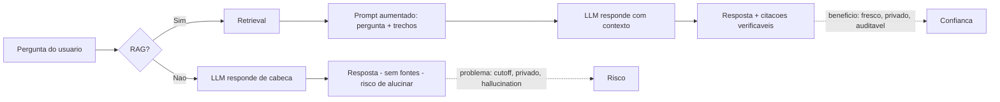
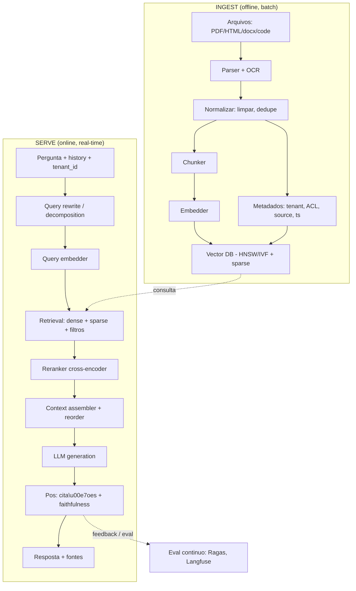
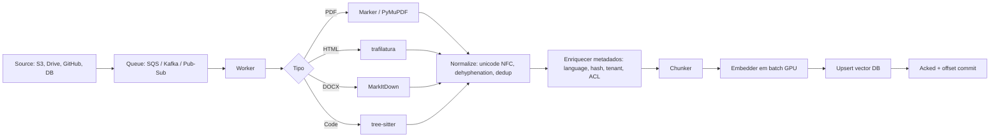
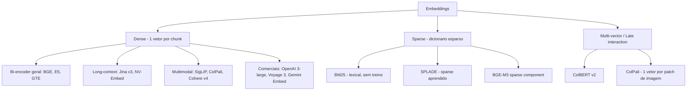
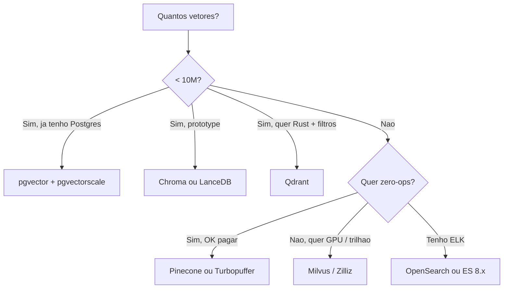
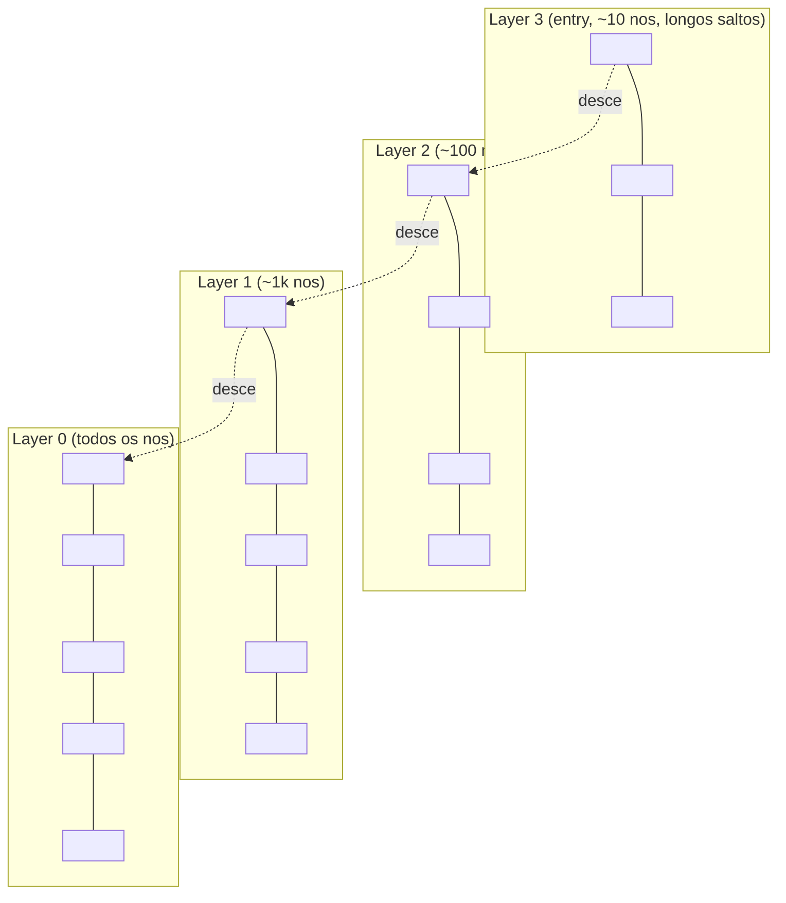
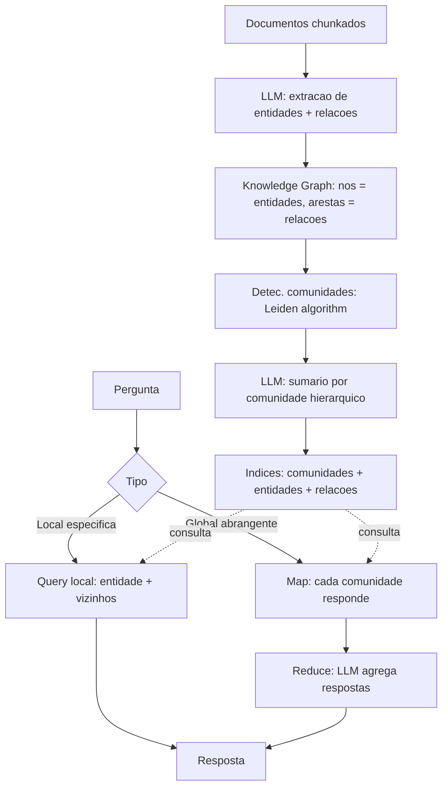
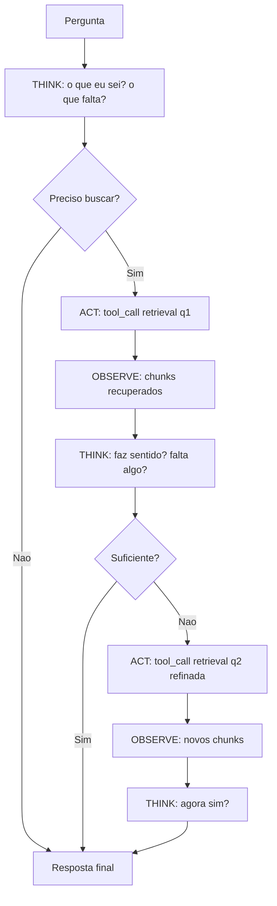
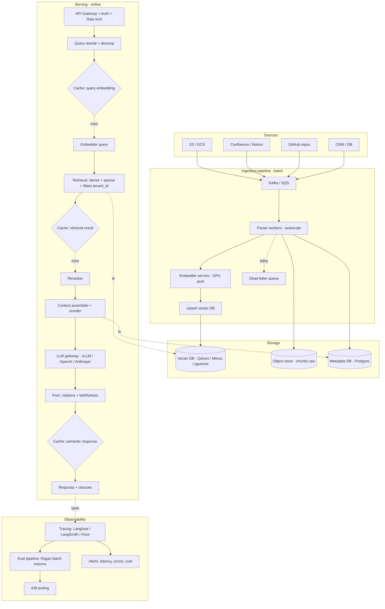

# Post 13 — RAG em profundidade: chunking, retrieval híbrido, rerank, GraphRAG, Agentic RAG e avaliação

> Série: **LLM Deep Dive** — do tijolo ao prédio.
> Pré-requisitos: Post 01 (arquitetura Transformer), Post 04 (quantização — útil para entender storage de embeddings) e Post 11 (frameworks de serving — onde RAG vive).
> Próximo post: **Post 14 — Function calling, tool use e o protocolo MCP.**

---

## TL;DR

- **RAG (Retrieval-Augmented Generation)** acopla um LLM a um **mecanismo de busca** sobre uma base de conhecimento privada e/ou atualizada. O LLM passa a responder com base em **trechos recuperados em tempo real**, em vez de depender só do que memorizou no pré-treino.
- O pipeline canônico tem **dez estágios**: ingestão → chunking → embedding → indexação vetorial → query embedding → retrieval (denso + esparso) → reranking → montagem de contexto → geração → pós-processamento (citações, *faithfulness check*).
- Em 2026, o estado da arte combina: **embeddings densos top-MTEB** (Gemini Embedding 001, NV-Embed v2, Qwen3-Embedding-8B, BGE-M3, Cohere Embed v4), **busca híbrida** (dense + BM25 ou SPLADE), **reranker cross-encoder** (BGE Reranker v2, Cohere Rerank 3, Voyage rerank-2), **vector DB** com HNSW + quantização (Qdrant, Milvus, pgvector + pgvectorscale, Pinecone, Turbopuffer) e **eval automático** com Ragas / DeepEval / TruLens / Langfuse.
- **GraphRAG** (Microsoft, 2024) e variantes (LightRAG, LazyGraphRAG, Neo4j LLM-KG-Builder) ganham em perguntas multi-hop e "qual é o tema geral?", mas custam **10–100×** mais para indexar.
- **Agentic RAG** (LangGraph, CrewAI, AutoGen, smolagents, LlamaIndex Agent) deixa o LLM **decidir quando, como e quantas vezes** buscar — patterns: **ReAct, Plan-and-Solve, Self-RAG, CRAG, HyDE, Step-back, Query decomposition**.
- **Long-context (10M tokens) não matou RAG**: precisão (*Lost in the Middle*), custo, controle de permissão e atualização incremental ainda fazem RAG vencer na maioria dos casos. O padrão emergente é **híbrido**: RAG seleciona, long-context absorve.

> **Analogia mestre.** Um LLM puro é um especialista que responde de cabeça. Um sistema **RAG** é um **estudante com biblioteca**: antes de abrir a boca, vai à estante, traz os livros certos, sublinha os trechos relevantes e cita as páginas. Um **Agentic RAG** é um **estagiário curioso** que pode voltar à biblioteca várias vezes, refinar a pergunta, comparar fontes e pedir ajuda a um especialista (outro modelo, uma calculadora, uma SQL). Um **GraphRAG** é um **bibliotecário que mantém um índice remissivo + sumários por capítulo**, em vez de só ofertar `Ctrl+F`.

---

## Índice

1. [Por que RAG existe (e por que não morreu)](#1-por-que-rag-existe-e-por-que-nao-morreu)
2. [Anatomia completa de um sistema RAG](#2-anatomia-completa-de-um-sistema-rag)
3. [Ingestão e parse: do PDF caótico ao texto estruturado](#3-ingestao-e-parse-do-pdf-caotico-ao-texto-estruturado)
4. [Chunking strategies: a arte de cortar bem](#4-chunking-strategies-a-arte-de-cortar-bem)
5. [Embeddings: o estado da arte 2026](#5-embeddings-o-estado-da-arte-2026)
6. [Vector databases: a comparação que importa](#6-vector-databases-a-comparacao-que-importa)
7. [HNSW por dentro: o GPS multi-zoom](#7-hnsw-por-dentro-o-gps-multi-zoom)
8. [PQ, OPQ, SQ, DiskANN — comprimindo o índice](#8-pq-opq-sq-diskann--comprimindo-o-indice)
9. [Hybrid search: dense + sparse + RRF](#9-hybrid-search-dense--sparse--rrf)
10. [Reranking: o segundo turno](#10-reranking-o-segundo-turno)
11. [Context assembly e o "Lost in the Middle"](#11-context-assembly-e-o-lost-in-the-middle)
12. [Prompts para RAG: o template que funciona](#12-prompts-para-rag-o-template-que-funciona)
13. [GraphRAG: quando o grafo bate o vetor](#13-graphrag-quando-o-grafo-bate-o-vetor)
14. [Agentic RAG: o LLM no comando da busca](#14-agentic-rag-o-llm-no-comando-da-busca)
15. [Multimodal RAG: ColPali e cia](#15-multimodal-rag-colpali-e-cia)
16. [Long-context vs RAG: o falso dilema](#16-long-context-vs-rag-o-falso-dilema)
17. [Avaliação de RAG: Ragas, TruLens, DeepEval](#17-avaliacao-de-rag-ragas-trulens-deepeval)
18. [Padrões avançados: HyDE, Self-RAG, CRAG, Step-back](#18-padroes-avancados-hyde-self-rag-crag-step-back)
19. [RAG em produção: arquitetura real](#19-rag-em-producao-arquitetura-real)
20. [Frameworks: LangChain, LlamaIndex, Haystack, DSPy, vanilla](#20-frameworks-langchain-llamaindex-haystack-dspy-vanilla)
21. [Custos: quanto custa de fato um RAG](#21-custos-quanto-custa-de-fato-um-rag)
22. [Cross-references e roadmap](#22-cross-references-e-roadmap)
23. [Referências](#23-referencias)

---

## 1. Por que RAG existe (e por que não morreu)

### 1.1 Os cinco problemas que o LLM puro não resolve

Um LLM denso é, em essência, uma **função estatística** treinada sobre um *snapshot* de texto. Isso traz cinco problemas práticos quando você quer **colocar em produção**:

1. **Cutoff de treino.** O modelo não sabe nada depois da data em que parou de ler. Llama 4 (2025) sabe pouco sobre eventos de 2026; um GPT-5 com cutoff em junho/2025 não conhece o release notes da sua API que saiu hoje.
2. **Conhecimento factual privado.** Sua wiki interna, contratos de cliente, base de tickets, documentação de código privada — nada disso está no pré-treino. **Fine-tune** para isso é caro, lento, ruim para *recall* exato e impossível de auditar.
3. **Alucinação.** Quando o modelo "preenche lacunas", ele tende a fabricar fatos plausíveis. RAG mitiga isso amarrando a resposta a **trechos verificáveis**.
4. **Auditabilidade e *citations*.** Em domínios regulados (saúde, jurídico, financeiro), uma resposta sem fonte é uma resposta que ninguém confia. RAG entrega o trecho e o link.
5. **Permissionamento por documento.** Em um SaaS multi-tenant, o usuário A não pode ver dados do usuário B. Fine-tune do modelo inteiro com dados de todos é um vazamento esperando para acontecer. **Filtro por metadado no retrieval** resolve em uma linha.

> **Analogia.** Imagine um médico recém-formado (LLM puro): tem ótima base teórica, mas não conhece o histórico do *seu* paciente, a bula da droga lançada na semana passada, ou o protocolo interno do hospital. RAG é o **prontuário eletrônico + buscador de bulas + protocolos**: o mesmo médico, agora sabe o que precisa saber **deste caso**, **agora**.

### 1.2 Diagrama mental: o que muda com RAG



### 1.3 Os trade-offs reais (RAG não é grátis)

RAG resolve os cinco problemas acima, mas **adiciona** complexidade:

- **Latência extra**: 50–500 ms para retrieval + rerank antes de gerar.
- **Operação de pipeline de ingestão** (queue, parser, embedder, índice) — um sistema distribuído inteiro.
- **Manutenção do índice**: deletes, updates, re-embedding quando troca o modelo, *backfills*.
- **Qualidade depende da qualidade do retrieval**: lixo entra, lixo sai (*garbage in, garbage out*). Um RAG mal-tuned pode ser pior que o LLM puro porque enfia ruído no contexto.
- **Custo de embeddings**: indexar 10M docs × 1k tokens × \$0.13/1M ≈ **\$1.300** com OpenAI 3-large; **zero** com BGE-M3 self-hosted (mas você paga GPU).

A pergunta não é "RAG ou não", é "**quanto** RAG e **onde** colocar a complexidade".

---

## 2. Anatomia completa de um sistema RAG

### 2.1 Os dez estágios canônicos

| # | Estágio | Entrada | Saída | Componente típico |
|---|---|---|---|---|
| 1 | **Ingestão / parse** | arquivos brutos (PDF, HTML, docx) | texto + metadados estruturados | Unstructured, Marker, MarkItDown |
| 2 | **Chunking** | texto longo | trechos de 200–1000 tokens | LangChain `RecursiveCharacterTextSplitter`, semantic chunker |
| 3 | **Embedding** | chunk de texto | vetor denso (e/ou esparso) | BGE-M3, OpenAI 3-large, NV-Embed |
| 4 | **Indexação** | vetores + metadados | índice consultável (HNSW/IVF) | Qdrant, Milvus, pgvector |
| 5 | **Query embedding** | pergunta do usuário | vetor denso (e/ou esparso) | mesmo modelo do passo 3 |
| 6 | **Retrieval** | vetor de query + filtros | top-K candidatos (K=20–100) | ANN do vector DB + BM25 |
| 7 | **Reranking** | top-K candidatos | top-N reordenado (N=3–10) | cross-encoder (BGE, Cohere, Voyage) |
| 8 | **Context assembly** | top-N + pergunta + history | prompt final | template + reorder *lost-in-the-middle* |
| 9 | **Generation** | prompt aumentado | resposta com markup de citação | LLM (vLLM, Anthropic, OpenAI) |
| 10 | **Post-process** | resposta crua | resposta validada + citações resolvidas | parser de citações, *faithfulness* check |

### 2.2 Diagrama master



### 2.3 As três decisões que mais movem o ponteiro

Em centenas de projetos RAG, três decisões dominam a qualidade:

1. **Como você corta** (chunking).
2. **Como você busca** (retriever + rerank).
3. **Como você prompta** (template + ordem dos chunks).

O resto (qual vector DB exato, qual LLM exato) costuma mexer **menos** do que essas três. Foque seu tempo nelas.

---

## 3. Ingestão e parse: do PDF caótico ao texto estruturado

Lixo entra, lixo sai. **80% dos problemas de RAG nascem aqui**. Um PDF mal parseado vira chunks que misturam cabeçalho de página, número de página e duas colunas embaralhadas — o embedding fica ruim, o retrieval fica pior.

### 3.1 Tipos de fonte e ferramentas recomendadas (2026)

| Tipo de fonte | Desafio | Ferramenta recomendada 2026 | Notas |
|---|---|---|---|
| **PDF nativo (texto)** | layout em colunas, headers, tabelas | **PyMuPDF (`pymupdf4llm`)**, **Marker**, **Unstructured** | Marker (VikParuchuri) usa modelos para layout; PyMuPDF é o mais rápido |
| **PDF escaneado** | precisa OCR | **Marker + Surya OCR**, **Tesseract 5**, ou **VLM** (Qwen2-VL, GPT-4o, Gemini 2.5) | VLM custa mais mas pega tabelas e gráficos |
| **HTML web** | menus, anúncios, JS-rendered | **trafilatura**, **readability-lxml**, **Playwright + readability** | trafilatura é o melhor para artigo / blog |
| **DOCX / PPTX / XLSX** | formato proprietário, embedded objects | **python-docx**, **python-pptx**, **openpyxl**, ou **MarkItDown** (Microsoft) | MarkItDown converte tudo para Markdown |
| **E-mail (eml/mbox)** | threads, anexos, encoding | **mail-parser**, `email` da stdlib + recursão | Não esqueça anexos |
| **Tabelas** | alinhamento, headers multi-linha | **GMFT**, **table-transformer (Microsoft)**, **Camelot** (PDFs) | Para PDFs de relatório financeiro, GMFT é a melhor 2026 |
| **Código-fonte** | sintaxe, imports, símbolos | **tree-sitter**, **AST-grep**, **LangChain LanguageParser** | Chunkear por função/classe, não por linhas |
| **Imagens (gráficos, diagramas)** | precisa interpretação | **Florence-2**, **Qwen2-VL**, **GPT-4o vision**, **ColPali** (page-level) | Para slides com gráficos, ColPali bate OCR |
| **Áudio / vídeo** | transcrever | **whisper.cpp**, **WhisperX**, **AssemblyAI** | Diarização separada (pyannote) |
| **JSON / XML / Markdown** | já estruturado | parser nativo + chunker que respeita estrutura | Mais fácil; aproveite metadados |

### 3.2 Pipeline canônico de ingestão



### 3.3 Boas práticas de normalização

- **Dehyphenation**: PDFs cortam palavras no fim da linha (`compu-`\n`tador`). Junte antes de embedar.
- **Deduplicação**: hash MD5/SHA-256 de cada parágrafo; se já existe, skip. Em wikis muitos parágrafos são re-importados.
- **Detecção de idioma** (lingua-py, fastText): salve como metadado, útil para filtrar.
- **Preservação de estrutura**: salve `heading_path = "Capitulo 3 > Secao 2 > Tabela 4"` como metadado. Um chunk solto sem contexto perde semântica.
- **Source tracking**: salve `source_url`, `page`, `bbox` (coordenadas no PDF) para citação clicável depois.

---

## 4. Chunking strategies: a arte de cortar bem

Chunkear é decidir **onde quebrar o texto** antes de embedar. É uma das decisões mais subestimadas. Um chunk bom tem:

- **Tamanho compatível** com o modelo de embedding (típico: 256–512 tokens; modelos modernos aceitam até 8k).
- **Coerência semântica** (não corta no meio de um raciocínio).
- **Sobreposição** (overlap) suficiente para não perder âncora de contexto entre chunks vizinhos.
- **Granularidade alinhada à pergunta**: para Q&A factual, chunks pequenos; para sumarização, chunks grandes.

### 4.1 As sete estratégias principais

| Estratégia | Como funciona | Prós | Contras | Quando usar |
|---|---|---|---|---|
| **Fixed-size + overlap** | corta a cada N tokens, overlap M | trivial, rápido, baseline universal | quebra frases ao meio | baseline / *prototype* |
| **Sentence / paragraph** | nltk, spaCy, segmenta por pontuação | respeita unidades naturais | tamanhos muito variáveis | textos bem-formatados (artigos) |
| **Recursive character** (LangChain) | tenta `\n\n` → `\n` → `. ` → ` ` em ordem | bom default, respeita parágrafos | precisa tunar `chunk_size` | uso geral |
| **Semantic chunking** (Greg Kamradt) | embed cada sentença, quebra onde a similaridade cai | chunks tematicamente coerentes | caro (1 embedding por sentença na ingestão) | base de conhecimento curada |
| **Document-aware (Markdown / HTML)** | quebra por `#`, `<h1>`, `<section>` | preserva hierarquia + heading_path | só funciona se source for estruturado | docs técnicas, wikis |
| **Late chunking** (Jina, 2024) | embeda **o documento inteiro** num modelo long-context, depois faz pooling por chunk | cada chunk vê o contexto global | exige modelo long-context (Jina v3, 8k) | docs longos com referências cruzadas |
| **Hierarchical / parent-child** | indexa chunks pequenos, mas ao recuperar entrega o **chunk pai** maior | precisão do small + contexto do big | dois níveis de armazenamento | Q&A onde resposta precisa de contexto extra |

> **Analogia.** Chunking é como fazer **fichas de estudo** a partir de um livro. Fichas curtas (frase única) são fáceis de achar mas perdem o argumento. Fichas longas (página inteira) carregam contexto mas confundem na hora de procurar. As fichas com **título + tópico + resumo** (parent-child) são as que estudante de medicina usa para o segundo ano.

### 4.2 Pseudocódigo: semantic chunking (estilo Kamradt)

```python
import numpy as np
from sentence_transformers import SentenceTransformer

def semantic_chunk(text: str, model_name="BAAI/bge-small-en-v1.5",
                   percentile_threshold=95) -> list[str]:
    """
    Quebra o texto onde a distancia entre embeddings de sentencas
    consecutivas excede um percentil (quebra em 'mudancas de assunto').
    """
    model = SentenceTransformer(model_name)
    sentences = split_sentences(text)
    embs = model.encode(sentences, normalize_embeddings=True)

    distances = [
        1 - float(np.dot(embs[i], embs[i + 1]))
        for i in range(len(embs) - 1)
    ]
    threshold = np.percentile(distances, percentile_threshold)

    chunks, current = [], [sentences[0]]
    for i, d in enumerate(distances):
        if d > threshold:
            chunks.append(" ".join(current))
            current = [sentences[i + 1]]
        else:
            current.append(sentences[i + 1])
    if current:
        chunks.append(" ".join(current))
    return chunks


def split_sentences(text: str) -> list[str]:
    import re
    return [s.strip() for s in re.split(r"(?<=[.!?])\s+", text) if s.strip()]
```

### 4.3 Late chunking: a virada de 2024 (Jina)

Late chunking inverte a ordem clássica:

- **Clássico**: chunk → embed cada chunk isoladamente.
- **Late chunking**: embed o documento inteiro → faz **mean-pooling** dos *token embeddings* dentro de cada chunk.

Por que importa: cada chunk "vê" o documento inteiro durante o forward, então pronome (`ele`, `ela`, `aquilo`) ainda carrega o referente. Funciona em modelos long-context (Jina v3, NV-Embed, BGE-M3 com 8k).

### 4.4 Hierarchical / parent-child em ASCII

```text
Document
  +-- Chunk pai 1 (1500 tok)  <-- retornado como contexto
       +-- chunk filho 1.a (300 tok)  <-- embedado e indexado
       +-- chunk filho 1.b (300 tok)  <-- embedado e indexado
  +-- Chunk pai 2 (1500 tok)
       +-- chunk filho 2.a
       +-- chunk filho 2.b
```

Quando o filho é recuperado, o sistema entrega o **pai** ao LLM. É barato, simples, e **eleva* a qualidade em domínios técnicos onde o contexto adjacente importa.

### 4.5 Heurísticas de tamanho

- **Tarefa Q&A factual** (`"Qual é o CEO da empresa X?"`): chunks **300–500 tokens**, overlap 50–75.
- **Sumarização / análise**: chunks **1000–2000 tokens**, overlap 100–200.
- **Código**: chunkear por função/classe (tree-sitter), não por contagem de tokens.
- **Conversa multi-turn**: chunkear por turno, manter `dialog_id` em metadado.

---

## 5. Embeddings: o estado da arte 2026

Um *embedding* é uma função `f: texto -> R^d` tal que **textos semanticamente próximos** ficam **geometricamente próximos** (distância coseno baixa). O embedding é o mapa: se ele estiver torto, todo retrieval será torto.

> **Analogia.** Embedding é mapear cada documento como **um ponto numa cidade**. Dois documentos sobre "queijo" caem no bairro Lácteos; dois sobre "chess opening" no bairro Esportes. Boa cartografia → bom GPS de busca.

### 5.1 Famílias de embedding



### 5.2 Top embedders em 2026 (validado em web search)

| Modelo | Provedor | Dim | Max tokens | Multilíngue | Preço (1M tok) | Notas |
|---|---|---|---|---|---|---|
| **Gemini Embedding 001** | Google | 768/1536/3072 | 8192 | sim | \$0.025 | #1 MTEB EN (mar/2026), Matryoshka |
| **NV-Embed-v2** | NVIDIA | 4096 | 32768 | parcial | self-host | Top MTEB free, pesa 7B |
| **Qwen3-Embedding-8B** | Alibaba | 4096 | 32768 | 119 idiomas | self-host | #2-4 MTEB, 0.6B/4B/8B |
| **OpenAI text-embedding-3-large** | OpenAI | 3072 (Matryoshka) | 8191 | sim | \$0.13 | API confiável, mas perde para Gemini em MTEB |
| **Cohere Embed v4** | Cohere | 1536 | 128k | sim | \$0.10 | Multimodal nativo (texto+imagem) |
| **Voyage-3** | Voyage AI | 1024 | 32k | sim | \$0.06 | Bom custo-benefício, multimodal-3 disponível |
| **BGE-M3** | BAAI | 1024 | 8192 | 100+ idiomas | self-host | 3-em-1: dense+sparse+multivector |
| **bge-large-en-v1.5** | BAAI | 1024 | 512 | EN | self-host | Clássico, ainda muito usado |
| **intfloat/e5-mistral-7b-instruct** | intfloat | 4096 | 4096 | sim | self-host | Forte em retrieval instructed |
| **Nomic Embed v2** | Nomic | 768 | 8192 | sim | self-host | MoE, eficiente |
| **Jina Embeddings v3** | Jina AI | 1024 (Matryoshka) | 8192 | sim | API ou self-host | Late chunking nativo |
| **Snowflake Arctic-Embed 2.0** | Snowflake | 1024 | 8192 | sim | self-host | Forte enterprise |
| **stella-en-1.5B-v5** | Dunzhang | 8192 | 512 | EN | self-host | Compactos e rapidos |
| **Cohere Embed-Multilingual-v3** | Cohere | 1024 | 512 | 100+ | API | Legado, ainda popular |

> **Aviso honesto**: scores MTEB são auto-reportados. Sempre **rode seu próprio benchmark** com perguntas reais do seu domínio antes de fechar a escolha.

### 5.3 Dimensão vs custo de storage

Um vetor `float32` de dimensão `d` ocupa `4d` bytes. Para 10M chunks:

| Dimensão | FP32 | INT8 | INT4 | Binary |
|---|---|---|---|---|
| 384 | 14 GB | 3.5 GB | 1.8 GB | 460 MB |
| 768 | 28 GB | 7 GB | 3.5 GB | 920 MB |
| 1024 | 38 GB | 9.5 GB | 4.7 GB | 1.2 GB |
| 1536 | 57 GB | 14 GB | 7.1 GB | 1.8 GB |
| 3072 | 114 GB | 28 GB | 14 GB | 3.6 GB |
| 4096 | 152 GB | 38 GB | 19 GB | 4.8 GB |

A 1B vetores (escala Pinterest), até INT8 começa a doer. É aí que entram **PQ, Matryoshka, binary embeddings**.

### 5.4 Matryoshka Representation Learning (MRL)

Modelos modernos (Gemini Embedding, OpenAI 3-large, Jina v3) treinam com perda **Matryoshka**: o vetor de dimensão `d` continua útil quando truncado para `d/2`, `d/4`. Isso permite trade-off em **runtime** sem re-treinar.

```python
emb = model.embed("texto")  # dim 3072
emb_512 = emb[:512]         # mesma semantica, 16% do storage
emb_512 = emb_512 / np.linalg.norm(emb_512)  # renormalizar!
```

### 5.5 Binary embeddings

Pesquise com `embed_int8` ou `embed_binary` (Mixedbread, Cohere, Jina suportam): cada componente vira 1 bit, distância vira **Hamming**. Recall cai 5–10%, storage cai 32×, throughput sobe 30×. Padrão para escala bilhão.

---

## 6. Vector databases: a comparação que importa

### 6.1 O cenário 2026 em uma tabela

| DB | Tipo | Linguagem | HNSW | Hybrid (BM25) | Filtros multi-tenant | Escala provada | Hosted | Quando escolher |
|---|---|---|---|---|---|---|---|---|
| **pgvector** + **pgvectorscale** (TimescaleDB) | Postgres ext | C | sim + StreamingDiskANN | via tsvector | sim (RLS) | dezenas de M | Supabase, Neon, RDS | Já tem Postgres, quer simplicidade |
| **Qdrant** | open-source (Apache 2) | Rust | sim, BM25 nativo (2025+) | sim | excelente (payload index) | bilhões | Qdrant Cloud | Performance, Rust, filtros complexos |
| **Milvus** | open-source (Apache 2) | C++/Go | sim + IVF + DiskANN + GPU | sim | sim | trilhões (Zilliz) | Zilliz Cloud | Escala extrema, GPU |
| **Weaviate** | open-source (BSD-3) | Go | sim | sim (hybrid score) | sim | bilhões | Weaviate Cloud | Modular, GraphQL, módulos próprios |
| **LanceDB** | embedded (Apache 2) | Rust | sim | sim | sim | dezenas de M | serverless | App local, edge, Lance file format |
| **Chroma** | embedded → server | Python/Rust | sim | sim (recente) | sim | M | Chroma Cloud | Dev / prototype rápido |
| **Pinecone** | SaaS proprietário | (fechado) | proprietário | sim (sparse-dense) | sim (namespaces) | bilhões | exclusivo | Zero-ops, time-to-market |
| **Turbopuffer** | SaaS (object-storage backed) | Rust | sim | sim | sim | dezenas de B | exclusivo | Custo baixo a frio (S3) |
| **Vespa** | open-source (Apache 2) | Java/C++ | HNSW + tensor | nativo (Yahoo legado) | sim | trilhões | Vespa Cloud | Pesquisa avançada, ranking complexo |
| **Elasticsearch 8.x / OpenSearch** | open-source / managed | Java | dense_vector field | nativo (BM25) | sim | bilhões | Elastic Cloud | Já tem ELK, quer um índice só |
| **Redis Stack (RediSearch)** | in-memory | C | sim | sim | sim | dezenas de M | Redis Cloud | Latência <10ms, em RAM |
| **MongoDB Atlas Vector Search** | document DB | C++ | sim | sim ($search) | sim | bilhões | Atlas | Já é MongoDB shop |

### 6.2 Latência média (10M vetores @ 1536 dim, validado web 2026)

| DB | p50 | p99 | QPS típico |
|---|---|---|---|
| **Qdrant** | 4 ms | 25 ms | ~5.100 |
| **Milvus** | 6 ms | 35 ms | ~4.200 |
| **Pinecone** | 8 ms | 45 ms | ~2.800 |
| **pgvector + pgvectorscale** | 10 ms | 80 ms | ~2.000 |
| **Weaviate** | 7 ms | 40 ms | ~3.500 |

Qdrant lidera em latência por causa do Rust + HNSW bem-tunado. Para a maioria dos casos, **a diferença não importa** — escolha por *fit* operacional.

### 6.3 Heurística de escolha



---

## 7. HNSW por dentro: o GPS multi-zoom

**HNSW** = *Hierarchical Navigable Small World* (Malkov & Yashunin, 2018, arXiv:1603.09320). É hoje o **algoritmo de ANN dominante** em todos os vector DBs práticos.

> **Analogia.** Pense num **mapa do Google Maps**. Para chegar de São Paulo a um restaurante específico no Rio, você não percorre cada rua: começa no **mapa do Brasil** (zoom 1), pula para **Rio de Janeiro** (zoom 5), depois para **Botafogo** (zoom 12), depois desce para a **Rua Voluntários da Pátria** (zoom 18). HNSW faz isso com vetores: camada 0 tem todos os pontos; camadas superiores têm cada vez menos, mas com saltos longos.

### 7.1 A estrutura



### 7.2 Algoritmo de busca (greedy traversal)

```
search(query q, ef):
  curr = entry_point   # no na camada mais alta
  for layer in [L_top .. L_1]:
    # greedy: pula para vizinho mais proximo de q ate nao melhorar
    curr = greedy_search(curr, q, layer, ef=1)
  # ultima camada: lista priorizada, retorna top-k
  candidates = greedy_search(curr, q, layer=0, ef=ef)
  return top_k(candidates)
```

### 7.3 Hiperparâmetros

| Parâmetro | O que controla | Padrão | Trade-off |
|---|---|---|---|
| `M` | conexões por nó | 16–32 | maior → mais recall, mais memória |
| `ef_construction` | candidatos durante insert | 100–400 | maior → grafo melhor, ingestão mais lenta |
| `ef_search` | candidatos durante query | 50–500 | maior → mais recall, latência maior |
| `mL` (level multiplier) | distribuição entre camadas | `1/ln(M)` | raramente mexido |

**Regra prática**: comece com `M=16, ef_construction=200, ef_search=100`. Se recall < 95%, suba `ef_search` (custa só latência). Se ainda baixo, suba `M` (custa memória).

### 7.4 Trade-offs latência × recall

```text
recall@10
1.00 |                                ___
     |                          ____/
0.95 |                    ___/                    <- alvo tipico
     |                __/
0.90 |             _/
     |          _/
0.80 |        /
     |      /
     |     |____________________________________
     |     50   100    200    400    800   1600    ef_search
```

A curva é **logarítmica**: dobrar `ef_search` traz cada vez menos recall, com custo linear de latência. Encontre o joelho.

---

## 8. PQ, OPQ, SQ, DiskANN — comprimindo o índice

Vetores em FP32 são caros. Para escala, comprime-se com **quantização**.

### 8.1 Product Quantization (PQ) — Jegou et al. 2010

A ideia é **dividir o vetor em sub-vetores e quantizar cada sub-espaço com K-means**:

```
vetor de dim 1024 = [v1 ... v1024]
divide em 8 sub-vetores de dim 128
para cada sub-espaco, treina K-means com 256 clusters
cada vetor vira 8 codigos de 8 bits = 8 bytes
```

Compressão: 1024 × 4 = 4096 bytes → 8 bytes (**512×**). Distância aproximada via *Asymmetric Distance Computation* (ADC) com lookup tables.

### 8.2 OPQ — Optimized Product Quantization

PQ assume sub-espaços independentes, mas vetores reais têm **correlação anisotrópica**. OPQ aplica uma **rotação ortogonal** antes de PQ para distribuir variância. Ganho: +2–5 pp de recall ao mesmo bitrate.

### 8.3 SQ — Scalar Quantization

Cada componente independente: `INT8` (1 byte por dim) ou `INT4` (0.5 byte). Mais simples, recall melhor que PQ na mesma compressão moderada (4–8×). Padrão em Qdrant, Milvus, Faiss.

### 8.4 DiskANN — quando o índice não cabe em RAM

DiskANN (Subramanya et al. 2019, Microsoft) combina:

- Grafo navegável **em SSD** (não cabe em RAM).
- PQ para **filtragem grosseira em RAM**.
- I/O paginado: cada hop carrega só os vizinhos necessários.

Permite indexar **bilhões** de vetores numa única máquina com 64 GB de RAM. **pgvectorscale** (Timescale) implementa DiskANN como extensão do pgvector — é uma virada de jogo para 2025/2026.

### 8.5 Conexão com TurboQuant (Post 06)

TurboQuant é, em essência, **PQ na esfera**: usa **decomposição polar + JL projections + Lloyd–Max** para garantir quantização **não-enviesada** com cota teórica `4^{-b}`. Em RAG, isso significa:

- Para **distância coseno** (a métrica padrão em embeddings normalizados), TurboQuant entrega **menos drift** que PQ clássico.
- Para *long-tail* de queries com baixa similaridade, recall sobe.
- Ainda não tem implementação madura nos vector DBs mainstream, mas é o caminho natural de evolução. Veja Post 06 para o tratamento formal.

---

## 9. Hybrid search: dense + sparse + RRF

### 9.1 Por que dense não basta

Embeddings densos são bons em **semântica** (`"vacina contra COVID"` ≈ `"imunizante para SARS-CoV-2"`), mas falham em **termos raros e exatos**:

- Códigos: `ERR-4032`, `K8s deployment crashloop`.
- Nomes próprios: `Maria Aparecida Junqueira Saldanha`.
- Acrônimos: `OAuth2 PKCE`.
- Identificadores: SKUs, ISBNs, números de processo.

**Sparse retrievers** (BM25, SPLADE) brilham aqui: tokens raros têm IDF alta e dominam o ranking.

> **Analogia.** Dense é o **bibliotecário humano** que entende o tema. Sparse é o **Ctrl+F** que acha a palavra exata. Você quer os dois.

### 9.2 Receitas de fusão

| Técnica | Descrição | Quando usar |
|---|---|---|
| **Convex combination** | `score = λ · dense + (1-λ) · sparse` | precisa normalizar scores; ajustar λ é trabalhoso |
| **Reciprocal Rank Fusion (RRF)** | combina **rankings** sem usar scores | default robusto, não precisa normalizar |
| **Boosted re-rank** | retrieve dense + sparse separadamente, dedupe, manda tudo pro reranker | mais caro, melhor qualidade |
| **SPLADE puro** | sparse aprendido, único índice | bom quando dense é caro de servir |
| **BGE-M3 multifuncional** | um modelo gera dense + sparse + multivector ao mesmo tempo | reduz infra; ganha em multilíngue |

### 9.3 RRF — Reciprocal Rank Fusion

Cormack et al. 2009. Fórmula:

```
RRF_score(d) = sum over rankers r:
    1 / (k + rank_r(d))
```

`k` é uma constante (60 é o padrão da literatura). Não importa a magnitude dos scores — só a **posição** importa. Robusto, simples, **default da indústria**.

### 9.4 Pseudocódigo RRF

```python
from collections import defaultdict

def reciprocal_rank_fusion(rankings: list[list[str]], k: int = 60) -> list[tuple[str, float]]:
    """
    rankings: lista de listas de doc_ids, cada uma ordenada por relevancia decrescente
    """
    scores = defaultdict(float)
    for ranking in rankings:
        for rank, doc_id in enumerate(ranking, start=1):
            scores[doc_id] += 1.0 / (k + rank)
    return sorted(scores.items(), key=lambda x: x[1], reverse=True)


dense_results = vector_search(query_emb, top_k=50)            # ['d12', 'd7', ...]
sparse_results = bm25_search(query_text, top_k=50)             # ['d3',  'd12', ...]
fused = reciprocal_rank_fusion([dense_results, sparse_results])
top10 = fused[:10]
```

### 9.5 SPLADE em uma frase

SPLADE (Formal et al. 2021) treina um BERT para emitir um **vetor esparso sobre o vocabulário** com expansão de termos (escreve `"car"` mas o vetor ativa `"vehicle, automobile"` também). Bate BM25 em vários benchmarks BEIR. Usado por Pinecone (sparse-dense), Qdrant, Vespa.

### 9.6 BGE-M3: três retrievers num modelo

BGE-M3 (BAAI, 2024) emite simultaneamente:

- Vetor denso 1024-d.
- Vetor sparse (token weights).
- Multi-vector (até 16 vetores por chunk, estilo ColBERT-lite).

Você indexa **uma vez**, faz **três** rankings, faz RRF. Padrão moderno em RAG multilíngue.

---

## 10. Reranking: o segundo turno

### 10.1 Por que rerankear

Bi-encoders (modelos que embedam query e doc separadamente) são **rápidos** mas não modelam **interação** entre tokens. Cross-encoders veem `[CLS] query [SEP] doc [SEP]` e produzem um score com **atenção cruzada total** — muito mais preciso, muito mais caro.

Padrão: retriever traz **top-50 ou top-100**, reranker reordena para **top-5 ou top-10**.

> **Analogia.** Retrieval é a **triagem do hospital**: 50 pacientes aproximadamente urgentes. Rerank é o **médico**: olha cada um, prioriza. Dá pra mandar 50 direto pro médico? Dá. Mas custa 10× mais.

### 10.2 Catálogo de rerankers (2026)

| Reranker | Tipo | Latência (par q-d) | Qualidade (NDCG@10 BEIR) | Notas |
|---|---|---|---|---|
| **BGE Reranker v2 (m3)** | cross-encoder open | ~5 ms | ~55 | Self-host, multilingual |
| **BGE Reranker v2-Gemma-2B** | LLM-based | ~30 ms | ~57 | LLM como reranker |
| **Cohere Rerank 3** | API | ~50 ms | ~58 | Qualidade alta, multimodal |
| **Voyage rerank-2 / rerank-2.5** | API | ~40 ms | ~58 | Forte em domínio técnico |
| **Jina Reranker v2** | API + open | ~10 ms | ~54 | Multilingual, function-calling |
| **Cross-Encoder ms-marco-MiniLM-L-12-v2** | sentence-transformers | ~3 ms | ~50 | Velho, baseline |
| **ColBERTv2** | late interaction | ~15 ms | ~56 | Compromisso entre bi e cross |
| **RankGPT (LLM)** | listwise prompt num LLM | ~3000 ms | ~60 | Caro, qualidade altíssima |
| **monoT5** | T5 fine-tuned | ~20 ms | ~52 | Clássico |

### 10.3 Latência: a aritmética

Rerankear **top-50 com cross-encoder de 5 ms/par** = 250 ms. Adicionado ao retrieval (50 ms) e à geração (1–3 s), fica imperceptível para o usuário.

Rerankear top-50 com **RankGPT (LLM listwise)** = 3 s. Pode dobrar a latência. Usar só se a qualidade compensa o custo (perguntas críticas, baixo volume).

### 10.4 Padrão recomendado

```text
Retrieval (top-50, hybrid dense+sparse)
       |
       v
Cross-encoder rerank (top-50 -> top-10)   <-- BGE Reranker v2 self-hosted
       |
       v
Context assembly (top-5 ou top-10 finais)
```

Se for crítico (jurídico, médico), considere uma terceira camada **LLM-as-judge** para top-5 → top-3.

---

## 11. Context assembly e o "Lost in the Middle"

### 11.1 O fenômeno (Liu et al. 2023, arXiv:2307.03172)

Quando você enfia 10–20 chunks no prompt, o LLM **não atende a todos por igual**. Há um viés em "U": **chunks no começo e no fim** recebem mais atenção; chunks no **meio** são "esquecidos". Vale para GPT-4, Claude, Llama, Gemini — independe da arquitetura.

```text
Atenção do LLM ao posição do chunk no prompt:

   alta |\                                /
        | \                              /
   atn  |  \                            /
        |   \____      ____      ____/
   baixa|        \___/    \____/
        |________________________________
         pos 1    5    10   15    20    25
                       ^^^^^^^^^^
                       lost in the middle
```

### 11.2 Mitigação: reorder

Se você tem 10 chunks ranqueados, em vez de jogar `[1,2,3,4,5,6,7,8,9,10]` no prompt, faça **interleave em U**:

```python
def reorder_lost_in_middle(chunks_ranked: list) -> list:
    """
    [1,2,3,4,5,6,7,8,9,10] -> [1,3,5,7,9,10,8,6,4,2]
    impares para a frente, pares invertidos para o final
    """
    odds = chunks_ranked[::2]
    evens = chunks_ranked[1::2][::-1]
    return odds + evens
```

### 11.3 Token budget

Defina:

- `prompt_overhead` = system prompt + few-shots fixos (~500 tok).
- `context_budget` = `model_ctx_max - prompt_overhead - history - max_completion`.
- Quantos chunks cabem? `context_budget / avg_chunk_size`.

Para Claude Sonnet 4.5 (200k ctx) com chunks de 500 tok, cabem facilmente 100+. Para GPT-5 mini com 128k, ~200. Mas **não significa que você deva** — qualidade não escala linear (Lost in the Middle).

### 11.4 Citations rendering

Ao montar o prompt, **numere** os chunks e instrua o LLM a citar:

```text
[1] {chunk_1.text} (source: {chunk_1.source}, page {chunk_1.page})
[2] {chunk_2.text} ...
...
[N] ...

Pergunta: {user_question}

Instrucao: Responda usando APENAS os trechos acima.
Cada afirmacao deve ser seguida da citacao [n].
Se a resposta nao estiver nos trechos, diga 'Nao encontrado'.
```

No pós-processamento, extraia `[1]`, `[2]`, etc. da resposta e renderize como links clicáveis para `source + page`.

---

## 12. Prompts para RAG: o template que funciona

### 12.1 Template canônico (use-o e adapte)

```text
SYSTEM:
Voce e um assistente que responde com base em trechos de documentos
fornecidos. Regras invioláveis:

1. Use APENAS os trechos abaixo. Nao invente fatos.
2. Cada afirmacao deve incluir [n] referenciando o trecho.
3. Se a resposta nao estiver nos trechos, diga literalmente:
   "Nao encontrei essa informacao nos documentos disponiveis."
4. Para datas, numeros e nomes, transcreva exatamente como no trecho.
5. Cite mais de um trecho quando houver convergencia.

TRECHOS:
[1] {chunk_1}
[2] {chunk_2}
...
[N] {chunk_N}

HISTORICO DE CONVERSA (para contexto):
{history}

PERGUNTA: {question}

RESPOSTA:
```

### 12.2 Templates por caso de uso

| Caso de uso | Diferencial | Sistema/instrução chave |
|---|---|---|
| **Q&A factual** | citação obrigatória | "Cada frase deve ter [n]" |
| **Sumarização de docs** | preservar estrutura | "Estruture em: TL;DR / Pontos-chave / Caveats" |
| **Comparação de docs** | tabela | "Use uma tabela markdown comparando X, Y, Z" |
| **Raciocínio multi-hop** | step-by-step | "Pense passo a passo. Use [n] em cada passo" |
| **Geração de SQL/JSON** | schema | inclua schema no system, exemplo few-shot |
| **Suporte ao cliente** | tom + escalation | "Tom empatico. Se nao souber, ofereca contato humano" |
| **Compliance / jurídico** | abstain agressivo | "Em duvida, RECUSE responder. Cite cl\u00e1usulas literais" |

### 12.3 Few-shot em RAG?

Para Q&A factual, **few-shots gerais raramente ajudam** — o contexto recuperado já é a "demonstração". Para tarefas estruturais (gerar JSON, classificar), few-shots ajudam muito. Coloque os exemplos **antes** dos chunks recuperados (são parte do `prompt_overhead` fixo).

### 12.4 Forçar abstenção

A instrução `"Se nao souber, diga nao sei"` reduz alucinação **em ordem de magnitude**. Combine com:

- Filtro: se reranker score do top-1 < threshold, retorne abstenção sem chamar LLM.
- *Faithfulness check* posterior (Ragas): re-pergunte ao LLM se cada afirmação está suportada.

---

## 13. GraphRAG: quando o grafo bate o vetor

### 13.1 O problema que GraphRAG resolve

RAG vetorial brilha em "qual é a resposta para esta pergunta específica". Mas em perguntas **multi-hop** ou **abrangentes** ("quais são os principais temas neste corpus?", "que conexões existem entre A e B mencionadas em diferentes documentos?"), ele falha — não há um único chunk com a resposta. **GraphRAG** (Microsoft, 2024, arXiv:2404.16130) ataca isso com um grafo de conhecimento **gerado por LLM**.

> **Analogia.** RAG vetorial = `Ctrl+F` semântico. GraphRAG = um **bibliotecário** que mantém **fichário de personagens** (entidades), **mapa de relações** (X trabalha em Y; Y comprou Z), e **resumos por capítulo** (comunidades). Para perguntas tipo "qual é o tema central?", o bibliotecário ganha.

### 13.2 Pipeline GraphRAG



### 13.3 Comparação de implementações 2026

| Implementação | Backer | Custo de indexar 500-pg corpus | Vantagem | Desvantagem |
|---|---|---|---|---|
| **Microsoft GraphRAG** | Microsoft | \$50–200 | Qualidade altíssima, +26% comprehensiveness | Caro; escala 10k docs vai em 4 dígitos |
| **LazyGraphRAG** | Microsoft | ~\$0.05 | 0.1% do custo de indexação, qualidade similar | Latência de query +2–8s |
| **LightRAG** | HKU (out/2024) | ~\$0.50 | 6.000× menos tokens/query, +84% win rate | Menos relações capturadas |
| **Neo4j LLM-KG-Builder** | Neo4j | varia | Grafo persistente em Neo4j, BI pronto | Setup complexo |
| **Graphiti (Zep)** | Zep | medio | Grafo temporal (eventos com tempo) | Foco memory de agente |
| **GraphRAG-Local-Ollama** | comunidade | grátis (GPU) | 100% on-prem | Qualidade depende do LLM local |

> **Validado em web search 2026**: para 10.000 documentos, Microsoft GraphRAG indexa em **~\$1.000–3.000**; LightRAG em **~\$10–30**; vector RAG puro em **~\$1–5**. Use GraphRAG para **base curada e estável**, não para wikis com 1000 edits/dia.

### 13.4 Algoritmo de Leiden em uma frase

Leiden (Traag et al. 2019) sucede o algoritmo de Louvain para **community detection**: agrupa nós do grafo em **comunidades densamente conectadas** internamente. Bem mais rápido que pedir a um LLM para "agrupar entidades por tema". É determinístico, escala para milhões de nós.

### 13.5 Quando NÃO usar GraphRAG

- Corpus < 50 documentos: overhead não compensa.
- Corpus em alta rotatividade (wiki viva): re-indexar o grafo é caro.
- Perguntas só factuais e específicas: vector RAG resolve.
- Sem orçamento de tokens: GraphRAG queima crédito de LLM **na ingestão**.

---

## 14. Agentic RAG: o LLM no comando da busca

### 14.1 A virada conceitual

RAG clássico é **estático**: 1 query → 1 retrieval → 1 resposta. **Agentic RAG** é **dinâmico**: o LLM **decide**:

- Se precisa buscar (ou se a memória já basta).
- O que buscar (reformula a query, decompõe).
- Onde buscar (qual índice, qual ferramenta).
- Quantas vezes buscar (loop até estar satisfeito).
- Como combinar (agregar resultados, comparar fontes).

> **Analogia.** RAG clássico é o estagiário que vai à biblioteca **uma vez** por questão, pega o que tem na hora e responde. Agentic RAG é o estagiário **curioso**: lê a primeira leva, percebe que falta algo, **volta** à biblioteca com uma pergunta refinada, traz mais material, compara, e só então responde.

### 14.2 Patterns clássicos

| Pattern | Origem | Loop | Quando |
|---|---|---|---|
| **ReAct** | Yao 2022 | think → act → observe → think | Geral, mais usado |
| **Plan-and-Solve** | Wang 2023 | plan inicial → executar passos | Tarefas com plano claro |
| **Self-Ask** | Press 2022 | gera sub-perguntas explicitamente | Multi-hop |
| **Self-RAG** | Asai 2023 | tokens `[Retrieve]`, `[Relevant]` no próprio LLM | Modelo treinado especificamente |
| **CRAG** | Yan 2024 | classificador avalia retrieval; se ruim, web search | Robustez quando KB falha |
| **HyDE** | Gao 2022 | LLM gera resposta hipotética → embed isso em vez da query | Queries vagas |
| **Step-back prompting** | Zheng 2023 | LLM gera pergunta abstrata primeiro | Conceitual |
| **Query decomposition** | múltiplos | quebra pergunta complexa em sub-perguntas | Multi-hop |

### 14.3 Loop ReAct visualizado



### 14.4 Pseudocódigo de um agentic RAG mínimo

```python
def agentic_rag(question: str, max_steps: int = 5) -> str:
    history = [{"role": "system", "content": SYSTEM_PROMPT_REACT}]
    history.append({"role": "user", "content": question})

    for step in range(max_steps):
        response = llm.chat(history, tools=[
            {"name": "retrieve",
             "description": "Busca trechos na base de conhecimento",
             "parameters": {"query": "string", "top_k": "int"}},
            {"name": "web_search",
             "description": "Busca na web atual",
             "parameters": {"query": "string"}},
            {"name": "answer",
             "description": "Entrega a resposta final",
             "parameters": {"text": "string", "citations": "list"}},
        ])

        if response.tool_call.name == "answer":
            return response.tool_call.args["text"]

        result = TOOLS[response.tool_call.name](**response.tool_call.args)
        history.append({"role": "tool", "content": result,
                        "tool_call_id": response.tool_call.id})

    return "Nao consegui resposta confiavel em {} passos".format(max_steps)
```

### 14.5 Frameworks (cenário 2026)

| Framework | Provedor | Foco | Notas |
|---|---|---|---|
| **LangGraph** | LangChain | Stateful workflows com grafos | DAG explícito, debug bom |
| **LlamaIndex Agent / Workflows** | LlamaIndex | RAG + agente integrados | Workflows event-driven |
| **CrewAI** | comunidade | Multi-agente "papéis" | Bom para times de agentes |
| **AutoGen** | Microsoft | Multi-agente conversacional | v0.4 reescrito 2025, mais robusto |
| **smolagents** | Hugging Face | Code-agent (LLM escreve Python) | Minimalista, ~1k LOC |
| **Pydantic AI** | Pydantic | Type-safe agentes | Bem para Python tipado |
| **DSPy ReAct** | Stanford | Compilado, otimizável | Combina com prompts otimizados |

### 14.6 Cuidados

- **Loops infinitos**: limite `max_steps` e reuse de queries.
- **Custo**: 1 query agentica = 3–10× tokens de uma RAG estática.
- **Determinismo**: agentes são não-determinísticos; teste com **muitas seeds** ou use evaluator que tolera variação.

---

## 15. Multimodal RAG: ColPali e cia

### 15.1 O problema dos PDFs visuais

Um relatório financeiro tem **gráficos, tabelas, infográficos**. OCR transforma tudo em texto degradado. **Multimodal RAG** trata cada página como uma **imagem** e usa modelos vision-language para retrieval direto.

### 15.2 ColPali — Contextual Late Interaction over Patches

ColPali (Faysse et al. 2024) faz:

1. Cada página vira **imagem**.
2. Um VLM (PaliGemma 3B) gera **um vetor por patch** da imagem.
3. Query de texto também vira tokens, cada um com vetor.
4. Score = MaxSim entre tokens de query e patches da página (estilo ColBERT).

Resultado: bate OCR + chunking em PDFs com gráficos, **sem precisar OCR**.

### 15.3 Outros embedders multimodais (2026)

| Modelo | Tipo | Notas |
|---|---|---|
| **SigLIP / SigLIP 2** | image-text contrastive | Default open-source |
| **CLIP / OpenCLIP** | clássico | Ainda muito usado |
| **ColPali / ColQwen2** | late interaction | Best-in-class para docs |
| **Cohere Embed v4** | API multimodal | Texto + imagem mesma espacial |
| **Voyage multimodal-3** | API | Texto + imagem + vídeo |
| **Nomic Embed Vision** | open | Multimodal lightweight |

### 15.4 Quando vale

- Bases de **PDFs ricos** (financeiro, científico, slides).
- **Catálogo de produtos** (foto + descrição).
- **E-commerce** (busca por imagem).
- Quando OCR está degradando informação que importa (gráficos, layout).

---

## 16. Long-context vs RAG: o falso dilema

### 16.1 O que mudou em 2025-2026

- **Llama 4 Scout**: 10M tokens.
- **Gemini 2.5 Pro**: 1M tokens (2M experimental).
- **Claude Sonnet 4.5**: 200k–1M (planos enterprise).
- **GPT-5**: 400k tokens.

Pergunta inevitável: "se cabe tudo no contexto, **por que ainda RAG**?"

### 16.2 Cinco motivos para RAG continuar reinando

| Motivo | Efeito |
|---|---|
| **Lost in the Middle** | Precisão cai ~10–30 pp em meio de 1M tokens |
| **Custo de prefill** | 1M tokens × \$0.001/1k input = \$1 por query |
| **Latência de prefill** | TTFT de 5–30s mesmo em GPU H200 |
| **Permissionamento** | Não dá pra colocar dados de tenant A no contexto da query do tenant B |
| **Atualização** | Long-context exige re-feed do corpus inteiro a cada query |

### 16.3 Tabela comparativa

| Dimensão | RAG | Long-context | Híbrido (RAG + LC) |
|---|---|---|---|
| **Latência (10k docs corpus)** | 100–500 ms (retrieval) + 1–3s (gen) | 5–30 s prefill + gen | 100ms + 5s prefill + gen |
| **Custo por query** | \$0.001–0.01 | \$0.10–1.00 | \$0.05–0.20 |
| **Precisão** | alta (chunks focados) | médio (LITM) | alta (top-N + folga) |
| **Update incremental** | trivial (upsert) | re-feed sempre | trivial |
| **Multi-tenant** | nativo (filtros) | difícil | nativo |
| **Quando usar** | maioria | corpus pequeno + alta variabilidade | crítico, tem orçamento |

### 16.4 O padrão híbrido emergente

```text
RAG seleciona top-50 chunks (~25k tokens)
     |
     v
Long-context LLM recebe os 25k + pergunta
     |
     v
Resposta com folga, sem perder contexto adjacente
```

Esse "RAG amplo + long-context" combina **precisão do retrieval** com **tolerância do LLM**. É o estado da arte 2026 para agentes de pesquisa profundos.

---

## 17. Avaliação de RAG: Ragas, TruLens, DeepEval

### 17.1 As três camadas de métrica

| Camada | Métrica | O que mede |
|---|---|---|
| **Retrieval** | recall@k, precision@k, MRR, NDCG | encontrei o doc certo? |
| **Geração** | faithfulness, answer relevance, context relevance | usei bem o que encontrei? |
| **End-to-end** | answer correctness, helpfulness | o usuário ficou satisfeito? |

### 17.2 Ragas — o framework de fato 2026

**Ragas** (Es et al. 2023, arXiv:2309.15217) é o mais adotado. Propõe **métricas reference-free** (não precisa de gabarito por questão), avaliadas por LLM-as-judge.

| Métrica Ragas | Pergunta que responde |
|---|---|
| **Faithfulness** | Cada afirmação da resposta está suportada nos chunks? |
| **Answer Relevance** | A resposta endereça a pergunta? |
| **Context Precision** | Os chunks recuperados estão ranqueados pela relevância real? |
| **Context Recall** | Os chunks contêm a informação necessária? (precisa de gabarito) |
| **Answer Correctness** | Comparado ao gabarito, está certo? (precisa de gabarito) |
| **Noise Sensitivity** | Quanto a resposta muda com chunks irrelevantes? (novo 2025) |

### 17.3 Pseudocódigo Ragas básico

```python
from ragas import evaluate
from ragas.metrics import (
    faithfulness, answer_relevancy,
    context_precision, context_recall,
)
from datasets import Dataset

eval_data = Dataset.from_dict({
    "question": ["Qual e o CEO da empresa X em 2026?"],
    "answer":   ["O CEO da X em 2026 e Maria Silva [1]."],
    "contexts": [["Em janeiro de 2026, Maria Silva assumiu como CEO da X..."]],
    "ground_truth": ["Maria Silva"],  # opcional para faithfulness/relevance
})

result = evaluate(
    eval_data,
    metrics=[faithfulness, answer_relevancy,
             context_precision, context_recall],
    llm=YourLLMWrapper(),  # GPT-4 / Claude / Gemini / Llama 70B local
)

print(result)
# {'faithfulness': 0.97, 'answer_relevancy': 0.91,
#  'context_precision': 0.85, 'context_recall': 1.00}
```

### 17.4 Outros frameworks

| Framework | Diferencial |
|---|---|
| **TruLens** | Tracing nativo + feedback functions customizáveis |
| **DeepEval** | Estilo pytest, integra com CI |
| **promptfoo** | YAML declarativo, A/B de prompts |
| **Arize Phoenix** | Observability + eval |
| **Langfuse** | Observability open-source + datasets + eval |
| **LangSmith** | Observability + eval (pago, LangChain ecosystem) |
| **MLflow LLM Evaluate** | Integra com MLflow tracking |

### 17.5 Benchmarks públicos

- **LongBench / LongBench v2**: long-context QA.
- **MultiFieldQA**: 10 domínios diferentes.
- **ARES**: avaliação automática de RAG por LLM.
- **RAGBench**: 100k exemplos, 12 domínios.
- **MS MARCO**: passage retrieval clássico.
- **BEIR**: 18 datasets de retrieval, gold standard.

### 17.6 LLM-as-judge: cuidados

- **Auto-favoritismo**: GPT-4 tende a achar respostas de GPT-4 melhores. Use juiz **diferente** do gerador.
- **Position bias**: em comparações pareadas, o primeiro tende a vencer. Sempre **alterne ordem**.
- **Cost**: rodar Ragas em 1000 queries = ~5k chamadas LLM. Use modelo mais barato (Llama 3.3 70B local) para iteração; GPT-4 só para o release final.

---

## 18. Padrões avançados: HyDE, Self-RAG, CRAG, Step-back

### 18.1 HyDE — Hypothetical Document Embeddings

Gao et al. 2022, arXiv:2212.10496. Em vez de embedar a query, **gere com LLM uma resposta hipotética** e embeda **isso**. O vetor da resposta hipotética é mais próximo do vetor do documento certo (ambos são "respostas") do que o vetor da pergunta.

```python
def hyde_retrieve(query: str) -> list:
    hypothetical = llm.generate(
        f"Escreva uma resposta de 1 paragrafo para: {query}\n"
        f"Pode inventar fatos plausiveis."
    )
    emb = embedder.embed(hypothetical)
    return vector_db.search(emb, top_k=10)
```

Funciona surpreendentemente bem em queries vagas. Custo: 1 chamada LLM extra.

### 18.2 Step-back prompting

Zheng et al. 2023. Antes de buscar, peça ao LLM uma versão **mais abstrata** da pergunta:

- Original: "Quanto a Apple gastou em P&D em Q3 2025?"
- Step-back: "Como a Apple reporta despesas de P&D em relatórios trimestrais?"

Busque com a step-back, traga contexto institucional, depois resolva a específica.

### 18.3 Query decomposition

Para multi-hop, peça ao LLM para **quebrar**:

- "Compare a receita da Apple e Samsung em 2025."
- → ["Receita da Apple em 2025?", "Receita da Samsung em 2025?", "Comparar."]

Buscar cada sub-query independentemente, depois sintetizar.

### 18.4 Self-RAG

Asai et al. 2023, arXiv:2310.11511. Treina o LLM com **tokens especiais**:

- `[Retrieve]`: decide se precisa buscar.
- `[IsRel]`: chunk é relevante? (sim / parcial / não).
- `[IsSup]`: afirmação é suportada? (sim / parcial / não).
- `[IsUse]`: resposta é útil? (1–5).

O modelo emite esses tokens junto com a resposta; sistema executa retrieval condicionalmente.

### 18.5 CRAG — Corrective RAG

Yan et al. 2024, arXiv:2401.15884. Após retrieval, um **classificador** (T5 leve) avalia relevância:

- **Correto** (>0.7): segue normalmente.
- **Ambíguo** (0.3–0.7): reformula query e busca de novo.
- **Errado** (<0.3): faz **web search** como fallback.

Resultado validado web 2026: +36 pp em saúde, +15 pp em factualidade biográfica, +7 pp em popular Q&A.

### 18.6 Combinando padrões

```text
Query
  |
  v
Step-back (broad)
  |
  v
Decomposition (sub-queries)
  |
  v
Para cada sub-query:
  HyDE -> Hybrid retrieve -> CRAG corrective
  |
  v
Sintese final + faithfulness check
```

É overkill para Q&A simples; **vale a pena em pesquisa profunda**.

---

## 19. RAG em produção: arquitetura real

### 19.1 Diagrama de produção (ingest + serving separados)



### 19.2 Caching em três camadas

1. **Query embedding cache** (Redis): `hash(normalized_query)` → vetor. Hit rate 30–60%.
2. **Retrieval cache** (Redis): `hash(query + filters)` → list[chunk_id]. TTL curto (minutos), invalida em update do índice.
3. **Semantic response cache**: query nova com **similaridade > 0.95** com query antiga retorna a mesma resposta. Hit rate 10–30% em chatbots de FAQ. Cuidado: invalida quando o corpus muda.

### 19.3 Observability

- **Trace por request**: query original, query reescrita, embeddings, top-K com scores, chunks finais, prompt final, resposta, latência por etapa.
- **Métricas**: latência p50/p95/p99 por etapa, custo por query, hit rate de cache, recall@k em sample contínuo.
- **Eval contínuo**: rodar Ragas em sample diário (~1k queries) e alertar se faithfulness cair >2 pp.

### 19.4 A/B testing

Variáveis típicas para A/B:

- Embedding model (BGE-M3 vs OpenAI 3-large).
- Reranker (BGE Reranker v2 vs Cohere Rerank 3).
- Top-K do retriever (20 vs 50 vs 100).
- Top-N do reranker (5 vs 10).
- Chunk size (300 vs 500 vs 800).
- Prompt template (variantes).

Use **shadow traffic** + **eval offline** antes de roteamento real ao usuário.

---

## 20. Frameworks: LangChain, LlamaIndex, Haystack, DSPy, vanilla

### 20.1 Comparação

| Framework | Foco | Curva | Lock-in | Comunidade | Quando |
|---|---|---|---|---|---|
| **LangChain / LangGraph** | LLM orchestration geral | média-alta | médio | imensa | Padrão de mercado, integração com tudo |
| **LlamaIndex** | RAG-first | média | médio | grande | RAG é seu caso central |
| **Haystack 2.x (deepset)** | production-grade pipelines | média | baixo | média | Pipelines bem estruturadas, enterprise |
| **DSPy** | prompts otimizados / compilados | alta | baixo | crescente | Pipeline com avaliação automática |
| **txtai** | lightweight all-in-one | baixa | baixo | pequena | Protótipo rápido, demos |
| **Semantic Kernel (MS)** | .NET / Python | média | médio (MS) | média | Stack Microsoft |
| **Vanilla** (você + libs) | controle total | baixa-média | nenhum | — | Produção crítica, evitar dependências |

### 20.2 A opinião direta

- Para **prototipagem**: LlamaIndex se RAG, LangGraph se agentic.
- Para **produção pequena**: vanilla com `pgvector + sentence-transformers + reranker` em ~500 LOC.
- Para **produção média**: Haystack 2.x ou LangGraph com tracing Langfuse.
- Para **produção crítica**: vanilla. Frameworks evoluem rápido (LangChain reescreveu 3× em 2 anos); seu RAG não pode quebrar a cada upgrade.

### 20.3 DSPy em uma frase

DSPy (Khattab et al. 2023, arXiv:2310.03714) trata prompts como **programas declarativos** que um compilador otimiza com exemplos. Você escreve `Signature`s (entrada → saída), define um `Module`, e DSPy busca os melhores exemplos few-shot e instruções para maximizar uma métrica. Em RAG, DSPy frequentemente bate prompts hand-tuned.

---

## 21. Custos: quanto custa de fato um RAG

### 21.1 Cenário: SaaS B2B com 100 tenants, 100k chunks/tenant, 1k queries/dia/tenant

**Indexação (one-shot inicial):**

- 10M chunks × 500 tokens médios = 5B tokens.
- OpenAI 3-large: 5B × \$0.13 / 1M = **\$650**.
- BGE-M3 self-hosted: 1× A100 por 24h = **\$50**.
- Storage: 10M × 1024 dim × 4 bytes = **40 GB FP32** → **10 GB INT8**.

**Operação mensal:**

- Re-indexação delta: ~5% / mês = \$32 OpenAI ou \$2.5 self-hosted.
- Vector DB: Qdrant Cloud cluster médio = **~\$200/mês**; pgvector em RDS = **~\$150/mês**; Pinecone Pod p1.x1 = **~\$70/mês** (até 1M vetores; serverless).

**Por query (média):**

| Etapa | Tempo | Custo (gerenciado) | Custo (self-hosted) |
|---|---|---|---|
| Query embedding | 5 ms | \$0.0001 | ~\$0 |
| Vector retrieval (top-50) | 30 ms | incluso no DB | ~\$0 |
| Sparse retrieval | 20 ms | incluso | ~\$0 |
| Rerank top-10 | 100 ms | \$0.001 (Cohere) | ~\$0.0001 GPU |
| LLM generation (Claude Sonnet 4.5, 2k in / 500 out) | 2 s | \$0.014 | depende |
| **Total/query** | **~2.2 s** | **~\$0.015** | **~\$0.001** |

**Mensal por tenant:** 1k × 30 = 30k queries × \$0.015 = **\$450** (gerenciado) ou **\$30** (self-hosted).

### 21.2 ROI vs fine-tune

Fine-tune de Llama 3.1 70B com LoRA em 100k exemplos: ~\$2.000 + ~\$300/mês de inferência por tenant. Não atualiza com novos dados, não dá citação, não respeita ACL. **RAG ganha** quase sempre fora de domínio super-específico (estilo, persona).

### 21.3 Truques de redução de custo

- **Cache semântico** de respostas: -20–30% em chatbots FAQ.
- **Embedding em batch GPU**: 10× mais barato que API.
- **Matryoshka truncate**: 1/4 do storage, ~95% do recall.
- **Reranker open** (BGE Reranker v2) em vez de Cohere API.
- **LLM open-weight via vLLM** (Llama 3.3 70B): \$0.001/query vs \$0.015 Claude.

---

## 22. Cross-references e roadmap

- **Vector DB com quantização avançada (TurboQuant)**: ver Post 06 — TurboQuant é "PQ na esfera" e tende a substituir SQ/PQ clássicos em embeddings normalizados.
- **Frameworks de LLM serving** (vLLM, SGLang, TensorRT-LLM, LM Studio, MLX): ver Post 11 — você precisa servir o LLM gerador.
- **Long context (RoPE, YaRN, Ring/Streaming)**: ver Post 07 — base teórica para entender por que `Lost in the Middle` acontece.
- **KV cache e PagedAttention**: ver Post 03 — relevante para entender custo de prefill em long-context vs RAG.
- **Reasoning, Chain-of-Thought, Tree-of-Thoughts**: ver Post 18 (próximos) — agentic RAG depende de raciocínio.
- **Function calling, MCP, tool use**: ver Post 14 (próximo) — fundamento dos agentes que rodam RAG.

### Cheatsheet rápido

```text
+--- Decisao 1: chunk size?
|       Q&A factual: 300-500 tok, overlap 50
|       Sumarizacao: 1000-2000 tok, overlap 100
|       Codigo: por funcao (tree-sitter)
|
+--- Decisao 2: embedder?
|       Geral EN: BGE-M3 ou Gemini Embed 001 ou NV-Embed-v2
|       Multilingue: BGE-M3 ou Cohere Embed v4
|       Multimodal docs: ColPali / Cohere v4
|
+--- Decisao 3: vector DB?
|       Ja Postgres: pgvector + pgvectorscale
|       Quer Rust + filtros: Qdrant
|       Trilhao + GPU: Milvus
|       Zero ops: Pinecone / Turbopuffer
|
+--- Decisao 4: hybrid?
|       Sim, sempre. RRF default.
|
+--- Decisao 5: reranker?
|       Sim. BGE Reranker v2 self-hosted ou Cohere Rerank 3 API.
|
+--- Decisao 6: agentic?
|       So se a pergunta mediana exige multi-hop ou refinamento.
|       Comece estatico, evolua.
|
+--- Decisao 7: eval?
|       Ragas + Langfuse. Rode dataset golden 100-1000 questoes
|       toda noite. Alerta se faithfulness cair >2pp.
```

---

## 23. Referências

### Papers fundamentais

- **RAG original**: Lewis et al. (2020), *Retrieval-Augmented Generation for Knowledge-Intensive NLP Tasks*. [arXiv:2005.11401](https://arxiv.org/abs/2005.11401).
- **HNSW**: Malkov & Yashunin (2018), *Efficient and robust approximate nearest neighbor search using Hierarchical Navigable Small World graphs*. [arXiv:1603.09320](https://arxiv.org/abs/1603.09320).
- **Product Quantization**: Jegou, Douze, Schmid (2010), *Product Quantization for Nearest Neighbor Search*. IEEE PAMI.
- **DiskANN**: Subramanya et al. (2019), *DiskANN: Fast Accurate Billion-point Nearest Neighbor Search on a Single Node*. NeurIPS.
- **BM25**: Robertson & Zaragoza (2009), *The Probabilistic Relevance Framework: BM25 and Beyond*.
- **SPLADE**: Formal et al. (2021), *SPLADE: Sparse Lexical and Expansion Model for First Stage Ranking*. SIGIR.
- **ColBERT**: Khattab & Zaharia (2020), *ColBERT: Efficient and Effective Passage Search via Contextualized Late Interaction over BERT*. SIGIR.
- **ColBERTv2**: Santhanam et al. (2022). [arXiv:2112.01488](https://arxiv.org/abs/2112.01488).
- **ColPali**: Faysse et al. (2024), *ColPali: Efficient Document Retrieval with Vision Language Models*. [arXiv:2407.01449](https://arxiv.org/abs/2407.01449).
- **BGE-M3**: Chen et al. (2024). [arXiv:2402.03216](https://arxiv.org/abs/2402.03216).
- **GraphRAG**: Edge et al. (Microsoft, 2024), *From Local to Global: A Graph RAG Approach to Query-Focused Summarization*. [arXiv:2404.16130](https://arxiv.org/abs/2404.16130).
- **LightRAG**: Guo et al. (2024). [arXiv:2410.05779](https://arxiv.org/abs/2410.05779).
- **LazyGraphRAG**: Microsoft Research blog, jan/2025.
- **Self-RAG**: Asai et al. (2023). [arXiv:2310.11511](https://arxiv.org/abs/2310.11511).
- **CRAG**: Yan et al. (2024). [arXiv:2401.15884](https://arxiv.org/abs/2401.15884).
- **HyDE**: Gao et al. (2022), *Precise Zero-Shot Dense Retrieval without Relevance Labels*. [arXiv:2212.10496](https://arxiv.org/abs/2212.10496).
- **Step-back prompting**: Zheng et al. (2023). [arXiv:2310.06117](https://arxiv.org/abs/2310.06117).
- **Lost in the Middle**: Liu et al. (2023). [arXiv:2307.03172](https://arxiv.org/abs/2307.03172).
- **Late Chunking**: Günther et al. (Jina AI, 2024). [arXiv:2409.04701](https://arxiv.org/abs/2409.04701).
- **DSPy**: Khattab et al. (2023). [arXiv:2310.03714](https://arxiv.org/abs/2310.03714).
- **Ragas**: Es et al. (2023). [arXiv:2309.15217](https://arxiv.org/abs/2309.15217).
- **MTEB benchmark**: Muennighoff et al. (2022), *MTEB: Massive Text Embedding Benchmark*. [arXiv:2210.07316](https://arxiv.org/abs/2210.07316).
- **NV-Embed**: Lee et al. (NVIDIA, 2024). [arXiv:2405.17428](https://arxiv.org/abs/2405.17428).
- **Qwen3-Embedding**: Alibaba (2025), technical report.
- **Reciprocal Rank Fusion**: Cormack et al. (2009), *Reciprocal Rank Fusion outperforms Condorcet and individual Rank Learning Methods*. SIGIR.

### Documentação e repositórios

- LangChain: https://python.langchain.com
- LangGraph: https://langchain-ai.github.io/langgraph/
- LlamaIndex: https://docs.llamaindex.ai
- Haystack: https://haystack.deepset.ai
- DSPy: https://dspy-docs.vercel.app
- Ragas: https://docs.ragas.io
- Qdrant: https://qdrant.tech/documentation/
- Milvus: https://milvus.io/docs
- Weaviate: https://weaviate.io/developers/weaviate
- Chroma: https://docs.trychroma.com
- pgvector: https://github.com/pgvector/pgvector
- pgvectorscale (Timescale, DiskANN): https://github.com/timescale/pgvectorscale
- Pinecone: https://docs.pinecone.io
- Turbopuffer: https://turbopuffer.com/docs
- Microsoft GraphRAG: https://github.com/microsoft/graphrag
- LightRAG: https://github.com/HKUDS/LightRAG
- Sentence Transformers: https://www.sbert.net
- BGE / FlagEmbedding: https://github.com/FlagOpen/FlagEmbedding
- ColPali: https://github.com/illuin-tech/colpali
- Marker (PDF parsing): https://github.com/VikParuchuri/marker
- MarkItDown (Microsoft): https://github.com/microsoft/markitdown
- Unstructured: https://github.com/Unstructured-IO/unstructured
- trafilatura: https://trafilatura.readthedocs.io
- MTEB leaderboard: https://huggingface.co/spaces/mteb/leaderboard
- BEIR benchmark: https://github.com/beir-cellar/beir
- Langfuse: https://langfuse.com
- LangSmith: https://docs.smith.langchain.com
- TruLens: https://www.trulens.org
- DeepEval: https://docs.confident-ai.com
- promptfoo: https://www.promptfoo.dev
- Arize Phoenix: https://docs.arize.com/phoenix

### Web search 2026 (validação)

- *MTEB Leaderboard March 2026*: Gemini Embedding 001 lidera (68.32), Qwen3-Embedding-8B em 2-4, NV-Embed-v2 forte multilingual.
- *GraphRAG production 2026*: Microsoft GraphRAG, LightRAG e Neo4j Graphiti dominam; LazyGraphRAG reduz custo a 0.1% com latência +2-8s; LightRAG corta tokens 6.000× por query vs GraphRAG.
- *Ragas 2026*: experiments-first approach, suporte multi-LLM (OpenAI, Anthropic, Gemini, Ollama), métricas reference-free, sintetic test data generation.
- *Vector DB benchmarks 2026*: Qdrant lidera latência (4ms p50, 5.100 QPS @ 10M × 1536-d); Milvus para escala extrema; Pinecone para zero-ops.
- *Cohere Embed v4 / Voyage-3 pricing 2026*: Cohere Embed v4 a \$0.10/1M tok texto, \$0.0001/imagem, 1536-d, 128k contexto; Voyage-3 a \$0.06/1M tok com versão multimodal-3 disponível.
- *Self-RAG / CRAG 2026*: implementações maduras; CRAG entrega +36 pp em saúde, +15 pp em factualidade biográfica, +7 pp em popular Q&A.

---

> **Próximo post (14)**: *Function calling, tool use e o protocolo MCP — como o LLM chama o mundo*. RAG é só uma das ferramentas; vamos entender o protocolo padronizado (Model Context Protocol) que transformou tool use em primitiva da plataforma em 2025-2026.
