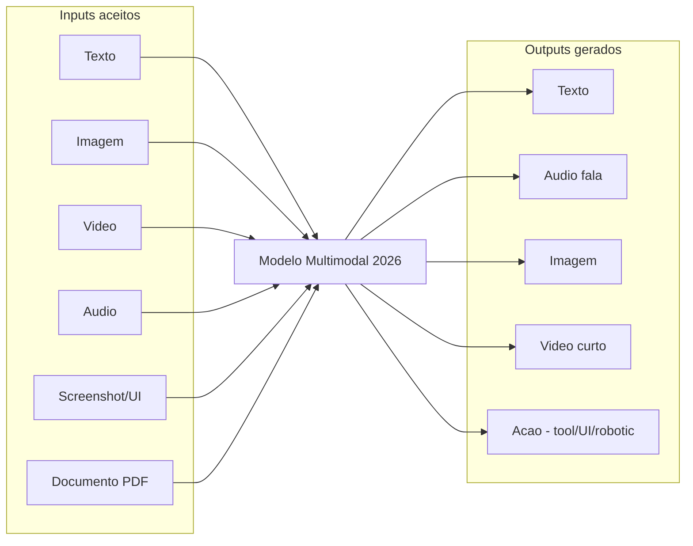
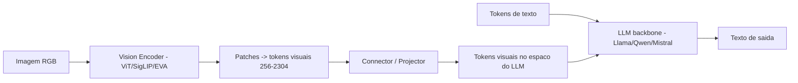
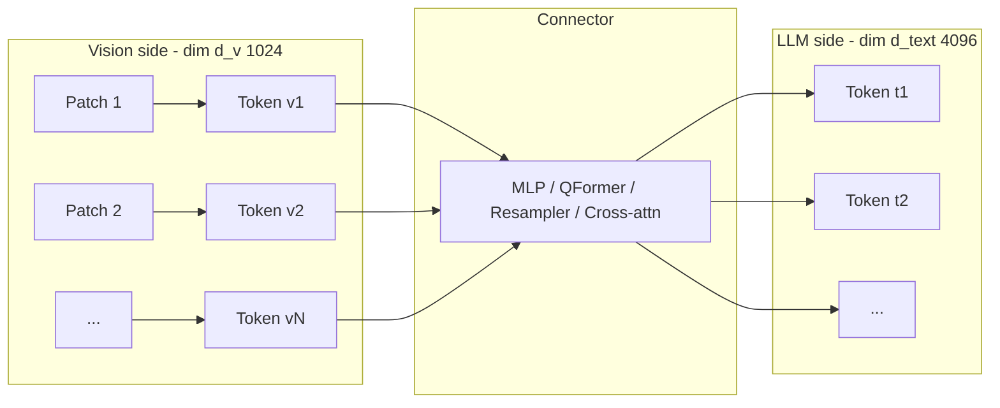
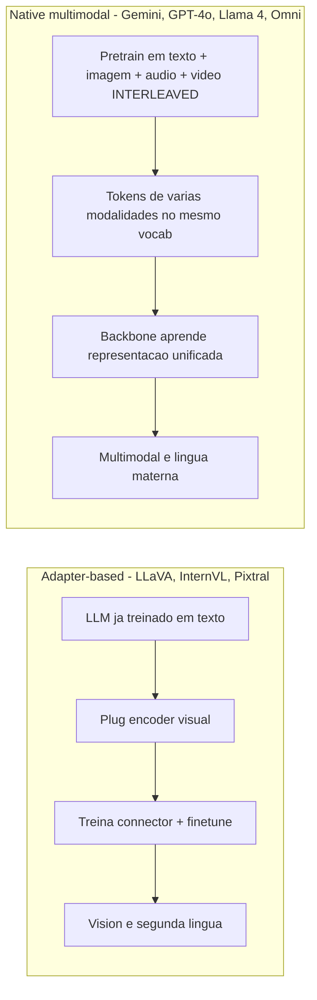
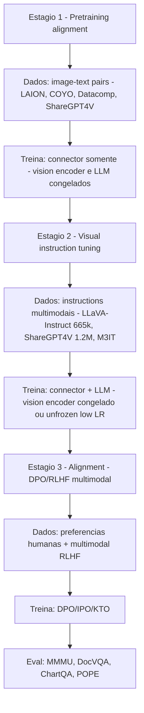
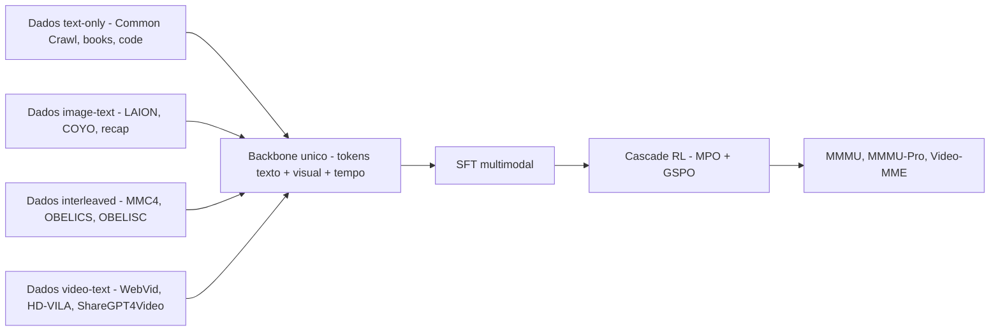
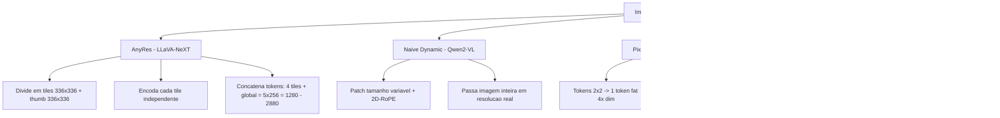
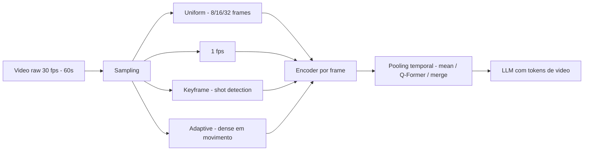
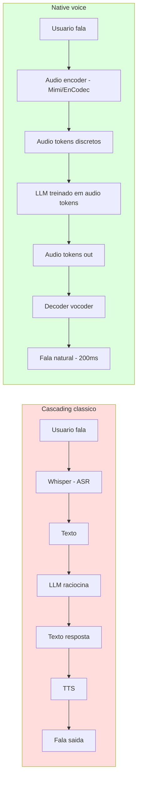
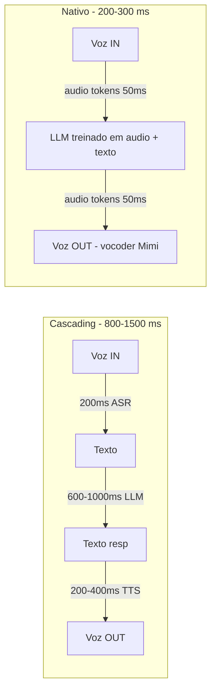

# Post 17 — Multimodalidade em profundidade: VLMs, Audio LMs, Video LMs, Omni e voz nativa

> Série: **LLM Deep Dive** — do tijolo ao prédio.
> Pré-requisitos: Post 01 (Transformer decoder), Post 03 (KV cache e prefill), Post 11 (frameworks de serving — vLLM/SGLang/Ollama), Post 12 (embeddings, CLIP/SigLIP, ColPali). Recomendados: Post 13 (RAG), Post 14 (function calling / computer use), Post 15 (avaliação).
> Próximo post: **Post 18 — Reasoning models (o-series, R1, QwQ, GRPO, test-time compute).**

---

## TL;DR

- **Multimodalidade** deixou de ser "LLM com adaptador para imagem" e virou, em 2025–2026, o **default**: **GPT-4o/4.5/5**, **Claude 3.5/3.7/4 Sonnet/Opus**, **Gemini 2.5 / 3 / 3.1 Pro**, **Llama 4 Scout/Maverick** e **Qwen2.5-VL / Qwen3-VL / Qwen2.5-Omni** já recebem **texto + imagem + (áudio) + (vídeo)** como entrada nativa, e vários geram **texto + áudio + imagem** como saída.
- A taxonomia operacional é: (i) **encoder contrastivo** (CLIP/SigLIP — Post 12); (ii) **VLM generativo** (encoder + projector + LLM); (iii) **Audio LM** (ASR + entendimento + TTS); (iv) **Video LM** (frames + temporal); (v) **Omni / nativo multimodal** (single backbone treinado em tudo desde o início); (vi) **T2I/T2V/T2A** (escopo de modelos de difusão, fora deste post).
- Em **VLMs adapter-based**, a anatomia canônica é **Vision Encoder (ViT contrastivo) → Connector (Linear / MLP / Q-Former / Perceiver / Cross-attention / Pixel-shuffle) → LLM backbone**. Em **nativos** (Gemini, GPT-4o, Llama 4), o backbone é treinado **from scratch** com tokens de múltiplas modalidades intercalados.
- **High-resolution** virou requisito real: técnicas como **AnyRes / tile encoding (LLaVA-NeXT)**, **Naive Dynamic Resolution (Qwen2-VL)** e **pixel-shuffle (InternVL)** trocam tokens visuais por qualidade fina (OCR, gráficos, layouts, screenshots).
- **Open-source 2026**: o pelotão de frente é dominado por **InternVL3 / 3.5**, **Qwen2.5-VL / Qwen3-VL / Qwen3.6-35B-A3B**, **Llama 4 Scout/Maverick**, **Pixtral 12B/Large**, **Molmo**, **NVLM**, **MiniCPM-V 4 / o2.6** (edge), **Phi-4 multimodal**, **PaliGemma 2**, **Idefics 3**, **DeepSeek-VL2**. **InternVL3** atinge **MMMU 72.2** entre os abertos.
- **Voz nativa** explodiu em 2024–2025: **GPT-4o-realtime** (~200 ms), **Moshi** (Kyutai), **Sesame CSM-1B** (mar 2025, Apache 2.0, Mimi codec), **Hume EVI**, **Cartesia Sonic**, **F5-TTS**, **XTTS-v2** — substituindo o pipeline cascading **Whisper → LLM → TTS**.
- **Vídeo** evolui de "8 frames como imagens" para **streaming long-form**: **LLaVA-Video**, **VideoLLaMA 3**, **LongVA**, **MovieChat**, **Qwen2-VL/2.5-VL/3-VL** com vídeo nativo, **Gemini 2.x/3** com 1M contexto absorvendo filmes inteiros.
- **Avaliação**: o conjunto que importa em 2026 é **MMMU / MMMU-Pro** (college-level), **MathVista**, **DocVQA / ChartQA / AI2D** (docs e charts), **OCRBench**, **MMBench / SEED-Bench / MMVet**, **Video-MME / MVBench**, **POPE / HallusionBench** (alucinação visual), **WildVision Arena** (LMSys, ELO humano).
- **Serving** maduro: **vLLM** e **SGLang** já tratam VLMs (LLaVA, Qwen-VL, Pixtral, Llama Vision, MiniCPM-V, InternVL) como first-class; **mlx-vlm** rouba a cena no Mac; **Ollama** democratiza no laptop. O custo de prefill cresce com **tokens visuais** (1024×1024 vira ~600–2000 tokens, dependendo do modelo).

> **Analogia mestre.** Um LLM puro é um intelectual cego e surdo: lê e fala. Um **VLM adapter-based** é esse intelectual depois de uma cirurgia: ganhou olhos, mas o nervo óptico é uma **prótese de tradução** — vê bem, com leve sotaque. Um **nativo multimodal** (Gemini, GPT-4o, Llama 4) é uma criança que **cresceu vendo, ouvindo e falando**: as modalidades não são camadas, são **língua materna**. Um **Audio LM** com voz nativa é um cérebro com **ouvido conectado direto ao córtex que fala**, sem três tradutores no caminho. Um **VLA** (vision-language-action) é o mesmo cérebro com **mãos**: vê, raciocina e age no mundo físico.

---

## Índice

1. [Por que multimodalidade (e por que agora)](#1-por-que-multimodalidade-e-por-que-agora)
2. [Taxonomia de modelos multimodais](#2-taxonomia-de-modelos-multimodais)
3. [Anatomia de um VLM moderno](#3-anatomia-de-um-vlm-moderno)
4. [O zoológico de connectors: Linear, MLP, Q-Former, Perceiver, Cross-attn, Pixel-shuffle](#4-o-zoologico-de-connectors-linear-mlp-q-former-perceiver-cross-attn-pixel-shuffle)
5. [Native multimodal: Gemini, GPT-4o, Llama 4, Qwen2.5-Omni](#5-native-multimodal-gemini-gpt-4o-llama-4-qwen25-omni)
6. [VLMs open-source notáveis 2024–2026](#6-vlms-open-source-notaveis-20242026)
7. [Treinamento de VLM: três estágios e o segredo dos dados](#7-treinamento-de-vlm-tres-estagios-e-o-segredo-dos-dados)
8. [High-resolution: AnyRes, Naive Dynamic, Pixel-shuffle, NViLA](#8-high-resolution-anyres-naive-dynamic-pixel-shuffle-nvila)
9. [Multi-image e Video LMs: do frame único à narrativa](#9-multi-image-e-video-lms-do-frame-unico-a-narrativa)
10. [Audio LMs: ASR, entendimento, TTS e voz nativa](#10-audio-lms-asr-entendimento-tts-e-voz-nativa)
11. [Document understanding: PDFs, tabelas, gráficos, fórmulas](#11-document-understanding-pdfs-tabelas-graficos-formulas)
12. [Vision em coding agents: screenshots, UI grounding, OmniParser](#12-vision-em-coding-agents-screenshots-ui-grounding-omniparser)
13. [VLA — vision-language-action e robótica](#13-vla--vision-language-action-e-robotica)
14. [Avaliação multimodal: MMMU, MathVista, DocVQA, Video-MME, WildVision](#14-avaliacao-multimodal-mmmu-mathvista-docvqa-video-mme-wildvision)
15. [Hallucinations multimodais e como mitigar](#15-hallucinations-multimodais-e-como-mitigar)
16. [Frameworks e serving: vLLM, SGLang, mlx-vlm, Ollama](#16-frameworks-e-serving-vllm-sglang-mlx-vlm-ollama)
17. [Custos e considerações operacionais](#17-custos-e-consideracoes-operacionais)
18. [Edge multimodal: MiniCPM-V, Phi-4, Apple AFM-V, Gemini Nano-V](#18-edge-multimodal-minicpm-v-phi-4-apple-afm-v-gemini-nano-v)
19. [Geração multimodal nativa (output): GPT-4o image, Janus-Pro, Show-o](#19-geracao-multimodal-nativa-output-gpt-4o-image-janus-pro-show-o)
20. [Voz nativa em profundidade: GPT-4o-realtime, Moshi, Sesame CSM](#20-voz-nativa-em-profundidade-gpt-4o-realtime-moshi-sesame-csm)
21. [Tendências 2025–2026 e horizonte 2027](#21-tendencias-20252026-e-horizonte-2027)
22. [Cross-references e roadmap](#22-cross-references-e-roadmap)
23. [Referências](#23-referencias)

---

## 1. Por que multimodalidade (e por que agora)

### 1.1 O mundo é multimodal; texto é só um canal

Quando você olha para uma reunião, recebe simultaneamente: **rosto** (emoção), **voz** (prosódia), **texto** no slide (conteúdo formal), **gráfico** (dados), **gesto** (ênfase). Texto puro descarta 80% disso. Um agente que precisa **operar no mundo real** — abrir um PDF de relatório financeiro, transcrever uma call, ler o screenshot do erro do usuário, controlar um navegador, dirigir um robô — **não pode** se restringir a tokens de texto.

Em 2023, multimodalidade era **add-on**: você plugava um CLIP num LLM e treinava um *projector*. Em 2026, virou **substrato**: GPT-4o, Gemini 3, Llama 4, Claude 4 já são **multimodais por construção**, e o padrão de mercado é tratar imagem como "só mais um tipo de token".

### 1.2 Casos de uso que viraram core em 2026

| Caso de uso | Modalidade dominante | Modelos típicos |
|---|---|---|
| OCR + extração de docs | imagem → texto | Qwen2.5-VL, InternVL3, Gemini 3, Claude 4 |
| Análise de gráfico/tabela | imagem → texto | GPT-4o, Gemini 3, Claude 3.7 Sonnet |
| Screenshot do bug → fix code | imagem → texto/código | Cursor, Cline, GPT-5, Claude 4 |
| Computer use (agente que usa a tela) | screenshots → ação | Claude 3.5/4 Computer Use, OpenAI CUA |
| Transcrição de reunião | áudio → texto | Whisper v3-turbo, Gemini Audio, Canary |
| Voz natural conversacional | áudio ↔ áudio | GPT-4o-realtime, Sesame CSM, Moshi |
| Análise de vídeo de segurança | vídeo → texto | Gemini 3, LLaVA-Video, VideoLLaMA 3 |
| Robótica manipulação | imagem+linguagem → ação | RT-2, OpenVLA, Pi-zero, Helix |
| Edição de imagem por instrução | texto+imagem → imagem | GPT-4o image, Janus-Pro, Gemini 3 image |
| Revisão de design / UI | imagem → texto | Claude 4, GPT-5, InternVL3 |

### 1.3 Capabilities por modalidade — o mapa de 2026



> **Quem cobre o quê hoje (high level).** **Gemini 3 Pro / 3.1 Pro**: T+I+V+A+D → T+I (audio out via TTS); **GPT-4o / 4.5 / 5**: T+I+A → T+A+I; **Claude 4 Sonnet/Opus**: T+I+D → T (sem voz nativa no chat oficial até 2026); **Llama 4 Scout/Maverick**: T+I → T (8–10 imagens por request); **Qwen2.5-Omni**: T+I+V+A → T+A; **Qwen3-VL**: T+I+V → T; **InternVL3.5**: T+I+V → T.

### 1.4 Mercado em 2026 — o estado da arte rápido

- **GPT-4o** (mai 2024) trouxe voz nativa e visão como default; **GPT-4o-realtime** (out 2024) levou latência <300 ms para voz ↔ voz; **GPT-5** (2025) consolidou tudo num único endpoint.
- **Gemini 3 Pro** (nov 2025) e **Gemini 3.1 Pro** (fev 2026): nativo multimodal MoE, 1M+ contexto, líder em **DocVQA, ChartQA, MMMU-Pro, Video-MME**.
- **Claude 4 Sonnet/Opus** (2025): visão de altíssima qualidade em docs e screenshots, sem áudio nativo de saída no produto chat.
- **Llama 4 Scout** (109B / 16 experts / 10M ctx) e **Maverick** (400B / 128 experts / 1M ctx), abr/2025: primeiros Llama nativamente multimodais. Maverick venceu GPT-4o e Gemini 2.0 Flash em uma faixa ampla; ELO 1417 no LMArena (chat experimental).
- **Qwen2.5-VL** e **Qwen3-VL** (set–out 2025): multimodal completo, vídeo nativo, agentic UI.
- **InternVL3** (abr 2025) e **InternVL3.5** (ago 2025): **MMMU 72.2**, treinamento nativo multimodal, MPO + GSPO (cascade RL), inferência 4× mais rápida na 3.5.

---

## 2. Taxonomia de modelos multimodais

| Tipo | O que faz | Exemplo canônico | Output | Onde mora no stack |
|---|---|---|---|---|
| **Encoder contrastivo** | Embeda imagem e texto no mesmo espaço | CLIP, SigLIP, EVA-CLIP, JinaCLIP v2 | vetor | Retrieval, classificação zero-shot, base do encoder de VLMs (ver Post 12) |
| **VLM (image → text)** | Lê imagem, responde em texto | LLaVA-NeXT, Qwen2.5-VL, InternVL3 | texto | Chat, OCR, VQA, doc analysis |
| **Multi-image / interleaved** | Várias imagens + texto intercalados | Idefics 3, LLaVA-Interleave, Llama 4 | texto | Comparações, narrativas, in-context visual |
| **Video LM** | Sequência de frames + áudio opcional | LLaVA-Video, VideoLLaMA 3, Qwen2.5-VL | texto | Vigilância, sumarização, esportes |
| **Audio LM (ASR/SLU)** | Áudio → texto/intenção | Whisper v3, Canary, Qwen2-Audio | texto | Transcrição, comando de voz |
| **Speech ↔ Speech (voz nativa)** | Áudio → áudio sem cascading | GPT-4o-realtime, Moshi, Sesame CSM | áudio | Conversação, atendimento |
| **TTS** | Texto → áudio | ElevenLabs v3, F5-TTS, Cartesia Sonic, OpenAI Voice | áudio | Voiceover, dublagem |
| **Native multimodal / Omni** | Backbone único treinado em tudo | Gemini 3, GPT-4o, Llama 4, Qwen2.5-Omni | T+I+A | Tudo |
| **VLA (vision-language-action)** | Vê, entende, age (atuador) | RT-2, OpenVLA, π₀ (Pi-zero), Helix | comandos motores | Robótica |
| **T2I / T2V / T2A** | Texto → mídia | Flux, SD 3.5, Sora 2, Veo 3, MusicGen, AudioLDM | imagem/vídeo/áudio | Out of scope (ecossistema diffusion) |

> **Linha invisível.** Encoder contrastivo (CLIP) e geradores de mídia (Flux, Sora) **não são o foco** deste post. Aqui mora o **gerador multimodal de linguagem** — o cérebro que **fala** sobre o que viu/ouviu, e em alguns casos **devolve voz e pixels**.

---

## 3. Anatomia de um VLM moderno

### 3.1 Os três blocos canônicos



1. **Vision Encoder** — quase sempre um **ViT** pré-treinado contrastivamente (CLIP-ViT-L/14, SigLIP-SO400m, EVA-CLIP, ConvNeXt para baselines, DINOv2 para grounding). Converte uma imagem **H×W×3** em **N patches** (tipicamente 14×14 ou 16×16) que viram **N tokens** de dimensão `d_v` (768–1152).
2. **Connector / Projector** — o **tradutor** que mapeia tokens visuais (`d_v`) para o **espaço de embeddings do LLM** (`d_text`, ex.: 4096 em Llama 3 8B). Veja §4.
3. **LLM backbone** — um decoder-only padrão (Post 01) que **trata tokens visuais como pseudo-palavras** no contexto. A grande maioria nem altera a arquitetura: imagem vira "soft prompt" de N tokens.

> **Analogia.** O **vision encoder** é a **retina + córtex visual primário**: vê formas, bordas, texturas. O **connector** é o **tálamo**, traduzindo sinais elétricos para o **idioma** do **córtex linguístico** (LLM). Treinar mal o connector é como ter um tálamo desalinhado: você vê, mas não consegue dizer.

### 3.2 Quantos tokens uma imagem "custa"?

| Modelo | Imagem 224² | Imagem 448² | Imagem 1024² | Estratégia |
|---|---:|---:|---:|---|
| LLaVA 1.5 | 256 | — | — | fixed 224, MLP |
| LLaVA-NeXT (AnyRes) | 256 | 1064 | 2880 | 4 tiles 336² + global |
| InternVL2 | 256 | 1024 | 2560 | tile + pixel-shuffle (×4 ↓) |
| Qwen2-VL | 64 | 256 | 1280 | Naive Dynamic Resolution |
| Pixtral 12B | 64 | 256 | 1024 | RoPE 2D + variable patch |
| Gemini 2.x | ~258 | ~1024 | ~2048 | tile-based |
| GPT-4o (high detail) | — | ~765 | ~1105 | tile 512² + master |

> A **regra prática**: imagem 1024×1024 custa entre **600 e 2 800 tokens visuais**. Isso entra no **prefill** — pesa na latência (Post 03) e no **billing**.

### 3.3 Pseudo-código mental da inferência

```python
def vlm_forward(image, text, model):
    patches = model.vision_encoder(image)     # (N_v, d_v)
    vtokens = model.connector(patches)        # (N_v, d_text)
    txt_emb = model.embed_tokens(text)        # (N_t, d_text)
    inputs  = concat([special_img_start,
                      vtokens,
                      special_img_end,
                      txt_emb], dim=0)
    return model.llm.generate(inputs)
```

A "mágica" toda do connector é caber numa função de uma linha — mas o **treinamento** dele é o que separa um VLM medíocre de um excelente.

---

## 4. O zoológico de connectors: Linear, MLP, Q-Former, Perceiver, Cross-attn, Pixel-shuffle

| Connector | Onde apareceu | Tokens visuais | Ideia | Pros | Contras |
|---|---|---|---|---|---|
| **Linear projection** | LLaVA 1.0 | N (mesma do encoder) | Uma matriz `W ∈ ℝ^{d_v×d_text}` | Simples, barato, transparente | Pouca expressividade |
| **MLP (2 camadas, GeLU)** | LLaVA 1.5+ | N | Dois `Linear` com não-linearidade | Forte/barato; padrão atual | — |
| **Q-Former** | BLIP-2 (2023) | k aprendíveis (32–64) | Transformer com **queries aprendidas** que extraem da imagem | Comprime para k tokens fixos | Mais parâmetros, gargalo de info |
| **Perceiver Resampler** | Flamingo (DeepMind 2022) | k aprendíveis | Cross-attention de queries fixas em features visuais + temporais | Funciona com vídeo natural | Engenharia complexa |
| **Cross-attention layers** | Llama 3.2 V (set 2024), Idefics 3 | 0 (não vai pro contexto) | Layers extras do LLM fazem **cross-attn** sobre features visuais | LLM puro não cresce em prompt; KV cache do texto fica limpo | Modifica arquitetura, harder a quantizar |
| **Pixel-shuffle (×4 ↓)** | InternVL 1.5+ | N/4 | Reorganiza 2×2 patches num único token "fat" (concatena canais) | Reduz custo 4× sem perder muito | Pequena perda em fine print |
| **Q-Former + Pixel-shuffle** | InternVL2 | k | Combina ambos | Forte em alta-res | Engenharia |
| **Visual abstractor** | Qwen-VL 1 / mPLUG | k | Conv + atenção | Compacto | Datado |
| **Naive Dynamic Resolution + 2D-RoPE** | Qwen2-VL | adaptativo | Patches variáveis + posicional 2D nativo | Resolução real-world | Implementação custosa |

### 4.1 Diagrama: connector como tradutor



### 4.2 Quem usa o quê em 2026

| Modelo | Connector | Tokens por imagem (típico) |
|---|---|---:|
| LLaVA-NeXT (1.6) | MLP + AnyRes (5 tiles) | ~2 880 |
| Qwen2.5-VL | Naive Dynamic + 2D-RoPE | adaptativo (64–8 192) |
| InternVL3 | MLP + Pixel-shuffle (×4) | ~1 280–2 560 |
| MiniCPM-V 2.6 / 4 | Adaptive resampler + LLaMA-3 | ~640 |
| Pixtral 12B | RoPE-2D + linear | adaptativo |
| Llama 3.2 11B/90B Vision | **Cross-attention** (não no contexto) | 0 (no prompt) |
| Phi-3.5 / Phi-4 multimodal | LoRA-style adapter no LLM | ~256–576 |
| PaliGemma 2 | Linear projection de SigLIP-So400m | ~256 |
| Idefics 3 | Perceiver Resampler | ~64 |

---

## 5. Native multimodal: Gemini, GPT-4o, Llama 4, Qwen2.5-Omni

### 5.1 O que muda vs adapter-based



> **Analogia.** Adapter-based é o **adulto que aprende inglês na faculdade**: bom, mas com sotaque e algumas estruturas mentais traduzidas. Native multimodal é a **criança bilíngue desde o berço**: fala as duas línguas como se fossem uma só.

### 5.2 Os players de 2026

| Modelo | Lançamento | Modalidades de IN | Modalidades de OUT | Notas |
|---|---|---|---|---|
| **Gemini 1.5 Pro** | fev/2024 | T+I+V+A | T | 1M ctx, primeira "mass-market multimodal" |
| **Gemini 2.0 / 2.5 / 3 / 3.1 Pro** | dez/2024 → fev/2026 | T+I+V+A+D | T+I+A | MoE nativo, "thinking", líder em MMMU-Pro / Video-MME |
| **GPT-4o** | mai/2024 | T+I+A | T+A+I | Voz emocional, primeira nativa de voz da OpenAI |
| **GPT-4o-realtime** | out/2024 | A | A | <300 ms, WebSocket/WebRTC |
| **GPT-4.5 / GPT-5** | 2025 | T+I+A | T+A+I | Consolidação do stack |
| **Claude 4 Sonnet/Opus** | 2025 | T+I+D | T | Sem voz nativa no chat público |
| **Llama 4 Scout** | abr/2025 | T+I (até 8–10 imgs) | T | 109B / 16 experts / **10M ctx** |
| **Llama 4 Maverick** | abr/2025 | T+I | T | 400B / 128 experts / 1M ctx, ELO 1417 |
| **Qwen2.5-VL (3/7/72B)** | jan–set/2025 | T+I+V | T | Vídeo nativo, agentic UI grounding |
| **Qwen3-VL** | set–out/2025 | T+I+V | T | Reasoning + vídeo |
| **Qwen3.6-35B-A3B** | abr/2026 | T+I+V | T | Sparse MoE 35B/3B ativo, agentic coding |
| **Qwen2.5-Omni** | mar/2025 | T+I+V+A | T+A | Verdadeiramente "omni" open-weights |
| **Phi-4 multimodal** | fev/2025 | T+I+A | T | 5.6B, edge-friendly |

---

## 6. VLMs open-source notáveis 2024–2026

### 6.1 Tabela master

| Modelo | Base LLM | Vision encoder | Params | Licença | MMMU (val) | Forte em |
|---|---|---|---:|---|---:|---|
| **LLaVA-1.5-13B** | Vicuna-13B | CLIP-L/14 336 | 13B | Apache 2.0 | ~36 | baseline reproducible |
| **LLaVA-NeXT-34B** | Yi-34B | CLIP-L/14 336 | 34B | Apache 2.0 | ~51 | high-res via tiles |
| **LLaVA-OneVision** | Qwen2-7B | SigLIP | 7B | Apache 2.0 | ~48 | imagem + multi-img + vídeo |
| **Qwen2-VL-72B** | Qwen2-72B | EVA-ViT-G | 72B | Tongyi | ~64 | OCR, vídeo, multi-lang |
| **Qwen2.5-VL-72B** | Qwen2.5-72B | ViT custom | 72B | Tongyi | ~70 | UI agentic, vídeo |
| **Qwen3-VL-72B** | Qwen3-72B | ViT custom | 72B | Tongyi | ~73 | reasoning + vídeo |
| **InternVL2-76B** | Hermes-2-Yi-34B + InternViT | InternViT-6B | 76B | MIT | ~62 | docs, charts, OCR |
| **InternVL2.5-78B** | Qwen2.5-72B | InternViT-6B v1.5 | 78B | MIT | ~70 | SOTA open 2025 |
| **InternVL3-78B** | Qwen2.5-72B | InternViT v2 | 78B | MIT | **72.2** | nativo multimodal pretrain |
| **InternVL3.5-78B** | InternLM3 | InternViT-6B v2 | 78B | MIT | ~74 | Cascade RL (MPO+GSPO) |
| **MiniCPM-V 2.6** | Qwen2-7B | SigLIP-SO400m | 8B | MIT | ~49 | edge, 6 imagens, vídeo |
| **MiniCPM-V 4 / o2.6** | Qwen2.5 | SigLIP-SO400m | 3–8B | MIT | ~52 | phone-grade |
| **Phi-3.5-Vision** | Phi-3.5 | CLIP-ViT-L | 4.2B | MIT | ~43 | small + agentes |
| **Phi-4-multimodal** | Phi-4 | SigLIP+conformer | 5.6B | MIT | ~55 | T+I+A |
| **PaliGemma 2 (3B/10B/28B)** | Gemma 2 | SigLIP-SO400m | 3–28B | Gemma | ~47 (10B) | task-specific FT |
| **Idefics 3 (8B)** | Llama 3.1 | SigLIP-SO400m | 8B | Apache 2.0 | ~46 | interleaved, CC data |
| **DeepSeek-VL2 (MoE)** | DeepSeekMoE | SigLIP-SO400m | 27B/4.5B ativo | DeepSeek | ~51 | doc/chart MoE |
| **Pixtral 12B** | Mistral Nemo 12B | encoder próprio | 12B | Apache 2.0 | ~52 | RoPE-2D, multi-imagem |
| **Pixtral Large (124B)** | Mistral Large 2 | próprio | 124B | MRL | ~64 | docs, charts |
| **Aria** | Rhymes (MoE) | próprio | 25.3B/3.9B ativo | Apache 2.0 | ~54 | MoE multimodal |
| **Molmo (72B / 7B)** | Qwen2 | OpenAI CLIP | 7–72B | Apache 2.0 | ~54 | **PixMo dataset open**, pointing |
| **NVLM-D 72B** | Qwen2-72B | SigLIP-SO400m | 72B | MIT | ~58 | tile-fusion |
| **Llama 3.2 11B / 90B Vision** | Llama 3.1 | CLIP-ViT-H | 11–90B | Llama | ~50 (11B) / ~60 (90B) | cross-attn architecture |
| **Llama 4 Scout** | Llama 4 (MoE) | nativo | 109B/17B ativo | Llama | ~57 | 10M ctx |
| **Llama 4 Maverick** | Llama 4 (MoE) | nativo | 400B/17B ativo | Llama | ~73 | beats GPT-4o em vários |
| **Qwen3.6-35B-A3B** | Qwen3 (MoE) | nativo | 35B/3B ativo | Tongyi | ~62 | agentic coding multimodal |

> **Como ler.** Em 2026, **InternVL3.5**, **Qwen3-VL-72B** e **Llama 4 Maverick** dividem o pelotão de frente entre os abertos. **Pixtral Large**, **NVLM-D**, **InternVL3**, **Molmo 72B** completam o top-10. Em **edge**, **MiniCPM-V 4** e **Phi-4 multimodal** dominam.

### 6.2 Famílias rápidas

- **LLaVA family** (Liu et al., U. Wisconsin / Meta): pioneira na receita "MLP + visual instruction tuning". Fork tree imensa: LLaVA-Med, LLaVA-Critic, LLaVA-CoT, LLaVA-Interleave, LLaVA-Video, LLaVA-OneVision.
- **Qwen-VL** (Alibaba): tem estado **na frente** dos abertos por 18 meses; 2-VL trouxe "Naive Dynamic Resolution" e 2D-RoPE; 2.5-VL melhorou OCR e UI grounding; 3-VL adicionou reasoning; **Omni** unificou áudio.
- **InternVL** (Shanghai AI Lab): a **família open mais consistente**. InternViT (próprio encoder) + LLM backbone forte + dados massivos.
- **Microsoft**: **Phi-Vision** (compacto), **Florence-2** (OCR/det/seg unificado), **OmniParser** (UI).
- **Google**: **PaliGemma 1/2** (compacto, task-FT friendly), além do produto fechado Gemini.
- **Mistral**: **Pixtral 12B / Pixtral Large** (RoPE-2D, multi-imagem).
- **AI2**: **Molmo** (open data via PixMo, capacidade rara de "pointing").
- **NVIDIA**: **NVLM-D / NVLM-X** (decoder + cross-attn variants).
- **DeepSeek**: **DeepSeek-VL2** (MoE multimodal).
- **OpenBMB**: **MiniCPM-V** (a melhor família open para edge/phone).

---

## 7. Treinamento de VLM: três estágios e o segredo dos dados

### 7.1 Pipeline canônico



### 7.2 Os dados que importam

| Dataset | Tamanho | Fonte | Para que serve |
|---|---:|---|---|
| **LAION-5B** | 5.8B | crawl filtrado por CLIP | pretrain alinhamento (Stage 1) |
| **COYO-700M** | 700M | crawl Korean origin | pretrain |
| **Datacomp** | 12.8B | filtrado | pretrain (qualidade) |
| **CC3M / CC12M** | 3M / 12M | Conceptual Captions | pretrain |
| **LLaVA-Instruct-665k** | 665k | GPT-4 generated | Stage 2 instruction |
| **ShareGPT4V** | 1.2M | GPT-4V re-captioning de COCO/SBU | Stage 2 high-quality captions |
| **ShareGPT4Video** | 4.8M | GPT-4V re-cap de vídeos | Stage 2 vídeo |
| **PixMo** (Molmo) | 700K+ | crowd + speech transcription | Stage 2 fully open |
| **DocVQA / OCR-VQA / TextVQA** | 50–200K | docs reais | Stage 2 OCR/docs |
| **AI2D / ChartQA / FigureQA** | 5–30K | gráficos/diagramas | Stage 2 charts |
| **The Cauldron** (HuggingFaceM4) | 50 datasets fundidos | open mix | Stage 2 |

> **Insight central de 2024 → 2026.** O salto de qualidade dos VLMs **não veio do encoder maior**. Veio do **re-captioning massivo com GPT-4V** (ShareGPT4V) e da **diversidade de instruções** (M3IT, The Cauldron). O modelo melhora porque o **professor** melhora.

### 7.3 Resolution scaling

A receita comum: **224² → 336² → 448² → 1024+** com warm-up gradual. Pular o curriculum derruba performance em fine print (OCR de fonte 8pt) e em layouts densos (relatórios financeiros). Qwen2-VL e Pixtral mostraram que **resolução nativa adaptativa** (sem resize forçado) é o caminho.

### 7.4 Hyperparameters típicos (referência prática)

| Stage | LR conector | LR LLM | LR encoder | Batch (global) | Steps | Notas |
|---|---:|---:|---:|---:|---:|---|
| Stage 1 (alignment) | 1e-3 | 0 (frozen) | 0 (frozen) | 256 | 5–20K | só projector |
| Stage 2 (instruction tuning) | 2e-5 | 2e-5 | 0 ou 2e-6 | 128 | 10–50K | LLM acorda |
| Stage 3 (DPO/RLHF) | 5e-7 | 5e-7 | 0 | 32 | 1–5K | β ~ 0.1 |

> **Pegadinha clássica.** Treinar com LR alto no encoder no Stage 2 **destrói** representações contrastivas. Mantenha congelado ou em **LR ≤ 10× menor** que o LLM.

### 7.5 Native multimodal pretraining: a mudança InternVL3 / Llama 4

Em vez do **três estágios**, modelos como InternVL3 e Llama 4 fazem **pretrain conjunto** desde o início:



> **Por que ganha.** Sem o "trauma" do Stage 1 (encoder e LLM conhecendo-se na maturidade), o modelo desenvolve **representações genuinamente multimodais** desde o início. É o que o paper InternVL3 chama de *"native multimodal pre-training paradigm"*.

---

## 8. High-resolution: AnyRes, Naive Dynamic, Pixel-shuffle, NViLA

### 8.1 O problema

Um ViT padrão treinado em 224×224 quebra em 1024×1024: ou você faz **resize agressivo** (perde detalhe) ou **interpola posicional** (perde precisão). Para OCR, charts, screenshots, layouts — você **precisa** de alta-res.

### 8.2 As cinco grandes técnicas



### 8.3 Comparação prática

| Técnica | Tokens visuais p/ 1024² | Qualidade OCR | Latência relativa | Onde usa |
|---|---:|---:|---:|---|
| Resize 224² | 256 | baixa | 1.0× | LLaVA 1.5 (legado) |
| AnyRes (LLaVA-NeXT) | ~2 880 | alta | 11× | LLaVA-NeXT, OneVision |
| Pixel-shuffle 4× (InternVL) | ~1 280 | média-alta | 5× | InternVL2/3 |
| Naive Dynamic (Qwen2-VL) | ~1 280 (adaptativo) | alta | 5× | Qwen2/2.5/3-VL |
| Tile-fusion (NVLM-D) | ~1 800 | alta | 7× | NVLM, NVILA |
| S2-Wrapper multi-scale | ~3 000+ | muito alta | 12× | research / high-end |

> **Trade-off cruel.** Mais tokens visuais = melhor leitura fina **e** prefill mais lento (Post 03). Em prod, escolha por uso: **OCR de docs** vale tile pesado; **VQA de fotos cotidianas** roda bem com 256 tokens.

---

## 9. Multi-image e Video LMs: do frame único à narrativa

### 9.1 Multi-image (interleaved)

- **LLaVA-Interleave** (2024), **Idefics 2/3** (HF), **Llama 4** (até 8–10 imagens), **Qwen2.5-VL** (multi-img nativo) suportam **N imagens intercaladas com texto**, no mesmo prompt.
- Casos: comparação A/B, antes/depois, diff de UI, sequência de frames como vídeo curto.

### 9.2 Vídeo: como o modelo vê



### 9.3 Modelos de vídeo

| Modelo | Frames máx | Duração efetiva | Estratégia | Notas |
|---|---:|---|---|---|
| Video-LLaMA / Video-ChatGPT | 8–32 | ~30 s | uniform sampling + Q-Former | pioneiros 2023 |
| **LLaVA-Video** (2024) | 64 | ~1–2 min | uniform + token merge | open SOTA |
| **VideoLLaMA 3** (2024) | 128 | ~3 min | hierarchical merge | strong open |
| **LongVA** (2024) | 2 000+ | ~1 h | long-context LM treinado em texto | "scale ctx, not arq" |
| **MovieChat** | 2 048 | filme inteiro | memory bank + sliding | densidade variável |
| **Qwen2-VL / 2.5-VL / 3-VL** | dinâmico | 10+ min | M-RoPE 3D (T,H,W) | nativo, com áudio em Omni |
| **Gemini 2.5 / 3** | 1M ctx | feature-length | nativo | suporta filmes inteiros |
| **GPT-4o (vídeo)** | janelas | ~minutos | frame-as-image + cache | via API custom |
| **Claude 3.5/4 (vídeo)** | limitado | clipes | frame-as-image | sem vídeo nativo SDK |

> **Regra empírica.** Para conteúdo informativo (palestra, tutorial), **1 fps + áudio** dá certo até 10 min. Para esportes/ação, vá para **adaptive** com keyframes. Para filme inteiro, dependa de modelo com **long context** real (Gemini 3) ou **memory bank** (MovieChat / LongVA).

### 9.4 Pseudo-código: amostragem de frames

```python
import cv2

def sample_frames(video_path, fps_target=1, max_frames=32):
    cap = cv2.VideoCapture(video_path)
    fps = cap.get(cv2.CAP_PROP_FPS)
    total = int(cap.get(cv2.CAP_PROP_FRAME_COUNT))
    duration = total / fps
    n = min(max_frames, int(duration * fps_target))
    indices = [int(i * total / n) for i in range(n)]
    frames = []
    for i in indices:
        cap.set(cv2.CAP_PROP_POS_FRAMES, i)
        ok, frame = cap.read()
        if ok:
            frames.append(cv2.cvtColor(frame, cv2.COLOR_BGR2RGB))
    cap.release()
    return frames
```

---

## 10. Audio LMs: ASR, entendimento, TTS e voz nativa

### 10.1 As três famílias

| Família | Função | Exemplo | Latência típica |
|---|---|---|---|
| **ASR (Speech-to-Text)** | áudio → texto | Whisper v3 / v3-turbo, Canary, SeamlessM4T | ~1–4× tempo real |
| **Audio understanding LM** | áudio → texto+raciocínio | Qwen2-Audio, Qwen2.5-Omni, Phi-4-mm, Gemini Audio | similar |
| **Speech ↔ Speech (voz nativa)** | áudio → áudio direto | GPT-4o-realtime, Moshi, Sesame CSM, Hume EVI | <300 ms |
| **TTS** | texto → áudio | ElevenLabs v3, OpenAI Voice, F5-TTS, XTTS-v2, Cartesia Sonic | <200 ms TTFB |

### 10.2 ASR — o estado de 2026

- **Whisper-large-v3** (OpenAI, nov 2023): standard de fato; multilíngue (99 idiomas).
- **Whisper-large-v3-turbo** (out 2024): 8× mais rápido que v3, qualidade quase igual.
- **NVIDIA Canary 1B / Canary-Qwen-2.5B** (2024–2025): SOTA em LibriSpeech/MLS; multitask (ASR + tradução).
- **Meta SeamlessM4T v2** (2023→2024): ASR + tradução voz↔voz em 100+ idiomas.
- **AssemblyAI Universal-2 / Deepgram Nova-3** (2025): comerciais, latência baixa.

### 10.3 Audio LM unificado

- **Qwen2-Audio** (set 2024): áudio+texto → texto, com áudio chat e análise.
- **Qwen2.5-Omni** (mar 2025): T+I+V+A → T+A; "thinker-talker" arch.
- **Phi-4-multimodal** (fev 2025): ASR + audio QA + vision.
- **Gemini Audio** (built into Gemini 1.5/2.x/3): nativo, transcreve com diarização.

### 10.4 Voz nativa: o salto de 2024–2025



- **GPT-4o-realtime** (out/2024): WebSocket/WebRTC, latência ~232 ms p50, suporta backchannels e interrupção.
- **Moshi** (Kyutai, jul 2024): full-duplex, baseado em **Mimi codec** (12.5 Hz, 8 codebooks).
- **Sesame CSM-1B** (mar 2025, Apache 2.0): **dois decoders Llama-style** (backbone + depth), Mimi codec, treinado em **1M horas** de áudio em inglês; clona voz com ~1 min; nativo no `transformers` 4.52+. (Ver §20.)
- **Hume AI EVI** (2024): emocionalmente reativa.
- **Cartesia Sonic** (2024): latência ~90 ms.

### 10.5 TTS modernos

| TTS | Latência TTFB | Qualidade | Open? | Notas |
|---|---:|---|---|---|
| ElevenLabs v3 | ~150 ms | excelente | ✗ | clonagem premium |
| OpenAI Voice (advanced) | ~200 ms | excelente | ✗ | integrado ao 4o |
| F5-TTS | ~300 ms | muito boa | ✓ MIT | flow matching |
| XTTS-v2 (Coqui) | ~400 ms | boa | ✓ | clone com 6 s |
| Cartesia Sonic | **~90 ms** | excelente | parcial | SSM-based, ultra rápido |
| Bark | 2–4 s | criativa | ✓ MIT | + prosódia e sons |

---

## 11. Document understanding: PDFs, tabelas, gráficos, fórmulas

- **Donut** (NAVER, 2022) e **Pix2Struct** (Google, 2023): clássicos de OCR-free document understanding.
- **Florence-2** (Microsoft, 2024): unified — OCR + detection + segmentation + captioning numa só API; 232M params.
- **Marker** e **Surya OCR** (open-source, 2024): pipeline PDF → markdown com VLM opcional.
- **GOT-OCR 2.0** (2024): "Generic OCR Theory", trata tudo como sequência (LaTeX, partituras, ChemFig).
- **Qwen2.5-VL Doc**, **InternVL3 Doc**, **MiniCPM-V**: VLMs que encararam OCR + reasoning combinados, e batem dedicated OCR em DocVQA / ChartQA.
- **GPT-4o / Claude 4 / Gemini 3**: já são "best-in-class" para PDFs caóticos com tabelas, gráficos, equações e layout multi-coluna.

> **Caso real.** Para um relatório anual de banco (200 págs, tabelas + gráficos + notas de rodapé), o pipeline 2026 vencedor é: **Marker** (segmenta páginas) → **Qwen2.5-VL 72B** (extrai tabelas/charts em JSON estruturado) → **LLM textual** (sumariza). Em produto fechado: **Gemini 3 Pro** com 1M ctx faz tudo num shot.

---

## 12. Vision em coding agents: screenshots, UI grounding, OmniParser

Em 2025–2026, **screenshot understanding** virou **commodity** em IDEs e agentes:

- **Cursor / Cline / Continue**: aceitam print do erro/UI; o LLM (Claude 4, GPT-5) responde com fix.
- **Anthropic Claude Computer Use** (out/2024) e **OpenAI CUA / Operator** (jan/2025): agente recebe screenshot + DOM e devolve **clique/teclado**.
- **OmniParser v2** (Microsoft, 2024–2025): parseia screenshot em **bounding boxes + labels** estruturados, alimentando o agente sem depender só do VLM.
- **Ferret-UI** (Apple, 2024) e **OS-Atlas** (2024): VLMs especializados em UI mobile/desktop.
- **Show-o** (NUS, 2024): unified VLM para UI grounding e geração.
- **SeeClick**, **CogAgent**, **UI-TARS**: linha de pesquisa para autonomia de UI.

> **Por que importa para coding agents.** O Post 19 detalha que agentes modernos não confiam só no AST — eles **também olham a tela** para confirmar que o botão renderizou, o erro sumiu, o teste passou. **VLMs de UI** são o **olho** do agente.

---

## 13. VLA — vision-language-action e robótica

Não é o foco deste post, mas vale o panorama (2026):

- **RT-1 / RT-2** (Google DeepMind, 2022–2023): primeiros VLA grandes; PaLM-E como backbone.
- **OpenVLA** (Stanford / TRI, jun 2024): 7B aberto, 970K demos, fine-tunável em hardware acessível.
- **π₀ (Pi-zero)** (Physical Intelligence, out 2024): generalist robot policy, 1.4B params, flow-matching action head.
- **Helix** (Figure AI, fev 2025): VLA para humanoids, dois corpos coordenados.
- **Octo, GR00T (NVIDIA, 2024–2025)**: foundation models para robótica.

> **Analogia.** VLA é o **VLM com mãos**: vê, interpreta, **age**. O bottleneck virou **dados de demonstração** (teleop é caro), e a corrida em 2026 é por **simuladores + sim-to-real** (Isaac Lab, MuJoCo MJX) e **vídeo de internet → policy** (egocentric video).

---

## 14. Avaliação multimodal: MMMU, MathVista, DocVQA, Video-MME, WildVision

### 14.1 O catálogo essencial

| Benchmark | Foco | Tamanho | Métrica | Top score 2026 (aprox) |
|---|---|---:|---|---:|
| **MMMU** (Yue 2024) | college-level multimodal exam (30 disc.) | 11.5K | accuracy | Gemini 3 Pro ~78 / GPT-5 ~76 / InternVL3.5 ~74 / Llama 4 Maverick ~73 |
| **MMMU-Pro** | versão "harder" | ~3.5K | accuracy | Gemini 3.1 Pro ~70 / GPT-5 ~68 |
| **MathVista** | matemática + vision | 6.1K | accuracy | Gemini 3 ~75 / GPT-5 ~74 |
| **DocVQA** | docs (extração) | 50K | ANLS | Qwen2.5-VL/InternVL3 ~95+ |
| **ChartQA** | gráficos (QA) | 32K | relaxed acc | InternVL3 ~89 / Qwen2.5-VL ~89 |
| **AI2D** | diagramas educacionais | 5K | accuracy | InternVL3 ~88 |
| **OCRBench** | OCR multilíngue | 1K | score 0–1000 | Qwen2.5-VL ~890 |
| **MMBench** | multi-task | 3K | accuracy | top open ~85 |
| **SEED-Bench** | percepção + reasoning | 19K | accuracy | top ~80 |
| **MMVet** | capacidades integradas | 218 | LLM-judge | top ~78 |
| **Video-MME** | vídeo (curtos/médios/longos) | 900 vids | accuracy | Gemini 3 ~80 / Qwen3-VL ~75 |
| **MVBench** | vídeo dinâmico | 4K | accuracy | top ~75 |
| **AudioBench** | audio understanding | misto | misto | Qwen2.5-Omni / Phi-4-mm topo open |
| **WildVision Arena** (LMSys) | ELO humano em VLMs | ~30K votos | ELO | GPT-5 / Gemini 3 / Claude 4 lideram |
| **POPE** | hallucination de objetos | 9K | F1 | top ~90 |
| **HallusionBench** | viés visual + linguagem | 1.1K | overall acc | top ~60 (ainda baixo!) |

### 14.2 Como ler os números

- **MMMU > 70** já é **patamar de modelos sérios**.
- **MMMU-Pro** é o discriminador real em 2026: GPT-5, Gemini 3, Claude 4 Opus passam dos 65; abertos top ficam em 60–62.
- **DocVQA / ChartQA** são quase saturados — diferença está em **edge cases** (cores próximas, eixos truncados, tabelas mescladas).
- **WildVision Arena** mostra preferência humana — divergente de benchmarks acadêmicos.
- **HallusionBench** lembra que mesmo modelos top **erram em ~40% das pegadinhas visuais** (linguagem domina o sinal visual).

---

## 15. Hallucinations multimodais e como mitigar

### 15.1 Como VLM alucina

1. **Object hallucination** (POPE): "Há uma maçã na mesa?" → "Sim", quando não há.
2. **Spatial / count errors**: "Quantas pessoas?", "À esquerda ou direita?" — comum em VLMs sem grounding.
3. **OCR errors silenciosos**: lê "5 412" como "5 142".
4. **Chart misreading**: lê eixo invertido.
5. **Language prior dominance**: o backbone "completa" pelo que é provável, ignorando a imagem.

### 15.2 Mitigations (técnicas e produto)

| Técnica | Como funciona | Tipicamente reduz |
|---|---|---|
| **Visual Contrastive Decoding (VCD)** | Decodifica com e sem imagem distorcida; subtrai logits | object hallucination |
| **DoLa** | Contrasta layers diferentes do LLM | factualidade textual |
| **Grounding suplementar** (Florence/SAM) | Adiciona detector externo no prompt | spatial errors |
| **Chain-of-Thought visual** | "Liste o que vê antes de responder" | reasoning errors |
| **Negative instruction tuning** | Treinar com exemplos "Não há X" | overconfidence |
| **RLHF/DPO multimodal** | Preferência humana penaliza alucinação | global |
| **Tool use** (calculadora, OCR dedicado) | Delegar perguntas exatas | OCR/contagem |
| **Self-critique / LLM-as-judge dupla** | Modelo critica resposta com a imagem | global |

> **Produto.** Para domínios sensíveis (médico, jurídico), combine **VLM + extrator dedicado (OCR/det)** + **prompt forçando grounding** ("para cada afirmação, cite o pixel/região"). Aceitar "não tenho certeza" é mais barato que litígio.

---

## 16. Frameworks e serving: vLLM, SGLang, mlx-vlm, Ollama

### 16.1 Quem suporta o quê

| Framework | LLaVA | Qwen-VL | Pixtral | Llama Vision | InternVL | MiniCPM-V | Phi-V | Native voice |
|---|:--:|:--:|:--:|:--:|:--:|:--:|:--:|:--:|
| **vLLM** | ✅ | ✅ | ✅ | ✅ | ✅ | ✅ | ✅ | parcial |
| **SGLang** | ✅ | ✅ | ✅ | ✅ | ✅ | ✅ | ✅ | parcial |
| **TensorRT-LLM** | ✅ | ✅ | parcial | ✅ | ✅ | parcial | ✅ | — |
| **mlx-vlm** (Apple) | ✅ | ✅ | ✅ | parcial | ✅ | ✅ | ✅ | parcial |
| **lmdeploy** (InternLM) | ✅ | ✅ | parcial | parcial | ✅ (best) | parcial | parcial | — |
| **Ollama** | ✅ | ✅ (qwen2-vl) | ✗ | ✅ (llama3.2-vision) | ✗ | ✅ | ✗ | — |
| **transformers** | ✅ | ✅ | ✅ | ✅ | ✅ | ✅ | ✅ | ✅ (CSM) |
| **llama.cpp** | ✅ (MiniGPT) | ✅ (parcial) | ✗ | ✅ (Llama Vision) | ✗ | ✅ | ✗ | — |

> **Em 2026**, **vLLM** e **SGLang** são os defaults para serving multimodal em GPU. **mlx-vlm** rouba a cena no Mac. **Ollama** é o **default de laptop** para devs e protótipos.

### 16.2 Como serve um VLM por dentro (alto nível)

1. **Image preprocessing** (CPU): resize/normalize, possivelmente **tile**.
2. **Vision encoder forward** (GPU): pode ser **cacheado** se a mesma imagem aparece em múltiplos requests (raro, mas vale para flows).
3. **Connector**: barato.
4. **Prefill**: tokens visuais entram **junto** com texto. **KV cache cresce** proporcionalmente — para 2 880 tokens por imagem, KV cresce muito.
5. **Decode**: padrão LLM.

> Optimization tip: **prefix caching** do vLLM/SGLang funciona em prompts multimodais **se a imagem (e seus tokens) for byte-equivalente** entre requests. Útil para "agente que olha o mesmo dashboard várias vezes".

### 16.3 Pseudo-código: inferência LLaVA com transformers

```python
from transformers import AutoProcessor, LlavaForConditionalGeneration
from PIL import Image
import torch

model_id = "llava-hf/llava-v1.6-mistral-7b-hf"
proc = AutoProcessor.from_pretrained(model_id)
model = LlavaForConditionalGeneration.from_pretrained(
    model_id, torch_dtype=torch.float16, device_map="auto"
)

img = Image.open("dashboard.png").convert("RGB")
prompt = "[INST] <image>\nWhat is the alert about? [/INST]"
inputs = proc(prompt, img, return_tensors="pt").to("cuda", torch.float16)
out = model.generate(**inputs, max_new_tokens=200)
print(proc.decode(out[0], skip_special_tokens=True))
```

### 16.4 Pseudo-código: vLLM serve VLM

```python
from vllm import LLM, SamplingParams

llm = LLM(
    model="Qwen/Qwen2.5-VL-7B-Instruct",
    dtype="bfloat16",
    max_model_len=32768,
    limit_mm_per_prompt={"image": 4, "video": 1},
)

prompt = {
    "prompt": "<|vision_start|><|image_pad|><|vision_end|>Describe the chart.",
    "multi_modal_data": {"image": [Image.open("chart.png")]},
}

out = llm.generate([prompt], SamplingParams(max_tokens=512, temperature=0.2))
print(out[0].outputs[0].text)
```

### 16.5 Pseudo-código: mlx-vlm no Mac Apple Silicon

```python
from mlx_vlm import load, generate
from mlx_vlm.prompt_utils import apply_chat_template
from mlx_vlm.utils import load_config

model_path = "mlx-community/Qwen2.5-VL-7B-Instruct-4bit"
model, processor = load(model_path)
config = load_config(model_path)

messages = [{"role": "user", "content": "What's in this image?"}]
formatted = apply_chat_template(processor, config, messages, num_images=1)

output = generate(model, processor, formatted,
                  image=["screenshot.png"], max_tokens=300, verbose=False)
print(output)
```

### 16.6 Pseudo-código: SGLang serving Qwen2.5-VL com streaming

```python
import sglang as sgl
from sglang import function, image, gen, set_default_backend, RuntimeEndpoint

set_default_backend(RuntimeEndpoint("http://localhost:30000"))

@function
def describe_screenshot(s, img_path: str, question: str):
    s += sgl.user(image(img_path) + question)
    s += sgl.assistant(gen("answer", max_tokens=512, temperature=0.2))

state = describe_screenshot.run(
    img_path="bug.png",
    question="Qual erro aparece e qual e a causa provavel?",
    stream=True,
)
for chunk in state.text_iter("answer"):
    print(chunk, end="", flush=True)
```

### 16.7 Pseudo-código: VQA eval básico custom

```python
import json
from pathlib import Path

def eval_vqa(model_fn, dataset_path):
    items = json.loads(Path(dataset_path).read_text())
    correct = 0
    for item in items:
        pred = model_fn(image=item["image"], question=item["question"])
        gt = item["answer"].strip().lower()
        if gt in pred.strip().lower():
            correct += 1
    return correct / len(items)

acc = eval_vqa(lambda image, question: my_vlm(image, question),
               "docvqa_subset.json")
print(f"DocVQA acc: {acc:.3f}")
```

---

## 17. Custos e considerações operacionais

### 17.1 Imagem é mais cara do que parece

| Modelo | Imagem 512² | Imagem 1024² | Custo aproximado por imagem (API 2026) |
|---|---:|---:|---:|
| GPT-4o (high detail) | ~765 tok | ~1 105 tok | ~US\$ 0.0055–0.0085 |
| GPT-5 | similar | similar | US\$ 0.005–0.010 |
| Claude 4 Sonnet | ~750 tok | ~1 200 tok | ~US\$ 0.0036–0.0058 |
| Gemini 3 Pro | ~258 tok (low) / ~1 024 (high) | ~1 024–2 048 | US\$ 0.0025–0.0070 |
| Qwen2.5-VL 72B (open, self-host) | ~256 | ~1 280 | custo de GPU |
| InternVL3-78B (self-host) | ~256 | ~1 280 | custo de GPU |

> **Tip de produto.** Quase nunca vale `detail=high` em screenshots de UI; `low` (~256 tok) é suficiente para classificar erros, identificar elementos, navegar. Reserve `high` para **OCR de documentos**.

### 17.2 Latência

- **Prefill com imagem** é **muito** mais pesado. 1 028 tokens visuais ≈ um prompt de prosa de 1 página inteira.
- **Cache de prompt** (Anthropic, OpenAI) reduz custo em até 90% se a imagem repete (ex.: dashboard re-consultado).
- **KV cache** cresce com tokens visuais — afeta concorrência por GPU.

### 17.3 Throughput

- vLLM e SGLang otimizam **continuous batching** com pacotes mistos (texto + imagem). Em GPU H100, espere **~30–80 req/s** para Qwen2.5-VL 7B com imagens 1024² em batches saudáveis (Post 11).

---

## 18. Edge multimodal: MiniCPM-V, Phi-4, Apple AFM-V, Gemini Nano-V

| Modelo | Params | Vision encoder | Onde roda | MMMU |
|---|---:|---|---|---:|
| **MiniCPM-V 2.6** | 8B | SigLIP-SO400m | iPhone (4-bit), GPU consumer | ~49 |
| **MiniCPM-V 4 / o2.6** | 3B effective | SigLIP-SO400m | phone-grade | ~52 |
| **Phi-3.5-Vision** | 4.2B | CLIP-L | laptop/edge | ~43 |
| **Phi-4-multimodal** | 5.6B | SigLIP+conformer | edge T+I+A | ~55 |
| **Qwen2.5-VL-3B** | 3B | ViT custom | edge GPU | ~46 |
| **Llama 3.2 11B Vision** | 11B | CLIP-H | single GPU 24GB | ~50 |
| **Apple AFM-V (Apple Intelligence)** | ~3B (server / on-device split) | próprio | iPhone 15 Pro+, M-series | n/a (closed) |
| **Gemini Nano-V** | 1.8–3.25B | nativo | Pixel 8/9 | n/a (closed) |
| **PaliGemma 2 (3B)** | 3B | SigLIP-SO400m | edge/Jetson | ~40 |

> **Quantização VLM.** O **LLM backbone** quantiza bem (Q4 GGUF, AWQ, GPTQ — Post 04). O **vision encoder** é mais sensível: fica em **FP16/BF16** ou Q8. Em llama.cpp, o padrão é encoder em FP16 + LLM em Q4_K_M.

---

## 19. Geração multimodal nativa (output): GPT-4o image, Janus-Pro, Show-o

| Modelo | Approach | Saída | Notas |
|---|---|---|---|
| **GPT-4o image gen** (out/2024 GA, mar/2025 widely) | autoregressive native | imagem | "Vibrant" prompt rendering, texto dentro de imagem **funciona** |
| **Gemini 2.5 / 3 image gen** (Imagen integrado) | hybrid | imagem | inline editing |
| **Janus-Pro** (DeepSeek, jan/2025) | unified understand + generate | T+I | open weights MIT |
| **Show-o** (NUS, 2024) | unified | T+I | open |
| **Anole** (2024) | autoregressive open | T+I | derivado de Chameleon |
| **Chameleon** (Meta, 2024) | early-fusion native | T+I | seminal paper |

Comparado com **diffusion** (Flux, SD 3.5, Stable Cascade, Sora 2, Veo 3) — a abordagem **autoregressive native** é mais lenta para imagens HD, mas integra naturalmente com texto e raciocínio (geração condicionada por chain-of-thought).

> **Quando usar autoregressive native.** Quando você precisa de **texto preciso dentro da imagem** (logos, slides, infográficos), de **edição instrução-iterativa** ou de **acoplamento com raciocínio**. Quando você precisa de **fotorealismo puro / 4K / cinemagraphs**, vá de **diffusion** (Flux Pro, SD 3.5, Midjourney v7, Sora 2, Veo 3) — ecossistema separado.

---

## 20. Voz nativa em profundidade: GPT-4o-realtime, Moshi, Sesame CSM

### 20.1 O bottleneck que o cascading não resolve



### 20.2 Como o áudio vira "token"

- **Audio codec neural** (EnCodec / SoundStream / Mimi / DAC) discretiza áudio em **codebooks** (multi-quantization).
- **Mimi** (Kyutai, usado por Moshi e Sesame): **12.5 Hz** de quadros (75× mais lento que 24 kHz raw), **8 codebooks** de 2048 entradas. Cada segundo de áudio ≈ 100 tokens × 8 codebooks.
- O LLM gera tokens de áudio **autoregressivamente**, decodificados em waveform por um vocoder integrado.

### 20.3 Os dois grandes do open-source

#### Moshi (Kyutai, jul 2024)
- 7B params; full-duplex (ouve enquanto fala).
- Treinado em milhões de horas de podcast/audiobooks.
- Latência: ~160 ms.
- Hierarquia: **temporal Transformer** (timesteps de 80 ms) + **depth Transformer** (codebooks).

#### Sesame CSM-1B (mar 2025, Apache 2.0)
- Repo criado em **26/fev/2025**, CSM-1B no HF em **13/mar/2025**, nativo em `transformers` 4.52+ desde **20/mai/2025**.
- **1B params**; arquitetura "thinker-talker": **dois decoders Llama-style** (backbone + depth).
- **Mimi codec**.
- Treinado em **1 milhão de horas** de áudio em inglês.
- Clonagem de voz com **~1 minuto** de áudio fonte.
- Suporta **multi-turn dialogue** entre falantes; geração com/sem contexto.
- Requer **CUDA**, Python 3.10+, e acesso a **Llama-3.2-1B**.

#### GPT-4o-realtime (out/2024)
- WebSocket / WebRTC.
- ~232 ms p50.
- Suporta **interrupção**, **backchannels** ("uh-huh"), **prosódia emocional**.
- Tokens de áudio cobrados separadamente (mais caro que texto).

### 20.4 Backchannels, interrupção e prosódia

O salto do nativo sobre o cascading não é só latência — é **comportamento conversacional**:

- **Backchannels** ("uhum", "claro", "entendi"): o LLM aprende a inserir microfeedbacks **enquanto o usuário fala**, sem cortar.
- **Interrupção** (barge-in): o modelo detecta nova fala do usuário e **abandona** o que estava dizendo, naturalmente.
- **Prosódia emocional**: tom de voz adaptado ao conteúdo (notícia ruim → mais lento, grave; piada → leveza, sorriso na voz).
- **Disfluências controladas**: pausas, "hmm", respiração — soa **humano** sem chatice.

> **Por que cascading não consegue.** No pipeline ASR→LLM→TTS, **não há canal** para o LLM "ouvir o tom" do usuário ou "modular o tom" da resposta — texto é o gargalo. Native voice trata áudio como **modalidade primária**, não como derivada de texto.

### 20.5 Protocolos de transporte

| Protocolo | Latência | Onde usa |
|---|---:|---|
| **WebRTC** | <50 ms RTT | navegador, mobile, P2P |
| **WebSocket** | 50–200 ms | servidor ↔ servidor, controle |
| **HTTP/2 streaming** | 100–300 ms | fallback, mobile com NAT |
| **gRPC bidi-stream** | 50–150 ms | backend interno |

GPT-4o-realtime aceita WebSocket e WebRTC; Moshi roda WebSocket; Sesame CSM via Hugging Face Transformers no servidor; Hume EVI é WebSocket-only.

### 20.6 Pseudo-código: chamar voz realtime (OpenAI)

```python
import asyncio, base64
from openai import AsyncOpenAI

client = AsyncOpenAI()

async def voice_chat(audio_bytes_in):
    async with client.beta.realtime.connect(
        model="gpt-4o-realtime-preview"
    ) as conn:
        await conn.session.update(session={
            "modalities": ["audio", "text"],
            "instructions": "Voce e um atendente educado. Fale em PT-BR.",
            "voice": "alloy",
        })
        await conn.input_audio_buffer.append(
            audio=base64.b64encode(audio_bytes_in).decode()
        )
        await conn.input_audio_buffer.commit()
        await conn.response.create()
        async for event in conn:
            if event.type == "response.audio.delta":
                yield base64.b64decode(event.delta)
```

---

### 20.7 Pseudo-código: Sesame CSM-1B local

```python
from transformers import CsmForConditionalGeneration, AutoProcessor
import torch, soundfile as sf

model_id = "sesame/csm-1b"
processor = AutoProcessor.from_pretrained(model_id)
model = CsmForConditionalGeneration.from_pretrained(
    model_id, torch_dtype=torch.bfloat16, device_map="cuda"
)

conversation = [
    {"role": "0", "content": [{"type": "text", "text": "Bom dia, como vai?"}]},
    {"role": "1", "content": [{"type": "text", "text": "Tudo bem, e voce?"}]},
    {"role": "0", "content": [{"type": "text", "text": "Otimo, obrigado!"}]},
]
inputs = processor.apply_chat_template(
    conversation, tokenize=True, return_dict=True
).to("cuda")

audio = model.generate(**inputs, output_audio=True)
sf.write("out.wav", audio[0].cpu().numpy(), samplerate=24000)
```

---

## 21. Tendências 2025–2026 e horizonte 2027

1. **Native multimodal é o default.** "Adapter VLM" agora é solução de nicho ou edge. Frontier (Gemini 3, GPT-5, Llama 4, Qwen3-VL) treina tudo junto.
2. **Long video.** 1 h+ de vídeo passou a ser viável (Gemini 3 com 1M ctx, LongVA, MovieChat). Esperar 10 h em 2026–2027.
3. **Voz nativa mainstream.** GPT-4o-realtime, Sesame CSM e Moshi viram blocos de Lego para call centers, copilotos e companions.
4. **3D / spatial understanding.** Depth estimation, SAM 2.1+, point clouds entram nos VLMs (Molmo já aponta; Gemini-Robotics 2025 lê cena 3D).
5. **VLA scaling.** OpenVLA, π₀, Helix viram disponíveis para integradores; **dados de demo** (teleop + sim) é o gargalo.
6. **Edge multimodal.** Apple Intelligence (AFM-V), Gemini Nano-V (Pixel), Snapdragon NPU executam VLMs ~3B no telefone.
7. **Open weights catching up.** InternVL3.5, Qwen3-VL-72B, Llama 4 Maverick **fecham o gap** com fechados em MMMU-Pro / Video-MME.
8. **Geração nativa multimodal.** Janus-Pro, GPT-4o image, Gemini 3 image marcam o fim da separação "LLM gera texto, diffusion gera pixel" para muitos use cases.

---

## 22. Cross-references e roadmap

- **Post 01** — arquitetura Transformer decoder: o LLM backbone que vira VLM.
- **Post 03** — KV cache e prefill: por que tokens visuais são caros.
- **Post 04 / 05** — quantização: como manter LLM em Q4 e encoder em FP16.
- **Post 11** — vLLM, SGLang, mlx, llama.cpp, Ollama: serving multimodal.
- **Post 12** — embeddings + CLIP/SigLIP/JinaCLIP + ColPali: a base contrastiva que vira encoder de VLM e o caso especial de retrieval visual de docs.
- **Post 13** — RAG: ColPali e RAG multimodal vivem aqui.
- **Post 14** — function calling, tool use, MCP, Computer Use: VLMs como "olho" de agentes.
- **Post 15** — avaliação: MMMU / WildVision Arena / LMArena no contexto multimodal.
- **Post 18** — reasoning models: o-series, R1, QwQ. Hoje, o frontier reasoning é **multimodal** (Gemini 3 Thinking, GPT-5 reasoning).
- **Post 19** — coding agents (Cursor, Cline): screenshots e UI grounding.

---

## 23. Referências

### Encoders contrastivos (base de VLM)
- **CLIP** — Radford et al., 2021. *Learning Transferable Visual Models From Natural Language Supervision*. arXiv:2103.00020.
- **SigLIP** — Zhai et al., 2023. *Sigmoid Loss for Language Image Pre-Training*. arXiv:2303.15343.
- **EVA-CLIP** — Sun et al., 2023.
- **DINOv2** — Oquab et al., 2023. arXiv:2304.07193.

### VLM seminais
- **Flamingo** — Alayrac et al., 2022. arXiv:2204.14198.
- **BLIP-2** — Li et al., 2023. arXiv:2301.12597.
- **LLaVA** — Liu et al., 2023. arXiv:2304.08485.
- **LLaVA-1.5** — Liu et al., 2023. arXiv:2310.03744.
- **LLaVA-NeXT** — blog Liu et al., jan 2024.
- **LLaVA-OneVision** — Li et al., 2024. arXiv:2408.03326.

### Famílias open 2024–2026
- **Qwen-VL** — Bai et al., 2023. arXiv:2308.12966.
- **Qwen2-VL** — Wang et al., 2024. arXiv:2409.12191.
- **Qwen2.5-VL** — Bai et al., 2025.
- **InternVL** — Chen et al., 2023. arXiv:2312.14238.
- **InternVL 1.5 / 2 / 2.5** — Chen et al., 2024–2025.
- **InternVL3** — 2025. arXiv:2504.10479.
- **InternVL3.5** — 2025. arXiv:2508.18265.
- **PaliGemma** — Beyer et al., 2024. arXiv:2407.07726.
- **PaliGemma 2** — 2024. arXiv:2412.03555.
- **Pixtral 12B** — Mistral AI, 2024.
- **Molmo & PixMo** — Deitke et al., 2024. arXiv:2409.17146.
- **NVLM** — NVIDIA, 2024. arXiv:2409.11402.
- **Llama 3.2 Vision** — Meta blog, set 2024.
- **Llama 4 herd** — Meta blog, abr 2025.
- **DeepSeek-VL2** — DeepSeek AI, 2024.
- **MiniCPM-V** — Yao et al., 2024.
- **Aria** — Rhymes AI, 2024.
- **Idefics 2 / 3** — HuggingFace, 2024.
- **Phi-3.5-Vision / Phi-4-multimodal** — Microsoft, 2024–2025.

### Audio / voz
- **Whisper** — Radford et al., 2022. arXiv:2212.04356.
- **SeamlessM4T** — Meta, 2023. arXiv:2308.11596.
- **GPT-4o** — OpenAI system card, 2024.
- **Moshi** — Defossez et al., 2024. arXiv:2410.00037.
- **Sesame CSM** — Sesame AI Labs blog, fev–mar 2025.
- **Mimi codec** — Kyutai, 2024.
- **F5-TTS** — Chen et al., 2024.

### Avaliação
- **MMMU** — Yue et al., 2024. arXiv:2311.16502.
- **MMMU-Pro** — Yue et al., 2024.
- **MathVista** — Lu et al., 2023. arXiv:2310.02255.
- **DocVQA** — Mathew et al., 2021.
- **ChartQA** — Masry et al., 2022.
- **Video-MME** — 2024.
- **POPE** — Li et al., 2023. arXiv:2305.10355.
- **HallusionBench** — Guan et al., 2023.

### Document / UI / VLA
- **Donut** — Kim et al., 2022.
- **Pix2Struct** — Lee et al., 2022.
- **Florence-2** — Microsoft, 2024.
- **OmniParser** — Lu et al., 2024. arXiv:2408.00203.
- **Ferret-UI** — Apple, 2024.
- **OS-Atlas** — 2024.
- **OpenVLA** — Stanford, 2024. arXiv:2406.09246.
- **π₀ / Pi-zero** — Physical Intelligence, 2024.
- **RT-2** — Google DeepMind, 2023.

### Frameworks
- **vLLM** — github.com/vllm-project/vllm
- **SGLang** — github.com/sgl-project/sglang
- **mlx-vlm** — github.com/Blaizzy/mlx-vlm
- **lmdeploy** — github.com/InternLM/lmdeploy
- **Ollama** — ollama.com

### Releases recentes (WebSearch abr/2026)
- Qwen Team. *Qwen3.6-35B-A3B*. abr/2026.
- InternVL3 (arXiv:2504.10479) e InternVL3.5 (arXiv:2508.18265).
- Meta. *The Llama 4 herd*. blog, abr/2025.
- Sesame AI Labs. *CSM-1B*. mar/2025.
- Google. *Gemini 3 Pro / 3.1 Pro*. nov/2025 e fev/2026.

---

> **Próximo post (18) — Reasoning models: o1/o3/o4, R1, QwQ, Test-time compute, GRPO.** Como modelos pararam de cuspir tokens em linha reta e começaram a **pensar antes de responder** — e por que o pareto qualidade/latência mudou de lugar.

