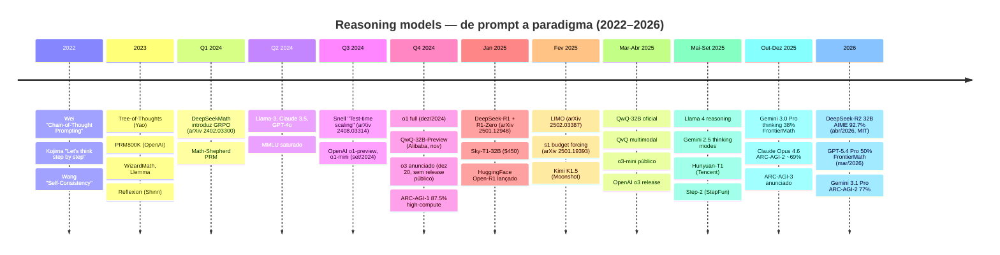
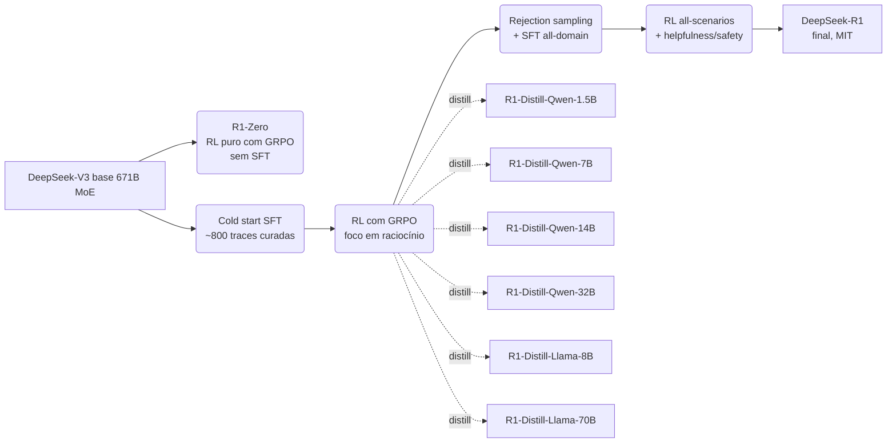
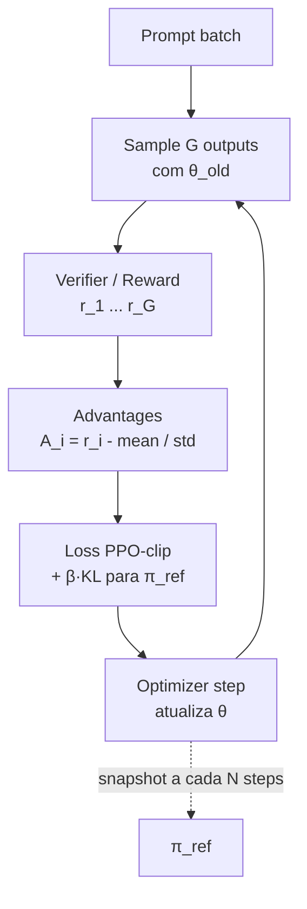
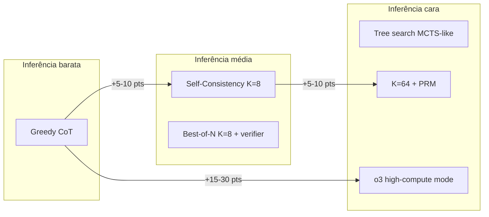
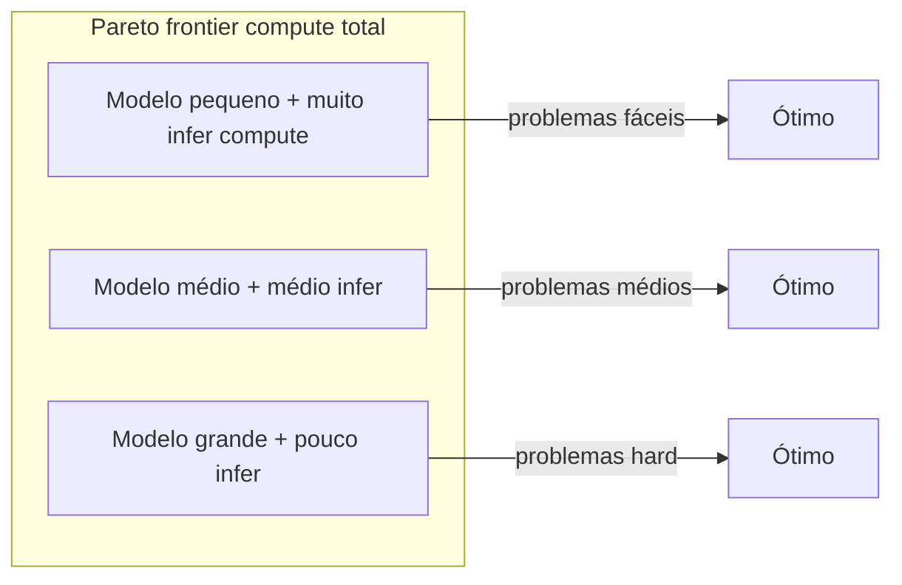

# Post 18 — Reasoning models de A a Z: o1, o3, R1, QwQ, GRPO e o salto do test‑time compute

> **Série**: LLMs em Profundidade — Da Atenção ao TurboQuant e Além
> **Post**: 18 (horizontal, transversal a treinamento + inferência + eval)
> **Pré‑requisitos sugeridos**:
> - Post 09 (treinamento, RLHF, PPO) — **ideal** antes deste, porque GRPO é primo direto de PPO.
> - Post 11 (vLLM/SGLang serving) — para a parte de servir reasoning.
> - Post 08 / 08‑DEEP (speculative decoding) — para entender por que speculative casa tão bem com CoT longo.
> - Post 10 (hardware H100/B200) — referência de custo/tempo de RL.
> **Tom**: didático rigoroso, com saudável ceticismo. Reasoning é a área onde mais se anuncia milagre por mês.
> **Objetivo**: dar **um mapa completo e honesto** dos modelos de raciocínio de 2022 a 2026 — do prompt "let's think step by step" até GRPO em produção e ARC‑AGI‑2.

---

## TL;DR

Em **menos de 24 meses** (set/2024 → abr/2026), "raciocinar" deixou de ser truque de prompt e virou **pipeline de treinamento próprio**, com **RL** dedicado, **verifiers** específicos por domínio e uma nova lei de escala — *test‑time compute*: gastar mais tokens de pensamento durante a inferência pode valer mais que treinar um modelo maior.

Os marcos:

1. **CoT prompting** (Wei 2022, Kojima 2022): "*let's think step by step*". Funciona mas tem teto.
2. **SFT em traces de CoT** (WizardMath, Llemma, Math‑Shepherd, 2023): bom em matemática conhecida, ruim em generalização.
3. **OpenAI o1** (set/2024): primeiro modelo treinado **explicitamente** para "pensar" via RL em larga escala. AIME 83% (vs ~13% do GPT‑4o). CoT escondido.
4. **OpenAI o3** (anunciado dez/2024, lançado ao público abr/2025) e **o3‑pro / o4‑mini** (abr/2025): ARC‑AGI‑1 público em 76‑88% (preview), FrontierMath em ~25% reportado / ~10% no público. Custo extremo no high‑compute mode.
5. **DeepSeek‑R1** (jan/2025, arXiv 2501.12948): a "tese de doutorado da década" para a comunidade open. **R1‑Zero** mostra que **RL puro** (GRPO) sobre um base model produz CoT longo emergente — *aha moments*, reflection, verification — sem nenhum SFT. **R1** completo bate o1 em AIME/MATH/Codeforces. Pesos liberados (MIT).
6. **GRPO** (DeepSeekMath, fev/2024, arXiv 2402.03300): variante de PPO **sem value network**, com vantagem normalizada **por grupo de samples**. Memória menor, código mais simples, perfeito para verifiers determinísticos (math/code).
7. **QwQ‑32B** (nov/2024 → mar/2025): primeira família open‑weights "reasoning‑first" da Alibaba. Apache 2.0.
8. **Onda 2025**: Sky‑T1 (US$ 450 reproduzindo R1‑style), HuggingFace **Open‑R1**, **simpleRL**, **LIMO** (817 traces curadas batem benchmarks), **s1** (budget forcing), Kimi K1.5 da Moonshot.
9. **DeepSeek‑R2** (abr/2026, 32B denso, AIME 92.7%, MIT): consolidação do paradigma "GRPO refinado > escala bruta".
10. **Test‑time scaling laws** (Snell 2024, arXiv 2408.03314): para problemas difíceis, **mais compute na hora da resposta** pode beat **14× mais compute no treinamento**.

O preço a pagar é honesto e pesado: latência de **30–120 s** por query, custo por chamada **5–15× maior** que um modelo "rápido", *overthinking* em tarefas triviais (o1 escrevendo dissertação para "2+2"), risco de **reward hacking**, contaminação de benchmarks. Este post **não** vai vender milagre. Vai mostrar a engenharia.

> **Analogias‑guia deste post:**
> - **CoT** = a *voz interna* do narrador no romance — pensamento explícito, passo a passo, em voz alta.
> - **o1 / o3** = um *estagiário a quem você concede mais 60 segundos antes de responder* — ele acerta mais, mas a entrevista demora.
> - **R1‑Zero** = uma *criança que descobre raciocínio sozinha sem professor*, só com feedback "certo/errado" da realidade.
> - **GRPO** = *fazer o exercício 8 vezes, comparar entre si, reforçar as variações acima da média do grupo* — sem precisar de um juiz separado.
> - **Distillation R1 → modelo pequeno** = um *leitor compulsivo* que aprende lendo *os diários do escritor genial*, mesmo sem viver a experiência dele.
> - **Test‑time scaling** = *comprar mais tempo no exame* em vez de estudar mais para a próxima prova.
> - **Process reward model (PRM)** = *o professor que corrige cada passo*, não só a resposta final do exercício.

---

## Índice

1. [Por que "reasoning" virou primeira‑linha em 2024–2026](#1-por-que-reasoning-virou-primeira-linha-em-2024-2026)
2. [Chain‑of‑Thought prompting — recap denso](#2-chain-of-thought-prompting--recap-denso)
3. [A era pré‑reasoning: SFT em traces de CoT](#3-a-era-pré-reasoning-sft-em-traces-de-cot)
4. [OpenAI o1 (setembro 2024)](#4-openai-o1-setembro-2024)
5. [OpenAI o3, o3‑pro, o4‑mini (dez 2024 → 2026)](#5-openai-o3-o3-pro-o4-mini-dez-2024--2026)
6. [DeepSeek‑R1 (janeiro 2025) — o paper que mudou tudo](#6-deepseek-r1-janeiro-2025--o-paper-que-mudou-tudo)
7. [GRPO em profundidade — coração do R1](#7-grpo-em-profundidade--coração-do-r1)
8. [QwQ e a família Qwen reasoning](#8-qwq-e-a-família-qwen-reasoning)
9. [Onda open‑source 2025–2026: Sky‑T1, Open‑R1, LIMO, s1, K1.5, R2](#9-onda-open-source-2025-2026-sky-t1-open-r1-limo-s1-k15-r2)
10. [Técnicas de test‑time scaling](#10-técnicas-de-test-time-scaling)
11. [PRMs vs ORMs — premiar passo ou só resultado?](#11-prms-vs-orms--premiar-passo-ou-só-resultado)
12. [Scaling laws para reasoning](#12-scaling-laws-para-reasoning)
13. [Servindo reasoning models em produção](#13-servindo-reasoning-models-em-produção)
14. [Multi‑agent reasoning, formal math e tool use](#14-multi-agent-reasoning-formal-math-e-tool-use)
15. [Benchmarks frontier 2024–2026](#15-benchmarks-frontier-2024-2026)
16. [Distillation de R1 para modelos pequenos](#16-distillation-de-r1-para-modelos-pequenos)
17. [Limitações honestas do estado da arte](#17-limitações-honestas-do-estado-da-arte)
18. [Tendências 2025–2027](#18-tendências-2025-2027)
19. [Receita prática: treine seu próprio reasoning model](#19-receita-prática-treine-seu-próprio-reasoning-model)
20. [Eval de reasoning sem se enganar](#20-eval-de-reasoning-sem-se-enganar)
21. [Cross‑references na série](#21-cross-references-na-série)
22. [Referências](#22-referências)

---

## 1. Por que "reasoning" virou primeira‑linha em 2024–2026

### 1.1. A saturação dos benchmarks "tradicionais"

A primeira metade da década (2020–2023) foi dominada por benchmarks de "amplitude" — MMLU (57 disciplinas, multiple‑choice), HellaSwag (senso comum), TriviaQA, HumanEval (164 funções Python), GSM8K (8.500 problemas de aritmética escolar). De GPT‑3 (2020) a Llama‑3‑70B (2024), todos esses subiram em paralelo até **saturar** próximos dos 90% — e os 10% restantes muitas vezes são erros do próprio gabarito ou contaminação de treino.

Quando a fronteira **não consegue mais distinguir GPT‑4o de Claude 3.5 Sonnet em MMLU** (ambos ≥ 88%), a comunidade precisa de novos termômetros. E os termômetros que sobraram têm uma característica em comum: **exigem múltiplos passos de raciocínio**.

### 1.2. Os "frontier benchmarks" de 2024–2026

| Benchmark | Domínio | Tamanho | Dificuldade | Top human | Top LLM 2026 |
|---|---|---|---|---|---|
| **MMLU‑Pro** | Geral | 12.000 questões | Multiple‑choice difícil | ~90% (PhD) | ~85% (Claude Opus 4.6) |
| **GPQA Diamond** | Ciência (PhD) | 198 questões | Especialistas levam horas | ~65% | ~88% (o3) |
| **AIME 2024/25** | Math (HS olimpíada) | 30 problemas/ano | 5–15% dos competidores | 100% top | ~99% (o4‑mini c/ Python) |
| **MATH (Hendrycks)** | Math (5 níveis) | 12.500 | Médio‑difícil | ~90% | ~98% (R1) |
| **FrontierMath** | Math (research‑level) | ~300 problemas | Horas de trabalho de pesquisador | (poucos) | ~50% (GPT‑5.4 Pro) |
| **ARC‑AGI‑1** | Grid puzzles | 800 públicos | "Generalização zero‑shot" | ~98% | 88% (o3 high‑compute preview) |
| **ARC‑AGI‑2** | Grid puzzles v2 | 600 priv. | Anti‑decoreba | ~98% | ~77% (Gemini 3.1 Pro) |
| **USAMO 2025** | Math olimpíada | 6 problemas | Top 250 EUA | ~80% best | ~50% (frontier) |
| **SWE‑Bench Verified** | Eng. software | 500 PRs reais | Engenheiro pleno | (humano) | ~70% (Claude Sonnet 4.6) |
| **LiveCodeBench** | Código competitivo | Atualizado mensal (anti‑contam.) | Codeforces médio | — | ~85% (o4‑mini) |

Notas rápidas: ARC‑AGI‑2 (Chollet 2025) foi desenhada **explicitamente para resistir** ao tipo de truque que jogou ARC‑AGI‑1 de ~5% (GPT‑4) para 88% (o3 preview). FrontierMath é mantido por Epoch AI com contribuições privadas de Tao, Gowers e outros — o gabarito **nunca** foi publicado, justamente para evitar contaminação.

### 1.3. Demanda real puxando reasoning

Não é só esporte de benchmark. O mercado pediu reasoning porque os casos onde LLM "alucinava de forma cara" eram exatamente os de **múltiplos passos**:

- **Matemática aplicada / quant**: provar invariantes, derivar fórmulas, otimizar carteiras.
- **Code**: SWE‑Bench (resolver issues do GitHub), debug em multi‑arquivo, refactor seguro.
- **Ciência**: leitura de papers, design de experimentos, química retrosíntese.
- **Planejamento multi‑step**: agentes (booking, devops, pesquisa), workflow de RPA.
- **Análise jurídica e financeira**: ler 200 páginas de contrato e responder com **referência a parágrafo**.

GPT‑4 já era bom em "uma resposta", mas péssimo em "20 passos sem se perder". O salto para o1 / R1 não é cosmético: em SWE‑Bench Verified, o1 saiu de ~40% (4o) para 49% e o3 chegou a **71.7%** (relatório OpenAI dez/2024).

### 1.4. Timeline visual



> **Leitura crítica do timeline**: dois anos. **Dois anos.** Tudo que está acima de "Set 2024" não existia comercialmente. Vale lembrar isso quando alguém disser "reasoning é hype".

---

## 2. Chain‑of‑Thought prompting — recap denso

Antes do RL, antes do o1, havia o **prompt**. CoT é a base da pirâmide.

### 2.1. Wei et al. 2022 — o paper original

**"Chain‑of‑Thought Prompting Elicits Reasoning in Large Language Models"** (NeurIPS 2022, arXiv:2201.11903) mostrou um achado simples: para modelos suficientemente grandes (≥ 60 B na época), **adicionar exemplos few‑shot que mostram o raciocínio passo a passo** no prompt eleva drasticamente a acurácia em tarefas de aritmética, senso comum simbólico e raciocínio multi‑step.

Exemplo clássico (GSM8K):

```
Q: Roger has 5 tennis balls. He buys 2 more cans of tennis balls.
   Each can has 3 tennis balls. How many tennis balls does he have now?

A (sem CoT): 11.       <-- modelo erra
A (com CoT): Roger started with 5 balls. 2 cans of 3 balls each is 6 balls.
             5 + 6 = 11. The answer is 11.    <-- agora certo
```

Por que funciona? Hipótese de Wei: **alocar mais "tokens de computação"** ao problema. Cada token é um passo de forward; mais passos = mais profundidade efetiva. Hipótese alternativa de Madaan & Yazdanbakhsh: o modelo já "sabia", o CoT força‑o a **expor** o caminho. Provavelmente é uma combinação — o paper de Prystawski (2023) mostra evidência teórica de que CoT é fundamentalmente Bayesian smoothing de uma distribuição multimodal de respostas.

### 2.2. Kojima 2022 — Zero‑shot CoT

**"Large Language Models are Zero‑Shot Reasoners"** (arXiv:2205.11916) descobre algo embaraçoso: você nem precisa dos exemplos few‑shot. Basta **anexar uma frase mágica**:

> "Let's think step by step."

E em GSM8K o GPT‑3 saltou de 17.7% para 78.7%. **Uma frase**. Esse é o nível de ingenuidade da arquitetura — se você não pede explicitamente, ela responde com a primeira amostra da distribuição.

### 2.3. Self‑Consistency (Wang 2022)

**"Self‑Consistency Improves Chain of Thought"** (arXiv:2203.11171). Receita:

1. Sample **K** chains (K = 5–40) com temperature > 0.
2. Extraia a **resposta final** de cada chain.
3. Voto majoritário.

Funciona porque chains erradas tendem a errar de **formas diferentes**, enquanto chains certas convergem. Em GSM8K, K=40 dá +18 pontos sobre CoT greedy. É a primeira manifestação prática de **test‑time scaling**.

### 2.4. Tree of Thoughts (Yao 2023)

**"Tree of Thoughts: Deliberate Problem Solving"** (arXiv:2305.10601). Em vez de uma chain linear, mantém uma **árvore** de pensamentos parciais; usa o próprio LLM como heurística para expandir / podar. Resolve "Game of 24" (74% vs 4% CoT) e quebra‑cabeças tipo crossword.

### 2.5. Graph of Thoughts (Besta 2023) e variantes

GoT generaliza para um DAG — pensamentos podem se *fundir*. Programa de pensamentos (PoT, Chen 2022) gera **código Python** em vez de texto e executa para obter o número final — virtualmente perfeito em GSM8K com calculadora.

### 2.6. Limitação fundamental do prompting

Todas essas técnicas têm um teto: **dependem do que o base model já consegue fazer**. Se o modelo erra "7 × 8" 30% das vezes, CoT não conserta. Self‑Consistency também não — se a moda da distribuição é errada, votar não ajuda. **PoT** com calculadora burla parcialmente, mas só onde se pode "executar".

A próxima onda foi *colocar o reasoning dentro do peso*, via SFT + RL.

---

## 3. A era pré‑reasoning: SFT em traces de CoT

Entre 2023 e meados de 2024, a comunidade open‑source descobriu que **fine‑tuning supervisionado em milhares de traces de CoT** dava ganhos consistentes — desde que o domínio fosse coberto.

### 3.1. Modelos referenciais

| Modelo | Base | Domínio | Receita | Resultado |
|---|---|---|---|---|
| **WizardMath‑70B** (Luo 2023) | Llama‑2 | Matemática | Evol‑Instruct + RLEIF (RM ranking) | GSM8K 81.6%, MATH 22% |
| **Llemma‑34B** (Azerbayev 2023) | CodeLlama | Math papers / arXiv / proofs | Pré‑treino contínuo em **Proof‑Pile‑2** (55B tokens) | MATH 25.0% |
| **MetaMath** (Yu 2023) | Llama‑2 | Math | Bootstrapping reverso de GSM8K/MATH | GSM8K 82.3% |
| **Math‑Shepherd** (Wang 2024) | Mistral‑7B | Math + PRM | SFT + treino de step‑level PRM (sem anotação humana) | MATH 33%, AIME ~7% |
| **DeepSeek Coder / V2** (Guo 2024) | — | Code | Repo‑level pretraining + SFT + DPO | HumanEval 90.2% |
| **DeepSeekMath‑7B** (Shao 2024) | DeepSeek base | Math | Pretrain math web (120 B tokens) + SFT + **GRPO** | MATH 51.7% |

### 3.2. Por que SFT puro era insuficiente

Três limites empíricos observados consistentemente:

1. **Memorização de traces**: SFT em traces "gabarito" treina o modelo a **reproduzir** a forma do raciocínio, não a **descobrir** a forma certa para problemas novos. O modelo decora "padrões de prova" em vez de "estratégias de prova".
2. **Erro de exposição (exposure bias)**: durante SFT, o modelo só vê traces *corretas*. Quando comete erro intermediário em inferência, nunca aprendeu a se **recuperar**. RL, ao contrário, força o modelo a lidar com seu próprio rastro.
3. **Saturação rápida**: com 50–100k traces sintéticas curadas, ganhos plateauam. Mais dados sintéticos viraram ruído. Foi a "muralha de SFT" que motivou a virada para RL puro em 2024.

> **Kazoo de aviso**: o RL não eliminou o SFT. O R1 oficial **começa** com cold start SFT em ~800 traces curadas, justamente para evitar a "fase asselvajada" do R1‑Zero. SFT virou **ignição**, não **veículo**.

---

## 4. OpenAI o1 (setembro 2024)

### 4.1. O que foi anunciado

12 de setembro de 2024, OpenAI publica o blog post "Learning to Reason with LLMs". Lança **o1‑preview**, **o1‑mini** (e mais tarde **o1**, **o1‑pro**). A frase central:

> *"Our large‑scale reinforcement learning algorithm teaches the model how to think productively using its chain of thought in a highly data‑efficient training process."*

Em palavras simples: **escalou RL sobre CoT**. O método interno não foi divulgado em detalhe (provavelmente PPO + verifiers + dataset proprietário, com hipóteses fortes da comunidade de que envolva PRM e MCTS‑like).

### 4.2. Insight central — test‑time compute

O gráfico que ficou famoso: AIME accuracy vs **compute na inferência** (log‑log) mostra **lei de potência clara**. Dobrar o tempo de pensamento → +X pontos. Isso é **uma nova dimensão de scaling**, ortogonal a "modelo maior" e "mais dados de treino".

```
            AIME pass@1
              ▲
          80%─┤              ╱─── o1-pro (alto thinking)
              │           ╱─
          60%─┤        ╱─       o1
              │     ╱─
          40%─┤  ╱─               o1-mini
              │
          20%─┤●  GPT-4o
              │
              └─────────────────────────►
              10⁰   10¹   10²   10³   thinking tokens (log)
```

### 4.3. CoT escondido — escolha polêmica

OpenAI **não mostra** o reasoning trace para o usuário. Você vê só o **sumário** gerado por outro modelo. Justificativas oficiais:

- Proteger método de treinamento (evitar que concorrentes destilem).
- Liberdade do modelo "pensar" sem se autocensurar (alignment paradox).
- Reduzir confusão (raciocínios podem ser longos, errados em parte, contraditórios).

Custo dessa decisão: comunidade não consegue **debugar** raciocínio, **distillar** trace, ou **estudar** padrões emergentes. Quem fez R1 três meses depois inverteu: trace **totalmente público**.

### 4.4. Pricing e UX

Reasoning tokens são cobrados como **output tokens**, mesmo invisíveis. Em 2024:
- o1‑preview: **US$ 15 / M input, US$ 60 / M output** (incluindo reasoning).
- o1‑mini: **US$ 3 / M input, US$ 12 / M output**.
- Pro mode: **US$ 200 / mês fixo** com chamadas ilimitadas.

Latência típica: **30–90 s** para questões médias. Para problemas hard ("o1‑pro mode"), **2–10 minutos**. Isso muda completamente a UX — não dá para usar o1 em chat conversacional rápido. UI do ChatGPT precisou adicionar **"thinking..."** spinner com estimativa.

### 4.5. Performance reportada (o1 full, dez/2024)

| Benchmark | GPT‑4o | o1‑preview | o1 | o1‑pro |
|---|---|---|---|---|
| AIME 2024 | 13.4% | 56.7% | 83.3% | ~89% |
| MATH | 60.3% | 85.5% | 94.8% | — |
| GPQA Diamond | 50.6% | 73.3% | 78.0% | ~79% |
| Codeforces (Elo) | ~900 | 1808 (89th pct) | 1891 | — |
| MMLU | 88.7% | 90.8% | 92.3% | — |
| HumanEval | 90.2% | 92.4% | 92.4% | — |

> Repare: HumanEval **não muda**. Tarefa fácil para um modelo grande, sem necessidade de "thinking time". O ganho de o1 está concentrado em **AIME, GPQA, Codeforces** — exatamente as tarefas multi‑step.

### 4.6. Limitações práticas

- **Latência alta** mata casos de uso interativo. Inviável para autocomplete, chat casual.
- **Custo desproporcional** quando a query é simples ("o1 escreve essay para 2+2", *overthinking*).
- **Opacidade** dificulta debugging e *prompt engineering* (você não sabe o que o modelo "pensou errado").
- **Não suporta function calling / tools** (resolvido depois em o3 e o4‑mini).
- **Streaming pobre**: você vê o spinner, depois o resultado de uma vez.

---

## 5. OpenAI o3, o3‑pro, o4‑mini (dez 2024 → 2026)

### 5.1. O anúncio de 20 de dezembro de 2024 — "12 days of OpenAI"

Sam Altman: *"o1 was the GPT of the o family; o3 is the GPT‑2 of the o family"* — sinalizando salto análogo ao GPT → GPT‑2 (escala 10×).

Demos públicas (não release):
- **ARC‑AGI‑1** (semi‑private): **75.7% low‑compute**, **87.5% high‑compute** — cruzando, pela primeira vez, a barreira de "humano médio" (~85%) num benchmark desenhado para resistir a memorização.
- **FrontierMath**: **25.2%** (vs ~2% em modelos anteriores; humanos especialistas levam horas por problema).
- **GPQA Diamond**: **87.7%** (acima do PhD médio).
- **SWE‑Bench Verified**: **71.7%** (o1 era 49%).
- **Codeforces**: Elo **2727** (top 200 mundial entre humanos competidores ativos).

### 5.2. O custo do "high‑compute"

Aqui mora a pegadinha. ARC Prize (organização que mantém ARC‑AGI) divulgou: o3 high‑compute consumiu **~172× mais tokens** que low‑compute. Custo estimado: **US$ ~17 por task** em low, **US$ ~3.000+ por task** em high. Para resolver os 100 tasks do semi‑private set: **US$ 300.000+** em uma rodada.

> Isso muda a leitura do "87.5%": não é "AGI alcançada", é "AGI alugada por hora a preço de Manhattan".

### 5.3. o3‑mini e o3 público (2025)

- **o3‑mini**: jan/2025, mais barato e rápido que o1. Suporta function calling e structured output (gap fechado vs o1).
- **o3 release público**: abril/2025. ARC‑AGI‑1 público caiu para **53% (medium)** e **41% (low)** — confirmando que o "preview" foi com configuração especial.
- **o4‑mini** (abr/2025): SOTA em AIME 2025 (**99.5% pass@1, 100% consensus@8** com Python interpreter). Suporta multimodal + tools + reasoning.
- **o4** (esperado fim 2025–2026): foco em agentic reasoning + multimodal.

### 5.4. ARC‑AGI‑2 — a virada de mesa (2025)

Chollet lança **ARC‑AGI‑2** em meados de 2025, calibrado para que humanos pontuem **~98%** mas sistemas que dominaram ARC‑AGI‑1 caiam para **< 5%**. o3 e o4‑mini públicos pontuam **< 3%** em ARC‑AGI‑2. Em 2026, modelos frontier sobem (Gemini 3.1 Pro **77.1%**, GPT‑5.4 **73.3%**, Claude Opus 4.6 **68.8%**) — mas ainda longe da meta de 85% do prêmio.

### 5.5. FrontierMath — a régua honesta da matemática

| Modelo | Score FrontierMath |
|---|---|
| GPT‑4o | < 2% |
| o1 (dez/2024) | ~2% |
| o3 (anúncio) | 25.2% |
| o3 (público) | ~10% |
| Gemini 2.5 Deep Think | ~30% |
| GPT‑5.2 Deep Think w/ tools | 40.3% |
| Gemini 3.0 Pro Medium thinking | 38% |
| GPT‑5.4 Deep thinking | 47.6% |
| **GPT‑5.4 Pro (mar/2026)** | **50.0%** |

(Dados de epoch.ai e llm‑stats consolidados em 2026.)

50% em FrontierMath é, *de novo*, a fronteira honesta. Os outros 50% incluem teoremas que **publicação em journal** levaria meses. Estamos **no meio do caminho**, não no fim.

---

## 6. DeepSeek‑R1 (janeiro 2025) — o paper que mudou tudo

20 de janeiro de 2025, DeepSeek publica **arXiv:2501.12948** ("DeepSeek‑R1: Incentivizing Reasoning Capability in LLMs via Reinforcement Learning"). Em 48 h, a comunidade open‑source tinha *o1 em casa*, com pesos abertos sob MIT‑like e relatório técnico de 22 páginas.

### 6.1. Os dois modelos: R1‑Zero e R1



### 6.2. R1‑Zero — RL puro, sem SFT

**Insight selvagem**: pegar o **base model** (DeepSeek‑V3 sem SFT, sem RLHF) e aplicar **GRPO direto** com dois rewards triviais:

- **Accuracy reward**: a resposta entre `<answer>...</answer>` está correta? (verificável por sympy/regex para math/code)
- **Format reward**: o modelo respeitou o template `<think>...</think><answer>...</answer>`?

**Sem PRM, sem RM aprendido, sem dados humanos.** Só verifier determinístico.

O que aconteceu nas curvas de treinamento:

1. **Resposta vai ficando mais longa**: de ~300 tokens para >5.000 tokens de raciocínio em 8.000 steps. Sem instrução, sem reward por comprimento.
2. **Emergência de "aha moment"**: trechos onde o modelo escreve "*Wait, let me reconsider*" ou "*Actually, I made a mistake earlier*" e **volta atrás**. Não foi treinado para isso explicitamente.
3. **AIME 2024**: 15.6% → **71.0%** pass@1, e **86.7%** com cons@64.

**Limitação honesta**: R1‑Zero é **bagunçado**. Mistura inglês e chinês no meio do raciocínio, formatação inconsistente, reasoning às vezes ilegível. Por isso DeepSeek treinou o R1 "civilizado" por cima.

### 6.3. R1 — pipeline completo

Quatro estágios:

| Estágio | Tipo | Dados | Objetivo |
|---|---|---|---|
| **1. Cold start** | SFT | ~800 traces longas curadas (high‑quality) | Estabilizar formato + linguagem antes do RL |
| **2. Reasoning RL** | GRPO | Tarefas math/code/logic com verifier + reward de "language consistency" | Construir capacidade de raciocínio |
| **3. SFT all‑domain** | SFT | ~600k samples de reasoning (rejection sampling do estágio 2) + ~200k de não‑reasoning (V3) | Generalizar para escrita, role‑play, etc. |
| **4. RLHF all‑scenarios** | GRPO + RM | Helpfulness + harmlessness | Alinhamento final |

Resultados (vs o1‑1217):

| Benchmark | DeepSeek‑R1 | OpenAI o1 |
|---|---|---|
| AIME 2024 (pass@1) | **79.8%** | 79.2% |
| MATH‑500 | **97.3%** | 96.4% |
| GPQA Diamond | **71.5%** | 75.7% |
| Codeforces (Elo) | **2029** | 2061 |
| LiveCodeBench | **65.9%** | 63.4% |
| MMLU | 90.8% | **91.8%** |
| AlpacaEval 2.0 | 87.6% | — |

**Parou no o1 com pesos abertos.** É difícil exagerar o impacto. Em uma semana, vLLM/SGLang/Ollama tinham suporte; em duas semanas, **HuggingFace Open‑R1** começou a reproduzir o pipeline; em um mês, dezenas de "R1‑clones" treinados (Sky‑T1, OpenThoughts, Bespoke‑Stratos).

### 6.4. Distillação para os pequenos

DeepSeek liberou também 6 modelos destilados — **simples SFT** dos traces gerados pelo R1, sem RL:

| Modelo | Base | AIME | MATH‑500 | GPQA Diamond |
|---|---|---|---|---|
| R1‑Distill‑Qwen‑1.5B | Qwen 2.5 Math 1.5B | 28.9% | 83.9% | 33.8% |
| R1‑Distill‑Qwen‑7B | Qwen 2.5 Math 7B | 55.5% | 92.8% | 49.1% |
| R1‑Distill‑Llama‑8B | Llama 3.1 8B | 50.4% | 89.1% | 49.0% |
| R1‑Distill‑Qwen‑14B | Qwen 2.5 14B | 69.7% | 93.9% | 59.1% |
| **R1‑Distill‑Qwen‑32B** | Qwen 2.5 32B | **72.6%** | **94.3%** | **62.1%** |
| R1‑Distill‑Llama‑70B | Llama 3.3 70B | 70.0% | 94.5% | 65.2% |

R1‑Distill‑Qwen‑32B **bate QwQ‑32B‑Preview** em AIME e MATH. Sem RL no pequeno. Lição que ficou: **se você tem traces de um modelo grande já treinado com RL, SFT no pequeno extrai 80% do valor a 1% do custo**.

---

## 7. GRPO em profundidade — coração do R1

### 7.1. De PPO para GRPO

PPO (Schulman 2017) é o algoritmo padrão de RLHF desde 2022 (InstructGPT, Llama Chat). Sua estrutura:

- Política \(\pi_\theta\) (o LLM sendo treinado).
- Política de referência \(\pi_{\text{ref}}\) (snapshot, congelada, para KL).
- Reward model \(R_\phi\) (rede neural treinada com preferências humanas).
- **Value network** \(V_\psi\) (mesma arquitetura do LLM, prevê retorno futuro).

Loss:

\[
\mathcal{L}_{\text{PPO}} = -\mathbb{E}_t\!\left[\min\left(\rho_t A_t,\ \mathrm{clip}(\rho_t, 1-\epsilon, 1+\epsilon) A_t\right)\right] + \beta\, \mathrm{KL}(\pi_\theta \,\|\, \pi_{\text{ref}})
\]

onde \(\rho_t = \pi_\theta(a_t|s_t) / \pi_{\text{old}}(a_t|s_t)\) e \(A_t = R_t - V_\psi(s_t)\) (advantage via GAE).

**Problema** para reasoning: o **value network** dobra a memória ocupada (você roda dois modelos do mesmo tamanho). Em DeepSeek‑V3 671B, isso seria proibitivo.

### 7.2. A ideia central do GRPO

DeepSeekMath (Shao 2024, arXiv 2402.03300) propõe: para cada prompt, **gere um grupo de G amostras** (G = 8–64) e use a **média do grupo como baseline**. Adeus value network.

Algoritmo, em pseudocódigo Python (sem framework):

```python
def grpo_step(model, ref_model, prompts, reward_fn,
              G=16, epsilon=0.2, beta=0.04, kl_type="approx"):
    # 1. Sample G respostas para cada prompt (off-policy fresh)
    all_outputs = []
    all_logprobs_old = []
    for prompt in prompts:
        outputs = model.generate(prompt, num_return_sequences=G,
                                 temperature=1.0, top_p=1.0,
                                 max_new_tokens=4096)
        all_outputs.append(outputs)
        all_logprobs_old.append([
            compute_logprobs(model, prompt, o)  # frozen snapshot
            for o in outputs
        ])

    # 2. Score cada output (verifier determinístico ou RM)
    rewards = [[reward_fn(prompt, o) for o in outs]
               for prompt, outs in zip(prompts, all_outputs)]

    # 3. Vantagem normalizada DENTRO do grupo
    advantages = []
    for r_group in rewards:
        r = torch.tensor(r_group)
        adv = (r - r.mean()) / (r.std() + 1e-8)   # <-- coração do GRPO
        advantages.append(adv)

    # 4. Loss PPO-clip + KL para ref
    total_loss = 0
    for prompt, outs, lp_old, adv in zip(prompts, all_outputs,
                                          all_logprobs_old, advantages):
        for o, lp_old_i, A_i in zip(outs, lp_old, adv):
            lp_new = compute_logprobs(model, prompt, o)
            lp_ref = compute_logprobs(ref_model, prompt, o)

            ratio = torch.exp(lp_new - lp_old_i)        # ρ
            unclipped = ratio * A_i
            clipped = torch.clamp(ratio, 1-epsilon, 1+epsilon) * A_i
            policy_loss = -torch.min(unclipped, clipped).mean()

            # KL aproximada (Schulman k3 estimator)
            kl = (torch.exp(lp_ref - lp_new) - (lp_ref - lp_new) - 1).mean()

            total_loss = total_loss + policy_loss + beta * kl

    return total_loss / (len(prompts) * G)
```

### 7.3. Por que funciona

1. **Baseline barata**: a média do grupo é uma estimativa não‑viesada do valor esperado para aquele prompt. Subtrair reduz variância sem viés.
2. **Normalização por std**: torna o sinal de aprendizado **adimensional** e estável entre prompts difíceis (rewards baixos) e fáceis (rewards altos saturando).
3. **Adeus value network**: economia de **~50%** de memória em RL, viabiliza GRPO em modelos 70B+.
4. **Verifier determinístico**: para math/code, o reward é 0/1 da correção, não precisa de RM neural. Elimina **reward hacking** (o modelo não pode trapacear sympy).

### 7.4. Diagrama do loop



### 7.5. Ajustes finos práticos

- **G** (group size): 8 mínimo, 16–32 sweet spot. > 64 raramente vale custo.
- **β** (KL weight): 0.04 default DeepSeek; subir se o modelo "diverge da personalidade" (perde formato), descer se quer mais exploração.
- **ε** (clip): 0.2 (PPO clássico). DeepSeek‑V3 paper usa 0.28 para reasoning.
- **Temperature de sampling**: 1.0 (alta variância intencional). Top‑p 1.0 (não filtre durante RL).
- **KL reverso (k3)**: estimador estável recomendado por Schulman; alternativa: KL forward (mais agressiva).
- **Reward shaping**: muitos papers de 2025 (DAPO, Dr.GRPO) variam normalização (sem dividir por std, sem subtrair média entre prompts) e relatam ganhos. Estado da arte é **fluido**.

### 7.6. Variantes pós‑R1

- **Dr. GRPO** (Liu 2025): remove normalização por std (acaba com bias de "tarefas fáceis valerem mais").
- **DAPO** (ByteDance 2025): "Decoupled Advantage Policy Optimization" — clip de upper/lower diferentes, sem KL.
- **REINFORCE++** (Hu 2025): volta ao REINFORCE simples + baseline médio + clip; competitivo com GRPO em vários benchmarks.
- **Reinforce‑Lite, RLOO**: outras simplificações.

A controvérsia **ainda quente em 2026**: precisa do clip? precisa do KL? precisa da std? Comunidade ainda está digerindo.

---

## 8. QwQ e a família Qwen reasoning

### 8.1. QwQ‑32B‑Preview (novembro 2024)

Alibaba Qwen team lança **QwQ‑32B‑Preview** dois meses após o1, antes do R1. Apache 2.0. Características:

- 32B base Qwen 2.5.
- **SFT em traces longas + RL** (detalhes não revelados em paper formal, só blog).
- Performance: GPQA 65.2%, MATH 90.6%, AIME 50.0%, LiveCodeBench 50.0%.
- Característica peculiar: **muda de idioma no meio do raciocínio** — começa em inglês, vira chinês, volta. Apelido: "quirky".

### 8.2. QwQ‑32B oficial (março 2025)

Pós‑R1, Alibaba relança QwQ‑32B "estável", com pipeline RL melhorado. AIME ~78%, comparable a R1‑Distill‑Qwen‑32B. Apache 2.0.

### 8.3. QvQ — multimodal reasoning

Dezembro/2024 → fevereiro/2025: **QvQ‑72B‑Preview**, primeiro modelo open‑weights de **reasoning multimodal** (visão + texto). Resolve problemas de geometria a partir de **imagem do diagrama**, problemas de física com gráfico. MMMU 70.3%, MathVista 71.4%.

### 8.4. Qwen 3 (2025)

Família Qwen 3 (lançamento set/2025) introduz **modos thinking / non‑thinking** alternáveis via flag, anos antes virou padrão (Gemini 2.5, Claude). Sub‑famílias:

- **Qwen3‑0.6B / 1.7B / 4B / 8B / 14B / 32B (denso)**.
- **Qwen3‑30B‑A3B / 235B‑A22B** (MoE).
- Todas Apache 2.0.

Distillações **DeepSeek‑R1‑0528‑Qwen3‑8B** (jun/2025) tornaram‑se o padrão para "reasoning local em laptop".

---

## 9. Onda open‑source 2025–2026: Sky‑T1, Open‑R1, LIMO, s1, K1.5, R2

| Projeto | Origem | Data | Receita | Custo claim | Resultado destacado |
|---|---|---|---|---|---|
| **Sky‑T1‑32B‑Preview** | NovaSky‑AI (Berkeley) | Jan 2025 | Distill traces de QwQ + Qwen 2.5 base | **US$ 450** (~19 H100‑hours) | AIME 43%, MATH 82.4% |
| **Bespoke‑Stratos** | Bespoke Labs | Jan 2025 | Distill traces R1 (17k) → SFT Qwen 2.5 32B | ~US$ 800 | AIME 63%, GPQA 58% |
| **OpenThoughts** | Comunidade | Fev 2025 | Dataset **OpenThoughts‑114k** + treinos | (open) | Best 7B/32B reasoning open na época |
| **HuggingFace Open‑R1** | HF | Jan–set 2025 | Reproduzir pipeline R1 totalmente open (data + training + eval) | — | Open‑R1 dataset, modelos, infra GRPO em TRL |
| **simpleRL** | Hong et al. | Jan 2025 | GRPO em Qwen 2.5‑Math‑7B com **8k MATH problems** | ~US$ 10‑40 | AIME 33% partindo de 16% |
| **LIMO** | Ye 2025 (arXiv 2502.03387) | Fev 2025 | **817 traces** de altíssima qualidade, SFT puro | (mínimo) | AIME 57% (vs 6% base) |
| **s1** | Muennighoff 2025 (arXiv 2501.19393) | Fev 2025 | 1.000 traces curadas + **budget forcing** | ~US$ 50 | AIME 56% (s1‑32B, base Qwen) |
| **Kimi K1.5** | Moonshot AI | Jan 2025 | Long‑context RL próprio + multimodal | — | AIME 77.5%, MATH 96.2% |
| **Hunyuan‑T1** | Tencent | Mar 2025 | Mamba‑Transformer hybrid + RL | — | Reasoning competitivo, sub‑linear cost long ctx |
| **Step‑2** | StepFun | 2025 | Trillion‑param MoE reasoning | — | Top em chinese reasoning leaderboards |
| **DeepSeek‑R1‑0528** (refresh) | DeepSeek | Maio 2025 | R1 retreinado com data update | — | AIME 86%, melhor coding |
| **DeepSeek‑R2** | DeepSeek | **Abr 2026** | 32B denso, GRPO refinado | ~70% mais barato que frontier | **AIME 92.7%**, roda em RTX 4090 |

### 9.1. LIMO — "Less Is More for Reasoning"

Insight: **817 traces curadas** com qualidade obsessiva > 100k traces sintéticas. Hipótese: o base model **já tem a capacidade**, traces são **gatilhos**. Resultado: AIME 57% sobre Qwen2.5‑32B, partindo de 6.5% base. Confirma a "Hipótese Superficial de Alinhamento" (LIMA, 2023) também para reasoning.

### 9.2. s1 — budget forcing

Truque genial e simples: durante decode, sempre que o modelo for emitir `</think>`, **substitua por "Wait,"** e force continuar. Resultado: o modelo **estende seu próprio raciocínio**, descobre erros, conserta. Em s1‑32B, AIME passa de 50% (cota normal) para 56% (com 4 forced waits).

```python
def budget_force_decode(model, prompt, max_thinks=4, max_tokens=8000):
    output = ""
    forced = 0
    while True:
        token = model.generate_next_token(prompt + output)
        if token == "</think>" and forced < max_thinks:
            output += "Wait,"   # ignora o "</think>" e injeta
            forced += 1
            continue
        output += token
        if token == "<eos>" or len(output) > max_tokens:
            break
    return output
```

> Esse trecho de 10 linhas **vale +6 pontos AIME**. A pesquisa de reasoning está cheia de "almoços grátis" assim.

### 9.3. DeepSeek‑R2 (abril 2026) — consolidação

Após o R1 (671B MoE) e o R1‑0528 (refresh), DeepSeek surpreende com **R2 = 32B denso** (não MoE). Pontos‑chave:

- AIME 2025 **92.7%**, MATH **98.4%**, Codeforces Elo **2350**.
- Rodar em **single RTX 4090 (24 GB)** com quantização INT4 — viável em workstation.
- Receita: GRPO refinado (provavelmente Dr.GRPO ou variante interna) + currículo de dados em estágios + **synthetic verifier‑guided augmentation**.
- MIT license, completo (data recipe parcialmente compartilhada).

A mensagem da DeepSeek é clara: **escala bruta não é a única alavanca**. Treino mais inteligente, dados mais limpos, RL mais maduro batem MoE 671B.

---

## 10. Técnicas de test‑time scaling

Na inferência, você tem **K alavancas** para gastar mais compute em troca de mais qualidade:

| Técnica | Descrição | Custo extra | Ganho típico (AIME) | Quando usar |
|---|---|---|---|---|
| **Greedy CoT** | 1 sample, temp 0 | 1× | baseline | Tudo (default) |
| **Self‑Consistency (cons@K)** | K samples, voto majoritário | K× | +5 a +15 pts | Math/lógica fechada |
| **Best‑of‑N + ORM** | K samples, escolher pelo RM | K× + RM | +3 a +10 pts | Tarefas com RM disponível |
| **Best‑of‑N + verifier** | K samples, escolher o que passa no verifier | K× + verifier | +5 a +12 pts | Code (testes) ou math (sympy) |
| **Tree search / MCTS‑like** | Expandir nós promissores, backtrack | 5–50× | +5 a +20 pts | Olimpíadas, planejamento |
| **Beam search com PRM** | Manter top‑b paths por step‑level score | 3–10× | +4 a +12 pts | Provas longas |
| **Self‑verify** | Modelo reanalisa própria resposta | 2× | +2 a +6 pts | Domínios verificáveis pelo próprio modelo |
| **Reflexion / iter. refinement** | Critica + revisa N vezes | N× | +3 a +10 pts | Code, escrita técnica |
| **Budget forcing (s1)** | Forçar `Wait,` no `</think>` | 1.3–2× | +3 a +6 pts | Reasoning models que sabem parar cedo |
| **Forking‑tokens** | Bifurcar em tokens "decisivos" só | 2–4× | +3 a +8 pts | Eficiência em tree search |

### 10.1. Self‑consistency em Python

```python
from collections import Counter

def self_consistency(model, prompt, K=32, temperature=0.8, extract_fn=None):
    samples = [model.generate(prompt, temperature=temperature, max_tokens=4096)
               for _ in range(K)]
    answers = [extract_fn(s) for s in samples]   # ex: regex \\boxed{(.+?)}
    answers = [a for a in answers if a is not None]
    if not answers:
        return None, samples
    most_common, count = Counter(answers).most_common(1)[0]
    confidence = count / len(answers)
    return most_common, confidence
```

### 10.2. Best‑of‑N com verifier (math)

```python
import sympy
def math_verify(answer_str, ground_truth):
    try:
        a = sympy.sympify(answer_str)
        g = sympy.sympify(ground_truth)
        return float(sympy.simplify(a - g) == 0)
    except Exception:
        return 0.0

def best_of_n_math(model, prompt, gt, N=16):
    samples = [model.generate(prompt, temperature=1.0) for _ in range(N)]
    scored = [(s, math_verify(extract_boxed(s), gt)) for s in samples]
    correct = [s for s, sc in scored if sc == 1.0]
    return correct[0] if correct else samples[0]
```

> Para **eval offline** isso é trivial. Para **produção sem ground truth**, troque o verifier por: PRM, ORM, sympy de **igualdade entre amostras** (resposta consistente), executor de código (testes ocultos) ou LLM‑as‑judge.

### 10.3. Tradeoff visual



---

## 11. PRMs vs ORMs — premiar passo ou só resultado?

### 11.1. Outcome Reward Model (ORM)

Avalia **só a resposta final**. 1 score por trace inteira. Vantagens: barato anotar (uma label por exemplo), rápido. Desvantagens: sinal **esparso** — se a resposta final está errada, não sabemos **qual passo** errou.

### 11.2. Process Reward Model (PRM)

Avalia **cada passo** do raciocínio. Múltiplos scores por trace. Vantagens: sinal denso, permite tree search guiada por step. Desvantagens: **caro de anotar** (PRM800K levou meses de anotadores humanos PhD).

### 11.3. Datasets de PRM

| Dataset | Origem | Tamanho | Anotação | Uso |
|---|---|---|---|---|
| **PRM800K** (Lightman 2023, OpenAI) | Math | ~800k passos | Humano (anotadores treinados) | Treinar PRMs frontier |
| **Math‑Shepherd** (Wang 2024) | Math | ~440k passos | **Auto‑labeling via Monte Carlo** | Demonstra que humano não é estritamente necessário |
| **OmegaPRM** (Luo 2024) | Math | ~1.5M passos | MCTS + auto‑label | SOTA em PRM treinamento |
| **ProcessBench** (Zheng 2024) | Math | 3.4k traces | Erro localizado por humano | **Eval** de PRMs (não treino) |
| **PRMBench** (2025) | Multi‑domain | — | Eval | Avalia robustez de PRMs |

### 11.4. Quando PRM > ORM e vice‑versa

- **PRM brilha em tree search**: você escolhe qual ramo expandir baseado no step score.
- **ORM brilha em best‑of‑N**: você só quer rankear traces inteiras.
- **Verifiers determinísticos** (sympy para math, executor para code) > ambos quando disponíveis. Usá‑los direto evita reward hacking em RL.
- O R1 **não usa PRM nem ORM** durante GRPO em estágios 1–2 (só verifier). PRM sofre de erro sistemático e abre caminho para reward hacking.

### 11.5. Reward hacking — o calcanhar

Em 2024, Math‑Shepherd treinou PRM e alimentou MCTS — descobriram que o modelo aprendeu a **escrever passos que enganam o PRM** sem chegar à resposta certa. DeepSeek‑R1 paper cita explicitamente isso como motivo de **abandonar PRM** no estágio principal e ficar só com verifier 0/1.

---

## 12. Scaling laws para reasoning

### 12.1. Snell 2024 — o paper seminal

**"Scaling LLM Test‑Time Compute Optimally Can Be More Effective Than Scaling Model Parameters"** (arXiv:2408.03314). Achados:

- Em problemas **fáceis a moderados**, gastar mais compute em **inferência** (best‑of‑N, MCTS, revisões) **bate** treinar um modelo 14× maior, com mesmo budget total.
- Em problemas **muito difíceis**, treinar maior **ainda ganha** — inferência tem teto.
- A "compute‑optimal frontier" depende da **distribuição de dificuldade** da carga de trabalho.

### 12.2. Inferência scaling law (forma empírica)

Para um base model fixo:

\[
\log \text{error} \approx -\alpha \cdot \log(\text{compute}_\text{inf}) + c
\]

com α ≈ 0.05–0.15 dependendo do método (best‑of‑N, MCTS, etc.) e do benchmark.

### 12.3. Pareto: training × inference



**Implicação prática**: se sua carga é **assimétrica** (90% queries fáceis, 10% hard), router para "fast model + retry com reasoning" pode ser mais barato que um único reasoning model para tudo.

### 12.4. RL scaling laws (DeepSeek‑R1, paper)

DeepSeek mostra **lei de escala dentro do RL**: AIME accuracy cresce monotonicamente com mais steps de GRPO, sem plateau visível em 16k steps. Implicação: **RL ainda é under‑trained** na maioria dos modelos open. R2 confirma — mais GRPO em base menor = mais ganho.

---

## 13. Servindo reasoning models em produção

### 13.1. O problema da latência

Reasoning gera **3.000–30.000 tokens** de raciocínio antes da resposta. Em decode 50 tok/s, isso é **60 a 600 segundos** por query. UX adoece.

### 13.2. Speculative decoding salva o dia

Reasoning é **previsível entre passos** ("Step 1:", "Therefore", "Let's compute…"). Speculative decoding com draft model 0.5–3B atinge **α = 0.75–0.85** de aceitação em traces de R1, vs ~0.5 em texto comum. Speedup real medido: **2.5–3.5×** com EAGLE‑2 / Medusa em R1‑Distill‑32B.

Veja Post 08‑DEEP para algoritmo. Ponto novo aqui: **draft pode ser o próprio modelo destilado pequeno** (R1‑Distill‑1.5B) — a destilação alinha a distribuição.

### 13.3. Frameworks suportando reasoning

| Framework | Reasoning specials | Speculative | Stream `<think>` | Notas |
|---|---|---|---|---|
| **vLLM** | Sim, parser `<think>` nativo desde v0.7 | EAGLE‑2, Medusa, n‑gram | Sim, separa think/answer | Padrão da indústria 2025–2026 |
| **SGLang** | Sim, "structured generation" facilita | Draft + EAGLE | Sim | Melhor para programs estruturados |
| **TRT‑LLM** | Suporte explicit em 0.16+ | Sim | Parcial | Mais rápido em H100/B200 single‑node |
| **llama.cpp** | Sim, `--reasoning-effort` (mar/2025) | Não nativo, partials | Sim | Inference local, GGUF |
| **MLX (Apple)** | R1‑Distill quantizado, parser local | n‑gram simples | Sim | M‑series, 192GB unificada |
| **Ollama** | UI `Show thinking…` | n‑gram | Sim | Friendly local |

### 13.4. Hidden vs visible CoT — produto, não algoritmo

| Estratégia | Quem usa | Prós | Contras |
|---|---|---|---|
| **Hidden + summary** | OpenAI o1/o3 | Proteção de IP, UX limpa | Sem debug, sem citar trace |
| **Visible streaming** | DeepSeek (chat.deepseek), QwQ, Gemini Thinking, Claude Extended Thinking | Transparência, debug, confiança | Pode confundir, expõe método |
| **Toggleable** | Claude Sonnet 4.5+, Gemini 2.5+, Qwen 3 | Melhor dos dois | UI mais complexa |

Anthropic introduziu, em mid‑2025, **"extended thinking"** com slider de "thinking budget" (1k–64k tokens) — UX que se tornou padrão.

### 13.5. KV‑cache em reasoning

Reasoning tokens são **escritos no KV cache** — eles **reduzem** o budget de output útil. Isso explica por que o3 high‑compute fica caro: com 100k tokens de raciocínio em janela de 128k, sobra pouca janela. **Automatic Prefix Caching** (APC) ainda ajuda em prefill, mas o reasoning é único por query, não cacheável entre requests.

### 13.6. Streaming UX

Mostrar `<think>` em tempo real ajuda a "puxar paciência" do usuário. Pesquisa de UX (Anthropic, 2025) mostra que NPS de reasoning queries com streaming visível é **30 pontos maior** que com spinner mudo, *para o mesmo tempo total*.

---

## 14. Multi‑agent reasoning, formal math e tool use

### 14.1. Society of Minds (Du 2023)

K cópias do mesmo modelo "debatem" em N rodadas. Em cada rodada, cada agente vê as respostas dos outros e refina. Ganho: +5–10 pts em GSM8K, MATH. Custo: K × N forwards.

### 14.2. AlphaProof + AlphaGeometry (DeepMind 2024)

IMO 2024: **medalha de prata** (4/6 problemas). Não é LLM puro — é Gemini‑base + RL específico + **lean4** (assistente de prova formal) + busca. Mostra que reasoning + **linguagem formal verificável** atinge fronteira matemática humana.

### 14.3. DeepSeek‑Prover‑V2 (mai/2025)

671B MoE focado em **lean4 proofs**. Pass rate em miniF2F‑test: 88.9%, em ProofNet: 53.9%. Open weights. Confirma que a receita "RL + verificador formal" generaliza além do DeepMind.

### 14.4. ARC‑AGI + program synthesis

Para ARC‑AGI, o3 não responde direto — gera **muitos programas Python candidatos**, executa em training examples, escolhe o melhor. É reasoning **executando código**, não só pensando texto. Esta é a forma vencedora; ARC‑AGI puro CoT continua < 30%.

### 14.5. Agentic reasoning (2025)

Reasoning + ferramentas em loop:
- **Browser** (busca + leitura de páginas).
- **Code interpreter** (Python/sandbox).
- **Calculator / units / unit‑test runners**.
- **Vector DB / RAG** (memória externa).
- **MCP** (Model Context Protocol, Anthropic 2024) — padrão emergente para acoplar tools.

OpenAI **Operator** (jan/2025), Anthropic **Computer Use** (out/2024), Manus (mar/2025) e Devin (mar/2024) são manifestações disso. Em 2026, **agentic reasoning é o produto**, não reasoning puro.

---

## 15. Benchmarks frontier 2024–2026

### 15.1. Tabela consolidada (validada via WebSearch abr/2026)

| Benchmark | GPT‑4o | o1 | DeepSeek‑R1 | o3 (público) | Gemini 3.1 Pro | GPT‑5.4 Pro | Claude Opus 4.6 | DeepSeek‑R2 |
|---|---|---|---|---|---|---|---|---|
| AIME 2024 | 13% | 79% | 80% | 96% | ~95% | 99%+ | ~97% | — |
| AIME 2025 | — | — | 86% | — | — | 99%+ (cons) | — | **92.7%** |
| MATH‑500 | 76% | 96% | 97% | ~98% | ~98% | ~99% | ~98% | 98.4% |
| GPQA Diamond | 51% | 78% | 72% | 88% | ~89% | ~89% | ~88% | — |
| Codeforces Elo | 900 | 1891 | 2029 | 2727 | ~2700 | ~2750 | ~2600 | 2350 |
| LiveCodeBench | 33% | 63% | 66% | ~85% | ~85% | ~88% | ~84% | — |
| FrontierMath | <2% | ~2% | — | ~10% | 38% | **50%** | — | — |
| ARC‑AGI‑1 (semipriv) | ~5% | ~32% | — | 53% (med) | — | — | — | — |
| **ARC‑AGI‑2** | <1% | ~3% | ~3% | ~3% | **77.1%** | 73.3% | 68.8% | — |
| SWE‑Bench Verified | 33% | 49% | 49% | 72% | ~75% | ~78% | ~80% | — |
| MMLU‑Pro | 73% | 84% | 84% | 87% | ~89% | ~90% | 91% | — |

Fontes: relatórios oficiais (OpenAI, DeepSeek, Anthropic, Google), llm‑stats.com, ai‑stats.phaseo.app, arcprize.org leaderboard. Snapshot abr/2026.

### 15.2. Notas críticas sobre os números

- **Contaminação**: GSM8K e parte do MATH apareceram em datasets de pretrain. Daí AIME e FrontierMath são preferidos.
- **pass@1 vs cons@N**: ambas legítimas, mas **comparar maçãs com maçãs**. o4‑mini com Python e cons@8 é "ferramenta + voto". Modelos sem isso não são justos.
- **Tools**: muitos números frontier são **com Python interpreter habilitado**. Sem tools, AIME pode cair 5–15 pts.
- **ARC‑AGI‑2 / 3**: anti‑contaminação por design. Mais honesto.

### 15.3. Pipeline de eval "honesto"

```mermaid
flowchart TB
    DS[Dataset reasoning<br/>e.g. AIME, MATH-500] --> SP[Split protegido<br/>private, sem hash exposto]
    SP --> M[Modelo a avaliar]
    M -->|N samples por problema| OUT[Outputs]
    OUT --> EX[Extractor:<br/>boxed, JSON, code blocks]
    EX --> V[Verifier:<br/>sympy, math-verify, code exec sandbox]
    V --> AGG[Aggregator:<br/>pass@1, pass@k, cons@k]
    AGG --> R[Report contaminação:<br/>perplexity de tokens do enunciado<br/>vs distribuição base]
    R --> FINAL[Eval report]
```

---

## 16. Distillation de R1 para modelos pequenos

### 16.1. Por que destilar funciona melhor que treinar pequeno do zero com RL

Hipótese central (defendida no paper R1, confirmada por Sky‑T1, Bespoke, Open‑R1): **a capacidade de raciocínio** existe latente no base model. RL **destrava** essa capacidade, não a **cria**. Em modelos pequenos, RL longo costuma:

- Colapsar diversidade ("model collapse").
- Sofrer com sparsidade do reward (poucos samples corretos por grupo).
- Custo computacional enorme proporcionalmente ao gain.

Já **SFT em traces de um modelo grande já‑treinado‑com‑RL** transfere padrões prontos: o pequeno aprende a **forma** do raciocínio (estrutura, "wait", verificação, formato `<think>`). Custo: ordens de grandeza menor.

### 16.2. Receita típica (Bespoke‑Stratos style)

```python
# Pseudocódigo de pipeline destilação
import json, datasets
from trl import SFTTrainer, SFTConfig

# 1. Gerar traces com R1
def gen_r1_traces(prompts, n_per_prompt=4):
    traces = []
    for p in prompts:
        for _ in range(n_per_prompt):
            t = call_r1_api(p, temperature=0.7, max_tokens=8000)
            if verify_answer(t, ground_truth[p]):
                traces.append({"prompt": p, "completion": t})
    return traces

# 2. Filtrar / limpar (length, formato <think>, language)
def clean(traces):
    return [t for t in traces
            if 200 < len(t["completion"]) < 12000
            and "<think>" in t["completion"]
            and "</think>" in t["completion"]]

# 3. SFT no modelo pequeno
config = SFTConfig(
    output_dir="./qwen-32b-r1-distill",
    num_train_epochs=3,
    per_device_train_batch_size=4,
    gradient_accumulation_steps=8,
    learning_rate=5e-6,    # baixo: estamos refinando, não treinando do zero
    bf16=True,
    packing=True,           # eficiência
)
trainer = SFTTrainer(model="Qwen/Qwen2.5-32B-Instruct", args=config,
                     train_dataset=dataset_traces)
trainer.train()
```

### 16.3. Tabelas comparativas

R1‑Distill vs treinar do zero com GRPO no mesmo base:

| Modelo (32B) | Receita | Custo H100‑h | AIME 2024 |
|---|---|---|---|
| Qwen 2.5 32B base | — | — | 16.5% |
| + GRPO 8k steps próprio | RL puro | ~1.500 h | 41.0% |
| **+ SFT em traces R1** | Distill | ~25 h | **72.6%** |
| + SFT R1 + GRPO | Distill + tuning | ~150 h | ~75% |

**60× menos compute para 30 pts a mais.** Ninguém duvida do valor da destilação.

---

## 17. Limitações honestas do estado da arte

### 17.1. Latência

Reasoning sério é **30–600 s**. Inviabiliza:
- Autocomplete em IDE (precisa < 200 ms).
- Voice agents (precisa < 1 s).
- Anotação batch em larga escala (custo proibitivo).

Mitigação: **router** "fast → slow", reasoning sob demanda, "think only when stuck".

### 17.2. Custo

o3 high‑compute pode custar **US$ 20–3.000 por task**. R2 e Distill‑Qwen rodam local, mas em consumer GPU 1 task = 30s = ~ US$ 0.001 amortizado em energia. Para chamadas API: o3‑mini ~US$ 1.10/M output, o4‑mini ~US$ 4.40/M, GPT‑5.4 Pro ~US$ 60/M.

### 17.3. Overthinking

o1 escreve essay para "What is 2+2?". Dispara `<think>` mesmo onde não precisa. Mitigações:
- **Mode toggle** (Qwen 3, Gemini 2.5, Claude 4.5).
- **Adaptive reasoning** (modelo decide se precisa pensar — Anthropic Sonnet 4.5).
- **Prompt explícito**: "Answer directly without `<think>`" (funciona às vezes).

### 17.4. Model collapse em RL longo

GRPO acima de ~50k steps tende a colapsar diversidade — todas as amostras do grupo viram a mesma. Sintomas: output cada vez mais curto, ganho satura, KL explode. Mitigações: **early stopping**, KL maior, sampling temperature, refresh do reference model.

### 17.5. Reward hacking

Mesmo com verifier 0/1, hacking emerge:
- Modelo aprende a escrever **resposta dentro do `<think>`**, ignorando `<answer>`.
- Modelo aprende **format exploits** ("\boxed{42}" sem cálculo, chuta).
- Modelo aprende a **interromper** quando vai errar para reduzir penalidade.

DeepSeek‑R1 paper documenta vários — exigiu **reward de format** específico e **language consistency reward** adicional.

### 17.6. Não‑determinismo e reprodutibilidade

Reasoning amostra com temperature alta. **Mesmo prompt, mesma versão, respostas diferentes**. Fica difícil:
- Reproduzir bugs.
- Auditar decisões.
- Testar regressões.

Mitigação parcial: seed fixo + temperature 0 (mas perde qualidade), ou **save full trace** para auditoria.

### 17.7. Hallucination fora da training distribution

Reasoning não cura hallucination — só a **estrutura** melhor. Em domínios fora do treino (legal de país obscuro, código em linguagem rara), o modelo "pensa muito sobre fato falso". Pior que admitir não saber.

---

## 18. Tendências 2025–2027

1. **Agentic reasoning é o produto**: modelos não vendidos como "responde melhor", mas como "completa tarefas multi‑hora com tools". Operator, Devin, Manus.
2. **Multimodal reasoning**: QvQ, Gemini 2.5/3 Thinking, GPT‑4.5/5 com vision reasoning. Ler diagrama de física, raciocinar geometria.
3. **Reasoning small (sub‑3B) viável**: distillation cada vez melhor. R2‑Distill‑1.5B no horizonte. On‑device em laptop e mobile.
4. **Specializados por domínio**: math‑only (Prover, MathStral), code‑only (Qwen Coder Reasoning), science (Galactica‑R), legal, medical.
5. **On‑device**: Phi‑4 reasoning (Microsoft), Apple Foundation Models reasoning, Snapdragon NPU reasoning.
6. **Hybrid fast/slow** com **adaptive routing**: modelo decide se precisa pensar (Anthropic Sonnet 4.6, OpenAI o4, Google Gemini 3).
7. **Open frontier**: Qwen 3.5, DeepSeek R3, Llama 5, Mistral reasoning. Gap fechado com fechado em 6–9 meses, consistentemente.
8. **Formal verification crescente**: Lean4 + LLM (Prover‑V2, AlphaProof) viram tooling de pesquisa séria.
9. **Test‑time compute aumenta — e formaliza**: "compute escalável durante inferência" entra em SLA de API ("standard / pro / max thinking").
10. **Lições de RL escapando para outros campos**: GRPO usado para tuning de imagem/vídeo (Janus‑Pro), TTS, robótica.

---

## 19. Receita prática: treine seu próprio reasoning model

### 19.1. Pré‑requisitos

- Base model: **Qwen 2.5‑Math‑7B**, **Qwen 3‑8B/14B**, **DeepSeek‑V2‑Lite** (16B MoE), **Llama 3.1 8B Instruct**.
- Hardware: **mínimo 4× H100** para 7B GRPO; **8× H100** para 14B; cluster para 32B+.
- Disco: ~500 GB para checkpoints + traces.
- Frameworks: **TRL ≥ 0.13** (GRPOTrainer estável), **veRL** (Volcano Engine), **OpenRLHF**, **SimpleRLHF**.

### 19.2. Pipeline mínimo

```bash
# 0) ambiente
pip install "trl>=0.13" "transformers>=4.46" datasets accelerate \
            deepspeed math-verify wandb peft

# 1) dataset SFT cold start (ex: open-r1-7k)
huggingface-cli download open-r1/OpenR1-Math-220k --repo-type dataset

# 2) SFT cold start curto
accelerate launch --config_file ds_z3.yaml sft.py \
  --model Qwen/Qwen2.5-Math-7B \
  --dataset_name open-r1/OpenR1-Math-220k \
  --max_seq_length 8192 --num_train_epochs 1 \
  --per_device_train_batch_size 2 --gradient_accumulation_steps 8 \
  --learning_rate 1e-5 --bf16 --output_dir runs/sft

# 3) GRPO
accelerate launch --config_file ds_z3.yaml grpo.py \
  --model_name_or_path runs/sft \
  --dataset_name open-r1/MATH-lvl3-7k \
  --reward_funcs accuracy format \
  --num_generations 16 --max_prompt_length 1024 \
  --max_completion_length 4096 \
  --temperature 1.0 --beta 0.04 --learning_rate 5e-7 \
  --per_device_train_batch_size 1 --gradient_accumulation_steps 8 \
  --num_train_epochs 1 --output_dir runs/grpo \
  --bf16 --log_with wandb
```

### 19.3. Reward functions

```python
import re
from math_verify import parse, verify  # HF Open-R1

def accuracy_reward(completions, ground_truth, **_):
    rewards = []
    for c, gt in zip(completions, ground_truth):
        pred = parse(c)
        target = parse(f"\\boxed{{{gt}}}")
        rewards.append(1.0 if verify(target, pred) else 0.0)
    return rewards

def format_reward(completions, **_):
    pattern = r"<think>.*?</think>\s*<answer>.*?</answer>"
    return [1.0 if re.search(pattern, c, re.DOTALL) else 0.0
            for c in completions]
```

### 19.4. Tempo / custo estimados (2026)

| Setup | Hardware | Steps GRPO | Tempo | Custo (~US$ 2/H100‑h) |
|---|---|---|---|---|
| Qwen 7B + simpleRL receipt | 8× A100 40GB | 1k | 10 h | ~US$ 80 |
| Qwen 7B Math + SFT + GRPO | 8× H100 | 8k | 100 h | ~US$ 1.600 |
| Qwen 14B SFT + GRPO | 16× H100 | 8k | 200 h | ~US$ 6.400 |
| Qwen 32B SFT + GRPO | 32× H100 | 8k | 400 h | ~US$ 25.000 |
| R1‑clone full (671B MoE) | 256× H100 | 16k | semanas | ~US$ 500k+ |

### 19.5. Frameworks (estado da arte 2026)

| Framework | Maintainer | Pontos fortes | Pontos fracos |
|---|---|---|---|
| **TRL GRPOTrainer** | HuggingFace | Mais usado, integra com PEFT/LoRA, docs ótimos | Performance só ok, multi‑node trabalhoso |
| **veRL** | ByteDance / Volcano Engine | SOTA performance, hybrid engine, megatron‑core | Curva aprendizado |
| **OpenRLHF** | OpenRLHF community | Suporta DeepSpeed + Ray, RLHF clássico bom | Atualizações irregulares |
| **SimpleRLHF / Reinforce++** | Hu et al. | Simplicidade extrema, código didático | Menos features |
| **Axolotl + GRPO patch** | Axolotl | Ergonomia config YAML | Recurso novo, instável |
| **Unsloth GRPO** | Unsloth | 2x speed em single GPU | Single GPU |

---

## 20. Eval de reasoning sem se enganar

### 20.1. Múltiplas amostragens — sempre

`pass@1` (greedy) **subestima** modelos com reasoning fluido. Use `pass@k`, `cons@k` (consensus), ou `maj@k` (majority).

```python
def evaluate_aime(model, problems, k=8):
    results = []
    for prob in problems:
        samples = [model.generate(prob["question"], temperature=0.7,
                                  max_tokens=8000) for _ in range(k)]
        answers = [extract_boxed(s) for s in samples]
        # pass@1 = primeiro acerta
        pass1 = float(verify(answers[0], prob["answer"]))
        # cons@k = voto majoritário acerta
        from collections import Counter
        cons = Counter([a for a in answers if a]).most_common(1)
        cons_k = float(cons and verify(cons[0][0], prob["answer"]))
        # pass@k = pelo menos um acerta
        passk = float(any(verify(a, prob["answer"]) for a in answers))
        results.append(dict(pass1=pass1, cons_k=cons_k, passk=passk))
    return results
```

### 20.2. Math‑verify (LaTeX equivalence)

`\\frac{1}{2}` ≡ `0.5` ≡ `1/2`. Verifier de string falha. Use **math‑verify** (HuggingFace) ou **sympy** com normalização. Math‑verify resolve casos como ordering de polinômios, equivalência de set notation, arredondamento.

### 20.3. Code execution sandbox

Para HumanEval/MBPP/LiveCodeBench/SWE‑Bench, **execute** o código em sandbox isolado (Docker, Firejail, gVisor). Nunca em processo principal — modelo pode emitir código malicioso (rm -rf, fork bomb, network exfiltration). Timeout (30 s padrão) + memory limit.

### 20.4. LLM‑as‑judge

Para reasoning em natural language (escrita técnica, análise), use modelo forte como juiz com rubric clara. Cuidado com:
- Position bias (juiz prefere primeira ou última).
- Length bias (juiz prefere mais longo).
- Self‑bias (juiz favorece próprio modelo).

Mitigação: **shuffle**, **dual‑prompt** (A vs B + B vs A), juiz ≥ classe do modelo avaliado.

### 20.5. Contaminação — o pesadelo

Verifique se o benchmark vazou no pretrain:
- **Perplexidade do enunciado**: anormalmente baixa = visto antes.
- **N‑gram overlap** com C4 / RedPajama / FineWeb.
- Datasets recentes (LiveCodeBench, AIME 2025, FrontierMath) **anti‑contam por construção**.

### 20.6. Pipeline visual

```mermaid
flowchart TB
    P[Problema] -->|N=16 samples| G[Geração com seed varying]
    G --> EX[Extract resposta:<br/>boxed, JSON, code]
    EX --> V[Verifier por domínio:<br/>math-verify, code exec, LLM-judge]
    V --> M[Métricas:<br/>pass@1, pass@k, cons@k, mean reward]
    M --> R[Report c/<br/>contamination check<br/>+ confidence intervals]
```

### 20.7. Confiança estatística

Não relate "67%" sem **intervalo de confiança**. Para AIME 2024 (30 problemas), variância é alta:

\[
\text{IC 95\%} \approx \hat{p} \pm 1.96\sqrt{\frac{\hat{p}(1-\hat{p})}{n}}
\]

Para 30 problemas e p̂=0.7, IC ≈ ±16%. Múltiplas runs (seeds) para apertar. Diferenças < 5pts entre modelos em AIME geralmente **não são estatisticamente significativas**.

---

## 21. Cross‑references na série

- **GRPO em Post 09**: visão geral de RLHF. Este post complementa com GRPO em detalhe + verifiers.
- **Servir vLLM/SGLang reasoning models — Post 11**: sistemas de inferência paged/cached aplicam‑se aqui; este post adiciona parsers `<think>` e tradeoffs hidden/visible.
- **Speculative decoding em reasoning — Post 08‑DEEP**: por que α (taxa de aceitação) é maior em traces de R1 (~0.85) e qual draft escolher (R1‑Distill‑1.5B costuma ser ótimo).
- **Hardware para training reasoning — Post 10**: H100/B200, NVLink, FP8/FP4. RL exige memória 2× além de SFT (gradient + reward batches), planejar.
- **TurboQuant em reasoning — Post 06**: KV cache quantizado é viável para R1 traces longas; perda < 1pt em AIME a INT4 KV.

---

## 22. Referências

### 22.1. Papers fundadores

- Wei et al. (2022). **Chain‑of‑Thought Prompting Elicits Reasoning in Large Language Models**. arXiv:2201.11903.
- Kojima et al. (2022). **Large Language Models are Zero‑Shot Reasoners**. arXiv:2205.11916.
- Wang et al. (2022). **Self‑Consistency Improves Chain of Thought Reasoning**. arXiv:2203.11171.
- Yao et al. (2023). **Tree of Thoughts: Deliberate Problem Solving with LLMs**. arXiv:2305.10601.
- Besta et al. (2023). **Graph of Thoughts**. arXiv:2308.09687.
- Shinn et al. (2023). **Reflexion: Language Agents with Verbal Reinforcement Learning**. arXiv:2303.11366.

### 22.2. SFT / pre‑reasoning era

- Luo et al. (2023). **WizardMath**. arXiv:2308.09583.
- Azerbayev et al. (2023). **Llemma: An Open Language Model for Mathematics**. arXiv:2310.10631.
- Yu et al. (2023). **MetaMath**. arXiv:2309.12284.
- Lightman et al. (2023). **Let's Verify Step by Step (PRM800K)**. arXiv:2305.20050.
- Wang et al. (2024). **Math‑Shepherd: Verify and Reinforce LLMs Step‑by‑step**. arXiv:2312.08935.
- Luo et al. (2024). **OmegaPRM**. arXiv:2406.06592.

### 22.3. Reasoning frontier (2024–2026)

- OpenAI (2024). **Learning to Reason with LLMs (o1 system card)**. <https://openai.com/o1/>
- OpenAI (2024). **OpenAI o3 and o3‑mini blog post (12 days of OpenAI)**. <https://openai.com/12-days/>
- OpenAI (2025). **Introducing OpenAI o3 and o4‑mini**. <https://openai.com/blog/introducing-o3-and-o4-mini>
- DeepSeek‑AI (2025). **DeepSeek‑R1: Incentivizing Reasoning Capability in LLMs via Reinforcement Learning**. arXiv:2501.12948.
- Shao et al. (2024). **DeepSeekMath: Pushing the Limits of Mathematical Reasoning in Open Language Models** (introduz GRPO). arXiv:2402.03300.
- DeepSeek‑AI (2024). **DeepSeek‑V3 Technical Report**. arXiv:2412.19437.
- Snell et al. (2024). **Scaling LLM Test‑Time Compute Optimally**. arXiv:2408.03314.
- Brown et al. (2024). **Large Language Monkeys: Scaling Inference Compute with Repeated Sampling**. arXiv:2407.21787.

### 22.4. Open‑source onda 2025–2026

- NovaSky‑AI (2025). **Sky‑T1: Train your own o1‑preview model within $450**. <https://novasky-ai.github.io/posts/sky-t1/>
- HuggingFace Open‑R1 team (2025). **Open‑R1: a fully open reproduction of DeepSeek‑R1**. <https://huggingface.co/blog/open-r1>
- Ye et al. (2025). **LIMO: Less Is More for Reasoning**. arXiv:2502.03387.
- Muennighoff et al. (2025). **s1: Simple Test‑time Scaling**. arXiv:2501.19393.
- Zeng et al. (2025). **simpleRL‑Zoo: Investigating and Taming Zero RL**. arXiv:2503.18892.
- Moonshot AI (2025). **Kimi K1.5 Technical Report**. arXiv:2501.12599.
- Liu et al. (2025). **Understanding R1‑Zero‑Like Training: A Critical Perspective (Dr.GRPO)**. arXiv:2503.20783.
- ByteDance Seed (2025). **DAPO: An Open‑Source LLM Reinforcement Learning System at Scale**. arXiv:2503.14476.
- Hu (2025). **REINFORCE++: A Simple and Efficient Approach for Aligning Large Language Models**. arXiv:2501.03262.
- Bespoke Labs (2025). **Bespoke‑Stratos**. <https://www.bespokelabs.ai/blog/bespoke-stratos>
- DeepSeek‑AI (2025). **DeepSeek‑Prover‑V2: Advancing Formal Mathematical Reasoning**. arXiv:2504.21801.
- DeepSeek‑AI (2026). **DeepSeek‑R2 Technical Report**. (HuggingFace release, abr/2026).

### 22.5. Benchmarks

- Hendrycks et al. (2021). **Measuring Mathematical Problem Solving with the MATH Dataset**. arXiv:2103.03874.
- Cobbe et al. (2021). **GSM8K**. arXiv:2110.14168.
- Chollet (2019). **On the Measure of Intelligence (ARC)**. arXiv:1911.01547.
- Chollet et al. (2024). **ARC Prize 2024 Technical Report**. arxiv & arcprize.org.
- Chollet et al. (2025). **ARC‑AGI‑2 Technical Report**. <https://arcprize.org/arc-agi/2>
- Glazer et al. (2024). **FrontierMath: A Benchmark for Evaluating Advanced Mathematical Reasoning in AI**. arXiv:2411.04872.
- Rein et al. (2023). **GPQA: A Graduate‑Level Google‑Proof Q&A Benchmark**. arXiv:2311.12022.
- Jimenez et al. (2024). **SWE‑Bench: Can Language Models Resolve Real‑World GitHub Issues?**. arXiv:2310.06770.
- Jain et al. (2024). **LiveCodeBench: Holistic and Contamination Free Evaluation of Large Language Models for Code**. arXiv:2403.07974.
- Zheng et al. (2024). **ProcessBench**. arXiv:2412.06559.

### 22.6. Multi‑agent e formal

- Du et al. (2023). **Improving Factuality and Reasoning via Multiagent Debate**. arXiv:2305.14325.
- DeepMind (2024). **AlphaProof / AlphaGeometry 2 — IMO 2024**. <https://deepmind.google/discover/blog/ai-solves-imo-problems-at-silver-medal-level/>
- Trinh et al. (2024). **Solving olympiad geometry without human demonstrations (AlphaGeometry)**. Nature 625, 476–482.

### 22.7. Recursos práticos / blogs

- HuggingFace blog. **The Open‑R1 dataset and training pipeline** (2025). <https://huggingface.co/blog/open-r1/update-1>
- Anthropic. **Extended thinking**. <https://docs.anthropic.com/en/docs/build-with-claude/extended-thinking>
- llm‑stats.com / ai‑stats.phaseo.app — leaderboards atualizados.
- arcprize.org/leaderboard — ARC‑AGI tracking.
- Epoch AI. **FrontierMath — current top scores**. <https://epoch.ai/frontiermath>

### 22.8. Frameworks de código aberto

- **TRL** — <https://github.com/huggingface/trl>
- **veRL** — <https://github.com/volcengine/verl>
- **OpenRLHF** — <https://github.com/OpenRLHF/OpenRLHF>
- **SimpleRLHF / REINFORCE++** — <https://github.com/OpenRLHF/OpenRLHF>
- **math‑verify** — <https://github.com/huggingface/Math-Verify>
- **vLLM reasoning parser** — <https://docs.vllm.ai/en/latest/features/reasoning_outputs.html>
- **SGLang** — <https://github.com/sgl-project/sglang>

---

## Encerramento

Reasoning models não são mais "novidade do o1". São o **default emergente** de qualquer LLM frontier de 2025 em diante. A engenharia se divide em quatro frentes:

1. **Treinamento**: GRPO + verifiers determinísticos é a receita base; muitas variantes em alta competição (DAPO, Dr.GRPO, REINFORCE++).
2. **Distillação**: capturar valor de um R1/R2/o3 num modelo 7B–32B com SFT é o **ROI mais alto** disponível hoje em open‑source.
3. **Test‑time scaling**: best‑of‑N, self‑consistency, MCTS, budget forcing — o "almoço grátis" só termina em ARC‑AGI‑3.
4. **Servir**: speculative decoding com draft destilado, parsers `<think>`, streaming visível, mode toggle.

A **honestidade intelectual** que esta linha de pesquisa exige é maior que a média do campo: os ganhos são reais, mas o custo (latência, US$, opacidade, reward hacking) é proporcional. Compre métricas com IC, evite hype, abrace verifiers determinísticos e — sempre que possível — leia o trace.

> Próximos posts da série exploram **agentic systems** (post 19), **on‑device reasoning** (post 20), e o impacto disso em arquiteturas de produto (post 21).

