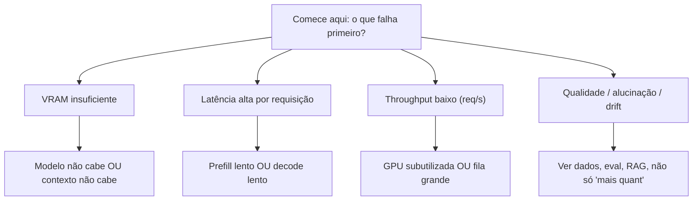
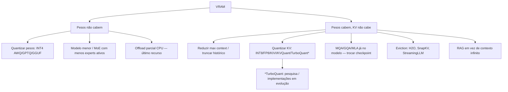
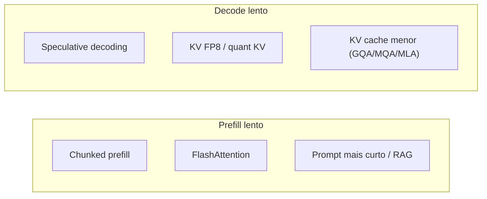
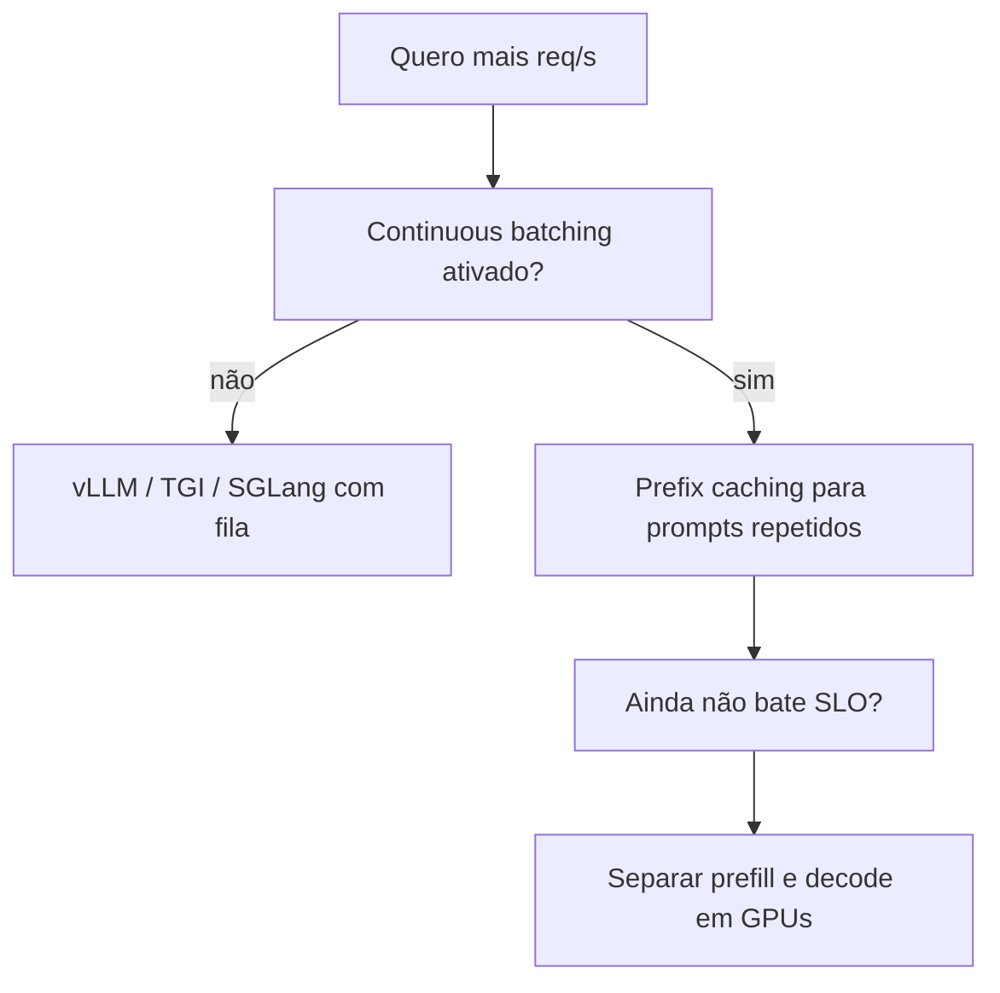
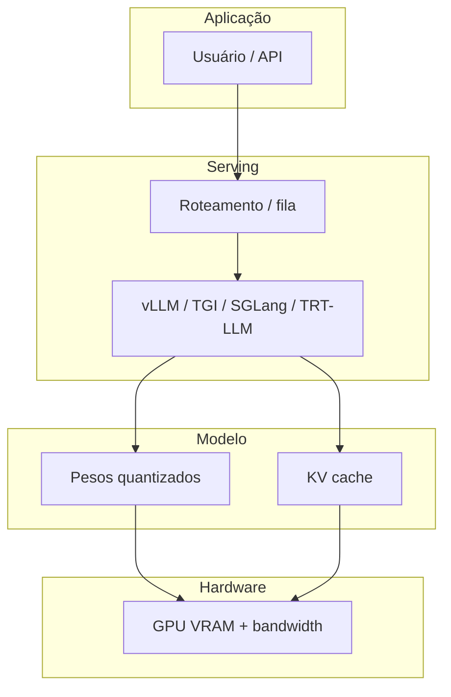

# Árvore de decisão — qual técnica usar?

Guia prático para **arquitetos** e **engenheiros de inferência**: começa pelo **sintoma** (o que dói) e chega a **famílias de solução**. Não substitui benchmark no **seu** hardware e modelo.

---

## 1. Qual é o gargalo principal?

### 1.1 VRAM insuficiente

**Analogia:** VRAM é o **apartamento**. Pesos são os **móveis fixos**; KV é a **estante que cresce com cada livro novo** (token). Primeiro decida se o problema é móvel ou estante.

---

## 2. Latência: prefill lento vs decode lento

| Sintoma | Hipótese comum | Primeiras alavancas |
|---------|----------------|---------------------|
| **Prefill** longo (prompt enorme) | Compute de atenção em $O(T^2)$ para a fase | FlashAttention; chunked prefill; menos tokens no prompt (sumarizar, RAG); modelo menor na etapa de ingestão |
| **Decode** lento (geração longa) | Memory-bound lendo KV; poucos tokens/s | KV mais compacto; batch menor; speculative decoding; FP8 KV; kernels otimizados (TensorRT-LLM, vLLM) |
| **Ambos** | GPU fraca para o modelo | Quantização agressiva, modelo menor, ou hardware maior |

---

## 3. Throughput: mais requisições por GPU

Ordem típica de impacto em **serving multiusuário**:

1. **Continuous batching** (vLLM, TGI, SGLang) — não deixar GPU ociosa entre requisições.
2. **PagedAttention** — reduzir fragmentação de KV.
3. **Prefix caching** — prompts idênticos compartilham KV.
4. **Disaggregated prefill/decode** — escalar cada fase separadamente (quando custo justificar).

---

## 4. Qualidade vs custo (trade-off explícito)

| Objetivo | Técnica típica | Custo |
|----------|----------------|--------|
| Máxima qualidade | FP16/BF16 pesos, KV alto, modelo grande | VRAM e $ |
| Produção equilibrada | INT4 pesos (AWQ/GPTQ), KV FP8 ou INT8 | Pequena queda de métricas |
| Edge / CPU | GGUF Q4_K_M, llama.cpp, contexto curto | Latência e qualidade variáveis |
| Fine-tuning barato | QLoRA NF4 + adapters | Tempo de treino, não só inferência |

**Regra:** nunca otimize **só** perplexidade em produção — use **tarefas reais** (RAG hit rate, JSON válido, etc.).

---

## 5. Quando NÃO quantizar mais

- Métricas de negócio caem mais que o ganho de VRAM.
- **Outliers** dominam (certas camadas/tensores) — tente **AWQ**, **SmoothQuant**, ou **rotations** (QuaRot/SpinQuant) antes de INT2 “na marra”.
- O problema é **dado** (prompt ruim, RAG errado) — técnica de compressão não corrige.

---

## 6. Mapa “técnica → post da série”

| Decisão | Onde aprofundar |
|---------|-----------------|
| Arquitetura, tokens, sampling | [01](./01-arquitetura-transformer-decoder-llm.md) |
| MHA/MQA/GQA/MLA, FlashAttention | [02](./02-attention-mha-mqa-gqa-mla-flashattention.md) |
| KV, vLLM, PagedAttention | [03](./03-kv-cache-anatomia-pagedattention-vllm.md) |
| Quant pesos | [04](./04-quantizacao-pesos-gptq-awq-gguf-bitsandbytes.md) |
| Quant KV | [05](./05-quantizacao-kv-cache-kivi-kvquant-cachegen.md) |
| TurboQuant | [06](./06-turboquant-deep-dive-polar-jl-lloydmax.md) |
| RoPE, YaRN, Ring, Mamba | [07](./07-contexto-longo-rope-yarn-ring-streaming.md) |
| Speculative, MoE, sparsity | [08](./08-alem-quantizacao-sparsity-speculative-moe-distillation.md) |

---

## 7. Diagrama único (visão de sistema)

---

*Onda 1 — revisar após novos posts (RAG dedicado, eval, agents) na Onda 3 planejada.*
