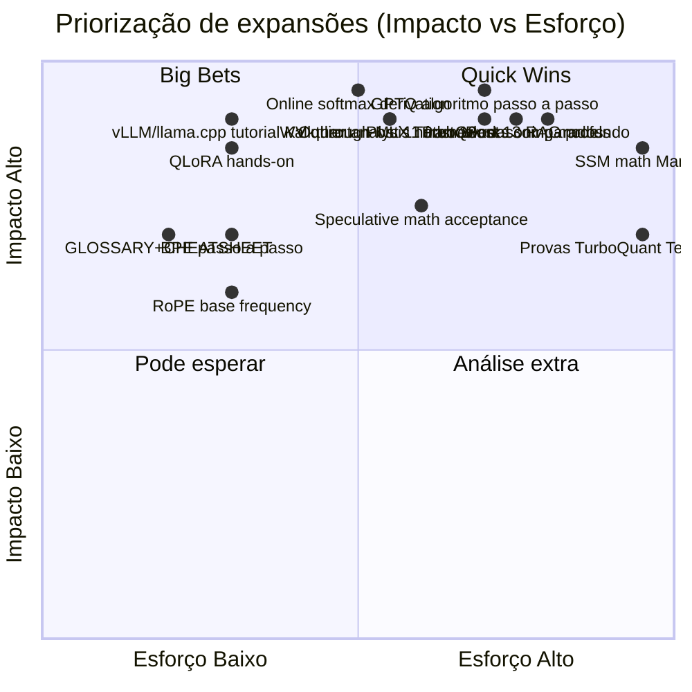

# Roadmap de Expansão — Série LLMs em Profundidade

Mapa estruturado de **possibilidades de expansão** da série atual (8 posts + INDEX). Organizado em 4 frentes:

1. **Expansão vertical** — aprofundar posts existentes.
2. **Expansão horizontal** — novos posts complementares.
3. **Expansão por formato** — labs práticos, FAQ, glossário, cheat-sheet.
4. **Expansão por audiência** — versões para perfis diferentes.

Cada item é classificado por **Impacto** (1-5) × **Esforço** (1-5) e tem **escopo proposto**.

---

## Estado atual da série

| # | Post | Linhas | Densidade | Cobertura atual |
|---|------|--------|-----------|-----------------|
| 01 | Arquitetura Transformer | 589 | Alta | Conceitual completa, faltam derivações |
| 02 | Atenção (MHA/MQA/GQA/MLA/FA) | 713 | Alta | Variantes ok, falta math derivations e código |
| 03 | KV cache + PagedAttention | 1.148 | Muito alta | Quase completo; faltam ops avançados |
| 04 | Quantização de pesos | 2.259 | Muito alta | Praticamente exaustivo |
| 05 | Quantização de KV | 692 | Alta | Conceitos ok, falta código e benchmarks |
| 06 | TurboQuant deep-dive | 781 | Alta | Falta walkthrough do código MLX e provas |
| 07 | Contexto longo | 912 | Alta | Falta math de SSMs e detalhes Ring |
| 08 | Além da quantização | 2.203 | Muito alta | Praticamente exaustivo |

**Total atual:** ~9.340 linhas / ~71k palavras.

---

## Frente 1 — Expansão vertical (aprofundar o que já existe)

### Post 01 — Arquitetura Transformer decoder-only

| Tópico para expandir | Por quê | Impacto | Esforço |
|----------------------|---------|---------|---------|
| **Walkthrough estilo Karpathy nanoGPT** com código Python ~200 linhas (forward pass de um decoder block) | Conecta teoria → código real | 5 | 3 |
| **BPE passo a passo** (algoritmo merge-based) com mini-corpus didático | Tokenização é caixa-preta para muita gente | 4 | 2 |
| **LayerNorm vs RMSNorm**: derivação matemática, justificativa empírica, impacto em treinamento | Fundamento sutil mas crítico | 3 | 2 |
| **Sampling avançado**: beam search, contrastive search, locally typical sampling, min-p, DRY | Atualiza para o estado da arte 2026 | 4 | 2 |
| **Visualização de embeddings** (UMAP/t-SNE, similaridades) | Torna abstrato concreto | 3 | 2 |
| **SwiGLU vs GELU vs ReLU** no FFN | Detalhe técnico relevante para Llama/Qwen | 2 | 1 |

### Post 02 — Atenção em profundidade

| Tópico para expandir | Por quê | Impacto | Esforço |
|----------------------|---------|---------|---------|
| **Online softmax derivation** passo a passo (núcleo do FlashAttention) | Maior insight matemático do post; falta hoje | 5 | 3 |
| **Pseudocódigo Triton** de FlashAttention forward + backward | Concreto demais para deixar de fora | 4 | 4 |
| **Backward pass da atenção**: por que é caro, recomputation | Treinamento, não só inferência | 3 | 3 |
| **Numerical stability**: por que `-inf` masking, por que dividir por √d_k | Pegadinha clássica em implementação | 3 | 2 |
| **Attention sinks** (StreamingLLM) revisitado com matriz de atenção real | Conecta com Post 07 | 3 | 2 |
| **Análise de TFLOPs/token**: aritmética de FLOPs por variante | Quantifica o que hoje é qualitativo | 4 | 2 |
| **MLA decomposição matricial** detalhada (W^DKV, W^UK, W^UV) | DeepSeek-V3 merece próprio sub-post | 4 | 3 |

### Post 03 — KV cache + PagedAttention

| Tópico para expandir | Por quê | Impacto | Esforço |
|----------------------|---------|---------|---------|
| **LMCache deep-dive** (offload KV CPU/SSD/NVMe) | Tendência forte 2025/2026 | 5 | 3 |
| **Speculative prefill** (chunked prefill + speculative em prefill) | Cutting-edge de serving | 4 | 3 |
| **Multi-tenant scheduling**: SLO-aware, fair-share, priority | Serving real exige isso | 4 | 3 |
| **Disaggregated serving** end-to-end com diagrama de produção | Splitwise/DistServe na prática | 4 | 3 |
| **CUDA graphs** para decode (overhead reduction) | Detalhe técnico de baixo nível | 3 | 3 |
| **Cálculo de KV para Llama 4 Scout/Maverick MoE** | Atualiza com modelos recentes | 3 | 1 |
| **NIXL (NVIDIA Inference Xfer Library)** para KV transfer | Novidade NVIDIA 2025 | 3 | 2 |

### Post 04 — Quantização de pesos

| Tópico para expandir | Por quê | Impacto | Esforço |
|----------------------|---------|---------|---------|
| **Hadamard rotations** (QuaRot/SpinQuant) — math + código mínimo | Hoje é mencionado, pouco explicado | 4 | 4 |
| **GPTQ algoritmo passo a passo** com matriz Hessiana inversa | Caixa-preta para 90% dos leitores | 5 | 4 |
| **QLoRA hands-on**: comando completo, hyperparams, troubleshooting | Demanda alta da comunidade | 5 | 2 |
| **MXFP4/NVFP4 spec** (block scaling, OCP Microscaling) | Hardware Blackwell em produção | 4 | 3 |
| **vLLM-W8A8 / FP8 KV+pesos combinado** em H100/H200 | Receita prática 2026 | 4 | 2 |
| **Hardware-specific kernels** (Marlin, Machete, GEMV INT4) | Por que INT4 ainda escala bem em GPU | 3 | 3 |

### Post 05 — Quantização de KV

| Tópico para expandir | Por quê | Impacto | Esforço |
|----------------------|---------|---------|---------|
| **Outlier analysis com dados reais** (notebook reproduzível em Llama-3-8B) | Mostra "por que K tem outliers" empiricamente | 5 | 3 |
| **KIVI math derivation** (per-channel sliding outlier window) | Hoje só conceitual | 4 | 3 |
| **Benchmarks reprodutíveis**: NIAH + LongBench em Q4/Q3/Q2 | Validação independente | 4 | 4 |
| **vLLM `kv-cache-dtype`** + llama.cpp `-ctk/-ctv` — tutorial passo a passo | Pratica direta | 5 | 2 |
| **LMCache + KV quant** como combo | Novidade 2025 | 4 | 3 |
| **Comparação quant KV em modelos MoE** (Mixtral, DeepSeek-V3) | KV é menor mas distribuição diferente | 3 | 3 |

### Post 06 — TurboQuant deep-dive

| Tópico para expandir | Por quê | Impacto | Esforço |
|----------------------|---------|---------|---------|
| **Provas dos Teoremas 1 e 2** com sketches matemáticos | Audiência acadêmica | 4 | 5 |
| **Walkthrough do código MLX** de Prince Kanuma (linha-a-linha) | Concreto e disponível | 5 | 3 |
| **QJL deep-dive próprio sub-post** | Background importante | 3 | 3 |
| **Comparação com PQ em vector DBs** (Milvus, FAISS, pgvector) | Conexão com retrieval | 4 | 3 |
| **Reprodução de benchmark do paper** (DBpedia retrieval) | Validação prática | 4 | 5 |
| **Análise da constante √(3π)/2 vs √3·π/2** | Errata didática (já notada na série acadêmica) | 2 | 1 |

### Post 07 — Contexto longo

| Tópico para expandir | Por quê | Impacto | Esforço |
|----------------------|---------|---------|---------|
| **YaRN math step-by-step** (NTK-by-parts, attention scaling) | Caixa-preta hoje | 5 | 4 |
| **SSM math** (Mamba state-space derivation, selective scan) | Mamba é tendência crescente | 5 | 5 |
| **Ring Attention CUDA/NCCL details** com diagrama de comunicação | Engenheiros gostarão | 4 | 4 |
| **Infini-attention deep-dive** (compressive memory matrix) | Novidade Google ainda mal documentada | 4 | 4 |
| **Context length benchmarks**: NIAH ablation por modelo (Llama 4 Scout 10M, Gemini 2 1M) | Atualização 2026 | 4 | 3 |
| **RoPE base frequency tuning** (theta=500k, 1M, 10M) | Detalhe ops | 3 | 2 |

### Post 08 — Além da quantização

| Tópico para expandir | Por quê | Impacto | Esforço |
|----------------------|---------|---------|---------|
| **Speculative math**: prova de equivalência distribucional + acceptance probability | Falta rigor matemático | 4 | 3 |
| **EAGLE-3 / EAGLE-2 deep dive** (auto-regressive draft heads) | SOTA atual | 4 | 3 |
| **MoE training challenges**: load balancing loss, expert collapse, router z-loss | Para quem treina | 4 | 3 |
| **2:4 sparsity hardware** (TensorCore Ampere/Hopper) com exemplo CUDA | Hardware concreto | 3 | 3 |
| **MoE multi-node**: expert parallelism, all-to-all NCCL | Cluster real | 4 | 4 |
| **Phi-4 / TinyLlama / Gemma 3 Nano** comparativos (distillation moderno) | Atualização | 3 | 2 |

---

## Frente 2 — Expansão horizontal (novos posts)

### A. Posts complementares na mesma série

| Novo post | Conteúdo | Posicionamento | Impacto | Esforço |
|-----------|----------|----------------|---------|---------|
| **09 — Treinamento de LLMs** | Pre-training, SFT, RLHF/DPO/GRPO, infraestrutura | Após 08 | 5 | 5 |
| **10 — Hardware para LLMs** | GPU (H100/H200/B100/B200), TPU v5/v6, MI300X, Apple Silicon, Groq/Cerebras/Tenstorrent | Pode entrar como 09 | 5 | 4 |
| **11 — Frameworks de inferência comparados** | vLLM v1, SGLang, TensorRT-LLM, TGI, llama.cpp, MLX, Ollama, LM Studio, KTransformers — benchmark real | Pratica direta | 5 | 4 |
| **12 — Embeddings e retrieval** | Sentence transformers, BGE, ColBERT, vector DBs (Milvus, Qdrant, pgvector, LanceDB), reranking | Útil para RAG | 4 | 4 |
| **13 — RAG em profundidade** | Chunking, retrieval híbrido (BM25+denso), graph RAG, agentic RAG, eval (Ragas) | Demanda enorme | 5 | 4 |
| **14 — Agentes e tool use** | ReAct, function calling, MCP (Model Context Protocol), agentic loops, multi-agent | Tendência 2026 | 5 | 4 |
| **15 — Avaliação de LLMs** | Benchmarks (MMLU, GPQA, HumanEval, AIME, ARC-AGI), eval custom, LLM-as-judge, contamination | Falta crítica | 4 | 3 |
| **16 — Segurança e alinhamento** | Jailbreaks, prompt injection, alignment (RLHF, Constitutional AI), red-teaming | Importante para produção | 4 | 3 |
| **17 — Multimodalidade** | VLM (LLaVA, Qwen2-VL, PaliGemma), audio (Whisper, Qwen2-Audio), video, omni models (GPT-4o, Gemini) | Tendência | 5 | 4 |
| **18 — Reasoning models** | Chain-of-thought, OpenAI o1/o3, DeepSeek-R1, QwQ, GRPO, RL-tuned, test-time compute | Hot topic | 5 | 4 |

### B. Sub-séries especializadas

| Sub-série | Posts propostos | Justificativa |
|-----------|-----------------|---------------|
| **"LLM Math" (3 posts)** | (1) Álgebra linear essencial; (2) Cálculo + autograd; (3) Probabilidade e information theory | Para leitores que querem rigor sem decorar |
| **"Hands-on Llama 3"** | (1) Setup vLLM produção; (2) Quantizar com AWQ; (3) Servir com prefix cache; (4) Distill para 3B | Práticos passo a passo |
| **"Inferência local"** | (1) llama.cpp profundo; (2) MLX para Mac Silicon; (3) Ollama + LM Studio; (4) Hardware budget builds | Audiência hobbyist |
| **"Otimização extrema"** | (1) GGUF quantização customizada; (2) imatrix calibration; (3) Speculative + quant + sparsity combo; (4) Profiling com Nsight | Engenheiros de inferência |

---

## Frente 3 — Expansão por formato

| Formato | Conteúdo | Quando criar |
|---------|----------|--------------|
| **GLOSSARY.md** | Termos da série (KV, prefill, GQA, NF4, sink token, expert, etc.) com definição curta + link para post | Já viável |
| **CHEATSHEET.md** | 1 página: comandos vLLM/llama.cpp/MLX, fórmula KV cache, decisão quant por hardware, formatos | Alta utilidade prática |
| **FAQ.md** | "Por que meu modelo aluciana?", "Quantos GB para Llama 3 70B Q4?", "GQA vs MQA na prática?", etc. | Acumular ao longo do tempo |
| **LAB-01.ipynb** ... | Notebooks Jupyter executáveis: implementar attention, quantizar com bitsandbytes, medir KV, etc. | Conecta teoria → prática |
| **DECISION-TREE.md** | Fluxograma "qual técnica usar para meu cenário?" (latency-bound vs throughput-bound vs memory-bound) | Útil para arquitetos |
| **TIMELINE.md** | Linha do tempo: Transformer 2017 → BERT → GPT-2/3 → LLaMA → … → 2026 | Contexto histórico |
| **BIBLIOGRAPHY.md** | Bibliografia anotada de TODOS os papers citados (com 1-2 frases por paper) | Reference único |
| **CASE-STUDY-X.md** | Estudos de caso reais: "Servir Llama 3 70B em 1×H100"; "Suportar 10k req/s com Mixtral"; "RAG sobre 10M docs" | Aplicação concreta |
| **VISUAL-COMPANION.md** | Mais Mermaid + ASCII art + tabelas só visuais (decoração para acompanhar leitura) | Bom para didática |
| **VIDEO-SCRIPTS/** | Roteiros para vídeo (5-15 min cada post) — cada post vira vídeo | Se houver canal |

---

## Frente 4 — Expansão por audiência

| Audiência | Adaptação | Formato |
|-----------|-----------|---------|
| **Iniciante absoluto** | Versão "para humanos" com mais analogias, menos math, glossário inline | `serie-iniciante/` espelhando 8 posts |
| **Acadêmico** | Versão com provas completas, papers comparados, notação rigorosa | Já existe parcial em `turboquant-docs/` — expandir para outros temas |
| **Engenheiro de ML/Inferência** | Foco em código, comandos, benchmarks reproduzíveis | Sub-série "Hands-on" + Labs |
| **Arquiteto de software** | Foco em decisões: quando escolher cada técnica, custo $, SLO, observabilidade | `DECISION-TREE.md` + `CASE-STUDIES/` |
| **PM / Decision-maker** | Versão executiva: 1 página por post, takeaways, custo-benefício | `EXECUTIVE-SUMMARY.md` |
| **Estudante de pós-graduação** | Lista de papers a ler, exercícios propostos, problemas em aberto | `RESEARCH-AGENDA.md` |

---

## Visualização: matriz Impacto × Esforço

---

## Plano sugerido (3 ondas)

### Onda 1 — Quick wins (1 sprint)
Total estimado: ~8-12h de geração paralela.

1. **GLOSSARY.md** (vocabulário consolidado)
2. **CHEATSHEET.md** (1 página de referência)
3. **DECISION-TREE.md** (qual técnica para qual problema)
4. **BIBLIOGRAPHY.md** (todos os papers anotados)
5. **FAQ.md** inicial (20 perguntas frequentes)
6. **TIMELINE.md** (Transformer 2017 → 2026)

### Onda 2 — Aprofundamentos verticais críticos (2 sprints)
Disparáveis em paralelo (1 subagente por aprofundamento):

1. Post 02 — **Online softmax + FlashAttention math + Triton pseudo**
2. Post 04 — **GPTQ passo a passo + QLoRA hands-on**
3. Post 05 — **Outlier notebook + tutorial vLLM/llama.cpp KV quant**
4. Post 06 — **Walkthrough código MLX TurboQuant**
5. Post 07 — **YaRN math + SSM math (Mamba)**
6. Post 08 — **Speculative math + EAGLE-3**

### Onda 3 — Novos posts horizontais (sob demanda)
Priorizar por demanda do leitor / objetivo:

- **09 — Treinamento (SFT/DPO/GRPO/RLHF)**
- **10 — Hardware (B200, MI300X, TPU, Apple, Groq)**
- **11 — Frameworks comparados (benchmark real)**
- **13 — RAG em profundidade**
- **18 — Reasoning models (o1/o3/R1/QwQ + RL test-time)**

### Onda 4 — Sub-séries especializadas (longo prazo)
- "Hands-on Llama 3"
- "Inferência local"
- "LLM Math (3 posts)"

---

## Métricas de cobertura atual vs ideal

| Eixo | Atual | Ideal | Gap |
|------|-------|-------|-----|
| **Cobertura conceitual** | 90% | 100% | Pequeno (multimodal, reasoning, agents) |
| **Cobertura matemática** | 60% | 90% | Médio (provas, derivações, math SSM/RoPE/softmax) |
| **Cobertura prática (código)** | 30% | 80% | Grande (notebooks, comandos, labs) |
| **Cobertura de hardware** | 40% | 85% | Médio (Blackwell, MI300X, TPU v6) |
| **Atualidade 2026** | 85% | 95% | Pequeno (Llama 4 / Gemini 2.5 / o3) |
| **Reprodutibilidade** | 20% | 70% | Grande (benchmarks reproduzíveis) |
| **Acessibilidade iniciantes** | 50% | 80% | Médio (versão "para humanos") |
| **Profundidade acadêmica** | 70% (em `turboquant-docs/`) | 90% | Médio (estender rigor para outros posts) |

---

## Recomendação final

**Próximo passo de maior ROI:** disparar **Onda 1 (Quick wins)** em paralelo (6 subagentes simultâneos, ~30 min total). Entrega 6 artefatos curtos mas de alto valor utilitário (glossário, cheatsheet, FAQ, timeline, decision tree, bibliography).

**Logo depois:** **Onda 2** com aprofundamentos verticais nos posts onde a densidade matemática/código está em débito (02, 04, 05, 06, 07).

**Médio prazo:** **Onda 3** — escolher 2-3 posts horizontais conforme objetivo (RAG e Reasoning são os de maior demanda atual).

---

*Documento de planejamento — não é conteúdo final para leitor da série, e sim mapa para decidir o próximo investimento de geração.*
