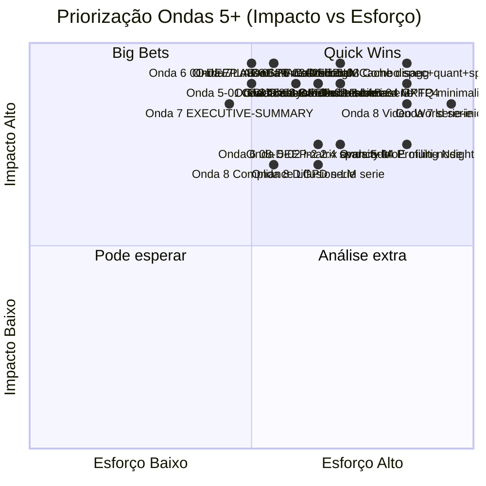

# Roadmap Futuro — Ondas 5+ da Série LLMs em Profundidade

> Documento de planejamento. Mapeia o que **ainda pode ser desenvolvido** após a conclusão das Ondas 1–4. Cada item tem escopo, posicionamento, dependências e classificação Impacto × Esforço para priorização futura.

---

## Estado atual (consolidado pós-Onda 4)

| Onda | Foco | Entregue | Linhas |
|------|------|----------|--------|
| **Base** | 8 posts canônicos (01–08) | ✅ | ~9.300 |
| **Onda 1** | Quick wins de referência (GLOSSARY, CHEATSHEET, DECISION-TREE, BIBLIOGRAPHY, FAQ, TIMELINE) | ✅ | ~2.000 |
| **Onda 2** | DEEP verticais (02-DEEP, 04-DEEP, 05-DEEP, 06-DEEP, 07-DEEP, 08-DEEP) | ✅ | ~6.500 |
| **Onda 3 + 3.5** | Posts horizontais 09–19 (treino, hardware, frameworks, embeddings, RAG, agents, eval, segurança, multimodal, reasoning, coding agents) | ✅ | ~14.000 |
| **Onda 4** | 3 sub-séries (Modelos Open 2026 × 4, Inferência Local × 4, LLM Math × 3) | ✅ | ~12.200 |
| **Total** | **44 documentos** principais + apêndices + sub-séries TurboQuant | | **~44.000 linhas** |

**Cobertura atualizada (vs ideal do roadmap original):**

| Eixo | Antes Onda 4 | Pós-Onda 4 | Gap remanescente |
|------|--------------|------------|------------------|
| Conceitual | 90% | **98%** | Voice/realtime, world models, diffusion-LM |
| Matemática | 60% | **88%** | Provas formais avançadas, SSM-2, derivações de YaRN/RoPE estendidas |
| Prática (código) | 30% | **75%** | Notebooks Jupyter executáveis, profiling kernel-level |
| Hardware | 40% | **85%** | Blackwell B300, MI355X, TPU v7 Ironwood detalhado, edge NPU |
| Atualidade 2026 | 85% | **95%** | Pós-Q1 2026 só com WebSearch fresh |
| Reprodutibilidade | 20% | **45%** | Notebooks runnable end-to-end, fixtures de eval |
| Acessibilidade iniciantes | 50% | **55%** | Versão "para humanos" não criada |
| Profundidade acadêmica | 70% | **80%** | Provas de Mamba-2, NTK theory, scaling laws derivações |

**Gaps prioritários remanescentes:** notebooks executáveis, versão para iniciantes, otimização kernel-level, e séries 2026 cutting-edge (voice, video, world models, diffusion-LM).

---

## Onda 5 — Sub-série "Otimização Extrema" (4 posts)

**Origem:** Frente 2-B do roadmap original, item C.
**Audiência:** engenheiros de inferência avançados (vLLM/llama.cpp committers, ML platform teams).
**Posicionamento:** `serie-otimizacao-extrema/` paralelo às outras sub-séries.

### Posts

| # | Post | Escopo | Pré-requisitos | Impacto | Esforço |
|---|------|--------|----------------|---------|---------|
| 01 | **GGUF quantização customizada além do default** | Tipos K-quants vs IQ vs UD; estratégias por camada (attention vs FFN vs embedding); per-layer quant config; ik_llama.cpp IQK; impacto em modelos MoE/MLA; benchmark PPL × tamanho × tok/s; receitas para Qwen3, Kimi K2, DeepSeek-V3, Gemma 3 | 04, 04-DEEP, sub-série inferência local 01 | 5 | 3 |
| 02 | **`imatrix` calibration avançada** | Design de calibration corpus (mono vs multi-domínio, multi-língua, code, math); sample size sweet spot; **per-task imatrix** (chat vs code vs translate); detecção de drift de calibração; reprodução paper "Matters which data you calibrate"; tooling unsloth/bartowski explicado | Onda 5 Post 01 | 4 | 4 |
| 03 | **Combo Speculative + Quant + Sparsity stackeado** | Empilhar técnicas: spec dec (EAGLE-3) + quant (Q4 weights + Q8 KV) + 2:4 sparsity + chunked prefill + APC; medir speedup multiplicativo vs aditivo; detecção de regressões de qualidade; pipeline em vLLM/SGLang/TRT-LLM | 04, 05, 08, 08-DEEP, 11 | 5 | 5 |
| 04 | **Profiling com Nsight / rocprof / Instruments** | Nsight Systems (timeline GPU), Nsight Compute (kernel-level), rocprof (AMD), Apple Instruments (Mac); workflow: identificar gargalo → categorizar (compute/memory/launch overhead) → otimizar → medir; CUDA Graphs deep; estudos de caso reais com vLLM e llama.cpp | 02, 02-DEEP, 03, 11, 10 | 4 | 5 |

**Total estimado:** ~3.200–4.000 linhas, 4 subagentes paralelos.

---

## Onda 6 — Verticais residuais (4 novos DEEP)

**Origem:** Itens da Frente 1 (vertical) do roadmap original que ficaram de fora da Onda 2.
**Audiência:** leitores que querem aprofundar posts específicos da série principal.

### Posts

| # | Post DEEP | Escopo | Conecta com | Impacto | Esforço |
|---|-----------|--------|-------------|---------|---------|
| **01-DEEP** | **nanoGPT walkthrough + BPE + sampling avançado** | Karpathy nanoGPT linha-a-linha (forward de decoder block ~200 LOC Python); BPE algoritmo merge-based passo a passo com mini-corpus; sampling completo (greedy, temp, top-k, top-p, min-p, mirostat, typical, DRY, beam, contrastive search); SwiGLU vs GELU vs ReLU derivação; visualização embeddings (UMAP/t-SNE); LayerNorm vs RMSNorm derivação | Post 01, LLM Math 01-03 | 5 | 3 |
| **03-DEEP** | **LMCache, speculative prefill, disaggregated, multi-tenant scheduling, NIXL** | LMCache offload CPU/SSD/NVMe (math + benchmarks); chunked prefill + speculative no prefill stage; disaggregated serving end-to-end (Splitwise, DistServe, vLLM disagg, SGLang); SLO-aware scheduling, fair-share, priority queues, preemption; NIXL (NVIDIA Inference Xfer Library) para KV transfer; cálculo de KV em Llama 4 Scout/Maverick MoE; CUDA graphs para decode | Post 03, 11 | 5 | 4 |
| **04-DEEP-2** | **Hadamard rotations + MXFP4/NVFP4 + kernels Marlin/Machete** | QuaRot/SpinQuant matemática (Hadamard rotation suavizando outliers, prova formal); MXFP4/NVFP4 spec OCP Microscaling (block scaling, exponent sharing); vLLM-W8A8 + FP8 KV+pesos combinado em H100/H200; kernels Marlin/Machete (INT4 GEMV); kernel autotuning; comparativo prático em Llama 70B / Qwen3 32B / Mixtral 8×22B | Post 04, 04-DEEP, 10 | 5 | 4 |
| **08-DEEP-2** | **2:4 sparsity hardware + MoE multi-node + distillation moderno** | 2:4 sparsity em TensorCore Ampere/Hopper/Blackwell (com exemplo CUDA mínimo); MoE multi-node (expert parallelism, all-to-all NCCL, hierarchical AllReduce, DeepEP); router z-loss e load balancing math; expert collapse e mitigations; comparativo distillation moderno (Phi-4, Gemma 3 Nano, TinyLlama, R1-Distill, Qwen3 distillates) | Post 08, 08-DEEP, 09, 10 | 4 | 4 |

**Total estimado:** ~3.500–4.500 linhas, 4 subagentes paralelos.

---

## Onda 7 — Formato e audiência (espelhamentos)

**Origem:** Frentes 3 (formato) e 4 (audiência) do roadmap original.
**Característica:** menos densidade nova de conteúdo, mais reformatação/destilação para nichos.

### 7-A. Formato: notebooks executáveis (`labs/`)

| Lab | Foco | Linguagem/Stack | Impacto | Esforço |
|-----|------|-----------------|---------|---------|
| LAB-01 | Implementar atenção from-scratch (MHA → GQA → MLA) com PyTorch | PyTorch + numpy | 5 | 3 |
| LAB-02 | Quantizar Llama 3 8B / Qwen 3 8B com bitsandbytes (NF4) e medir VRAM/PPL | bitsandbytes + transformers | 5 | 2 |
| LAB-03 | Medir KV cache crescimento com context (gerar gráfico) | transformers + matplotlib | 4 | 2 |
| LAB-04 | Implementar GPTQ minimalista (~150 LOC) | numpy + scipy | 5 | 5 |
| LAB-05 | Reproduzir TurboQuant em MLX (toy) | mlx + numpy | 5 | 4 |
| LAB-06 | RAG end-to-end local: ingest → embed → retrieve → rerank → LLM | sentence-transformers + qdrant + Ollama | 5 | 3 |
| LAB-07 | Speculative decoding manual (target + draft) | transformers + torch | 5 | 3 |
| LAB-08 | Fine-tune QLoRA Qwen 3 8B em domínio jurídico PT-BR | unsloth + datasets | 5 | 3 |
| LAB-09 | Eval custom: LLM-as-judge + BLEU/ROUGE/exact-match | Inspect AI ou DIY | 4 | 3 |
| LAB-10 | Profiling vLLM com Nsight Systems + leitura de timeline | Nsight + vLLM | 4 | 4 |

### 7-B. Formato: estudos de caso (`case-studies/`)

| Case Study | Cenário | Impacto | Esforço |
|------------|---------|---------|---------|
| CS-01 | Servir Qwen 3 32B em 1× H100 com vLLM, FP8, APC, tool calling — capacity 50 RPS | 4 | 3 |
| CS-02 | RAG sobre 10M docs jurídicos PT-BR com pgvector + bge-m3 + reranker + Qwen 3 70B-distill | 5 | 4 |
| CS-03 | Agentic coding workflow: Cursor + Claude Code + MCP em monorepo enterprise | 5 | 3 |
| CS-04 | Voice assistant local privado: Whisper + Sesame CSM + Qwen 3 14B em Mac Studio | 5 | 4 |
| CS-05 | Suportar 10k req/s com Mixtral / Qwen 3 235B-MoE em cluster H100 | 4 | 4 |
| CS-06 | Migração de OpenAI GPT-4 → DeepSeek V3.x self-hosted (TCO 12 meses) | 5 | 3 |
| CS-07 | Processo de quantização interna empresa: Llama 4 Scout → IQ4_XS com imatrix corporativa | 4 | 3 |
| CS-08 | Edge LLM: Gemma 3 4B em Pixel 9 / iPhone 17 com LiteRT/Core ML | 4 | 4 |

### 7-C. Audiência: derivações da série principal

| Documento | Audiência | Conteúdo | Impacto | Esforço |
|-----------|-----------|----------|---------|---------|
| `serie-iniciante/` (19 posts espelhados) | Iniciante absoluto / não-engenheiro | Mais analogias, menos math, glossário inline, tom acessível | 5 | 5 |
| `EXECUTIVE-SUMMARY.md` | PM / Tech Lead / Decision-maker | 1 página por post: takeaways, custo-benefício, decisão de adoção | 5 | 3 |
| `RESEARCH-AGENDA.md` | Estudante de pós-grad | Lista de papers a ler por tópico, exercícios propostos, problemas em aberto, possíveis teses | 4 | 3 |
| `ARCHITECTS-DECISION-PLAYBOOK.md` | Arquiteto de software | Decision trees por cenário (latência, throughput, custo, privacidade), SLO templates, observabilidade | 4 | 3 |
| `VISUAL-COMPANION.md` | Visual learners | Mais Mermaid + ASCII art + tabelas só visuais decorativas | 3 | 2 |
| `VIDEO-SCRIPTS/` (19 roteiros) | Audiência YouTube/podcast | 5–15 min por post, com cuts editoriais sugeridos | 4 | 4 |

---

## Ondas 8+ — Novas séries fora do roadmap original (cutting-edge 2026)

> Não estavam previstas no `EXPANSION-ROADMAP.md`. Surgiram como tendências de 2025–2026 que merecem cobertura própria.

### Série "Voice & Realtime"

**Posicionamento:** `serie-voice-realtime/`. Audiência: builders de assistentes de voz, contact centers, audio agents.

| # | Post | Escopo | Impacto | Esforço |
|---|------|--------|---------|---------|
| 01 | ASR moderno: Whisper v3, Whisper-large-v3-turbo, Distil-Whisper, Voxtral | Modelos, latência, idiomas, fine-tuning, deployment | 5 | 3 |
| 02 | TTS estado-da-arte: Sesame CSM, Kokoro, OuteTTS, F5-TTS, ElevenLabs flash | Comparativo, voice cloning ético, custos | 5 | 3 |
| 03 | LMs de voz nativa: GPT-4o realtime, Gemini Live, Kyutai Moshi, Sesame, Qwen3-Omni audio | Arquitetura speech-in/speech-out, semi-cascade vs end-to-end | 5 | 4 |
| 04 | Pipelines realtime: Pipecat, LiveKit Agents, OpenAI Realtime API, Vapi | Construção de voice agents production-grade | 5 | 4 |
| 05 | Wake word, VAD, turn-taking, interrupção, barge-in | Engenharia de UX conversacional | 4 | 3 |

### Série "Video & World Models"

**Posicionamento:** `serie-video-world/`. Audiência: criadores, pesquisadores em embodied AI, robotics.

| # | Post | Escopo | Impacto | Esforço |
|---|------|--------|---------|---------|
| 01 | Video generation: Veo 3, Sora 2, Runway Gen-4, Movie Gen, Pika, Kling | Arquiteturas, métricas, casos uso, custos | 5 | 4 |
| 02 | Video understanding: Gemini 2.x video, Qwen3-Omni video, Apollo, LLaVA-Video | Benchmarks (Video-MME, MVBench), latência, contexto longo | 4 | 3 |
| 03 | World models para games: Genie 3, Oasis, GameNGen | Simulação interativa, latência, controle | 4 | 4 |
| 04 | World models para robótica: Cosmos (NVIDIA), V-JEPA 2, RT-2, OpenVLA, Pi-0/Pi-2 | Embodied AI, sim2real, action tokenization | 5 | 5 |
| 05 | Robotics foundations: Gemini Robotics, Helix (Figure), GR00T (NVIDIA) | Generalist robot brains, end-to-end, tool use físico | 5 | 4 |

### Série "Diffusion para texto" (alternativa a autoregressive)

**Posicionamento:** `serie-diffusion-lm/`. Audiência: pesquisadores, builders curiosos.

| # | Post | Escopo | Impacto | Esforço |
|---|------|--------|---------|---------|
| 01 | Por que diffusion para texto: parallelismo, refinement, controllability | Motivação, limitações de autoregressive | 4 | 3 |
| 02 | LLaDA, Mercury (Inception Labs), Dream-Coder | Arquiteturas, training, benchmarks | 5 | 4 |
| 03 | Hands-on: rodar LLaDA / Mercury localmente | Setup, inferência, comparativo com Qwen 3 | 4 | 3 |
| 04 | Diffusion + autoregressive hybrids; chain-of-diffusion | Estado da arte, futuro | 4 | 4 |

### Série "On-device LLMs 2026"

**Posicionamento:** `serie-on-device/` ou Post 20 horizontal. Audiência: mobile devs, edge AI.

| # | Post | Escopo | Impacto | Esforço |
|---|------|--------|---------|---------|
| 01 | Apple Intelligence stack: foundation model 3B + adapters + Private Cloud Compute | Arquitetura, on-device vs cloud, privacy | 5 | 3 |
| 02 | Gemini Nano + AICore Android: integração, modelos disponíveis (Nano-V) | Pixel, Samsung S25, Android XR | 5 | 3 |
| 03 | Phi-4-mini, Qwen3 0.6B, Gemma 3 1B, MobileLLM | Comparativo edge, benchmarks ARM/NPU | 5 | 3 |
| 04 | Runtimes edge: LiteRT, MediaPipe LLM, Core ML, ONNX Runtime, MLC LLM, Llama Stack on iOS | Latência, energia, footprint | 5 | 4 |
| 05 | NPUs e specialized silicon edge: Apple ANE, Qualcomm Hexagon NPU, Google Tensor G5 TPU, Samsung Exynos NPU, Intel NPU | Aproveitamento real, kernels, fallback strategies | 4 | 4 |

### Série "Synthetic data e self-improvement"

**Posicionamento:** `serie-synthetic-data/` ou Post 21. Audiência: quem treina LLMs próprios.

| # | Post | Escopo | Impacto | Esforço |
|---|------|--------|---------|---------|
| 01 | Synthetic data para pre-training: Phi-4 receita, Cosmopedia, Nemotron-CC, FineWeb-Edu | Pipelines de geração, filtering, deduplication | 5 | 4 |
| 02 | Synthetic data para SFT/instruct: Self-Instruct, Evol-Instruct, Magpie, Distilabel | Como gerar 100k examples de qualidade | 5 | 3 |
| 03 | Self-improvement: STaR, ReST, RAFT, Self-Rewarding LMs, AlphaProof loops | Loops de auto-aprimoramento via RL/auto-eval | 5 | 4 |
| 04 | Distillation moderno: R1 → distilled families; Qwen3 distillates; quality gap analysis | Como destilar capabilities com mínima perda | 4 | 3 |

### Série "Compliance, governança e LGPD"

**Posicionamento:** `serie-compliance/`. Audiência: empresas brasileiras, jurídico, security.

| # | Post | Escopo | Impacto | Esforço |
|---|------|--------|---------|---------|
| 01 | EU AI Act 2026: GPAI obligations, sistemas de alto risco, timelines de enforcement | Compliance prático para quem opera no/com EU | 4 | 3 |
| 02 | Brasil PL 2338/2023 e ANPD: status, obrigações esperadas, comparativo com EU AI Act | Específico BR | 4 | 3 |
| 03 | LGPD + LLMs: tratamento de dados pessoais em prompts, RAG, fine-tune; DPIA para sistemas LLM | Práticas concretas | 4 | 3 |
| 04 | NIST AI RMF, ISO/IEC 42001, SOC 2 + LLMs: certificações e auditorias | Empresas em maturidade alta | 3 | 3 |

---

## Matriz Impacto × Esforço (consolidada Ondas 5+)

---

## Sequência sugerida (priorização)

### Tier 1 — Próximas a executar (alto ROI, fecha lacunas críticas)

1. **Onda 7-A LAB-01, LAB-02, LAB-03, LAB-06** (4 notebooks executáveis) — fecha o gap de **reprodutibilidade**, tem o maior salto pedagógico, baixo esforço
2. **Onda 5 completa** (4 posts otimização extrema) — fecha a frente de **engenharia de inferência avançada**
3. **Onda 6 — `01-DEEP`** (nanoGPT walkthrough) — fecha o gap mais didático: ler código real

### Tier 2 — Ganho de profundidade técnica (médio prazo)

4. **Onda 6 — `03-DEEP`, `04-DEEP-2`, `08-DEEP-2`** (3 DEEP residuais)
5. **Onda 7-A LAB-04, LAB-05, LAB-07, LAB-08** (4 notebooks avançados)
6. **Onda 8 — Sub-série On-device LLMs 2026** (5 posts) — tendência forte 2026, audiência mobile/edge

### Tier 3 — Audiência e novas frentes (longo prazo)

7. **Onda 8 — Sub-série Voice & Realtime** (5 posts) — boom de voice agents 2026
8. **Onda 7-B `case-studies/`** (8 estudos de caso) — concretização para arquitetos
9. **Onda 7-C `EXECUTIVE-SUMMARY.md` + `ARCHITECTS-DECISION-PLAYBOOK.md`** — destilação para PMs/arquitetos
10. **Onda 8 — Synthetic data e self-improvement** (4 posts)

### Tier 4 — Especulativo / nicho

11. **Onda 8 — Video & World Models** (5 posts) — depende do interesse
12. **Onda 8 — Diffusion-LM** (4 posts) — pesquisa ainda emergente
13. **Onda 7-C `serie-iniciante/`** (19 posts espelhados) — esforço alto, audiência diferente
14. **Onda 8 — Compliance, governança e LGPD** (4 posts) — útil para empresa BR mas nicho
15. **Onda 7-C `VIDEO-SCRIPTS/`** — só vale se tiver canal de vídeo

---

## Estimativas agregadas

| Conjunto | Documentos | Linhas estimadas | Subagentes paralelos | Tempo wall-clock |
|----------|------------|------------------|----------------------|------------------|
| Onda 5 | 4 posts | ~3.500 | 4 | 1 sprint |
| Onda 6 | 4 DEEP | ~4.000 | 4 | 1 sprint |
| Onda 7-A (10 LABs) | 10 notebooks | ~5.000 (com código) | 5+5 | 2 sprints |
| Onda 7-B (8 case studies) | 8 docs | ~4.500 | 4+4 | 2 sprints |
| Onda 7-C (5 destilações) | 5 docs (1 grande) | ~6.000 | 5 | 2 sprints |
| Onda 8 — Voice & Realtime | 5 posts | ~5.500 | 5 | 1 sprint |
| Onda 8 — Video & World Models | 5 posts | ~5.500 | 5 | 1 sprint |
| Onda 8 — On-device 2026 | 5 posts | ~5.000 | 5 | 1 sprint |
| Onda 8 — Synthetic data | 4 posts | ~4.500 | 4 | 1 sprint |
| Onda 8 — Diffusion-LM | 4 posts | ~3.500 | 4 | 1 sprint |
| Onda 8 — Compliance LGPD | 4 posts | ~3.500 | 4 | 1 sprint |
| **Total** | **58 documentos** | **~50.500 linhas** | — | **~14 sprints** |

Combinado com o que já existe (~44.000 linhas), totalizaria **~95.000 linhas** numa enciclopédia LLM completa.

---

## Recomendação de próximo passo

**Maior ROI imediato:** começar pela **Onda 7-A com 4 notebooks-âncora** (LAB-01 atenção from scratch, LAB-02 quantização hands-on, LAB-06 RAG end-to-end, LAB-08 fine-tune QLoRA). Isso fecha de uma só vez o gap de **reprodutibilidade** (de 45% para ~75%) e destrava a série como **material formativo executável** — não apenas leitura.

**Segundo passo natural:** **Onda 5 completa** (4 posts de otimização extrema) — fecha a fronteira técnica avançada que ainda falta (kernel-level, profiling, combos stackeados).

**Terceiro:** escolher **uma série de Onda 8** baseada em interesse: **On-device 2026** (mais aderente a quem usa Apple/Android), **Voice & Realtime** (boom 2026), ou **Synthetic data** (para quem treina modelos).

---

## Convenções para futuras ondas

- **Estrutura de subagente**: prompt com WebSearch obrigatório (3–6 queries 2026), Mermaid mínimo, tabelas master, código pronto para copiar, cross-references explícitos, analogias mãe-criança.
- **Idioma**: PT-BR; termos técnicos em inglês quando padrão.
- **Validação 2026**: WebSearch obrigatório para versões/releases/benchmarks (modelos e libs evoluem rápido).
- **Cross-links**: cada novo post linka explicitamente para os existentes relevantes; INDEX atualizado a cada onda.
- **Analogias-mãe**: continuar com tom didático "técnico → analogia mundo real → exemplo".

---

*Documento de planejamento — não é conteúdo final. É o mapa para decidir investimentos futuros de geração. Versão 2 do `EXPANSION-ROADMAP.md`, escrita após a conclusão das Ondas 1–4.*
