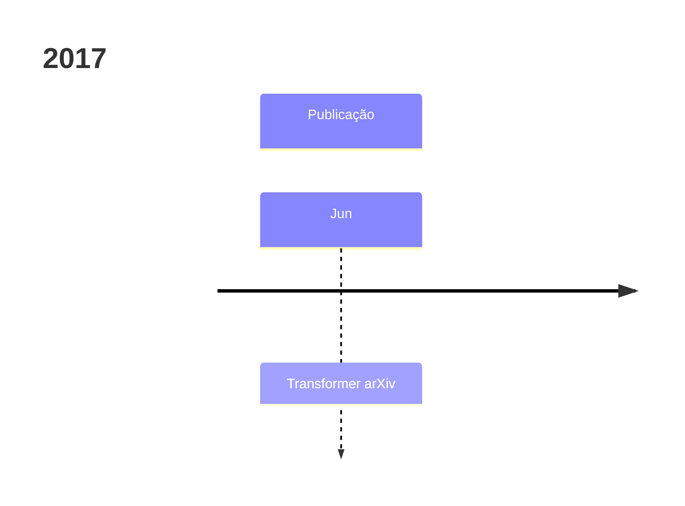
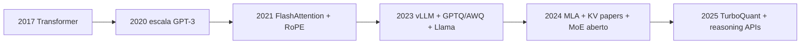

# Linha do tempo — LLMs e inferência eficiente (2017–2026)

Visão **condensada** para situar a série **01–08**: não é cronologia completa da IA, e sim **marcos** que explicam o estado atual de **Transformer + escala + eficiência**.

**Como ler:** cada bloco = onda tecnológica; setas indicam dependência conceitual.

---

## 2017 — Nasce o Transformer

| Ano | Marco | Por que importa |
|-----|--------|-----------------|
| **2017** | *Attention Is All You Need* (Transformer) | **MHA**, blocos empilháveis, treino paralelo de sequência com atenção. Base do Post [01](./01-arquitetura-transformer-decoder-llm.md) e [02](./02-attention-mha-mqa-gqa-mla-flashattention.md). |

---

## 2018–2020 — Pré-treino decoder-only e escalada

| Ano | Marco | Por que importa |
|-----|--------|-----------------|
| **2018** | GPT-1 | Pré-treino + fine-tune; valida decoder-only. |
| **2019** | GPT-2 | Zero-shot emerge; escala começa a “parecer mágica”. |
| **2019** | **MQA** (Shazeer) | Primeira pressão séria por **KV menor** (Post [02](./02-attention-mha-mqa-gqa-mla-flashattention.md)). |
| **2020** | GPT-3 | **In-context learning**; escala de parâmetros vira eixo de produto. |
| **2020** | **Longformer / BigBird** | Atenção esparsa para documentos longos (precursor do tópico “contexto longo”, Post [07](./07-contexto-longo-rope-yarn-ring-streaming.md)). |

---

## 2021–2022 — Posição, eficiência exata, e int8

| Ano | Marco | Por que importa |
|-----|--------|-----------------|
| **2021** | **RoPE** popularizado | Posição por rotação — padrão em LLMs atuais (Post [07](./07-contexto-longo-rope-yarn-ring-streaming.md)). |
| **2021** | **FlashAttention** | Mesma atenção, menos tráfego HBM — salto prático de velocidade (Post [02](./02-attention-mha-mqa-gqa-mla-flashattention.md)). |
| **2022** | **LLM.int8()** | INT8 com tratamento de *outliers* — início da era “roda grande no consumer” (Post [04](./04-quantizacao-pesos-gptq-awq-gguf-bitsandbytes.md)). |
| **2022** | **SmoothQuant** | Estrutura para INT8 considerando ativações difíceis. |
| **2022** | **Orca** (continuous batching) | Serving deixa de ser “batch estático” (Post [03](./03-kv-cache-anatomia-pagedattention-vllm.md)). |

---

## 2023 — Explosão open-source, GQA, GPTQ/AWQ, vLLM

| Ano | Marco | Por que importa |
|-----|--------|-----------------|
| **2023** | **LLaMA** (e depois Llama 2) | LLaMA forte **aberta** (pesquisa/indústria); explode **GGUF/llama.cpp**. |
| **2023** | **GQA** | Compromisso entre MHA e MQA; adotado em Llama 2/3, Mistral, Qwen (Post [02](./02-attention-mha-mqa-gqa-mla-flashattention.md)). |
| **2023** | **GPTQ** / **AWQ** | PTQ INT4 madura para produção (Post [04](./04-quantizacao-pesos-gptq-awq-gguf-bitsandbytes.md)). |
| **2023** | **QLoRA** (NF4) | Fine-tuning barato em GPU modesta. |
| **2023** | **vLLM** + **PagedAttention** | Serving com **KV fragmentado** de forma eficiente (Post [03](./03-kv-cache-anatomia-pagedattention-vllm.md)). |
| **2023** | **YaRN**, **StreamingLLM** | Extensão de contexto e janelas longas com KV limitado (Post [07](./07-contexto-longo-rope-yarn-ring-streaming.md)). |
| **2023** | **Mamba** | SSM seletivo — discurso “subquadrático” ganha corpo (Post [07](./07-contexto-longo-rope-yarn-ring-streaming.md)). |
| **2023** | **FlashAttention-2** | Melhor paralelismo de trabalho. |

---

## 2024 — MoE mainstream, KV em pauta, FlashAttention-3

| Ano | Marco | Por que importa |
|-----|--------|-----------------|
| **2024** | **Mixtral** (8×7B) | MoE “aberto” vira referência de custo/qualidade (Post [08](./08-alem-quantizacao-sparsity-speculative-moe-distillation.md)). |
| **2024** | **DeepSeek-V2** + **MLA** | KV latente — salto de memória por token (Posts [02](./02-attention-mha-mqa-gqa-mla-flashattention.md), [03](./03-kv-cache-anatomia-pagedattention-vllm.md)). |
| **2024** | **KIVI**, **KVQuant**, **CacheGen** | Quantização/compressão de **KV** vira subcampo (Post [05](./05-quantizacao-kv-cache-kivi-kvquant-cachegen.md)). |
| **2024** | **EAGLE** / speculative avançado | Segunda geração de *speculative decoding* (Post [08](./08-alem-quantizacao-sparsity-speculative-moe-distillation.md)). |
| **2024** | **FlashAttention-3** | FP8 + assíncrono em GPUs Hopper (Post [02](./02-attention-mha-mqa-gqa-mla-flashattention.md)). |
| **2024** | **QuaRot / SpinQuant** | Rotações para quantização 4-bit mais limpa (Post [04](./04-quantizacao-pesos-gptq-awq-gguf-bitsandbytes.md)). |
| **2024** | **Sarathi-Serve**, **DistServe** | Chunked prefill + desagregação prefill/decode (Post [03](./03-kv-cache-anatomia-pagedattention-vllm.md)). |

---

## 2025–2026 — Razoão, escala extrema, compressão de vetores

| Ano | Marco | Por que importa |
|-----|--------|-----------------|
| **2025** | **DeepSeek-R1** (razoão / RL) | *Test-time compute* e custo de treino entram no debate público (ligação com Post [08](./08-alem-quantizacao-sparsity-speculative-moe-distillation.md) — tendência, não detalhe da série). |
| **2025** | **TurboQuant** (arXiv:2504.19874) | Compressão de vetores tipo KV/embeddings com **quantização polar** e cotas formais (Post [06](./06-turboquant-deep-dive-polar-jl-lloydmax.md)). |
| **2025–26** | **Llama 4**, **Qwen3**, **Gemini 2.x**, **GPT-4.1/5** (famílias) | Multimodal + contexto longo + MoE viram “padrão de mercado”; **inferência** vira guerra de **KV + bandwidth + custo $**. |
| **2026** | **FP8/NVFP4/MXFP4** em hardware novo | Quantização e formato numérico acoplados ao **silício** (Blackwell, etc.) — Post [04](./04-quantizacao-pesos-gptq-awq-gguf-bitsandbytes.md). |

---

## Onde a série se encaixa

| Post | “Momento” histórico dominante |
|------|------------------------------|
| [01](./01-arquitetura-transformer-decoder-llm.md) | 2017–2020 fundamentos |
| [02](./02-attention-mha-mqa-gqa-mla-flashattention.md) | 2019–2024 atenção e kernels |
| [03](./03-kv-cache-anatomia-pagedattention-vllm.md) | 2022–2024 serving |
| [04](./04-quantizacao-pesos-gptq-awq-gguf-bitsandbytes.md) | 2022–2026 formatos |
| [05](./05-quantizacao-kv-cache-kivi-kvquant-cachegen.md) | 2024–2026 KV compression |
| [06](./06-turboquant-deep-dive-polar-jl-lloydmax.md) | 2025 pesquisa em vetores |
| [07](./07-contexto-longo-rope-yarn-ring-streaming.md) | 2021–2026 contexto + SSM |
| [08](./08-alem-quantizacao-sparsity-speculative-moe-distillation.md) | 2022–2026 throughput |

---

## Leituras de uma página (ordem sugerida)

1. Vaswani et al. 2017 (abstract + Fig. 1)  
2. Dao 2022–2024 (FlashAttention 1–3: intro)  
3. Kwon et al. 2023 (PagedAttention: §1–2)  
4. Frantar et al. 2023 (GPTQ: §1)  
5. Zandieh et al. 2025 (TurboQuant: abstract + §1)

Mais entradas: [BIBLIOGRAPHY.md](./BIBLIOGRAPHY.md).

---

*Onda 1 — ajustar datas exatas de conferências se citar em trabalho acadêmico; aqui é guia didático.*
