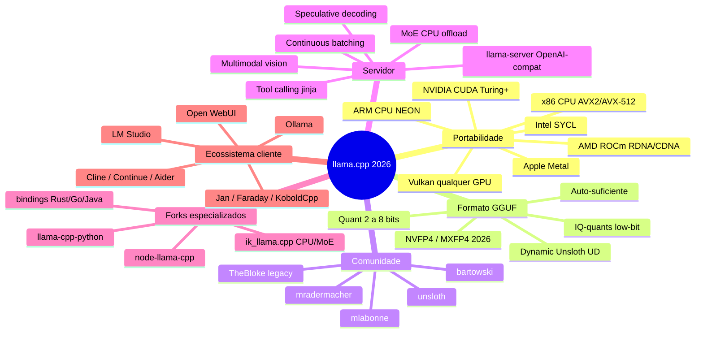
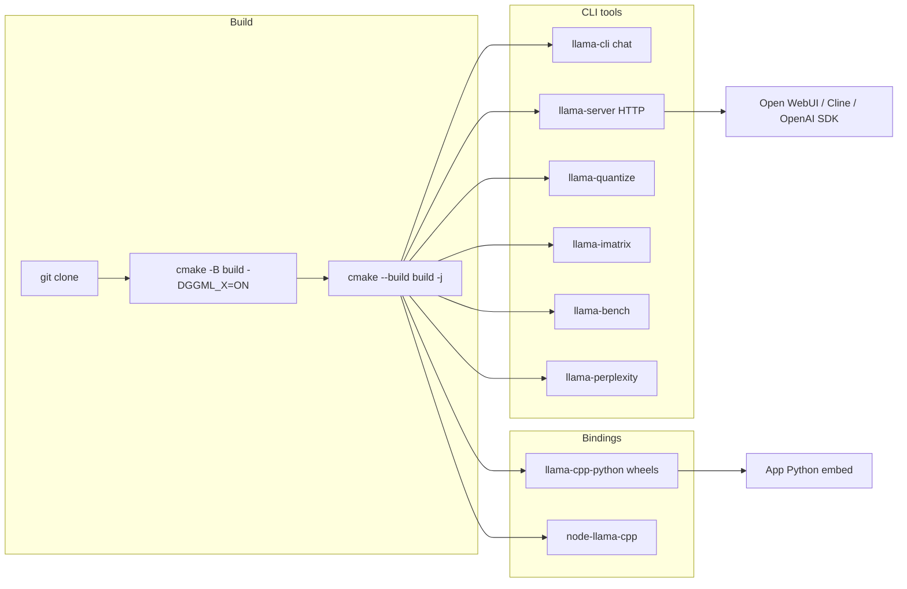
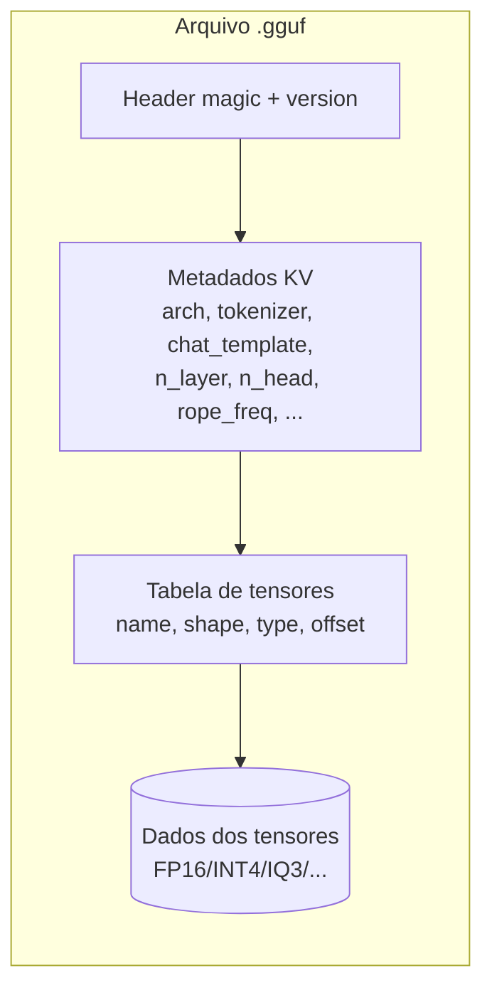
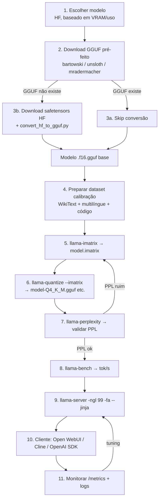
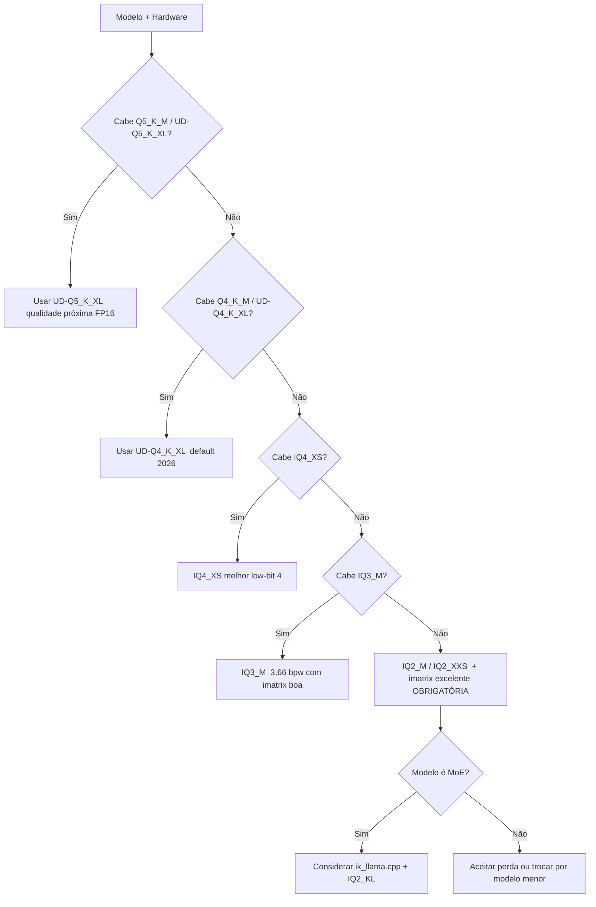
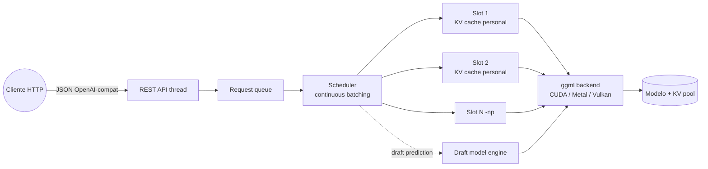
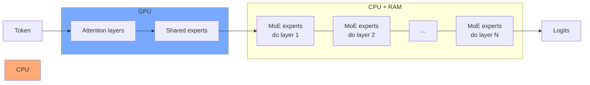
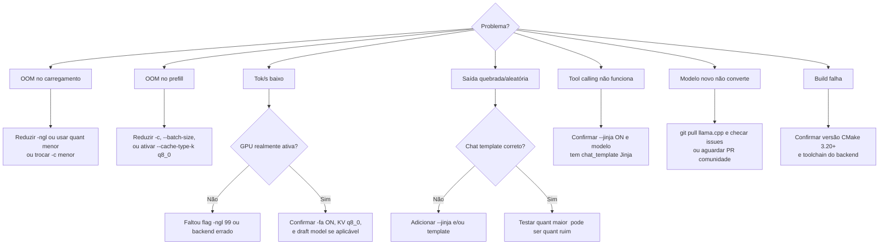

# Sub-série Inferência Local — Post 01 — `llama.cpp` deep dive: do `git clone` ao `llama-server` em produção, passando por imatrix, quantização customizada e clientes (Open WebUI, Cline, OpenAI SDK)

> **Sub-série:** Inferência Local (post **central** desta sub-série).
> **Pré-requisitos recomendados:** [Post 04 — Quantização de pesos (GPTQ/AWQ/GGUF)](../04-quantizacao-pesos-gptq-awq-gguf-bitsandbytes.md), [Post 05 — KV cache quant](../05-quantizacao-kv-cache-kivi-kvquant-cachegen.md), [Post 08 — Speculative/MoE/Sparsity](../08-alem-quantizacao-sparsity-speculative-moe-distillation.md), [Post 11 — Frameworks comparados](../11-frameworks-vllm-sglang-trtllm-tgi-llamacpp-mlx-ollama.md). Não é obrigatório lê‑los antes — este post se sustenta — mas eles dão a teoria das decisões que aqui ficam *hands-on*.
>
> **Objetivo:** te entregar um **pipeline ponta-a-ponta** com `llama.cpp` que você consegue copiar, colar e adaptar no mesmo dia: build → download HF → conversão GGUF → calibração `imatrix` → quantização customizada → benchmark → servir → integrar com clientes (Open WebUI, Cline/Continue/Aider, Python OpenAI SDK, LangChain) → monitorar.
>
> **Tom:** hands-on máximo, copiar-colar amigável. Quando precisar de fundamento, eu aponto para o post da série principal.
>
> **Analogia mestre:** `llama.cpp` é o **Toyota Hilux dos runtimes de LLM** — feio, sem firula, mas roda em qualquer terreno (CPU x86, ARM, Apple Metal, NVIDIA CUDA, AMD ROCm, Intel SYCL, Vulkan), aceita peças de feirão (qualquer GGUF da comunidade) e o mecânico do interior conserta com a ferramenta que tiver na mão. Quando o vLLM atola na lama do "datacenter only" e o MLX só anda no asfalto da Apple, o Hilux do `llama.cpp` cruza o pântano.

---

## TL;DR

- `llama.cpp` é o runtime mais **portátil** do ecossistema LLM em 2026: roda em **CPU (x86 BLAS/Accelerate, ARM NEON, AVX2/AVX-512), CUDA (Turing+), Metal (Apple), ROCm/HIP (AMD CDNA/RDNA), SYCL (Intel), Vulkan (qualquer GPU)**. Nenhum outro runtime cobre essa matriz.
- O **formato GGUF** se tornou o "PDF dos LLMs" — autossuficiente (pesos + tokenizer + arquitetura + chat template em um arquivo), portátil entre máquinas, lido por `llama.cpp`, Ollama, LM Studio, KoboldCpp, text-generation-webui, llama-cpp-python, node-llama-cpp e bindings Rust/Java/Go.
- O **fluxo canônico** é: `git clone` → `cmake -B build -DGGML_<BACKEND>=ON && cmake --build build -j` → baixar HF (`huggingface-cli download bartowski/...`) → (opcional) `convert_hf_to_gguf.py` se não houver GGUF pronto → `llama-imatrix` para gerar a matriz de importância (calibração) → `llama-quantize --imatrix ...` para o tipo escolhido (Q4_K_M, IQ4_XS, IQ3_M, IQ2_XXS) → `llama-perplexity` para validar qualidade → `llama-bench` para tok/s → `llama-server -ngl 99 -fa --jinja --cache-type-k q8_0 --port 8080` → conectar Open WebUI / Cline / OpenAI SDK.
- **`imatrix` é obrigatório para low-bit (≤4 bpw)** e altamente recomendado para Q4_K_M também. Sem ele, IQ2/IQ3 destoam como instrumento desafinado. Datasets canônicos: WikiText + multilíngue + código (incluir PT-BR se for usar em português).
- **Forks importantes:** **`ik_llama.cpp`** (kernels CPU SOTA, foco em MoE como Kimi K2 / DeepSeek V3, tipos IQK exclusivos) e **Unsloth Dynamic Quants UD-Q*_K_XL** (mistura adaptativa de bits por importância, padrão recomendado em 2026 para coding agents locais).
- **`llama-server`** é o coração da operação produtiva: API OpenAI-compatível em `/v1/chat/completions`, suporte a **tool calling** (`--jinja` + chat template), **continuous batching** (`-cb -np N`), **speculative decoding** (`--draft model.gguf --draft-max 8`), **KV cache quantization** (`--cache-type-k q8_0`), **MoE offload CPU↔GPU** (`--n-cpu-moe N`) e **Flash Attention** (`-fa`).
- A regra de ouro de **escolha de quant** em 2026: se cabe na VRAM, **UD-Q4_K_XL ou Q5_K_M**. Se aperta, **IQ4_XS**. Se aperta muito, **IQ3_M com imatrix de qualidade**. Abaixo de 3 bpw, só com imatrix muito bem calibrado, e idealmente usando `ik_llama.cpp` (IQK-quants).

---

## Sumário

1. [Por que `llama.cpp` é central em 2026](#1-por-que-llamacpp-é-central-em-2026)
2. [Anatomia do projeto: binários, backends, bindings](#2-anatomia-do-projeto-binários-backends-bindings)
3. [Build a partir do source — multiplataforma](#3-build-a-partir-do-source--multiplataforma)
4. [Formato GGUF — overview e tipos de quantização](#4-formato-gguf--overview-e-tipos-de-quantização)
5. [Workflow ponta-a-ponta — pipeline canônico](#5-workflow-ponta-a-ponta--pipeline-canônico)
6. [Etapas 1–2: Escolha do modelo e download HF](#6-etapas-12-escolha-do-modelo-e-download-hf)
7. [Etapa 3: Conversão HF safetensors → GGUF FP16](#7-etapa-3-conversão-hf-safetensors--gguf-fp16)
8. [Etapa 4: Dataset de calibração (CRÍTICO para low-bit)](#8-etapa-4-dataset-de-calibração-crítico-para-low-bit)
9. [Etapa 5: Calibração com `llama-imatrix`](#9-etapa-5-calibração-com-llama-imatrix)
10. [Etapa 6: Quantização com `llama-quantize`](#10-etapa-6-quantização-com-llama-quantize)
11. [Etapa 7: Validar qualidade — perplexity](#11-etapa-7-validar-qualidade--perplexity)
12. [Etapa 8: Benchmark — `llama-bench`](#12-etapa-8-benchmark--llama-bench)
13. [Etapa 9: Servir com `llama-server`](#13-etapa-9-servir-com-llama-server)
14. [KV cache quantization no `llama-server`](#14-kv-cache-quantization-no-llama-server)
15. [MoE offload (Kimi K2, DeepSeek V3)](#15-moe-offload-kimi-k2-deepseek-v3)
16. [Cliente 1 — `curl` direto](#16-cliente-1--curl-direto)
17. [Cliente 2 — OpenAI SDK Python](#17-cliente-2--openai-sdk-python)
18. [Cliente 3 — Open WebUI](#18-cliente-3--open-webui)
19. [Cliente 4 — Cline / Continue / Aider (coding agents locais)](#19-cliente-4--cline--continue--aider-coding-agents-locais)
20. [Cliente 5 — LangChain / LlamaIndex / Pydantic AI](#20-cliente-5--langchain--llamaindex--pydantic-ai)
21. [Etapa 11: Monitoramento e observabilidade](#21-etapa-11-monitoramento-e-observabilidade)
22. [Variantes / forks importantes](#22-variantes--forks-importantes)
23. [Cookbook — receitas-prontas](#23-cookbook--receitas-prontas)
24. [Troubleshooting](#24-troubleshooting)
25. [Comparativo curto com alternativas](#25-comparativo-curto-com-alternativas)
26. [Cross-references com a série](#26-cross-references-com-a-série)
27. [Referências](#27-referências)

---

## 1. Por que `llama.cpp` é central em 2026

Quando Georgi Gerganov publicou o primeiro commit em março de 2023 — um inferência LLaMA em C++ puro que rodava no MacBook M1 com 4 GB livres — ninguém imaginou que três anos depois esse projeto seria a **base de fato da inferência local**. Em abril de 2026, o estado é o seguinte:

- Mais de **80 mil estrelas** no GitHub (`ggml-org/llama.cpp`).
- O **formato GGUF** é o padrão *de facto* da comunidade. **Bartowski**, **Unsloth**, **mradermacher**, **mlabonne** publicam GGUFs no Hugging Face para basicamente todo modelo open-weights relevante em até 24h após o release.
- **Ollama**, **LM Studio**, **KoboldCpp**, **text-generation-webui**, **Faraday**, **Jan**, **GPT4All** são todos *wrappers* que rodam `llama.cpp` ou `llama-cpp-python` por baixo.
- **Hugging Face Inference Endpoints** suporta GGUF nativamente desde 2025.
- **NVFP4** (Blackwell) e **MXFP4** (gpt-oss da OpenAI) entraram como tipos de quantização suportados em 2026.
- **Multimodalidade** (imagem + texto) chegou ao `llama-server` para Gemma 3, Qwen 2.5/3-VL, LLaVA-Next.

### 1.1 Os 6 motivos pelos quais ele é "o Toyota Hilux"



### 1.2 Quando você **deve** escolher `llama.cpp`

- **Hardware misto / inusitado** (CPU forte, iGPU, AMD consumer, Intel Arc, Apple Silicon) — `llama.cpp` é o único runtime que cobre todos.
- **Inferência single-user a poucos-user** (chat pessoal, dev local, edge, on-prem pequena) — `llama-server` cobre 100%.
- **Modelos quantizados extremos** (≤4 bpw, MoE gigante como Kimi K2 / DeepSeek V3 com offload CPU).
- **Coding agent 100% offline** (Cline + `llama-server` + Qwen3-Coder-32B em UD-Q4_K_XL).
- **Ambientes ar-comprimido / ar-gap** (uma binário estaticamente compilado + um arquivo `.gguf` e você está servindo).

### 1.3 Quando você **NÃO** deve escolher `llama.cpp`

- **Throughput de datacenter** (centenas de RPS concorrentes, p99 < 100 ms): use **vLLM / SGLang / TRT-LLM** (Post 11). `llama.cpp` é otimizado para *latência por usuário*, não para *throughput agregado massivo*.
- **Apple Silicon onde MLX já tem build oficial do modelo** com swap quantization Lloyd–Max ou TurboQuant: use **MLX** (próximo post da sub-série). `llama.cpp` no Mac via Metal é ótimo, mas MLX explora a UMA com mais "carinho" para modelos suportados.
- **Você só quer "chat com botão"**: use **Ollama** ou **LM Studio**, que são abstrações sobre `llama.cpp` (próximo post da sub-série).

---

## 2. Anatomia do projeto: binários, backends, bindings

Ao buildar `llama.cpp`, você ganha cerca de **30 binários**. Os 7 que você usará 99% do tempo:

| Binário | Função | Quando usar |
|---|---|---|
| `llama-cli` | Chat single-shot ou interativo na linha de comando | Smoke test do modelo, prompts isolados, scripts batch simples |
| `llama-server` | Servidor HTTP com API OpenAI-compatível, multi-user, tool calling, multimodal | **Produção / dev contínuo** |
| `llama-quantize` | Quantizar GGUF FP16 → INT4/INT3/INT2 (todos os tipos) | Criar suas próprias quants (com ou sem imatrix) |
| `llama-imatrix` | Calcular matriz de importância (calibração) | Pré-requisito para low-bit (IQ2/IQ3) e recomendado para qualquer Q*_K |
| `llama-bench` | Benchmark de prefill (prompt) e decode (geração) tok/s | Validar que sua build / hardware está rendendo |
| `llama-perplexity` | Calcular perplexity em wikitext etc. | Validar que sua quantização não destruiu o modelo |
| `llama-gguf` / `gguf-py` | Inspecionar / editar metadados GGUF (chat template, etc.) | Trocar template, debugar tokenizer |

E os bindings que importam:

| Binding | Linguagem | Quando usar |
|---|---|---|
| `llama-cpp-python` (abetlen) | Python | Embutir LLM dentro de app Python sem subir HTTP server |
| `node-llama-cpp` (withcatai) | Node.js / TypeScript | Apps Electron, CLI Node, integração JS |
| `llama_cpp` (rustformers / mdrokz) | Rust | Embutido em CLI Rust, performance crítica |
| `llama.cpp.java` / `de.kherud:llama` | Java/Kotlin | Apps JVM / Spring |
| `LLamaSharp` | C#/.NET | Apps .NET / Unity |

### 2.1 Backends suportados

| Backend | Hardware-alvo | Flag CMake | Status 2026 |
|---|---|---|---|
| **CPU + BLAS / OpenBLAS / Accelerate** | Qualquer CPU x86/ARM | `-DGGML_BLAS=ON` (auto-detecta) | Sempre disponível |
| **Metal** | Apple Silicon (M1+) | `-DGGML_METAL=ON` (default no macOS) | SOTA para Mac |
| **CUDA** | NVIDIA Turing+ (RTX 20xx → Blackwell) | `-DGGML_CUDA=ON` | SOTA, NVFP4 em Blackwell |
| **ROCm / HIP** | AMD CDNA (MI250/300X) e RDNA3/4 (RX 7900/9070) | `-DGGML_HIPBLAS=ON -DAMDGPU_TARGETS=gfx1100` | Bom para prefill; menos otimizado que CUDA |
| **Vulkan** | **Qualquer GPU com driver Vulkan** (NVIDIA, AMD, Intel, mobile) | `-DGGML_VULKAN=ON` | Cresceu muito em 2025–2026; vence ROCm em decode em vários AMD RDNA |
| **SYCL** | Intel Arc, Intel Data Center GPU Max | `-DGGML_SYCL=ON` | Funcional, niche |
| **MUSA** | Moore Threads (China) | `-DGGML_MUSA=ON` | Niche / regional |

### 2.2 Hierarquia de comandos



---

## 3. Build a partir do source — multiplataforma

### 3.1 macOS (Apple Silicon, Metal — default)

```bash
xcode-select --install   # se ainda não tem
brew install cmake git

git clone https://github.com/ggml-org/llama.cpp
cd llama.cpp

cmake -B build -DGGML_METAL=ON -DLLAMA_CURL=ON
cmake --build build --config Release -j $(sysctl -n hw.ncpu)

./build/bin/llama-cli --version
```

Se quiser CPU também (caso queira fazer `llama-bench` comparando Metal × CPU AVX), basta omitir flags — Metal é default no macOS.

### 3.2 Linux NVIDIA CUDA

```bash
sudo apt-get install -y build-essential cmake git libcurl4-openssl-dev
nvidia-smi   # confirma driver

git clone https://github.com/ggml-org/llama.cpp
cd llama.cpp

cmake -B build \
  -DGGML_CUDA=ON \
  -DCMAKE_CUDA_ARCHITECTURES="86;89;90;120" \
  -DLLAMA_CURL=ON
cmake --build build --config Release -j $(nproc)
```

`CMAKE_CUDA_ARCHITECTURES` aceita: `75` (Turing), `80/86` (Ampere), `89` (Ada / RTX 40), `90` (Hopper), `100/120` (Blackwell B100/B200/RTX 50). Compile só os que você tem para acelerar a build.

### 3.3 Linux AMD ROCm

```bash
sudo apt-get install -y build-essential cmake git rocm-hip-libraries hipblas
rocminfo | grep gfx   # descubra a arch (ex.: gfx1100 = RX 7900 XTX, gfx1201 = RX 9070 XT)

cmake -B build \
  -DGGML_HIPBLAS=ON \
  -DAMDGPU_TARGETS="gfx1100;gfx1201" \
  -DCMAKE_C_COMPILER=hipcc \
  -DCMAKE_CXX_COMPILER=hipcc
cmake --build build --config Release -j $(nproc)
```

Se ROCm te desafiar, **caia para Vulkan** (próximo). Em 2026, em RDNA4 (RX 9070 XT) o Vulkan venceu o ROCm em ~13–15% de decode e ~2,5× em prefill — sem dor de cabeça com versões de drivers.

### 3.4 Vulkan (qualquer GPU — funciona até em iGPU)

```bash
sudo apt-get install -y libvulkan-dev glslc shaderc-tools

cmake -B build -DGGML_VULKAN=ON
cmake --build build --config Release -j $(nproc)
```

Funciona em NVIDIA, AMD, Intel Arc, Intel iGPU, Apple via MoltenVK e até Mali/Adreno em Android. É o **plano B universal**.

### 3.5 Windows (recomendado: Vulkan ou CUDA)

Use **CMake + Visual Studio Build Tools** (ou MSYS2/Clang). Para CUDA:

```powershell
git clone https://github.com/ggml-org/llama.cpp
cd llama.cpp
cmake -B build -DGGML_CUDA=ON -DCMAKE_CUDA_ARCHITECTURES="89;120"
cmake --build build --config Release -j
```

Ou baixe builds prontos do release: `https://github.com/ggml-org/llama.cpp/releases` — vêm zipados por backend e arquitetura.

### 3.6 Resumo: backend × comando × vantagem

| Backend | Comando-chave | Vantagem | Pegadinha |
|---|---|---|---|
| Metal (Mac) | `-DGGML_METAL=ON` | UMA aproveita 100% RAM como VRAM | Limitado a Apple Silicon |
| CUDA | `-DGGML_CUDA=ON` | SOTA absoluto, Flash Attention, NVFP4 | Driver pesado, vendor-lock |
| ROCm | `-DGGML_HIPBLAS=ON` | Open, AMD MI/RX | Setup penoso, Vulkan vence em RDNA |
| Vulkan | `-DGGML_VULKAN=ON` | **Universal** (NVIDIA/AMD/Intel/mobile) | Decode bom, prefill às vezes atrás de CUDA |
| SYCL | `-DGGML_SYCL=ON` | Intel Arc / GPU Max | Niche, suporte irregular |
| CPU + BLAS | (auto) | Roda **em tudo**, sem GPU | Decode lento em 70B+, ok em 7B–14B |

### 3.7 Atalho: `pip install llama-cpp-python` (binding Python com binários pré-compilados)

Para experimentação Python rápida, sem buildar o C++:

```bash
# CUDA 12.5 wheel oficial:
pip install llama-cpp-python --extra-index-url https://abetlen.github.io/llama-cpp-python/whl/cu125

# Metal wheel:
pip install llama-cpp-python --extra-index-url https://abetlen.github.io/llama-cpp-python/whl/metal

# ROCm wheel:
pip install llama-cpp-python --extra-index-url https://abetlen.github.io/llama-cpp-python/whl/rocm
```

Esse pacote embute `llama-server` próprio em `python -m llama_cpp.server`. Ótimo para protótipos, **mas para produção compile a versão upstream** (você ganha controle de flags, e novidades chegam semanas antes).

---

## 4. Formato GGUF — overview e tipos de quantização

GGUF (**G**eneric **GG**ML **U**niversal **F**ormat) substituiu o antigo GGML em 2023. É um arquivo binário **autossuficiente**:



A analogia: **GGUF é o PDF dos LLMs**. Igual a um PDF carrega texto + fontes + imagens + metadados num único arquivo que abre em qualquer leitor — GGUF carrega pesos + tokenizer + arquitetura + chat template num único arquivo que roda em qualquer `llama.cpp`.

### 4.1 Família de tipos de quantização (vanilla `llama.cpp`)

| Tipo | bpw aprox. | Categoria | Quando usar |
|---|---|---|---|
| `F32` | 32 | Float | Treino, debug |
| `F16` / `BF16` | 16 | Float | Baseline, conversão intermediária |
| `Q8_0` | 8.5 | Legacy uniform | Quase-FP16, muito conservador |
| `Q6_K` | 6.6 | K-quant | "Quase sem perda" para 70B+ |
| `Q5_K_M` | 5.7 | K-quant | **Sweet spot qualidade**; default safe |
| `Q5_K_S` | 5.5 | K-quant | Um pouco menor, ligeiramente pior |
| `Q4_K_M` | 4.85 | K-quant | **Default 2024**; bom para chat |
| `Q4_K_S` | 4.58 | K-quant | Quando aperta um pouco |
| `Q4_0` / `Q4_1` | 4.5 / 5.0 | Legacy | **Não use mais**; superado |
| `IQ4_NL` | 4.5 | I-quant | Legacy I-quant 4-bit |
| `IQ4_XS` | 4.25 | **I-quant moderno** | **Melhor que Q4_0/Q4_1**; cabe em mais VRAM |
| `Q3_K_L/M/S` | 3.9 / 3.7 / 3.5 | K-quant | Apertado; PPL sobe perceptivelmente |
| `IQ3_M` | 3.66 | I-quant | **3,5 bpw moderno**; ótima troca |
| `IQ3_S` | 3.44 | I-quant | 3,4 bpw com imatrix |
| `IQ3_XS` | 3.3 | I-quant | Limite inferior do tolerável |
| `IQ3_XXS` | 3.06 | I-quant | Só com imatrix muito boa |
| `IQ2_M` | 2.7 | I-quant | Modelos grandes (70B+) ainda razoáveis |
| `IQ2_XS` | 2.31 | I-quant | Extremo; só 70B+ aguenta |
| `IQ2_XXS` | 2.06 | I-quant | **Extremo**; requer imatrix high-quality |
| `IQ1_M` / `IQ1_S` | ~1.7 | I-quant | Experimental; útil só em MoE gigantes |
| `MXFP4` | 4.25 | NVIDIA | gpt-oss e similares (2026) |
| `NVFP4` | 4.7 | NVIDIA | Blackwell-native (2026) |

> **Nota:** "bpw" (bits per weight) é o tamanho médio incluindo metadados (scales, blocos). É o número que você usa para estimar tamanho final: `tamanho_GB ≈ N_params_bilhões × bpw / 8`.

### 4.2 Quantizações dinâmicas (Unsloth UD-Q*_K_XL)

A inovação de 2024–2025 que virou padrão em 2026: **a Unsloth misturou bits dentro do mesmo arquivo**, dando mais bits para tensores "sensíveis" (atenção, embedding) e menos para FFN intermediário, guiada por análise de importância (estilo imatrix global).

| Quant Unsloth | bpw efetivo | Equivalente vanilla | Vantagem |
|---|---|---|---|
| `UD-Q4_K_XL` | ~4.85 | Q4_K_M | Mesmo tamanho, **PPL menor** |
| `UD-Q5_K_XL` | ~5.85 | Q5_K_M | Idem, melhor que Q5_K_M |
| `UD-Q3_K_XL` | ~3.9 | IQ3_M | Bom em low-bit |
| `UD-Q2_K_XL` | ~2.95 | IQ2_M | Extremo, com qualidade preservada |

**Recomendação 2026 da própria Unsloth e adotada por `llama.cpp` (commits oficiais de jan/2026):** use **UD-Q4_K_XL** em vez de Q4_K_M sempre que disponível (GLM-4.7-Flash, Qwen3-Coder, gpt-oss-20b, DeepSeek-V3-Distill...). É *drop-in*, mesmo tamanho de arquivo, qualidade superior.

> **Pegadinha `ik_llama.cpp`:** UD-Q*_K_XL contendo **tensores f16 internos** podem **não funcionar** com `ik_llama.cpp`. Os XL "puros" (sem f16) funcionam. Sempre confira a issue/README do model-card antes.

### 4.3 Tipos exclusivos do `ik_llama.cpp` (IQK-quants)

`ikawrakow` (mantenedor original dos I-quants) saiu para o fork e desenvolveu lá tipos não disponíveis no upstream:

| Tipo IQK | bpw | Foco |
|---|---|---|
| `IQ2_KS` | 2.2 | MoE pequeno-médio |
| `IQ2_KL` | 2.7 | "L"arge — Kimi K2, DeepSeek V3 |
| `IQ3_KL` | 3.8 | MoE de ponta |
| `IQ4_KSS` | 4.0 | K**SS** = otimização SOTA CPU |
| `IQ5_KS` | 5.4 | Sweet spot CPU em servers Threadripper |

Esses tipos rodam **principalmente em CPU otimizada (AVX2+ e ARM_NEON)** e em **CUDA Turing+**. Não rodam em Vulkan/Metal/ROCm no fork.

### 4.4 Naming convention

Convenção `<Modelo>-<Tamanho>-<Quant>.gguf`:

```
Qwen3-32B-Q4_K_M.gguf
Qwen3-32B-UD-Q4_K_XL.gguf            (Unsloth dynamic)
Qwen3-32B-IQ4_XS.gguf
DeepSeek-R1-Distill-Qwen-32B-Q5_K_M.gguf
Kimi-K2-Instruct-IQ2_KL-00001-of-00009.gguf   (multi-shard)
```

Modelos > 50 GB são divididos em **shards** (`-00001-of-000NN`). `llama.cpp` reagrupa automaticamente se você apontar para o primeiro shard.

---

## 5. Workflow ponta-a-ponta — pipeline canônico

O fluxo que você fará uma vez, e depois automatizará em script:



Você pode pular as etapas 3–6 se houver um GGUF pronto bom o suficiente (na maioria dos casos há). A etapa 5–6 é **obrigatória** quando você quer:

- **Quant exótica não disponível na comunidade** (ex.: IQ4_XS de um modelo recém-lançado);
- **Calibração específica do seu domínio** (PT-BR jurídico, código TypeScript, médico);
- **Modelo finetunado seu próprio**.

---

## 6. Etapas 1–2: Escolha do modelo e download HF

### 6.1 Critérios de escolha (regra-de-bolso 2026)

| Hardware | VRAM/RAM disponível | Modelo recomendado | Quant |
|---|---|---|---|
| MacBook M2 16 GB | 12 GB usáveis | Qwen3-7B-Instruct | UD-Q4_K_XL |
| MacBook M3 Pro 36 GB | 28 GB usáveis | Qwen3-Coder-14B | UD-Q5_K_XL |
| MacBook M3 Max 64–128 GB | 100 GB usáveis | Qwen3-Coder-32B / Gemma 3 27B / DS-R1-Distill-Qwen-32B | UD-Q5_K_XL |
| Mac Studio M3 Ultra 256 GB | 230 GB | Qwen3-72B / DS-V3-Distill-Llama-70B | Q4_K_M / Q5_K_M |
| RTX 3060 12 GB | 11 GB | Qwen3-7B / Gemma 3 9B | Q4_K_M |
| RTX 4090 24 GB | 22 GB | Qwen3-Coder-32B | IQ4_XS / Q4_K_S |
| RTX 4090 + 64 GB DDR5 | 24+ offload | DS-R1-Distill-Llama-70B | IQ3_M (offload CPU) |
| 2× RTX 3090 (NVLink) | 48 GB | Qwen3-72B | Q4_K_M |
| RTX 5090 32 GB | 30 GB | Qwen3-72B | IQ3_M |
| AMD AI395 Strix Halo 128 GB | 98 GB UMA | Qwen3-72B / Kimi K2 distill | Q4_K_M |
| Threadripper 64-core + 256 GB DDR5 | só CPU | Kimi K2 1T (MoE) | IQ2_KL (`ik_llama.cpp`) |

### 6.2 Fontes preferidas no Hugging Face

| Publisher | Foco | Qualidade | Link |
|---|---|---|---|
| **bartowski** | Compatibilidade total + I-quants modernos | Excelente, tipos completos | `huggingface.co/bartowski` |
| **unsloth** | **Dynamic quants UD** (recomendado 2026) | SOTA em coding agent | `huggingface.co/unsloth` |
| **mradermacher** | Cobertura extrema (modelos obscuros) | Boa, todos os tipos | `huggingface.co/mradermacher` |
| **mlabonne** | Experimentação, abliterated, frankenmoe | Variável | `huggingface.co/mlabonne` |
| **lmstudio-community** | Curadoria LM Studio, ímãn UD-XL | Boa | `huggingface.co/lmstudio-community` |
| **ggml-org** | Oficial Gerganov, modelos referência | Referência | `huggingface.co/ggml-org` |

> TheBloke (lendário em 2023) **não publica mais ativamente**. Use bartowski como herdeiro espiritual.

### 6.3 Download com `huggingface-cli`

```bash
pip install -U huggingface_hub
huggingface-cli login   # (opcional, se quiser usar HF token para rate limit maior)

mkdir -p ~/models/qwen3-coder-32b

huggingface-cli download \
  unsloth/Qwen3-Coder-32B-Instruct-GGUF \
  --include "*UD-Q4_K_XL*" \
  --local-dir ~/models/qwen3-coder-32b \
  --local-dir-use-symlinks False
```

**Verifique integridade**:

```bash
cd ~/models/qwen3-coder-32b
sha256sum *.gguf > checksums.txt
# compare com a model card no HF
```

### 6.4 Download direto via `llama-cli` / `llama-server` (HF cache integrado)

Desde 2025, `llama.cpp` aceita `-hf <repo>:<quant>` que baixa direto e reusa o HF cache:

```bash
./build/bin/llama-server -hf unsloth/Qwen3-Coder-32B-Instruct-GGUF:UD-Q4_K_XL -ngl 99 -fa --jinja --port 8080
```

Ele resolve a quant pelo padrão de nome do arquivo e cacheia em `~/.cache/huggingface/hub/`.

---

## 7. Etapa 3: Conversão HF safetensors → GGUF FP16

Você só precisa disso se **não há GGUF pronto** (modelo recém-lançado, finetune privado seu, ou modelo obscuro).

### 7.1 Comando canônico

```bash
cd llama.cpp
python -m pip install -r requirements.txt   # transformers, sentencepiece, gguf, etc.

# Baixar o modelo HF safetensors:
huggingface-cli download my-org/MyModel-7B --local-dir ~/models/MyModel-7B-hf

# Converter para GGUF FP16:
python convert_hf_to_gguf.py \
  ~/models/MyModel-7B-hf \
  --outfile ~/models/MyModel-7B.f16.gguf \
  --outtype f16
```

Outras opções de `--outtype`: `q8_0`, `bf16`, `auto` (escolhe BF16 se a arch suportar). Sempre prefira **FP16 ou BF16** como base — e **deixe a quantização para a etapa 6**, onde você usa imatrix.

### 7.2 Quando o convert script falha

Modelos com arquiteturas novas (MLA do DeepSeek, Mamba, MoE custom) podem precisar PR no `llama.cpp` antes de converter. **Antes de quebrar a cabeça**:

1. Atualize `llama.cpp` para o `master` mais recente (`git pull`).
2. Procure issues abertas no repo com o nome da arch.
3. Se houver PR aberto, teste o branch dele.
4. Se nada existe, **espere a comunidade** (bartowski/unsloth costumam publicar em horas após PR merged).

### 7.3 Inspecionar o GGUF resultante

```bash
./build/bin/llama-gguf ~/models/MyModel-7B.f16.gguf --print-meta
```

Deve listar `general.architecture`, `tokenizer.ggml.tokens`, `tokenizer.chat_template`, `*.attention.head_count`, etc. Se faltar `chat_template`, você terá que injetá-lo (ver §13.5).

---

## 8. Etapa 4: Dataset de calibração (CRÍTICO para low-bit)

A analogia: **imatrix é afinar o instrumento antes do show.** Se você toca em FP16, qualquer afinação serve. Mas se você vai tocar em IQ3, um único bemol mal calibrado destoa a banda inteira.

### 8.1 O que faz um bom dataset de calibração

- **Variado**: prosa, código, diálogo, listas, JSON.
- **Multilíngue se você usa multilíngue**: incluir PT-BR / EN / código.
- **Tokenizado bem** pelo modelo (sem sequências de tokens raros que poluem estatística).
- **Tamanho**: 100k–500k tokens é suficiente. Mais que isso traz pouco retorno; menos que 50k é arriscado.
- **Reprodutibilidade**: salve o `.txt` exato + `--seed` constante.

### 8.2 Datasets canônicos da comunidade

| Dataset | Origem | Quando usar |
|---|---|---|
| `wiki.train.raw` | WikiText-103 (Salesforce/Stephen Merity) | **Default histórico**; bom EN |
| `c4-train.00000-of-01024.json.gz` | C4 (Allen AI) | EN amplo, web |
| `OSCAR-2301` (ptBR subset) | OSCAR | **PT-BR** |
| `calibration_data_v5_rc.txt` (tristandruyen) | Mix EN+código | **Mais usado em 2025** |
| `standard_cal_data` (turboderp / ExllamaV3) | Mix sem wiki | Bom para coding |
| `ubergarm/imatrix-corpus` | Combinado v5 + ExllamaV3 + diálogos | **SOTA 2026** |

### 8.3 Receita: corpus PT-BR + EN + código (recomendado para uso geral no Brasil)

```bash
mkdir -p ~/calibration && cd ~/calibration

# WikiText-103 EN (clássico)
wget https://huggingface.co/datasets/Salesforce/wikitext/resolve/main/wikitext-103-raw-v1/wiki.train.raw

# Mix v5 (tristandruyen)
wget https://gist.githubusercontent.com/tristandruyen/.../calibration_data_v5_rc.txt

# OSCAR PT-BR slice (~100MB)
huggingface-cli download oscar-corpus/OSCAR-2301 \
  pt_meta/pt_meta_part_1.jsonl.gz --repo-type dataset \
  --local-dir oscar-pt --local-dir-use-symlinks False
zcat oscar-pt/pt_meta/pt_meta_part_1.jsonl.gz \
  | jq -r '.content' | head -c 50000000 > oscar-pt-50mb.txt

# Código (StarCoderData TS subset, 30MB)
huggingface-cli download bigcode/the-stack-smol \
  --repo-type dataset --local-dir stack-smol \
  --include "*typescript*"

# Junta tudo:
cat wiki.train.raw calibration_data_v5_rc.txt oscar-pt-50mb.txt \
    stack-smol/data/typescript/*.txt \
    > calibration_ptbr_en_code.txt

wc -w calibration_ptbr_en_code.txt
# Esperado: ~5–10M palavras (≈ 7–15M tokens — folga grande)
```

### 8.4 Erros comuns no dataset

| Erro | Sintoma | Correção |
|---|---|---|
| Dataset só EN, modelo PT-BR | PPL alta em PT-BR após quant | Incluir PT-BR no corpus |
| Dataset só prosa, modelo coding | Geração de código piora | Incluir código real (não só comentários) |
| Dataset com muito XML/HTML poluído | Tokens raros dominam imatrix | Limpar tags |
| Dataset < 30k tokens | Imatrix instável | Use ≥ 100k tokens |
| Encoding errado (latin-1) | Tokens \xc3\xa7 explodem PPL | Force UTF-8 (`iconv -t utf-8`) |

---

## 9. Etapa 5: Calibração com `llama-imatrix`

### 9.1 Comando canônico

```bash
./build/bin/llama-imatrix \
  -m ~/models/Qwen3-Coder-32B/Qwen3-Coder-32B.f16.gguf \
  -f ~/calibration/calibration_ptbr_en_code.txt \
  -o ~/models/Qwen3-Coder-32B/Qwen3-Coder-32B.imatrix \
  --chunks 100 \
  --chunk-size 512 \
  -ngl 99 \
  --seed 42
```

### 9.2 Parâmetros (tabela de referência)

| Flag | Função | Default | Recomendado |
|---|---|---|---|
| `-m` | Modelo GGUF (ideal: FP16) | obrigatório | FP16 base |
| `-f` | Arquivo de calibração (.txt) | obrigatório | seu corpus |
| `-o` | Output `.imatrix` (ou `.gguf` se v2026+) | `imatrix.gguf` | nome explícito |
| `--output-format` | `dat` (legacy) ou `gguf` (novo) | `gguf` | mantenha `gguf` |
| `--chunks N` | Quantos chunks processar | 0 (todo arquivo) | 100–500 |
| `--chunk-size T` | Tokens por chunk | 512 | 512 |
| `-ngl N` | Layers em GPU | 0 | **99 (tudo)** |
| `--in-file F.imatrix` | Mergear com imatrix prévio | — | útil para multilíngue agregado |
| `--process-output` | Inclui `output.weight` (lm_head) | off | **on** se for low-bit (≤3 bpw) |
| `--parse-special` | Parseia tokens especiais | off | on para tokenizers Qwen3/Llama 3.x |
| `--seed` | Seed RNG | random | 42 (reprodutibilidade) |

### 9.3 Tempo esperado (em RTX 4090, FP16, 100 chunks × 512 tokens)

| Modelo | Tempo aprox. |
|---|---|
| 7B | ~1 min |
| 14B | ~2–3 min |
| 32B | ~5–7 min |
| 70B | ~12–15 min (cabe FP16 com layer offload parcial) |
| MoE 100B+ | usar CPU + offload, 30–60 min |

### 9.4 Verificar a imatrix gerada

```bash
./build/bin/llama-imatrix \
  --in-file ~/models/Qwen3-Coder-32B/Qwen3-Coder-32B.imatrix \
  --show-statistics
```

Deve listar contagem por tensor. Se vir `count=0` em vários tensores, sua calibração não cobriu a fundo — **aumente `--chunks`** ou **diversifique o corpus**.

### 9.5 Mergear imatrices de domínios diferentes

Quer combinar PT-BR + EN + código em pesos balanceados?

```bash
./build/bin/llama-imatrix \
  -m model.f16.gguf \
  --in-file imatrix-en.imatrix \
  --in-file imatrix-ptbr.imatrix \
  --in-file imatrix-code.imatrix \
  -o imatrix-merged.imatrix
```

---

## 10. Etapa 6: Quantização com `llama-quantize`

### 10.1 Comando canônico

```bash
./build/bin/llama-quantize \
  --imatrix ~/models/Qwen3-Coder-32B/Qwen3-Coder-32B.imatrix \
  ~/models/Qwen3-Coder-32B/Qwen3-Coder-32B.f16.gguf \
  ~/models/Qwen3-Coder-32B/Qwen3-Coder-32B-IQ4_XS.gguf \
  IQ4_XS \
  $(nproc)
```

Argumentos posicionais: `<input.gguf> <output.gguf> <TYPE> [n_threads]`.

### 10.2 Quais tipos tentar (estratégia)



### 10.3 Tabela: tipo × tamanho × PPL esperada (Qwen3-32B baseline FP16)

| Tipo | Tamanho final | PPL (wikitext-2) | Δ PPL vs FP16 | Veredito |
|---|---|---|---|---|
| F16 | 60.5 GB | 5.42 | — | baseline |
| Q8_0 | 32.0 GB | 5.43 | +0.18% | quase idêntico |
| Q6_K | 24.8 GB | 5.45 | +0.55% | excelente |
| Q5_K_M | 21.5 GB | 5.49 | +1.29% | sweet spot |
| **UD-Q5_K_XL** | 21.6 GB | **5.46** | **+0.74%** | **melhor que Q5_K_M** |
| Q4_K_M | 18.3 GB | 5.62 | +3.69% | bom default |
| **UD-Q4_K_XL** | 18.4 GB | **5.55** | **+2.40%** | **default 2026** |
| IQ4_XS | 16.0 GB | 5.71 | +5.35% | low-VRAM |
| IQ3_M | 13.8 GB | 5.96 | +9.96% | apertado |
| IQ2_M | 10.2 GB | 6.71 | +23.8% | extremo |
| IQ2_XXS | 8.5 GB | 7.44 | +37.3% | só com imatrix muito boa |

> Valores ilustrativos baseados em tendências da comunidade (bartowski/unsloth public GGUF cards). Os exatos variam por release.

### 10.4 Quantizar várias variantes em batch

```bash
#!/usr/bin/env bash
set -euo pipefail
MODEL=~/models/Qwen3-Coder-32B/Qwen3-Coder-32B
IMAT=$MODEL.imatrix
SRC=$MODEL.f16.gguf
NT=$(nproc)

for QTYPE in Q5_K_M Q4_K_M IQ4_XS IQ3_M IQ2_M; do
  OUT=${MODEL}-${QTYPE}.gguf
  if [[ ! -f $OUT ]]; then
    echo "==> Quantizando $QTYPE"
    ./build/bin/llama-quantize --imatrix "$IMAT" "$SRC" "$OUT" "$QTYPE" "$NT"
  fi
done
```

---

## 11. Etapa 7: Validar qualidade — perplexity

```bash
./build/bin/llama-perplexity \
  -m ~/models/Qwen3-Coder-32B/Qwen3-Coder-32B-UD-Q4_K_XL.gguf \
  -f ~/calibration/wiki.test.raw \
  -ngl 99 \
  -c 512
```

Saída típica:

```
perplexity: tokenizing the input ..
perplexity: tokenization took 1421 ms
perplexity: calculating perplexity over 642 chunks
[1] 5.48,[2] 5.51,...
Final estimate: PPL = 5.55 +/- 0.02
```

### 11.1 Threshold prático (regras-de-bolso)

| ΔPPL vs FP16 | Veredito | Ação |
|---|---|---|
| < 1% | Imperceptível | Use |
| 1–3% | Quase imperceptível | Use |
| 3–5% | Sutilmente perceptível em chat longo | Use se VRAM apertada |
| 5–10% | Perceptível em coding/raciocínio | Pondere modelo menor em quant melhor |
| > 10% | Degradado | Volte um nível de quant ou troque modelo |

### 11.2 Além de PPL: testes funcionais

PPL é um proxy. **Sempre faça um smoke-test funcional**:

- 5 prompts de coding (FizzBuzz, fix bug, refactor TS).
- 5 prompts de raciocínio (problemas matemáticos curtos).
- 5 prompts em PT-BR coloquial.
- 1 prompt long-context (50k tokens) — verificar se não degrada com `--cache-type-k q8_0`.

---

## 12. Etapa 8: Benchmark — `llama-bench`

```bash
./build/bin/llama-bench \
  -m ~/models/Qwen3-Coder-32B/Qwen3-Coder-32B-UD-Q4_K_XL.gguf \
  -p 512 -n 128 \
  -t 8 -ngl 99 -fa 1
```

Saída:

```
| model      | size | params | backend | ngl | test |   t/s |
|------------|------|--------|---------|-----|------|-------|
| Qwen3 32B  | 18 GB| 32.5B  | Metal   | 99  | pp512| 320.4 |
| Qwen3 32B  | 18 GB| 32.5B  | Metal   | 99  | tg128|  41.7 |
```

`pp512` = prompt processing (prefill, 512 tokens). `tg128` = text generation (decode, 128 tokens). Ambos em tokens/segundo.

### 12.1 Tabela esperada (32B UD-Q4_K_XL, 4k context)

| Hardware | Prefill (pp512) | Decode (tg128) |
|---|---|---|
| MacBook M3 Max 64GB Metal | ~320 t/s | ~42 t/s |
| RTX 4090 24GB CUDA | ~1700 t/s | ~62 t/s |
| RTX 3090 24GB CUDA | ~1100 t/s | ~38 t/s |
| 2× RTX 3090 NVLink | ~2100 t/s | ~55 t/s |
| RTX 5090 32GB CUDA | ~3200 t/s | ~95 t/s |
| AMD RX 9070 XT Vulkan | ~2900 t/s | ~58 t/s |
| AMD MI300X 192GB ROCm | ~4100 t/s | ~85 t/s |
| Threadripper 7995WX 96-core CPU | ~95 t/s | ~7 t/s |
| AMD AI395 Strix Halo iGPU 98GB | ~750 t/s | ~22 t/s |

> Ordens de grandeza ilustrativas. Decode é dominado por bandwidth de memória; prefill por compute.

### 12.2 Comparar configs

`llama-bench` aceita varrer múltiplos parâmetros num só run:

```bash
./build/bin/llama-bench -m model.gguf -ngl 99 -fa 0,1 -ctk q8_0,f16 -p 512 -n 128
```

Roda 4 combinações (`-fa 0/1` × `-ctk q8_0/f16`) e imprime tabela. Ótimo para descobrir o ganho real de Flash Attention e KV quant **no seu hardware**.

---

## 13. Etapa 9: Servir com `llama-server`

### 13.1 Comando canônico de produção

```bash
./build/bin/llama-server \
  -m ~/models/Qwen3-Coder-32B/Qwen3-Coder-32B-UD-Q4_K_XL.gguf \
  -ngl 99 \
  -c 32768 \
  --cache-type-k q8_0 --cache-type-v q8_0 \
  --port 8080 --host 0.0.0.0 \
  -np 4 -cb \
  -fa \
  --jinja \
  --slots --metrics \
  --draft-max 8 --draft-min 4 \
  -md ~/models/qwen3-1.7b-Q8_0.gguf \
  -ngld 99 \
  --log-disable
```

### 13.2 Decodificando cada flag

| Flag | Significado | Recomendação |
|---|---|---|
| `-m` | Modelo principal | obrigatório |
| `-ngl N` | Layers em GPU (`99` = todas) | `99` se cabe |
| `-c N` | Context length | tão grande quanto cabe (cuidado com KV) |
| `-fa` ou `--flash-attn` | Flash Attention (ganho ~20% prefill) | **on** sempre que suportado |
| `--cache-type-k` / `-ctk` | Tipo do K cache | `q8_0` (ver §14) |
| `--cache-type-v` / `-ctv` | Tipo do V cache | `q8_0` |
| `-np N` | Slots paralelos (usuários simultâneos) | 4–8 |
| `-cb` | Continuous batching | **on** sempre |
| `--jinja` | Habilita Jinja chat template + tool calling | **on** para tool use |
| `--chat-template-file` | Template Jinja externo | só se quiser overrride |
| `-md` | Draft model (speculative) | opcional, ver §13.6 |
| `-ngld N` | Layers GPU do draft | `99` |
| `--draft-max` / `--draft-min` | Tokens speculados | 4–8 default |
| `--port` / `--host` | HTTP bind | 8080, 0.0.0.0 |
| `--slots` | Endpoint `/slots` (debug) | on |
| `--metrics` | Endpoint `/metrics` Prometheus | on |
| `--log-disable` | Silencia logs verbosos | dev only |

### 13.3 Endpoints expostos

| Endpoint | Compat | Uso |
|---|---|---|
| `POST /v1/chat/completions` | **OpenAI** | chat com tool use, streaming SSE |
| `POST /v1/completions` | **OpenAI** | completion legacy |
| `POST /v1/embeddings` | **OpenAI** | se modelo é encoder-capable |
| `POST /completion` | nativo | não-OpenAI, mais flexível |
| `POST /tokenize` | nativo | tokenizar texto |
| `POST /detokenize` | nativo | detokenizar |
| `POST /embedding` | nativo | embeddings |
| `GET /props` | nativo | metadata do modelo carregado |
| `GET /health` | nativo | healthcheck |
| `GET /slots` | nativo | estado dos slots paralelos |
| `GET /metrics` | Prometheus | métricas (req/s, tok/s, KV) |

### 13.4 Arquitetura interna (mental model)



### 13.5 Tool calling com `--jinja`

`llama-server` desde 2025 suporta function calling estilo OpenAI. Você precisa:

1. Modelo com `chat_template` Jinja embutido no GGUF (Qwen3-Instruct, Llama 3.x, Mistral, gpt-oss, GLM-4.7 — todos têm).
2. Subir com `--jinja` (e opcional `--chat-template-file template.jinja` se for sobrepor).

Request:

```bash
curl http://localhost:8080/v1/chat/completions \
  -H 'Content-Type: application/json' \
  -d '{
    "model": "qwen3-coder-32b",
    "messages": [{"role":"user","content":"Qual o tempo em Porto Alegre agora?"}],
    "tools": [{
      "type":"function",
      "function":{
        "name":"get_weather",
        "description":"Retorna o clima atual",
        "parameters":{"type":"object","properties":{"city":{"type":"string"}},"required":["city"]}
      }
    }],
    "tool_choice":"auto",
    "stream": true
  }'
```

Em models "thinking" (R1, QwQ, Qwen3-Thinking, gpt-oss), `--jinja` faz streaming **separado** de `reasoning_content` e `tool_calls`. Resposta SSE:

```
data: {"choices":[{"delta":{"reasoning_content":"O usuário quer..."}}]}
data: {"choices":[{"delta":{"tool_calls":[{"function":{"name":"get_weather","arguments":"{\"city\":\"Porto Alegre\"}"}}]}}]}
data: [DONE]
```

### 13.6 Speculative decoding com draft model

Conceito (revisão rápida — ver Post 08 e [Post 08-DEEP](../08-DEEP-speculative-math-eagle.md) para a matemática): um modelo pequeno **rascunha** N tokens; o grande **verifica em paralelo** e aceita o maior prefixo válido.

A analogia: **draft é o estagiário que adianta 5 frases pro chefe (32B) revisar com uma única passada.** Quando o estagiário acerta, você ganha 5× sem custo. Quando erra, paga 1× normal.

```bash
./build/bin/llama-server \
  -m ~/models/Qwen3-Coder-32B/Qwen3-Coder-32B-UD-Q4_K_XL.gguf \
  -md ~/models/qwen3-1.7b-Q8_0.gguf \
  -ngl 99 -ngld 99 \
  --draft-max 8 --draft-min 4 \
  -fa --jinja --port 8080
```

Rule-of-thumb: **draft deve ser do mesmo "family" do main** (mesmo tokenizer, mesma arquitetura ideal). Qwen3-32B + Qwen3-1.7B casam. Llama-70B + Llama-1B casam. Misturar familias funciona, mas o ganho cai.

Ganho esperado: **20–50% no decode**, dependendo do domínio (código ganha mais, prosa criativa ganha menos).

---

## 14. KV cache quantization no `llama-server`

Tópico inteiro coberto nos [Posts 05](../05-quantizacao-kv-cache-kivi-kvquant-cachegen.md) e [05-DEEP](../05-DEEP-outliers-kv-quant-tutorial.md). Aqui o **prático para `llama.cpp`**:

```bash
--cache-type-k q8_0 --cache-type-v q8_0
```

### 14.1 Tipos suportados para KV cache

| Tipo | bits | Memória vs FP16 | Qualidade | Uso |
|---|---|---|---|---|
| `f32` | 32 | 200% | máxima (overkill) | nunca |
| `f16` | 16 | 100% | máxima | default conservador |
| `bf16` | 16 | 100% | máxima | em CUDA |
| `q8_0` | 8 | 50% | imperceptível | **default 2026** |
| `q5_1` | 5 | 31% | ok | apertado |
| `q5_0` | 5 | 31% | ok | apertado |
| `q4_1` | 4.5 | 28% | perceptível em K | só V |
| `q4_0` | 4.5 | 28% | perceptível em K | só V |

### 14.2 Por que **K é mais sensível que V** (resumo)

K acumula outliers em poucas dimensões (Posts 05/05-DEEP). Quantizar K agressivamente colapsa o softmax. Por isso a recomendação **K em q8_0 e V em q4_0** (assimétrico) também é válida:

```bash
--cache-type-k q8_0 --cache-type-v q4_0
```

**Importante:** quantizar V abaixo de Q5 só funciona com `-fa` (Flash Attention) ativo, porque o caminho legacy não tem kernel para V quantizado em todos os backends.

### 14.3 Memória economizada (Qwen3-32B, ctx 32k)

| Configuração | KV cache total |
|---|---|
| f16 / f16 | ~16.0 GB |
| q8_0 / q8_0 | ~8.0 GB |
| q8_0 / q4_0 | ~6.0 GB |
| q4_0 / q4_0 | ~4.5 GB |

Em 32B Q4_K_M (18 GB) + KV q8_0 32k (8 GB) você **cabe em 1× RTX 4090 24 GB com folga**.

---

## 15. MoE offload (Kimi K2, DeepSeek V3)

Modelos MoE gigantes (Kimi K2 1T, DeepSeek V3 685B) só cabem em VRAM de datacenter — exceto que **a maioria dos parâmetros é "MoE expert" frio**: por token, só 8 experts de ~256 ativam. Resto fica parado.

### 15.1 Estratégia híbrida

`llama.cpp` desde 2025 tem `--n-cpu-moe N`: deixa **N camadas de experts em CPU RAM** e mantém **attention + shared experts em GPU**.



### 15.2 Comando para Kimi K2 (1T MoE) em workstation 256 GB DDR5 + RTX 4090

```bash
./build/bin/llama-server \
  -m ~/models/kimi-k2/Kimi-K2-Instruct-IQ2_KL-00001-of-00009.gguf \
  -ngl 30 \
  --n-cpu-moe 60 \
  -c 16384 -fa \
  --cache-type-k q8_0 --cache-type-v q8_0 \
  --port 8080 -np 1
```

Para Kimi K2 use o **fork `ik_llama.cpp`** — os tipos `IQ2_KL` e os kernels CPU são lá.

### 15.3 Tabela MoE × VRAM × throughput estimado

| Modelo | Quant | VRAM mín. | RAM mín. | Decode esperado |
|---|---|---|---|---|
| DeepSeek V3 685B | IQ2_M | 24 GB (4090) | 192 GB | ~3–5 t/s |
| DeepSeek V3 685B | IQ3_M | 48 GB (2× 4090) | 256 GB | ~6–9 t/s |
| Kimi K2 1T | IQ2_KL (`ik_llama.cpp`) | 24 GB | 256 GB | ~2–4 t/s |
| Qwen3-235B-A22B | UD-Q4_K_XL | 24 GB | 96 GB | ~12–18 t/s |
| Mixtral 8x22B | Q4_K_M | 24 GB | 64 GB | ~25 t/s |

---

## 16. Cliente 1 — `curl` direto

### 16.1 Chat simples (não-streaming)

```bash
curl http://localhost:8080/v1/chat/completions \
  -H 'Content-Type: application/json' \
  -d '{
    "model":"qwen3-coder-32b",
    "messages":[
      {"role":"system","content":"Você é um assistente conciso em PT-BR."},
      {"role":"user","content":"Resuma TurboQuant em 2 linhas."}
    ],
    "temperature":0.3,
    "max_tokens":256
  }'
```

### 16.2 Streaming SSE

```bash
curl -N http://localhost:8080/v1/chat/completions \
  -H 'Content-Type: application/json' \
  -d '{
    "model":"qwen3-coder-32b",
    "messages":[{"role":"user","content":"Conte até 5 devagar."}],
    "stream": true
  }'
```

Cada linha `data: {...}` é um delta. Linha final: `data: [DONE]`.

---

## 17. Cliente 2 — OpenAI SDK Python

```python
from openai import OpenAI

client = OpenAI(
    base_url="http://localhost:8080/v1",
    api_key="not-needed",
)

resp = client.chat.completions.create(
    model="qwen3-coder-32b",
    messages=[
        {"role": "system", "content": "Você é um expert em Python."},
        {"role": "user", "content": "Escreva um decorator @timeit que mede ms."},
    ],
    temperature=0.2,
    max_tokens=400,
)
print(resp.choices[0].message.content)

stream = client.chat.completions.create(
    model="qwen3-coder-32b",
    messages=[{"role": "user", "content": "Liste 5 padrões SOLID."}],
    stream=True,
)
for chunk in stream:
    delta = chunk.choices[0].delta.content or ""
    print(delta, end="", flush=True)
```

`model` é ignorado pelo `llama-server` (ele tem só 1 modelo carregado), mas você precisa enviar **alguma** string para o SDK não reclamar.

### 17.1 Tool calling

```python
from openai import OpenAI

client = OpenAI(base_url="http://localhost:8080/v1", api_key="x")

tools = [{
    "type": "function",
    "function": {
        "name": "get_weather",
        "description": "Clima atual em uma cidade",
        "parameters": {
            "type": "object",
            "properties": {"city": {"type": "string"}},
            "required": ["city"],
        },
    },
}]

resp = client.chat.completions.create(
    model="qwen3-coder-32b",
    messages=[{"role": "user", "content": "Qual o clima em Floripa?"}],
    tools=tools,
    tool_choice="auto",
)
print(resp.choices[0].message.tool_calls)
```

> Lembre de subir o servidor com `--jinja`.

---

## 18. Cliente 3 — Open WebUI

[Open WebUI](https://github.com/open-webui/open-webui) é o **front-end completo** estilo ChatGPT — multi-user, RAG built-in, MCP, function calling, multi-modelo, code interpreter via Pyodide. Conecta como **OpenAI provider**.

### 18.1 Subir via Docker

```bash
docker run -d --name open-webui \
  --restart always \
  -p 3000:8080 \
  -e OPENAI_API_BASE_URL=http://host.docker.internal:8080/v1 \
  -e OPENAI_API_KEY=not-needed \
  -e WEBUI_AUTH=False \
  -v open-webui:/app/backend/data \
  ghcr.io/open-webui/open-webui:main
```

Acesse `http://localhost:3000`. No primeiro login, vire admin. Em **Settings → Connections → OpenAI** confirme `http://host.docker.internal:8080/v1`.

> No Linux, troque `host.docker.internal` por `--add-host=host.docker.internal:host-gateway` ou pelo IP da bridge. No macOS/Windows com Docker Desktop, o `host.docker.internal` já resolve.

### 18.2 Recursos que valem usar

- **Documents** (RAG built-in, embedding via ollama/llama-server endpoint).
- **Tools** (Python functions servidas no próprio Open WebUI; chamadas via tool calling do modelo).
- **MCP** (conecta a servidores MCP externos — ver [Post 14](../14-agentes-tool-use-mcp-react-multiagent.md)).
- **Model presets** (system prompt + parâmetros salvos).
- **Channels** (multi-user, organizações).

---

## 19. Cliente 4 — Cline / Continue / Aider (coding agents locais)

A killer-app de 2026 para `llama.cpp`: **rodar coding agent 100% offline, dados nunca saem da máquina**. Ver Post 19 para o panorama completo de coding agents.

### 19.1 Cline (VS Code, ex-Claude Dev)

`Settings → Cline → API Provider: OpenAI Compatible`:

- Base URL: `http://localhost:8080/v1`
- API Key: `not-needed`
- Model ID: `qwen3-coder-32b` (qualquer string)
- Context Window: `32768` (ou o que você setou em `-c`)

**Modelo recomendado para Cline em hardware consumer:** `Qwen3-Coder-32B-Instruct UD-Q4_K_XL` (Unsloth). Em RTX 4090 + KV q8_0 cabe com folga e sustenta agentic loop.

### 19.2 Continue.dev (VS Code, JetBrains)

`config.yaml`:

```yaml
models:
  - name: qwen3-coder-local
    provider: openai
    model: qwen3-coder-32b
    apiBase: http://localhost:8080/v1
    apiKey: not-needed
    roles:
      - chat
      - edit
      - apply
      - autocomplete
contextProviders:
  - provider: codebase
  - provider: file
  - provider: terminal
```

### 19.3 Aider (CLI, edit-format SEARCH/REPLACE)

```bash
export OPENAI_API_BASE=http://localhost:8080/v1
export OPENAI_API_KEY=not-needed

aider --model openai/qwen3-coder-32b \
      --edit-format diff \
      --no-stream
```

Aider usa SEARCH/REPLACE blocks; modelos abaixo de 14B costumam falhar nesse formato. **32B Q4 é o piso confortável**.

---

## 20. Cliente 5 — LangChain / LlamaIndex / Pydantic AI

### 20.1 LangChain

```python
from langchain_openai import ChatOpenAI

llm = ChatOpenAI(
    base_url="http://localhost:8080/v1",
    api_key="not-needed",
    model="qwen3-coder-32b",
    temperature=0.2,
)
print(llm.invoke("Explique async/await em uma frase.").content)
```

### 20.2 LlamaIndex

```python
from llama_index.llms.openai_like import OpenAILike

llm = OpenAILike(
    api_base="http://localhost:8080/v1",
    api_key="not-needed",
    model="qwen3-coder-32b",
    is_chat_model=True,
)
print(llm.complete("Defina RAG em 1 frase.").text)
```

### 20.3 Pydantic AI

```python
from pydantic_ai import Agent
from pydantic_ai.models.openai import OpenAIModel
from pydantic_ai.providers.openai import OpenAIProvider

model = OpenAIModel(
    model_name="qwen3-coder-32b",
    provider=OpenAIProvider(base_url="http://localhost:8080/v1", api_key="x"),
)
agent = Agent(model, system_prompt="Responda apenas em PT-BR.")
print(agent.run_sync("Qual a capital do Tocantins?").output)
```

---

## 21. Etapa 11: Monitoramento e observabilidade

### 21.1 Endpoint Prometheus

Suba com `--metrics`. Acesse:

```bash
curl http://localhost:8080/metrics
```

Métricas principais:

| Métrica | Tipo | Significado |
|---|---|---|
| `llamacpp:n_prompt_tokens_total` | counter | Tokens de prompt processados |
| `llamacpp:n_predict_tokens_total` | counter | Tokens gerados |
| `llamacpp:prompt_seconds_total` | counter | Tempo gasto em prefill |
| `llamacpp:predict_seconds_total` | counter | Tempo gasto em decode |
| `llamacpp:kv_cache_usage_ratio` | gauge | % do KV ocupado |
| `llamacpp:kv_cache_tokens` | gauge | Tokens em KV cache |
| `llamacpp:requests_processing` | gauge | Requests em curso |
| `llamacpp:requests_deferred` | gauge | Requests na fila |

### 21.2 Prometheus + Grafana

`prometheus.yml`:

```yaml
scrape_configs:
  - job_name: llama-server
    metrics_path: /metrics
    static_configs:
      - targets: ['llama-server-host:8080']
```

Grafana dashboard: importe o template comunitário (`dashboard ID 19847` em `grafana.com/dashboards`) ou monte com 4 painéis:

1. **Tokens/s decode** (`rate(llamacpp:n_predict_tokens_total[1m])`).
2. **Tokens/s prefill** (`rate(llamacpp:n_prompt_tokens_total[1m])`).
3. **KV cache usage** (`llamacpp:kv_cache_usage_ratio`).
4. **Queue length** (`llamacpp:requests_deferred`).

### 21.3 Logs estruturados

`llama-server` aceita `--log-format json` desde 2025:

```bash
./build/bin/llama-server -m model.gguf --log-format json 2>logs/llama.jsonl
```

Pipeable para Loki/Datadog/CloudWatch.

### 21.4 Cost tracking caseiro

```python
from prometheus_client.parser import text_string_to_metric_families
import requests, time

def snapshot():
    r = requests.get("http://localhost:8080/metrics").text
    out = {}
    for fam in text_string_to_metric_families(r):
        for s in fam.samples:
            out[s.name] = s.value
    return out

s = snapshot()
print("Tokens gerados acumulados:", s["llamacpp:n_predict_tokens_total"])
print("Tempo decode acumulado:", s["llamacpp:predict_seconds_total"], "s")
```

---

## 22. Variantes / forks importantes

A analogia: se `llama.cpp` é o Toyota Hilux base, **`ik_llama.cpp` é o "irmão fitness do Hilux"** — bombadinho de academia, especializado em CPU musculada e MoE pesado.

| Fork | Mantenedor | Foco | Quando usar |
|---|---|---|---|
| **`ggml-org/llama.cpp`** | Gerganov & equipe | Upstream canônico, multi-backend | **Default para tudo** |
| **`ikawrakow/ik_llama.cpp`** | Iwan Kawrakow | Kernels CPU SOTA, IQK-quants exclusivos, MoE | **Kimi K2 / DeepSeek V3 em CPU+GPU híbrido** |
| **`abetlen/llama-cpp-python`** | Andrei Betlen | Binding Python + servidor próprio | Apps Python embedded |
| **`withcatai/node-llama-cpp`** | with.ai | Binding Node | Apps Electron/CLI Node |
| **`unsloth/...` GGUFs no HF** | Unsloth (não fork de código) | Dynamic quants UD-XL | **Pegar GGUF UD-XL pronto** |
| **Vulkan backend (oficial, em llama.cpp)** | Comunidade | Cross-vendor GPU | Hardware AMD/Intel/Mali |

### 22.1 Quando trocar para `ik_llama.cpp`

- Você roda **MoE gigante** (Kimi K2, DeepSeek V3) em CPU com offload.
- Você quer tipos **IQ2_KL / IQ4_KSS / IQ5_KS** que só existem lá.
- Você tem **Threadripper / EPYC** com muitos cores AVX2/AVX-512 e quer extrair throughput de CPU.

### 22.2 Quando NÃO usar `ik_llama.cpp`

- Você precisa **Vulkan/Metal/ROCm** (suporte limitado lá).
- Você usa **UD-Q*_K_XL com tensores f16** (incompatível).
- Você está em workflow normal — o upstream é mais ativo, mais estável e tem mais features de servidor.

---

## 23. Cookbook — receitas-prontas

### Receita 1 — Quantizar Qwen3-32B para IQ4_XS com imatrix PT-BR e servir em Mac M3 Max

```bash
# 1. Build Mac
git clone https://github.com/ggml-org/llama.cpp && cd llama.cpp
cmake -B build -DGGML_METAL=ON && cmake --build build -j

# 2. Baixar FP16 base
huggingface-cli download Qwen/Qwen3-32B-Instruct \
  --local-dir ~/models/qwen3-32b-hf

# 3. Converter para GGUF F16
python convert_hf_to_gguf.py ~/models/qwen3-32b-hf \
  --outfile ~/models/qwen3-32b.f16.gguf --outtype f16

# 4. Calibração PT-BR
./build/bin/llama-imatrix \
  -m ~/models/qwen3-32b.f16.gguf \
  -f ~/calibration/calibration_ptbr_en_code.txt \
  -o ~/models/qwen3-32b.imatrix \
  --chunks 200 -ngl 99 --seed 42

# 5. Quantizar IQ4_XS
./build/bin/llama-quantize \
  --imatrix ~/models/qwen3-32b.imatrix \
  ~/models/qwen3-32b.f16.gguf \
  ~/models/qwen3-32b-IQ4_XS.gguf \
  IQ4_XS

# 6. Validar
./build/bin/llama-perplexity -m ~/models/qwen3-32b-IQ4_XS.gguf \
  -f ~/calibration/wiki.test.raw -ngl 99 -c 512

# 7. Servir
./build/bin/llama-server -m ~/models/qwen3-32b-IQ4_XS.gguf \
  -ngl 99 -c 32768 -fa --jinja \
  --cache-type-k q8_0 --cache-type-v q8_0 \
  --port 8080 -np 4 -cb --metrics
```

### Receita 2 — DeepSeek-R1-Distill-Qwen-32B em 1× RTX 4090 com KV INT8 + draft 1.5B

```bash
huggingface-cli download bartowski/DeepSeek-R1-Distill-Qwen-32B-GGUF \
  --include "*Q4_K_M*" --local-dir ~/models/dsr1-32b
huggingface-cli download bartowski/Qwen2.5-1.5B-Instruct-GGUF \
  --include "*Q8_0*" --local-dir ~/models/qwen-1.5b

./build/bin/llama-server \
  -m ~/models/dsr1-32b/*Q4_K_M*.gguf \
  -md ~/models/qwen-1.5b/*Q8_0*.gguf \
  -ngl 99 -ngld 99 \
  --draft-max 8 --draft-min 4 \
  -c 32768 -fa \
  --cache-type-k q8_0 --cache-type-v q8_0 \
  --jinja --port 8080 -np 2 -cb --metrics
```

### Receita 3 — Kimi K2 (1T MoE) em desktop 256 GB DDR5 + RTX 4090 (`ik_llama.cpp`)

```bash
git clone https://github.com/ikawrakow/ik_llama.cpp && cd ik_llama.cpp
cmake -B build -DGGML_CUDA=ON -DLLAMA_CURL=ON && cmake --build build -j

huggingface-cli download ubergarm/Kimi-K2-Instruct-IQ2_KL-GGUF \
  --local-dir ~/models/kimi-k2-iq2kl

./build/bin/llama-server \
  -m ~/models/kimi-k2-iq2kl/Kimi-K2-Instruct-IQ2_KL-00001-of-00009.gguf \
  -ngl 30 --n-cpu-moe 60 \
  -c 16384 -fa \
  --cache-type-k q8_0 --cache-type-v q8_0 \
  --jinja --port 8080 -np 1 --metrics
```

### Receita 4 — Gemma 3 27B vision em 1× RTX 3090

```bash
huggingface-cli download bartowski/google_gemma-3-27b-it-GGUF \
  --include "*Q4_K_M*" --local-dir ~/models/gemma3-27b
huggingface-cli download bartowski/google_gemma-3-27b-it-GGUF \
  --include "mmproj*" --local-dir ~/models/gemma3-27b

./build/bin/llama-server \
  -m ~/models/gemma3-27b/*Q4_K_M*.gguf \
  --mmproj ~/models/gemma3-27b/mmproj-*.gguf \
  -ngl 99 -c 16384 -fa \
  --cache-type-k q8_0 --cache-type-v q8_0 \
  --jinja --port 8080 -np 2 -cb --metrics
```

Manda imagens via `messages: [{role:"user", content: [{type:"text", text:"..."}, {type:"image_url", image_url:{url:"data:image/png;base64,..."}}]}]`.

### Receita 5 — Pipeline 100% offline: Open WebUI + `llama-server` + RAG local

```bash
./build/bin/llama-server -m ~/models/qwen3-coder-32b-UD-Q4_K_XL.gguf \
  -ngl 99 -c 32768 -fa --jinja \
  --cache-type-k q8_0 --cache-type-v q8_0 \
  --port 8080 -np 4 -cb --metrics &

./build/bin/llama-server -m ~/models/bge-m3-Q8_0.gguf \
  --embedding -c 8192 --port 8081 -np 4 &

docker run -d --name open-webui --restart always -p 3000:8080 \
  -e OPENAI_API_BASE_URL=http://host.docker.internal:8080/v1 \
  -e OPENAI_API_KEY=x \
  -e RAG_EMBEDDING_ENGINE=openai \
  -e RAG_OPENAI_API_BASE_URL=http://host.docker.internal:8081/v1 \
  -e RAG_EMBEDDING_MODEL=bge-m3 \
  -v open-webui:/app/backend/data \
  ghcr.io/open-webui/open-webui:main
```

Você tem chat + RAG sem mandar 1 byte para nuvem.

---

## 24. Troubleshooting

### 24.1 Árvore de decisão diagnóstico



### 24.2 Tabela problema → solução

| Problema | Causa provável | Solução |
|---|---|---|
| OOM ao carregar | Quant grande demais ou `-ngl` alto | `-ngl` menor (offload CPU) ou quant menor |
| OOM no prefill | KV ou batch grande | `-c` menor, `--cache-type-k q8_0`, `--ubatch-size 256` |
| Decode tok/s baixo no Mac | Metal não habilitado / quant errado | Recompile `-DGGML_METAL=ON`, use Q4_K_M ou IQ4_XS |
| Decode tok/s baixo no PC | `-ngl 0` (CPU only) ou backend errado | `-ngl 99`, conferir build |
| Geração com tokens estranhos | Tokenizer mismatch ou template ausente | Subir com `--jinja` e checar `general.architecture` |
| Tool calling vazio | Falta `--jinja` ou tools no payload | Adicionar `--jinja` e conferir JSON schema |
| `convert_hf_to_gguf.py` falha | Arch nova sem suporte | `git pull` master, ou aguardar PR |
| `llama-server` 503 a request | Slot esgotado | Aumentar `-np` ou diminuir concorrência |
| Prefill ok, decode trava | Bug em backend específico | Trocar Vulkan↔CUDA ou desligar `-fa` |
| Resposta cortada no meio | `max_tokens` baixo demais | Aumentar `n_predict` / `max_tokens` |
| Modelo Qwen3 "thinks" no chat | Modelo é Thinking; não é bug | Use variante Instruct, ou ative reasoning UI |

---

## 25. Comparativo curto com alternativas

Cobertura completa no [Post 11](../11-frameworks-vllm-sglang-trtllm-tgi-llamacpp-mlx-ollama.md). Aqui o **resumo executivo**:

| Critério | `llama.cpp` | vLLM | MLX | Ollama |
|---|---|---|---|---|
| Hardware | **Tudo** | NVIDIA + alguns AMD | **Apple only** | herda do `llama.cpp` |
| Multi-user/throughput | Médio | **Alto** (PagedAttn, SGLang-like) | Baixo-Médio | Médio |
| UMA Apple | Sim (Metal) | — | **SOTA** | Sim |
| Setup | Médio (build) | Pesado (CUDA) | Leve (`pip install mlx-lm`) | **Trivial** |
| Quants comunitárias | **GGUF universo** | AWQ/GPTQ | MLX-quant | GGUF |
| Tool calling | Sim (`--jinja`) | Sim | Limitado | Sim |
| Production scale | Single→pequena | **Datacenter** | Single | Single→pequena |
| Veredicto | **Default local** | Datacenter NVIDIA | **Mac avançado** | Conveniência |

**Quando escolher cada um:**

- `llama.cpp` — você é dev, quer controle, hardware misto, ou ambiente air-gap.
- vLLM/SGLang/TRT-LLM — você é SRE de IA, datacenter NVIDIA, dezenas de RPS.
- MLX — você é Mac power-user, quer extrair o último tok/s de UMA, modelo suportado.
- Ollama — você quer "instalar e esquecer", chat local rápido, sem mexer em flags.

---

## 26. Cross-references com a série

- **Quantização (teoria):** Posts [04](../04-quantizacao-pesos-gptq-awq-gguf-bitsandbytes.md) e [04-DEEP](../04-DEEP-gptq-qlora-handson.md) — GPTQ/AWQ/NF4 vs GGUF.
- **KV cache quant:** Posts [05](../05-quantizacao-kv-cache-kivi-kvquant-cachegen.md) e [05-DEEP](../05-DEEP-outliers-kv-quant-tutorial.md) — por que K é difícil, outliers, tutorial vLLM/llama.cpp/MLX.
- **TurboQuant:** Post [06](../06-turboquant-deep-dive-polar-jl-lloydmax.md) e [06-DEEP](../06-DEEP-mlx-turboquant-walkthrough.md).
- **Speculative decoding:** Posts [08](../08-alem-quantizacao-sparsity-speculative-moe-distillation.md) e [08-DEEP](../08-DEEP-speculative-math-eagle.md) — matemática do draft+verify, EAGLE-3, MTP.
- **Hardware:** Post [10](../10-hardware-h100-h200-b100-b200-mi300x-tpu-apple-groq.md) — escolher GPU/CPU/UMA para o seu uso local.
- **Frameworks comparados:** Post [11](../11-frameworks-vllm-sglang-trtllm-tgi-llamacpp-mlx-ollama.md) — visão panorâmica.
- **Coding agents locais:** Post [19](../19-loop-agentico-coding-cursor-claude-code-aider-cline-opencode-antigravity-codex.md) — Cline / Aider / Continue + `llama-server`.
- **Modelos open-weights 2026:** série [`serie-modelos-open-2026/`](../serie-modelos-open-2026/) (próximas peças) — quais modelos vale baixar.
- **Próximos posts desta sub-série Inferência local:**
  - 02 — Ollama deep workflow (wrapper de `llama.cpp`).
  - 03 — MLX deep workflow (Apple Silicon SOTA).
  - 04 — LM Studio + Jan + Faraday (front-ends desktop).
  - 05 — KTransformers + ik_llama.cpp para MoE gigante em hardware consumer.

---

## 27. Referências

### 27.1 Repositórios oficiais

- `ggml-org/llama.cpp` — `https://github.com/ggml-org/llama.cpp` (upstream canônico).
- `ikawrakow/ik_llama.cpp` — `https://github.com/ikawrakow/ik_llama.cpp` (fork CPU/MoE/IQK).
- `abetlen/llama-cpp-python` — `https://github.com/abetlen/llama-cpp-python` (binding Python).
- `withcatai/node-llama-cpp` — `https://github.com/withcatai/node-llama-cpp`.
- `open-webui/open-webui` — `https://github.com/open-webui/open-webui`.

### 27.2 Documentação interna do projeto

- `tools/server/README.md` — referência completa do `llama-server`.
- `tools/imatrix/README.md` — guia oficial do `llama-imatrix`.
- `docs/speculative.md` — speculative decoding em detalhes.
- `examples/quantize/README.md` — tipos de quant e quando usar.

### 27.3 Coleções de GGUFs no Hugging Face

- `huggingface.co/bartowski` — referência de compatibilidade total + I-quants.
- `huggingface.co/unsloth` — UD-Q*_K_XL dynamic (recomendado 2026).
- `huggingface.co/mradermacher` — cobertura ampla.
- `huggingface.co/lmstudio-community` — curado pela LM Studio.
- `huggingface.co/ggml-org` — GGUFs oficiais Gerganov.

### 27.4 PRs e commits que mudaram o jogo

- PR #10455 — speculative decoding em `llama-server` (nov/2024).
- PR #12379 — streaming de tool calls e thoughts com `--jinja`.
- Commit `5eae9cb` — suporte NVFP4 (Blackwell).
- Commit `a2e773d` — adoção oficial de UD-Q4_K_XL nas docs (jan/2026).
- Adoção de FlashAttention CPU (`-fa` em backends BLAS).
- Família IQ-quants original (ikawrakow PRs 2023–2024).

### 27.5 Datasets de calibração

- WikiText-103 raw — `huggingface.co/datasets/Salesforce/wikitext`.
- C4 — `huggingface.co/datasets/allenai/c4`.
- OSCAR-2301 — `huggingface.co/datasets/oscar-corpus/OSCAR-2301`.
- Combo de calibração v5 (tristandruyen) e ExllamaV3 standard_cal_data.
- `ubergarm/imatrix-corpus` (combinado SOTA 2026).

### 27.6 Análises e benchmarks externos

- Phoronix — *AMD ROCm 7.1 vs RADV Vulkan For Llama.cpp With The Radeon AI PRO R9700* (2026).
- AI Navigate — *The Ultimate Llama.cpp Shootout: RTX 5090 vs DGX Spark vs AMD AI395 & R9700* (2026).
- InsiderLLM — *ROCm vs CUDA for Local AI in 2026*.
- Markaicode — *Compile llama.cpp: CPU, CUDA, and Metal Backends 2026*.
- AI Bytes — *ROCm 7 vs Vulkan on Mi50: 4-Model Benchmark*.
- DecodesFuture — *Llama.cpp GGUF Quantization Guide 2026*.

### 27.7 Vídeos e leituras complementares

- Bartowski model cards (cada release tem tabela PPL/tipo).
- Unsloth blog — *Dynamic 2.0 Quantization* (paper-form blog post).
- Documentação Open WebUI: `docs.openwebui.com`.
- Cline docs: `docs.cline.bot`.
- Continue.dev docs: `docs.continue.dev`.

---

> **Próxima parada da sub-série Inferência Local — Post 02:** *Ollama deep workflow — quando o wrapper vale mais que o canivete suíço* (modelfile, multi-modelo, integração com Open WebUI, comparação direta com `llama-server`).
>
> **Para quem quer matemática:** sigam para [Post 08-DEEP](../08-DEEP-speculative-math-eagle.md) (a matemática do draft+verify que torna `--draft-max 8` seguro).
>
> **Para quem quer Apple Silicon na veia:** Post 03 desta sub-série (MLX deep workflow) e [Post 06-DEEP](../06-DEEP-mlx-turboquant-walkthrough.md) (TurboQuant em MLX).
