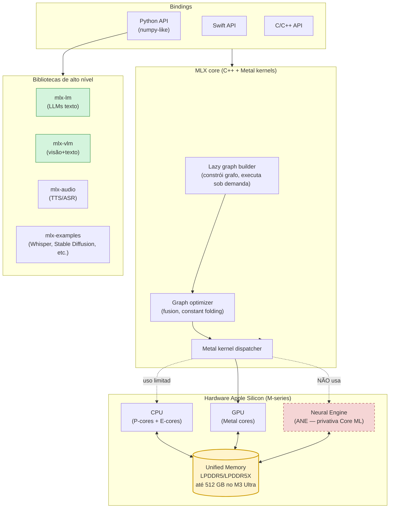
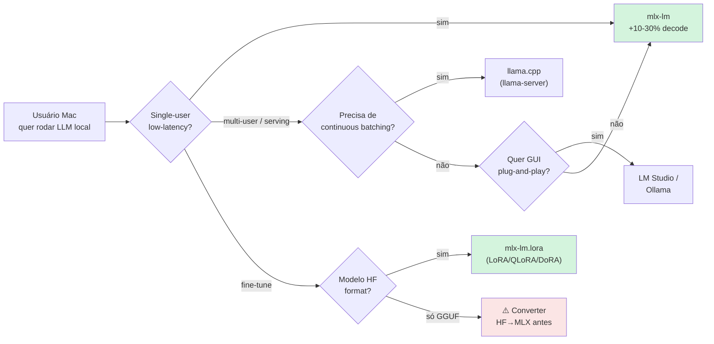
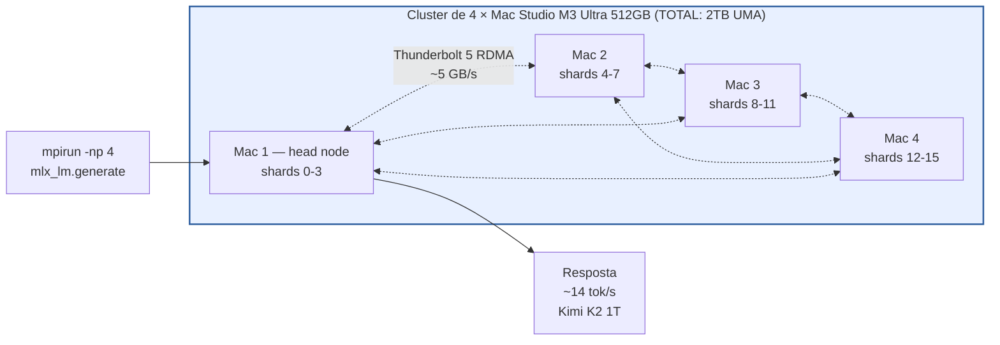
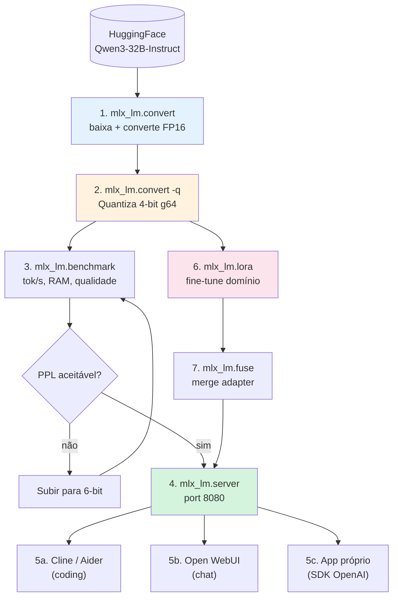
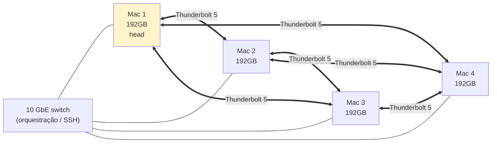
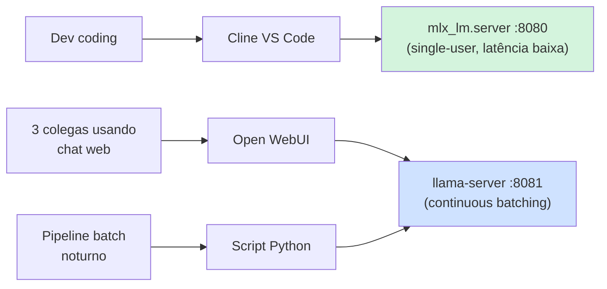

# Post 2 — MLX no Mac Silicon: mlx-lm, mlx-vlm e fine-tune com Unified Memory

> **Sub-série:** *Inferência local — Post 2 de N*
> **Pré-requisito útil:** Post 1 da sub-série (`llama.cpp` Metal, GGUF, quantizações). Este post pressupõe que você já entende o básico de quantização e KV cache (cobertos nos posts 04/05 da série principal).
> **Foco:** **MLX** — o framework numérico nativo da Apple para a família M-series. Hands-on, sem rodeios, com cookbooks reais para Mac M3 Max / M3 Ultra / M4 Pro.
> **Tom:** "abre o terminal e roda comigo". Você sai daqui com um servidor OpenAI-compatível subido em `localhost:8080`, um LoRA treinado e um pipeline de visão para PDFs.

---

## TL;DR

- **MLX** é o framework numérico que a Apple lançou em **dezembro/2023** (autoria principal: Awni Hannun) com API tipo NumPy, **lazy evaluation** e — o ponto que muda o jogo — **Unified Memory Architecture (UMA)**: CPU, GPU e ANE compartilham o **mesmo pool físico de RAM**, sem `cudaMemcpy`.
- O ecossistema cresceu em três linhas principais: **`mlx-lm`** (LLMs texto-para-texto, CLI + servidor OpenAI-compat), **`mlx-vlm`** (vision-language: Qwen3-VL, LLaVA, Pixtral, Llama 3.2 Vision) e **`mlx-audio`** (TTS Kokoro/OuteTTS, ASR Whisper — ainda experimental).
- Em **decode**, MLX costuma bater `llama.cpp` Metal por **10–30%** em modelos densos quantizados; em **prefill**, fica equivalente ou levemente atrás. Em modelos **MoE** (Mixtral, Qwen3-MoE), MLX abre vantagem maior porque o scheduler lazy evita cópias inúteis.
- A **Unified Memory** redefine "VRAM": um Mac de **64 GB** treina com LoRA o que numa RTX 4090 (24 GB) só rodaria em inferência — um Mac Studio M3 Ultra de **512 GB** roda **Kimi-K2-Thinking (1 trilhão de parâmetros)** quantizado em 4-bit, single-box.
- A partir do **macOS 26.2 + MLX 0.24+** (final de 2025), `mlx.distributed` + **JACCL (RDMA over Thunderbolt 5)** permite **clusters de até 4 Mac Studio** trocando 5–6 GB/s entre nós — Apple demonstrou Kimi K2 1T rodando em 4× M3 Ultra consumindo **<500 W totais**.
- Caveat real: **a ANE (Neural Engine) NÃO é usada por mlx-lm** em geral. Apenas a GPU. ANE é privativa de Core ML, não está exposta ao MLX para inferência LLM. Você tem um motor elétrico parado no carro.

> **Analogia-mãe:** **MLX é um carro elétrico Apple.** Só anda na garagem Apple (Mac Silicon). Mas dentro dela, é silencioso, eficiente, integrado — e o porta-malas (Unified Memory) é absurdamente maior do que num PC equivalente.

---

## 1. Por que MLX existe (e por que importa em 2026)

### 1.1. O contexto antes do MLX

Antes de dezembro/2023, rodar LLMs no Mac era uma de três opções, todas com pegadinha:

1. **PyTorch + MPS backend** — funcional, mas com **rough edges** (operadores sem implementação MPS, fallback CPU silencioso, leaks de memória).
2. **llama.cpp + Metal** — rápido, maduro, mas em C++, com pipeline próprio de quantização (GGUF) e fricção para fine-tuning.
3. **Hugging Face Transformers no CPU** — lento ao ponto de ser inviável para modelos > 7B.

A Apple não tinha um framework first-party para ML em Apple Silicon que fosse:

- **Pythônico** (familiar para quem vem de NumPy/PyTorch/JAX);
- **Otimizado para a arquitetura UMA** (sem cópias CPU↔GPU);
- **Aberto e instalável via pip** (não preso ao stack Core ML).

MLX preenche exatamente esse vão.

### 1.2. As três ideias arquiteturais



As três ideias arquiteturais que o MLX trouxe:

1. **Unified Memory aware desde o desenho.** Em CUDA você escreve `tensor.to('cuda')` porque a VRAM é fisicamente separada. Em MLX **não existe `.to(device)`**: o array já está acessível por CPU e GPU porque é literalmente o mesmo endereço de RAM. Isso elimina ~30% do código boilerplate de PyTorch e ~40% do tempo perdido em transferências em workloads small-batch.

2. **Lazy evaluation com grafo dinâmico.** Você escreve `c = a @ b + d`, o MLX não computa. Computa só quando você chama `mx.eval(c)` ou converte para NumPy/Python. Entre as duas chamadas, o **graph optimizer** funde ops, elimina temporários e gera kernels Metal otimizados. É como JAX, mas sem a ergonomia hostil de `jit` decorators espalhados.

3. **API NumPy quase 1:1.** `mx.array`, `mx.matmul`, `mx.softmax`, `mx.fft.rfft` — quem programa NumPy aprende MLX em uma tarde. Diferença principal: tudo é lazy.

### 1.3. O ecossistema em 2026

| Pacote | Função | Maturidade | Comando principal |
|---|---|---|---|
| `mlx` | Framework core (numpy-like) | ★★★★★ | `import mlx.core as mx` |
| `mlx-lm` | LLMs texto (chat, generate, serve, LoRA) | ★★★★★ | `mlx_lm.generate`, `mlx_lm.server`, `mlx_lm.lora` |
| `mlx-vlm` | Vision-Language Models | ★★★★ | `mlx_vlm.generate`, `mlx_vlm.server` |
| `mlx-audio` | TTS (Kokoro, OuteTTS, Sesame), ASR | ★★★ | `mlx_audio.tts`, `mlx_audio.stt` |
| `mlx-examples` | Stable Diffusion, Whisper, BERT, ResNet | ★★★★ | repo com scripts |
| `mlx-swift` | Bindings Swift para apps iOS/macOS | ★★★★ | Xcode integration |
| `mlx-community` (HF org) | Modelos pré-quantizados em formato MLX | ★★★★★ | `mlx-community/<modelo>` |

> **Observação prática:** sempre que sair um modelo novo (ex.: Qwen 3.5, Gemma 4), o **mlx-community** publica versões 4-bit/6-bit/8-bit em **horas a poucos dias**. É o time de Prince Canuma + comunidade que mantém esse ritmo. Para modelos muito recentes (< 24h após release), GGUF costuma sair primeiro.

---

## 2. MLX vs alternativas no Mac

### 2.1. Quem está na arena



### 2.2. Tabela comparativa decisiva

| Critério | **mlx-lm** | **llama.cpp Metal** | **Ollama (MLX-backed)** | **PyTorch MPS** | **LM Studio** |
|---|---|---|---|---|---|
| Velocidade decode (tok/s) | ★★★★★ | ★★★★ | ★★★★ | ★★ | ★★★★ |
| Velocidade prefill | ★★★★ | ★★★★★ | ★★★★ | ★★★ | ★★★★ |
| Footprint memória | ★★★★ | ★★★★★ (mmap) | ★★★★ | ★★ | ★★★★ |
| Maturidade serving | ★★★ | ★★★★★ | ★★★★ | ★★ | ★★★★ |
| Continuous batching | ❌ | ✅ | parcial | ❌ | ❌ |
| Speculative decoding | ✅ (0.24+) | ✅ | ✅ | ❌ | ✅ |
| Quantizações próprias | 2/3/4/6/8-bit + group | GGUF (Q2_K..Q8_0, IQ\*) | GGUF + MLX | bitsandbytes (limitado MPS) | GGUF + MLX |
| Fine-tune nativo | ✅ LoRA/QLoRA/DoRA | parcial (`finetune`) | ❌ | ✅ (lento) | ❌ |
| Multimodal (visão) | via `mlx-vlm` | parcial (LLaVA) | ✅ | ✅ | ✅ |
| Distributed multi-Mac | ✅ (`mlx.distributed`) | parcial (RPC) | ❌ | ❌ | ❌ |
| GGUF carregável | ❌ | ✅ nativo | ✅ | ❌ | ✅ |
| Suporte ANE | ❌ | ❌ | ❌ | ❌ (via Core ML sim) | ❌ |
| Plataformas | Apple Silicon **only** | cross-platform | cross-platform | cross-platform | macOS/Windows/Linux |

> **Regra de bolso:** **single-user, baixa latência, fine-tune local → mlx-lm.** **Servir várias requisições concorrentes ou rodar em Linux/Windows também → llama.cpp.** **Não quer terminal → LM Studio.** **Quer "uma coisa só que funciona" → Ollama (que desde out/2025 usa MLX por baixo nos Macs).**

### 2.3. Os números brutos no M3 Ultra

Baseado nos benchmarks comunitários do [`mlx-benchmarks`](https://github.com/guruswami-ai/mlx-benchmarks) e da discussão [#3209 do `ml-explore/mlx`](https://github.com/ml-explore/mlx/discussions/3209) (Mac Studio M3 Ultra 512 GB):

| Modelo | Quantização | Contexto | Decode (tok/s) | Memória (GB) |
|---|---|---|---|---|
| Qwen 3 32B | Q4 group=64 | 1k | **31.2** | ~19 |
| Qwen 3 32B | Q4 group=64 | 8k | 27.5 | ~21 |
| Qwen 3 32B | Q4 group=64 | 32k | 19.0 | ~28 |
| Qwen 3 32B | Q4 group=64 | 128k | 8.5 | ~52 |
| Mixtral 8x7B (MoE) | Q4 group=64 | 1k | **68.4** | ~26 |
| Mixtral 8x7B | Q4 group=64 | 32k | 46.7 | ~34 |
| DeepSeek V3.2 (MoE) | Q4 | 4k | 20.2 | ~340 |
| Llama 3.3 70B | Q4 group=64 | 4k | ~13 | ~40 |
| Kimi K2 1T (MoE, 32B active) | mxfp4 | 8k | ~14 | ~480 |

Achados-chave:

1. **Contexto importa mais que quantização.** Em 128 k tokens, o KV cache (FP16, não quantizado por padrão) domina a banda; ganho de Q2 vs Q4 vira ruído.
2. **MoE explode no Apple Silicon.** Mixtral 8×7B lê só ~12.9 B parâmetros ativos por token → 2.2× mais rápido que Qwen 32B denso, mesmo sendo "maior" no papel.
3. **Prefill é compute-bound, não memory-bound.** Quantização não acelera TTFT (time-to-first-token). Para 405 B × 16 k tokens, o TTFT é ~10 minutos independente do bit-width.

---

## 3. Setup em 60 segundos

### 3.1. Instalação

```bash
# Pré-requisitos: Apple Silicon (M1+), macOS 14+ (Sonoma), Python 3.10+
# Recomendado: macOS 26 (Tahoe) para mlx.distributed via Thunderbolt 5

# Opção 1 — pip clássico
pip install --upgrade mlx mlx-lm mlx-vlm mlx-audio

# Opção 2 — uv (mais rápido, recomendado)
uv pip install mlx mlx-lm mlx-vlm mlx-audio

# Opção 3 — projeto isolado com uv
uv init meu-mlx-projeto && cd meu-mlx-projeto
uv add mlx-lm mlx-vlm
```

### 3.2. Sanity check

```bash
python -c "import mlx.core as mx; print(mx.default_device()); print(mx.metal.is_available())"
# esperado: Device(gpu, 0)  True
```

### 3.3. Primeiro hello-world

```bash
mlx_lm.generate \
  --model mlx-community/Qwen3-4B-Instruct-2507-4bit \
  --prompt "Em uma frase, o que é unified memory architecture?" \
  --max-tokens 100
```

Se isso retorna texto em ~2 segundos, você está pronto.

### 3.4. Memory pressure — o único caveat de hardware

A Unified Memory é compartilhada com **todo o sistema**. O macOS faz swap agressivo quando passa de ~75% da RAM física, e **swap mata performance MLX** (você sai de 30 tok/s para 2 tok/s).

| Mac (RAM total) | "VRAM efetiva" segura | Maior modelo Q4 confortável |
|---|---|---|
| MacBook Air M2 8 GB | ~5 GB | Qwen 3 1.7B |
| MacBook Pro M3 16 GB | ~11 GB | Llama 3.2 3B / Phi-4 14B Q3 |
| MacBook Pro M3 Pro 36 GB | ~28 GB | Qwen 3 32B Q3 / Gemma 3 27B Q4 |
| MacBook Pro M3 Max 64 GB | ~50 GB | Qwen 3 32B Q4 + KV folgado |
| Mac Studio M3 Ultra 96 GB | ~80 GB | Llama 3.3 70B Q4 |
| Mac Studio M3 Ultra 192 GB | ~165 GB | Llama 3.3 70B FP16 |
| Mac Studio M3 Ultra 512 GB | ~440 GB | Kimi K2 1T mxfp4 / DeepSeek V3 |

Comando para ajustar o **wired memory limit** (avançado, em macOS você pode aumentar quanto a GPU pode "fixar"):

```bash
sudo sysctl iogpu.wired_limit_mb=49152   # M3 Max 64GB → libera 48GB para GPU
```

> **Cuidado:** `iogpu.wired_limit_mb` deixa de ser respeitado após reboot e, se exagerar, deixa o sistema instável. Mantenha sempre ≥ 12 GB para o macOS.

---

## 4. Inferência básica com `mlx-lm`

### 4.1. CLI generate

```bash
mlx_lm.generate \
  --model mlx-community/Qwen3-32B-Instruct-2507-4bit \
  --prompt "Explique vetores em álgebra linear como se eu tivesse 12 anos" \
  --max-tokens 500 \
  --temp 0.7 \
  --top-p 0.95
```

### 4.2. Modo chat (REPL)

```bash
mlx_lm.chat --model mlx-community/Qwen3-8B-Instruct-2507-4bit
```

### 4.3. Pythonic API

```python
from mlx_lm import load, generate

model, tokenizer = load("mlx-community/Qwen3-8B-Instruct-2507-4bit")

response = generate(
    model, tokenizer,
    prompt="Liste 3 modelos open-source de 2026 melhores que GPT-4o.",
    max_tokens=300,
    temp=0.6,
)
print(response)
```

### 4.4. Tipos de quantização suportados

| Bits | Group size | Tamanho relativo (vs FP16) | Qualidade vs FP16 (PPL) | Uso típico |
|---|---|---|---|---|
| 2-bit | 64 | ~12.5% | -8 a -15% | Experimental, instável em MoE |
| 3-bit | 64 | ~19% | -3 a -7% | Bom para modelos pequenos < 4B |
| **4-bit** | **64** | **~25%** | **-1 a -2%** | **Padrão recomendado** |
| 4-bit | 32 | ~28% | -0.5 a -1% | Quando qualidade importa |
| 6-bit | 64 | ~37.5% | < -0.5% | Sweet-spot Mac 64GB+ |
| 8-bit | 64 | ~50% | desprezível | Alta fidelidade, longo contexto |
| FP16 | — | 100% | baseline | Pesquisa / training |

> **Regra:** `q-bits=4 q-group-size=64` é o default da `mlx-community` e cobre 90% dos casos. Suba para 6-bit se você tem RAM sobrando e percebe degradação em tarefas de raciocínio.

---

## 5. Servidor OpenAI-compatível

### 5.1. Subindo o `mlx_lm.server`

```bash
mlx_lm.server \
  --model mlx-community/Qwen3-32B-Instruct-2507-4bit \
  --max-tokens 32768 \
  --port 8080 \
  --host 0.0.0.0
```

Endpoints expostos:

| Endpoint | Função |
|---|---|
| `POST /v1/chat/completions` | Chat com `messages: [...]` |
| `POST /v1/completions` | Completion clássico (prompt → string) |
| `POST /v1/models` | Lista modelos carregados |
| `POST /v1/embeddings` | Embeddings (se modelo suportar) |
| `POST /v1/audio/transcriptions` | Whisper (se carregado) |

### 5.2. Multi-modelo (carrega/descarrega sob demanda)

```bash
mlx_lm.server \
  --models-config models.yaml \
  --port 8080
```

```yaml
models:
  qwen-coder:
    path: mlx-community/Qwen3-Coder-30B-A3B-Instruct-4bit
  gemma-chat:
    path: mlx-community/gemma-3-27b-it-4bit
  r1-distill:
    path: mlx-community/DeepSeek-R1-Distill-Qwen-32B-4bit
```

O servidor mantém **um modelo ativo** por padrão e carrega outro sob demanda — a próxima request "fria" para `gemma-chat` paga ~5–10 s de carregamento, depois fica quente.

### 5.3. Cache de prefix

A partir de `mlx-lm 0.21+`, há **prompt cache** persistido entre requests do mesmo prefixo. Isso é ouro para chat multi-turn: cada turno paga prefill só dos tokens novos.

```bash
mlx_lm.server \
  --model mlx-community/Qwen3-32B-Instruct-2507-4bit \
  --prompt-cache-file ~/mlx-cache.safetensors
```

### 5.4. Integrações comuns

| Cliente | Como apontar |
|---|---|
| **Cline** (VS Code) | Settings → Provider: OpenAI Compatible → Base URL: `http://localhost:8080/v1` → Model: nome do modelo |
| **Aider** | `aider --openai-api-base http://localhost:8080/v1 --model mlx-community/...` |
| **Open WebUI** | Settings → Connections → OpenAI API → URL: `http://localhost:8080/v1` |
| **Cursor (custom OpenAI)** | Settings → Models → Override OpenAI Base URL |
| **LangChain / LlamaIndex** | `ChatOpenAI(base_url="http://localhost:8080/v1", ...)` |

---

## 6. Quantização própria com `mlx_lm.convert`

Quando o `mlx-community` ainda não tem o modelo que você quer (ou você quer um group-size customizado), você quantiza você mesmo.

### 6.1. Pipeline completo HF → MLX-quant

```bash
# 1) Baixa do HuggingFace e converte para formato MLX (FP16 first)
mlx_lm.convert \
  --hf-path Qwen/Qwen3-32B-Instruct-2507 \
  --mlx-path ~/models/Qwen3-32B-mlx-fp16

# 2) Quantiza a partir do MLX FP16
mlx_lm.convert \
  --hf-path Qwen/Qwen3-32B-Instruct-2507 \
  --mlx-path ~/models/Qwen3-32B-mlx-q4-g64 \
  -q --q-bits 4 --q-group-size 64

# 3) (Opcional) sobe para HF como contribuição comunitária
mlx_lm.convert \
  --hf-path Qwen/Qwen3-32B-Instruct-2507 \
  --mlx-path Qwen3-32B-mlx-q4-g64 \
  -q --q-bits 4 --q-group-size 64 \
  --upload-repo seu-usuario/Qwen3-32B-mlx-q4-g64
```

### 6.2. Trade-offs bits × group × tamanho × perplexidade

Benchmark comunitário (Qwen 2.5 14B Instruct em wikitext-2, M3 Max 64GB):

| Config | Tamanho final | PPL | Decode tok/s | Comentário |
|---|---|---|---|---|
| FP16 | 28.0 GB | 5.21 | 14 | Baseline |
| 8-bit g64 | 14.1 GB | 5.22 | 22 | Excelente, sem perda |
| 6-bit g64 | 10.6 GB | 5.27 | 28 | Ótimo trade-off |
| **4-bit g64** | **7.1 GB** | **5.34** | **38** | **Default** |
| 4-bit g32 | 7.7 GB | 5.30 | 35 | Marginalmente melhor |
| 4-bit g128 | 6.7 GB | 5.41 | 40 | Mais leve, perde qualidade |
| 3-bit g64 | 5.4 GB | 5.62 | 44 | Para modelos enormes em Mac pequeno |
| 2-bit g64 | 3.7 GB | 7.18 | 47 | ⚠️ Quebra qualidade |

### 6.3. Comparação MLX-quant vs GGUF/AWQ

| Formato | Origem | Carregável em | Qualidade Q4 (PPL) | Velocidade Mac |
|---|---|---|---|---|
| MLX 4-bit g64 | mlx-lm | mlx-lm, Ollama (≥0.5) | 5.34 | ★★★★★ |
| GGUF Q4_K_M | llama.cpp | llama.cpp, Ollama, LM Studio | 5.36 | ★★★★ |
| GGUF IQ4_XS | llama.cpp | llama.cpp, Ollama | 5.32 | ★★★★ |
| AWQ 4-bit | autoawq | vLLM, Transformers | 5.33 | ★★★ (PyTorch MPS) |
| GPTQ 4-bit | gptq | vLLM, Transformers | 5.35 | ★★★ |

> **Insight:** os 4 formatos modernos chegaram em PPL praticamente equivalente. A diferença real é **portabilidade** (GGUF ganha) vs **velocidade no Mac** (MLX ganha).

---

## 7. `mlx-vlm` — multimodalidade no Mac

### 7.1. Modelos suportados (out/2025–abr/2026)

| Família | Tamanhos MLX disponíveis | Notas |
|---|---|---|
| **Qwen3-VL** | 4B, 8B, 32B, 122B-A10B (MoE) | Estado-da-arte para OCR + raciocínio |
| Qwen2-VL | 2B, 7B, 72B | Maduro, muito usado |
| **Gemma 3 vision** | 4B, 12B, 27B | Bom para descrição geral |
| LLaVA-Next | 7B, 13B, 34B | Clássico |
| MiniCPM-V 2.6 | 8B | Eficiente, multi-imagem |
| **Pixtral 12B** | 12B | Mistral, forte em diagramas |
| Idefics 3 | 8B | HF, multi-imagem nativa |
| Llama 3.2 Vision | 11B, 90B | Meta oficial |

### 7.2. Comando básico

```bash
mlx_vlm.generate \
  --model mlx-community/Qwen3-VL-8B-Instruct-4bit \
  --image ~/Desktop/grafico-vendas.png \
  --prompt "Extraia os valores numéricos deste gráfico em formato JSON." \
  --max-tokens 800
```

### 7.3. Servidor `mlx_vlm.server` (OpenAI-compat com imagens)

```bash
mlx_vlm.server \
  --model mlx-community/Qwen3-VL-8B-Instruct-4bit \
  --port 8081
```

Cliente envia em formato OpenAI Vision:

```bash
curl http://localhost:8081/v1/chat/completions \
  -H "Content-Type: application/json" \
  -d '{
    "model": "qwen3-vl-8b",
    "messages": [{
      "role": "user",
      "content": [
        {"type": "text", "text": "Que produto é esse?"},
        {"type": "image_url", "image_url": {
          "url": "data:image/jpeg;base64,'$(base64 -i product.jpg)'"
        }}
      ]
    }],
    "max_tokens": 300
  }'
```

### 7.4. Tabela de performance VLM (M3 Max 64GB)

| Modelo | Quantização | Decode (tok/s) | Latência 1 imagem 1024px |
|---|---|---|---|
| Qwen3-VL 4B | 4-bit | 42 | ~1.2 s prefill |
| Qwen3-VL 8B | 4-bit | 28 | ~2.0 s prefill |
| Qwen3-VL 32B | 4-bit | 11 | ~6.5 s prefill |
| Gemma 3 27B vision | 4-bit | 13 | ~5.0 s prefill |
| Pixtral 12B | 4-bit | 22 | ~3.2 s prefill |

---

## 8. Fine-tune com LoRA / QLoRA / DoRA

### 8.1. Pré-requisitos

- Modelo no formato **HuggingFace** (não GGUF) — você pode usar diretamente o repo HF, o `mlx_lm.lora` baixa.
- Dataset em **JSONL** com pelo menos `train.jsonl` e `valid.jsonl`. Formatos aceitos:
  - `{"text": "..."}`
  - `{"prompt": "...", "completion": "..."}`
  - `{"messages": [{"role": "user", "content": "..."}, ...]}`
- RAM suficiente (ver tabela abaixo).

### 8.2. Comando-padrão

```bash
mlx_lm.lora \
  --model mlx-community/Qwen3-8B-Instruct-2507-4bit \
  --train \
  --data ./meu-dataset \
  --batch-size 4 \
  --iters 1000 \
  --num-layers 16 \
  --lora-rank 16 \
  --lora-alpha 32 \
  --learning-rate 1e-4 \
  --val-batches 25 \
  --steps-per-eval 100 \
  --steps-per-report 10 \
  --adapter-path ./adapters/meu-lora
```

### 8.3. Capacidade por Mac (LoRA r=16, batch=4)

| Mac (RAM) | Maior modelo treinável (Q4 base) | Tempo aprox. 1000 iters |
|---|---|---|
| MacBook Pro M3 16 GB | Qwen 3 1.7B / Phi-3 mini | ~15 min |
| MacBook Pro M3 Pro 36 GB | Qwen 3 8B / Llama 3.1 8B | ~35 min |
| **MacBook Pro M3 Max 64 GB** | **Qwen 3 14B / Gemma 3 12B** | **~1 h** |
| Mac Studio M3 Ultra 96 GB | Qwen 3 32B / Gemma 3 27B | ~3 h |
| Mac Studio M3 Ultra 192 GB | Llama 3.3 70B | ~9 h |
| Mac Studio M3 Ultra 512 GB | Llama 3.3 70B em FP16 | ~22 h |

> **Comparação dura:** uma RTX 4090 (24 GB) trava em LoRA de 13B-Q4. Um MacBook Pro M3 Max 64 GB faz LoRA confortável até 14B-Q4 com contexto 4k. **Unified memory ganha em fine-tuning local mid-range.**

### 8.4. Carregar e mergir o adapter

```bash
# Inferência usando o adapter
mlx_lm.generate \
  --model mlx-community/Qwen3-8B-Instruct-2507-4bit \
  --adapter-path ./adapters/meu-lora \
  --prompt "Teste com adapter aplicado"

# Fundir adapter no modelo base (gera checkpoint único)
mlx_lm.fuse \
  --model mlx-community/Qwen3-8B-Instruct-2507-4bit \
  --adapter-path ./adapters/meu-lora \
  --save-path ./Qwen3-8B-meu-fine-tune-4bit
```

### 8.5. DoRA e full fine-tune

`mlx-lm` 0.20+ suporta também:

```bash
mlx_lm.lora --fine-tune-type dora --lora-rank 16 ...   # Decomposed LoRA
mlx_lm.lora --fine-tune-type full ...                   # Full fine-tune (atenção à RAM)
```

DoRA tipicamente entrega +1 a +3% em qualidade vs LoRA puro, com 5–10% mais memória.

---

## 9. `mlx.distributed` — clusters multi-Mac

### 9.1. O que é

A partir do **MLX 0.18 (set/2024)**, o módulo `mlx.distributed` permite particionar um modelo em múltiplos Macs trocando ativações via:

- **Ethernet 10 GbE / 25 GbE** (até final de 2024);
- **Thunderbolt 4** (40 Gbps, ~3 GB/s úteis);
- **Thunderbolt 5** (80 Gbps, com **JACCL/RDMA** — 5–6 GB/s úteis em macOS 26.2+).

### 9.2. Arquitetura típica



### 9.3. Comando básico

```bash
# Em cada Mac, rodar o mesmo binário via mpirun
mpirun \
  --hostfile hosts.txt \
  -np 4 \
  mlx_lm.generate \
  --model mlx-community/Kimi-K2-Thinking-mxfp4 \
  --prompt "Explique LCMs em 5 parágrafos" \
  --max-tokens 800 \
  --pipeline-parallel
```

### 9.4. `mlx_lm share` (macOS 26.2+)

Apple introduziu o comando `mlx_lm share` para distribuir modelo entre nós sem ter que copiar o checkpoint inteiro em cada Mac:

```bash
# No nó head
mlx_lm share --model mlx-community/Kimi-K2-Thinking-mxfp4 --port 9000

# Nos outros nós
mlx_lm.generate --model-from-share head.local:9000 --prompt "..."
```

### 9.5. Performance esperada (4× M3 Ultra 512GB)

| Modelo | Tok/s single-Mac | Tok/s 4-Mac cluster | Speedup | Caveat |
|---|---|---|---|---|
| Llama 3.3 70B Q4 | 13 | 28 | 2.2× | KV broadcast custa |
| Qwen 3 32B Q4 | 31 | 38 | 1.2× | Modelo cabe single |
| Mixtral 8x22B Q4 | 18 | 42 | 2.3× | MoE escala bem |
| Llama 3.1 405B Q4 | OOM | 11 | ∞ | Único jeito de rodar |
| Kimi K2 1T mxfp4 | 14 (caber só M3U 512GB) | 22 | 1.6× | Demonstrado pela Apple |

> **Analogia:** **`mlx.distributed` é um convoy de Macs no Thunderbolt 5.** Funciona, é elegante, mas a estrada (TB5 a 80 Gbps) é mais estreita que a NVLink dos H100 (900 GB/s). Para 70B você ganha 2×; para 1T dá pra rodar — e isso é absurdo num setup que cabe numa bancada.

---

## 10. `mlx-audio` — TTS e ASR

Status em abr/2026: **maduro para Whisper, experimental para TTS**.

### 10.1. ASR — Whisper

```bash
mlx_audio.stt \
  --model mlx-community/whisper-large-v3-turbo-q4 \
  --audio podcast.mp3 \
  --output transcricao.srt \
  --language pt
```

Performance no M3 Max: **~12x real-time** (1 hora de áudio em ~5 min).

### 10.2. TTS — Kokoro

```bash
mlx_audio.tts \
  --model mlx-community/Kokoro-82M-mlx \
  --text "Olá! Este áudio foi gerado localmente no meu Mac." \
  --voice af_bella \
  --output saida.wav
```

### 10.3. Status dos modelos TTS (abr/2026)

| Modelo | Disponível MLX? | Qualidade | Latência |
|---|---|---|---|
| Kokoro 82M | ✅ estável | Boa | ~2s para 10s áudio |
| OuteTTS 0.3 1B | ✅ beta | Excelente | ~5s |
| Sesame CSM | parcial | SOTA streaming | experimental |
| Coqui XTTS v2 | ❌ | — | — (use PyTorch MPS) |
| Whisper turbo | ✅ estável | Excelente | 12x real-time |

---

## 11. Workflow ponta-a-ponta — Mac M3 Max 64 GB



### 11.1. Cookbook — três modelos rotando

Cenário: 64 GB RAM, três modelos especializados que você quer alternar (sem recarregar do disco a cada vez).

```yaml
models:
  coder:
    path: mlx-community/Qwen3-Coder-30B-A3B-Instruct-4bit
    max_kv_size: 16384
  reasoner:
    path: mlx-community/DeepSeek-R1-Distill-Qwen-32B-4bit
    max_kv_size: 32768
  vision:
    path: mlx-community/Qwen3-VL-8B-Instruct-4bit
    max_kv_size: 8192
```

```bash
mlx_lm.server --models-config models.yaml --port 8080 \
  --max-loaded-models 2   # mantém 2 quentes, descarrega o 3º quando precisar
```

---

## 12. Cookbook 1 — Dev local com mlx-lm + Cline em VS Code

**Objetivo:** ter um copilot 100% local, sem API key, para um projeto Python.

```bash
# 1) Sobe o servidor
mlx_lm.server \
  --model mlx-community/Qwen3-Coder-30B-A3B-Instruct-4bit \
  --port 8080 --max-tokens 32768 \
  --prompt-cache-file ~/.cache/mlx-cline.safetensors
```

VS Code → Extensions → **Cline** → Settings:

| Campo | Valor |
|---|---|
| API Provider | OpenAI Compatible |
| Base URL | `http://localhost:8080/v1` |
| API Key | `dummy` (qualquer string) |
| Model ID | `mlx-community/Qwen3-Coder-30B-A3B-Instruct-4bit` |
| Context Window | 32768 |

Modelos recomendados (out/2025–abr/2026) para coding 100% local:

| Modelo | Tamanho efetivo | Vantagem |
|---|---|---|
| **Qwen3-Coder 30B A3B** | ~16 GB Q4 | MoE → 3B ativos → rápido |
| Qwen 3 14B Instruct | ~8 GB Q4 | Generalista decente |
| DeepSeek-Coder-V3 lite | ~12 GB Q4 | Excelente para Python |
| Codestral 22B | ~13 GB Q4 | Forte em refatoração |
| Granite Code 34B | ~19 GB Q4 | Bom em SQL/COBOL |

---

## 13. Cookbook 2 — Agente RAG local com MLX + LanceDB

**Stack:** `mlx-lm` (LLM) + `mlx-embeddings` ou `sentence-transformers` (embeddings) + `lancedb` (vetor store).

```python
import lancedb
from mlx_lm import load, generate
from mlx_embeddings import load as load_emb, generate_embeddings

db = lancedb.connect("./rag-db")

emb_model, emb_tok = load_emb("mlx-community/bge-m3-mlx")

def embed(texts):
    return generate_embeddings(emb_model, emb_tok, texts)

import os, glob
docs = []
for f in glob.glob("docs/**/*.md", recursive=True):
    text = open(f).read()
    chunks = [text[i:i+800] for i in range(0, len(text), 600)]
    for chunk in chunks:
        docs.append({"text": chunk, "vector": embed([chunk])[0], "src": f})

table = db.create_table("docs", data=docs, mode="overwrite")

llm, llm_tok = load("mlx-community/Qwen3-8B-Instruct-2507-4bit")

def rag_query(question, k=5):
    qvec = embed([question])[0]
    hits = table.search(qvec).limit(k).to_list()
    ctx = "\n\n".join(f"[{h['src']}]\n{h['text']}" for h in hits)
    prompt = f"""Responda usando APENAS o contexto abaixo.

CONTEXTO:
{ctx}

PERGUNTA: {question}
RESPOSTA:"""
    return generate(llm, llm_tok, prompt=prompt, max_tokens=500)

print(rag_query("Como funciona o KV cache em MLX?"))
```

---

## 14. Cookbook 3 — Pipeline visão (PDF para JSON)

**Objetivo:** processar PDFs de notas fiscais / extratos / relatórios em JSON estruturado.

```python
import json
from pathlib import Path
from pdf2image import convert_from_path
from mlx_vlm import load, generate
from mlx_vlm.utils import load_config

model_path = "mlx-community/Qwen3-VL-8B-Instruct-4bit"
model, processor = load(model_path)
config = load_config(model_path)

SCHEMA_PROMPT = """Extraia desta página em JSON com esta estrutura exata:
{
  "fornecedor": "...",
  "cnpj": "...",
  "data": "YYYY-MM-DD",
  "itens": [{"descricao": "...", "qtd": 0, "valor_unit": 0.0, "valor_total": 0.0}],
  "total": 0.0
}
Se algum campo não existir, use null. Responda APENAS o JSON, sem prosa."""

def processar_pdf(pdf_path):
    pages = convert_from_path(pdf_path, dpi=200)
    resultados = []
    for i, page in enumerate(pages):
        img_path = f"/tmp/page_{i}.png"
        page.save(img_path)
        out = generate(
            model, processor, config,
            image=img_path, prompt=SCHEMA_PROMPT,
            max_tokens=1500, temperature=0.0,
        )
        try:
            resultados.append(json.loads(out))
        except json.JSONDecodeError:
            resultados.append({"erro": "JSON inválido", "raw": out})
    return resultados

dados = processar_pdf("nota_fiscal.pdf")
Path("nota_fiscal.json").write_text(json.dumps(dados, indent=2, ensure_ascii=False))
```

Performance no M3 Max 64GB com Qwen3-VL 8B Q4: **~6 segundos por página** A4 a 200 dpi.

---

## 15. Cookbook 4 — Fine-tune custom em domínio

**Cenário:** você tem 5.000 exemplos de Q&A do seu manual interno e quer um Qwen 3 8B especializado.

### 15.1. Preparar dataset

```python
import json, random

with open("dados.csv") as f:
    pairs = [linha.split(";") for linha in f.read().splitlines()[1:]]

random.shuffle(pairs)
split = int(len(pairs) * 0.95)

def to_chat(p, c):
    return {"messages": [
        {"role": "user", "content": p},
        {"role": "assistant", "content": c},
    ]}

with open("data/train.jsonl", "w") as f:
    for p, c in pairs[:split]:
        f.write(json.dumps(to_chat(p, c), ensure_ascii=False) + "\n")
with open("data/valid.jsonl", "w") as f:
    for p, c in pairs[split:]:
        f.write(json.dumps(to_chat(p, c), ensure_ascii=False) + "\n")
```

### 15.2. Treinar

```bash
mlx_lm.lora \
  --model mlx-community/Qwen3-8B-Instruct-2507-4bit \
  --train --data ./data \
  --batch-size 4 --iters 1500 \
  --num-layers 16 --lora-rank 16 --lora-alpha 32 \
  --learning-rate 1e-4 \
  --val-batches 50 --steps-per-eval 150 \
  --grad-checkpoint \
  --adapter-path ./adapters/manual-interno
```

### 15.3. Avaliar e mergir

```bash
mlx_lm.evaluate \
  --model mlx-community/Qwen3-8B-Instruct-2507-4bit \
  --adapter-path ./adapters/manual-interno \
  --data ./data --batch-size 8

mlx_lm.fuse \
  --model mlx-community/Qwen3-8B-Instruct-2507-4bit \
  --adapter-path ./adapters/manual-interno \
  --save-path ./Qwen3-8B-manual-fusionado-4bit
```

### 15.4. Servir

```bash
mlx_lm.server --model ./Qwen3-8B-manual-fusionado-4bit --port 8080
```

---

## 16. Cookbook 5 — Cluster amador 4× M3 Ultra

**Cenário:** você (ou seu time) reuniu **4 Mac Studio M3 Ultra 192 GB** (~30 mil USD totais — caro, mas 1/4 de um nó DGX H100). Quer rodar Llama 3.1 405B ou Kimi K2 em casa.

### 16.1. Setup físico



> **Topologia:** mesh full-connected via Thunderbolt 5 (cada Mac com 4 portas). Ethernet só para SSH / orquestração.

### 16.2. Pré-requisitos

```bash
# Em todos os Macs
brew install open-mpi
pip install mlx mlx-lm

# Configurar SSH key entre nós (sem senha)
ssh-copy-id user@mac2.local
# ... etc

# Validar mpirun
mpirun -hostfile hosts.txt -np 4 hostname
```

`hosts.txt`:
```
mac1.local slots=1
mac2.local slots=1
mac3.local slots=1
mac4.local slots=1
```

### 16.3. Rodar Kimi K2 1T

```bash
mpirun --hostfile hosts.txt -np 4 \
  mlx_lm.generate \
  --model mlx-community/Kimi-K2-Thinking-mxfp4 \
  --prompt "Resolva: $\int_0^\infty e^{-x^2} dx$" \
  --max-tokens 2000 \
  --pipeline-parallel
```

### 16.4. Throughput e custo

| Setup | Hardware | Custo aprox. | Kimi K2 1T tok/s | Watts |
|---|---|---|---|---|
| 4× M3 Ultra 192GB | Apple cluster | ~30k USD | ~22 | ~480 W |
| 4× M3 Ultra 512GB | Apple cluster | ~60k USD | ~28 | ~520 W |
| 1× DGX H100 8x | Nvidia | ~400k USD | ~180 | ~10 kW |
| 1× B200 | Nvidia | ~40k USD/GPU | ~45 (single) | ~1 kW |

> **Conclusão honesta:** 4× M3 Ultra é **8× mais lento** que um DGX, mas custa **13× menos** e consome **20× menos energia**. Para R&D, side-projects ou inferência batch noturna, é um sweet-spot real.

---

## 17. Caveats e armadilhas

### 17.1. Memory pressure

- macOS começa a swappar agressivamente acima de ~75% RAM.
- Quando isso acontece, o decode cai de 30 tok/s para 2 tok/s — **sem warning**.
- **Monitor:** Activity Monitor → Memory → "Memory Pressure" deve estar verde. Amarelo = warning. Vermelho = a brincadeira acabou.

### 17.2. Modelos novos demoram a chegar em MLX

- GGUF tipicamente sai em **horas** após release de um modelo.
- MLX-community costuma sair em **1–3 dias** (depende de Awni Hannun + Prince Canuma + comunidade).
- Para modelos com arquitetura nova (não-Llama, não-Qwen), pode levar **semanas** até alguém implementar o suporte.

### 17.3. Quantizações 2-bit instáveis em MoE

- Q2 funciona razoavelmente em modelos densos pequenos.
- Em MoE (Mixtral, Qwen3-MoE, DeepSeek), 2-bit corrompe os routers e o modelo passa a divagar.
- **Regra:** para MoE, mínimo 4-bit g64.

### 17.4. ANE não é usada

- Apple Neural Engine só é acessível via Core ML.
- mlx-lm **só usa GPU** (Metal). 
- A implicação prática: você tem ~16 TOPS (M3 Max) parados que poderiam ajudar — mas não há API. Há esforços comunitários para portar pequenos modelos para Core ML, mas para LLMs grandes a barreira é alta.

> **Analogia:** **a ANE é como ter um motor elétrico no carro, mas o LLM só usa o motor a combustão.** A Apple ainda não abriu a porta.

### 17.5. GGUF não carrega em mlx-lm (e vice-versa)

- Os formatos são incompatíveis.
- Para migrar de llama.cpp para MLX você precisa **recomeçar do checkpoint HF original** (ou usar `mlx_lm.convert` num GGUF não-quantizado, o que raramente é viável).

### 17.6. Limitações conhecidas em abr/2026

| Limitação | Workaround |
|---|---|
| Sem continuous batching | Use llama.cpp `llama-server` para multi-user |
| KV cache sempre FP16 | Aguardar `mx.quantized_kv` (em RFC) |
| Sem TensorRT-equivalente | MLX tem optimizer próprio, performance já boa |
| Sem speculative decoding em VLMs | Apenas mlx-lm 0.24+ (texto) suporta |
| Sem sharding tensorial intra-camada | `mlx.distributed` é só pipeline-parallel |

---

## 18. Performance esperada (benchmarks consolidados)

> **Fonte:** [`mlx-benchmarks`](https://github.com/guruswami-ai/mlx-benchmarks), [`ml-explore/mlx#3209`](https://github.com/ml-explore/mlx/discussions/3209), comunidade Reddit r/LocalLLaMA, blog *famstack.dev* "57 tok/s on Screen, 3 tok/s in Practice", validar para seu hardware.

### 18.1. Decode tok/s (single user, prompt 512, gen 256, Q4 g64)

| Modelo | M2 Pro 16GB | M3 Pro 36GB | M3 Max 64GB | M4 Pro 48GB | M4 Max 128GB | M3 Ultra 192GB | M3 Ultra 512GB |
|---|---|---|---|---|---|---|---|
| Qwen 3 4B | 65 | 78 | 92 | 88 | 110 | 105 | 105 |
| Qwen 3 8B | 38 | 48 | 60 | 55 | 75 | 78 | 78 |
| Qwen 3 14B | 22 | 30 | 38 | 34 | 50 | 55 | 55 |
| Qwen 3 32B | OOM | 14 | 19 | 16 | 25 | 31 | 31 |
| Qwen3-Coder 30B A3B | OOM | 38 | 52 | 45 | 70 | 82 | 82 |
| Gemma 3 4B | 60 | 72 | 88 | 84 | 102 | 100 | 100 |
| Gemma 3 27B | OOM | 16 | 22 | 19 | 28 | 35 | 35 |
| R1-Distill Qwen 32B | OOM | 14 | 19 | 16 | 25 | 31 | 31 |
| Llama 3.3 70B | OOM | OOM | OOM | OOM | 9 | 13 | 13 |
| Mixtral 8x7B | OOM | OOM | 30 | 28 | 50 | 68 | 68 |

### 18.2. Prefill tok/s (mesmas configs)

| Modelo | M3 Max 64GB | M3 Ultra 512GB |
|---|---|---|
| Qwen 3 8B | ~620 | ~880 |
| Qwen 3 32B | ~180 | ~280 |
| Llama 3.3 70B | OOM | ~130 |
| Mixtral 8x7B | ~340 | ~520 |

### 18.3. RAM uso real (modelo + KV 8k tokens)

| Modelo | Q4 base (GB) | + KV 8k (GB) | + KV 32k (GB) | + KV 128k (GB) |
|---|---|---|---|---|
| Qwen 3 8B | ~5 | ~6 | ~9 | ~21 |
| Qwen 3 32B | ~19 | ~21 | ~28 | ~52 |
| Llama 3.3 70B | ~40 | ~43 | ~52 | ~88 |
| Mixtral 8x7B | ~26 | ~28 | ~34 | ~58 |

---

## 19. Comparativo final com llama.cpp Metal

### 19.1. Quando escolher cada

| Situação | Escolha |
|---|---|
| Single-user, máxima velocidade decode | **mlx-lm** |
| Multi-user serving, request concorrente | **llama.cpp** (`llama-server`) |
| Fine-tune local LoRA | **mlx-lm** |
| Rodar GGUF que você já tem | **llama.cpp** |
| Trabalhar com modelo cross-platform (Linux/Windows/Mac) | **llama.cpp** |
| Cluster multi-Mac via Thunderbolt | **mlx-lm** + `mlx.distributed` |
| Modelo recém-lançado (< 24h) | **llama.cpp** geralmente sai primeiro em GGUF |
| Modelos `mlx-community` (já quantizados) | **mlx-lm** |
| Aplicação Swift / iOS | **mlx-swift** (impossível com llama.cpp em produção móvel) |
| Embeddings local | **llama.cpp** mais maduro |

### 19.2. Híbrido: o que muita gente faz



Mesmo Mac, dois servidores, dois propósitos. Funciona muito bem.

### 19.3. Migrar entre os dois

| Direção | Como |
|---|---|
| GGUF → MLX | ❌ Indireto. Baixe o original HF e use `mlx_lm.convert -q`. |
| MLX → GGUF | ❌ Indireto. Re-baixe HF e use `llama.cpp/convert_hf_to_gguf.py`. |
| HF safetensors → ambos | ✅ Os dois consomem HF nativo. |

---

## 20. Tendências MLX para 2026

(validar quando estiver lendo — mantenho o que já saiu em road-map público até abr/2026)

| Item | Status abr/2026 | Impacto |
|---|---|---|
| **Suporte FP8 nativo** | em RFC, depende de M5+ Tensor Ops | -50% RAM vs FP16 sem perda |
| **Speculative decoding LLM** | já em mlx-lm 0.24 | +30–80% throughput |
| **Speculative decoding VLM** | ainda não | — |
| **`mlx.quantized_kv`** | RFC | -50% RAM em context longo |
| **JACCL (RDMA TB5)** | macOS 26.2 | +3× banda inter-Mac |
| **mlx-swift 1.0** | beta | Apps iOS com LLM local |
| **Fine-tune com vision** | em mlx-vlm 0.4 (alpha) | LoRA em VLMs no Mac |
| **Suporte MX-FP4 oficial** | mlx 0.27 | Modelos like Kimi K2 caberem em mais Macs |
| **Continuous batching** | discussão aberta, sem ETA | — |
| **ANE para LLM** | sem road-map público | Hardware ocioso continua ocioso |

---

## 21. Cross-references

- **Post 1 da sub-série** (anterior) — `llama.cpp` Metal, GGUF, Ollama básico.
- **Post 3 da sub-série** (próximo) — Ollama / LM Studio: GUI e produtivização.
- **Post 10 da série principal** — [Hardware H100/H200/B200/MI300X/Apple/Groq](../10-hardware-h100-h200-b100-b200-mi300x-tpu-apple-groq.md) — onde Apple Silicon entra no mapa.
- **Post 11 da série principal** — [Frameworks vLLM/SGLang/TRT-LLM/TGI/llama.cpp/MLX/Ollama](../11-frameworks-vllm-sglang-trtllm-tgi-llamacpp-mlx-ollama.md) — visão comparativa mais ampla.
- **Post 04** — [Quantização de pesos GPTQ/AWQ/GGUF/bitsandbytes](../04-quantizacao-pesos-gptq-awq-gguf-bitsandbytes.md) — base teórica para entender as quantizações MLX.
- **Post 05** — [Quantização de KV cache](../05-quantizacao-kv-cache-kivi-kvquant-cachegen.md) — o próximo passo natural quando o KV vira gargalo.
- **Post 17** — [Multimodalidade VLM](../17-multimodalidade-vlm-audio-video-omni-clip-llava-qwen-vl-gemini.md) — teoria por trás dos modelos que você roda em `mlx-vlm`.
- **Post 19** — [Loop agêntico coding (Cursor/Cline/Aider)](../19-loop-agentico-coding-cursor-claude-code-aider-cline-opencode-antigravity-codex.md) — onde o `mlx_lm.server` se encaixa no fluxo de dev.
- **Sub-série modelos open 2026** — `serie-modelos-open-2026/` — qual modelo escolher para qual tarefa.

---

## 22. Referências

### 22.1. Oficial Apple / MLX

- **Repo principal MLX** — [`ml-explore/mlx`](https://github.com/ml-explore/mlx) — core C++ + Python.
- **mlx-lm** — [`ml-explore/mlx-lm`](https://github.com/ml-explore/mlx-lm) — LLMs.
- **mlx-examples** — [`ml-explore/mlx-examples`](https://github.com/ml-explore/mlx-examples) — Whisper, SD, BERT, GPT-2, etc.
- **mlx-swift** — [`ml-explore/mlx-swift`](https://github.com/ml-explore/mlx-swift) — bindings Swift.
- **MLX docs** — [`ml-explore.github.io/mlx`](https://ml-explore.github.io/mlx).
- **Apple ML Research — "Exploring LLMs with MLX and the Neural Accelerators in the M5 GPU"** — [machinelearning.apple.com/research/exploring-llms-mlx-m5](https://machinelearning.apple.com/research/exploring-llms-mlx-m5).

### 22.2. Comunidade

- **mlx-vlm** — [`Blaizzy/mlx-vlm`](https://github.com/Blaizzy/mlx-vlm) — Prince Canuma.
- **mlx-audio** — [`Blaizzy/mlx-audio`](https://github.com/Blaizzy/mlx-audio).
- **mlx-community no HF** — [huggingface.co/mlx-community](https://huggingface.co/mlx-community).
- **Awni Hannun (X / blog)** — autor principal do MLX, posta benchmarks frequentes.
- **`alexziskind1/mlx-jaccl-cluster`** — receita de cluster RDMA Thunderbolt 5.

### 22.3. Benchmarks

- **`guruswami-ai/mlx-benchmarks`** — [github.com/guruswami-ai/mlx-benchmarks](https://github.com/guruswami-ai/mlx-benchmarks) — sistemático.
- **Discussão #3209 — "Systematic inference benchmarks"** — [github.com/ml-explore/mlx/discussions/3209](https://github.com/ml-explore/mlx/discussions/3209).
- **famstack.dev — "57 tok/s on Screen, 3 tok/s in Practice: MLX vs llama.cpp"** — [famstack.dev/guides/mlx-vs-gguf-apple-silicon](https://famstack.dev/guides/mlx-vs-gguf-apple-silicon).
- **CraftRigs — "MLX vs llama.cpp vs Ollama in 2026"** — [craftrigs.com/comparisons/mlx-vs-llamacpp-vs-ollama-2026](https://craftrigs.com/comparisons/mlx-vs-llamacpp-vs-ollama-2026/).

### 22.4. Apple distributed / Thunderbolt 5 cluster

- **PCMag — "Apple Thunderbolt 5 Macs AI Clusters MLX"** — [pcmag.com/news/apple-thunderbolt-5-macs-ai-clusters-mlx](https://www.pcmag.com/news/apple-thunderbolt-5-macs-ai-clusters-mlx).
- **Issue #1046 — Multi-Machine Support** — [github.com/ml-explore/mlx/issues/1046](https://github.com/ml-explore/mlx/issues/1046).
- **Issue #955 — `mlx_lm share` documentação** — [github.com/ml-explore/mlx-lm/issues/955](https://github.com/ml-explore/mlx-lm/issues/955).

### 22.5. Tutoriais práticos validados

- **InsiderLLM — "Fine-Tuning on Mac: LoRA & QLoRA with MLX"** — [insiderllm.com/guides/fine-tuning-mac-lora-mlx](https://insiderllm.com/guides/fine-tuning-mac-lora-mlx/).
- **Medium / Nithin P — "Training a Local LLM (Qwen3.5-2B) Using MLX + LoRA"** (mar/2026).
- **Matt Williams — "FineTuning with MLX"** — [technovangelist.com/notes/finetuning-with-mlx](https://technovangelist.com/notes/finetuning-with-mlx).
- **Alex Weberk gist — LoRA Fine-tuning Gemma with MLX** — [gist.github.com/alexweberk/1434c95c05463866491677aac6ce19ba](https://gist.github.com/alexweberk/1434c95c05463866491677aac6ce19ba).

---

> **Próximo post da sub-série:** *Ollama e LM Studio — quando você quer "uma coisa só que funciona"*. Veremos como o Ollama (que desde out/2025 usa MLX por baixo nos Macs) abstrai tudo o que vimos aqui em três cliques, quando vale, quando não vale, e como construir GUIs em cima.
>
> **Encerramento:** se você chegou até aqui e tem um Mac M-series com mais de 32 GB, **abre o terminal agora** e roda o comando da seção 3.3. Você está literalmente a um `pip install` de ter um copilot 100% local rodando mais rápido que muito serviço pago. Esse é o presente que a UMA + MLX te deram — **a casa toda virou teu bolso**.
