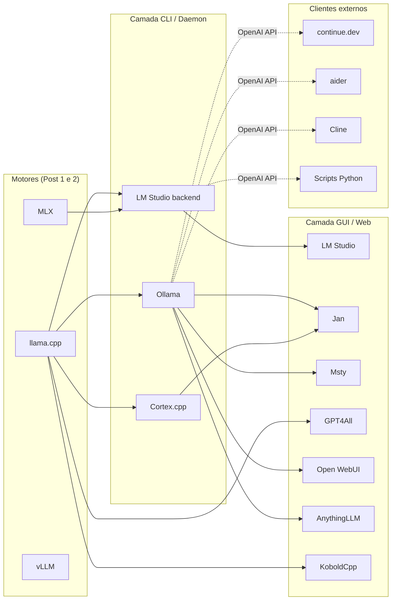
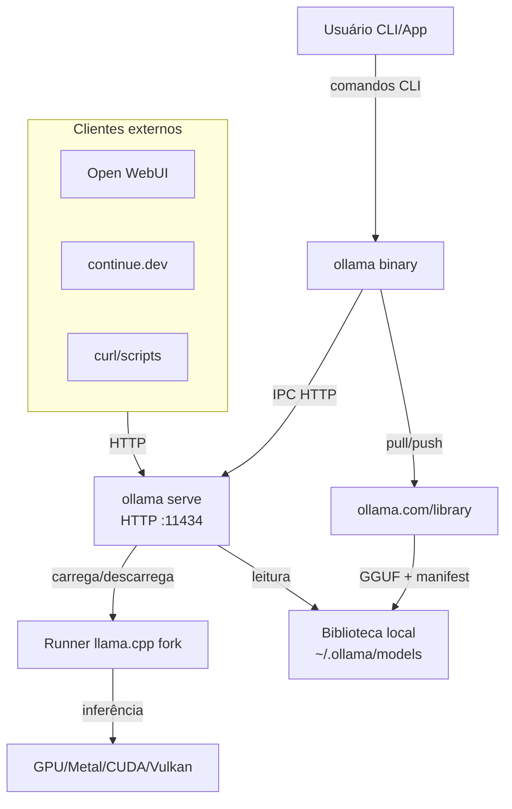
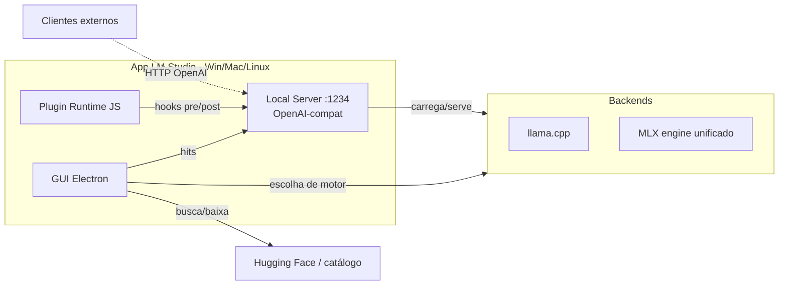
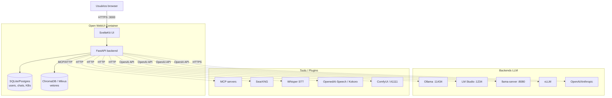
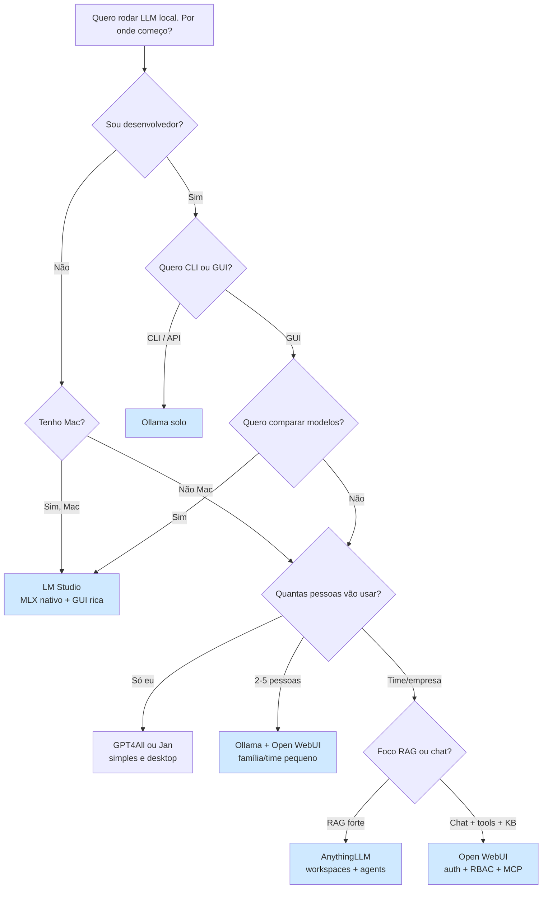
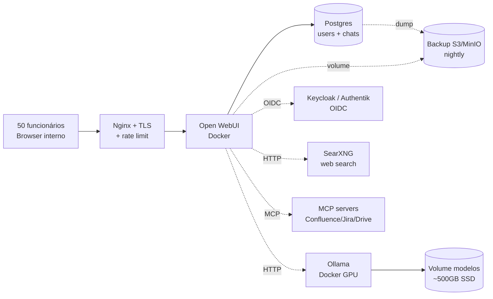
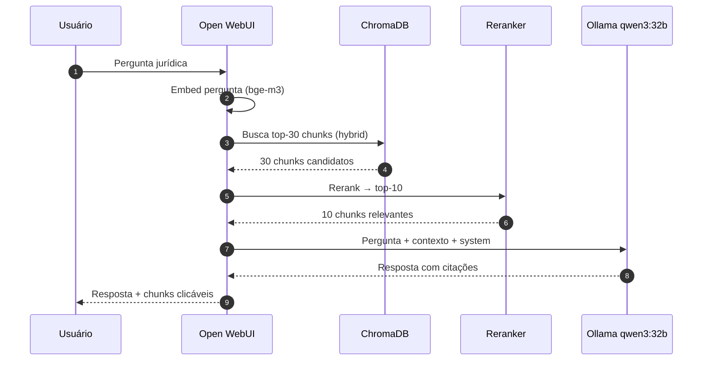
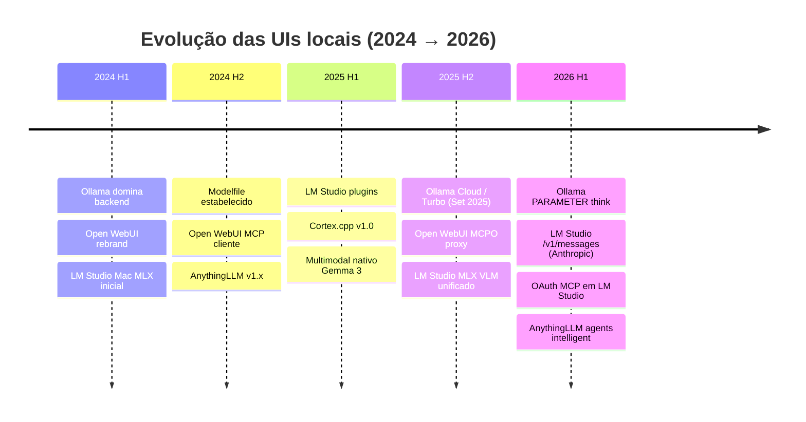

# 03 — Ollama, LM Studio, Open WebUI, Jan, Msty & cia: o "Docker, iTunes e Slack" dos LLMs locais

> **Sub-série Inferência Local — Post 3 de N**
> **Posts anteriores:**
> - Post 1: `llama.cpp` — o motor que move 90% do mundo local
> - Post 2: MLX — quando você é dono de um Mac
>
> **Próximos:** Post 4 (hardware), Post 11 (frameworks de produção), Post 14 (MCP), Post 19 (coding agents).

---

## TL;DR

`llama.cpp` e MLX são motores **brutalmente** competentes, mas exigem terminal, flags, conversões GGUF, gerenciamento de quantizações, e um certo gosto pela linha de comando. A esmagadora maioria dos usuários — incluindo desenvolvedores experientes em modo "quero rodar agora, não quero pensar" — quer **um botão de play**.

Esse post cobre as ferramentas que **embrulham** os motores em uma camada de UX:

- **Ollama** — o "Docker do LLM": `pull`, `run`, pronto. CLI primeiro, GUI desktop nativa desde 2025, modo Cloud/Turbo desde 2025.
- **LM Studio** — o "iTunes dos LLMs": discovery, download, chat. GUI desktop. Único com **MLX nativo** integrado no Mac, plus llama.cpp.
- **Open WebUI** — o "Slack do LLM self-hosted": multi-user, RAG, MCP, plugins, RBAC, knowledge bases.
- **Jan** — ChatGPT desktop offline, com Cortex.cpp por baixo.
- **Msty** — desktop cross-platform com knowledge stacks e branching de conversas.
- **GPT4All** — veterano, foco privacidade total, LocalDocs.
- **AnythingLLM** — workspaces RAG enterprise, agents, MCP.
- **Coadjuvantes** — KoboldCpp, LibreChat, TypingMind, Cherry Studio, Chatbox, PrivateGPT.

Se você ler esse post inteiro e ainda não souber qual escolher, pule direto para a **seção 11** (workflow por persona) e a **seção 12-15** (cookbooks prontos).

---

## Sumário

1. [Por que essas ferramentas existem](#1-por-que-essas-ferramentas-existem)
2. [Ollama — deep dive](#2-ollama--deep-dive)
3. [LM Studio — deep dive](#3-lm-studio--deep-dive)
4. [Open WebUI — deep dive](#4-open-webui--deep-dive)
5. [Jan + Cortex.cpp](#5-jan--cortexcpp)
6. [Msty](#6-msty)
7. [GPT4All](#7-gpt4all)
8. [AnythingLLM](#8-anythingllm)
9. [Outros (curto)](#9-outros-curto)
10. [Tabela master comparativa](#10-tabela-master-comparativa)
11. [Workflow recomendado por persona](#11-workflow-recomendado-por-persona)
12. [Cookbook 1 — setup família 100% local](#12-cookbook-1--setup-família-100-local)
13. [Cookbook 2 — empresa interna 50 funcionários](#13-cookbook-2--empresa-interna-50-funcionários)
14. [Cookbook 3 — agente RAG local com Open WebUI](#14-cookbook-3--agente-rag-local-com-open-webui)
15. [Cookbook 4 — voice assistant local](#15-cookbook-4--voice-assistant-local)
16. [Caveats e armadilhas](#16-caveats-e-armadilhas)
17. [Integração com IDE/coding agents](#17-integração-com-idecoding-agents)
18. [Atualizações e manutenção](#18-atualizações-e-manutenção)
19. [Custos vs hosted (ROI)](#19-custos-vs-hosted-roi)
20. [Tendências 2025-2026](#20-tendências-2025-2026)
21. [Cross-references da série](#21-cross-references-da-série)
22. [Referências](#22-referências)

---

## 1. Por que essas ferramentas existem

### 1.1 O hiato entre motor e usuário

Quando o `llama.cpp` saiu (Post 1), você tinha que:

1. Clonar o repo, compilar com CMake e flags certas (Metal? CUDA? ROCm? Vulkan?).
2. Achar o GGUF certo no Hugging Face (qual quant? Q4_K_M? Q5_K_S? Q8_0?).
3. Saber que `-ngl 999` empurra tudo pra GPU.
4. Memorizar o template de chat correto pro modelo (ChatML? Llama 3? Phi?).
5. Subir um servidor manualmente, escrever cliente que fale OpenAI-compat.
6. Manter atualizado puxando do main, recompilando.

Cada um desses passos é uma **fonte de churn**: dezenas de milhares de pessoas que testaram o local, bateram numa parede e voltaram pra ChatGPT.

As ferramentas dessa categoria existem para resolver **uma única coisa**: transformar "rodar LLM local" em uma experiência tão simples quanto "abrir o Spotify".

### 1.2 Acoplamento end-to-end

Uma boa ferramenta de UX para LLM local entrega, num único pacote:

- **Discovery** — onde achar modelos bons e quais cabem no meu hardware?
- **Download** — gerenciar GBs de pesos, retomada, integridade.
- **Conversão/quant** — entregar pesos prontos pra rodar.
- **Serve** — backend funcionando sem CLI cheio de flags.
- **Chat UI** — interface familiar, histórico, system prompt, parâmetros.
- **API** — endpoint OpenAI-compat para clientes externos (continue.dev, aider, scripts).
- **Update** — auto-atualização e notificações de novas versões.

Cada ferramenta dessa lista cobre essa cadeia, com **ênfases diferentes**.

### 1.3 Tabela: ferramenta × público-alvo

| Ferramenta       | Público-alvo                        | Licença                   | Plataformas             | Distribuição     |
|------------------|--------------------------------------|---------------------------|-------------------------|------------------|
| **Ollama**       | Devs, makers, automatizadores       | MIT                       | Mac, Linux, Win         | Native + Docker  |
| **LM Studio**    | Hobbyistas, pesquisadores, Mac users | Proprietário (free) [^1]  | Mac, Linux, Win         | Native           |
| **Open WebUI**   | Famílias, equipes, empresas         | BSD-3 / Open WebUI Lic.   | Linux/Mac/Win + Docker  | Docker (default) |
| **Jan**          | Usuários ChatGPT-like offline       | AGPL-3.0                  | Mac, Linux, Win         | Native           |
| **Msty**         | Power users, knowledge workers      | Proprietário (free + Aurum) | Mac, Linux, Win       | Native           |
| **GPT4All**      | Usuários privacidade-paranoicos     | MIT                       | Mac, Linux, Win         | Native           |
| **AnythingLLM**  | Equipes RAG, suporte interno        | MIT                       | Mac, Linux, Win + Docker | Native + Docker |
| **KoboldCpp**    | Roleplay, escrita criativa          | AGPL-3.0                  | Mac, Linux, Win         | Native           |
| **LibreChat**    | Multi-LLM proxy + UI                | MIT                       | Docker                  | Docker           |
| **TypingMind**   | BYOK frontend SaaS / self-host      | Proprietário              | Web + native            | Web/Native       |

[^1]: TOS atualizado em 2024 ficou mais permissivo: uso pessoal e comercial pequeno permitido sem licença adicional.

### 1.4 Mapa mental



---

## 2. Ollama — deep dive

### 2.1 O pitch: "Docker do LLM"

A analogia é pesada e funciona:

```bash
ollama pull qwen3:32b
ollama run qwen3:32b
```

Com dois comandos você baixa um modelo de 32B parâmetros (provavelmente quantizado em Q4) e abre um chat REPL. Por baixo, sobe um servidor HTTP em `http://localhost:11434` que serve duas APIs:

- **API nativa Ollama** (`/api/generate`, `/api/chat`, `/api/embeddings`, `/api/pull`).
- **API OpenAI-compatível** (`/v1/chat/completions`, `/v1/embeddings`, `/v1/models`) — parcial mas suficiente para 95% dos clientes.

### 2.2 Arquitetura



**Pontos-chave:**

- O binário `ollama` é tanto **CLI cliente** quanto **daemon** — `ollama serve` sobe o servidor; `ollama run` é o cliente que fala com ele.
- O runner é um **fork próprio** do llama.cpp, com algumas modificações (e ocasional defasagem). Ollama tem investido em manter o fork mais próximo do upstream.
- Modelos ficam em `~/.ollama/models` em formato GGUF + manifest JSON.
- A "library" oficial em `ollama.com/library` cataloga ~200 modelos populares prontos pra `pull`.

### 2.3 Comandos essenciais

| Comando                                        | O que faz                                               |
|------------------------------------------------|---------------------------------------------------------|
| `ollama pull <modelo>`                         | Baixa modelo da library                                 |
| `ollama run <modelo>`                          | Chat REPL interativo (carrega e conversa)               |
| `ollama list` / `ollama ls`                    | Lista modelos baixados                                  |
| `ollama ps`                                    | Lista modelos carregados em memória agora               |
| `ollama show <modelo>`                         | Mostra Modelfile, parâmetros, template, sistema         |
| `ollama rm <modelo>`                           | Remove do disco                                         |
| `ollama cp <orig> <novo>`                      | Copia (útil pra criar variantes)                        |
| `ollama create <nome> -f Modelfile`            | Cria modelo customizado a partir de Modelfile           |
| `ollama stop <modelo>`                         | Descarrega modelo da memória                            |
| `ollama serve`                                 | Roda daemon HTTP (em foreground)                        |
| `ollama push <user/modelo>`                    | Publica modelo no ollama.com                            |

Variáveis de ambiente úteis:

```bash
export OLLAMA_HOST=0.0.0.0:11434     # bindar em todas as interfaces
export OLLAMA_KEEP_ALIVE=24h          # quanto tempo manter modelo em RAM
export OLLAMA_NUM_PARALLEL=4          # requests paralelos (>1 == bom para multi-user)
export OLLAMA_MAX_LOADED_MODELS=2     # quantos modelos simultaneamente em RAM
export OLLAMA_FLASH_ATTENTION=1       # liga flash-attention quando possível
export OLLAMA_KV_CACHE_TYPE=q8_0      # quantização do KV cache (economiza RAM)
```

### 2.4 Modelfile — sua imagem Docker do LLM

Pegando emprestada a estética do Dockerfile:

```dockerfile
FROM qwen3:32b
PARAMETER temperature 0.7
PARAMETER num_ctx 8192
PARAMETER repeat_penalty 1.1
PARAMETER think false
SYSTEM """
Você é um assistente brasileiro chamado Tucano.
Sempre responda em português do Brasil, tom direto, sem floreios.
Se não souber, diga "não sei" sem inventar.
"""
TEMPLATE """{{ if .System }}<|im_start|>system
{{ .System }}<|im_end|>
{{ end }}{{ if .Prompt }}<|im_start|>user
{{ .Prompt }}<|im_end|>
{{ end }}<|im_start|>assistant
"""
```

Cria com:

```bash
ollama create tucano -f Modelfile
ollama run tucano
```

**Novidade 2025/2026:** o parâmetro `PARAMETER think false|true|low|medium|high` permite definir o **modo de raciocínio** padrão para modelos thinking (Qwen 3, DeepSeek R1, GPT-OSS). Útil porque clientes como Open WebUI nem sempre expõem o toggle.

### 2.5 Library de modelos

Em `ollama.com/library` você encontra rapidamente:

| Família           | Variantes típicas                              | Notas                          |
|-------------------|------------------------------------------------|--------------------------------|
| **Qwen 3**        | `0.6b` → `32b`, `qwen3-coder:30b/480b-cloud`  | Bilíngue forte, thinking opt   |
| **Llama 3.x**     | `8b`, `70b`, `3.2:3b`                          | Padrão de mercado              |
| **Gemma 3**       | `4b`, `12b`, `27b` (vision)                    | Vision multimodal              |
| **DeepSeek R1**   | distill `7b`/`14b`/`32b`/`70b`                 | Reasoning forte                |
| **Phi 4**         | `14b`, `mini`                                  | Leve, MS                       |
| **Mistral**       | `7b`, `nemo`, `small/large`                    | Europeu, RAG OK                |
| **GPT-OSS**       | `20b`, `120b-cloud`                            | OpenAI weights abertos          |
| **Llava / Bakllava** | vision-language                              | Multimodal vintage             |
| **bge-m3 / nomic-embed** | embeddings                              | Use com `/api/embeddings`      |

### 2.6 Multimodal e tool calling

- **Vision:** `ollama run gemma3:27b` aceita imagens via `/api/chat` (campo `images: [base64]`). Llava, Bakllava e Qwen-VL também.
- **Tool calling:** `/api/chat` aceita `tools: [...]` no formato OpenAI; modelos que suportam (Llama 3.1+, Qwen 2.5+, Mistral, GPT-OSS) retornam `tool_calls`. Cuidado: alguns templates de chat do Ollama divergem do upstream — veja [seção 16](#16-caveats-e-armadilhas).

### 2.7 GPU offload automático

Ollama detecta GPU/VRAM disponível e calcula quantas camadas cabem (`-ngl` no llama.cpp). Você não precisa configurar — mas pode forçar via:

```bash
OLLAMA_GPU_OVERHEAD=536870912 ollama serve   # reserva 512MB pro SO
```

Em Macs com unified memory, ele usa Metal e quase tudo cabe. Em multi-GPU NVIDIA, distribui automaticamente.

### 2.8 Cloud / Turbo

Desde **setembro de 2025** (v0.12), Ollama oferece **modelos cloud**: rode `qwen3-coder:480b-cloud` ou `gpt-oss:120b-cloud` ou `deepseek-v3.1:671b-cloud` como se fossem locais — a chamada vai pra infra do Ollama.

Planos:

| Plano  | Preço     | Cloud models simultâneos | Uso vs Free |
|--------|-----------|--------------------------|-------------|
| Free   | \$0        | 1                        | baixo       |
| Pro    | \$20/mês   | 3                        | 50×         |
| Max    | \$100/mês  | 10                       | 5× sobre Pro |

Útil quando você quer **híbrido**: modelos pequenos local, modelos gigantes na nuvem, mesma API. O cliente nem sente a diferença.

### 2.9 Embeddings

```bash
curl http://localhost:11434/api/embeddings -d '{
  "model": "bge-m3",
  "prompt": "Posto de gasolina mais próximo"
}'
```

`bge-m3`, `nomic-embed-text`, `mxbai-embed-large` estão na library. Use para RAG fora das ferramentas integradas (LangChain, LlamaIndex, scripts próprios).

### 2.10 Quando Ollama é a escolha óbvia

- Você quer **API estável** rodando como serviço, sem GUI.
- Você está fazendo automação, scripts, integração com coding agents.
- Você quer **plug-and-play** com Open WebUI ou AnythingLLM.
- Você precisa de **gerenciamento simples** de muitos modelos (`ollama ls`, `ollama rm`).

---

## 3. LM Studio — deep dive

### 3.1 O pitch: "iTunes dos LLMs"

LM Studio é uma **app desktop polida**: você abre, vê uma loja de modelos (com filtros por hardware, tamanho, quant, autor), baixa, e conversa numa UI limpa. É a **única ferramenta da lista** com **MLX como cidadão de primeira classe** no Mac, lado a lado com llama.cpp.

### 3.2 Arquitetura



### 3.3 Features 2026

- **MLX engine unificado** — uma única arquitetura roda mlx-lm (texto) e mlx-vlm (vision) com **prompt caching** habilitado para VLMs (era exclusivo de LLMs texto-only). VLMs ficam intercambiáveis com modelos texto.
- **Plugin system** — API JavaScript com manifest JSON declarando permissões/capabilities. Plugins ganham hooks **pre-inference** e **post-inference**: dá pra injetar contexto RAG, formatação de resposta, logging customizado, templates de prompt.
- **Native v1 REST API** — chats com estado, autenticação por token, endpoints de download/load/unload de modelo.
- **Anthropic-compatible `/v1/messages`** — clientes que falam Claude (Claude Code, etc.) plugam direto.
- **Reasoning configurável** — `low/medium/high/max` para modelos thinking (Qwen 3.6, Gemma 4, etc.).
- **OAuth para MCP servers** — autenticação contra MCPs que pedem login.
- **Multi-modelo carregamento** — vários carregados ao mesmo tempo, troca rápida.
- **Auto-quant info** — mostra quanto VRAM/RAM cada quant precisa antes de baixar.

### 3.4 Servidor local

Por padrão sobe em `http://localhost:1234/v1`. É **drop-in replacement** da API OpenAI:

```bash
curl http://localhost:1234/v1/chat/completions \
  -H "Content-Type: application/json" \
  -d '{
    "model": "qwen3-32b",
    "messages": [{"role":"user","content":"Olá"}]
  }'
```

### 3.5 Licença e uso comercial

Em 2024 a EULA foi atualizada para permitir uso pessoal **e comercial pequeno** sem licença adicional. Empresas grandes ainda precisam falar com o time. Vale checar a versão atual antes de adotar em escala.

### 3.6 Comparativo direto Ollama × LM Studio

| Eixo                        | Ollama              | LM Studio                |
|-----------------------------|----------------------|---------------------------|
| Interface principal         | CLI + GUI (recente) | GUI desktop primeiro      |
| Backend                     | llama.cpp (fork)    | llama.cpp + **MLX**       |
| Discovery de modelos        | `ollama.com/library`| Busca HF integrada        |
| Servidor local              | `:11434`            | `:1234`                   |
| Multi-user / RBAC           | Não nativo          | Não nativo                |
| Plugins                     | Não                 | **Sim (JS API)**          |
| Cloud híbrido               | Sim (Turbo)         | Não                       |
| Modelfile / customização    | **Sim (Modelfile)** | Configs por modelo na UI  |
| Open source                 | Sim (MIT)           | Closed (free uso pessoal) |
| Best fit                    | Devs, automação     | Mac users, exploradores   |

### 3.7 Quando LM Studio é a escolha óbvia

- Você está num **Mac** e quer aproveitar **MLX** sem CLI.
- Você é **iniciante** e quer GUI rica para descobrir modelos.
- Você é **pesquisador** comparando rapidamente N modelos diferentes.
- Você precisa do `/v1/messages` da Anthropic local.

---

## 4. Open WebUI — deep dive

### 4.1 O pitch: "Slack do LLM self-hosted"

Open WebUI (antiga Ollama WebUI) é o **frontend rico** que substitui o ChatGPT em times. Não é apenas chat: é **plataforma**.

- Multi-user com auth, RBAC e grupos.
- Knowledge bases (RAG built-in) por workspace.
- MCP cliente nativo + MCPO proxy.
- Tools, Functions, Pipelines (extensibilidade em Python).
- Web search integrado (SearXNG, Tavily, Google PSE, Brave, DuckDuckGo).
- Voice (Whisper STT + TTS).
- Image generation (Auto1111, ComfyUI, OpenAI DALL-E).
- Audit log, branding.

E **conecta em qualquer backend** que fale OpenAI: Ollama, LM Studio, llama-server, vLLM, OpenAI/Anthropic/Google reais via API.

### 4.2 Arquitetura



### 4.3 Subir em um comando (Docker)

```bash
docker run -d -p 3000:8080 \
  -v open-webui:/app/backend/data \
  -e OLLAMA_BASE_URL=http://host.docker.internal:11434 \
  --name open-webui \
  --restart always \
  ghcr.io/open-webui/open-webui:main
```

Em Linux puro, troque `host.docker.internal` por `http://172.17.0.1:11434` ou IP do host. Acesse `http://localhost:3000`, primeiro user vira admin.

Versão **com Ollama embutido** (single container):

```bash
docker run -d -p 3000:8080 --gpus=all \
  -v ollama:/root/.ollama -v open-webui:/app/backend/data \
  --name open-webui \
  ghcr.io/open-webui/open-webui:ollama
```

### 4.4 RAG built-in

Sources suportadas:

- **Documentos locais** — PDF, DOCX, TXT, MD, EPUB, código fonte. Acessa com `#` no chat (`#meu_doc`).
- **Web** — `#https://exemplo.com/artigo` injeta página inteira.
- **YouTube** — `#https://youtu.be/xxxx` puxa transcrição/captions.
- **Knowledge bases** — coleções com múltiplos arquivos por workspace.

Customizações:

- Embedding model: `bge-m3`, `nomic-embed-text`, etc. via Ollama ou API externa.
- Splitter: por tokens ou por **markdown headers** (preserva H1-H6).
- Hybrid search (BM25 + vetor) e reranking.
- Templates de RAG editáveis em Admin > Documents.

**Caveat importante:** se você usa Ollama como backend, o `num_ctx` padrão é 2048 tokens — **ridiculamente baixo** para RAG. Aumente em "Model Settings" para 8K-32K (verifique se cabe na sua VRAM).

### 4.5 MCP support

Três caminhos:

1. **Native HTTP MCP** — conecta em servidores MCP que falam HTTP/SSE.
2. **MCPO Proxy** — bridge para servidores MCP locais que falam stdio (formato Claude Desktop). Converte stdio → OpenAPI HTTP, gera docs interativos automaticamente.
3. **OpenAPI Servers** — qualquer REST/OpenAPI vira tool.

Isso transforma Open WebUI em um **hub MCP self-hosted**: filesystem, git, postgres, GitHub, Slack — tudo plugável.

### 4.6 Tools, Functions, Pipelines

- **Tools** — Python function que vira tool calling pro LLM. Ex.: calculadora, cep, busca interna.
- **Functions** — código que executa em **etapas do pipeline**: filter (transforma input/output), action (botão na UI), pipe (modelo virtual).
- **Pipelines** — servidor separado (port 9099) com hooks heavy-duty: rate limiting, RAG customizado, monitoring, multi-step agents.

### 4.7 Voice e imagem

- **STT:** Whisper.cpp (local), faster-whisper, OpenAI API.
- **TTS:** OpenedAI-Speech (compat OpenAI TTS local), Kokoro, ElevenLabs, OpenAI.
- **Imagem:** AUTOMATIC1111, ComfyUI, OpenAI Images.

### 4.8 Quando Open WebUI é a escolha óbvia

- Você precisa **multi-user** com login.
- Você precisa **RAG sério** com várias bases.
- Você quer **MCP/tools/web search** sem programar muito.
- Você está montando **plataforma interna** (família, time, empresa).

---

## 5. Jan + Cortex.cpp

### 5.1 O pitch

**Jan** (jan.ai) é um app desktop ChatGPT-like, **AGPL-3.0**, com **Cortex.cpp** como backend. Cortex.cpp é um runtime tipo Ollama (CLI + servidor OpenAI-compat) construído pela mesma equipe — usa llama.cpp (e ONNX Runtime planejado).

### 5.2 Status 2026

Cortex.cpp passou por uma reorganização: o repo `janhq/cortex.cpp` foi **arquivado**, com desenvolvimento movido para `menloresearch/llama.cpp`. Última stable v1.0.14 (junho 2025). Jan continua ativo como produto desktop, mas o backend está em transição.

### 5.3 Features

- **100% offline** opcional (com fallback cloud opt-in para OpenAI/Groq/Cohere).
- **OpenAI-compat API**.
- **Hub de modelos** integrado, GGUF do HF.
- **Auto-detecção de GPU** NVIDIA/AMD/Intel.
- **Chat com PDFs** (experimental).
- **Multi-quantização** suportada.

### 5.4 Quando faz sentido

- Você quer **alternativa open-source ao LM Studio**.
- Você gosta da estética ChatGPT mas quer 100% local.
- Não se importa com a transição em curso do backend.

---

## 6. Msty

### 6.1 O pitch

Msty é um app desktop cross-platform que combina **local + cloud** numa única UI, com features que faltam aos concorrentes:

- **Split chat** — comparar N modelos lado a lado em paralelo.
- **Branching de conversas** — fork da conversa em qualquer mensagem (tipo `git checkout -b`).
- **Knowledge stacks** — RAG com PDFs, DOCX, pastas, **Obsidian vaults**, notas internas, transcrições de YouTube.
- **Real-time data** — web search nativo.
- **Zero telemetria** — local-first.

### 6.2 Knowledge stacks

Configurações avançadas:

- Embedding model (local ou remoto).
- Splitter (recursive character ou sentence-based).
- Chunk size ajustável.
- **Similarity threshold** e número de chunks.
- **Jina AI reranking** para qualidade.

### 6.3 Aurum (tier pago)

A subscription **Aurum** desbloqueia compose options avançadas:

- **Load modes:** Static (cached), Dynamic (latest), **Sync Mode** (recompose automático ao mudar arquivo).
- **Resource management:** marcar para reprocessar, ignorar, lock temporário/permanente.

### 6.4 Quando faz sentido

- Você é **knowledge worker** que vive em PDFs, notas, Obsidian.
- Você quer **comparar respostas** de modelos rapidamente.
- Você usa **mix local + cloud** (Claude/GPT) na mesma UI.

---

## 7. GPT4All

### 7.1 O pitch

Veterano da turma (Nomic AI), **MIT**, foco **privacidade total**. Última versão v3.10.0 (fev/2025), repo ainda atualizado em 2025, ~77k stars no GitHub.

### 7.2 Features principais

- App desktop simples, llama.cpp por baixo.
- **LocalDocs** — coleções de documentos com embedding via **Nomic Embed** (free, local).
- Source attribution: mostra qual arquivo foi referenciado.
- Real-time progress ao indexar.
- Suporte recente a DeepSeek R1 distillations.

### 7.3 Limitações de LocalDocs

- Apenas similarity search (sem BM25 nem reranking).
- `.txt` e `.md` nativos; PDF/DOCX requerem habilitar manualmente nas configurações e são menos testados.

### 7.4 Quando faz sentido

- Você quer a opção **mais privacy-purist** da lista (MIT, sem telemetria, sem cloud).
- Você tem coleção de markdown/texto e quer chat com ela.
- Você não precisa de multi-user nem MCP.

---

## 8. AnythingLLM

### 8.1 O pitch: "Notion + LLM"

AnythingLLM (Mintplex Labs, MIT) é construído ao redor do conceito de **workspace**: você cria espaços, joga documentos, define qual LLM usar (Ollama, OpenAI, Anthropic, Groq, etc.), e cada workspace fica isolado.

### 8.2 Features 2026 (v1.12+)

- **Vector DB built-in** — LanceDB local por padrão; suporta Pinecone, Chroma, Weaviate, Qdrant, Milvus, etc.
- **MCP support** — funciona com qualquer servidor MCP-compatible.
- **MCP server *para* AnythingLLM** — Claude Desktop, Cursor e GitHub Copilot podem **controlar** o AnythingLLM via 23 tools tipadas (gerenciar workspaces, chat, upload, vector search).
- **Automatic Mode (agents)** — tool calling nativo sem `@agent` prefix em providers compatíveis.
- **Intelligent Tool Selection** — ferramentas ilimitadas com até **80% economia de tokens**.
- **Filesystem agent** — busca arquivos/diretórios no host.
- **Document Generation agent** — gera TXT, PDF, XLSX, DOCX, PPTX.
- **Telegram bot** — controle remoto com chat, imagem, voz.
- Multi-user, admin, audit.

### 8.3 Quando faz sentido

- Você precisa de **plataforma de RAG** com vários assuntos isolados.
- Você quer **agents** sem montar pipelines do zero.
- Você quer **embeddable widget** num site/app interno.
- Você usa **Cursor/Claude Desktop** e quer expor uma KB local pra eles.

---

## 9. Outros (curto)

| Tool             | Foco                                  | Notas                                                  |
|------------------|----------------------------------------|--------------------------------------------------------|
| **KoboldCpp**    | Roleplay, escrita criativa             | Fork llama.cpp com sampling avançado, world info, lore books, sliders criativos. Single binary, GUI web. |
| **PrivateGPT** (Zylon) | Self-hosted RAG corporativo       | Foco enterprise, agora produto comercial Zylon, OSS legado. |
| **LibreChat**    | Multi-LLM proxy + UI ChatGPT-like      | Bom pra equipes que querem chat com OpenAI/Anthropic/local na mesma UI, com auth e plugins. |
| **TypingMind**   | BYOK frontend (web ou desktop)         | Você cola sua chave OpenAI/Claude, ele dá UI superior. Self-host disponível. |
| **Cherry Studio** | Desktop multi-provider                | Estética bonita, suporta Ollama, OpenAI, dezenas de providers, agentes, KBs. |
| **Chatbox**      | Cliente desktop minimalista            | Multi-provider, simples, leve. Ótimo "primeiro cliente" pra Ollama/LM Studio. |
| **Page Assist**  | Extensão de browser                    | Side panel chat com Ollama dentro do Chrome/Firefox, com web context. |
| **Enchanted** (Mac) | Cliente nativo Mac pra Ollama       | Sleek, foco macOS, sem peso de Electron. |

---

## 10. Tabela master comparativa

| Ferramenta     | GUI?       | Multi-user | RAG built-in    | MCP cliente | Multimodal | Voice (STT/TTS) | OpenAI-compat server | Plataforma         | Licença         | Foco principal              |
|----------------|------------|------------|-----------------|-------------|------------|-----------------|----------------------|--------------------|-----------------|------------------------------|
| **Ollama**     | CLI + GUI  | Não nativo | Não (API embed) | Não direto  | Sim        | Não             | Sim (`:11434/v1`)    | Mac/Lin/Win        | MIT             | Backend universal            |
| **LM Studio**  | GUI rica   | Não nativo | Plugins         | OAuth MCP   | Sim (MLX)  | Não             | Sim (`:1234/v1`)     | Mac/Lin/Win        | Proprietário    | Discovery/comparação         |
| **Open WebUI** | Web        | **Sim**    | **Sim (rico)**  | **Sim**     | Sim        | **Sim**         | Sim (proxy)          | Docker/Linux       | BSD-3 / OWUI    | Plataforma multi-user        |
| **Jan**        | GUI        | Não        | PDF (exp.)      | Parcial     | Em prog.   | Não             | Sim (Cortex)         | Mac/Lin/Win        | AGPL-3.0        | ChatGPT-like offline OSS     |
| **Msty**       | GUI        | Não        | **Sim (stacks)**| Parcial     | Sim        | Parcial         | Não direto           | Mac/Lin/Win        | Proprietário    | Knowledge worker desktop     |
| **GPT4All**    | GUI        | Não        | LocalDocs       | Não         | Limitado   | Não             | Sim                  | Mac/Lin/Win        | MIT             | Privacidade purista          |
| **AnythingLLM**| GUI/Web    | **Sim**    | **Sim (workspaces)**| **Sim** | Sim        | Sim             | Sim                  | Mac/Lin/Win/Docker | MIT             | Workspaces RAG + agents      |
| **KoboldCpp**  | Web        | Não        | Lorebooks       | Não         | Limitado   | Não             | Sim                  | Mac/Lin/Win        | AGPL-3.0        | Criativo/RP                  |
| **LibreChat**  | Web        | **Sim**    | Sim             | Sim         | Sim        | Sim             | Proxy                | Docker             | MIT             | Proxy multi-LLM ChatGPT-like |
| **TypingMind** | Web/Desktop| Sim (paid) | Plugin          | Sim         | Sim        | Sim             | Não direto           | Web/Native         | Proprietário    | BYOK frontend SaaS           |

---

## 11. Workflow recomendado por persona

### 11.1 Decision tree



### 11.2 Receitas curtas

| Persona                                    | Stack recomendado                                                                                  |
|--------------------------------------------|-----------------------------------------------------------------------------------------------------|
| **Hobbyista solo (Mac)**                   | **LM Studio** — GUI + MLX nativo, sem trabalho. Adicionar Chatbox/Enchanted se quiser chat externo. |
| **Hobbyista solo (Linux/Windows)**         | **Ollama** + **LM Studio** ou **GPT4All**. Ollama pra automação, GUI pra chat casual.               |
| **Família/escritório pequeno (2-5 users)** | **Ollama + Open WebUI** (Docker single host) — multi-user, RAG, baixa fricção.                      |
| **Dev em CLI puro**                        | **Ollama** + scripts/curl + cliente integrado no editor (continue.dev/aider).                       |
| **Empresa interna self-hosted (10-50)**    | **Open WebUI** com OIDC + Postgres + Ollama atrás de Nginx, ou **AnythingLLM** se RAG é o foco.     |
| **Pesquisador comparando modelos**         | **LM Studio** (split modelo) ou **Msty** (split chat).                                              |
| **Knowledge worker (notas/PDFs/Obsidian)** | **Msty** (knowledge stacks) ou **AnythingLLM** (workspaces).                                        |
| **Roleplay/escritor criativo**             | **KoboldCpp** ou **SillyTavern** apontando para Ollama/llama-server.                                |

---

## 12. Cookbook 1 — setup família 100% local

**Objetivo:** rodar um "ChatGPT da família" para 3-5 pessoas, num único Mac Mini, **\$0/mês após hardware**.

**Hardware:** Mac Mini M4 Pro 64GB unified memory (~\$2.200).

### 12.1 Modelos sugeridos

| Uso                       | Modelo                      | RAM aprox. (Q4) | Notas                            |
|---------------------------|------------------------------|-----------------|----------------------------------|
| Chat geral                | `qwen3:32b`                  | ~20 GB          | Bilíngue, thinking opt           |
| Chat rápido / mobile      | `qwen3:8b`                   | ~6 GB           | Latência baixa                   |
| Vision                    | `gemma3:27b`                 | ~18 GB          | Imagens, PDFs com figuras        |
| Reasoning pesado          | `deepseek-r1:32b`            | ~20 GB          | Matemática, código difícil       |
| Embeddings                | `bge-m3`                     | ~1.5 GB         | RAG no Open WebUI                |

### 12.2 Setup passo a passo

```bash
brew install ollama
ollama serve &

ollama pull qwen3:32b
ollama pull qwen3:8b
ollama pull gemma3:27b
ollama pull deepseek-r1:32b
ollama pull bge-m3

docker run -d -p 3000:8080 \
  -v open-webui:/app/backend/data \
  -e OLLAMA_BASE_URL=http://host.docker.internal:11434 \
  -e WEBUI_AUTH=true \
  -e DEFAULT_MODELS=qwen3:32b \
  --name open-webui \
  --restart always \
  ghcr.io/open-webui/open-webui:main
```

### 12.3 Configurações importantes

- Em Open WebUI > Admin > Settings > Connections, confirmar `OLLAMA_BASE_URL`.
- Em Models > qwen3:32b > Advanced, **subir `num_ctx` para 16384 ou 32768** (Ollama default = 2048).
- Em Settings > Documents, escolher embedding model = `bge-m3` (Ollama).
- Em Users, criar contas pra cada membro da família, definir admin/user.
- Variáveis Ollama no shell rc:

  ```bash
  export OLLAMA_NUM_PARALLEL=3
  export OLLAMA_MAX_LOADED_MODELS=2
  export OLLAMA_KEEP_ALIVE=2h
  ```

### 12.4 Acesso na rede local

Bindar Open WebUI em `0.0.0.0` (default Docker) e acessar de qualquer device em `http://<ip-do-mac>:3000`. Sugestão: configurar **Tailscale** pra acesso remoto seguro.

---

## 13. Cookbook 2 — empresa interna 50 funcionários

**Objetivo:** plataforma LLM corporativa **self-hosted**, com auth corporativo, knowledge bases departamentais, audit log.

### 13.1 Hardware

Duas opções:

| Setup                              | Preço aprox. | Concorrência típica       | Notas                            |
|------------------------------------|--------------|---------------------------|----------------------------------|
| 2× RTX 4090 (48GB total)           | ~\$4-5k       | 10-20 usuários ativos     | Quantize agressivo (Q4/Q5)       |
| 1× H100 80GB                        | ~\$30-40k     | 50+ usuários ativos       | FP16/BF16 confortável            |
| 1× H200 / 2× L40S                   | ~\$40-60k     | 100+ usuários             | Modelos grandes em FP8           |

Para 50 usuários "casuais" (não simultâneos), 2× RTX 4090 ou 1× RTX 6000 Ada (48GB) + Qwen 3 32B serve bem com Ollama.

### 13.2 Arquitetura proposta



### 13.3 Setup essencial

- **Postgres em vez de SQLite** (escala melhor com 50+ users):
  ```bash
  -e DATABASE_URL=postgresql://user:pass@pg:5432/openwebui
  ```
- **OIDC** (Keycloak/Authentik):
  ```bash
  -e ENABLE_OAUTH_SIGNUP=true \
  -e OAUTH_PROVIDER_NAME=Keycloak \
  -e OPENID_PROVIDER_URL=https://kc.empresa.com/realms/main/.well-known/openid-configuration \
  -e OPENID_REDIRECT_URI=https://chat.empresa.com/oauth/oidc/callback \
  -e OAUTH_CLIENT_ID=open-webui \
  -e OAUTH_CLIENT_SECRET=xxx
  ```
- **RBAC e grupos:** crie grupos por departamento, atribua KBs, restrinja modelos sensíveis (ex.: GPT-OSS-120B Cloud só pra time X).
- **Knowledge bases por departamento:** Jurídico, RH, Engenharia, Vendas — cada um com seus PDFs/docs, embedding `bge-m3`.
- **Audit log:** habilitar `WEBUI_AUTH_TRUSTED_EMAIL_HEADER` e logar via stdout → Loki/Datadog.
- **Backup:** `docker run --rm -v open-webui:/data -v $(pwd):/backup alpine tar czf /backup/webui-$(date +%F).tgz /data` no cron, sincronizar com S3.

### 13.4 Operação

| Atividade            | Frequência | Comando/ação                                             |
|----------------------|------------|----------------------------------------------------------|
| Atualizar Open WebUI | Mensal     | `docker compose pull && docker compose up -d`            |
| Atualizar Ollama     | Mensal     | `docker compose pull` (ou `brew upgrade ollama`)         |
| Backup Postgres      | Diário     | `pg_dump` → S3                                           |
| Backup volumes       | Diário     | tar + S3                                                 |
| Auditoria de acesso  | Semanal    | Revisar logs OIDC + audit log Open WebUI                 |
| Revisar modelos      | Trimestral | Avaliar novos lançamentos, retirar modelos sem uso       |

---

## 14. Cookbook 3 — agente RAG local com Open WebUI

**Objetivo:** chat com 1.000+ PDFs jurídicos, com **citations** e **reranker**.

### 14.1 Setup

1. **Embedding model:** `bge-m3` via Ollama (multilíngue, 8K contexto, dense+sparse+ColBERT).
   ```bash
   ollama pull bge-m3
   ```
2. **Reranker:** `bge-reranker-v2-m3` (via API externa ou serviço dedicado). Open WebUI permite configurar reranker em Admin > Settings > Documents > Reranking Model.
3. **Knowledge base:**
   - Em Workspaces, criar KB "Jurídico-2026".
   - Upload em lote dos PDFs (drag&drop ou via API `POST /api/v1/knowledge`).
   - Splitter: `recursive_character` com chunk_size=800, overlap=100. Para legal, considerar splitter por seção/artigo.
4. **Modelo:** `qwen3:32b` com system prompt:
   ```text
   Você é um assistente jurídico. Responda APENAS com base nos trechos
   recuperados. Cite as fontes no formato [arquivo.pdf, p.X]. Se a
   informação não estiver nos trechos, responda "não encontrado".
   ```
5. **Configurações chave:**
   - `num_ctx` = 16384 ou 32768 (depende da VRAM e tamanho dos chunks).
   - Top-K = 8-12 chunks após reranking.
   - Hybrid search ON (BM25 + dense).
6. **Citations:** Open WebUI mostra trechos clicáveis na resposta. Verifique em chat após primeira pergunta.

### 14.2 Fluxo



---

## 15. Cookbook 4 — voice assistant local

**Objetivo:** falar com o LLM, ouvir resposta, tudo offline.

### 15.1 Componentes

- **STT:** Whisper.cpp via Ollama (veio com `ollama` recente) ou faster-whisper via container.
- **LLM:** Ollama com `qwen3:8b` (latência baixa para conversa).
- **TTS:** [OpenedAI-Speech](https://github.com/matatonic/openedai-speech) (compat OpenAI TTS API local) com voz Kokoro ou Piper.

### 15.2 Setup STT/TTS no Open WebUI

```bash
docker run -d -p 8000:8000 --name openedai-speech \
  -v ./voices:/app/voices ghcr.io/matatonic/openedai-speech
```

Em Open WebUI > Admin > Settings > Audio:

- **STT engine:** `whisper.cpp` (local) ou `OpenAI` apontando pra `http://faster-whisper:8000/v1`.
- **TTS engine:** `OpenAI` apontando pra `http://openedai-speech:8000/v1`, voz `nova` (Kokoro) ou `alloy`.

### 15.3 Wake word (fora do escopo, menção)

Para "Ei, Tucano" ativar gravação, integre **Picovoice Porcupine** ou **OpenWakeWord** num daemon que dispare gravação no browser/cliente. Não há suporte nativo no Open WebUI.

---

## 16. Caveats e armadilhas

| Categoria                        | Armadilha                                                                                                | Mitigação                                                                                          |
|----------------------------------|----------------------------------------------------------------------------------------------------------|----------------------------------------------------------------------------------------------------|
| **Templates de chat (Ollama)**   | O template Modelfile às vezes diverge do upstream do criador → tool calling falha sutilmente.            | `ollama show <m> --template`, comparar com `tokenizer_config.json` do HF, criar Modelfile próprio. |
| **`num_ctx` Ollama default**     | 2048 tokens — corta RAG, web search, chats longos.                                                       | Subir para 8K-32K em Modelfile ou em "Model Settings" do Open WebUI.                               |
| **LM Studio defasado**           | Backend llama.cpp pode estar 1-3 semanas atrás do upstream → modelos novos demoram.                      | Verificar changelog antes de testar modelo recém-lançado; fallback Ollama nesse intervalo.         |
| **Open WebUI peso**              | Container pesado (Node + Python + Chroma) — RAM 1-2GB idle, ainda mais com KBs grandes.                  | Postgres em vez de SQLite, separar Chroma em container dedicado, monitorar com cAdvisor.           |
| **Multi-user em Ollama puro**    | `OLLAMA_NUM_PARALLEL` ajuda, mas requests competem pelo mesmo modelo carregado → fila se VRAM cheia.     | Aumentar `OLLAMA_MAX_LOADED_MODELS`, ou para >10 users simultâneos migrar pra **vLLM** (Post 11). |
| **Updates quebram (Open WebUI)** | Lançamentos rápidos, ocasionalmente quebram migrations ou plugins.                                       | Pinning de tag (`:0.X.Y` em vez de `:main`), backup ANTES de pull.                                 |
| **Privacidade GUI proprietárias**| LM Studio, Msty têm telemetria opt-out mas binários fechados — auditoria difícil.                        | Para paranoia total: GPT4All, Jan, Open WebUI (todos OSS).                                         |
| **Chat templates errados**       | "Gemma diz que é Gemini", "Llama responde em russo" — sintoma de template mal aplicado pelo wrapper.     | Trocar quant, atualizar tool, verificar template, ou usar o motor original (llama-server direto).  |
| **Embeddings inconsistentes**    | Mudou embedding model → KB precisa re-indexar inteira.                                                   | Decidir embedding antes de carregar grandes volumes; documentar; manter o mesmo entre ambientes.   |
| **MCP fragmentado**              | Cada UI implementa MCP de um jeito (HTTP, stdio via proxy, OpenAPI bridge).                              | Padronizar em **MCPO** ou OpenAPI bridge para um servidor MCP rodar em N UIs.                      |

---

## 17. Integração com IDE / coding agents

Todos os servidores OpenAI-compat dessa lista plugam em **continue.dev**, **aider**, **Cline**, **Roo Code**, **Open Code**, **Crush**, **OpenAI SDK**, **LangChain**, etc. Trocar host/porta basta.

| Backend       | URL base padrão                  |
|---------------|----------------------------------|
| Ollama        | `http://localhost:11434/v1`      |
| LM Studio     | `http://localhost:1234/v1`       |
| llama-server  | `http://localhost:8080/v1`       |
| Open WebUI    | `http://localhost:3000/api`      |
| Jan/Cortex    | `http://localhost:1337/v1`       |
| AnythingLLM   | `http://localhost:3001/api/v1`   |

### 17.1 `continue.dev`

`~/.continue/config.json`:

```json
{
  "models": [
    {
      "title": "Qwen3 Coder local",
      "provider": "openai",
      "model": "qwen3-coder:30b",
      "apiBase": "http://localhost:11434/v1",
      "apiKey": "ollama"
    },
    {
      "title": "DeepSeek R1 reasoning",
      "provider": "openai",
      "model": "deepseek-r1:32b",
      "apiBase": "http://localhost:11434/v1",
      "apiKey": "ollama"
    }
  ],
  "tabAutocompleteModel": {
    "title": "Qwen 2.5 Coder 7B",
    "provider": "openai",
    "model": "qwen2.5-coder:7b",
    "apiBase": "http://localhost:11434/v1",
    "apiKey": "ollama"
  }
}
```

### 17.2 `aider`

`~/.aider.conf.yml`:

```yaml
openai-api-base: http://localhost:11434/v1
openai-api-key: ollama
model: openai/qwen3-coder:30b
weak-model: openai/qwen2.5-coder:7b
edit-format: diff
auto-commits: true
```

### 17.3 `Cline / Roo Code` (VS Code)

Configurar OpenAI-compatible provider:
- **Base URL:** `http://localhost:11434/v1` (Ollama) ou `:1234/v1` (LM Studio).
- **API Key:** qualquer string (alguns clients exigem não-vazia).
- **Model ID:** copiar de `ollama list` ou da UI do LM Studio.

→ Detalhamento completo no **Post 19 (coding agents)**.

---

## 18. Atualizações e manutenção

| Ferramenta     | Como atualizar                                                                              | Frequência sugerida |
|----------------|---------------------------------------------------------------------------------------------|---------------------|
| Ollama         | Mac/Linux: `brew upgrade ollama` ou installer; auto-update na GUI.                          | Mensal              |
| LM Studio      | "Check for updates" na app; auto-update opt-in.                                             | Mensal              |
| Open WebUI     | `docker compose pull && docker compose up -d` (com pin de tag para segurança).              | Mensal, pin de tag  |
| Jan            | Auto-update na app.                                                                         | Mensal              |
| Msty           | Auto-update na app.                                                                         | Mensal              |
| GPT4All        | Auto-update na app.                                                                         | Trimestral          |
| AnythingLLM    | Docker pull ou updater do desktop.                                                          | Mensal              |

**Boas práticas:**

- **Backup antes de updates pesados** (Open WebUI especialmente: volume Docker + Postgres dump).
- **Pin de tag** para Open WebUI em produção (`:0.5.x` em vez de `:main`).
- **Test em staging** se você é empresa.
- **Acompanhar release notes** — features novas (MCP, plugins, etc.) aparecem rápido.

---

## 19. Custos vs hosted (ROI)

### 19.1 Tabela ROI

| Setup                                          | Investimento | Custo/mês após | Equivalente hosted (5 users)                | Payback aprox.  |
|------------------------------------------------|--------------|----------------|----------------------------------------------|------------------|
| Mac Mini M4 Pro 64GB                           | ~\$2.200      | \$0 (energia ~\$5) | 5× ChatGPT Plus (\$20) = \$100/mês             | ~22 meses        |
| Mac Mini M4 Pro 64GB                           | ~\$2.200      | \$0             | 5× Claude Pro (\$20) = \$100/mês               | ~22 meses        |
| Mac Studio M3 Ultra 256GB                      | ~\$8.000      | \$0 (~\$15)      | 5× ChatGPT Team (\$30) = \$150/mês             | ~52 meses        |
| Workstation 2× RTX 4090                        | ~\$5.000      | ~\$30 (energia) | 10× Claude Team (\$30) = \$300/mês             | ~18 meses        |
| Servidor 1× H100 80GB                           | ~\$35.000     | ~\$200          | 50× Claude Team (\$30) = \$1.500/mês           | ~26 meses        |
| Servidor 4× H100                                | ~\$140.000    | ~\$800          | 200× Claude Enterprise (~\$60) = \$12k/mês     | ~13 meses        |

**Notas importantes:**

- ROI assume uso steady. Picos altos favorecem hosted (auto-scale); uso plano favorece local.
- Não inclui **valor estratégico** (privacidade de dados, soberania, IP).
- Não inclui **custo de operação** (DevOps interno). Para empresas pequenas, isso pode dobrar o TCO local.
- Modelos hosted **evoluem mais rápido**; local sempre alguns meses atrás na fronteira (mas Qwen 3, DeepSeek R1 estão muito próximos do estado da arte para 80% das tarefas).

### 19.2 Quando local **não** vale a pena

- Você é solo e usa <10h/mês: ChatGPT/Claude Free ou Plus já resolve.
- Você precisa **só do modelo de fronteira** (GPT-5, Claude 4.x, Opus etc.).
- Você não tem ninguém pra cuidar do hardware/SO.
- Sua VRAM cabe só em modelos pequenos e isso já é o gargalo.

---

## 20. Tendências 2025-2026

### 20.1 O que mudou nos últimos 12 meses



### 20.2 Padrões emergentes

1. **MCP virou padrão de fato.** Open WebUI, LM Studio (OAuth!), AnythingLLM, Msty, Jan — todos correndo pra suportar. Quem não tem em 2026 fica pra trás.
2. **Voice nativo.** Whisper STT virou commodity; TTS local com Kokoro/Piper/OpenedAI-Speech está madurando. Próximo passo: **Sesame CSM** e **Kyutai Moshi** (latência sub-300ms) integrados nas UIs.
3. **Image gen integrado.** Open WebUI já fala A1111/ComfyUI; outros começam.
4. **Multimodal default.** Gemma 3, Qwen-VL 2.5, Llava — vision é esperado, não bônus.
5. **Híbrido local/cloud.** Ollama Turbo, Msty (cloud APIs), AnythingLLM (multi-provider) — a UI não importa onde roda, importa **quem decide**.
6. **Agents nativos.** AnythingLLM "Automatic Mode", Open WebUI Functions/Pipelines, plugins LM Studio — UI vira agente.
7. **Reasoning configurável.** `PARAMETER think`, sliders low/medium/high — controlar custo de thinking se tornou primeira classe.

---

## 21. Cross-references da série

- **Post 1 (Sub-série Inferência Local) — `llama.cpp`** — o motor por baixo de quase tudo aqui.
- **Post 2 (Sub-série Inferência Local) — MLX** — backend nativo Mac usado pelo LM Studio.
- **Post 4 (Sub-série Inferência Local) — Hardware** — o que comprar pra rodar isso bem.
- **Post 10 — Hardware para LLMs** — comparativo unified memory × GPU discreta.
- **Post 11 — Frameworks de produção (vLLM, SGLang, TensorRT-LLM)** — quando você superar a fase "Ollama serve".
- **Post 14 — MCP (Model Context Protocol)** — protocolo central nas UIs modernas.
- **Post 19 — Coding agents (Continue, Aider, Cline, Roo, Crush, Open Code)** — clientes que apontam pros backends discutidos aqui.

---

## 22. Referências

### 22.1 Documentação oficial

- **Ollama** — `https://ollama.com` · docs `https://docs.ollama.com` · library `https://ollama.com/library` · cloud `https://docs.ollama.com/cloud` · turbo pricing `https://ollama.com/turbo`
- **LM Studio** — `https://lmstudio.ai` · docs `https://lmstudio.ai/docs` · changelog `https://lmstudio.ai/changelog` · blog MLX unificado `https://lmstudio.ai/blog/unified-mlx-engine`
- **Open WebUI** — `https://openwebui.com` · docs `https://docs.openwebui.com` · GitHub `https://github.com/open-webui/open-webui` · MCP `https://docs.openwebui.com/features/extensibility/plugin/tools/openapi-servers/mcp/`
- **Jan / Cortex.cpp** — `https://jan.ai` · `https://jan.ai/cortex/cortex-cpp` · GitHub `https://github.com/janhq/cortex.cpp` (arquivado, dev movido pra `menloresearch/llama.cpp`)
- **Msty** — `https://msty.ai` · `https://docs.msty.app` · `https://msty.studio`
- **GPT4All** — `https://gpt4all.io` · GitHub `https://github.com/nomic-ai/gpt4all` · LocalDocs `https://docs.gpt4all.io/gpt4all_desktop/localdocs.html`
- **AnythingLLM** — `https://anythingllm.com` · `https://useanything.com` · docs `https://docs.useanything.com` · MCP `https://docs.useanything.com/mcp-compatibility/overview`
- **KoboldCpp** — `https://github.com/LostRuins/koboldcpp`
- **LibreChat** — `https://www.librechat.ai`
- **PrivateGPT / Zylon** — `https://zylon.ai`

### 22.2 WebSearch 2026 (validações)

- Mayhemcode — *Open WebUI Complete Guide — Install, RAG, MCP Servers, RBAC* (2026/03)
- Local AI Ops — *LM Studio Plugin System: Extend Your Local AI Setup in 2026*
- Local AI Master — *Jan vs LM Studio vs Ollama: Best Local AI App 2026*
- Toolstac — *Ollama vs LM Studio vs Jan: 6 Months Local AI Showdown* (2026)
- Aicoolies — *AnythingLLM vs Open WebUI — All-in-One RAG vs Customizable Chat*
- AISeoHubTech — *Complete Msty AI Guide 2026: The Ultimate Local LLM Interface*
- Forgenex — *Comparativa 2026: Ollama vs AnythingLLM vs LM Studio*
- Medium / André — *I Built an MCP Server for AnythingLLM* (Fev 2026)
- Docora — *Docora vs GPT4All LocalDocs: Document Search Comparison 2026*
- Dev.to / purpledoubled — *I Compared 5 Local AI UIs* (2026)

### 22.3 Repositórios chave

- `ollama/ollama` — Modelfile reference, `PARAMETER think` PR #14108.
- `open-webui/open-webui`, `open-webui/mcpo` — bridge stdio→OpenAPI.
- `Mintplex-Labs/anything-llm` — release v1.12.0.
- `nomic-ai/gpt4all` — v3.10.0.
- `matatonic/openedai-speech` — TTS local OpenAI-compat.
- `LostRuins/koboldcpp` — fork llama.cpp criativo.

---

> **Próximo post da sub-série (Post 4):** *Hardware para inferência local — Mac unified memory × GPUs discretas × workstations compartilhadas*. Onde você descobre por que comprar 192GB de RAM pode ser mais barato que 24GB de VRAM.
