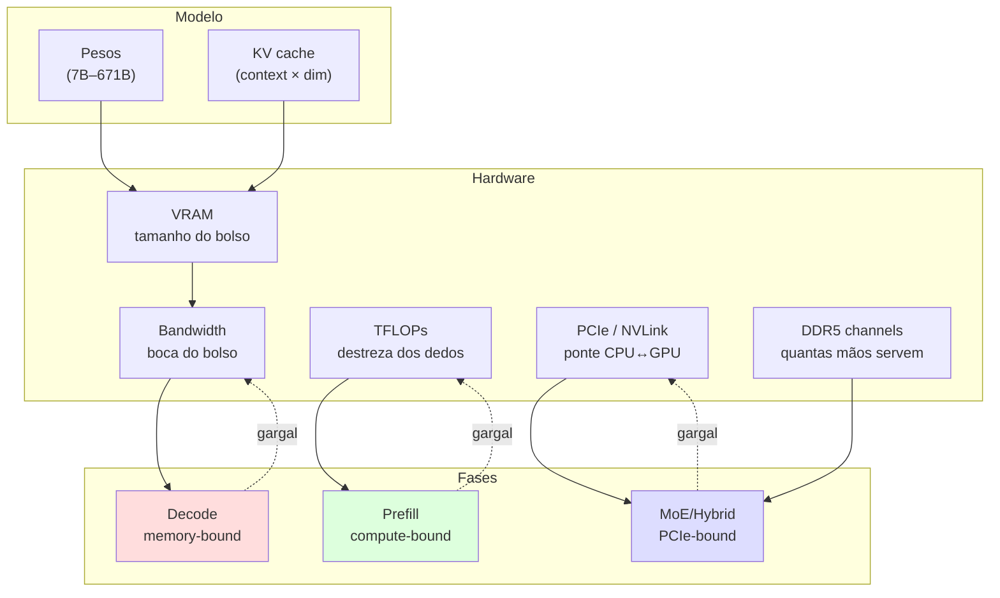
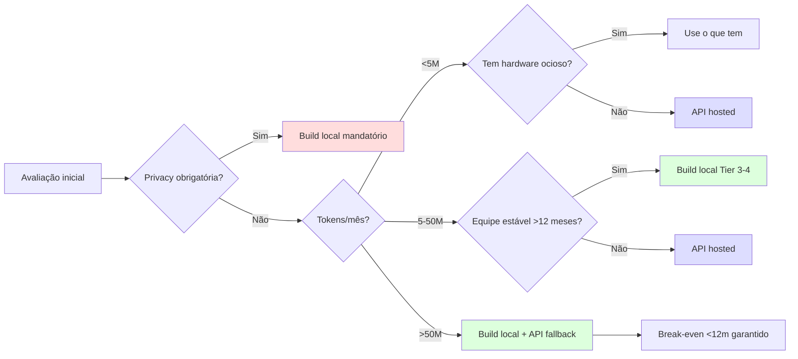

# Post 4 — Hardware builds para inferência local (R$ 5k a R$ 200k+): do Civic ao DGX

> Sub-série **Inferência local**, post 4. Aqui paramos de falar de software (llama.cpp, MLX, Ollama) e começamos a falar de **ferro**: que máquina comprar, como montar, quanto gasta de luz, quanto faz de tok/s e quando vale a pena trocar tudo por uma assinatura de API.
>
> Posicionamento: este é o post que você manda para o amigo que pergunta "tô pensando em montar uma máquina pra rodar LLM local, o que compro?". Ele cobre do **estudante de R$ 5k** até o **CTO de startup com R$ 250k+** comprando 4× H100 usadas.
>
> Pré-requisitos: Post 10 da série principal ([hardware H100/H200/B100/B200/MI300X/TPU/Apple/Groq](../10-hardware-h100-h200-b100-b200-mi300x-tpu-apple-groq.md)), Post 1 da sub-série (build llama.cpp), Post 2 (MLX no Mac), Post 3 (Ollama/LM Studio/Open WebUI).

---

## Sumário

1. [Por que pensar hardware antes de modelo](#1-por-que-pensar-hardware-antes-de-modelo)
2. [Recap da física: BW, TFLOPs, VRAM, KV](#2-recap-da-física-bw-tflops-vram-kv)
3. [Tier dos orçamentos: hierarquia das máquinas](#3-tier-dos-orçamentos-hierarquia-das-máquinas)
4. [Build A — Estudante feliz (R$ 5–8k)](#4-build-a--estudante-feliz-r-58k)
5. [Build B — Hobbyist sério com RTX 3090 (R$ 12–18k)](#5-build-b--hobbyist-sério-com-rtx-3090-r-1218k)
6. [Build C — Mac Mini M4 Pro 64GB (R$ 18–22k)](#6-build-c--mac-mini-m4-pro-64gb-r-1822k)
7. [Build D — Power user PC com RTX 5090 (R$ 30–45k)](#7-build-d--power-user-pc-com-rtx-5090-r-3045k)
8. [Build E — Mac Studio M3 Ultra 192–256GB (R$ 50–80k)](#8-build-e--mac-studio-m3-ultra-192256gb-r-5080k)
9. [Build F — 2× RTX 5090 para vLLM (R$ 70–90k)](#9-build-f--2-rtx-5090-para-vllm-r-7090k)
10. [Build G — RTX Pro 6000 Blackwell 96GB (R$ 80–120k)](#10-build-g--rtx-pro-6000-blackwell-96gb-r-80120k)
11. [Build H — Empresa pequena: 4× H100 80GB usado (R$ 250–400k)](#11-build-h--empresa-pequena-4-h100-80gb-usado-r-250400k)
12. [Build retro — Tesla P40 (R$ 4–8k, MoE-friendly)](#12-build-retro--tesla-p40-r-48k-moe-friendly)
13. [CPU-only: Threadripper 12-channel para Kimi K2 e V3](#13-cpu-only-threadripper-12-channel-para-kimi-k2-e-v3)
14. [Tabela master: build × modelos × tok/s × custo](#14-tabela-master-build--modelos--toks--custo)
15. [PSU, cooling, gabinete: a parte que ninguém posta no Reddit](#15-psu-cooling-gabinete-a-parte-que-ninguém-posta-no-reddit)
16. [Networking: do WiFi de casa ao 25GbE](#16-networking-do-wifi-de-casa-ao-25gbe)
17. [Storage strategy: onde guardar 500GB de modelos](#17-storage-strategy-onde-guardar-500gb-de-modelos)
18. [Energia e clima — realidade brasileira](#18-energia-e-clima--realidade-brasileira)
19. [Ruído (decibéis): de Mac silencioso a turbina A330](#19-ruído-decibéis-de-mac-silencioso-a-turbina-a330)
20. [Workflow ponta-a-ponta: comprar, montar, ligar](#20-workflow-ponta-a-ponta-comprar-montar-ligar)
21. [Software baseline (link sub-série)](#21-software-baseline-link-sub-série)
22. [Manutenção e longevidade](#22-manutenção-e-longevidade)
23. [ROI vs API hosted: a decisão financeira](#23-roi-vs-api-hosted-a-decisão-financeira)
24. [Tendências 2025–2026](#24-tendências-20252026)
25. [Cross-references](#25-cross-references)
26. [Referências](#26-referências)

---

## 1. Por que pensar hardware antes de modelo

A maioria das pessoas faz na ordem errada. Olha a tabela do Hugging Face, decide "quero rodar Qwen3 235B", e só depois descobre que **o modelo nem cabe** na máquina. Aí parte para quantização agressiva e fica reclamando que a saída ficou ruim.

Antes de escolher modelo, escolha **envelope físico**:

- **VRAM** (GB) → define o **teto de modelo nativo** que cabe sem swap. 24GB de VRAM é o teto efetivo de um 32B em Q4. 96GB cabe um 120B em Q4.
- **Bandwidth (BW, GB/s)** → define **decode tok/s**. Decode lê todos os pesos a cada token. RTX 3090 ≈ 936 GB/s; RTX 5090 ≈ 1792 GB/s; Mac M3 Ultra ≈ 819 GB/s; H100 SXM ≈ 3350 GB/s.
- **Compute (TFLOPs FP16/BF16)** → define **prefill tok/s** e batch grande. RTX 3090 ≈ 71 TFLOPs FP16; RTX 5090 ≈ 209 TFLOPs FP16; H100 SXM ≈ 989 TFLOPs FP16.
- **PCIe 4/5** → define **MoE offload viável**. PCIe 5.0 x16 ≈ 64 GB/s (uni). Se você vai ficar trocando experts entre RAM e VRAM toda hora, PCIe é o pescoço-de-garrafa.
- **DDR5 channels** → define **viabilidade CPU offload**. 2 canais (consumer) ≈ 90 GB/s reais. 8 canais (Threadripper PRO) ≈ 360 GB/s. 12 canais (TR PRO 9000) ≈ 540 GB/s.

### Diagrama: bottlenecks da inferência local



**Tradução em uma linha:** quem decide se o modelo cabe é **VRAM**; quem decide a velocidade do chat é **BW**; quem decide a velocidade de processar contexto longo é **TFLOPs**; quem decide se MoE offload sobrevive é **PCIe + DDR**.

---

## 2. Recap da física: BW, TFLOPs, VRAM, KV

Detalhado em [Post 10](../10-hardware-h100-h200-b100-b200-mi300x-tpu-apple-groq.md). Resumo amostral:

| Conceito | Fórmula intuitiva | Implicação prática |
|---|---|---|
| Decode tok/s (single batch) | `≈ BW / tamanho_pesos_ativos` | RTX 5090 com Llama 70B Q4 (35GB) ≈ 1792/35 ≈ 50 tok/s teórico (real ~30–40) |
| Prefill tok/s | `≈ TFLOPs / (params × 2)` | H100 + Llama 70B BF16 ≈ 989e12 / (70e9 × 2) = ~7000 tok/s |
| KV cache (FP16) | `2 × layers × hidden × ctx × batch × bytes` | Llama 70B, 32k ctx, batch 1 ≈ ~10 GB extra |
| MoE ativo | `params_ativos × tok` no BW (não params totais) | Qwen3 235B-A22B: BW custa só ~22B params por token decode |

**Heurística do guardanapo:** VRAM precisa ≈ `params × bytes_por_param + KV`. Em Q4 (4 bits ≈ 0.5 byte), Llama 70B ≈ 70e9 × 0.5 = 35 GB, mais ~5–10 GB de KV → **~40–45 GB**, perto demais de 1× RTX 5090 32GB (não cabe sem offload).

---

## 3. Tier dos orçamentos: hierarquia das máquinas

| Tier | Apelido | Faixa R$ | Hardware típico | Modelo "topo" servível |
|---|---|---|---|---|
| 0 | Free / Estudante | R$ 0 (já tem) | Laptop M-series ou gaming PC | 7B–13B Q4 |
| 1 | Hobbyist | R$ 5–15k | Gaming PC RTX 3060/4070 ou Mac Mini M4 Pro | 14B Q4 |
| 2 | Power user | R$ 15–40k | RTX 3090/4080/5090 ou Mac Studio M3 Ultra base | 32B Q4–Q8 |
| 3 | Pro / startup | R$ 40–150k | 2× 4090/5090 ou RTX Pro 6000 Blackwell ou Mac Studio M3 Ultra 256GB | 70B FP8, 120B Q4, 235B MoE Q4 |
| 4 | Empresa séria | R$ 150–600k | 1–4× H100/H200, 1× MI300X, NVIDIA Spark | 235B FP8, V3 671B Q4, Kimi K2 1T offload |
| 5 | Lab / cluster | R$ 600k+ | 8× H200, 2× MI300X, DGX H100/B200 | Qualquer coisa em produção |

**Modelos comuns por tier (rough):**

| Tier | Qwen3 8B | Qwen3 32B | Llama 3.3 70B | Qwen3 235B MoE | DeepSeek V3 671B | Kimi K2 1T |
|---|---|---|---|---|---|---|
| 0 | Q4 ok | swap | ❌ | ❌ | ❌ | ❌ |
| 1 | Q8 ok | Q4 lento | ❌ | ❌ | ❌ | ❌ |
| 2 | FP16 | Q4–Q8 | Q4 (Mac/3090) | ❌ | ❌ | ❌ |
| 3 | FP16 | FP8 vLLM | FP8 vLLM | Q4 (Mac/Pro 6000) | offload | offload |
| 4 | FP16 | FP16 | FP8/FP16 | FP8 | Q4 nativo | Q3 nativo |
| 5 | qualquer | qualquer | qualquer | qualquer | qualquer | qualquer |

---

## 4. Build A — "Estudante feliz" (R$ 5–8k)

> **Analogia:** Civic 2010 com motor revisado. Não vai ganhar corrida, mas anda no trânsito todo dia sem reclamar.

### Componentes

| Componente | Modelo | Preço (BR, ~2026) |
|---|---|---|
| CPU | Ryzen 5 7600 (6c/12t, AM5) | R$ 1.100 |
| Cooler | DeepCool AK400 | R$ 200 |
| MoBo | B650M-A AsRock/Gigabyte | R$ 900 |
| RAM | 32GB DDR5 5600 (2×16) Kingston Fury | R$ 700 |
| GPU | **RTX 3060 12GB** usada (ou RTX 4070 12GB se o orçamento subir) | R$ 1.200–2.500 |
| SSD | 1TB NVMe Gen4 (KingSpec/Kingston NV2) | R$ 350 |
| PSU | 650W 80+ Bronze Corsair CX650 | R$ 400 |
| Gabinete | Lian Li Lancool 205 / NZXT H510 budget | R$ 350 |
| **Total** | | **R$ 5.200–6.500** |

### Modelos servíveis

- **Qwen3 8B Q4** (~5GB) → 40–55 tok/s decode
- **Qwen3 14B Q4** (~9GB) → 22–30 tok/s
- **Gemma3 12B Q4** (~7GB) → 25–35 tok/s
- **DeepSeek-R1-Distill-Qwen 14B Q4** → 18–25 tok/s
- Llama 3.1 8B FP16 (~16GB) → não cabe na 3060 12GB, precisa Q8 (~9GB) → 30–40 tok/s

### Trade-offs

- Não tem espaço pra contexto >8k em 14B Q4 sem swap.
- Prompt processing modesto (~500–1500 tok/s prefill).
- Não roda 32B nativo (pesos comprimidos passam de 18GB Q4 e KV come o resto).
- **Vantagem:** entra como upgrade gradual. Trocar a 3060 por uma 3090 usada um ano depois te leva direto para o Build B.

---

## 5. Build B — "Hobbyist sério" com RTX 3090 (R$ 12–18k)

> **Analogia:** RTX 3090 usada é o **Civic 2010 turbo**: parece velho, ninguém posta foto no Instagram, mas é o melhor custo/VRAM do mercado em 2026.

Confirmado pela pesquisa: a 3090 usada gira em **US$ 600–850 (~R$ 3.500–5.500)** com 24GB de VRAM e ~936 GB/s de BW. Isso dá **~R$ 30/GB de VRAM**, contra ~R$ 145/GB de uma 5090 nova.

### Componentes

| Componente | Modelo | Preço (BR) |
|---|---|---|
| CPU | Ryzen 7 7700X (8c/16t) | R$ 1.700 |
| Cooler | AIO 240mm Lian Li Galahad | R$ 700 |
| MoBo | X670 ATX (MSI Pro X670-P) | R$ 1.700 |
| RAM | 64GB DDR5 6000 CL30 (2×32) G.Skill Flare X5 | R$ 1.500 |
| GPU | **RTX 3090 24GB usada** (ou RTX 4080 Super 16GB nova) | R$ 4.500 |
| SSD | 2TB NVMe Gen4 (WD SN850X / Samsung 990 Pro) | R$ 900 |
| PSU | 1000W 80+ Gold Corsair RM1000x ATX 3.0 | R$ 1.300 |
| Gabinete | Fractal Meshify 2 / Lian Li Lancool 216 | R$ 800 |
| **Total** | | **R$ 13.100** (com 3090 usada) |

### Modelos servíveis (RTX 3090 24GB)

| Modelo | Quant | VRAM | Decode tok/s |
|---|---|---|---|
| Qwen3 8B | FP16 | 16GB | 70–90 |
| Qwen3 32B | Q4_K_M | 19GB | 28–38 |
| Gemma3 27B | Q5 | 22GB | 24–32 |
| DeepSeek-R1-Distill-Qwen 32B | Q4 | 20GB | 25–32 |
| Llama 3.1 70B | Q3_K_S | 28GB | swap → 4–6 (não vale) |

### Por que RTX 3090 usada continua rei

- **24GB de VRAM** é o sweet spot para 32B Q4 com contexto razoável (16k–32k).
- **NVLink** funciona em pares (2× 3090 = 48GB com NVLink 112 GB/s).
- Mercado secundário ainda saudável (entusiastas trocando por 5090).
- ROCm e CUDA maduros (Pascal/Volta/Ampere bem suportados).
- **Caveat:** 350W TDP, esquenta, faz barulho. Vai precisar de boa ventilação no gabinete.

---

## 6. Build C — Mac Mini M4 Pro 64GB (R$ 18–22k)

> **Analogia:** carro elétrico compacto premium. Silencioso, eficiente, pequeno, e o "porta-malas" (RAM) é grande pelo tamanho da carroceria.

Mac Mini M4 Pro com 64GB unified memory e SSD 1TB sai por aproximadamente R$ 22.000 na Apple BR (R$ 18k em câmbio favorável + alguma promo na Apple US importando). 12-core CPU, 16-core GPU, **273 GB/s** de bandwidth.

### Componentes

Não tem componente. É uma caixa fechada. Você compra, abre, liga, instala MLX e Ollama. Pronto.

### Modelos servíveis (M4 Pro 64GB, 273 GB/s)

| Modelo | Backend | VRAM/Unified | Decode tok/s |
|---|---|---|---|
| Qwen3 32B | mlx-lm Q4 | ~19GB | 18–24 |
| Gemma3 27B | mlx Q5 | ~21GB | 16–22 |
| DeepSeek-R1-Distill-Qwen 32B | Ollama Q4 | ~20GB | 16–22 |
| Llama 3.3 70B | mlx Q4 | ~40GB | 8–11 |
| Qwen3 235B-A22B MoE | mlx Q3 | ~52GB | 12–18 (MoE ajuda) |

### M4 Pro vs RTX 3090

| Métrica | RTX 3090 24GB | Mac Mini M4 Pro 64GB |
|---|---|---|
| BW | 936 GB/s | 273 GB/s |
| VRAM efetiva | 24 GB | ~52 GB usável |
| Modelo grande nativo | 32B Q4 | 70B Q4 |
| Decode 32B Q4 | 30 tok/s | 20 tok/s |
| Idle | 50W | ~10W |
| Load | 350W (GPU) | ~50W |
| Ruído | 40–50 dB | <25 dB |
| Footprint | Torre | 12×12×5 cm |
| Preço Brasil (2026) | R$ 13k (3090 usada) | R$ 22k (Mac novo) |

**Decisão:** se você quer **quantidade de VRAM** (rodar 70B nativo) e ambiente silencioso, M4 Pro 64GB ganha. Se você quer **velocidade de decode** em 32B e custo menor, RTX 3090 ganha.

---

## 7. Build D — "Power user PC" com RTX 5090 (R$ 30–45k)

> **Analogia:** Porsche 911 GTS. Acelera muito, gasta combustível, e você vai ouvir os vizinhos reclamando do barulho.

A RTX 5090 nova fica em US$ 2.000–4.000 (~R$ 11k–22k em BR considerando dólar e impostos), com 32GB GDDR7 e ~1792 GB/s. **3.1× mais rápida que a 3090** em Llama 3.1 8B inferência.

### Componentes

| Componente | Modelo | Preço (BR) |
|---|---|---|
| CPU | Ryzen 9 7950X3D (16c/32t) ou Threadripper PRO 7965WX (24c) | R$ 5.500 / R$ 18.000 |
| Cooler | AIO 360mm (NZXT Kraken Elite 360) | R$ 1.400 |
| MoBo | X670E Hero / WRX90 (TR PRO) | R$ 4.500 / R$ 12.000 |
| RAM | 128GB DDR5 6000 (4×32) ou 256GB DDR5 5600 ECC RDIMM (TR PRO) | R$ 3.500 / R$ 14.000 |
| GPU | RTX 5090 32GB FE/AIB | R$ 18.000–25.000 |
| SSD | 4TB NVMe Gen5 (Crucial T705 / Samsung 9100 Pro) | R$ 2.800 |
| PSU | 1500W 80+ Platinum ATX 3.0 (Corsair AX1500i) | R$ 3.500 |
| Gabinete | Phanteks Enthoo Pro 2 Server / Fractal Meshify 2 XL | R$ 1.500 |
| **Total Ryzen** | | **~R$ 40.000** |
| **Total TR PRO** | | **~R$ 80.000** |

### Modelos servíveis (RTX 5090 32GB)

| Modelo | Quant | Backend | VRAM | Decode tok/s |
|---|---|---|---|---|
| Qwen3 32B | FP8 | vLLM | ~32GB ✓ | 80–110 |
| DeepSeek-R1-Distill-Qwen 32B | FP8 | vLLM | ~32GB | 75–100 |
| Llama 3.3 70B | Q4_K_M | llama.cpp | swap (~40GB) | 6–10 (CPU offload) |
| Llama 4 Scout 109B MoE | Q4 | llama.cpp `--n-cpu-moe` | 32GB+RAM | 18–30 (MoE ajuda) |
| Kimi K2 / V3 | Q4 com offload | ik_llama.cpp | 32GB+128GB RAM | 4–8 |

**Tip:** com `--n-cpu-moe N` no llama.cpp, você manda os experts (que rodam pouco) para a CPU e mantém shared layers na GPU. Para Kimi K2 / V3, é a única forma viável sem 96GB+ de VRAM.

---

## 8. Build E — Mac Studio M3 Ultra 192–256GB (R$ 50–80k)

> **Analogia:** Tesla Model S Plaid com porta-malas absurdo. Não acelera tão bruto quanto a 5090, mas leva uma família inteira (de pesos) sem reclamar.

Confirmado: M4 Ultra **ainda não existe** em 2026 (M4 Max teto 128GB). O Mac Studio top é **M3 Ultra 256GB**, com 819 GB/s de bandwidth, 60–80 core GPU.

### Spec

| Item | Valor |
|---|---|
| Chip | M3 Ultra |
| GPU cores | 60 (base) ou 80 (top) |
| Memória unified | 96 / 192 / 256 / 512 GB |
| Memory BW | 819 GB/s |
| Preço Apple BR (256GB) | R$ 75.000–85.000 |
| Idle | ~30W |
| Load | ~150–250W |

### Modelos servíveis (M3 Ultra 256GB, MLX/llama.cpp)

| Modelo | Quant | Backend | Memória | Decode tok/s |
|---|---|---|---|---|
| Qwen3 32B | 8-bit MLX | mlx-lm | ~33GB | 38 (top via MLX) |
| Devstral Small 24B | 8-bit MLX | mlx-lm | ~25GB | 47 |
| Gemma 3 27B | Q4 | llama.cpp | ~17GB | 33–41 |
| Llama 3.3 70B | Q4 K_M | llama.cpp GPU | ~42GB | 12–18 |
| Qwen3 235B-A22B | FP8 | mlx | ~250GB | 25–35 |
| Qwen3 235B-A22B | Q3 | llama.cpp | ~110GB | 19 |
| DeepSeek V3 671B | Q4 | llama.cpp | ~380GB | 5–8 (com offload) |
| Kimi K2 1T | Q3 | llama.cpp | ~450GB | swap, marginal |

**Por que Mac Ultra é único no mercado:** ele é a **única forma legal e disponível** de ter 192–256 GB de "VRAM" em uma única caixa por menos de R$ 100k. Comparativo: 256GB de VRAM em GPU dedicada exigiria 4× RTX Pro 6000 Blackwell (~R$ 200k só de GPU) ou 3× H100 80GB (~R$ 300k+).

**Trade-off:** prefill é lento (faltam tensor cores potentes para batch grande). Para chat single-user com contexto até 32k, é ouro. Para serving multi-user, vLLM em 5090 ganha em latência.

---

## 9. Build F — 2× RTX 5090 para vLLM (R$ 70–90k)

> **Analogia:** dois Porsche em paralelo. Você gasta o dobro em combustível, mas pode levar 8 pessoas (continuous batching) ao invés de 4.

### Componentes

| Componente | Modelo | Preço |
|---|---|---|
| CPU | Threadripper PRO 7965WX (24c) | R$ 18.000 |
| MoBo | ASUS Pro WS WRX90E-Sage (7× PCIe 5.0 x16) | R$ 14.000 |
| RAM | 256GB DDR5 5600 ECC RDIMM (8× 32GB) | R$ 14.000 |
| GPU | 2× RTX 5090 32GB | R$ 36.000–50.000 |
| PSU | 2000W 80+ Titanium (Super Flower Leadex Titanium 2000W) | R$ 5.500 |
| SSD | 4TB NVMe Gen5 + 8TB NVMe Gen4 (modelos) | R$ 5.000 |
| Cooler | TR PRO custom + dual GPU air gap | R$ 1.800 |
| Gabinete | Phanteks Enthoo Pro 2 Server | R$ 2.000 |
| **Total** | | **~R$ 96.000** |

### Caveat: NVLink ausente nas RTX 5090

A NVIDIA **não pôs NVLink na RTX 5090**. Tensor parallelism (TP=2) acontece via PCIe 5.0 x16 (~64 GB/s uni). Para Llama 70B FP8 com vLLM, o impacto é **5–15% menor throughput** vs setup com NVLink (4090 não tem; 3090 tem). Ainda assim, viável.

### Modelos servíveis (TP=2, 64GB efetivo)

| Modelo | Quant | Backend | tok/s (single) | tok/s (batch 8) |
|---|---|---|---|---|
| Qwen3 70B | FP8 | vLLM TP=2 | 55–70 | ~280 |
| Llama 3.3 70B | FP8 | vLLM TP=2 | 50–65 | ~250 |
| DeepSeek-R1-Distill-Llama 70B | FP8 | vLLM TP=2 | 50–65 | ~250 |
| Qwen3 235B-A22B | Q4 + offload | llama.cpp | 12–20 | n/a |
| Llama 4 Scout 109B | FP8 + offload | vLLM | 25–40 | ~100 |

**Use case:** equipe de 5–15 devs usando o mesmo endpoint (continuous batching salva). Para single-user, RTX Pro 6000 Blackwell ganha (próximo build).

---

## 10. Build G — RTX Pro 6000 Blackwell 96GB (R$ 80–120k)

> **Analogia:** Jaguar XJR sedã. Não tão expressivo quanto o Porsche dobrado, mas leva 7 passageiros confortavelmente em uma única máquina.

Confirmado pela pesquisa: **RTX Pro 6000 Blackwell Workstation Edition** com **96GB GDDR7**, **1790 GB/s** de bandwidth, 600W TDP, ~US$ 8.800 (~R$ 50.000 no BR considerando importação).

### Componentes

| Componente | Modelo | Preço |
|---|---|---|
| CPU | Threadripper PRO 7965WX | R$ 18.000 |
| MoBo | ASUS Pro WS WRX90E-Sage | R$ 14.000 |
| RAM | 128GB DDR5 5600 ECC | R$ 7.500 |
| GPU | RTX Pro 6000 Blackwell 96GB | R$ 50.000 |
| PSU | 1600W 80+ Platinum | R$ 4.000 |
| SSD | 4TB NVMe Gen5 | R$ 2.800 |
| Cooler + gabinete + acessórios | | R$ 4.000 |
| **Total** | | **~R$ 100.000** |

### Modelos servíveis (96GB single GPU)

| Modelo | Quant | Decode tok/s |
|---|---|---|
| Qwen3 70B | FP16 | 95–115 |
| Qwen3 70B | FP8 | 130–160 |
| Llama 3.3 70B | FP16 | 100–115 |
| gpt-oss 120B (MXFP4) | nativo | ~99 @ 128k ctx |
| Qwen3 235B-A22B | FP8 | 35–55 |
| Llama 4 Scout 109B | FP8 | 60–85 |
| Mistral Large 123B | Q4_K | ~10 @ 64k ctx (limited by ctx, não pesos) |

**Vantagem grande:** 1 GPU = sem TP, sem PCIe overhead, sem vLLM com flag de TP. Você roda **modelo nativo** em **uma única caixa**. Para empresa pequena que quer um endpoint único robusto, esse é o sweet spot 2026.

**Caveat:** placa única com 600W TDP exige PSU 1500W+ e cooling sério (chassis com airflow frontal directo).

---

## 11. Build H — Empresa pequena: 4× H100 80GB usado (R$ 250–400k)

> **Analogia:** frota corporativa de SUVs blindados. Caro de comprar, caro de manter, mas é o único veículo aceito na portaria do prédio importante.

### Cenário

Mercado secundário de H100 está abrindo em 2026 (clouds atualizando para H200/B200). H100 SXM 80GB usada gira em US$ 18–25k (~R$ 100–140k). 4 GPUs = ~R$ 500k de GPU + chassi.

### Componentes (chassi server)

| Componente | Modelo | Preço (USD/BR) |
|---|---|---|
| Chassi 4U GPU server | SuperMicro AS-4125GS-TNRT (PCIe Gen5 GPU sled) | US$ 8.000 / R$ 45k |
| CPUs | 2× EPYC 9354 (32c) | R$ 50k |
| RAM | 768GB DDR5 ECC RDIMM (12 channel × 2 sockets) | R$ 80k |
| GPUs | 4× H100 SXM 80GB usadas | R$ 500k |
| Storage | 8TB NVMe Gen5 + 32TB SATA backup | R$ 25k |
| Network | Mellanox 100GbE NIC | R$ 8k |
| PDU + UPS | APC SmartUPS 5kVA + PDU | R$ 18k |
| **Total** | | **~R$ 700k** |

(Alternativa mais barata: DGX A100 320GB usada por ~US$ 80k = R$ 450k.)

### Modelos servíveis (4× H100 80GB = 320GB efetivo)

| Modelo | Quant | Backend | tok/s (single) | tok/s (batch 32) |
|---|---|---|---|---|
| Qwen3 235B-A22B | FP8 | vLLM TP=4 | 75–110 | ~3500 |
| Llama 3.1 405B | FP8 | vLLM TP=4 | 30–45 | ~1200 |
| DeepSeek V3 671B | FP8 | vLLM TP=4 | 25–40 | ~900 |
| DeepSeek V3 671B | Q4 + offload | llama.cpp | 18–30 | n/a |
| Kimi K2 1T | Q4 + offload | SGLang/llama.cpp | 8–15 | n/a |

**Operação:** Ubuntu 24.04, NVIDIA driver 575+, CUDA 12.6+, vLLM 0.7+, SGLang em produção. Network 100GbE para servir API interno; PDU com monitoramento; UPS para 5–10 min de graceful shutdown.

---

## 12. Build retro — Tesla P40 (R$ 4–8k, MoE-friendly)

> **Analogia:** comprar 4 Fuscas 1980 ao invés de 1 Civic 2020. Cabe muita gente no estacionamento, mas só anda na velocidade da rua.

Confirmado: P40 24GB usada por **US$ 150–250 (~R$ 1.000–1.500)** cada. 12 TFLOPs FP32, 250W, **sem tensor cores**, **sem FP16/BF16 nativo** (emula em FP32, ~21% mais lento).

### Build "8× P40 Frankenstein"

| Componente | Modelo | Preço |
|---|---|---|
| Server velho | HP ProLiant DL580 G9 / Dell R730 (4U) | R$ 4.000 (mercado livre) |
| GPUs | 8× P40 24GB usadas | R$ 8.000–12.000 |
| Adapters PCIe + cooling shroud | NF-A4x20 fan + 3D print bracket | R$ 600 |
| PSU upgrade (server geralmente já tem 1600W+) | redundante | included |
| **Total** | | **~R$ 12.000–17.000** |

### Modelos servíveis

- 192GB VRAM total (8× 24GB), mas **sem FP8/INT8** e **com KV cache caro**.
- llama.cpp Vulkan/CUDA: Qwen3 235B-A22B Q4 MoE → 12–18 tok/s decode (MoE economiza FP32 emulation).
- DeepSeek V3 671B Q4 → ~5 tok/s (offload).
- Mistral 7B Q4 → ~45 tok/s (single P40).

**Caveats sérios:**
- Driver Pascal continua suportado, mas vai sumir cedo ou tarde (NVIDIA já parou de testar Pascal em CUDA 13).
- Server faz barulho de turbina (60–70 dB).
- Consome 250W × 8 = 2kW só de GPU.
- **Cult niche para hobbyist com tempo livre.** Não recomendo para iniciante.

---

## 13. CPU-only: Threadripper 12-channel para Kimi K2 e V3

> **Analogia:** restaurante self-service com 12 funcionários. Lento, mas serve qualquer cardápio (até trilhão de parâmetros).

Confirmado pela pesquisa AMD: **Threadripper PRO 9995WX (96c) com quad-channel** sofre por contention. **Octal-channel** vira o jogo. Já o **TRX50** consumer fica em quad. Para LLM, queremos **WRX90 + 8/12 canais**.

### Build

| Componente | Modelo | Preço |
|---|---|---|
| CPU | Threadripper PRO 7995WX (96c, base) ou 9995WX (96c, refresh) | R$ 90.000 |
| MoBo | ASUS Pro WS WRX90E-Sage (8 canais) | R$ 14.000 |
| RAM | 1.5TB DDR5 ECC RDIMM (12× 128GB) | R$ 90.000 |
| SSD | 8TB NVMe Gen5 | R$ 6.000 |
| PSU | 1600W Platinum | R$ 4.000 |
| Cooler + gabinete | TR PRO chiller custom | R$ 5.000 |
| **Total** | | **~R$ 210.000** |

### Performance (CPU-only, llama.cpp / ik_llama.cpp)

| Modelo | Quant | Decode tok/s | Prefill tok/s |
|---|---|---|---|
| DeepSeek V3 671B | Q4_K_M | 5–12 | 60–120 |
| Kimi K2 1T | Q3_K_M | 3–7 | 35–70 |
| Qwen3 235B-A22B MoE | Q4 | 12–25 | 250–400 |
| Llama 3.1 405B | Q4 | 2–5 | 25–55 |

**Vantagem:** roda **qualquer modelo** open. Único limitante é RAM. **Desvantagem:** prefill 30–50× mais lento que GPU; batch limitado; latência alta.

**Cluster trick (AMD Ryzen AI Max+ 395):** comprovado pela pesquisa, 4 nós de Ryzen AI Max+ 395 com 128GB/cada rodam Kimi K2.5 1T via **llama.cpp RPC** distribuído. Custo: ~R$ 80k total. Dá ~7–12 tok/s de decode. **Cult, mas funciona.**

---

## 14. Tabela master: build × modelos × tok/s × custo

Tabela mestre consolidada (decode tok/s, single batch). Valores ~2026, MLX/vLLM/llama.cpp última estável.

| Build | Custo R$ | Watts pico | Qwen3 8B | Qwen3 32B Q4 | Llama 70B Q4 | Qwen3 235B MoE | DeepSeek V3 671B |
|---|---|---|---|---|---|---|---|
| A — Estudante (3060 12GB) | 6.000 | 400 | 45 | swap (5) | ❌ | ❌ | ❌ |
| B — 3090 24GB | 13.000 | 700 | 80 | 32 | 5 (offload) | ❌ | ❌ |
| C — Mac Mini M4 Pro 64GB | 22.000 | 200 | 60 | 22 | 10 | 14 (Q3) | ❌ |
| D — RTX 5090 32GB | 40.000 | 1.000 | 130 | 95 (FP8) | 8 (offload) | 25 (offload) | 4 (offload) |
| E — Mac Studio M3 Ultra 256GB | 80.000 | 350 | 95 | 38 (MLX 8-bit) | 15 | 30 (FP8 MLX) | 6 (Q4) |
| F — 2× RTX 5090 (TP=2) | 96.000 | 1.500 | 220 (batch) | 110 | 60 (FP8) | 40 (FP8 + offload) | 8 (offload) |
| G — RTX Pro 6000 96GB | 100.000 | 1.000 | 200 | 130 (FP8) | 145 (FP16) | 50 (FP8) | 12 (Q4 + offload) |
| H — 4× H100 80GB | 700.000 | 4.000 | 350 (batch) | 280 (FP8) | 180 (FP8) | 110 (FP8) | 38 (FP8) |
| Retro — 8× P40 | 15.000 | 2.500 | 50 | 18 | 8 (Q4) | 14 (MoE Q4) | 5 (offload) |
| CPU TR PRO 12ch | 210.000 | 800 | n/a (CPU) | n/a | 4 | 18 | 9 |

---

## 15. PSU, cooling, gabinete: a parte que ninguém posta no Reddit

### PSU

- **80+ Gold mínimo**, Platinum/Titanium para builds top.
- **ATX 3.0/3.1** obrigatório para RTX 5090 (12V-2x6 nativo, sem adaptador). Cabos sólidos, sem dobrar muito (incêndio do conector 12VHPWR já ferrou muita gente).
- **Headroom 30–40%**: build de 1.000W de pico → PSU 1500W. Eficiência cai abaixo de 20% e acima de 80%.
- **Marcas confiáveis:** Corsair (RM/HX/AX), Seasonic (Prime/Vertex), be quiet! (Dark Power Pro), Super Flower (Leadex Titanium para servers).

### Cooling

- **CPU:** AIO 360mm para CPUs >150W TDP (7950X3D, TR PRO). Air cooler torre (Noctua NH-D15, Thermalright Phantom Spirit) para Ryzen 7600/7700.
- **GPU:** triple-fan AIB (TUF, ROG, Noctua edition) para silêncio. **Blower** (turbo) só em chassis multi-GPU server-style.
- **Gabinete airflow:** front intake mesh + top/rear exhaust. **Filtros** em todos os intakes (poeira no Brasil é problema real).
- **Pasta térmica:** Kryonaut/PTM7950. Reaplicar a cada 18–24 meses em GPU sob carga.

### Gabinete

| Use case | Recomendação | Por quê |
|---|---|---|
| Single GPU consumer | Fractal Meshify 2 / Lian Li Lancool 216 | Airflow excelente, preço justo |
| Single GPU silent | be quiet! Pure Base 500DX | Mais quieto, com mesh suficiente |
| 2× GPU + ATX | Phanteks Enthoo Pro 2 / Corsair 7000D | Espaço, PSU bottom isolado |
| Threadripper / EPYC server | Phanteks Enthoo Pro 2 Server / SuperMicro 4U | E-ATX/SSI-EEB suporte, baias para server PSU |
| Mac | n/a | Já vem fechado |

### Acoustics

- Mac Mini M4 Pro: <25 dB (subaudível em sala normal).
- PC bem feito 1× GPU: 35–45 dB load, 28–32 dB idle.
- 2× GPU server: 50–65 dB load (precisa **sala separada** com isolamento).
- 4× H100 server: 70+ dB ("isso aqui é avião decolando", você instala em rack/closet).

---

## 16. Networking: do WiFi de casa ao 25GbE

| Cenário | Rede | Justificativa |
|---|---|---|
| Estudante chat single-user | WiFi 6 / 1GbE | Modelo já está local, só serve UI |
| Hobbyist rodando Open WebUI no celular | WiFi 6E ou Mesh | Latência baixa, throughput basta |
| Power user puxando modelos do HF | 2.5GbE (MoBo moderna) | Modelo 70B Q4 ≈ 35GB, 1GbE = 5 min, 2.5GbE = 2 min |
| Empresa pequena multi-dev | 10GbE em workstations | Multi-user + transferência rápida de modelos |
| Server em prod | 25GbE / 100GbE | NCCL all-reduce em multi-node, RAG distribuído |

**Tip BR:** ASUS RT-AX86U / TP-Link AX73 já dão WiFi 6 decente. Para 10GbE, switch MikroTik CRS305-1G-4S+IN custa ~R$ 1.500.

---

## 17. Storage strategy: onde guardar 500GB de modelos

### Layout recomendado

| Slot | Disco | Uso |
|---|---|---|
| NVMe Gen5 #1 | 2–4 TB Samsung 9100/Crucial T705 | OS + cache HF ativo + projetos |
| NVMe Gen4 #2 | 4–8 TB WD Black SN850X | Modelos quentes (top 10 que você usa toda semana) |
| HDD interno | 8–20 TB Seagate Exos / WD Red Pro | Modelos arquivados (Llama 405B, V3 671B raw) |
| NAS / cloud cold | 20+ TB Synology / Glacier | Backup + raw datasets fine-tuning |

### Comandos úteis

```bash
# Tamanho do cache HF
du -sh ~/.cache/huggingface/hub

# Mover modelo específico para HDD secundário
mv ~/.cache/huggingface/hub/models--meta-llama--Llama-3.1-405B \
   /mnt/storage/models/

# Symlink para o cache HF continuar enxergando
ln -s /mnt/storage/models/models--meta-llama--Llama-3.1-405B \
      ~/.cache/huggingface/hub/models--meta-llama--Llama-3.1-405B

# Backup incremental para NAS
rsync -av --progress /mnt/storage/models/ nas:/volume1/llm-archive/
```

**Detalhe MUITO importante:** o cache HF (`~/.cache/huggingface/hub`) cresce **rápido**. Sem manutenção, atinge 500 GB–1 TB em 3 meses. Configure `HF_HOME` para apontar para o disco grande:

```bash
echo 'export HF_HOME=/mnt/storage/hf-cache' >> ~/.zshrc
```

---

## 18. Energia e clima — realidade brasileira

Custo médio kWh em 2026 (residencial SP/RJ): **R$ 0.85–1.05**. Bandeira vermelha estoura para R$ 1.20+.

### Consumo médio por build

| Build | Idle (W) | Inferência ativa (W) | 8h/dia inferência (kWh/mês) | R$/mês (R$ 0.95/kWh) |
|---|---|---|---|---|
| A — Estudante | 80 | 350 | 84 | R$ 80 |
| B — 3090 | 100 | 600 | 144 | R$ 137 |
| C — Mac Mini M4 Pro | 10 | 100 | 24 | R$ 23 |
| D — RTX 5090 | 80 | 900 | 216 | R$ 205 |
| E — Mac Studio M3 Ultra | 30 | 250 | 60 | R$ 57 |
| F — 2× RTX 5090 | 150 | 1.500 | 360 | R$ 342 |
| G — RTX Pro 6000 | 80 | 900 | 216 | R$ 205 |
| H — 4× H100 | 400 | 3.500 | 840 | R$ 798 |

**Diferença Mac vs PC:** o Mac M4 Pro consome **~10× menos** que um build com RTX 5090 idle. Para uso intermitente (dev solo), o Mac paga a conta de luz da diferença em 6–8 meses.

### Calor

- 1 kW de carga elétrica = **~3.412 BTU/h** dissipados como calor.
- Sala de 12 m² com build 1 kW de pico precisa de ~7.000 BTU/h de AC (split residencial 9k–12k BTU resolve).
- Build de 4 kW (server H100) precisa de ~14.000 BTU + ventilação contínua. Considere **ar condicionado dedicado** ou **rack em closet com extração**.

### UPS

- **Obrigatório** para servers (H100, Pro 6000, dual-GPU). Quedas momentâneas = corrupção de inferência ativa, no pior caso disco.
- Residencial: APC Back-UPS 1500VA (R$ 1.500) cobre até build D por 5–10 min.
- Server: APC SmartUPS 5kVA (R$ 18k) com bypass + bateria estendida.

---

## 19. Ruído (decibéis): de Mac silencioso a turbina A330

| Equipamento | dB típico (load) | Equivalente |
|---|---|---|
| Mac Mini M4 Pro | <25 dB | Sussurro em biblioteca |
| Mac Studio M3 Ultra | 28–32 dB | Refrigerador silencioso |
| PC custom 1× RTX 4090 (bom airflow) | 38–48 dB | Conversa normal a 3m |
| PC custom 2× RTX 5090 | 50–60 dB | Aspirador de pó |
| Server SuperMicro 4× H100 | 65–75 dB | Liquidificador / hidrojato |
| Tesla P40 server velho | 60–70 dB | Avião decolando ao longe |

**Regra prática residencial:** se você dorme no mesmo quarto/sala, fica até **35 dB**. Se está em escritório, até **45 dB** é tolerável. Acima de **50 dB**, vai morar em sala separada (ou closet com porta).

---

## 20. Workflow ponta-a-ponta: comprar, montar, ligar

### Decision tree (Mermaid)

```mermaid
flowchart TD
    Start[Quero rodar LLM local] --> Q1{Orçamento?}
    Q1 -->|R$ 0 (já tenho laptop)| Tier0[Use o que tem<br/>Ollama + 7B-13B]
    Q1 -->|R$ 5-15k| Q2{Prioridade?}
    Q1 -->|R$ 15-40k| Q3{Silêncio importante?}
    Q1 -->|R$ 40-150k| Q4{Multi-user ou single?}
    Q1 -->|R$ 150k+| Tier4[H100/H200 server<br/>vLLM/SGLang prod]
    Q2 -->|Velocidade| BuildB[Build B<br/>RTX 3090 24GB]
    Q2 -->|Silêncio + tamanho| BuildC[Build C<br/>Mac Mini M4 Pro 64GB]
    Q3 -->|Sim| BuildE[Build E<br/>Mac Studio M3 Ultra]
    Q3 -->|Não, quero brutal| BuildD[Build D<br/>RTX 5090 32GB]
    Q4 -->|Single user/dev solo| BuildG[Build G<br/>RTX Pro 6000 96GB]
    Q4 -->|Multi-user equipe| BuildF[Build F<br/>2x RTX 5090 vLLM]
    BuildD --> Soft[llama.cpp + vLLM<br/>Ollama opcional]
    BuildE --> SoftMLX[mlx-lm + Ollama<br/>Open WebUI]
    BuildF --> SoftvLLM[vLLM TP=2<br/>+ continuous batching]
    BuildG --> SoftvLLM2[vLLM single GPU<br/>+ Open WebUI]
    Tier4 --> SoftProd[SGLang/vLLM<br/>Triton + K8s]
    style BuildC fill:#dfd
    style BuildE fill:#dfd
    style BuildG fill:#fdd
    style Tier4 fill:#ddf
```

### Cookbook compra (Brasil 2026)

| Categoria | Onde comprar | Notas |
|---|---|---|
| GPU nova nacional | Pichau, Kabum, TerabyteShop | Garantia BR, frete OK, preço cheio |
| GPU usada | Mercado Livre, OLX, ClubeDoHardware fórum | Cuidado com mineração, peça nota e teste |
| GPU importada | eBay (US seller), Newegg via Mercado Envios, importador SP | IPI + ICMS + frete = ~80% sobre US$ |
| CPU/RAM/MoBo | Pichau, Kabum, Amazon BR | Preços comparáveis |
| Tesla P40 / H100 usadas | eBay US, parceiros LambdaLabs, Bizon | Logística complexa, contrato |
| Mac | Apple BR (parcelado), Apple US importando (com BR como destino), Amazon BR | Apple US ~30% mais barato mesmo com imposto |

### Ordem de montagem (cookbook)

1. **CPU** no soquete da MoBo (cuidado com pinos AM5/LGA1851).
2. **Pasta térmica** (gota de ervilha, *não* espalhar).
3. **Cooler CPU** parafusado uniformemente.
4. **RAM** nos slots A2/B2 (XMP/EXPO precisa dual-channel correto).
5. **SSD M.2** no slot Gen5/Gen4 mais próximo da CPU.
6. **MoBo no gabinete** (8–9 parafusos + standoffs).
7. **PSU** no gabinete.
8. **GPU** por último (peso e suporte de braço se for 4-slot 5090).
9. **Cabos PSU** (24-pin, 8-pin CPU, 12V-2x6 GPU).
10. **Front panel** (power, reset, LED, USB).
11. **Boot teste** com 1 stick RAM, sem GPU dedicada (iGPU se houver), depois adiciona.

### BIOS settings essenciais

```
Memory:
  XMP/EXPO: Enabled (DDR5 6000+ exige profile)
  Memory Context Restore: Disabled (acelera POST após XMP)

GPU:
  Re-Size BAR Support: Enabled
  Above 4G Decoding: Enabled

Boot:
  Secure Boot: Disabled (Linux dual-boot)
  Fast Boot: Disabled
  CSM: Disabled (UEFI puro)

Power:
  PCIe ASPM: Disabled (latência menor para vLLM)
  C-States: Enabled (idle eficiente)

Threadripper PRO específico:
  NPS (NUMA per Socket): NPS1 (uniforme) ou NPS4 (memory-bound LLM)
  IOMMU: Enabled (para GPU passthrough VFIO se quiser VM)
```

### Drivers + OS

```bash
# Ubuntu 24.04 LTS (server) - recomendado para 99% dos builds
sudo apt update && sudo apt install -y build-essential cmake git \
    python3.12 python3-pip pipx curl wget htop nvtop

# NVIDIA driver (575+ para Blackwell)
sudo apt install -y nvidia-driver-575 nvidia-utils-575
sudo reboot
nvidia-smi  # confirmar

# CUDA 12.x (para vLLM/llama.cpp build from source)
wget https://developer.download.nvidia.com/compute/cuda/12.8.0/local_installers/cuda_12.8.0_550.54.14_linux.run
sudo sh cuda_12.8.0_550.54.14_linux.run --toolkit --silent

# ROCm 6.x (para AMD MI300X / Radeon)
wget https://repo.radeon.com/amdgpu-install/6.2/ubuntu/jammy/amdgpu-install_6.2.60200-1_all.deb
sudo dpkg -i amdgpu-install*.deb
sudo amdgpu-install --usecase=hiplibsdk,rocm

# uv (gestor Python moderno)
curl -LsSf https://astral.sh/uv/install.sh | sh
```

```bash
# macOS — instalar Homebrew + MLX
/bin/bash -c "$(curl -fsSL https://raw.githubusercontent.com/Homebrew/install/HEAD/install.sh)"
brew install python@3.12 git cmake
pip3 install mlx mlx-lm mlx-vlm

# Ollama Mac
brew install ollama
ollama serve &
ollama pull qwen3:32b-instruct-q4_K_M
```

---

## 21. Software baseline (link sub-série)

Não vou repetir o que está nos outros posts da sub-série e da série principal. Mapeamento curto:

| Software | Quando usar | Post de referência |
|---|---|---|
| **llama.cpp** | Universal, GGUF, CPU+GPU híbrido, MoE offload | Post 1 sub-série |
| **mlx-lm / mlx-vlm** | Mac Apple Silicon | Post 2 sub-série |
| **Ollama / LM Studio / Open WebUI** | UX rápido, zero-code | Post 3 sub-série |
| **vLLM / SGLang** | Production serving, batching, FP8 | [Post 11](../11-frameworks-vllm-sglang-trtllm-tgi-llamacpp-mlx-ollama.md) |
| **TensorRT-LLM** | NVIDIA enterprise, máxima latência baixa | Post 11 |
| **TGI (HuggingFace)** | Stack HF nativo | Post 11 |

---

## 22. Manutenção e longevidade

### Calendário recomendado

| Tarefa | Frequência | Como |
|---|---|---|
| Limpar pó (filtros, fans, dissipadores) | 3 meses | Ar comprimido + pincel |
| Atualizar driver NVIDIA | Quando vLLM/CUDA pedir | `apt upgrade nvidia-driver-*` |
| Pasta térmica CPU | 18–24 meses | Kryonaut/PTM7950 |
| Pasta térmica GPU | 24–36 meses (se sob carga heavy) | Desmonta cooler, troca |
| Backup modelos importantes | Mensal | rsync para NAS |
| Atualizar firmware MoBo (BIOS) | Quando estável > 6 meses | Pen drive + Q-Flash |
| Health check disco | Mensal | `smartctl -a /dev/nvme0n1` |
| Health check GPU | Semanal sob load | `nvidia-smi --query-gpu=temperature.gpu,power.draw,memory.used --format=csv` |

### Monitoramento contínuo

```bash
# nvtop: htop para GPU
sudo apt install nvtop && nvtop

# nvidia-smi loop com timestamp
watch -n 1 'nvidia-smi --query-gpu=timestamp,name,temperature.gpu,utilization.gpu,memory.used,power.draw --format=csv'

# Sensors CPU + ventoinhas
sudo apt install lm-sensors && sudo sensors-detect && sensors

# Mac
sudo powermetrics --samplers smc -i 1000 -n 5
```

---

## 23. ROI vs API hosted: a decisão financeira

### Cenários

#### Cenário 1 — Dev solo, 1M tokens/dia

- API DeepSeek V3 / Anthropic Sonnet: ~US$ 1–3/dia = **~R$ 200/mês**.
- Build B (RTX 3090): **R$ 13.000 + R$ 137/mês** = R$ 1.300 a mais que API por ano + custo upfront.
- **Veredito:** API ganha a curto/médio prazo. Build só faz sentido por privacy ou uso muito específico.

#### Cenário 2 — Equipe 5 devs, uso heavy (5–10M tokens/dia agregado)

- API: ~US$ 15–30/dia = **R$ 2.500–4.500/mês** = **R$ 30k–55k/ano**.
- Build F (2× RTX 5090) ou G (RTX Pro 6000): **R$ 96k–100k + R$ 3.500/ano luz**.
- **Break-even em 18–24 meses.**
- **Veredito:** equipe estável, API custa equivalente a um dev junior em 2 anos. Build paga.

#### Cenário 3 — Empresa com privacy estrito (jurídico, médico, governo)

- API hosted = **vetada** por compliance (LGPD, HIPAA-equivalent, sigilo profissional).
- Build é o **único caminho legal**.
- Mesmo que custe 10× mais, é o que sobra.
- **Veredito:** decisão é técnica, não financeira. Build H (4× H100) ou managed on-prem (NVIDIA Spark, AMD MI300X).

#### Tabela cenário × custo 12 meses × decisão

| Cenário | API hosted (12m) | Build local (12m) | Diferença | Decisão |
|---|---|---|---|---|
| Dev solo casual | R$ 600 | R$ 13k upfront + R$ 1.6k luz | -R$ 14k | API |
| Dev solo heavy + privacy | R$ 4k | R$ 22k Mac + R$ 0.3k luz | -R$ 18k | Privacy decide |
| Equipe 5 devs | R$ 35k | R$ 96k + R$ 4k luz | break-even ~14 meses | Build (long-term) |
| Equipe 15 devs | R$ 110k | R$ 200k + R$ 8k luz | break-even ~12 meses | Build |
| Empresa enterprise privacy | n/a (vetada) | R$ 700k + R$ 10k luz | n/a | Build (mandatório) |

### Diagrama ROI



---

## 24. Tendências 2025–2026

| Tendência | O que está rolando | Impacto para você |
|---|---|---|
| **RTX 5090 mainstream** | Estoque normalizou, preço caindo (~US$ 2.000 base) | Build D virou padrão de power user |
| **RTX Pro 6000 Blackwell** | 96GB GDDR7, 1790 GB/s, US$ 8.800 | Build G é o novo "single GPU king" |
| **Strix Halo (AMD)** | Ryzen AI Max+ 395, NPU + iGPU 40 CU, 128GB unified mem | Mini-PCs com 60+ tok/s em 32B Q4. Cluster RPC viável para K2 |
| **Lunar Lake (Intel)** | NPU 48 TOPS + Xe2 iGPU forte | Laptops ganhando inferência decente até 14B Q4 |
| **NVIDIA Spark / DGX Station** | GB10 / B200 desktop, 128–384 GB unified | Tier 3-4 reescrito quando lançar nos EUA |
| **Mac Studio refresh** | Esperando M4/M5 Ultra com 256+ GB e 1.000+ GB/s BW | Build E ainda mais competitivo em 2027 |
| **DDR5 8000 MT/s mainstream** | EXPO/XMP 8000 estável em 7800X3D / 9000 series | CPU offload ganha 30–40% de BW prática |
| **PCIe 6.0** | Plataformas server EPYC Turin / Granite Rapids | Multi-GPU sem NVLink fica viável de novo |
| **HBM3e/HBM4 em prosumer** | Rumores de Pro 7000 com HBM4 | VRAM grande continua descendo de preço |

---

## 25. Cross-references

- **Hardware data center / arquitetura** → [Post 10](../10-hardware-h100-h200-b100-b200-mi300x-tpu-apple-groq.md)
- **llama.cpp build & flags** → Post 1 sub-série
- **MLX / Apple Silicon detalhado** → Post 2 sub-série
- **Ollama / LM Studio / Open WebUI** → Post 3 sub-série
- **Frameworks production (vLLM/SGLang/TRT-LLM)** → [Post 11](../11-frameworks-vllm-sglang-trtllm-tgi-llamacpp-mlx-ollama.md)
- **Modelos open 2026** → `serie-modelos-open-2026/`
- **Quantização (GGUF/GPTQ/AWQ/MXFP4)** → [Post 4 série principal](../04-quantizacao-pesos-gptq-awq-gguf-bitsandbytes.md)
- **KV cache (paged, pruned, quantizado)** → [Post 3](../03-kv-cache-anatomia-pagedattention-vllm.md), [Post 5](../05-quantizacao-kv-cache-kivi-kvquant-cachegen.md)

---

## 26. Referências

### Comunidade

- **r/LocalLLaMA** — consensus building, benchmarks de usuário, sales tracker de RTX 3090 usada.
- **r/LocalLLM**, **r/Oobabooga** — UI/wrapper community.
- **HuggingFace forum + Discord** — drops de modelos, MLX/transformers issues.
- **ClubeDoHardware (BR)**, **Adrenaline (BR)** — tópicos de venda usada e drivers BR.

### Reviews hardware

- **LinusTechTips** — GPU launch coverage, thermals.
- **Gamers Nexus** — análise técnica profunda (PSU, cooling, real-world benches).
- **HardwareLuxx** (DE) e **ComputerBase** (DE) — testes técnicos europeus, traduções rápidas via DeepL.
- **Puget Systems** — workstation builds + benchmarks llama.cpp em Threadripper PRO.
- **Hardware Corner** ([hardware-corner.net](https://www.hardware-corner.net/)) — RTX Pro 6000 Blackwell e LLM-specific bench.
- **Phoronix** — Linux benchmarks, Threadripper octal-channel impact.

### Workstation enterprise

- **LambdaLabs** — workstations e servers H100/H200/B200.
- **Bizon** — multi-GPU workstation builds.
- **SuperMicro / ASUS / Dell EMC** — chassis 4U/8U para H100.
- **NVIDIA DGX** — referência soft + hard.

### Cloud comparativo

- **HyperStack, RunPod, Vast.ai, TensorDock** — preço hora H100/H200/A100 para você comparar com seu build.

### WebSearch confirmado (2026)

- RTX 3090: ~US$ 600–850 usada, 24GB, 936 GB/s, $30/GB-VRAM (melhor custo-benefício).
- RTX 5090: 32GB GDDR7, ~1792 GB/s, 3.1× mais rápida que 3090 em 8B; sem NVLink.
- Mac M3 Ultra 256GB: 819 GB/s, 50 tok/s em 7B Q4, top em MLX.
- RTX Pro 6000 Blackwell: 96GB GDDR7, 1790 GB/s, gpt-oss 120B a ~99 tok/s @ 128k ctx.
- Tesla P40: US$ 150–250 usada, 24GB, sem tensor cores, niche para MoE com llama.cpp.
- AMD Threadripper PRO: 8/12-channel DDR5 transforma performance llama.cpp; quad-channel é gargalo em 96 cores.

---

## TL;DR do post

- **VRAM** é teto, **BW** é velocidade, **TFLOPs** é prefill, **PCIe + DDR** é offload.
- **Sub-R$ 10k:** Build A (RTX 3060/4070), serve 7B–14B com folga.
- **R$ 13k:** **RTX 3090 24GB usada continua imbatível em custo/VRAM** (Build B). Roda 32B Q4 confortável.
- **R$ 22k:** **Mac Mini M4 Pro 64GB** (Build C). Silencioso, eficiente, roda 70B Q4 em ~10 tok/s.
- **R$ 40k:** RTX 5090 32GB (Build D). FP8 ativa, vLLM single-user feliz, MoE com offload via `--n-cpu-moe`.
- **R$ 80k:** Mac Studio M3 Ultra 256GB (Build E). Único jeito de ter 256 GB de "VRAM" por menos de R$ 100k.
- **R$ 96k:** 2× RTX 5090 com vLLM TP=2 (Build F). Multi-user batching, sem NVLink mas funciona.
- **R$ 100k:** RTX Pro 6000 Blackwell 96GB (Build G). Single GPU king de 2026 para 70B/120B nativo.
- **R$ 250k+:** 4× H100 server (Build H). Quando privacy ou escala manda.
- **API ainda ganha** se você for dev solo com <5M tokens/dia. Build paga em **equipe 5+ devs** ou **privacy obrigatória**.
- Pasta térmica, PSU 80+ Gold, gabinete com airflow e UPS para builds top — **a parte chata que define se sua máquina vai durar 5 anos ou pifar em 18 meses**.

---

*Próximo post da sub-série: orquestração local com K8s/Docker para servir endpoints internos com HA, e cookbook de tunning vLLM em RTX 5090 e Pro 6000.*
