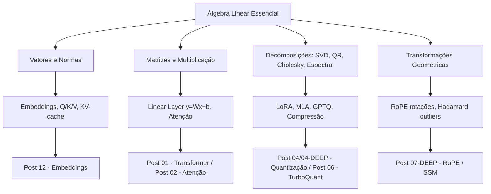
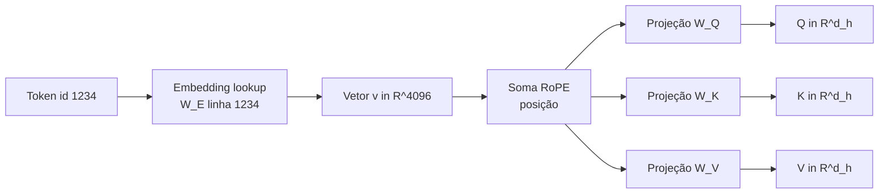
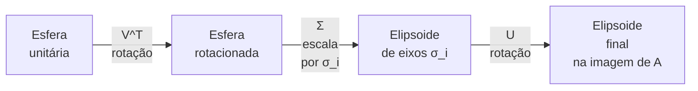
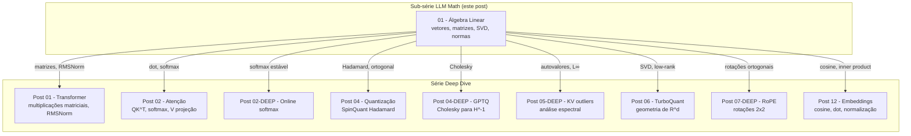
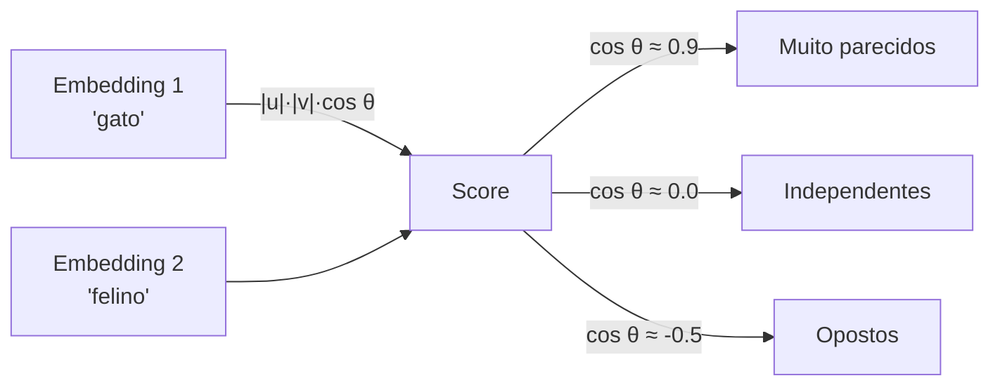

# Álgebra Linear Essencial para LLMs — Vetores, Matrizes, SVD, Normas

> **Sub-série:** LLM Math — Post 1
> **Pré-requisitos:** Cálculo I básico (derivada, integral), Python básico (NumPy), nenhuma exposição prévia formal a álgebra linear é necessária — vamos construir do zero.
> **Objetivo:** Dar a você a *moeda comum* que circula em todo o resto da série Deep Dive (Transformer, Atenção, KV-cache, Quantização, TurboQuant, RoPE, Embeddings). Ao terminar, você lerá esses posts entendendo *o que* cada operação está fazendo geometricamente — não apenas qual NumPy chamar.
> **Filosofia:** Intuição primeiro, formalismo depois. Toda definição vem acompanhada de uma analogia concreta e, sempre que possível, de uma visualização.

---

## Índice

1. [Por que álgebra linear é a "moeda" das LLMs](#1-por-que-álgebra-linear-é-a-moeda-das-llms)
2. [Vetores](#2-vetores)
3. [Similaridade entre vetores](#3-similaridade-entre-vetores)
4. [Matrizes](#4-matrizes)
5. [Transformações lineares (geometria)](#5-transformações-lineares-geometria)
6. [Determinante e invertibilidade](#6-determinante-e-invertibilidade)
7. [Autovalores e autovetores](#7-autovalores-e-autovetores)
8. [SVD — Singular Value Decomposition (a rainha)](#8-svd--singular-value-decomposition-a-rainha)
9. [QR e Cholesky (curtas e úteis)](#9-qr-e-cholesky-curtas-e-úteis)
10. [Matrizes especiais em ML](#10-matrizes-especiais-em-ml)
11. [Softmax — a operação-chave da atenção](#11-softmax--a-operação-chave-da-atenção)
12. [Tensores — generalização](#12-tensores--generalização)
13. [Normas e regularização](#13-normas-e-regularização)
14. [Distâncias em embeddings](#14-distâncias-em-embeddings)
15. [Operações de baixa precisão (perspectiva linear)](#15-operações-de-baixa-precisão-perspectiva-linear)
16. [Atalhos de cálculo úteis](#16-atalhos-de-cálculo-úteis)
17. [Onde aprender mais](#17-onde-aprender-mais)
18. [Tabelas-resumo](#18-tabelas-resumo)
19. [Cross-references com a série](#19-cross-references-com-a-série)
20. [Referências](#20-referências)

---

## 1. Por que álgebra linear é a "moeda" das LLMs

Se eu tivesse que escolher *uma* matemática para entender como LLMs funcionam, sem hesitar: **álgebra linear**. A razão é simples e radical:

> Tudo dentro de uma LLM é um **tensor** (vetor, matriz, ou generalização). O *forward pass* inteiro de um Transformer com 70 bilhões de parâmetros é uma sequência de **multiplicações matriciais** intercaladas com não-linearidades pontuais. Atenção, embedding, MLP, projeção de saída — tudo é álgebra linear.

A boa notícia: você **não precisa decorar fórmulas**. Você precisa de **intuição geométrica**. Se você "vê" o que uma matriz faz no espaço (rotaciona, estica, projeta), você entende porque o Transformer funciona, porque LoRA economiza memória, porque RoPE codifica posição com rotações, porque a atenção compara vetores via produto interno.

Este post é o *mapa-base* da sub-série **LLM Math**. Os próximos posts (gradiente, probabilidade, cálculo numérico) assumem que você está confortável com tudo aqui.



**Como ler este post:** se você é iniciante, leia linearmente. Se já tem fundamentos, use o índice como mapa e pule para a seção de SVD (§8) e Tensores (§12), que são onde a maioria tropeça quando vai ler artigos modernos de LLM.

---

## 2. Vetores

### 2.1 Definição formal

Um **vetor** é um elemento de $\mathbb{R}^n$ — uma lista ordenada de $n$ números reais. Notação:

$$
\mathbf{v} = \begin{bmatrix} v_1 \\ v_2 \\ \vdots \\ v_n \end{bmatrix} \in \mathbb{R}^n
$$

> **Analogia:** um vetor é uma **flecha no espaço de significado**. A direção representa "o que ela quer dizer", o comprimento representa "quão forte ela diz isso". Para um embedding GPT, cada flecha em $\mathbb{R}^{4096}$ é a posição de um token no espaço semântico aprendido pelo modelo.

### 2.2 Notação coluna vs linha

Por convenção em ML/álgebra linear, vetores são **coluna** ($\mathbb{R}^{n \times 1}$). A versão linha é o **transposto** $\mathbf{v}^T \in \mathbb{R}^{1 \times n}$. Em PyTorch, no entanto, vetores 1D `(n,)` não têm orientação explícita — ela emerge do contexto da operação.

### 2.3 Operações básicas

| Operação | Notação | Resultado |
|---|---|---|
| Soma | $\mathbf{u} + \mathbf{v}$ | vetor componente a componente |
| Diferença | $\mathbf{u} - \mathbf{v}$ | vetor componente a componente |
| Escalar | $\alpha \mathbf{v}$ | escala cada coordenada |
| Combinação linear | $\alpha \mathbf{u} + \beta \mathbf{v}$ | "novo significado" entre $\mathbf{u}$ e $\mathbf{v}$ |

### 2.4 Normas — o "comprimento" da flecha

Uma **norma** $\|\cdot\|$ é uma função que atribui tamanho a um vetor. Em LLMs as três que importam são:

$$
\|\mathbf{v}\|_1 = \sum_{i=1}^n |v_i| \quad \text{(L1 — soma de magnitudes)}
$$

$$
\|\mathbf{v}\|_2 = \sqrt{\sum_{i=1}^n v_i^2} \quad \text{(L2 — euclidiana, "comprimento físico")}
$$

$$
\|\mathbf{v}\|_\infty = \max_{i} |v_i| \quad \text{(L∞ — maior componente)}
$$

> **Intuição:** L2 é a régua escolar (Pitágoras em $n$ dimensões). L1 é "distância de táxi em Manhattan" (só anda em ruas perpendiculares). L∞ é "qual é a coordenada mais brutal".

A L∞ vai aparecer com força quando falarmos de **outliers em K-cache** (Post 05-DEEP) — basta um único componente gigante para arruinar uma quantização uniforme.

### 2.5 Produto interno (dot product)

Pedra angular de quase tudo em LLMs:

$$
\langle \mathbf{u}, \mathbf{v} \rangle \;=\; \mathbf{u}^T \mathbf{v} \;=\; \sum_{i=1}^n u_i v_i
$$

A interpretação geométrica é o que dá poder:

$$
\langle \mathbf{u}, \mathbf{v} \rangle \;=\; \|\mathbf{u}\| \, \|\mathbf{v}\| \, \cos\theta
$$

Onde $\theta$ é o ângulo entre as flechas. Logo:

- Vetores **alinhados** → $\cos\theta = 1$ → produto máximo positivo.
- Vetores **ortogonais** → $\cos\theta = 0$ → produto zero.
- Vetores **opostos** → $\cos\theta = -1$ → produto máximo negativo.

> **Analogia:** o produto interno é o **medidor de concordância** entre duas opiniões. Se duas palavras têm embeddings com produto alto, o modelo "acha que elas falam da mesma coisa".

```python
import numpy as np

u = np.array([1.0, 2.0, 3.0])
v = np.array([4.0, -1.0, 2.0])

dot = np.dot(u, v)
l2_u = np.linalg.norm(u)
l1_u = np.linalg.norm(u, ord=1)
linf_u = np.linalg.norm(u, ord=np.inf)

print(f"u·v = {dot}, ||u||₂ = {l2_u:.3f}, ||u||₁ = {l1_u}, ||u||∞ = {linf_u}")
```

### 2.6 Independência linear, base, dimensão, span, subespaço

- Um conjunto $\{\mathbf{v}_1, \dots, \mathbf{v}_k\}$ é **linearmente independente** se nenhuma flecha pode ser escrita como combinação das outras.
- O **span** desses vetores é o conjunto de *todas* as combinações lineares: um **subespaço** de $\mathbb{R}^n$.
- Uma **base** é um conjunto linearmente independente cujo span é o espaço inteiro.
- A **dimensão** é o tamanho da base.

> **LLM aplicado:** a matriz de embeddings $W_E \in \mathbb{R}^{V \times D}$ (V = vocabulário, D = dimensão do modelo) tem rank $\le D$. Como $V \gg D$ (V≈50k, D≈4096), os tokens vivem em um subespaço de dimensão $D$ dentro de $\mathbb{R}^V$. É por isso que tokens "rimam" semanticamente: estão espremidos no mesmo subespaço aprendido.

### 2.7 Exemplos LLM concretos

| Onde aparece | O que é o vetor |
|---|---|
| Word2Vec / GloVe | Embedding estático do token, $\mathbb{R}^{300}$ típico |
| Embedding GPT | Linha de $W_E$, $\mathbb{R}^{4096}$ ou $\mathbb{R}^{12288}$ |
| Query $Q$ numa cabeça | $\mathbb{R}^{d_h}$, tipicamente 64–128 |
| Key $K$ cache | Mesma dimensão de $Q$, armazenado por token |
| Value $V$ cache | $\mathbb{R}^{d_h}$, também por token |
| Logits de saída | $\mathbb{R}^V$, antes do softmax final |



---

## 3. Similaridade entre vetores

A pergunta "quão parecidos são esses dois vetores?" tem várias respostas matemáticas, cada uma adequada para um contexto.

### 3.1 Cosine similarity

$$
\cos\theta \;=\; \frac{\mathbf{u} \cdot \mathbf{v}}{\|\mathbf{u}\| \, \|\mathbf{v}\|} \;\in\; [-1, +1]
$$

Mede só **direção**, ignora **magnitude**. É a métrica padrão em retrieval semântico (RAG, Post 13).

> **Analogia:** o ângulo entre duas opiniões. Você não importa se uma é dita aos sussurros e outra aos berros — quer saber se *concordam*.

### 3.2 Distância euclidiana (L2)

$$
d(\mathbf{u}, \mathbf{v}) = \|\mathbf{u} - \mathbf{v}\|_2 = \sqrt{\sum_i (u_i - v_i)^2}
$$

### 3.3 Hamming distance (embeddings binários)

Conta posições onde os bits diferem. Aparece em **binary embeddings** e em códigos de quantização.

### 3.4 Inner product puro

Quando o módulo importa (ex.: scoring com peso de relevância embutido), usa-se o produto interno *sem normalizar*. É também o que o **MIPS (Maximum Inner Product Search)** otimiza.

```python
def cosine(u, v):
    return np.dot(u, v) / (np.linalg.norm(u) * np.linalg.norm(v))

a = np.array([1.0, 0.0, 1.0])
b = np.array([1.0, 1.0, 1.0])
print(f"cosine = {cosine(a, b):.4f}")
print(f"euclid  = {np.linalg.norm(a - b):.4f}")
```

### 3.5 Tabela comparativa

| Métrica | Fórmula | Faixa | Quando usar |
|---|---|---|---|
| Cosine | $\frac{u \cdot v}{\|u\|\|v\|}$ | $[-1, 1]$ | Embeddings semânticos, retrieval, sentence-transformers |
| Euclidiana | $\|u - v\|_2$ | $[0, \infty)$ | Espaços geométricos "reais", clustering k-means |
| Inner product | $u \cdot v$ | $\mathbb{R}$ | Quando magnitude é informativa, MIPS |
| Hamming | $\#\{i : u_i \neq v_i\}$ | $[0, n]$ | Embeddings binários, hashing |
| Manhattan (L1) | $\sum_i |u_i - v_i|$ | $[0, \infty)$ | Robusto a outliers, embeddings esparsos |

> **Observação importante (Post 12):** se você **normaliza** seus embeddings ($\|v\|_2 = 1$), então cosine = inner product = $2 - \frac{1}{2}\|u-v\|_2^2$. As três métricas tornam-se equivalentes em ranking, e você pode usar a operação mais barata (inner product, que é só um `@`).

---

## 4. Matrizes

### 4.1 Definição

Uma **matriz** $A \in \mathbb{R}^{m \times n}$ é um array 2D com $m$ linhas e $n$ colunas:

$$
A = \begin{bmatrix}
a_{11} & a_{12} & \cdots & a_{1n} \\
a_{21} & a_{22} & \cdots & a_{2n} \\
\vdots & \vdots & \ddots & \vdots \\
a_{m1} & a_{m2} & \cdots & a_{mn}
\end{bmatrix}
$$

> **Analogia:** uma matriz é uma **máquina que transforma flechas em outras flechas**. Você dá um vetor $\mathbf{x} \in \mathbb{R}^n$, ela devolve $A\mathbf{x} \in \mathbb{R}^m$.

### 4.2 Operações básicas

- **Soma**: $(A + B)_{ij} = a_{ij} + b_{ij}$ (mesmas dimensões).
- **Multiplicação por escalar**: $(\alpha A)_{ij} = \alpha a_{ij}$.
- **Transposta**: $A^T \in \mathbb{R}^{n \times m}$, $(A^T)_{ij} = a_{ji}$.

### 4.3 Multiplicação matricial

Se $A \in \mathbb{R}^{m \times k}$ e $B \in \mathbb{R}^{k \times n}$, então $AB \in \mathbb{R}^{m \times n}$ com:

$$
(AB)_{ij} = \sum_{p=1}^{k} A_{ip} B_{pj}
$$

> **Intuição #1 (composição):** $AB$ significa "primeiro aplique $B$, depois $A$". É composição de funções lineares.
>
> **Intuição #2 (linhas × colunas):** o elemento $(i,j)$ é o produto interno da linha $i$ de $A$ com a coluna $j$ de $B$.
>
> **Intuição #3 (combinações):** as colunas de $AB$ são combinações lineares das colunas de $A$, com coeficientes vindos das colunas de $B$.

### 4.4 Matrizes especiais (rápido)

| Matriz | Definição | Símbolo |
|---|---|---|
| Identidade | $I_n$: diagonal de 1, zero fora | $IA = AI = A$ |
| Zero | tudo zero | $0A = 0$ |
| Diagonal | só elementos $d_{ii}$ não-nulos | $\text{diag}(d_1, \dots, d_n)$ |

### 4.5 Multiplicação batched (a vida real do ML)

Em ML quase nunca multiplicamos *uma* matriz por *uma* matriz. Trabalhamos com **lotes** (batch) e **cabeças** (heads). Por exemplo na atenção multi-head:

$$
Q \in \mathbb{R}^{B \times H \times L \times d_h}, \quad K \in \mathbb{R}^{B \times H \times L \times d_h}
$$

$$
QK^T \in \mathbb{R}^{B \times H \times L \times L}
$$

Onde a multiplicação é feita "por cabeça e por batch" simultaneamente. PyTorch e NumPy (via `np.einsum` ou broadcast) fazem isso nativamente.

```python
A = np.random.randn(4, 3)
B = np.random.randn(3, 5)
C = A @ B
print(C.shape)

X = np.random.randn(2, 8, 16, 64)
Y = np.random.randn(2, 8, 64, 16)
Z = X @ Y
print(Z.shape)

W = np.einsum('bhid,bhjd->bhij', X, X)
print(W.shape)
```

> **Aplicação direta (Post 01):** uma camada linear é $y = Wx + b$. Com batch, $Y = XW^T + b$ onde $X \in \mathbb{R}^{B \times d_{in}}$, $W \in \mathbb{R}^{d_{out} \times d_{in}}$, $Y \in \mathbb{R}^{B \times d_{out}}$. Toda MLP, todo $W_Q, W_K, W_V, W_O$ é exatamente isso.

---

## 5. Transformações lineares (geometria)

A definição formal: $T: \mathbb{R}^n \to \mathbb{R}^m$ é **linear** se preserva soma e multiplicação por escalar:

$$
T(\alpha \mathbf{u} + \beta \mathbf{v}) = \alpha\, T(\mathbf{u}) + \beta\, T(\mathbf{v})
$$

**Teorema fundamental:** toda transformação linear pode ser representada por uma matriz $A$, e vice-versa: $T(\mathbf{x}) = A\mathbf{x}$.

### 5.1 O zoológico geométrico (3Blue1Brown style)

Pegue um quadrado unitário no plano (vetores base $\mathbf{e}_1 = (1,0)$ e $\mathbf{e}_2 = (0,1)$). Aplique matrizes 2×2 e veja o que acontece:

| Matriz | Efeito |
|---|---|
| $\begin{bmatrix} 2 & 0 \\ 0 & 2 \end{bmatrix}$ | Escala 2× (uniformemente) |
| $\begin{bmatrix} 2 & 0 \\ 0 & 1 \end{bmatrix}$ | Estica horizontalmente |
| $\begin{bmatrix} 0 & -1 \\ 1 & 0 \end{bmatrix}$ | Rotação 90° |
| $\begin{bmatrix} 1 & 1 \\ 0 & 1 \end{bmatrix}$ | Cisalhamento (shear) |
| $\begin{bmatrix} 1 & 0 \\ 0 & 0 \end{bmatrix}$ | Projeção no eixo x |
| $\begin{bmatrix} -1 & 0 \\ 0 & 1 \end{bmatrix}$ | Reflexão |

> **Insight chave:** a matriz é descrita pelo **destino dos vetores base**. A primeira coluna é onde $\mathbf{e}_1$ vai parar; a segunda coluna é onde $\mathbf{e}_2$ vai parar. Tudo o mais segue por linearidade.

### 5.2 Composição

Se $T_1$ tem matriz $A$ e $T_2$ tem matriz $B$, a composição $T_2 \circ T_1$ tem matriz $BA$ (atenção à ordem). Isso é exatamente o que um Transformer faz: pilha de camadas → produto de matrizes (intercalado com não-linearidades).

### 5.3 Intuição para o Transformer

Cada matriz aprendida em uma LLM é **uma transformação semântica**:

- $W_Q$: "como olhar do ponto de vista de quem está perguntando"
- $W_K$: "como ser encontrado por quem pergunta"
- $W_V$: "que informação carregar"
- $W_O$: "como reagregar as cabeças no espaço residual"
- $W_{up}, W_{down}$ na MLP: "expandir para análise rica, comprimir de volta"

Cada uma é uma transformação linear no espaço de $\mathbb{R}^{4096}$. O **treinamento** é o processo de descobrir *quais* transformações mover o erro para baixo.

---

## 6. Determinante e invertibilidade

### 6.1 Determinante

O **determinante** $\det(A)$ (para $A$ quadrada) é um número real com interpretação geométrica clara:

> O fator pelo qual $A$ escala áreas (em 2D), volumes (em 3D), hipervolumes (em $n$D). Sinal indica se preserva ou inverte orientação.

Para 2×2: $\det\begin{bmatrix} a & b \\ c & d \end{bmatrix} = ad - bc$.

### 6.2 Singularidade e invertibilidade

- $\det(A) = 0$ → $A$ é **singular** → "achata" o espaço, perde dimensão.
- $\det(A) \neq 0$ → $A$ é **invertível** → existe $A^{-1}$ com $A^{-1} A = A A^{-1} = I$.

### 6.3 Em ML, *não* calculamos a inversa

Calcular $A^{-1}$ explicitamente é caro ($O(n^3)$) e numericamente instável. Em vez disso, usamos:

- **`solve`** para resolver $Ax = b$ sem inverter (eliminação Gaussiana / decomposição LU).
- **Decomposições** (Cholesky, QR, SVD) que são mais estáveis.

> **Aplicação curiosa (Post 04-DEEP / GPTQ):** o algoritmo GPTQ precisa da Hessiana inversa para escolher como quantizar pesos minimizando o erro. Em vez de calcular $H^{-1}$, o GPTQ faz **decomposição de Cholesky** e resolve por substituição triangular — barato e numericamente estável. Veja §9 abaixo.

---

## 7. Autovalores e autovetores

### 7.1 Definição

Um **autovetor** de $A$ é uma direção que $A$ **só estica/encolhe sem rotacionar**:

$$
A\mathbf{v} = \lambda \mathbf{v}
$$

O escalar $\lambda$ é o **autovalor** correspondente. Para uma matriz $n \times n$ há até $n$ pares $(\lambda_i, \mathbf{v}_i)$.

> **Analogia:** no zoológico geométrico, autovetores são as "varetas mágicas" que sobrevivem à transformação intactas em direção. Tudo o mais é torcido junto.

### 7.2 Decomposição espectral (matrizes simétricas)

Se $A = A^T$ (simétrica), a álgebra linear nos dá um presente: $A$ é diagonalizável por matriz **ortogonal**:

$$
A = Q \Lambda Q^T
$$

Onde $Q$ tem os autovetores como colunas (ortonormais) e $\Lambda = \text{diag}(\lambda_1, \dots, \lambda_n)$. Isso significa: aplicar $A$ é "rotacionar para a base dos autovetores → escalar por $\lambda_i$ em cada eixo → rotacionar de volta".

### 7.3 Por que importa em LLMs

| Onde | Como aparece |
|---|---|
| **Hessiana** (Post 04-DEEP, GPTQ) | autovalores indicam curvatura da loss; condicionamento numérico |
| **PCA / análise de embeddings** | autovetores da matriz de covariância são as direções principais |
| **Estabilidade de treino** | autovalores extremos do Jacobiano explicam exploding/vanishing gradients |
| **KV outliers** (Post 05-DEEP) | distribuição espectral revela canais "tóxicos" |
| **Análise de NTK** | autovalores do kernel determinam taxa de aprendizado por modo |

```python
A = np.array([[2., 1.], [1., 3.]])
vals, vecs = np.linalg.eigh(A)
print("autovalores:", vals)
print("autovetores (colunas):\n", vecs)
print("verificação Av = λv:", np.allclose(A @ vecs, vecs * vals))
```

---

## 8. SVD — Singular Value Decomposition (a rainha)

> Se você sair deste post lembrando de **uma só** ferramenta, que seja o SVD. Ele é a navalha suíça da álgebra linear aplicada — e está atrás de LoRA, MLA, compressão de pesos, PCA, e da própria existência da quantização TurboQuant.

### 8.1 Enunciado

**Toda** matriz $A \in \mathbb{R}^{m \times n}$ (sem nenhuma hipótese de quadrada, simétrica, ou invertível) pode ser decomposta como:

$$
A = U \, \Sigma \, V^T
$$

Onde:

- $U \in \mathbb{R}^{m \times m}$ é **ortogonal** ($U^T U = I$).
- $V \in \mathbb{R}^{n \times n}$ é **ortogonal**.
- $\Sigma \in \mathbb{R}^{m \times n}$ é **diagonal não-negativa**, com valores singulares $\sigma_1 \ge \sigma_2 \ge \dots \ge 0$.

> **Analogia:** SVD é o **raio-X da matriz** — mostra exatamente quais direções ela amplifica, quais ela ignora, e o quão "rica" ela realmente é. Geometricamente, qualquer transformação linear é **rotação → escala nos eixos → rotação**. Toda matriz, sempre.

### 8.2 Visualização geométrica



### 8.3 Truncated SVD — a aproximação rank-$k$

Mantenha só os $k$ maiores valores singulares:

$$
A_k = U_k \, \Sigma_k \, V_k^T \;\approx\; A
$$

**Teorema de Eckart–Young:** $A_k$ é a **melhor aproximação rank-$k$** de $A$ em norma de Frobenius (e em norma espectral). Não dá para fazer melhor com $k$ vetores.

O erro é:

$$
\|A - A_k\|_F^2 = \sum_{i=k+1}^{r} \sigma_i^2
$$

### 8.4 Por que SVD é central em LLM

| Aplicação | Como SVD entra |
|---|---|
| **LoRA** (Hu et al. 2021) | Treina $\Delta W = AB$ com $A \in \mathbb{R}^{d \times r}, B \in \mathbb{R}^{r \times d}$, $r \ll d$. É exatamente truncated SVD aplicado ao *update*. |
| **MLA — Multi-head Latent Attention (DeepSeek)** | KV é projetado num espaço latente *low-rank*: $K = W_K^{up} \cdot c, V = W_V^{up} \cdot c$, com $c$ latente compartilhado. Reduz cache em ~10×. |
| **Compressão de pesos** | Substituir $W$ por $U_k \Sigma_k V_k^T$ economiza memória se $k(m+n) < mn$. |
| **PCA em embeddings** | Análise de variância é SVD da matriz de embeddings centralizada. |
| **Spectral decay explica Why low-rank works** | Pesos de redes treinadas têm "decaimento espectral" — poucos $\sigma_i$ grandes, longa cauda pequena. |
| **TurboQuant (Post 06)** | Geometria de $\mathbb{R}^d$; aproveita estrutura espectral de pesos. |

### 8.5 Math completa de LoRA

A intuição em uma linha:

> Em vez de aprender $\Delta W \in \mathbb{R}^{d \times d}$ ($d^2$ parâmetros), aprenda $\Delta W = BA$ com $A \in \mathbb{R}^{r \times d}, B \in \mathbb{R}^{d \times r}$. Você tem $2dr$ parâmetros — para $d=4096, r=8$, isso é **256× menos** parâmetros treináveis.

$$
W_{\text{novo}} \;=\; W_0 \;+\; \frac{\alpha}{r} B A
$$

> **Analogia:** se você quiser corrigir o conteúdo de um caderno inteiro ($W \in \mathbb{R}^{d \times d}$), em vez de reescrever cada página, encaixe **dois lápis finos** ($B$ e $A$) que somam aos rabiscos antigos. Isso é LoRA.

### 8.6 Código

```python
A = np.random.randn(20, 50) @ np.random.randn(50, 30)

U, s, Vh = np.linalg.svd(A, full_matrices=False)
print("σ shape:", s.shape, "primeiros 5:", s[:5])

k = 4
A_k = U[:, :k] @ np.diag(s[:k]) @ Vh[:k, :]

err = np.linalg.norm(A - A_k, ord='fro')
err_theoretical = np.sqrt(np.sum(s[k:]**2))
print(f"||A - A_k||_F real         = {err:.4f}")
print(f"||A - A_k||_F teórico (σ)  = {err_theoretical:.4f}")
```

### 8.7 Spectral decay — o porquê de tudo isso funcionar

Se você plotar $\sigma_i$ em escala log para uma matriz de pesos de uma LLM treinada, verá uma queda rápida: poucos modos dominantes, longa cauda pequena. **Isso é o que torna LoRA, compressão e MLA viáveis** — a "informação útil" da matriz já vive num subespaço de dimensão muito menor que $d$.

---

## 9. QR e Cholesky (curtas e úteis)

### 9.1 Decomposição QR

$$
A = QR
$$

Onde $Q$ é ortogonal ($Q^T Q = I$) e $R$ é triangular superior. Aplicações: solver de mínimos quadrados, base de Gram-Schmidt, cálculo de autovalores (algoritmo QR clássico).

### 9.2 Decomposição de Cholesky

Para $A$ **simétrica positiva definida** (todos autovalores $> 0$):

$$
A = LL^T
$$

Com $L$ triangular inferior. É **mais barata** que LU e numericamente robusta.

> **Aplicação direta (Post 04-DEEP, GPTQ):** o GPTQ precisa repetidamente de $H^{-1}$ (Hessiana inversa) para decidir quanto "compensar" ao quantizar cada coluna de pesos. Em vez de calcular a inversa, faz $H = LL^T$ (Cholesky) e resolve sistemas triangulares. Resultado: estabilidade numérica e velocidade.

```python
H = np.array([[4., 12., -16.],
              [12., 37., -43.],
              [-16., -43., 98.]])
L = np.linalg.cholesky(H)
print("L:\n", L)
print("L L^T == H?", np.allclose(L @ L.T, H))
```

---

## 10. Matrizes especiais em ML

| Tipo | Definição | Por que importa em LLM |
|---|---|---|
| **Ortogonal** | $Q^T Q = I$ | Preserva normas ($\|Q\mathbf{x}\| = \|\mathbf{x}\|$). Não amplifica ruído. |
| **Rotação** | Ortogonal com $\det = +1$ | **RoPE** (Post 07-DEEP) aplica rotações 2×2 por par de coordenadas para codificar posição. |
| **Hadamard** | Ortogonal de entradas $\pm 1/\sqrt{n}$ | **SpinQuant / QuaRot / TurboQuant** usam Hadamard para "embaralhar" canais e diluir outliers antes de quantizar (Post 04, 06). |
| **Sparse** | maioria de zeros | MoE, atenção esparsa (Sparse Transformers), pruning |
| **Block-diagonal** | blocos não-zero na diagonal | Multi-head attention vista como block-diagonal, GQA |
| **Triangular** | só superior ou inferior não-nula | Causal mask na atenção é triangular inferior; Cholesky |
| **Permutação** | reordenamento de eixos/canais | Channel shuffle, GPTQ ordena colunas por importância |

### 10.1 Hadamard — o detergente de outliers

Uma matriz de Hadamard $H_n$ com $H_n^T H_n = n I$ tem entradas $\pm 1$. Multiplicar um vetor por $H_n / \sqrt{n}$ **redistribui energia uniformemente entre as coordenadas**, sem perder informação (é ortogonal).

> **Analogia:** Hadamard é **embaralhar as cartas** antes de avaliar a mão. Outliers ficam diluídos no resto, e a quantização uniforme passa a funcionar.

```python
from scipy.linalg import hadamard

H = hadamard(8) / np.sqrt(8)
print("H ortogonal?", np.allclose(H.T @ H, np.eye(8)))

x = np.array([10., 0., 0., 0., 0., 0., 0., 0.])
print("antes:", x)
print("depois Hx:", H @ x)
```

Note como o vetor com um outlier vira um vetor "achatado". Ao quantizar, perdemos muito menos.

---

## 11. Softmax — a operação-chave da atenção

### 11.1 Definição

$$
\text{softmax}(\mathbf{x})_i \;=\; \frac{e^{x_i}}{\sum_{j=1}^n e^{x_j}}
$$

Mapeia $\mathbb{R}^n$ no **simplex** ($n-1$-dimensional): saídas em $[0,1]$ somando 1. Pode ser interpretado como "uma distribuição de probabilidade que destaca o(s) maior(es) input(s)".

> **Analogia:** softmax é o **megafone exponencial** — ele destaca o maior, mas sem zerar o resto. É um max "suave" e diferenciável.

### 11.2 Numerical stability — subtrair o max

$e^{1000}$ explode. Solução: usar a identidade

$$
\text{softmax}(\mathbf{x}) = \text{softmax}(\mathbf{x} - c)
$$

para qualquer escalar $c$. Escolhemos $c = \max_i x_i$:

```python
def softmax_stable(x):
    x = x - np.max(x)
    e = np.exp(x)
    return e / e.sum()

print(softmax_stable(np.array([1000., 1001., 1002.])))
```

### 11.3 Online softmax

Quando você processa $\mathbf{x}$ em blocos (FlashAttention, Post 02-DEEP), não tem o $\max$ global. **Online softmax** mantém um par $(m, \ell)$ (max corrente, soma corrente) e atualiza com identidade:

$$
m^{(\text{novo})} = \max(m, \max(\text{bloco})), \quad \ell^{(\text{novo})} = \ell \cdot e^{m - m^{(\text{novo})}} + \sum_{j \in \text{bloco}} e^{x_j - m^{(\text{novo})}}
$$

Esse truque (Milakov & Gimelshein 2018) é o que torna FlashAttention possível — sem ele você teria que materializar a matriz $QK^T$ inteira.

### 11.4 Onde aparece em LLM

$$
\text{Attention}(Q, K, V) = \text{softmax}\left( \frac{QK^T}{\sqrt{d_h}} \right) V
$$

A operação central da atenção é exatamente isto. Veja Post 02 para a derivação completa.

---

## 12. Tensores — generalização

### 12.1 Definição

Um **tensor de ordem $k$** é um array $k$-dimensional. Vetor é ordem 1, matriz é ordem 2, e tudo acima é tensor "puro".

> **Analogia:** se matriz é "uma planilha", tensor é "uma planilha com várias abas que têm várias páginas". Cada eixo tem semântica.

### 12.2 Convenções de shape em PyTorch para LLMs

| Tensor | Shape | Significado dos eixos |
|---|---|---|
| Embeddings de batch | $(B, L, D)$ | batch, sequência, dimensão |
| Q/K/V por cabeça | $(B, H, L, d_h)$ | batch, heads, seq, head dim |
| Atenção scores | $(B, H, L, L)$ | batch, heads, query, key |
| Logits de saída | $(B, L, V)$ | batch, seq, vocab |
| Pesos da MLP | $(d_{ff}, D)$ | output, input |
| KV cache acumulado | $(B, H, L_{tot}, d_h)$ | grow ao longo da geração |

### 12.3 Einsum — a língua-mãe das operações tensoriais

`einsum` (Einstein summation) é uma DSL que permite descrever **qualquer** multiplicação tensorial sem se preocupar com transposições e reshapes. Sintaxe: `'shape_de_entrada -> shape_de_saída'`, com índices repetidos sendo somados.

| Operação | Einsum |
|---|---|
| Produto interno | `'i,i->'` |
| Produto externo | `'i,j->ij'` |
| Multiplicação matricial | `'ij,jk->ik'` |
| Multiplicação batched | `'bij,bjk->bik'` |
| **Atenção scores** | `'bhid,bhjd->bhij'` |
| **Atenção output** | `'bhij,bhjd->bhid'` |
| Trace | `'ii->'` |
| Soma de eixos | `'ij->i'` |
| Transposta | `'ij->ji'` |

```python
B, H, L, dh = 2, 4, 6, 8
Q = np.random.randn(B, H, L, dh)
K = np.random.randn(B, H, L, dh)
V = np.random.randn(B, H, L, dh)

scores = np.einsum('bhid,bhjd->bhij', Q, K) / np.sqrt(dh)
P = softmax_stable_axis(scores, axis=-1) if False else None

scores_max = scores.max(axis=-1, keepdims=True)
P = np.exp(scores - scores_max)
P = P / P.sum(axis=-1, keepdims=True)

out = np.einsum('bhij,bhjd->bhid', P, V)
print("attention output shape:", out.shape)
```

> **Dica:** sempre que você for escrever uma operação custosa em PyTorch e ficar perdido com `permute`, `reshape` e `bmm`, escreva primeiro em einsum. É legível, sem ambiguidade, e o compilador moderno (PyTorch 2.x, JAX) otimiza muito bem.

---

## 13. Normas e regularização

### 13.1 Norma de Frobenius (matrizes)

A "L2 para matrizes" — soma quadrática de todos os elementos:

$$
\|A\|_F = \sqrt{\sum_{i,j} A_{ij}^2} = \sqrt{\text{tr}(A^T A)} = \sqrt{\sum_i \sigma_i^2}
$$

A última igualdade conecta a Frobenius diretamente ao SVD: o "tamanho" de uma matriz em Frobenius é determinado pelos seus valores singulares.

### 13.2 Weight decay = L2 nos pesos

Adicionar $\frac{\lambda}{2}\|W\|_F^2$ à loss equivale, no gradiente, a empurrar pesos para zero a cada passo:

$$
W \leftarrow W - \eta(\nabla L + \lambda W) = (1 - \eta\lambda) W - \eta \nabla L
$$

Esse é o "decay" — daí o nome. Em otimizadores modernos (AdamW), o decay é desacoplado do gradiente Adam, mas a ideia é a mesma.

### 13.3 Gradient clipping

Para evitar exploding gradients:

$$
\mathbf{g} \leftarrow \mathbf{g} \cdot \min\!\left(1, \frac{\tau}{\|\mathbf{g}\|_2}\right)
$$

Limita a norma a $\tau$. Padrão em treinamento de LLM.

### 13.4 Layer Norm vs RMSNorm

**LayerNorm** (Ba et al. 2016):

$$
\text{LN}(\mathbf{x}) = \gamma \cdot \frac{\mathbf{x} - \mu}{\sqrt{\sigma^2 + \epsilon}} + \beta
$$

com $\mu = \frac{1}{d}\sum x_i, \sigma^2 = \frac{1}{d}\sum (x_i - \mu)^2$.

**RMSNorm** (Zhang & Sennrich 2019, padrão em Llama/Mistral):

$$
\text{RMSNorm}(\mathbf{x}) = \frac{\mathbf{x}}{\sqrt{\frac{1}{d}\sum_i x_i^2 + \epsilon}} \cdot \gamma
$$

A diferença: RMSNorm **não centraliza** (não subtrai média) e não tem bias. Mais barato, e na prática funciona tão bem quanto LayerNorm em LLMs (ver Post 01).

```python
def rms_norm(x, gamma, eps=1e-6):
    rms = np.sqrt(np.mean(x**2, axis=-1, keepdims=True) + eps)
    return x / rms * gamma

def layer_norm(x, gamma, beta, eps=1e-6):
    mu = x.mean(axis=-1, keepdims=True)
    var = x.var(axis=-1, keepdims=True)
    return (x - mu) / np.sqrt(var + eps) * gamma + beta

x = np.random.randn(2, 8, 16)
g = np.ones(16); b = np.zeros(16)
print("RMSNorm out shape:", rms_norm(x, g).shape)
print("LayerNorm out shape:", layer_norm(x, g, b).shape)
```

---

## 14. Distâncias em embeddings (link Post 12)

Em embeddings densos modernos (sentence-transformers, OpenAI ada, BGE, E5, Cohere), as escolhas de distância são:

| Embedding | Norma típica | Métrica recomendada |
|---|---|---|
| OpenAI text-embedding-3 | normalizado | cosine (= dot) |
| sentence-transformers (default) | normalizado | cosine |
| BGE / E5 | normalizado | cosine |
| ColBERT (multi-vector) | varia | MaxSim com cosine |
| Image embeddings CLIP | normalizado | cosine |
| Hashing / binary | binário | Hamming |

> **Princípio**: se $\|u\|_2 = \|v\|_2 = 1$, então $u \cdot v = 1 - \frac{1}{2}\|u-v\|_2^2$. Cosine, dot e euclidiana ranqueiam **igualmente**. Use a operação mais barata na sua infra (geralmente dot product, que é só `@`).

A **quantização** de embeddings (PQ, OPQ, e o TurboQuant do Post 06) busca preservar o produto interno aproximado em muito menos bits — exatamente para que retrieval continue dando o mesmo ranking gastando menos memória/banda.

---

## 15. Operações de baixa precisão (perspectiva linear)

Quantização é, no fundo, uma pergunta de álgebra linear:

> "Quero aproximar a operação $y = Wx$ usando $W$ representada em menos bits. Como minimizar o erro $\|y - \tilde{y}\|$?"

### 15.1 Por que outliers em K (Post 05) são fatais

Quantização uniforme escala $[\min, \max]$ em $2^b$ níveis. Se um único componente é gigante (outlier), o passo de quantização cresce, e os componentes "normais" perdem resolução. A norma L∞ do canal explica o estrago.

### 15.2 Como Hadamard salva o dia

Como vimos em §10.1, multiplicar por $H/\sqrt{n}$ redistribui energia. Após Hadamard, **maxabs cai dramaticamente** sem perder informação (a transformação é ortogonal e reversível). Quantizamos no novo espaço, e na hora de usar, "desfazemos" implicitamente — porque a estrutura $W \cdot H \cdot H^T \cdot x = Wx$. É a base matemática de **SpinQuant** e **QuaRot** (Post 04) e do **TurboQuant** (Post 06), com extensões geométricas mais sofisticadas.

### 15.3 Erro de aproximação tem estrutura

Para $\tilde{W} = W + E$ com $E$ erro de quantização, a saída perturbada é $\tilde{y} = (W + E)x = y + Ex$. O erro é $\|Ex\|_2 \le \|E\|_2 \|x\|_2$ (norma espectral), então **estamos otimizando $\|E\|$ sob restrição de número de bits**. SVD novamente esclarece o que é importante preservar.

---

## 16. Atalhos de cálculo úteis

Você verá estas identidades repetidamente em papers de LLM. Vale memorizar:

| Identidade | Onde aparece |
|---|---|
| $\|A\mathbf{v}\|^2 = \mathbf{v}^T A^T A \mathbf{v}$ | Análise de erro de quantização, mínimos quadrados |
| $\text{tr}(AB) = \text{tr}(BA)$ | Manipulação de gradientes, prova de equivalência de losses |
| $\langle A, B \rangle_F = \text{tr}(A^T B) = \sum_{ij} A_{ij} B_{ij}$ | Norma de Frobenius, kernel methods, regularização |
| $\nabla_W \|Wx - y\|^2 = 2(Wx - y)x^T$ | Backprop de camada linear |
| $\nabla_X \text{tr}(X^T A) = A$ | Derivação de gradiente do peso |
| $\nabla_X \text{tr}(X^T A X) = (A + A^T)X$ | Hessiana, formas quadráticas |
| $(AB)^T = B^T A^T$ | Reorganizar transpostas em provas |
| $(AB)^{-1} = B^{-1} A^{-1}$ | Inversa de produto |
| $\det(AB) = \det(A) \det(B)$ | Mudança de variável em normalizing flows |

---

## 17. Onde aprender mais

| Recurso | Por que é bom |
|---|---|
| **3Blue1Brown — "Essence of Linear Algebra"** (YouTube) | A melhor introdução visual já feita. 16 capítulos. **Comece aqui** se você é iniciante. |
| **"Mathematics for Machine Learning"** — Deisenroth, Faisal, Ong (Cambridge, 2020) | Livro **gratuito**, capítulo 2 cobre álgebra linear sob medida para ML. PDF em [mml-book.com](https://mml-book.com/). |
| **Strang — "Linear Algebra and Its Applications"** | Clássico. As aulas do Strang no MIT OCW (curso 18.06) são lendárias. |
| **Boyd & Vandenberghe — "Introduction to Applied Linear Algebra"** | Livro gratuito, mais aplicado, com Julia + Python. |
| **Goodfellow, Bengio, Courville — "Deep Learning"** capítulo 2 | Resumo conciso para ML especificamente. |
| **Bishop — "Pattern Recognition and Machine Learning"** caps. 1-2 | Apêndice de álgebra linear excelente. |
| **Karpathy — nanoGPT / nanochat** ([github.com/karpathy/nanoGPT](https://github.com/karpathy/nanoGPT)) | Cada linha do código é álgebra linear aplicada. Leia o `model.py` linha-por-linha após este post. |
| **Karpathy — "Yes you should understand backprop"** | Para conectar álgebra linear → gradiente → otimização. |

---

## 18. Tabelas-resumo

### 18.1 Operações vetoriais

| Operação | Notação | Resultado | Custo ($O$) |
|---|---|---|---|
| Soma | $u + v$ | vetor | $n$ |
| Escalar | $\alpha v$ | vetor | $n$ |
| Dot | $u \cdot v$ | escalar | $n$ |
| Norma L2 | $\|v\|_2$ | escalar | $n$ |
| Cosine | $u \cdot v / (\|u\|\|v\|)$ | escalar | $n$ |
| Outer | $u v^T$ | matriz $n \times n$ | $n^2$ |

### 18.2 Métricas de similaridade

| Métrica | Faixa | Direção/Magnitude | Custo |
|---|---|---|---|
| Cosine | $[-1, 1]$ | só direção | $O(n)$ |
| Inner product | $\mathbb{R}$ | ambos | $O(n)$ |
| L2 (euclidiana) | $[0, \infty)$ | ambos | $O(n)$ |
| L1 (Manhattan) | $[0, \infty)$ | ambos, robusto | $O(n)$ |
| Hamming | $[0, n]$ | binário | $O(n)$ |
| Jaccard | $[0, 1]$ | conjuntos | $O(n)$ |

### 18.3 Matrizes especiais

| Tipo | Propriedade | Uso em LLM |
|---|---|---|
| Identidade $I$ | $IA = A$ | Skip connections, inicialização |
| Diagonal | só $d_{ii}$ | Quantização por canal, RMSNorm $\gamma$ |
| Ortogonal $Q$ | $Q^T Q = I$ | Hadamard, RoPE, preserva normas |
| Rotação | $\det = +1$ | RoPE, embeddings esféricos |
| Triangular | $L$ ou $U$ | Cholesky, máscara causal |
| Esparsa | maioria zero | MoE, sparse attention |
| Block-diagonal | blocos | Multi-head attention |
| Permutação | reordena | GPTQ, channel shuffle |
| Hadamard | $\pm 1$, ortogonal | SpinQuant, QuaRot, TurboQuant |

### 18.4 Decomposições

| Decomposição | Forma | Requer | Aplicações em LLM |
|---|---|---|---|
| **SVD** | $A = U\Sigma V^T$ | qualquer $A$ | LoRA, MLA, PCA, compressão |
| **Espectral** | $A = Q\Lambda Q^T$ | $A$ simétrica | Hessiana, NTK, covariância |
| **QR** | $A = QR$ | qualquer $A$ | Mínimos quadrados, autovalores |
| **Cholesky** | $A = LL^T$ | $A$ SPD | GPTQ Hessiana, Gaussian processes |
| **LU** | $A = LU$ | qualquer $A$ quadrada | Solver geral (interno) |

### 18.5 Normas

| Norma | Definição (vetor) | Definição (matriz) | Uso |
|---|---|---|---|
| L1 | $\sum |v_i|$ | $\max_j \sum_i |a_{ij}|$ | Esparsidade, Lasso |
| L2 | $\sqrt{\sum v_i^2}$ | $\sigma_{\max}(A)$ (espectral) | Padrão, gradient clipping |
| L∞ | $\max_i |v_i|$ | $\max_i \sum_j |a_{ij}|$ | Outliers |
| Frobenius | — | $\sqrt{\sum a_{ij}^2}$ | Weight decay, low-rank |
| Nuclear | — | $\sum \sigma_i$ | Convex relax. de rank |

### 18.6 Cross-reference math → posts da série

| Conceito de álgebra linear | Posts onde é central |
|---|---|
| Multiplicação matricial $WX$ | Post 01 (Transformer), Post 02 (Atenção) |
| Produto interno $QK^T$ | Post 02, Post 02-DEEP |
| Softmax | Post 02, Post 02-DEEP (online) |
| SVD / low-rank | Post 04, Post 06 (TurboQuant), MLA do Post 02 |
| Cholesky | Post 04-DEEP (GPTQ) |
| Hadamard / rotação | Post 04 (SpinQuant), Post 06 (TurboQuant) |
| Rotação 2D | Post 07-DEEP (RoPE) |
| Cosine similarity | Post 12 (Embeddings), Post 13 (RAG) |
| RMSNorm / LayerNorm | Post 01 |
| Tensor / einsum | Todos os posts de implementação |

---

## 19. Cross-references com a série



### Atalho mental: cosine similarity como "ângulo entre opiniões"



---

## 20. Referências

### Livros (gratuitos quando possível)

- **Deisenroth, M.P., Faisal, A.A., Ong, C.S.** — *Mathematics for Machine Learning*. Cambridge University Press, 2020. PDF gratuito em [mml-book.com](https://mml-book.com/). **Capítulo 2** é a referência canônica.
- **Strang, G.** — *Linear Algebra and Its Applications* (4ª ed.). Cengage, 2005. Aulas do MIT OCW 18.06.
- **Boyd, S., Vandenberghe, L.** — *Introduction to Applied Linear Algebra*. Cambridge, 2018. PDF gratuito em [stanford.edu/~boyd/vmls](https://web.stanford.edu/~boyd/vmls/).
- **Goodfellow, I., Bengio, Y., Courville, A.** — *Deep Learning*. MIT Press, 2016. Capítulo 2.
- **Bishop, C.M.** — *Pattern Recognition and Machine Learning*. Springer, 2006. Apêndice C.

### Vídeos / Cursos

- **3Blue1Brown** — *Essence of Linear Algebra* (YouTube playlist). [3blue1brown.com/essence-of-linear-algebra](https://www.3blue1brown.com/essence-of-linear-algebra). 16 vídeos, intuição visual.
- **Strang, G.** — MIT 18.06 Linear Algebra (OCW). Aulas em vídeo + notas.
- **Karpathy, A.** — *Neural Networks: Zero to Hero* (YouTube). Particularmente "Building makemore" e "Let's build GPT".

### Papers fundamentais aplicados

- **Hu, E.J. et al.** (2021). "LoRA: Low-Rank Adaptation of Large Language Models." [arXiv:2106.09685](https://arxiv.org/abs/2106.09685).
- **Frantar, E. et al.** (2023). "GPTQ: Accurate Post-Training Quantization for Generative Pre-trained Transformers." [arXiv:2210.17323](https://arxiv.org/abs/2210.17323).
- **DeepSeek-AI** (2024). "DeepSeek-V2: A Strong, Economical, and Efficient Mixture-of-Experts Language Model." (Introduz MLA com decomposição low-rank.)
- **Su, J. et al.** (2021). "RoFormer: Enhanced Transformer with Rotary Position Embedding." [arXiv:2104.09864](https://arxiv.org/abs/2104.09864).
- **Liu, Z. et al.** (2024). "SpinQuant: LLM Quantization with Learned Rotations." [arXiv:2405.16406](https://arxiv.org/abs/2405.16406).
- **Ashkboos, S. et al.** (2024). "QuaRot: Outlier-Free 4-Bit Inference in Rotated LLMs." [arXiv:2404.00456](https://arxiv.org/abs/2404.00456).
- **Milakov, M., Gimelshein, N.** (2018). "Online normalizer calculation for softmax." [arXiv:1805.02867](https://arxiv.org/abs/1805.02867).
- **Dao, T. et al.** (2022). "FlashAttention: Fast and Memory-Efficient Exact Attention with IO-Awareness." [arXiv:2205.14135](https://arxiv.org/abs/2205.14135).
- **Zhang, B., Sennrich, R.** (2019). "Root Mean Square Layer Normalization." [arXiv:1910.07467](https://arxiv.org/abs/1910.07467).

### Código

- **Karpathy, A.** — `nanoGPT`: [github.com/karpathy/nanoGPT](https://github.com/karpathy/nanoGPT). Modelo GPT minimalista, ~300 linhas, lê-se como livro de álgebra linear.
- **Karpathy, A.** — `nanochat`: [github.com/karpathy/nanochat](https://github.com/karpathy/nanochat). Sucessor do nanoGPT (2025+).

### Posts Karpathy

- *"Yes you should understand backprop"* — [karpathy.medium.com](https://karpathy.medium.com/yes-you-should-understand-backprop-e2f06eab496b). Conexão álgebra linear → gradiente.

---

## Próximos passos na sub-série

| # | Tópico | Por que |
|---|---|---|
| **02** | Cálculo Multivariado e Gradientes | Backprop, Jacobiano, regra da cadeia em tensores |
| **03** | Probabilidade e Informação | Cross-entropy, KL, perplexidade, sampling (top-k, top-p, temperature) |
| **04** | Otimização — SGD, Adam, AdamW, schedules | Por que momento, por que warmup, por que decay |
| **05** | Numérica — fp32/fp16/bf16/fp8/int4 | Erros de ponto flutuante, mixed precision, escalas |
| **06** | Geometria de Alta Dimensão e Concentração de Medida | Por que cosine "funciona", curse of dimensionality, JL lemma |

---

> **Mensagem final:** se você fechar este post sentindo que "vetor é flecha, matriz é máquina que transforma flechas, SVD é o raio-X da máquina, e cosine é o ângulo entre opiniões" — você já tem 80% do que precisa para ler qualquer paper de LLM moderno. O resto é vocabulário e prática. Bons estudos.
