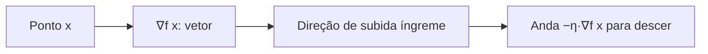
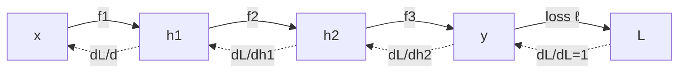
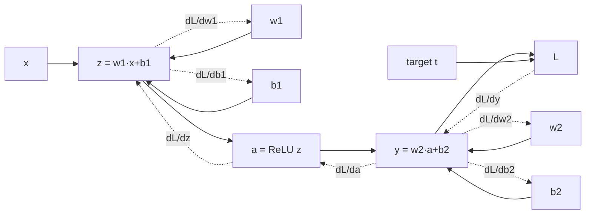
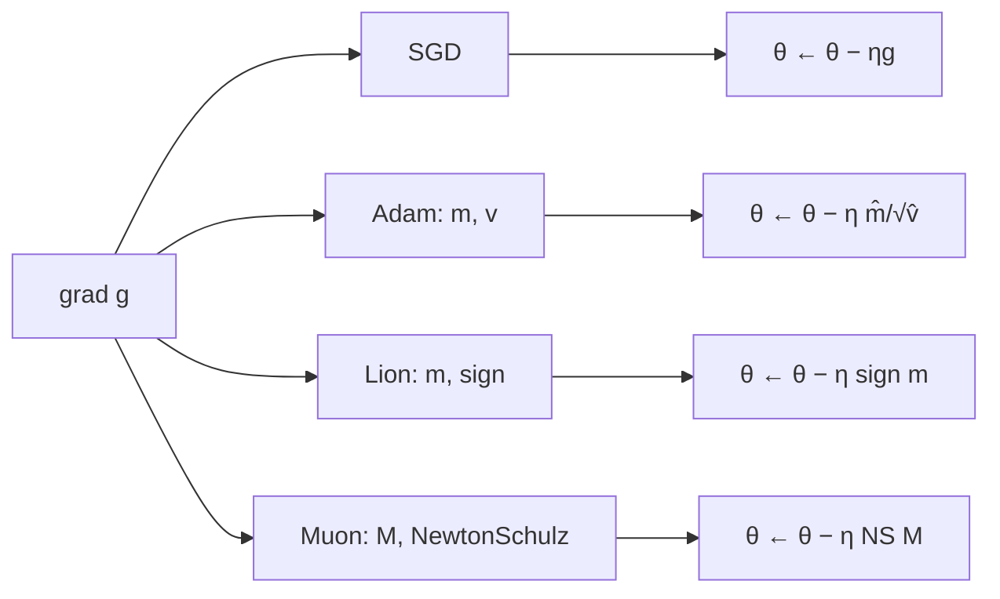
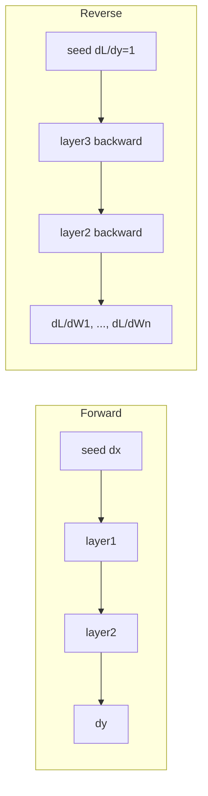

# Cálculo, Derivadas, Gradientes, Autograd e Backpropagation — A Matemática que Treina seu LLM

> **Sub-série LLM Math · Post 02**
> Pré-requisito: [Post 01 — Álgebra Linear, Tensores e a Engenharia por Trás do Transformer](./01-algebra-linear-tensores-transformer.md)
> Próximo: Post 03 — Probabilidade, Entropia, KL e Cross-Entropy
> Cross-link: [Post 01 da série principal — Arquitetura Transformer Decoder](../01-arquitetura-transformer-decoder-llm.md), [Post 02-DEEP — Online Softmax & FlashAttention](../02-DEEP-online-softmax-flashattention.md), [Post 04-DEEP — GPTQ Hessian](../04-DEEP-gptq-qlora-handson.md), [Post 09 — Treinamento](../09-treinamento-pretraining-sft-dpo-grpo-rlhf.md).

---

## Sumário

1. [Por que treino é otimização](#1-por-que-treino-e-otimizacao)
2. [Derivadas — revisão honesta](#2-derivadas)
3. [Derivadas parciais e gradiente](#3-derivadas-parciais-e-gradiente)
4. [Regra da cadeia](#4-regra-da-cadeia)
5. [Cálculo matricial](#5-calculo-matricial)
6. [Backpropagation passo a passo](#6-backpropagation-passo-a-passo)
7. [Micrograd — backprop em ~50 linhas](#7-micrograd)
8. [Backprop numa camada Linear](#8-backprop-linear)
9. [Backprop em softmax + cross-entropy](#9-backprop-softmax-ce)
10. [Backprop na atenção](#10-backprop-attention)
11. [Otimizadores — SGD, Adam, AdamW, Lion, Muon](#11-otimizadores)
12. [Schedules de learning rate](#12-schedules-lr)
13. [Numerical stability tricks](#13-numerical-stability)
14. [Autograd em PyTorch — deep dive](#14-pytorch-autograd)
15. [JAX autograd — em 5 minutos](#15-jax-autograd)
16. [Forward-mode vs reverse-mode AD](#16-forward-vs-reverse)
17. [Gradient checkpointing](#17-gradient-checkpointing)
18. [Higher-order gradients](#18-higher-order)
19. [Implicit differentiation](#19-implicit-diff)
20. [Pitfalls comuns](#20-pitfalls)
21. [Cheatsheet de identidades](#21-cheatsheet)
22. [Referências](#22-referencias)

---

<a id="1-por-que-treino-e-otimizacao"></a>

## 1. Por que treino é otimização

Treinar um LLM é, no fundo, **um problema de otimização contínua**: existe uma função $L(\theta)$ — a **loss** — que mede o quão errado o modelo está, e nós queremos achar pesos $\theta$ que minimizem $L$.

Não temos solução fechada (o espaço tem **bilhões** de dimensões), então iteramos:

$$
\theta_{t+1} \;=\; \theta_t \;-\; \eta\,\nabla_\theta L(\theta_t)
$$

Onde:

- $\theta_t$ é o vetor de **todos** os parâmetros no passo $t$ (concatene Q, K, V, FFN, embeddings, LayerNorm γ/β…).
- $\eta$ é o **learning rate** (passo).
- $\nabla_\theta L$ é o **gradiente** — direção de maior subida da loss; subtraímos para descer.

> **Analogia:** o gradiente é a **agulha de uma bússola apontando para o cume** num terreno enevoado. Andamos no sentido oposto e, com cuidado e paciência, chegamos a um vale.

O componente que computa $\nabla_\theta L$ automaticamente — sem você ter que derivar manualmente — chama-se **autograd** (automatic differentiation). É o que torna o deep learning **escalável**.

```mermaid
flowchart LR
  A[Mini-batch x, y] --> B[Forward<br/>L = loss(model(x), y)]
  B --> C[Backward<br/>compute ∇θ L via autograd]
  C --> D[Optimizer step<br/>θ ← θ − η · update]
  D --> E[zero_grad]
  E --> A
```

Esse loop — repetido **trilhões** de tokens — é tudo. Os capítulos seguintes desempacotam cada caixa.

---

<a id="2-derivadas"></a>

## 2. Derivadas — revisão honesta

### 2.1 Definição

A derivada de $f$ em $x$ mede **a taxa de mudança instantânea**:

$$
f'(x) \;=\; \lim_{h\to 0}\, \frac{f(x+h) - f(x)}{h}
$$

> **Analogia:** velocímetro do carro. A posição $f(t)$ muda; o velocímetro mostra **quão rápido** muda agora.

Se $f'(x) > 0$, a função sobe perto de $x$. Se $f'(x) < 0$, desce. Se $f'(x) = 0$, está num **ponto crítico** (mín, máx ou sela).

### 2.2 Regras essenciais

| Regra | Fórmula |
|-------|---------|
| Soma | $(f+g)' = f' + g'$ |
| Produto | $(fg)' = f'g + fg'$ |
| Quociente | $(f/g)' = (f'g - fg')/g^2$ |
| Cadeia | $(f \circ g)'(x) = f'(g(x))\,g'(x)$ |
| Constante | $c' = 0$ |
| Múltiplo | $(c\,f)' = c\,f'$ |

A **regra da cadeia** é a estrela. Ela é literalmente o que faz backprop existir.

### 2.3 Tabela de derivadas básicas

| $f(x)$ | $f'(x)$ | Onde aparece em LLM |
|--------|---------|---------------------|
| $c$ (constante) | $0$ | bias inicial, scaling |
| $x^n$ | $n\,x^{n-1}$ | norms, $\|x\|^2$ |
| $e^x$ | $e^x$ | softmax |
| $a^x$ | $a^x \ln a$ | (raro) |
| $\ln x$ | $1/x$ | log-likelihood, log-softmax |
| $\sin x$ | $\cos x$ | RoPE (Post 07) |
| $\cos x$ | $-\sin x$ | RoPE (Post 07) |
| $\tanh x$ | $1 - \tanh^2 x$ | GELU aproximada |
| $\sigma(x) = \frac{1}{1+e^{-x}}$ | $\sigma(x)(1-\sigma(x))$ | gate de SwiGLU/GLU |
| $\mathrm{ReLU}(x)$ | $1$ se $x>0$, $0$ caso contrário | FFN antigos |
| $\mathrm{GELU}(x)$ | $\Phi(x) + x\,\phi(x)$ | FFN moderno |
| $\sqrt{x}$ | $1/(2\sqrt{x})$ | RMSNorm denominador |

A derivada da **sigmoid** é especialmente bonita: dá pra calculá-la a partir do **valor já computado** de $\sigma(x)$, economizando flops.

### 2.4 Pontos críticos e mínimos

Em treino de LLM, o objetivo é **descer** $L$. Buscamos um ponto onde $\nabla L \approx 0$. Como o espaço é não-convexo, contentamo-nos com **mínimos locais bons** (em alta dimensão, a maioria dos pontos críticos são selas, não mínimos — felizmente, SGD escapa de selas).

---

<a id="3-derivadas-parciais-e-gradiente"></a>

## 3. Derivadas parciais e gradiente

### 3.1 Derivada parcial

Se $f: \mathbb{R}^n \to \mathbb{R}$, a derivada parcial em relação a $x_i$ é:

$$
\frac{\partial f}{\partial x_i}(x) \;=\; \lim_{h\to 0}\, \frac{f(x_1,\ldots,x_i+h,\ldots,x_n) - f(x)}{h}
$$

Isto é: **trate todas as outras variáveis como constantes** e derive normalmente em $x_i$.

### 3.2 Gradiente

O **gradiente** empilha todas as parciais num vetor:

$$
\nabla f(x) \;=\; \begin{bmatrix} \dfrac{\partial f}{\partial x_1} \\[4pt] \dfrac{\partial f}{\partial x_2} \\[2pt] \vdots \\[2pt] \dfrac{\partial f}{\partial x_n} \end{bmatrix}
$$

Propriedades-chave:

1. **Aponta para o maior crescimento** de $f$ a partir de $x$ (norma máxima entre direções unitárias).
2. **Magnitude** $\|\nabla f\|$ é a inclinação na direção de subida mais íngreme.
3. **Direção oposta** $-\nabla f$ é o que usamos no gradient descent.

### 3.3 Intuição geométrica

Imagine uma topografia $z = f(x, y)$ (vale + monte). O gradiente em cada $(x, y)$ é uma **seta no plano** que aponta para onde a inclinação é maior. Ligando setas, você vê um **campo vetorial**.



### 3.4 Exemplo concreto

$f(x_1, x_2) = x_1^2 + 3 x_1 x_2 + x_2^2$

$\dfrac{\partial f}{\partial x_1} = 2 x_1 + 3 x_2$

$\dfrac{\partial f}{\partial x_2} = 3 x_1 + 2 x_2$

$\nabla f(1, 2) = [2 + 6,\; 3 + 4] = [8, 7]$.

Para descer a partir de $(1, 2)$: ir na direção $(-8, -7)$ (escalada por $\eta$).

---

<a id="4-regra-da-cadeia"></a>

## 4. Regra da cadeia

### 4.1 Caso 1D

Se $y = f(g(x))$, então:

$$
\frac{dy}{dx} \;=\; f'(g(x)) \cdot g'(x)
$$

> **Analogia:** velocidade da sombra do carro = velocidade do carro × razão de projeção. As "razões" se multiplicam.

### 4.2 Multivariada

Se $y = f(u)$ e $u = g(x)$ com $u \in \mathbb{R}^m$, $x \in \mathbb{R}^n$, $y \in \mathbb{R}^k$:

$$
\frac{\partial y}{\partial x} \;=\; \frac{\partial y}{\partial u} \cdot \frac{\partial u}{\partial x}
$$

Cada termo é uma **matriz Jacobiana**, e a multiplicação é matricial. Se $L$ é escalar (a loss), simplifica-se em vetores:

$$
\frac{\partial L}{\partial x} \;=\; \frac{\partial L}{\partial y} \cdot \frac{\partial y}{\partial x}
$$

(linha × matriz = linha).

### 4.3 Backprop = regra da cadeia num grafo

Modelos de deep learning são **composições** de funções: $L = \ell(f_n(f_{n-1}(\cdots f_1(x))))$.

**Backprop** aplica a regra da cadeia **camada por camada, do fim para o início**, multiplicando Jacobianos locais.



> **Analogia:** **telefone-sem-fio reverso**. A pergunta ("quem é o culpado?") parte da loss e desfaz cada camada lembrando o que ela fez no forward.

---

<a id="5-calculo-matricial"></a>

## 5. Cálculo matricial

### 5.1 Conventions: numerator vs denominator layout

Existem **duas notações** competindo na literatura. Vamos usar **numerator layout** (também chamado **Jacobian layout**):

- $f: \mathbb{R}^n \to \mathbb{R}^m$, então $\dfrac{\partial f}{\partial x} \in \mathbb{R}^{m \times n}$ (output nas **linhas**, input nas **colunas**).

A outra (**denominator layout**) é a transposta. Tudo que importa: **fixe uma e seja consistente**.

> Em ML/PyTorch, na prática, lidamos com **gradiente de loss escalar**: $\nabla_W L$ tem **a mesma shape de $W$**. Isso evita ambiguidade na hora de codar.

### 5.2 Jacobiana

Para $f: \mathbb{R}^n \to \mathbb{R}^m$:

$$
J = \frac{\partial f}{\partial x} = \begin{bmatrix}
\dfrac{\partial f_1}{\partial x_1} & \cdots & \dfrac{\partial f_1}{\partial x_n} \\
\vdots & \ddots & \vdots \\
\dfrac{\partial f_m}{\partial x_1} & \cdots & \dfrac{\partial f_m}{\partial x_n}
\end{bmatrix}
$$

### 5.3 Identidades essenciais para LLM

| Função (escalar L em cima) | Gradiente | Comentário |
|----|----|----|
| $y = Wx$ | $\dfrac{\partial y}{\partial x} = W$ | Jacobiano linear |
| $L = \tfrac{1}{2}\|y\|^2,\; y=Wx$ | $\dfrac{\partial L}{\partial x} = W^T y$ | combina cadeia |
| $\dfrac{\partial L}{\partial W}$ com $y = Wx$ | $\dfrac{\partial L}{\partial y}\,x^T$ | shape igual a $W$ |
| $\dfrac{\partial L}{\partial b}$ com $y = Wx + b$ | $\dfrac{\partial L}{\partial y}$ | trivial |
| $\dfrac{\partial}{\partial x}\,\|x\|^2$ | $2x$ | norm² |
| $\dfrac{\partial}{\partial x}\,x^T A x$ | $(A + A^T) x$ | Se $A$ é simétrica, $2Ax$ |
| $\dfrac{\partial}{\partial A}\,\mathrm{tr}(AB)$ | $B^T$ | trace trick |
| $\dfrac{\partial}{\partial A}\,\mathrm{tr}(A^T B)$ | $B$ | dual |
| $\dfrac{\partial}{\partial A}\,\log\det A$ | $A^{-T}$ | apareceu em flow models |
| Softmax $p_i = e^{z_i}/\sum_j e^{z_j}$ | $J_{ij} = p_i(\delta_{ij} - p_j)$ | Jacobiano $N\times N$ |
| Log-softmax $l_i = z_i - \log\sum_j e^{z_j}$ | $\dfrac{\partial l_i}{\partial z_j} = \delta_{ij} - p_j$ | mais estável |
| LayerNorm $y = \gamma\,\tilde{x} + \beta$ | gradient via stats $\mu, \sigma$ | bagunça, mas tabelado |

### 5.4 "Dimensão check" salva sua vida

Antes de implementar qualquer backward, faça **shape arithmetic**:

- $W \in \mathbb{R}^{m \times n}$, $x \in \mathbb{R}^n$, $y = Wx \in \mathbb{R}^m$.
- $\dfrac{\partial L}{\partial y} \in \mathbb{R}^m$ (mesma shape de $y$).
- $\dfrac{\partial L}{\partial W}$ deve ter shape $m \times n$ (= shape de $W$).
- Único produto válido: $\dfrac{\partial L}{\partial y}\,x^T$ que dá $m \times n$. ✔

Se a shape fecha, em geral a fórmula está certa.

---

<a id="6-backpropagation-passo-a-passo"></a>

## 6. Backpropagation passo a passo

### 6.1 Forward + backward num grafo

Considere a função composta:

$z = w_1 x + b_1$, $a = \mathrm{ReLU}(z)$, $y = w_2 a + b_2$, $L = \tfrac{1}{2}(y - t)^2$.

**Forward** (salvando intermediates $z, a, y$):

```text
z = w1 * x + b1
a = max(0, z)
y = w2 * a + b2
L = 0.5 * (y - t)**2
```

**Backward**:

$$
\frac{\partial L}{\partial y} = (y - t)
$$

$$
\frac{\partial L}{\partial w_2} = (y - t) \cdot a \quad\quad \frac{\partial L}{\partial b_2} = (y - t)
$$

$$
\frac{\partial L}{\partial a} = (y - t) \cdot w_2
$$

$$
\frac{\partial L}{\partial z} = \frac{\partial L}{\partial a} \cdot \mathbb{1}[z > 0]
$$

$$
\frac{\partial L}{\partial w_1} = \frac{\partial L}{\partial z} \cdot x \quad\quad \frac{\partial L}{\partial b_1} = \frac{\partial L}{\partial z}
$$



### 6.2 Pseudocódigo manual

```text
for each node n (em ordem topológica reversa):
    grad_out = upstream gradient acumulado em n
    for each entrada (input) i de n:
        local_jac = ∂n / ∂i  # função-específica
        grad_in[i] += grad_out · local_jac  # multiplicação adequada
        propaga grad_in[i] para o input i
```

A receita é **sempre a mesma**: gradiente local **multiplicado** pelo gradiente que chega de cima.

---

<a id="7-micrograd"></a>

## 7. Micrograd — backprop em ~50 linhas

Karpathy mostrou que dá pra construir um autograd funcional para **escalares** em ~100 linhas. A ideia é uma classe `Value` que guarda `data`, `grad` e uma closure `_backward`.

```python
import math

class Value:
    def __init__(self, data, _children=(), _op=''):
        self.data = data
        self.grad = 0.0
        self._prev = set(_children)
        self._op = _op
        self._backward = lambda: None  # default no-op

    def __add__(self, other):
        other = other if isinstance(other, Value) else Value(other)
        out = Value(self.data + other.data, (self, other), '+')
        def _backward():
            self.grad  += 1.0 * out.grad
            other.grad += 1.0 * out.grad
        out._backward = _backward
        return out

    def __mul__(self, other):
        other = other if isinstance(other, Value) else Value(other)
        out = Value(self.data * other.data, (self, other), '*')
        def _backward():
            self.grad  += other.data * out.grad
            other.grad += self.data  * out.grad
        out._backward = _backward
        return out

    def __pow__(self, p):
        assert isinstance(p, (int, float))
        out = Value(self.data ** p, (self,), f'**{p}')
        def _backward():
            self.grad += (p * self.data ** (p - 1)) * out.grad
        out._backward = _backward
        return out

    def tanh(self):
        t = math.tanh(self.data)
        out = Value(t, (self,), 'tanh')
        def _backward():
            self.grad += (1 - t * t) * out.grad
        out._backward = _backward
        return out

    def backward(self):
        topo, visited = [], set()
        def build(v):
            if v not in visited:
                visited.add(v)
                for child in v._prev:
                    build(child)
                topo.append(v)
        build(self)
        self.grad = 1.0
        for v in reversed(topo):
            v._backward()

    def __radd__(self, other): return self + other
    def __rmul__(self, other): return self * other
    def __neg__(self):         return self * -1
    def __sub__(self, other):  return self + (-other)
    def __truediv__(self, o):  return self * (o ** -1)
```

Uso:

```python
x = Value(2.0); w = Value(-3.0); b = Value(8.0)
z = w * x + b              # 2
a = z.tanh()               # tanh(2)
L = (a - 1.0) ** 2          # (tanh(2)-1)^2
L.backward()
print(x.grad, w.grad, b.grad)
```

**O que aprendemos:**

- A classe constrói o **grafo computacional** ao executar o forward.
- `_backward` é uma **closure** que sabe como propagar o gradiente para os filhos.
- `backward()` faz **topological sort** e dispara cada `_backward` na ordem reversa.
- **Acumulamos** (`+=`) porque um nó pode ter múltiplos pais.

> **Analogia:** o autograd é o **estagiário que monta a árvore enquanto você só escreve a receita**. Você nunca precisa "lembrar" que aquela multiplicação aconteceu — ele anotou.

---

<a id="8-backprop-linear"></a>

## 8. Backprop numa camada Linear

A camada linear $y = W x + b$ é o tijolo de FFN, projeções de atenção, head do LM. Saber seus gradientes de cor é essencial.

### 8.1 Derivação

Sejam $W \in \mathbb{R}^{m\times n}$, $x \in \mathbb{R}^{n}$, $b \in \mathbb{R}^{m}$, $y \in \mathbb{R}^{m}$.

Dado $g_y = \dfrac{\partial L}{\partial y} \in \mathbb{R}^m$ vindo de cima:

$$
\frac{\partial L}{\partial x} \;=\; W^T g_y \quad\in \mathbb{R}^n
$$

$$
\frac{\partial L}{\partial W} \;=\; g_y\,x^T \quad\in \mathbb{R}^{m\times n}
$$

$$
\frac{\partial L}{\partial b} \;=\; g_y \quad\in \mathbb{R}^m
$$

Para um **batch** $X \in \mathbb{R}^{B \times n}$ e $Y = X W^T + b$ (convenção PyTorch onde linha = exemplo):

$$
g_X = g_Y\,W \quad g_W = g_Y^T X \quad g_b = \sum_{i=1}^B (g_Y)_{i,:}
$$

### 8.2 Implementação NumPy manual

```python
import numpy as np

class LinearManual:
    def __init__(self, in_dim, out_dim):
        self.W = np.random.randn(out_dim, in_dim) * (1.0 / np.sqrt(in_dim))
        self.b = np.zeros(out_dim)
        self.dW = None; self.db = None; self.x = None

    def forward(self, x):
        self.x = x                       # (B, in)
        return x @ self.W.T + self.b     # (B, out)

    def backward(self, g_y):             # g_y shape (B, out)
        self.dW = g_y.T @ self.x         # (out, in)
        self.db = g_y.sum(axis=0)        # (out,)
        return g_y @ self.W              # (B, in)
```

Compare com `torch.nn.Linear`: idêntico (PyTorch só escreve em CUDA).

### 8.3 Pré-treino em 5 linhas

Com `LinearManual`, treinar uma regressão é só:

```python
fc = LinearManual(10, 1)
for step in range(1000):
    yhat = fc.forward(X)
    L = 0.5 * ((yhat - y)**2).mean()
    g_y = (yhat - y) / len(X)
    fc.backward(g_y)
    fc.W -= lr * fc.dW; fc.b -= lr * fc.db
```

Isto é **literalmente** o que PyTorch faz por baixo.

---

<a id="9-backprop-softmax-ce"></a>

## 9. Backprop em softmax + cross-entropy

### 9.1 Setup

Logits $z \in \mathbb{R}^V$, softmax $p_i = e^{z_i}/\sum_j e^{z_j}$, label one-hot $y$.

Cross-entropy:

$$
L \;=\; -\sum_i y_i \log p_i
$$

### 9.2 Caminho ingênuo (e perigoso)

Se você compõe **separadamente** softmax e log:

1. $\partial L/\partial p_i = -y_i / p_i$
2. Jacobiano da softmax $\partial p_i/\partial z_j = p_i(\delta_{ij} - p_j)$
3. Multiplica e simplifica.

Caro **e** numericamente instável (divisão por probabilidade pequena).

### 9.3 Atalho elegante

Combinando, simplifica-se em uma fórmula linda:

$$
\boxed{\;\frac{\partial L}{\partial z} \;=\; p - y\;}
$$

Demonstração rápida:

$$
\frac{\partial L}{\partial z_k} = -\sum_i y_i \frac{1}{p_i} \frac{\partial p_i}{\partial z_k} = -\sum_i y_i \frac{1}{p_i} p_i(\delta_{ik} - p_k)
$$

$$
= -\sum_i y_i (\delta_{ik} - p_k) = -y_k + p_k \underbrace{\sum_i y_i}_{=1} = p_k - y_k.
$$

Fim. Uma linha.

### 9.4 Por que importa

- **Eficiência**: 1 subtração em vez de Jacobiana $V \times V$.
- **Estabilidade**: nunca dividimos por $p_i$.
- **Implementação**: `cross_entropy` em PyTorch já faz softmax fundido com a backward analítica.

```python
import numpy as np

def softmax_ce_forward_backward(z, y_onehot):
    z = z - z.max(axis=-1, keepdims=True)        # log-sum-exp trick
    e = np.exp(z)
    p = e / e.sum(axis=-1, keepdims=True)
    L = -(y_onehot * np.log(p + 1e-12)).sum(axis=-1).mean()
    g_z = (p - y_onehot) / len(z)                # batch mean
    return L, g_z, p
```

---

<a id="10-backprop-attention"></a>

## 10. Backprop na atenção

A atenção é:

$$
A = \mathrm{softmax}\!\left(\frac{Q K^T}{\sqrt{d}}\right) V
$$

com $Q, K, V \in \mathbb{R}^{N \times d}$.

### 10.1 Gradientes em forma fechada

Seja $S = \dfrac{Q K^T}{\sqrt{d}}$, $P = \mathrm{softmax}(S)$, $A = P V$. Dado $g_A$:

$$
g_V \;=\; P^T g_A
$$

$$
g_P \;=\; g_A V^T
$$

Para $g_S$ usamos o Jacobiano da softmax aplicado linha a linha:

$$
g_S[i, :] \;=\; P[i, :] \odot \big( g_P[i, :] - (g_P[i, :] \cdot P[i, :])\,\mathbf{1}\big)
$$

Daí:

$$
g_Q \;=\; \frac{1}{\sqrt{d}}\, g_S\, K \quad\quad g_K \;=\; \frac{1}{\sqrt{d}}\, g_S^T\, Q
$$

### 10.2 Por que é caro

A matriz $P$ tem shape $N \times N$. Para $N = 32{,}768$, cada cabeça gasta **1 GB de FP16** só para guardar $P$ no forward, e o backward precisa de $P$ para computar $g_S$.

**FlashAttention** (Tri Dao) resolve **recomputando** $P$ em tiles durante o backward, mantendo memória $O(N)$. Detalhes no [Post 02-DEEP](../02-DEEP-online-softmax-flashattention.md).

### 10.3 Snippet conceitual

```python
def attention_backward(Q, K, V, P, gA, scale):
    gV = P.T @ gA                        # (N, d)
    gP = gA @ V.T                        # (N, N)
    # Jacobiano softmax linha a linha
    row_dot = (gP * P).sum(axis=-1, keepdims=True)
    gS = P * (gP - row_dot)              # (N, N)
    gQ = (gS @ K) * scale                # (N, d)
    gK = (gS.T @ Q) * scale              # (N, d)
    return gQ, gK, gV
```

> Não rode em produção. Use **FlashAttention v2/v3** ou `scaled_dot_product_attention` do PyTorch.

---

<a id="11-otimizadores"></a>

## 11. Otimizadores — SGD, Adam, AdamW, Lion, Muon

### 11.1 SGD puro

$$
\theta_{t+1} = \theta_t - \eta\,g_t
$$

Funciona, mas **lento**, sensível a learning rate, e oscila em vales estreitos.

### 11.2 SGD com momento

$$
v_{t+1} = \beta v_t + g_t,\quad \theta_{t+1} = \theta_t - \eta\, v_{t+1}
$$

Acumula direção: empurra mais forte se gradientes recentes apontam pro mesmo lado.

### 11.3 AdaGrad / RMSProp

**AdaGrad** adapta learning rate **por parâmetro** dividindo pelo acumulado quadrado:

$$
G_t = G_{t-1} + g_t^2,\quad \theta_{t+1} = \theta_t - \frac{\eta}{\sqrt{G_t} + \epsilon}\,g_t
$$

Problema: $G$ explode. **RMSProp** usa **média móvel exponencial**:

$$
v_t = \rho v_{t-1} + (1-\rho) g_t^2
$$

### 11.4 Adam (Kingma & Ba, 2014)

A receita campeã há uma década:

$$
m_t = \beta_1 m_{t-1} + (1-\beta_1) g_t \quad\text{(momento)}
$$

$$
v_t = \beta_2 v_{t-1} + (1-\beta_2) g_t^2 \quad\text{(RMS)}
$$

$$
\hat m_t = \frac{m_t}{1-\beta_1^t},\quad \hat v_t = \frac{v_t}{1-\beta_2^t}
$$

$$
\theta_{t+1} = \theta_t - \eta\, \frac{\hat m_t}{\sqrt{\hat v_t} + \epsilon}
$$

> **Analogia:** o **Adam é um carro com 4 sensores**: $m$ (memória de para onde estávamos indo), $v$ (memória do barulho/escala de gradiente), correções de bias para o início, e $\eta$ é o pé no acelerador.

### 11.5 AdamW (Loshchilov & Hutter, 2017)

L2 regularization "padrão" entra no gradiente, mas em Adam ele é **acoplado** ao $\hat v$, distorcendo a normalização. **AdamW** desacopla:

$$
\theta_{t+1} = \theta_t - \eta \left( \frac{\hat m_t}{\sqrt{\hat v_t} + \epsilon} + \lambda \theta_t \right)
$$

Hoje, **AdamW é o default** para LLM.

### 11.6 Lion (Chen et al., 2023)

Sign-based, só guarda **um** EMA (momento), economizando memória vs Adam:

$$
c_t = \beta_1 m_{t-1} + (1-\beta_1) g_t
$$

$$
\theta_{t+1} = \theta_t - \eta\,(\mathrm{sign}(c_t) + \lambda \theta_t)
$$

$$
m_t = \beta_2 m_{t-1} + (1-\beta_2) g_t
$$

Memória: $|θ|$ vs $2|θ|$ do Adam.

### 11.7 Muon (Liu et al., 2024 / DeepSeek + Kimi)

Otimizador para **matrizes 2D** (pesos de Linear, Conv): faz uma **ortogonalização rápida** (Newton-Schulz, ~5 iterações) do momento antes de aplicar:

$$
M_t = \beta M_{t-1} + g_t,\quad O_t = \mathrm{NewtonSchulz}(M_t)
$$

$$
W_{t+1} = W_t - \eta\, O_t
$$

Combina bem com **μP** (Tensor Programs) e tem mostrado **2× speedup** em alguns regimes em 2024-2026.

### 11.8 Comparação

| Optimizer | Memória | Estado por param | Bom para | Problema |
|-----------|---------|------------------|----------|----------|
| SGD       | 1×     | nenhum           | CV clássico | Lento, sensível LR |
| SGD+mom   | 2×     | $v$               | CV         | Sensível LR |
| AdaGrad   | 2×     | $G$               | esparso    | LR cai a 0 |
| RMSProp   | 2×     | $v$               | RNN        | Sem momento |
| **Adam**  | 3×     | $m, v$            | tudo (geral) | L2 mistura |
| **AdamW** | 3×     | $m, v$            | **LLM default** | Memória |
| **Lion**  | 2×     | $m$               | LLM econômico | Tuning sensível |
| **Muon**  | 2-3×   | $M$ (matrix-only) | LLM frontier | só matrices 2D |



### 11.9 Adam manual em ~15 linhas

```python
class AdamManual:
    def __init__(self, params, lr=3e-4, betas=(0.9, 0.999), eps=1e-8, wd=0.0):
        self.params = params
        self.lr, self.b1, self.b2, self.eps, self.wd = lr, *betas, eps, wd
        self.m = [np.zeros_like(p) for p in params]
        self.v = [np.zeros_like(p) for p in params]
        self.t = 0

    def step(self, grads):
        self.t += 1
        for i, (p, g) in enumerate(zip(self.params, grads)):
            self.m[i] = self.b1 * self.m[i] + (1 - self.b1) * g
            self.v[i] = self.b2 * self.v[i] + (1 - self.b2) * (g * g)
            m_hat = self.m[i] / (1 - self.b1 ** self.t)
            v_hat = self.v[i] / (1 - self.b2 ** self.t)
            update = m_hat / (np.sqrt(v_hat) + self.eps) + self.wd * p
            p -= self.lr * update
```

---

<a id="12-schedules-lr"></a>

## 12. Schedules de learning rate

LR fixo é raro em LLM. Usamos **schedules**.

| Schedule | Forma | Onde usar |
|----------|-------|-----------|
| Constant | $\eta_t = \eta_0$ | toy / fine-tune curto |
| Linear warmup | sobe $0 \to \eta_0$ em $W$ steps | sempre, primeiros 1-10% |
| Cosine decay | $\eta_t = \eta_{\min} + \tfrac{1}{2}(\eta_0 - \eta_{\min})(1 + \cos(\pi t/T))$ | pré-treino LLM padrão |
| Linear decay | desce reto $\eta_0 \to \eta_{\min}$ | SFT |
| **WSD** (Warmup-Stable-Decay) | warmup → constante → decay rápido | hoje DeepSeek/Qwen |
| Cyclic | sobe-desce repetido | SGD (raro em LLM) |
| ReduceLROnPlateau | reduz quando loss para | fine-tune |

**Por que warmup importa**: no início, gradientes são gigantes (loss alta, ativações erráticas). Um $\eta$ grande quebra LayerNorm e Adam. Suba devagar.

```python
def lr_warmup_cosine(t, warmup, total, lr_max, lr_min):
    if t < warmup:
        return lr_max * t / warmup
    progress = (t - warmup) / max(1, total - warmup)
    return lr_min + 0.5 * (lr_max - lr_min) * (1 + math.cos(math.pi * progress))
```

WSD é tendência em 2025-2026: deixa fácil **continuar treino** (decay tardio).

---

<a id="13-numerical-stability"></a>

## 13. Numerical stability tricks

| Truque | Quando | Como |
|--------|--------|------|
| **log-sum-exp** | softmax / log-softmax | $\log\sum_i e^{z_i} = \max_i z_i + \log\sum_i e^{z_i - \max_i z_i}$ |
| **Combinar softmax+CE** | classificação | usar `cross_entropy` direto, não softmax + log |
| **Gradient clipping (norm)** | gradiente explode | $g \leftarrow g \cdot \min(1, \tau/\|g\|)$ típico $\tau=1.0$ |
| **Mixed precision** | reduzir VRAM | BF16 forward + FP32 master weights |
| **Loss scaling** (FP16) | grads underflow | multiplica L por $S$, divide $g$ por $S$ |
| **Stochastic rounding** | FP8 / int | reduz bias em quantização |
| **Skip-NaN** | spikes raros | abandonar batch se loss = NaN |
| **Init carefully** | early instability | Kaiming, Xavier, μP scaling |
| **RMSNorm vs LayerNorm** | dimensão alta | mais estável, sem subtrair média |

> **Mixed precision = "rascunhar em lápis (BF16), passar a limpo em caneta (FP32)"**: forward/backward em BF16 (rápido, baixa VRAM), update em FP32 (precisão preserva passos pequenos).

Implementação típica em PyTorch:

```python
from torch.cuda.amp import autocast, GradScaler
scaler = GradScaler()

for x, y in loader:
    optimizer.zero_grad()
    with autocast(dtype=torch.bfloat16):
        out = model(x); loss = loss_fn(out, y)
    scaler.scale(loss).backward()
    scaler.unscale_(optimizer)
    torch.nn.utils.clip_grad_norm_(model.parameters(), 1.0)
    scaler.step(optimizer); scaler.update()
```

---

<a id="14-pytorch-autograd"></a>

## 14. Autograd em PyTorch — deep dive

### 14.1 Conceitos

Em PyTorch, todo `Tensor` com `requires_grad=True` participa do autograd. Operações criam **nós** num **grafo dinâmico** (DAG) construído a cada forward.

- **Folhas** (leaves): tensores com `requires_grad=True` que **não foram criados** por uma operação rastreada (ex.: `nn.Parameter`).
- **Roots**: tensores escalares dos quais chamamos `.backward()` (tipicamente a loss).
- **`grad_fn`**: cada tensor não-folha aponta para a função que o criou (`AddBackward`, `MulBackward`, …).
- **`.grad`**: acumula nas folhas após `.backward()`.

### 14.2 Tutorial mínimo

```python
import torch

x = torch.tensor([2.0, 3.0], requires_grad=True)
W = torch.tensor([[1.0, -1.0], [0.5, 2.0]], requires_grad=True)
b = torch.tensor([0.1, -0.2], requires_grad=True)

y = W @ x + b                     # tensor com grad_fn=AddBackward
L = (y ** 2).sum()                # escalar
L.backward()                      # popula .grad em x, W, b
print(x.grad, W.grad, b.grad)
```

### 14.3 Modos sem grad

```python
with torch.no_grad():             # inferência — não constrói grafo
    out = model(x)

with torch.inference_mode():      # mais agressivo (sem versioning)
    out = model(x)
```

Use **sempre** em validação/serving — economia de memória e ~10-30% mais rápido.

### 14.4 Gradientes seletivos

```python
g = torch.autograd.grad(loss, [W])  # só wrt W, sem encher .grad
g_higher = torch.autograd.grad(g[0].sum(), [x], create_graph=True)
```

`create_graph=True` permite **derivar de novo** (Hessian, MAML, GANs).

### 14.5 Custom Function

Quando você precisa de uma operação com backward não-trivial (ex.: kernel CUDA proprietário, função não diferenciável), use `torch.autograd.Function`.

```python
class STESign(torch.autograd.Function):
    """sign() com straight-through estimator"""
    @staticmethod
    def forward(ctx, x):
        ctx.save_for_backward(x)
        return torch.sign(x)
    @staticmethod
    def backward(ctx, g):
        (x,) = ctx.saved_tensors
        # straight-through: pass-through onde |x|<=1, zero fora
        return g * (x.abs() <= 1).float()
```

`save_for_backward` evita memory leaks (libera no `backward`).

### 14.6 Caveat clássico: gradientes acumulam

`.grad` **soma** entre `.backward()`s. Esqueça `optimizer.zero_grad()` e seu modelo viaja pra Marte.

```python
for x, y in loader:
    optimizer.zero_grad(set_to_none=True)   # use set_to_none=True
    out = model(x); loss = loss_fn(out, y)
    loss.backward()
    optimizer.step()
```

`set_to_none=True` libera mais memória que `zero_()`.

### 14.7 Anomaly detection (debug NaN)

```python
torch.autograd.set_detect_anomaly(True)   # localiza op que gerou NaN
```

Caro (slowdown ~2-5×). Use só para debugar.

---

<a id="15-jax-autograd"></a>

## 15. JAX autograd — em 5 minutos

JAX é **funcional**. Você define funções puras e aplica **transformações**:

| Transform | O que faz |
|-----------|-----------|
| `jit` | compila com XLA |
| `grad` | reverse-mode AD |
| `vmap` | autobatch (vetoriza sobre dimensão) |
| `pmap` | paralelo entre dispositivos |
| `vjp/jvp` | gradiente vetorial baixo nível |

```python
import jax, jax.numpy as jnp

def loss(W, x, y):
    return ((W @ x - y) ** 2).mean()

grad_loss = jax.grad(loss, argnums=0)        # gradiente wrt W
grads = grad_loss(W, x, y)

batched = jax.vmap(grad_loss, in_axes=(None, 0, 0))(W, X, Y)  # batch
fast = jax.jit(batched)                       # compila
```

**Quando JAX vence**: research, **TPUs**, modelos com controle complexo (DP-SGD, MAML, ODE), ou quando você quer transformações compostas (`vmap(grad(...))` é uma linha).

**Quando PyTorch vence**: ecosistema (HuggingFace, Lightning, vLLM), debug nativo Python, hardware NVIDIA, time já trained.

---

<a id="16-forward-vs-reverse"></a>

## 16. Forward-mode vs reverse-mode AD

### 16.1 Forward-mode (JVP — Jacobian-Vector Product)

Empurra **uma direção tangente** $\dot x$ pelo grafo:

$$
\dot y = J_f(x)\,\dot x
$$

Custo: **uma passada do tamanho do forward** por **input** que se quer derivar.

> **Analogia:** "subir uma trilha por vez" — uma direção, todas as alturas.

### 16.2 Reverse-mode (VJP — Vector-Jacobian Product)

Recebe **uma cotangente do output** $\bar y$ e propaga **para trás**:

$$
\bar x = \bar y\,J_f(x)
$$

Custo: **uma passada** por **output** que se quer derivar.

> **Analogia:** "ver o caminho inteiro do drone" — uma altura final, todas as direções.

### 16.3 Quem ganha em LLM?

LLM treina com **1 número** (loss escalar) e quer derivar para **bilhões de parâmetros**:

| Modo | Custo |
|------|-------|
| Forward | $O(\#\text{params}) \times \text{forward}$  💀 |
| Reverse | $1 \times \text{forward + backward}$ ✅ |

**Reverse-mode wins by miles**. É o que PyTorch e JAX usam por default.



### 16.4 Quando forward-mode importa

- Hessian-vector products (HVP) baratos: usar `vjp(grad(L))(v)` requer 2 backwards; com forward sobre backward fica mais barato em alguns casos.
- Dual numbers para checagem unitária.

---

<a id="17-gradient-checkpointing"></a>

## 17. Gradient checkpointing — memória vs compute

### 17.1 Problema

No forward, **toda activation** é guardada para o backward (cadeia da derivada precisa do valor do nó). Em LLM grande, isso domina a VRAM.

Exemplo: Llama-3-8B, batch 4, seq 8192, FP16:
- Activations brutas: ~80-120 GB (sem truques).
- Pesos: 16 GB. Optimizer (Adam): 64 GB.
- **VRAM total**: não cabe nem em H100 80 GB.

### 17.2 Solução

**Não salve** todas as activations. Salve só as **fronteiras de blocos**. No backward, **recompute** o forward do bloco para obter as activations internas.

> **Analogia:** "Anotar só os capítulos do livro; reler um trecho quando quiser citá-lo."

### 17.3 Trade-off

| Métrica | Sem ckpt | Com ckpt |
|---------|----------|----------|
| VRAM activations | 100% | ~30-50% |
| Compute | 100% | ~130-150% |
| Throughput | rápido | ~30% mais lento |

**Vale muito a pena** se o gargalo é VRAM (caso comum em LLM grande).

### 17.4 Em PyTorch

```python
from torch.utils.checkpoint import checkpoint, checkpoint_sequential

def block(x): 
    return mlp(attn(norm(x)))

# A cada bloco:
out = checkpoint(block, x, use_reentrant=False)
```

Para um `nn.Sequential`:

```python
y = checkpoint_sequential(model, segments=8, input=x, use_reentrant=False)
```

**Cuidado**: dropout/RNG dentro do bloco precisa de `preserve_rng_state=True`.

Cross-link → o [Post 09](../09-treinamento-pretraining-sft-dpo-grpo-rlhf.md) discute estratégias de memória durante pré-treino.

---

<a id="18-higher-order"></a>

## 18. Higher-order gradients

A **derivada da derivada** existe. Em ML aparece em:

- **Hessiana** $H = \nabla^2 L$ (matriz de segundas derivadas).
- **Newton's method**: $\theta \leftarrow \theta - H^{-1} g$. Custo $O(n^3)$ proibitivo para LLM, mas inspira métodos quasi-Newton (BFGS, L-BFGS).
- **Fisher Information** (próximo de Hessiana esperada): base do **Natural Gradient**.
- **GPTQ** (quantização): usa $H = X^T X$ por camada para escolher ordem de quantização ([Post 04-DEEP](../04-DEEP-gptq-qlora-handson.md)).
- **MAML / Meta-learning**: gradiente do gradiente.

### 18.1 Hessian-vector product

Não calculamos $H$ inteira (é $n \times n$ para $n$ = bilhões). Calculamos **HVP** $H v$ em $O(n)$:

```python
def hvp(loss_fn, params, v):
    grads = torch.autograd.grad(loss_fn(), params, create_graph=True)
    g_dot_v = sum((g * vi).sum() for g, vi in zip(grads, v))
    return torch.autograd.grad(g_dot_v, params)
```

### 18.2 Aproximações

- **Diagonal de Fisher**: barata, usada em **EWC** (catastrophic forgetting).
- **K-FAC**: aproxima blocos Kronecker.
- **Shampoo**: pré-condicionador 2D; competidor do Muon.

---

<a id="19-implicit-diff"></a>

## 19. Implicit differentiation

Às vezes a operação é o **resultado de outra otimização**:

- **Deep Equilibrium Models (DEQ)**: $z^* = f_\theta(z^*, x)$. Não rolamos forward iterativo no backward; usamos o **teorema da função implícita**.
- **OptNet**: camada que resolve um QP. Backward via condições KKT.
- **Neural ODE**: backward via **adjoint method** (resolve outra ODE).

Fórmula (caso ponto-fixo):

$$
\frac{\partial z^*}{\partial \theta} = \left(I - \frac{\partial f}{\partial z}\right)^{-1} \frac{\partial f}{\partial \theta}
$$

A inversa não é montada — resolvemos sistema linear iterativo (CG, GMRES).

Aplicação atual: **implicit attention** (linear-time alternatives), continuous transformers, certificados de robustez.

---

<a id="20-pitfalls"></a>

## 20. Pitfalls comuns

| Pitfall | Sintoma | Correção |
|---------|---------|----------|
| Esquecer `optimizer.zero_grad()` | loss não decresce ou explode | chamar antes de `backward` |
| `loss.backward()` 2× sem `retain_graph` | erro "graph already freed" | `retain_graph=True` ou repensar |
| In-place op (`x += y`) em tensor com grad | erro "modified by inplace" | usar `x = x + y` |
| Detach errado | gradiente não flui | rever `.detach()` / `.no_grad()` |
| Tensor criado dentro de `no_grad()` usado em loss | grad missing | sair do `no_grad` antes |
| NaN em loss | overflow/underflow FP16 | log-sum-exp, loss scaling, clip |
| Gradient explosion | loss → inf após algumas steps | grad clip $\tau=1.0$, baixar LR |
| Gradient vanishing | loss platô | check init, residuals, LayerNorm pré- |
| Mixed precision sem master weight | weights perdem precisão | use `GradScaler` + FP32 master |
| Esquecer de salvar `ctx.save_for_backward` em custom Function | erro no backward | salvar tudo necessário |
| Mudar `requires_grad` no meio do treino | DAG bagunça | só na construção do modelo |
| `model.eval()` esquecido em validação | dropout/BN ativos | `model.eval()` antes, `model.train()` depois |
| `param.data = ...` (write) | breaks autograd histórico | use `with torch.no_grad(): param.copy_(...)` |
| `torch.tensor(np_array, requires_grad=True)` em folha não esperada | grad em lugar errado | clarear o que é folha |

> **Regra de ouro**: se algo "estranho" acontece com gradiente, imprima `param.grad.norm()` por camada. 90% dos bugs aparecem aí.

---

<a id="21-cheatsheet"></a>

## 21. Cheatsheet de identidades

Para sobreviver às demonstrações:

| Expressão | Gradiente |
|-----------|-----------|
| $L = \tfrac{1}{2}\|x - t\|^2$ | $\nabla_x L = x - t$ |
| $L = \tfrac{1}{2} x^T A x - b^T x$ | $\nabla_x L = A x - b$ (se $A$ simétrica) |
| $y = Wx + b$ | $\partial L / \partial W = (\partial L / \partial y)\, x^T$, $\partial L / \partial x = W^T (\partial L / \partial y)$ |
| $y = \mathrm{softmax}(z)$, $L = -\sum y^* \log y$ | $\partial L / \partial z = y - y^*$ |
| $y = \mathrm{ReLU}(z)$ | $\partial L / \partial z = (\partial L/\partial y) \odot \mathbb{1}[z > 0]$ |
| $y = \mathrm{LayerNorm}(x)$ | fórmula longa; consultar Goodfellow §8.7 |
| $y = \tanh(z)$ | $\partial L/\partial z = (\partial L/\partial y) \odot (1 - y^2)$ |
| $y = \sigma(z)$ | $\partial L/\partial z = (\partial L/\partial y) \odot y(1 - y)$ |
| Cross-entropy multi-head | aplicar fórmula softmax+CE por head |
| Attention $A = \mathrm{softmax}(QK^T/\sqrt d) V$ | ver §10 |

---

## 22. Conexões com a série principal

- **[Post 01 — Transformer Decoder](../01-arquitetura-transformer-decoder-llm.md)**: forward que estamos diferenciando aqui.
- **[Post 02 — Attention](../02-attention-mha-mqa-gqa-mla-flashattention.md)** + **[Post 02-DEEP — FlashAttention](../02-DEEP-online-softmax-flashattention.md)**: o backward de atenção em escala real.
- **[Post 04-DEEP — GPTQ](../04-DEEP-gptq-qlora-handson.md)**: usa Hessiana $H = X^T X$ por camada.
- **[Post 06-DEEP — TurboQuant](../06-DEEP-mlx-turboquant-walkthrough.md)**: escolha de codebook via gradiente / log-likelihood.
- **[Post 09 — Treinamento](../09-treinamento-pretraining-sft-dpo-grpo-rlhf.md)**: AdamW/Lion/Muon, gradient clipping, scheduling — tudo o que vimos aqui aplicado.
- **LLM Math Post 01** (linear algebra base) — pré-requisito.
- **LLM Math Post 03** (probability / cross-entropy / KL) — próximo.

---

<a id="22-referencias"></a>

## 23. Referências

### Tutoriais essenciais

- **Karpathy — "Yes you should understand backprop"** (Medium, 2016): por que backprop "vaza" e como debugar gradientes manualmente.
- **Karpathy — micrograd** ([github.com/karpathy/micrograd](https://github.com/karpathy/micrograd)) e o vídeo "The spelled-out intro to neural networks and backpropagation". Base do nosso §7.
- **Karpathy — nanoGPT** ([github.com/karpathy/nanoGPT](https://github.com/karpathy/nanoGPT)): treino de LLM em ~300 linhas com AdamW + cosine.
- **Parr & Howard — "The Matrix Calculus You Need For Deep Learning"** ([explained.ai](https://explained.ai/matrix-calculus/index.html)).

### Fundamentos

- **Petersen & Pedersen — "The Matrix Cookbook"**: coletânea de identidades. Bíblia para shape arithmetic.
- **Goodfellow, Bengio & Courville — Deep Learning** Cap. 6 (feedforward), 8 (otimização).
- **Bottou, Curtis & Nocedal — "Optimization Methods for Large-Scale Machine Learning"** (SIAM Rev., 2018).

### Otimizadores

- **Kingma & Ba — Adam**: [arXiv:1412.6980](https://arxiv.org/abs/1412.6980).
- **Loshchilov & Hutter — AdamW**: [arXiv:1711.05101](https://arxiv.org/abs/1711.05101).
- **Chen et al. — Lion**: [arXiv:2302.06675](https://arxiv.org/abs/2302.06675).
- **Liu, Su & Hu — Muon** (Newton-Schulz orthogonalization, 2024-2025): consultar repositório DeepSeek/Kimi K2.
- **Loshchilov — SGDR / Cosine warm restarts**: [arXiv:1608.03983](https://arxiv.org/abs/1608.03983).

### Autograd e AD

- **PyTorch Autograd Mechanics**: [docs.pytorch.org/docs/main/notes/autograd.html](https://docs.pytorch.org/docs/main/notes/autograd.html).
- **PyTorch blog — "How Computational Graphs are Constructed in PyTorch"** (parte 1) e **"How Computational Graphs are Executed in PyTorch"** (parte 2).
- **Baydin, Pearlmutter, Radul & Siskind — "Automatic differentiation in machine learning: a survey"** (JMLR 2018).
- **JAX Autodiff Cookbook**: [jax.readthedocs.io/en/latest/notebooks/autodiff_cookbook.html](https://jax.readthedocs.io/en/latest/notebooks/autodiff_cookbook.html).

### Numerical stability & treino

- **Micikevicius et al. — Mixed Precision Training**: [arXiv:1710.03740](https://arxiv.org/abs/1710.03740).
- **Pascanu, Mikolov & Bengio — On the difficulty of training RNNs** (origem do gradient clipping): [arXiv:1211.5063](https://arxiv.org/abs/1211.5063).
- **Chen et al. — Training Deep Nets with Sublinear Memory Cost** (gradient checkpointing): [arXiv:1604.06174](https://arxiv.org/abs/1604.06174).

### Para o backward de atenção

- **Dao et al. — FlashAttention v1/v2/v3**: ver [Post 02-DEEP](../02-DEEP-online-softmax-flashattention.md).

---

> **Próximo: Post 03 — Probabilidade, Distribuições, Entropia, KL e Cross-Entropy.** Vamos formalizar **por que** minimizar cross-entropy é equivalente a maximizar log-likelihood, decompor KL = entropia + cross-entropy, e mostrar como temperature, top-p e sampling se conectam ao mesmo cálculo de probabilidades.
