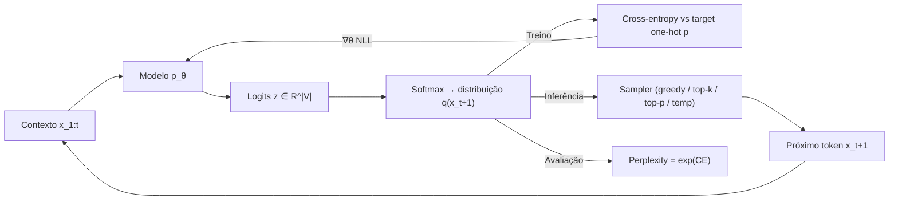
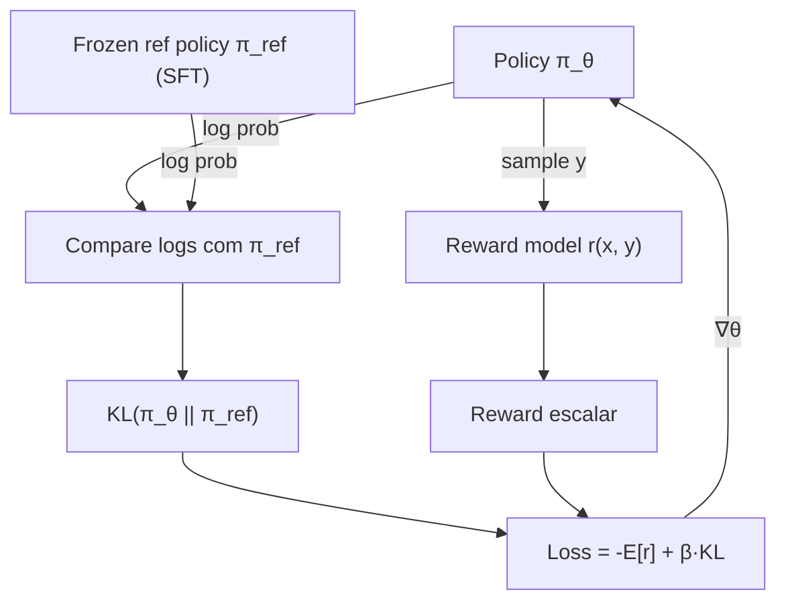
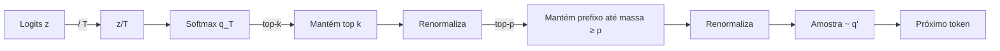
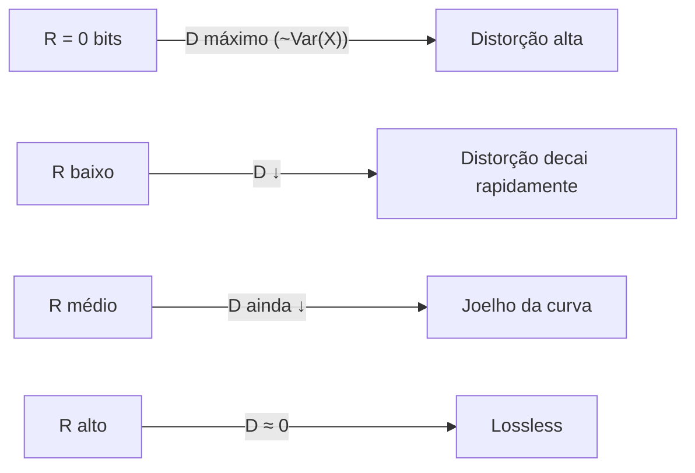

# 03 — Probabilidade e Teoria da Informação: Entropia, KL, Perplexidade e Rate-Distortion

> **Sub-série "LLM Math" — Post 3 de N**
> **Pré-requisitos sugeridos:** Post 01 (cross-entropy loss e geração), Post 02 (álgebra linear).
> **Posts dependentes:** 04 (perplexidade como métrica de quantização), 06 / 06-DEEP (TurboQuant + rate-distortion + Beta), 09 (KL em RLHF/PPO/DPO/GRPO), 12 (InfoNCE / contrastivo), 18 (sampling para reasoning).
> **Tom:** blog matemático rigoroso e didático.
> **Idioma:** Português Brasil. Notação: math em LaTeX, código em Python/NumPy.

---

## TL;DR (leia em 60 segundos)

Uma LLM **não cospe um token** — ela cospe uma **distribuição de probabilidade** sobre o vocabulário inteiro. Treinar uma LLM é **maximizar a verossimilhança** dessa distribuição nos dados (MLE), o que é **matematicamente idêntico** a minimizar **cross-entropy** (Post 01). Avaliá-la é medir **perplexidade**. Alinhá-la (RLHF, DPO, GRPO — Post 09) é **regularizar com KL divergence** contra uma policy de referência. Comprimir os pesos e o KV cache (Post 06 / 06-DEEP) é navegar a curva de **rate-distortion** de Shannon. Amostrar dela (top-k, top-p, temperature) é **modelar a cauda** dessa distribuição.

Tudo isso é **uma única linguagem**: probabilidade + teoria da informação. Este post é o seu vocabulário.

---

## 1. Por que probabilidade é a "linguagem nativa" das LLMs

A primeira coisa que confunde quem vem de software determinístico para LLMs é simples: **o modelo não devolve um token, devolve uma distribuição**. Ele diz "85% chance de `the`, 7% chance de `a`, 3% chance de `an`, 2% chance de `our`, ...". É o sampler — não o modelo — que escolhe um deles.

Isso não é um detalhe de implementação. É o **modelo matemático**:

$$
p_\theta(x_{t+1} \mid x_{1:t})
$$

> $x_{1:t}$ é o contexto (prompt + tokens já gerados), $x_{t+1}$ é o próximo token, $\theta$ são os pesos do modelo, e $p_\theta(\cdot \mid x_{1:t})$ é uma distribuição **categórica** sobre o vocabulário.

Tudo o que importa em LLMs cabe dentro dessa expressão:

| Etapa             | Formalização probabilística                                                  |
| ----------------- | ---------------------------------------------------------------------------- |
| Treino            | MLE: $\theta^\star = \arg\max_\theta \prod_i p_\theta(x_i \mid x_{<i})$      |
| Loss              | NLL = Cross-entropy: $L = -\sum_t \log p_\theta(x_t \mid x_{<t})$            |
| Inferência        | Sampling: $\hat{x}_{t+1} \sim p_\theta(\cdot \mid x_{1:t})$                  |
| Avaliação         | Perplexidade: $\mathrm{PPL} = \exp(\text{CE médio})$                         |
| Alinhamento       | RL: $\max_\pi \mathbb{E}[r] - \beta \, D_{KL}(\pi \,\|\, \pi_{\text{ref}})$  |
| Quantização       | Rate-distortion: dado $R$ bits, minimize $D = \mathbb{E}[\|x - \hat{x}\|^2]$ |

> **Analogia:** uma LLM é uma **previsão do tempo**. Ela não diz "vai chover amanhã"; diz "82% chance de chuva, 15% nublado, 3% sol". O sampler é o seu guarda-chuva.



Mantenha esse diagrama na cabeça enquanto lê o resto. Tudo abaixo é uma anotação dele.

---

## 2. Variáveis aleatórias — uma revisão honesta

Uma **variável aleatória** $X$ é uma função que mapeia resultados de um experimento em números. O "experimento", em LLM, é "olhar para o próximo token gerado". O "número" é o índice no vocabulário.

**Discreta vs contínua:**

- **Discreta:** assume valores em conjunto enumerável. Exemplo: índice de token em vocabulário de 128k entradas. Descrita pela **PMF** (probability mass function) $p(x) = P(X = x)$.
- **Contínua:** assume valores em $\mathbb{R}$ (ou subconjunto). Exemplo: o valor de um peso da rede. Descrita pela **PDF** $f(x)$, com $P(a \leq X \leq b) = \int_a^b f(x)\,dx$.

A **CDF** unifica os dois:

$$
F_X(x) = P(X \leq x).
$$

O **suporte** é onde $p(x) > 0$ (discreta) ou $f(x) > 0$ (contínua). Para um logit pós-softmax, o suporte é o vocabulário inteiro (mesmo que a maioria das probabilidades seja praticamente zero).

**Três exemplos para fixar:**

| Exemplo                | Tipo     | PMF / PDF                                                                              |
| ---------------------- | -------- | -------------------------------------------------------------------------------------- |
| Dado honesto (6 faces) | Discreta | $p(x) = 1/6,\ x \in \{1,\dots,6\}$                                                     |
| Próximo token          | Discreta | $p(x) = \mathrm{softmax}(z)_x = e^{z_x} / \sum_j e^{z_j}$                              |
| Peso gaussiano         | Contínua | $f(x) = \frac{1}{\sigma\sqrt{2\pi}}\exp\!\Big(\!-\frac{(x-\mu)^2}{2\sigma^2}\!\Big)$ |

> **Pegadinha conceitual:** para variáveis contínuas, $P(X = x) = 0$ para qualquer $x$ específico. O que tem significado é a densidade $f(x)$ — não confunda com probabilidade. Por isso $f(x)$ pode ser maior que 1 sem violar nada (uma PDF só precisa ser não-negativa e integrar a 1).

---

## 3. Distribuições importantes para LLM

Aqui está o **catálogo essencial**. Cada uma aparece em pelo menos um lugar do pipeline.

### 3.1 Categorical / Multinomial — o "próximo token"

Categórica é uma generalização de Bernoulli para $k$ classes:

$$
p(X = i) = \pi_i, \quad \sum_{i=1}^k \pi_i = 1, \quad \pi_i \geq 0.
$$

Em LLM, $k = |V|$ (tamanho do vocabulário) e $\pi_i = \mathrm{softmax}(z)_i$. **Multinomial** é o que acontece quando você amostra $N$ tokens independentes — conta quantas vezes cada um saiu.

### 3.2 Gaussian (normal) — pesos e embeddings

$$
f(x; \mu, \sigma^2) = \frac{1}{\sigma\sqrt{2\pi}} \exp\!\Big(\!-\frac{(x-\mu)^2}{2\sigma^2}\!\Big).
$$

Multivariada:

$$
f(\mathbf{x}; \boldsymbol{\mu}, \boldsymbol{\Sigma}) = \frac{1}{(2\pi)^{d/2} |\boldsymbol{\Sigma}|^{1/2}} \exp\!\Big(\!-\tfrac{1}{2}(\mathbf{x} - \boldsymbol{\mu})^\top \boldsymbol{\Sigma}^{-1} (\mathbf{x} - \boldsymbol{\mu})\Big).
$$

**Onde aparece em LLMs:** inicialização de pesos (Xavier/He/N(0, σ²)), prior implícito de SGD, modelagem de ativações, hipótese gaussiana em quantização (Lloyd-Max).

### 3.3 Uniform — dropout, sampling, init

$$
f(x) = \frac{1}{b - a},\quad x \in [a, b].
$$

Usado em **dropout** (máscara Bernoulli derivada de uniforme), **inicialização uniforme**, **amostragem básica** antes de transformações.

### 3.4 Exponential family — o guarda-chuva

Muitas distribuições acima (Gaussian, Categorical, Bernoulli, Beta, Gamma, ...) são casos da **família exponencial**:

$$
p(x; \eta) = h(x) \exp\!\big(\eta^\top T(x) - A(\eta)\big),
$$

onde $\eta$ são parâmetros naturais, $T(x)$ estatísticas suficientes e $A(\eta)$ a log-partição. Por que importa? Porque a softmax é exatamente o **mapeamento inverso** $\eta \mapsto \pi$ da categorical na forma exponencial. Cross-entropy ganha estrutura linda nessa visão.

### 3.5 Bernoulli, Binomial — classificação binária

Bernoulli: $p(X=1) = p$, $p(X=0) = 1-p$. Binomial: soma de $n$ Bernoullis i.i.d. Aparece em classificação binária (toxicidade, segurança), reward models binários do RLHF, tarefas de "next-token = positivo/negativo".

### 3.6 Beta — distribuição sobre $[0,1]$, parente da quantização

$$
f(x; \alpha, \beta) = \frac{x^{\alpha - 1}(1-x)^{\beta - 1}}{B(\alpha, \beta)},\quad x \in [0,1].
$$

**Conexão direta com Post 06:** quando você projeta um vetor unitário $u \in \mathbb{S}^{d-1}$ aleatório uniformemente sobre uma base, a **distribuição marginal de $u_i^2$ é Beta**$(\tfrac{1}{2}, \tfrac{d-1}{2})$. É exatamente esse fato que o **TurboQuant** explora para quantizar com distorção quase ótima.

### 3.7 Resumo + amostragem com NumPy

| Distribuição           | PMF / PDF                                            | Uso típico em LLM                              |
| ---------------------- | ---------------------------------------------------- | ---------------------------------------------- |
| Categorical            | $\pi_i$                                              | Próximo token (softmax sobre vocabulário)      |
| Bernoulli($p$)         | $p^x (1-p)^{1-x}$                                    | Dropout, classificadores binários              |
| Binomial($n,p$)        | $\binom{n}{x} p^x (1-p)^{n-x}$                       | Erros em $n$ tokens, agregadores               |
| Gaussian($\mu,\sigma$) | $\frac{1}{\sigma\sqrt{2\pi}} e^{-(x-\mu)^2/2\sigma^2}$ | Init pesos, ativações, ruído                  |
| Uniform($a,b$)         | $1/(b-a)$                                            | Sampling, dropout mask, init                   |
| Beta($\alpha,\beta$)   | $\frac{x^{\alpha-1}(1-x)^{\beta-1}}{B(\alpha,\beta)}$ | Quantização (TurboQuant), priors             |
| Exponential family     | $h(x)e^{\eta^\top T(x) - A(\eta)}$                   | Guarda-chuva — softmax, exp loss, etc.        |

```python
import numpy as np
rng = np.random.default_rng(42)

# Categorical: amostrar próximo token de softmax
logits = np.array([2.0, 1.0, 0.5, -1.0, 0.0])
probs = np.exp(logits - logits.max())
probs /= probs.sum()
token = rng.choice(len(probs), p=probs)
print("Categorical sample:", token, "with probs", probs.round(3))

# Bernoulli (dropout mask)
mask = rng.binomial(1, 0.9, size=8)
print("Dropout mask (keep prob 0.9):", mask)

# Gaussian (init de uma camada)
W = rng.normal(0, 0.02, size=(4, 4))
print("Gaussian init W shape:", W.shape, "mean:", W.mean().round(4))

# Uniform
u = rng.uniform(-1, 1, size=5)
print("Uniform [-1, 1]:", u.round(3))

# Beta (parametrização TurboQuant)
beta_samples = rng.beta(0.5, (1024 - 1) / 2, size=5)
print("Beta(1/2, (d-1)/2) for d=1024:", beta_samples.round(5))
```

> **Analogia:** distribuições são **moldes**. A Gaussiana é o molde "sino", a Categorical é o "espectro de chances", a Beta é a "modelagem de proporções". Você está sempre escolhendo um molde para a sua incerteza.

---

## 4. Expectativa, variância e os teoremas que sustentam SGD

### 4.1 Expectativa

A **expectativa** (média ponderada) é o "centro de massa" da distribuição:

$$
\mathbb{E}[X] = \sum_{x} x \cdot p(x) \quad \text{(discreta)}, \qquad
\mathbb{E}[X] = \int x \cdot f(x)\, dx \quad \text{(contínua)}.
$$

Para função de variável aleatória:

$$
\mathbb{E}[g(X)] = \sum_x g(x)\,p(x).
$$

A **linearidade da expectativa** é o resultado mais útil de toda a probabilidade aplicada:

$$
\mathbb{E}[aX + bY] = a\,\mathbb{E}[X] + b\,\mathbb{E}[Y],
$$

**mesmo que $X$ e $Y$ não sejam independentes**. É o que justifica decompor uma loss agregada em soma de losses por exemplo.

### 4.2 Variância

$$
\mathrm{Var}(X) = \mathbb{E}\!\left[(X - \mu)^2\right] = \mathbb{E}[X^2] - (\mathbb{E}[X])^2.
$$

Mede dispersão. **Desvio padrão**: $\sigma = \sqrt{\mathrm{Var}(X)}$.

Para somas independentes: $\mathrm{Var}(X + Y) = \mathrm{Var}(X) + \mathrm{Var}(Y)$ (somente sob independência).

### 4.3 Lei dos grandes números (LLN)

Se $X_1, X_2, \dots$ são i.i.d. com média $\mu$, então:

$$
\bar{X}_n = \frac{1}{n}\sum_{i=1}^n X_i \xrightarrow{n \to \infty} \mu.
$$

**Por que importa em LLM:** o **mini-batch** é uma estimativa Monte Carlo do gradiente da loss esperada. Sem LLN, SGD não convergiria nem em expectativa.

### 4.4 Teorema central do limite (CLT)

Sob condições suaves:

$$
\sqrt{n}\,(\bar{X}_n - \mu) \xrightarrow{d} \mathcal{N}(0, \sigma^2).
$$

A média de muitas variáveis aleatórias **converge em distribuição para uma gaussiana**. É por isso que ativações de camadas profundas tendem a ser aproximadamente gaussianas (e por que técnicas como **rotação aleatória + quantização escalar** do TurboQuant funcionam: a marginal de uma direção aleatória converge para Beta/Normal por concentração).

> **Analogia:** LLN é "se eu jogar o dado mil vezes, a média vai bater em 3.5". CLT é "e o erro entre essa média e 3.5 vai ser quase gaussiano se eu jogar bastante".

---

## 5. Probabilidade condicional, Bayes e a cadeia autoregressiva

### 5.1 Condicional

$$
P(A \mid B) = \frac{P(A \cap B)}{P(B)},\quad P(B) > 0.
$$

### 5.2 Independência

$$
P(A \cap B) = P(A)\,P(B) \iff P(A \mid B) = P(A).
$$

Tokens em uma frase **não são independentes** — é exatamente isso que torna o problema interessante.

### 5.3 Bayes

$$
P(A \mid B) = \frac{P(B \mid A)\,P(A)}{P(B)}.
$$

**Posterior $\propto$ Likelihood $\times$ Prior**. Será o eixo do bloco "Bayes em ML" mais à frente.

### 5.4 A regra da cadeia — **a definição matemática de uma LLM**

Para uma sequência $x_1, \dots, x_n$:

$$
P(x_1, x_2, \dots, x_n) = \prod_{t=1}^{n} P(x_t \mid x_1, \dots, x_{t-1}) = \prod_{t=1}^{n} P(x_t \mid x_{<t}).
$$

Isso é uma **identidade**, não uma aproximação. Toda distribuição conjunta sobre sequências pode ser fatorada assim. Uma **LLM autoregressiva** (GPT, Llama, Qwen, Mistral, ...) é exatamente um modelo paramétrico para essa fatoração:

$$
p_\theta(x_1, \dots, x_n) = \prod_{t=1}^{n} p_\theta(x_t \mid x_{<t}).
$$

**O Transformer aprende uma família de distribuições condicionais** $p_\theta(\cdot \mid x_{<t})$, parametrizadas por seus pesos. Tudo o resto — atenção, MLP, KV cache (Post 06) — é encanamento computacional para avaliar essa condicional.

> **Pegadinha:** modelos não-autoregressivos (BERT/MLM) usam **outra fatoração** (mascarada). Difusão de texto usa outra ainda. Mas a esmagadora maioria das LLMs generativas atuais é AR, e por isso a cadeia condicional acima é o esqueleto matemático que importa.

---

## 6. Entropia (Shannon) — a quantidade de informação

### 6.1 Definição

Para uma distribuição discreta $p$ sobre $\mathcal{X}$:

$$
H(X) = H(p) = -\sum_{x \in \mathcal{X}} p(x) \log p(x).
$$

Convenções:
- $\log_2$ → unidade **bits** (Shannon).
- $\log_e$ (ln) → unidade **nats** (mais comum em ML).
- $0 \log 0 := 0$ (limite).

### 6.2 Intuição — "surpresa esperada"

Defina **conteúdo de informação** (surpresa) de um evento $x$ como:

$$
I(x) = -\log p(x).
$$

Eventos raros ($p \to 0$) têm surpresa altíssima ($I \to \infty$). Eventos certos ($p = 1$) não trazem surpresa nenhuma ($I = 0$). A **entropia é a expectativa da surpresa**:

$$
H(X) = \mathbb{E}_p[I(X)] = \mathbb{E}_p[-\log p(X)].
$$

> **Analogia:** entropia é "**quanto a próxima mensagem te surpreende em média**". Um modelo com baixa entropia condicional é **certeiro**; um com alta é **vago**.

### 6.3 Casos extremos

| Distribuição                              | Entropia                  | Significado                         |
| ----------------------------------------- | ------------------------- | ----------------------------------- |
| Determinística ($p(x_0) = 1$)             | $H = 0$                   | Sem surpresa nenhuma                |
| Uniforme sobre $n$ valores                | $H = \log n$              | Surpresa máxima possível            |
| Categorical concentrada (ex.: 99% em um)  | $H \approx 0$             | Quase determinística                |

### 6.4 Entropia diferencial (contínua)

$$
h(X) = -\int f(x)\log f(x)\, dx.
$$

**Cuidado:** ao contrário da discreta, $h$ pode ser **negativa**. Não a interprete diretamente como "bits de informação" — ela só é bem comportada em diferenças (KL divergence resolve esse problema).

### 6.5 Código

```python
import numpy as np

def entropy(p, base=np.e, eps=1e-12):
    """
    Entropia de Shannon para distribuição discreta p.
    base=e -> nats; base=2 -> bits.
    """
    p = np.asarray(p, dtype=np.float64)
    p = p / p.sum()
    log = np.log if base == np.e else (np.log2 if base == 2 else (lambda x: np.log(x) / np.log(base)))
    return float(-np.sum(p * log(p + eps)))

p_uniform = np.ones(8) / 8
p_peak    = np.array([0.95, 0.01, 0.01, 0.01, 0.01, 0.005, 0.003, 0.002])
print("H uniforme  (bits):", entropy(p_uniform, base=2))   # 3.0
print("H concentrada (bits):", entropy(p_peak,   base=2))  # ~0.5
print("H uniforme  (nats):", entropy(p_uniform))           # ln 8 ≈ 2.08

# Entropia da softmax de logits
def softmax(z):
    z = z - z.max()
    e = np.exp(z)
    return e / e.sum()

logits = np.array([3.0, 1.0, 0.5, 0.2, 0.0])
print("H softmax (nats):", entropy(softmax(logits)))
```

---

## 7. Cross-entropy — a loss padrão de toda LLM

### 7.1 Definição

Dadas duas distribuições $p$ (**verdadeira**) e $q$ (**modelo**) sobre o mesmo suporte:

$$
H(p, q) = -\sum_x p(x) \log q(x).
$$

Esta é a **cross-entropy** de $p$ em relação a $q$. Em palavras: "**quantos bits/nats em média preciso para codificar amostras de $p$ usando um código ótimo desenhado para $q$**".

### 7.2 A desigualdade de Gibbs

$$
H(p, q) \geq H(p), \quad \text{com igualdade sse } p = q.
$$

Sempre se paga um "imposto" por usar a distribuição errada. Esse imposto se chama **KL divergence** (Seção 8). De fato:

$$
H(p, q) = H(p) + D_{KL}(p \,\|\, q).
$$

### 7.3 Cross-entropy como loss de LLM

No treino, para cada posição $t$, o **target é one-hot**: $p(x) = \mathbb{1}[x = x_t^{\text{true}}]$. A loss CE colapsa para:

$$
L_t = -\log q_\theta(x_t^{\text{true}} \mid x_{<t}).
$$

Sobre uma sequência inteira:

$$
L = -\sum_{t=1}^{n} \log q_\theta(x_t \mid x_{<t}) = -\log p_\theta(x_{1:n}).
$$

Isto é o **negative log-likelihood** (NLL). **Treinar com cross-entropy = maximizar likelihood = MLE**. Os três nomes — cross-entropy, NLL, MLE — descrevem **o mesmo procedimento numérico**, vistos por óticas diferentes (informação, estatística, otimização).

### 7.4 Conexão com Post 01

No Post 01 entramos no `forward` do Transformer. A última camada emite logits, a softmax converte em $q$, e a CE acima fecha o ciclo. Aqui você ganha a **justificativa da informação**: minimizar essa loss é minimizar o número médio de bits necessários para codificar a verdade usando o código que sua rede sugere. O Transformer está, literalmente, **aprendendo a comprimir o corpus**.

### 7.5 Código — CE manual

```python
import numpy as np

def cross_entropy_loss(logits, targets, eps=1e-12):
    """
    logits: (B, T, V) reais
    targets: (B, T) índices em [0, V)
    Retorna escalar: CE médio (nats).
    """
    B, T, V = logits.shape
    z = logits - logits.max(axis=-1, keepdims=True)
    log_softmax = z - np.log(np.exp(z).sum(axis=-1, keepdims=True) + eps)
    nll = -log_softmax[np.arange(B)[:, None], np.arange(T)[None, :], targets]
    return nll.mean()

rng = np.random.default_rng(0)
logits  = rng.normal(size=(2, 5, 32))
targets = rng.integers(0, 32, size=(2, 5))
print("CE loss (nats):", cross_entropy_loss(logits, targets))
print("PPL aprox:", np.exp(cross_entropy_loss(logits, targets)))
```

> **Analogia:** cross-entropy é **quanto sua aposta erra a verdade na média**. Acertou em cheio? Paga zero. Apostou 1% no que era certo? Paga $-\log 0.01 \approx 4.6$ nats — uma vergonha estatística.

---

## 8. KL divergence — a estrela do alinhamento

### 8.1 Definição

$$
D_{KL}(p \,\|\, q) = \sum_x p(x) \log \frac{p(x)}{q(x)} = \mathbb{E}_p\!\left[\log \frac{p(X)}{q(X)}\right].
$$

Equivalente:

$$
D_{KL}(p \,\|\, q) = H(p, q) - H(p).
$$

### 8.2 Propriedades

| Propriedade               | KL                                                                |
| ------------------------- | ----------------------------------------------------------------- |
| Não-negatividade          | $D_{KL} \geq 0$ (Gibbs)                                           |
| Zero sse                  | $p = q$ quase em todo lugar                                       |
| Simetria                  | **Não**: $D_{KL}(p\|q) \neq D_{KL}(q\|p)$ em geral                |
| Desigualdade triangular   | **Não satisfaz**                                                  |
| Métrica?                  | **Não** (é uma "divergência")                                     |
| Suporte                   | $D_{KL}(p\|q) = \infty$ se $\exists x$ com $p(x) > 0, q(x) = 0$   |

### 8.3 Forward vs Reverse KL — comportamento qualitativo

| Versão                    | Fórmula                  | Comportamento                                       |
| ------------------------- | ------------------------ | --------------------------------------------------- |
| **Forward** $D_{KL}(p\|q)$ | $\sum p \log \tfrac{p}{q}$ | "$q$ tem que cobrir tudo onde $p$ vive" — **mode-covering** |
| **Reverse** $D_{KL}(q\|p)$ | $\sum q \log \tfrac{q}{p}$ | "$q$ tem que evitar onde $p$ é zero" — **mode-seeking**     |

Em treino LLM padrão (MLE/cross-entropy), a CE corresponde ao **Forward KL** (já que minimizar $H(p,q)$ com $p$ fixa é minimizar $D_{KL}(p\|q) + \text{const}$). Em variational inference (VAE) e em **DPO**, frequentemente entra a **Reverse KL** ou versões regularizadas.

### 8.4 Aplicações em LLM

#### (a) PPO em RLHF — "rédea curta"

O objetivo do **PPO** em RLHF inclui uma **penalidade de KL**:

$$
J_{\text{PPO}}(\theta) = \mathbb{E}_{x \sim \pi_\theta}[\,r(x)\,] - \beta \, D_{KL}\!\big(\pi_\theta \,\|\, \pi_{\text{ref}}\big).
$$

> $\pi_{\text{ref}}$ é o modelo SFT inicial (a "base"), $\pi_\theta$ é a policy em treino, $r(x)$ é o reward (modelo de recompensas treinado em preferências humanas), $\beta$ controla quão "presa" a policy fica à referência.

Sem o termo de KL, a policy faria **reward hacking** — encontraria sequências de tokens com reward alto mas linguagem completamente degenerada. O KL é a **rédea curta** que mantém o cavalo na rota.

#### (b) GRPO — KL dentro do objetivo

GRPO (DeepSeek) usa a mesma estrutura, com vantagens normalizadas por grupo e KL contra referência:

$$
J_{\text{GRPO}}(\theta) = \mathbb{E}\!\left[\text{clipped surrogate}\right] - \beta\, D_{KL}\!\big(\pi_\theta \,\|\, \pi_{\text{ref}}\big).
$$

#### (c) DPO — KL **derivado** da formulação

DPO **fecha analiticamente** o problema "$\max_\pi \mathbb{E}[r] - \beta D_{KL}(\pi\|\pi_{\text{ref}})$" e reescreve em termos de pares de preferência. A loss final não tem KL explícito, mas a **forma fechada vem da regularização KL**:

$$
\pi^\star(y\mid x) \propto \pi_{\text{ref}}(y\mid x)\exp\!\Big(\tfrac{1}{\beta}r(x,y)\Big).
$$

Substituindo na log-razão de pares de preferência $(y_w, y_l)$, chega-se à loss de DPO:

$$
L_{\text{DPO}} = -\mathbb{E}\!\left[\log \sigma\!\Big(\beta \log\tfrac{\pi_\theta(y_w\mid x)}{\pi_{\text{ref}}(y_w\mid x)} - \beta \log\tfrac{\pi_\theta(y_l\mid x)}{\pi_{\text{ref}}(y_l\mid x)}\Big)\right].
$$

Detalhe completo — incluindo SQUAREDPO e f-divergence DPO — fica para o **Post 09**.

#### (d) Knowledge distillation

Modelo "professor" $p_T$, "aluno" $p_S$ — minimiza-se:

$$
L_{\text{KD}} = D_{KL}\!\big(p_T(\cdot\mid x) \,\|\, p_S(\cdot\mid x)\big).
$$

O aluno aprende a **distribuição inteira** do professor (não só o argmax) — isto carrega muito mais sinal que o one-hot original.

#### (e) Variational inference / VAE

ELBO = $\mathbb{E}_{q(z\mid x)}[\log p(x\mid z)] - D_{KL}(q(z\mid x)\,\|\, p(z))$. O KL aqui regulariza a posterior aproximada $q$ em direção à prior $p(z)$.

### 8.5 Diagrama do KL no PPO



### 8.6 Código

```python
import numpy as np

def kl_divergence(p, q, eps=1e-12):
    p = np.asarray(p, dtype=np.float64); p = p / p.sum()
    q = np.asarray(q, dtype=np.float64); q = q / q.sum()
    return float(np.sum(p * (np.log(p + eps) - np.log(q + eps))))

p = np.array([0.5, 0.3, 0.2])
q = np.array([0.4, 0.4, 0.2])
print("KL(p||q):", kl_divergence(p, q))
print("KL(q||p):", kl_divergence(q, p))   # diferente!
print("KL(p||p):", kl_divergence(p, p))   # 0
```

> **Analogia:** KL é o **custo extra de comprimir mensagens de $p$ usando um codebook desenhado para $q$**. Se $p = q$, não há custo extra (KL = 0). Se você desenhou para outra distribuição, paga o "imposto" por cada mensagem.

---

## 9. Outras divergências — JS, TV, $\alpha$, Wasserstein

| Divergência                    | Fórmula                                                                | Propriedades                                    |
| ------------------------------ | ---------------------------------------------------------------------- | ----------------------------------------------- |
| KL                             | $\sum p \log(p/q)$                                                     | Assimétrica, $\geq 0$, infinita em descasamento de suporte |
| Jensen-Shannon (JS)            | $\tfrac{1}{2} D_{KL}(p\|m) + \tfrac{1}{2} D_{KL}(q\|m), m=\tfrac{p+q}{2}$ | Simétrica, finita, $\sqrt{JS}$ é métrica       |
| Total Variation (TV)           | $\tfrac{1}{2}\sum |p(x) - q(x)|$                                       | Simétrica, métrica, em $[0, 1]$                 |
| $\alpha$-divergence            | $\frac{1}{\alpha(1-\alpha)}\big(1 - \sum p^\alpha q^{1-\alpha}\big)$    | Família ($\alpha = 1 \to$ KL forward; $0 \to$ reverse) |
| Wasserstein-1 ($W_1$)          | $\inf_{\gamma \in \Pi(p,q)} \mathbb{E}_{(x,y)\sim\gamma}\|x-y\|$         | Métrica de transporte ótimo; lida bem com suportes disjuntos |

**Por que TV importa para LLM:** a prova de correção do **speculative decoding** (e suas variantes) costuma usar **bound de TV** entre policy e draft model. Veremos no **Post 08-DEEP**.

**Por que Wasserstein importa:** GAN moderno (WGAN), **transporte ótimo de embeddings**, alinhamento entre línguas.

```python
def total_variation(p, q):
    p = np.asarray(p) / np.sum(p)
    q = np.asarray(q) / np.sum(q)
    return 0.5 * np.sum(np.abs(p - q))

def jensen_shannon(p, q, eps=1e-12):
    p = np.asarray(p) / np.sum(p)
    q = np.asarray(q) / np.sum(q)
    m = 0.5 * (p + q)
    return 0.5 * kl_divergence(p, m) + 0.5 * kl_divergence(q, m)

p = np.array([0.5, 0.3, 0.2]); q = np.array([0.4, 0.4, 0.2])
print("TV:", total_variation(p, q))
print("JS:", jensen_shannon(p, q))
```

---

## 10. Mutual information — quanto $X$ "sabe" sobre $Y$

### 10.1 Definição

$$
I(X; Y) = D_{KL}\!\big(p(x, y) \,\|\, p(x)\,p(y)\big) = \sum_{x, y} p(x, y) \log \frac{p(x, y)}{p(x)\,p(y)}.
$$

Equivalente:

$$
I(X; Y) = H(X) - H(X \mid Y) = H(Y) - H(Y \mid X).
$$

> **Analogia:** mutual information é "**quanto saber $X$ reduz a sua incerteza sobre $Y$**". Se $X$ e $Y$ são independentes, $I = 0$. Se $Y = f(X)$ (determinístico), $I(X;Y) = H(Y)$ — saber $X$ resolve $Y$ inteiro.

### 10.2 Aplicações

- **Representation learning** (Post 12 — contrastive): InfoNCE é um **lower bound** de mutual information entre âncora e visão positiva.
- **Feature selection**: escolher features que maximizam $I$ com a label.
- **Information bottleneck**: $\min I(X; Z) - \beta I(Z; Y)$ — princípio para representações comprimidas mas preditivas.
- **Estimação na prática**: KSG, MINE, InfoNCE.

### 10.3 InfoNCE como bound de MI

$$
L_{\text{InfoNCE}} = -\mathbb{E}\!\left[\log \frac{\exp\!\big(\mathrm{sim}(q, k^+)/\tau\big)}{\sum_{i=1}^N \exp\!\big(\mathrm{sim}(q, k_i)/\tau\big)}\right].
$$

Vale (Oord et al., 2018):

$$
I(q; k^+) \geq \log N - L_{\text{InfoNCE}}.
$$

Maximizar similaridade do par positivo contra negativos amostrados $\Rightarrow$ maximizar um lower bound de MI. Por isso contrastivo "funciona". Detalhamento no **Post 12**.

```python
import numpy as np

def info_nce_loss(q, K_pos, K_neg, tau=0.1):
    """
    q: (d,) anchor
    K_pos: (d,) positivo
    K_neg: (N-1, d) negativos
    """
    sim_pos = q @ K_pos / tau
    sim_neg = K_neg @ q / tau
    logits = np.concatenate([[sim_pos], sim_neg])
    log_softmax = logits - np.log(np.exp(logits - logits.max()).sum()) - logits.max()
    return float(-log_softmax[0])

rng = np.random.default_rng(1)
d, N = 8, 10
q     = rng.normal(size=d)
K_pos = q + 0.05 * rng.normal(size=d)
K_neg = rng.normal(size=(N-1, d))
print("InfoNCE loss:", info_nce_loss(q, K_pos, K_neg))
```

---

## 11. Perplexidade — entropia "exponenciada"

### 11.1 Definição

$$
\mathrm{PPL}(q) = \exp\!\Big(\!H(p, q)\!\Big) = \exp\!\Big(\!-\frac{1}{N} \sum_{t=1}^N \log q(x_t \mid x_{<t})\!\Big).
$$

(Use $2^{(\cdot)}$ se está em bits; padrão atual em LLMs é nats com $e^{(\cdot)}$.)

### 11.2 Intuição — "vocabulário efetivo"

Se sua perplexidade é 30, é como se o modelo, em média, estivesse **escolhendo entre 30 tokens equiprováveis**. Quanto **menor**, melhor o modelo (mais certeiro).

| Modelo                           | PPL típica em texto inglês |
| -------------------------------- | -------------------------- |
| Random uniforme sobre vocab 50k  | ~50.000                    |
| n-gram baseline forte            | ~150 – 300                 |
| GPT-2 small                      | ~30 – 40                   |
| LLM atual de fronteira em Wiki   | ~3 – 8                     |

### 11.3 Pegadinha — incomparabilidade entre tokenizers

PPL **depende da unidade de medida**: tokens (sub-words). Comparar PPL entre modelos com tokenizers diferentes é **fraude estatística** (a menos que normalize por bytes/caracteres). Use **bits-per-byte (BPB)** quando comparar modelos com vocabulários distintos.

### 11.4 PPL como métrica de quantização (Posts 04 e 05)

Avaliar quanto **um modelo quantizado** se degrada vs o original = medir aumento de PPL no mesmo corpus. Empiricamente:

- $\Delta \mathrm{PPL} < 1\%$ → quantização "transparente".
- $\Delta \mathrm{PPL} \in [1\%, 5\%]$ → degradação aceitável em muitos casos.
- $\Delta \mathrm{PPL} > 10\%$ → degradação visível em downstream.

```python
def perplexity_from_loss(ce_nats):
    return float(np.exp(ce_nats))

ce = 2.5  # nats
print("PPL:", perplexity_from_loss(ce))  # ~12.18
```

---

## 12. Sampling — como transformar distribuição em texto

### 12.1 Greedy

$$
\hat{x}_{t+1} = \arg\max_x q(x \mid x_{<t}).
$$

Determinístico, conservador, frequentemente repetitivo. Usado em **eval** (reproducibilidade) e em prompts curtos onde só importa o "best guess".

### 12.2 Temperature

$$
q_T(x) = \frac{\exp(z_x / T)}{\sum_j \exp(z_j / T)}.
$$

- $T \to 0$ → greedy.
- $T = 1$ → softmax original.
- $T > 1$ → distribuição mais **achatada** (mais aleatório).

> **Analogia:** temperature é o **termostato da criatividade**.

### 12.3 Top-k

Mantém apenas os $k$ tokens com maior logit; renormaliza; amostra.

$$
S_k = \mathrm{TopK}(z, k), \quad q'(x) = \begin{cases} q(x)/Z_k & x \in S_k \\ 0 & \text{c.c.} \end{cases}
$$

### 12.4 Top-p (nucleus)

Ordena tokens por probabilidade decrescente; mantém o menor prefixo cuja **massa cumulativa** $\geq p$ (ex.: 0.9); renormaliza; amostra.

> **Analogia:** "deixar só os candidatos que **somam 90% de confiança**".

### 12.5 Min-p

Mantém apenas tokens com $q(x) \geq \rho \cdot \max_x q(x)$. Adapta o "corte" à confiança do modelo (em distribuições agudas mantém poucos; em achatadas mantém muitos).

### 12.6 Mirostat

Controla a **perplexidade alvo** durante a geração via feedback loop sobre a temperatura efetiva. Usado em conversação para evitar perplexidade explodir/colapsar.

### 12.7 Typical / Locally typical / DRY

- **Typical sampling**: mantém tokens com $-\log q(x) \approx H(q)$ — penaliza tanto "óbvio demais" quanto "raro demais".
- **DRY** (Don't Repeat Yourself): penaliza n-gramas já vistos no contexto.

### 12.8 Beam search

Mantém top-$B$ sequências parciais. Caro, **subutilizado em LLMs modernas** (favorece sequências curtas e seguras; mata diversidade). Útil em tradução clássica e ASR.

### 12.9 Tabela comparativa

| Técnica              | Parâmetros         | Quando usar                                         |
| -------------------- | ------------------ | --------------------------------------------------- |
| Greedy               | —                  | Eval, código, factual                               |
| Temperature          | $T$                | Em conjunto com top-k/p; ajusta criatividade        |
| Top-k                | $k$                | Limite duro; simples                                |
| Top-p                | $p \in (0,1)$      | Padrão moderno; adapta-se a confiança do modelo     |
| Min-p                | $\rho \in (0,1)$   | Alternativa robusta a top-p                         |
| Mirostat             | $\tau,\eta$        | Conversação longa, controle de PPL                  |
| Typical              | $\tau$             | Texto criativo coerente                             |
| DRY                  | n-gram window      | Reduzir loops repetitivos                           |
| Beam search          | $B$                | Tradução clássica, raro em LLMs generativas         |



### 12.10 Código

```python
import numpy as np

def softmax_T(logits, T=1.0):
    z = logits / T
    z = z - z.max()
    e = np.exp(z)
    return e / e.sum()

def top_k(probs, k):
    k = min(k, probs.size)
    idx = np.argpartition(-probs, k)[:k]
    mask = np.zeros_like(probs); mask[idx] = probs[idx]
    s = mask.sum()
    return mask / s if s > 0 else probs

def top_p(probs, p=0.9):
    order = np.argsort(-probs)
    sorted_p = probs[order]
    cum = np.cumsum(sorted_p)
    cutoff = np.searchsorted(cum, p) + 1
    keep = order[:cutoff]
    out = np.zeros_like(probs); out[keep] = probs[keep]
    return out / out.sum()

def min_p(probs, rho=0.05):
    th = rho * probs.max()
    out = np.where(probs >= th, probs, 0.0)
    return out / out.sum()

rng = np.random.default_rng(7)
logits = rng.normal(size=20) * 1.5
q1 = softmax_T(logits, T=1.0)
print("argmax greedy:", q1.argmax())
print("amostra T=0.7, top-p 0.9:",
      rng.choice(20, p=top_p(softmax_T(logits, T=0.7), p=0.9)))
print("amostra top-k 5:",
      rng.choice(20, p=top_k(q1, k=5)))
print("amostra min-p 0.1:",
      rng.choice(20, p=min_p(q1, rho=0.1)))
```

---

## 13. MLE — Maximum Likelihood Estimation

### 13.1 Likelihood

Dados $\mathcal{D} = \{x_1, \dots, x_N\}$ i.i.d. de $p_\theta$:

$$
\mathcal{L}(\theta) = \prod_{i=1}^N p_\theta(x_i).
$$

Em sequência (LLM):

$$
\mathcal{L}(\theta) = \prod_{i=1}^N \prod_{t=1}^{T_i} p_\theta(x_t^{(i)} \mid x_{<t}^{(i)}).
$$

### 13.2 Log-likelihood e NLL

$$
\ell(\theta) = \log \mathcal{L}(\theta) = \sum_{i,t} \log p_\theta(x_t^{(i)} \mid x_{<t}^{(i)}),
$$

$$
\text{NLL}(\theta) = -\ell(\theta).
$$

### 13.3 MLE = treinar LLM

$$
\theta^\star = \arg\max_\theta \mathcal{L}(\theta) = \arg\min_\theta \text{NLL}(\theta) = \arg\min_\theta \text{Cross-entropy}.
$$

**Os três objetos são literalmente o mesmo**. Quando alguém diz "treinar com cross-entropy loss", está fazendo MLE em $p_\theta$.

---

## 14. Bayes em ML — para completude

| Procedimento     | Forma fechada                               | Característica                           |
| ---------------- | ------------------------------------------- | ---------------------------------------- |
| MLE              | $\arg\max_\theta p(\mathcal{D}\mid\theta)$  | Sem prior; risco de overfitting          |
| MAP              | $\arg\max_\theta p(\mathcal{D}\mid\theta)\,p(\theta)$ | Adiciona prior (regularização)        |
| Bayesian (full)  | $p(\theta\mid\mathcal{D}) \propto p(\mathcal{D}\mid\theta)\,p(\theta)$ | Distribuição posterior sobre pesos |

**Bayesian deep learning** (variational inference, MC dropout, Laplace approximations) é elegante mas raro em produção (caro). Hoje o padrão de fato em LLMs é **MLE + regularização heurística** (weight decay como prior gaussiano implícito, dropout como estimador estocástico).

> **Observação histórica:** o **weight decay** $\lambda \|\theta\|^2$ usado em otimização equivale a um prior gaussiano $\theta \sim \mathcal{N}(0, \sigma^2 I)$ no objetivo MAP. Você está fazendo Bayes — só não está chamando assim.

---

## 15. Information theory na quantização — rate-distortion (Posts 06 / 06-DEEP)

### 15.1 Setup

Dado uma fonte $X \sim p$ e um codificador-decodificador $f: \mathcal{X} \to \{0,1\}^R \to \hat{\mathcal{X}}$, com:

- **Rate** $R$: número médio de bits por símbolo.
- **Distortion** $D$: erro esperado, ex.: $D = \mathbb{E}\|X - \hat{X}\|^2$ (MSE).

### 15.2 Função rate-distortion de Shannon

$$
R(D) = \min_{\substack{p(\hat{x}\mid x) :\\ \mathbb{E}\,d(X,\hat{X}) \leq D}} I(X; \hat{X}).
$$

> Em palavras: o **menor número de bits** (medido pela mutual information entre fonte e reconstrução) para garantir distorção $\leq D$.

Equivalentemente, **D(R)** = menor distorção achievable com $R$ bits.

### 15.3 Curva R(D) — qualitativa



A curva é **convexa decrescente**, partindo de $(R=0, D=\mathrm{Var}(X))$ e indo a $(R=H(X), D=0)$ no limite discreto sem perda.

### 15.4 Lloyd-Max — quantizador escalar 1D ótimo

Dado $X \sim p$ e $L$ níveis $\{y_1, \dots, y_L\}$ com fronteiras $\{b_0, \dots, b_L\}$, Lloyd-Max minimiza $\mathbb{E}\|X - \hat{X}\|^2$ alternando:

1. $b_i = (y_i + y_{i+1})/2$ (Voronoi).
2. $y_i = \mathbb{E}[X \mid b_{i-1} \leq X \leq b_i]$ (centroide).

Para $X \sim \mathcal{N}(0, 1)$ e $L$ níveis, dá os famosos quantizadores normais ótimos (tabelados em livros de signal processing).

```python
import numpy as np

def lloyd_max_1d(samples, L, n_iter=50, seed=0):
    """Quantizador escalar Lloyd-Max em amostras 1D."""
    rng = np.random.default_rng(seed)
    samples = np.sort(np.asarray(samples).ravel())
    centers = np.quantile(samples, np.linspace(1/(2*L), 1 - 1/(2*L), L))
    for _ in range(n_iter):
        boundaries = (centers[:-1] + centers[1:]) / 2.0
        bins = np.digitize(samples, boundaries)
        new_centers = np.array([
            samples[bins == i].mean() if np.any(bins == i) else centers[i]
            for i in range(L)
        ])
        if np.allclose(new_centers, centers): break
        centers = new_centers
    boundaries = (centers[:-1] + centers[1:]) / 2.0
    bins = np.digitize(samples, boundaries)
    mse = float(np.mean((samples - centers[bins])**2))
    return centers, boundaries, mse

rng = np.random.default_rng(42)
x = rng.normal(size=100_000)
centers, boundaries, mse = lloyd_max_1d(x, L=4, n_iter=100)
print("Centros (4 níveis):", centers.round(3))
print("MSE Lloyd-Max:", round(mse, 4), "vs Var:", round(x.var(), 4))
```

### 15.5 Shannon Lower Bound (SLB) e TurboQuant

Para vetores em $\mathbb{S}^{d-1}$ (esfera unitária), a SLB diz:

$$
D \geq c \cdot 4^{-R/d},
$$

onde $R$ é total de bits, $d$ a dimensão, $c$ constante explícita. **Nenhum** quantizador pode fazer melhor que isso assintoticamente.

**TurboQuant** (Post 06 / 06-DEEP) atinge **MSE** dentro de um fator pequeno ($\approx 2.7$) da SLB ao:

1. Aplicar **rotação aleatória** ao vetor → coordenadas concentram em distribuição **Beta**$(\tfrac{1}{2}, \tfrac{d-1}{2})$.
2. Usar **quantização escalar ótima** por coordenada (Lloyd-Max para Beta).
3. Adicionar passe **QJL (1-bit Quantized JL)** para inner product não-enviesado.

Resultado: KV cache de LLM em **3.5 bits/canal** (transparente em qualidade) ou **2.5 bits/canal** (degradação marginal). Detalhe matemático completo no **Post 06-DEEP**.

| Distribuição     | $\sigma^2$ | $D(R)$ aproximada (MSE)      | Notas                                 |
| ---------------- | ---------- | ---------------------------- | ------------------------------------- |
| Gaussian $N(0,1)$ | 1          | $D \approx 2^{-2R}$         | Limite ótimo conhecido                |
| Uniform $[-1,1]$  | $1/3$      | $D \approx (1/3)\,2^{-2R}$  | Lloyd-Max ótimo conhecido             |
| Coord. de $u\in\mathbb{S}^{d-1}$ | $1/d$ | TurboQuant ≈ SLB         | Beta marginal explica concentração    |

---

## 16. Concentração de medida — por que altas dimensões "funcionam"

### 16.1 O fenômeno

Em **alta dimensão**, "quase tudo" se concentra. Para $X \sim \mathcal{N}(0, I_d)$:

$$
\|X\|_2 \approx \sqrt{d} \pm O(1).
$$

Vetores aleatórios vivem em uma **casca esférica fina** ao redor da esfera de raio $\sqrt{d}$. Não no centro, não na superfície grossa — em uma **casca**.

### 16.2 Inner product de gaussianas normalizadas

Para $X, Y \sim \mathcal{N}(0, I_d)$ independentes,

$$
\frac{X^\top Y}{\|X\|\,\|Y\|} \xrightarrow{d \to \infty} 0
$$

quase certamente, e a **variância cai como $1/d$**. Em dimensões $d \sim 1024$, dois vetores aleatórios são **praticamente ortogonais** com alta probabilidade. Isso justifica:

- **Embeddings randômicos** preservarem distâncias (JL lemma).
- **Random projections** funcionarem para hashing/quantização.
- **Atenção esparsa** funcionar (poucas chaves dominam o produto interno).

### 16.3 Johnson-Lindenstrauss lemma (preview do Post 06)

Para $n$ pontos em $\mathbb{R}^D$ e $\varepsilon \in (0, 1)$, existe mapa linear $\Pi: \mathbb{R}^D \to \mathbb{R}^k$ com $k = O\!\big(\varepsilon^{-2} \log n\big)$ tal que para todo par $i, j$:

$$
(1 - \varepsilon)\|x_i - x_j\|^2 \leq \|\Pi x_i - \Pi x_j\|^2 \leq (1 + \varepsilon)\|x_i - x_j\|^2.
$$

A **distância é preservada** mesmo após projeção drástica. É a base teórica de quantização eficiente, vector search (FAISS) e da rotação aleatória do TurboQuant.

### 16.4 Desigualdades úteis (kit de sobrevivência)

| Desigualdade   | Forma                                                          | Uso                                  |
| -------------- | -------------------------------------------------------------- | ------------------------------------ |
| Markov         | $P(X \geq a) \leq \mathbb{E}[X]/a$ para $X \geq 0$             | Bound básico                         |
| Chebyshev      | $P(|X - \mu| \geq a) \leq \sigma^2/a^2$                        | Concentração com 2º momento          |
| Chernoff       | $P(X \geq a) \leq \min_t e^{-ta} \mathbb{E}[e^{tX}]$           | Bound exponencial                    |
| Hoeffding      | $P(|\bar X_n - \mu| \geq t) \leq 2 e^{-2nt^2/(b-a)^2}$         | Soma de bounded i.i.d.               |
| Bernstein      | melhora Hoeffding usando variância                             | Quando variância $\ll$ range         |
| McDiarmid      | concentração de funções Lipschitz                              | Bounds em redes profundas            |

> **Analogia:** concentração de medida é a **lei de "tudo é igual"** em alta dimensão. Você quase nunca tira um vetor "anormal"; quase tudo cai perto da média/casca esperada. É por isso que quantização escalar coordinate-wise pós-rotação **funciona surpreendentemente bem**.

---

## 17. Aplicações cruzadas — guia de leitura

| Conceito               | Onde aprofundamos                                              |
| ---------------------- | -------------------------------------------------------------- |
| Cross-entropy / NLL    | Post 01 (forward + loss), Post 09 (RL post-training)           |
| Softmax estável        | Post 02-DEEP (online softmax, FlashAttention)                  |
| KL divergence          | Post 09 (PPO, DPO, GRPO, KTO), Post 12 (VAE)                   |
| Mutual information     | Post 12 (contrastive learning, InfoNCE)                        |
| Perplexity             | Post 04 e Post 05 (avaliação de quantização)                   |
| Rate-distortion        | Post 06 e Post 06-DEEP (TurboQuant + Beta)                     |
| Concentração de medida | Post 06 (rotação aleatória, JL)                                |
| Sampling               | Post 01 (geração básica), Post 18 (sampling p/ reasoning)      |
| Bayes / variational    | Post 12 (VAE), nota lateral em Post 09 (regularização)         |

| Algoritmo | Termo de KL                                                | Observação                            |
| --------- | ---------------------------------------------------------- | ------------------------------------- |
| PPO       | $-\beta\,D_{KL}(\pi_\theta\|\pi_{\text{ref}})$ explícito   | "Rédea curta" contra reward hacking   |
| GRPO      | $-\beta\,D_{KL}(\pi_\theta\|\pi_{\text{ref}})$ explícito   | Vantagens normalizadas por grupo      |
| DPO       | KL **derivada** (forma fechada → loss em pares)            | Não há treino explícito por reward    |
| KTO       | Kahneman-Tversky-style (ganho/perda) com KL implícito      | Alternativa robusta sem pares estritos|
| RLOO      | KL opcional, com leave-one-out estimator                   | Variância reduzida sem critic         |

---

## 18. Glossário relâmpago

| Símbolo               | Nome                          | Significado                                            |
| --------------------- | ----------------------------- | ------------------------------------------------------ |
| $p(x), q(x)$          | Distribuições                 | "Verdadeira" e "modelo"                                |
| $H(p)$                | Entropia                      | Surpresa esperada                                      |
| $H(p, q)$             | Cross-entropy                 | Custo médio de codificar $p$ com $q$                   |
| $D_{KL}(p\|q)$        | KL divergence                 | Custo extra de usar $q$ no lugar de $p$                |
| $I(X;Y)$              | Mutual information            | Redução de incerteza de $Y$ ao saber $X$               |
| $\mathrm{PPL}$        | Perplexidade                  | $e^{H(p,q)}$ — "vocabulário efetivo"                   |
| $R(D)$                | Rate-distortion               | Bits mínimos para distorção $\leq D$                   |
| $\pi_{\text{ref}}$    | Reference policy              | Política congelada (SFT) usada como baseline em RL     |
| $\beta$               | Coef. de KL                   | Quão forte é a "rédea curta"                           |

---

## 19. Resumo executivo

1. **Probabilidade** é a linguagem nativa: LLM emite distribuição $p(x_{t+1}\mid x_{<t})$.
2. **Cross-entropy = NLL = MLE**: três nomes, um objetivo. É o que você minimiza no treino.
3. **KL divergence** mede o "imposto" por usar a distribuição errada e é o motor matemático de PPO/DPO/GRPO/KTO/distilação/VAE.
4. **Mutual information** mede dependência; é o cerne do contrastive learning (InfoNCE).
5. **Perplexidade** é a entropia exponenciada; é a métrica de modelo (cuidado com tokenizer).
6. **Sampling** (greedy, temperature, top-k, top-p, min-p, mirostat, typical, DRY) é como você desce de distribuição para texto. Cada um molda uma região da curva.
7. **Rate-distortion** (Shannon) governa quantização. **TurboQuant** chega perto da SLB explorando concentração de medida e Beta marginal.
8. **Concentração de medida + JL** explica por que projeções/quantizações simples preservam tanto sinal em alta dimensão.

Tudo está conectado por **uma única matemática**. Saber probabilidade + teoria da informação é saber **ler LLM em sua língua materna**.

---

## 20. Referências

| Tipo            | Obra                                                                                        |
| --------------- | ------------------------------------------------------------------------------------------- |
| Clássico        | Cover, Thomas — *Elements of Information Theory*, 2ª ed., Wiley, 2006.                      |
| Gratuito online | MacKay — *Information Theory, Inference, and Learning Algorithms*, Cambridge, 2003.         |
| Histórico       | Shannon — "A Mathematical Theory of Communication", *Bell System TJ*, 1948.                 |
| Filosofia       | Jaynes — *Probability Theory: The Logic of Science*, Cambridge, 2003.                       |
| ML clássico     | Bishop — *Pattern Recognition and Machine Learning*, cap. 1, Springer, 2006.                |
| ML moderno      | Murphy — *Probabilistic Machine Learning*, MIT Press, 2022/2023.                            |
| Blog            | Lilian Weng — "Information Theory + ML" series (lilianweng.github.io).                      |
| RLHF / DPO      | Rafailov et al. — *Direct Preference Optimization*, NeurIPS 2023.                           |
| GRPO            | DeepSeek — "Group Relative Policy Optimization", 2024-2025 (DeepSeekMath / R1).             |
| TurboQuant      | TurboQuant: *Online Vector Quantization with Near-optimal Distortion Rate*, 2025.           |
| InfoNCE         | van den Oord et al. — *Representation Learning with Contrastive Predictive Coding*, 2018.   |
| TRL v1.0        | HuggingFace — *TRL v1.0: Unified Post-Training Stack*, abril 2026.                          |

---

## 21. Próximos passos na sub-série "LLM Math"

- **Post 04 — Otimização**: SGD, Adam(W), schedulers, gradient clipping, second-order intuitions.
- **Post 05 — Cálculo & Backprop**: regra da cadeia matricial, Jacobianos, autodiff.
- **Post 06 — Algebra linear avançada para Transformers**: SVD, rank, projeções.
- **Post 07 — Estatística aplicada**: viés/variância, regularização, avaliação experimental.

> Se algo aqui tropeçou — KL assimetria, top-p vs min-p, ou rate-distortion — abra uma issue ou anote em margem. Esse é o **vocabulário** que vai pavimentar 60% do que vem nos posts dependentes.
