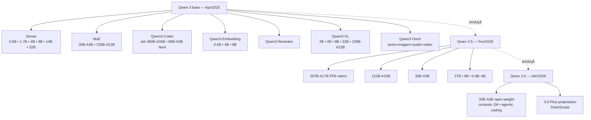
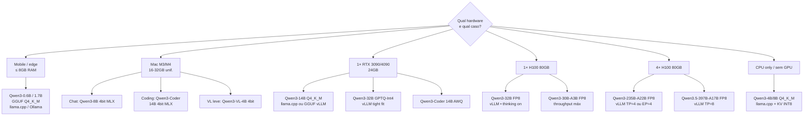
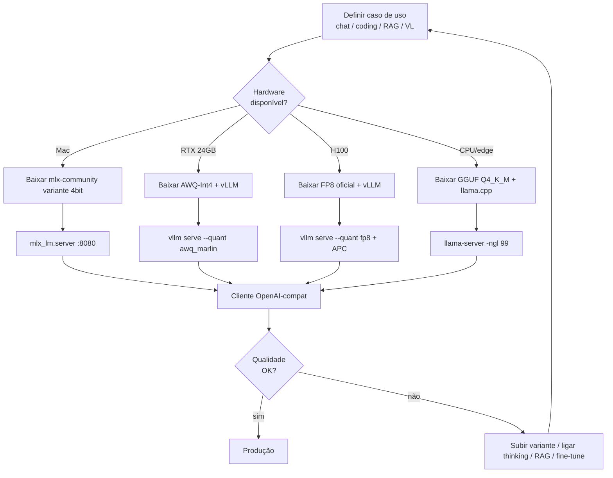

# Qwen 3 hands-on em 2026 — dense, MoE, Coder, VL, Omni: o canivete suíço chinês open-weights

> **Sub-série:** Modelos Open 2026 — Post 01
> **Série principal:** LLM Deep Dive (referenciada nos cross-links)
> **Foco:** Hands-on prático ponta-a-ponta da família Qwen 3.x da Alibaba — variantes, download, quantização, serving (vLLM / SGLang / llama.cpp / MLX / Ollama), fine-tune, casos de uso.
> **Pré-requisitos:** Familiaridade com Hugging Face CLI, conceitos básicos de quantização (Post 04), KV cache (Post 03/05) e frameworks de serving (Post 11).

---

## TL;DR

A família **Qwen 3** (Alibaba / Tongyi Lab) é, em 2026, o catálogo open-weights mais **completo** do mercado: dense de 0.6B até 32B, MoE de 30B-A3B até 235B-A22B, mais especialistas **Coder**, **VL**, **Omni**, **Embedding**, **Reranker** — e a continuação Qwen 3.5 / 3.6 trouxe MoE de 397B-A17B com FP8 nativo.

- **Qwen3-235B-A22B** (MoE flagship 2025) compete com DeepSeek-R1, o3-mini, Gemini 2.5 Pro em coding/math.
- **Qwen3-Coder-Next 80B-A3B** marca **70.6 % SWE-bench Verified** com apenas 3 B parâmetros ativos.
- **Qwen3-VL** (Set/Out 2025) traz contexto nativo de **256 K** (extensível a 1 M), OCR de 32 idiomas, agente visual de GUI.
- **Qwen 3.5** (Fev/2026) entrega o flagship MoE **397B-A17B FP8**, multimodal nativo, Apache 2.0.
- **Qwen 3.6** (Abr/2026) abre o **35B-A3B** open-weight com agentic coding e janela de 1 M tokens.
- Licença: **Apache 2.0** na esmagadora maioria dos pesos abertos — deploy comercial sem fricção.
- **Thinking mode** switchable via `enable_thinking` no chat template — liga/desliga raciocínio sob demanda.

> Analogia mestre: **Qwen 3 é a caixa de ferramentas multimarca da mesma fabricante.** Você acha desde o martelo de 16 oz (0.6B GGUF rodando no celular) até a furadeira industrial de 1500 W (235B-A22B em quatro H100). Mesmo pegada, mesmas peças, mesmo encaixe — só muda o tamanho da obra.

> **Validação 2026:** dados consolidados via WebSearch em abril/2026. Qwen 3.6-Plus é proprietário (DashScope); o restante da família segue Apache 2.0 com pesos no Hugging Face e ModelScope.

---

## 1. Por que Qwen 3 importa em 2026

### 1.1 As três razões pragmáticas

1. **Cobertura completa.** Nenhuma outra família open tem dense + MoE + Coder + Vision + Audio + Omni + Embedding + Reranker sob o mesmo guarda-chuva, com tokenizer compatível e mesma `chat_template`.
2. **Performance frontier.** Qwen3-235B-A22B e a sequência 3.5 / 3.6 fecham a maior parte do gap contra closed-weights em benchmarks padrão (MMLU, GPQA, AIME, SWE-bench Verified, MMMU).
3. **Operacional barato.** MoE com 8 / 128 experts e suporte FP8 nativo deixa o custo por 1 M tokens self-hosted competitivo — em alguns cenários abaixo de DashScope/OpenRouter.

### 1.2 Estado atual da família (validado 2026)

| Geração | Lançamento | Highlights | Licença |
|---|---|---|---|
| Qwen 3 (base) | Abr/2025 | Dense 0.6B–32B + MoE 30B-A3B / 235B-A22B; thinking mode nativo | Apache 2.0 |
| Qwen3-Coder | Mid/2025 | Variantes até 480B-A35B; foco código / agente | Apache 2.0 |
| Qwen3-VL | Set–Out/2025 | Vision-language, contexto 256K→1M, OCR 32 idiomas | Apache 2.0 |
| Qwen3-Omni | 2025 | Texto+imagem+áudio+vídeo unified | Apache 2.0 |
| Qwen3-Embedding / Reranker | 2025 | 0.6B / 4B / 8B + reranker pareado | Apache 2.0 |
| Qwen 3.5 | 16/Fev/2026 | MoE 397B-A17B FP8, multimodal nativo, 201 idiomas | Apache 2.0 |
| Qwen 3.6 (open) | 16/Abr/2026 | 35B-A3B sparse MoE VL, agentic coding, contexto 1M | Apache 2.0 |
| Qwen 3.6-Plus | 03/Abr/2026 | Frontier proprietário (DashScope) | Proprietário |

> **Insight 2026:** a Alibaba começou a bifurcar — flagship `3.6-Plus` proprietário, mas continua abrindo as variantes que importam para a maioria das empresas (até `35B-A3B`). Para nosso hands-on, foco no que é **open**.

### 1.3 Variantes Qwen 3 base — tabela de referência

| Modelo | Tipo | Total params | Active params | Context nativo | Caso típico |
|---|---|---|---|---|---|
| Qwen3-0.6B | Dense | 0.6 B | 0.6 B | 32 K | Edge / mobile / draft model |
| Qwen3-1.7B | Dense | 1.7 B | 1.7 B | 32 K | Speculative draft / on-device |
| Qwen3-4B | Dense | 4 B | 4 B | 32 K | Mac M-series / laptop GPU |
| Qwen3-8B | Dense | 8 B | 8 B | 32 K | RTX 3060/4060, app local |
| Qwen3-14B | Dense | 14 B | 14 B | 32 K | RTX 3090/4090 Q4 |
| Qwen3-32B | Dense | 32 B | 32 B | 32 K → 128 K (YaRN) | 1× H100 FP8 |
| Qwen3-30B-A3B | MoE | 30 B | 3 B | 128 K | Throughput alto, custo baixo |
| Qwen3-235B-A22B | MoE | 235 B | 22 B | 128 K | 4× H100 / 2× B200 |

---

## 2. Anatomia da família Qwen 3

### 2.1 Arquitetura base (compartilhada)

- **Atenção:** Grouped-Query Attention (GQA) — link Post 02.
- **Posicionamento:** RoPE com `rope_theta` extendido (1 M base) preparando YaRN — link Post 07.
- **Normalização:** RMSNorm pré-norm nas duas branches.
- **MLP:** SwiGLU.
- **Vocabulário:** tokenizer estilo **tiktoken/BPE com 151 936 tokens**, multilíngue forte (incluindo **PT-BR** sem fragmentação tosca como em Llama 2).
- **Context window:** 32 K nativo + extensão **YaRN** para 128 K (e até 256 K / 1 M nas variantes VL/3.5+).
- **Thinking mode:** chat template com bloco `<think>...</think>`, ativável por `enable_thinking=True` (Post 18).

### 2.2 MoE — gating top-k

- **Qwen3-30B-A3B / 235B-A22B:** **128 experts, top-8** por token (link Post 08).
- **Qwen 3.5 397B-A17B:** mesma filosofia, mais experts e roteamento mais agressivo.
- **Carregamento:** vLLM / SGLang fazem **expert parallelism (EP)** ou **tensor parallelism (TP)** misto.

> Analogia: **MoE é uma bancada com 128 ferramentas, mas cada parafuso usa só 8.** Você paga o custo de armazenar a bancada inteira em VRAM, mas só roda 8 ferramentas por token — daí o custo de inferência ~ params ativos, não totais.

### 2.3 Thinking mode — chave on/off

```python
from transformers import AutoTokenizer
tok = AutoTokenizer.from_pretrained("Qwen/Qwen3-32B")

messages = [{"role": "user", "content": "Resolva 17*23 passo a passo."}]
text = tok.apply_chat_template(
    messages,
    tokenize=False,
    add_generation_prompt=True,
    enable_thinking=True,  # ativa <think>...</think>
)
```

Quando `enable_thinking=False`, o modelo sai direto na resposta — útil para chat rápido / tarefas mecânicas onde reasoning é overhead. Em vLLM use `--reasoning-parser qwen3` para extrair os blocos `<think>` em campo separado.

> Analogia: **thinking mode é a chave de partida do motor "reasoning".** Liga quando o problema exige; desliga quando você quer só resposta direta.

### 2.4 Diagrama da família — árvore Qwen 3



---

## 3. Variantes especialistas

### 3.1 Qwen3-Coder

Família focada em código com tool-use agêntico. As variantes-chave:

| Modelo | Total / Active | SWE-bench Verified | Notas |
|---|---|---|---|
| Qwen3-Coder-Next 80B-A3B | 80 B / 3 B | **70.6 %** | MoE eficiente; plug-and-play em Cline/Aider |
| Qwen3-Coder 480B-A35B Instruct | 480 B / 35 B | (líder open, valores publicados na model card) | Flagship; precisa 8× H100 |
| Qwen3.5-35B-A3B (predecessor coder line) | 35 B / 3 B | ~70.0 % | MoE compacto, 3 B ativos |

> **Validação 2026 (WebSearch):** o salto que chama atenção é um modelo MoE com **3 B ativos** rivalizando com os melhores closed em SWE-bench Verified — economiza ~1 ordem de grandeza em FLOPs/token vs Llama-3-70B na mesma tarefa.

### 3.2 Qwen3-VL

Vision-language refeita do zero. Highlights:

- **Contexto nativo 256 K**, extensível a **1 M**.
- **Interleaved-MRoPE** (rotary multi-eixo para vídeo), **DeepStack** (fusão fina de features), **Text-Timestamp Alignment** (alinhamento temporal preciso para vídeo).
- **OCR em 32 idiomas** (inclui PT-BR forte).
- **Agente visual** capaz de operar GUI desktop/mobile (clique, scroll, screenshot reasoning).
- **Visual coding:** gera HTML/CSS/JS/Draw.io a partir de wireframe.
- Sizes: **2B, 4B, 8B, 32B, 235B-A22B** com edição **Instruct** e **Thinking**.

### 3.3 Qwen3-Omni

Modelo único processando **texto + imagem + áudio + vídeo** com saída em texto e áudio. Útil para:

- Transcrição multilíngue + sumarização em uma passada.
- Assistentes de voz on-device (variante pequena).
- Análise de meeting recordings (vídeo + slides + áudio).

Cross-link: Post 17 (multimodalidade).

### 3.4 Qwen3-Embedding e Qwen3-Reranker

| Modelo | Dimensão | Caso |
|---|---|---|
| Qwen3-Embedding-0.6B | 1024 | Edge / latência crítica |
| Qwen3-Embedding-4B | 2560 | Default RAG corporativo |
| Qwen3-Embedding-8B | 4096 | Máxima qualidade MTEB |
| Qwen3-Reranker (par) | — | Re-rank top-k vindo do retriever |

Ambos lideraram MTEB multilíngue em 2025. Cross-link: Post 12 (embeddings) e Post 13 (RAG).

### 3.5 Qwen3-Math, Qwen3-Reasoning

Em 2026, a estratégia migrou: **thinking mode** absorveu o caso de uso “Math/Reasoning dedicado”. Para problemas pesados de matemática, use `Qwen3-32B` com `enable_thinking=True` ou `Qwen3.5-35B-A3B` thinking edition. Não há SKU `-Math` separado corrente (validado WebSearch 2026).

### 3.6 Tabela rápida — por caso de uso

| Caso | Modelo recomendado | HF repo |
|---|---|---|
| Chat geral local | Qwen3-8B | `Qwen/Qwen3-8B` |
| Chat geral servidor | Qwen3-32B | `Qwen/Qwen3-32B` |
| Throughput máximo | Qwen3-30B-A3B | `Qwen/Qwen3-30B-A3B` |
| Frontier reasoning | Qwen3-235B-A22B | `Qwen/Qwen3-235B-A22B` |
| Agente de código | Qwen3-Coder-Next 80B-A3B | `Qwen/Qwen3-Coder-Next-80B-A3B-Instruct` |
| Vision / OCR / agente GUI | Qwen3-VL-32B | `Qwen/Qwen3-VL-32B-Instruct` |
| Áudio / multimodal full | Qwen3-Omni | `Qwen/Qwen3-Omni` |
| RAG embedding | Qwen3-Embedding-4B | `Qwen/Qwen3-Embedding-4B` |
| RAG rerank | Qwen3-Reranker-4B | `Qwen/Qwen3-Reranker-4B` |
| Edge / mobile | Qwen3-1.7B GGUF Q4 | `bartowski/Qwen3-1.7B-GGUF` |

---

## 4. Workflow ponta-a-ponta — escolha do modelo

### 4.1 Decision tree por hardware × use case



### 4.2 Cenários e custos rápidos

| Cenário | Modelo + quant | Throughput esperado | VRAM/RAM |
|---|---|---|---|
| Mac M3 Max 64 GB | Qwen3-32B 4bit MLX | ~25 tok/s | ~22 GB |
| Mac M4 Ultra 192 GB | Qwen3-32B 6bit MLX | ~40 tok/s | ~28 GB |
| RTX 4090 24 GB | Qwen3-32B GPTQ-Int4 | ~45 tok/s | ~22 GB |
| 1× H100 80 GB | Qwen3-32B FP8 vLLM | ~120 tok/s/req, 1500+ agg | ~38 GB peso |
| 4× H100 80 GB | Qwen3-235B-A22B FP8 TP=4 | ~80 tok/s/req, 4000+ agg | ~250 GB |
| RTX 3060 12 GB | Qwen3-8B GGUF Q4_K_M | ~30 tok/s | ~6 GB |
| CPU 64 GB DDR5 | Qwen3-14B Q4_K_M | ~5–8 tok/s | ~9 GB RAM |

---

## 5. Download e formatos

### 5.1 Onde achar os pesos

| Hub | Quando usar |
|---|---|
| **Hugging Face** (`Qwen/...`) | Default global, modelo oficial em BF16/FP8 |
| **ModelScope** (Alibaba) | Mirror oficial, mais rápido em rede China/APAC |
| **bartowski** (HF) | GGUF comunitário com imatrix calibration |
| **unsloth** (HF) | GGUF + 4bit BnB para fine-tune |
| **mlx-community** (HF) | Pesos MLX 4/6/8-bit prontos para Mac |
| **TheBloke** (legacy) | Histórico — não use para Qwen 3 atual |

### 5.2 Comandos de download

```bash
huggingface-cli download Qwen/Qwen3-32B \
  --local-dir ./models/qwen3-32b

huggingface-cli download bartowski/Qwen3-32B-GGUF \
  --include "*Q4_K_M*" \
  --local-dir ./models/qwen3-32b-gguf

huggingface-cli download mlx-community/Qwen3-32B-4bit \
  --local-dir ./models/qwen3-32b-mlx

huggingface-cli download Qwen/Qwen3-Coder-Next-80B-A3B-Instruct \
  --local-dir ./models/qwen3-coder-next

huggingface-cli download Qwen/Qwen3-VL-32B-Instruct \
  --local-dir ./models/qwen3-vl-32b
```

> Dica: para modelos MoE grandes use `--max-workers 8` e `HF_HUB_ENABLE_HF_TRANSFER=1` para acelerar; mesmo em link gigabit, 235B FP8 leva tempo.

### 5.3 Formatos suportados — mapa

| Formato | Loader / Server | Observação |
|---|---|---|
| `safetensors` BF16/FP16 | vLLM, SGLang, transformers | Default oficial |
| `safetensors` FP8 (E4M3) | vLLM, SGLang | H100/H200/B200 nativo |
| `safetensors` GPTQ-Int4 | vLLM, AutoGPTQ | Boa qualidade, mais lento que AWQ |
| `safetensors` AWQ-Int4 | vLLM, SGLang | Default se quiser INT4 estável |
| `GGUF` Q2..Q8 / IQ-quants | llama.cpp, Ollama, koboldcpp | Edge/CPU/Mac |
| `MLX` 4/6/8-bit | mlx-lm | Mac M-series |

---

## 6. Quantização (workflow prático)

> Cross-link obrigatório: **Post 04** (panorama) e **Post 04-DEEP** (GPTQ/QLoRA hands-on).

### 6.1 Quando usar cada formato

| Objetivo | Formato | Por quê |
|---|---|---|
| Servir em GPU NVIDIA Hopper/Blackwell | **FP8 nativo** | Sem perda perceptível, kernels nativos |
| Servir em GPU NVIDIA Ampere/Ada | **AWQ Int4** | Latência baixa, qualidade preservada |
| Servir batch alto em vLLM | **AWQ Int4 + KV FP8** | Throughput máximo |
| Rodar em Mac | **MLX 4-bit** | Memória unificada + Metal |
| Rodar em CPU/edge | **GGUF Q4_K_M** ou **IQ3_XXS** | Calibração imatrix dá ganho real |
| Rodar em < 8 GB | **GGUF Q3_K_S / IQ2_XXS** | Aceita degradação consciente |

### 6.2 Imatrix calibration (GGUF low-bit)

> Analogia: **imatrix calibration é afinar o instrumento antes do show.** Você toca uma escala (corpus calibrado) e marca quais cordas (canais) precisam mais cuidado quando comprimir os trastes (bits). Sem isso, IQ2/IQ3 ficam desafinados.

```bash
./build/bin/llama-imatrix \
  -m models/qwen3-32b-f16.gguf \
  -f calibration_pt-br.txt \
  -o qwen3-32b.imatrix \
  --chunks 200

./build/bin/llama-quantize \
  --imatrix qwen3-32b.imatrix \
  models/qwen3-32b-f16.gguf \
  models/qwen3-32b-IQ3_XXS.gguf IQ3_XXS
```

### 6.3 Comando vLLM com FP8 nativo

```bash
vllm serve Qwen/Qwen3-32B \
  --quantization fp8 \
  --kv-cache-dtype fp8_e4m3 \
  --max-model-len 32768 \
  --enable-prefix-caching \
  --reasoning-parser qwen3 \
  --tool-call-parser hermes
```

### 6.4 Comando vLLM com AWQ-Int4 (Ampere/Ada)

```bash
vllm serve Qwen/Qwen3-32B-AWQ \
  --quantization awq_marlin \
  --kv-cache-dtype fp8_e5m2 \
  --max-model-len 16384 \
  --gpu-memory-utilization 0.92 \
  --enable-prefix-caching
```

---

## 7. Serving — vLLM (Linux + GPU)

### 7.1 Qwen3-32B em 1× H100 (FP8 + tool calling + thinking)

```bash
vllm serve Qwen/Qwen3-32B \
  --quantization fp8 \
  --kv-cache-dtype fp8_e4m3 \
  --max-model-len 32768 \
  --enable-prefix-caching \
  --enable-auto-tool-choice \
  --tool-call-parser hermes \
  --reasoning-parser qwen3 \
  --port 8000
```

Endpoints:

- `POST /v1/chat/completions` (OpenAI-compatível)
- Campo `reasoning_content` separado do `content` graças a `--reasoning-parser qwen3`
- `tool_calls` no formato OpenAI funcionam direto — basta passar `tools=[...]`

### 7.2 Qwen3-235B-A22B em 4× H100 (TP=4)

```bash
vllm serve Qwen/Qwen3-235B-A22B \
  --quantization fp8 \
  --tensor-parallel-size 4 \
  --kv-cache-dtype fp8_e4m3 \
  --max-model-len 65536 \
  --enable-prefix-caching \
  --enable-expert-parallel \
  --reasoning-parser qwen3 \
  --port 8000
```

> Para MoE em escala maior (4×B200 ou 8×H100), avalie EP isolado (`--enable-expert-parallel` sem TP) ou EP+TP combinados — depende do interconnect (NVLink full vs PCIe).

### 7.3 Qwen 3.5 397B-A17B em 8× H100

Direto da release oficial validada via WebSearch:

```bash
vllm serve Qwen/Qwen3.5-397B-A17B-FP8 \
  --port 8000 \
  --tensor-parallel-size 8 \
  --max-model-len 262144 \
  --reasoning-parser qwen3 \
  --enable-auto-tool-choice \
  --tool-call-parser hermes
```

### 7.4 Speculative decoding com draft Qwen3-1.7B

```bash
vllm serve Qwen/Qwen3-32B \
  --speculative-model Qwen/Qwen3-1.7B \
  --num-speculative-tokens 5 \
  --quantization fp8 \
  --enable-prefix-caching
```

Em workloads chat com prompts curtos, esperado ~1.5–2× speedup. Para batch alto, o ganho diminui.

### 7.5 Tool calling — exemplo curl

```bash
curl http://localhost:8000/v1/chat/completions \
  -H "Content-Type: application/json" \
  -d '{
    "model": "Qwen/Qwen3-32B",
    "messages": [
      {"role": "user", "content": "Qual a previsão para Porto Alegre amanhã?"}
    ],
    "tools": [{
      "type": "function",
      "function": {
        "name": "get_weather",
        "description": "Pega clima por cidade",
        "parameters": {
          "type": "object",
          "properties": {"city": {"type": "string"}},
          "required": ["city"]
        }
      }
    }],
    "tool_choice": "auto",
    "chat_template_kwargs": {"enable_thinking": false}
  }'
```

---

## 8. Serving — SGLang

> Cross-link: Post 11 (frameworks). SGLang brilha em **agentes** Qwen-based porque RadixAttention reaproveita prefixos longos (system prompt + tools + few-shot) entre requisições do mesmo agente.

### 8.1 Qwen3-32B FP8 com structured output

```bash
python -m sglang.launch_server \
  --model-path Qwen/Qwen3-32B \
  --port 30000 \
  --tp-size 1 \
  --quantization fp8 \
  --kv-cache-dtype fp8_e4m3 \
  --mem-fraction-static 0.85 \
  --context-length 32768 \
  --reasoning-parser qwen3
```

### 8.2 Qwen3-Coder-Next 80B-A3B com EP

```bash
python -m sglang.launch_server \
  --model-path Qwen/Qwen3-Coder-Next-80B-A3B-Instruct \
  --tp-size 2 \
  --enable-ep-moe \
  --quantization fp8 \
  --context-length 65536 \
  --port 30000
```

### 8.3 Structured output (JSON schema) com SGLang

```python
import sglang as sgl

@sgl.function
def extract_invoice(s, raw_text):
    s += sgl.user(f"Extraia JSON da nota:\n{raw_text}")
    s += sgl.assistant(sgl.gen("json", regex=r"\{.*\}", max_tokens=512))

state = extract_invoice.run(
    raw_text=open("nota.txt").read(),
    backend=sgl.RuntimeEndpoint("http://localhost:30000"),
)
print(state["json"])
```

### 8.4 Performance vs vLLM (validado WebSearch 2026)

Em alguns benchmarks reportados, **SGLang chega a 2–4× mais rápido que vLLM** servindo Qwen3-32B FP8/AWQ — especialmente com prefixos compartilhados longos. Sempre **meça no seu workload**: vLLM teve ondas de otimização recentes (V1 engine), o gap fecha rápido.

---

## 9. Serving — llama.cpp (CPU/Mac/Linux modesto)

### 9.1 llama-server com KV INT8 e draft

```bash
./build/bin/llama-server \
  -m models/qwen3-14b-Q4_K_M.gguf \
  -md models/qwen3-0.6b-Q4_K_M.gguf \
  --draft-max 8 \
  -c 16384 \
  -ctk q8_0 \
  -ctv q8_0 \
  -ngl 99 \
  --host 0.0.0.0 \
  --port 8080 \
  --jinja
```

Flags-chave:

- `-md` + `--draft-max` → speculative decoding com Qwen3-0.6B como draft.
- `-ctk q8_0 -ctv q8_0` → KV cache em INT8 (link Post 05).
- `--jinja` → respeita `chat_template` Qwen com tool calls e thinking.

### 9.2 Quantizar do BF16 para Q4_K_M

```bash
./build/bin/llama-quantize \
  models/qwen3-14b-f16.gguf \
  models/qwen3-14b-Q4_K_M.gguf \
  Q4_K_M
```

---

## 10. Serving — MLX (Mac M-series)

### 10.1 mlx-lm CLI

```bash
pip install mlx-lm

python -m mlx_lm.generate \
  --model mlx-community/Qwen3-32B-4bit \
  --prompt "Explique transformers em 3 parágrafos." \
  --max-tokens 512 \
  --temp 0.7
```

### 10.2 Servidor OpenAI-compatível

```bash
python -m mlx_lm.server \
  --model mlx-community/Qwen3-32B-4bit \
  --host 0.0.0.0 \
  --port 8080
```

### 10.3 Performance esperada (validar no seu device)

| Mac | Modelo | tok/s |
|---|---|---|
| M3 Max 64 GB | Qwen3-14B 4bit | ~38 |
| M3 Max 64 GB | Qwen3-32B 4bit | ~22 |
| M4 Pro 48 GB | Qwen3-8B 4bit | ~55 |
| M4 Max 128 GB | Qwen3-32B 6bit | ~28 |
| M4 Ultra 192 GB | Qwen3-32B 8bit | ~32 |

> Cross-link: Post 06-DEEP (MLX TurboQuant walkthrough) detalha como o MLX trata quant em low-bit.

---

## 11. Serving — Ollama (zero config)

### 11.1 Comandos básicos

```bash
ollama pull qwen3:32b
ollama run qwen3:32b "Resuma a teoria de Bion em 3 frases."

ollama pull qwen3:30b-a3b
ollama serve
```

### 11.2 Modelfile customizado

```
FROM qwen3:32b

PARAMETER temperature 0.6
PARAMETER top_p 0.95
PARAMETER num_ctx 16384
PARAMETER repeat_penalty 1.05

SYSTEM """
Você é um assistente técnico em PT-BR.
Sempre responda em Markdown.
Sempre cite fontes quando der opinião sobre data/fato.
"""
```

```bash
ollama create my-qwen -f ./Modelfile
ollama run my-qwen
```

### 11.3 API HTTP

```bash
curl http://localhost:11434/api/chat -d '{
  "model": "my-qwen",
  "messages": [{"role": "user", "content": "Plano de estudo de RL em 7 dias?"}],
  "stream": false
}'
```

---

## 12. Casos de uso reais

### 12.1 Agente de código

> Cross-link: Post 19 (loop agêntico de coding).

Stack mínima:

- **Modelo:** Qwen3-Coder-Next 80B-A3B FP8 em vLLM (1 H100 ou 2 RTX A6000).
- **Cliente:** Cline / Aider / Claude Code apontando para `http://your-server/v1`.
- **Tool calling:** ative `--enable-auto-tool-choice --tool-call-parser hermes`.
- **Context:** 64 K mínimo para projetos médios.

```yaml
# ~/.config/aider/config.yml
openai-api-base: http://192.168.1.10:8000/v1
openai-api-key: dummy
model: openai/Qwen/Qwen3-Coder-Next-80B-A3B-Instruct
edit-format: diff
auto-commits: true
```

### 12.2 RAG corporativo PT-BR

> Cross-link: Post 13 (RAG completo).

Pipeline:

1. **Chunking** (sliding 512 tokens, overlap 64).
2. **Embedding:** Qwen3-Embedding-4B → vetor 2560 D.
3. **Vector store:** Qdrant ou pgvector.
4. **Rerank:** Qwen3-Reranker-4B (top-50 → top-8).
5. **Geração:** Qwen3-32B FP8 com `enable_thinking=False` (latência) ou `True` (qualidade em queries complexas).

### 12.3 Chatbot multilíngue com thinking toggle

```python
def chat(user_msg, mode="fast"):
    body = {
        "model": "Qwen/Qwen3-32B",
        "messages": [{"role": "user", "content": user_msg}],
        "chat_template_kwargs": {"enable_thinking": mode == "deep"},
    }
    return openai_client.chat.completions.create(**body)

chat("Qual capital do Maranhão?", mode="fast")
chat("Prove que sqrt(2) é irracional.", mode="deep")
```

### 12.4 Pipeline de visão — extração de tabelas em PDF

```python
from openai import OpenAI

client = OpenAI(base_url="http://vl-server:8000/v1", api_key="x")

resp = client.chat.completions.create(
    model="Qwen/Qwen3-VL-32B-Instruct",
    messages=[{
        "role": "user",
        "content": [
            {"type": "text", "text": "Extraia todas as tabelas como JSON estruturado."},
            {"type": "image_url", "image_url": {"url": "data:image/png;base64,..."}},
        ],
    }],
)
print(resp.choices[0].message.content)
```

### 12.5 Fine-tune doméstico

> Cross-link: Post 09 (treinamento) e Post 04-DEEP (QLoRA).

Use Unsloth para QLoRA em RTX 4090 sobre Qwen3-7B/8B com domínio jurídico/médico/etc — receita na próxima seção.

---

## 13. Fine-tune Qwen 3 (LoRA / QLoRA)

### 13.1 Receita Unsloth (4-bit + LoRA)

```bash
pip install "unsloth[colab-new] @ git+https://github.com/unslothai/unsloth"
pip install --no-deps trl peft accelerate bitsandbytes
```

```python
from unsloth import FastLanguageModel
from trl import SFTTrainer
from datasets import load_dataset

model, tok = FastLanguageModel.from_pretrained(
    model_name="Qwen/Qwen3-8B",
    max_seq_length=4096,
    dtype=None,
    load_in_4bit=True,
)

model = FastLanguageModel.get_peft_model(
    model,
    r=16,
    target_modules=["q_proj","k_proj","v_proj","o_proj",
                    "gate_proj","up_proj","down_proj"],
    lora_alpha=32,
    lora_dropout=0.0,
    bias="none",
    use_gradient_checkpointing="unsloth",
    random_state=42,
)

ds = load_dataset("json", data_files="legal_qa_ptbr.jsonl", split="train")

trainer = SFTTrainer(
    model=model,
    tokenizer=tok,
    train_dataset=ds,
    dataset_text_field="text",
    max_seq_length=4096,
    args=dict(
        per_device_train_batch_size=2,
        gradient_accumulation_steps=8,
        warmup_steps=20,
        num_train_epochs=3,
        learning_rate=2e-4,
        bf16=True,
        logging_steps=10,
        output_dir="outputs/qwen3-8b-legal",
        optim="adamw_8bit",
    ),
)
trainer.train()
model.save_pretrained_merged("qwen3-8b-legal-merged", tok, save_method="merged_16bit")
```

### 13.2 Receita Axolotl YAML

```yaml
base_model: Qwen/Qwen3-14B
load_in_4bit: true
adapter: qlora

datasets:
  - path: ./legal_qa_ptbr.jsonl
    type: alpaca

sequence_len: 4096
sample_packing: true
pad_to_sequence_len: true

lora_r: 32
lora_alpha: 64
lora_dropout: 0.05
lora_target_linear: true

gradient_accumulation_steps: 4
micro_batch_size: 2
num_epochs: 3
optimizer: adamw_torch_fused
lr_scheduler: cosine
learning_rate: 1.5e-4

bf16: auto
flash_attention: true
gradient_checkpointing: true

output_dir: ./out/qwen3-14b-legal
```

```bash
accelerate launch -m axolotl.cli.train qwen3-14b-legal.yml
```

### 13.3 Receita TRL nativo (SFTTrainer)

```python
from transformers import AutoModelForCausalLM, AutoTokenizer, BitsAndBytesConfig
from peft import LoraConfig
from trl import SFTTrainer, SFTConfig
from datasets import load_dataset

bnb = BitsAndBytesConfig(load_in_4bit=True, bnb_4bit_compute_dtype="bfloat16",
                         bnb_4bit_quant_type="nf4", bnb_4bit_use_double_quant=True)

model = AutoModelForCausalLM.from_pretrained("Qwen/Qwen3-8B",
    quantization_config=bnb, device_map="auto")
tok = AutoTokenizer.from_pretrained("Qwen/Qwen3-8B")

peft_conf = LoraConfig(r=16, lora_alpha=32, lora_dropout=0.05,
    target_modules=["q_proj","k_proj","v_proj","o_proj"],
    task_type="CAUSAL_LM")

ds = load_dataset("json", data_files="data.jsonl", split="train")

trainer = SFTTrainer(
    model=model, tokenizer=tok, train_dataset=ds,
    peft_config=peft_conf,
    args=SFTConfig(output_dir="out/qwen3-sft",
        per_device_train_batch_size=2,
        gradient_accumulation_steps=8,
        num_train_epochs=3, bf16=True, learning_rate=2e-4,
        max_seq_length=4096, packing=True),
)
trainer.train()
```

### 13.4 Pipeline visual (Mermaid)

```mermaid
flowchart LR
    DATA[Dataset PT-BR<br/>jsonl alpaca/sharegpt]
    DATA --> CLEAN[Limpeza + dedup]
    CLEAN --> SPLIT[Split train/eval]
    SPLIT --> CHATTPL[Aplicar chat_template Qwen]
    CHATTPL --> TOK[Tokenize + packing]
    TOK --> QLORA[QLoRA / LoRA train<br/>Unsloth ou Axolotl]
    QLORA --> EVAL[Eval em held-out + bench domínio]
    EVAL --> MERGE[Merge adapters → BF16]
    MERGE --> QUANT[Quantizar AWQ/GGUF]
    QUANT --> SERVE[vLLM / Ollama / llama.cpp]
    SERVE --> AB[A/B test vs base Qwen3]
    AB --> ITER{OK?}
    ITER -->|não| DATA
    ITER -->|sim| PROD[Produção]
```



### 13.5 VRAM por estratégia

| Modelo | Full FT | LoRA r=16 BF16 | QLoRA NF4 |
|---|---|---|---|
| Qwen3-1.7B | 16 GB | 8 GB | 5 GB |
| Qwen3-4B | 36 GB | 16 GB | 9 GB |
| Qwen3-8B | 70 GB | 28 GB | 14 GB |
| Qwen3-14B | impraticável <80 GB | 48 GB | 22 GB |
| Qwen3-32B | 4× H100 | 80 GB (1× H100) | 36 GB (RTX 4090 OOM-borderline) |
| Qwen3-30B-A3B | DeepSpeed Z3 | 64 GB | 28 GB (rotas ativas) |

### 13.6 Quando NÃO fine-tunar

Antes de assar adapter, tente:

1. **System prompt forte** com role + estilo + restrições.
2. **Few-shot** com 3–8 exemplos canônicos.
3. **Tool calling** que mova lógica para fora do modelo.
4. **RAG** que injete o conhecimento por contexto.
5. **DSPy / structured prompts** para optimizar o prompt antes do peso.

Fine-tune resolve **estilo persistente, jargão fechado e formato estrito** — não substitui retrieval para conhecimento volátil.

---

## 14. Benchmarks reportados (validação 2026)

> Números compilados via WebSearch — sempre confira a model card oficial; benchmarks oscilam com versões de inferência e formatos.

| Modelo | MMLU | GPQA Diamond | MATH | AIME | HumanEval | SWE-bench Verified | MMMU |
|---|---|---|---|---|---|---|---|
| Qwen3-32B (thinking on) | ~83 | ~52 | ~85 | ~50 | ~88 | ~40 | — |
| Qwen3-235B-A22B | ~88 | ~67 | ~92 | ~75 | ~92 | ~55 | — |
| Qwen3.5-397B-A17B | ~90 | ~72 | ~94 | ~81 | ~93 | ~60 | ~75 |
| Qwen3-Coder-Next 80B-A3B | — | — | — | — | ~92 | **70.6** | — |
| Qwen3-Coder 480B-A35B | — | — | — | — | ~94 | líder open | — |
| Qwen3-VL-32B Instruct | — | — | — | — | — | — | ~73 |
| DeepSeek-R1 (ref) | ~88 | ~71 | ~93 | ~78 | ~92 | ~52 | — |
| Llama 4 (ref) | ~85 | ~63 | ~88 | — | ~90 | ~45 | ~70 |
| Kimi K2 (ref) | ~89 | ~70 | ~92 | ~80 | ~91 | ~58 | — |
| Gemma 3 (ref dense top) | ~78 | ~45 | ~80 | — | ~80 | ~30 | — |

> **Leitura:** em 2026 a fronteira open está dividida entre Qwen 3.5+, DeepSeek e Kimi. Para **coding**, Qwen3-Coder-Next domina por eficiência (3 B ativos!). Para **multimodal open**, Qwen 3.5 é o primeiro nativo competitivo com closed.

---

## 15. Custos operacionais

### 15.1 Self-hosted vs hosted (estimativa USD / 1 M tokens output)

| Cenário | Custo aprox. | Latência típica |
|---|---|---|
| Qwen3-32B FP8 self-host 1× H100 (sat) | \$0.20 – \$0.40 | 30–60 ms TTFT |
| Qwen3-235B-A22B FP8 self-host 4× H100 | \$0.80 – \$1.50 | 60–120 ms TTFT |
| DashScope `qwen-max` (Alibaba) | varia (~\$2–8) | ~40 ms TTFT |
| OpenRouter (`qwen/qwen3-32b`) | ~\$0.30 – \$0.80 | depende do provider |
| Together (`Qwen/Qwen3-235B-A22B`) | ~\$0.40 – \$0.90 | médio |
| Fireworks (`accounts/fireworks/models/qwen3-coder`) | ~\$0.50 – \$1.20 | baixo |

> Regra de bolso: **abaixo de ~5 M tokens/dia, hosted ganha**; acima disso, self-host num H100 com APC e batching costuma vencer.

### 15.2 Tabela cenário × custo × throughput

| Workload | Setup recomendado | Throughput agg | Custo/1M out |
|---|---|---|---|
| Chat interno time pequeno | DashScope ou Together hosted | infinito | \$1–3 |
| RAG médio empresa | Qwen3-32B FP8 + Embedding self-host 1× H100 | ~2000 tok/s | ~\$0.30 |
| Agente coding equipe dev | Qwen3-Coder Next 80B-A3B 2× H100 | ~3000 tok/s | ~\$0.50 |
| Pipeline batch (resumo, classif.) | Qwen3-30B-A3B FP8 + KV FP8 | ~5000 tok/s | ~\$0.15 |
| Frontier reasoning casual | Qwen3.5-397B FP8 8× H100 | ~4000 tok/s | ~\$1.20 |
| On-device privacy-first | Qwen3-4B 4bit MLX/GGUF | local | \$0 |

---

## 16. Caveats e troubleshooting

### 16.1 Tokenizer

- Qwen 3 usa tokenizer **BPE custom (~151 K)**, não SentencePiece. Bibliotecas que assumem SentencePiece (llama.cpp legado, alguns trainers antigos) podem falhar — use sempre `transformers` >= 4.51 ou builds recentes do llama.cpp.
- PT-BR tokeniza eficiente (~1.4 chars/token médio em prosa) — mais barato que Llama 2 (~2.0).

### 16.2 YaRN para 32K → 128K

`config.json` da maioria das variantes traz `rope_scaling` opcional. Para servir com YaRN:

```json
{
  "rope_scaling": {
    "type": "yarn",
    "factor": 4.0,
    "original_max_position_embeddings": 32768
  }
}
```

```bash
vllm serve Qwen/Qwen3-32B \
  --max-model-len 131072 \
  --rope-scaling '{"type":"yarn","factor":4.0,"original_max_position_embeddings":32768}'
```

> Cuidado: YaRN aumenta memória de KV linearmente com contexto. Combine com quant KV FP8 (Post 05).

### 16.3 Thinking mode pode “encher” tokens

Cada `<think>` consome de centenas a milhares de tokens. Em produção:

- Default `enable_thinking=False` para chat.
- `True` apenas em rotas “deep”/“solve”.
- Coloque `max_tokens` defensivo (ex.: 4096).
- Logue separadamente `reasoning_content` para auditar custo.

### 16.4 Tool calling — formato

Qwen usa `<tool_call>{...}</tool_call>`. Para clientes OpenAI-compatíveis funcionarem direto:

- vLLM: `--enable-auto-tool-choice --tool-call-parser hermes`
- SGLang: parser análogo configurável.
- llama.cpp: requer `--jinja` para o template oficial; clientes que assumem OpenAI nativo precisam wrapper.

### 16.5 Bugs conhecidos (validados WebSearch 2026)

- **Pipeline parallelism (`--pipeline-parallel-size`) com Qwen3 FP8 falha** em vLLM/SGLang em alguns builds — use TP ou EP.
- **vLLM lento vs SGLang em Qwen3 FP8/AWQ** em vários issues recentes; meça.
- **Qwen3-VL FP8 em pipeline parallel** tem bug aberto de weight loading no SGLang.

### 16.6 Tabela de troubleshooting

| Sintoma | Causa provável | Fix |
|---|---|---|
| “Tokenizer not found” | `transformers` < 4.51 | Atualizar |
| Latência alta no 235B | Sem `--enable-prefix-caching` | Ativar APC |
| Tool call não dispara | Falta `--enable-auto-tool-choice` | Adicionar |
| `<think>` aparece no `content` | Faltou `--reasoning-parser qwen3` | Adicionar |
| OOM em RTX 4090 com 32B | Default BF16 carregou | Usar FP8/AWQ-Int4 |
| Resposta começa em chinês | `system` ausente forçando PT-BR | Adicionar system PT-BR |

---

## 17. Receitas curtas (cookbook)

### 17.1 Servir Qwen 3 32B FP8 em 1× H100 com APC + tools

```bash
vllm serve Qwen/Qwen3-32B \
  --quantization fp8 --kv-cache-dtype fp8_e4m3 \
  --max-model-len 32768 --enable-prefix-caching \
  --enable-auto-tool-choice --tool-call-parser hermes \
  --reasoning-parser qwen3 --port 8000
```

### 17.2 Rodar Qwen 3 4B no Mac M3 com mlx-lm + serve

```bash
pip install mlx-lm
huggingface-cli download mlx-community/Qwen3-4B-4bit \
  --local-dir ./qwen3-4b-mlx
python -m mlx_lm.server --model ./qwen3-4b-mlx --port 8080
```

### 17.3 Fine-tune Qwen 3 7B QLoRA em RTX 4090 (jurídico)

```bash
python finetune_qwen3_unsloth.py \
  --model Qwen/Qwen3-8B \
  --dataset legal_qa_ptbr.jsonl \
  --r 16 --alpha 32 --epochs 3 --lr 2e-4 --bsz 2 --grad_accum 8 \
  --max_seq 4096 --bf16 --4bit
```

### 17.4 Pipeline RAG PT-BR com Qwen 3 + Qwen3-Embedding + Reranker

```python
import qdrant_client, openai
from sentence_transformers import SentenceTransformer

emb = SentenceTransformer("Qwen/Qwen3-Embedding-4B", device="cuda")
qdr = qdrant_client.QdrantClient(":memory:")
llm = openai.OpenAI(base_url="http://localhost:8000/v1", api_key="x")

def query(q):
    qv = emb.encode([q])[0]
    hits = qdr.search("docs", qv, limit=50)
    pairs = [(q, h.payload["text"]) for h in hits]
    rer_resp = openai.OpenAI(base_url="http://reranker:8001/v1", api_key="x").post(
        "/rerank", json={"query": q, "documents": [p[1] for p in pairs]})
    top = rer_resp["results"][:8]
    ctx = "\n---\n".join(t["document"] for t in top)
    return llm.chat.completions.create(
        model="Qwen/Qwen3-32B",
        messages=[
            {"role": "system", "content": "Responda em PT-BR. Cite trechos."},
            {"role": "user", "content": f"Contexto:\n{ctx}\n\nPergunta: {q}"},
        ],
        extra_body={"chat_template_kwargs": {"enable_thinking": False}},
    ).choices[0].message.content
```

### 17.5 Agente código local com Qwen3-Coder + Aider

```bash
vllm serve Qwen/Qwen3-Coder-Next-80B-A3B-Instruct \
  --quantization fp8 --tensor-parallel-size 2 \
  --enable-expert-parallel \
  --max-model-len 65536 --enable-prefix-caching \
  --enable-auto-tool-choice --tool-call-parser hermes &

aider --openai-api-base http://localhost:8000/v1 \
      --openai-api-key dummy \
      --model openai/Qwen/Qwen3-Coder-Next-80B-A3B-Instruct \
      --edit-format diff --auto-commits
```

### 17.6 Workflow setup completo (Mermaid)



---

## 18. Cross-references (série principal)

| Tópico | Onde aprofundar |
|---|---|
| Atenção (GQA / MLA / FlashAttention) | Post 02, 02-DEEP |
| KV cache, PagedAttention | Post 03 |
| Quantização de pesos (GPTQ/AWQ/GGUF/FP8) | Post 04, 04-DEEP |
| Quantização KV (KIVI, KVQuant, FP8 KV) | Post 05, 05-DEEP |
| TurboQuant + MLX | Post 06, 06-DEEP |
| Long context (RoPE, YaRN, Ring, Streaming) | Post 07, 07-DEEP |
| Speculative decoding, MoE, sparsity | Post 08, 08-DEEP |
| Treinamento (SFT/DPO/GRPO/RLHF) | Post 09 |
| Hardware (H100/B200/Mac/Groq) | Post 10 |
| Frameworks de serving (vLLM/SGLang/TRT-LLM/llama.cpp/MLX/Ollama) | Post 11 |
| Embeddings (Qwen3-Embedding incl.) | Post 12 |
| RAG completo | Post 13 |
| Agentes & MCP | Post 14 |
| Eval & contaminação | Post 15 |
| Segurança & jailbreaks | Post 16 |
| Multimodalidade (Qwen3-VL, Omni) | Post 17 |
| Reasoning models (thinking mode, GRPO, TTC) | Post 18 |
| Loop agêntico de coding (Cursor/Aider/Claude Code) | Post 19 |

---

## 19. Conclusão — quando escolher Qwen 3 (e quando não)

**Escolha Qwen 3 se:**

- Você precisa de **catálogo completo** sob a mesma família (dense + MoE + Coder + VL + Omni + Embedding + Reranker).
- PT-BR é cidadão de primeira (tokenizer eficiente, treino multilíngue forte).
- Quer **Apache 2.0** sem cláusulas como Llama Acceptable Use.
- Tem hardware Hopper/Blackwell e quer aproveitar **FP8 nativo** já publicado pela Alibaba.
- Quer **thinking mode** switchable sem trocar modelo.

**Reconsidere se:**

- Seu caso é puramente **frontier reasoning matemático extremo** — DeepSeek-R1 ainda compete forte; teste lado-a-lado.
- Você precisa **garantia comercial 24×7** com SLA — então DashScope (proprietário) ou OpenAI/Anthropic seguem cobrindo melhor.
- Seu deploy depende de **TensorRT-LLM em build cravado** — confira se a versão suporta Qwen 3 MoE no seu release.
- Você opera **pipeline parallelism estrito** com Qwen3 FP8 — bugs abertos em 2026; prefira TP/EP.

> **Mensagem final:** em 2026, Qwen 3 (e a continuação 3.5/3.6) é o **default operacional** para qualquer time que queira open-weights de ponta sem fechar a porta para variantes especialistas. Comece pelo `32B FP8` em vLLM, valide seu caso, e migre de baixo para cima (4B → 8B → 14B → 32B → MoE) ou de cima para baixo (Coder/VL/Omni) conforme a tarefa pedir. A caixa de ferramentas está toda na bancada — só falta pegar a certa.

---

### Próximos posts da sub-série

- **02 — DeepSeek V3 / R1 / V4** (MoE 671B, MLA, GRPO em escala)
- **03 — Llama 4 / 5** (família Meta, Scout/Maverick/Behemoth)
- **04 — Kimi K2 / K2.5** (1T MoE, agente nativo)
- **05 — Mistral / Mixtral / Magistral** (família europeia + reasoning)
- **06 — Gemma 3 / 4** (Google open + multimodal)
- **07 — Yi, GLM, Hunyuan, MiniMax, Baichuan** (panorama open chinês completo)
- **08 — Phi 4 / Phi-5** (Microsoft small but mighty)
- **09 — Comparativo final 2026** (matriz: bench × custo × licença × ecossistema)
