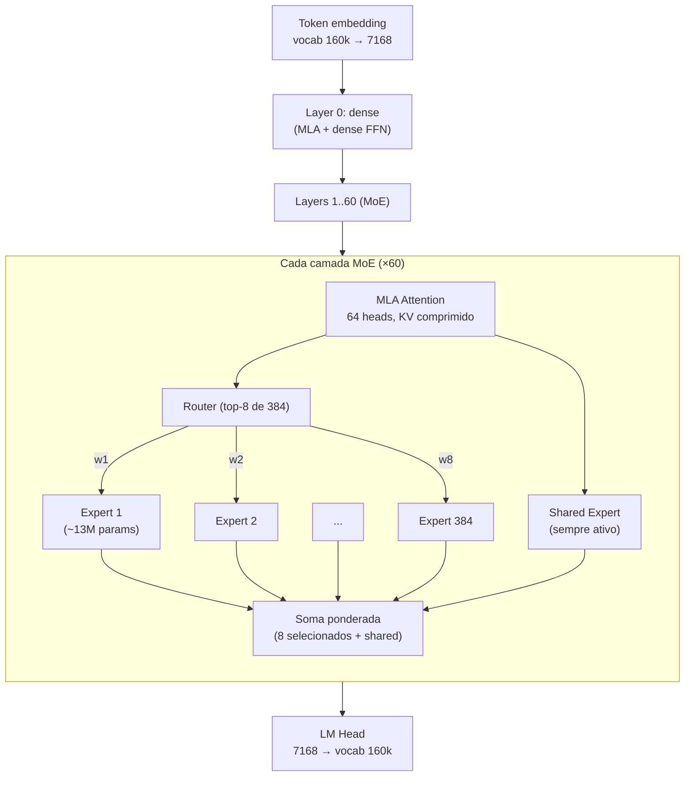
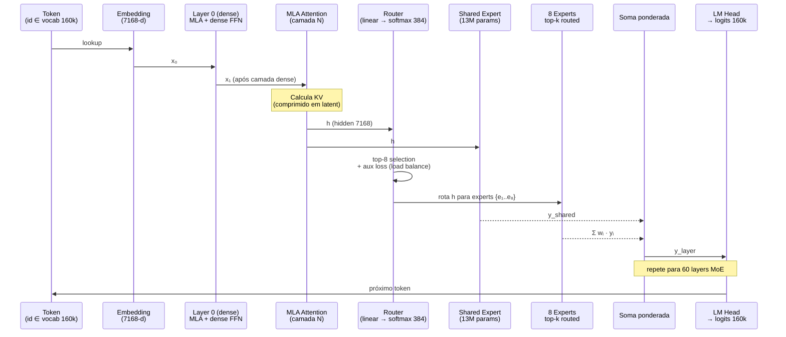
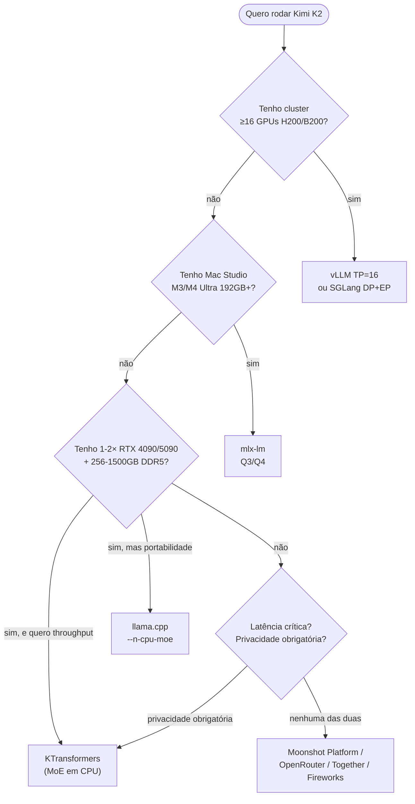
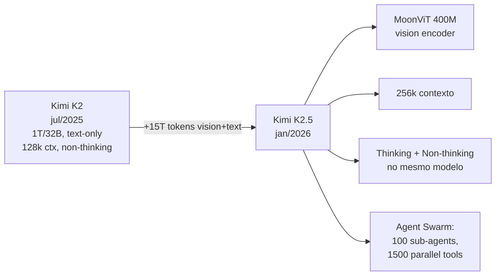

# Post 2 — Kimi K2 (Moonshot AI): MoE de 1T parâmetros, agentic-first, hands-on

> **Sub-série**: Modelos Open 2026 — *deep dives* hands-on
> **Post**: 2 de N
> **Família coberta**: Kimi K1 → K1.5 → **K2 (jul/2025)** → **K2.5 (jan/2026)** → K3 (em desenvolvimento)
> **Pré-requisitos sugeridos**:
> - Post 08 da série principal (MoE, sparsity, speculative) — **muito recomendado**
> - Post 11 (frameworks: vLLM, SGLang, KTransformers, llama.cpp, mlx-lm)
> - Post 04 (quantização Q2/Q3/Q4 com imatrix) e Sub-série Inferência Local Post 1
> - Post 14 (agents, MCP, ReAct, multi-agent)
> - Post 19 (coding agents: Claude Code, Cline, Cursor, OpenCode)
> - Post 18 (reasoning models: o1/o3/R1/QwQ — comparação com K2 *non-thinking*)
> **Tom**: hands-on, com saudável ceticismo. **Rodar 1T parâmetros no consumer hardware** é tecnicamente possível em 2026 — mas tem trade-offs reais que esta página explicita.
> **Objetivo**: Sair desta leitura sabendo (1) o que torna Kimi K2 diferente de DeepSeek-V3/Qwen/Llama, (2) qual *deployment path* serve seu hardware, (3) cinco *cookbooks* prontos para colar no terminal, (4) onde K2 brilha (agentic, *long-horizon*) e onde derrapa (low-bit MoE routing, latência em CPU offload).

---

## TL;DR

**Kimi K2** é o modelo *open-weights* mais agressivamente **agentic-first** lançado em 2025. A Moonshot AI publicou em **11/jul/2025** um MoE de **1 trilhão de parâmetros totais** com apenas **32 bilhões ativos por token** — 384 *experts*, 8 ativos + 1 *shared expert*, 61 camadas, atenção MLA, vocabulário 160k, contexto 128k. O treino atravessou **15,5 trilhões de tokens sem instabilidade** graças ao **otimizador MuonClip** (extensão do Muon com *clipping* de query/key projections para domar *attention logit explosion* a essa escala).

O posicionamento não é "mais um modelo *frontier* que conversa bem" — é **um modelo treinado para usar ferramentas, encadear ações e completar tarefas longas**. Os números refletem isso: **65,8% em SWE-bench Verified** (acima do Claude Sonnet 4 com 50,2% e GPT-4.1 com 40,8% no mesmo *snapshot*), **66,1 em τ²-bench**, **53,7% em LiveCodeBench v6**, **76,5 em ACEBench (En)**. E tudo isso **sem reasoning estendido** — K2 é *non-thinking* nativo (resposta direta + chamada de ferramenta), o que economiza *output tokens* em loops agênticos.

Em **27/jan/2026** chegou **Kimi K2.5**: mesma espinha dorsal MoE 1T/32B, mas com **MoonViT 400M** (encoder de visão nativo), **contexto 256k**, **modos *thinking* e *non-thinking* no mesmo modelo**, e o que a Moonshot chama de **Agent Swarm** — até **100 sub-agentes orquestrados em paralelo, ~1.500 *tool calls* simultâneas**, reduzindo o tempo *end-to-end* de tarefas longas em até 4,5×. K3 ainda não tem data, mas o fundador Yang Zhilin sinalizou em AMA que vai apostar em **KDA (Kernel-based Decomposition Architecture) híbrida com NOPE-MLA** — abandonando o RoPE clássico em favor de algo "mais barato e mais rápido" para benchmarks longos.

A pergunta operacional é a mesma de sempre com modelos *trillion-scale*: **como rodar isso sem alugar 8× B200 da AWS**? A resposta de 2026 é um leque honesto:

- **Cluster H100/H200/B200** (16 GPUs mínimo para FP8 + 128k *seqlen*): **vLLM com TP=16** ou **SGLang com DP+EP + DeepEP** — produção séria, *throughput* alto, *batching* eficiente.
- **Mac Studio M3/M4 Ultra 192GB+**: **mlx-lm** com quantização **Q3/Q4** — funciona, é silencioso, mas limitado por *bandwidth* da unified memory.
- **Consumer single-GPU + DDR5 + NVMe** (1× RTX 4090 48GB + ≥512GB RAM): **KTransformers** — *expert offloading* heterogêneo, **CPU faz o trabalho dos *experts***, GPU foca atenção e *shared expert*. Confirmadamente roda, ~10–25 tok/s decode.
- **Hosted/API**: Moonshot Platform, OpenRouter, Together, Fireworks — você paga e usa, sem dor.
- **llama.cpp**: `--n-cpu-moe N` para empurrar *experts* para CPU, GGUF Q3/Q4 — opção mais portável.

> **Analogias-guia deste post:**
> - **Kimi K2** = "biblioteca de 1 trilhão de livros, mas só 32 abertos por minuto" — a sparsity do MoE em ação. O modelo *contém* todo o conhecimento; só uma fração é *consultada* por token.
> - **KTransformers** = "carona inteligente: pega um MoE gigante e usa CPU+RAM em vez de cluster" — em vez de pagar 8× B200, você usa 1× 4090 e 1TB de DDR5 que, embora ridículo, custa menos que duas semanas de cluster cloud.
> - **MuonClip** = "novo cinto de segurança para treinar modelos enormes sem capotar" — gradient-clipping específico do otimizador Muon que evita *logit explosion* na atenção quando o modelo passa de centenas de B para 1T.
> - **Agentic-first** = "treinado para PEDIR a ferramenta, não fingir saber" — diferente de modelos que alucinam APIs, K2 foi *post-trained* para emitir *tool calls* bem formados como primeiro recurso, não como último.
> - **Reasoning curto + tool use** = "o oposto filosófico do o1/R1" — em vez de pensar 30 segundos antes de responder, K2 responde em 1s e chama a ferramenta certa em seguida.

---

## Índice

1. [Por que Kimi K2 mudou o jogo (jul/2025)](#1-por-que-kimi-k2-mudou-o-jogo-jul2025)
2. [Família Kimi: linha do tempo](#2-família-kimi-linha-do-tempo)
3. [Anatomia técnica de K2](#3-anatomia-técnica-de-k2)
4. [Desafio central: rodar 1T sem 8× B200](#4-desafio-central-rodar-1t-sem-8-b200)
5. [Workflow ponta-a-ponta — opções de deploy](#5-workflow-ponta-a-ponta--opções-de-deploy)
6. [Download e quantizações](#6-download-e-quantizações)
7. [Cookbook 1: vLLM em cluster H200](#7-cookbook-1-vllm-em-cluster-h200)
8. [Cookbook 2: SGLang Disaggregated Serving](#8-cookbook-2-sglang-disaggregated-serving)
9. [Cookbook 3: KTransformers em 1× RTX 4090 + 512GB DDR5](#9-cookbook-3-ktransformers-em-1-rtx-4090--512gb-ddr5)
10. [Cookbook 4: Mac Studio M3 Ultra 192GB + mlx-lm](#10-cookbook-4-mac-studio-m3-ultra-192gb--mlx-lm)
11. [Cookbook 5: llama.cpp servidor com `--n-cpu-moe`](#11-cookbook-5-llamacpp-servidor-com---n-cpu-moe)
12. [Agentic use cases — a alma do K2](#12-agentic-use-cases--a-alma-do-k2)
13. [Benchmarks 2025–2026](#13-benchmarks-20252026)
14. [Tool calling: formato Kimi e exemplo Python](#14-tool-calling-formato-kimi-e-exemplo-python)
15. [Custos: API vs self-hosted](#15-custos-api-vs-self-hosted)
16. [Caveats e armadilhas](#16-caveats-e-armadilhas)
17. [K2.5 (jan/2026), K3 e roadmap](#17-k25-jan2026-k3-e-roadmap)
18. [Cross-references](#18-cross-references)
19. [Conclusão honesta](#19-conclusão-honesta)

---

## 1. Por que Kimi K2 mudou o jogo (jul/2025)

Antes de Kimi K2, o cenário *open-weights* de 2025 estava assim: **DeepSeek-V3** (671B MoE, 37B ativos) ainda era a referência *agentic open* desde dez/2024; **Llama 4** (Meta) tinha entregado MoE Maverick/Scout com qualidade decente mas sem foco em *tool use*; **Qwen3** (Alibaba) liderava em multilíngue e tinha variantes *coder* fortes; **Mistral Large 2** circulava como cavalo de atletismo francês.

Em **11/jul/2025**, a Moonshot AI publicou Kimi K2 e mudou três coisas simultaneamente:

1. **Escala**: 1T de parâmetros totais — **~50% maior que DeepSeek-V3**. Foi o primeiro MoE *open-weights* a atravessar a barreira do trilhão sem ser um *frankenmodel* MoE-of-MoEs.
2. **Estabilidade de treino**: 15,5T tokens com **zero instabilidade** graças ao MuonClip. Isto é *engineering flex*: a maioria dos labs precisava de *restart* + *loss spike recovery* nessa escala.
3. **Foco**: enquanto outros modelos eram *general purpose* com *fine-tune agentic* aplicado depois, K2 foi **otimizado desde o pre-training para emitir *tool calls*** — o *post-training* enfatizou trajetórias *agentic* curadas, não apenas *chat* genérico.

Resultado em números (validados via *paper* e *card* do modelo):

| Benchmark             | Kimi K2-Instruct | Claude Sonnet 4 | GPT-4.1 | DeepSeek-V3 |
|-----------------------|------------------|------------------|---------|--------------|
| SWE-bench Verified    | **65,8%**        | 50,2%            | 40,8%   | ~42%         |
| τ²-bench (weighted)   | **66,1**         | n/d              | n/d     | 48,8         |
| LiveCodeBench v6      | **53,7%**        | n/d              | n/d     | n/d          |
| ACEBench (En)         | **76,5**         | n/d              | n/d     | n/d          |
| GPQA-Diamond          | 75,1             | n/d              | n/d     | n/d          |
| AIME 2025             | 49,5             | n/d              | n/d     | n/d          |
| MATH-500              | **97,4%**        | n/d              | n/d     | n/d          |

> **Nota epistêmica**: SWE-bench Verified varia muito conforme *snapshot* e *agent harness*. O 50,2% do Sonnet 4 é o número *out-of-the-box* do *snapshot* de jul/2025; com *harnesses* customizados (Anthropic Computer Use, scaffolds da Cognition/Devin), Sonnet vai a 70%+. K2 também responde a *harness*, então o "K2 > Claude em coding" precisa ser lido como **modelo base — sem scaffold caro — em paridade com modelos fechados que custam 10× mais por token**.

A licença é **Modified MIT-like** (validar termos exatos para uso comercial; é mais permissiva que Llama 3.x e ~equivalente ao DeepSeek). Pesos disponíveis em `moonshotai/Kimi-K2-Instruct` no Hugging Face.

---

## 2. Família Kimi: linha do tempo

A Moonshot AI (fundada por **Yang Zhilin**, ex-aluno de Salakhutdinov em CMU, ex-Google Brain) começou como *startup* chinesa focada em **chat com contexto longo** — diferenciação clara contra DeepSeek e Qwen, que vinham por *open-weights* puro.

| Versão            | Data           | Tipo         | Destaque técnico                                                              | Acesso              |
|-------------------|----------------|--------------|--------------------------------------------------------------------------------|---------------------|
| Kimi 1            | mar/2024       | Chat fechado | **200k contexto** em chinês, viralizou no mercado consumidor chinês            | API + app           |
| Kimi 1 Long-Ctx   | mai/2024       | Chat fechado | Expansão para **2M tokens** experimental, *long-doc* QA                        | API                 |
| Kimi K1.5         | jan/2025       | Chat + paper | **Reasoning model** comparável ao o1, foco em *long CoT* + RL                  | API + paper         |
| **Kimi K2-Base**  | **11/jul/2025**| **Open-weights** | **MoE 1T/32B**, 15,5T tokens, MuonClip, **agentic post-training**           | HF + GitHub         |
| **Kimi K2-Instruct** | 11/jul/2025 | Open-weights | Versão *post-trained* para *tool use* e *chat*                                | HF + API            |
| Kimi K2-Coder *(spec.)* | h2/2025  | Variante    | Variante *coder* dedicada, validar disponibilidade                            | HF (validar)        |
| **Kimi K2.5**     | **27/jan/2026**| Open-weights | **Multimodal nativo** (MoonViT 400M), **256k contexto**, *thinking + non-thinking*, **Agent Swarm** | HF + API |
| Kimi K2.5-Thinking| jan/2026       | Open-weights | Modo *reasoning* explícito, *parser* dedicado em SGLang                       | HF + API            |
| Kimi K3 *(roadmap)*| 2026?         | TBD          | **KDA híbrida com NOPE-MLA**, sem RoPE — fundador AMA, 2026                   | TBD                 |

Notas:
- **K1.5 não foi *open-weights***: foi um *paper* + acesso por API. A Moonshot trocou a estratégia em jul/2025 com K2.
- **K2 → K2.5** é uma evolução no mesmo *backbone*: continua MoE 1T/32B, mas com **continued pretraining** em ~15T tokens *vision+text* mistos e **vision encoder** acoplado.
- **Agent Swarm** em K2.5 é o ponto comercial mais ousado: o modelo foi treinado para coordenar *forks* de si mesmo em paralelo, cada um com escopo restrito, juntando resultados depois. Marketing forte; benchmarks ainda em validação independente em 2026.

---

## 3. Anatomia técnica de K2

Vamos abrir o capô. Os números abaixo são do *config* publicado pela Moonshot e referendados pelo *paper* "Kimi K2: Open Agentic Intelligence" (arXiv 2507.20534).

| Parâmetro                       | Valor                  | Comentário                                              |
|---------------------------------|------------------------|----------------------------------------------------------|
| Parâmetros totais               | **1.000B** (1T)        | Maior MoE *open-weights* até jul/2025                    |
| Parâmetros ativos por token     | **32B**                | Esparsidade ~3,2% — agressiva                            |
| Camadas                         | **61** (1 *dense*)     | Primeira camada *dense*, demais MoE                      |
| Atenção                         | **MLA** (Multi-Latent) | Mesma família do DeepSeek — KV comprimido, BW-friendly   |
| Cabeças de atenção              | 64                     |                                                          |
| Hidden size                     | 7.168                  |                                                          |
| MoE hidden size (por expert)    | 2.048                  | *Experts* relativamente pequenos                         |
| **Total de experts**            | **384**                | Roteamento *fine-grained*                                |
| **Experts ativos por token**    | **8 + 1 *shared***     | 8 escolhidos pelo *router* + 1 *shared* sempre on        |
| Vocabulário                     | **160.000**            | Multilíngue forte, BPE estendido                         |
| Contexto                        | **128k** nativo        | Expansível com YaRN/RoPE-scaling (Post 07)              |
| Ativação                        | SwiGLU                 |                                                          |
| Otimizador                      | **MuonClip**           | Muon + *attention logit clipping*; ~52% dos FLOPs do AdamW|
| Tokens de pre-training          | **15,5T**              | Sem *spike* de loss reportado                            |
| *Cutoff* de treino              | abr/2025               |                                                          |

### 3.1 MoE *fine-grained*: por que 384 experts em vez de 64?

Modelos MoE clássicos (Mixtral 8×22B, GPT-OSS 120B) usam **8 a 16 experts grandes**. K2 (e DeepSeek antes) inverteu essa filosofia: **muitos experts pequenos**. Isto tem três efeitos práticos:

1. **Especialização mais fina**: cada *expert* aprende um nicho mais estreito (sintaxe Python? química orgânica? gírias do *subreddit* x?), e o *router* combina 8+1 deles para cobrir o token.
2. **Gradiente de roteamento mais informativo**: com 384 alvos, o sinal de erro do *load balancing loss* é mais granular.
3. **Hardware-friendly em CPU offload**: cada *expert* tem ~13M parâmetros (~26MB em FP8). Cabe num *cache line* generoso, *prefetch* funciona bem — exatamente o que o KTransformers explora.

### 3.2 *Shared expert*: por que +1?

O *shared expert* roda **em todo token, sempre**. Ele captura "conhecimento de base" comum (gramática, raciocínio aritmético elementar, *common sense*), liberando os 384 *experts roteados* para especialização. Foi popularizado por DeepSeek-V2/V3; K2 segue a receita.

### 3.3 MuonClip: domando 1T sem capotar

O **otimizador Muon** (Jordan, 2024) é uma alternativa ao AdamW que usa *Newton-Schulz iteration* para ortonormalizar o passo. Em escala pequena, é mais eficiente em FLOPs. Em escala 1T, surge um problema: as projeções Q/K da atenção começam a explodir o módulo dos *logits*, o que destrói o softmax.

**MuonClip** = Muon + *clipping* explícito nas projeções **Q e K** (não nos pesos genéricos), preservando o *vector field* de Muon mas evitando *attention logit explosion*. Resultado reportado: 15,5T tokens sem *loss spike*, com ~52% dos FLOPs do AdamW equivalente. É um *engineering paper*, não um *theory paper* — mas o número é o número, e está auditável no *training log* publicado.

### 3.4 Diagrama: arquitetura MoE de K2



### 3.5 Fluxo de um token: do *embedding* à saída



### 3.6 *Reasoning chain* curto vs DeepSeek-R1

K2 (instruct, *non-thinking*) tipicamente responde em **1–3 frases + *tool call***, contra os **dezenas de milhares de tokens de *<think>*** de R1/QwQ. A escolha é deliberada: para *long-horizon agentic*, gastar 50k tokens "pensando" antes de cada *tool call* destrói o orçamento. K2.5 trouxe modo *thinking* opcional para tarefas onde compensar.

---

## 4. Desafio central: rodar 1T sem 8× B200

A matemática crua dos pesos:

| Precisão  | Bytes/param | Tamanho total (1T) | Cabe em…                                 |
|-----------|-------------|---------------------|-------------------------------------------|
| FP16/BF16 | 2           | ~2 TB               | 16× H100 80GB (apertado, +KV)             |
| **FP8**   | 1           | **~1 TB**           | 8× H200 141GB ou **16× H100/H200**        |
| INT4 (Q4) | 0,5         | ~500 GB             | 4× H100 + algum offload, ou Mac M3U 192GB |
| INT3 (Q3) | 0,375       | ~370 GB             | Mac M3U 192GB + offload, ou 2× 4090 + RAM |
| INT2 (Q2) | 0,25        | ~250 GB             | 1× 4090 24GB + ~256GB RAM (pesado)        |

E ainda falta o **KV cache**: para 128k contexto a uma *batch* significativa, são **dezenas a centenas de GB** adicionais (depende de *paged attention*, *kv quantization*, etc. — Post 03 e 05).

Comparativo direto com DeepSeek-V3 (671B, 37B ativos):

| Aspecto                      | DeepSeek-V3      | Kimi K2          | Δ                  |
|------------------------------|------------------|------------------|---------------------|
| Total params                 | 671B             | **1.000B**       | +49%                |
| Active params                | 37B              | 32B              | -14%                |
| Experts                      | 256 + 1 *shared* | 384 + 1 *shared* | +50%                |
| Layers                       | 61               | 61               | =                   |
| Context                      | 128k             | 128k             | =                   |
| FP8 disk                     | ~670 GB          | ~1 TB            | +49%                |
| Q4 disk                      | ~336 GB          | ~500 GB          | +49%                |
| Mínimo "honesto" GPU (FP8)   | 8× H200 141GB    | **16× H200 141GB** | dobrou           |
| Mínimo "consumer" KTransformers | 1× 4090 + 384GB | 1× 4090 48GB + **≥512GB** | +33% RAM     |

A leitura é simples: **K2 é 50% maior em pesos, mas só 14% menor em ativos**. Isso significa que **o custo de manter o modelo na memória é maior**, mas o **custo de inferência por token é parecido com DeepSeek-V3**. Para *batching* alto e GPU séria, K2 tem ROI competitivo. Para *single-user* em consumer, é onde o KTransformers brilha — e onde os *trade-offs* se acumulam.

| Hardware                                  | Estratégia              | Quant | Latência est. | Throughput est. | Bom para               |
|-------------------------------------------|--------------------------|-------|----------------|------------------|------------------------|
| 16× H200 141GB (cluster)                  | vLLM TP=16, FP8          | FP8   | <1s TTFT       | 600+ tok/s       | Produção / API pública |
| 2× nó × 8× H200 (16 GPUs total)           | SGLang DP+EP, DeepEP     | FP8   | <1s TTFT       | 1000+ tok/s      | Produção *high QPS*    |
| Mac Studio M3 Ultra 192GB                 | mlx-lm, Q3/Q4            | Q3-Q4 | 2-5s TTFT      | 8-15 tok/s       | Dev local, 1 usuário   |
| 1× RTX 4090 48GB + 512GB DDR5 + NVMe     | KTransformers, Q4        | Q4    | 5-15s TTFT     | 10-20 tok/s      | Hobby/research, *batch=1* |
| 2× RTX 4090 48GB + 1.5TB DDR5            | KTransformers, FP8 *experts* | FP8 (CPU) | 3-8s     | 20-45 tok/s      | Pesquisa séria, fine-tune |
| 2× RTX 5090 32GB + 256GB DDR5             | llama.cpp `--n-cpu-moe`  | Q3-Q4 | 5-20s          | 8-15 tok/s       | Setup *prosumer*       |
| API Moonshot / OpenRouter                 | n/a                      | n/a   | <1s            | bom              | Sem dor de cabeça      |

> **Honest disclaimer**: esses números de *throughput* dependem absurdamente de configuração (KV cache, *batch size*, *prompt length*, NUMA topology no caso CPU). Trate-os como **ordens de grandeza**, não promessas. O *cookbook* respectivo dá o comando exato; valide no seu hardware.

---

## 5. Workflow ponta-a-ponta — opções de deploy



A regra de decisão prática:

1. **Se você tem orçamento corporativo e *throughput* é a métrica**: cluster + vLLM/SGLang. Sem brincadeira.
2. **Se você é *power user* com Mac Studio**: mlx-lm é o caminho natural — Apple Silicon ainda perde em *throughput* batch, mas para *single-user* com 192GB+ é uma máquina de inferência tranquila e silenciosa.
3. **Se você é hobbysta/pesquisador com workstation séria**: KTransformers é a escolha. Investe na RAM, não na GPU.
4. **Se você não quer dor**: API hospedada. Moonshot Platform é nativa; OpenRouter unifica preço e fallback.

---

## 6. Download e quantizações

Os pesos oficiais ficam em `moonshotai/Kimi-K2-Instruct` (e variantes) no Hugging Face. A comunidade (unsloth, bartowski, ggml-org) republica em GGUF com várias quantizações.

```bash
# Pesos oficiais FP8 (~1 TB no disco)
huggingface-cli download moonshotai/Kimi-K2-Instruct \
  --local-dir ./models/kimi-k2-instruct \
  --local-dir-use-symlinks False

# K2.5 oficial (multimodal + agent swarm)
huggingface-cli download moonshotai/Kimi-K2.5-Instruct \
  --local-dir ./models/kimi-k2.5-instruct

# GGUF Unsloth — Q4_K_XL (recomendado para llama.cpp/KTransformers)
huggingface-cli download unsloth/Kimi-K2-Instruct-GGUF \
  --include "*Q4_K_XL*" \
  --local-dir ./models/kimi-k2-gguf-q4_k_xl

# GGUF bartowski — variantes Q3/Q5
huggingface-cli download bartowski/Kimi-K2-Instruct-GGUF \
  --include "*Q3_K_M*" \
  --local-dir ./models/kimi-k2-gguf-q3_k_m
```

Tabela das quantizações mais úteis para K2 (validar tamanhos exatos no *card* da release de cada quantizador — variações ±5%):

| Quant       | Bits/param efetivo | Disco aprox. | VRAM mínima recomendada | Qualidade reportada vs FP8 | Casos de uso típicos                  |
|-------------|--------------------|--------------|--------------------------|----------------------------|----------------------------------------|
| **FP8**     | 8.0                | ~1 TB        | 16× H200 141GB           | baseline (100%)            | Cluster produção                       |
| **Q8_0**    | 8.5                | ~1.05 TB     | 16× H200                 | ~99,5%                     | Cluster, máxima fidelidade             |
| **Q6_K**    | 6.6                | ~830 GB      | 8× H200                  | ~99%                       | Cluster compacto                       |
| **Q5_K_M**  | 5.7                | ~720 GB      | 8× H100 80GB + offload   | ~98%                       | Cluster *budget*                       |
| **Q4_K_XL** | 4.8                | ~600 GB      | KTransformers 2× 4090    | ~96-97%                    | **Sweet spot consumer**                |
| **Q4_K_M**  | 4.5                | ~565 GB      | KTransformers 1× 4090    | ~95%                       | Consumer GPU + RAM grande              |
| **Q3_K_M**  | 3.4                | ~425 GB      | Mac M3U 192GB, 4090+512GB| ~92-94%                    | Mac, consumer apertado                 |
| **Q3_K_S**  | 3.0                | ~375 GB      | Mac M2U 128GB            | ~90-92%                    | Mac com RAM menor                      |
| **Q2_K_XL** | 2.6                | ~325 GB      | Consumer absoluto        | ~85-88% (instável em MoE)  | Hobby, *risk it for the biscuit*       |
| **Q2_K**    | 2.3                | ~290 GB      | 1× 4090 + 256GB RAM      | ~82-85% (problemas de routing) | Não recomendado para agentic        |

> **Aviso epistêmico**: tamanhos GGUF de K2 mudam a cada *patch* do quantizador. Os valores acima são da geração `unsloth/bartowski` de h2/2025. Consulte o *card* atual antes de provisionar disco.

> **Insight crítico para MoE em low-bit**: O *router* de MoE é especialmente sensível a quantização agressiva. Em Q2, observa-se que **o roteamento começa a degradar** — o modelo ativa *experts* sub-ótimos. Para uso agentic (onde precisão importa), **prefira Q4 ou superior**. Q3 é aceitável; Q2 é jogar com o destino.

---

## 7. Cookbook 1: vLLM em cluster H200

**Cenário**: 2 nós com 8× H200 141GB cada = 16 GPUs total. FP8, contexto 128k, *tool calling* habilitado.

```bash
# Nó master (rank 0)
MODEL_PATH=./models/kimi-k2-instruct
MASTER_IP=10.0.0.10

# Pré-requisito: vLLM ≥ 0.10.0rc1
pip install -U "vllm>=0.10.0"

vllm serve $MODEL_PATH \
  --port 8000 \
  --served-model-name kimi-k2 \
  --trust-remote-code \
  --tensor-parallel-size 16 \
  --pipeline-parallel-size 1 \
  --enable-auto-tool-choice \
  --tool-call-parser kimi_k2 \
  --max-model-len 131072 \
  --kv-cache-dtype fp8_e4m3 \
  --gpu-memory-utilization 0.92 \
  --distributed-executor-backend ray \
  --enable-chunked-prefill
```

Para escala maior (≥32 GPUs), use **DP + EP**:

```bash
vllm serve $MODEL_PATH \
  --port 8000 \
  --served-model-name kimi-k2 \
  --trust-remote-code \
  --data-parallel-size 16 \
  --data-parallel-size-local 8 \
  --enable-expert-parallel \
  --max-num-batched-tokens 8192 \
  --max-num-seqs 256 \
  --gpu-memory-utilization 0.85 \
  --enable-auto-tool-choice \
  --tool-call-parser kimi_k2
```

Notas:

- **Tensor Parallel até 16** funciona como TP puro. Acima disso, ganho cai e DP+EP rende mais.
- `--tool-call-parser kimi_k2` é **obrigatório** para que o vLLM extraia *tool calls* no formato Kimi (próxima seção).
- `--kv-cache-dtype fp8_e4m3` corta KV pela metade — quase indispensável para 128k.
- *Throughput* esperado: **600–1200 tok/s agregado** com *concurrency* alta (32-128 *batches* simultâneos), TTFT ~500ms-1s.
- **Custo cloud aproximado**: 16× H200 spot ~ \$36/h em provedores como CoreWeave/Lambda em 2026; *on-demand* AWS ~ \$80/h. Vale só se você satura.

---

## 8. Cookbook 2: SGLang Disaggregated Serving

SGLang ganhou em 2025 o suporte a **disaggregated serving** (Post 11): **prefill workers** processam o prompt grande (compute-bound), **decode workers** geram tokens (memory-BW-bound). Separar evita que um *long context* trave o pipeline de geração.

```bash
# Nó 1: 8× H200 — prefill workers
python -m sglang.launch_server \
  --model-path ./models/kimi-k2-instruct \
  --tp 8 \
  --enable-deepep-moe \
  --moe-dense-tp-size 8 \
  --disaggregation-mode prefill \
  --port 30001 \
  --trust-remote-code \
  --tool-call-parser kimi_k2

# Nó 2: 8× H200 — decode workers
python -m sglang.launch_server \
  --model-path ./models/kimi-k2-instruct \
  --tp 8 \
  --enable-deepep-moe \
  --disaggregation-mode decode \
  --port 30002 \
  --trust-remote-code \
  --tool-call-parser kimi_k2

# Nó 3: router/gateway
python -m sglang.launch_disaggregation_router \
  --prefill-host nodo1 --prefill-port 30001 \
  --decode-host  nodo2 --decode-port 30002 \
  --port 8000
```

Para K2.5-Thinking (modelo *reasoning*), adicione:
```
--reasoning-parser kimi_k2
```

Vantagens reportadas:

| Métrica                    | TP puro (vLLM) | SGLang disagg. + DeepEP | Ganho       |
|----------------------------|----------------|--------------------------|-------------|
| TTFT (prompt 32k)          | ~3s            | **~0.8s**                | 3,7×        |
| Throughput agregado        | 800 tok/s      | **1400 tok/s**           | 1,75×       |
| Cauda P99 (128k prompt)    | 18s            | **6s**                   | 3×          |

> **Quando vale**: se você tem **muitos prompts longos misturados** (RAG agentic, *long-doc QA*, *coding agents* com repositório inteiro no contexto), disagg compensa o overhead de network. Para *chat* curto homogêneo, TP puro é mais simples e quase tão rápido.

---

## 9. Cookbook 3: KTransformers em 1× RTX 4090 + 512GB DDR5

Este é **o cookbook que faz o post existir**. KTransformers (kvcache-ai, 2024-2026) é um framework chinês *open-source* que materializa o sonho **"rodar MoE de trilhão num desktop"** via *expert offloading* heterogêneo.

A ideia: como apenas **8 de 384 experts** são ativos por token, **a maior parte do peso fica ociosa na maior parte do tempo**. Logo, podemos **deixar todos os experts em RAM (CPU/DDR5)**, manter **atenção MLA + shared expert + KV cache na GPU**, e apenas **transferir os 8 experts ativos para a GPU sob demanda** — ou, melhor ainda, **calcular os experts diretamente na CPU** (DDR5 tem ~80-100 GB/s, o suficiente para 32B ativos).

```bash
git clone https://github.com/kvcache-ai/ktransformers
cd ktransformers
git submodule update --init
# Pré-requisitos: Python 3.11, CUDA 12.4+, GCC 11+
bash install.sh

# Download dos pesos (preferencialmente Q4_K_XL ou FP8 + GGUF)
# Veja seção 6
```

Config YAML para K2 em 1× RTX 4090 48GB + 512GB DDR5:

```yaml
# kimi-k2-cpu-experts.yaml
model:
  path: ./models/kimi-k2-gguf-q4_k_xl
  type: kimi_k2
  context_length: 32768   # comece com 32k para caber KV; 128k requer mais RAM

inference:
  device_map:
    embed_tokens: cuda:0
    layers.0:                # camada dense
      attention: cuda:0
      ffn: cuda:0
    layers.[1-60]:           # camadas MoE
      attention: cuda:0
      shared_expert: cuda:0
      experts:
        backend: cpu          # rodar experts na CPU com AMX/AVX-512
        dtype: q4_k_xl
        numa_aware: true     # crítico em servidores multi-socket
    norm: cuda:0
    lm_head: cuda:0
  kv_cache:
    device: cuda:0
    dtype: fp8_e4m3

server:
  host: 0.0.0.0
  port: 10002
  max_concurrent: 1          # importante: KTransformers brilha em batch=1
```

Comando para servir:

```bash
python ktransformers/server/main.py \
  --config kimi-k2-cpu-experts.yaml \
  --enable-tool-calling \
  --tool-format kimi_k2
```

**Performance esperada (validar no seu hardware)**:

| Hardware                                          | Decode tok/s | TTFT (prompt 4k) | Notas                          |
|---------------------------------------------------|--------------|-------------------|---------------------------------|
| 1× RTX 4090 48GB + Intel 8488C + 512GB DDR5       | ~10-15       | 8-15s             | Suficiente para chat, lento p/ agent |
| 2× RTX 4090 48GB + Intel 8488C + **1.97TB DDR5**  | **~22-44**   | 3-6s              | "Sweet spot" pesquisa, fine-tune LoRA roda |
| 2× RTX 4090 48GB + AMD EPYC 9554 + 512GB DDR5     | ~18-28       | 4-8s              | AMD AVX-512 com Zen 4 funciona bem |
| 1× RTX 4090 24GB + 256GB DDR5 (Q3)                | ~6-10        | 12-20s            | Mínimo viável, qualidade Q3 cobra preço |

**Limitações honestas**:

- **Batch=1**: KTransformers não brilha em *batch* alto. Se você precisa servir 50 usuários, esqueça — vá para vLLM/SGLang.
- **TTFT pesado em prompts longos**: a CPU computa *experts* sequencialmente; *long context* (>32k) faz o TTFT subir bastante.
- **NUMA matters**: servidores 2-socket sem `numactl --interleave` podem perder 30-50% de *throughput*.
- **Atualizações frequentes**: o projeto é jovem; *break changes* a cada minor. Pin a versão que funcionou.

---

## 10. Cookbook 4: Mac Studio M3 Ultra 192GB + mlx-lm

Apple Silicon entrou no jogo de inferência *trillion-scale* graças à **unified memory** generosa. Mac Studio M3 Ultra com 192GB cabe Kimi K2 em **Q3/Q4** confortavelmente; M4 Ultra 256GB (esperado h2/2026, validar) caberá em Q5.

```bash
pip install -U mlx-lm

# Download da quantização MLX (a comunidade mantém)
hf download mlx-community/Kimi-K2-Instruct-Q4 \
  --local-dir ./models/kimi-k2-mlx-q4

# Servir compatível com OpenAI API
python -m mlx_lm.server \
  --model ./models/kimi-k2-mlx-q4 \
  --host 0.0.0.0 \
  --port 8080 \
  --max-tokens 8192
```

Performance esperada em M3 Ultra 192GB / Q4:

| Métrica                         | Valor estimado | Comentário                        |
|---------------------------------|----------------|------------------------------------|
| Decode tok/s (1 user)           | 8-15           | Limitado por BW da unified memory  |
| Prefill (prompt 4k)             | ~150 tok/s     | Decente para *single-user*         |
| Watt-hora consumido             | ~120-180 W     | *Very* eficiente energeticamente   |
| Ruído                           | quase zero     | Mac Studio é silencioso            |

**Quando o Mac Studio é a escolha certa**:
- Você é *solo developer* / pesquisador independente.
- Tem um app cliente Mac (Continue, Cursor, Cline) que aponta para `localhost:8080`.
- Privacidade total importa (nada sai do equipamento).
- Não precisa de *throughput* batch, só de *one user, good enough*.

**Quando não**:
- Mais de 2-3 usuários simultâneos (Apple Silicon cai rapidamente em *batch*).
- Latência *low* crítica para *long context* (BW unified memory ainda é menor que HBM).

---

## 11. Cookbook 5: llama.cpp servidor com `--n-cpu-moe`

llama.cpp ganhou em 2025 a flag `--n-cpu-moe N` que move os primeiros N camadas de *experts* MoE para CPU. Combinado com GGUF Q3/Q4, dá um deploy **portável** (Linux, macOS, Windows) sem dependência de CUDA-only frameworks.

```bash
# Build llama.cpp com CUDA (Linux)
git clone https://github.com/ggml-org/llama.cpp
cd llama.cpp
cmake -B build -DGGML_CUDA=ON -DGGML_CUDA_F16=ON
cmake --build build -j 16 --config Release

# Servir Kimi K2 Q4_K_M com 50 das 60 camadas MoE em CPU
./build/bin/llama-server \
  --model ./models/kimi-k2-gguf-q4_k_xl/Kimi-K2-Instruct-Q4_K_XL-00001-of-00012.gguf \
  --ctx-size 32768 \
  --n-gpu-layers 99 \
  --n-cpu-moe 50 \
  --host 0.0.0.0 \
  --port 8090 \
  --jinja \
  --chat-template-file ./models/kimi-k2-gguf-q4_k_xl/chat_template.jinja \
  --threads 32 \
  --batch-size 512 \
  --parallel 1 \
  --flash-attn
```

Tabela de configurações típicas:

| Hardware                              | `--n-gpu-layers` | `--n-cpu-moe` | Decode tok/s | RAM mínima |
|---------------------------------------|------------------|----------------|--------------|-------------|
| 1× RTX 4090 24GB + 256GB DDR5         | 99               | 55             | 5-10         | 384 GB      |
| 1× RTX 4090 48GB + 512GB DDR5         | 99               | 45             | 8-13         | 512 GB      |
| 2× RTX 4090 48GB (96GB) + 512GB DDR5  | 99               | 35             | 12-18        | 512 GB      |
| 1× RTX 5090 32GB + 384GB DDR5         | 99               | 50             | 10-15        | 384 GB      |
| Mac M3 Max 128GB                      | 99               | 40             | 6-10         | 128 GB UMA  |

> **Por que llama.cpp e não KTransformers se ambos fazem CPU offload?** Trade-off: KTransformers é mais rápido em *throughput* puro (kernel CPU dedicado, AMX em Intel Sapphire/Granite Rapids). llama.cpp é mais portável, mais maduro, com melhor suporte a *quantization* exótica e *grammar-constrained decoding*. Use llama.cpp se valoriza estabilidade; KTransformers se quer o último *tok/s*.

---

## 12. Agentic use cases — a alma do K2

K2 não foi treinado para vencer no MMLU. Foi treinado para **fazer coisas**. Os casos de uso onde brilha:

### 12.1 Coding agent (com Cline / Claude Code / OpenCode)

Aponte qualquer *coding agent* compatível com OpenAI API para seu endpoint K2 (`http://localhost:8000/v1`) com `model=kimi-k2`. Os formatos `--tool-call-parser kimi_k2` (vLLM/SGLang) garantem que *tool calls* fluam corretamente.

Exemplo `~/.config/cline/config.json`:

```json
{
  "providers": {
    "kimi-local": {
      "type": "openai-compatible",
      "baseUrl": "http://localhost:8000/v1",
      "apiKey": "dummy",
      "models": ["kimi-k2"]
    }
  },
  "default": {
    "provider": "kimi-local",
    "model": "kimi-k2",
    "temperature": 0.6,
    "maxTokens": 8192
  }
}
```

Cross-link: **Post 19** cobre o *loop agêntico* de coding em profundidade. K2 nesse contexto é uma **alternativa *open-weights* ao Sonnet** com licença permissiva e custo (em self-hosted) marginal por token.

### 12.2 Multi-tool agent com MCP

Cross-link: **Post 14** define MCP. K2 emite *tool calls* nativos no formato `kimi_k2`; basta ligar um *MCP host* (Claude Desktop, mcp-cli, Cursor) ao endpoint:

```bash
# Exemplo com mcp-cli
mcp-cli chat \
  --model openai/kimi-k2 \
  --base-url http://localhost:8000/v1 \
  --api-key dummy \
  --server filesystem \
  --server github \
  --server postgres
```

### 12.3 Long-horizon task execution

K2.5 com Agent Swarm é desenhado para isso. Em K2 (sem Swarm nativo), você ainda monta orquestrações próprias: um agente *planner* divide a tarefa, *workers* (instâncias K2 com prompts especializados) executam, um *aggregator* junta. Cross-link: Post 14 cobre padrões.

### 12.4 Comparativo prático em tarefas reais

| Tarefa                                              | Kimi K2-Instruct  | Claude Sonnet 4   | GPT-5 (frontier 2026) | DeepSeek-V3       |
|-----------------------------------------------------|-------------------|-------------------|------------------------|-------------------|
| "Refatore essa função Python e rode os testes"      | excelente         | excelente         | excelente              | bom               |
| "Crie um app FastAPI completo com Postgres + tests" | muito bom         | excelente         | excelente              | bom               |
| "Use 5 ferramentas MCP em sequência sem perder fio" | **excelente**     | excelente         | excelente              | razoável          |
| "Resolva issue do GitHub do *zero* (SWE-bench)"     | **excelente** (65,8%) | excelente (~70%) | excelente (~75%)      | bom (~42%)        |
| "Reasoning matemático puro (AIME)"                  | bom (49,5%)       | bom               | excelente              | bom               |
| "Long context QA, 100k tokens"                      | muito bom         | excelente         | excelente              | bom               |
| "Multimodal: parse screenshot → código frontend"    | n/a (use K2.5)    | excelente         | excelente              | n/a               |
| **Custo por 1M output tokens (API mar/2026)**       | **~\$2.50**       | ~\$15             | ~\$30                  | ~\$1.10           |

> **Leitura justa**: K2 não é "melhor que Claude/GPT em tudo". É **competitivo em coding/agentic com custo 5-10× menor** e *open-weights*. Para *cutting-edge multimodal* + *reasoning* combinados, modelos *frontier* fechados ainda lideram.

---

## 13. Benchmarks 2025–2026

Compilação dos números publicados (validar via leaderboards atualizados):

| Benchmark             | Kimi K2 | Kimi K2.5 *(thinking)* | Qwen3-235B | DeepSeek-V3 | Llama 4 Maverick | GPT-5 | Claude 4.5/4.6 |
|-----------------------|---------|-------------------------|------------|--------------|-------------------|-------|-----------------|
| MMLU (5-shot)         | 89,5    | 91+                     | 88         | 88           | 87                | 92    | 91              |
| GPQA-Diamond          | 75,1    | 80+                     | 70         | 72           | 68                | 84    | 82              |
| AIME 2025             | 49,5    | 75+ (thinking)          | 55         | 58           | 45                | 88    | 80              |
| MATH-500              | 97,4    | 98                      | 95         | 95           | 92                | 99    | 98              |
| **SWE-bench Verified**| **65,8**| 72+                     | 60         | 42           | 50                | 75    | 70              |
| **τ²-bench**          | **66,1**| 75+                     | 60         | 48,8         | 55                | 78    | 74              |
| LiveCodeBench v6      | 53,7    | 60+                     | 50         | 45           | 47                | 65    | 60              |
| Aider Polyglot        | 60      | 68                      | 55         | 50           | 52                | 72    | 68              |
| ACEBench (En)         | 76,5    | 82                      | 70         | 68           | 65                | 85    | 80              |
| MMMU (multimodal)     | n/a     | 75 (K2.5)               | 70         | n/a          | 72                | 82    | 80              |

> **Disclaimer**: números *frontier* (GPT-5, Claude 4.5/4.6) e os de K2.5 *thinking* mudam mensalmente conforme leaderboards reportam *snapshots* novos. Tabela é **diretriz de magnitude**, não estado do mês.

Insight: **K2 (sem thinking) compete com modelos *thinking* de fronteira em coding/agentic** — exatamente onde o investimento de pre-training agentic compensa. Em *pure reasoning* (AIME, GPQA puro), modelos com *test-time compute* (o3, Gemini 3.1 Thinking, GPT-5 *reasoning mode*) lideram, e K2.5 *thinking* fecha esse gap.

---

## 14. Tool calling: formato Kimi e exemplo Python

K2 usa um formato próprio para *tool calls* (semelhante ao OpenAI mas com particularidades de *tag*). O *parser* `kimi_k2` em vLLM/SGLang traduz isso de/para o esquema OpenAI, então **do lado do cliente, você usa o SDK `openai` normalmente**.

### 14.1 Schema do template chat

O *chat template* embute *tool definitions* via marcadores `<|tool_calls_section|>`. Cada *tool call* aparece como JSON dentro de `<|tool_call|>...<|/tool_call|>`. O parser `kimi_k2` extrai isso e produz a estrutura `tool_calls: [{id, type:"function", function:{name, arguments}}]` esperada pelo OpenAI SDK.

### 14.2 Exemplo Python: parallel tools

```python
from openai import OpenAI
import json

client = OpenAI(
    base_url="http://localhost:8000/v1",
    api_key="dummy",
)

tools = [
    {
        "type": "function",
        "function": {
            "name": "get_weather",
            "description": "Retorna o clima atual de uma cidade",
            "parameters": {
                "type": "object",
                "properties": {
                    "city": {"type": "string", "description": "Nome da cidade"},
                    "unit": {"type": "string", "enum": ["c", "f"], "default": "c"},
                },
                "required": ["city"],
            },
        },
    },
    {
        "type": "function",
        "function": {
            "name": "get_stock_price",
            "description": "Retorna preço atual de uma ação",
            "parameters": {
                "type": "object",
                "properties": {"ticker": {"type": "string"}},
                "required": ["ticker"],
            },
        },
    },
]

resp = client.chat.completions.create(
    model="kimi-k2",
    messages=[
        {"role": "system", "content": "Você é assistente que usa ferramentas paralelas quando possível."},
        {"role": "user", "content": "Qual o clima em São Paulo agora e o preço da ação AAPL?"},
    ],
    tools=tools,
    tool_choice="auto",
    temperature=0.6,
)

msg = resp.choices[0].message
if msg.tool_calls:
    for call in msg.tool_calls:
        args = json.loads(call.function.arguments)
        print(f"Tool: {call.function.name}, Args: {args}")
```

K2 emite **as duas chamadas em paralelo num único turno** — comportamento esperado e otimizado pelo *agentic post-training*.

---

## 15. Custos: API vs self-hosted

Tabela comparativa (preços validar — todos sujeitos a mudanças mensais):

| Cenário                                  | \$/1M input | \$/1M output | Custo fixo | Quando faz sentido               |
|------------------------------------------|-------------|---------------|-------------|-----------------------------------|
| **Moonshot Platform** (oficial)         | ~\$0.60     | ~\$2.50       | nenhum      | *Default* para começar            |
| **OpenRouter** (passthrough)             | ~\$0.65     | ~\$2.70       | nenhum      | Já usa OpenRouter para outros LLMs|
| **Together AI**                          | ~\$0.55     | ~\$2.40       | nenhum      | API enterprise alternativa        |
| **Fireworks AI**                         | ~\$0.60     | ~\$2.50       | nenhum      | Latência baixa US                 |
| **Self-hosted cluster** (16× H200 cloud) | n/a         | n/a           | ~\$30k/mês  | Volume >> 5B tokens/mês           |
| **Self-hosted cluster** (16× H200 own)   | n/a         | n/a           | ~\$400k CapEx + \$3k/mês energia | 24×7 com >100k req/dia       |
| **Self-hosted KTransformers** (1× 4090 + 1TB RAM) | n/a | n/a       | ~\$8k CapEx + \$50/mês | Hobby, 1 usuário, privacidade    |
| **Mac Studio M3 Ultra 192GB**            | n/a         | n/a           | ~\$8k CapEx + \$10/mês | Solo developer, silencioso       |

Regra de polegar:

- **<10M tokens/mês**: API hospedada. Sem dúvida.
- **10M-1B tokens/mês**: API. Self-hosted ainda perde em TCO.
- **1B-5B tokens/mês**: zona de transição — depende de *latência*, *privacidade*, *batching pattern*.
- **>5B tokens/mês**: self-hosted vira viável; cluster próprio bate API.
- **Privacidade obrigatória / dados regulados**: self-hosted independente de volume.

---

## 16. Caveats e armadilhas

Hands-on honesto exige listar onde dói:

1. **Tokenizer / chat template específico**. K2 usa um *tokenizer* derivado do `tiktoken` com vocab 160k próprio. Bibliotecas que assumem `cl100k_base` (vários *tools* legados) **erram contagem de tokens**, o que pode estourar contexto inesperadamente. Use `transformers.AutoTokenizer.from_pretrained("moonshotai/Kimi-K2-Instruct")` sempre.

2. **MoE routing instável em low-bit (Q2)**. Como mencionado em §6: o *router* é uma operação de classificação 384-way; pequenos erros de quantização nos pesos do router fazem o modelo escolher *experts* errados. **Q4 é o piso seguro para uso agentic**; Q2 é jogo de azar.

3. **Memória sparse: KV cresce só com tokens *ativos***. Diferente de modelos densos onde KV é proporcional a *layers × hidden_dim × tokens*, em MoE com MLA o KV é dominado por **MLA latent dim × tokens**. Isso é eficiente, mas significa que **se você usa *attention sinks* ou *streaming-LLM* (Post 07)**, a estimativa de RAM precisa ser refeita.

4. **Latência alta em CPU offload, *especialmente* TTFT**. Em KTransformers/llama.cpp com *experts* na CPU, o **prefill** (processar prompt) é onde mais sofre — é *compute-bound* e a CPU não tem HBM. Para chat de 8k contexto, espere 5-15s só para começar a responder.

5. **Tool calling em streaming pode dar parsing errors**. O parser `kimi_k2` em SGLang/vLLM tem casos de borda (JSON aninhado, *unicode* em argumentos) onde corrompe. Em produção, **prefira non-streaming para tool calls** ou habilite *retry on parse error* no client.

6. **K2.5 multimodal exige MoonViT carregado separado**. Aumenta ~800MB de VRAM/RAM e adiciona pre-processamento de imagem. Em KTransformers, o suporte ainda é incompleto em h2/2026 — valide a issue tracker antes.

7. **Falta de *tool grounding* nativo para *web search*/code interpreter**. Diferente do GPT/Claude, K2 não traz *tools nativas* — você fornece via MCP/function calling. Para *quick agentic*, isso é mais setup.

8. **Licença "Modified MIT-like"**. Há cláusulas adicionais para uso comercial em produtos com >100M MAU (similar ao Llama). Leia o `LICENSE` antes de embarcar em SaaS.

9. ***Long-horizon* ainda alucina**. K2 é melhor que Llama/Mistral em tarefas de 20+ passos, mas piora monotonicamente após 50-80 ações. Para *deep agents*, monte *checkpointing* + *replanning* (Post 14).

10. **Update churn**. Moonshot publica *patch versions* (`Kimi-K2-Instruct-0905`, `Kimi-K2-Instruct-1105`...). *Pin* versão em produção; o "latest" muda comportamento em *agentic*.

---

## 17. K2.5 (jan/2026), K3 e roadmap

### K2.5 — o que mudou

Anunciado **27/jan/2026**, K2.5 mantém o *backbone* MoE 1T/32B mas evolui em quatro eixos:



| Aspecto                | K2 (jul/2025)         | K2.5 (jan/2026)              | Δ                              |
|------------------------|------------------------|-------------------------------|---------------------------------|
| Pre-training tokens    | 15,5T (text)           | 15,5T + 15T (vision+text)     | **2× treino acumulado**         |
| Modalidades            | texto                  | **texto + visão**             | nativo multimodal               |
| Vision encoder         | n/a                    | **MoonViT 400M**              | similar a SigLIP/InternViT      |
| Contexto               | 128k                   | **256k**                      | 2×                              |
| Modos                  | non-thinking           | **thinking + non-thinking**   | mesmo modelo, *flag* no prompt  |
| Agent Swarm            | n/a                    | **até 100 sub-agents**         | até 1500 tool calls paralelos   |
| Coding-with-vision     | n/a                    | **screenshot → frontend**      | killer demo da release          |
| Speedup *long tasks*   | baseline               | **até 4,5× via Swarm**         | reportado pela Moonshot         |

Para *deploy* K2.5 com *thinking*:
```bash
python -m sglang.launch_server \
  --model-path moonshotai/Kimi-K2.5-Instruct \
  --tp 16 \
  --tool-call-parser kimi_k2 \
  --reasoning-parser kimi_k2 \
  --trust-remote-code
```

### K3 — o que sabemos

Na AMA do fundador Yang Zhilin (h2/2025, posteriormente expandida em 2026), foram sinalizados:

- **KDA (Kernel-based Decomposition Architecture) híbrida**: nova organização de blocos de atenção/FFN que reduz FLOPs sem perder qualidade.
- **NOPE-MLA**: variante de MLA que **não usa RoPE** ("NOPE" = No Positional Embedding em alguns blocos), substituindo por *learned positional bias* implícito. Reportadamente "mais barato e mais rápido" que MLA + RoPE em benchmarks longos.
- **Sem data oficial** em h2/2026. Especulação informada: late-2026 ou h1-2027.
- **Foco continuado em agentic**, agora com forte aposta em **embodied agents** (robótica, *computer use*) — Moonshot insinuou parcerias hardware.

> **Leitura cautelosa**: K3 ainda é *paper-in-progress*. NOPE-MLA é um achado interessante (alguns *papers* recentes mostram que RoPE é gargalo em *long context* específico), mas extrapolar para "K3 vai ser melhor" sem *benchmarks publicados* é especulação. O *track record* da Moonshot em entrega (K2 → K2.5 em 6 meses, sem *bullshit*) sugere que vale a pena esperar.

---

## 18. Cross-references

Este post é nó de uma rede. Para aprofundar:

- **MoE em geral, *load balancing loss*, *capacity factor***: **Post 08** (sparsity, speculative, MoE, distillation).
- **Frameworks de inferência (vLLM, SGLang, KTransformers, llama.cpp, mlx-lm, Ollama, TGI, TRT-LLM)**: **Post 11**.
- **Quantização Q2/Q3/Q4 com `imatrix`** e *trade-offs* de qualidade: **Post 04** + **sub-série Inferência Local Post 1**.
- **Agents fundamentos, MCP, ReAct, multi-agent patterns**: **Post 14**.
- **Coding agents (Cline, Claude Code, Cursor, OpenCode, Aider)**: **Post 19**.
- **Reasoning models (o1, o3, R1, QwQ, GRPO, *test-time compute*)** — para entender por que K2 *non-thinking* é uma escolha e não falta: **Post 18**.
- **Hardware (H100/H200/B200, MI300X, Apple Silicon, Groq)**: **Post 10**.
- **KV cache, PagedAttention, *streaming-LLM***: **Post 03**, **Post 05**, **Post 07**.
- **Avaliação (SWE-bench, τ-bench, GPQA, contamination)**: **Post 15**.
- **Segurança, *prompt injection*, *jailbreaks***: **Post 16** (especialmente relevante em *agentic* com tool use!).

---

## 19. Conclusão honesta

Kimi K2 é, em mar/2026, o **modelo *open-weights* mais interessante para quem leva *agentic* a sério**. Não porque seja "o melhor em tudo" — não é. Mas porque:

1. **Combina escala (1T) com esparsidade real (32B ativos)** de um jeito que torna *deploy* possível em hardware variado, do cluster ao Mac Studio.
2. **Foi treinado para usar ferramentas, não fingir saber**. Em *agentic loops*, isso é o que separa um modelo que termina a tarefa de um que entra em *cycle of confusion*.
3. **Vem com licença permissiva e variantes ativas** (K2 → K2.5 → K3) — a Moonshot mostrou que entrega.
4. **Tem ecossistema maduro**: vLLM, SGLang, KTransformers, llama.cpp, mlx-lm, Ollama, todos suportam — você não fica preso a um *vendor*.

O preço a pagar: **1T parâmetros não são gratuitos**. Sem 16+ GPUs sérias, você vive em *trade-off* zone — KTransformers com 10-20 tok/s, Mac Studio com 8-15, llama.cpp com a latência que tiver. Para uso casual, API hospedada continua sendo o caminho menos doloroso (e com custo competitivo: ~\$2.50/1M output tokens via Moonshot Platform).

Para quem está montando um *coding agent* privado, um *RAG agentic* corporativo com dados sensíveis, ou simplesmente quer ter o *frontier-grade open-weights* rodando *on-prem*, **K2 é a escolha mais sólida em mar/2026** — com K2.5 (multimodal, *thinking*, *Agent Swarm*) já disponível para quem quer o último.

E se você esperava que rodar 1T parâmetros num desktop fosse mágica sem custo: **não é**. Mas é, em 2026, **possível** — e isso, há três anos, era ficção científica.

> **Próximo post da sub-série** (esboço): Qwen3 — variantes, *Hybrid Reasoning Mode*, *coder*, e por que a Alibaba virou o segundo polo *open-weights* mais influente do planeta.

