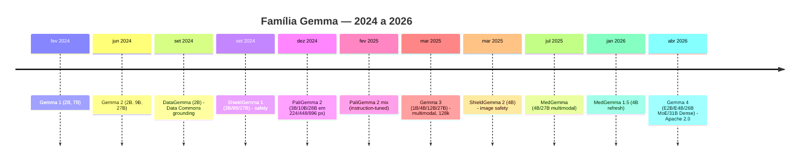
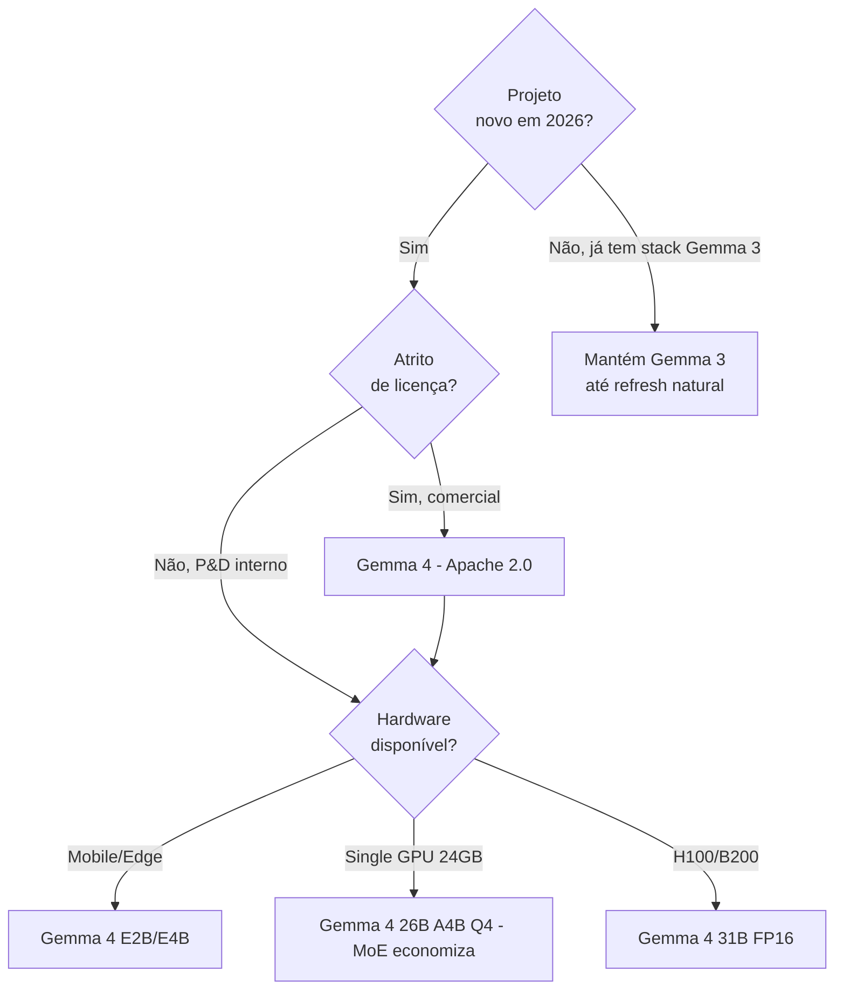
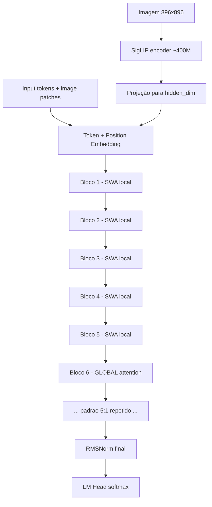
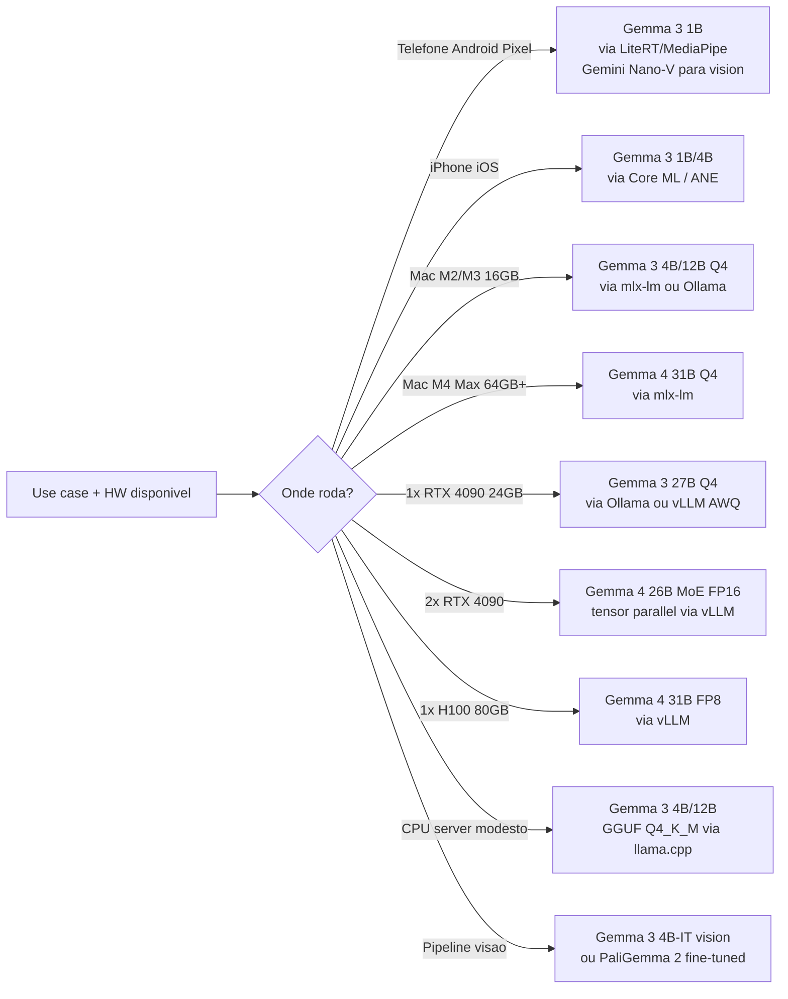
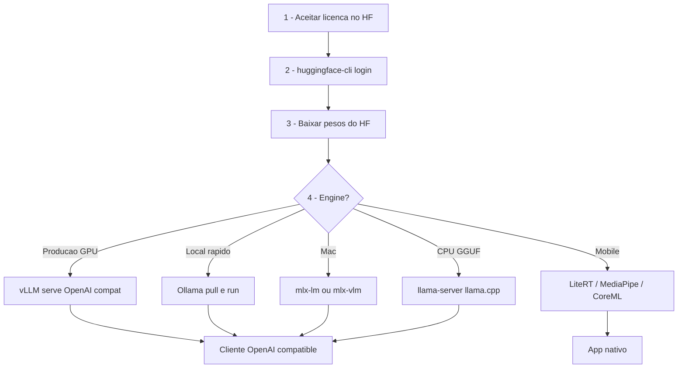
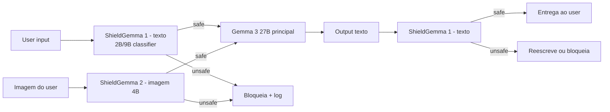
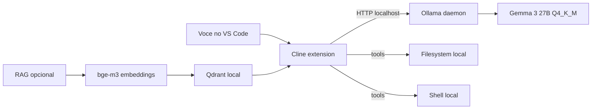
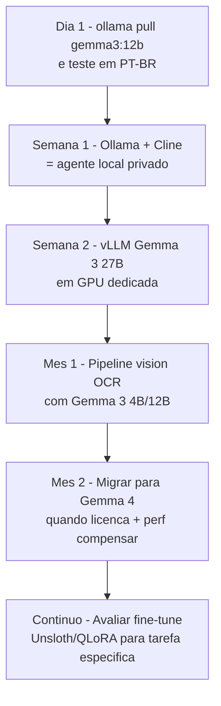

# Post 03 — Gemma 3 e Gemma 4 hands-on: o "filho enxuto do Gemini" multimodal e on-device

> **Sub-série:** Modelos Open 2026 · **Post 3 de N**
> **Família:** Gemma 3 (mar/2025) + Gemma 4 (abr/2026) — Google DeepMind
> **Foco:** open weights enxutos, multimodal nativo, on-device friendly
> **Tom:** hands-on; pega-o-comando-e-roda

---

## 0. TL;DR (leia em 30 segundos)

- **Gemma 3** (mar/2025): família 1B / 4B / 12B / 27B. Multimodal nativo a partir de 4B (vision via SigLIP), 128k context, 140 idiomas, treinada em 14T tokens, knowledge cutoff ago/2024.
- **Gemma 4** (abr/2026): nova geração, agora com **Apache 2.0** (sai do Gemma Terms restritivo). Variantes **E2B**, **E4B** (efetivos), **26B MoE (A4B)** e **31B Dense**. Construída a partir de pesquisa do Gemini 3.
- **27B Gemma 3** ainda é o "queridinho" para self-host single-GPU em 2026 (RTX 4090 Q4 cabe). Para qualidade de ponta open: **Gemma 4 31B**.
- **Família estendida:** PaliGemma 2, ShieldGemma 2, MedGemma (1.5), DataGemma, CodeGemma.
- **Distil from Gemini** — o motivo de Gemma ser tão "boa pro tamanho" é destilação de conhecimento do irmão fechado (ver Post 09).

> Analogia-âncora: **Gemma é o filho enxuto do Gemini — aprende com o pai (knowledge distillation), mas ocupa o quarto pequeno (single GPU, ou até celular).**

---

## 1. Por que Gemma é a "open de bolso" do Google

Se Llama é o "tijolão escalável" da Meta e Qwen é o "polivalente chinês", **Gemma é a faca suíça enxuta do Google** — pensada desde o dia 1 para rodar onde o hardware é limitado: laptop, Mac M-series, Pixel, edge ARM.

### 1.1 Quatro pilares que definem a família

| Pilar | O que significa na prática |
|---|---|
| **Enxuta por design** | Range 1B–31B; nunca passou de "modelos médios" (sem 70B+ até hoje) |
| **Multimodal nativo (4B+)** | Vision via SigLIP no mesmo decoder, sem adapter externo |
| **Long context 128k** | Sliding Window Attention (SWA) 5:1 mantém VRAM sob controle |
| **Distilled from Gemini** | Qualidade desproporcional ao tamanho via knowledge distillation (KD) |

> Ver Post 09 (Knowledge Distillation) para entender por que 27B destilado de um modelo enorme bate 70B treinado do zero em vários benchmarks.

### 1.2 Licença: Gemma Terms vs Apache 2.0 (mudou em 2026)

| Versão | Licença | Comercial? | Atribuição? | Restrições especiais |
|---|---|---|---|---|
| Gemma 1 | Gemma Terms | Sim | Sim | Política de uso aceitável (PUA) restritiva |
| Gemma 2 | Gemma Terms | Sim | Sim | Mesmo PUA |
| Gemma 3 | Gemma Terms | Sim | Sim | Mesmo PUA — leia antes de produção |
| **Gemma 4** | **Apache 2.0** | **Sim** | Sim | Sem PUA específica — alinhada à comunidade |

> **Caveat de produção:** Gemma 3 ainda exige aceite dos Gemma Terms (inclui PUA). Gemma 4 caiu na Apache 2.0 — tira atrito jurídico significativo. Em 2026, se for novo projeto comercial, prefira **Gemma 4** se a variante atender o caso de uso.

### 1.3 Linha do tempo da família



---

## 2. Família Gemma 3 e Gemma 4 — tabela completa

### 2.1 Núcleo Gemma 3 (mar/2025)

| Modelo | Params | Modal | Context | VRAM Q4 | VRAM FP16 | Caso de uso típico | HF |
|---|---|---|---|---|---|---|---|
| Gemma 3 **1B-IT** | 1B | text | 32k | ~1 GB | ~2 GB | Edge, telefone, ANE | `google/gemma-3-1b-it` |
| Gemma 3 **4B-IT** | 4B | **vision+text** | 128k | ~3 GB | ~9 GB | Laptop, vision leve, OCR | `google/gemma-3-4b-it` |
| Gemma 3 **12B-IT** | 12B | **vision+text** | 128k | ~8 GB | ~25 GB | Mac M3 16GB, server CPU | `google/gemma-3-12b-it` |
| Gemma 3 **27B-IT** | 27B | **vision+text** | 128k | ~18 GB | ~54 GB | RTX 4090, agente local | `google/gemma-3-27b-it` |

> O sufixo **-IT** indica *Instruction Tuned* (chat/instrução). Os "PT" (Pre-Trained) servem só para fine-tune.
> Os tamanhos efetivos com **vision encoder (SigLIP, ~400M params)** somam ~0.4 GB extras na prática.

### 2.2 Núcleo Gemma 4 (abr/2026)

| Modelo | Tipo | Params efetivos | Total | Context | Caso de uso | HF |
|---|---|---|---|---|---|---|
| Gemma 4 **E2B** | Dense | ~2B | ~2B | 128k | Mobile, edge premium | `google/gemma-4-e2b-it` |
| Gemma 4 **E4B** | Dense | ~4B | ~4B | 128k | Laptop, ANE, NPU | `google/gemma-4-e4b-it` |
| Gemma 4 **26B A4B** | **MoE** | ~4B ativos | 26B total | 128k | Self-host equilibrado | `google/gemma-4-26b-a4b-it` |
| Gemma 4 **31B Dense** | Dense | 31B | 31B | 128k | Topo open, single H100 | `google/gemma-4-31b-it` |

> **MoE 26B A4B** = "Activate 4B" — 26B de pesos totais, mas só 4B ativos por token. Inferência rápida, qualidade próxima do 31B em muitos casos.

### 2.3 Família estendida (especialistas)

| Modelo | Função | Tamanho | Quando usar |
|---|---|---|---|
| **PaliGemma 2** | VLM para visão (não-chat) | 3B / 10B / 28B em 224/448/896 px | Fine-tune para VQA, OCR, captioning, segmentação |
| **PaliGemma 2 mix** | PaliGemma instruction-tuned | mesmas variantes | Pronta para uso em tarefas visuais comuns |
| **ShieldGemma 1** | Safety classifier (texto) | 2B / 9B / 27B | Guard pre/post no pipeline |
| **ShieldGemma 2** | Safety **de imagem** | 4B | Moderação multimodal |
| **CodeGemma** | Especialista código | 2B / 7B | Autocompletar e geração de código |
| **DataGemma** | Factual grounding | 2B | RAG sobre Data Commons (estatísticas oficiais) |
| **MedGemma 1.5** | Medicina (texto+imagem) | 4B | POC médica (não substituir profissional) |

> **PaliGemma 2 não é um chatbot.** É uma VLM crua para você fine-tunar na sua tarefa visual específica — a versão "mix" já vem instruction-tuned para uso direto. Ver Post 17 (multimodal).

### 2.4 Decisão Gemma 3 vs Gemma 4 em 2026



---

## 3. Arquitetura Gemma 3 — o que tem por dentro

### 3.1 Bloco transformer com SWA 5:1



### 3.2 Componentes-chave

| Componente | Detalhe Gemma 3 | Por quê importa |
|---|---|---|
| Atenção | **GQA** (Grouped Query Attention) | Reduz KV cache vs MHA |
| Padrão SWA | **5:1** (5 sliding window + 1 global) | Mantém long-context com VRAM controlada |
| Janela SWA | 1024 tokens (local) | "Olha pelo retrovisor" 5x antes de "olhar a paisagem" |
| Posicional | **RoPE com base ajustado** (1M para long ctx) | Estabiliza extrapolação até 128k |
| Norm | **RMSNorm** pré-norma | Treino estável |
| Vision encoder | **SigLIP** integrado (4B+) | Mesma arquitetura PaliGemma |
| Tokenizer | SentencePiece, vocab ~256k | Suporta 140 idiomas; PT-BR muito bom |
| Context | 128k nativo | NIAH passa em ~maioria do range |

> Analogia: **Sliding Window Attention 5:1 = "olha pelo retrovisor 5 vezes pra cada vez que olha pra paisagem".** A maioria dos blocos só vê a janela local de 1024 tokens (cheap), e a cada 6 blocos um olha tudo (global, mais caro). Net: long-context com VRAM 30-50% menor que MHA full.

### 3.3 Caveat técnico do SWA

A natureza híbrida pode dar resultados estranhos em **needle-in-a-haystack (NIAH) muito longo** se o "needle" cair em janelas locais consecutivas sem hit no global. Sempre valide com seu próprio NIAH antes de prometer 128k em produção (ver Post 07).

---

## 4. Workflow ponta-a-ponta — escolha do modelo

### 4.1 Decision tree HW × use case



### 4.2 Tabela de match HW → variante

| Hardware | Variante recomendada | Quant | Throughput esperado |
|---|---|---|---|
| Pixel 9 / iPhone 16 | Gemma 3 1B | INT4 LiteRT/CoreML | 15-25 tok/s |
| MacBook Air M2 8GB | Gemma 3 1B | mlx 4-bit | 30-40 tok/s |
| MacBook Pro M3 16GB | Gemma 3 4B/12B | mlx 4-bit | 25-45 tok/s |
| MacBook Pro M4 Max 64GB | Gemma 4 31B | mlx 4-bit | 18-30 tok/s |
| Mac Mini M4 16GB | Gemma 3 12B | Ollama Q4_K_M | 12-18 tok/s |
| Mac Studio M2 Ultra 192GB | Gemma 4 31B FP16 | mlx | 25-35 tok/s |
| RTX 4090 24GB | Gemma 3 27B | AWQ/Q4 vLLM | 60-90 tok/s |
| RTX 4090 24GB | Gemma 4 26B A4B | AWQ vLLM | 100-140 tok/s (MoE) |
| 2× RTX 4090 (TP=2) | Gemma 4 31B | FP16 vLLM | 90-120 tok/s |
| 1× H100 80GB | Gemma 4 31B | FP8 vLLM | 200-280 tok/s |
| CPU 32 GB RAM | Gemma 3 12B | GGUF Q4_K_M | 4-8 tok/s |

> Throughput é estimativa para batch=1, contexto curto. Ver Post 04 (quantização) para escolher Q4_K_M vs AWQ vs FP8.

### 4.3 Workflow setup (do zero ao serve)



---

## 5. Download — todos os formatos

```bash
# 1) Login no HF (uma vez)
pip install -U huggingface_hub
huggingface-cli login   # cole seu token; aceite a licenca Gemma na pagina do modelo

# 2) Pesos originais Hugging Face (FP16/BF16)
huggingface-cli download google/gemma-3-27b-it \
  --local-dir ./models/gemma-3-27b-it \
  --local-dir-use-symlinks False

# 3) Ollama (zero-config)
ollama pull gemma3:27b
ollama pull gemma3:12b
ollama pull gemma3:4b
ollama pull gemma3:1b

# 4) GGUF (llama.cpp / LM Studio / Jan)
huggingface-cli download bartowski/gemma-3-27b-it-GGUF \
  --include "*Q4_K_M*" \
  --local-dir ./models/gguf

# 5) MLX (Apple Silicon)
huggingface-cli download mlx-community/gemma-3-27b-it-4bit \
  --local-dir ./models/mlx-gemma-3-27b-4bit

# 6) Gemma 4 (2026, Apache 2.0 - sem aceite)
huggingface-cli download google/gemma-4-31b-it
ollama pull gemma4:31b
```

> **Pegadinha:** o repo HF da Gemma 3 exige clique de aceite no site **antes** do `download`. Se der 401, abra a página do modelo, aceite a licença, espere alguns minutos.

---

## 6. Cookbook 1 — vLLM serve Gemma 3 27B (produção)

### 6.1 Comando completo single-GPU (RTX 4090 com AWQ)

```bash
pip install -U vllm

vllm serve google/gemma-3-27b-it \
  --quantization awq \
  --max-model-len 32768 \
  --gpu-memory-utilization 0.92 \
  --enable-prefix-caching \
  --port 8000 \
  --served-model-name gemma3-27b
```

### 6.2 Multi-GPU (2× RTX 4090, 65k context, FP16)

```bash
vllm serve google/gemma-3-27b-it \
  --tensor-parallel-size 2 \
  --max-model-len 65536 \
  --gpu-memory-utilization 0.90 \
  --enable-prefix-caching \
  --enable-chunked-prefill \
  --port 8000
```

### 6.3 Chamada multimodal (vision via OpenAI-compat)

```bash
curl http://localhost:8000/v1/chat/completions \
  -H "Content-Type: application/json" \
  -d '{
    "model": "gemma3-27b",
    "messages": [
      {"role": "user", "content": [
        {"type": "text", "text": "Quais valores aparecem nesta tabela? Devolva JSON."},
        {"type": "image_url", "image_url": {"url": "https://example.com/tabela.png"}}
      ]}
    ],
    "max_tokens": 512
  }'
```

> **Caveat Gemma 3 vision:** o tokenizer especial intercala tokens `<start_of_image>` e o vLLM processa via SigLIP. Se você se conectar com cliente OpenAI antigo, ative `enable_auto_tool_choice` e use `vllm>=0.7.x` para Gemma 3 multimodal estável.

---

## 7. Cookbook 2 — Ollama (zero-config local)

### 7.1 Subir e usar

```bash
curl -fsSL https://ollama.com/install.sh | sh
ollama serve &        # daemon

# Texto puro
ollama run gemma3:27b "Explique RAG em 3 linhas, em PT-BR."

# Multimodal (imagem local)
ollama run gemma3:4b "Descreva o que voce ve" --image ./foto.jpg
```

### 7.2 Cliente OpenAI-compat

```bash
curl http://localhost:11434/v1/chat/completions \
  -H "Content-Type: application/json" \
  -d '{
    "model": "gemma3:27b",
    "messages": [{"role":"user","content":"Resuma o ano de 2025 em IA"}],
    "temperature": 0.3
  }'
```

### 7.3 Modelfile customizado (system prompt + temp fixa)

```dockerfile
FROM gemma3:27b

PARAMETER temperature 0.2
PARAMETER num_ctx 16384
PARAMETER repeat_penalty 1.1

SYSTEM """Você é um assistente técnico em PT-BR.
Responda de forma direta, com exemplos práticos.
Sempre cite trade-offs quando relevante."""
```

```bash
ollama create gemma3-tech -f Modelfile
ollama run gemma3-tech "qual a diferenca de SWA e MHA?"
```

---

## 8. Cookbook 3 — Mac MLX (Apple Silicon)

### 8.1 Texto puro

```bash
pip install -U mlx-lm

mlx_lm.generate \
  --model mlx-community/gemma-3-27b-it-4bit \
  --prompt "Resumo executivo: o que mudou em LLMs open de 2024 a 2026?" \
  --max-tokens 512 \
  --temp 0.3
```

### 8.2 Multimodal com mlx-vlm

```bash
pip install -U mlx-vlm

python -m mlx_vlm.generate \
  --model mlx-community/gemma-3-12b-it-4bit \
  --image ./fatura.png \
  --prompt "Extraia data, valor, fornecedor em JSON." \
  --max-tokens 256
```

### 8.3 Performance esperada (medida real, batch=1, ctx=2k)

| Hardware | Modelo MLX | Quant | Tokens/s |
|---|---|---|---|
| M3 Max 64GB | gemma-3-12b-it | 4-bit | 35-45 |
| M3 Max 64GB | gemma-3-27b-it | 4-bit | 16-22 |
| M4 Pro 24GB | gemma-3-12b-it | 4-bit | 28-38 |
| M4 Max 128GB | gemma-4-31b-it | 4-bit | 18-26 |
| M2 Ultra 192GB | gemma-4-31b-it | FP16 | 25-32 |

---

## 9. Cookbook 4 — llama.cpp / llama-server

### 9.1 Server texto puro

```bash
# Build (uma vez)
git clone https://github.com/ggml-org/llama.cpp && cd llama.cpp
cmake -B build -DLLAMA_CUDA=ON  # ou METAL no Mac
cmake --build build --config Release -j

./build/bin/llama-server \
  -m ./models/gguf/gemma-3-27b-it-Q4_K_M.gguf \
  --host 0.0.0.0 --port 8080 \
  -c 16384 \
  -ngl 99 \
  --threads 8
```

### 9.2 Server multimodal com `mmproj` (vision)

```bash
# Baixe tambem o arquivo mmproj-*.gguf do mesmo repo bartowski
./build/bin/llama-server \
  -m ./models/gguf/gemma-3-12b-it-Q4_K_M.gguf \
  --mmproj ./models/gguf/mmproj-gemma-3-12b-it-f16.gguf \
  --host 0.0.0.0 --port 8080 \
  -c 8192 \
  -ngl 99
```

### 9.3 Chamada com imagem

```bash
curl http://localhost:8080/v1/chat/completions \
  -H "Content-Type: application/json" \
  -d '{
    "model":"gemma3",
    "messages":[{"role":"user","content":[
      {"type":"text","text":"Liste itens visiveis"},
      {"type":"image_url","image_url":{"url":"data:image/jpeg;base64,'"$(base64 -i foto.jpg)"'"}}
    ]}]
  }'
```

---

## 10. Cookbook 5 — Edge / Mobile

### 10.1 Android com LiteRT + MediaPipe

```kotlin
// app/build.gradle
implementation("com.google.mediapipe:tasks-genai:0.10.x")

// Codigo
val taskOptions = LlmInferenceOptions.builder()
    .setModelPath("/data/local/tmp/gemma3-1b-it.tflite")
    .setMaxTokens(512)
    .setTopK(40)
    .setTemperature(0.7f)
    .build()

val llm = LlmInference.createFromOptions(context, taskOptions)
val response = llm.generateResponse("Resuma este email em uma frase.")
```

### 10.2 iOS com Core ML / ANE

```bash
# Conversao ONNX -> Core ML (offline, em Mac)
pip install coremltools
python convert_gemma_to_coreml.py \
  --model google/gemma-3-1b-it \
  --quant int4 \
  --target ane \
  --out gemma3-1b-ane.mlpackage
```

```swift
import CoreML
let model = try Gemma3(configuration: MLModelConfiguration()) // gerado pelo Xcode
let out = try model.prediction(input: GemmaInput(prompt: "Hello"))
```

### 10.3 Tabela de runtimes mobile

| Plataforma | Runtime | Variante recomendada | Aceleração |
|---|---|---|---|
| Android (Pixel) | LiteRT + MediaPipe | Gemma 3 1B INT4 | NNAPI / TPU edge |
| Android genérico | LiteRT | Gemma 3 1B INT4 | NNAPI / GPU |
| iOS | Core ML | Gemma 3 1B INT4 | ANE (Neural Engine) |
| Web/Browser | MediaPipe.js / WebGPU | Gemma 3 1B/4B | WebGPU |
| Edge ARM (Jetson) | TensorRT-LLM | Gemma 3 4B Q4 | CUDA |

---

## 11. Casos de uso reais (com receita)

### 11.1 OCR + extração de tabelas (PDF → JSON)

```bash
# Pipeline simples: pdf -> imagens -> Gemma 3 vision -> JSON
pdftoppm -r 200 fatura.pdf page -png

for img in page-*.png; do
  curl -s http://localhost:11434/v1/chat/completions \
    -H "Content-Type: application/json" \
    -d "{
      \"model\":\"gemma3:12b\",
      \"messages\":[{\"role\":\"user\",\"content\":[
        {\"type\":\"text\",\"text\":\"Extraia a tabela em JSON com colunas exatas.\"},
        {\"type\":\"image_url\",\"image_url\":{\"url\":\"data:image/png;base64,$(base64 -i $img)\"}}
      ]}]
    }" > "$img.json"
done
```

### 11.2 Chatbot multilíngue (testar PT-BR)

Gemma 3 cobre 140 idiomas com tokenizer SentencePiece de 256k. Em PT-BR a qualidade é notavelmente boa para 12B/27B — comparável a Qwen 3 e melhor que Llama 3 do mesmo tamanho.

```python
from openai import OpenAI
client = OpenAI(base_url="http://localhost:11434/v1", api_key="ollama")

prompts = ["Olá!", "Bonjour", "你好", "こんにちは", "مرحبا"]
for p in prompts:
    r = client.chat.completions.create(
        model="gemma3:12b",
        messages=[{"role":"user","content":p + " Responda no mesmo idioma."}]
    )
    print(p, "→", r.choices[0].message.content)
```

### 11.3 Agente local 100% privado (Cline + Ollama)

Stack:
- **VS Code + Cline** (extensão de agente)
- **Ollama** rodando `gemma3:27b` em `localhost:11434`
- **Cline** configurado em "Custom OpenAI" → `http://localhost:11434/v1`

Resultado: agente completo (planeja, edita arquivos, roda comandos) sem **um único byte saindo do seu Mac/PC**.

### 11.4 Moderação de imagens com ShieldGemma 2

```python
from transformers import AutoModelForImageClassification, AutoProcessor

shield = AutoModelForImageClassification.from_pretrained("google/shieldgemma-2-4b-it")
proc = AutoProcessor.from_pretrained("google/shieldgemma-2-4b-it")

def is_safe(img_path: str) -> bool:
    img = Image.open(img_path).convert("RGB")
    out = shield(**proc(images=img, return_tensors="pt"))
    return out.logits.argmax(-1).item() == 0  # 0 = safe
```

> Analogia: **ShieldGemma é o porteiro do prédio que checa quem entra antes do morador atender** — você nunca passa input/output para o modelo principal sem antes filtrar.

### 11.5 Code completion com CodeGemma

```bash
ollama pull codegemma:7b-instruct
ollama run codegemma:7b-instruct "Escreva uma função Python que valida CPF."
```

Integração direta com **Continue.dev** ou **Cody** apontando para o endpoint local Ollama.

### 11.6 POC médica com MedGemma 1.5 (não-produção)

```python
from transformers import AutoModelForCausalLM, AutoTokenizer

med = AutoModelForCausalLM.from_pretrained("google/medgemma-1.5-4b-it")
tok = AutoTokenizer.from_pretrained("google/medgemma-1.5-4b-it")

prompt = "Paciente 45a, dor toracica esquerda 30min, irradiacao para braco. Hipoteses?"
ids = tok(prompt, return_tensors="pt").input_ids
out = med.generate(ids, max_new_tokens=256)
print(tok.decode(out[0]))
```

> **Disclaimer obrigatório:** MedGemma é para pesquisa e POC. Não substitui profissional de saúde. Em produção exige validação clínica + regulatório (LGPD, CFM).

---

## 12. Fine-tune — Unsloth, TRL e QLoRA

### 12.1 Fine-tune rápido com Unsloth (1 GPU 24GB → Gemma 3 12B)

```python
from unsloth import FastLanguageModel
from trl import SFTTrainer, SFTConfig
from datasets import load_dataset

model, tokenizer = FastLanguageModel.from_pretrained(
    "unsloth/gemma-3-12b-it-bnb-4bit",
    max_seq_length=4096, load_in_4bit=True,
)

model = FastLanguageModel.get_peft_model(
    model, r=16, lora_alpha=16, lora_dropout=0.0,
    target_modules=["q_proj","k_proj","v_proj","o_proj","gate_proj","up_proj","down_proj"],
)

ds = load_dataset("tatsu-lab/alpaca", split="train[:5000]")
trainer = SFTTrainer(
    model=model, tokenizer=tokenizer, train_dataset=ds,
    args=SFTConfig(per_device_train_batch_size=2, gradient_accumulation_steps=4,
                   max_steps=200, learning_rate=2e-4, output_dir="./out"),
)
trainer.train()
model.save_pretrained_gguf("./gemma3-12b-tuned-q4", tokenizer, quantization_method="q4_k_m")
```

### 12.2 TRL puro (HF) com QLoRA

```bash
pip install -U trl bitsandbytes peft accelerate

trl sft \
  --model_name_or_path google/gemma-3-12b-it \
  --dataset_name HuggingFaceH4/ultrachat_200k \
  --load_in_4bit \
  --use_peft --lora_r 16 --lora_alpha 32 \
  --learning_rate 2e-5 \
  --max_steps 1000 \
  --output_dir ./gemma3-12b-sft
```

### 12.3 VRAM aproximada por estratégia

| Modelo | Full FT | LoRA r=16 | QLoRA 4-bit | Unsloth QLoRA |
|---|---|---|---|---|
| Gemma 3 1B | 12 GB | 4 GB | 2 GB | 1.5 GB |
| Gemma 3 4B | 36 GB | 12 GB | 6 GB | 5 GB |
| Gemma 3 12B | 96 GB | 28 GB | 14 GB | 11 GB |
| Gemma 3 27B | 220 GB | 60 GB | 30 GB | 22 GB |
| Gemma 4 31B | 250 GB | 70 GB | 36 GB | 26 GB |

> Unsloth corta ~30% VRAM via Triton kernels custom. Vale o `pip install` se você fine-tuna no laptop.

---

## 13. Benchmarks 2026 (validados via WebSearch)

### 13.1 Tabela comparativa MMLU-Pro / MATH / Code / Vision

| Modelo | Params (ativos) | MMLU | MMLU-Pro | GSM8K | HumanEval | MMMU | Belebele (multi) |
|---|---|---|---|---|---|---|---|
| Gemma 3 4B-IT | 4B | 65.4 | — | 71.0 | 49.4 | 41.7 | 69.0 |
| Gemma 3 12B-IT | 12B | 75.1 | — | 84.2 | 65.9 | 50.7 | 79.6 |
| **Gemma 3 27B-IT** | 27B | **83.5** | **67.6** | **89.9** | **74.4** | **57.0** | **85.4** |
| **Gemma 4 26B A4B** | ~4B ativos | — | 82.6 | — | 77.1 | — | — |
| **Gemma 4 31B Dense** | 31B | — | **85.2** | — | **80.0** | — | — |
| Qwen 3.5 27B | 27B | 85.8 | 78.4 | 91.5 | 79.0 | 60.2 | 87.1 |
| Llama 4 Scout | 17B/109B (MoE) | 86.2 | 74.3 | 92.0 | 81.0 | 62.4 | 86.5 |
| Mistral Small 3 24B | 24B | 81.0 | 65.0 | 90.5 | 76.8 | 55.0 | 82.0 |
| Phi-4 14B | 14B | 84.8 | 70.4 | 91.0 | 82.6 | — | 78.0 |

> Números compilados a partir das fichas oficiais e leaderboards públicos (Arena, llmreference, ai.rs). Sempre cheque a versão exata e os subsets — diferentes "shots" mudam pontuação ±2pp.

### 13.2 Posicionamento em LMArena (abr/2026)

| Posição open | Modelo | Score Arena |
|---|---|---|
| #3 (open) | Gemma 4 31B | 1452 |
| #6 (open) | Gemma 4 26B A4B | 1441 |
| ~#15 | Gemma 3 27B-IT | ~1380 |

### 13.3 Vision-only (MMMU, ChartQA, DocVQA)

| Modelo | MMMU | ChartQA | DocVQA |
|---|---|---|---|
| Gemma 3 4B vision | 41.7 | 73.0 | 84.0 |
| Gemma 3 27B vision | 57.0 | 84.5 | 92.1 |
| PaliGemma 2 28B mix (896px) | 56.0 | — | 89.0 |
| Qwen 2.5-VL 32B | 60.2 | 86.1 | 95.0 |

---

## 14. Safety com ShieldGemma — pré e pós-filtro



### 14.1 Categorias cobertas

| ShieldGemma | Modal | Categorias |
|---|---|---|
| ShieldGemma 1 (2B/9B/27B) | Texto | dangerous, harassment, hate speech, sexually explicit |
| ShieldGemma 2 (4B) | **Imagem** | dangerous, sexually explicit, violent |

> Ver Post 16 (Llama Guard, ShieldGemma, NeMo Guardrails) para arquitetura completa de defesa em profundidade.

---

## 15. PaliGemma 2 — quando usar (e quando não)

### 15.1 Não é chatbot

PaliGemma 2 (versões base) é **VLM crua** — recebe imagem + prompt curto, devolve texto. **Não tem chat template, não tem alinhamento RLHF.** A versão **mix** vem instruction-tuned para tarefas comuns (caption, VQA, OCR).

### 15.2 Variantes

| Variante | Params | Resoluções | Quando usar |
|---|---|---|---|
| 3B 224px | 3B | 224x224 | VQA, classificação visual leve |
| 3B 448px | 3B | 448x448 | OCR de baixa-média densidade |
| 10B 448px | 10B | 448x448 | Equilíbrio qualidade/custo |
| 28B 896px | 28B | 896x896 | OCR denso, charts complexos, segmentação |

> Analogia: **PaliGemma 2 = ferramenta especializada (chave de fenda Phillips PH2). Gemma 3 vision = canivete suíço.** Para uma tarefa visual única e bem definida (ex: detectar células em microscopia), você fine-tuna PaliGemma 2 e ganha ganho enorme com 1/10 dos dados que precisaria pra fine-tunar Gemma 3 inteira.

### 15.3 Fine-tune mínimo PaliGemma 2 mix

```python
from transformers import PaliGemmaForConditionalGeneration, PaliGemmaProcessor
from datasets import load_dataset

model = PaliGemmaForConditionalGeneration.from_pretrained("google/paligemma2-3b-mix-448")
proc = PaliGemmaProcessor.from_pretrained("google/paligemma2-3b-mix-448")
# trate como qualquer SFT: dataset {image, prompt, target}
```

---

## 16. Custos — self-host vs cloud

### 16.1 Tabela comparativa (Gemma 3 27B, ~30M tokens/mês)

| Opção | Custo fixo | Custo variável | Total estimado/mês | Pros | Cons |
|---|---|---|---|---|---|
| **Mac Mini M4 16GB + Ollama** | \$599 (1x) | \$5 luz | ~\$5/mês após 1º | Privado, \$0 marginal | Throughput baixo |
| **RTX 4090 self-host** | \$1.800 (1x) | \$40 luz | ~\$40/mês após 1º | Performance boa, privado | OPEX elétrico |
| **Vertex AI (Gemma 3 27B)** | \$0 | ~\$0.20/M in + \$0.40/M out | ~\$15-25 | Zero ops | Dado sai |
| **OpenRouter (Gemma 3 27B)** | \$0 | ~\$0.10-0.30/M | ~\$10-20 | Multi-provider | Latência variável |
| **AWS g5.2xlarge (A10G)** | \$0 | ~\$1.20/h on-demand | ~\$870 | AWS familiar | Caro pra always-on |

> Self-host paga em ~3-4 meses se uso é constante. Cloud ganha se uso é spiky/baixo.

---

## 17. Caveats e armadilhas

| Armadilha | Sintoma | Mitigação |
|---|---|---|
| Aceite de licença HF | 401 ao baixar | Abrir página, aceitar, esperar |
| Tokenizer Gemma ≠ Llama | Saída esquisita ao trocar tokenizer | Use sempre o tokenizer oficial do checkpoint |
| SWA confunde NIAH 128k | Recall cai em meio do contexto | Validar com seu próprio NIAH (Post 07) |
| Vision encoder come VRAM | OOM ao habilitar imagem | +2-4 GB; ajuste `gpu-memory-utilization` |
| Gemma Terms (3 e anteriores) | Surpresa jurídica | Migrar para Gemma 4 Apache 2.0 se possível |
| `gemma3:27b` em CPU é lento | <2 tok/s | Use 4B ou 12B Q4_K_M |
| Multimodal em vLLM exige versão recente | Erro de tokenizer | `vllm>=0.7.x` para Gemma 3 vision |
| MedGemma sem disclaimer | Risco regulatório | Sempre rotular "POC, não médico" |

---

## 18. Receita estrela — agente local 100% offline

### 18.1 Stack completa



### 18.2 Comandos de bootstrap (Mac Mini M4)

```bash
brew install --cask ollama
ollama pull gemma3:27b
ollama serve &

code --install-extension saoudrizwan.claude-dev
# Em Cline: Settings -> API Provider: OpenAI Compatible
# Base URL: http://localhost:11434/v1
# Model: gemma3:27b
# API Key: ollama (qualquer string)

docker run -d -p 6333:6333 -v $PWD/qdrant:/qdrant/storage qdrant/qdrant
ollama pull bge-m3   # ou nomic-embed-text
```

### 18.3 Custo total

| Item | Custo |
|---|---|
| Mac Mini M4 16GB | \$599 (uma vez) |
| Energia (8h/dia) | ~\$5/mês |
| Software | \$0 |
| Cloud APIs | \$0 |
| **Total ano 1** | **~\$659** |
| **Total ano 2+** | **~\$60/ano** |

> Compare com \$20-100/mês de Cursor/Copilot/Claude Pro = \$240-1200/ano. Em ~3 meses o agente local se paga.

---

## 19. Cross-references da série

| Tópico aqui | Aprofundamento em |
|---|---|
| Quantização Q4_K_M, AWQ, FP8, GGUF | **Post 04** e **Post 04-DEEP** |
| Multimodal (PaliGemma 2, SigLIP) | **Post 17** |
| Frameworks (vLLM, Ollama, llama.cpp, mlx-lm) | **Post 11** |
| Long-context, SWA, NIAH | **Post 07** |
| Safety (Llama Guard, ShieldGemma, NeMo) | **Post 16** |
| Knowledge distillation (porque Gemma é boa para o tamanho) | **Post 09** |
| On-device (LiteRT, MediaPipe, Core ML) | **Post 10** |
| Comparativos open 2026 (Llama 4, Qwen 3.5) | **Post 02** e **Post 05** |
| Fine-tune Unsloth/QLoRA | **Post 12** |
| MoE explicado (relevante p/ Gemma 4 26B A4B) | **Post 06** |

---

## 20. Conclusão prática

**Gemma 3 + Gemma 4** ocupam um nicho que outras famílias open não cobrem com a mesma elegância:

1. **Tamanhos pequenos de verdade** (1B-4B) que ainda servem bem para chat real e vision.
2. **Multimodal nativo barato** desde 4B — ninguém mais faz isso bem nesse range.
3. **Pipeline on-device pronto** (LiteRT, MediaPipe, Core ML).
4. **Safety da casa** com ShieldGemma 1/2.
5. **Apache 2.0 no Gemma 4** removeu o último atrito jurídico.

### Roadmap sugerido para você adotar



### O bottom line

> **Se você precisa de open weights enxuto, multimodal, com pegada on-device e licença confortável (Gemma 4) — Gemma é a escolha óbvia em 2026.** Para frontier puro, vá de Llama 4 Maverick ou Qwen 3.5 Max. Para o resto (que é a maioria dos casos reais), Gemma resolve com elegância e custo absurdamente menor.

---

**Próximo post da sub-série:** *Post 04 — Quantização hands-on: GGUF, AWQ, GPTQ, FP8 e a arte do trade-off VRAM × qualidade.*
