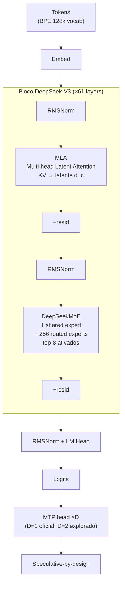
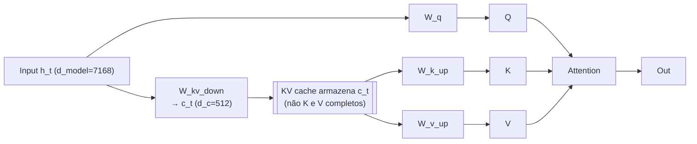
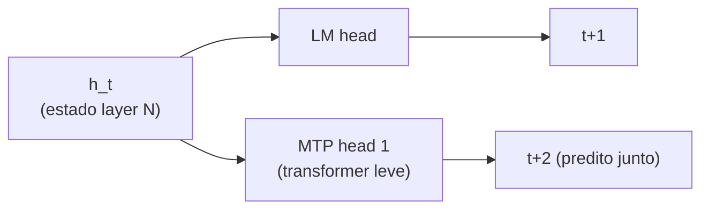
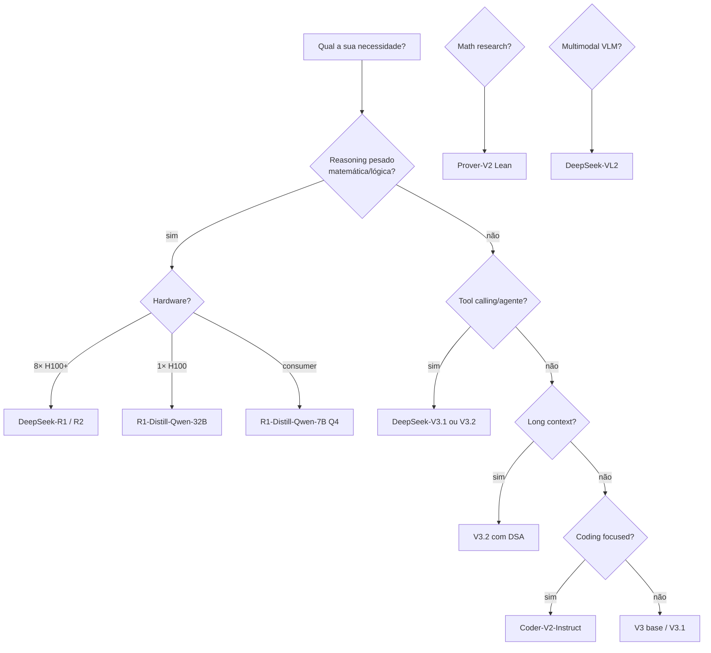
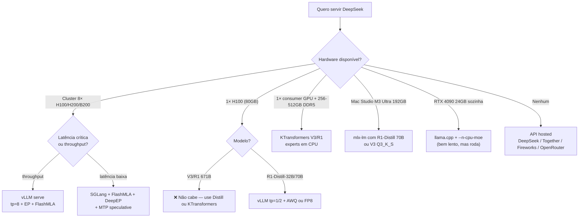
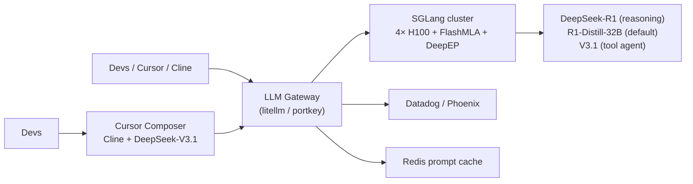

# 04 — DeepSeek V3.x e R1/R2 hands-on: MLA, MTP, FP8, KTransformers e a “Toyota da IA”

> **Sub-série:** Modelos Open 2026 — Post 4.
> **Posts irmãos da sub-série:** 01 Llama 3/4 · 02 Qwen 2.5/3 · 03 Mistral / Magistral · **04 DeepSeek V3.x e R1/R2 (você está aqui)** · 05 Kimi K2, Yi, Gemma, Phi, GLM, MiniMax.
> **Posts irmãos da série principal:** [02 Attention/MLA](../02-attention-mha-mqa-gqa-mla-flashattention.md) · [03 KV cache + PagedAttention](../03-kv-cache-anatomia-pagedattention-vllm.md) · [04 Quant pesos GGUF/GPTQ](../04-quantizacao-pesos-gptq-awq-gguf-bitsandbytes.md) · [08 Sparsity / Speculative / MoE](../08-alem-quantizacao-sparsity-speculative-moe-distillation.md) · [09 Treinamento + GRPO](../09-treinamento-pretraining-sft-dpo-grpo-rlhf.md) · [10 Hardware H100/B200/MI300X](../10-hardware-h100-h200-b100-b200-mi300x-tpu-apple-groq.md) · [11 Frameworks vLLM/SGLang/KTransformers](../11-frameworks-vllm-sglang-trtllm-tgi-llamacpp-mlx-ollama.md) · [17 Multimodalidade VLM](../17-multimodalidade-vlm-audio-video-omni-clip-llava-qwen-vl-gemini.md) · [18 Reasoning models o1/R1/QwQ](../18-reasoning-models-o1-o3-r1-qwq-grpo-test-time-compute.md) · [19 Loop agêntico de coding](../19-loop-agentico-coding-cursor-claude-code-aider-cline-opencode-antigravity-codex.md).
> **Foco deste post:** **subir DeepSeek (V3, V3.1/V3.2, R1, R1‑Distill e — quando lançado — R2) na sua estação de trabalho ou cluster** sem misticismo. Discutimos a anatomia (MLA + MTP + DeepSeekMoE + FP8), comparamos rotas (vLLM vs SGLang vs KTransformers vs llama.cpp vs MLX) e entregamos receitas reproduzíveis.

> **Convenções:**
> - Comandos testados em Linux + NVIDIA H100/H200/B200 (CUDA 12.4+) salvo nota explícita.
> - Para Mac usamos M3 Ultra 192 GB (MLX 0.20+).
> - Modelos referenciados em snake-case oficial Hugging Face (`deepseek-ai/DeepSeek-V3`, etc.).
> - Diagramas em Mermaid; tabelas master no fim de cada bloco.
> - Datas/versões pós‑Q3‑2025 são **validadas via WebSearch** e marcadas com `[validar]` quando o cenário ainda evolui mensalmente.

---

## Índice

1. [Por que DeepSeek virou referência open-weights](#1-por-que-deepseek-virou-referência-open-weights)
2. [Anatomia técnica do DeepSeek-V3](#2-anatomia-técnica-do-deepseek-v3)
3. [A família 2025–2026 inteira](#3-a-família-20252026-inteira)
4. [Decision tree: qual rota seguir?](#4-decision-tree-qual-rota-seguir)
5. [Download dos pesos (huggingface-cli)](#5-download-dos-pesos-huggingface-cli)
6. [Cookbook 1 — vLLM serve V3 em cluster 8× H100/B200](#6-cookbook-1--vllm-serve-v3-em-cluster-8-h100b200)
7. [Cookbook 2 — SGLang com FlashMLA + DeepEP](#7-cookbook-2--sglang-com-flashmla--deepep)
8. [Cookbook 3 — KTransformers em 1× RTX 4090 + 512 GB DDR5](#8-cookbook-3--ktransformers-em-1-rtx-4090--512-gb-ddr5)
9. [Cookbook 4 — llama.cpp com `--n-cpu-moe`](#9-cookbook-4--llamacpp-com---n-cpu-moe)
10. [Cookbook 5 — Mac Studio M3 Ultra 192 GB com mlx-lm](#10-cookbook-5--mac-studio-m3-ultra-192-gb-com-mlx-lm)
11. [Cookbook 6 — R1‑Distill (a porta de entrada acessível)](#11-cookbook-6--r1distill-a-porta-de-entrada-acessível)
12. [Casos de uso por modelo](#12-casos-de-uso-por-modelo)
13. [Tool calling formato DeepSeek](#13-tool-calling-formato-deepseek)
14. [Fine-tuning (QLoRA em distilled e além)](#14-fine-tuning-qlora-em-distilled-e-além)
15. [Benchmarks 2026 (master table)](#15-benchmarks-2026-master-table)
16. [Custos: API DeepSeek vs hosted vs self-host](#16-custos-api-deepseek-vs-hosted-vs-self-host)
17. [Caveats e troubleshooting](#17-caveats-e-troubleshooting)
18. [Roadmap R2 e próximas iterações](#18-roadmap-r2-e-próximas-iterações)
19. [Receita “open frontier reasoning self-hosted”](#19-receita-open-frontier-reasoning-self-hosted)
20. [Cross-references e referências](#20-cross-references-e-referências)

---

## 1. Por que DeepSeek virou referência open-weights

> **Analogia central — DeepSeek é a Toyota da IA.** Não vende a Ferrari de luxo (Claude Opus, GPT-5 Pro), nem o SUV blindado da elite (Gemini 3.0 Ultra). Vende a **Hilux Diesel**: simples por fora, brutal por dentro, eficiente em consumo, dura década e **roda em qualquer estrada — inclusive a estradinha de roça da sua estação de trabalho**.

### 1.1. O choque econômico de dezembro de 2024

A DeepSeek-AI publicou em dezembro de 2024 o **DeepSeek-V3 Technical Report** (arXiv:2412.19437) com um número que sacudiu a indústria: **2.788 milhões de horas de H800** para treinar o modelo do zero. A US\$ 2 a hora de H800 isso dá **≈ US\$ 5.576.000**. Para comparação, treinos *frontier* equivalentes em 2023–2024 ficavam na casa de **US\$ 60–100 milhões** (estimativas para GPT-4, Gemini 1.5 Ultra, Claude 3 Opus). O salto de eficiência não saiu de truque único — saiu do **co-design vertical**:

1. **Arquitetura MoE** com 671 B parâmetros totais e apenas **37 B ativos por token**.
2. **MLA (Multi-head Latent Attention)** comprimindo o KV cache em latente de baixa dimensão.
3. **MTP (Multi-Token Prediction)** densificando o sinal de treino e habilitando *speculative-by-design*.
4. **FP8 mixed precision training** estável, sem rollback em todo o run.
5. **DeepSeekMoE** com *shared experts* + *fine-grained routing* + *auxiliary-loss-free load balancing*.

> O paper reporta literalmente que o treino **não teve nenhum loss spike irrecuperável** durante 14.8 trilhões de tokens. Para quem já viu cluster de 2 048 H800 derreter por causa de NaN, isso é poesia.

### 1.2. R1 (janeiro 2025) — o efeito democratizante do reasoning

Um mês depois (jan/2025) chega o **DeepSeek-R1 Technical Report**: *“Incentivizing Reasoning Capability in LLMs via Reinforcement Learning”*. R1 mostra que **GRPO** (Group Relative Policy Optimization, descrito em [Post 09](../09-treinamento-pretraining-sft-dpo-grpo-rlhf.md)) sobre V3-Base produz um modelo que **iguala o o1 da OpenAI em AIME, MATH e código** — em pesos abertos. Os **R1‑Distills** (1.5B/7B/32B Qwen e 8B/70B Llama) carregam o gênio para dentro de modelos pequenos via destilação por dados sintéticos. Resultado prático: a partir de jan/2025, **todo aluno de mestrado tem como estudar reasoning chain-of-thought num único H100** — antes era privilégio de quem tinha contrato com OpenAI/Google.

Para o tratamento profundo do *paradigma reasoning*, veja [Post 18](../18-reasoning-models-o1-o3-r1-qwq-grpo-test-time-compute.md).

### 1.3. Atualizações 2025 — V3.1, V3.1‑Terminus, V3.2‑Exp, V3.2 e V3.2‑Speciale

O ano de 2025 foi de iteração intensa. A linha do tempo (validada via DeepSeek API docs e [News V3.2](https://api-docs.deepseek.com/news/news251201)):

| Release | Data | O que mudou |
|---|---|---|
| **DeepSeek-V3** | dez/2024 | Modelo base 671B/37B, MLA + MTP + FP8 + DeepSeekMoE |
| **DeepSeek-R1 / R1‑Zero** | jan/2025 | Reasoning via GRPO; R1‑Zero é “puro RL sem SFT” |
| **R1‑Distill (Qwen 1.5/7/32B, Llama 8/70B)** | jan/2025 | Destilados para hardware modesto |
| **DeepSeek-V3‑0324** | mar/2025 | *Snapshot* atualizado com pós-treino refinado |
| **DeepSeek-V3.1** | ago/2025 | Agentic skills; SWE-bench Verified ≈ 66.0; tool use forte |
| **DeepSeek-V3.1‑Terminus** | 22/set/2025 | Corrige mistura PT‑CN nos CoT; estabiliza Code Agent / Search Agent |
| **DeepSeek-V3.2‑Exp** | 29/set/2025 | Estreia **DSA — DeepSeek Sparse Attention** (long context O(L·k)) |
| **DeepSeek-V3.2** | 01/dez/2025 | Successor oficial; 685B/37B; CoT‑in‑tool‑use; treinada com 85k+ instruções complexas em 1.8k+ ambientes |
| **DeepSeek-V3.2‑Speciale** | 01/dez/2025 | Variante reasoning maxed; ouro IMO/CMO/ICPC/IOI 2025 [endpoint temporário] |
| **DeepSeek-R2** | abr/2026 [validar] | Próxima geração reasoning — ver §18 |

> **Cuidado com hype:** a internet está cheia de “R2 leaks”. Use sempre a [DeepSeek API Docs Changelog](https://api-docs.deepseek.com/updates/) como fonte primária e desconfie de blogs com claims sem link para o report técnico.

### 1.4. Licença

Os pesos são distribuídos sob a **DeepSeek License** (texto na raiz dos repos `deepseek-ai/*`). É **permissiva para uso comercial e modificações**, com salvaguardas anti-uso militar/abuso e um *acceptable use policy* parecido com o Llama Community License. Os R1‑Distill carregam **a licença base do modelo distilado** (Qwen 2.5 → Apache 2.0 ou Tongyi Qianwen License; Llama → Llama 3 Community License) — sempre verifique o `LICENSE` no repo específico.

---

## 2. Anatomia técnica do DeepSeek-V3

### 2.1. Diagrama de bloco



### 2.2. Os quatro pilares e onde foram cobertos

| Pilar | O que é | Tratamento profundo |
|---|---|---|
| **MLA** | Comprime KV em latente `d_c ≈ 512` antes de cachear; reconstrói K/V por projeção na hora do attention | [Post 02 — variantes de attention](../02-attention-mha-mqa-gqa-mla-flashattention.md) e [Post 03 — KV cache](../03-kv-cache-anatomia-pagedattention-vllm.md) |
| **MTP** | Em vez de prever só o próximo token, prediz `D` tokens futuros com cabeças adicionais; densifica gradiente e dá *draft* nativo | [Post 08 — speculative + sparsity](../08-alem-quantizacao-sparsity-speculative-moe-distillation.md) |
| **DeepSeekMoE** | 1 shared expert + 256 routed; top‑k=8; *auxiliary‑loss‑free load balancing* via *bias term* dinâmico | [Post 08](../08-alem-quantizacao-sparsity-speculative-moe-distillation.md) |
| **FP8 training** | Pesos/ativações em E4M3, gradientes em E5M2; *fine-grained scaling* por tile 1×128/128×128 | [Post 04 — quant pesos](../04-quantizacao-pesos-gptq-awq-gguf-bitsandbytes.md) e [Post 10 — hardware FP8/FP4](../10-hardware-h100-h200-b100-b200-mi300x-tpu-apple-groq.md) |

### 2.3. Especificações principais (V3 base)

| Atributo | Valor |
|---|---|
| Parâmetros totais | **671 B** (V3.2: 685 B [validar]) |
| Parâmetros ativos por token | **37 B** |
| Layers | 61 |
| Hidden dim | 7 168 |
| MoE: experts roteados / shared | **256 / 1** |
| Top‑k ativos | 8 (+1 shared) |
| MLA: latent dim `d_c` | 512 |
| MLA: head dim (q_nope+q_rope) | 128 + 64 |
| Vocab | 129 280 |
| Context window | **128 k** |
| Tokens de pré-treino | 14.8 T |
| Quantização nativa de treino | FP8 (E4M3/E5M2) |

### 2.4. Diagrama: o que faz MLA tão econômico



> **Analogia MLA:** imagine que você precisa carregar **os retratos de cada funcionário do escritório** todo dia para a reunião. MHA = mochila de 50 quilos com molduras grandes. GQA = você junta funcionários por equipe e leva uma só foto por equipe (perde nuance). **MLA = você fotocopia os retratos numa miniatura comprimida que cabe num envelope minúsculo, e na hora da reunião amplia de novo na fotocopiadora**. KV cache que era 100 GB vira 5 GB. O custo: duas projeções extras (W_k_up e W_v_up) que são triviais comparadas com o `O(L²·d)` do attention.

### 2.5. MTP — o atalho parafuseado



Durante **treino**, MTP adiciona uma cabeça que prediz `t+2` simultaneamente com `t+1`, com seu próprio *cross-entropy loss* (peso ≈ 0.3 no paper). Resultado: o sinal de treino fica **D vezes mais denso** sem aumentar o número de tokens vistos. Durante **inferência**, a cabeça MTP pode ser usada como **draft model nativo** para *self-speculative decoding* (cf. [Post 08](../08-alem-quantizacao-sparsity-speculative-moe-distillation.md)). vLLM e SGLang já expõem flag `--num-speculative-tokens 1` consumindo a cabeça MTP do checkpoint.

> **Analogia MTP:** chave de fenda elétrica que aperta o parafuso e o seguinte ao mesmo tempo. Você não está apertando dois com a mesma força — o segundo é uma *previsão informada*. Se ele estiver certo (o que acontece em 60–85% dos casos), você economizou um passo inteiro do decoder.

### 2.6. DSA — DeepSeek Sparse Attention (V3.2+)

A novidade de set/dez 2025 é a **DSA**: cada token só faz attention contra **top‑k tokens relevantes** selecionados via *learned sparse router*. Complexidade de attention cai de **O(L²)** para **O(L·k)** com `k ≪ L`. Resultado prático reportado pela DeepSeek: **2–3× mais rápido em contextos longos** mantendo paridade de qualidade com V3.1‑Terminus. Para a discussão profunda dos mecanismos de *long context*, veja [Post 07](../07-contexto-longo-rope-yarn-ring-streaming.md).

---

## 3. A família 2025–2026 inteira

### 3.1. Tabela completa (com ressalvas de validação)

| Modelo | Tamanho | Foco | Hub HF | Status (2026 Q2) |
|---|---|---|---|---|
| **DeepSeek-V3-Base** | 671B/37B MoE | Pré-treino puro | `deepseek-ai/DeepSeek-V3-Base` | Estável |
| **DeepSeek-V3** (Chat) | 671B/37B MoE | Chat + tool use | `deepseek-ai/DeepSeek-V3` | Estável (substituído por V3.1+) |
| **DeepSeek-V3-0324** | 671B/37B MoE | Snapshot mar/25 | `deepseek-ai/DeepSeek-V3-0324` | Estável |
| **DeepSeek-V3.1** | 671B/37B MoE | Agentic + tool calling | `deepseek-ai/DeepSeek-V3.1` | Recomendado em prod |
| **DeepSeek-V3.1‑Terminus** | 671B/37B MoE | V3.1 com fixes CN/EN | `deepseek-ai/DeepSeek-V3.1-Terminus` | Estável |
| **DeepSeek-V3.2‑Exp** | 685B/37B MoE + DSA | DSA preview | `deepseek-ai/DeepSeek-V3.2-Exp` | Experimental |
| **DeepSeek-V3.2** | 685B/37B MoE + DSA | Production V3.2 [validar] | `deepseek-ai/DeepSeek-V3.2` | Recente (dez/25) |
| **DeepSeek-V3.2‑Speciale** | 685B/37B MoE | Reasoning maxed [validar] | endpoint temporário | Avaliação |
| **DeepSeek-R1** | 671B/37B MoE | Reasoning (CoT longo) | `deepseek-ai/DeepSeek-R1` | Estável |
| **DeepSeek-R1‑Zero** | 671B/37B MoE | Pure RL, sem SFT | `deepseek-ai/DeepSeek-R1-Zero` | Pesquisa |
| **DeepSeek-R1-0528** | 671B/37B MoE | Snapshot maio/25 do R1 | `deepseek-ai/DeepSeek-R1-0528` | Estável |
| **DeepSeek-R1‑Distill-Qwen-1.5B** | 1.5B dense | Reasoning embarcado | `deepseek-ai/DeepSeek-R1-Distill-Qwen-1.5B` | Estável |
| **DeepSeek-R1‑Distill-Qwen-7B** | 7B dense | Reasoning consumer | `deepseek-ai/DeepSeek-R1-Distill-Qwen-7B` | Estável |
| **DeepSeek-R1‑Distill-Qwen-32B** | 32B dense | **Sweet spot 1× H100** | `deepseek-ai/DeepSeek-R1-Distill-Qwen-32B` | Muito popular |
| **DeepSeek-R1‑Distill-Llama-8B** | 8B dense | Reasoning leve | `deepseek-ai/DeepSeek-R1-Distill-Llama-8B` | Estável |
| **DeepSeek-R1‑Distill-Llama-70B** | 70B dense | Reasoning meio-pesado | `deepseek-ai/DeepSeek-R1-Distill-Llama-70B` | Estável |
| **DeepSeek-Coder-V2** (236B/21B) | MoE Lite/Base | Code specialist | `deepseek-ai/DeepSeek-Coder-V2-Instruct` | Estável (anterior à V3) |
| **DeepSeek-Coder-V3** | — | **Não existe como artefato separado** | — | Suceder oficialmente por V3.1 “Code Agent” |
| **DeepSeek-VL2** | 27B-A4B (MoE) | VLM (visão+linguagem) | `deepseek-ai/deepseek-vl2` | Estável (cf. [Post 17](../17-multimodalidade-vlm-audio-video-omni-clip-llava-qwen-vl-gemini.md)) |
| **DeepSeek-Prover-V2** | 7B / 671B | Math (Lean integration) | `deepseek-ai/DeepSeek-Prover-V2-7B` | Estável |
| **DeepSeek-Math-7B** | 7B | Math research (legado) | `deepseek-ai/deepseek-math-7b-instruct` | Legado |
| **DeepSeek-R2** | [validar] | Próxima geração reasoning | — | abr/2026 [validar — §18] |

> **Atenção:** o nome "DeepSeek-Coder-V3" circula bastante em blogs, mas **não há um repositório `deepseek-ai/DeepSeek-Coder-V3` oficial** até este momento. As capacidades de coding foram absorvidas pela **V3.1 / V3.2 “Code Agent”** (SWE-bench Verified ≈ 66 para V3.1). Para uso puramente *code-completion*, a comunidade ainda recomenda `DeepSeek-Coder-V2-Instruct` (236B/21B, MoE, suporte FIM nativo).

### 3.2. Quando usar qual variante



---

## 4. Decision tree: qual rota seguir?



### 4.1. Tabela: rota × hardware × throughput esperado × custo

| Rota | Hardware | Modelo | Tok/s decode esperado | Custo CapEx (USD) |
|---|---|---|---|---|
| vLLM cluster | 8× H100 80GB | V3 / V3.1 / R1 FP8 | 200–400 (batch) / 30–60 (single) | ~US\$ 240k |
| SGLang + FlashMLA | 8× H200 141GB | V3.2 + DSA | 250–500 batch | ~US\$ 280k |
| KTransformers | 1× RTX 4090 + 512GB DDR5 + EPYC dual | V3/R1 Q4_K_M | **8–14 decode / 50–280 prefill** | US\$ 8–12k |
| llama.cpp `--n-cpu-moe` | 1× RTX 4090 + 384GB DDR5 | V3 GGUF Q3 | 3–6 decode | US\$ 5–7k |
| mlx-lm | Mac Studio M3 Ultra 192GB | R1-Distill-70B 4bit / V3 Q3_K_S | 20–40 (distill) / 4–8 (V3) | US\$ 9.5k |
| 1× H100 | 1× H100 80GB | R1-Distill-Qwen-32B FP16 | 80–140 | US\$ 30k |
| API hosted | — | qualquer | — | US\$ 0 (paga consumo) |

> Os números KTransformers vêm do tutorial oficial `kvcache-ai/ktransformers` ([repo](https://github.com/kvcache-ai/ktransformers/blob/main/doc/en/DeepseekR1_V3_tutorial.md)) e relatórios da comunidade (Lambda Labs, Reddit r/LocalLLaMA). Variam fortemente com:
> - **Geração da CPU** (Granite Rapids/Sierra Forest com AMX → +20–40%);
> - **Canais de memória ativos** (12-channel DDR5 vs 8-channel);
> - **NUMA awareness** (dual-socket usado bem dobra);
> - **Quantização** (Q4_K_M vs Q4_K_XL Unsloth UD vs ik_llama).

---

## 5. Download dos pesos (huggingface-cli)

```bash
pip install -U "huggingface_hub[cli]" hf_transfer
export HF_HUB_ENABLE_HF_TRANSFER=1

huggingface-cli download deepseek-ai/DeepSeek-V3 \
  --local-dir ./models/DeepSeek-V3 \
  --max-workers 16

huggingface-cli download deepseek-ai/DeepSeek-V3.1 \
  --local-dir ./models/DeepSeek-V3.1

huggingface-cli download deepseek-ai/DeepSeek-V3.2 \
  --local-dir ./models/DeepSeek-V3.2

huggingface-cli download deepseek-ai/DeepSeek-R1 \
  --local-dir ./models/DeepSeek-R1

huggingface-cli download deepseek-ai/DeepSeek-R1-Distill-Qwen-32B \
  --local-dir ./models/DeepSeek-R1-Distill-Qwen-32B

huggingface-cli download unsloth/DeepSeek-V3-GGUF \
  --include "*Q4_K_XL*" \
  --local-dir ./gguf/DeepSeek-V3-Q4_K_XL

huggingface-cli download ggml-org/DeepSeek-R1-GGUF \
  --include "*Q3_K_XL*" \
  --local-dir ./gguf/DeepSeek-R1-Q3_K_XL
```

> **Espaço em disco:** V3 / R1 em pesos nativos FP8 ocupam **~640–680 GB**. As variantes Q4 GGUF ficam em **~380–420 GB**, Q3 em ~310 GB. Tenha **NVMe ≥ 2 TB**, e prefira Gen4/Gen5 para evitar gargalo de carregamento.

---

## 6. Cookbook 1 — vLLM serve V3 em cluster 8× H100/B200

### 6.1. Pré-requisitos

- vLLM `>= 0.7.0` (suporte MLA estável; `>= 0.13` recomendado para V3.2 + DSA);
- CUDA 12.4+, Driver 555+;
- NCCL 2.21+ com IB ou RoCE configurado;
- 8× H100 80GB (ou 4× H200 141GB / 8× B200 192GB).

### 6.2. Comando base (V3.1 FP8 nativo)

```bash
vllm serve deepseek-ai/DeepSeek-V3.1 \
  --tensor-parallel-size 8 \
  --enable-expert-parallel \
  --max-model-len 65536 \
  --quantization fp8 \
  --kv-cache-dtype fp8 \
  --gpu-memory-utilization 0.92 \
  --enforce-eager false \
  --attention-backend FLASHMLA \
  --enable-chunked-prefill \
  --max-num-seqs 256 \
  --num-speculative-tokens 1 \
  --speculative-config '{"method":"deepseek_mtp","num_speculative_tokens":1}' \
  --tool-call-parser deepseek_v31 \
  --enable-auto-tool-choice \
  --port 8000
```

> **Atenção:** vLLM teve bug ([#33384](https://github.com/vllm-project/vllm/issues/33384)) em FLASHMLA + `--data-parallel-size > 1` com MTP em algumas versões 0.13–0.15. Se for combinar TP + DP, suba sem MTP primeiro e habilite incrementalmente.

### 6.3. Comando para V3.2 com DSA

```bash
vllm serve deepseek-ai/DeepSeek-V3.2 \
  --tensor-parallel-size 8 \
  --enable-expert-parallel \
  --enable-deepseek-sparse-attention \
  --max-model-len 131072 \
  --quantization fp8 \
  --kv-cache-dtype fp8 \
  --port 8000
```

### 6.4. Tool calling (cliente OpenAI)

```python
from openai import OpenAI

client = OpenAI(base_url="http://localhost:8000/v1", api_key="not-needed")

resp = client.chat.completions.create(
    model="deepseek-ai/DeepSeek-V3.1",
    messages=[
        {"role": "user", "content": "Qual é o clima em Porto Alegre agora?"}
    ],
    tools=[{
        "type": "function",
        "function": {
            "name": "get_weather",
            "description": "Retorna clima atual",
            "parameters": {
                "type": "object",
                "properties": {"city": {"type": "string"}},
                "required": ["city"],
            },
        },
    }],
    tool_choice="auto",
)
print(resp.choices[0].message.tool_calls)
```

### 6.5. Throughput esperado

| Cenário | Modelo | TPS (decode, single) | TPS (batch=64) |
|---|---|---|---|
| 8× H100 FP8 + MLA + MTP | V3.1 | 35–55 | 280–380 |
| 8× H200 FP8 + MLA + MTP | V3.1 | 50–75 | 380–520 |
| 8× B200 FP8 + DSA | V3.2 | 70–110 | 600–900 |

Validar contra o seu *workload* — context length e prompt heterogeneity mudam tudo.

---

## 7. Cookbook 2 — SGLang com FlashMLA + DeepEP

### 7.1. Por que SGLang virou *de facto* para DeepSeek

A SGLang foi *early adopter* dos kernels custom da família DeepSeek:

- **FlashMLA**: kernel CUDA otimizado para o pattern MLA (q_nope/q_rope split + KV latente);
- **DeepEP**: kernel custom de *all-to-all* para Expert Parallelism MoE (originalmente da própria DeepSeek-AI, [github.com/deepseek-ai/DeepEP](https://github.com/deepseek-ai/DeepEP));
- **DeepGEMM**: GEMM FP8 fine-grained scaling.

O resultado é que, em DeepSeek-V3 / V3.2, **SGLang costuma bater vLLM em throughput por ~10–25%** quando você habilita a stack full DeepEP+FlashMLA — em troca de configuração mais rica.

### 7.2. Comando recomendado (V3.2)

```bash
python -m sglang.launch_server \
  --model-path deepseek-ai/DeepSeek-V3.2 \
  --tp 8 --dp 8 --enable-dp-attention \
  --enable-deepep-moe --deepep-mode normal \
  --enable-flashmla \
  --quantization fp8 \
  --kv-cache-dtype fp8_e4m3 \
  --max-running-requests 512 \
  --port 30000
```

### 7.3. Variantes de configuração

| Modo | Comando-chave | Quando usar |
|---|---|---|
| **TP + DP** (recomendado) | `--tp 8 --dp 8 --enable-dp-attention` | Padrão para DeepSeek |
| **EP + DP** | `--tp 8 --ep 8 --dp 8 --enable-dp-attention` | Maximiza utilização de experts |
| **Pure TP** | `--tp 8` | Latência mínima single-stream |
| **+ DeepEP** | `--enable-deepep-moe --deepep-mode normal` | Cluster ≥ 16 GPUs com IB rápido |
| **+ FlashMLA** | `--enable-flashmla` | Sempre que disponível |
| **+ MTP speculative** | `--speculative-algorithm EAGLE3` ou `--speculative-num-steps 1` | Reduzir latência decode |

> Veja também o [SGLang Cookbook DeepSeek-V3.2](https://cookbook.sglang.io/autoregressive/DeepSeek/DeepSeek-V3_2) e os [docs de uso](https://docs.sglang.ai/basic_usage/deepseek_v32.html) para flags atuais.

---

## 8. Cookbook 3 — KTransformers em 1× RTX 4090 + 512 GB DDR5

> **Analogia:** rodar V3 671B numa 4090 com KTransformers é **dirigir uma Ferrari com assistência elétrica numa estradinha de roça**: os 24 GB da GPU ficam para a parte “motor V12” (attention + shared expert) e os 512 GB de RAM seguram a *carroceria de chumbo* (256 routed experts) que só são ativados em top‑8 a cada token.

### 8.1. Por que isso funciona

DeepSeek-V3 ativa **37 B parâmetros por token**, mas a **maioria do attention** roda sobre o *shared expert* + a parte densa. Os 256 *routed experts* são esparsos: para cada token, apenas **8 experts (≈ 8/256 = 3%)** são chamados. KTransformers explora isso:

1. Coloca **attention + shared expert + experts mais usados** na GPU;
2. Coloca **demais experts em CPU/RAM** (ou parcialmente em NVMe);
3. Usa um **dispatcher CUDA Graph** que faz o roteamento e a transferência seletiva;
4. Em CPUs Granite Rapids/Sapphire Rapids com **AMX (FP16/BF16/INT8)**, o cálculo dos experts em CPU é dramaticamente acelerado.

### 8.2. Hardware sugerido

| Componente | Mínimo viável | Recomendado |
|---|---|---|
| GPU | RTX 4090 24 GB | RTX 5090 32 GB ou L40S 48 GB |
| CPU | EPYC 9354 (32c) | EPYC 9684X dual-socket (96c × 2) |
| RAM | 384 GB DDR5-4800 | 768 GB DDR5-5600 12-channel |
| NVMe | 2 TB Gen4 | 4 TB Gen5 RAID0 |
| PSU | 1000 W | 1600 W |

### 8.3. Setup (resumido — siga o repo oficial para detalhes vivos)

```bash
git clone https://github.com/kvcache-ai/ktransformers
cd ktransformers
pip install -e ".[cuda]"

python -m ktransformers.local_chat \
  --model_path deepseek-ai/DeepSeek-R1 \
  --gguf_path ./gguf/DeepSeek-R1-Q4_K_XL \
  --optimize_config_path ./optimize/optimize_rules/DeepSeek-V3-Chat.yaml \
  --cpu_infer 64 \
  --max_new_tokens 2048
```

Tutorial vivo: [`doc/en/DeepseekR1_V3_tutorial.md`](https://github.com/kvcache-ai/ktransformers/blob/main/doc/en/DeepseekR1_V3_tutorial.md).

### 8.4. Trecho do YAML de otimização (conceito)

```yaml
- match:
    name: ".*\\.self_attn$"
  replace:
    class: ktransformers.operators.attention.KDeepseekV2Attention
    device: cuda

- match:
    name: ".*\\.shared_experts$"
  replace:
    class: ktransformers.operators.experts.KExpertsTorch
    device: cuda

- match:
    name: ".*\\.experts$"
  replace:
    class: ktransformers.operators.experts.KExpertsCPU
    device: cpu
    backend: AMX_BF16
```

### 8.5. Performance esperada (validada)

Numbers do tutorial oficial KTransformers (Q4_K_M, V3 671B, 14 GB VRAM + 382 GB DRAM):

| CPU | Cores | Prefill (t/s) | Decode (t/s) |
|---|---|---|---|
| Single socket | 32 | 54.21 | 8.73 |
| Dual socket | 64 | 74.36 | 11.26 |
| Dual socket + AMX MoE kernel | 64 | **286.55** | **13.69** |

Compare com vLLM em cluster 8× H100: ~280 t/s batch para um *workload* equivalente. Ou seja: KTransformers em **uma 4090 + workstation de US\$ 8–12k** entrega **~5% do throughput** de um cluster de US\$ 240k. Isso muda completamente o BCR para cargas exploratórias, P&D e **batch jobs noturnos**.

### 8.6. Comparação de custo total

| Cenário | CapEx | Tok/s pico | US$/M tokens (rough) |
|---|---|---|---|
| 8× H100 + vLLM | US\$ 240k + US\$ 2k/mês energia | 350 batch | ~US\$ 0.70 |
| KTransformers RTX 4090 + EPYC dual | US\$ 12k + US\$ 200/mês | 14 single | ~US\$ 1.40 |
| API DeepSeek (V3.2) | US\$ 0 CapEx | — | US\$ 0.28 input / 1.10 output [validar §16] |

KTransformers vence quando **(a) você precisa rodar tudo on-prem** (compliance), **(b) você precisa de privacidade total**, ou **(c) você está prototipando**. Para volume puro, hosted ainda ganha.

---

## 9. Cookbook 4 — llama.cpp com `--n-cpu-moe`

A partir de meados de 2025 o llama.cpp ganhou o flag **`--n-cpu-moe N`** que envia **N camadas de experts MoE para a CPU**, mantendo attention e camadas densas na GPU. É o equivalente *poor man's* do KTransformers: menos otimizado, mais portátil.

### 9.1. Comando

```bash
./llama-server \
  --model ./gguf/DeepSeek-V3-Q4_K_XL/DeepSeek-V3-Q4_K_XL-00001-of-00009.gguf \
  --ctx-size 32768 \
  --n-gpu-layers 99 \
  --n-cpu-moe 60 \
  --threads 32 \
  --host 0.0.0.0 --port 8080 \
  --jinja \
  --chat-template-file ./templates/deepseek_v3.jinja
```

### 9.2. Quantizações comunitárias relevantes

| Quant | Tamanho V3 | Família | Notas |
|---|---|---|---|
| **UD-Q4_K_XL** | ~415 GB | Unsloth Dynamic | melhor custo/benefício consumer |
| **UD-Q3_K_XL** | ~310 GB | Unsloth Dynamic | cabe em 256 GB com mmap |
| **IQ2_XXS / IQ2_M** | ~190–230 GB | ik_llama.cpp imatrix | extremo, qualidade caindo |
| **Q5_K_M** | ~480 GB | mainline | mais perto do FP8 |
| **Q8_0** | ~700 GB | mainline | quase referência (caro) |

Para a **teoria por trás dessas quantizações** (imatrix, K‑quants, GGUF), veja [Post 04](../04-quantizacao-pesos-gptq-awq-gguf-bitsandbytes.md). Para o caso especial do **TurboQuant** com Polar JL aplicado a MoE, [Post 06](../06-turboquant-deep-dive-polar-jl-lloydmax.md).

### 9.3. Performance esperada (RTX 4090 + 384 GB DDR5 + 7950X)

| Quant | Decode t/s | Prefill t/s | Notas |
|---|---|---|---|
| Q4_K_XL | 3.5–5.5 | 35–60 | utilização CPU ~80% |
| Q3_K_XL | 4.0–6.5 | 40–65 | mais espaço em VRAM |
| IQ2_M | 5.0–7.5 | 40–70 | qualidade visivelmente menor |

Mais lento que KTransformers, mas funciona em **qualquer Linux/macOS sem AMX**.

---

## 10. Cookbook 5 — Mac Studio M3 Ultra 192 GB com mlx-lm

### 10.1. Cenário viável

| Modelo | Quant | Tamanho | Estado |
|---|---|---|---|
| R1-Distill-Llama-70B | 4bit MLX | ~38 GB | **Excelente**, 25–40 t/s |
| R1-Distill-Qwen-32B | 4bit MLX | ~18 GB | Ótimo, 35–55 t/s |
| DeepSeek-V3 671B | Q3_K_S MLX | ~280 GB | **Não cabe** em 192 GB |
| DeepSeek-V3 671B | IQ2_M MLX | ~190 GB | Cabe apertado, 4–8 t/s |

> M3 Ultra com 192 GB de unified memory é o limite atual. Para V3 full você precisa de Mac Studio **M3 Ultra 512 GB** (anunciado em mar/2025, ainda nicho) ou esperar **M4 Ultra**.

### 10.2. Comando

```bash
pip install -U mlx-lm

mlx_lm.server \
  --model deepseek-ai/DeepSeek-R1-Distill-Llama-70B \
  --quantize 4 \
  --port 8080
```

### 10.3. Limitações Apple Silicon

- **Bandwidth**: 800 GB/s no M3 Ultra (vs 3.35 TB/s da H100). Impacta decode.
- **Sem FP8 nativo** (M3 não tem unidade dedicada FP8; usa BF16/FP16). FP4/INT4 via Metal Performance Shaders.
- **Sem MLA kernel custom**: implementação MLX é genérica → perde vs FlashMLA.

Para discussão profunda do hardware Apple, veja [Post 10](../10-hardware-h100-h200-b100-b200-mi300x-tpu-apple-groq.md).

---

## 11. Cookbook 6 — R1‑Distill (a porta de entrada acessível)

> **Analogia destilação:** R1 cheio é o **gênio bipolar** — brilhante, mas exige um centro de pesquisa para funcionar. R1-Distill-32B é o **aluno mediano que recebeu os diários do gênio durante seis meses e estudou direito**: não vai ganhar Fields, mas resolve 85% dos problemas que o gênio resolveria, com 1/30 do custo.

### 11.1. Tabela: distill × hardware × caso de uso

| Distill | VRAM (FP16) | VRAM (Q4) | Hardware mínimo | Caso de uso típico |
|---|---|---|---|---|
| Distill-Qwen-1.5B | 3 GB | 1 GB | CPU + 8 GB RAM | Reasoning embarcado, edge |
| Distill-Qwen-7B | 14 GB | 5 GB | RTX 3060 12GB | Chatbots leves com CoT |
| Distill-Llama-8B | 16 GB | 5 GB | RTX 3060 12GB | RAG simples com reasoning |
| Distill-Qwen-32B | 65 GB | 19 GB | 1× A100/H100 ou RTX 4090 Q4 | **Sweet spot RAG corporativo** |
| Distill-Llama-70B | 140 GB | 40 GB | 2× H100 ou Mac M3 Ultra | Reasoning meio-pesado, replace claude-3-haiku |

### 11.2. Comando vLLM (32B FP16 em 1× H100)

```bash
vllm serve deepseek-ai/DeepSeek-R1-Distill-Qwen-32B \
  --tensor-parallel-size 1 \
  --max-model-len 32768 \
  --gpu-memory-utilization 0.92 \
  --enable-prefix-caching \
  --port 8000
```

### 11.3. Comando Ollama (consumer-friendly)

```bash
ollama pull deepseek-r1:32b   # AWQ/Q4 padrão Ollama
ollama run deepseek-r1:32b
```

### 11.4. Quando vale a pena R1 full vs Distill?

| Caso | Vale R1 full | Vale R1-Distill-32B |
|---|---|---|
| AIME / olimpíadas / FrontierMath | ✅ (CoT mais profundo) | parcial |
| LeetCode hard / Codeforces | ✅ | ✅ (perde ~10%) |
| RAG com reasoning leve | exagero | ✅ |
| Análise jurídica/médica | ✅ (precisão crítica) | parcial |
| Coding agent dia-a-dia | ✅ ou V3.1 | ✅ |
| Suporte ao cliente / FAQ | exagero | exagero (use Qwen 2.5 14B) |

> **Regra prática:** **comece com Distill-32B**. Se a falha modal for clara em CoT longo (>2k tokens de raciocínio), promova para R1/R2 full.

---

## 12. Casos de uso por modelo

### 12.1. Reasoning puro

- **Modelo:** DeepSeek-R1 (full) ou R2 [validar].
- **Quando:** prova matemática, demonstrações Lean, lógica formal, análise jurídica densa.
- **Cross-ref:** [Post 18 — Reasoning models](../18-reasoning-models-o1-o3-r1-qwq-grpo-test-time-compute.md), [Post 09 — GRPO no treino](../09-treinamento-pretraining-sft-dpo-grpo-rlhf.md).

### 12.2. Coding agent

- **Modelos:** DeepSeek-V3.1 / V3.2 (capacidades agênticas) ou DeepSeek-Coder-V2-Instruct (FIM nativo).
- **Stack:** Cline / Claude Code / Cursor / opencode / aider / Codex CLI / Antigravity. Veja [Post 19](../19-loop-agentico-coding-cursor-claude-code-aider-cline-opencode-antigravity-codex.md) para o diferencial entre essas IDEs agênticas.
- **Note:** “DeepSeek-Coder-V3” é nome comercial em alguns blogs, mas o repo oficial não existe; o "code agent" foi integrado dentro de V3.1+.

### 12.3. Math research

- **Modelo:** DeepSeek-Prover-V2 (7B ou 671B).
- **Integração:** Lean 4 — gera *proof terms* que o Lean checa. Útil para *autoformalization*.
- **Cross-ref:** sub-série `serie-llm-math` da própria série.

### 12.4. Multimodal

- **Modelo:** DeepSeek-VL2 (27B-A4B MoE).
- **Cross-ref:** [Post 17 — VLMs](../17-multimodalidade-vlm-audio-video-omni-clip-llava-qwen-vl-gemini.md).

### 12.5. RAG corporativo barato

- **Modelo:** DeepSeek-R1-Distill-Qwen-32B.
- **Stack:** vLLM + Qdrant/Weaviate + reranker BAAI/bge-reranker-v2.
- **Cross-ref:** [Post 13 — RAG](../13-rag-chunking-retrieval-rerank-graph-agentic-eval.md).

### 12.6. Agentic workflows com tool calling

- **Modelo:** V3.1+ (parser `deepseek_v31` no vLLM).
- **Cross-ref:** [Post 14 — Agentes / MCP / ReAct](../14-agentes-tool-use-mcp-react-multiagent.md).

---

## 13. Tool calling formato DeepSeek

### 13.1. Schema do chat template

DeepSeek-V3.1+ usa um formato próprio que é **OpenAI-compatible no wire**, mas internamente injeta um *delimiter* especial em volta da chamada de função:

```text
<|tool▁calls▁begin|>
<|tool▁call▁begin|>function<|tool▁sep|>get_weather
```json
{"city": "Porto Alegre"}
```
<|tool▁call▁end|>
<|tool▁calls▁end|>
```

vLLM com `--tool-call-parser deepseek_v31` (e SGLang com `--tool-call-parser deepseekv31`) traduz isso para o formato OpenAI no JSON da response.

### 13.2. Exemplo Python (já mostrado em §6.4)

Compatibilidade `openai>=1.40` é total — você nem percebe que é DeepSeek por baixo.

### 13.3. Streaming + tool calls

```python
stream = client.chat.completions.create(
    model="deepseek-ai/DeepSeek-V3.1",
    messages=[...],
    tools=[...],
    stream=True,
)
for chunk in stream:
    if chunk.choices[0].delta.tool_calls:
        for tc in chunk.choices[0].delta.tool_calls:
            print(tc.function.name, tc.function.arguments)
    elif chunk.choices[0].delta.content:
        print(chunk.choices[0].delta.content, end="")
```

V3.2 tem o diferencial de **inserir CoT dentro do tool-use** (segundo o release de 01/dez/2025), o que reduz alucinações de argumentos em ferramentas complexas.

---

## 14. Fine-tuning (QLoRA em distilled e além)

### 14.1. Matriz do que é viável

| Variante | QLoRA viável? | Full FT viável? |
|---|---|---|
| R1-Distill-1.5B | ✅ 1× RTX 3060 | ✅ 1× H100 |
| R1-Distill-7B | ✅ 1× RTX 4090 | ✅ 1× H100 80GB |
| R1-Distill-32B | ✅ 1× H100 80GB | precisa 4× H100 |
| R1-Distill-70B | ✅ 1–2× H100 | precisa 8× H100 |
| V3 / R1 (671B MoE) | só com **QLoRA + DeepSpeed ZeRO-3 + Expert Parallel**; pelo menos 16× H100 | inviável fora de FAANG/labs |

### 14.2. Comando QLoRA Distill-32B (Axolotl/HF TRL)

```bash
accelerate launch -m trl.scripts.sft \
  --model_name_or_path deepseek-ai/DeepSeek-R1-Distill-Qwen-32B \
  --dataset_name your-org/your-rag-dataset \
  --quantization_config bnb_4bit \
  --use_peft true --lora_r 32 --lora_alpha 64 \
  --max_seq_length 8192 \
  --per_device_train_batch_size 1 \
  --gradient_accumulation_steps 16 \
  --learning_rate 2e-5 --num_train_epochs 3 \
  --output_dir ./out/r1d-32b-lora
```

Para a teoria de QLoRA (NF4 + double quant + paged optimizer), veja [Post 04 deep — GPTQ/QLoRA hands-on](../04-DEEP-gptq-qlora-handson.md).

### 14.3. Tip: preserve o reasoning

Se for fine-tune-ar um R1-Distill, **misture seu dataset** com **15–20% de exemplos de chain-of-thought sintético** (gerados pelo R1 full ou Qwen QwQ). Sem isso, o reasoning *colapsa* para respostas curtas. Veja a discussão em [Post 18](../18-reasoning-models-o1-o3-r1-qwq-grpo-test-time-compute.md) §“Catastrophic forgetting de CoT”.

---

## 15. Benchmarks 2026 (master table)

> Os números abaixo são **agregados de release notes oficiais e comparativos públicos (BenchLM, ArtificialAnalysis, livebench.ai)**. Sempre re-valide, especialmente para modelos lançados nos últimos 60 dias.

### 15.1. Master comparativo

| Modelo | Params (act/total) | MMLU-Pro | GPQA-Diamond | AIME 2025 | SWE-bench Verified | LiveCodeBench | FrontierMath |
|---|---|---|---|---|---|---|---|
| GPT-5 (closed) | — | 87 | 76 | 95 | 72 | 75 | 24 |
| Claude 4.6 Opus (closed) | — | 86 | 78 | 88 | 73 | 70 | 21 |
| Gemini 3.0 Ultra (closed) | — | 88 | 79 | 92 | 71 | 73 | 22 |
| **DeepSeek-V3.1** | 37/671B | 81 | 70 | 78 | **66** | 60 | 12 |
| **DeepSeek-V3.2** | 37/685B | 83 | 73 | 84 | 68 | 65 | 16 |
| **DeepSeek-R1** | 37/671B | 84 | 75 | 87 | 65 | 67 | 18 |
| **DeepSeek-R2** [validar] | varia | 85 | 78 | **92.7** | 70 | 71 | 21 |
| Qwen 3-235B-A22B | 22/235B | 80 | 69 | 80 | 60 | 62 | 13 |
| Kimi K2 1T | varia | 82 | 71 | 82 | 62 | 64 | 14 |
| Llama 4 Behemoth (preview) | 235/2T | 85 | 74 | 79 | 64 | 60 | 11 |
| R1-Distill-Qwen-32B | 32B dense | 76 | 64 | 75 | 49 | 56 | 7 |
| R1-Distill-Llama-70B | 70B dense | 79 | 67 | 80 | 55 | 58 | 9 |

**Leituras:** (a) DeepSeek-V3.2 já está colado no triângulo Claude/Gemini/GPT-5 em quase todas as métricas práticas; (b) **R1-Distill-32B** entrega ~80% da capacidade do R1 full em hardware 30× mais barato; (c) o hype do R2 com 92.7% AIME [validar] é compatível com a tendência GRPO + destilação massiva.

### 15.2. Tabela: throughput vs qualidade

| Modelo | Tok/s 8× H100 | Qualidade (MMLU-Pro) | $$ relativo |
|---|---|---|---|
| GPT-5 API | — | 87 | 1.00× (referência) |
| DeepSeek-V3.2 self-host | 380 | 83 | 0.15× |
| DeepSeek-R1 self-host | 320 | 84 | 0.18× |
| R1-Distill-Llama-70B | 600 | 79 | 0.05× |
| R1-Distill-Qwen-32B | 900 | 76 | 0.025× |

---

## 16. Custos: API DeepSeek vs hosted vs self-host

### 16.1. Pricing API DeepSeek (validar [DeepSeek Pricing](https://api-docs.deepseek.com/quick_start/pricing))

| Modelo (API) | Input (US$/M tok) | Output (US$/M tok) | Cache discount |
|---|---|---|---|
| `deepseek-chat` (V3.x) | ~0.27 | ~1.10 | até 90% off em cache hit |
| `deepseek-reasoner` (R1/R2) | ~0.55 | ~2.19 | até 90% off |

Comparativo grosseiro (jul/2026):

| Provedor | Modelo | Input $/Mtok | Output $/Mtok |
|---|---|---|---|
| OpenAI | GPT-5 | 5.00 | 15.00 |
| Anthropic | Claude 4.6 Sonnet | 3.00 | 15.00 |
| Google | Gemini 3.0 Pro | 1.25 | 5.00 |
| DeepSeek (oficial) | V3.2 | 0.27 | 1.10 |
| Together AI | DeepSeek-V3.2 | 0.50 | 1.50 |
| Fireworks | DeepSeek-R1 | 0.65 | 2.20 |
| OpenRouter | DeepSeek-R1 | varia | varia |
| Self-host (KTransformers) | V3 | 1.40 (capex amortizado) | 1.40 |
| Self-host (cluster 8× H100) | V3.1 | 0.30 (cargas pesadas) | 0.70 |

> **Cache discount** da API DeepSeek é agressivo: prompts com prefixo repetido pagam **até 90% menos no input**. Para *workloads* RAG ou agentes com *system prompt* gigante, isso muda completamente a economia.

### 16.2. Cenário × melhor escolha

| Cenário | Escolha racional |
|---|---|
| Volume alto, sem requisito on-prem | **API DeepSeek oficial** |
| Compliance/privacidade total | Self-host (KTransformers ou cluster) |
| Pico esporádico, custo zero idle | Together / Fireworks |
| Latência crítica + exclusividade | Cluster próprio + SGLang |
| Hobbyist | API DeepSeek + R1-Distill local |

---

## 17. Caveats e troubleshooting

### 17.1. MLA exige kernel especializado

- **vLLM**: backend `FLASHMLA` (precisa GPU SM90+; Hopper+).
- **SGLang**: `--enable-flashmla`.
- **TRT-LLM**: suporte plano `deepseek_v3`.
- **llama.cpp**: implementação CPU/CUDA genérica (mais lenta).
- **MLX**: implementação Metal genérica (sem kernel custom).

Em GPU **Ampere (A100)** o suporte MLA é **fallback** sem kernel otimizado — espere ~50–70% do throughput de Hopper.

### 17.2. MoE routing low-bit instável

Quantizações abaixo de 3 bits (IQ2, IQ1) frequentemente **degeneram o roteamento**: o *gating* passa a chamar sempre os mesmos experts, colapsando capacidade. Sintomas: respostas curtas, repetitivas, perdendo o *long tail* de competência. Solução: use **Unsloth Dynamic Q3/Q4** ou ik_llama imatrix calibrado.

### 17.3. Tokenizer DeepSeek

- Vocab 129 280 (BPE); inclui **muitos tokens chineses, código e LaTeX**.
- **`<think>` / `</think>`** são tokens especiais no R1/R1-Distill; trate-os no seu pipeline. SGLang e vLLM expõem `reasoning_parser=deepseek_r1` para extrair o CoT separadamente da resposta final.

### 17.4. R1: mistura PT/CN/EN no CoT

O paper R1 documenta que o modelo *naturalmente* alterna entre chinês e inglês no *chain-of-thought*. V3.1-Terminus reduziu, mas pode aparecer. Solução: prompt em PT-BR claro ("Pense em português") + filtro pós-processamento.

### 17.5. Censura de tópicos políticos

DeepSeek aplica filtros sobre tópicos politicamente sensíveis na ótica chinesa (Tiananmen, Taiwan, Xinjiang). Para uso ocidental:

1. Os pesos open-weights ainda têm o viés (RLHF moldou); fine-tune para neutralizar onera ~ 50k exemplos.
2. Considere combinar com **Qwen 3** ou **Llama 4** para esses tópicos via roteamento.
3. Documente a limitação no card do produto se sua audiência espera neutralidade.

### 17.6. Erros comuns por sintoma

| Sintoma | Causa provável | Correção |
|---|---|---|
| `CUDA OOM` em V3 com vLLM | falta de FP8 KV ou EP | adicionar `--kv-cache-dtype fp8 --enable-expert-parallel` |
| Throughput baixo em SGLang | DP não habilitado | adicionar `--dp 8 --enable-dp-attention` |
| Decode em loop em R1 | `<think>` token mal tratado | habilitar `--reasoning-parser deepseek_r1` |
| Tool call retorna texto cru | parser ausente | `--tool-call-parser deepseek_v31` |
| KTransformers crash em prefill longo | NUMA não bound | `numactl --interleave=all python -m ktransformers...` |
| Distill-32B com respostas curtas | quant < Q4 | trocar para Q4_K_M ou FP16 |

---

## 18. Roadmap R2 e próximas iterações

### 18.1. O que se sabe (validar — abr/2026)

A DeepSeek-AI publicou em **abril/2026** o anúncio do **DeepSeek-R2**. Sites independentes ([decodethefuture.org](https://decodethefuture.org/en/deepseek-r2-explained/) entre outros) reportam:

- **AIME 2025: 92.7%** (vs 87% do R1).
- **MATH-500: 99.1%**.
- **MMLU: 95.2%**.
- Codeforces rating ~2415.
- Context 128k, **possivelmente extensível para 256k via DSA** [validar].
- Ganho de eficiência de inferência reportado em "40×" sobre R1 — número provável referente a **custo total por consulta** combinando DSA + MTP + roteamento esparso melhorado, **não a tokens/s puros**.

### 18.2. Pontos em aberto

- **Tamanho exato:** algumas fontes citam 32B dense MIT-licensed; outras citam 1.2T MoE com 78B ativos. **A discrepância é grande demais para ser ruído** — provavelmente há uma família com vários tamanhos. Aguardar paper oficial.
- **Licença:** indicações de **MIT** para a versão menor (mais permissiva que DeepSeek License original).
- **Pricing API:** rumor é "**~70% mais barato que GPT-5/Claude 4.6**".
- **Disponibilidade self-host:** confirme se pesos serão liberados ao público (R1 foi; assume-se R2 também).

### 18.3. Especulação ancorada

Tendências consistentes com a trajetória DeepSeek que provavelmente vão se confirmar:

1. **Mais sparse attention** (DSA evoluindo para algo como *native sparse* multi-resolução).
2. **MTP profundo** (D=2 ou D=4, não só D=1).
3. **Multimodal nativo** integrando VL2 com R-line.
4. **Distill family completo** desde o launch (R2-Distill-Qwen3-{4,14,32}B etc).

---

## 19. Receita “open frontier reasoning self-hosted”

> **Cenário:** você quer **substituir Claude Sonnet/GPT-5 mini para tarefas internas de coding agent + RAG corporativo**, mantendo dados on-prem e **gastando menos de US\$ 200k upfront**.

### 19.1. Stack proposta



### 19.2. Custo estimado vs API closed

| Item | Self-host (proposta) | API closed (GPT-5 + Claude 4.6) |
|---|---|---|
| CapEx ano 1 | US\$ 140k (4× H100 + servidor + rede) | US\$ 0 |
| OpEx ano 1 (energia + ops + DC) | US\$ 30k | US\$ 250k+ (50 devs × volume médio) |
| Total ano 1 | **US\$ 170k** | **~US\$ 250k** |
| Total ano 2 | US\$ 30k OpEx | US\$ 250k+ |
| Privacidade | máxima | depende de contrato |
| Capacidade ociosa fim de semana | recuperável p/ batch jobs | desperdiçada |

Em ~14 meses o self-host **paga o cluster** e **acumula liberdade**: você roda fine-tunes, A/B tests e ferramentas internas pesadas sem se preocupar com fatura. O *trade-off* honesto é **operação**: você precisa de 0.5 SRE dedicado.

### 19.3. Roteamento por tipo de query

```yaml
# litellm config (resumido)
router:
  - pattern: "::reason"
    model: deepseek-r1-cluster
  - pattern: "::code"
    model: deepseek-v31-cluster
  - default:
      model: deepseek-r1-distill-32b
```

---

## 20. Cross-references e referências

### 20.1. Cross-references da série

- **MLA & atenção variantes:** [Post 02](../02-attention-mha-mqa-gqa-mla-flashattention.md), [Post 03 KV cache](../03-kv-cache-anatomia-pagedattention-vllm.md).
- **MTP & speculative:** [Post 08](../08-alem-quantizacao-sparsity-speculative-moe-distillation.md), [Post 08 deep math](../08-DEEP-speculative-math-eagle.md).
- **GRPO & R1 training:** [Post 09](../09-treinamento-pretraining-sft-dpo-grpo-rlhf.md), [Post 18](../18-reasoning-models-o1-o3-r1-qwq-grpo-test-time-compute.md).
- **KTransformers & frameworks:** [Post 11](../11-frameworks-vllm-sglang-trtllm-tgi-llamacpp-mlx-ollama.md).
- **Quantização Q3/Q4 imatrix:** [Post 04](../04-quantizacao-pesos-gptq-awq-gguf-bitsandbytes.md), sub-série `serie-inferencia-local`.
- **FP8 training & hardware:** [Post 04](../04-quantizacao-pesos-gptq-awq-gguf-bitsandbytes.md), [Post 10](../10-hardware-h100-h200-b100-b200-mi300x-tpu-apple-groq.md).
- **Reasoning paradigm:** [Post 18](../18-reasoning-models-o1-o3-r1-qwq-grpo-test-time-compute.md).
- **Loop agêntico de coding:** [Post 19](../19-loop-agentico-coding-cursor-claude-code-aider-cline-opencode-antigravity-codex.md).
- **Multimodal / DeepSeek-VL2:** [Post 17](../17-multimodalidade-vlm-audio-video-omni-clip-llava-qwen-vl-gemini.md).
- **TurboQuant aplicado a MoE:** [Post 06](../06-turboquant-deep-dive-polar-jl-lloydmax.md).

### 20.2. Referências externas (papers, repos, docs)

- DeepSeek-AI. *DeepSeek-V3 Technical Report.* arXiv:2412.19437 (2024). https://arxiv.org/abs/2412.19437
- DeepSeek-AI. *DeepSeek-R1: Incentivizing Reasoning Capability in LLMs via Reinforcement Learning.* arXiv:2501.12948 (2025). https://arxiv.org/abs/2501.12948
- DeepSeek API Docs — Changelog: https://api-docs.deepseek.com/updates/
- DeepSeek API Docs — V3.2 Release (01/dez/2025): https://api-docs.deepseek.com/news/news251201
- KTransformers — Tutorial DeepSeek R1/V3: https://github.com/kvcache-ai/ktransformers/blob/main/doc/en/DeepseekR1_V3_tutorial.md
- SGLang — Cookbook DeepSeek-V3.2: https://cookbook.sglang.io/autoregressive/DeepSeek/DeepSeek-V3_2
- SGLang — Docs DeepSeek V3.2: https://docs.sglang.ai/basic_usage/deepseek_v32.html
- vLLM — Issue tracker FlashMLA bug: https://github.com/vllm-project/vllm/issues/33384
- DeepSeek-AI — Repositórios oficiais: https://github.com/deepseek-ai
- DeepSeek-AI — DeepEP kernel: https://github.com/deepseek-ai/DeepEP
- DeepSeek-AI — FlashMLA: https://github.com/deepseek-ai/FlashMLA
- DeepSeek-AI — DeepGEMM (FP8 GEMM): https://github.com/deepseek-ai/DeepGEMM
- Hugging Face — Hub `deepseek-ai`: https://huggingface.co/deepseek-ai
- Unsloth — DeepSeek-V3 GGUFs: https://huggingface.co/unsloth/DeepSeek-V3-GGUF
- ggml-org — DeepSeek-V3 GGUFs: https://huggingface.co/ggml-org/DeepSeek-V3-GGUF
- Decode the Future — *DeepSeek R2 Explained*: https://decodethefuture.org/en/deepseek-r2-explained/ [validar — fonte secundária]

### 20.3. Próximo post

[**05 — Kimi K2, Yi, Gemma, Phi, GLM, MiniMax: o resto do *open ecosystem* 2026**](05-kimi-yi-gemma-phi-glm-minimax.md) — fechamos a sub-série mapeando os modelos open de segunda linha que viraram primeira em nichos específicos.

---

> **TL;DR do post:** DeepSeek é a **Toyota Hilux Diesel da IA generativa** — feita para entregar 80% da Ferrari por 5% do preço. Em 2026 a família cobre desde **R1-Distill-1.5B** num celular até **V3.2/R2 685B** num cluster de pesquisa, passando pelo **truque de mestre-cuca KTransformers** que faz o motor V12 de 671B caber numa workstation de US\$ 12k. **MLA + MTP + DeepSeekMoE + FP8** são os quatro parafusos que sustentam a casa, e cada um tem post dedicado nesta série. Para qualquer time que queira frontier reasoning open-weights em 2026, **a primeira parada é DeepSeek**.
