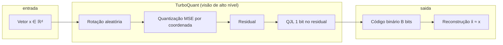

# TurboQuant: do resumo à definição formal (Abstract, Introdução e §1.1)

**Referência:** Zandieh et al., *TurboQuant: Online Vector Quantization with Near-optimal Distortion Rate*, arXiv:2504.19874 (2025).  
Fonte didática local: `transcripts/paper-turboquant-cp.md` (linhas 1–153).

---

## Resumo executivo

A **quantização vetorial (VQ)** trata de representar vetores de alta dimensão em **poucos bits**, aceitando perda controlada (**distorção**). O trabalho posiciona o problema na linhagem da **teoria de codificação de fonte de Shannon**, em que existe um limite informacional entre **taxa** (bits) e **distorção** (por exemplo, erro quadrático médio). O **TurboQuant** propõe algoritmos **oblívios aos dados** e adequados a **uso online**, com taxas de distorção **próximas do ótimo** (a um fator constante nas cotas teóricas; o PDF menciona “\(\sqrt{3\pi}/2\)” e um valor numérico ~2,7 no resumo — há ambiguidade de notação; ver `07-limites-inferiores-e-experimentos.md`, nota sobre \(\sqrt{3\pi}/2 \approx 1{,}53\) vs \(\sqrt{3}\,\pi/2 \approx 2{,}72\)).

A ideia central operacional é: **rotacionar aleatoriamente** os vetores de entrada, o que concentra a massa das coordenadas numa lei tipo **Beta** e aproveita **quase-independência** entre coordenadas em alta dimensão; em seguida aplica-se **quantizadores escalares ótimos** (espírito Lloyd–Max / k-means contínuo) **por coordenada**.

Um ponto crucial: quantizadores ótimos em **MSE** tendem a **viesar** estimativas de **produto interno**. O TurboQuant usa uma **abordagem em dois estágios**: (1) quantização com boa taxa–distorção em MSE; (2) **1 bit por coordenada** no **residual** via transformada **Quantized Johnson–Lindenstrauss (QJL)**, obtendo estimador de produto interno **não viesado** e com baixa distorção.

Aplicações destacadas: **compressão do cache KV** em LLMs e **busca por vizinho mais próximo** em bases vetoriais (com ganhos de recall e tempo de indexação).

---

## Motivação (KV cache, busca por vizinhos e bases vetoriais)

### Por que VQ importa para LLMs e infraestrutura

Modelos de linguagem de grande escala escalam em **tamanho** e **comprimento de contexto**. Na inferência, há pressão de **memória** e **latência**, em grande parte por **comunicação** (por exemplo, entre HBM e SRAM em aceleradores, ou em clusters). **Quantizar pesos e ativações** reduz custo e largura de banda. Como o núcleo computacional envolve **produtos internos** entre ativações e pesos, esquemas de quantização buscam preservar esses produtos com fidelidade aceitável.

### Cache KV em transformers decodificadores

Em transformers **decoder-only**, cada token gerado mantém representações **Key** e **Value** das camadas de atenção. O **cache KV** cresce com **número de camadas**, **cabeças de atenção** e **tamanho do contexto**. Para modelos de contexto longo, o cache torna-se um **gargalo de memória e velocidade**. Comprimir o cache sem destruir a **estrutura geométrica** dos embeddings — isto é, **distâncias e produtos internos** que alimentam o mecanismo de atenção — é central para não degradar a qualidade. A VQ é enquadrada no paper como framework natural para isso.

### Bases vetoriais e busca aproximada (ANN)

**Nearest neighbor (NN)** com similaridade por **produto interno** ou **cosseno** é pilar de **vector databases**, usadas em **RAG** e recuperação de informação. Técnicas como **product quantization (PQ)** comprimem vetores da base, economizam RAM e permitem **estimar rapidamente** produtos internos com vetores consulta, viabilizando ANN em escala. O paper contrasta métodos que ou são lentos / pouco “amigáveis” a vetorização em aceleradores, ou têm **limites de distorção subótimos** em função da largura de bit — lacuna que o TurboQuant pretende fechar, com ênfase em **online** e **GPU-friendly**.

### Contexto teórico: taxa e distorção (Shannon)

Na **teoria taxa–distorção** (ramo da teoria da informação associado a Shannon), pergunta-se: qual é a **menor taxa** (bits por amostra ou por símbolo) para representar uma fonte com **distorção média** não superior a um dado nível? A função **R(D)** (ou, equivalentemente, a **curva distorção–taxa** D(R)) delimita o melhor compromisso possível **em princípio**, para uma medida de distorção escolhida (no caso euclidiano, frequentemente **erro quadrático**). Vetores quantizadores de bloco podem ser vistos como **códigos de fonte com perdas**; resultados clássicos (Zador, teoria de alta resolução, etc.) conectam o desempenho operacional de quantizadores ao comportamento predito por essas funções. Isso justifica o vocabulário do abstract: **“near-optimal distortion rate”** — ou seja, perto do limite informacional para a distorção considerada.

---

## Definição formal (equações explicadas passo a passo)

O objetivo é definir um mapa de **quantização**:

$$
Q : \mathbb{R}^d \to \{0,1\}^B
$$

que mapeia um vetor \(d\)-dimensional numa **string binária** de **\(B\)** bits. Se \(B = b \cdot d\) com \(b \ge 0\), então **\(b\)** é a **largura média de bits por coordenada** (bits por dimensão real codificada).

É exigido também um mapa inverso de **dequantização**:

$$
Q^{-1} : \{0,1\}^B \to \mathbb{R}^d
$$

que **reconstrói** um vetor em \(\mathbb{R}^d\) a partir do código. Como \(Q\) não é bijetora, a reconstrução é **com necessidade aproximada** — o processo é **lossy** (com perda).

**Cenário:** não se assume uma distribuição específica dos dados; o paper considera **pior caso** sobre vetores \(x, y \in \mathbb{R}^d\). O quantizador pode ser **aleatorizado**; assim, \(Q(x)\) e \(Q^{-1}(Q(x))\) são **variáveis aleatórias** e as métricas de distorção devem ser entendidas como **esperanças** sobre essa aleatoriedade.

### Equação (1) — Distorção MSE

$$
D_{\text{mse}} := \mathbb{E}_Q\bigl[\lVert x - \hat{x}\rVert_2^2\bigr],
\qquad \hat{x} := Q^{-1}(Q(x)).
$$

- **\(x\)**: vetor original.  
- **\(Q(x)\)**: representação compacta em bits.  
- **\(\hat{x} := Q^{-1}(Q(x))\)**: vetor reconstruído (usado nas equações acima).  
- **\(\lVert x - \hat{x} \rVert_2^2\)**: soma dos quadrados das diferenças por coordenada — erro quadrático euclidiano total.  
- **\(\mathbb{E}_Q[\cdot]\)**: média sobre moedas/tabelas aleatórias do esquema (por exemplo, rotação aleatória, arredondamentos estocásticos se houver).  

Interpretação: **quão longe**, em média quadrática, fica a reconstrução do vetor verdadeiro.

### Equação (2) — Distorção no produto interno

Com o mesmo \(\hat{x} = Q^{-1}(Q(x))\):

$$
D_{\text{prod}} := \mathbb{E}_Q\Bigl[\bigl(\langle y, x\rangle - \langle y, \hat{x}\rangle\bigr)^2\Bigr].
$$

- **\(\langle y, x\rangle\)**: produto interno verdadeiro (escalar).  
- **\(\langle y, \hat{x}\rangle\)**: produto interno usando o vetor quantizado–reconstruído no lugar de \(x\).  
- O quadrado da diferença mede o **erro quadrático na forma linear** induzida por \(y\).

Interpretação: mesmo que \(\hat{x}\) esteja “perto” de \(x\) em norma \(\ell_2\), o erro em \(\langle y, \hat{x}\rangle\) depende de **alinhamento** entre **\(y\)** e o vetor erro **\(x - \hat{x}\)**. Por isso **minimizar MSE** (erro isotrópico médio na reconstrução) **não equivale** a minimizar o erro de produto interno para **todos** os \(y\) de interesse — coerente com literatura que separa **erro de norma** e **erro de direção** em MIPS.

Meta do desenho: para cada largura de bit \(b\), obter quantizadores **\(Q_{\text{mse}}\)** e **\(Q_{\text{prod}}\)** com **limites de distorção fortes** para (1) e (2), respectivamente, com **eficiência computacional**.

---

## Requisito de não-viés

Para quantizadores voltados a **produto interno**, o paper impõe:

$$
\mathbb{E}_Q\bigl[\langle y, \hat{x}\rangle\bigr] = \langle y, x\rangle,
\qquad \hat{x} = Q^{-1}(Q(x)).
$$

Leitura palavra a palavra:

- **Esperança sobre o randomizado do quantizador** do escalar \(\langle y, \hat{x}\rangle\) deve coincidir com o valor exato \(\langle y, x\rangle\).  
- Ou seja, \(\langle y, \hat{x}\rangle\) é um **estimador não viesado** de \(\langle y, x\rangle\).

**Por que isso importa?** Em pipelines que acumulam estimativas (atenção, agregações, scores de ranking), **viés sistemático** pode deslocar logits, alterar softmax e degradar calibragem; **não-viés** é propriedade desejável em muitas aplicações, embora não substitua a necessidade de **baixa variância** (controlada por \(D_{\text{prod}}\)).

O paper observa explicitamente que quantizadores **ótimos ou muito bons em MSE** podem **introduzir viés** na estimativa de produto interno; daí o **segundo estágio** (QJL de **1 bit** no **residual** após a etapa MSE), que corrige o viés mantendo distorção controlada.

---

## Primitivas Quant / DeQuant

Dado um conjunto de **\(n\)** vetores reais \(x_1, \ldots, x_n \in \mathbb{R}^d\), o paper define duas operações de infraestrutura:

| Primitiva | Entrada | Saída / efeito |
|-----------|---------|----------------|
| **Quant** | Dataset \(\{x_i\}\) | Computa eficientemente os códigos \(Q(x_1), \ldots, Q(x_n)\) (strings de \(B\) bits ou estrutura equivalente em memória). |
| **DeQuant** | Representação quantizada armazenada | Para qualquer índice \(i \in [n]\), reconstrói \(\hat{x}_i = Q^{-1}(Q(x_i))\) de forma eficiente. |

**Leitura sistêmica:**  
- **Quant** é o caminho **compressão / offline ou streaming** — o que se faz ao ingerir embeddings (por exemplo, ao armazenar chaves/valores ou vetores de índice).  
- **DeQuant** é o caminho **reconstrução aproximada** — o que se usa na inferência ou na fase de busca quando se precisa mapear bits de volta a \(\mathbb{R}^d\) (ou computar produtos internos via representação reconstruída, conforme a implementação).

No cenário **online** (como cache KV), **Quant** deve ser **rápido e paralelizável**; **DeQuant** (ou avaliação de produtos internos a partir dos códigos) deve ser **compatível com kernels vetoriais** em GPU — requisito que o próprio introduction usa para distinguir o TurboQuant de métodos com computação lenta ou pouco vetorizável.

---

## Síntese alinhada ao arXiv:2504.19874

1. **Abstract:** VQ fundamentada em Shannon; TurboQuant trata **MSE** e **erro de produto interno**; rotação aleatória + Beta + quantização escalar por coordenada; **MSE + QJL no residual** para **não-viés** em produto interno; limites próximos ao ótimo informacional; experimentos em **KV cache** (≈ neutralidade com 3,5 bits/canal; degradação marginal com 2,5) e **NN search** (melhor recall que PQ, indexação quase zero).  
2. **Introduction:** motivação LLM, KV, vector DBs, RAG; trade-offs de métodos existentes; núcleo **dois estágios** (MSE ótimo, depois correção de viés / produto interno).  
3. **§1.1:** definição formal de \(Q\), \(Q^{-1}\), \(B = bd\), distorções (1)–(2), **restrição de não-viés**, primitivas **Quant** e **DeQuant**.

---

*Documento didático derivado do texto do paper nas linhas indicadas e de referências gerais de teoria taxa–distorção, VQ (codebook/centróides/k-means) e distinção entre otimização para MSE versus preservação de produto interno em busca aproximada.*