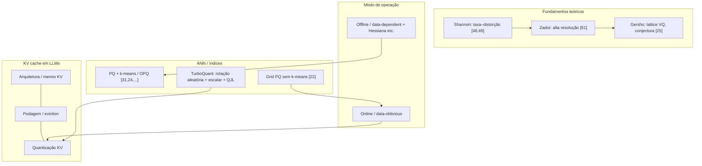

## 1.2 Trabalhos relacionados

### Fundamentos da quantização vetorial (Shannon → Zador → Gersho)

A teoria de **quantização vetorial (VQ)** nasce da **teoria da taxa de distorção** de Shannon: há um limite fundamental à menor distorção alcançável por códigos de bloco (quantizadores vetoriais), expresso pela **função taxa–distorção de Shannon**, que depende da estatística da fonte e da medida de distorção (por exemplo, erro quadrático médio) [48, 49].

Em **1963**, **Zador** avançou esse quadro com métodos de **alta resolução**, obtendo a **função taxa–distorção operacional** no limite de altas taxas para quantização de taxa fixa, alinhada à de Shannon [61]. O trabalho de Zador é **teoricamente central**, mas não foca em algoritmos diretamente implementáveis.

**Gersho** consolidou e popularizou a teoria de alta resolução: simplificou resultados no estilo Zador, introduziu **quantização vetorial em reticulados (lattice VQ)** e formulou uma **conjectura** que orientou grande parte da pesquisa subsequente em VQ [25]. Mesmo assim, na prática, o encaminhamento mais ingênuo — busca por vizinho mais próximo em código completo — permaneceu **custoso**, o que limitou a adoção inicial de VQ em sistemas reais.

### Online vs. offline (dependente de dados)

Uma linha de corte importante para aplicações como **KV cache** é:

| Ideia | Definição operacional | Implicação |
|--------|------------------------|------------|
| **Online / data-oblivious** | Quantização aplicável **imediatamente**, sem ajuste fino nem calibração específicos aos dados de treino ou ao lote atual [16, 8, 41, 47, 28] | Adequada a **fluxos dinâmicos** e a tensores que mudam a cada passo de inferência. |
| **Offline / data-dependent** | Exige **pré-processamento pesado** e aprendizado para adaptar o mapa de quantização à distribuição dos dados [37] | Pode ser forte em acurácia estática, mas é **pouco compatível** com cenários em que os vetores não estão fixos com antecedência. |

Métodos que usam **informação de segunda ordem (Hessiana)** para afinar a quantização — como em linhas de **quantização pós-treino** amplamente citadas [20, 39, 57, 13] — ilustram o polo **offline**: custo de preparação alto e, em alguns casos, pós-processamento adicional, o que os afasta de pipelines puramente online no sentido do TurboQuant.

### Paisagem da compressão do cache KV

O cache de chaves e valores (KV) cresce com **profundidade do modelo**, **número de cabeças** e **comprimento de contexto**, tornando-se gargalo de **memória** e, indiretamente, de **latência** (por exemplo, tráfego HBM/SRAM em aceleradores).

Três famílias aparecem com frequência na literatura recente (incluindo revisões e trabalhos de 2024–2025):

1. **Mudanças arquiteturais** que reduzem quantos pares KV precisam ser armazenados [50, 6, 15].  
2. **Podagem / eviction** de tokens considerados menos críticos [11, 66, 40, 58, 64, 38, 29].  
3. **Quantização direta do KV**, com várias propostas voltadas a bits baixos e trade-offs qualidade–memória [60, 59, 17, 33, 65, 41, 30, 36, 28].

Entre as abordagens **data-oblivious** para KV, o próprio TurboQuant destaca **PolarQuant** [28] e, para o núcleo de **produto interno não enviesado**, o **QJL** (quantização tipo Johnson–Lindenstrauss em 1 bit), que fornece estimativas não enviesadas de produto interno **sem** adaptação aos dados de entrada [62] — componente que o TurboQuant incorpora no quantizador voltado a distorção de produto interno.

*(Para um mapa mais amplo de gestão de KV cache, incluindo quantização junto de outras técnicas, há surveys recentes no tema, por exemplo [2412.19442](https://arxiv.org/abs/2412.19442).)*

### Product Quantization clássica (Jégou et al.) vs. PQ em grade [22]

**Product Quantization (PQ)** — popularizada por **Jégou, Douze e Schmid** para busca aproximada de vizinhos mais próximos — decompõe o espaço em um **produto cartesiano** de subespaços de baixa dimensão e quantiza **cada subespaço** separadamente; os vetores viram **códigos curtos** (índices por subespaço), o que comprime o índice e permite estimar distâncias/produtos de forma eficiente [31]. Variações como **OPQ** refinam os codebooks com técnicas relacionadas a **k-means** na fase de indexação [24, 56, 27].

**Limitação para cenário online:** muitos métodos de PQ na literatura de ANN constroem codebooks via **k-means (ou variantes)** durante a indexação [31, 9, 24, 56, 27], o que implica **pré-processamento extensivo** e torna o esquema **mal adaptado** a quantização **online** em que não há fase de “indexação” sobre um dataset fixo.

**PQ baseada em grade (grid PQ)** — **Gao et al.** [22] — propõe **eliminar** esse pré-processamento projetando uma **malha uniforme** na esfera unitária e buscando a projeção mais próxima do ponto. Assim, evita-se o treino de codebooks com k-means. Porém, no próprio texto do TurboQuant, essa linha é criticada sob dois ângulos: as **garantias teóricas** são consideradas **subótimas** (com desempenho prático melhor do que a análise sugere), e o algoritmo de **projeção na grade + busca binária** é **lento** e **pouco eficiente em GPU**, pela **falta de vetorização** e paralelismo em massa [22].

---

## Mapa do estado da arte (resumo visual)

---

## Tabela comparativa

| Abordagem | Online / data-oblivious | Depende de k-means ou treino pesado de codebook? | Amigável a GPU (vetorização, paralelismo) | Notas |
|-----------|-------------------------|---------------------------------------------------|------------------------------------------|--------|
| PQ clássica (Jégou et al.) [31] e OPQ [24] | Tipicamente **offline** (fase de indexação) | **Sim** — construção de sub-codebooks (k-means e afins) | Boa em pipelines **batch** otimizados para ANN; não é o foco “zero indexação” online | Padrão ouro em compressão de índice para ANN com dataset fixo |
| Grid PQ [22] | Mais próxima de **online** (sem pré-treino de codebook) | **Não** (malha fixa na esfera) | **Fraca** no relato do TurboQuant: projeção + busca binária pouco vetorizáveis | Elimina pré-processamento, mas custo algorítmico e GPU são problemas |
| Métodos PTQ com Hessiana (ex.: GPTQ) [20] etc. | **Offline** para pesos | **Sim** (calibração, otimização) | Variável | Ilustram o custo do polo dependente de dados |
| QJL [62] | **Sim** (data-oblivious) | **Não** | Depende da implementação; usado como primitive de IP | Estimativa **não enviesada** de produto interno |
| **TurboQuant** [este artigo] | **Sim** | **Não** no sentido de k-means por vetor — usa **codebooks escalares pré-computados** (Max–Lloyd em 1D para Beta) + rotação aleatória | Projetado como **acelerador-friendly** (quantização coordenada a coordenada, paralelizável) | Une taxa de distorção próxima do ótimo com uso online; segunda etapa com QJL no residual para IP não enviesado |

---

## Como o TurboQuant se posiciona

1. **Teoria:** Ancora-se na linha Shannon → Zador → Gersho, mas o objetivo é **algoritmo executável** com **taxa de distorção** próxima dos limites informacionais, não apenas análise assintótica [48, 49, 61, 25].

2. **Modo:** É explicitamente **online e data-oblivious**, em contraste com PQ que precisa de **fase de indexação** com k-means [31, 24, 56, 27] e com métodos **dependentes de dados** que exigem calibração pesada [37, 20, 39, 57, 13].

3. **vs. Grid PQ [22]:** Ambos buscam escapar do **k-means offline**, mas o TurboQuant argumenta que a solução em grade é **lenta** e **pouco adequada a GPUs**; o TurboQuant aposta em **rotação aleatória** (concentração das coordenadas, independência aproximada em alta dimensão) + **quantizadores escalares ótimos** pré-calculados, alcançando distorção controlada com estrutura **vetorizável**.

4. **KV cache:** Situa-se na família da **quantização direta do KV** junto de trabalhos recentes [60, 59, 17, 33, 65, 41, 30, 36, 28], diferenciando-se por **não exigir adaptação aos dados** e por combinar otimização de **MSE** com estágio **QJL** no residual para **produto interno não enviesado** [62] — adequado a preservar geometria (distâncias/produtos) sob bits reduzidos.

5. **Produto:** O artigo posiciona o TurboQuant como resposta ao trade-off clássico: métodos existentes ou **não são amigáveis a aceleradores** em tempo real, ou têm **garantias de distorção** menos favoráveis; o TurboQuant visa **leveza**, **aplicação online** (crítica para KV) e **compatibilidade com hardware moderno**, com experimentos em **quantização de KV** e em **ANN** (recall vs. tempo de indexação).

---

**Referências citadas no texto do TurboQuant (trecho 1.2):** [8, 9, 11, 13, 15, 16, 17, 20, 22, 24, 25, 28–31, 33, 36–41, 47, 48, 49, 50, 56–61, 64–66] e demais numeração interna do PDF para KV e QJL [60, 59, 62, etc.].

---

*Documento elaborado como texto de **technical writing** em PT-BR, com base em `paper-turboquant-cp.md` (§1.2, linhas 154–189) e pesquisa complementar (PQ Jégou et al.; quantização online/data-oblivious; landscape de KV e surveys recentes).*