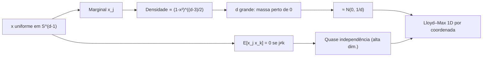

# Lemma 1 no TurboQuant: coordenadas na esfera, Beta, Gaussiana em alta dimensão e quantização escalar

## 1. Onde isso entra no paper (§1.3, parte MSE)

O algoritmo MSE do TurboQuant faz o seguinte encadeamento conceitual:

1. **Rotação aleatória** do vetor de entrada (ortogonal aleatória, tipicamente Haar), para não depender de um eixo “mau” fixo.
2. **Marginal de cada coordenada** da imagem na esfera unitária passa a ser a mesma de uma coordenada de um ponto **uniforme** em \(S^{d-1}\) — isso é exatamente o **Lemma 1**.
3. Essa marginal é uma **Beta em forma de densidade** (ver abaixo); em **\(d\) grande**, por concentração / teorema central do limite, ela fica **parecida com \(\mathcal{N}(0, 1/d)\)**.
4. **Coordenadas distintas** ficam **quase não correlacionadas** e, em um sentido mais forte útil para análise, **quase independentes** — o paper enfatiza que “vai além da correlação”.
5. Com isso, o desenho de um **quantizador escalar ótimo por coordenada** (Lloyd–Max em 1D, codebook pré-computado) **quase não paga** por ignorar correlações entre coordenadas: o erro total de MSE continua próximo do que a teoria permite.

Trecho central da visão MSE no próprio paper (§1.3):

> **MSE Optimized TurboQuant.** Our first VQ algorithm is designed to minimize MSE distortion defined in Eq. (1). To achieve this, we apply a random rotation to the input vectors, thereby inducing a Beta distribution on each coordinate, irrespective of the input vectors themselves. In high dimensions \(d\), the distribution of each coordinate converges to a Gaussian distribution \(\mathcal{N}(0, 1/d)\) due to concentration of measure and the central limit theorem. Furthermore, any two distinct coordinates become nearly uncorrelated and, more importantly, almost independent (a deeper result that goes beyond just correlation). This near-independence is a crucial aspect that simplifies our quantization design. It allows us to quantize each coordinate using optimal scalar quantization, disregarding interactions or correlations between different coordinates, while still achieving near-optimal distortion.

*Referência:* `paper-turboquant-cp.md`, §1.3 (por volta das linhas 191–199 do extrato local).

**Nota:** Em algumas transcrições do PDF aparece `N(1, 1/d)` em vez de média zero; o Lema 1 no manuscrito afirma convergência a **`N(0, 1/d)`**, coerente com a simetria da esfera.

---

## 2. Lemma 1 (formalização)

Para \(x\) uniforme em \(S^{d-1} \subset \mathbb{R}^d\), a densidade da coordenada \(x_j\) em \([-1,1]\) é a dada no **Lema 1** do artigo:

**Lema 1** (distribuição marginal de uma coordenada na esfera). Se \(x\) é uniforme em \(S^{d-1}\), então para qualquer \(j \in [d]\) a coordenada \(x_j\) tem densidade

$$
f_X(x) = \frac{\Gamma(d/2)}{\sqrt{\pi}\,\Gamma((d-1)/2)} \,(1-x^2)^{(d-3)/2}, \qquad x \in [-1,1].
$$

Em altas dimensões, esta densidade converge à normal \(\mathcal{N}(0,\,1/d)\) (no texto: \(f_X(\cdot) \to \mathcal{N}(0, 1/d)\)).

*Referência:* `paper-turboquant-cp.md`, Lema 1 (por volta das linhas 356–369).

Em uma linha:

\[
f_X(x) \propto (1-x^2)^{\frac{d-3}{2}}, \quad x \in [-1,1].
\]

Isso é a “cara Beta” da história: \(x_j^2\) (com o sinal separado por simetria) está ligado a uma **Beta** nos parâmetros usuais; em textos de estatística costuma aparecer na forma equivalente com a função beta \(B(\cdot,\cdot)\), por exemplo densidade em \(x\) proporcional a \((1-x^2)^{n/2-1}\) para a \(n\)-esfera em \(\mathbb{R}^{n+1}\) (convenções de dimensão variam entre \(n\) e \(d\)).

---

## 3. Intuição geométrica (ASCII)

```
        eixo j
          ^
          |
    +1 ---|--- -1    fatia em x_j = t: é uma "equador" inclinado,
          |          uma esfera de dimensão (d-2) de raio √(1-t²)
    ------o------> outras coordenadas
          |
```

- **Fatiar** a esfera por um valor fixo da coordenada \(x_j = t\): o conjunto restante é uma **\((d-2)\)-esfera** de raio \(\sqrt{1-t^2}\) (teorema de Pitágoras).
- A densidade marginal é “área da fatia” / “área total”, com o jacobiano radial — daí o fator \((1-t^2)^{(d-3)/2}\): quanto maior \(d\), mais **penaliza** ficar longe de \(t=0\).

O próprio paper resume o esboço de prova assim: \(f_X(x)\) é o quociente entre a **área** de uma esfera de raio \(\sqrt{1-x^2}\) em dimensão \(d-1\) e o **volume** da esfera unitária em dimensão \(d\), corrigido pelo fator jacobiano \(1/\sqrt{1-x^2}\) (teorema de Pitágoras). Após simplificar, obtém-se de novo a forma fechada do Lema 1:

$$
f_X(x) = \frac{\Gamma(d/2)}{\sqrt{\pi}\,\Gamma((d-1)/2)} \,(1-x^2)^{(d-3)/2}.
$$

*Referência:* `paper-turboquant-cp.md`, prova do Lema 1 (por volta das linhas 370–398).

---

## 4. Diagrama mental: do ponto uniforme à “faixa gaussiana”



---

## 5. Por que converge a \(\mathcal{N}(0, 1/d)\)? (prova esboçada, linguagem acessível)

**Passo A — Variância correta.**  
Por simetria esférica, \(\mathbb{E}[x_j]=0\) e \(\mathbb{E}[\|x\|^2]=1 = \sum_{k=1}^d \mathbb{E}[x_k^2]\). Como todas as coordenadas têm a mesma distribuição, \(\mathbb{E}[x_j^2]=1/d\). Logo \(\mathrm{Var}(x_j)=1/d\). A Gaussiana limite **tem** que ser \(\mathcal{N}(0,1/d)\) (não \(\mathcal{N}(0,1)\)).

**Passo B — Concentração.**  
Escreva a densidade no pico \(x=0\): o expoente \((d-3)/2\) faz com que a massa se concentre em uma faixa de largura típica **\(O(1/\sqrt{d})\)** em torno de 0. Isso é o fenômeno geométrico clássico: em alta dimensão, quase toda a medida na esfera está perto do “equador” relativo a qualquer eixo — funções coordenadas são **Lipschitz** e concentram (concentration of measure na esfera).

**Passo C — Aparência gaussiana.**  
Dentro dessa faixa estreita, \(\log f_X(x)\) pode ser aproximado por uma parábola em torno de 0 (expansão de Taylor / analogia com entropia máxima sob variância fixa), o que leva a uma densidade próxima da Gaussiana com mesma variância. Formalmente costuma aparecer como **limite de uma Beta reparametrizada** ou argumentos de **teorema local central limite**.

**Passo D — Escala útil.**  
A variável **\(\sqrt{d}\,x_j\)** tende a **\(\mathcal{N}(0,1)\)** — isso é o que se costuma plotar para ver a campainha padrão.

---

## 6. “Quase independência” das coordenadas: o que significa e por que importa

- **O que é fácil:** para \(x\) uniforme em \(S^{d-1}\), se \(j \neq k\),  
  \(\mathbb{E}[x_j x_k]=0\)  
  (ortogonalidade das coordenadas sob rotações — covariância zero).

- **O que é mais forte:** **covariância zero não implica independência.** Ainda assim, em **\(d\) grande**, a distribuição **conjunta** de \((x_j, x_k)\) (e mais geralmente qualquer conjunto fixo de coordenadas) aproxima-se de um produto de marginais — por isso o paper fala de **quase independência**, não só “baixa correlação”.

**Ligação com rotação aleatória:** se \(\Pi\) é ortogonal Haar e \(x\) é vetor unitário fixo, \(\Pi x\) é **uniforme** em \(S^{d-1}\). Então **cada coordenada** \((\Pi x)_j\) tem exatamente a marginal do Lemma 1, **independentemente** do \(x\) original (é isso que “tira o pior caso alinhado com um eixo”).

---

## 7. Conexão com quantização escalar por coordenada

Ideia em cadeia:

| Passo | Conteúdo |
|--------|-----------|
| Rotação aleatória | Empurra o vetor para uma posição **típica** na esfera (uniforme na superfície). |
| Lemma 1 | Todas as coordenadas têm a **mesma** marginal 1D bem definida. |
| Alta dimensão | A marginal fica próxima de uma **normal** com média **0** e variância **1/d** (notação: *N*(0, 1/d)); as marginais ficam **alinhadas** entre coordenadas. |
| Quase independência | O erro de tratar o vetor como **d** problemas 1D em vez de um quantizador vetorial conjunto é **pequeno**. |
| Lloyd–Max 1D | Solução clássica do **k-means contínuo** em 1D para aquela marginal — codebook pré-computável. |

Ou seja: **não é** que quantizar coordenadas separadamente seja ótimo para qualquer fonte vetorial arbitrária; é que **depois da rotação aleatória**, a fonte induzida nas coordenadas fica **quase produto**, então um quantizador **separável** fica **próximo do ótimo** em MSE.

---

## 8. Pitfalls e armadilhas conceituais

1. **Correlação zero \(\neq\) independência.**  
   Coordenadas em \(S^{d-1}\) têm correlação zero mas **não** são independentes em dimensão finita; o argumento assintótico é que fica **quase** produto quando \(d \to \infty\) (ou em análise “por dimensão alta” fixa mas grande).

2. **`d` pequeno.**  
   Para \(d\) baixo, a marginal é visivelmente **não gaussiana** (ex.: em \(d=3\), a primeira coordenada é **uniforme** em \([-1,1]\)). A aproximação gaussiana é **assintótica em \(d\)**.

3. **Sem rotação aleatória.**  
   Se o dado real estiver sempre quase alinhado com \(e_1\), quantizar coordenadas separadamente **sem** randomizar pode ser péssimo. O **Haar** é o truque que torna a análise do Lemma 1 aplicável ao vetor **observado na base canônica**.

4. **Norma não unitária.**  
   O paper normaliza \(\|x\|=1\) para a análise; na prática guarda-se a norma em FP e reescala — a geometria da esfera entra depois de **condicionar** na norma.

5. **MSE \(\neq\) produto interno imparcial.**  
   A §1.3 também avisa: quantizadores ótimos em MSE podem **viesar** estimativas de \(\langle y,x\rangle\); daí a segunda fase com QJL no residual. Não confundir o argumento do Lemma 1 (MSE / marginais) com o desenho do quantizador de produto interno.

---

## 9. Mini-resumo em uma frase

**Lemma 1** diz que uma coordenada de um ponto uniforme na esfera tem densidade tipo-Beta \((1-x^2)^{(d-3)/2}\); em **alta dimensão** isso se **concentra** e parece **\(\mathcal{N}(0,1/d)\)**; as coordenadas ficam **quase independentes**, o que **justifica** usar **quantizadores escalares ótimos por canal** após **rotação aleatória**, mantendo o MSE global próximo do que a teoria permite.

---

Se quiser, no próximo passo dá para amarrar isso numericamente (plot de \(f_X\) para \(d=3,10,100\) e de \(\sqrt{d}\,x_j\) vs \(\mathcal{N}(0,1)\)) ou ao Teorema 1 do mesmo paper (constante \(\sqrt{3\pi}/2\) etc.).