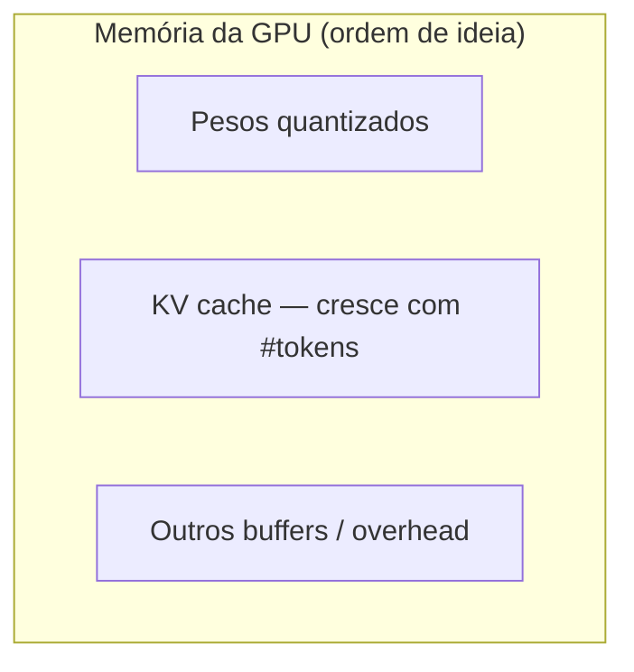
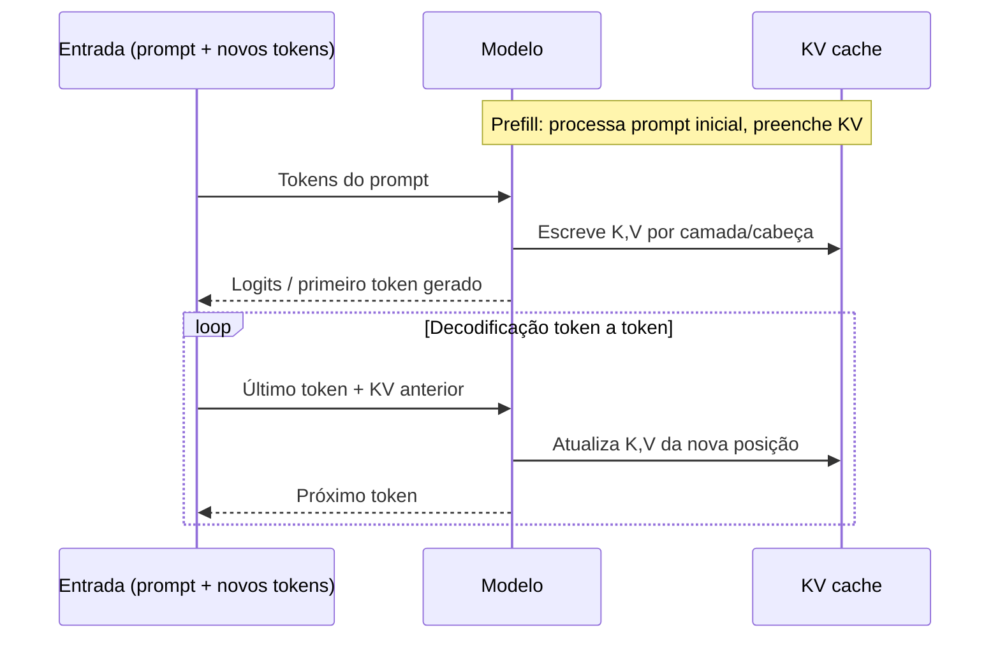
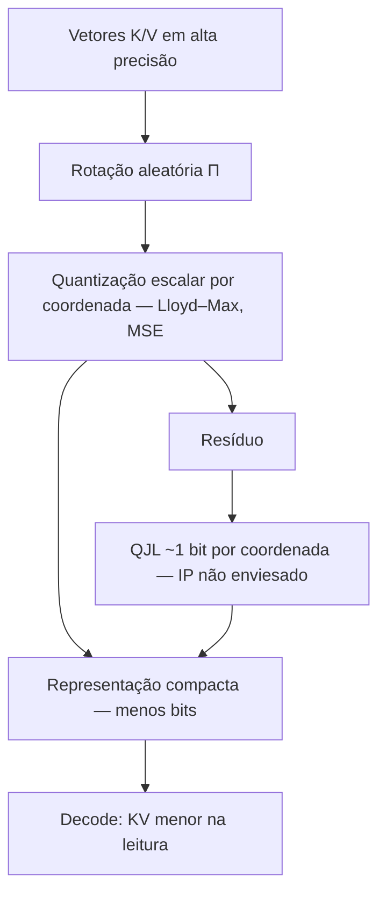

# TurboQuant: compressão de estado de atenção para LLMs — síntese técnica e panorama de evidências

**Referências:** transcrição do vídeo [YouTube: `bX2hsi253QY`](https://www.youtube.com/watch?v=bX2hsi253QY); artigo *TurboQuant: Online Vector Quantization with Near-optimal Distortion Rate* ([arXiv:2504.19874](https://arxiv.org/abs/2504.19874)) — Google Research, NYU, Google DeepMind.

**Nota terminológica:** em fala automática, “KVCash” corresponde ao **KV cache** (cache de chaves e valores da atenção). **Não** é **KVM** (Kernel-based Virtual Machine). Este documento usa **KV cache** de forma consistente. O nome do método é **TurboQuant** (Q maiúsculo), como no preprint.

---

## Resumo executivo

Grandes modelos de linguagem (LLMs) custam memória por dois motivos que se somam: **pesos do modelo** e **estado de contexto**, em especial o **KV cache** durante a geração autoregressiva. A **quantização** reduz bits por número, diminuindo uso de VRAM, mas introduz **erro de representação**.

O **TurboQuant** (paper) é um esquema de **quantização vetorial online** e **data-oblivious** (sem calibração em dados de produção): usa **rotação aleatória** para distribuir coordenadas de forma tratável, **quantização escalar** (estilo Lloyd–Max) por coordenada e, para produto interno sem viés, um **segundo estágio** com transformada **QJL** (Quantized Johnson–Lindenstrauss, ~1 bit) no **resíduo** após quantizar em MSE com $b-1$ bits. Objetivo teórico: taxas de distorção **próximas dos limites de Shannon** (a menos de constantes explícitas no artigo).

**O vídeo** explica a ideia com analogia **polar** (módulo + direção) e menciona “PolarQuant” + correção de ~1 bit — intuição útil, mas **não substitui** o enunciado matemático do preprint (ver §4.4).

Ainda em fase de **pesquisa e implementações experimentais** na comunidade, há **divergência** entre alegações de **velocidade** em divulgação e medições preliminares — especialmente no **prefill** — enquanto **economia de memória** no KV costuma ser a parte mais reproduzível cedo.

**Checklist de cobertura deste texto:** VRAM vs RAM; pesos + contexto; quantização de pesos vs KV; autoregressão e atenção (Q, K, V); KV cache e por que cresce; prefill vs decode; o que o paper afirma vs o que o vídeo simplifica; evidências comunitárias e métricas para julgar; limitações paliativas (resumo/janela); leituras e links.

---

## 1. Por que VRAM vira gargalo

### 1.1 O que está em jogo

Em inferência local acelerada por GPU, os pesos e buffers acessados intensivamente tendem a residir na **VRAM** (memória de vídeo). Os núcleos da GPU leem essa memória com **largura de banda** muito maior que ir e voltar à **RAM** do sistema — por isso “encaixar o modelo na GPU” é o cenário típico de melhor **latência** e **throughput**. Se o modelo não couber inteiro na VRAM, runtimes costumam **paginar** ou usar **CPU/RAM** para o que não cabe, com custo alto de latência (troca host↔device).

**Analogia:** pense na VRAM como a **bancada imediata** de um mecânico: ferramentas e peças do serviço atual precisam estar ao alcance. Se metade do motor ficar na oficina vizinha (RAM), cada etapa vira ida e volta — o serviço desacelera.

### 1.2 “Caber” não basta: pesos + contexto

Dois componentes competem pela mesma memória:

| Componente | O que armazena | Ordem de ideia (depende de arquitetura) |
|------------|----------------|----------------------------------------|
| **Pesos** | Parâmetros treinados (matrizes das camadas) | Cresce com tamanho do modelo e precisão (FP16, INT8, etc.) |
| **Estado de contexto** | Principalmente **KV cache** ao gerar texto longo | Cresce com **comprimento de contexto** (tokens) e **largura do modelo** |

Exemplo ilustrativo citado na transcrição: um modelo **Qwen 3 (≈27B)** em **Q8** pode ocupar da ordem de **~27,5 GB** só de pesos, mas a **estimativa de uso total** sobe (ex.: **~31,8 GB**) porque entram **overhead** e buffers — e sobretudo porque o **contexto** não é “de graça”.

Com **contexto máximo** da ordem de **262 mil tokens**, a mesma estimativa pode saltar para dezenas de GB adicionais (ex.: **~75 GB** no exemplo do vídeo). Ou seja: **o modelo cabe**, mas **a conversa inteira** pode não caber.

---

## 2. Quantização: menos bits, menos espaço, mais erro

### 2.1 Definição operacional

**Quantização** mapeia valores de alta precisão (ex.: **FP16** para pesos) para representações com **menos bits** (ex.: **8 bits — Q8**, **4 bits — Q4**). Isso **reduz armazenamento** e, em muitos casos, **largura de banda** de leitura.

**Analogia:** medir volume com **garrafa graduada milimetrada** versus **copo só com marcas de 50 ml**. Você economiza “marcas” (bits), mas **arredonda**; em certos recipientes, o líquido **transborda** porque a representação não capturou o valor real — na rede neural, isso vira **degradação de qualidade** (respostas piores, instabilidade, “alucinação” estatística).

### 2.2 Pesos vs KV cache

No ecossistema de ferramentas (ex.: **LM Studio**), é comum separar:

- **Quantização de pesos** do checkpoint (Q8, Q4, etc.).
- **Quantização do KV cache** (por exemplo, **K** e **V** em 16 bits por padrão, depois reduzindo para Q8, Q4).

Na transcrição, ao reduzir **K** e **V** para Q8, a **memória estimada** cai na ordem de **~10 GB cada** nesse cenário de teste — passando de requisitos compatíveis com **80 GB** para algo mais próximo de **64 GB** ou **48 GB**, conforme a combinação de quantizações.

| Configuração (exemplo conceitual) | Efeito típico |
|-----------------------------------|---------------|
| FP16 / alta precisão | Mais memória, frequentemente melhor fidelidade |
| Q8 | Meio-termo; costuma ser usável em muitos modelos |
| Q4 | Compressão forte; risco de queda de qualidade |
| Abaixo de Q4 | Zona de “colapso” prático para muitos casos (citado no vídeo como limiar onde a quantização “vira inútil” com facilidade) |

---

## 3. Como uma LLM gera texto (e por que o KV cache existe)

### 3.1 Geração autoregressiva

A saída é produzida **token a token**. Cada novo token depende dos anteriores — como um **autocompletar** que reavalia a frase inteira até o momento.

**Analogia:** escrever um texto em **pedaços** no telefone: a sugestão da próxima palavra usa **tudo que já está na mensagem**, não o futuro.

### 3.2 Atenção: Q, K, V

Em *Transformers*, a **atenção** relaciona o token atual (e os demais) via projeções:

- **Q (query):** “o que estou procurando combinar agora?”
- **K (key):** “como cada posição anterior se apresenta para ser combinada?”
- **V (value):** “qual é o conteúdo que será misturado conforme os pesos de atenção?”

Na transcrição, a ideia central é: a “próxima palavra” é influenciada por **todas as anteriores**, mas **não** por tokens futuros (em máscaras causais típicas de linguagem).

### 3.3 Por que não recalcular tudo a cada token?

Recalcular **K** e **V** para **todas** as posições a cada passo seria **O(T²)** em trabalho repetido em sequências longas — **caro**. Por isso, em decodificação, armazena-se o que já foi computado: o **KV cache**.

**Consequência:** quanto **maior o contexto**, mais entradas no cache — e, portanto, **mais VRAM**. O custo também escala com **tamanho do modelo** (dimensões de K/V por camada e número de cabeços de atenção).

---

## 4. TurboQuant: ideia central

### 4.1 Intuição do vídeo (ângulo, módulo, “PolarQuant”)

O roteiro usa **linguagem polar**: cada vetor de embedding (por posição/cabeça) como **ponto** em alta dimensão; quantizar “direto” mexe nas coordenadas e gera erro. A narrativa compara isso a guardar **ângulo + módulo** (quão longe do centro e para onde aponta) e ainda uma **correção barata de ~1 bit**, mencionando **PolarQuant** como primeiro estágio.

Isso ajuda a **motivação**, mas **PolarQuant** também é nome de **outro** método de KV (transformação polar, literatura recente). **Não** confundir: o preprint **TurboQuant** não é “só renomear para PolarQuant”.

**Analogia (vídeo):** descrever um endereço como **(x, y)** com GPS que **arredonda** versus dar **ângulo + distância** — uma parametrização pode ser **mais estável** sob quantização grosseira.

### 4.2 O que o artigo arXiv:2504.19874 formula (síntese)

Em termos de paper (Zandieh et al.), o método é **vector quantization online** com estes eixos:

1. **Rotação aleatória** do vetor (ex.: $\Pi \in \mathbb{R}^{d\times d}$ ortogonal): coordenadas no espaço rotacionado tendem a uma **distribuição concentrada** (ligação com **Beta** na esfera); em alta dimensão, coordenadas aproximam comportamento em que **quantização escalar** por coordenada é quase ótima para **MSE**.
2. **Lloyd–Max / k-means 1D** por coordenada: *codebooks* podem ser **pré-computados** para larguras de bit usuais.
3. **Dois objetivos de distorção:** (a) erro quadrático médio (**MSE**) na reconstrução; (b) erro de **produto interno** — com exigência de **estimador não enviesado** para IP, o artigo combina quantização MSE com **$b-1$** bits mais **QJL** (Quantized Johnson–Lindenstrauss, **1 bit** por coordenada no **resíduo**), trabalho anterior dos mesmos autores em QJL para KV.
4. **Limites inferiores** (Shannon, minimax de Yao): o método fica a **fatores constantes** pequenos dos limites informação-teóricos (ordem $4^{-b}$ na taxa).

Em uma frase: **não** é apenas “trocar cartesiano por ângulo”; é **alinhar** o vetor a uma rotação aleatória, **quantizar coordenadas** quase independentemente com boas cotas de MSE e, para IP, **corrigir viés** com QJL no resíduo.

### 4.3 Conexão com a fala “polar + 1 bit”

- **Rotação + magnitude da informação na esfera** compartilham **intuição geométrica** com representações **polares** (direção vs escala).
- O **“~1 bit”** do vídeo mapeia bem no paper ao **estágio QJL** no resíduo (quantização de produto interno com 1 bit/coordenada no residual path).
- **PolarQuant** (outro método) pode ter sido misturado no discurso oral com a ideia de **separar magnitude/direção** — leia o preprint para bater o algoritmo exato.

### 4.4 Resultados experimentais citados no paper (panorama)

| Área | Destaque (alto nível) |
|------|------------------------|
| **KV / LLM** | Uso de **2,5** e **3,5 bits** efetivos por canal (com divisão outlier/não-outlier), relatando neutralidade ou baixa perda em tarefas longas; referência a **LongBench**, *needle-in-a-haystack*, etc. |
| **Vetores / vizinho mais próximo** | Comparações com **PQ** e **RabitQ**: **recall** e tempo de indexação — o cenário não é só “chat”, é **busca** em embeddings altos. |
| **Validação de distorção** | Datasets tipo **DBpedia** em dimensões altas (ex.: *embeddings* 1536/3072) para medir se a distorção observada acompanha as **cotas teóricas**. |

Estes pontos **não** aparecem todos no vídeo; completei a leitura cruzada com o **artigo** para o *double-check*.

### 4.5 Fluxo conceitual (paper + implementação)

---

## 5. Onde a história encontra atrito: velocidade vs compressão

### 5.1 Prefill vs decode

Dois regimes têm custos diferentes:

| Fase | O que é | Por que importa para TurboQuant |
|------|---------|----------------------------------|
| **Prefill / prompt processing** | Processar de uma vez o prompt (código longo, documento, etc.) e **materializar** K/V | Transformações extras (rotação, quantização não trivial, QJL no resíduo) podem **aumentar trabalho** por token |
| **Decode / geração** | Produzir tokens subsequentes lendo **KV compacto** | Menos bytes lidos pode **reduzir pressão** de memória e até acelerar leitura |

**Analogia:** compactar fotos antes de enviar. **Antes de viajar**, você perde tempo **empacotando** (prefill mais pesado). **Depois**, a mala fica menor para carregar (decode mais leve). O balanço só vale se o “empacotamento” não destruir o prazo total.

### 5.2 O que a comunidade reportou (segundo o vídeo)

Pontos levantados **não como verdade final**, mas como **sinais de implementação inicial** (nomes de canais/devs omitidos — vide transcrição original):

- Divulgações mencionando **6–8×** de ganho de velocidade foram **questionadas**: medições comunitárias teriam mostrado **prefill muito mais lento** em alguns experimentos (ex.: ordem de **221 tok/s** vs **7 tok/s** em um benchmark citado), sem ganho claro no decode.
- Implementações em **MLX** (framework Apple para LLMs): **notas de README** falando em build **inicial** e **ausência** de ganhos de velocidade próximos aos citados na divulgação; por outro lado, **redução forte do footprint** do KV (ex.: fatores da ordem de **~4–5×** em configurações citadas) e teste informal de **recuperação no contexto** (*needle*-style) — **potencial**, não prova exaustiva.
- Outros experimentadores relataram **queda de acurácia token-a-token** frente a FP16 ao empilhar pipelines “turbo” incompletos (ex.: **só parte polar** sem o caminho QJL/MSE alinhado ao paper) — compatível com **bug de integração** ou **calibração** ausente, não necessariamente com o limite teórico do artigo.

**Interpretação sensata:** **compressão de KV** e **velocidade de ponta a ponta** são **métricas diferentes**. *Early adopters* frequentemente pagam **overhead de conversão** até **kernels** especializados e integrações (vLLM, llama.cpp, MLX, etc.) estarem maduros.

---

## 6. Tabela comparativa: o que medir antes de celebrar

| Métrica | O que captura | Armadilha comum |
|---------|----------------|-----------------|
| **VRAM pico** | Se o modelo + contexto **cabe** | Ignorar overhead e picos durante prefill |
| **Tokens/s no prefill** | Quão rápido “engole” o prompt | Transformações extras podem **derrubar** essa métrica |
| **Tokens/s no decode** | Fluidez da geração | Melhorar aqui não compensa prefill lento em apps **one-shot** |
| **Qualidade (perplexidade, benchmarks, “needle”)** | Fidelidade semântica | Benchmarks únicos não cobrem **todas** as falhas de quantização |
| **Acurácia token-a-token vs referência** | Alinhamento fino com FP16 | Sensível a bugs de implementação |

---

## 7. Limitações práticas do contexto longo (além de bits)

Mesmo com KV menor, existem **estratégias paliativas** citadas no vídeo quando o contexto não cabe:

- **Resumir** conversas: perde histórico literal; risco de **omissões** e **alucinações** por compressão semântica lossy.
- **Janelas deslizantes:** descartar início ou fim — perda de informação **estrutural** da conversa.

Isso reforça por que **KV mais compacto e fiel** é atrativo: reduz dependência de “gambiarras” que alteram o comportamento do modelo.

---

## 8. Conclusão: estado da arte e leitura crítica

1. **Problema real:** **VRAM** limita **pesos + KV cache**; contexto longo explode o **KV** (e forçar modelo para **RAM/CPU** piora latência).
2. **Quantização** é alavanca clássica; bits menores **sempre** negociam **precisão** — por isso benchmarks cobrem **qualidade** e não só **GB**.
3. **TurboQuant** (arXiv:2504.19874) formaliza **rotação + quantização escalar com cotas + estágio QJL no resíduo** para IP; a **intuição polar** do vídeo **aproxima** a geometria, mas **não** é o enunciado completo.
4. **Divulgação** pode destacar **velocidade**; **implementações iniciais** frequentemente mostram primeiro **memória** ganha e **prefill** mais caro — integração por **framework** e **kernels** ainda em evolução.
5. **KV cache ≠ KVM.** O primeiro é **estado de atenção**; o segundo é **virtualização** — confusão típica de ASR.

### Contexto extra (vídeo): modelos menores e hardware acessível

O fechamento do vídeo lembra que, paralelamente a TurboQuant, ecossistemas como **Qwen** já oferecem modelos **pequenos** (ordem de **0,8B–9B** parâmetros) rodando em **GPUs de consumo** ou até **celular** — útil para não associar “LLM local” só a **70B+** e placas profissionais.

---

## 9. O que ainda faltaria para “fechar o quadro”

- **Reproduzir** números do paper com **código oficial** ou forks **auditados**, no **mesmo** modelo e **mesma** versão de framework.
- Separar métricas: **pico VRAM**, **tok/s prefill**, **tok/s decode**, **qualidade** (benchmarks longos, **perplexidade**, tarefas de recuperação).
- Acompanhar **integrações** (vLLM, Ollama, llama.cpp, MLX) e se o **overhead** de rotação/QJL **diminui** com **fusão de kernels** e otimizações nativas.

---

## Referências rápidas

- Vídeo-fonte: [youtube.com/watch?v=bX2hsi253QY](https://www.youtube.com/watch?v=bX2hsi253QY)
- Transcrição local (Markdown): `transcripts/serie-llm-deep-dive/video-bX2hsi253QY-transcricao-pt.md`
- Paper: [arXiv:2504.19874 — TurboQuant](https://arxiv.org/abs/2504.19874) (Zandieh, Daliri, Hadian, Mirrokni)
- QJL (trabalho relacionado): [arXiv:2406.03482](https://arxiv.org/abs/2406.03482)
- Fundamentos: *Attention Is All You Need*; canais didáticos (ex.: **3Blue1Brown** sobre atenção)
- Conceitos: **VRAM**, **quantização (Q8/Q4/…)**, **KV cache**, **prefill vs decode**, **TurboQuant** (rotação + Lloyd–Max + QJL no resíduo para IP), **LM Studio / MLX** como exemplos de *stack*

---

*Documento estilo blog técnico / nota de divulgação: síntese conceitual + quadros + diagramas. Não substitui o paper, nem benchmarks sem código e **hardware** explícitos. Revisão em profundidade: alinhamento §4 ao preprint e expansão §4.4–§9.*
